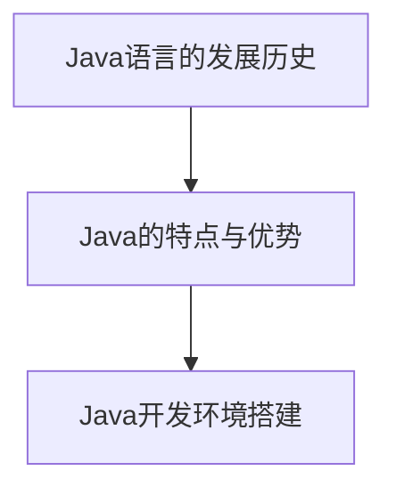
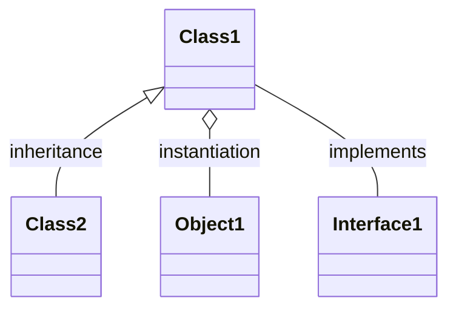
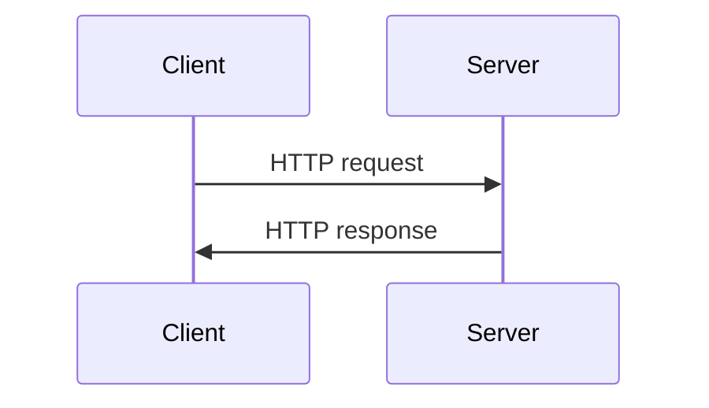

                 

# 《2025腾讯社招Java开发工程师面试指南》

## 关键词
Java开发、面试指南、腾讯社招、编程基础、核心类库、高级特性、Web开发、框架应用、架构设计、项目实战

## 摘要
本文旨在为2025年希望加入腾讯社招的Java开发工程师提供一份全面的面试指南。文章将分为三个主要部分：Java基础与编程技能、Java Web开发、Java开发实践。每个部分详细讲解了Java编程的关键知识点、核心类库、高级特性、Web开发基础、数据库编程、框架应用以及项目实战。通过本文，读者将能够深入了解Java开发的各个方面，为面试做好充分的准备。

## 第一部分: Java基础与编程技能

### 第1章: Java编程基础

#### 1.1 Java概述

Java是一种广泛使用的编程语言，其设计目的是为了简化软件开发过程，具有“一次编写，到处运行”的特性。Java由Sun Microsystems公司于1995年推出，经过多年的发展，已成为全球最流行的编程语言之一。Java语言具有跨平台、安全、多线程、高效率等特点，广泛应用于企业级应用、移动应用、大数据、云计算等领域。

**Mermaid 流程图：**


#### 1.2 Java语法基础

Java语法基础是学习Java编程的基础，包括数据类型、变量与常量、运算符、控制语句等。

- **数据类型**：Java数据类型分为基本数据类型和引用数据类型。
  - **基本数据类型**：byte、short、int、long、float、double、char、boolean。
  - **引用数据类型**：类、接口、数组。

- **变量与常量**：变量是内存中存储数据的标识符，常量是具有固定值的变量。

- **运算符**：Java运算符包括算术运算符、逻辑运算符、关系运算符、赋值运算符等。

- **控制语句**：控制语句包括条件语句（if-else、switch）和循环语句（for、while、do-while）。

**核心算法原理讲解（伪代码）：**
```
// 控制语句示例：if-else
if (condition) {
    // 条件为真时执行的代码
} else {
    // 条件为假时执行的代码
}

// 循环语句示例：for
for (int i = 0; i < n; i++) {
    // 循环体
}
```

#### 1.3 面向对象编程

面向对象编程（OOP）是Java的核心特点之一。它包括类与对象、继承、多态、封装等概念。

- **类与对象**：类是对象的模板，对象是类的实例。
- **继承**：继承是子类继承父类的属性和方法。
- **多态**：多态使得同一个接口可以有多个实现。
- **封装**：封装是将对象的属性和方法封装在内部，外部只能通过公共接口访问。

**核心概念与联系：**


### 第2章: Java核心类库

Java核心类库提供了丰富的功能，包括集合框架、输入输出流、异常处理等。

#### 2.1 Java集合框架

Java集合框架是Java标准库中一个重要的部分，提供了List、Set、Map等接口。

- **List接口**：提供了添加、删除、查询等基本操作。
- **Set接口**：实现了不包含重复元素的集合。
- **Map接口**：将键映射到值，提供了键值对的存储和查询功能。

**伪代码示例：**
```java
List<String> list = new ArrayList<>();
list.add("hello");
list.remove(0);
String element = list.get(0);
```

#### 2.2 输入输出流

Java输入输出流提供了文件操作、节点流、缓冲流等功能。

- **文件操作**：Java通过`File`类和`FileReader`、`FileWriter`类实现文件读写。
- **节点流**：`NodeInputStream`、`NodeOutputStream`用于节点数据的读取和写入。
- **缓冲流**：`BufferedInputStream`、`BufferedOutputStream`提供了缓冲功能，提高了读写效率。

**伪代码示例：**
```java
File file = new File("example.txt");
FileReader fileReader = new FileReader(file);
BufferedReader bufferedReader = new BufferedReader(fileReader);
String line;
while ((line = bufferedReader.readLine()) != null) {
    // 处理行数据
}
bufferedReader.close();
```

#### 2.3 异常处理

异常处理是Java编程中不可或缺的一部分，用于处理运行时错误。

- **异常类**：Java提供了多种异常类，如`IOException`、`SQLException`等。
- **异常处理机制**：通过`try-catch`语句捕获和处理异常。
- **自定义异常**：通过扩展`Exception`类创建自定义异常。

**伪代码示例：**
```java
try {
    // 可能抛出异常的代码
} catch (IOException e) {
    // 处理文件读写异常
} catch (SQLException e) {
    // 处理数据库异常
} finally {
    // 无论是否捕获到异常，都会执行的代码
}
```

### 第3章: Java高级特性

Java高级特性包括多线程编程、网络编程、Java内存模型等。

#### 3.1 多线程编程

多线程编程是Java的一大特色，它使得程序可以并行执行多个任务。

- **线程的概念**：线程是程序执行的基本单位。
- **线程的创建与启动**：通过`Thread`类或实现`Runnable`接口创建线程。
- **同步与锁**：同步用于控制对共享资源的访问，锁（如`synchronized`关键字）用于实现线程间的同步。

**伪代码示例：**
```java
class MyThread extends Thread {
    public void run() {
        // 线程执行的操作
    }
}

MyThread thread = new MyThread();
thread.start();
```

#### 3.2 网络编程

网络编程使得Java程序能够与其他计算机通信。

- **网络基础**：了解TCP/IP协议、HTTP协议等。
- **Socket编程**：通过Socket实现网络通信。
- **HTTP协议**：HTTP协议是Web应用的基础。

**伪代码示例：**
```java
ServerSocket serverSocket = new ServerSocket(8080);
while (true) {
    Socket socket = serverSocket.accept();
    // 处理客户端请求
}
```

#### 3.3 Java内存模型

Java内存模型定义了Java程序在运行时内存的布局和访问规则。

- **主内存与工作内存**：主内存存储变量的值，工作内存存储变量的副本。
- **内存可见性**：一个线程对共享变量的修改必须对其他线程可见。
- **内存原子性**：对基本类型的读和写操作是原子性的。

**核心概念与联系：**
```mermaid
classDiagram
    MainMemory[主内存] --|> WorkingMemory[工作内存] : write back
```

### 第二部分: Java Web开发

#### 第4章: Java Web基础

Java Web开发涉及Web工作原理、Servlet编程、JSP技术等。

#### 4.1 Web应用开发概述

Web应用开发包括客户端和服务器端，涉及HTTP协议、Web服务器、浏览器等。

- **Web工作原理**：客户端向服务器发送请求，服务器响应请求。
- **Web开发模型**：包括客户端-服务器模型、B/S架构等。

**核心概念与联系：**


#### 4.2 Servlet编程

Servlet是Java Web应用的核心组件，用于处理HTTP请求。

- **Servlet概述**：Servlet是运行在服务器上的Java类。
- **Servlet生命周期**：包括初始化、服务、销毁等阶段。
- **Servlet请求处理**：通过`doGet`、`doPost`等方法处理HTTP请求。

**伪代码示例：**
```java
@WebServlet("/MyServlet")
public class MyServlet extends HttpServlet {
    public void doGet(HttpServletRequest request, HttpServletResponse response) {
        // 处理GET请求
    }
}
```

#### 4.3 JSP技术

JSP（JavaServer Pages）是一种动态网页技术，用于简化Web开发。

- **JSP基本语法**：包括脚本语言、指令、声明、表达式等。
- **JSP内置对象**：如`request`、`response`、`session`等。
- **JSP标签库**：提供了丰富的标签，简化了Web开发。

**伪代码示例：**
```jsp
<%@ page contentType="text/html;charset=UTF-8" language="java" %>
<html>
<head>
    <title>My JSP Page</title>
</head>
<body>
    ${request.getParameter("name")}
</body>
</html>
```

### 第5章: 数据库编程

数据库编程涉及数据库基础、JDBC编程、JPA与Hibernate等。

#### 5.1 数据库基础

数据库是存储和管理数据的系统，包括关系数据库和NoSQL数据库。

- **数据库系统概述**：了解数据库的基本概念和结构。
- **SQL语言基础**：学习SQL语言的基本语法和操作。

**伪代码示例：**
```sql
CREATE TABLE Students (
    id INT PRIMARY KEY,
    name VARCHAR(50),
    age INT
);

INSERT INTO Students (id, name, age) VALUES (1, 'Alice', 20);
```

#### 5.2 JDBC编程

JDBC（Java Database Connectivity）是Java访问数据库的标准接口。

- **JDBC概述**：了解JDBC的基本原理和组件。
- **JDBC编程步骤**：包括加载驱动、创建连接、执行SQL语句等。
- **数据库连接池**：提高数据库连接的效率。

**伪代码示例：**
```java
Connection conn = DriverManager.getConnection("jdbc:mysql://localhost:3306/test", "username", "password");
Statement stmt = conn.createStatement();
ResultSet rs = stmt.executeQuery("SELECT * FROM Students");
while (rs.next()) {
    // 处理结果集
}
```

#### 5.3 JPA与Hibernate

JPA（Java Persistence API）和Hibernate是Java持久化技术的代表。

- **JPA概述**：了解JPA的基本原理和组件。
- **Hibernate配置与使用**：了解Hibernate的配置和使用方法。
- **Hibernate查询**：学习Hibernate的查询语言。

**伪代码示例：**
```java
EntityManagerFactory emf = Persistence.createEntityManagerFactory("my-persistence-unit");
EntityManager em = emf.createEntityManager();
TypedQuery<Student> query = em.createQuery("SELECT s FROM Student s WHERE s.age > 18", Student.class);
List<Student> students = query.getResultList();
```

### 第6章: Java Web框架

Java Web框架简化了Web开发，提高了开发效率。

#### 6.1 Spring框架

Spring框架是Java企业级开发的基石，提供了AOP、MVC等功能。

- **Spring概述**：了解Spring的基本原理和组件。
- **Spring AOP**：了解AOP的概念和应用。
- **Spring MVC**：学习Spring MVC的架构和实现。

**伪代码示例：**
```java
@Controller
public class MyController {
    @RequestMapping("/hello")
    public String sayHello(Model model) {
        model.addAttribute("message", "Hello, World!");
        return "hello";
    }
}
```

#### 6.2 MyBatis框架

MyBatis是一个优秀的持久层框架，简化了数据库操作。

- **MyBatis概述**：了解MyBatis的基本原理和组件。
- **MyBatis配置与使用**：学习MyBatis的配置和使用方法。
- **MyBatis动态SQL**：掌握MyBatis的动态SQL编写。

**伪代码示例：**
```xml
<mapper namespace="com.example.mapper.StudentMapper">
    <select id="findStudentsByAge" resultType="com.example.model.Student">
        SELECT * FROM Students WHERE age = #{age}
    </select>
</mapper>
```

#### 6.3 Spring Boot与Spring Cloud

Spring Boot简化了Spring框架的应用开发，Spring Cloud提供了分布式系统开发所需的功能。

- **Spring Boot概述**：了解Spring Boot的基本原理和组件。
- **Spring Cloud组件**：学习Spring Cloud的组件和应用。

**伪代码示例：**
```java
@SpringBootApplication
public class Application {
    public static void main(String[] args) {
        SpringApplication.run(Application.class, args);
    }
}
```

### 第三部分: Java开发实践

#### 第7章: 架构设计与系统设计

架构设计与系统设计是软件开发的重要环节，决定了系统的性能、可维护性和可扩展性。

#### 7.1 设计模式

设计模式是解决软件开发中常见问题的经验总结，包括创建型、结构型、行为型模式等。

- **设计模式概述**：了解设计模式的基本概念和分类。
- **常见设计模式**：学习常见的设计模式，如单例模式、工厂模式、观察者模式等。

**伪代码示例：**
```java
public class Singleton {
    private static Singleton instance;
    private Singleton() {}
    public static Singleton getInstance() {
        if (instance == null) {
            instance = new Singleton();
        }
        return instance;
    }
}
```

#### 7.2 架构设计

架构设计是系统设计的核心，包括系统架构、组件设计、接口设计等。

- **架构设计原则**：遵循开闭原则、里氏替换原则、依赖倒置原则等。
- **微服务架构**：了解微服务架构的基本原理和设计。

**核心概念与联系：**
```mermaid
classDiagram
    ServiceA[Service A] --|> Database : communicates with
    ServiceB[Service B] --|> Database : communicates with
    ServiceA --|> ServiceB : communicates with
```

#### 7.3 系统设计

系统设计是根据需求分析进行的具体设计，包括系统需求分析、系统架构设计、数据库设计等。

- **系统需求分析**：明确系统的功能和性能要求。
- **系统架构设计**：设计系统的整体架构，包括技术选型、模块划分等。

**核心概念与联系：**
```mermaid
classDiagram
    User[User] --|> UserController : requests
    UserController --|> UserService : processes
    UserService --|> Database : stores
```

### 第8章: 项目实战

项目实战是检验学习成果的重要途径，通过实际项目锻炼开发能力。

#### 8.1 电商项目实战

电商项目是一个典型的在线交易系统，包括商品管理、订单管理、用户管理等模块。

- **项目概述**：介绍电商项目的功能和技术选型。
- **技术选型**：包括前端技术、后端技术、数据库等。
- **系统设计**：设计系统的架构和模块。
- **项目实现**：详细讲解项目的关键实现部分。

**伪代码示例：**
```java
// 商品管理模块
public class ProductController {
    @PostMapping("/product")
    public ResponseEntity<?> createProduct(@RequestBody Product product) {
        // 创建商品
    }
}

// 订单管理模块
public class OrderController {
    @PostMapping("/order")
    public ResponseEntity<?> createOrder(@RequestBody Order order) {
        // 创建订单
    }
}
```

#### 8.2 在线教育项目实战

在线教育项目是一个面向教育领域的Web应用，包括课程管理、学生管理、教师管理等功能。

- **项目概述**：介绍在线教育项目的功能和技术选型。
- **技术选型**：包括前端技术、后端技术、数据库等。
- **系统设计**：设计系统的架构和模块。
- **项目实现**：详细讲解项目的关键实现部分。

**伪代码示例：**
```java
// 课程管理模块
public class CourseController {
    @PostMapping("/course")
    public ResponseEntity<?> createCourse(@RequestBody Course course) {
        // 创建课程
    }
}

// 学生管理模块
public class StudentController {
    @PostMapping("/student")
    public ResponseEntity<?> createStudent(@RequestBody Student student) {
        // 创建学生
    }
}
```

#### 8.3 物流项目实战

物流项目是一个涉及物流信息管理的系统，包括订单管理、物流跟踪、仓储管理等功能。

- **项目概述**：介绍物流项目的功能和技术选型。
- **技术选型**：包括前端技术、后端技术、数据库等。
- **系统设计**：设计系统的架构和模块。
- **项目实现**：详细讲解项目的关键实现部分。

**伪代码示例：**
```java
// 订单管理模块
public class OrderController {
    @PostMapping("/order")
    public ResponseEntity<?> createOrder(@RequestBody Order order) {
        // 创建订单
    }
}

// 物流跟踪模块
public class TrackingController {
    @GetMapping("/tracking/{orderId}")
    public ResponseEntity<?> getTrackingInfo(@PathVariable("orderId") Long orderId) {
        // 获取物流信息
    }
}
```

### 附录

#### 附录A: 工具与环境配置

- **JDK安装与配置**：介绍如何安装和配置JDK。
- **Maven安装与配置**：介绍如何安装和配置Maven。
- **MySQL安装与配置**：介绍如何安装和配置MySQL。
- **IntelliJ IDEA安装与配置**：介绍如何安装和配置IntelliJ IDEA。

#### 附录B: 常用框架与库

- **Spring框架常用类与方法**：介绍Spring框架中常用的类和方法。
- **Hibernate常用方法与配置**：介绍Hibernate中常用的方法和配置。
- **MyBatis常用方法与配置**：介绍MyBatis中常用的方法和配置。
- **Redis常用操作与配置**：介绍Redis中常用的操作和配置。
- **Elasticsearch常用操作与配置**：介绍Elasticsearch中常用的操作和配置。

#### 附录C: 代码示例与解读

- **Servlet代码示例与解读**：提供Servlet代码示例，并详细解读。
- **JSP代码示例与解读**：提供JSP代码示例，并详细解读。
- **JDBC代码示例与解读**：提供JDBC代码示例，并详细解读。
- **JPA代码示例与解读**：提供JPA代码示例，并详细解读。
- **Spring Boot代码示例与解读**：提供Spring Boot代码示例，并详细解读。
- **MyBatis代码示例与解读**：提供MyBatis代码示例，并详细解读。

## 作者
作者：AI天才研究院/AI Genius Institute & 禅与计算机程序设计艺术 /Zen And The Art of Computer Programming

---

本文作为《2025腾讯社招Java开发工程师面试指南》的正文部分，通过详细的章节内容，全面讲解了Java开发所需的核心知识和技能。每个章节都包含了核心概念、原理讲解、伪代码示例和项目实战等内容，旨在帮助读者全面掌握Java开发，为面试做好充分的准备。附录部分提供了实用的工具和环境配置指南、常用框架与库的使用方法以及代码示例与解读，有助于读者更好地理解和应用所学知识。希望本文能够成为您通往腾讯社招Java开发工程师职位的重要指南。

