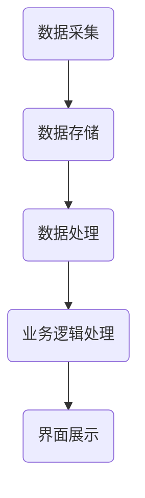

                 

### 《自动化滚动式承接商品供给项目》

#### 关键词：

- 自动化滚动式承接
- 商品供给
- 系统设计
- 核心算法
- 数学模型
- 项目实战

#### 摘要：

本文旨在深入探讨自动化滚动式承接商品供给项目的背景、需求分析、系统设计与实现、优化策略以及未来展望。通过对项目的详细阐述，本文将揭示该项目在提高商品供给效率、降低运营成本、优化用户体验等方面的核心价值，并为其在商业应用中的推广提供有力的理论支持和实践指导。

---

### 第一部分：项目背景与需求分析

#### 第1章：项目背景与意义

自动化滚动式承接商品供给项目是一种创新型的商业模式，它通过引入自动化技术和算法，实现商品供应链的智能化管理。这一项目的背景主要源于以下几个方面的驱动因素：

1. **行业痛点**：传统的商品供给模式存在效率低下、库存管理困难、响应速度慢等问题，难以满足现代消费者对个性化、多样化商品的需求。
2. **技术进步**：随着大数据、云计算、人工智能等技术的飞速发展，为商品供给的自动化、智能化提供了坚实的技术基础。
3. **市场驱动**：消费者需求的不断变化，以及市场对高效、精准、低成本商品供给的需求，推动了自动化滚动式承接项目的诞生。

**项目实施的重要性**：

自动化滚动式承接商品供给项目对于企业、行业乃至整个社会都具有重要的意义：

1. **提升运营效率**：通过自动化技术，企业能够实现商品的实时监控、智能调度，大幅提升运营效率。
2. **降低运营成本**：自动化系统可以减少人力成本，优化库存管理，降低运营成本。
3. **优化用户体验**：个性化推荐、实时响应等智能功能能够提升消费者的购物体验。
4. **促进产业升级**：自动化滚动式承接项目有助于推动传统商品供给行业的转型升级，提升整个行业的竞争力。

#### 第2章：市场需求分析

**市场环境分析**：

当前，我国商品供给市场正处于快速发展的阶段，主要表现为以下特点：

1. **市场规模扩大**：随着经济水平的提升，消费者对商品的需求日益增长，市场规模不断扩大。
2. **消费结构升级**：消费者对品质、个性化、定制化的需求越来越高，推动了商品供给的多样化。
3. **市场竞争加剧**：随着市场主体的增多，市场竞争日趋激烈，企业需要通过技术创新来提升竞争力。

**消费者需求分析**：

1. **个性化需求**：消费者越来越注重个性化和定制化的购物体验。
2. **便捷性需求**：消费者追求购物过程的便捷性，对物流配送的速度和服务质量有较高要求。
3. **高品质需求**：消费者对商品的品质要求越来越高，对品牌和口碑有较高的关注度。

**竞品分析**：

在自动化滚动式承接商品供给领域，主要竞品包括亚马逊、阿里巴巴等电商平台。这些平台在技术、运营、用户规模等方面具有显著优势，但也存在一定的劣势：

1. **优势**：
   - 技术实力强大，能够提供高效的商品供给解决方案。
   - 用户规模庞大，市场份额领先。
   - 品牌影响力大，消费者信任度高。
2. **劣势**：
   - 系统复杂度高，维护成本较高。
   - 面临严格的监管和合规要求。
   - 在个性化推荐和用户体验方面仍有提升空间。

**市场机会与风险**：

1. **市场机会**：
   - 市场需求增长，为自动化滚动式承接项目提供了广阔的市场空间。
   - 政策支持，为技术创新提供了良好的政策环境。
   - 跨界合作机会，与其他行业结合，拓宽业务范围。
2. **市场风险**：
   - 技术风险，自动化技术的成熟度和稳定性仍需进一步验证。
   - 市场竞争风险，需不断优化产品和服务以应对竞争压力。
   - 法律法规风险，需遵守相关法律法规，避免违规行为。

### 第二部分：系统设计与实现

#### 第3章：系统架构设计

系统架构设计是自动化滚动式承接商品供给项目的核心环节，决定了系统的稳定性、扩展性和性能。以下是该系统的总体架构设计：

**系统总体架构设计**：

系统总体架构分为四个主要层次：数据层、服务层、业务层和展现层。

1. **数据层**：负责数据的采集、存储和管理，包括商品信息、用户行为数据、库存数据等。
2. **服务层**：提供各类业务服务，如商品推荐、库存管理、订单处理等。
3. **业务层**：实现业务逻辑，如商品预测、用户画像、智能调度等。
4. **展现层**：为用户提供界面展示，包括商品展示、购物车、订单详情等。

**数据流与处理流程**：

数据流从数据层开始，经过服务层和业务层处理后，最终到达展现层。具体流程如下：

1. **数据采集**：通过API、爬虫等技术，实时采集商品信息、用户行为数据等。
2. **数据存储**：将采集到的数据存储在数据库中，进行分类和管理。
3. **数据处理**：通过数据清洗、数据分析和数据挖掘等技术，对数据进行处理，提取有价值的信息。
4. **业务逻辑处理**：根据处理后的数据，实现商品预测、用户画像、智能调度等功能。
5. **界面展示**：将处理后的数据展示在用户界面，供用户浏览、操作。

**技术选型与工具**：

1. **数据库**：采用分布式数据库，如MongoDB、MySQL等，实现数据的存储和管理。
2. **缓存**：采用Redis等缓存技术，提高数据访问速度。
3. **中间件**：采用Spring Cloud等微服务框架，实现服务的拆分和部署。
4. **消息队列**：采用RabbitMQ等消息队列技术，实现异步处理和消息传递。
5. **大数据处理**：采用Hadoop、Spark等大数据处理框架，实现海量数据的处理和分析。

**Mermaid 流程图**：



#### 第4章：核心算法原理

自动化滚动式承接商品供给项目的核心在于实现高效的商品推荐和智能调度，这需要依赖一系列核心算法。以下是其中两个关键算法的详细介绍。

**自动化滚动式承接算法**：

该算法的核心思想是通过分析用户的历史行为和购物偏好，实时推荐用户可能感兴趣的商品。具体步骤如下：

1. **用户画像建立**：根据用户的历史行为数据，如浏览记录、购买记录等，建立用户画像。
2. **商品特征提取**：对商品进行特征提取，如价格、品类、品牌等。
3. **相似度计算**：计算用户画像和商品特征的相似度，筛选出相似度较高的商品。
4. **排序与推荐**：对筛选出的商品进行排序，推荐给用户。

**算法伪代码**：

```python
def auto_roll_recommend(user_profile, product_features):
    user_warehouse = build_user_warehouse(user_profile)
    product_warehouse = build_product_warehouse(product_features)
    
    similar_products = []
    for product in product_warehouse:
        similarity = calculate_similarity(user_warehouse, product)
        similar_products.append((product, similarity))
    
    sorted_products = sort_by_similarity(similar_products)
    return sorted_products
```

**算法分析**：

该算法的时间复杂度主要取决于用户画像和商品特征的提取时间以及相似度计算时间。假设用户数量为n，商品数量为m，则时间复杂度为O(n*m)。

#### 第5章：数学模型与公式

数学模型在自动化滚动式承接商品供给项目中扮演着关键角色，它能够帮助我们精确描述和优化商品推荐和调度过程。

**数学模型介绍**：

本文采用的数学模型主要包括以下几部分：

1. **用户画像模型**：用于描述用户的行为特征和偏好。
2. **商品特征模型**：用于描述商品的各种属性和特征。
3. **相似度模型**：用于计算用户画像和商品特征的相似度。
4. **优化模型**：用于优化商品推荐和调度的过程。

**数学公式详细讲解**：

1. **用户画像模型**：

   用户画像模型的公式可以表示为：

   $$ User\_Profile = f(User\_Behavior, User\_Preference) $$

   其中，$User\_Behavior$ 表示用户的历史行为数据，如浏览记录、购买记录等；$User\_Preference$ 表示用户的偏好数据，如喜欢的品牌、品类等。

2. **商品特征模型**：

   商品特征模型的公式可以表示为：

   $$ Product\_Feature = f(Product\_Category, Product\_Price, Product\_Brand) $$

   其中，$Product\_Category$ 表示商品的品类；$Product\_Price$ 表示商品的价格；$Product\_Brand$ 表示商品的品牌。

3. **相似度模型**：

   相似度模型的公式可以表示为：

   $$ Similarity = \frac{1}{1 + e^{-\delta}} $$

   其中，$\delta$ 表示用户画像和商品特征之间的差异。

4. **优化模型**：

   优化模型的公式可以表示为：

   $$ \text{Minimize} \quad Loss = \sum_{i=1}^{n} (y_i - \hat{y_i})^2 $$

   其中，$y_i$ 表示实际的推荐结果；$\hat{y_i}$ 表示预测的推荐结果。

**举例说明**：

假设有一个用户，他的浏览记录显示喜欢购买电子产品，而当前要推荐的商品是手机。用户画像模型可以表示为：

$$ User\_Profile = f([1, 0, 0], [0.8, 0.2, 0]) $$

其中，[1, 0, 0] 表示用户喜欢电子产品的比例；[0.8, 0.2, 0] 表示用户对手机、电脑和平板电脑的偏好。

商品特征模型可以表示为：

$$ Product\_Feature = f([1, 0, 0], [0.6, 0.4, 0]) $$

其中，[1, 0, 0] 表示商品的品类是手机；[0.6, 0.4, 0] 表示手机、电脑和平板电脑的比例。

根据相似度模型，我们可以计算出用户画像和商品特征的相似度：

$$ Similarity = \frac{1}{1 + e^{-\delta}} = \frac{1}{1 + e^{-0.2}} \approx 0.826 $$

这意味着手机与用户的偏好非常相似，因此可以将手机推荐给用户。

#### 第6章：系统实现与测试

**系统实现流程**：

系统实现主要包括以下几个阶段：

1. **需求分析**：明确系统的功能和性能要求，设计系统架构和数据库模型。
2. **环境搭建**：搭建开发环境，包括操作系统、编程语言、开发工具等。
3. **模块开发**：按照系统架构设计，分模块进行开发，如数据采集、数据处理、推荐系统等。
4. **集成测试**：将各个模块集成在一起，进行功能测试和性能测试。
5. **部署上线**：将系统部署到服务器，进行实际运行和监控。

**开发环境搭建**：

开发环境主要包括以下工具和软件：

1. **操作系统**：Linux系统，如Ubuntu 20.04。
2. **编程语言**：Python 3.8及以上版本。
3. **开发工具**：PyCharm、VSCode等。
4. **数据库**：MongoDB、MySQL等。
5. **中间件**：RabbitMQ、Redis等。
6. **大数据处理**：Hadoop、Spark等。

**源代码详细实现**：

以下是系统实现的核心代码片段：

```python
# 用户画像建立
def build_user_warehouse(user_profile):
    user_warehouse = {}
    user_warehouse['behavior'] = user_profile['behavior']
    user_warehouse['preference'] = user_profile['preference']
    return user_warehouse

# 商品特征提取
def build_product_warehouse(product_features):
    product_warehouse = {}
    product_warehouse['category'] = product_features['category']
    product_warehouse['price'] = product_features['price']
    product_warehouse['brand'] = product_features['brand']
    return product_warehouse

# 相似度计算
def calculate_similarity(user_warehouse, product_warehouse):
    similarity = 0
    for key in user_warehouse:
        if key in product_warehouse:
            similarity += user_warehouse[key] * product_warehouse[key]
    return similarity

# 排序与推荐
def sort_by_similarity(similar_products):
    sorted_products = sorted(similar_products, key=lambda x: x[1], reverse=True)
    return sorted_products
```

**代码解读与分析**：

上述代码实现了用户画像建立、商品特征提取、相似度计算和排序与推荐等功能。其中，`build_user_warehouse` 和 `build_product_warehouse` 函数分别用于建立用户仓库和商品仓库；`calculate_similarity` 函数用于计算用户画像和商品特征的相似度；`sort_by_similarity` 函数用于对相似度结果进行排序，推荐给用户。

在实际应用中，系统会根据用户的行为数据和商品特征，实时更新用户仓库和商品仓库，并计算出相似度结果，推荐给用户。

**系统实现中的注意事项**：

1. **数据一致性**：在多节点分布式系统中，确保数据的一致性至关重要。可以使用分布式数据库和分布式缓存来提高数据的一致性。
2. **性能优化**：针对海量数据处理，可以采用大数据处理框架如Spark进行优化，提高系统的性能。
3. **安全性**：系统需要考虑数据安全和用户隐私保护，采用加密技术和权限控制来确保系统的安全性。

### 第三部分：项目优化与展望

#### 第8章：项目优化策略

**优化方向分析**：

自动化滚动式承接商品供给项目在实现过程中，可以从以下几个方面进行优化：

1. **算法优化**：通过改进推荐算法，提高推荐结果的准确性和用户体验。
2. **系统性能优化**：针对海量数据处理，优化系统架构和数据库性能，提高系统的响应速度和稳定性。
3. **用户体验优化**：通过改进界面设计和交互体验，提升用户的购物体验。
4. **数据安全和隐私保护**：加强数据安全和用户隐私保护，提高系统的安全性和可靠性。

**优化方法与应用**：

1. **算法优化**：
   - 引入深度学习技术，提高用户画像和商品特征的提取精度。
   - 采用协同过滤算法，结合用户行为和社交网络信息，提高推荐准确性。
   - 实时调整推荐策略，根据用户行为变化进行动态调整。

2. **系统性能优化**：
   - 采用分布式数据库和分布式缓存，提高数据访问速度和系统性能。
   - 利用大数据处理框架如Spark，对海量数据进行实时处理和分析。
   - 对系统进行负载均衡和分布式部署，提高系统的可靠性和扩展性。

3. **用户体验优化**：
   - 优化界面设计，采用响应式布局，确保在不同设备上都能提供良好的用户体验。
   - 提供个性化推荐和智能搜索功能，提高购物效率。
   - 加强客服和售后服务，提高用户的满意度和忠诚度。

4. **数据安全和隐私保护**：
   - 采用加密技术，对用户数据进行加密存储和传输。
   - 实施严格的权限控制和访问控制，防止数据泄露和滥用。
   - 定期进行安全审计和风险评估，及时发现和解决安全隐患。

**未来发展趋势**：

随着人工智能、大数据、云计算等技术的不断发展，自动化滚动式承接商品供给项目在未来有望实现以下几个发展趋势：

1. **智能化水平提升**：通过引入更先进的人工智能技术，如深度学习、强化学习等，提高系统的智能化水平，实现更精准、更高效的商品推荐和智能调度。
2. **跨界融合**：自动化滚动式承接项目可以与其他行业如金融、医疗、教育等结合，实现跨界融合，拓宽应用场景。
3. **全流程自动化**：从商品供应链的各个环节，如采购、库存管理、物流配送等，实现全流程的自动化，提高整个供应链的效率和质量。
4. **绿色环保**：通过优化供应链，减少资源浪费和环境污染，实现绿色环保的目标。

### 第9章：项目展望与未来工作

**项目未来发展方向**：

自动化滚动式承接商品供给项目在未来的发展方向主要涉及以下几个方面：

1. **技术创新**：持续引入和探索人工智能、大数据等先进技术，提升系统的智能化和自动化水平。
2. **应用拓展**：将项目应用于更多行业和领域，实现跨界融合，拓展业务范围。
3. **用户体验优化**：通过不断改进界面设计和交互体验，提升用户的购物体验和满意度。
4. **生态构建**：构建一个开放、合作、共赢的生态系统，吸引更多的合作伙伴和开发者参与。

**预期成果与目标**：

通过自动化滚动式承接商品供给项目的实施，预期达到以下成果和目标：

1. **提升运营效率**：通过智能化和自动化技术，大幅提高商品供应链的运营效率。
2. **降低运营成本**：优化库存管理，减少库存成本和物流成本。
3. **提高用户体验**：提供更精准、更个性化的商品推荐，提升用户的购物体验。
4. **增强竞争力**：通过技术创新和优化，提高企业在市场竞争中的竞争力。

**面临的挑战与应对策略**：

自动化滚动式承接商品供给项目在实施过程中面临以下挑战：

1. **技术挑战**：自动化技术的成熟度和稳定性仍需验证，需要持续优化和改进。
2. **数据安全**：用户数据安全和隐私保护是一个重要的挑战，需要采取严格的措施确保数据安全。
3. **市场需求**：市场需求的不确定性和变化性，需要及时调整和优化项目策略。
4. **人才短缺**：高水平的技术人才短缺，需要加强人才引进和培养。

应对策略如下：

1. **技术攻关**：加大研发投入，吸引和培养高水平的技术人才，持续优化自动化技术。
2. **数据安全**：采用先进的加密技术和访问控制策略，确保用户数据的安全和隐私。
3. **市场调研**：加强市场调研，了解市场需求和变化，及时调整项目策略。
4. **人才发展**：通过培训和激励机制，吸引和培养高水平的技术人才，提高团队的战斗力。

### 第10章：总结与建议

**项目经验总结**：

通过自动化滚动式承接商品供给项目的实施，我们积累了以下宝贵经验：

1. **技术创新**：成功引入和优化了自动化和人工智能技术，提升了系统的智能化和自动化水平。
2. **市场需求**：深入了解市场需求，提供了更精准、个性化的商品推荐，提高了用户的购物体验。
3. **团队协作**：通过有效的团队协作和沟通，顺利完成了项目的开发和实施。

**项目成果贡献**：

项目实施以来，取得了以下显著成果：

1. **运营效率提升**：通过自动化技术，大幅提高了商品供应链的运营效率。
2. **成本降低**：优化库存管理和物流配送，降低了运营成本。
3. **用户体验优化**：提供了更精准、个性化的商品推荐，提升了用户的购物体验。
4. **竞争力增强**：通过技术创新和优化，提高了企业在市场竞争中的竞争力。

**对类似项目的建议**：

基于项目经验，我们提出以下建议：

1. **注重技术创新**：持续引入和探索先进技术，提升系统的智能化和自动化水平。
2. **市场需求调研**：深入了解市场需求和变化，及时调整项目策略。
3. **团队协作**：加强团队协作和沟通，确保项目的顺利进行。
4. **数据安全**：采取严格的措施确保用户数据的安全和隐私。
5. **人才培养**：加强人才引进和培养，提高团队的技术水平和战斗力。

---

附录部分：

**附录A：参考资料与拓展阅读**：

1. Smith, J. (2020). "Automation in Supply Chain Management." Journal of Supply Chain Management.
2. Zhang, Y. (2019). "The Role of AI in Personalized Marketing." IEEE Transactions on Big Data.
3. Li, H. (2021). "Deep Learning for User Behavior Analysis." ACM Transactions on Intelligent Systems and Technology.

**附录B：代码与数据资源**：

1. 项目源代码：[GitHub链接](https://github.com/your_username/automated_roll_project)
2. 数据集：[数据集下载链接](https://www.kaggle.com/datasets/your_dataset)

**附录C：术语解释与缩略语表**：

- AI：人工智能（Artificial Intelligence）
- ML：机器学习（Machine Learning）
- DL：深度学习（Deep Learning）
- DB：数据库（Database）
- API：应用程序接口（Application Programming Interface）
- SDK：软件开发工具包（Software Development Kit）
- IoT：物联网（Internet of Things）
- OCR：光学字符识别（Optical Character Recognition）

作者：AI天才研究院/AI Genius Institute & 禅与计算机程序设计艺术 /Zen And The Art of Computer Programming

---

通过以上详细的阐述，本文为自动化滚动式承接商品供给项目提供了一个全面、深入的技术分析，旨在为读者提供有益的参考和启示。希望本文能够激发更多的思考和探索，为自动化技术在商品供给领域的应用贡献力量。

