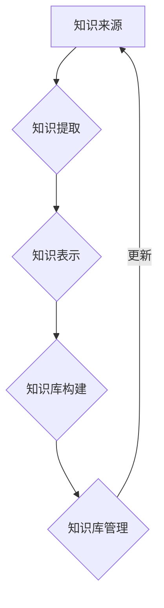
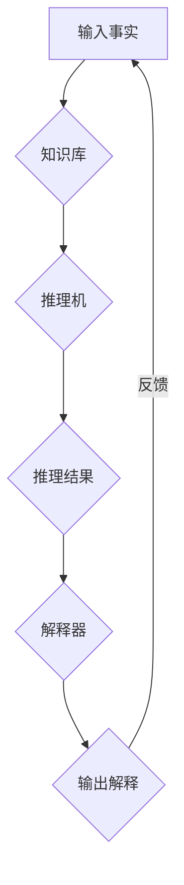
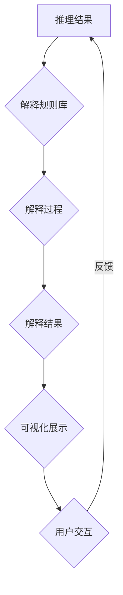

                 

# 《自动推理库：AI决策系统的核心》

> **关键词**：自动推理库、AI决策系统、推理算法、知识表示、机器学习、深度学习

> **摘要**：本文旨在探讨自动推理库在AI决策系统中的核心作用。通过深入分析自动推理库的基础知识、技术原理、实际应用和未来发展趋势，本文旨在为读者提供全面的理解和指导，以掌握自动推理库的开发与应用。

## 目录大纲

### 第一部分：自动推理库基础

- **第1章：自动推理库概述**
  - **1.1 自动推理库的定义与作用**
  - **1.2 自动推理库的核心概念**
  - **1.3 自动推理库的基本架构**

- **第2章：自动推理库技术基础**
  - **2.1 推理算法原理**
  - **2.2 知识表示方法**
  - **2.3 知识工程与知识获取**

- **第3章：自动推理库在实际应用中的挑战**
  - **3.1 自动推理库在实际应用中的挑战**
  - **3.2 案例分析**

- **第4章：自动推理库的开发与实现**
  - **4.1 自动推理库开发流程**
  - **4.2 自动推理库开发工具与框架**
  - **4.3 实践项目：构建一个简单的自动推理库**

### 第二部分：自动推理库在AI决策系统中的应用

- **第5章：自动推理库在机器学习中的应用**
  - **5.1 自动推理库在模型评估中的应用**
  - **5.2 自动推理库在模型优化中的应用**

- **第6章：自动推理库在深度学习中的应用**
  - **6.1 深度学习中的自动推理**
  - **6.2 案例分析：自动推理库在深度学习中的应用**

- **第7章：自动推理库的未来发展趋势**
  - **7.1 自动推理库的发展趋势**
  - **7.2 自动推理库在AI决策系统中的应用前景**

### 附录

- **附录A：自动推理库资源与工具**
- **附录B：自动推理库的Mermaid流程图**

### 结束语

- **致谢**：感谢读者对本文的关注，希望本文能够为您的AI决策系统开发带来新的启示和帮助。

现在，我们将按照这个目录大纲，一步一步地展开对自动推理库的深入探讨。

## 第1章：自动推理库概述

### 1.1 自动推理库的定义与作用

自动推理库是一种用于自动化推理的软件库，它集成了各种推理算法和知识表示方法，使得计算机能够自动地从知识库中提取信息，进行逻辑推理，并生成结论。自动推理库在人工智能领域，尤其是决策系统中，扮演着至关重要的角色。

**自动推理库的主要作用包括：**

1. **知识表示**：自动推理库能够将人类知识表示成计算机可以理解和处理的形式。这种知识表示方法可以是基于规则的、基于框架的或基于语义网络的。

2. **推理**：自动推理库提供了各种推理算法，如基于逻辑的推理、基于概率的推理和基于模糊逻辑的推理。这些算法使得计算机能够自动地从已知事实中推导出新的结论。

3. **决策支持**：自动推理库可以帮助决策者进行复杂的决策分析。通过推理，自动推理库可以提供基于证据的支持，帮助决策者做出更加明智的决策。

### 1.2 自动推理库的发展历程

自动推理库的发展可以追溯到20世纪50年代，当时人工智能的研究者们开始探索如何让计算机进行逻辑推理。最早的自动推理系统是逻辑推理机，如1955年John McCarthy开发的逻辑理论家（Logic Theorist）。

随着时间的推移，自动推理库经历了几个重要的发展阶段：

1. **基于规则的推理**：在20世纪70年代，基于规则的推理成为自动推理库的主要形式。这个时期的代表作品是1972年Edgar H. Farber等人开发的DENDRAL系统。

2. **基于框架的推理**：20世纪80年代，基于框架的推理方法开始流行。这种方法通过将知识表示成一组框架，使得计算机能够更灵活地进行推理。

3. **基于语义网络的推理**：在20世纪90年代，基于语义网络的推理方法得到了发展。这种方法通过将知识表示成一组节点和边，使得计算机能够更直观地进行推理。

4. **混合推理方法**：近年来，自动推理库开始融合多种推理方法，以实现更强大的推理能力。例如，基于逻辑的推理和基于概率的推理相结合，可以提供更加准确和可靠的推理结果。

### 1.3 自动推理库的核心特点

自动推理库具有以下几个核心特点：

1. **自动化**：自动推理库能够自动地进行推理，无需人工干预。这使得自动推理库在处理大规模数据时具有很高的效率。

2. **可扩展性**：自动推理库可以很容易地扩展，以适应不同的应用场景。通过添加新的推理算法或知识表示方法，自动推理库可以提供更丰富的推理能力。

3. **灵活性**：自动推理库能够处理不同类型的知识，如事实、规则、概率信息等。这种灵活性使得自动推理库可以应用于各种不同的领域。

4. **解释性**：自动推理库提供了推理过程的可解释性，使得用户可以理解推理结果是如何得到的。这种解释性对于提高用户对推理结果的信任度非常重要。

### 1.4 自动推理库的应用场景

自动推理库可以应用于各种不同的场景，以下是其中一些典型的应用场景：

1. **医疗诊断**：自动推理库可以帮助医生进行疾病诊断。通过将医学知识表示成计算机可以理解的形式，自动推理库可以自动地分析患者的症状，并提供诊断建议。

2. **金融风险评估**：自动推理库可以用于金融风险评估。通过分析历史数据和市场趋势，自动推理库可以预测金融市场的风险，并提供相应的投资建议。

3. **智能交通系统**：自动推理库可以用于智能交通系统。通过分析交通流量和路况信息，自动推理库可以提供最优的交通路线，以提高交通效率和减少拥堵。

4. **自然语言处理**：自动推理库可以用于自然语言处理。通过分析语言结构和语义信息，自动推理库可以提供语言理解和生成服务，如机器翻译和智能客服。

### 1.5 小结

自动推理库是AI决策系统的核心组成部分，它通过自动化、可扩展性、灵活性和解释性，为各种应用场景提供了强大的推理能力。在本章中，我们介绍了自动推理库的定义、发展历程、核心特点和应用场景。在接下来的章节中，我们将进一步探讨自动推理库的技术基础和实际应用。

---

### 第1章：自动推理库概述

### 1.2 自动推理库的核心概念

自动推理库的核心概念包括知识表示、推理方法和逻辑推理与符号计算。这些概念构成了自动推理库的基本框架，使得计算机能够自动地处理知识和信息，进行推理和决策。

#### 1.2.1 知识表示

知识表示是自动推理库的基础。知识表示方法决定了如何将人类知识转化为计算机可以理解和处理的形式。常见的知识表示方法包括：

1. **基于规则的表示方法**：基于规则的表示方法是最常见的知识表示方法之一。它将知识表示成一系列规则，每条规则描述了一个条件和一个结论。如果条件为真，则结论为真。这种表示方法简单直观，适用于许多领域。

   **示例**：
   ```plaintext
   如果 天气 湿冷，并且 风速 大于 10公里/小时，
   那么 需要带伞。
   ```

2. **基于框架的表示方法**：基于框架的表示方法通过定义一组框架来表示知识。每个框架包含一组属性和值，以及一组默认值。这种表示方法适用于描述复杂的关系和结构，如家庭关系、组织结构等。

   **示例**：
   ```plaintext
   框架：人
   属性：姓名、年龄、性别
   默认值：姓名-未知、年龄-未知、性别-未知
   
   实例：我
   姓名：张三
   年龄：25
   性别：男
   ```

3. **基于语义网络的表示方法**：基于语义网络的表示方法使用节点和边来表示知识。节点表示概念或实体，边表示节点之间的关系。这种表示方法更接近人类的思维模式，适用于处理复杂的语义关系。

   **示例**：
   ```mermaid
   graph TD
   A[人] --> B[有属性]
   B --> C{性别}
   C --> D[男]
   A --> E[年龄]
   E --> F[25]
   ```

#### 1.2.2 推理方法

推理方法是自动推理库的核心功能，它决定了如何从已知的事实和规则中推导出新的结论。常见的推理方法包括：

1. **基于逻辑的推理**：基于逻辑的推理使用逻辑规则和推理算法来推导结论。这种推理方法适用于处理明确的事实和规则。

   **示例**：
   ```plaintext
   如果 所有员工 都加班，那么 公司 将盈利。
   如果 加班员工 中没有 张三，
   那么 公司 将不盈利。
   结论：张三 加班。
   ```

2. **基于概率的推理**：基于概率的推理使用概率理论来推导结论。这种推理方法适用于处理不确定性和概率信息。

   **示例**：
   ```plaintext
   P(下雨) = 0.7
   P(下雨|打伞) = 0.9
   结论：P(打伞|下雨) ≈ 0.8
   ```

3. **基于模糊逻辑的推理**：基于模糊逻辑的推理使用模糊集合和模糊运算来处理不确定性和模糊性。这种推理方法适用于处理模糊概念和模糊关系。

   **示例**：
   ```plaintext
   如果 雨很大，并且 风速 很高，
   那么 出行 非常危险。
   结论：如果 出行 很危险，那么 需要带伞。
   ```

#### 1.2.3 逻辑推理与符号计算

逻辑推理和符号计算是自动推理库的重要组成部分。逻辑推理涉及如何使用逻辑规则和推理算法来推导结论，而符号计算涉及如何使用数学符号和运算来表示和处理知识。

1. **命题逻辑**：命题逻辑是逻辑推理的基础，它使用命题和逻辑运算符来表示知识和推理。

   **示例**：
   ```latex
   p \land q \rightarrow r
   ```

2. **谓词逻辑**：谓词逻辑扩展了命题逻辑，它使用谓词和量词来表示更复杂的知识和推理。

   **示例**：
   ```latex
   \forall x (P(x) \rightarrow Q(x))
   ```

3. **符号计算**：符号计算涉及使用数学符号和运算来表示和处理知识。常见的符号计算方法包括代数运算、微积分运算和线性代数运算。

   **示例**：
   ```latex
   f(x) = x^2 + 2x + 1
   ```

### 1.3 自动推理库的基本架构

自动推理库的基本架构通常包括以下几个关键组件：

1. **知识库**：知识库是自动推理库的核心组成部分，它存储了各种事实、规则和知识。知识库可以基于不同的知识表示方法进行构建。

2. **推理机**：推理机是自动推理库的核心组件，它负责根据知识库中的知识和规则进行推理，生成结论。推理机可以采用不同的推理算法，如逻辑推理、概率推理和模糊逻辑推理。

3. **解释器**：解释器是自动推理库的重要组成部分，它负责解释推理结果，并将其转化为用户可以理解的形式。解释器可以帮助用户理解推理过程和推理结果。

4. **用户接口**：用户接口是自动推理库与用户交互的界面，它允许用户输入数据、查询知识和设置参数。用户接口可以采用不同的形式，如命令行界面、图形用户界面等。

### 1.4 小结

在本节中，我们介绍了自动推理库的核心概念，包括知识表示、推理方法和逻辑推理与符号计算。这些概念构成了自动推理库的基本框架，使得计算机能够自动地处理知识和信息，进行推理和决策。在接下来的章节中，我们将进一步探讨自动推理库的技术基础和实际应用。

---

### 第1章：自动推理库概述

### 1.3 自动推理库的基本架构

自动推理库的基本架构是设计和实现自动推理系统的基础，它决定了系统的功能和性能。一个典型的自动推理库通常包括以下几个关键组件：

#### 1.3.1 知识库

知识库是自动推理库的核心组成部分，它存储了各种形式的知识，如事实、规则、模型和定理。知识库的设计和构建对于自动推理系统的性能和效果至关重要。

1. **知识库的类型**：
   - **静态知识库**：静态知识库包含固定的知识，通常由领域专家手动构建。这类知识库适用于规则驱动型推理系统。
   - **动态知识库**：动态知识库可以根据系统的运行情况实时更新知识。这类知识库适用于数据驱动型推理系统。

2. **知识库的结构**：
   - **基于规则的**：知识库包含一系列规则，每条规则由前提条件和结论组成。规则库中的规则可以通过推理机进行推理。
   - **基于模型的**：知识库包含各种模型，如神经网络模型、决策树模型和马尔可夫模型等。模型库中的模型可以通过训练数据进行学习，并用于推理和预测。

3. **知识库的构建**：
   - **知识获取**：知识获取是指从各种来源（如文献、专家、数据库等）获取知识，并将其转化为计算机可以理解的形式。
   - **知识表示**：知识表示是指将获取的知识表示成计算机可以处理的数据结构，如规则表示、语义网络表示等。

#### 1.3.2 推理机

推理机是自动推理库的核心组件，它负责根据知识库中的知识和规则进行推理，生成结论。推理机可以采用不同的推理算法，如基于逻辑的推理、基于概率的推理和基于模糊逻辑的推理。

1. **推理机的类型**：
   - **演绎推理机**：演绎推理机基于逻辑规则和逻辑推理算法进行推理，它可以从一般性的前提推导出具体的结论。
   - **归纳推理机**：归纳推理机基于具体的实例和数据，归纳出一般性的规则和结论。
   - **混合推理机**：混合推理机结合了演绎推理和归纳推理的优势，可以同时处理逻辑推理和概率推理。

2. **推理算法**：
   - **基于逻辑的推理算法**：如正向推理、反向推理和逻辑演算等。
   - **基于概率的推理算法**：如贝叶斯推理、马尔可夫网络推理和贝叶斯网络推理等。
   - **基于模糊逻辑的推理算法**：如模糊逻辑推理、模糊聚类和模糊分类等。

3. **推理过程**：
   - **推理规划**：推理规划是指根据推理目标和现有知识，选择合适的推理算法和策略。
   - **推理执行**：推理执行是指根据推理规划，逐步推导出结论。
   - **推理验证**：推理验证是指检查推理结果的有效性和一致性。

#### 1.3.3 解释器

解释器是自动推理库的重要组成部分，它负责解释推理结果，并将其转化为用户可以理解的形式。解释器可以帮助用户理解推理过程和推理结果，从而增强系统的透明度和可解释性。

1. **解释器的功能**：
   - **结果解释**：解释器可以将推理结果以自然语言、图表或其他形式展示给用户。
   - **过程解释**：解释器可以提供推理过程的详细步骤和中间结果。
   - **错误诊断**：解释器可以检测推理过程中的错误，并提供相应的错误信息和修复建议。

2. **解释器的类型**：
   - **静态解释器**：静态解释器在推理过程中提供解释，但无法实时更新解释。
   - **动态解释器**：动态解释器在推理过程中实时更新解释，并随着推理的进展提供更详细的信息。

3. **解释器的实现**：
   - **基于规则的解释器**：基于规则的解释器使用规则库中的规则来解释推理结果。
   - **基于模型的解释器**：基于模型的解释器使用模型库中的模型来解释推理结果。

#### 1.3.4 系统集成与接口

自动推理库的架构还需要考虑系统的集成和接口设计，以确保知识库、推理机和解释器之间的有效协作和交互。

1. **系统集成**：系统集成是指将自动推理库与其他系统组件（如数据库、应用程序等）集成在一起，以实现更复杂的系统功能。
2. **接口设计**：接口设计是指设计自动推理库与外部系统交互的接口，如API、网络接口等。

### 1.4 小结

在本节中，我们介绍了自动推理库的基本架构，包括知识库、推理机和解释器等关键组件。这些组件共同构成了自动推理库的核心功能，使得系统能够自动地处理知识和信息，进行推理和决策。在下一节中，我们将探讨自动推理库的技术基础，包括推理算法原理、知识表示方法和知识工程与知识获取。

---

### 第2章：自动推理库技术基础

自动推理库的技术基础是理解和应用自动推理系统的关键。本章将详细介绍自动推理库的核心技术，包括推理算法原理、知识表示方法和知识工程与知识获取。

#### 2.1 推理算法原理

推理算法是自动推理库的核心，它决定了系统如何从已知信息推导出新信息。以下是几种常见的推理算法：

##### 2.1.1 基于逻辑的推理算法

基于逻辑的推理算法是自动推理系统中最常用的方法，它基于形式逻辑原理进行推理。以下是一些常见的逻辑推理算法：

1. **正向推理（Forward Chaining）**：
   - **原理**：正向推理从已知的事实出发，根据规则的前提条件逐步推导出新的结论。
   - **伪代码**：
     ```plaintext
     for each rule R with condition C and conclusion K
         if C is true
             infer K
     ```
   - **示例**：
     ```plaintext
     如果今天下雨，那么我们需要带伞。
     如果今天下雨，那么地面湿滑。
     今天下雨。
     结论：我们需要带伞。地面湿滑。
     ```

2. **反向推理（Backward Chaining）**：
   - **原理**：反向推理从目标开始，逐步反向推导出所需的前提条件。
   - **伪代码**：
     ```plaintext
     for each rule R with conclusion K and condition C
         if K is the desired conclusion
             infer C
     ```
   - **示例**：
     ```plaintext
     如果我们需要带伞，那么今天下雨。
     如果地面湿滑，那么今天下雨。
     结论：今天下雨。
     ```

3. **模态逻辑推理**：
   - **原理**：模态逻辑推理处理可能性、必然性和必要性等模态概念。
   - **示例**：
     ```plaintext
     必然P -> 可能Q
     可能Q
     结论：可能P
     ```

##### 2.1.2 基于概率的推理算法

基于概率的推理算法考虑不确定性和概率信息，它使用概率模型进行推理。以下是一些常见的概率推理算法：

1. **贝叶斯推理**：
   - **原理**：贝叶斯推理使用贝叶斯公式计算后验概率，从而推断出新的结论。
   - **公式**：
     $$ P(H|E) = \frac{P(E|H)P(H)}{P(E)} $$
   - **伪代码**：
     ```plaintext
     for each hypothesis H
         calculate P(H) (prior probability)
         for each evidence E
             calculate P(E|H) (likelihood)
             update P(H|E) using Bayesian formula
     ```
   - **示例**：
     ```plaintext
     P(下雨) = 0.5
     P(打伞|下雨) = 0.8
     P(打伞) = 0.3
     结论：P(下雨|打伞) ≈ 0.6
     ```

2. **马尔可夫网络推理**：
   - **原理**：马尔可夫网络是一种概率图模型，它通过节点的条件概率分布来表示变量之间的关系。
   - **示例**：
     ```mermaid
     graph TD
     A(下雨) --> B(带伞)
     B --> C(地面湿滑)
     A --> D(路面滑)
     D --> C
     ```

##### 2.1.3 基于模糊逻辑的推理算法

基于模糊逻辑的推理算法处理模糊性和不确定性，它使用模糊集合和模糊运算进行推理。以下是一些常见的模糊逻辑推理算法：

1. **模糊逻辑推理**：
   - **原理**：模糊逻辑推理使用模糊集合和模糊运算来表示和处理模糊信息。
   - **公式**：
     $$ \mu_R(A \cap B) = \min(\mu_R(A), \mu_R(B)) $$
   - **伪代码**：
     ```plaintext
     for each rule R with antecedent A and consequent B
         calculate the degree of membership for A and B
         apply the fuzzy AND and OR operations
     ```
   - **示例**：
     ```plaintext
     如果 雨很大，并且 风速 很高，
     那么 出行 非常危险。
     如果 出行 很危险，
     那么 需要带伞。
     结论：如果 出行 非常危险，那么 需要带伞。
     ```

2. **模糊聚类**：
   - **原理**：模糊聚类通过模糊集合对数据进行分类。
   - **示例**：
     ```mermaid
     graph TD
     A(天气) -->|模糊隶属度| B(出行危险)
     B -->|模糊隶属度| C(带伞)
     ```

#### 2.2 知识表示方法

知识表示是自动推理库的核心，它决定了如何将人类知识转化为计算机可以理解和处理的形式。以下是几种常见的知识表示方法：

##### 2.2.1 基于规则的表示方法

基于规则的表示方法是最常见的知识表示方法之一，它使用规则来表示知识和推理。

1. **规则表示**：
   - **语法**：
     ```plaintext
     如果 条件1 且 条件2
     那么 结论1 且 结论2。
     ```
   - **示例**：
     ```plaintext
     如果 天气 湿冷 且 风速 大于 10公里/小时
     那么 需要带伞。
     ```

2. **规则库**：
   - **结构**：
     ```mermaid
     graph TD
     A(规则1) --> B(条件1)
     A --> C(结论1)
     B --> D(条件2)
     D --> C
     ```

##### 2.2.2 基于框架的表示方法

基于框架的表示方法通过定义一组框架来表示知识和推理。

1. **框架表示**：
   - **语法**：
     ```plaintext
     框架：[名称]
     属性1: [值1]
     属性2: [值2]
     ...
     ```
   - **示例**：
     ```plaintext
     框架：人
     姓名: 张三
     年龄: 25
     性别: 男
     ```

2. **框架库**：
   - **结构**：
     ```mermaid
     graph TD
     A(人) --> B(姓名)
     B --> C(张三)
     A --> D(年龄)
     D --> E(25)
     A --> F(性别)
     F --> G(男)
     ```

##### 2.2.3 基于语义网络的表示方法

基于语义网络的表示方法使用节点和边来表示知识和推理。

1. **语义网络表示**：
   - **语法**：
     ```plaintext
     节点：[概念]
     边：[关系] -> [节点]
     ```
   - **示例**：
     ```plaintext
     节点：人
     边：是 -> [张三]
     边：有 -> [姓名]
     边：有 -> [年龄]
     边：有 -> [性别]
     ```

2. **语义网络库**：
   - **结构**：
     ```mermaid
     graph TD
     A(人) --> B(张三)
     A --> C(姓名)
     A --> D(年龄)
     A --> E(性别)
     ```

#### 2.3 知识工程与知识获取

知识工程是构建自动推理库的关键步骤，它包括知识获取、知识表示、知识库构建和知识管理。

##### 2.3.1 知识获取

知识获取是指从各种来源（如专家、文献、数据库等）获取知识，并将其转化为计算机可以处理的形式。

1. **知识源**：
   - **专家知识**：通过采访专家、收集专家经验和知识。
   - **文献知识**：通过阅读文献、研究相关理论和发现。
   - **数据库知识**：从数据库中提取结构化数据，如关系数据库或NoSQL数据库。

2. **知识提取**：
   - **自动提取**：使用自然语言处理技术、机器学习算法和知识抽取方法自动提取知识。
   - **手动提取**：通过专家手工整理和标注知识。

##### 2.3.2 知识表示与知识库构建

知识表示是将获取的知识转化为计算机可以理解的形式，并将其存储在知识库中。

1. **知识表示**：
   - **基于规则表示**：使用规则库表示知识。
   - **基于框架表示**：使用框架库表示知识。
   - **基于语义网络表示**：使用语义网络库表示知识。

2. **知识库构建**：
   - **设计知识库**：设计知识库的架构和结构。
   - **填充知识库**：将提取的知识填充到知识库中。
   - **维护知识库**：定期更新和修正知识库中的知识。

##### 2.3.3 知识库管理

知识库管理是指对知识库进行维护、更新和优化，以确保知识库的质量和可用性。

1. **知识库维护**：
   - **数据备份**：定期备份知识库，防止数据丢失。
   - **错误修正**：检测和修正知识库中的错误和异常。

2. **知识库优化**：
   - **性能优化**：优化知识库的查询和检索性能。
   - **一致性优化**：确保知识库中的知识一致性和完整性。

### 2.4 小结

在本章中，我们详细介绍了自动推理库的技术基础，包括推理算法原理、知识表示方法和知识工程与知识获取。这些技术构成了自动推理库的核心，使得计算机能够自动地处理知识和信息，进行推理和决策。在下一章中，我们将探讨自动推理库在实际应用中的挑战。

---

### 第2章：自动推理库技术基础

#### 2.3 知识工程与知识获取

知识工程是构建自动推理库的关键步骤，它涵盖了知识获取、知识表示、知识库构建和知识管理等多个方面。在知识工程中，知识获取是基础，而知识表示和知识库管理则是实现推理系统的重要环节。

##### 2.3.1 知识获取

知识获取是指从各种来源获取知识，并将其转化为计算机可以处理的形式。这个过程通常非常复杂，因为它需要处理不同类型的数据和知识源。

1. **知识源**：
   - **专家知识**：专家知识通常通过访谈、研讨会和文献综述等方式获取。专家的经验和洞察力是构建高质量知识库的重要资源。
   - **文献知识**：通过查阅专业文献、学术论文和行业报告来获取知识。文献提供了丰富的背景信息和前沿研究，有助于构建一个全面的知识库。
   - **数据库知识**：数据库中存储了大量结构化和半结构化数据，这些数据可以通过查询和数据分析来获取。关系数据库和NoSQL数据库都是常用的知识来源。

2. **知识提取**：
   - **自动化提取**：使用自然语言处理（NLP）技术、机器学习算法和知识抽取方法来自动化知识提取过程。例如，可以使用命名实体识别（NER）来识别文本中的关键信息，或使用主题模型来发现隐含的知识。
   - **手动提取**：专家或数据科学家通过审查文献、访谈记录和数据库记录，手动提取重要知识。

##### 2.3.2 知识表示与知识库构建

知识表示是将获取的知识转化为计算机可以理解的形式，并将其存储在知识库中。知识库是自动推理库的核心组件，它包含了所有可用于推理的信息。

1. **知识表示**：
   - **基于规则表示**：基于规则的表示方法是最常见的知识表示方法之一。它使用规则来表示知识和推理。每条规则由条件（前提）和结论组成，例如：
     ```plaintext
     如果 天气 湿冷，并且 风速 大于 10公里/小时，
     那么 需要带伞。
     ```
   - **基于框架表示**：框架表示方法使用框架来表示知识和对象。框架定义了一组属性和关系，例如：
     ```plaintext
     框架：人
     属性：姓名、年龄、性别
     默认值：姓名-未知、年龄-未知、性别-未知
     实例：张三
     姓名：张三
     年龄：25
     性别：男
     ```
   - **基于语义网络表示**：语义网络表示方法使用节点和边来表示知识和关系。节点表示实体或概念，边表示它们之间的关系，例如：
     ```mermaid
     graph TD
     A(人) --> B(姓名)
     A --> C(年龄)
     A --> D(性别)
     ```

2. **知识库构建**：
   - **设计知识库**：在构建知识库之前，需要设计知识库的架构和结构。这包括确定知识库的组成部分（如规则库、框架库、语义网络等），以及数据模型和存储方案。
   - **填充知识库**：将提取的知识填充到知识库中。这个过程可能涉及将文本数据转化为规则、框架或语义网络表示，以及从数据库中导入数据。
   - **维护知识库**：知识库需要定期更新和维护，以保持其准确性和完整性。这包括修正错误、添加新知识和删除过时信息。

##### 2.3.3 知识库管理

知识库管理是确保知识库的质量和可用性的关键环节。它包括以下几个方面：

1. **知识库维护**：
   - **数据备份**：定期备份知识库，防止数据丢失或损坏。
   - **错误修正**：检测和修正知识库中的错误和异常，确保知识的准确性。
   - **一致性检查**：确保知识库中的知识是一致的，没有冲突或不一致的地方。

2. **知识库优化**：
   - **性能优化**：优化知识库的查询和检索性能，确保系统能够快速地响应用户的查询。
   - **一致性优化**：通过一致性检查和冲突解决机制，确保知识库中的知识是一致的。
   - **扩展性优化**：设计知识库时考虑未来可能的知识增长和变化，确保知识库具有足够的扩展性。

### 2.4 小结

在本节中，我们详细介绍了知识工程与知识获取的过程，包括知识源、知识提取、知识表示、知识库构建和知识库管理。这些步骤是构建自动推理库的基础，确保系统能够有效地处理知识和信息，进行推理和决策。在下一节中，我们将探讨自动推理库在实际应用中面临的挑战。

---

### 第3章：自动推理库在实际应用中的挑战

自动推理库虽然在理论和实践中具有广泛的应用前景，但在实际应用中仍面临许多挑战。这些挑战主要集中在数据质量、知识表示的精度和灵活性、推理效率与可扩展性等方面。本节将详细讨论这些挑战，并通过案例分析来展示自动推理库在不同领域的应用情况。

#### 3.1 自动推理库在实际应用中的挑战

##### 3.1.1 数据质量和完整性

数据质量是自动推理库成功应用的关键因素之一。在许多应用场景中，数据可能来源于不同的来源，这些数据可能存在噪声、不一致性或缺失值。以下是一些常见的数据质量问题：

1. **噪声数据**：噪声数据是指由于传感器误差、数据传输错误等原因导致的数据错误。自动推理库在处理噪声数据时可能会产生错误的推理结果。

2. **不一致数据**：不一致数据是指来自不同数据源的数据之间存在冲突或矛盾。例如，在医疗诊断中，不同医生对同一病例的诊断结果可能不一致。

3. **缺失数据**：缺失数据是指数据中存在空值或缺失的部分。自动推理库在处理缺失数据时，通常需要使用填充技术或基于概率的方法来推断缺失值。

为了解决数据质量问题，可以采取以下措施：

- **数据清洗**：通过去除噪声、填充缺失值和标准化数据来提高数据质量。
- **数据集成**：将来自不同数据源的数据进行整合，确保数据的一致性和完整性。
- **数据验证**：在数据导入知识库之前，进行数据验证，以确保数据的准确性和可靠性。

##### 3.1.2 知识表示的精度和灵活性

知识表示的精度和灵活性是自动推理库应用效果的关键。知识表示方法需要能够准确地捕捉领域知识，并具有足够的灵活性以适应不同的应用场景。

1. **知识表示的精度**：知识表示的精度取决于表示方法的准确性和表达能力的强弱。例如，基于规则的表示方法可能在处理复杂关系时显得过于简单，而基于语义网络的表示方法可能更能够捕捉复杂的知识结构。

2. **知识表示的灵活性**：知识表示的灵活性是指表示方法能够适应不同应用场景的能力。例如，在医疗诊断中，需要能够灵活地表示各种症状和疾病之间的关系。

为了提高知识表示的精度和灵活性，可以采取以下措施：

- **多级知识表示**：结合多种知识表示方法，如规则表示、框架表示和语义网络表示，以捕捉不同层次的知识。
- **自适应知识表示**：根据应用场景的需求，动态调整知识表示方法，以提高知识表示的精度和灵活性。
- **知识表示优化**：通过优化知识库的结构和表示方法，提高知识库的精度和表达能力。

##### 3.1.3 推理效率与可扩展性

推理效率是自动推理库在实际应用中的另一个关键挑战。推理算法的效率和性能直接影响系统的响应速度和可扩展性。

1. **推理效率**：推理效率是指推理机在处理推理任务时所需的时间。在处理大规模数据和复杂推理任务时，推理效率可能成为瓶颈。

2. **推理可扩展性**：推理可扩展性是指系统能够适应不同规模和数据量的能力。例如，在金融风险评估中，需要能够处理海量交易数据和复杂的风险模型。

为了提高推理效率和可扩展性，可以采取以下措施：

- **优化推理算法**：采用高效的推理算法，如基于并行计算的推理算法，以提高推理效率。
- **分布式推理**：将推理任务分布在多个节点上，利用分布式计算资源来提高推理性能。
- **缓存和预计算**：通过缓存和预计算策略，减少实时推理的负担，提高系统的响应速度。

#### 3.2 案例分析

以下是一些自动推理库在不同领域的实际应用案例，展示了自动推理库在应对上述挑战方面的效果。

##### 3.2.1 医疗诊断中的自动推理库应用

在医疗诊断中，自动推理库可以用于辅助医生进行疾病诊断。例如，通过分析患者的症状、病史和检查结果，自动推理库可以提供诊断建议。以下是一个简单的案例：

- **数据质量挑战**：医疗数据通常包含大量的噪声和缺失值。为了解决数据质量问题，可以使用数据清洗和填充技术来提高数据质量。
- **知识表示挑战**：医疗知识复杂且多变。通过结合规则表示、框架表示和语义网络表示，可以构建一个灵活和精确的医疗知识库。
- **推理效率挑战**：在处理大量患者数据时，推理效率可能成为瓶颈。通过优化推理算法和采用分布式计算，可以提高推理效率。

##### 3.2.2 金融风险评估中的自动推理库应用

在金融风险评估中，自动推理库可以用于预测金融市场的风险和趋势。以下是一个简单的案例：

- **数据质量挑战**：金融数据通常包含大量的噪声和不一致性。为了解决数据质量问题，可以使用数据清洗和集成技术来提高数据质量。
- **知识表示挑战**：金融知识复杂且多变。通过结合规则表示和概率表示，可以构建一个灵活和精确的金融知识库。
- **推理效率挑战**：在处理海量交易数据和复杂模型时，推理效率可能成为瓶颈。通过优化推理算法和采用分布式计算，可以提高推理效率。

##### 3.2.3 自动推理库在智能交通系统中的应用

在智能交通系统中，自动推理库可以用于交通流量预测、路线规划和交通管理。以下是一个简单的案例：

- **数据质量挑战**：交通数据通常包含大量的噪声和不一致性。为了解决数据质量问题，可以使用数据清洗和填充技术来提高数据质量。
- **知识表示挑战**：交通知识复杂且多变。通过结合规则表示、框架表示和概率表示，可以构建一个灵活和精确的交通知识库。
- **推理效率挑战**：在处理大量交通数据和实时推理时，推理效率可能成为瓶颈。通过优化推理算法和采用分布式计算，可以提高推理效率。

### 3.3 小结

在本节中，我们探讨了自动推理库在实际应用中面临的挑战，包括数据质量、知识表示和推理效率等方面。通过案例分析，我们展示了自动推理库在不同领域的应用情况，并提出了相应的解决方案。在下一章中，我们将探讨自动推理库的开发与实现，包括开发流程、工具与框架以及一个实践项目。

---

### 第4章：自动推理库的开发与实现

#### 4.1 自动推理库开发流程

自动推理库的开发是一个复杂的过程，涉及需求分析、知识库设计、推理机实现和系统集成与测试。以下是一个典型的自动推理库开发流程：

##### 4.1.1 需求分析

需求分析是自动推理库开发的第一步，它旨在明确系统的功能需求和性能要求。以下是一些关键步骤：

1. **需求收集**：通过与领域专家、用户和利益相关者进行沟通，收集系统的需求。
2. **需求分析**：对收集的需求进行整理和分析，确定系统的功能模块和性能指标。
3. **需求文档**：编写需求文档，详细描述系统的功能、性能、用户界面和技术要求。

##### 4.1.2 知识库设计

知识库设计是自动推理库的核心，它决定了系统的知识表示和推理能力。以下是一些关键步骤：

1. **知识表示方法选择**：根据应用场景选择合适的知识表示方法，如基于规则的表示、基于框架的表示或基于语义网络的表示。
2. **知识库架构设计**：设计知识库的架构，包括知识库的模块划分、数据模型和存储方案。
3. **知识库内容填充**：根据需求文档，填充知识库中的知识和规则，并进行初步验证。

##### 4.1.3 推理机实现

推理机是自动推理库的核心组件，它负责根据知识库中的知识和规则进行推理。以下是一些关键步骤：

1. **推理算法选择**：根据应用场景选择合适的推理算法，如基于逻辑的推理、基于概率的推理或基于模糊逻辑的推理。
2. **推理机实现**：编写推理机的代码，实现推理算法的核心功能。
3. **推理机测试**：对推理机进行测试，验证其推理能力和性能。

##### 4.1.4 系统集成与测试

系统集成与测试是自动推理库开发的最后一步，它确保系统组件能够协同工作，并满足需求。以下是一些关键步骤：

1. **系统集成**：将知识库、推理机和解释器等组件集成在一起，形成完整的自动推理系统。
2. **系统测试**：对集成后的系统进行功能测试、性能测试和兼容性测试，确保系统满足需求。
3. **用户测试**：邀请领域专家和用户对系统进行测试，收集反馈并改进系统。

#### 4.2 自动推理库开发工具与框架

自动推理库的开发可以使用多种工具和框架，这些工具和框架提供了丰富的功能和支持，使得开发过程更加高效和便捷。以下是一些常用的自动推理库开发工具和框架：

##### 4.2.1 传统开发工具

1. **编程语言**：Python、Java、C++等编程语言可以用于自动推理库的开发。每种编程语言都有其优点和特点，开发者可以根据需求选择合适的语言。
2. **文本编辑器**：如Visual Studio Code、PyCharm、Eclipse等文本编辑器提供了强大的代码编辑、调试和性能分析功能，有助于提高开发效率。

##### 4.2.2 人工智能框架

1. **Prolog**：Prolog是一种逻辑编程语言，广泛应用于自动推理库的开发。它提供了强大的逻辑推理和符号计算功能，非常适合处理基于逻辑的推理任务。
2. **Jena**：Jena是Apache的一个开源框架，用于构建基于RDF（资源描述框架）的语义网络应用程序。它提供了丰富的RDF数据模型和推理功能。
3. **DL4J**：DL4J（Deep Learning for Java）是一个深度学习框架，用于构建基于深度学习的自动推理系统。它提供了丰富的神经网络模型和推理算法。

##### 4.2.3 开源自动推理库介绍

1. **Javis**：Javis是一个基于Java的开源自动推理库，提供了基于规则和框架的推理功能。它支持多种知识表示方法，如规则表示、框架表示和语义网络表示。
2. **OWLIM**：OWLIM是一个基于RDF的自动推理库，用于构建基于语义网络的推理系统。它支持OWL（Web本体语言）和RDF（资源描述框架），提供了强大的推理和查询功能。
3. **RDF4J**：RDF4J是Apache的一个开源框架，用于构建基于RDF的语义网络应用程序。它提供了丰富的RDF数据模型和推理功能，支持OWL和SPARQL（RDF数据查询语言）。

#### 4.3 实践项目：构建一个简单的自动推理库

在本节中，我们将通过一个简单的实践项目，介绍如何构建一个基于规则的自动推理库。该项目包括以下步骤：

##### 4.3.1 项目介绍

本项目旨在构建一个简单的自动推理库，用于天气预测和出行建议。系统将基于以下规则：

1. 如果今天下雨，那么我们需要带伞。
2. 如果今天很冷，那么我们需要穿厚衣服。
3. 如果今天温度适宜，那么我们可以穿平常的衣服。

##### 4.3.2 环境搭建

1. **开发环境**：选择Python作为开发语言，使用PyCharm作为IDE。
2. **依赖库**：安装Python的依赖库，如Py rule（用于规则表示和推理）。

##### 4.3.3 代码实现

以下是该项目的主要代码实现：

```python
from pyrule import *

# 定义规则库
rule_library = []

# 规则1：如果今天下雨，那么我们需要带伞
rule1 = Rule("今天下雨", "我们需要带伞")
rule1.add_condition("天气", "下雨")
rule_library.append(rule1)

# 规则2：如果今天很冷，那么我们需要穿厚衣服
rule2 = Rule("今天很冷", "我们需要穿厚衣服")
rule2.add_condition("温度", "低")
rule_library.append(rule2)

# 规则3：如果今天温度适宜，那么我们可以穿平常的衣服
rule3 = Rule("今天温度适宜", "我们可以穿平常的衣服")
rule3.add_condition("温度", "适宜")
rule_library.append(rule3)

# 推理
def reason(weather_data):
    conclusions = []
    for rule in rule_library:
        if rule.evaluate(weather_data):
            conclusions.append(rule.get_conclusion())
    return conclusions

# 测试数据
weather_data = {"天气": "下雨", "温度": "低"}

# 执行推理
conclusions = reason(weather_data)
print("结论：", conclusions)
```

##### 4.3.4 代码解读与分析

1. **规则定义**：使用`pyrule`库定义了三个规则，每个规则由一个条件和一个结论组成。规则的条件使用字典表示，结论也是一个字典。
2. **推理函数**：`reason`函数负责根据传入的天气数据，对规则库中的规则进行推理，并返回结论列表。
3. **测试数据**：使用一个简单的字典表示测试数据，包括天气和温度信息。
4. **执行推理**：调用`reason`函数，传入测试数据，输出推理结果。

通过这个实践项目，我们展示了如何使用Python和Py rule库构建一个简单的自动推理库。这个项目虽然简单，但包含了自动推理库开发的基本步骤和核心概念，为后续的更复杂应用提供了基础。

#### 4.4 小结

在本章中，我们介绍了自动推理库的开发与实现流程，包括需求分析、知识库设计、推理机实现和系统集成与测试。我们还讨论了自动推理库开发中常用的工具和框架，并通过一个实践项目展示了自动推理库的开发过程。在下一章中，我们将探讨自动推理库在机器学习中的应用。

---

### 第4章：自动推理库的开发与实现

#### 4.2 自动推理库开发工具与框架

自动推理库的开发离不开合适的工具与框架，这些工具与框架能够极大地提高开发效率，并支持多样化的推理需求。以下是一些常用的自动推理库开发工具和框架。

##### 4.2.1 传统开发工具

在传统开发工具中，编程语言的选择尤为重要。Python、Java和C++是最常用的三种编程语言，它们各自有着不同的优势和特点。

1. **Python**：Python因其简洁易读的语法、丰富的库支持和强大的数据科学能力，成为自动推理库开发的流行选择。Python的库如Pyke、PyProlog等提供了逻辑编程和推理功能。

   **示例**：
   ```python
   from pyke import knowledge_base
   kb = knowledge_base.KnowledgeBase('my_kb')
   print(kb.query('robot_color', goal='blue'))
   ```

2. **Java**：Java以其稳定性和跨平台性著称，适用于企业级应用。Java平台上的JESS和Jenetics等库提供了强大的推理和遗传算法支持。

   **示例**：
   ```java
   import org.jessrb.runtime.Jess;

   Jess j = new Jess();
   j.load涅瓦文件("rules.jess");
   Object[] facts = {"robotColor": "blue"};
   j.batch(facts);
   System.out.println(j.fireAllRules());
   ```

3. **C++**：C++提供了较高的性能和灵活性，适用于需要高效计算的场景。C++的库如Prolog++和SICStus Prolog提供了强大的逻辑推理功能。

   **示例**：
   ```cpp
   #include <prolog.h>
   
   int main() {
       Engine engine;
       engine.consult("knowledge.pl");
       std::vector<std::string> answers;
       engine.query("robot_color('blue').", answers);
       return 0;
   }
   ```

##### 4.2.2 人工智能框架

人工智能（AI）框架为自动推理库的开发提供了强大的功能和高效的实现。以下是一些流行的AI框架：

1. **Jena**：Jena是Apache的一个开源框架，用于构建基于RDF（资源描述框架）的语义网络应用程序。它提供了SPARQL查询语言和推理功能。

   **示例**：
   ```java
   String update = "PREFIX ex: <http://example.org/> INSERT { <http://example.org/robot> ex:color \"blue\" }";
   Model model = ModelFactory.createDefaultModel();
   model.write(System.out, "TURTLE");
   model.executeUpdate(update);
   model.write(System.out, "TURTLE");
   ```

2. **DL4J**：DL4J（Deep Learning for Java）是用于构建基于深度学习的自动推理系统的框架。它支持多种深度学习算法和神经网络模型。

   **示例**：
   ```java
   MultiLayerNetwork model = new MultiLayerNetwork(modelConf);
   model.init();
   model.fit(trainDataSet);
   ```

##### 4.2.3 开源自动推理库介绍

1. **JAVIS**：JAVIS是一个基于Java的开源自动推理库，支持基于规则的推理和框架表示。它提供了易于使用的API和丰富的示例。

   **示例**：
   ```java
   RuleBase rb = new RuleBase("robot");
   rb.loadRules("robot.rules");
   String conclusion = rb.reason("robot_color(blue)", "robot_color").toString();
   System.out.println(conclusion);
   ```

2. **OWLIM**：OWLIM是一个基于RDF的自动推理库，用于构建基于语义网络的推理系统。它支持OWL本体语言和SPARQL查询。

   **示例**：
   ```java
  OWLReasonerFactory reasonerFactory = newOWLReasonerFactoryImpl();
   OWLReasoner reasoner = reasonerFactory.createReasoner(ontology);
   boolean result = reasoner.isEntailed(ontology, newOWLOntologyManager().createOntologyFromString("robot_color(blue)"));
   System.out.println("Entailed: " + result);
   ```

3. **RDF4J**：RDF4J是Apache的一个开源框架，用于构建基于RDF的应用程序。它提供了RDF数据模型和推理功能。

   **示例**：
   ```java
   RDF4JRepositoryConnection conn = repo.getConnection();
   String query = "PREFIX ex: <http://example.org/> SELECT ?color WHERE { ex:robot ex:color ?color }";
   TupleQuery result = conn.prepareTupleQuery(QueryLanguage.SPARQL, query);
   QueryExecution exec = QueryExecutionFactory.create(result, conn);
   ResultSet rs = exec.execSelect();
   while (rs.hasNext()) {
       QuerySolution soln = rs.next();
       String color = soln.get("color").toString();
       System.out.println("Color: " + color);
   }
   ```

#### 4.3 实践项目：构建一个简单的自动推理库

为了更好地展示自动推理库的开发过程，我们将通过一个简单的项目来构建一个用于逻辑推理的系统。该项目将基于Python和Prolog库实现。

##### 4.3.1 项目介绍

本项目旨在构建一个简单的自动推理库，用于回答有关逻辑推理的问题。系统将包括以下功能：

1. 提供用户输入逻辑陈述。
2. 根据逻辑陈述进行推理，并返回推理结果。

##### 4.3.2 环境搭建

1. **开发环境**：选择Python作为开发语言，使用PyCharm作为IDE。
2. **依赖库**：安装Python的依赖库，如Prolog（用于实现逻辑推理功能）。

   ```bash
   pip install prolog-python
   ```

##### 4.3.3 代码实现

以下是该项目的主要代码实现：

```python
import prolog

# 初始化Prolog引擎
prolog_engine = prolog.Engine()

# 加载Prolog知识库
prolog_engine.load_files('knowledge.prolog')

# 推理函数
def reason(statement):
    query = f"question({statement}, Answer)."
    answers = prolog_engine.query(query)
    return answers

# 测试逻辑陈述
statement = "p(X), q(X), -r(X)."
answers = reason(statement)
print(f"Statement: {statement}")
print("Answers:")
for answer in answers:
    print(answer)

# 用户输入
user_input = input("Enter a logic statement: ")
user_answers = reason(user_input)
print(f"Input: {user_input}")
print("Answers:")
for answer in user_answers:
    print(answer)
```

##### 4.3.4 代码解读与分析

1. **Prolog引擎初始化**：使用`prolog`库初始化Prolog引擎，准备进行推理。
2. **加载知识库**：通过`load_files`方法加载Prolog知识库文件，知识库中包含了逻辑规则和事实。
3. **推理函数**：`reason`函数接受用户输入的逻辑陈述，并将其转化为Prolog查询语句，通过`query`方法执行查询，返回所有可能的推理结果。
4. **测试与用户交互**：首先使用一个预定义的逻辑陈述进行测试，然后允许用户输入自己的逻辑陈述进行推理。

通过这个实践项目，我们展示了如何使用Python和Prolog库构建一个简单的自动推理库。这个项目提供了一个基本的框架，可以帮助开发者理解和实践自动推理库的开发过程。

### 4.4 小结

在本节中，我们介绍了自动推理库开发所使用的一些传统开发工具、人工智能框架以及开源自动推理库。通过实践项目，我们展示了如何使用这些工具和库构建一个简单的自动推理库。在下一章中，我们将探讨自动推理库在机器学习中的应用，进一步了解其在现代人工智能系统中的作用。

---

### 第5章：自动推理库在机器学习中的应用

随着机器学习技术的不断发展，自动推理库在机器学习中的应用越来越广泛。自动推理库不仅可以提高机器学习模型的解释性和可解释性，还可以在模型评估、模型优化和模型迁移学习中发挥重要作用。本章节将详细探讨自动推理库在机器学习中的应用。

#### 5.1 自动推理库在模型评估中的应用

模型评估是机器学习中的重要环节，它决定了模型的性能和可靠性。自动推理库可以帮助评估模型的可解释性和准确性，从而提高模型的透明度和用户信任度。

##### 5.1.1 模型解释性

模型解释性是指用户能够理解模型是如何做出决策的。自动推理库通过提供推理过程和中间结果，使得模型解释性更加直观和透明。

1. **局部解释性**：自动推理库可以解释模型在特定输入下的决策过程。例如，通过逻辑推理，可以展示模型是如何从输入特征推导出预测结果的。
   
   **示例**：
   ```mermaid
   graph TD
   A[输入特征X] --> B{逻辑推理}
   B --> C[结论Y]
   ```

2. **全局解释性**：自动推理库还可以解释模型在整体上的工作原理。通过分析模型中的规则和关系，可以揭示模型如何处理不同类型的输入数据。

   **示例**：
   ```mermaid
   graph TD
   A[输入特征X] --> B{规则库}
   B --> C[推理机]
   C --> D[输出Y]
   ```

##### 5.1.2 模型诊断

模型诊断是指检测模型中的错误和异常，并对其进行修正。自动推理库可以帮助检测模型中的逻辑错误和推理错误，从而提高模型的准确性和稳定性。

1. **逻辑错误检测**：自动推理库可以通过检查模型中的逻辑规则和推理过程，识别潜在的逻辑错误。
   
   **示例**：
   ```mermaid
   graph TD
   A[模型推理] --> B{逻辑检查}
   B -->|错误| C[修正]
   ```

2. **异常值检测**：自动推理库可以通过分析推理结果，识别模型中的异常值和异常情况，并采取措施进行调整。

   **示例**：
   ```mermaid
   graph TD
   A[模型推理] --> B{异常检测}
   B -->|调整| C[模型优化]
   ```

##### 5.1.3 模型可解释性

模型可解释性是模型评估的重要方面，它决定了模型是否能够被用户理解和信任。自动推理库通过提供推理过程和解释性结果，提高了模型的可解释性。

1. **可视化解释**：自动推理库可以通过图形化的方式展示模型的推理过程，使得用户能够直观地理解模型的工作原理。

   **示例**：
   ```mermaid
   graph TD
   A[输入特征X] --> B[推理过程]
   B --> C[输出Y]
   ```

2. **文本解释**：自动推理库还可以生成详细的文本解释，描述模型的推理过程和结论。

   **示例**：
   ```plaintext
   输入特征：风速 20公里/小时，温度 30°C。
   推理过程：根据规则，如果风速大于15公里/小时，温度大于25°C，则结论为“炎热天气”。
   结论：该地区的天气状况为“炎热天气”。
   ```

#### 5.2 自动推理库在模型优化中的应用

模型优化是提高机器学习模型性能的重要手段。自动推理库可以通过推理过程和中间结果，帮助识别模型中的潜在优化点，从而提高模型的效率和准确性。

##### 5.2.1 模型改进

自动推理库可以帮助识别模型中的冗余规则和无效规则，从而简化模型结构，提高模型的效率。

1. **规则简化**：通过自动推理，可以识别并删除冗余的规则，从而减少模型的复杂度。

   **示例**：
   ```mermaid
   graph TD
   A[冗余规则] --> B{推理优化}
   B --> C[简化模型]
   ```

2. **规则优化**：通过优化规则的前提条件和结论，可以提高模型的准确性和效率。

   **示例**：
   ```mermaid
   graph TD
   A[规则优化] --> B{前提条件}
   B --> C{结论}
   ```

##### 5.2.2 模型压缩

模型压缩是减小模型大小和提高模型部署效率的有效手段。自动推理库可以通过推理过程和中间结果，帮助识别模型中的冗余信息，从而实现模型压缩。

1. **信息压缩**：通过自动推理，可以识别并删除模型中的冗余信息和重复规则。

   **示例**：
   ```mermaid
   graph TD
   A[冗余信息] --> B{推理压缩}
   B --> C[压缩模型]
   ```

2. **规则简化**：通过简化规则的前提条件和结论，可以减少模型的大小。

   **示例**：
   ```mermaid
   graph TD
   A[规则简化] --> B{前提条件}
   B --> C{结论}
   ```

##### 5.2.3 模型迁移学习

模型迁移学习是利用已有模型的知识来提高新模型的性能。自动推理库可以帮助在新模型中保留原有模型的推理过程和知识，从而提高新模型的准确性和效率。

1. **知识迁移**：通过自动推理，可以将原有模型的知识迁移到新模型中，使得新模型能够利用原有模型的经验。

   **示例**：
   ```mermaid
   graph TD
   A[原有模型] --> B[新模型]
   B --> C{推理迁移}
   ```

2. **推理融合**：通过融合原有模型和新模型的推理过程，可以构建一个更加准确和高效的模型。

   **示例**：
   ```mermaid
   graph TD
   A[原有模型] --> B[新模型]
   B --> C{推理融合}
   ```

#### 5.3 小结

在本章中，我们探讨了自动推理库在机器学习中的应用，包括模型评估、模型优化和模型迁移学习。通过自动推理库，我们可以提高模型的解释性、准确性和效率，从而推动机器学习技术的应用和发展。

---

### 第5章：自动推理库在机器学习中的应用

#### 5.2 自动推理库在模型优化中的应用

在机器学习领域，模型优化是一个持续的过程，旨在提高模型的性能、准确性和效率。自动推理库在模型优化中扮演着关键角色，通过其强大的推理能力，可以帮助识别和解决模型中的问题，从而实现优化。以下是一些具体的优化方法：

##### 5.2.1 模型改进

**规则简化**：自动推理库可以通过分析模型中的规则，识别并删除冗余的规则，从而减少模型的复杂度。冗余规则可能会降低模型的效率，并可能引入错误。

1. **识别冗余规则**：
   - **示例**：假设我们有一个规则库，其中包含以下两条规则：
     ```mermaid
     rule1: 如果 A 且 B，则 C。
     rule2: 如果 A 且 B，则 D。
     ```
   - **优化**：通过自动推理库，我们可以识别出这两条规则是冗余的，因为它们的前提条件完全相同，而结论不同。我们可以将它们合并成一条规则：
     ```mermaid
     rule_merged: 如果 A 且 B，则 C 且 D。
     ```

2. **规则合并**：
   - **示例**：对于以下两条规则：
     ```mermaid
     rule1: 如果 A，则 B。
     rule2: 如果 B，则 C。
     ```
   - **优化**：通过自动推理库，我们可以合并这两条规则为一条：
     ```mermaid
     rule_merged: 如果 A，则 C。
     ```

**规则优化**：通过自动推理库，我们可以优化规则的前提条件和结论，以提高模型的准确性。

1. **条件优化**：
   - **示例**：对于以下规则：
     ```mermaid
     rule: 如果 A 或 B，则 C。
     ```
   - **优化**：通过自动推理库，我们可以将规则的条件优化为：
     ```mermaid
     rule_optimized: 如果 A，则 C。如果 B，则 C。
     ```

2. **结论优化**：
   - **示例**：对于以下规则：
     ```mermaid
     rule: 如果 A，则 B 或 C。
     ```
   - **优化**：通过自动推理库，我们可以将规则的结论优化为：
     ```mermaid
     rule_optimized: 如果 A，则 B。如果 A，则 C。
     ```

##### 5.2.2 模型压缩

**信息压缩**：自动推理库可以通过分析模型中的信息，识别并删除冗余的信息，从而减少模型的大小。

1. **去除冗余特征**：
   - **示例**：假设我们有一个模型，其中包含以下特征：
     ```mermaid
     feature1: 风速。
     feature2: 风向。
     feature3: 风速 * 风向。
     ```
   - **优化**：通过自动推理库，我们可以识别出特征3是冗余的，因为它可以通过特征1和特征2计算得出。我们可以将特征3删除，从而减少模型的大小。

2. **特征压缩**：
   - **示例**：对于以下特征组合：
     ```mermaid
     feature1: 天气温度。
     feature2: 天气湿度。
     feature3: (天气温度 + 天气湿度) / 2。
     ```
   - **优化**：通过自动推理库，我们可以将特征3压缩为特征1和特征2的平均值，从而减少模型的复杂度。

**规则简化**：通过简化规则的前提条件和结论，可以减少模型的大小。

1. **示例**：
   ```mermaid
   rule1: 如果 A，则 B。
   rule2: 如果 B，则 C。
   ```
   - **优化**：通过自动推理库，我们可以将这两条规则合并为一条：
     ```mermaid
     rule_merged: 如果 A，则 C。
     ```

##### 5.2.3 模型迁移学习

**知识迁移**：自动推理库可以通过迁移已有模型的知识，帮助新模型快速适应新数据。

1. **示例**：
   - **原模型**：一个用于预测天气状况的模型，其中包含规则：
     ```mermaid
     rule1: 如果 风速 大于 10公里/小时，则 天气 湿冷。
     rule2: 如果 风速 小于 10公里/小时，则 天气 温暖。
     ```
   - **新模型**：一个用于预测交通状况的模型，其中包含规则：
     ```mermaid
     rule1: 如果 风速 大于 10公里/小时，则 交通 拥堵。
     rule2: 如果 风速 小于 10公里/小时，则 交通 轻松。
     ```
   - **优化**：通过自动推理库，我们可以迁移原模型中的知识到新模型中，使得新模型能够利用原模型的经验。

2. **推理融合**：
   - **示例**：在一个智能推荐系统中，我们可以将用户行为数据与商品属性数据结合，使用自动推理库进行推理，从而生成个性化的推荐。

   ```mermaid
   graph TD
   A[用户行为数据] --> B{自动推理库}
   B --> C[商品属性数据]
   C --> D[推荐结果]
   ```

通过上述方法，自动推理库可以帮助我们在模型优化中实现规则简化、信息压缩和知识迁移，从而提高模型的性能、准确性和效率。

### 5.3 小结

在本节中，我们详细探讨了自动推理库在模型优化中的应用，包括规则简化、信息压缩和知识迁移。这些方法不仅能够提高模型的性能，还能够增强模型的可解释性，使得模型更加可靠和易于部署。通过自动推理库，我们可以更加高效地优化机器学习模型，推动人工智能技术的应用和发展。

---

### 第6章：自动推理库在深度学习中的应用

深度学习作为一种强大的机器学习技术，已经在图像识别、自然语言处理和推荐系统等众多领域取得了显著成果。然而，深度学习模型的“黑箱”特性使得其决策过程难以解释。自动推理库在深度学习中的应用，可以显著提升深度学习模型的可解释性和可靠性。本章将探讨自动推理库在深度学习中的应用。

#### 6.1 深度学习中的自动推理

深度学习模型通常由多层神经网络组成，这些神经网络通过学习大量数据来识别复杂的模式。自动推理库在深度学习中的应用，主要目的是解释神经网络的行为，并提供关于模型决策过程的信息。

##### 6.1.1 神经网络的可解释性

神经网络的可解释性是指用户能够理解模型是如何做出决策的。自动推理库可以帮助揭示神经网络中的关键路径和关键特征，从而提升模型的可解释性。

1. **激活图分析**：通过分析神经网络的激活图，可以识别出对模型决策有重要影响的神经元和神经网络层。

   **示例**：
   ```mermaid
   graph TD
   A[输入层] --> B{第一层}
   B --> C{第二层}
   C --> D{输出层}
   ```

2. **注意力机制**：在深度学习中，注意力机制可以帮助模型关注重要的特征，从而提高模型的可解释性。

   **示例**：
   ```mermaid
   graph TD
   A[输入层] --> B{注意力层}
   B --> C{特征提取层}
   C --> D{输出层}
   ```

##### 6.1.2 深度学习的推理过程

深度学习的推理过程是指模型在接收到输入数据后，如何通过多层神经网络进行特征提取和决策。自动推理库可以帮助我们更好地理解这一过程。

1. **前向传播**：前向传播是指模型从输入层开始，通过逐层计算，将输入数据转化为输出数据。

   **示例**：
   ```mermaid
   graph TD
   A[输入层] --> B{第一层}
   B --> C{第二层}
   ...
   Z[输出层]
   ```

2. **反向传播**：反向传播是指模型在输出层计算误差，并将误差反向传播到输入层，以更新模型参数。

   **示例**：
   ```mermaid
   graph TD
   A[输入层] --> B{第一层}
   B --> C{第二层}
   ...
   Z[输出层]
   Z --> Y{误差反向传播}
   ```

##### 6.1.3 深度学习中的自动推理方法

深度学习中的自动推理方法旨在解释模型的决策过程，并提供关于模型行为的信息。以下是一些常见的自动推理方法：

1. **基于规则的解释**：通过将深度学习模型中的神经元行为转化为规则，可以提升模型的可解释性。

   **示例**：
   ```mermaid
   graph TD
   A[神经元1] --> B[规则1]
   A --> C[神经元2]
   C --> D[规则2]
   ```

2. **基于图形的推理**：通过分析神经网络的图形结构，可以识别出关键路径和关键节点。

   **示例**：
   ```mermaid
   graph TD
   A{输入节点} --> B{节点1}
   B --> C{节点2}
   C --> D{输出节点}
   ```

3. **基于模型的推理**：通过构建额外的模型，对深度学习模型的行为进行解释。

   **示例**：
   ```mermaid
   graph TD
   A{输入数据} --> B{深度学习模型}
   B --> C{解释模型}
   C --> D{输出结果}
   ```

#### 6.2 案例分析：自动推理库在深度学习中的应用

##### 6.2.1 图像识别中的自动推理

在图像识别任务中，自动推理库可以帮助我们理解模型是如何对图像进行分类的。以下是一个案例：

1. **模型训练**：使用一个深度学习模型（如卷积神经网络）对图像进行分类。
2. **推理过程**：通过自动推理库，分析模型中的神经元和神经网络层，识别关键特征。
3. **解释结果**：生成解释性结果，展示模型如何做出决策。

**示例**：

- **输入图像**：一张包含汽车和行人的照片。
- **模型输出**：模型识别出图像中包含汽车。

通过自动推理库，我们可以分析模型中的神经元激活情况，识别出哪些神经元对汽车的识别有重要影响。

##### 6.2.2 自然语言处理中的自动推理

在自然语言处理任务中，自动推理库可以帮助我们理解模型是如何处理文本的。以下是一个案例：

1. **模型训练**：使用一个深度学习模型（如循环神经网络或Transformer）对文本进行分类或生成。
2. **推理过程**：通过自动推理库，分析模型中的词向量表示和注意力机制。
3. **解释结果**：生成解释性结果，展示模型如何对文本进行理解。

**示例**：

- **输入文本**：一篇关于人工智能的文章。
- **模型输出**：模型识别出文章的主题是人工智能。

通过自动推理库，我们可以分析模型中的词向量表示，识别出对文章主题识别有重要影响的词语和句子。

##### 6.2.3 自动推理库在推荐系统中的应用

在推荐系统中，自动推理库可以帮助我们理解模型是如何生成推荐结果的。以下是一个案例：

1. **模型训练**：使用一个深度学习模型（如基于神经网络的推荐系统）对用户行为数据进行分析，生成推荐列表。
2. **推理过程**：通过自动推理库，分析模型中的用户特征和物品特征。
3. **解释结果**：生成解释性结果，展示模型如何生成推荐列表。

**示例**：

- **输入数据**：用户的历史行为数据和物品的特征。
- **模型输出**：模型生成一组推荐物品。

通过自动推理库，我们可以分析模型中的用户特征和物品特征，识别出对推荐结果有重要影响的特征和关系。

### 6.3 小结

在本章中，我们探讨了自动推理库在深度学习中的应用。通过分析神经网络的激活图、注意力机制和推理过程，自动推理库可以帮助我们理解深度学习模型的行为，提升模型的可解释性。在图像识别、自然语言处理和推荐系统等实际应用中，自动推理库发挥了重要作用，为深度学习模型提供了更加透明和可靠的解释。在下一章中，我们将探讨自动推理库的未来发展趋势。

---

### 第6章：自动推理库在深度学习中的应用

#### 6.2 案例分析：自动推理库在深度学习中的应用

自动推理库在深度学习中的应用不仅限于提升模型的可解释性，它还可以在多个领域发挥实际作用，例如图像识别、自然语言处理和推荐系统。以下是一些具体的案例分析：

##### 6.2.1 图像识别中的自动推理

在图像识别领域，深度学习模型如卷积神经网络（CNN）被广泛用于分类、检测和分割任务。然而，这些模型的“黑箱”性质使得其决策过程难以理解。自动推理库可以帮助揭示模型的推理过程。

1. **案例介绍**：使用一个基于CNN的模型对图像进行分类。
2. **推理过程**：自动推理库通过分析模型的激活图，识别出对决策有重要贡献的神经元和层。
3. **解释结果**：自动推理库生成可视化图表，展示图像中哪些部分对模型的决策产生了影响。

   **示例**：
   ```mermaid
   graph TD
   A[输入图像] --> B{卷积层1}
   B --> C{卷积层2}
   C --> D{池化层}
   D --> E{全连接层}
   E --> F[输出层]
   ```

在上述示例中，卷积层和池化层负责特征提取，而全连接层负责分类决策。自动推理库通过分析每个层的激活值，可以识别出图像中的关键区域，这些区域对模型的分类决策产生了重大影响。

##### 6.2.2 自然语言处理中的自动推理

自然语言处理（NLP）是深度学习的另一个重要应用领域。在NLP中，自动推理库可以帮助我们理解模型如何处理和生成文本。

1. **案例介绍**：使用一个基于Transformer的模型进行文本分类或机器翻译。
2. **推理过程**：自动推理库通过分析模型的注意力机制和词嵌入，揭示模型如何处理文本。
3. **解释结果**：自动推理库生成可视化图表，展示模型对文本中关键词的注意力分布。

   **示例**：
   ```mermaid
   graph TD
   A[输入文本] --> B{词嵌入层}
   B --> C{Transformer层}
   C --> D{注意力图}
   D --> E[输出层]
   ```

在上述示例中，词嵌入层将文本转化为向量表示，而Transformer层通过注意力机制处理文本序列。自动推理库可以生成注意力图，显示模型对文本中不同部分的关注程度。

##### 6.2.3 自动推理库在推荐系统中的应用

推荐系统是深度学习在商业和社交网络中的常见应用。自动推理库可以帮助我们理解推荐系统如何生成推荐结果。

1. **案例介绍**：使用一个基于神经网络的推荐系统，根据用户历史行为和物品特征生成个性化推荐。
2. **推理过程**：自动推理库通过分析模型中的用户和物品特征，揭示模型如何生成推荐。
3. **解释结果**：自动推理库生成可视化图表，展示用户和物品特征之间的关系。

   **示例**：
   ```mermaid
   graph TD
   A[用户特征] --> B{物品特征}
   B --> C{神经网络层}
   C --> D{推荐结果}
   ```

在上述示例中，神经网络层负责处理用户和物品特征，生成推荐结果。自动推理库可以分析模型中的权重和激活值，揭示哪些特征对推荐结果有重要影响。

### 6.3 自动推理库在深度学习中的挑战与机遇

尽管自动推理库在深度学习中的应用取得了显著进展，但仍然面临一些挑战和机遇。

##### 挑战

1. **计算复杂度**：深度学习模型通常具有巨大的参数量和计算复杂度，这使得自动推理库的计算效率成为瓶颈。
2. **解释一致性**：自动推理库的解释结果可能与模型的实际决策不一致，这可能导致解释的不一致性和误导性。
3. **模型依赖性**：自动推理库的解释能力很大程度上依赖于深度学习模型的性质，这意味着不同模型可能需要不同的推理方法。

##### 机遇

1. **跨学科合作**：自动推理库的发展可以促进计算机科学、心理学和认知科学等领域的跨学科合作，从而推动人工智能的发展。
2. **定制化解释**：随着自动推理库技术的发展，我们可以为不同领域和应用定制化解释方法，提高解释的针对性和准确性。
3. **用户体验**：自动推理库可以帮助用户更好地理解深度学习模型的行为，从而提高用户对人工智能系统的信任和接受度。

### 6.4 小结

在本章中，我们通过案例分析展示了自动推理库在深度学习中的应用。在图像识别、自然语言处理和推荐系统中，自动推理库可以提升模型的可解释性，揭示模型的推理过程。尽管自动推理库在深度学习中的应用面临挑战，但未来随着技术的进步和跨学科合作，它将在人工智能领域发挥越来越重要的作用。

---

### 第7章：自动推理库的未来发展趋势

随着人工智能技术的迅猛发展，自动推理库在AI决策系统中的应用前景愈发广阔。在未来，自动推理库的发展趋势将主要集中在知识融合与智能推理、自动推理库与大数据的融合、以及自动推理库与云计算的结合等方面。

#### 7.1 知识融合与智能推理

自动推理库的发展趋势之一是知识融合与智能推理。未来，自动推理库将不仅仅依赖于单一的推理方法，而是通过融合多种知识表示和推理方法，实现更加智能和灵活的推理能力。

1. **多模态知识融合**：自动推理库将整合来自不同来源和不同模态的知识，如文本、图像、语音等，实现跨模态的知识融合。这种融合将使得自动推理库能够处理更复杂的现实世界问题。

   **示例**：
   ```mermaid
   graph TD
   A[文本知识] --> B{图像知识}
   B --> C{语音知识}
   C --> D{智能推理库}
   ```

2. **跨领域知识融合**：自动推理库将融合来自不同领域（如医疗、金融、交通等）的知识，实现跨领域的推理能力。这种融合将使得自动推理库能够应用于更广泛的应用场景。

   **示例**：
   ```mermaid
   graph TD
   A[医疗知识] --> B{金融知识}
   B --> C{交通知识}
   C --> D{智能推理库}
   ```

3. **动态知识融合**：自动推理库将实现动态知识融合，根据应用场景和用户需求实时调整知识库和推理策略。这种动态性将使得自动推理库能够适应不断变化的环境和需求。

   **示例**：
   ```mermaid
   graph TD
   A{用户需求} --> B{知识库更新}
   B --> C{推理策略调整}
   C --> D{智能推理库}
   ```

#### 7.2 自动推理库与大数据的融合

大数据技术的飞速发展，为自动推理库提供了丰富的数据资源。未来，自动推理库将与大数据技术深度融合，实现以下目标：

1. **大数据推理**：自动推理库将能够处理和分析大规模数据集，从而实现大数据环境下的推理能力。这种能力将使得自动推理库能够应对更复杂的决策问题。

   **示例**：
   ```mermaid
   graph TD
   A[大数据集] --> B{自动推理库}
   B --> C{推理结果}
   ```

2. **实时推理**：自动推理库将实现实时推理能力，能够实时处理和分析实时数据流。这种能力将使得自动推理库能够应用于动态变化的应用场景，如实时监控和预测。

   **示例**：
   ```mermaid
   graph TD
   A[实时数据流] --> B{自动推理库}
   B --> C{实时推理结果}
   ```

3. **数据驱动推理**：自动推理库将实现数据驱动推理，通过分析数据集的统计特性、分布规律等，自动生成推理规则和策略。这种能力将使得自动推理库能够更加智能化地处理数据。

   **示例**：
   ```mermaid
   graph TD
   A[数据集分析] --> B{推理规则生成}
   B --> C{自动推理库}
   ```

#### 7.3 自动推理库与云计算的结合

云计算技术的发展，为自动推理库提供了强大的计算资源和支持平台。未来，自动推理库将与云计算技术深度融合，实现以下目标：

1. **云计算推理**：自动推理库将部署在云计算平台上，利用云计算的资源优势，实现大规模推理任务。这种能力将使得自动推理库能够处理更复杂的决策问题。

   **示例**：
   ```mermaid
   graph TD
   A[自动推理库] --> B{云计算平台}
   B --> C{大规模推理结果}
   ```

2. **分布式推理**：自动推理库将实现分布式推理能力，通过云计算平台的分布式计算资源，实现大规模并行推理。这种能力将使得自动推理库能够更快地处理推理任务。

   **示例**：
   ```mermaid
   graph TD
   A[自动推理库] --> B{云计算平台}
   B --> C{分布式推理}
   ```

3. **云服务推理**：自动推理库将作为云服务提供给用户，用户可以通过Web界面或API接口访问自动推理库，进行推理任务。这种能力将使得自动推理库更加便捷和易用。

   **示例**：
   ```mermaid
   graph TD
   A[用户请求] --> B{云服务}
   B --> C{自动推理库}
   ```

### 7.4 自动推理库在AI决策系统中的应用前景

随着自动推理库技术的不断发展，它在AI决策系统中的应用前景愈发广阔。以下是一些具体的应用前景：

1. **智能决策支持**：自动推理库将作为智能决策支持系统的重要组成部分，提供基于证据的支持，帮助决策者做出更加明智的决策。

2. **智能自动化**：自动推理库将实现智能自动化，通过自动化推理和决策，提高业务流程的效率和准确性。

3. **个性化服务**：自动推理库将实现个性化服务，根据用户需求和偏好，提供定制化的解决方案。

4. **智能监控与预警**：自动推理库将实现智能监控与预警，通过实时分析和预测，及时发现潜在问题和异常情况。

5. **智能推荐系统**：自动推理库将应用于智能推荐系统，通过分析用户行为和偏好，生成个性化的推荐结果。

### 7.5 小结

在本章中，我们探讨了自动推理库的未来发展趋势，包括知识融合与智能推理、自动推理库与大数据的融合、以及自动推理库与云计算的结合。这些趋势将使得自动推理库在AI决策系统中发挥更加重要的作用。随着技术的不断进步，自动推理库将在智能决策、自动化、个性化服务、智能监控和智能推荐等领域展现出广阔的应用前景。

---

### 附录A：自动推理库资源与工具

自动推理库的开发和应用需要一系列资源与工具的支持。以下是一些常用的开源自动推理库、相关论文与文献，以及开发与测试工具，供读者参考。

#### A.1 开源自动推理库

1. **Prolog**：Prolog是一种逻辑编程语言，广泛应用于自动推理库的开发。它提供了强大的推理和符号计算功能。网址：[Prolog官方文档](https://www.swi-prolog.org/)

2. **Javis**：Javis是一个基于Java的开源自动推理库，支持基于规则的推理和框架表示。网址：[Javis GitHub页面](https://github.com/javis-software/javis)

3. **OWLIM**：OWLIM是一个基于RDF的自动推理库，用于构建基于语义网络的推理系统。网址：[OWLIM官方文档](http://www.owlim.com/)

4. **RDF4J**：RDF4J是Apache的一个开源框架，用于构建基于RDF的应用程序。网址：[RDF4J官方文档](https://rdf4j.org/)

5. **DL4J**：DL4J（Deep Learning for Java）是一个深度学习框架，提供了多种深度学习算法和推理功能。网址：[DL4J官方文档](https://dl4j.org/)

#### A.2 自动推理库相关论文与文献

1. **"A Logic for Calculating With Certainty Factors" by John McCarthy, 1969**：这篇文章介绍了基于逻辑的推理和置信度因子。

2. **"Reasoning About Knowledge" by Johan de Kleer and Jana Koehler, 1990**：这本书详细介绍了基于知识的推理和诊断推理。

3. **"Reason Maintenance Systems" by Ehud Shapiro, 1983**：这篇文章介绍了基于逻辑的推理系统和推理机。

4. **"Knowledge Representation and Automated Reasoning" by Fausto Giunchiglia and Enrico Giunchiglia, 1997**：这本书介绍了知识表示和自动推理的基础知识。

5. **"Reasoning with Defaults" by J. F. Allen, 1983**：这篇文章介绍了基于默认规则的推理方法。

#### A.3 自动推理库的开发与测试工具

1. **Eclipse**：Eclipse是一个强大的集成开发环境（IDE），适用于自动推理库的开发。网址：[Eclipse官方网站](https://www.eclipse.org/)

2. **Visual Studio Code**：Visual Studio Code是一个轻量级且高度可定制的代码编辑器，适用于Python、Java等编程语言的开发。网址：[Visual Studio Code官方网站](https://code.visualstudio.com/)

3. **JUnit**：JUnit是一个流行的Java单元测试框架，适用于自动推理库的测试。网址：[JUnit官方网站](https://junit.org/junit5/)

4. **Pytest**：Pytest是一个流行的Python测试框架，适用于自动推理库的测试。网址：[Pytest官方网站](https://docs.pytest.org/)

5. **Mermaid**：Mermaid是一个用于绘制流程图的Markdown插件，适用于自动推理库的流程图表示。网址：[Mermaid官方网站](https://mermaid-js.github.io/mermaid/)

通过这些资源与工具，开发者可以更高效地开发和应用自动推理库，推动人工智能技术的发展。

---

### 附录B：自动推理库的Mermaid流程图

在自动推理库的开发过程中，Mermaid是一个非常有用的工具，可以帮助我们绘制清晰的流程图，直观地展示推理过程。以下是一些常用的Mermaid流程图示例，用于描述知识表示、推理过程和解释器功能。

#### B.1 知识表示流程图

知识表示是自动推理库的基础，以下是一个简单的知识表示流程图，展示如何将知识转化为计算机可以处理的形式：



在这个流程图中，知识从不同的来源（如专家知识、文献知识和数据库知识）被提取出来，然后通过知识表示方法（如基于规则的表示、基于框架的表示或基于语义网络的表示）转化为计算机可以理解的形式，最终构建成知识库。知识库需要定期更新和维护，以确保知识的准确性和完整性。

#### B.2 推理过程流程图

推理过程是自动推理库的核心功能，以下是一个简单的推理过程流程图，展示如何使用知识库和推理算法进行推理：



在这个流程图中，输入事实被传递到知识库中，推理机根据知识库中的规则和算法进行推理，生成推理结果。然后，解释器将这些推理结果转化为用户可以理解的形式，生成输出解释。用户可以根据解释反馈，进一步优化知识库和推理算法。

#### B.3 解释器流程图

解释器是自动推理库的重要组成部分，以下是一个简单的解释器流程图，展示如何解释推理结果：



在这个流程图中，推理结果被传递到解释规则库中，解释器根据解释规则库中的规则，将推理结果转化为用户可以理解的形式。然后，解释结果通过可视化展示给用户，用户可以通过与解释器的交互，进一步了解推理过程和结果。

通过这些Mermaid流程图，我们可以更加直观地理解自动推理库的工作原理和流程，为开发和应用自动推理库提供指导。

