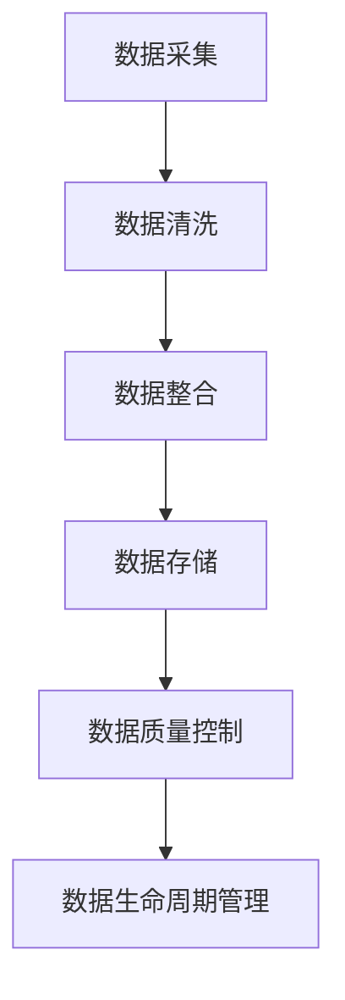

                 

## 引言

随着人工智能技术的飞速发展，自动驾驶已经成为未来交通领域的重要研究方向。自动驾驶技术不仅能提高驾驶安全性，还能提升交通效率，减少拥堵和环境污染。然而，自动驾驶技术的发展离不开大量高质量数据的支撑。数据治理与质量控制成为自动驾驶公司面临的一项关键挑战。

本文旨在探讨自动驾驶公司在数据治理与质量控制方面的流程与实践。首先，我们将简要回顾自动驾驶行业的发展历程和现状。接着，详细介绍数据治理的概念、框架和质量管理的要点。随后，我们将深入探讨数据治理流程中的关键环节，包括数据采集与整合、数据质量控制以及数据生命周期管理。在此基础上，本文还将介绍质量控制流程中的自动驾驶测试场景与测试指标、质量控制工具与应用。最后，我们将通过实际案例总结自动驾驶数据治理与质量控制的实践经验，并展望未来的发展方向。

本文的关键词包括：自动驾驶、数据治理、质量控制、数据管理、测试场景、测试指标、质量控制工具。

摘要：本文全面探讨了自动驾驶公司在数据治理与质量控制方面的实践与挑战。通过分析自动驾驶行业的发展背景，我们明确了数据治理的重要性。接着，详细介绍了数据治理框架、数据质量管理和数据生命周期管理的流程与方法。在此基础上，文章重点探讨了自动驾驶测试场景与测试指标、质量控制工具与应用，并通过实际案例总结了相关经验。最后，文章展望了自动驾驶数据治理与质量控制未来的发展趋势。

### 第1章：自动驾驶行业概述

自动驾驶技术是人工智能（AI）在交通领域的一个重要应用。它通过传感器、计算机视觉、机器学习和深度学习等技术，使车辆能够自主感知环境、规划路径、做出决策，并安全、可靠地执行驾驶任务。自动驾驶技术的发展历程可以追溯到20世纪40年代，但真正引起广泛关注和研究的起点是1980年代左右，当时一些研究机构和汽车制造商开始开发自动驾驶车辆原型。

#### 1.1 自驾车辆发展历史

1. **早期研究阶段（1940s-1970s）**：
   - 1940年代，美国科学家路瑟·达维南提出了“机械司机”的概念，开启了自动驾驶研究的先河。
   - 1950年代，研究主要集中在自动导引车和机场摆渡车上。
   - 1970年代，美国和苏联进行了卫星导航和自动驾驶的研究，为后来的全球定位系统（GPS）奠定了基础。

2. **商业化探索阶段（1980s-1990s）**：
   - 1980年代，许多国家和公司开始进行自动驾驶汽车的实验，如美国的卡耐基梅隆大学、德国的博世公司等。
   - 1990年代，自动驾驶技术逐渐应用于商用车辆，如自动卸货的卡车和自动清扫车。

3. **技术突破阶段（2000s-2010s）**：
   - 2000年代，随着计算机处理能力和传感器技术的提升，自动驾驶技术取得了重要突破。
   - 2004年，谷歌开始研发自动驾驶汽车，并在随后的几年中取得了显著进展。
   - 2010年代，特斯拉、Uber等公司也开始积极投入自动驾驶技术的研发和应用。

4. **规模化应用阶段（2020s至今）**：
   - 2020年代，自动驾驶技术逐渐从实验室走向市场，开始在特定场景和区域内进行商业化应用。
   - 自动驾驶出租车、货车和公共交通工具开始出现，标志着自动驾驶技术进入了规模化应用的新阶段。

#### 1.2 自动驾驶技术分类

自动驾驶技术根据自动驾驶的级别可以分为不同的类型。根据美国汽车工程师协会（SAE）的定义，自动驾驶分为0到5级，具体分类如下：

1. **0级（无自动化）**：所有的驾驶任务都由人类驾驶员完成。
2. **1级（驾驶辅助）**：车辆提供单一的驾驶功能，如自适应巡航控制或车道保持辅助。
3. **2级（部分自动化）**：车辆同时控制转向和速度，但驾驶员需要随时准备接管控制。
4. **3级（有条件自动化）**：车辆能够在特定的交通环境下完全自主驾驶，但需要驾驶员在特定条件下接管控制。
5. **4级（高度自动化）**：车辆能够在大多数或所有交通环境下自主驾驶，无需驾驶员干预。
6. **5级（完全自动化）**：车辆在任何环境和条件下都能自主驾驶，无需驾驶员。

#### 1.3 自动驾驶产业链分析

自动驾驶产业链主要包括以下几个环节：

1. **传感器供应商**：提供车辆感知环境所需的各种传感器，如雷达、激光雷达（LiDAR）、摄像头等。
2. **硬件制造商**：生产自动驾驶所需的硬件设备，如车载电脑、控制器等。
3. **软件开发商**：开发和提供自动驾驶软件，包括感知、规划、控制等核心算法。
4. **整车制造商**：将自动驾驶技术与传统汽车集成，生产自动驾驶汽车。
5. **测试与验证**：提供自动驾驶车辆的测试与验证服务，确保其安全性和可靠性。
6. **运营与服务**：提供自动驾驶车辆的运营服务，如自动驾驶出租车、货车等。

自动驾驶技术的发展不仅涉及到技术层面的突破，还涉及到政策、法规、基础设施建设等多个方面。未来，随着技术的不断进步和产业链的成熟，自动驾驶有望在更广泛的场景中得到应用，推动交通方式的变革。

### 第2章：数据治理概述

在自动驾驶技术的发展过程中，数据治理显得尤为重要。数据治理是指通过制定政策、标准和流程，确保数据的准确性、完整性、一致性和安全性，从而支持自动驾驶系统的高效运行和决策。数据治理的有效实施不仅能够提高数据的质量，还能促进数据的充分利用，为自动驾驶系统的持续优化提供坚实的基础。

#### 2.1 数据治理的重要性

1. **支持自动驾驶系统的决策**：
   自动驾驶系统依赖于海量数据的输入进行感知、决策和控制。数据治理确保了数据的准确性和可靠性，从而支持自动驾驶系统做出正确的决策，提高驾驶安全性。

2. **提升数据质量**：
   数据质量是自动驾驶系统运行的关键。数据治理通过数据清洗、整合和质量控制等手段，提升数据的准确性、一致性和完整性，确保数据的有效性。

3. **保障数据安全与隐私**：
   自动驾驶系统涉及大量敏感数据，如位置信息、车辆状态等。数据治理通过制定安全政策和标准，保护数据的安全性和隐私性，防止数据泄露和滥用。

4. **支持数据利用和业务创新**：
   数据治理能够促进数据的充分利用，为自动驾驶系统的业务分析和决策提供支持。通过数据治理，企业可以挖掘数据的价值，推动业务创新和可持续发展。

#### 2.2 数据治理框架

数据治理框架是实施数据治理的指导性框架，它包括以下几个方面：

1. **数据治理组织**：
   数据治理组织是负责制定和执行数据治理策略、标准和流程的机构。数据治理组织通常由数据治理委员会、数据管理人员和数据所有者组成。

2. **数据治理策略**：
   数据治理策略是指制定数据治理的目标、原则和实施路径。数据治理策略需要考虑数据的准确性、完整性、一致性、安全性等方面。

3. **数据治理流程**：
   数据治理流程包括数据采集、存储、处理、分析、共享和销毁等各个环节。每个环节都需要制定具体的流程和操作规范，确保数据治理的有效实施。

4. **数据治理标准**：
   数据治理标准是确保数据质量的基础。数据治理标准包括数据质量标准、数据安全标准、数据共享标准和数据隐私标准等。

5. **数据治理工具**：
   数据治理工具是支持数据治理流程和标准实施的技术手段。常见的数据治理工具包括数据质量管理工具、数据安全工具、数据共享平台等。

#### 2.3 数据质量管理

数据质量管理是数据治理的核心任务之一。数据质量管理包括以下方面：

1. **数据质量评估**：
   数据质量评估是通过对数据进行检查、分析和测试，评估数据的准确性、完整性、一致性和及时性。常用的数据质量评估方法包括统计方法、规则方法和机器学习方法。

2. **数据清洗**：
   数据清洗是通过对数据进行清洗、修复和转换，去除数据中的错误、重复和缺失值。数据清洗的方法包括手动清洗和自动清洗。

3. **数据预处理**：
   数据预处理是对数据进行规范化、归一化、标准化等处理，使其适合进行进一步分析和建模。数据预处理的方法包括特征提取、特征选择和特征工程等。

4. **数据质量监测**：
   数据质量监测是通过对数据进行实时监控和预警，及时发现和处理数据质量问题。数据质量监测的方法包括实时监控工具和异常检测算法。

5. **数据质量控制**：
   数据质量控制是通过制定数据质量标准和流程，确保数据质量符合预期目标。数据质量控制的方法包括质量评估、质量监控和质量改进等。

通过数据治理框架和数据质量管理的实施，自动驾驶公司能够确保数据的高质量，为自动驾驶系统的研发、测试和运营提供有力支持。在接下来的章节中，我们将进一步探讨自动驾驶公司的数据治理流程和质量控制流程。

### 第3章：数据采集与整合

在自动驾驶系统中，数据采集与整合是数据治理流程中的关键环节。有效的数据采集与整合能够确保数据的完整性和准确性，为自动驾驶算法的训练、优化和决策提供可靠的数据基础。

#### 3.1 数据源类型及采集方法

自动驾驶系统需要采集多种类型的数据，这些数据可以分为以下几类：

1. **环境数据**：
   - **传感器数据**：包括摄像头、雷达、激光雷达（LiDAR）、超声波传感器等采集到的数据。
   - **GPS数据**：用于获取车辆的地理位置信息。
   - **天气数据**：包括温度、湿度、风速、降雨量等，用于环境感知和决策。

2. **车辆状态数据**：
   - **车辆传感器数据**：包括速度、加速度、油门、刹车、方向盘角度等。
   - **车辆内部数据**：如电池电量、冷却液温度、轮胎压力等。

3. **交通数据**：
   - **道路状况数据**：包括交通流量、交通拥堵、道路施工等信息。
   - **其他车辆数据**：包括其他车辆的行驶轨迹、速度、方向等。

采集方法可以分为以下几种：

- **主动采集**：通过自动驾驶车辆的传感器和通信系统主动收集数据。
- **被动采集**：通过远程监测系统或网络数据收集车辆数据。
- **结合采集**：将主动采集和被动采集相结合，提高数据采集的全面性和准确性。

#### 3.2 数据整合流程

数据整合是将来自不同来源的数据进行清洗、转换和合并，以形成统一的、一致的数据集。数据整合流程通常包括以下几个步骤：

1. **数据采集**：
   - 通过各种传感器和通信系统收集数据。
   - 将数据存储在临时存储区域，如数据湖或数据仓库。

2. **数据清洗**：
   - 识别和修复数据中的错误、缺失值和重复数据。
   - 对数据格式进行规范化，确保数据的一致性和兼容性。

3. **数据转换**：
   - 将不同来源的数据转换为统一的格式和结构。
   - 对数据进行归一化和标准化处理，使其适合进行进一步分析和建模。

4. **数据合并**：
   - 将不同类型的数据进行合并，形成完整的、多维度的数据集。
   - 使用关联规则和匹配算法，将车辆状态数据、环境数据、交通数据等进行匹配和关联。

5. **数据存储**：
   - 将整合后的数据存储在数据仓库或数据湖中，便于后续的数据分析和处理。

#### 3.3 数据存储方案

为了确保数据的安全、可靠和高效访问，自动驾驶公司需要选择合适的存储方案。常见的数据存储方案包括：

1. **关系型数据库**：
   - 适用于结构化数据存储和管理，如车辆状态数据、GPS数据等。
   - 提供强大的查询和事务处理能力。

2. **非关系型数据库**：
   - 适用于存储和处理半结构化或非结构化数据，如传感器数据、文本数据等。
   - 提供灵活的数据模型和高效的数据访问能力。

3. **数据仓库**：
   - 用于存储和管理大量结构化和半结构化数据。
   - 提供强大的数据分析和报表功能。

4. **数据湖**：
   - 用于存储海量原始数据，包括结构化、半结构化和非结构化数据。
   - 提供灵活的数据处理和分析能力。

5. **分布式文件系统**：
   - 如Hadoop HDFS、Apache HBase等，用于存储和管理大规模数据。
   - 提供高吞吐量和高可用性。

通过合理选择和配置数据存储方案，自动驾驶公司能够确保数据的高效存储和管理，为自动驾驶系统的运行提供有力支持。在接下来的章节中，我们将进一步探讨数据质量控制的方法和流程。

### 第4章：数据质量控制

在自动驾驶系统中，数据质量控制是确保数据质量和数据可靠性的关键环节。高质量的数据对于自动驾驶系统的训练、测试和运行至关重要。因此，本节将详细探讨数据质量控制的关键指标、数据清洗与预处理的方法以及数据质量监测与报告的流程。

#### 4.1 数据质量评估指标

数据质量评估指标是衡量数据质量的重要标准。以下是几种常见的数据质量评估指标：

1. **准确性**：
   - 准确性是指数据与真实情况的一致程度。
   - 可以通过比较数据与外部权威数据源或标准数据的差异来评估。

2. **完整性**：
   - 完整性是指数据集是否包含所有需要的信息，没有缺失值。
   - 可以通过检查数据集是否存在缺失值、重复值来评估完整性。

3. **一致性**：
   - 一致性是指数据在各个系统和源中保持一致。
   - 可以通过比较不同数据源中的同一数据项来评估一致性。

4. **及时性**：
   - 及时性是指数据是否能够在需要的时间内提供。
   - 可以通过评估数据更新频率和响应时间来评估及时性。

5. **可靠性**：
   - 可靠性是指数据的准确性和一致性。
   - 可以通过数据验证和测试结果来评估数据的可靠性。

6. **可用性**：
   - 可用性是指数据是否能够被有效利用，满足用户需求。
   - 可以通过用户反馈和使用频率来评估可用性。

#### 4.2 数据清洗与预处理

数据清洗与预处理是提高数据质量的重要步骤。以下是一些常见的数据清洗与预处理方法：

1. **缺失值处理**：
   - 对于缺失值，可以选择填充方法（如平均值、中位数填充）或删除方法（如删除包含缺失值的记录）。

2. **异常值处理**：
   - 通过统计学方法（如3sigma规则）或可视化方法（如箱线图）检测并处理异常值。
   - 可以选择保留、修正或删除异常值。

3. **重复值处理**：
   - 通过匹配算法和唯一性检查，识别和删除重复数据。

4. **数据规范化**：
   - 对不同数据源的数据进行格式转换和统一编码。
   - 包括数值数据归一化、文本数据标准化等。

5. **数据转换**：
   - 将原始数据转换为适合分析和建模的格式。
   - 包括时间序列数据对齐、传感器数据转换等。

6. **数据增强**：
   - 通过添加噪声、生成虚拟数据等方法，增加数据的多样性和鲁棒性。

#### 4.3 数据质量监测与报告

数据质量监测与报告是确保数据持续高质量的重要机制。以下是一些常见的监测和报告方法：

1. **实时监控**：
   - 通过实时监控系统，持续监控数据质量指标。
   - 包括自动检测和报警功能，及时发现和处理数据质量问题。

2. **定期审计**：
   - 定期对数据质量进行审计和评估。
   - 包括数据质量评估、异常值检查和完整性验证等。

3. **数据质量报告**：
   - 定期生成数据质量报告，总结数据质量状况。
   - 包括数据质量评估结果、数据异常情况、改进措施等。

4. **用户反馈**：
   - 收集用户对数据质量的反馈。
   - 包括用户满意度调查、数据使用情况分析等。

通过实施严格的数据质量控制流程，自动驾驶公司能够确保数据的高质量，从而支持自动驾驶系统的研发、测试和运行。在接下来的章节中，我们将进一步探讨数据生命周期管理的方法和流程。

### 第5章：数据生命周期管理

数据生命周期管理（Data Lifecycle Management, DLM）是确保数据在整个生命周期内得到有效管理和保护的重要过程。对于自动驾驶公司而言，数据生命周期管理不仅关系到数据的质量和安全，还直接影响自动驾驶系统的性能和可靠性。本节将详细探讨数据生命周期管理的流程、数据安全与隐私保护措施以及数据备份与恢复策略。

#### 5.1 数据生命周期管理流程

数据生命周期管理流程通常包括以下几个关键阶段：

1. **数据生成与采集**：
   - 自动驾驶车辆通过各种传感器和通信系统实时生成大量数据。
   - 数据采集过程中需要确保数据的完整性和准确性。

2. **数据存储**：
   - 数据存储阶段是将采集到的数据存储在适当的存储系统中，如关系型数据库、非关系型数据库、数据仓库或数据湖。
   - 需要考虑存储容量、数据访问速度和数据安全性等因素。

3. **数据预处理**：
   - 数据预处理包括数据清洗、转换、整合和标准化等操作。
   - 通过预处理，提高数据的质量和一致性，为后续分析做好准备。

4. **数据处理与分析**：
   - 在这一阶段，对预处理后的数据进行深入分析和处理，提取有用信息。
   - 可能包括机器学习模型训练、统计分析、数据挖掘等。

5. **数据使用**：
   - 数据使用阶段是将处理后的数据应用于自动驾驶系统的训练、测试和优化。
   - 确保数据能够在正确的时间和地点被有效利用。

6. **数据归档**：
   - 对于不再频繁使用的旧数据，可以进行归档处理，将其转移到低成本的存储介质上。
   - 归档数据仍然需要保持可访问性，以备将来可能的使用。

7. **数据销毁**：
   - 当数据不再需要时，需要进行安全销毁，以防止数据泄露和隐私侵犯。
   - 销毁过程应确保数据无法被恢复。

#### 5.2 数据安全与隐私保护

在数据生命周期管理中，数据安全与隐私保护至关重要。以下是一些关键措施：

1. **数据加密**：
   - 对敏感数据进行加密处理，确保数据在传输和存储过程中的安全性。
   - 采用强加密算法和密钥管理策略。

2. **访问控制**：
   - 实施严格的访问控制策略，确保只有授权用户可以访问数据。
   - 通过身份验证、权限分配和审计日志等手段实现访问控制。

3. **数据备份**：
   - 定期进行数据备份，以防止数据丢失或损坏。
   - 备份数据应存储在安全的地方，并定期进行验证。

4. **数据隐私保护**：
   - 对涉及个人隐私的数据进行特殊处理，如匿名化、去标识化等。
   - 遵守相关法律法规，确保数据隐私保护合规。

5. **安全审计**：
   - 定期进行安全审计，评估数据安全措施的有效性。
   - 及时发现和修复安全漏洞。

#### 5.3 数据备份与恢复

数据备份与恢复是确保数据长期可用和业务连续性的重要措施。以下是一些关键策略：

1. **备份策略**：
   - 根据数据的重要性和访问频率，制定合适的备份策略，如全备份、增量备份和差异备份。
   - 备份数据应存储在多个位置，以防止单一故障导致数据丢失。

2. **备份频率**：
   - 根据业务需求，确定合适的备份频率，如每日备份、每周备份等。
   - 高频备份可以减少数据丢失的风险。

3. **备份存储**：
   - 备份数据应存储在安全、可靠的地方，如远程数据中心、云存储等。
   - 备份数据需要定期进行验证，确保数据完整性。

4. **恢复策略**：
   - 制定数据恢复计划，包括恢复流程、恢复时间和恢复目标等。
   - 定期进行恢复测试，确保在紧急情况下能够快速恢复数据。

5. **灾难恢复**：
   - 对于大规模数据丢失或系统故障，制定灾难恢复计划，确保业务能够在短时间内恢复。
   - 包括备用数据中心、异地备份等。

通过实施完整的数据生命周期管理流程，自动驾驶公司能够确保数据在整个生命周期内得到有效管理、保护和利用，从而为自动驾驶技术的发展提供坚实的数据基础。在接下来的章节中，我们将探讨自动驾驶测试场景与测试指标。

### 第6章：自动驾驶测试场景与测试指标

在自动驾驶技术的研究与开发过程中，测试是确保系统安全、可靠运行的关键环节。通过设计多样化的测试场景和建立完善的测试指标体系，自动驾驶公司可以全面评估系统的性能和稳定性。本节将详细探讨自动驾驶测试场景的分类、测试指标体系以及具体的测试方法。

#### 6.1 自动驾驶测试场景分类

自动驾驶测试场景可以根据不同的分类标准进行划分，常见的分类方法包括以下几种：

1. **按环境条件划分**：
   - **城市环境**：包含多种交通参与者、复杂的道路结构和交通规则。
   - **郊区环境**：相对城市环境更为简单，交通参与者较少，道路条件较为单一。
   - **高速公路环境**：以直线道路为主，交通参与者相对较少，速度限制较高。
   - **极端天气环境**：如雨雪、雾霾、冰冻等，测试自动驾驶系统在恶劣天气条件下的表现。

2. **按交通状况划分**：
   - **静止状态**：车辆在停车场、路口等静止场景下的测试。
   - **低速移动**：车辆在低速行驶、停车启动等场景下的测试。
   - **中高速移动**：车辆在高速行驶、换道等场景下的测试。
   - **交通拥堵**：测试系统在交通拥堵、频繁刹车和加速等复杂交通状况下的表现。

3. **按功能模块划分**：
   - **感知模块测试**：测试自动驾驶系统的感知能力，如障碍物检测、车道线识别等。
   - **规划模块测试**：测试自动驾驶系统的路径规划和决策能力，如避让障碍物、保持车道等。
   - **控制模块测试**：测试自动驾驶系统的控制能力，如加速、减速、转向等。

#### 6.2 自动驾驶测试指标体系

为了全面评估自动驾驶系统的性能，需要建立一套科学、系统的测试指标体系。以下是一些常见的测试指标：

1. **感知能力指标**：
   - **障碍物检测率**：系统检测到障碍物的准确率。
   - **障碍物定位精度**：系统对障碍物位置的估计误差。
   - **车道线识别率**：系统识别车道线的准确率。
   - **道路标志识别率**：系统识别道路标志的准确率。

2. **规划能力指标**：
   - **路径规划时间**：系统生成路径规划所需的时间。
   - **路径规划质量**：系统生成的路径规划的合理性、安全性和效率。
   - **决策响应时间**：系统在接收到感知信息后做出决策的时间。

3. **控制能力指标**：
   - **控制稳定性**：系统在执行控制命令时的稳定性。
   - **加速性能**：系统的加速响应时间和加速度。
   - **制动性能**：系统的制动响应时间和减速度。
   - **转向性能**：系统的转向响应角度和转向力矩。

4. **安全性能指标**：
   - **碰撞率**：系统在测试过程中发生碰撞的频率。
   - **事故责任率**：系统在发生事故时承担的责任比例。
   - **紧急制动率**：系统紧急制动的频率和响应时间。

5. **用户满意度指标**：
   - **用户体验**：用户对自动驾驶系统的主观评价。
   - **可靠性**：系统的稳定性和可靠性。
   - **便利性**：系统的易用性和操作简便性。

#### 6.3 自动驾驶测试方法

自动驾驶测试方法通常包括以下几种：

1. **模拟测试**：
   - 使用仿真软件创建虚拟测试环境，模拟真实交通状况进行测试。
   - 适用于早期开发和验证系统算法。

2. **封闭场地测试**：
   - 在封闭的测试场地（如测试跑道、测试场）进行系统测试。
   - 适用于验证系统的感知、规划和控制能力。

3. **道路测试**：
   - 在实际道路上进行测试，包括城市道路、高速公路和郊区道路。
   - 适用于全面评估系统的性能和可靠性。

4. **场外测试**：
   - 在特定场景（如停车场、交叉路口）进行系统测试。
   - 适用于验证系统在特定场景下的表现。

5. **用户测试**：
   - 在真实用户驾驶过程中收集数据，评估系统的性能和用户体验。
   - 适用于收集用户反馈，优化系统设计。

通过设计多样化的测试场景、建立完善的测试指标体系并采用科学的测试方法，自动驾驶公司可以全面评估自动驾驶系统的性能，确保系统的安全、可靠运行。在接下来的章节中，我们将探讨质量控制工具与应用。

### 第7章：质量控制工具与应用

在自动驾驶技术的研发和测试过程中，质量控制工具的应用至关重要。这些工具不仅能够提高数据处理的效率和准确性，还能确保测试过程的标准化和可重复性。本节将详细介绍自动驾驶测试中常用的质量控制工具，包括自动驾驶测试工具、质量控制平台建设以及质量控制案例。

#### 7.1 自动驾驶测试工具

自动驾驶测试工具是确保自动驾驶系统可靠性和安全性的关键。以下是一些常用的测试工具：

1. **传感器测试工具**：
   - 用于评估传感器性能，如摄像头、雷达和激光雷达（LiDAR）。
   - 包括传感器校准工具、测试台和仿真环境等。

2. **仿真工具**：
   - 用于创建虚拟测试环境，模拟不同交通状况和场景。
   - 如CARLA模拟器、AirSim和SUMO等。

3. **自动化测试工具**：
   - 用于自动化执行测试脚本，减少手动测试的工作量。
   - 如Selenium、Robot Framework和TestNG等。

4. **数据分析工具**：
   - 用于处理和分析测试数据，识别潜在问题和改进方向。
   - 如MATLAB、Python的Pandas和NumPy库等。

5. **质量控制工具**：
   - 用于监控和管理测试过程，确保测试的质量和一致性。
   - 如Jenkins、GitLab CI和Travis CI等。

#### 7.2 质量控制平台建设

建立质量控制平台是确保自动驾驶项目高效运行的重要步骤。质量控制平台通常包括以下几个关键组件：

1. **测试管理**：
   - 用于管理测试计划、测试用例和测试结果。
   - 提供测试跟踪和报告功能。

2. **自动化测试**：
   - 实现测试过程的自动化，减少人工干预。
   - 包括测试脚本开发、执行和结果分析。

3. **持续集成**：
   - 自动化构建、测试和部署过程，确保代码质量和测试覆盖。
   - 使用工具如Jenkins、GitLab CI等。

4. **数据管理**：
   - 用于存储、管理和分析测试数据。
   - 提供数据可视化和报表功能。

5. **缺陷跟踪**：
   - 管理测试过程中发现的缺陷，确保缺陷得到及时修复。
   - 使用工具如JIRA、Bugzilla等。

6. **监控和报告**：
   - 实时监控测试过程，生成详细报告。
   - 提供测试进度、覆盖率和质量的实时反馈。

#### 7.3 质量控制案例分析

以下是一个质量控制案例，展示如何在实际项目中应用质量控制工具和平台：

1. **项目背景**：
   - 一家自动驾驶公司正在进行自动驾驶车辆的感知系统开发，需要确保系统的准确性和可靠性。

2. **测试计划**：
   - 设计了包括传感器性能测试、仿真测试和道路测试在内的全面测试计划。
   - 确定了测试目标、测试用例和测试环境。

3. **测试执行**：
   - 使用传感器测试工具对摄像头、雷达和LiDAR进行校准和性能测试。
   - 使用仿真工具创建虚拟测试环境，进行仿真测试。
   - 在实际道路上进行道路测试，覆盖多种交通场景。

4. **数据管理**：
   - 使用数据分析工具对测试数据进行处理和分析，识别潜在的异常和问题。
   - 使用数据管理平台存储和管理测试数据，提供数据可视化功能。

5. **缺陷跟踪**：
   - 使用缺陷跟踪工具记录测试过程中发现的缺陷，分配给相关开发人员进行修复。
   - 确保缺陷得到及时修复，并在下一次测试中进行验证。

6. **测试报告**：
   - 定期生成测试报告，总结测试结果、缺陷和改进措施。
   - 提供详细的测试覆盖率和质量分析。

通过建立科学的质量控制平台和应用先进的质量控制工具，自动驾驶公司能够确保自动驾驶系统的质量，提高研发效率和产品竞争力。在接下来的章节中，我们将通过实际案例总结自动驾驶数据治理与质量控制的实践经验。

### 第8章：自动驾驶数据治理与质量控制实践

在自动驾驶技术的实际应用过程中，数据治理与质量控制起着至关重要的作用。以下将通过两个具体案例，分别展示自动驾驶公司在数据治理和质量控制方面的实践经验。

#### 8.1 数据治理实践案例

**案例背景**：
某自动驾驶公司（以下简称“公司”）在开发自动驾驶系统时，面临海量多源数据的采集、处理和管理挑战。为了确保数据的质量和可靠性，公司制定了一套完整的数据治理方案。

**实践过程**：

1. **数据采集与整合**：
   - **传感器数据**：公司使用了多种传感器，包括摄像头、雷达和LiDAR，采集环境数据和车辆状态数据。
   - **数据源类型及采集方法**：通过主动采集和被动采集相结合，确保数据的全面性和准确性。
   - **数据整合流程**：采用数据清洗、转换和合并的方法，整合不同类型和来源的数据，形成统一的数据集。

2. **数据质量管理**：
   - **数据质量评估**：通过定期进行数据质量评估，检查数据的准确性、完整性、一致性和及时性。
   - **数据清洗与预处理**：针对数据中的缺失值、异常值和重复值，采用相应的处理方法，确保数据质量。
   - **数据质量监测与报告**：建立实时数据质量监测系统，定期生成数据质量报告，及时反馈和解决数据质量问题。

3. **数据生命周期管理**：
   - **数据存储**：使用分布式文件系统（如Hadoop HDFS）存储海量原始数据，确保数据的高效访问和管理。
   - **数据备份与恢复**：定期进行数据备份，并制定详细的恢复策略，确保数据的安全性和可用性。
   - **数据安全与隐私保护**：对敏感数据进行加密处理，并实施严格的访问控制，防止数据泄露和滥用。

**实践效果**：
通过严格的数据治理，公司有效提高了数据质量，确保了自动驾驶系统的可靠性和安全性。同时，数据治理平台为后续的数据分析和模型训练提供了坚实的基础，提升了公司的研发效率和产品竞争力。

#### 8.2 质量控制实践案例

**案例背景**：
某自动驾驶公司（以下简称“公司”）在开发自动驾驶车辆时，需要通过严格的测试和验证来确保系统的安全性和可靠性。为了提高测试效率和质量，公司建立了一套完善的质量控制体系。

**实践过程**：

1. **测试场景设计**：
   - **测试场景分类**：根据不同的环境和交通状况，设计包括城市环境、郊区环境、高速公路环境和极端天气环境在内的多种测试场景。
   - **测试指标体系**：建立包括感知能力、规划能力、控制能力和安全性能在内的测试指标体系，确保全面评估系统的性能。

2. **测试执行**：
   - **模拟测试**：使用仿真工具（如CARLA模拟器）创建虚拟测试环境，进行早期开发和验证。
   - **封闭场地测试**：在封闭测试场进行感知、规划和控制能力的验证。
   - **道路测试**：在实际道路上进行全面的系统测试，包括多种交通状况和复杂场景。

3. **数据管理与分析**：
   - **测试数据管理**：使用数据管理平台存储和管理测试数据，提供数据可视化和报表功能。
   - **数据分析**：通过数据分析工具处理测试数据，识别潜在问题和改进方向。

4. **缺陷跟踪与修复**：
   - **缺陷跟踪**：使用缺陷跟踪工具记录测试过程中发现的缺陷，分配给相关开发人员进行修复。
   - **缺陷验证**：在修复后进行验证，确保缺陷得到有效解决。

5. **测试报告**：
   - **测试报告生成**：定期生成详细的测试报告，总结测试结果、缺陷和改进措施。
   - **测试结果反馈**：将测试结果和分析报告反馈给研发团队，指导系统的改进和优化。

**实践效果**：
通过完善的质量控制体系，公司成功提高了自动驾驶系统的安全性和可靠性。测试过程中发现的问题和缺陷得到了及时修复，测试效率和质量显著提升，为公司产品的市场推广奠定了坚实基础。

通过上述两个案例，我们可以看到，自动驾驶公司在数据治理与质量控制方面采取了一系列有效的实践措施，这些措施不仅确保了数据的质量和安全，还提高了系统的性能和可靠性，为自动驾驶技术的快速发展提供了有力支持。

### 第9章：未来发展展望

随着自动驾驶技术的不断进步，数据治理与质量控制的重要性愈发凸显。未来，自动驾驶技术将在多个方面取得显著发展，同时数据治理与质量控制也将面临新的挑战和机遇。

#### 9.1 自动驾驶技术发展趋势

1. **技术成熟度提升**：
   - 自动驾驶技术从初级阶段逐渐迈向成熟阶段，自动驾驶级别将从L2、L3逐步提升到L4、L5。
   - 先进感知技术、高性能计算和深度学习算法的发展，将显著提升自动驾驶系统的感知和决策能力。

2. **多元化应用场景**：
   - 自动驾驶技术将不再局限于城市和高速公路，逐渐扩展到郊区、乡村以及极端天气等复杂环境。
   - 自动驾驶系统将在物流、公共交通、农业、矿山等多个领域得到广泛应用。

3. **车联网与智能化融合**：
   - 车联网（V2X）技术的发展，将实现车辆与基础设施、车辆与车辆之间的实时通信，提升整体交通系统的智能化水平。
   - 自动驾驶将与智能城市、智能交通系统深度融合，推动智慧交通的发展。

#### 9.2 数据治理与质量控制挑战与机遇

1. **数据量爆炸性增长**：
   - 随着自动驾驶应用的普及，数据量将呈现爆炸性增长。这要求数据治理体系具备更高的处理能力和更高效的存储方案。
   - 数据治理需要解决如何从海量数据中提取有价值的信息，提升数据分析的效率和准确性。

2. **数据安全与隐私保护**：
   - 自动驾驶系统涉及大量敏感数据，如车辆位置、行驶轨迹、驾驶员行为等，数据安全和隐私保护面临巨大挑战。
   - 需要制定严格的数据安全政策和隐私保护措施，确保数据在采集、存储、传输和使用的各个环节得到有效保护。

3. **数据一致性管理**：
   - 自动驾驶系统中不同来源、不同类型的数据需要保持一致性。数据治理需要解决如何实现数据标准化、格式统一和属性匹配等问题。
   - 通过建立统一的数据治理框架和标准化流程，确保数据在不同系统和平台之间的一致性。

4. **质量监控与持续优化**：
   - 随着自动驾驶技术的快速发展，数据质量和控制要求将不断提高。数据治理需要建立实时监控和反馈机制，确保数据质量的持续提升。
   - 需要引入先进的数据质量监测工具和方法，实现数据质量问题的快速发现和解决。

5. **法律法规与标准化**：
   - 自动驾驶技术的普及将推动相关法律法规的完善和标准化进程。数据治理需要遵循国家和行业的法律法规，确保合规性。
   - 需要积极参与行业标准化工作，推动数据治理与质量控制标准的制定和实施。

#### 9.3 未来发展方向

1. **智能化数据治理**：
   - 利用人工智能技术，实现数据治理的智能化，提高数据质量和处理效率。
   - 例如，通过机器学习算法，自动识别和修复数据中的异常值和缺失值。

2. **分布式数据处理**：
   - 随着数据量的增长，分布式数据处理技术将成为主流。通过分布式数据库、大数据平台和云计算，实现高效的数据存储和处理。
   - 分布式架构能够提高系统的扩展性和容错性，满足大规模数据处理的需求。

3. **数据隐私保护创新**：
   - 探索数据隐私保护的新技术，如联邦学习、差分隐私、区块链等，提高数据安全性和隐私保护水平。
   - 通过技术创新，实现数据在开放和安全之间的平衡。

4. **跨行业合作与标准化**：
   - 加强行业间的合作，共同推动数据治理与质量控制标准的制定和实施。
   - 通过跨行业合作，共享经验和最佳实践，推动自动驾驶数据治理的标准化和规范化。

总之，未来自动驾驶技术的发展将为数据治理与质量控制带来新的挑战和机遇。通过不断创新和优化，自动驾驶公司能够更好地应对这些挑战，实现自动驾驶技术的可持续发展。

### 附录

#### 附录A：相关工具与资源介绍

为了更好地实施自动驾驶数据治理与质量控制，以下是一些常用的工具和资源：

1. **传感器测试工具**：
   - **Neusoft Sensor Test Suite**：提供多传感器校准和测试功能，支持摄像头、雷达、激光雷达等。
   - **SICK AG**：提供传感器校准工具和测试平台，适用于激光雷达和视觉传感器。

2. **仿真工具**：
   - **CARLA Simulator**：开源的自动驾驶仿真平台，支持多种传感器和车辆模型。
   - **AirSim**：由Microsoft Research开发，支持多传感器和自定义场景的仿真。

3. **自动化测试工具**：
   - **Selenium**：用于Web应用的自动化测试，支持多种浏览器。
   - **Robot Framework**：开源的测试框架，适用于各种类型的自动化测试。

4. **数据分析工具**：
   - **MATLAB**：提供丰富的数据分析、建模和可视化工具。
   - **Python的Pandas和NumPy库**：用于数据处理和分析，支持大数据处理。

5. **数据治理工具**：
   - **Informatica**：提供数据集成、数据质量和数据管理工具。
   - **Talend**：提供数据治理和ETL（提取、转换、加载）工具。

6. **缺陷跟踪工具**：
   - **JIRA**：用于缺陷管理和项目管理，支持敏捷开发。
   - **Bugzilla**：开源的缺陷跟踪系统，适用于开源项目。

7. **持续集成工具**：
   - **Jenkins**：开源的持续集成工具，支持多种构建和测试平台。
   - **GitLab CI/CD**：内置的持续集成和持续交付工具，支持GitLab仓库。

8. **云平台与大数据技术**：
   - **AWS**：提供全面的云服务和大数据解决方案。
   - **Azure**：提供云服务和大数据处理工具。
   - **Google Cloud Platform**：提供云计算和大数据服务。

#### 附录B：术语表

以下是一些本文中使用的术语及其定义：

- **数据治理**：通过制定政策、标准和流程，确保数据的准确性、完整性、一致性和安全性。
- **数据质量**：数据满足预期目标和使用要求的程度，包括准确性、完整性、一致性、及时性和可靠性。
- **传感器**：用于感知车辆周围环境的装置，如摄像头、雷达、激光雷达等。
- **仿真**：在虚拟环境中模拟真实世界的过程，用于测试和验证自动驾驶系统。
- **持续集成（CI）**：通过自动化构建、测试和部署，确保代码质量和测试覆盖。
- **持续交付（CD）**：通过自动化构建、测试和部署，实现快速、可靠地交付软件。

#### 附录C：参考文献

1. **Sae J3016**：自动驾驶汽车标准，定义了自动驾驶的分级体系。
2. **Verma, P., & Raghunathan, S. (2018). Data Governance for IoT. Morgan & Claypool Publishers**：关于物联网数据治理的书籍。
3. **Zikopoulos, N., deRoos, R., & Inmon, W. H. (2015). Data Governance: Fundamentals for Success. McGraw-Hill Education**：关于数据治理基础和成功的书籍。
4. **Elmagarmid, A. K., Ceri, S., & Navathe, S. B. (2015). Foundations of Databases. Wiley**：关于数据库基础和设计的书籍。
5. **Kshirsagar, S., & Fernandes, D. (2019). Machine Learning: A Supervised Learning Approach. Springer**：关于机器学习算法的书籍。

#### 附录D：Mermaid 流程图与伪代码示例

**Mermaid 流程图示例：**


**伪代码示例：**
```python
# 数据清洗伪代码
def clean_data(data):
    # 去除缺失值
    data = remove_missing_values(data)
    # 处理异常值
    data = handle_outliers(data)
    # 规范化数据
    data = normalize_data(data)
    return data

# 数据质量评估伪代码
def assess_data_quality(data):
    # 检查准确性
    accuracy = check_accuracy(data)
    # 检查完整性
    completeness = check_completeness(data)
    # 检查一致性
    consistency = check_consistency(data)
    return accuracy, completeness, consistency
```

通过以上流程图和伪代码示例，我们可以更直观地了解数据治理与质量控制的基本流程和方法。这些工具和资源将有助于自动驾驶公司更好地实施数据治理与质量控制，推动自动驾驶技术的发展。

