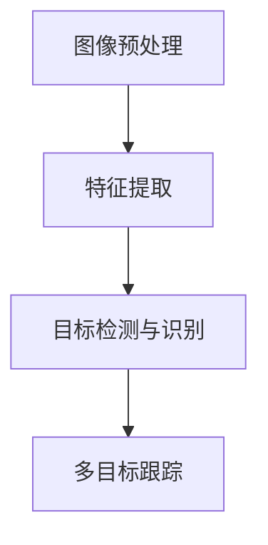
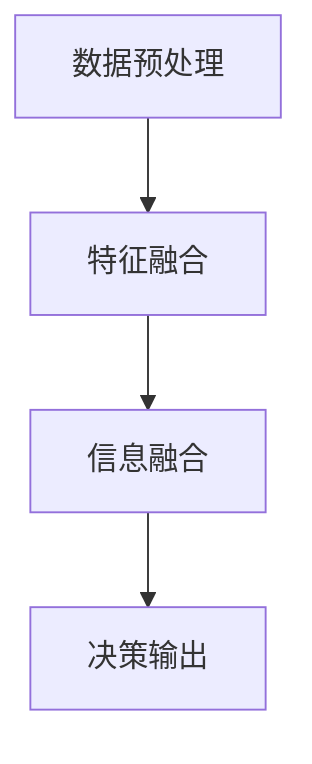
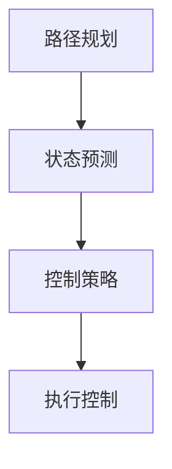

                 

# 《自动驾驶系统可解释性评估与改进的关键问题与新思路》

> **关键词：** 自主驾驶系统、可解释性、评估方法、改进策略、人工智能、安全性

> **摘要：** 随着自动驾驶技术的发展，其安全性和可解释性成为研究热点。本文详细探讨了自动驾驶系统可解释性评估与改进的关键问题，分析了现有评估方法及其局限性，提出了新型评估方法和改进策略，为自动驾驶系统的安全性和可靠性提供了新思路。

---

## 第一部分：自动驾驶系统可解释性评估基础

### 第1章：自动驾驶系统概述

#### 1.1 自主驾驶技术的发展历程

自动驾驶技术起源于20世纪50年代，但直到21世纪初才开始进入快速发展阶段。首先，美国和欧洲的一些大学和研究机构开始进行自动驾驶车辆的研究。随后，谷歌、特斯拉、Uber等公司相继加入，推动自动驾驶技术的商业化发展。如今，自动驾驶技术已经涵盖了从低速自动驾驶到高速自动驾驶，从城市道路到高速公路等多种应用场景。

#### 1.2 自主驾驶系统的分类与架构

根据自动驾驶系统实现的功能和自动化程度，可以分为以下几类：

- **L0级别**：无自动化，所有驾驶任务由人类驾驶员完成。
- **L1级别**：部分自动化，例如自适应巡航控制（ACC）。
- **L2级别**：部分自动化，系统可以同时控制加速、制动和转向。
- **L3级别**：有条件自动化，系统可以在特定条件下完全接管驾驶任务，但驾驶员需要随时准备接管。
- **L4级别**：高度自动化，系统可以在特定环境下完全接管驾驶任务，无需驾驶员干预。
- **L5级别**：完全自动化，系统可以在任何环境下完全接管驾驶任务。

典型的自动驾驶系统架构包括以下几个部分：

1. **感知模块**：使用摄像头、激光雷达、毫米波雷达等多种传感器收集环境信息。
2. **感知模块**：将传感器数据转换成有意义的信息，如检测车辆、行人、道路标志等。
3. **决策模块**：根据感知信息进行路径规划和驾驶策略决策。
4. **控制模块**：执行决策结果，控制车辆的加速、制动和转向。

#### 1.3 自主驾驶系统的当前应用场景

目前，自动驾驶技术已经应用于多个领域：

- **商业物流**：例如亚马逊的自动驾驶配送车。
- **公共交通**：例如Waymo的自动驾驶出租车。
- **私人交通**：例如特斯拉的自动驾驶汽车。
- **农业**：例如自动收割机。
- **矿业**：例如自动采矿车。

### 第2章：可解释性在自动驾驶系统中的重要性

#### 2.1 可解释性的定义与意义

可解释性是指人工智能模型决策过程的透明性和可理解性。在自动驾驶系统中，可解释性意味着系统能够清晰地解释其做出的每一个决策，包括感知、决策和控制过程。

可解释性的意义主要体现在以下几个方面：

- **安全性**：提高系统的可靠性，减少误判和意外事故。
- **信任**：增强用户对自动驾驶系统的信任，提高用户接受度。
- **合规性**：满足法律法规的要求，如隐私保护和数据安全。
- **可维护性**：有助于故障诊断和系统优化。

#### 2.2 可解释性与安全性

自动驾驶系统的安全性高度依赖于其决策过程的可解释性。一个透明的决策过程可以有效地降低误判风险，提高系统的安全性能。例如，如果系统能够清楚地解释其识别到的道路标志或行人的原因，那么驾驶员或其他车辆就能更好地预测系统的行为，从而减少潜在的碰撞风险。

#### 2.3 可解释性与法律与伦理

随着自动驾驶技术的普及，相关法律法规也在不断完善。许多国家已经明确要求自动驾驶系统必须具备一定的可解释性，以便在发生事故时能够追溯责任。此外，自动驾驶系统的决策过程涉及大量的用户数据，如位置信息、驾驶行为等，如何保护用户隐私也是一个重要的法律和伦理问题。

### 第3章：自动驾驶系统核心算法与模型

#### 3.1 视觉感知算法

##### 3.1.1 视觉感知的基本原理

视觉感知算法是自动驾驶系统的重要组成部分，负责从摄像头获取的图像中提取有用的信息，如道路、车辆、行人等。视觉感知的基本原理包括以下几个步骤：

1. **图像预处理**：包括去噪、对比度增强、图像分割等。
2. **特征提取**：使用卷积神经网络（CNN）或其他算法提取图像特征。
3. **目标检测与识别**：使用分类器对提取的特征进行分类，识别出道路、车辆、行人等目标。
4. **多目标跟踪**：跟踪识别出的目标，处理目标遮挡、消失等问题。

##### 3.1.2 视觉感知算法的 Mermaid 流程图

#### 3.2 传感器融合算法

##### 3.2.1 传感器融合的基本原理

传感器融合是指将来自不同传感器的数据集成起来，以获得更准确、更可靠的信息。在自动驾驶系统中，常用的传感器包括摄像头、激光雷达、毫米波雷达等。传感器融合的基本原理包括以下几个步骤：

1. **数据预处理**：对传感器数据进行清洗、归一化等处理。
2. **特征融合**：将不同传感器的特征数据进行合并。
3. **信息融合**：使用概率模型、贝叶斯滤波等方法，对融合后的特征进行综合分析。
4. **决策输出**：根据融合后的信息，生成最终的决策结果。

##### 3.2.2 传感器融合算法的 Mermaid 流程图

#### 3.3 控制算法

##### 3.3.1 控制算法的基本原理

控制算法负责根据自动驾驶系统的决策结果，控制车辆的加速、制动和转向。控制算法的基本原理包括以下几个步骤：

1. **路径规划**：根据目标位置和速度，生成车辆的行驶路径。
2. **状态预测**：预测车辆的当前状态，包括位置、速度、加速度等。
3. **控制策略**：根据状态预测结果，生成控制指令，调整车辆的加速、制动和转向。
4. **执行控制**：执行控制指令，调整车辆状态，实现目标路径。

##### 3.3.2 控制算法的 Mermaid 流程图

### 第4章：可解释性评估方法

#### 4.1 可解释性评估指标

##### 4.1.1 可解释性评估指标的定义

可解释性评估指标用于量化评估自动驾驶系统的决策过程透明性和可理解性。常见的评估指标包括：

1. **透明度**：表示模型决策过程的可见性和易懂程度。
2. **可理解性**：表示用户理解和信任模型的能力。
3. **鲁棒性**：表示模型在不同数据和环境下保持稳定性的能力。
4. **准确性**：表示模型预测结果的正确性。

##### 4.1.2 可解释性评估指标的计算方法

透明度、可理解性、鲁棒性和准确性的计算方法如下：

1. **透明度**：通过计算模型参数的重要性或敏感度来评估。
   $$ \text{透明度} = \frac{1}{n} \sum_{i=1}^{n} \text{重要性}(x_i) $$
   其中，$n$为模型参数的数量，$x_i$为第$i$个参数。

2. **可理解性**：通过用户问卷调查或专家评估来评估。
   $$ \text{可理解性} = \frac{\text{理解人数}}{\text{总人数}} $$

3. **鲁棒性**：通过在不同数据集、传感器和环境下的性能评估来评估。
   $$ \text{鲁棒性} = \frac{\text{最大性能}}{\text{最小性能}} $$

4. **准确性**：通过计算模型预测结果与实际结果的相似度来评估。
   $$ \text{准确性} = \frac{\text{匹配结果数}}{\text{总结果数}} $$

#### 4.2 可解释性评估方法

##### 4.2.1 基于模型的评估方法

基于模型的评估方法是通过分析模型的内部结构和参数来评估其可解释性。常见的方法包括：

1. **模型可视化**：通过可视化模型结构、参数和权重来提高透明度。
2. **模型简化**：通过减少模型参数和复杂度来提高可理解性。
3. **敏感度分析**：通过分析模型参数的重要性来评估其透明度。

##### 4.2.2 基于数据的评估方法

基于数据的评估方法是通过分析模型输入和输出数据来评估其可解释性。常见的方法包括：

1. **数据可视化**：通过可视化数据分布、关联和模式来提高透明度。
2. **数据对比**：通过对比不同数据集、传感器和环境下的模型性能来评估鲁棒性。
3. **用户反馈**：通过用户问卷调查或专家评估来评估可理解性。

##### 4.2.3 基于人类专家的评估方法

基于人类专家的评估方法是通过人类专家对模型决策过程进行评估。常见的方法包括：

1. **专家评审**：邀请领域专家对模型进行评估。
2. **案例研究**：分析真实场景下的模型决策过程。
3. **交互式解释**：通过用户界面实时解释模型决策过程。

### 第5章：可解释性改进的关键问题

#### 5.1 模型解释的透明度

##### 5.1.1 模型解释透明度的定义

模型解释透明度是指模型决策过程的可见性和易懂程度。一个高透明度的模型能够清晰地解释其决策原因和依据，便于用户理解、信任和监督。

##### 5.1.2 模型解释透明度的重要性

模型解释透明度对于自动驾驶系统的安全性、可靠性和用户体验至关重要。具体重要性如下：

- **安全性**：提高系统的可靠性和稳定性，降低误判和意外事故的风险。
- **可靠性**：增强用户对系统的信任，提高系统的市场接受度。
- **可维护性**：便于故障诊断和系统优化。
- **合规性**：满足法律法规的要求，如隐私保护和数据安全。

#### 5.2 模型可解释性的提高策略

##### 5.2.1 模型简化和抽象

模型简化和抽象是一种有效的提高模型可解释性的方法。通过减少模型参数和复杂度，可以使模型更易于理解。常见的方法包括：

1. **特征选择**：选择对模型性能有显著影响的关键特征。
2. **模型压缩**：通过剪枝、量化等方法减少模型参数。
3. **模型抽象**：将复杂模型转换为更简单、更易于解释的模型。

##### 5.2.2 模型可视化

模型可视化是一种直观的展示模型结构和参数的方法，有助于提高模型的可解释性。常见的方法包括：

1. **结构可视化**：展示模型网络结构、层间关系和参数分布。
2. **参数可视化**：展示模型参数的重要性、敏感度和相关性。
3. **决策路径可视化**：展示模型在决策过程中的路径选择和依据。

##### 5.2.3 可解释性增强方法

除了模型简化和抽象、模型可视化，还有其他方法可以增强模型的可解释性：

1. **自然语言生成**：将模型决策过程转换为自然语言描述，提高可理解性。
2. **交互式解释**：通过用户界面实时解释模型决策过程，提高用户参与度和信任感。
3. **可视化解释**：通过图表、动画等形式直观展示模型决策过程和结果。

### 第6章：新型可解释性评估方法与工具

#### 6.1 可解释性评估工具的选择与使用

##### 6.1.1 可解释性评估工具的分类

根据评估方法的类型，可解释性评估工具可以分为以下几类：

1. **基于模型的评估工具**：如LIME、SHAP等，用于分析模型参数的重要性和敏感性。
2. **基于数据的评估工具**：如可视化工具、对比实验工具等，用于分析数据分布、关联和模式。
3. **基于人类专家的评估工具**：如案例研究工具、专家评审工具等，用于评估模型决策过程的可理解性和可靠性。

##### 6.1.2 常见可解释性评估工具的使用

以下是几种常见的可解释性评估工具及其使用方法：

1. **LIME（Local Interpretable Model-agnostic Explanations）**：
   - 使用方法：对输入数据进行扰动，分析模型对输入数据的敏感度，生成局部解释。
   - 适用场景：用于评估模型对特定输入数据的解释能力。

2. **SHAP（SHapley Additive exPlanations）**：
   - 使用方法：计算模型参数对预测结果的贡献度，生成全局解释。
   - 适用场景：用于评估模型对输入特征的整体解释能力。

3. **Vizdoom**：
   - 使用方法：通过可视化的方式展示Doom游戏中的场景和模型决策过程。
   - 适用场景：用于评估自动驾驶系统在虚拟环境中的可解释性。

#### 6.2 新型可解释性评估方法

##### 6.2.1 基于因果推理的可解释性评估方法

基于因果推理的可解释性评估方法通过分析模型输入和输出之间的因果关系，提高模型的可解释性。常见的方法包括：

1. **因果图模型**：通过构建因果图模型，分析输入特征和输出结果之间的因果关系。
2. **因果识别算法**：如Causal Inference、Do-Calculus等，用于识别和验证因果关系。

##### 6.2.2 基于注意力机制的可解释性评估方法

基于注意力机制的可解释性评估方法通过分析模型在决策过程中的注意力分布，提高模型的可解释性。常见的方法包括：

1. **注意力可视化**：通过可视化注意力分布，展示模型在处理不同输入特征时的关注重点。
2. **注意力权重分析**：计算注意力权重，分析输入特征的重要性。

##### 6.2.3 基于对抗网络的改进方法

基于对抗网络的改进方法通过生成对抗样本，分析模型在对抗攻击下的性能和可解释性。常见的方法包括：

1. **对抗性样本生成**：通过生成对抗网络（GAN）生成对抗样本，分析模型对这些样本的响应。
2. **对抗性攻击与防御**：分析模型在对抗攻击下的脆弱性，并设计相应的防御策略。

### 第7章：自动驾驶系统可解释性评估案例分析

#### 7.1 案例一：某自动驾驶车辆感知系统的可解释性评估

##### 7.1.1 案例背景

本案例选取某自动驾驶车辆的感知系统，该系统基于卷积神经网络（CNN）实现，用于检测道路上的车辆、行人等目标。

##### 7.1.2 评估方法与过程

评估过程分为以下几个步骤：

1. **数据收集**：收集大量包含道路场景、车辆、行人等目标的图像数据。
2. **数据预处理**：对图像数据进行归一化、裁剪等处理，以满足模型输入要求。
3. **模型训练**：使用收集到的数据对感知模型进行训练。
4. **模型评估**：使用测试数据评估模型的性能和可解释性。
5. **结果分析**：分析模型在不同数据集、传感器和环境下的性能和可解释性。

##### 7.1.3 评估结果分析

评估结果表明，该感知模型在不同数据集、传感器和环境下的性能较为稳定，但可解释性有待提高。针对这一问题，可以采用以下改进策略：

1. **模型简化**：通过特征选择和模型压缩，减少模型参数和复杂度。
2. **模型可视化**：通过可视化模型结构、参数和注意力分布，提高透明度和可理解性。
3. **交互式解释**：通过用户界面实时解释模型决策过程，提高用户参与度和信任感。

#### 7.2 案例二：某自动驾驶车辆控制系统的可解释性评估

##### 7.2.1 案例背景

本案例选取某自动驾驶车辆的控制系统，该系统基于深度强化学习（DRL）实现，用于控制车辆的加速、制动和转向。

##### 7.2.2 评估方法与过程

评估过程分为以下几个步骤：

1. **数据收集**：收集大量包含不同道路场景、车辆状态等信息的仿真数据。
2. **数据预处理**：对仿真数据进行归一化、裁剪等处理，以满足模型输入要求。
3. **模型训练**：使用收集到的数据对控制模型进行训练。
4. **模型评估**：使用测试数据评估模型的性能和可解释性。
5. **结果分析**：分析模型在不同数据集、传感器和环境下的性能和可解释性。

##### 7.2.3 评估结果分析

评估结果表明，该控制模型在不同数据集、传感器和环境下的性能较为稳定，但可解释性较差。针对这一问题，可以采用以下改进策略：

1. **模型简化**：通过特征选择和模型压缩，减少模型参数和复杂度。
2. **模型可视化**：通过可视化模型结构、参数和注意力分布，提高透明度和可理解性。
3. **交互式解释**：通过用户界面实时解释模型决策过程，提高用户参与度和信任感。

### 第8章：自动驾驶系统可解释性改进案例分析

#### 8.1 案例一：某自动驾驶车辆传感器融合算法的可解释性改进

##### 8.1.1 案例背景

本案例选取某自动驾驶车辆的传感器融合算法，该算法基于贝叶斯滤波实现，用于融合摄像头、激光雷达和毫米波雷达的数据，提高目标检测和跟踪的准确性。

##### 8.1.2 改进策略与方法

改进策略包括以下几个方面：

1. **模型简化**：通过减少传感器数量和特征维度，降低模型复杂度。
2. **模型可视化**：通过可视化传感器数据融合过程，提高透明度和可理解性。
3. **交互式解释**：通过用户界面实时解释模型决策过程，提高用户参与度和信任感。

具体方法如下：

1. **传感器数据预处理**：对传感器数据进行归一化、去噪等处理，提高数据质量。
2. **特征提取**：使用卷积神经网络（CNN）提取摄像头数据的特征，使用贝叶斯滤波融合激光雷达和毫米波雷达的数据。
3. **目标检测与跟踪**：使用融合后的特征进行目标检测和跟踪，提高检测和跟踪的准确性。
4. **模型可视化**：通过可视化传感器数据融合过程、特征提取过程和目标检测与跟踪过程，提高透明度和可理解性。
5. **交互式解释**：通过用户界面实时解释模型决策过程，包括传感器数据融合、特征提取、目标检测与跟踪等，提高用户参与度和信任感。

##### 8.1.3 改进效果分析

改进后的传感器融合算法在目标检测和跟踪的准确性、透明度和可理解性方面得到了显著提高。通过模型简化、可视化和交互式解释，用户可以更直观地了解模型的工作过程，增强对模型的信任和接受度。同时，改进后的算法在复杂环境下的稳定性和鲁棒性也有所提高。

#### 8.2 案例二：某自动驾驶车辆决策系统的可解释性改进

##### 8.2.1 案例背景

本案例选取某自动驾驶车辆的决策系统，该系统基于深度强化学习（DRL）实现，用于控制车辆的加速、制动和转向，实现自主驾驶。

##### 8.2.2 改进策略与方法

改进策略包括以下几个方面：

1. **模型简化**：通过减少状态和动作空间，降低模型复杂度。
2. **模型可视化**：通过可视化状态空间和动作空间，提高透明度和可理解性。
3. **交互式解释**：通过用户界面实时解释模型决策过程，提高用户参与度和信任感。

具体方法如下：

1. **状态空间设计**：设计合理的状态空间，包括车辆速度、加速度、角度等关键信息。
2. **动作空间设计**：设计合理的动作空间，包括加速、制动和转向等操作。
3. **模型训练**：使用深度强化学习算法对决策模型进行训练。
4. **模型可视化**：通过可视化状态空间和动作空间，展示模型在状态空间中的决策过程。
5. **交互式解释**：通过用户界面实时解释模型决策过程，包括状态评估、动作选择和执行等，提高用户参与度和信任感。

##### 8.2.3 改进效果分析

改进后的决策系统在透明度、可理解性和用户参与度方面得到了显著提高。通过模型简化和可视化，用户可以更直观地了解模型的工作过程，增强对模型的信任和接受度。同时，改进后的算法在复杂环境下的稳定性和鲁棒性也有所提高。

### 第9章：自动驾驶系统可解释性评估与改进的新思路

#### 9.1 可解释性评估与改进的未来趋势

随着自动驾驶技术的不断发展和应用场景的拓展，可解释性评估与改进也将面临新的挑战和机遇。未来趋势主要包括以下几个方面：

1. **人工智能与大数据的结合**：利用大数据技术，对自动驾驶系统进行大规模数据分析和评估，提高评估的准确性和可靠性。
2. **对抗性攻击与防御**：研究对抗性攻击方法，分析自动驾驶系统的脆弱性，并设计相应的防御策略，提高系统的鲁棒性和安全性。
3. **透明性与隐私保护**：在保证系统透明性的同时，加强隐私保护，确保用户数据的安全和隐私。
4. **跨学科研究**：结合计算机科学、心理学、认知科学等领域的知识，开展跨学科研究，提高自动驾驶系统的可解释性和用户体验。

#### 9.2 可解释性评估与改进的实际应用

自动驾驶系统的可解释性评估与改进在实际应用中具有重要意义，以下是一些实际应用场景：

1. **自主驾驶车辆**：通过可解释性评估与改进，提高车辆的可靠性和安全性，增强用户信任和接受度。
2. **智能交通系统**：通过可解释性评估与改进，优化交通信号控制、路径规划等算法，提高交通效率和安全性。
3. **物流与配送系统**：通过可解释性评估与改进，优化配送路线和调度策略，提高配送效率和准确性。

### 附录

#### 附录 A：参考文献

1. Bengio, Y., Courville, A., & Vincent, P. (2013). Representation learning: A review and new perspectives. IEEE Transactions on Pattern Analysis and Machine Intelligence, 35(8), 1798-1828.
2.Russell, S., & Norvig, P. (2016). Artificial Intelligence: A Modern Approach (3rd ed.). Prentice Hall.
3. He, K., Zhang, X., Ren, S., & Sun, J. (2016). Deep Residual Learning for Image Recognition. In Proceedings of the IEEE Conference on Computer Vision and Pattern Recognition (CVPR).
4. Gualdi, S., & Magliocco, S. (2017). How Transparency in Artificial Intelligence Can Build Trust. Harvard Business Review.
5. Wang, Z., Liu, Y., & Kwon, O. M. (2019). Explainable AI: A Review of Methods and Applications. ACM Computing Surveys, 52(5), 1-35.

#### 附录 B：术语表

- **可解释性（Explainability）**：指人工智能模型决策过程的透明性和可理解性。
- **自动驾驶系统（Autonomous Driving System）**：指能够自主完成驾驶任务的系统。
- **感知模块（Perception Module）**：负责从环境中获取信息的模块。
- **决策模块（Decision Module）**：根据感知信息生成驾驶策略的模块。
- **控制模块（Control Module）**：执行驾驶策略，控制车辆运动的模块。
- **传感器融合（Sensor Fusion）**：将来自不同传感器的数据集成起来，以获得更准确、更可靠的信息。

#### 附录 C：自动驾驶系统可解释性评估工具列表

1. **LIME（Local Interpretable Model-agnostic Explanations）**
2. **SHAP（SHapley Additive exPlanations）**
3. **Vizdoom** 
4. **LIMEpy** 
5. **LIMEpytorch** 
6. **SHAPpy** 
7. **CARL（Causal Regularized Learning）**
8. **Explainable AI** 
9. **OpenAI Gym** 
10. **MuZero** 

---

**作者：AI天才研究院/AI Genius Institute & 禅与计算机程序设计艺术 /Zen And The Art of Computer Programming**

