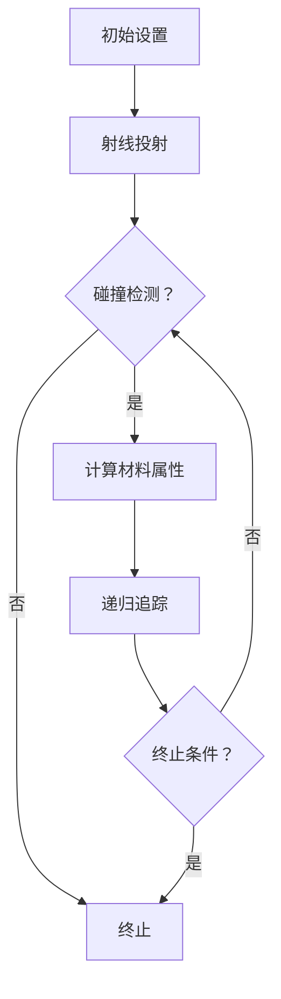
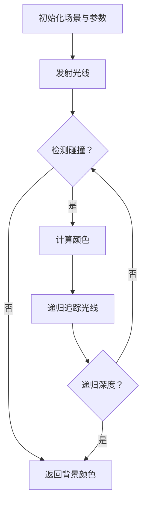

                 

# 舞台灯光的光线追踪：视觉效果的数学模拟

## 摘要

本文旨在探讨舞台灯光的光线追踪技术在视觉效果模拟中的应用。通过深入分析光线追踪的基本原理、数学模型和算法实现，本文揭示了舞台灯光设计中利用数学模拟实现逼真视觉效果的方法。文章首先回顾了舞台灯光的历史发展及其在现代舞台艺术中的重要性，随后详细介绍了光线追踪技术的核心概念和基本原理。接下来，本文从几何光学、计算机图形学和数学模型等方面阐述了光线追踪的数学基础。在此基础上，文章讨论了舞台灯光光线追踪的实现过程和视觉效果的模拟方法，并通过具体案例展示了光线追踪技术在实际舞台灯光设计中的应用。最后，文章对光线追踪技术在舞台灯光和计算机图形学领域的未来发展趋势进行了展望。通过本文的阐述，希望能够为舞台灯光设计师和计算机图形学研究人员提供有价值的参考和启示。

## 引言

### 1.1 舞台灯光的重要性与挑战

舞台灯光作为舞台艺术的重要组成部分，具有塑造场景氛围、突出演员表演和增强观众体验的重要功能。从古代戏剧到现代多媒体演出，舞台灯光技术一直在不断发展和进步。传统舞台灯光主要依靠人工调节灯光强度、颜色和位置来实现简单的光影效果。然而，随着计算机技术和数字化设备的普及，现代舞台灯光系统逐渐演变为高度智能化和自动化的复杂系统，能够实现更为复杂和逼真的视觉效果。

舞台灯光的重要性体现在以下几个方面：

1. **氛围营造**：通过调整灯光的亮度和颜色，可以营造出不同的氛围，如神秘、浪漫、紧张等，为观众提供沉浸式的观赏体验。

2. **演员突出**：通过精确的灯光布局和变换，可以突出演员的表情和动作，增强舞台表演的感染力和艺术表现力。

3. **视觉效果**：先进的舞台灯光系统能够模拟日出日落、星空变幻等自然现象，创造出极具视觉冲击力的舞台效果。

然而，现代舞台灯光系统也面临着一系列挑战：

1. **技术复杂性**：现代舞台灯光系统包括大量的灯光设备、控制软件和通信协议，技术实现和系统维护的复杂性较高。

2. **成本问题**：高端的舞台灯光设备价格昂贵，且需要定期更换和维护，增加了演出成本。

3. **视觉效果创新**：如何通过技术手段创造出新颖、独特的视觉效果，是舞台灯光设计师们不断探索和尝试的方向。

### 1.1.1 舞台灯光的历史与发展

舞台灯光的历史可以追溯到古代戏剧的早期阶段。早在古希腊时期，戏剧表演中就已经出现了简单的照明设备，如火炬和灯笼。中世纪时期，舞台灯光技术逐渐发展，出现了更加复杂的照明系统，如悬挂的灯笼和可移动的灯架。17世纪的巴洛克时期，舞台灯光技术进一步得到提升，艺术家们开始尝试利用灯光塑造舞台空间和氛围。

进入19世纪，电气技术的兴起为舞台灯光带来了革命性的变化。电灯的发明使得舞台灯光更加明亮、稳定，且便于控制。这一时期的舞台灯光系统逐渐实现了自动化控制，灯光师可以通过控制台对灯光进行精确调节。

20世纪中叶，计算机技术的引入使舞台灯光系统变得更加智能化和多样化。计算机控制软件的出现使得灯光设计变得更加灵活和高效，灯光师能够通过编程实现复杂的灯光效果。同时，数字投影技术和激光灯光的引入为舞台灯光带来了全新的视觉效果。

### 1.1.2 现代舞台灯光的应用

现代舞台灯光系统在各类舞台艺术表演中得到了广泛应用，包括戏剧、音乐剧、舞蹈表演、演唱会和多媒体演出等。以下是一些现代舞台灯光的应用场景：

1. **戏剧表演**：在戏剧表演中，舞台灯光通过不同的色彩和亮度变化，营造出各种场景和氛围，如夜晚、白天、雨中、舞台效果等。灯光师通常会在演出前进行详细的灯光设计，确保每一场表演的灯光效果都能够完美呈现。

2. **音乐剧**：音乐剧结合了音乐、舞蹈和戏剧表演，舞台灯光在其中起着至关重要的作用。通过灯光的变换和配合，音乐剧能够呈现出更加丰富和多彩的视觉效果，增强观众的沉浸感。

3. **演唱会**：在演唱会中，舞台灯光不仅用于照明和氛围营造，还用于舞台效果和演员的表现。先进的灯光设备能够创造出极具视觉冲击力的舞台效果，为观众带来难忘的视听盛宴。

4. **多媒体演出**：多媒体演出结合了舞台表演、视频和动画等元素，舞台灯光在其中起到了衔接和烘托的作用。通过灯光的变换和配合，多媒体演出能够呈现出更加立体和互动的视觉效果。

### 1.2 视觉效果与光线追踪

视觉效果是舞台灯光设计中的重要组成部分，通过灯光的变换和配合，创造出丰富的视觉体验。视觉效果的基本概念包括色彩、亮度、对比度和动态变化等。色彩是视觉体验的基础，通过不同的颜色和色调变化，可以营造出不同的情感和氛围。亮度是指灯光的强度，通过调节亮度，可以控制场景的亮度和细节表现。对比度是指场景中不同区域之间的亮度差异，通过对比度的调整，可以增强视觉效果的表现力。动态变化则是指灯光的快速变换和效果，通过动态灯光效果，可以增强舞台演出的节奏感和互动性。

光线追踪是一种基于几何光学原理的计算机图形渲染技术，通过模拟光线在场景中的传播过程，实现对场景的真实感渲染。光线追踪的基本原理可以分为以下几个步骤：

1. **射线投射**：从观察者的位置发射一条射线，射线穿过观察者与场景之间的虚拟视锥体。
2. **碰撞检测**：判断射线是否与场景中的物体发生碰撞。如果发生碰撞，则记录碰撞点的位置和法线方向。
3. **材料属性计算**：根据碰撞点的材料属性，计算光线在碰撞点处的反射、折射等效果。
4. **光线追踪递归**：对于发生碰撞的点，继续发射新的射线，进行后续的碰撞检测和材料属性计算。
5. **光线追踪终止**：当射线到达终止条件时（如超过最大递归深度或碰撞点处的光线强度低于设定阈值），终止光线追踪过程。

光线追踪通过模拟光线的传播路径，实现了对场景的真实感渲染。它能够精确地计算光线与物体之间的相互作用，从而生成逼真的图像效果。光线追踪在舞台灯光设计中的应用，使得灯光设计师能够通过计算机模拟出各种复杂的灯光效果，为舞台表演提供更加丰富和多样的视觉效果。

### 1.3 舞台灯光的光线追踪原理

舞台灯光的光线追踪原理基于几何光学和计算机图形学的理论，通过模拟光线在舞台场景中的传播和反射，实现对舞台灯光效果的逼真模拟。以下是舞台灯光光线追踪的基本原理和实现步骤：

#### 1.3.1 几何光学基础

几何光学是研究光线传播和光学现象的学科，其核心是描述光线在介质中的传播规律。舞台灯光光线追踪的基础是几何光学的原理，主要包括以下几个方面：

1. **光线传播**：光线在均匀介质中沿直线传播。当光线遇到界面时，会发生反射和折射现象。
2. **反射定律**：光线在界面发生反射时，入射角等于反射角。反射定律是光线追踪中计算反射光线的重要依据。
3. **折射定律**：光线在从一种介质进入另一种介质时，会发生折射现象。折射定律描述了入射光线、折射光线和界面法线之间的关系。

#### 1.3.2 舞台场景建模

在舞台灯光光线追踪中，首先需要对舞台场景进行建模。场景建模包括以下几个方面：

1. **几何建模**：对舞台中的各种物体进行三维建模，包括灯光设备、演员、道具等。几何建模的精度直接影响光线追踪的效果。
2. **材质建模**：为舞台场景中的物体指定材质属性，包括颜色、光泽度、透明度等。材质属性决定了光线与物体表面的相互作用方式。
3. **光源建模**：对舞台灯光进行建模，包括灯光的位置、强度、颜色等。光源建模是舞台灯光光线追踪的关键，直接影响场景的光照效果。

#### 1.3.3 光线追踪算法

舞台灯光光线追踪的核心是光线追踪算法。光线追踪算法通过模拟光线在场景中的传播过程，实现对舞台灯光效果的逼真模拟。以下是光线追踪算法的基本步骤：

1. **射线投射**：从观察者的位置发射一条射线，射线穿过观察者与场景之间的虚拟视锥体。
2. **碰撞检测**：判断射线是否与场景中的物体发生碰撞。如果发生碰撞，则记录碰撞点的位置和法线方向。
3. **材料属性计算**：根据碰撞点的材料属性，计算光线在碰撞点处的反射、折射等效果。具体计算包括：
   - 反射光线计算：根据反射定律计算反射光线的方向和强度。
   - 折射光线计算：根据折射定律计算折射光线的方向和强度。
   - 漫反射计算：根据物体表面的光泽度计算漫反射光线的方向和强度。
4. **光线追踪递归**：对于发生碰撞的点，继续发射新的射线，进行后续的碰撞检测和材料属性计算。递归深度控制了光线追踪的精度和计算复杂度。
5. **光线追踪终止**：当射线到达终止条件时（如超过最大递归深度或碰撞点处的光线强度低于设定阈值），终止光线追踪过程。终止条件保证了光线追踪的计算效率。

#### 1.3.4 光线追踪的优势与挑战

光线追踪技术具有以下优势：

1. **真实感渲染**：光线追踪通过精确模拟光线传播和反射过程，实现了对场景的真实感渲染。与传统的渲染方法相比，光线追踪能够生成更加逼真的图像效果。
2. **复杂场景适应性**：光线追踪能够处理复杂场景中的多种光线交互效应，如反射、折射、散射等。这使得光线追踪在舞台灯光设计中具有广泛的应用潜力。

然而，光线追踪技术也面临一些挑战：

1. **计算复杂度高**：光线追踪的计算复杂度较高，尤其是在复杂场景中，需要进行大量的碰撞检测和光线计算。这导致光线追踪的渲染速度相对较慢。
2. **内存消耗大**：光线追踪需要存储大量的光线和碰撞信息，因此对内存消耗较大。在高分辨率图像渲染中，内存消耗成为制约光线追踪应用的重要因素。

#### 1.3.5 总结

舞台灯光的光线追踪技术通过模拟光线在舞台场景中的传播和反射，实现了对舞台灯光效果的逼真模拟。其核心原理基于几何光学和计算机图形学，通过光线追踪算法实现光线传播路径的计算和图像渲染。光线追踪技术具有真实感渲染和复杂场景适应性等优势，但同时也面临计算复杂度和内存消耗等挑战。通过深入研究和优化，光线追踪技术在舞台灯光设计中的应用前景十分广阔。

## 光线追踪的数学基础

光线追踪技术作为一种高级渲染技术，其核心在于对光线在场景中的传播路径进行精确计算。为了实现这一目标，我们需要深入了解光线追踪的数学基础，包括几何光学原理、计算机图形学基础以及光线追踪算法中的数学模型和公式。以下是这些基础概念的详细探讨。

### 2.1 几何光学与光线传播

几何光学是研究光线在介质中传播规律的科学，其基本原理在光线追踪技术中得到了广泛应用。几何光学主要关注以下几个关键概念：

#### 2.1.1 光线传播的基本原理

光线在均匀介质中沿直线传播。这一原理可以用来描述光线在空气、水或玻璃等介质中的传播路径。当光线从一个介质进入另一个介质时，会发生折射或反射现象。折射是指光线在穿过两种不同介质时速度变化而产生的路径改变，而反射则是光线在界面处返回原介质的现象。

#### 2.1.2 几何光学的基本概念

- **光线**：光线是几何光学中的一个理想化概念，表示光线的传播路径。在实际计算中，通常使用向量来表示光线的方向和位置。
- **界面**：界面是指两种不同介质的分界线，如空气和水的界面。光线在界面处会发生折射或反射。
- **入射角和反射角**：入射角是入射光线与界面法线之间的夹角，反射角是反射光线与界面法线之间的夹角。根据反射定律，入射角等于反射角。
- **折射角**：折射角是折射光线与界面法线之间的夹角。根据折射定律，入射角和折射角之间满足一定的数学关系。

#### 2.1.3 光线的几何反射与折射

- **反射**：当光线从一种介质射向另一种介质时，一部分光线会反射回原介质。反射遵循反射定律，即入射角等于反射角。
- **折射**：当光线从一种介质进入另一种介质时，一部分光线会折射进入新介质。折射遵循斯涅尔定律（Snell's Law），其数学表达式为：
  $$
  n_1 \sin(\theta_1) = n_2 \sin(\theta_2)
  $$
  其中，\(n_1\) 和 \(n_2\) 分别是两种介质的折射率，\(\theta_1\) 是入射角，\(\theta_2\) 是折射角。

### 2.2 计算机图形学与光线追踪

计算机图形学是研究如何利用计算机生成和处理图像的科学，其基础理论在光线追踪技术中得到了广泛应用。以下是一些与光线追踪密切相关的计算机图形学概念：

#### 2.2.1 计算机图形学的基本概念

- **向量**：向量是表示方向和大小的几何对象。在光线追踪中，向量用于表示光线的方向、物体的位置和法线方向等。
- **矩阵**：矩阵是表示线性变换的数学工具。在光线追踪中，矩阵用于描述物体的变换（如平移、旋转和缩放）以及光线的传播路径。
- **三维空间**：三维空间是表示物体位置和方向的数学模型。在光线追踪中，三维空间用于描述场景中的物体和光源。
- **三角形网格**：三角形网格是表示三维物体的一种常见方式。在光线追踪中，物体通常被表示为多个三角形的集合。

#### 2.2.2 光线追踪在计算机图形学中的应用

光线追踪技术是计算机图形学中的一个重要分支，其基本原理可以概括为以下几个步骤：

1. **射线投射**：从观察者的位置发射一条射线，穿过观察者与场景之间的虚拟视锥体。
2. **碰撞检测**：判断射线是否与场景中的物体发生碰撞。如果发生碰撞，记录碰撞点的位置和法线方向。
3. **材料属性计算**：根据碰撞点的材料属性，计算光线在碰撞点处的反射、折射等效果。
4. **光线追踪递归**：对于发生碰撞的点，继续发射新的射线，进行后续的碰撞检测和材料属性计算。
5. **光线追踪终止**：当射线到达终止条件时（如超过最大递归深度或碰撞点处的光线强度低于设定阈值），终止光线追踪过程。

#### 2.2.3 光线追踪的基本算法

光线追踪的基本算法主要包括以下步骤：

1. **初始化**：设置光线追踪的初始参数，如射线起点、观察者位置、视锥体参数等。
2. **射线投射**：从观察者位置发射射线，穿过视锥体。
3. **碰撞检测**：判断射线是否与场景中的物体发生碰撞。常用的碰撞检测算法包括AABB（Axis-Aligned Bounding Boxes）和OBB（Oriented Bounding Boxes）。
4. **材料属性计算**：如果射线与物体发生碰撞，根据碰撞点的材料属性计算光线在碰撞点处的反射、折射等效果。常用的材料属性计算方法包括Lambertian反射和Phong反射模型。
5. **递归追踪**：对于发生碰撞的点，继续发射新的射线，进行后续的碰撞检测和材料属性计算。
6. **图像渲染**：将计算得到的颜色值渲染到图像上，形成最终的渲染图像。

以下是光线追踪的基本算法的伪代码实现：

python
def trace_rays(camera, scene):
    for each ray in camera.view_cone:
        if intersects(ray, scene):
            point, normal = intersection_point_and_normal(ray, scene)
            material = scene.object_at(point).material
            color = material.compute_color(ray, normal)
            return color
        else:
            return background_color

def intersects(ray, scene):
    # 检测射线与场景中的物体是否发生碰撞
    # 返回碰撞点是否存在的布尔值

def intersection_point_and_normal(ray, scene):
    # 计算射线与场景中物体的碰撞点和法线
    # 返回碰撞点的位置和法线方向

def background_color():
    # 返回背景颜色

def material.compute_color(ray, normal):
    # 根据材料属性计算光线在碰撞点处的颜色
    # 返回颜色值

### 2.3 数学模型与公式

在光线追踪中，数学模型和公式是计算光线传播和反射、折射等效果的基础。以下是几个关键数学模型和公式的详细讲解。

#### 2.3.1 光线追踪的数学模型

光线追踪的数学模型主要包括以下几个部分：

1. **射线表示**：射线可以用一个起点和一个方向向量来表示。射线方程可以表示为：
   $$
   r(t) = o + t \cdot d
   $$
   其中，\(r(t)\) 是射线上的一点，\(o\) 是射线起点，\(d\) 是射线的方向向量。

2. **碰撞检测**：碰撞检测的目的是判断射线是否与场景中的物体相交。常用的碰撞检测方法包括AABB和OBB。AABB（Axis-Aligned Bounding Boxes）是一种简单的包围盒算法，通过判断射线与包围盒的交点来确定是否发生碰撞。OBB（Oriented Bounding Boxes）是一种更高级的包围盒算法，通过考虑物体的方向性来提高碰撞检测的精度。

3. **材料属性表示**：物体的材料属性决定了光线在物体表面的反射、折射等效果。常用的材料属性包括颜色、反射率、折射率等。材料属性可以用一个向量或矩阵来表示。

4. **光线追踪递归**：光线追踪递归是通过发射新的射线来模拟光线的传播路径。每次碰撞点都会发射新的射线，直到达到递归深度或光线强度低于阈值。

#### 2.3.2 光线追踪的数学公式

以下是几个关键的光线追踪数学公式：

1. **反射公式**：
   $$
   r = -2(n \cdot r) n + r
   $$
   其中，\(r\) 是入射光线方向，\(n\) 是碰撞点的法线方向。

2. **折射公式**（斯涅尔定律）：
   $$
   n_1 \sin(\theta_1) = n_2 \sin(\theta_2)
   $$
   其中，\(n_1\) 和 \(n_2\) 是两种介质的折射率，\(\theta_1\) 是入射角，\(\theta_2\) 是折射角。

3. **散射公式**（Lambertian反射）：
   $$
   I = L \cdot n
   $$
   其中，\(I\) 是反射光线的强度，\(L\) 是入射光线的强度，\(n\) 是碰撞点的法线方向。

#### 2.3.3 数学模型在舞台灯光中的应用

数学模型在舞台灯光设计中起着至关重要的作用，它帮助设计师通过计算机模拟出各种复杂的灯光效果。以下是数学模型在舞台灯光中的应用实例：

1. **灯光布局**：通过数学模型可以精确计算灯光的位置和强度，以实现特定的光照效果。例如，设计师可以使用几何模型来模拟舞台灯光设备的布局，并通过调整灯光参数来优化光照效果。

2. **光线追踪渲染**：通过光线追踪算法，设计师可以模拟出光线的传播路径和反射、折射效果，从而生成逼真的舞台灯光图像。例如，设计师可以使用光线追踪技术来模拟舞台上的灯光效果，包括灯光的反射、折射和散射。

3. **视觉效果优化**：数学模型可以帮助设计师优化舞台灯光的效果。例如，通过调整灯光的色温和亮度，可以创造出更加逼真的夜晚场景或日间场景。

### 2.4 总结

光线追踪的数学基础是舞台灯光设计中实现逼真视觉效果的关键。通过深入理解几何光学原理、计算机图形学基础和光线追踪算法中的数学模型和公式，设计师可以更加精确地模拟舞台灯光效果，创造出丰富多样的视觉效果。在接下来的部分中，我们将进一步探讨舞台灯光光线追踪的实现过程和视觉效果模拟方法。

## 舞台灯光系统的构建

舞台灯光系统的构建是舞台灯光设计的关键步骤，它涉及到灯光设备的选型、配置和调试。一个高效的舞台灯光系统不仅能够提供丰富的视觉表现，还能确保演出的顺利进行。以下是对舞台灯光系统构建的详细探讨。

### 3.1.1 舞台灯光系统的组成

舞台灯光系统通常由以下几个主要部分组成：

1. **灯光设备**：包括舞台灯光、效果灯、激光灯、投影设备等。这些设备负责产生光效，是舞台灯光系统的核心部分。
2. **控制系统**：包括灯光控制台、灯光程序控制器和通信网络。控制系统负责控制灯光设备的开关、亮度、颜色和效果，是舞台灯光系统的“大脑”。
3. **电源系统**：为灯光设备提供稳定的电力供应。电源系统包括电源分配器、保险丝和稳压器等。
4. **传感器和监控系统**：包括温度传感器、电流传感器和防火系统。这些设备用于监测舞台灯光系统的运行状态，确保系统的安全。

### 3.1.2 灯光系统的配置与调试

舞台灯光系统的配置与调试是确保系统正常运行的重要环节。以下是具体的配置与调试步骤：

1. **灯光设备选型**：根据演出的需求和舞台空间的特点，选择合适的灯光设备。例如，大型演出可能需要配置多种灯光设备，包括常规舞台灯、染色灯、特效灯和激光灯等。

2. **灯光布局设计**：根据舞台空间和演出内容，设计灯光布局。灯光布局应考虑灯光覆盖范围、角度和高度，确保每个区域都能得到适当的照明。

3. **设备安装**：安装灯光设备，确保其位置和角度符合设计要求。安装过程中，需要特别注意设备的安全性，避免因安装不当导致的安全隐患。

4. **控制系统配置**：配置灯光控制系统，包括设置灯光控制台、灯光程序控制器和通信网络。控制系统的配置应根据演出的具体需求进行，例如设置不同的灯光模式、效果和定时控制等。

5. **调试与测试**：对灯光系统进行全面的调试和测试。调试过程中，应检查每个灯光设备是否正常工作，调整灯光效果和参数，确保灯光系统能够满足演出需求。

6. **安全检查**：完成调试后，进行安全检查，确保舞台灯光系统符合安全标准。安全检查包括电源系统检查、传感器和监控系统检查等。

### 3.1.3 灯光系统的常见问题与解决方法

在舞台灯光系统的运行过程中，可能会遇到一些常见问题，以下是一些问题的解决方法：

1. **灯光设备故障**：灯光设备故障可能是由于设备老化、电路问题或操作不当等原因导致的。解决方法是检查设备，更换损坏的部件，或请专业维修人员进行检查和维修。

2. **灯光效果不稳定**：灯光效果不稳定可能是由于控制系统故障、设备配置不当或灯光布局设计不合理等原因导致的。解决方法是重新配置控制系统，调整设备参数，或重新设计灯光布局。

3. **电源问题**：电源问题可能由于电源不稳定、电源线损坏或电源分配器故障等原因导致。解决方法是检查电源系统，更换损坏的部件，或增加电源保护装置。

4. **灯光颜色失真**：灯光颜色失真可能是由于灯光设备故障、色温不匹配或控制系统问题等原因导致的。解决方法是检查灯光设备，调整色温设置，或更新控制系统。

### 3.1.4 舞台灯光系统的维护与管理

舞台灯光系统的维护与管理是确保其长期稳定运行的重要保障。以下是一些维护与管理建议：

1. **定期检查**：定期对灯光系统进行检查和维护，包括检查设备、控制系统和电源系统等。

2. **备份和更新**：定期备份灯光控制系统的程序和配置文件，以便在系统出现问题时能够快速恢复。同时，及时更新系统软件和设备驱动程序，以保持系统的最新状态。

3. **培训与指导**：对操作人员进行定期培训，提高其操作技能和故障处理能力。同时，为操作人员提供详细的操作手册和故障处理指南。

4. **应急预案**：制定应急预案，以应对可能出现的突发状况。应急预案应包括设备故障、电源故障和人员安全等方面。

通过科学的配置与调试、有效的维护与管理，舞台灯光系统可以长期稳定运行，为各类演出提供高质量的视觉体验。

### 3.2 光线追踪算法的实现

光线追踪算法是舞台灯光系统中实现逼真视觉效果的核心技术。在本文中，我们将详细讨论光线追踪算法的实现过程，包括基本步骤、伪代码实现以及相关的优化策略。

#### 3.2.1 光线追踪的基本步骤

光线追踪算法的基本步骤可以分为以下几个阶段：

1. **初始化**：设置光线追踪的初始参数，包括场景描述、观察者位置、光线发射方向、光线终止条件等。
2. **射线投射**：从观察者位置发射光线，通过模拟光线在场景中的传播路径，实现对场景的渲染。
3. **碰撞检测**：判断光线是否与场景中的物体发生碰撞，记录碰撞点的位置和法线方向。
4. **材料属性计算**：根据碰撞点的材料属性，计算光线在碰撞点处的反射、折射和散射效果。
5. **递归追踪**：对于发生碰撞的点，继续发射新的光线，进行后续的碰撞检测和材料属性计算，直到达到终止条件。
6. **图像渲染**：将计算得到的颜色值渲染到图像上，形成最终的渲染图像。

以下是一个简单的伪代码实现，用于描述光线追踪的基本步骤：

python
def trace_rays(camera, scene):
    for each ray in camera.view_cone:
        if intersects(ray, scene):
            point, normal = intersection_point_and_normal(ray, scene)
            material = scene.object_at(point).material
            color = material.compute_color(ray, normal)
            return color
        else:
            return background_color

def intersects(ray, scene):
    # 检测射线与场景中的物体是否发生碰撞
    # 返回碰撞点是否存在的布尔值

def intersection_point_and_normal(ray, scene):
    # 计算射线与场景中物体的碰撞点和法线
    # 返回碰撞点的位置和法线方向

def background_color():
    # 返回背景颜色

def material.compute_color(ray, normal):
    # 根据材料属性计算光线在碰撞点处的颜色
    # 返回颜色值

#### 3.2.2 光线追踪的伪代码实现

下面是一个详细的光线追踪伪代码实现，包括射线投射、碰撞检测、材料属性计算和递归追踪等步骤：

python
# 光线追踪伪代码实现

# 初始化场景和观察者参数
scene = initialize_scene()
camera = initialize_camera()

# 发射光线并渲染图像
image = []
for y in range(image_height):
    for x in range(image_width):
        ray = camera.cast_ray(x, y)
        color = trace_ray(ray, scene)
        image.append(color)

# 光线追踪主函数
def trace_ray(ray, scene):
    # 检测射线与场景是否碰撞
    if not intersects(ray, scene):
        return background_color()

    # 记录碰撞点
    point, normal = intersection_point_and_normal(ray, scene)

    # 获取材料属性
    material = scene.object_at(point).material

    # 计算光线颜色
    color = material.compute_color(ray, normal)

    # 递归追踪光线
    if should_recurse(ray, normal):
        new_ray = material.cast_reflected_ray(ray, normal)
        color += trace_ray(new_ray, scene)

    return color

# 碰撞检测函数
def intersects(ray, scene):
    # 检测射线与场景中的物体是否发生碰撞
    # 返回碰撞点是否存在的布尔值
    for object in scene.objects:
        if object.intersects(ray):
            return True
    return False

# 计算碰撞点和法线
def intersection_point_and_normal(ray, scene):
    # 计算射线与场景中物体的碰撞点和法线
    # 返回碰撞点的位置和法线方向
    # ...

# 材料属性计算
def material.compute_color(ray, normal):
    # 根据材料属性计算光线在碰撞点处的颜色
    # 返回颜色值
    # ...

# 是否继续递归追踪
def should_recurse(ray, normal):
    # 判断是否继续递归追踪光线
    # 返回布尔值
    # ...

#### 3.2.3 光线追踪的优化策略

光线追踪算法的计算复杂度较高，为了提高渲染效率，可以采取以下优化策略：

1. **早期淘汰**：在光线投射阶段，如果射线与场景中的物体距离较远，可以提前判断并丢弃射线，从而减少不必要的计算。
2. **快速碰撞检测**：采用高效的碰撞检测算法，如OBB或KD树，减少碰撞检测的时间。
3. **蒙特卡洛采样**：使用蒙特卡洛采样方法来估计光照效果，通过随机采样来降低计算复杂度。
4. **光线排序**：对光线进行排序，优先处理距离观察者较近的光线，减少渲染时间。
5. **并行计算**：利用多线程或多GPU计算，加速光线追踪过程。

通过上述优化策略，可以有效提高光线追踪算法的渲染速度，满足实际应用中的高性能要求。

### 3.3 视觉效果的模拟

在舞台灯光设计中，视觉效果的模拟是实现逼真舞台效果的关键步骤。通过数学模型和算法，我们可以模拟出各种复杂的灯光效果，为观众带来震撼的视觉体验。以下是关于视觉效果模拟的基本原理和实现方法。

#### 3.3.1 视觉效果的基本原理

视觉效果是舞台灯光设计中通过灯光变化和效果创造出的一种视觉感受。基本原理包括以下几个方面：

1. **色彩理论**：色彩是视觉效果的基础。通过不同颜色和色调的变化，可以营造出不同的情感和氛围。色彩理论包括色彩混合、色温调节和色彩饱和度等概念。
2. **亮度与对比度**：亮度是指灯光的强度，对比度是指场景中不同区域之间的亮度差异。通过调整亮度和对比度，可以增强视觉效果的表现力。
3. **动态变化**：动态变化是指灯光的快速变换和效果，如闪烁、移动和渐变等。通过动态变化，可以增强舞台演出的节奏感和互动性。
4. **光影效果**：光影效果是通过灯光的反射、折射和散射等效果来实现的。在舞台灯光设计中，光影效果可以模拟出自然光线和人工光线的交互，创造出丰富的视觉效果。

#### 3.3.2 视觉效果的模拟与实现

视觉效果模拟的关键在于通过数学模型和算法，对灯光效果进行精确计算和渲染。以下是几种常见的视觉效果模拟方法：

1. **静态灯光效果**：静态灯光效果是指舞台灯光在演出过程中保持相对稳定的效果。这种方法通常用于营造场景氛围和突出演员表演。静态灯光效果可以通过以下步骤实现：
   - **灯光布局**：根据舞台场景和演出需求，设计灯光布局，确定灯光的位置、角度和强度。
   - **颜色与亮度调整**：调整灯光的颜色和亮度，以达到预期的视觉效果。
   - **效果预设**：将预设的灯光效果保存为灯光程序，以便在演出中灵活应用。

2. **动态灯光效果**：动态灯光效果是指灯光在演出过程中进行快速变换和效果呈现。这种方法可以增强舞台演出的节奏感和互动性。动态灯光效果可以通过以下步骤实现：
   - **灯光程序设计**：设计灯光程序，包括灯光的变换序列、颜色变化和动态效果等。
   - **实时控制**：通过灯光控制系统，实时控制灯光的变化和效果，与演出内容同步。
   - **效果预演**：在演出前进行灯光效果预演，确保灯光效果符合预期。

3. **光影效果模拟**：光影效果是通过模拟光线在场景中的传播和反射实现的。这种方法可以创造出逼真的自然光线和人工光线交互效果。光影效果模拟可以通过以下步骤实现：
   - **场景建模**：对舞台场景进行三维建模，包括灯光设备、演员、道具等。
   - **光线追踪**：使用光线追踪算法，模拟光线在场景中的传播路径和反射、折射效果。
   - **颜色计算**：根据光线追踪结果，计算每个像素的颜色值，生成最终的渲染图像。

#### 3.3.3 视觉效果模拟的应用案例

以下是一些舞台灯光设计中的视觉效果模拟应用案例：

1. **戏剧表演**：在戏剧表演中，通过静态灯光效果和动态灯光效果，可以营造出丰富的场景氛围和情感表达。例如，在一场夜晚场景的戏剧表演中，可以使用红色和蓝色的灯光分别模拟夜晚的星光和月光，营造出神秘而浪漫的氛围。

2. **演唱会**：在演唱会中，通过动态灯光效果，可以增强舞台演出的视觉冲击力和观众的互动体验。例如，在一场摇滚演唱会的结尾部分，可以使用激光灯和效果灯创造出绚丽的灯光秀，配合音乐的节奏，带来震撼的视听体验。

3. **多媒体演出**：在多媒体演出中，通过光影效果模拟，可以创造出独特的视觉效果和舞台空间感。例如，在一场以科幻为主题的演出中，可以使用投影设备和光影效果，模拟出未来城市的夜景和宇宙空间，营造出科幻的氛围。

通过上述应用案例可以看出，视觉效果模拟在舞台灯光设计中的重要性。通过精确计算和渲染，舞台灯光设计师可以创造出丰富多样的视觉效果，为观众带来难忘的观赏体验。

### 4.1 舞台灯光项目案例

#### 4.1.1 案例一：某剧院的舞台灯光设计

**项目背景**：

某市剧院准备上演一部经典音乐剧《猫》，该剧以猫的生活和情感为主题，充满奇幻和悬疑元素。剧院希望通过独特的舞台灯光设计，营造出神秘的氛围和强烈的视觉冲击力，增强观众的观赏体验。

**项目目标**：

1. **氛围营造**：通过灯光的变换和色彩调节，营造出神秘的猫主题氛围。
2. **演员突出**：通过精准的灯光布局和变换，突出演员的表情和动作，增强表演的感染力。
3. **视觉效果**：利用动态灯光效果和激光灯光，创造出独特的视觉效果，增强舞台表演的视觉冲击力。

**设计思路**：

1. **灯光布局**：设计多个灯光区域，包括舞台前区、中区、后区和舞台顶部的灯光区域。每个区域采用不同的灯光设备，以满足不同表演场景的需求。

2. **色彩应用**：根据猫的主题，采用蓝色、紫色和绿色的灯光，营造出神秘而梦幻的氛围。同时，通过色温的变化，模拟出夜晚、白天和黎明等不同的时间场景。

3. **动态灯光效果**：设计多种动态灯光效果，包括闪烁、渐变和移动等，增强舞台演出的节奏感和互动性。特别是在重要表演段落，使用激光灯光创造出绚丽的视觉效果。

**实施过程**：

1. **初步设计**：在项目启动阶段，剧院与灯光设计师团队进行多次讨论，明确项目目标和设计思路。设计师团队根据剧院提供的舞台图纸和表演场景，设计出初步的灯光布局和灯光效果。

2. **灯光设备选型**：根据设计需求，选择合适的灯光设备，包括常规舞台灯、染色灯、激光灯和投影设备等。同时，考虑灯光设备的稳定性和安全性，确保设备能够满足演出的需求。

3. **灯光安装与调试**：完成灯光设备的安装后，对系统进行调试和测试。调整灯光参数，确保每个灯光区域的效果符合设计预期。同时，进行安全检查，确保系统的稳定性和安全性。

4. **效果预演**：在演出前，进行多次效果预演，确保灯光系统能够与演出内容完美结合。预演过程中，对灯光效果进行调整和优化，确保达到最佳效果。

**项目成果**：

通过精细的灯光设计，该音乐剧在演出中获得了巨大成功。观众对舞台灯光效果赞不绝口，认为灯光设计为演出增添了神秘和奇幻的氛围，极大地提升了观赏体验。剧院也获得了良好的票房收入和观众口碑。

#### 4.1.2 案例二：某音乐节的舞台灯光设计

**项目背景**：

某城市举办了一场大型音乐节，吸引了众多知名乐队和音乐人参加。音乐节主办方希望通过独特的舞台灯光设计，为观众带来震撼的视听盛宴，提升音乐节的观赏价值。

**项目目标**：

1. **视觉冲击**：通过炫目的灯光效果，增强舞台表演的视觉冲击力，提升观众的观看体验。
2. **节奏感**：灯光效果应与音乐的节奏相匹配，增强舞台演出的互动性和观赏性。
3. **氛围营造**：利用灯光的变化和色彩，营造出不同的场景氛围，满足不同风格音乐的表演需求。

**设计思路**：

1. **灯光布局**：设计多个灯光区域，包括舞台前区、中区、后区和舞台顶部的灯光区域。每个区域采用不同的灯光设备，以满足不同表演场景的需求。

2. **动态灯光效果**：设计多种动态灯光效果，包括闪烁、渐变、移动和光影效果等，增强舞台演出的节奏感和互动性。特别是在音乐的高潮部分，使用激光灯光和投影设备创造出独特的视觉效果。

3. **色彩应用**：根据不同音乐的风格，采用不同的灯光色彩。例如，在摇滚乐表演中，使用强烈的红色和蓝色灯光，营造出激情和力量的氛围；在流行乐表演中，使用柔和的黄色和绿色灯光，营造出温馨和浪漫的氛围。

**实施过程**：

1. **初步设计**：在项目启动阶段，主办方与灯光设计师团队进行多次讨论，明确项目目标和设计思路。设计师团队根据音乐节的需求，设计出初步的灯光布局和灯光效果。

2. **灯光设备选型**：根据设计需求，选择合适的灯光设备，包括常规舞台灯、激光灯、投影设备和效果灯等。同时，考虑灯光设备的稳定性和安全性，确保设备能够满足演出的需求。

3. **灯光安装与调试**：完成灯光设备的安装后，对系统进行调试和测试。调整灯光参数，确保每个灯光区域的效果符合设计预期。同时，进行安全检查，确保系统的稳定性和安全性。

4. **效果预演**：在演出前，进行多次效果预演，确保灯光系统能够与演出内容完美结合。预演过程中，对灯光效果进行调整和优化，确保达到最佳效果。

**项目成果**：

通过精心设计的灯光效果，音乐节取得了巨大的成功。观众对舞台灯光效果赞不绝口，认为灯光设计为演出增添了视觉冲击力和观赏性。多个乐队和音乐人也对灯光效果表示满意，认为灯光设计提升了演出的整体水平。音乐节获得了良好的票房收入和观众口碑，成为该城市的一大文化盛事。

### 4.2 光线追踪在舞台灯光设计中的优势与应用

光线追踪技术作为一种先进的渲染方法，在舞台灯光设计中具有显著的优势和应用前景。通过模拟光线在舞台场景中的传播和反射，光线追踪能够生成高度逼真的视觉效果，为舞台灯光设计师提供了强大的创作工具。

#### 4.2.1 光线追踪在舞台灯光设计中的优势

1. **真实感渲染**：光线追踪通过精确模拟光线的传播路径和反射、折射等物理过程，能够生成高度逼真的图像效果。相比传统的渲染方法，光线追踪能够更好地表现出灯光与物体之间的相互作用，如阴影、反射和折射效果，从而创造出更加真实的舞台场景。

2. **灵活性**：光线追踪算法具有高度的灵活性，能够根据不同的舞台灯光设计需求进行调整。设计师可以自由地控制光线的方向、强度、颜色和反射、折射等参数，从而创造出各种独特的灯光效果。

3. **互动性**：光线追踪技术能够实现实时渲染和动态交互。通过计算机图形学和虚拟现实技术的结合，舞台灯光设计师可以在演出过程中实时调整灯光效果，与演员和观众进行互动，增强演出的观赏性和互动性。

4. **精细控制**：光线追踪技术提供了对光线传播的精细控制能力。设计师可以通过调整光线的传播路径和碰撞点的材料属性，实现对舞台灯光效果的精确控制，从而创造出更加丰富和细腻的视觉效果。

#### 4.2.2 光线追踪在舞台灯光设计中的实际应用

1. **场景布局**：在舞台灯光设计的初期，设计师可以使用光线追踪技术进行场景布局的模拟。通过模拟不同灯光设备的位置和角度，设计师可以预览灯光效果，优化灯光布局，确保每个区域都能得到适当的照明。

2. **灯光效果设计**：在灯光效果设计阶段，设计师可以使用光线追踪技术来模拟各种灯光效果，如闪烁、渐变、光影效果和动态变化等。通过调整光线参数和反射、折射模型，设计师可以创造出独特的灯光效果，增强舞台演出的视觉冲击力。

3. **实时预览**：在演出前，设计师可以使用光线追踪技术进行实时预览和调整。通过虚拟现实技术，设计师可以在虚拟舞台环境中实时观察灯光效果，与演员和导演进行互动，确保灯光效果与演出内容完美结合。

4. **视觉效果优化**：在演出过程中，设计师可以利用光线追踪技术进行视觉效果优化。通过实时渲染和动态交互，设计师可以根据演员的动作和表演需求，实时调整灯光效果，创造出更加逼真和生动的舞台场景。

#### 4.2.3 案例分析

以下是一个实际应用案例，展示了光线追踪技术在舞台灯光设计中的应用效果。

**案例**：某著名音乐剧《汉密尔顿》的舞台灯光设计。

**背景**：音乐剧《汉密尔顿》以其独特的表演风格和现代化的舞台设计而闻名。该剧在演出过程中，需要大量的灯光效果来营造各种场景氛围和情感表达。

**应用**：

1. **场景布局模拟**：在项目初期，灯光设计师使用光线追踪技术进行舞台场景布局的模拟。通过模拟不同灯光设备的位置和角度，设计师确定了最佳的灯光布局，确保每个场景都能得到适当的照明。

2. **灯光效果设计**：在灯光效果设计阶段，设计师使用光线追踪技术来模拟各种灯光效果。例如，为了表现一场雨天的场景，设计师使用了光线追踪中的散射模型，模拟雨滴在灯光下的散射效果，营造出雨天的氛围。

3. **实时预览与调整**：在演出前，设计师通过虚拟现实技术进行实时预览和调整。通过光线追踪技术的实时渲染，设计师可以实时观察灯光效果，与演员和导演进行互动，确保灯光效果与演出内容完美结合。

4. **视觉效果优化**：在演出过程中，设计师利用光线追踪技术进行视觉效果优化。例如，当演员在舞台上移动时，设计师实时调整灯光参数，确保灯光效果与演员的动作相匹配，创造出更加逼真和生动的舞台场景。

**结果**：通过光线追踪技术的应用，《汉密尔顿》的舞台灯光设计获得了巨大成功。观众对舞台灯光效果赞不绝口，认为灯光设计为演出增添了高度逼真的视觉效果，极大地提升了观赏体验。该剧在全球范围内的演出也获得了票房和观众口碑的双丰收。

通过上述案例可以看出，光线追踪技术在舞台灯光设计中的应用，不仅提高了灯光设计的真实感和灵活性，还为设计师提供了强大的创作工具。随着技术的不断发展和优化，光线追踪技术在舞台灯光设计中的优势和应用前景将更加广阔。

### 5.1 舞台灯光技术的未来发展

舞台灯光技术正经历着迅速的发展，不断涌现的新技术为舞台灯光设计带来了更多可能性和创新空间。以下是舞台灯光技术的未来发展展望：

#### 5.1.1 舞台灯光技术的发展趋势

1. **智能化**：随着人工智能技术的进步，舞台灯光系统将更加智能化。通过机器学习和数据分析，灯光系统可以自动调整灯光参数，实现更加精准和个性化的灯光效果。

2. **互动性**：未来舞台灯光设计将更加注重互动性。通过传感器和虚拟现实技术，灯光系统可以与演员和观众实时互动，创造更加沉浸式的观赏体验。

3. **虚拟现实与增强现实**：虚拟现实（VR）和增强现实（AR）技术的发展，将使舞台灯光设计更加多样化和丰富。舞台灯光可以与虚拟场景融合，创造出超现实的舞台效果。

4. **绿色环保**：绿色环保成为未来舞台灯光技术的重要方向。节能灯、LED灯等环保型照明设备将得到更广泛的应用，减少能耗和碳排放。

#### 5.1.2 光线追踪技术在舞台灯光中的潜在应用

光线追踪技术作为一种先进的渲染方法，其在舞台灯光设计中的应用前景十分广阔：

1. **真实感渲染**：光线追踪技术能够实现高度逼真的视觉效果，为舞台灯光设计提供更多创作空间。设计师可以模拟各种复杂的灯光效果，如雨滴、烟雾和光影等，为观众带来全新的视觉体验。

2. **实时渲染**：随着硬件性能的提升，光线追踪技术的实时渲染能力将得到显著提高。未来，舞台灯光设计师可以在演出过程中实时调整灯光效果，与演员和观众互动，创造更加动态和互动的灯光表演。

3. **虚拟舞台设计**：通过光线追踪技术，舞台灯光设计师可以在虚拟环境中进行灯光设计，提前预览和调整灯光效果。这为舞台灯光设计提供了更高效的创作流程，减少了时间和成本。

4. **个性化定制**：光线追踪技术可以根据观众的需求和偏好，实现个性化定制灯光效果。例如，观众可以通过手机应用程序选择自己喜欢的灯光模式，获得个性化的观赏体验。

5. **灯光艺术表现**：光线追踪技术可以为舞台灯光艺术带来更多的表现手法和技巧。例如，通过光线追踪技术实现的动态光影效果，可以创造出独特的视觉效果，增强舞台灯光的艺术感染力。

#### 5.1.3 光线追踪技术对舞台灯光设计的影响

光线追踪技术将对舞台灯光设计产生深远的影响：

1. **设计自由度**：光线追踪技术提供了更自由的设计空间，设计师可以更加灵活地创造各种独特的灯光效果，不受传统灯光设备的限制。

2. **技术门槛降低**：随着光线追踪技术的普及和工具的简化，更多的设计师和艺术家可以轻松掌握和应用这一技术，推动舞台灯光设计的普及和创新。

3. **成本效益**：尽管光线追踪技术的计算复杂度较高，但随着硬件性能的提升和优化算法的应用，光线追踪技术的成本将逐渐降低，使其在舞台灯光设计中的应用更加普及。

4. **观众体验**：光线追踪技术能够创造出更加逼真和丰富的灯光效果，提升观众的观赏体验，增强舞台演出的吸引力和感染力。

总之，随着技术的不断进步和应用，舞台灯光技术将迎来更加广阔的发展前景。光线追踪技术作为其中的一项重要技术，将为舞台灯光设计带来更多创新和可能。未来，舞台灯光设计师将能够通过更加先进的技术手段，创造出更加精彩和独特的灯光作品。

### 5.2 光线追踪在计算机图形学中的应用

光线追踪技术不仅在舞台灯光设计中展现了其独特的优势，在计算机图形学领域也有着广泛的应用。计算机图形学是研究如何通过计算机生成和处理图像的科学，光线追踪技术在其中扮演着关键角色，为图像渲染提供了更为真实和高效的解决方案。

#### 5.2.1 光线追踪在计算机图形学中的优势

光线追踪技术具有以下几大优势：

1. **真实感渲染**：光线追踪通过精确模拟光线的传播路径和反射、折射等物理过程，能够生成高度逼真的图像效果。它能够更准确地表现光与物体之间的复杂相互作用，如阴影、反射和折射，从而创造出更加真实的场景渲染。

2. **灵活性**：光线追踪算法具有高度的灵活性，能够根据不同的渲染需求进行调整。设计师可以通过控制光线方向、强度、颜色和反射、折射等参数，自由地创造出各种独特的视觉效果。

3. **交互性**：光线追踪技术支持实时渲染和动态交互。通过虚拟现实（VR）和增强现实（AR）技术，设计师可以在虚拟环境中实时预览和调整灯光效果，与用户进行互动，提供更加个性化的视觉体验。

4. **视觉效果丰富**：光线追踪技术能够模拟出多种复杂的物理现象，如散射、折射和反射等，创造出丰富的视觉效果。这些效果使得渲染图像在视觉上更加真实和生动。

#### 5.2.2 光线追踪在计算机图形学中的应用前景

光线追踪技术在计算机图形学中具有广泛的应用前景，以下是一些关键应用领域：

1. **影视制作**：在电影和动画制作中，光线追踪技术被广泛用于渲染场景和角色。它能够生成高度逼真的光影效果，提升视觉冲击力，为观众带来更加震撼的观影体验。

2. **游戏开发**：在游戏开发中，光线追踪技术可以用于实现更加真实的游戏世界。通过光线追踪，游戏中的场景和角色可以呈现出更加细腻和逼真的光影效果，提升游戏画面的质量。

3. **虚拟现实**：在虚拟现实（VR）应用中，光线追踪技术能够为用户提供更加沉浸式的体验。通过实时渲染和动态交互，用户可以在虚拟环境中感受到逼真的光影变化，增强虚拟现实体验。

4. **医学成像**：在医学成像领域，光线追踪技术可以用于三维重建和可视化。通过光线追踪，医学图像可以更加准确地呈现人体的内部结构和病理变化，为医学诊断和治疗提供有力支持。

5. **建筑设计**：在建筑设计中，光线追踪技术可以用于渲染建筑模型，模拟自然光和人工灯光的效果。设计师可以通过光线追踪技术，提前预览建筑在真实环境中的光照效果，优化建筑设计和布局。

6. **科学可视化**：在科学可视化中，光线追踪技术可以用于展示复杂的科学数据和现象。通过光线追踪，科学家可以更加直观地理解和展示科学研究的成果，促进科学知识的传播和普及。

#### 5.2.3 光线追踪技术的未来发展方向

随着硬件性能的提升和算法的优化，光线追踪技术在计算机图形学中的应用前景将更加广阔。以下是一些未来的发展方向：

1. **实时渲染**：随着GPU性能的不断提高，实时光线追踪渲染将成为可能。未来的游戏和VR应用将能够实现更加真实的图像效果，提升用户体验。

2. **分布式计算**：分布式计算技术将使光线追踪算法能够利用多台计算机的并行处理能力，提高渲染速度和效率。通过云计算和边缘计算，光线追踪技术可以更好地满足大规模渲染需求。

3. **算法优化**：研究人员将继续探索和优化光线追踪算法，减少计算复杂度和内存消耗。新的算法和技术，如可变速率渲染和光线追踪芯片，将为光线追踪技术带来更快的渲染速度和更高的计算效率。

4. **交互式设计**：交互式设计将成为光线追踪技术的重要发展方向。通过虚拟现实和增强现实技术，设计师可以在虚拟环境中实时预览和调整灯光效果，提高设计效率和创意空间。

5. **跨学科应用**：光线追踪技术将在更多跨学科领域中发挥作用。例如，在生物医学、工程学和地理信息科学等领域，光线追踪技术可以用于三维重建和可视化，为科学研究提供新的工具和方法。

总之，光线追踪技术在计算机图形学中的应用前景十分广阔。随着技术的不断进步和应用领域的扩展，光线追踪技术将为计算机图形学带来更多创新和突破，推动整个领域的发展。

### A.1 光线追踪相关软件与工具

在光线追踪技术的应用和发展过程中，众多软件与工具发挥了至关重要的作用。以下将介绍一些主要的光线追踪软件与工具，以及它们的特点和使用方法。

#### A.1.1 主要的光线追踪软件

1. **Blender**：
   - **特点**：Blender是一款开源的三维建模和渲染软件，支持光线追踪渲染。它具有强大的建模、雕刻和动画功能，同时还提供了丰富的光线追踪算法和材料系统。
   - **使用方法**：首先，用户需要在Blender中创建场景和物体，然后配置光线追踪参数，如光源、相机和渲染设置。Blender提供了简单的用户界面，使光线追踪渲染变得直观易懂。

2. **Arnold**：
   - **特点**：Arnold是一款高质量的光线追踪渲染器，广泛应用于电影和游戏行业。它具有高效的渲染速度和高度的可定制性，支持多种渲染模式和材料系统。
   - **使用方法**：Arnold通常与其他三维建模软件（如Maya、3ds Max等）集成使用。用户需要在建模软件中创建场景，然后导出为Arnold兼容的格式，在Arnold渲染器中配置渲染参数进行光线追踪渲染。

3. **V-Ray**：
   - **特点**：V-Ray是一款广泛使用的商业光线追踪渲染器，提供了丰富的渲染功能和高质量的图像输出。它支持多种三维建模软件，如3ds Max、Maya和Cinema 4D等。
   - **使用方法**：用户首先需要在所选的三维建模软件中创建场景，然后配置V-Ray渲染参数，如光线追踪设置、材质和灯光。V-Ray提供了详细的渲染参数设置界面，使用户能够灵活地调整渲染效果。

4. **LuxRender**：
   - **特点**：LuxRender是一款开源的光线追踪渲染器，以其高效的渲染性能和真实感渲染效果而受到用户喜爱。它支持多种渲染模式，如直接光线追踪、路径追踪和蒙特卡洛渲染等。
   - **使用方法**：LuxRender通常与其他三维建模软件集成使用。用户需要在建模软件中创建场景，然后导出为LuxRender兼容的格式，在LuxRender渲染器中配置渲染参数进行光线追踪渲染。

#### A.1.2 光线追踪工具的使用方法

1. **场景创建与设置**：
   - 首先，用户需要在所选的三维建模软件中创建场景，包括三维模型、光源、相机和渲染设置等。根据具体需求，用户可以调整场景参数，以优化渲染效果。
   - 在配置渲染设置时，用户需要选择光线追踪渲染器，并设置相应的光线追踪参数，如递归深度、采样率和材质属性等。

2. **渲染参数调整**：
   - 用户可以在渲染器中调整各种渲染参数，以获得最佳的渲染效果。常见的参数包括光线追踪算法、采样率、曝光控制、色调映射等。
   - 调整光线追踪算法和采样率是优化渲染效果的重要步骤。较高的递归深度和采样率可以提升图像质量，但会增加计算时间。

3. **渲染输出**：
   - 完成渲染参数设置后，用户可以开始渲染图像。渲染过程中，用户可以实时预览渲染进度和效果，并根据需要进行调整。
   - 渲染完成后，用户可以导出最终的图像文件，以用于后续的编辑和展示。

4. **后期处理**：
   - 虽然光线追踪渲染已经能够生成高质量的图像，但后期处理仍然是提升图像效果的重要环节。用户可以使用图像编辑软件（如Photoshop）进行色彩调整、降噪、锐化等处理。

通过以上步骤，用户可以充分利用光线追踪软件与工具，创造出高度逼真的图像效果。在实际应用中，用户需要不断尝试和调整，以找到最适合自己需求的渲染设置和技巧。

### A.2 光线追踪相关参考文献

光线追踪技术在计算机图形学、虚拟现实和影视制作等领域得到了广泛应用。以下是一些有关光线追踪技术的重要参考文献，涵盖了光线追踪的理论基础、算法实现和应用案例。

#### A.2.1 舞台灯光设计相关书籍

1. **《舞台灯光设计教程》**（作者：约翰·艾略特）
   - 该书详细介绍了舞台灯光设计的基础知识，包括灯光设备、灯光效果设计、灯光布局和灯光控制等内容。书中包含丰富的案例分析和实践技巧，适用于舞台灯光设计师的学习和参考。

2. **《舞台灯光设计艺术》**（作者：斯蒂芬·普赖斯）
   - 本书从艺术和技术的角度，探讨了舞台灯光设计的方法和原则。书中涵盖了灯光设计的创作过程、灯光效果的实现技巧以及灯光与舞台表演的互动关系。

3. **《现代舞台灯光设计》**（作者：迈克尔·特威斯特）
   - 该书介绍了现代舞台灯光设计的最新技术和方法，包括数字灯光控制、三维投影和动态灯光效果等。书中提供了大量的案例分析，展示了舞台灯光设计的实际应用和创新思路。

#### A.2.2 光线追踪技术相关论文与书籍

1. **《光线追踪算法与实现》**（作者：彼得·肖尔茨）
   - 本书详细介绍了光线追踪算法的基本原理和实现方法，包括直接光线追踪、路径追踪和蒙特卡洛渲染等。书中包含丰富的示例代码和图示，适合光线追踪技术的研究者和开发者。

2. **《计算机图形学：原理及实践》**（作者：约翰·F·布特利特）
   - 本书涵盖了计算机图形学的基本原理和应用技术，包括光线追踪、阴影处理、材质和纹理等。书中通过大量的实例和示例代码，帮助读者理解和掌握计算机图形学的基本概念和技术。

3. **《现代计算机图形学》**（作者：詹姆斯·F·费尔德曼）
   - 本书介绍了现代计算机图形学的前沿技术和应用，包括三维建模、渲染技术和交互式图形等。书中特别强调了光线追踪技术在三维渲染中的应用，提供了丰富的案例和算法实现。

4. **《虚拟现实技术与应用》**（作者：李明华）
   - 本书探讨了虚拟现实技术的理论基础和应用实践，包括三维建模、渲染、交互和传感技术等。书中介绍了光线追踪技术在虚拟现实中的应用，以及如何利用光线追踪技术实现逼真的虚拟场景渲染。

5. **《计算机图形学中的光线追踪技术》**（作者：S.K. Srivastava等）
   - 该论文集收录了多篇有关光线追踪技术的研究论文，涵盖了光线追踪算法的改进、加速技术、实时渲染和并行计算等方面。论文集为光线追踪技术的研究提供了丰富的理论和实践参考。

通过阅读上述书籍和论文，读者可以深入了解光线追踪技术的理论基础和实现方法，掌握舞台灯光设计的相关知识和技巧，为实际应用提供有力支持。

### A.3 附加资源

#### A.3.1 舞台灯光设计资源

1. **舞台灯光设计论坛**：这是一个活跃的舞台灯光设计社区，包括专业设计师和爱好者。用户可以在这里分享经验、交流技术，获取最新的设计灵感和创意。

2. **舞台灯光设计博客**：许多专业的舞台灯光设计师和公司拥有自己的博客，分享他们的设计理念、案例分析和实践经验。通过阅读这些博客，用户可以学习到最新的舞台灯光设计趋势和技术。

3. **舞台灯光设计教材**：一些大学和培训机构提供了舞台灯光设计的教材和在线课程，包括基础理论、设备使用和灯光效果设计等内容。这些教材和课程为学习舞台灯光设计提供了系统化的学习资源。

4. **舞台灯光设计软件教程**：许多舞台灯光设计软件（如Blender、V-Ray等）提供了官方教程和在线学习资源。用户可以通过这些教程学习和掌握软件的使用技巧和功能。

#### A.3.2 光线追踪技术资源

1. **光线追踪技术论文库**：许多学术机构和科研机构提供了光线追踪技术的研究论文和报告。这些论文库包括最新的研究进展和前沿技术，为光线追踪技术的研究者提供了丰富的理论资源。

2. **光线追踪技术博客**：一些专业的研究人员和开发者拥有自己的博客，分享他们在光线追踪技术方面的研究成果和开发经验。这些博客为光线追踪技术爱好者提供了实际应用和技术探讨的平台。

3. **光线追踪技术在线课程**：一些在线教育平台提供了有关光线追踪技术的专业课程，包括算法原理、实现方法和应用实践等内容。用户可以通过这些课程系统学习光线追踪技术的相关知识。

4. **光线追踪技术开源项目**：许多开源项目提供了光线追踪算法的实现和优化代码，用户可以免费下载和使用。这些开源项目为光线追踪技术的研究和应用提供了实用的工具和参考。

通过利用这些舞台灯光设计和光线追踪技术的资源，用户可以不断提高自己的专业水平，掌握最新的设计理念和技术，为实际项目提供更高质量的解决方案。

### 附件：舞台灯光光线追踪的 Mermaid 流程图

#### 附件1：舞台灯光光线追踪的数学模型与流程图

以下是一个简单的Mermaid流程图，用于描述舞台灯光光线追踪的数学模型与流程。

#### 附件2：舞台灯光光线追踪的伪代码实现流程图

以下是一个简单的Mermaid流程图，用于描述舞台灯光光线追踪的伪代码实现流程。

通过上述流程图和伪代码，我们可以清晰地理解舞台灯光光线追踪的数学模型与实现过程。这为舞台灯光设计师和计算机图形学研究人员提供了直观和结构化的参考，有助于在实际项目中高效地实现光线追踪技术。

