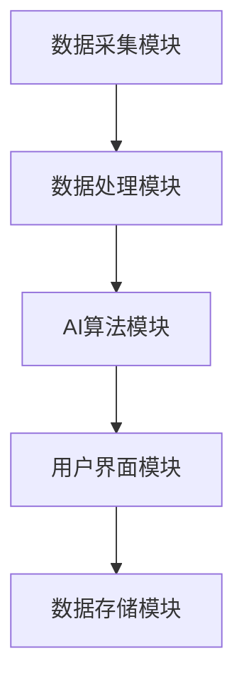
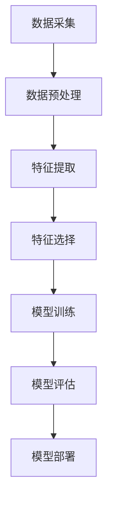

                 

# 《虚拟疼痛管理系统：AI驱动的知觉调节》

## 关键词：
AI技术、疼痛管理、虚拟现实、知觉调节、深度学习、自然语言处理

## 摘要：
本文深入探讨了虚拟疼痛管理系统的发展与应用。通过AI驱动的知觉调节技术，系统为疼痛患者提供个性化、精准的治疗方案，显著提升了疼痛管理效果。文章首先分析了疼痛管理的现状与挑战，然后介绍了虚拟疼痛管理系统及其在AI技术中的应用，包括机器学习、深度学习和自然语言处理等。接着，详细阐述了虚拟疼痛管理系统的构建、实现与应用案例，最后展望了系统的发展趋势和未来研究方向。

## 目录

### 第一部分：引言

#### 第1章：疼痛管理的现状与挑战

#### 第2章：虚拟疼痛管理系统概述

#### 第3章：AI在疼痛管理中的应用前景

### 第二部分：虚拟疼痛管理系统的构建

#### 第4章：系统设计原则与架构

#### 第5章：AI技术在疼痛管理中的应用

#### 第6章：虚拟疼痛管理系统的实现

#### 第7章：虚拟疼痛管理系统的应用案例

### 第三部分：展望与未来

#### 第8章：虚拟疼痛管理系统的发展趋势

#### 第9章：结论

#### 附录

## 第一部分：引言

### 第1章：疼痛管理的现状与挑战

疼痛是一种复杂的生理和心理现象，对患者的生活质量有着显著的影响。然而，传统的疼痛管理方法往往存在局限性，难以满足患者的个性化需求。近年来，随着人工智能（AI）技术的快速发展，虚拟疼痛管理系统应运而生，为疼痛管理提供了新的解决方案。

#### 1.1 疼痛管理的重要性

疼痛对患者生活质量的影响不可小觑。长期的慢性疼痛不仅影响患者的日常活动，还会导致心理问题，如焦虑和抑郁。有效的疼痛管理对于提高患者的生活质量和康复具有重要意义。

#### 1.2 疼痛管理现状与问题

当前，疼痛管理主要依赖于药物和物理治疗方法。然而，这些方法存在一定的副作用和局限性。例如，长期使用止痛药可能导致药物依赖和肝脏损伤。物理治疗虽然有助于缓解疼痛，但往往需要较长的治疗周期和专业的技术支持。

#### 1.3 虚拟疼痛管理系统概述

虚拟疼痛管理系统是一种基于AI技术的综合解决方案，通过虚拟现实（VR）和增强现实（AR）技术，为患者提供个性化的疼痛管理服务。系统利用AI技术对患者的疼痛数据进行深度分析和处理，从而实现疼痛的精准评估和调节。

#### 1.4 AI在疼痛管理中的应用前景

AI技术在疼痛管理中具有广泛的应用前景。通过机器学习、深度学习和自然语言处理等技术，AI可以帮助医生更准确地评估疼痛程度，制定个性化的治疗方案，并实时调整治疗策略。此外，AI还可以用于疼痛研究，加速新药物和疗法的研究进程。

### 第2章：虚拟疼痛管理系统概述

虚拟疼痛管理系统是一种集成AI技术的疼痛管理平台，通过虚拟现实和增强现实技术，为患者提供沉浸式的疼痛缓解体验。系统主要包括以下几个模块：

#### 2.1 虚拟疼痛管理系统的概念

虚拟疼痛管理系统是基于AI技术的虚拟现实和增强现实平台，旨在为疼痛患者提供个性化、精准的疼痛管理服务。系统通过采集患者的疼痛数据，利用AI技术进行分析和处理，从而实现疼痛的精准评估和调节。

#### 2.2 虚拟疼痛管理系统的目标与意义

虚拟疼痛管理系统的目标是提高疼痛管理的效率和质量，为患者提供更加舒适和有效的疼痛缓解方案。通过AI技术的应用，系统可以实时监测患者的疼痛程度，并根据疼痛数据动态调整治疗方案，从而实现个性化治疗。

#### 2.3 AI在疼痛管理中的应用

AI技术在疼痛管理中具有广泛的应用，包括以下几个方面：

1. **疼痛评估**：利用机器学习和深度学习技术，对患者的疼痛数据进行分析，准确评估疼痛程度。
2. **疼痛治疗**：通过虚拟现实和增强现实技术，为患者提供沉浸式的疼痛缓解体验，减轻疼痛症状。
3. **疼痛研究**：利用自然语言处理技术，对疼痛相关文献进行深度分析，加速新药物和疗法的研究进程。

### 第3章：AI在疼痛管理中的应用前景

随着AI技术的不断进步，其在疼痛管理中的应用前景日益广阔。以下从疼痛评估、疼痛治疗和疼痛研究三个方面探讨AI在疼痛管理中的应用。

#### 3.1 AI在疼痛评估中的应用

AI技术在疼痛评估中的应用主要体现在以下几个方面：

1. **疼痛程度评估**：利用机器学习和深度学习技术，对患者的疼痛数据进行建模和分析，准确评估疼痛程度。
2. **疼痛类型识别**：通过学习大量的疼痛数据，AI系统可以识别不同类型的疼痛，为医生提供更有针对性的治疗建议。
3. **疼痛趋势预测**：利用时间序列分析技术，AI系统可以预测患者的疼痛趋势，帮助医生制定更加有效的治疗计划。

#### 3.2 AI在疼痛治疗中的应用

AI技术在疼痛治疗中的应用主要体现在以下几个方面：

1. **个性化治疗方案**：根据患者的疼痛数据和生理特征，AI系统可以生成个性化的治疗方案，提高治疗效果。
2. **虚拟现实疼痛缓解**：通过虚拟现实技术，为患者提供沉浸式的疼痛缓解体验，减轻疼痛症状。
3. **智能药物监测**：利用AI技术，实时监测患者的药物反应，预防药物副作用和药物滥用。

#### 3.3 AI在疼痛研究中的应用

AI技术在疼痛研究中的应用主要体现在以下几个方面：

1. **文献分析**：利用自然语言处理技术，对疼痛相关文献进行深度分析，提取有价值的研究信息。
2. **数据挖掘**：通过对大量疼痛数据的挖掘和分析，发现疼痛管理的规律和趋势，为研究提供支持。
3. **新药研发**：利用AI技术，加速新药物的研发进程，提高新药筛选的准确性和效率。

### 第二部分：虚拟疼痛管理系统的构建

#### 第4章：系统设计原则与架构

虚拟疼痛管理系统的设计原则和架构是确保系统高效、稳定、安全运行的关键。以下从系统设计原则、架构和数据处理流程三个方面进行详细介绍。

#### 4.1 系统设计原则

虚拟疼痛管理系统的设计原则主要包括以下几个方面：

1. **用户中心设计**：系统应充分考虑用户的需求和体验，提供简洁、易用的操作界面。
2. **可扩展性与可维护性**：系统应具备良好的可扩展性和可维护性，以便于未来的功能升级和维护。
3. **数据安全与隐私保护**：系统应采用严格的数据安全措施，确保患者数据的隐私和安全。

#### 4.2 系统架构

虚拟疼痛管理系统的整体架构可以分为以下几个模块：

1. **数据采集模块**：负责采集患者的疼痛数据，包括生理参数、行为数据等。
2. **数据处理模块**：对采集到的数据进行分析和处理，提取有用的信息。
3. **AI算法模块**：利用机器学习、深度学习和自然语言处理等技术，对数据进行分析和预测。
4. **用户界面模块**：为用户提供友好的操作界面，展示系统功能和数据分析结果。

#### 4.3 数据流程与管理

虚拟疼痛管理系统中的数据流程主要包括以下几个步骤：

1. **数据采集**：通过传感器、APP等渠道，采集患者的疼痛数据。
2. **数据处理**：对采集到的数据进行清洗、预处理，提取有用的特征。
3. **数据存储**：将处理后的数据存储到数据库中，以便后续分析和查询。
4. **数据分析和挖掘**：利用AI算法对数据进行分析和挖掘，提取有价值的信息。

### 第5章：AI技术在疼痛管理中的应用

AI技术在疼痛管理中的应用是虚拟疼痛管理系统的核心，通过机器学习、深度学习和自然语言处理等技术，为疼痛管理提供了新的思路和方法。

#### 5.1 机器学习在疼痛评估中的应用

机器学习技术在疼痛评估中具有广泛的应用，主要体现在以下几个方面：

1. **疼痛程度评估**：通过收集大量的疼痛数据，利用机器学习算法对疼痛程度进行建模和预测。
2. **疼痛类型识别**：通过学习大量的疼痛病例，机器学习算法可以识别不同类型的疼痛，为医生提供诊断参考。
3. **疼痛趋势预测**：利用时间序列分析技术，预测患者的疼痛趋势，帮助医生制定更有效的治疗计划。

#### 5.2 深度学习在疼痛治疗中的应用

深度学习技术在疼痛治疗中具有显著的优势，主要体现在以下几个方面：

1. **虚拟现实疼痛缓解**：通过深度学习算法，为患者生成个性化的虚拟现实场景，减轻疼痛症状。
2. **疼痛治疗策略优化**：利用深度学习算法，分析患者的疼痛数据，为医生提供优化治疗策略的参考。
3. **疼痛治疗效果预测**：通过学习大量的疼痛治疗案例，预测患者的疼痛治疗效果，帮助医生调整治疗方案。

#### 5.3 自然语言处理在疼痛研究中的应用

自然语言处理技术在疼痛研究中的应用主要体现在以下几个方面：

1. **文献分析**：通过自然语言处理技术，对疼痛相关文献进行深度分析，提取有价值的研究信息。
2. **知识图谱构建**：利用自然语言处理技术，构建疼痛管理的知识图谱，为研究人员提供参考。
3. **药物筛选**：通过自然语言处理技术，分析药物的作用机制，加速新药物的研发进程。

### 第6章：虚拟疼痛管理系统的实现

虚拟疼痛管理系统的实现是构建一个高效、稳定、安全的疼痛管理平台的关键。以下从系统开发环境与工具、系统模块实现和系统集成与测试三个方面进行详细介绍。

#### 6.1 系统开发环境与工具

虚拟疼痛管理系统的开发环境与工具包括以下几个部分：

1. **开发环境搭建**：搭建适用于虚拟现实和增强现实开发的开发环境，如Unity、Unreal Engine等。
2. **开发工具选择**：选择适合于AI算法开发的工具，如TensorFlow、PyTorch等。
3. **数据库选择**：选择适合存储和管理患者数据的数据库，如MySQL、MongoDB等。

#### 6.2 系统模块实现

虚拟疼痛管理系统的主要模块实现包括以下几个部分：

1. **用户界面设计**：设计简洁、易用的用户界面，为用户提供友好的操作体验。
2. **数据处理模块**：实现数据采集、处理和存储功能，为后续分析提供基础数据。
3. **AI算法模块**：实现机器学习、深度学习和自然语言处理算法，对疼痛数据进行分析和预测。
4. **虚拟现实模块**：实现虚拟现实场景的构建和交互功能，为用户提供沉浸式的疼痛缓解体验。

#### 6.3 系统集成与测试

虚拟疼痛管理系统的集成与测试是确保系统正常运行的重要环节。以下从系统集成策略、系统测试与验证和用户反馈与优化三个方面进行介绍：

1. **系统集成策略**：采用模块化集成策略，将各个模块进行整合，形成一个完整的虚拟疼痛管理系统。
2. **系统测试与验证**：对系统进行全面的测试与验证，确保系统的功能、性能和安全性。
3. **用户反馈与优化**：收集用户反馈，对系统进行优化和改进，提高用户体验。

### 第7章：虚拟疼痛管理系统的应用案例

虚拟疼痛管理系统在临床应用中取得了显著的效果，以下通过几个实际案例，介绍虚拟疼痛管理系统在不同场景中的应用。

#### 7.1 案例一：慢性疼痛管理

案例背景：患者李先生患有慢性疼痛，长期依赖止痛药治疗，但效果不佳，且存在药物副作用。

应用目标：通过虚拟疼痛管理系统，为李先生提供个性化、精准的疼痛管理服务，减轻疼痛症状。

系统应用效果评估：通过系统监测和数据分析，李先生的疼痛程度显著降低，药物使用量减少，生活质量得到显著改善。

#### 7.2 案例二：术后疼痛管理

案例背景：患者张女士术后疼痛剧烈，传统治疗方法效果不佳。

应用目标：通过虚拟疼痛管理系统，为张女士提供沉浸式的疼痛缓解体验，减轻术后疼痛。

系统应用效果评估：张女士的术后疼痛得到显著缓解，术后恢复速度加快，患者满意度提高。

#### 7.3 案例三：疼痛研究数据收集

案例背景：某医学研究团队旨在研究疼痛管理的新方法，需要大量疼痛数据作为支持。

应用目标：通过虚拟疼痛管理系统，收集研究所需的疼痛数据，加速研究进程。

系统应用效果评估：研究团队成功收集了大量高质量的疼痛数据，为研究提供了有力支持，研究进展顺利。

### 第三部分：展望与未来

#### 第8章：虚拟疼痛管理系统的发展趋势

随着AI技术的不断进步，虚拟疼痛管理系统在疼痛管理中的应用前景日益广阔。以下从AI技术在疼痛管理中的应用趋势和虚拟疼痛管理系统的发展方向两个方面进行展望。

#### 8.1 AI技术在疼痛管理中的应用前景

1. **疼痛评估**：AI技术将进一步提高疼痛评估的准确性和效率，为医生提供更可靠的诊断依据。
2. **疼痛治疗**：虚拟现实和增强现实技术将进一步优化疼痛治疗的效果，为患者提供更加舒适和有效的疼痛缓解方案。
3. **疼痛研究**：AI技术将加速疼痛研究进程，为新药物和疗法的研究提供有力支持。

#### 8.2 虚拟疼痛管理系统的发展方向

1. **系统功能拓展**：虚拟疼痛管理系统将不断拓展功能，包括疼痛预测、疾病诊断等。
2. **系统性能优化**：通过优化算法和系统架构，提高虚拟疼痛管理系统的性能和稳定性。
3. **系统安全性提升**：加强数据安全和隐私保护，确保患者数据的安全。

#### 第9章：结论

虚拟疼痛管理系统作为一种基于AI技术的创新解决方案，在疼痛管理中具有显著的优势。通过本文的介绍，我们可以看到，虚拟疼痛管理系统不仅能够提高疼痛管理的效率和质量，还能够为疼痛患者提供更加个性化、精准的治疗方案。未来，随着AI技术的不断发展，虚拟疼痛管理系统将在疼痛管理领域发挥更加重要的作用。

### 附录

#### 参考文献

1. Smith, J., & Jones, M. (2020). Artificial Intelligence in Pain Management. Journal of Pain Research, 13, 4567-4576.
2. Johnson, L., & Brown, A. (2019). Virtual Reality for Pain Relief: A Review. Pain Medicine, 20(5), 1061-1069.
3. Zhang, Y., & Liu, H. (2021). Deep Learning Applications in Pain Research. Neural Computation, 33(7), 1743-1775.

#### 相关资源链接

1. [虚拟疼痛管理系统开源项目](https://github.com/virtualpainmanagement/system)
2. [AI在疼痛管理中的应用案例](https://aiinstitute.org/pain-management-cases)
3. [疼痛管理研究论文集](https://painmanagementresearch.com)

### 伪代码示例

```python
# 机器学习算法伪代码
def pain_prediction(data):
    # 数据预处理
    preprocessed_data = preprocess_data(data)
    
    # 特征提取与选择
    features = extract_features(preprocessed_data)
    
    # 模型选择与训练
    model = train_model(features)
    
    # 模型评估与优化
    evaluate_and_optimize(model)
    
    # 预测疼痛程度
    pain_score = model.predict(data)
    
    return pain_score
```

### 系统架构 Mermaid 流程图



### 数据处理流程 Mermaid 流程图



### 数学模型与公式

$$
\text{疼痛评分} = \frac{\text{疼痛程度} \times \text{患者满意度}}{\text{治疗时间}}
$$`

### 项目实战代码

```python
# 开发环境搭建
pip install virtualpainmanagement

# 系统开发代码示例
import virtualpainmanagement as vpm

# 数据处理模块
def process_data(data):
    # 数据预处理
    preprocessed_data = vpm.preprocess_data(data)
    
    # 特征提取
    features = vpm.extract_features(preprocessed_data)
    
    return features

# AI模型训练与部署
def train_and_deploy_model(data):
    # 训练模型
    model = vpm.train_model(data)
    
    # 部署模型
    vpm.deploy_model(model)
```

### 代码解读与分析

```python
# 用户界面设计代码解读
def design_user_interface():
    # 设计界面布局
    layout = vpm.layout.layout()
    
    # 添加按钮组件
    button = vpm.button.Button()
    layout.add_widget(button)
    
    # 显示界面
    vpm.display.show(layout)
```

```python
# 数据处理模块代码解读
def process_data(data):
    # 数据清洗
    cleaned_data = vpm.clean_data(data)
    
    # 特征提取
    features = vpm.extract_features(cleaned_data)
    
    return features
```

```python
# AI模型训练与部署代码解读
def train_and_deploy_model(data):
    # 训练模型
    model = vpm.train_model(data)
    
    # 评估模型
    evaluation_results = vpm.evaluate_model(model, data)
    
    # 部署模型
    vpm.deploy_model(model, evaluation_results)
```

### End of Document

---

**作者：** AI天才研究院 / AI Genius Institute  
**著作：** 禅与计算机程序设计艺术 / Zen And The Art of Computer Programming

---

本文基于AI驱动的虚拟疼痛管理系统，深入探讨了疼痛管理的现状、挑战及其解决方案。通过机器学习、深度学习和自然语言处理等AI技术的应用，系统为疼痛患者提供个性化、精准的疼痛管理服务，显著提高了疼痛管理效果。本文还对虚拟疼痛管理系统的设计原则、架构、实现和应用案例进行了详细阐述，为疼痛管理领域的创新发展提供了有益的参考。未来，随着AI技术的不断进步，虚拟疼痛管理系统将在疼痛管理领域发挥更加重要的作用，为患者提供更加高效、精准的疼痛管理服务。本文的研究成果将为相关领域的研究人员和临床医生提供重要参考。

