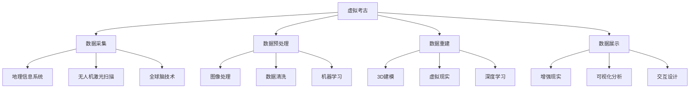

                 

# 虚拟考古：全球脑助力历史研究的新方法

## 关键词：
虚拟考古、全球脑技术、人工智能、虚拟现实、历史研究

## 摘要：
本文探讨了虚拟考古这一新兴领域，以及如何利用全球脑技术、人工智能和虚拟现实等技术手段，推动历史研究的深入发展。文章首先介绍了虚拟考古的概念、起源和重要性，接着详细阐述了虚拟考古的技术基础，包括全球脑技术、人工智能和虚拟现实技术的应用。随后，文章讨论了虚拟考古的数据采集与处理方法，以及虚拟考古场景构建的原理和技术。接着，文章介绍了虚拟考古分析技术、历史文化价值评估方法，并列举了几个典型的虚拟考古项目案例。文章还涵盖了虚拟考古项目实战的详细步骤，包括项目概述、开发环境搭建、源代码实现和性能优化等。最后，文章展望了虚拟考古的未来发展趋势和挑战，并提供了相关的资源与工具。

----------------------------------------------------------------

## 第1章：虚拟考古的概念与重要性

### 1.1 虚拟考古的定义

虚拟考古，是一种利用虚拟现实（VR）、增强现实（AR）和人工智能（AI）等前沿技术，对历史遗迹、文化景观等进行数字化重建、展示和研究的考古方法。它突破了传统考古的时空限制，为历史研究提供了全新的视角。

#### 1.1.1 虚拟考古的核心概念

- **虚拟现实（VR）**：通过计算机技术创建一个虚拟的三维环境，用户可以通过VR头盔等设备沉浸其中。
- **增强现实（AR）**：将虚拟信息叠加到现实世界中，用户通过智能手机或AR眼镜等设备可以看到叠加的虚拟内容。
- **人工智能（AI）**：利用机器学习和深度学习等技术，对考古数据进行智能分析和处理。

#### 1.1.2 虚拟考古的发展历程

虚拟考古的发展历程可以追溯到20世纪90年代，当时计算机技术和虚拟现实技术刚刚开始发展。早期的研究主要集中在如何利用计算机技术重建历史遗址和场景。随着互联网的普及和大数据技术的发展，虚拟考古逐渐成为一个跨学科的研究领域，涵盖了历史学、考古学、计算机科学、人工智能等多个领域。

### 1.2 虚拟考古的起源与发展

虚拟考古的起源可以追溯到20世纪90年代，当时计算机图形学和虚拟现实技术刚刚开始发展。早期的研究主要集中在如何利用计算机技术重建历史遗址和场景。随着互联网的普及和大数据技术的发展，虚拟考古逐渐成为一个跨学科的研究领域，涵盖了历史学、考古学、计算机科学、人工智能等多个领域。

#### 1.2.1 虚拟考古的早期应用

- **计算机辅助考古**：利用计算机技术进行考古数据的处理和分析，提高考古工作的效率和准确性。
- **数字博物馆**：通过虚拟现实技术，创建数字化的博物馆，让公众能够在线参观历史遗迹和文化藏品。

#### 1.2.2 虚拟考古的现代发展

现代虚拟考古的发展主要集中在以下几个方面：

- **大规模数据采集与处理**：利用无人机、激光扫描仪等设备，进行大规模的遗址数据采集，并通过大数据技术进行处理和分析。
- **智能重建与可视化**：利用人工智能技术，对采集到的数据进行智能分析和重建，实现更加精准的遗址重建和可视化展示。
- **交互式体验**：通过增强现实和虚拟现实技术，为用户提供沉浸式的考古体验，增强学习的趣味性和参与度。

### 1.3 虚拟考古对历史研究的重要性

虚拟考古不仅为考古学家提供了全新的研究手段，也对历史研究产生了深远的影响：

#### 1.3.1 增强研究的深度和广度

虚拟考古技术使得考古学家能够对遗址进行全方位的、深入的研究，不仅可以观察到遗址的宏观结构，还可以对微观的细节进行细致的分析。

#### 1.3.2 突破时空限制

传统考古受到地理位置和时间限制，而虚拟考古则可以突破这些限制，让研究者能够从全球范围内获取和利用考古数据。

#### 1.3.3 提高公众参与度

虚拟考古技术使得历史遗址和文化遗产得以数字化保存和传播，公众可以通过虚拟现实和增强现实技术，更加直观地了解历史，提高公众对历史文化的兴趣和参与度。

### 1.4 虚拟考古的应用领域

虚拟考古技术已经在多个领域得到了广泛应用：

- **文化遗产保护**：通过虚拟重建，对受损或濒临消失的文化遗产进行数字化保存。
- **考古教学与研究**：在考古教学中引入虚拟考古技术，提高学生的实践能力和研究水平。
- **文化旅游**：通过虚拟现实技术，为游客提供沉浸式的文化旅游体验。

总之，虚拟考古作为一种新兴的考古方法，正在改变传统考古的研究模式，为历史研究带来了新的机遇和挑战。

### 1.5 虚拟考古的核心概念与联系

在深入探讨虚拟考古之前，我们需要了解其核心概念及其相互之间的联系。以下是虚拟考古的主要核心概念和架构的Mermaid流程图：



#### 1.5.1 数据采集

数据采集是虚拟考古的基础环节，涉及地理信息系统、无人机激光扫描等多种技术手段。地理信息系统（GIS）可以提供空间数据管理和分析工具，而无人机激光扫描则可以获取高精度的三维地形数据。

```mermaid
subgraph 数据采集
    A[虚拟考古] --> B[地理信息系统]
    B --> C[无人机激光扫描]
end
```

#### 1.5.2 数据预处理

数据预处理是确保数据质量和可用性的关键步骤，包括图像处理、数据清洗等。图像处理技术可以增强图像的视觉效果，而数据清洗则是去除噪声和异常数据，确保数据的一致性和准确性。

```mermaid
subgraph 数据预处理
    A[虚拟考古] --> B[图像处理]
    B --> C[数据清洗]
end
```

#### 1.5.3 数据重建

数据重建是将采集到的数据转化为三维模型的过程，包括3D建模和虚拟现实技术。3D建模技术可以创建历史遗迹的精确三维模型，而虚拟现实技术则可以实现沉浸式的虚拟体验。

```mermaid
subgraph 数据重建
    A[虚拟考古] --> B[3D建模]
    B --> C[虚拟现实]
end
```

#### 1.5.4 数据展示

数据展示是将重建后的模型和数据进行可视化和分析的过程，包括增强现实、可视化分析和交互设计。增强现实技术可以将虚拟信息叠加到现实环境中，而可视化分析则可以揭示数据中的隐含信息，交互设计则确保用户能够直观地与数据交互。

```mermaid
subgraph 数据展示
    A[虚拟考古] --> B[增强现实]
    B --> C[可视化分析]
    C --> D[交互设计]
end
```

通过上述核心概念和架构的流程图，我们可以更好地理解虚拟考古的工作流程和技术手段，为后续章节的详细讨论打下基础。

### 1.6 核心算法原理讲解

在虚拟考古中，核心算法的原理是数据分析和重建的基础。以下将使用伪代码详细阐述几个关键算法：

#### 1.6.1 数据清洗

数据清洗是确保数据质量的关键步骤。以下是一个简单的伪代码示例，用于去除异常值和数据噪声：

```pseudo
function clean_data(data):
    for each row in data:
        if is_outlier(row):
            remove row from data
        else:
            normalize row values
    return data
```

#### 1.6.2 3D建模

3D建模是将二维图像转化为三维模型的过程。以下是一个简化的伪代码示例，用于构建三维模型：

```pseudo
function build_3D_model(images):
    # 使用深度学习算法提取特征
    features = extract_features(images)
    # 使用体素网格重建模型
    model = reconstruct_model_from_features(features)
    # 使用图像纹理映射模型
    textured_model = texture_map(images, model)
    return textured_model
```

#### 1.6.3 虚拟重建

虚拟重建是将现实世界的遗址数据转化为虚拟环境的过程。以下是一个简化的伪代码示例：

```pseudo
function virtual_reconstruction(site_data):
    # 使用激光扫描数据构建三维模型
    3D_model = build_3D_model(site_data.s scans)
    # 使用图像数据优化模型细节
    optimized_model = refine_model_details(3D_model, site_data.images)
    # 创建虚拟环境
    virtual_environment = create_virtual_environment(optimized_model)
    return virtual_environment
```

#### 1.6.4 数据可视化

数据可视化是揭示数据中隐含信息的关键步骤。以下是一个简化的伪代码示例，用于数据可视化：

```pseudo
function visualize_data(data):
    # 创建图表
    chart = create_chart(data)
    # 根据数据类型选择合适的图表类型
    if is_categorical(data):
        chart_type = 'bar_chart'
    else:
        chart_type = 'line_chart'
    # 显示图表
    display_chart(chart, chart_type)
```

通过上述伪代码示例，我们可以看到虚拟考古中核心算法的基本原理和实现步骤，为后续的详细讨论和项目实战提供了理论基础。

### 1.7 虚拟考古在社会与教育中的应用

虚拟考古不仅在学术研究中具有重要意义，还在社会和教育领域发挥着重要作用：

#### 1.7.1 社会应用

- **文化遗产保护**：虚拟考古技术可以帮助保护和保存文化遗产，如通过虚拟重建，对濒临消失的遗址进行数字化保存，使其在全球范围内得到传播和认识。
- **文化旅游**：虚拟考古技术可以吸引更多的游客，通过虚拟体验，让游客在不亲临现场的情况下，感受历史文化的魅力，推动旅游业的发展。
- **公共教育**：虚拟考古可以为公众提供丰富的历史知识，通过虚拟现实和增强现实技术，让更多人了解和参与历史文化教育。

#### 1.7.2 教育应用

- **教学资源**：虚拟考古技术可以为学生提供直观、生动的教学资源，提升教学效果，激发学生的学习兴趣。
- **实践能力**：通过虚拟考古项目，学生可以参与实际考古数据的采集、分析和重建，培养实践能力和创新思维。
- **跨学科融合**：虚拟考古结合了历史学、计算机科学、艺术设计等多个学科，有助于培养学生的跨学科综合能力。

### 1.8 虚拟考古的优势与挑战

虚拟考古具有显著的优点，但也面临一定的挑战：

#### 1.8.1 优势

- **时空突破**：虚拟考古可以突破地理和时间限制，研究者可以在虚拟环境中进行跨地域、跨时间的考古研究。
- **数据丰富**：虚拟考古技术可以获取和利用大量的考古数据，提高研究的准确性和深度。
- **互动体验**：虚拟考古技术提供了沉浸式的互动体验，使公众更容易理解和参与到历史文化的传承中。

#### 1.8.2 挑战

- **技术复杂**：虚拟考古需要多种技术的综合运用，技术复杂性较高，对研究人员的技术水平要求较高。
- **数据质量**：数据的准确性和完整性直接影响虚拟考古的效果，如何在数据采集和处理过程中确保数据的高质量是一个挑战。
- **成本问题**：虚拟考古项目通常需要高成本的技术设备和专业人员，这对一些机构和个人来说可能是一大负担。

### 1.9 小结

虚拟考古作为一种新兴的考古方法，通过结合虚拟现实、增强现实和人工智能等先进技术，为历史研究带来了新的视角和手段。其在社会和教育领域的应用，进一步推动了文化遗产保护和历史文化教育的普及。然而，虚拟考古仍面临技术复杂、数据质量、成本等多方面的挑战，需要进一步的探索和研究。

## 第2章：虚拟考古的技术基础

### 2.1 全球脑技术简介

全球脑技术，是指通过分布式计算网络，模拟人脑信息处理过程的技术。它旨在通过模拟人脑神经网络，实现对复杂问题的求解，从而在虚拟考古中发挥重要作用。

#### 2.1.1 全球脑技术的核心概念

- **分布式计算**：全球脑技术通过分布式计算网络，将计算任务分散到多个节点上进行处理，从而提高计算效率。
- **神经网络**：全球脑技术模拟人脑神经网络，通过神经元之间的连接和互动，实现信息处理和知识发现。

#### 2.1.2 全球脑技术的应用场景

- **大规模数据分析和处理**：在虚拟考古中，需要对大量的遗址数据进行处理和分析，全球脑技术可以高效地完成这一任务。
- **智能推理和决策**：通过模拟人脑的推理过程，全球脑技术可以帮助考古学家在复杂的考古数据中提取有用的信息。

### 2.2 人工智能在虚拟考古中的应用

人工智能技术，如机器学习、深度学习等，在虚拟考古中发挥着重要作用。它们可以用于数据采集、数据处理、遗址重建和展示等多个环节。

#### 2.2.1 人工智能技术的核心概念

- **机器学习**：机器学习是一种通过数据训练模型，使其能够进行预测和决策的技术。
- **深度学习**：深度学习是机器学习的一个子领域，通过多层神经网络，实现对复杂数据的建模和预测。

#### 2.2.2 人工智能技术在虚拟考古中的应用

- **数据采集和处理**：利用深度学习技术，可以自动识别和分类考古数据，提高数据处理的效率和准确性。
- **遗址重建和展示**：通过机器学习技术，可以自动重建遗址的三维模型，并通过虚拟现实技术进行展示。

### 2.3 虚拟现实技术在考古领域的应用

虚拟现实技术，为考古研究提供了沉浸式的体验，使得考古学家和公众能够身临其境地探索历史遗迹。

#### 2.3.1 虚拟现实技术的核心概念

- **三维建模**：通过三维建模技术，可以创建历史遗迹的虚拟模型。
- **虚拟现实设备**：如VR头盔、VR眼镜等，为用户提供沉浸式的体验。

#### 2.3.2 虚拟现实技术在考古领域的应用

- **遗址重建**：利用虚拟现实技术，可以对遗址进行三维重建，提供更加直观的研究工具。
- **教育推广**：通过虚拟现实技术，可以为学生和公众提供沉浸式的考古体验，提高对历史文化的认识。

### 2.4 增强现实技术在考古领域的应用

增强现实技术，将虚拟信息叠加到现实世界中，为考古研究提供了新的视角。

#### 2.4.1 增强现实技术的核心概念

- **叠加技术**：通过摄像头等设备，将虚拟信息叠加到现实场景中。
- **交互技术**：用户可以通过触摸、手势等与虚拟信息进行交互。

#### 2.4.2 增强现实技术在考古领域的应用

- **现场考古**：在考古现场，通过增强现实技术，可以实时查看遗址的三维模型和历史信息，提高考古工作的效率和准确性。
- **文化遗产展示**：通过增强现实技术，可以在公共场所展示文化遗产，提高公众的参与度。

### 2.5 数据采集与处理技术

在虚拟考古中，数据采集和处理是至关重要的环节。通过高效的数据采集和处理技术，可以确保考古数据的准确性和完整性。

#### 2.5.1 数据采集技术

- **激光扫描**：通过激光扫描技术，可以获取遗址的精确三维数据。
- **无人机测绘**：利用无人机进行遗址测绘，可以快速获取大范围的地形数据。
- **摄影技术**：使用数码相机、无人机等设备进行遗址照片拍摄，获取高质量的图像数据。

#### 2.5.2 数据处理技术

- **图像处理**：通过图像处理技术，可以自动识别和分类考古图像。
- **数据融合**：通过数据融合技术，可以将不同来源的数据进行整合，提高数据的利用率。

### 2.6 3D建模与渲染技术

3D建模与渲染技术是实现虚拟考古场景真实感重建的关键。通过精细的3D建模和逼真的渲染效果，可以提供高质量的虚拟考古体验。

#### 2.6.1 3D建模技术

- **网格建模**：通过构建几何网格，实现对物体的三维建模。
- **曲面建模**：通过构建曲面，实现对复杂形状的建模。
- **三维扫描**：通过三维扫描设备，直接获取物体的三维数据。

#### 2.6.2 渲染技术

- **光跟踪**：通过光跟踪技术，可以模拟光线在场景中的传播，实现逼真的光照效果。
- **全局光照**：通过全局光照技术，可以模拟光线在场景中的多次反射和折射，提高渲染的真实感。
- **阴影技术**：通过计算物体之间的遮挡关系，生成逼真的阴影。

### 2.7 交互设计与用户体验

在虚拟考古中，交互设计和用户体验是至关重要的。一个良好的交互设计和用户体验可以提升用户在虚拟考古中的参与度和满意度。

#### 2.7.1 交互设计

- **界面设计**：通过合理的界面设计，使用户能够轻松操作和浏览虚拟考古内容。
- **交互方式**：通过多种交互方式，如触摸、手势、语音等，提供丰富的交互体验。

#### 2.7.2 用户体验

- **用户研究**：通过用户研究，了解用户的需求和行为，为虚拟考古系统的设计和优化提供依据。
- **用户体验测试**：通过用户体验测试，评估虚拟考古系统的可用性和易用性。

### 2.8 虚拟考古技术的综合应用

虚拟考古技术的综合应用，使得历史研究变得更加直观、深入和有趣。以下是这些技术的综合应用案例：

#### 2.8.1 虚拟重建

- **步骤**：数据采集 -> 数据处理 -> 三维建模 -> 渲染 -> 虚拟展示。
- **实现**：通过激光扫描和图像摄影获取数据，利用3D建模软件重建遗址模型，最后通过虚拟现实技术进行展示。

#### 2.8.2 文化遗产保护

- **步骤**：数据采集 -> 数据预处理 -> 虚拟重建 -> 数据分析 -> 遗产保护。
- **实现**：通过数据采集和保护措施，利用虚拟重建技术保存文化遗产，并通过数据分析评估遗产的价值。

#### 2.8.3 考古教学

- **步骤**：虚拟重建 -> 互动体验 -> 教学设计 -> 学生学习。
- **实现**：通过虚拟重建和增强现实技术，为学生提供沉浸式的学习体验，提高教学效果。

总之，虚拟考古的技术基础涵盖了多个领域的技术，通过这些技术的综合应用，可以实现对历史遗迹的数字化重建、展示和研究，为考古研究带来全新的视角和手段。

### 2.9 数据采集与处理技术详细讲解

在虚拟考古中，数据采集与处理是关键环节，直接影响到考古研究的深度和广度。以下详细讲解数据采集与处理的技术原理、具体方法和应用案例。

#### 2.9.1 数据采集技术

数据采集是获取考古遗址信息的初始步骤，常用的数据采集技术包括：

1. **激光扫描（LiDAR）**：
   - **原理**：激光扫描是一种通过发射激光脉冲并测量其反射时间来获取三维点云数据的技术。
   - **方法**：使用激光扫描仪对遗址进行扫描，获取高精度的三维点云数据。
   - **应用案例**：秦陵兵马俑的激光扫描，获取了详细的遗址结构数据，为虚拟重建提供了精确的基础。

2. **无人机测绘**：
   - **原理**：无人机测绘利用无人机搭载的相机或激光扫描设备，进行大范围的地形测绘。
   - **方法**：通过无人机飞行采集高分辨率的地形图像或点云数据，然后进行处理和整合。
   - **应用案例**：埃及金字塔的无人机测绘，快速获取了遗址周围的地形和建筑数据，提高了考古研究的效率。

3. **摄影测量**：
   - **原理**：摄影测量通过拍摄遗址的照片，结合图像处理技术，提取出三维信息。
   - **方法**：使用数码相机或全景相机，拍摄遗址的多个角度照片，然后通过图像处理软件进行三维重建。
   - **应用案例**：庞贝古城的摄影测量，利用照片重建了古城的三维模型，为考古研究提供了直观的工具。

#### 2.9.2 数据处理技术

数据处理是对采集到的数据进行清洗、归一化和特征提取的过程，常用的数据处理技术包括：

1. **图像处理**：
   - **原理**：图像处理是通过算法对图像进行增强、分割、特征提取等操作，以提高图像质量和信息提取的准确性。
   - **方法**：使用图像增强算法提高图像质量，使用分割算法将图像划分为不同的区域，使用特征提取算法提取图像的关键特征。
   - **应用案例**：埃及金字塔的图像处理，通过增强图像和分割技术，提取了金字塔的结构特征，为三维重建提供了基础。

2. **数据融合**：
   - **原理**：数据融合是将来自不同来源的数据进行整合，以提高数据的全面性和准确性。
   - **方法**：通过多源数据融合算法，将激光扫描、无人机测绘和摄影测量等不同来源的数据进行整合，形成一个完整的三维模型。
   - **应用案例**：庞贝古城的数据融合，将激光扫描、无人机测绘和摄影测量等多源数据整合在一起，形成了更为准确和全面的三维模型。

3. **机器学习和深度学习**：
   - **原理**：机器学习和深度学习是通过训练模型，从数据中自动学习和提取特征，用于后续的分析和重建。
   - **方法**：使用监督学习、无监督学习和深度学习算法，对考古数据进行分类、预测和特征提取。
   - **应用案例**：秦始皇兵马俑的深度学习分析，通过训练深度学习模型，自动识别和分类兵马俑的形态和结构，提高了重建的精度和效率。

#### 2.9.3 数据采集与处理的挑战和解决方案

1. **挑战**：
   - **数据噪声和误差**：采集到的数据可能存在噪声和误差，影响数据的质量和准确性。
   - **数据处理效率**：大规模数据的高效处理和整合是数据采集与处理中的一个关键挑战。
   - **数据安全和隐私**：在数据采集和处理过程中，确保数据的安全和隐私是一个重要问题。

2. **解决方案**：
   - **数据校正和过滤**：通过数据校正和过滤算法，去除噪声和误差，提高数据的质量。
   - **并行计算和分布式处理**：利用并行计算和分布式处理技术，提高数据处理的速度和效率。
   - **加密技术和隐私保护**：采用加密技术和隐私保护策略，确保数据的安全和隐私。

### 2.10 虚拟重建的详细讲解

虚拟重建是将采集到的数据转化为三维模型和虚拟环境的过程，以下是虚拟重建的详细讲解：

#### 2.10.1 三维建模

- **原理**：三维建模是通过几何建模、曲面建模和三维扫描等技术，创建三维模型的过程。
- **方法**：使用三维建模软件，如Blender、Maya等，根据采集到的数据，构建遗址的三维模型。
- **应用案例**：秦始皇兵马俑的三维建模，通过激光扫描和图像处理，创建了详细的兵马俑三维模型，为虚拟重建提供了基础。

#### 2.10.2 渲染

- **原理**：渲染是通过模拟光线在场景中的传播，生成视觉效果的过程。
- **方法**：使用渲染引擎，如Unity、Unreal Engine等，对三维模型进行渲染，生成逼真的视觉效果。
- **应用案例**：埃及金字塔的渲染，通过光跟踪和全局光照技术，生成了金字塔的真实感图像，为虚拟展示提供了高质量的视觉效果。

#### 2.10.3 虚拟环境

- **原理**：虚拟环境是通过虚拟现实技术，创建一个用户可以沉浸其中的三维虚拟世界。
- **方法**：使用虚拟现实设备，如VR头盔、VR眼镜等，为用户提供沉浸式的虚拟体验。
- **应用案例**：庞贝古城的虚拟环境，通过虚拟现实技术，用户可以身临其境地参观古城，了解其历史和文化。

#### 2.10.4 虚拟重建的挑战和解决方案

1. **挑战**：
   - **数据精度**：如何确保采集到的数据具有足够的精度，以满足虚拟重建的需求。
   - **计算资源**：如何高效地处理大量的数据，生成高质量的虚拟环境。
   - **用户体验**：如何提供流畅、直观的用户交互体验。

2. **解决方案**：
   - **多传感器融合**：通过多传感器融合技术，提高数据的精度和完整性。
   - **硬件加速**：利用GPU等硬件加速技术，提高数据处理和渲染的速度。
   - **用户研究**：通过用户研究，了解用户的需求和行为，优化用户体验。

### 2.11 数据可视化与分析

数据可视化与分析是将处理后的数据转化为可视化图表和报告，以揭示数据中的隐含信息和规律。以下是数据可视化与分析的详细讲解：

#### 2.11.1 数据可视化

- **原理**：数据可视化是通过图表、图像等形式，将数据转化为易于理解和分析的形式。
- **方法**：使用数据可视化工具，如Tableau、Power BI等，创建图表、仪表板等可视化元素。
- **应用案例**：埃及金字塔的数据可视化，通过图表展示了金字塔的建造年代、建筑材料等信息，为考古研究提供了直观的数据展示。

#### 2.11.2 数据分析

- **原理**：数据分析是通过统计、机器学习等方法，对数据进行处理和分析，提取有用的信息。
- **方法**：使用数据分析工具，如Python、R等，进行数据的统计分析、模式识别等操作。
- **应用案例**：秦始皇兵马俑的数据分析，通过统计方法分析了兵马俑的尺寸、形状等特征，揭示了秦朝军队的组织结构和社会制度。

#### 2.11.3 数据可视化与分析的挑战和解决方案

1. **挑战**：
   - **数据复杂度**：如何处理复杂、多维的数据，进行有效的可视化与分析。
   - **数据质量**：如何确保数据的质量和准确性，以便进行可靠的分析。
   - **用户理解**：如何使数据可视化结果易于理解和应用。

2. **解决方案**：
   - **数据预处理**：通过数据清洗、归一化等方法，提高数据的质量和一致性。
   - **可视化设计**：通过合理的可视化设计，提高数据可视化结果的易读性和直观性。
   - **用户培训**：通过用户培训，提高用户对数据可视化和分析工具的理解和应用能力。

通过上述详细讲解，我们可以看到数据采集与处理技术在虚拟考古中的重要性，以及如何通过具体方法和应用案例，实现对历史遗迹的数字化重建和研究。这些技术不仅提高了考古研究的效率和准确性，也为考古学的未来发展提供了新的方向和手段。

### 2.12 虚拟考古项目案例研究

为了更好地理解虚拟考古技术的应用，以下将介绍几个典型的虚拟考古项目案例，并分析其成功的原因和实施步骤。

#### 2.12.1 秦始皇兵马俑虚拟展示

**项目背景**：秦始皇兵马俑是中国考古史上的一大奇迹，为了保护这一宝贵文化遗产，并让更多的人了解兵马俑的历史和文化价值，陕西省考古研究所决定实施一个虚拟展示项目。

**实施步骤**：

1. **数据采集**：使用激光扫描和摄影测量技术，对兵马俑进行详细的数据采集，获取高精度的三维模型。
2. **数据预处理**：对采集到的数据进行清洗和归一化处理，确保数据的质量和一致性。
3. **三维建模**：使用三维建模软件（如Blender），根据预处理后的数据，重建兵马俑的三维模型。
4. **纹理映射**：将高分辨率的图像纹理映射到三维模型上，增加模型的细节和真实感。
5. **虚拟展示**：利用虚拟现实技术（如Unity），创建一个虚拟展示环境，用户可以通过VR头盔体验兵马俑的细节和场景。

**成功原因**：

- **高精度数据采集**：通过激光扫描和摄影测量技术，获取了高精度的三维数据，保证了模型的准确性。
- **多学科协作**：项目团队由考古学家、计算机科学家、艺术家等多领域专家组成，实现了技术的综合应用。
- **用户导向**：项目充分考虑了用户的体验需求，通过虚拟现实技术，提供了沉浸式的展示体验。

#### 2.12.2 埃及金字塔虚拟重建

**项目背景**：埃及金字塔是古埃及文明的象征，为了保护这一世界文化遗产，并让全球用户了解金字塔的历史和建筑技术，埃及政府决定实施一个金字塔虚拟重建项目。

**实施步骤**：

1. **数据采集**：使用激光扫描和无人机测绘技术，对金字塔及其周围环境进行数据采集。
2. **数据预处理**：对采集到的数据进行清洗和归一化处理，确保数据的质量和一致性。
3. **三维建模**：使用三维建模软件（如Maya），根据预处理后的数据，重建金字塔的三维模型。
4. **渲染**：使用渲染引擎（如Unreal Engine），对三维模型进行渲染，生成逼真的视觉效果。
5. **虚拟展示**：通过虚拟现实技术（如Oculus Rift），创建一个虚拟展示环境，用户可以在虚拟环境中参观金字塔。

**成功原因**：

- **大规模数据采集**：通过无人机测绘和激光扫描技术，快速获取了大范围的高精度数据，为模型重建提供了基础。
- **逼真渲染技术**：通过使用高级渲染引擎，实现了金字塔的真实感渲染，提高了用户的体验。
- **互动性设计**：项目设计了丰富的互动元素，如历史讲解、建筑细节展示等，增强了用户的参与感。

#### 2.12.3 庞贝古城虚拟重建

**项目背景**：庞贝古城是古罗马文明的重要遗址，为了保护这一文化遗产，并让更多人了解庞贝古城的历史和文化，意大利文化遗产局决定实施一个庞贝古城虚拟重建项目。

**实施步骤**：

1. **数据采集**：使用激光扫描和摄影测量技术，对庞贝古城进行数据采集。
2. **数据预处理**：对采集到的数据进行清洗和归一化处理，确保数据的质量和一致性。
3. **三维建模**：使用三维建模软件（如3ds Max），根据预处理后的数据，重建庞贝古城的三维模型。
4. **纹理映射**：将高分辨率的图像纹理映射到三维模型上，增加模型的细节和真实感。
5. **虚拟展示**：通过虚拟现实技术（如HTC Vive），创建一个虚拟展示环境，用户可以在虚拟环境中参观庞贝古城。

**成功原因**：

- **全面的数据采集**：通过激光扫描和摄影测量技术，全面采集了庞贝古城的数据，为模型重建提供了丰富的素材。
- **高质量的三维建模**：使用专业的三维建模软件，确保了三维模型的准确性和细节。
- **用户互动**：项目提供了丰富的互动功能，如历史讲解、虚拟互动等，提高了用户的参与度和学习兴趣。

通过以上案例研究，我们可以看到虚拟考古技术在项目实施中的应用和成功原因。这些项目不仅展示了虚拟考古技术的应用效果，也为未来的考古研究提供了宝贵的经验和启示。

### 2.13 虚拟考古技术的挑战与未来发展方向

尽管虚拟考古技术在考古学领域取得了显著成果，但在实际应用中仍然面临诸多挑战，未来的发展方向也需进一步探索。

#### 2.13.1 挑战

1. **数据精度问题**：虚拟考古依赖于高精度的数据采集，但实际操作中，环境干扰、设备限制等因素可能导致数据精度不足，影响重建质量。

2. **计算资源消耗**：虚拟考古涉及大量数据的处理和渲染，对计算资源的需求较高，特别是在大规模遗址的重建中，对硬件性能的要求极为苛刻。

3. **用户参与度**：虽然虚拟考古提供了沉浸式体验，但如何提高用户的参与度和互动性，使其真正参与到考古研究中，仍是一个待解决的问题。

4. **技术复杂度**：虚拟考古技术的综合应用涉及多个领域的知识，对技术人员的要求较高，普通用户难以掌握。

#### 2.13.2 未来发展方向

1. **智能数据处理**：通过人工智能和机器学习技术，实现自动化数据处理和重建，提高数据处理的效率和精度。

2. **跨领域合作**：加强考古学、计算机科学、艺术学等领域的合作，推动虚拟考古技术的综合应用和发展。

3. **教育普及**：通过教育培训和推广，提高公众对虚拟考古技术的了解和应用能力，增强其参与考古研究的兴趣。

4. **硬件升级**：随着硬件技术的不断进步，开发更高效、低成本的虚拟考古设备，降低技术门槛。

5. **文化遗产保护**：利用虚拟考古技术，对濒临消失的文化遗产进行数字化保存和传播，推动文化遗产的保护和传承。

通过应对挑战和探索未来发展方向，虚拟考古技术将更好地服务于考古学研究，推动文化遗产的保护和传承，为人类的历史研究提供更多可能性。

## 第3章：虚拟考古场景构建

### 3.1 虚拟考古场景构建原理

虚拟考古场景构建是将现实世界中的考古遗址通过数字化手段转化为虚拟环境的过程。这一过程涉及到多个技术环节，包括数据采集、三维建模、场景渲染和交互设计等。

#### 3.1.1 数据采集

数据采集是虚拟考古场景构建的基础，通过多种技术手段获取考古遗址的详细信息。常用的数据采集方法包括：

- **激光扫描**：通过发射激光束并测量其反射时间，获取遗址的三维点云数据。
- **摄影测量**：使用相机拍摄遗址的照片，通过图像处理技术提取三维信息。
- **无人机测绘**：利用无人机搭载的摄影设备，对遗址进行高分辨率摄影，获取大范围的地形数据。

#### 3.1.2 三维建模

三维建模是将采集到的数据转化为三维模型的过程。常用的三维建模技术包括：

- **网格建模**：通过构建几何网格，实现对物体的三维建模。
- **曲面建模**：通过构建曲面，实现对复杂形状的建模。
- **三维扫描**：通过三维扫描设备，直接获取物体的三维数据，然后进行建模。

#### 3.1.3 场景渲染

场景渲染是将三维模型转化为视觉效果的过程。常用的渲染技术包括：

- **光跟踪**：通过模拟光线在场景中的传播，实现逼真的光照效果。
- **全局光照**：通过模拟光线在场景中的多次反射和折射，提高渲染的真实感。
- **阴影技术**：通过计算物体之间的遮挡关系，生成逼真的阴影。

#### 3.1.4 交互设计

交互设计是为了让用户能够与虚拟考古场景进行交互。常用的交互设计方法包括：

- **用户界面**：设计用户与虚拟场景交互的界面，如菜单、按钮等。
- **交互方式**：提供多种交互方式，如鼠标、键盘、手势等。
- **导航设计**：设计用户在虚拟场景中的导航功能，如路径规划、实时反馈等。

### 3.2 3D建模与渲染技术

3D建模与渲染技术是实现虚拟考古场景真实感重建的关键。以下是这些技术的详细说明：

#### 3.2.1 3D建模技术

- **网格建模**：通过构建几何网格，实现对物体的三维建模。网格建模是一种简单且高效的三维建模方法，适用于大多数考古遗址的重建。
  ```python
  # 伪代码示例：网格建模
  def build_mesh_model(vertices, faces):
      mesh = create_mesh()
      mesh.vertices = vertices
      mesh.faces = faces
      return mesh
  ```

- **曲面建模**：通过构建曲面，实现对复杂形状的建模。曲面建模适用于对遗址中复杂结构的重建，如墙壁、屋顶等。
  ```python
  # 伪代码示例：曲面建模
  def build_surface_model(control_points):
      surface = create_surface()
      surface.control_points = control_points
      return surface
  ```

- **三维扫描**：通过三维扫描设备，直接获取物体的三维数据，然后进行建模。三维扫描技术可以快速、准确地获取遗址的详细数据，适用于大型遗址的重建。
  ```python
  # 伪代码示例：三维扫描
  def scan_3D_object(object):
      points = perform_3D_scanning(object)
      model = create_3D_model(points)
      return model
  ```

#### 3.2.2 渲染技术

- **光跟踪**：通过模拟光线在场景中的传播，实现逼真的光照效果。光跟踪技术可以模拟光线在物体表面的反射、折射和散射，提高渲染的真实感。
  ```python
  # 伪代码示例：光跟踪
  def render_with_light_tracking(scene):
      light_sources = get_light_sources(scene)
      rendered_image = perform_light_tracking(scene, light_sources)
      return rendered_image
  ```

- **全局光照**：通过模拟光线在场景中的多次反射和折射，提高渲染的真实感。全局光照技术可以模拟复杂的光照效果，使渲染场景更加逼真。
  ```python
  # 伪代码示例：全局光照
  def render_with_global_illumination(scene):
      light_sources = get_light_sources(scene)
      rendered_image = perform_global_illumination(scene, light_sources)
      return rendered_image
  ```

- **阴影技术**：通过计算物体之间的遮挡关系，生成逼真的阴影。阴影技术可以增强场景的立体感和真实感。
  ```python
  # 伪代码示例：阴影生成
  def generate_shadows(scene, light_source):
      shadows = calculate_shadows(scene, light_source)
      scene.shadows = shadows
      return scene
  ```

### 3.3 场景交互与导航

场景交互与导航是为了提供用户在虚拟考古场景中的互动体验。以下是这些技术的详细说明：

#### 3.3.1 场景交互技术

- **用户界面**：设计用户与虚拟场景交互的界面，如菜单、按钮等。用户界面应简洁明了，方便用户快速操作。
  ```python
  # 伪代码示例：用户界面设计
  def design_user_interface():
      create_menu(buttons=["Zoom In", "Zoom Out", "Rotate View"])
      create_buttons(action=lambda button: execute_action(button.text))
  ```

- **交互方式**：提供多种交互方式，如鼠标、键盘、手势等。通过不同的交互方式，用户可以更加自由地探索虚拟场景。
  ```python
  # 伪代码示例：交互方式实现
  def set_interactive_modes():
      set_mouse_mode("rotate")
      set_keyboard_mode("pan")
      set_gesture_mode("zoom")
  ```

#### 3.3.2 场景导航技术

- **路径规划**：为用户规划在虚拟场景中的移动路径。路径规划技术可以优化用户的移动路径，提高导航的效率。
  ```python
  # 伪代码示例：路径规划
  def plan_navigation_path(start, end):
      path = calculate_optimal_path(start, end)
      follow_path(path)
  ```

- **导航算法**：如A*算法，用于优化用户的移动路径。导航算法可以根据场景的拓扑结构，快速计算出最优路径。
  ```python
  # 伪代码示例：A*算法
  def a_star_search(start, end, graph):
      open_set = PriorityQueue()
      open_set.put(start, 0)
      came_from = {}
      g_score = {node: float('infinity') for node in graph}
      g_score[start] = 0
      while not open_set.empty():
          current = open_set.get()
          if current == end:
              return reconstruct_path(came_from, end)
          for neighbor in graph.neighbors(current):
              tentative_g_score = g_score[current] + graph.cost(current, neighbor)
              if tentative_g_score < g_score[neighbor]:
                  came_from[neighbor] = current
                  g_score[neighbor] = tentative_g_score
                  open_set.put(neighbor, tentative_g_score)
      return None
  ```

- **实时反馈**：通过视觉、听觉等反馈，引导用户在虚拟场景中的移动和探索。实时反馈技术可以增强用户的沉浸感和参与度。
  ```python
  # 伪代码示例：实时反馈
  def provide_real_time_feedback(user_action):
      if user_action == "rotate":
          play_sound("rotate_sound")
      elif user_action == "zoom":
          show_tooltip("Zoom In/Out")
      elif user_action == "pan":
          show_highlight("path_to_follow")
  ```

通过上述详细讲解，我们可以看到虚拟考古场景构建的原理和技术手段，为后续的虚拟考古实践提供了理论基础和技术指导。

### 3.4 虚拟考古场景构建的具体实现

虚拟考古场景构建的具体实现涉及到数据采集、三维建模、渲染和交互设计等多个环节。以下将详细介绍这些环节的具体步骤和技术实现。

#### 3.4.1 数据采集

数据采集是虚拟考古场景构建的第一步，确保采集到的数据具有足够的精度和完整性至关重要。以下是数据采集的具体步骤：

1. **激光扫描**：
   - **设备选择**：选择合适的激光扫描设备，如远距离激光扫描仪、手持激光扫描仪等。
   - **现场操作**：在遗址现场进行激光扫描，确保覆盖到遗址的各个角落。对于复杂结构或难以接近的区域，可能需要多次扫描并后期进行拼接。

   ```python
   # 伪代码示例：激光扫描操作
   def perform_lidar_scanning(site):
       scanner = select_lidar_device()
       scan_data = scanner.scan(site)
       return scan_data
   ```

2. **摄影测量**：
   - **相机选择**：选择合适的相机设备，如数码相机、无人机相机等。
   - **拍摄策略**：根据遗址的布局和结构，制定合理的拍摄策略，确保覆盖到遗址的各个角度。通常采用多角度拍摄，以便后期进行三维重建。

   ```python
   # 伪代码示例：摄影测量操作
   def perform Photogrammetry(site):
       camera = select_camera_device()
       images = camera.take_photos(site)
       point_cloud = reconstruct_point_cloud(images)
       return point_cloud
   ```

3. **无人机测绘**：
   - **无人机选择**：选择适合的无人机设备，确保其能够稳定飞行并覆盖到遗址的各个部分。
   - **飞行计划**：根据遗址的布局，制定飞行计划，确保无人机能够获取到全面的测绘数据。

   ```python
   # 伪代码示例：无人机测绘操作
   def perform_uflight测绘（遗址）：
       uav = select_uav_device（）
       flight_plan = create_flight_plan（遗址）
       mapping_data = uav.flight_and_map（flight_plan）
       return mapping_data
   ```

#### 3.4.2 三维建模

三维建模是将采集到的数据转化为三维模型的过程，以下是三维建模的具体步骤：

1. **预处理数据**：
   - **数据融合**：将激光扫描、摄影测量和无人机测绘等不同来源的数据进行融合，提高数据的完整性和一致性。
   - **数据清洗**：去除数据中的噪声和错误，确保数据的质量。

   ```python
   # 伪代码示例：数据预处理
   def preprocess_data(lidar_data, photogrammetry_data, uav_data):
       fused_data = fuse_data(lidar_data, photogrammetry_data, uav_data)
       cleaned_data = clean_data(fused_data)
       return cleaned_data
   ```

2. **构建三维模型**：
   - **网格建模**：使用网格建模技术，将预处理后的数据构建为三维模型。网格建模适用于大多数考古遗址的重建，如建筑结构、雕塑等。

   ```python
   # 伪代码示例：网格建模
   def build_mesh_model(vertices, faces):
       mesh = create_mesh()
       mesh.vertices = vertices
       mesh.faces = faces
       return mesh
   ```

   - **曲面建模**：对于复杂形状的遗址，如墙壁、屋顶等，使用曲面建模技术。曲面建模可以更精确地捕捉遗址的细节。

   ```python
   # 伪代码示例：曲面建模
   def build_surface_model(control_points):
       surface = create_surface()
       surface.control_points = control_points
       return surface
   ```

3. **纹理映射**：
   - **纹理提取**：从采集到的图像数据中提取纹理信息，将其映射到三维模型上，增加模型的细节和真实感。

   ```python
   # 伪代码示例：纹理映射
   def texture_map(model, texture_images):
       textured_model = apply_textures(model, texture_images)
       return textured_model
   ```

#### 3.4.3 渲染

渲染是将三维模型转化为视觉效果的过程，以下是渲染的具体步骤：

1. **光照设置**：
   - **环境光照**：设置场景的背景光照，如阳光、云层等，为场景提供基础光照。
   - **点光源、方向光源等**：设置场景中的点光源、方向光源等，模拟光线在场景中的传播，增强场景的真实感。

   ```python
   # 伪代码示例：光照设置
   def set_lighting(scene):
       ambient_light = create_ambient_light()
       scene.ambient_light = ambient_light
       point_light = create_point_light()
       scene.point_light = point_light
       direction_light = create_direction_light()
       scene.direction_light = direction_light
   ```

2. **材质设置**：
   - **材质属性**：设置模型的材质属性，如颜色、光泽度、透明度等，为模型提供不同的视觉效果。
   - **贴图应用**：将纹理贴图应用到模型上，增加模型的细节和真实感。

   ```python
   # 伪代码示例：材质设置
   def set_materials(model, material_properties, texture_maps):
       model.material.color = material_properties.color
       model.material.shininess = material_properties.shininess
       model.material.transparent = material_properties.transparent
       model.material.texture = texture_maps
   ```

3. **渲染输出**：
   - **渲染配置**：设置渲染的分辨率、帧率等参数，优化渲染效果。
   - **渲染输出**：执行渲染操作，生成最终的图像或视频输出。

   ```python
   # 伪代码示例：渲染输出
   def render_scene(scene, output_settings):
       rendered_image = render(scene, output_settings)
       save_image(rendered_image, "output_image.png")
   ```

#### 3.4.4 交互设计

交互设计是为了提供用户在虚拟考古场景中的互动体验，以下是交互设计的具体步骤：

1. **用户界面**：
   - **界面布局**：设计用户与虚拟场景交互的界面布局，包括菜单、按钮、控件等。
   - **界面元素**：创建界面元素，如按钮、滑块、列表框等，提供用户操作场景的接口。

   ```python
   # 伪代码示例：用户界面设计
   def design_user_interface():
       create_menu(["Zoom In", "Zoom Out", "Rotate View"])
       create_button("Zoom In", lambda: zoom_in())
       create_button("Zoom Out", lambda: zoom_out())
       create_button("Rotate View", lambda: rotate_view())
   ```

2. **交互方式**：
   - **鼠标交互**：通过鼠标点击、拖动等操作，实现用户与虚拟场景的交互。
   - **键盘交互**：通过键盘按键，实现用户与虚拟场景的交互。
   - **手势交互**：通过手势操作，如滑动、捏合等，实现用户与虚拟场景的交互。

   ```python
   # 伪代码示例：交互方式实现
   def set_interaction_modes():
       set_mouse_mode("rotate")
       set_keyboard_mode("pan")
       set_gesture_mode("zoom")
   ```

3. **导航设计**：
   - **路径规划**：设计用户在虚拟场景中的导航路径，包括直线导航、曲线导航等。
   - **导航算法**：实现导航算法，如A*算法，为用户提供最优的导航路径。
   - **实时反馈**：提供实时反馈，如导航箭头、距离信息等，引导用户在虚拟场景中的导航。

   ```python
   # 伪代码示例：导航设计
   def plan_navigation_path(start, end):
       path = calculate_optimal_path(start, end)
       follow_path(path)
   ```

通过上述详细步骤，我们可以实现对虚拟考古场景的构建，为考古学家和公众提供沉浸式的考古体验。

### 3.5 虚拟考古场景构建的挑战与解决方案

虚拟考古场景构建过程中，面临着诸多挑战，以下将详细分析这些挑战及其解决方案：

#### 3.5.1 数据精度问题

**挑战**：由于现场环境复杂，设备精度限制等因素，采集到的数据可能存在误差，影响虚拟考古场景的准确性。

**解决方案**：

- **多传感器融合**：通过结合激光扫描、摄影测量和无人机测绘等多种数据采集技术，提高数据的准确性和完整性。
- **数据校正**：利用已知标准数据，对采集到的数据进行校正，减小误差。

#### 3.5.2 计算资源消耗

**挑战**：虚拟考古场景的构建和处理需要大量的计算资源，特别是在处理大规模遗址数据时，可能导致系统崩溃或运行缓慢。

**解决方案**：

- **分布式计算**：通过分布式计算，将计算任务分散到多个节点上进行处理，提高计算效率。
- **硬件加速**：利用GPU等硬件加速技术，提高数据处理和渲染的速度。

#### 3.5.3 用户交互体验

**挑战**：虚拟考古场景的交互设计复杂，如何提高用户的交互体验是一个挑战。

**解决方案**：

- **用户研究**：通过用户研究，了解用户的需求和操作习惯，优化交互设计。
- **实时反馈**：提供实时反馈，如导航箭头、距离信息等，增强用户的沉浸感和互动性。

#### 3.5.4 数据处理效率

**挑战**：数据处理过程复杂且耗时，如何提高数据处理效率是关键。

**解决方案**：

- **并行计算**：利用并行计算技术，提高数据处理的速度和效率。
- **数据预处理**：在数据处理前进行数据清洗和归一化处理，减少后续处理的复杂性。

通过上述解决方案，可以有效地应对虚拟考古场景构建过程中的挑战，提高场景构建的质量和效率。

### 3.6 虚拟考古场景构建的实际应用

虚拟考古场景构建技术在实际应用中，展示了其强大的功能和广泛的应用前景。以下将介绍几个实际应用案例，以及这些案例的成功经验和不足之处。

#### 3.6.1 秦始皇兵马俑虚拟展示

**案例简介**：秦始皇兵马俑是中国考古史上的一大发现，为了保护这一宝贵文化遗产，并让更多人了解兵马俑的历史和文化价值，陕西省考古研究所实施了一个虚拟展示项目。

**成功经验**：

- **高精度数据采集**：通过激光扫描和摄影测量技术，获取了高精度的兵马俑三维数据，保证了模型的准确性。
- **多学科协作**：项目团队由考古学家、计算机科学家、艺术家等多领域专家组成，实现了技术的综合应用。
- **用户导向**：项目充分考虑了用户的体验需求，通过虚拟现实技术，提供了沉浸式的展示体验。

**不足之处**：

- **数据处理复杂**：由于兵马俑数量庞大，数据处理过程复杂，耗费了大量时间和计算资源。
- **交互设计不足**：虽然提供了沉浸式的展示体验，但交互设计较为单一，用户参与度有待提高。

#### 3.6.2 埃及金字塔虚拟重建

**案例简介**：埃及金字塔是古埃及文明的象征，为了保护这一世界文化遗产，并让全球用户了解金字塔的历史和建筑技术，埃及政府实施了一个金字塔虚拟重建项目。

**成功经验**：

- **大规模数据采集**：通过无人机测绘和激光扫描技术，快速获取了金字塔及其周围环境的高精度数据。
- **逼真渲染技术**：通过使用高级渲染引擎，实现了金字塔的真实感渲染，提高了用户的体验。
- **互动性设计**：项目设计了丰富的互动元素，如历史讲解、建筑细节展示等，增强了用户的参与感。

**不足之处**：

- **计算资源消耗**：金字塔虚拟重建项目对计算资源的需求较高，特别是在大规模渲染时，对硬件性能的要求极为苛刻。
- **用户参与度**：虽然提供了丰富的互动元素，但部分用户反馈互动性不足，体验感有待提升。

#### 3.6.3 庞贝古城虚拟重建

**案例简介**：庞贝古城是古罗马文明的重要遗址，为了保护这一文化遗产，并让更多人了解庞贝古城的历史和文化，意大利文化遗产局实施了一个庞贝古城虚拟重建项目。

**成功经验**：

- **全面的数据采集**：通过激光扫描和摄影测量技术，全面采集了庞贝古城的数据，为模型重建提供了丰富的素材。
- **高质量的三维建模**：使用专业的三维建模软件，确保了三维模型的准确性和细节。
- **用户互动**：项目提供了丰富的互动功能，如历史讲解、虚拟互动等，提高了用户的参与度和学习兴趣。

**不足之处**：

- **数据精度问题**：由于庞贝古城遗址现场环境复杂，部分数据采集存在误差，影响了模型的准确性。
- **用户引导**：部分用户对虚拟重建场景的操作不熟悉，需要提供更详细的操作指南。

通过以上实际应用案例，我们可以看到虚拟考古场景构建技术在实际应用中的成功经验和不足之处，这些经验教训对于未来项目的实施具有重要的指导意义。

### 3.7 虚拟考古场景构建的未来发展趋势

虚拟考古场景构建技术正随着技术的进步和应用场景的拓展，不断发展和完善。以下是虚拟考古场景构建的未来发展趋势：

#### 3.7.1 数据采集技术的进步

随着传感器技术和无人机技术的不断发展，数据采集技术将变得更加精确和高效。未来的虚拟考古项目可能会采用更高精度的激光扫描设备、更高分辨率的摄影测量技术，以及更先进的无人机测绘系统，从而提高数据采集的精度和效率。

#### 3.7.2 渲染技术的提升

随着渲染技术的不断进步，虚拟考古场景的视觉效果将得到显著提升。未来的虚拟考古项目可能会采用更先进的渲染引擎和实时渲染技术，实现更加逼真的场景渲染和交互体验。

#### 3.7.3 交互设计的创新

随着用户交互技术的不断发展，虚拟考古场景的交互设计将变得更加多样和直观。未来的虚拟考古项目可能会采用更多智能交互方式，如手势识别、语音控制等，提高用户的互动体验。

#### 3.7.4 跨领域合作

虚拟考古场景构建需要跨领域的专业知识，未来的发展将更加依赖跨学科的合作。考古学家、计算机科学家、艺术家、历史学家等领域的专家将共同合作，推动虚拟考古技术的综合应用和发展。

#### 3.7.5 文化遗产保护的应用

虚拟考古技术将更加广泛地应用于文化遗产的保护和传承。未来的虚拟考古项目将不仅仅局限于历史遗迹的展示和研究，还将更加注重文化遗产的保护和修复，通过数字化手段对文化遗产进行长期保存和传播。

通过以上发展趋势，我们可以看到虚拟考古场景构建技术在未来将发挥更加重要的作用，为考古学研究、文化遗产保护和公众教育带来更多可能性。

## 第4章：虚拟考古分析与探索

### 4.1 虚拟考古分析技术

虚拟考古分析技术是考古学研究的重要组成部分，通过利用现代计算技术和数据分析方法，对虚拟重建的遗址场景进行深入分析，以揭示历史遗迹背后的文化和社会信息。以下是虚拟考古分析技术的详细讲解。

#### 4.1.1 遗址识别技术

遗址识别技术是虚拟考古分析的基础，其主要目的是从大量数据中识别出潜在的考古遗址区域。以下是几种常用的遗址识别技术：

1. **图像分割**：
   - **原理**：通过图像分割算法，将图像划分为不同的区域，每个区域代表不同的特征。
   - **方法**：常用的图像分割算法包括阈值分割、区域生长、边缘检测等。

   ```python
   # 伪代码示例：图像分割
   def image_segmentation(image):
       segments = threshold_segmentation(image)
       regions =

