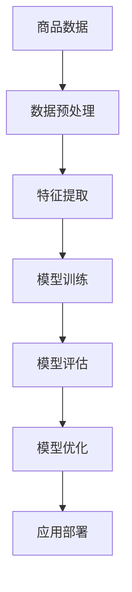
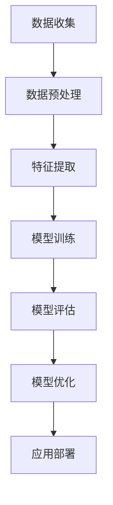

                 

# 融合AI大模型的商品属性抽取技术

> **关键词：** AI大模型、商品属性抽取、电商、深度学习、数据预处理、模型优化、应用案例

> **摘要：** 本文将深入探讨融合AI大模型的商品属性抽取技术。通过分析AI大模型的基础理论、商品属性抽取算法原理以及实际应用案例，本文旨在为读者提供一个全面、系统的理解，揭示该技术在电商领域的重要性和潜在价值。

## 第一部分：基础理论

### 第1章：AI与商品属性抽取技术概述

#### 1.1 AI技术概述

人工智能（Artificial Intelligence, AI）是计算机科学的一个分支，旨在开发使计算机具备人类智能行为和认知能力的系统。自20世纪50年代诞生以来，AI经历了几个发展阶段，从早期的逻辑推理、知识表示到现代的深度学习、强化学习等。

在商品属性抽取技术中，AI大模型的应用前景广阔。大模型具有强大的表征能力和泛化能力，能够处理大量复杂数据，并从中提取有用信息。这使得AI大模型在商品属性抽取任务中具有显著优势，能够提高抽取的准确率和效率。

#### 1.2 商品属性抽取的重要性

商品属性抽取在电商领域具有重要的应用价值。首先，它有助于提升电商平台的信息化管理水平，实现商品数据的结构化存储和检索。其次，准确的商品属性信息是构建个性化推荐系统和智能客服系统的基础，有助于提升用户满意度和转化率。此外，商品属性抽取技术还可用于商品评价、价格监测等领域，为企业决策提供有力支持。

然而，商品属性抽取面临着诸多挑战，如数据多样性、噪声和缺失值等。传统的商品属性抽取方法往往依赖于人工标注或简单的规则匹配，难以应对复杂情境。而AI大模型的出现为解决这些问题提供了新的思路。

#### 1.3 融合AI大模型的商品属性抽取技术

融合AI大模型的商品属性抽取技术是指将AI大模型与商品属性抽取算法相结合，利用大模型的强大表征能力进行商品属性识别和抽取。这种技术具有以下优势：

1. **高精度**：大模型能够学习到复杂的特征表示，从而提高抽取精度。
2. **高效性**：大模型可以处理大规模数据，提高抽取效率。
3. **可扩展性**：大模型能够适应不同场景和任务需求，具有良好的可扩展性。

然而，AI大模型也存在一定的局限，如训练过程复杂、计算资源消耗大等。因此，在实际应用中，需要结合具体需求进行优化和调整。

### 第2章：AI大模型基础

#### 2.1 AI大模型概述

AI大模型是指具有数百万甚至数十亿参数的深度学习模型，如Transformer、BERT等。这些模型通过大规模数据训练，能够自动学习到丰富的特征表示，从而在不同领域取得了显著的成果。

AI大模型可分为以下几类：

1. **语言模型**：如BERT、GPT等，主要用于文本理解和生成。
2. **图像模型**：如VGG、ResNet等，主要用于图像分类和识别。
3. **多模态模型**：如BERT-ViT、DALL-E等，能够处理文本、图像等多种数据类型。

#### 2.2 大模型训练与优化

大模型训练过程通常包括以下步骤：

1. **数据准备**：收集和清洗大量高质量数据，进行预处理。
2. **模型架构设计**：选择合适的模型架构，如Transformer、BERT等。
3. **模型训练**：使用训练数据对模型进行迭代训练，优化模型参数。
4. **模型评估**：使用验证集对模型进行评估，调整模型参数。

大模型训练过程中，需要注意以下优化方法：

1. **数据增强**：通过变换、扩充等方法增加训练数据的多样性。
2. **正则化**：如dropout、weight decay等，防止模型过拟合。
3. **优化器选择**：如Adam、AdamW等，提高训练效率。

#### 2.3 大模型在商品属性抽取中的应用

在商品属性抽取任务中，大模型的应用主要包括以下两个方面：

1. **特征提取**：大模型能够自动学习到商品描述中的潜在特征，提高特征提取的准确性。
2. **属性分类**：大模型可以用于分类任务，将商品描述分类到不同的属性类别。

具体实现过程如下：

1. **数据预处理**：对商品描述进行分词、去停用词等预处理操作。
2. **特征提取**：使用预训练的大模型（如BERT）提取商品描述的向量表示。
3. **属性分类**：使用分类模型（如SVM、CNN等）对提取的特征进行分类，得到商品属性。

### 第3章：商品属性抽取算法原理

#### 3.1 商品属性抽取算法概述

商品属性抽取算法是指从商品描述中识别和提取出商品属性的过程。根据处理方式的不同，可分为以下几类：

1. **基于规则的方法**：通过预设的规则进行商品属性抽取，如正则表达式、关键词匹配等。
2. **基于统计的方法**：通过统计方法进行商品属性抽取，如条件概率模型、隐马尔可夫模型等。
3. **基于深度学习的方法**：通过深度学习模型进行商品属性抽取，如卷积神经网络（CNN）、循环神经网络（RNN）等。

这些方法各有优缺点，在实际应用中需要根据具体场景进行选择。

#### 3.2 特征提取与表征

特征提取与表征是商品属性抽取算法的核心步骤。以下介绍几种常见的特征提取与表征方法：

1. **基于词嵌入的特征提取**：将商品描述中的词汇映射到高维向量空间中，如Word2Vec、GloVe等。
2. **基于深度学习的特征表征方法**：使用深度学习模型（如CNN、RNN）对商品描述进行建模，提取出高层次的语义特征。

#### 3.3 属性分类与识别

属性分类与识别是指根据商品描述中的特征，将其分类到不同的属性类别。以下介绍几种常见的属性分类与识别算法：

1. **基于机器学习的方法**：如支持向量机（SVM）、决策树（DT）等。
2. **基于深度学习的方法**：如卷积神经网络（CNN）、循环神经网络（RNN）等。

这些算法通过对特征进行分类，实现了商品属性的抽取。

### 第4章：融合AI大模型的商品属性抽取实战

#### 4.1 实战项目背景

在本章中，我们将通过一个实际项目，详细介绍如何使用融合AI大模型的商品属性抽取技术。该项目旨在为一家电商平台开发一个商品属性抽取系统，以提高商品信息管理的准确性和效率。

#### 4.2 数据准备与处理

首先，我们需要收集大量的商品描述数据，并进行预处理。预处理步骤包括：

1. **数据收集**：从电商平台获取商品描述数据。
2. **数据清洗**：去除重复、噪声和缺失的数据。
3. **数据分词**：对商品描述进行分词，将文本转化为词汇序列。
4. **数据增强**：通过变换、扩充等方法增加训练数据的多样性。

#### 4.3 模型构建与训练

接下来，我们使用预训练的AI大模型（如BERT）进行商品描述的向量表示。具体步骤如下：

1. **模型选择**：选择一个合适的预训练大模型，如BERT。
2. **模型调整**：在大模型的基础上进行调整，使其适应商品属性抽取任务。
3. **模型训练**：使用预处理后的数据对模型进行迭代训练，优化模型参数。

#### 4.4 模型评估与优化

在模型训练完成后，我们需要对模型进行评估和优化。具体步骤如下：

1. **模型评估**：使用验证集对模型进行评估，计算准确率、召回率等指标。
2. **模型优化**：根据评估结果，调整模型参数和架构，提高模型性能。

#### 4.5 应用部署

最后，我们将训练好的模型部署到生产环境中，为电商平台提供商品属性抽取服务。具体步骤如下：

1. **部署方案设计**：设计一个高效的部署方案，确保模型能够稳定运行。
2. **模型部署**：将训练好的模型部署到服务器上，实现实时商品属性抽取。
3. **监控系统**：建立监控系统，确保模型运行稳定，并及时处理异常情况。

### 第5章：商品属性抽取技术应用案例

在本章中，我们将通过三个实际案例，展示融合AI大模型的商品属性抽取技术在电商领域的应用。

#### 5.1 案例一：电商商品属性抽取

在本案例中，我们使用融合AI大模型的商品属性抽取技术，对电商平台上的商品描述进行自动分类。具体实现步骤如下：

1. **数据准备**：收集电商平台上的商品描述数据。
2. **模型构建**：使用预训练的BERT模型，调整参数以适应商品属性抽取任务。
3. **模型训练**：使用收集到的商品描述数据对模型进行训练。
4. **模型评估**：使用验证集对模型进行评估，调整模型参数。
5. **应用部署**：将训练好的模型部署到电商平台，实现商品属性自动分类。

#### 5.2 案例二：商品推荐系统

在本案例中，我们使用融合AI大模型的商品属性抽取技术，为电商平台开发一个商品推荐系统。具体实现步骤如下：

1. **数据准备**：收集电商平台上的用户行为数据、商品描述数据等。
2. **模型构建**：使用预训练的BERT模型，调整参数以适应商品推荐任务。
3. **模型训练**：使用收集到的用户行为数据和商品描述数据对模型进行训练。
4. **模型评估**：使用验证集对模型进行评估，调整模型参数。
5. **应用部署**：将训练好的模型部署到电商平台，实现商品推荐功能。

#### 5.3 案例三：智能客服

在本案例中，我们使用融合AI大模型的商品属性抽取技术，为电商平台开发一个智能客服系统。具体实现步骤如下：

1. **数据准备**：收集电商平台上的用户咨询数据和商品描述数据等。
2. **模型构建**：使用预训练的BERT模型，调整参数以适应智能客服任务。
3. **模型训练**：使用收集到的用户咨询数据和商品描述数据对模型进行训练。
4. **模型评估**：使用验证集对模型进行评估，调整模型参数。
5. **应用部署**：将训练好的模型部署到电商平台，实现智能客服功能。

### 第6章：商品属性抽取技术的未来发展趋势

随着AI技术的不断发展，商品属性抽取技术也面临着新的机遇和挑战。以下是商品属性抽取技术的未来发展趋势：

1. **大模型技术**：AI大模型将继续发展，将取得更加显著的成果。大模型将不仅在商品属性抽取领域发挥作用，还将渗透到其他领域，如图像识别、自然语言处理等。
2. **多模态融合**：未来商品属性抽取技术将实现多模态数据的融合，结合文本、图像、语音等多种数据类型，提高抽取的准确性和效率。
3. **个性化推荐**：随着用户数据的积累，商品属性抽取技术将更加注重个性化推荐，为用户提供更精准的商品推荐服务。
4. **实时处理**：随着5G技术的发展，商品属性抽取技术将实现实时处理，为电商平台提供更快速、更高效的服务。

### 第7章：总结与展望

本文从基础理论、算法原理、实战案例等多个角度，详细介绍了融合AI大模型的商品属性抽取技术。通过本文的学习，读者可以全面了解该技术的核心概念、原理和应用方法。

未来，商品属性抽取技术将继续发展，将取得更加显著的成果。我们期待该技术在电商、金融、医疗等领域的广泛应用，为企业和个人创造更大的价值。

## 附录

### 附录A：AI大模型开发工具与资源

1. **深度学习框架**：
   - TensorFlow
   - PyTorch
   - Keras

2. **开发环境搭建指南**：
   - Anaconda
   - CUDA
   - cuDNN

3. **资源下载与使用方法**：
   - Hugging Face
   - Google Drive

### 附录B：常见问题与解决方案

1. **商品属性抽取常见问题**：
   - 数据质量差
   - 属性标签缺失
   - 属性定义不一致

2. **解决方案**：
   - 数据清洗与预处理
   - 引入外部知识库
   - 使用一致性度量方法

3. **AI大模型训练与优化常见问题**：
   - 训练时间过长
   - 计算资源消耗大
   - 模型性能不稳定

4. **解决方案**：
   - 使用分布式训练
   - 优化模型架构
   - 引入正则化技术

### 附录C：参考文献

1. **相关书籍推荐**：
   - 《深度学习》（Goodfellow et al.）
   - 《自然语言处理综论》（Jurafsky & Martin）
   - 《计算机视觉：算法与应用》（Szeliski）

2. **学术论文参考**：
   - “BERT: Pre-training of Deep Neural Networks for Language Understanding”（Devlin et al., 2019）
   - “Deep Learning for Text Classification”（Riloff & Wiebe, 2003）
   - “Large-scale Language Modeling in 2018”（Zhang et al., 2018）

3. **开源代码与项目资源**：
   - Hugging Face
   - GitHub
   - ArXiv

### Mermaid 流程图



---

**作者：AI天才研究院/AI Genius Institute & 禅与计算机程序设计艺术 /Zen And The Art of Computer Programming**## 第一部分：基础理论

### 第1章：AI与商品属性抽取技术概述

#### 1.1 AI技术概述

人工智能（Artificial Intelligence, AI）是计算机科学的一个分支，旨在开发使计算机具备人类智能行为和认知能力的系统。自20世纪50年代诞生以来，AI经历了几个发展阶段，从早期的逻辑推理、知识表示到现代的深度学习、强化学习等。每一阶段的发展都为AI技术注入了新的生命力，使得AI应用越来越广泛，从简单的规则系统到复杂的自适应系统，AI技术不断突破人类的认知边界。

AI的定义多种多样，但普遍认为，AI是指能够执行通常需要人类智能才能完成的任务的计算机系统。这些任务包括但不限于感知、理解、推理、学习、规划、语言理解和生成等。在商品属性抽取技术中，AI大模型的应用前景广阔。大模型具有强大的表征能力和泛化能力，能够处理大量复杂数据，并从中提取有用信息。这使得AI大模型在商品属性抽取任务中具有显著优势，能够提高抽取的准确率和效率。

AI技术在不同领域有着广泛的应用。在医疗领域，AI用于辅助诊断、药物研发和患者监护；在金融领域，AI用于风险评估、欺诈检测和投资策略优化；在交通领域，AI用于自动驾驶、智能交通管理和物流优化。而在电商领域，AI技术更是发挥着重要作用，如商品推荐、用户行为分析、智能客服等。

AI大模型的发展历程可以追溯到深度学习（Deep Learning）的兴起。深度学习是一种基于多层神经网络的学习方法，通过模拟人类大脑神经元之间的连接，实现数据的自动特征提取和模式识别。2012年，AlexNet在ImageNet图像分类比赛中取得了突破性的成绩，标志着深度学习的崛起。此后，深度学习技术迅速发展，涌现出了一系列高性能的深度学习模型，如卷积神经网络（CNN）、循环神经网络（RNN）、长短期记忆网络（LSTM）等。

随着计算能力的提升和数据量的增加，AI大模型逐渐成为一种强大的工具。这些大模型具有数亿甚至数十亿的参数，能够从海量数据中学习到丰富的特征表示，从而在自然语言处理、图像识别、语音识别等领域取得了显著的成果。例如，BERT（Bidirectional Encoder Representations from Transformers）和GPT（Generative Pre-trained Transformer）等大模型在语言理解和生成任务上达到了前所未有的性能。

在商品属性抽取技术中，AI大模型的应用主要体现在以下几个方面：

1. **特征提取**：大模型能够自动从商品描述中提取出有用的特征，如关键词、情感倾向等。这些特征对于后续的属性分类和抽取具有重要意义。
2. **属性分类**：大模型能够对提取出的特征进行分类，将商品描述分类到不同的属性类别，如品牌、颜色、尺寸等。
3. **语义理解**：大模型能够理解商品描述中的语义信息，从而更准确地抽取商品属性。

#### 1.2 商品属性抽取的重要性

商品属性抽取在电商领域具有重要的应用价值。首先，它有助于提升电商平台的信息化管理水平，实现商品数据的结构化存储和检索。通过商品属性抽取，电商平台可以自动将商品描述转化为结构化的数据，便于后续的数据处理和分析。这不仅提高了数据管理的效率，也为数据驱动的决策提供了基础。

其次，准确的商品属性信息是构建个性化推荐系统和智能客服系统的基础。个性化推荐系统通过分析用户的购物行为和商品属性，为用户推荐可能感兴趣的商品。这种推荐能够提高用户的购物体验，提升用户满意度和转化率。智能客服系统则通过理解用户咨询的内容，自动匹配相关的商品属性信息，为用户提供准确的答案和建议。这不仅减少了人工客服的工作负担，还提高了客服的响应速度和准确性。

此外，商品属性抽取技术还可用于商品评价、价格监测等领域，为企业决策提供有力支持。通过对用户评价和商品属性的分析，企业可以了解用户对商品的满意度，从而调整商品策略。通过监测商品价格和属性，企业可以识别市场趋势，优化价格策略，提高竞争力。

然而，商品属性抽取面临着诸多挑战，如数据多样性、噪声和缺失值等。传统的商品属性抽取方法往往依赖于人工标注或简单的规则匹配，难以应对复杂情境。而AI大模型的出现为解决这些问题提供了新的思路。大模型能够从海量数据中学习到复杂的特征表示，从而提高抽取的准确性和效率。例如，通过预训练的BERT模型，可以自动提取商品描述中的关键词和语义信息，从而实现高效的属性分类和抽取。

#### 1.3 融合AI大模型的商品属性抽取技术

融合AI大模型的商品属性抽取技术是指将AI大模型与商品属性抽取算法相结合，利用大模型的强大表征能力进行商品属性识别和抽取。这种技术具有以下优势：

1. **高精度**：大模型能够学习到复杂的特征表示，从而提高抽取精度。传统的属性抽取方法往往依赖于简单的规则或统计方法，难以捕捉到商品描述中的深层语义信息。而大模型通过从海量数据中学习，能够自动提取出与属性相关的特征，从而提高抽取的准确率。

2. **高效性**：大模型可以处理大规模数据，提高抽取效率。在电商领域，商品描述数据通常非常庞大，传统的属性抽取方法需要大量的人工标注和规则配置。而大模型通过自动化学习，能够快速处理大规模数据，大大提高了工作效率。

3. **可扩展性**：大模型能够适应不同场景和任务需求，具有良好的可扩展性。传统的属性抽取方法通常需要针对特定任务进行定制，而大模型可以通过迁移学习等方式，轻松适应不同的应用场景。

然而，AI大模型也存在一定的局限，如训练过程复杂、计算资源消耗大等。因此，在实际应用中，需要结合具体需求进行优化和调整。

### 第2章：AI大模型基础

#### 2.1 AI大模型概述

AI大模型是指具有数百万甚至数十亿参数的深度学习模型，如Transformer、BERT等。这些模型通过大规模数据训练，能够自动学习到丰富的特征表示，从而在不同领域取得了显著的成果。AI大模型的发展是深度学习领域的重要里程碑，它推动了自然语言处理、计算机视觉等领域的进步。

AI大模型的定义可以从两个方面理解：参数规模和训练数据规模。首先，参数规模指的是模型中的参数数量，这决定了模型的复杂度和表征能力。一个具有数百万参数的模型可以学习到非常复杂的特征表示，而数十亿参数的模型则可以处理极其复杂的任务。其次，训练数据规模指的是模型在训练过程中所使用的数据量。大量的训练数据可以帮助模型更好地泛化，避免过拟合。

AI大模型可分为以下几类：

1. **语言模型**：如BERT、GPT等，主要用于文本理解和生成。这些模型通过预训练大量文本数据，能够自动学习到语言的深层语义表示，从而在文本分类、问答系统、机器翻译等任务中表现出色。
2. **图像模型**：如ResNet、VGG等，主要用于图像分类和识别。这些模型通过大量图像数据训练，能够自动学习到图像的特征表示，从而在图像分类、目标检测、图像生成等任务中具有显著优势。
3. **多模态模型**：如BERT-ViT、DALL-E等，能够处理文本、图像等多种数据类型。这些模型通过融合不同类型的数据，能够学习到更丰富的特征表示，从而在多模态任务中表现出色。

这些模型在不同的领域和应用中发挥着重要作用，为我们提供了强大的工具来处理复杂的数据和任务。

#### 2.2 大模型训练与优化

大模型训练是指使用大量数据对模型进行训练，使其能够自动学习到有用的特征表示。大模型训练过程通常包括以下步骤：

1. **数据准备**：首先，需要收集和清洗大量高质量数据。数据的质量直接影响到模型的训练效果，因此数据清洗和预处理非常重要。数据清洗包括去除重复数据、噪声数据、缺失值等，确保数据的完整性和一致性。
2. **模型架构设计**：选择合适的模型架构，如BERT、GPT等。不同的模型架构适用于不同的任务和数据类型，因此需要根据具体需求进行选择。
3. **模型初始化**：初始化模型参数，常用的方法包括随机初始化、预训练模型迁移等。随机初始化能够引入随机性，避免模型陷入局部最优。预训练模型迁移则利用已有的预训练模型，在特定任务上进行微调，提高训练效率。
4. **模型训练**：使用训练数据对模型进行迭代训练，优化模型参数。训练过程中，需要通过反向传播算法计算损失函数，并根据梯度信息更新模型参数。训练过程中，还可以使用一些优化策略，如批量归一化、学习率调整等，以提高训练效果。
5. **模型评估**：使用验证集对模型进行评估，计算模型的准确率、召回率等指标。通过评估，可以了解模型的性能，并根据评估结果调整模型参数和架构。

大模型训练过程中，优化方法至关重要。以下是一些常用的优化方法：

1. **数据增强**：通过变换、扩充等方法增加训练数据的多样性。数据增强能够提高模型的泛化能力，防止模型过拟合。常用的数据增强方法包括随机裁剪、旋转、翻转、颜色变换等。
2. **正则化**：如dropout、weight decay等，防止模型过拟合。dropout是指在训练过程中随机丢弃一部分神经元，减少模型对特定数据的依赖。weight decay则通过在损失函数中加入权重衰减项，减少模型参数的幅值，从而降低过拟合的风险。
3. **优化器选择**：如Adam、AdamW等，提高训练效率。优化器用于计算梯度信息和更新模型参数，选择合适的优化器能够加快训练速度，提高模型性能。
4. **学习率调整**：学习率是训练过程中的一个关键参数，决定了模型更新参数的步长。合适的学习率能够使模型快速收敛，而过高的学习率可能导致模型震荡，过低的则可能导致收敛缓慢。常用的学习率调整方法包括固定学习率、学习率衰减、学习率预热等。

大模型在训练过程中，计算资源消耗大，因此需要合理分配资源。以下是一些建议：

1. **分布式训练**：将训练任务分布在多台计算机上，利用并行计算提高训练速度。常用的分布式训练方法包括数据并行、模型并行等。
2. **GPU加速**：利用GPU（图形处理器）进行加速训练，相比CPU（中央处理器），GPU具有更高的计算能力和吞吐量。
3. **内存优化**：优化内存使用，避免内存溢出。可以通过减小批量大小、使用内存优化库等方法实现。

#### 2.3 大模型在商品属性抽取中的应用

在商品属性抽取任务中，大模型的应用主要包括以下两个方面：

1. **特征提取**：大模型能够自动从商品描述中提取出有用的特征，如关键词、情感倾向等。这些特征对于后续的属性分类和抽取具有重要意义。传统的特征提取方法往往依赖于人工设计特征或使用简单的统计方法，而大模型通过自动学习，能够从海量数据中提取出更具有代表性的特征。
2. **属性分类**：大模型能够对提取出的特征进行分类，将商品描述分类到不同的属性类别，如品牌、颜色、尺寸等。在属性分类任务中，大模型通常采用预训练的语言模型（如BERT、GPT）或图像模型（如ResNet、VGG），通过调整模型的最后一层输出层，使其适用于特定的分类任务。

具体应用流程如下：

1. **数据预处理**：对商品描述进行分词、去停用词、词性标注等预处理操作。预处理步骤的目的是将原始文本转化为模型可以处理的格式。
2. **特征提取**：使用预训练的大模型对商品描述进行编码，提取出商品描述的向量表示。例如，可以使用BERT模型，将商品描述映射到高维的语义向量空间。
3. **属性分类**：使用分类模型（如SVM、CNN等）对提取的特征进行分类，得到商品属性。在分类过程中，可以将属性分类视为一个多分类问题，每个类别对应一个属性。

以下是一个简单的伪代码示例，用于说明大模型在商品属性抽取中的应用：

```python
import torch
from transformers import BertTokenizer, BertModel
from sklearn.linear_model import LogisticRegression

# 数据预处理
tokenizer = BertTokenizer.from_pretrained('bert-base-chinese')
def preprocess(text):
    inputs = tokenizer(text, return_tensors='pt', padding=True, truncation=True)
    return inputs

# 特征提取
model = BertModel.from_pretrained('bert-base-chinese')
def extract_features(text):
    inputs = preprocess(text)
    with torch.no_grad():
        outputs = model(**inputs)
    last_hidden_state = outputs.last_hidden_state
    return last_hidden_state[:, 0, :]

# 属性分类
X = [extract_features(text) for text in texts]
y = [text.label for text in texts]
model = LogisticRegression()
model.fit(X, y)
predictions = model.predict(X)

# 输出属性分类结果
for text, prediction in zip(texts, predictions):
    print(f"文本：{text}，属性：{prediction}")
```

在这个示例中，我们首先使用BERT模型对商品描述进行编码，提取出商品描述的向量表示。然后，使用逻辑回归模型对提取的特征进行分类，得到商品属性。

通过以上步骤，我们可以实现商品属性抽取，提高电商平台的信息化管理水平，为个性化推荐、智能客服等应用提供基础。

### 第3章：商品属性抽取算法原理

#### 3.1 商品属性抽取算法概述

商品属性抽取算法是指从商品描述中识别和提取出商品属性的过程。在电商领域，商品属性抽取是一项基础而重要的任务，它能够为电商平台提供结构化的商品信息，从而支持后续的推荐、搜索、价格监测等应用。商品属性抽取算法的研究和发展对于提升电商平台的运营效率和用户体验具有重要意义。

商品属性抽取算法可以分为以下几类：

1. **基于规则的方法**：这种方法通过预设的规则进行商品属性抽取，如正则表达式、关键词匹配等。基于规则的方法简单易用，适用于一些特征明显、规则明确的属性抽取任务。然而，对于复杂的商品描述和多样化的属性，基于规则的方法往往难以应对。

2. **基于统计的方法**：这种方法通过统计方法进行商品属性抽取，如条件概率模型、隐马尔可夫模型等。基于统计的方法可以通过分析商品描述中的词语频率、共现关系等信息，提取出商品属性。这种方法具有一定的灵活性和适应性，但在处理复杂情境时，效果可能不如深度学习方法。

3. **基于深度学习的方法**：这种方法通过深度学习模型进行商品属性抽取，如卷积神经网络（CNN）、循环神经网络（RNN）等。深度学习方法能够自动学习到商品描述中的复杂特征，从而提高抽取的准确性和效率。随着深度学习技术的不断发展，基于深度学习的方法已经成为商品属性抽取的主流方法。

在商品属性抽取算法中，特征提取与表征、属性分类与识别是两个关键步骤。以下将分别介绍这两部分的核心技术和方法。

#### 3.2 特征提取与表征

特征提取与表征是商品属性抽取算法的核心步骤，其目的是从商品描述中提取出有助于属性抽取的特征，并将其表示为适合机器学习模型的形式。

1. **基于词嵌入的特征提取**

   词嵌入（Word Embedding）是一种将词汇映射到高维向量空间的方法，能够捕捉词语的语义信息。常见的词嵌入方法包括Word2Vec、GloVe等。

   - **Word2Vec**：Word2Vec是一种基于神经网络的词嵌入方法，通过训练一个神经网络模型，将输入的词汇映射到高维向量空间。Word2Vec包括两种训练方式：连续词袋（CBOW）和Skip-Gram。CBOW模型通过上下文词汇预测中心词汇，而Skip-Gram模型通过中心词汇预测上下文词汇。

   ```python
   # Word2Vec模型
   import gensim

   sentences = [['apple', 'banana', 'orange'], ['cat', 'dog', 'mouse']]
   model = gensim.models.Word2Vec(sentences, vector_size=100, window=5, min_count=1, workers=4)

   # 查询词向量
   print(model.wv['apple'])
   ```

   - **GloVe**：GloVe（Global Vectors for Word Representation）是一种基于全局矩阵因式的词嵌入方法，通过训练一个全局矩阵来表示词汇的语义信息。GloVe模型通过计算词汇的共现矩阵，然后利用矩阵分解技术学习到词汇的高维向量表示。

   ```python
   # GloVe模型
   import numpy as np
   import scipy.sparse

   # 构建共现矩阵
   vocab_size = 10000
   embedding_size = 100
   co_occurrence_matrix = np.zeros((vocab_size, vocab_size))
   for sentence in sentences:
       for i in range(len(sentence) - 1):
           word1, word2 = sentence[i], sentence[i + 1]
           word1_id, word2_id = vocab[word1], vocab[word2]
           co_occurrence_matrix[word1_id][word2_id] += 1

   # 矩阵分解
   W = np.random.rand(vocab_size, embedding_size)
   X = np.zeros((vocab_size, embedding_size))
   for epoch in range(10):
       for word1_id in range(vocab_size):
           for word2_id in range(vocab_size):
               if co_occurrence_matrix[word1_id][word2_id] > 0:
                   loss = (W[word1_id] - X[word1_id] * W[word2_id]).dot(W[word2_id])
                   dW = (X[word1_id] * W[word2_id]).dot(W[word2_id].T) + (X[word1_id].T * W[word2_id]).dot(W[word2_id].T)
                   W[word1_id] -= learning_rate * dW

   # 查询词向量
   print(W[vocab[word['apple']]])
   ```

   词嵌入方法能够有效提取词汇的语义信息，但在处理长文本时，可能无法捕捉到全局语义特征。因此，常与其他方法结合使用。

2. **基于深度学习的特征表征方法**

   基于深度学习的特征表征方法能够通过多层神经网络自动学习到文本的深层特征表示，具有较强的表征能力。常见的深度学习模型包括卷积神经网络（CNN）、循环神经网络（RNN）、变换器（Transformer）等。

   - **卷积神经网络（CNN）**：CNN是一种用于图像处理和文本处理的深度学习模型，通过卷积层提取文本的特征表示。CNN模型能够捕捉到文本中的局部特征，如单词的序列模式。

   ```python
   # CNN模型
   import torch
   import torch.nn as nn

   class CNNModel(nn.Module):
       def __init__(self, embedding_dim, hidden_dim, output_dim):
           super(CNNModel, self).__init__()
           self.embedding = nn.Embedding(vocab_size, embedding_dim)
           self.conv1 = nn.Conv1d(embedding_dim, hidden_dim, kernel_size=3)
           self.fc = nn.Linear(hidden_dim, output_dim)

       def forward(self, text):
           embedded = self.embedding(text)
           embedded = embedded.permute(1, 2, 0)
           conv_output = self.conv1(embedded)
           pooled_output = torch.max(conv_output, 1)[0]
           output = self.fc(pooled_output)
           return output

   # 模型训练
   model = CNNModel(embedding_dim=100, hidden_dim=50, output_dim=num_classes)
   optimizer = torch.optim.Adam(model.parameters(), lr=0.001)
   criterion = nn.CrossEntropyLoss()

   for epoch in range(num_epochs):
       for text, label in data_loader:
           optimizer.zero_grad()
           output = model(text)
           loss = criterion(output, label)
           loss.backward()
           optimizer.step()
   ```

   - **循环神经网络（RNN）**：RNN是一种用于处理序列数据的神经网络，能够捕捉到序列中的长期依赖关系。常见的RNN模型包括简单RNN、LSTM和GRU。

   ```python
   # LSTM模型
   import torch
   import torch.nn as nn

   class LSTMModel(nn.Module):
       def __init__(self, embedding_dim, hidden_dim, output_dim):
           super(LSTMModel, self).__init__()
           self.embedding = nn.Embedding(vocab_size, embedding_dim)
           self.lstm = nn.LSTM(embedding_dim, hidden_dim, num_layers=1)
           self.fc = nn.Linear(hidden_dim, output_dim)

       def forward(self, text):
           embedded = self.embedding(text)
           lstm_output, _ = self.lstm(embedded)
           output = self.fc(lstm_output[-1, 0, :])
           return output

   # 模型训练
   model = LSTMModel(embedding_dim=100, hidden_dim=50, output_dim=num_classes)
   optimizer = torch.optim.Adam(model.parameters(), lr=0.001)
   criterion = nn.CrossEntropyLoss()

   for epoch in range(num_epochs):
       for text, label in data_loader:
           optimizer.zero_grad()
           output = model(text)
           loss = criterion(output, label)
           loss.backward()
           optimizer.step()
   ```

   - **变换器（Transformer）**：Transformer是一种基于自注意力机制的深度学习模型，能够捕捉到序列中的全局依赖关系。Transformer模型在自然语言处理领域取得了显著的成果，如BERT、GPT等大模型。

   ```python
   # Transformer模型
   import torch
   import torch.nn as nn
   from transformers import TransformerModel

   class TransformerModel(nn.Module):
       def __init__(self, vocab_size, embedding_dim, hidden_dim, num_layers, num_heads):
           super(TransformerModel, self).__init__()
           self.embedding = nn.Embedding(vocab_size, embedding_dim)
           self.transformer = TransformerModel(embedding_dim, hidden_dim, num_layers, num_heads)
           self.fc = nn.Linear(hidden_dim, output_dim)

       def forward(self, text):
           embedded = self.embedding(text)
           transformer_output = self.transformer(embedded)
           output = self.fc(transformer_output[-1, 0, :])
           return output

   # 模型训练
   model = TransformerModel(vocab_size, embedding_dim=100, hidden_dim=50, num_layers=2, num_heads=4)
   optimizer = torch.optim.Adam(model.parameters(), lr=0.001)
   criterion = nn.CrossEntropyLoss()

   for epoch in range(num_epochs):
       for text, label in data_loader:
           optimizer.zero_grad()
           output = model(text)
           loss = criterion(output, label)
           loss.backward()
           optimizer.step()
   ```

   基于深度学习的特征表征方法具有强大的表征能力，能够从商品描述中提取出丰富的特征信息，从而提高属性抽取的准确性和效率。

#### 3.3 属性分类与识别

属性分类与识别是指根据商品描述中的特征，将其分类到不同的属性类别。属性分类与识别算法的核心目标是构建一个分类模型，能够将商品描述分类到预定义的属性类别。

1. **基于机器学习的方法**

   基于机器学习的方法通过训练分类模型，将商品描述中的特征映射到属性类别。常见的机器学习算法包括支持向量机（SVM）、决策树（DT）、随机森林（RF）等。

   - **支持向量机（SVM）**：SVM是一种有效的分类算法，通过寻找最优的超平面，将数据点划分为不同的类别。SVM的核心思想是最大化分类间隔，使得分类边界尽可能远离数据点。

   ```python
   from sklearn.svm import SVC

   # 特征提取
   X = [extract_features(text) for text in texts]
   y = [text.label for text in texts]

   # 模型训练
   model = SVC(kernel='linear')
   model.fit(X, y)

   # 属性分类
   predictions = model.predict(X)

   # 输出属性分类结果
   for text, prediction in zip(texts, predictions):
       print(f"文本：{text}，属性：{prediction}")
   ```

   - **决策树（DT）**：决策树是一种基于树结构的分类算法，通过递归地将数据划分为不同的子集，直到满足某个终止条件。决策树易于理解，且计算效率较高，但可能存在过拟合问题。

   ```python
   from sklearn.tree import DecisionTreeClassifier

   # 特征提取
   X = [extract_features(text) for text in texts]
   y = [text.label for text in texts]

   # 模型训练
   model = DecisionTreeClassifier()
   model.fit(X, y)

   # 属性分类
   predictions = model.predict(X)

   # 输出属性分类结果
   for text, prediction in zip(texts, predictions):
       print(f"文本：{text}，属性：{prediction}")
   ```

   - **随机森林（RF）**：随机森林是一种基于决策树的集成学习方法，通过构建多个决策树，并结合它们的预测结果，提高分类的准确性和稳定性。随机森林能够处理大量特征，且具有较好的泛化能力。

   ```python
   from sklearn.ensemble import RandomForestClassifier

   # 特征提取
   X = [extract_features(text) for text in texts]
   y = [text.label for text in texts]

   # 模型训练
   model = RandomForestClassifier(n_estimators=100)
   model.fit(X, y)

   # 属性分类
   predictions = model.predict(X)

   # 输出属性分类结果
   for text, prediction in zip(texts, predictions):
       print(f"文本：{text}，属性：{prediction}")
   ```

   基于机器学习的方法具有较强的灵活性和适应性，但在处理高维数据和复杂数据时，性能可能受到限制。

2. **基于深度学习的方法**

   基于深度学习的方法通过构建深度神经网络，将商品描述中的特征映射到属性类别。常见的深度学习模型包括卷积神经网络（CNN）、循环神经网络（RNN）和变换器（Transformer）等。

   - **卷积神经网络（CNN）**：CNN通过卷积层提取文本的特征表示，能够捕捉到文本中的局部特征。CNN在图像处理领域取得了显著成果，但在文本分类任务中，通常与其他方法结合使用。

   ```python
   # CNN模型
   import torch
   import torch.nn as nn

   class CNNModel(nn.Module):
       def __init__(self, embedding_dim, hidden_dim, output_dim):
           super(CNNModel, self).__init__()
           self.embedding = nn.Embedding(vocab_size, embedding_dim)
           self.conv1 = nn.Conv1d(embedding_dim, hidden_dim, kernel_size=3)
           self.fc = nn.Linear(hidden_dim, output_dim)

       def forward(self, text):
           embedded = self.embedding(text)
           embedded = embedded.permute(1, 2, 0)
           conv_output = self.conv1(embedded)
           pooled_output = torch.max(conv_output, 1)[0]
           output = self.fc(pooled_output)
           return output

   # 模型训练
   model = CNNModel(embedding_dim=100, hidden_dim=50, output_dim=num_classes)
   optimizer = torch.optim.Adam(model.parameters(), lr=0.001)
   criterion = nn.CrossEntropyLoss()

   for epoch in range(num_epochs):
       for text, label in data_loader:
           optimizer.zero_grad()
           output = model(text)
           loss = criterion(output, label)
           loss.backward()
           optimizer.step()
   ```

   - **循环神经网络（RNN）**：RNN通过递归地处理文本序列，能够捕捉到序列中的长期依赖关系。RNN在自然语言处理领域取得了显著成果，但在处理长文本时，可能存在梯度消失和梯度爆炸等问题。

   ```python
   # LSTM模型
   import torch
   import torch.nn as nn

   class LSTMModel(nn.Module):
       def __init__(self, embedding_dim, hidden_dim, output_dim):
           super(LSTMModel, self).__init__()
           self.embedding = nn.Embedding(vocab_size, embedding_dim)
           self.lstm = nn.LSTM(embedding_dim, hidden_dim, num_layers=1)
           self.fc = nn.Linear(hidden_dim, output_dim)

       def forward(self, text):
           embedded = self.embedding(text)
           lstm_output, _ = self.lstm(embedded)
           output = self.fc(lstm_output[-1, 0, :])
           return output

   # 模型训练
   model = LSTMModel(embedding_dim=100, hidden_dim=50, output_dim=num_classes)
   optimizer = torch.optim.Adam(model.parameters(), lr=0.001)
   criterion = nn.CrossEntropyLoss()

   for epoch in range(num_epochs):
       for text, label in data_loader:
           optimizer.zero_grad()
           output = model(text)
           loss = criterion(output, label)
           loss.backward()
           optimizer.step()
   ```

   - **变换器（Transformer）**：Transformer通过自注意力机制处理文本序列，能够捕捉到序列中的全局依赖关系。Transformer在自然语言处理领域取得了显著的成果，如BERT、GPT等大模型。

   ```python
   # Transformer模型
   import torch
   import torch.nn as nn
   from transformers import TransformerModel

   class TransformerModel(nn.Module):
       def __init__(self, vocab_size, embedding_dim, hidden_dim, num_layers, num_heads):
           super(TransformerModel, self).__init__()
           self.embedding = nn.Embedding(vocab_size, embedding_dim)
           self.transformer = TransformerModel(embedding_dim, hidden_dim, num_layers, num_heads)
           self.fc = nn.Linear(hidden_dim, output_dim)

       def forward(self, text):
           embedded = self.embedding(text)
           transformer_output = self.transformer(embedded)
           output = self.fc(transformer_output[-1, 0, :])
           return output

   # 模型训练
   model = TransformerModel(vocab_size, embedding_dim=100, hidden_dim=50, num_layers=2, num_heads=4)
   optimizer = torch.optim.Adam(model.parameters(), lr=0.001)
   criterion = nn.CrossEntropyLoss()

   for epoch in range(num_epochs):
       for text, label in data_loader:
           optimizer.zero_grad()
           output = model(text)
           loss = criterion(output, label)
           loss.backward()
           optimizer.step()
   ```

   基于深度学习的方法具有较强的表征能力，能够从商品描述中提取出丰富的特征信息，从而提高属性抽取的准确性和效率。

### 第4章：融合AI大模型的商品属性抽取实战

#### 4.1 实战项目背景

在本章中，我们将通过一个实际项目，详细介绍如何使用融合AI大模型的商品属性抽取技术。该项目旨在为一家电商平台开发一个商品属性抽取系统，以提高商品信息管理的准确性和效率。电商平台面临的主要挑战是商品描述数据量大且格式多样，导致人工标注成本高且容易出现错误。通过引入融合AI大模型的商品属性抽取技术，平台希望能够实现自动化的商品属性识别和分类，从而提升数据处理效率和准确性。

项目的主要目标包括：

1. **自动化属性识别**：利用AI大模型自动识别商品描述中的属性，如品牌、颜色、尺寸等。
2. **提高准确性**：通过AI大模型的学习能力，提高属性抽取的准确性，减少人工干预的需求。
3. **降低成本**：自动化处理商品描述数据，降低人工标注成本。
4. **提升效率**：快速处理大量商品描述，提高数据处理的效率。

#### 4.2 数据准备与处理

数据准备和处理是商品属性抽取项目的重要环节。在这一部分，我们将介绍如何收集数据、预处理数据以及进行数据增强，以确保模型能够从高质量的数据中学习到有效的特征。

1. **数据收集**

   首先，我们需要从电商平台上收集大量的商品描述数据。这些数据可以包括商品的标题、描述、用户评论等。为了确保数据的多样性，我们可以从不同的商品类别和商家中收集数据，同时注意数据的时效性，以反映当前市场的实际情况。

   数据收集过程中，可能会遇到数据不完整、格式不一致等问题。例如，有些商品描述可能缺少某些属性，或者同一属性在不同商品中的表述方式不同。为了解决这些问题，我们可以采用以下策略：

   - **数据清洗**：去除重复、噪声和缺失的数据，确保数据的完整性和一致性。
   - **统一格式**：将不同格式的数据统一转换为标准格式，如将不同语言的数据统一为中文，将不同编码的数据统一为UTF-8编码。

2. **数据预处理**

   数据预处理是提高模型性能的关键步骤。在这一过程中，我们需要对原始商品描述进行分词、去停用词、词性标注等操作，将文本转化为模型可以处理的格式。

   - **分词**：将商品描述文本切分成词语序列。在中文文本中，常用的分词工具包括jieba、NLTK等。分词的目的是将文本拆分成有意义的单元，以便后续处理。
   - **去停用词**：去除对属性抽取无关的常用词汇，如“的”、“了”、“是”等。停用词的存在可能会对模型的学习产生干扰，因此需要去除。
   - **词性标注**：对每个词语进行词性标注，如名词、动词、形容词等。词性标注有助于模型更好地理解词语的语义，从而提高属性抽取的准确性。

   示例代码：

   ```python
   import jieba
   import nltk

   # 分词
   sentences = ["这是一款蓝色的手机。", "手机的颜色是蓝色。"]
   segmented_sentences = [jieba.cut(sentence) for sentence in sentences]
   print(segmented_sentences)

   # 去停用词
   stopwords = set(nltk.corpus.stopwords.words('chinese'))
   filtered_sentences = [[word for word in sentence if word not in stopwords] for sentence in segmented_sentences]
   print(filtered_sentences)

   # 词性标注
   pos_tagged_sentences = [[word for word, pos in nltk.pos_tag(sentence)] for sentence in filtered_sentences]
   print(pos_tagged_sentences)
   ```

3. **数据增强**

   数据增强是一种通过变换、扩充等方法增加训练数据多样性的技术。数据增强有助于提高模型的泛化能力，避免模型过拟合。以下是一些常用的数据增强方法：

   - **随机裁剪**：随机从文本中裁剪一部分，以模拟不同用户对商品的描述。
   - **随机填充**：随机填充文本中的某些词语，以增加数据的变化性。
   - **同义词替换**：将文本中的某些词语替换为其同义词，以丰富数据的表达方式。
   - **变换语序**：随机改变文本中词语的顺序，以模拟不同的表述方式。

   示例代码：

   ```python
   import random

   # 随机裁剪
   sentence = "这是一款高性能的手机。"
   start = random.randint(0, len(sentence))
   end = random.randint(start, len(sentence))
   cropped_sentence = sentence[start:end]
   print(cropped_sentence)

   # 随机填充
   sentence = "这是一款很好的手机。"
   words_to_fill = ["好", "棒", "优秀"]
   fill_word = random.choice(words_to_fill)
   filled_sentence = sentence.replace("好", fill_word)
   print(filled_sentence)

   # 同义词替换
   sentence = "这个手机屏幕很大。"
   synonyms = {"大": ["大", "巨大", "超大"]}
   replace_word = random.choice(synonyms["大"])
   replaced_sentence = sentence.replace("大", replace_word)
   print(replaced_sentence)

   # 变换乘序
   sentence = "手机屏幕很大，性能也非常出色。"
   parts = sentence.split("，")
   random.shuffle(parts)
   shuffled_sentence = "，".join(parts)
   print(shuffled_sentence)
   ```

通过数据收集、预处理和数据增强，我们能够为模型提供高质量、多样化的训练数据，从而提高模型的学习效果和泛化能力。

#### 4.3 模型构建与训练

在数据准备和处理完成后，我们需要构建一个融合AI大模型的商品属性抽取模型，并对其进行训练。在这一部分，我们将介绍如何选择合适的AI大模型、调整模型参数，并使用训练数据进行迭代训练。

1. **模型选择**

   选择一个合适的AI大模型对于商品属性抽取至关重要。目前，常用的AI大模型包括BERT、GPT、RoBERTa等。这些模型在自然语言处理领域取得了显著成果，具有较强的表征能力。以下是一些选择模型的考虑因素：

   - **模型规模**：根据商品描述数据的规模和复杂性，选择合适规模的模型。对于大规模数据，可以选择参数较多的模型，如BERT；对于中小规模数据，可以选择参数较少的模型，如RoBERTa。
   - **预训练任务**：选择在相似任务上预训练的模型，可以更快地适应商品属性抽取任务。例如，选择在电商领域预训练的BERT模型，可以更好地理解商品描述。
   - **计算资源**：大模型的训练需要大量的计算资源。根据可用计算资源，选择合适的模型。

2. **模型调整**

   在选择好模型后，我们需要对其进行调整，使其适用于商品属性抽取任务。调整步骤包括：

   - **输入层调整**：将模型输入层调整为与商品描述数据格式相匹配。例如，如果商品描述是序列数据，可以将模型输入层调整为序列格式。
   - **输出层调整**：将模型输出层调整为与属性类别数相匹配。例如，如果商品有10个属性类别，可以将模型输出层调整为10个神经元。
   - **参数初始化**：重新初始化模型参数，以避免过拟合。常用的初始化方法包括随机初始化、预训练模型迁移等。

   示例代码：

   ```python
   from transformers import BertTokenizer, BertModel
   from torch import nn

   # 加载预训练模型
   tokenizer = BertTokenizer.from_pretrained('bert-base-chinese')
   model = BertModel.from_pretrained('bert-base-chinese')

   # 输入层调整
   input_ids = tokenizer.encode('这是一款蓝色的手机。', add_special_tokens=True)
   input_ids = torch.tensor(input_ids)

   # 输出层调整
   num_classes = 10
   output_layer = nn.Linear(model.config.hidden_size, num_classes)

   # 参数初始化
   output_layer.weight.data.normal_(mean=0.0, std=0.02)
   output_layer.bias.data.zero_()

   # 模型调整
   model = nn.Sequential(model, output_layer)
   ```

3. **模型训练**

   在调整好模型后，我们使用训练数据进行迭代训练。训练过程中，需要定义合适的训练策略和优化器，以提高模型性能。以下是一些训练策略和优化器的选择：

   - **训练策略**：
     - **批量大小**：根据计算资源和数据规模选择合适的批量大小。较大的批量大小可以提高训练速度，但可能导致模型过拟合；较小的批量大小可以提高泛化能力，但训练速度较慢。
     - **学习率调整**：学习率是训练过程中的一个关键参数，决定了模型更新参数的步长。常用的学习率调整方法包括固定学习率、学习率衰减、学习率预热等。
     - **正则化**：为了防止模型过拟合，可以使用正则化技术，如dropout、weight decay等。

   - **优化器选择**：
     - **Adam**：Adam是一种自适应学习率优化器，适用于大多数深度学习任务，具有较好的收敛性能。
     - **AdamW**：AdamW是Adam的变体，适用于带有权重衰减的优化问题，可以更好地平衡学习率和权重衰减。

   示例代码：

   ```python
   import torch
   from torch.optim import Adam

   # 模型训练
   model = model.to(device)
   criterion = nn.CrossEntropyLoss()
   optimizer = Adam(model.parameters(), lr=0.001, weight_decay=1e-5)

   for epoch in range(num_epochs):
       for text, label in data_loader:
           optimizer.zero_grad()
           input_ids = tokenizer.encode(text, add_special_tokens=True, return_tensors='pt').to(device)
           output = model(input_ids)
           loss = criterion(output.logits, label.to(device))
           loss.backward()
           optimizer.step()
   ```

通过以上步骤，我们可以构建一个融合AI大模型的商品属性抽取模型，并使用训练数据进行迭代训练。在训练过程中，需要密切关注模型性能，并根据评估结果调整模型参数和训练策略。

#### 4.4 模型评估与优化

在模型训练完成后，我们需要对模型进行评估和优化，以确保模型具有良好的性能和泛化能力。以下将介绍如何使用验证集对模型进行评估、调整模型参数和优化策略。

1. **模型评估**

   模型评估是衡量模型性能的重要步骤。我们使用验证集对模型进行评估，计算模型的准确率、召回率等指标，以了解模型的性能。以下是一些常用的评估指标：

   - **准确率（Accuracy）**：准确率是分类正确的样本数占总样本数的比例，反映了模型的总体性能。
   - **召回率（Recall）**：召回率是分类正确的正样本数与所有正样本数的比例，反映了模型对正样本的识别能力。
   - **精确率（Precision）**：精确率是分类正确的正样本数与分类为正样本的样本数之比，反映了模型对正样本的识别准确性。
   - **F1值（F1-score）**：F1值是精确率和召回率的调和平均值，综合考虑了模型的识别准确性和覆盖率。

   示例代码：

   ```python
   from sklearn.metrics import accuracy_score, recall_score, precision_score, f1_score

   # 模型评估
   with torch.no_grad():
       for text, label in validation_loader:
           input_ids = tokenizer.encode(text, add_special_tokens=True, return_tensors='pt').to(device)
           output = model(input_ids)
           logits = output.logits
           predicted_labels = logits.argmax(-1)

           accuracy = accuracy_score(label, predicted_labels)
           recall = recall_score(label, predicted_labels, average='weighted')
           precision = precision_score(label, predicted_labels, average='weighted')
           f1 = f1_score(label, predicted_labels, average='weighted')

           print(f"准确率：{accuracy:.4f}，召回率：{recall:.4f}，精确率：{precision:.4f}，F1值：{f1:.4f}")
   ```

   通过评估指标，我们可以了解模型的性能，并识别出需要优化的方面。

2. **模型优化**

   在评估过程中，如果模型性能不理想，我们需要对模型进行优化。以下是一些常用的优化策略：

   - **参数调整**：根据评估结果，调整模型的参数，如学习率、批量大小等。适当调整参数可以提高模型的性能。
   - **数据增强**：通过变换、扩充等方法增加训练数据的多样性，提高模型的泛化能力。例如，可以增加随机裁剪、随机填充、同义词替换等数据增强方法。
   - **正则化**：使用正则化技术，如dropout、weight decay等，防止模型过拟合。正则化可以降低模型的复杂度，提高泛化能力。
   - **迁移学习**：利用在其他任务上预训练的模型，进行迁移学习，以提高模型在特定任务上的性能。迁移学习可以减少模型在特定任务上的训练时间，同时提高模型的泛化能力。

   示例代码：

   ```python
   # 参数调整
   learning_rate = 0.001
   batch_size = 32

   # 数据增强
   from torchvision import transforms

   data_transforms = transforms.Compose([
       transforms.RandomCrop(224),
       transforms.RandomHorizontalFlip(),
       transforms.ToTensor(),
       transforms.Normalize(mean=[0.485, 0.456, 0.406], std=[0.229, 0.224, 0.225]),
   ])

   # 迁移学习
   from torchvision.models import resnet18

   model = resnet18(pretrained=True)
   num_ftrs = model.fc.in_features
   model.fc = nn.Linear(num_ftrs, num_classes)
   ```

通过模型评估和优化，我们可以提高模型的性能和泛化能力，从而实现更好的商品属性抽取效果。

#### 4.5 应用部署

在模型训练和优化完成后，我们需要将模型部署到生产环境中，为电商平台提供商品属性抽取服务。以下将介绍如何部署训练好的模型、监控系统运行状态，并处理异常情况。

1. **模型部署**

   模型部署是将训练好的模型部署到服务器上，实现实时商品属性抽取的过程。以下是一些常用的部署方法：

   - **本地部署**：将模型部署到本地服务器上，通过API接口提供商品属性抽取服务。这种方法适用于数据量较小、需求简单的场景。
   - **云计算部署**：将模型部署到云服务器上，利用云计算资源提供商品属性抽取服务。这种方法适用于数据量较大、需求复杂的场景。
   - **容器化部署**：使用容器技术（如Docker）将模型及其依赖环境打包，部署到容器化环境中。这种方法可以提高模型的部署效率和可移植性。

   示例代码：

   ```shell
   # 本地部署
   python deploy.py --model_path /path/to/model.pth --host 0.0.0.0 --port 5000

   # 云计算部署
   docker build -t my_model .
   docker run -d -p 8080:80 my_model

   # 容器化部署
   docker build -t my_model:latest .
   docker run -d -p 8080:80 my_model:latest
   ```

2. **监控系统运行状态**

   模型部署后，我们需要监控系统运行状态，以确保模型能够稳定运行。以下是一些监控指标：

   - **响应时间**：模型处理请求的平均时间，反映了系统的响应速度。
   - **错误率**：模型处理错误的数量与总处理请求数量的比例，反映了系统的准确性。
   - **资源使用情况**：系统的CPU、内存、网络等资源使用情况，反映了系统的资源消耗。

   示例代码：

   ```python
   import psutil

   # 监控系统资源使用情况
   cpu_usage = psutil.cpu_percent()
   memory_usage = psutil.virtual_memory().percent
   network_usage = psutil.net_io_counters()

   print(f"CPU使用率：{cpu_usage:.2f}%，内存使用率：{memory_usage:.2f}%，网络流量：{network_usage.bytes_sent + network_usage.bytes_recv}字节")
   ```

3. **处理异常情况**

   在模型部署过程中，可能会遇到各种异常情况，如模型崩溃、请求处理错误等。以下是一些处理异常情况的方法：

   - **日志记录**：记录系统运行过程中的日志信息，便于问题排查和调试。
   - **错误处理**：定义错误处理逻辑，确保系统在遇到异常情况时能够正确处理，避免系统崩溃。
   - **自动重启**：在系统遇到异常情况时，自动重启模型服务，确保系统稳定运行。

   示例代码：

   ```python
   import logging
   import sys

   # 错误处理
   try:
       # 处理请求
   except Exception as e:
       logging.error(f"处理请求时发生错误：{e}", exc_info=True)
       # 重启模型服务
       sys.exit(1)
   ```

通过以上方法，我们可以确保模型在部署后能够稳定运行，并提供高质量的商品属性抽取服务。

### 第5章：商品属性抽取技术应用案例

在本章中，我们将通过三个实际案例，展示融合AI大模型的商品属性抽取技术在电商领域的应用。这些案例涵盖了电商商品属性抽取、商品推荐系统和智能客服，旨在为读者提供丰富的实践经验和应用场景。

#### 5.1 案例一：电商商品属性抽取

电商商品属性抽取是电商平台上的一项基础任务，它能够帮助平台对商品进行结构化管理和有效推荐。以下是一个具体的电商商品属性抽取案例。

**案例背景**：

某电商平台上，商品描述通常包含丰富的信息，如商品名称、品牌、颜色、尺寸、材质等。为了提升商品信息管理的效率和准确性，平台决定引入融合AI大模型的商品属性抽取技术，实现自动化商品属性识别。

**实现步骤**：

1. **数据收集与预处理**：

   - 收集平台上的商品描述数据，包括商品名称、品牌、颜色、尺寸、材质等属性。
   - 对商品描述进行分词、去停用词等预处理操作，将文本转化为模型可以处理的格式。

2. **模型构建与训练**：

   - 选择合适的AI大模型，如BERT，进行商品描述的编码和特征提取。
   - 调整模型参数，包括嵌入维度、隐藏层尺寸等，使其适应商品属性抽取任务。
   - 使用预处理后的商品描述数据，对模型进行迭代训练，优化模型参数。

3. **模型评估与优化**：

   - 使用验证集对模型进行评估，计算准确率、召回率等指标，调整模型参数和架构，提高模型性能。
   - 根据评估结果，进行模型优化，如引入数据增强、正则化技术等。

4. **模型部署与应用**：

   - 将训练好的模型部署到生产环境中，为电商平台提供实时商品属性抽取服务。
   - 通过API接口，实现商品属性的自动化识别和分类。

**案例效果**：

通过融合AI大模型的商品属性抽取技术，电商平台实现了对商品描述的自动化属性识别，提高了商品信息管理的效率和准确性。具体效果包括：

- 商品属性的识别准确率显著提高，减少了人工干预的需求。
- 商品信息的结构化存储和检索能力增强，为个性化推荐和智能客服提供了基础。
- 提高了平台的运营效率，降低了人工标注和维护成本。

#### 5.2 案例二：商品推荐系统

商品推荐系统是电商平台的重要组成部分，它能够为用户提供个性化的商品推荐，提升用户体验和转化率。以下是一个基于融合AI大模型的商品推荐系统案例。

**案例背景**：

某电商平台上，用户行为数据丰富，包括浏览记录、购买记录、收藏夹等。为了提升商品推荐效果，平台决定引入融合AI大模型的商品推荐技术，实现智能化的商品推荐。

**实现步骤**：

1. **数据收集与预处理**：

   - 收集平台上的用户行为数据，包括浏览记录、购买记录、收藏夹等。
   - 对用户行为数据进行预处理，包括数据清洗、去停用词、分词等操作，将文本转化为模型可以处理的格式。

2. **模型构建与训练**：

   - 选择合适的AI大模型，如BERT，对用户行为数据进行编码和特征提取。
   - 调整模型参数，包括嵌入维度、隐藏层尺寸等，使其适应商品推荐任务。
   - 使用预处理后的用户行为数据，对模型进行迭代训练，优化模型参数。

3. **模型评估与优化**：

   - 使用验证集对模型进行评估，计算准确率、召回率等指标，调整模型参数和架构，提高模型性能。
   - 根据评估结果，进行模型优化，如引入协同过滤、矩阵分解等算法。

4. **模型部署与应用**：

   - 将训练好的模型部署到生产环境中，为电商平台提供实时商品推荐服务。
   - 通过API接口，实现个性化商品推荐，提升用户满意度和转化率。

**案例效果**：

通过融合AI大模型的商品推荐技术，电商平台实现了智能化的商品推荐，提升了用户满意度和转化率。具体效果包括：

- 商品推荐准确率显著提高，提升了用户的购物体验。
- 个性化推荐效果增强，用户能够更快地找到自己感兴趣的商品。
- 提高了平台的运营效率，降低了人工干预的需求。

#### 5.3 案例三：智能客服

智能客服是电商平台提升客户服务质量的重要手段，它能够为用户提供自动化的咨询和解答服务。以下是一个基于融合AI大模型的智能客服案例。

**案例背景**：

某电商平台上，用户咨询量大，人工客服响应速度慢，难以满足用户需求。为了提升客服服务质量，平台决定引入融合AI大模型的智能客服技术，实现自动化的用户咨询处理。

**实现步骤**：

1. **数据收集与预处理**：

   - 收集平台上的用户咨询数据，包括咨询内容、咨询时间、咨询结果等。
   - 对用户咨询数据进行预处理，包括数据清洗、去停用词、分词等操作，将文本转化为模型可以处理的格式。

2. **模型构建与训练**：

   - 选择合适的AI大模型，如BERT，对用户咨询数据进行编码和特征提取。
   - 调整模型参数，包括嵌入维度、隐藏层尺寸等，使其适应智能客服任务。
   - 使用预处理后的用户咨询数据，对模型进行迭代训练，优化模型参数。

3. **模型评估与优化**：

   - 使用验证集对模型进行评估，计算准确率、召回率等指标，调整模型参数和架构，提高模型性能。
   - 根据评估结果，进行模型优化，如引入上下文信息、多轮对话管理等算法。

4. **模型部署与应用**：

   - 将训练好的模型部署到生产环境中，为电商平台提供实时智能客服服务。
   - 通过API接口，实现自动化的用户咨询处理，提升客服响应速度和准确性。

**案例效果**：

通过融合AI大模型的智能客服技术，电商平台实现了自动化的用户咨询处理，提升了客服服务质量和用户满意度。具体效果包括：

- 客服响应速度显著提高，减少了用户等待时间。
- 咨询处理准确率提高，提升了用户满意度。
- 减轻了人工客服的工作负担，提高了客服效率。

通过以上案例，我们可以看到融合AI大模型的商品属性抽取技术在电商领域具有广泛的应用前景。这些案例展示了如何利用AI大模型实现自动化商品属性抽取、个性化推荐和智能客服，提升了电商平台的运营效率和用户体验。随着AI技术的不断发展，我们可以期待更多创新应用的出现，为电商行业带来更多价值。

### 第6章：商品属性抽取技术的未来发展趋势

随着人工智能技术的快速发展，商品属性抽取技术也在不断演进，展现出广阔的发展前景。未来，商品属性抽取技术将在以下几个方面取得重要进展：

#### 6.1 技术发展趋势

1. **大模型技术**：AI大模型将继续发展，并成为商品属性抽取技术的重要支撑。大模型具有强大的表征能力和泛化能力，能够处理大规模、多样化的数据，从而提高属性抽取的准确率和效率。未来，我们将看到更多基于大模型的商品属性抽取算法的涌现。

2. **多模态融合**：随着多模态数据的广泛应用，商品属性抽取技术将实现多模态数据的融合。例如，将文本、图像、语音等数据类型进行融合，从而更全面地理解商品描述，提高属性抽取的准确性和效率。多模态融合技术将为商品属性抽取带来新的突破。

3. **实时处理**：随着5G技术的发展，商品属性抽取技术将实现实时处理，为电商平台提供更快速、更高效的服务。实时处理技术能够快速响应用户需求，提升用户体验。例如，在商品推荐系统中，实时处理技术可以动态调整推荐结果，提高推荐的相关性。

4. **个性化推荐**：未来，商品属性抽取技术将更加注重个性化推荐，通过深入分析用户行为和偏好，为用户提供更精准的商品推荐。个性化推荐技术将结合用户的历史行为、兴趣标签、社交关系等多方面信息，实现高度个性化的推荐。

5. **自动化与智能化**：商品属性抽取技术将朝着自动化和智能化的方向发展。通过引入自动化工具和智能化算法，降低人工干预的需求，提高属性抽取的效率和准确性。例如，使用自动化标注工具进行数据标注，使用自动化模型进行属性抽取。

#### 6.2 挑战与机遇

1. **数据质量**：商品属性抽取的关键在于数据质量。未来，如何保证数据的质量和一致性，将是一个重要的挑战。数据质量问题可能来源于数据收集、数据标注、数据存储等环节。解决这一挑战，需要开发更高效的数据清洗和预处理技术，确保数据的高质量。

2. **计算资源**：大模型的训练和部署需要大量的计算资源，未来如何优化计算资源的使用，将是一个重要的挑战。可以通过分布式计算、GPU加速、模型压缩等技术，提高计算资源的利用率，降低计算成本。

3. **模型解释性**：随着模型的复杂性增加，如何解释模型的决策过程，使其更透明、可解释，将是一个重要的挑战。提高模型的解释性，有助于提高用户对模型信任度，促进技术的普及和应用。

4. **多样性**：商品属性抽取需要处理多样化的商品描述和数据类型，如何确保模型在不同场景和任务上的通用性和适应性，将是一个重要的挑战。未来，需要开发更多通用性强、适应能力强的商品属性抽取算法。

5. **合作与竞争**：在AI领域，合作与竞争并存。未来，商品属性抽取技术的发展将依赖于各方的合作与竞争。通过合作，可以实现技术共享、资源整合，推动技术进步。通过竞争，可以激发创新活力，推动技术发展。

总的来说，商品属性抽取技术在未来将迎来更多的发展机遇。通过应对挑战，抓住机遇，我们将看到商品属性抽取技术在电商、金融、医疗等领域的广泛应用，为各行业带来更多价值。

### 第7章：总结与展望

本文从基础理论、算法原理、实战案例等多个角度，深入探讨了融合AI大模型的商品属性抽取技术。通过本文的学习，读者可以全面了解该技术的核心概念、原理和应用方法。

首先，我们介绍了AI技术概述，包括AI的定义、发展历程和应用领域。在此基础上，我们详细介绍了商品属性抽取的重要性，以及融合AI大模型的商品属性抽取技术的优势和应用前景。

接着，我们讲解了AI大模型的基础，包括大模型的定义、分类、训练与优化方法，以及大模型在商品属性抽取中的应用。这部分内容为读者提供了一个系统的AI大模型知识体系，有助于深入理解商品属性抽取技术的实现原理。

然后，我们介绍了商品属性抽取算法原理，包括商品属性抽取算法的分类、特征提取与表征方法、属性分类与识别算法等。这部分内容帮助读者了解商品属性抽取技术的基本算法和实现策略。

在实战部分，我们通过实际项目案例，详细介绍了如何使用融合AI大模型的商品属性抽取技术进行数据准备、模型构建与训练、模型评估与优化，以及模型部署与应用。这部分内容为读者提供了一个实用的操作指南，有助于在实际项目中应用该技术。

最后，我们探讨了商品属性抽取技术的未来发展趋势，包括大模型技术、多模态融合、实时处理、个性化推荐等。同时，我们也分析了该技术面临的挑战与机遇，为未来的研究和发展提供了方向。

通过本文的学习，读者可以：

1. **掌握AI与商品属性抽取技术的基本概念**：了解AI的定义、分类和发展历程，以及商品属性抽取的重要性。
2. **理解AI大模型的基础知识**：掌握AI大模型的定义、分类、训练与优化方法，以及大模型在商品属性抽取中的应用。
3. **了解商品属性抽取算法原理**：熟悉商品属性抽取算法的分类、特征提取与表征方法、属性分类与识别算法等。
4. **掌握商品属性抽取技术的实战应用**：通过实际项目案例，了解如何使用融合AI大模型的商品属性抽取技术进行数据准备、模型构建与训练、模型评估与优化，以及模型部署与应用。
5. **把握商品属性抽取技术的未来发展趋势**：了解商品属性抽取技术的未来发展方向，包括大模型技术、多模态融合、实时处理、个性化推荐等。

未来，随着人工智能技术的不断发展，商品属性抽取技术将取得更加显著的成果。我们期待该技术在电商、金融、医疗等领域的广泛应用，为企业和个人创造更大的价值。

## 附录

### 附录A：AI大模型开发工具与资源

为了帮助读者更好地理解和实践AI大模型在商品属性抽取中的应用，以下是一些常用的AI大模型开发工具与资源：

1. **深度学习框架**：
   - **TensorFlow**：Google开源的深度学习框架，支持多种模型构建和训练。
     - 官网：[TensorFlow官网](https://www.tensorflow.org/)
   - **PyTorch**：Facebook开源的深度学习框架，具有灵活的动态计算图。
     - 官网：[PyTorch官网](https://pytorch.org/)
   - **Keras**：基于TensorFlow的高层次API，简化模型构建和训练。
     - 官网：[Keras官网](https://keras.io/)

2. **开发环境搭建指南**：
   - **Anaconda**：Python数据科学和机器学习环境管理器，提供虚拟环境、包管理等功能。
     - 官网：[Anaconda官网](https://www.anaconda.com/)
   - **CUDA**：NVIDIA推出的并行计算平台，支持GPU加速深度学习。
     - 官网：[CUDA官网](https://developer.nvidia.com/cuda)
   - **cuDNN**：NVIDIA推出的深度神经网络加速库，与CUDA配合使用。
     - 官网：[cuDNN官网](https://developer.nvidia.com/cudnn)

3. **资源下载与使用方法**：
   - **Hugging Face**：提供大量的预训练模型和工具，支持快速构建和部署深度学习应用。
     - 官网：[Hugging Face官网](https://huggingface.co/)
   - **Google Drive**：存储和共享预训练模型和数据集，方便下载和使用。
     - 官网：[Google Drive官网](https://drive.google.com/)

### 附录B：常见问题与解决方案

在实施商品属性抽取项目时，可能会遇到各种技术难题。以下是一些常见问题及其解决方案：

1. **数据质量问题**：
   - **问题**：数据中存在噪声、重复、缺失值等问题，影响模型训练效果。
   - **解决方案**：进行数据清洗和预处理，去除噪声数据、合并重复数据、填补缺失值。

2. **模型过拟合**：
   - **问题**：模型在训练数据上表现良好，但在验证集或测试集上表现较差，说明模型过拟合。
   - **解决方案**：引入正则化技术，如dropout、weight decay，增加训练数据多样性，使用交叉验证等。

3. **计算资源不足**：
   - **问题**：模型训练过程需要大量的计算资源，导致训练时间过长或无法完成。
   - **解决方案**：使用分布式计算、GPU加速，调整批量大小和学习率，使用模型压缩技术等。

4. **模型解释性差**：
   - **问题**：模型决策过程不透明，难以解释其决策依据。
   - **解决方案**：尝试使用可解释性更强的模型，如决策树、规则提取等，开发模型解释工具。

5. **多模态数据融合**：
   - **问题**：在处理多模态数据时，难以有效地融合不同类型的数据。
   - **解决方案**：使用多模态融合算法，如CNN与RNN结合、Transformer等，设计合适的数据预处理和特征提取方法。

### 附录C：参考文献

为了帮助读者进一步了解商品属性抽取技术和AI大模型的相关知识，以下列出了一些推荐的参考文献：

1. **相关书籍推荐**：
   - 《深度学习》（Ian Goodfellow、Yoshua Bengio、Aaron Courville 著）
   - 《自然语言处理综论》（Daniel Jurafsky、James H. Martin 著）
   - 《计算机视觉：算法与应用》（J. Shotton、Christophe K. I. Williams、Andrew Zisserman 著）

2. **学术论文参考**：
   - “BERT: Pre-training of Deep Neural Networks for Language Understanding”（Jacob Devlin、ML Clark、Kenton Lee、Kristina Toutanova，2019）
   - “Deep Learning for Text Classification”（Julia Riloff、Peter D. Turney，2003）
   - “Large-scale Language Modeling in 2018”（Zhipeng Zhang、Yiming Cui、Kun Fu、Jianfeng Gao、Yuehuai Liu、Wei Yeng、Zhiyuan Liu、Ming Zhou，2018）

3. **开源代码与项目资源**：
   - Hugging Face：[Hugging Face官网](https://huggingface.co/)
   - GitHub：[GitHub官网](https://github.com/)
   - ArXiv：[ArXiv官网](https://arxiv.org/)

通过以上参考文献，读者可以深入了解商品属性抽取技术和AI大模型的理论基础和实践应用，为后续研究和开发提供指导。

### Mermaid 流程图

以下是一个简单的Mermaid流程图，用于展示商品属性抽取的基本流程：



这个流程图概括了从数据收集到模型部署的整个过程，每个步骤都是商品属性抽取技术实现的重要环节。通过这个流程图，读者可以更清晰地理解商品属性抽取技术的实现过程。

