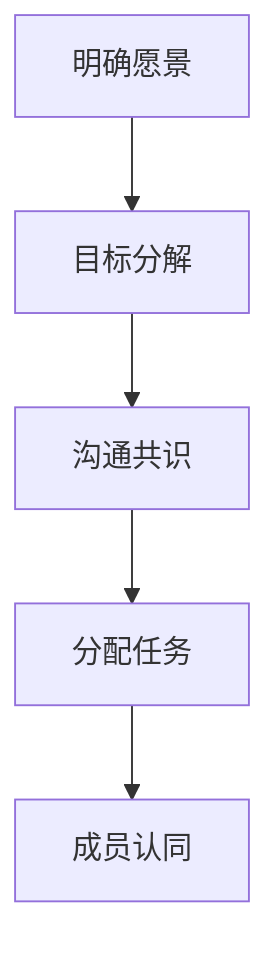
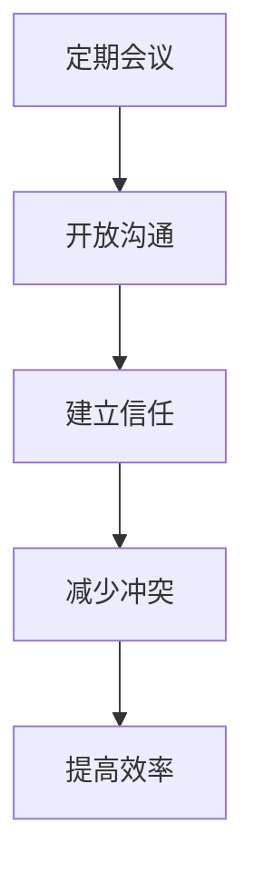
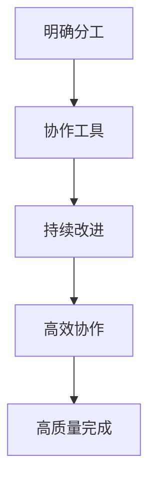

                 

### 引言

在当今快速变化的信息时代，执行力成为企业、团队和个人成功的关键要素。然而，执行力不仅仅是一个简单的概念，它涉及到一系列复杂的因素和过程。因此，构建一个有效的行动体系成为提升执行力的首要任务。本文旨在探讨行动体系的概念、重要性，并详细阐述其构建和实施策略。

#### 行动体系概述

行动体系是一种系统化的方法，旨在将目标转化为具体行动，并通过有效的监控和反馈机制确保行动的持续性和效果。它包括目标设定、计划制定、执行、监控与反馈、以及持续优化和改进等环节。一个完善的行动体系不仅能够提高个人和团队的执行力，还能确保资源的合理配置和高效利用。

#### 执行力的概念与重要性

执行力是指个体或团队将目标转化为实际成果的能力。它不仅包括完成任务的能力，还涉及时间管理、资源分配、沟通协作、问题解决等多个方面。在竞争激烈的环境中，执行力是企业保持竞争优势、实现战略目标的核心能力。

#### 本书的目标和结构

本书旨在帮助读者全面了解行动体系的构建和实施策略，提高个人和团队的执行力。全文分为七个章节：

1. **引言**：概述行动体系和执行力的概念及重要性。
2. **行动体系的基础**：探讨个人效能提升的基础，包括时间管理和习惯的力量。
3. **目标设定与执行策略**：详细介绍目标设定的SMART原则和执行策略。
4. **团队执行力建设**：分析团队执行力的模型、团队领导者的角色以及团队执行力评估。
5. **执行中的挑战与解决策略**：讨论执行中的常见问题及应对策略。
6. **成功案例解析**：通过实际案例展示行动体系的应用和实践。
7. **行动体系落地实施**：详细阐述行动体系的落地实施步骤和持续优化策略。

通过本书的阅读，读者将能够掌握行动体系的构建方法，提升个人和团队的执行力，从而在竞争激烈的环境中取得成功。

## 第1章：行动体系的基础

在构建有效的行动体系之前，我们需要了解一些基础概念和方法。这些基础不仅为行动体系的构建提供必要的理论支持，也为实际操作提供了具体的指导。本章将分为几个部分，详细探讨个人效能提升、时间管理和习惯的力量。

### 1.1 个人效能提升

个人效能提升是指通过优化个人工作方式、提高工作效率和实现个人目标的过程。以下是几个关键方面：

#### 时间管理

时间管理是个人效能提升的核心。有效的时间管理能够帮助我们更高效地完成工作，减少时间浪费，从而提高整体效能。

**时间管理的重要性**

时间管理的重要性体现在以下几个方面：

1. **提高工作效率**：合理分配时间，确保每个任务都能在规定时间内完成，提高工作效率。
2. **减少压力**：有效的时间管理可以减少工作压力，避免因时间紧迫而导致的焦虑和紧张。
3. **优化生活质量**：合理分配工作和生活时间，提高生活质量，实现工作与生活的平衡。

**制定目标和计划**

要实现有效的时间管理，首先需要制定明确的目标和计划。以下是制定目标和计划的基本步骤：

1. **明确目标**：设定具体的、可量化的目标，确保目标明确、具体、可实现。
2. **分解任务**：将大目标分解为具体的任务，确保每个任务都有明确的时间节点和责任人。
3. **优先级排序**：根据任务的紧急程度和重要性进行优先级排序，确保重点任务得到优先处理。
4. **定期回顾**：定期回顾计划执行情况，及时调整计划，确保目标的达成。

**优先级排序**

在制定计划时，优先级排序是非常重要的一环。以下是一些常用的优先级排序方法：

1. **紧急-重要矩阵**：将任务分为四个象限，根据紧急程度和重要性进行排序。紧急且重要的事情应该优先处理，重要但不紧急的事情则需要在忙碌时进行处理。
2. **时间管理四象限法**：将任务分为四个象限，根据任务对目标和价值观的贡献进行排序。重要但紧急的任务需要立即处理，重要但不紧急的任务需要提前规划。

**避免时间浪费**

有效的时间管理还包括避免时间浪费。以下是一些常见的时间浪费现象及其解决方法：

1. **分散注意力**：避免频繁切换任务，确保每次只专注于一项任务，减少分心。
2. **无效会议**：确保会议有明确的目标和议程，避免不必要的闲聊和冗长的讨论。
3. **电子邮件管理**：定期清理和分类电子邮件，避免过多的未读邮件占据时间。

#### 习惯的力量

习惯的力量是个人效能提升的另一个重要方面。习惯的养成可以大大提高我们的效率和效能。

**好习惯的培养**

要培养好习惯，可以采取以下方法：

1. **设定具体的目标**：明确自己想要培养的好习惯，并设定具体的目标和步骤。
2. **逐步实施**：将大目标分解为小步骤，逐步实施，避免一次性设定过高目标导致无法坚持。
3. **持续跟踪**：定期跟踪和记录自己的进步，确保习惯的养成。
4. **奖励机制**：为自己设定奖励，当成功养成新习惯时给予自己奖励，以增加动力。

**坏习惯的克服**

坏习惯的克服同样重要。以下是一些克服坏习惯的方法：

1. **识别坏习惯**：首先需要明确自己有哪些坏习惯，并了解这些坏习惯对自己的影响。
2. **制定替代行为**：为每个坏习惯制定一个替代行为，确保在产生坏习惯冲动时能够有更好的选择。
3. **持续监控**：定期监控自己的行为，及时发现并纠正坏习惯。
4. **寻求支持**：寻求家人、朋友或专业人士的支持，共同克服坏习惯。

通过以上方法，我们可以显著提升个人效能，为构建有效的行动体系打下坚实的基础。

### 1.2 时间管理

时间管理是行动体系的基础，它直接影响个人和团队的执行力和工作效率。以下是几个关键方面：

#### 时间管理的重要性

时间管理的重要性不言而喻。有效的时间管理可以帮助我们：

1. **提高工作效率**：合理分配时间，确保每个任务都能在规定时间内完成，提高工作效率。
2. **减少压力**：避免因时间紧迫而导致的焦虑和紧张，减少工作压力。
3. **优化生活质量**：合理分配工作和生活时间，提高生活质量，实现工作与生活的平衡。

#### 制定目标和计划

要实现有效的时间管理，首先需要制定明确的目标和计划。以下是制定目标和计划的基本步骤：

1. **明确目标**：设定具体的、可量化的目标，确保目标明确、具体、可实现。
2. **分解任务**：将大目标分解为具体的任务，确保每个任务都有明确的时间节点和责任人。
3. **优先级排序**：根据任务的紧急程度和重要性进行优先级排序，确保重点任务得到优先处理。
4. **定期回顾**：定期回顾计划执行情况，及时调整计划，确保目标的达成。

#### 优先级排序

在制定计划时，优先级排序是非常重要的一环。以下是一些常用的优先级排序方法：

1. **紧急-重要矩阵**：将任务分为四个象限，根据紧急程度和重要性进行排序。紧急且重要的事情应该优先处理，重要但不紧急的事情则需要在忙碌时进行处理。
2. **时间管理四象限法**：将任务分为四个象限，根据任务对目标和价值观的贡献进行排序。重要但紧急的任务需要立即处理，重要但不紧急的任务需要提前规划。

#### 避免时间浪费

有效的时间管理还包括避免时间浪费。以下是一些常见的时间浪费现象及其解决方法：

1. **分散注意力**：避免频繁切换任务，确保每次只专注于一项任务，减少分心。
2. **无效会议**：确保会议有明确的目标和议程，避免不必要的闲聊和冗长的讨论。
3. **电子邮件管理**：定期清理和分类电子邮件，避免过多的未读邮件占据时间。

#### 时间管理工具

为了更有效地管理时间，可以借助一些时间管理工具，如：

1. **日历应用程序**：如Google Calendar、Microsoft Outlook等，可以帮助记录和追踪日程安排。
2. **待办事项列表**：如Trello、Asana等，可以帮助整理任务清单和优先级。
3. **时间跟踪工具**：如RescueTime、Toggl等，可以帮助监控和评估时间使用情况。

通过以上方法，我们可以更好地进行时间管理，提高个人和团队的执行力，为行动体系的构建提供坚实的保障。

### 1.3 习惯的力量

习惯的力量是行动体系构建的重要组成部分。好习惯的养成可以大大提高个人和团队的效能，而坏习惯的克服则是确保行动体系持续有效运行的必要条件。以下是关于习惯培养和克服的一些详细方法。

#### 好习惯的培养

要培养好习惯，首先需要设定明确的目标。以下是一些步骤和策略：

1. **设定具体目标**：明确自己想要培养的好习惯，并将其具体化。例如，如果目标是每天锻炼，那么可以设定为每天早晨跑步30分钟。

2. **分解大目标为小步骤**：将大目标分解为小步骤，使其更容易实现。例如，如果目标是每天阅读1小时，可以将其分解为每天阅读20分钟。

3. **逐步实施**：从小步骤开始，逐步增加难度和持续时间。例如，可以先从每天阅读10分钟开始，逐渐增加到20分钟，再增加到30分钟。

4. **持续跟踪**：定期记录自己的进步，以确保习惯的养成。可以使用日记、手机应用或待办事项列表来记录。

5. **奖励机制**：为自己设定奖励，当成功养成新习惯时给予自己奖励，以增加动力。例如，可以奖励自己看一部喜欢的电影或购买一件心仪的物品。

6. **寻找支持**：寻求家人、朋友或同事的支持，共同监督和鼓励。他们可以在你感到困难时提供帮助和鼓励，使你更容易坚持。

#### 坏习惯的克服

坏习惯的克服同样重要。以下是一些有效的方法：

1. **识别坏习惯**：首先需要明确自己有哪些坏习惯，并了解这些坏习惯对生活和工作的影响。可以通过自我反思、日记记录或寻求他人意见来识别。

2. **制定替代行为**：为每个坏习惯制定一个替代行为，以确保在产生坏习惯冲动时能够有更好的选择。例如，如果坏习惯是拖延，可以设定一个立即行动的替代行为，如立即开始做任务。

3. **持续监控**：定期监控自己的行为，及时发现并纠正坏习惯。可以使用日记、手机应用或待办事项列表来记录自己的行为。

4. **寻求支持**：寻求家人、朋友或专业人士的支持，共同克服坏习惯。他们可以在你感到困难时提供帮助和鼓励。

5. **逐步减少**：对于一些难以完全戒除的坏习惯，可以采取逐步减少的方法。例如，如果坏习惯是吸烟，可以逐渐减少吸烟的频率和数量，最终完全戒除。

通过培养好习惯和克服坏习惯，我们可以显著提高个人和团队的效能，为行动体系的构建和执行提供坚实的基础。在接下来的章节中，我们将继续探讨目标设定与执行策略、团队执行力建设等关键方面。

## 第2章：目标设定与执行策略

在构建有效的行动体系时，目标设定和执行策略至关重要。一个明确、合理的目标是行动的指南，而一套科学的执行策略则是确保目标实现的关键。本章将详细介绍目标设定的SMART原则和执行策略，帮助读者更好地设定目标并制定行动计划。

### 2.1 目标设定的SMART原则

SMART原则是一种常用的目标设定方法，它确保目标具有具体性、可衡量性、可实现性、相关性和时限性。以下是SMART原则的具体内容：

#### 2.1.1 具体性（Specific）

**定义**：具体性指的是目标要明确、具体，避免模糊不清。

**重要性**：明确的目标能够帮助我们集中精力，避免分散注意力。

**实施步骤**：

1. **明确目标**：设定具体的目标，例如“我要减重10公斤”而不是“我要更健康”。
2. **具体指标**：使用具体的指标来衡量目标的完成情况，例如“每周减少0.5公斤体重”。

#### 2.1.2 可衡量性（Measurable）

**定义**：可衡量性指的是目标应该有明确的衡量标准，使其能够被量化和评估。

**重要性**：可衡量性使得我们能够跟踪目标的进展，并及时调整策略。

**实施步骤**：

1. **设定量化指标**：为每个目标设定量化指标，例如“每天阅读30分钟”。
2. **跟踪进展**：定期检查和记录目标的完成情况，例如使用日记或待办事项应用。

#### 2.1.3 可达成性（Achievable）

**定义**：可达成性指的是目标应该是可实现和现实的。

**重要性**：设定过于理想化或不可能实现的目标会导致挫败感和放弃。

**实施步骤**：

1. **评估可行性**：确保目标在当前资源、时间和能力范围内是可实现的。
2. **分解大目标**：将大目标分解为小目标，逐步实现，例如将“完成一个大型项目”分解为“每周完成一个小任务”。

#### 2.1.4 相关性（Relevant）

**定义**：相关性指的是目标应该与个人或组织的整体目标和价值观一致。

**重要性**：相关性的目标能够确保我们的努力与总体目标一致，避免资源浪费。

**实施步骤**：

1. **选择合适的目标**：确保目标与个人或组织的目标和价值观一致。
2. **与整体规划一致**：确保目标与其他目标和计划相协调，避免冲突。

#### 2.1.5 时限性（Time-bound）

**定义**：时限性指的是目标应该有明确的时间期限，使其具有紧迫性。

**重要性**：时限性使得目标具有明确的完成时间，从而提高我们的效率和动力。

**实施步骤**：

1. **设定完成期限**：为每个目标设定明确的时间期限，例如“在未来6个月内完成”。
2. **监控进度**：定期检查和评估目标的进展，确保按计划完成。

### 2.2 执行策略与行动计划

在设定了SMART目标后，我们需要制定具体的执行策略和行动计划，以确保目标的实现。

#### 2.2.1 制定具体的行动计划

**步骤一：分解大目标**

将大目标分解为小目标和小任务，使其更具体和可操作。例如，如果目标是“提升销售额”，可以分解为“每月增加10个新客户”和“每周进行5次销售拜访”。

**步骤二：确定每项任务的负责人和时间表**

为每个小任务分配负责人，并设定明确的时间表，例如“销售经理张三负责每月增加新客户的任务，需要在每月底前提交报告”。

**步骤三：制定详细的执行步骤**

为每项任务制定详细的执行步骤，确保每个任务都有明确的方向和方法。例如，“销售拜访任务”可以包括“准备销售材料”、“与客户沟通”和“记录销售结果”。

#### 2.2.2 确保执行的持续性

**建立监督和反馈机制**

建立监督和反馈机制，确保任务按照计划执行。可以定期召开会议，检查任务进度，并根据实际情况进行调整。

**及时调整行动计划**

在执行过程中，根据实际情况及时调整行动计划。如果遇到困难或挑战，可以重新评估目标和计划，并制定新的策略。

**保持灵活性**

保持灵活性，能够应对突发事件和变化。灵活的执行策略可以帮助我们更好地适应外部环境，确保目标的实现。

### 2.3 持续监控与改进

在执行目标的过程中，持续监控和改进是确保目标实现的关键。以下是几个关键步骤：

**步骤一：定期检查进度**

定期检查每个任务的进度，确保目标按计划进行。可以使用项目管理工具或应用程序来记录和跟踪进度。

**步骤二：收集反馈**

收集团队成员或相关利益相关者的反馈，了解执行过程中遇到的问题和挑战。这些反馈可以帮助我们识别改进的机会。

**步骤三：实施改进措施**

根据收集到的反馈，实施改进措施，调整执行策略和行动计划。改进措施可以是调整任务分配、优化执行步骤或增加资源投入。

**步骤四：总结经验**

在目标实现后，总结执行过程中的经验教训，并将其纳入未来的行动计划。这样可以确保我们在未来的目标实现过程中更加高效和成功。

通过遵循SMART原则和制定具体的执行策略，我们可以更好地设定和实现目标，从而构建一个有效的行动体系。在接下来的章节中，我们将继续探讨团队执行力建设、执行中的挑战与解决策略等关键方面。

### 2.1.1 具体性（Specific）

具体性是目标设定的核心原则之一，它要求目标要明确、具体，避免模糊不清。明确的目标能够帮助我们集中精力，制定可行的执行计划，并有效地评估目标的完成情况。

**重要性**：

1. **集中精力**：明确的目标有助于我们集中精力，避免分散注意力。当目标具体且明确时，我们更容易制定详细的行动计划，从而将精力投入到关键任务中。
2. **提高执行力**：明确的目标可以减少决策过程中的不确定性，提高执行力。具体的目标能够为我们提供清晰的执行指南，使我们能够更加高效地完成任务。

**实施步骤**：

1. **明确目标**：设定具体的目标，避免使用模糊的表述。例如，将“提升业绩”改为“在接下来的三个月内，将销售额提升20%”。
2. **具体指标**：为每个目标设定具体的指标，使其具有可衡量性。例如，将“提升业绩”具体化为“每月增加5个新客户”。
3. **明确行动步骤**：为每个具体目标制定详细的行动步骤，确保每个任务都有明确的方向和方法。例如，为了增加新客户，可以制定“每周进行10次销售拜访”的行动步骤。

**示例**：

假设一个公司希望提升其市场占有率，以下是一个具体化的目标设定过程：

- **初始目标**：提升市场占有率
- **具体化目标**：在未来一年内，将市场占有率提升5个百分点
- **具体指标**：每月增加2%的市场份额
- **行动步骤**：
  1. 制定详细的营销策略
  2. 每周召开市场分析会议，评估市场动态
  3. 与销售团队制定每月的销售目标和计划
  4. 定期跟踪市场份额的变化，并根据实际情况调整策略

通过具体化目标设定，公司可以更清晰地了解自己的目标，并制定相应的执行策略，从而提高市场占有率的提升效果。

### 2.1.2 可衡量性（Measurable）

可衡量性是目标设定的另一个关键原则，它要求目标应该有明确的衡量标准，使其能够被量化和评估。可衡量性的目标不仅能够帮助我们跟踪进度，还能提供客观的数据支持，以便及时调整策略。

**重要性**：

1. **跟踪进度**：可衡量性的目标使我们能够实时了解任务完成情况，从而及时调整计划和资源分配，确保目标的实现。
2. **提高透明度**：明确的衡量标准可以提高目标设定的透明度，使团队成员对目标有更清晰的认识，从而更好地协作。
3. **评估成效**：通过衡量标准，我们可以客观评估目标的完成情况，从而总结经验，改进未来的目标设定和执行策略。

**实施步骤**：

1. **设定量化指标**：为每个目标设定具体的量化指标，例如“每天阅读30分钟”或“每月完成5个新项目”。
2. **选择合适的衡量方法**：根据目标的性质，选择合适的衡量方法，如计数、时间记录、成本分析等。
3. **定期跟踪和记录**：定期检查和记录目标的完成情况，确保数据的准确性和完整性。

**示例**：

假设一个个人目标是在一个月内提高英语水平，以下是一个可衡量性目标设定的过程：

- **初始目标**：提高英语水平
- **具体化目标**：在一个月内，将英语口语流利度提高10%
- **量化指标**：通过每日的英语口语练习，记录每天的进步，使用录音或视频记录，以便后期评估
- **衡量方法**：使用在线英语测试平台，每月进行一次口语测试，评估流利度提升情况

通过设定可衡量性的目标，个人可以清晰地了解自己的进步，并根据自己的表现调整学习计划，从而实现目标。

### 2.1.3 可达成性（Achievable）

可达成性是目标设定的一个重要原则，它要求目标应该是可实现和现实的。一个不切实际的目标不仅会带来挫败感，还可能浪费资源，影响团队或个人的发展。

**重要性**：

1. **避免挫败感**：设定过于理想化的目标容易导致失败，从而带来挫败感，影响士气和动力。
2. **合理分配资源**：实现目标需要合理的资源分配，包括时间、人力和资金。设定可达成性的目标有助于确保资源的有效利用。
3. **激发动力**：设定合理的目标可以激发个人的动力和积极性，使其更有信心和动力去实现目标。

**实施步骤**：

1. **评估自身能力**：在设定目标时，要评估自身的能力和资源，确保目标在当前条件下是可实现的。
2. **分解大目标**：将大目标分解为小目标，逐步实现，例如将“完成一个大型项目”分解为“每周完成一个小任务”。
3. **寻求外部支持**：如果目标超出了个人或团队的能力范围，可以寻求外部支持，如咨询专家、寻求合作伙伴等。

**示例**：

假设一个公司希望在一年内将其市场份额提升20%，以下是一个评估可达成性的目标设定过程：

- **初始目标**：在一年内将市场份额提升20%
- **评估**：根据市场调研和公司当前的市场表现，认为提升10%的市场份额是可实现的
- **调整后的目标**：在一年内，将市场份额提升10%
- **分解步骤**：
  1. 每月进行一次市场分析，了解市场动态和竞争对手情况
  2. 每周召开一次销售会议，制定销售目标和计划
  3. 定期评估市场占有率，根据实际情况调整策略

通过合理的评估和调整，公司可以设定一个更加实际和可达成性的目标，从而提高实现目标的可能性和成功率。

### 2.1.4 相关性（Relevant）

相关性是目标设定的关键原则之一，它要求目标应该与个人或组织的整体目标和价值观一致。相关性的目标不仅有助于确保我们的努力与总体目标一致，还能避免资源浪费。

**重要性**：

1. **确保目标一致性**：相关性的目标有助于确保个人或团队的努力与整体目标和价值观一致，避免资源浪费。
2. **提高执行力**：当目标与整体目标和价值观一致时，团队成员更有动力去实现这些目标，从而提高执行力。
3. **避免目标冲突**：设定相关性的目标可以避免不同目标之间的冲突，确保资源得到最优配置。

**实施步骤**：

1. **选择合适的目标**：在设定目标时，要选择与个人或组织整体目标和价值观一致的目标。
2. **与整体规划一致**：确保目标与其他目标和计划相协调，避免冲突。例如，如果公司的整体目标是增加市场份额，那么个人目标可以是“提升销售能力”。
3. **定期评估目标**：定期评估目标的相关性，确保目标仍然与整体目标和价值观一致。

**示例**：

假设一个公司的整体目标是提升客户满意度，以下是一个相关性的目标设定过程：

- **整体目标**：提升客户满意度
- **个人目标**：提高客服团队的服务质量
- **相关目标设定**：
  1. 每月进行一次客户满意度调查，收集反馈
  2. 每周召开一次客服团队会议，讨论服务改进措施
  3. 设定具体的指标，如“每月减少5%的客户投诉率”
  
通过设定相关性的目标，公司可以确保个人和团队的努力与整体目标一致，从而提高整体执行力和客户满意度。

### 2.1.5 时限性（Time-bound）

时限性是目标设定的一个重要原则，它要求目标应该有明确的时间期限，使其具有紧迫性。时限性的目标可以激发我们的动力和效率，确保目标的及时实现。

**重要性**：

1. **提高动力**：时限性的目标可以激发我们的动力，使其更有紧迫感，从而提高工作效率和执行力。
2. **确保进度**：明确的时间期限使我们能够更好地监控进度，确保目标按计划进行。
3. **优化资源分配**：时限性有助于优化资源分配，确保资源在有限的时间内得到最大化利用。

**实施步骤**：

1. **设定明确的时间期限**：为每个目标设定具体的时间期限，例如“在未来三个月内完成”。
2. **分解时间节点**：将时间期限分解为多个阶段，确保每个阶段都有明确的目标和任务。
3. **定期检查进度**：定期检查目标的进展，及时调整计划，确保按期完成。

**示例**：

假设一个个人目标是在半年内完成一项学习任务，以下是一个时限性目标设定的过程：

- **初始目标**：在半年内完成一项学习任务
- **具体化目标**：在接下来的六个月内，完成Python编程语言的学习
- **时间期限**：从现在起到六个月后的某个日期
- **分解步骤**：
  1. 每个月完成一个Python基础知识模块的学习
  2. 每两个月进行一次项目实践，巩固所学知识
  3. 在六个月后的某个时间节点进行综合评估，确保学习目标的实现

通过设定时限性的目标，个人可以更有动力地学习，同时也能够更好地监控学习进度，确保目标的按时完成。

### 2.2.1 制定具体的行动计划

在设定了SMART目标之后，制定具体的行动计划是确保目标实现的关键步骤。一个详细的行动计划可以帮助我们明确每项任务的执行步骤、负责人和时间表，从而提高执行力。以下是制定具体行动计划的详细步骤：

#### 步骤一：分解大目标

将大目标分解为小目标和小任务，使其更具体和可操作。分解的过程需要将目标细化，确保每个小任务都有明确的方向和方法。

**示例**：

假设一个公司目标是“在未来一年内提升市场份额10%”，可以将其分解为以下几个小目标和任务：

1. **每月增加2%的市场份额**。
2. **每周召开一次市场分析会议**。
3. **每月发布一次市场调研报告**。
4. **每季度进行一次产品评估和改进**。

通过这样的分解，公司可以明确每个阶段的目标和任务，从而更好地制定执行计划。

#### 步骤二：确定每项任务的负责人和时间表

为每个小任务分配负责人，并设定明确的时间表，确保每个任务都有明确的责任人和完成时间。

**示例**：

1. **每月增加2%的市场份额**：
   - 负责人：销售经理。
   - 时间表：每月底前提交销售报告，制定下月销售计划。

2. **每周召开一次市场分析会议**：
   - 负责人：市场分析师。
   - 时间表：每周五上午10点召开。

3. **每月发布一次市场调研报告**：
   - 负责人：市场调研团队。
   - 时间表：每月底前完成报告，次月月初发布。

4. **每季度进行一次产品评估和改进**：
   - 负责人：产品经理。
   - 时间表：每季度末进行评估，次季度初发布改进计划。

通过这样的分配，每个任务都有明确的负责人和时间表，有助于确保任务的顺利执行。

#### 步骤三：制定详细的执行步骤

为每项任务制定详细的执行步骤，确保每个任务都有明确的方向和方法。这包括具体的行动方案、所需资源和可能遇到的挑战及应对策略。

**示例**：

1. **每月增加2%的市场份额**：
   - **行动方案**：通过增加广告投放、优化销售策略和开展促销活动来提升销售额。
   - **所需资源**：广告预算、销售人员、促销物料。
   - **挑战及应对策略**：若广告效果不佳，考虑调整广告内容和渠道；若销售策略不奏效，与市场部门进行沟通以优化策略。

2. **每周召开一次市场分析会议**：
   - **行动方案**：准备会议议程，收集和分析市场数据，讨论市场动态和竞争情况。
   - **所需资源**：会议场地、市场数据报告。
   - **挑战及应对策略**：若数据收集不及时，提前通知相关部门，确保数据准备充分。

通过详细的执行步骤，可以确保每个任务都有明确的执行方案和应对策略，从而提高任务的完成率。

#### 步骤四：定期检查和调整

在执行过程中，定期检查和调整行动计划是确保目标实现的关键。通过定期检查，可以及时发现任务执行中的问题，并采取相应的调整措施。

**示例**：

1. **每月底检查销售报告**：
   - **检查内容**：销售额是否达到目标、销售策略是否有效。
   - **调整措施**：若销售额未达标，分析原因并调整销售策略。

2. **每季度末评估产品改进效果**：
   - **评估内容**：产品改进是否提高了市场份额。
   - **调整措施**：若效果不佳，重新评估产品改进方案，考虑进一步优化。

通过定期检查和调整，可以确保行动计划的有效执行，从而提高目标实现的概率。

### 案例分析

以一家电子商务公司为例，该公司希望在半年内将用户留存率提升10%。以下是具体的行动计划：

1. **分解目标**：
   - **每月提升1.67%的用户留存率**。
   - **每周召开一次用户反馈会议**。
   - **每月发布一次用户满意度调查报告**。

2. **确定负责人和时间表**：
   - **用户留存率提升**：负责人是产品经理，时间表是每月底前提交报告，次月制定改进计划。
   - **用户反馈会议**：负责人是用户体验团队，时间表是每周三下午2点召开。
   - **用户满意度调查**：负责人是市场调研团队，时间表是每月底前完成调查，次月初发布报告。

3. **制定执行步骤**：
   - **用户留存率提升**：通过优化用户界面、提升产品质量和增加用户互动功能来实现。
   - **用户反馈会议**：收集用户反馈，讨论改进措施。
   - **用户满意度调查**：了解用户满意度，评估改进效果。

4. **定期检查和调整**：
   - **每月检查用户留存率报告**，若未达标，分析原因并调整策略。
   - **每季度末评估用户满意度调查结果**，根据反馈优化产品和服务。

通过制定详细的行动计划，电子商务公司可以更好地实现用户留存率提升的目标。

### 总结

制定具体的行动计划是确保SMART目标实现的关键步骤。通过分解大目标、确定负责人和时间表、制定详细的执行步骤以及定期检查和调整，我们可以确保行动计划的顺利执行，从而提高目标实现的概率。在接下来的章节中，我们将继续探讨团队执行力建设、执行中的挑战与解决策略等关键方面。

### 2.2.2 确保执行的持续性

在行动计划的执行过程中，确保其持续性是至关重要的。这不仅关系到目标的实现，还关系到团队和个人的长期发展。以下是确保执行持续性的几个关键策略：

#### 2.2.2.1 建立监督和反馈机制

监督和反馈机制是确保执行持续性的有效方法。通过建立监督和反馈机制，我们可以及时发现和纠正执行过程中出现的问题，确保行动计划的顺利推进。

**步骤一：设定监督指标**

为每个任务设定明确的监督指标，这些指标应能够量化任务的进展情况。例如，对于项目进度，可以设定“完成率”、“延期率”等指标。

**步骤二：安排监督人员**

指定专门的监督人员，负责监控任务进展，确保每个任务都在按计划进行。监督人员需要具备较高的责任心和执行能力。

**步骤三：定期反馈**

定期召开监督会议，汇报任务进展情况，讨论存在的问题和解决方案。通过会议，可以及时发现和解决执行中的问题，确保任务的持续推进。

#### 2.2.2.2 确保反馈的及时性

及时的反馈能够帮助我们迅速调整执行策略，确保目标的实现。以下是确保反馈及时性的几个方法：

1. **建立实时反馈渠道**：通过邮件、即时通讯工具或电话会议等实时沟通方式，确保信息传递的及时性。

2. **制定反馈计划**：为每个任务制定明确的反馈计划，包括反馈频率和反馈内容。例如，每周进行一次进度汇报，每月进行一次详细的评估。

3. **培养反馈文化**：鼓励团队成员积极参与反馈，建立开放、坦诚的沟通环境。通过定期的反馈会议和培训，提高团队成员的反馈意识和能力。

#### 2.2.2.3 建立奖惩机制

奖惩机制是确保执行持续性的重要手段。通过奖惩机制，可以激励团队成员保持高水平的执行力，同时纠正不良行为。

**步骤一：设定奖励标准**

根据任务的重要性和难度，设定明确的奖励标准。奖励可以包括奖金、晋升机会、荣誉称号等。

**步骤二：公正公平**

确保奖惩机制的公正公平，避免主观偏见。奖惩决策应基于客观事实和数据，确保每位成员都有机会获得公正的评价。

**步骤三：及时公布奖惩结果**

及时公布奖惩结果，让团队成员了解奖惩机制的具体执行情况。这不仅可以激励优秀成员，还能警示不良行为者。

#### 2.2.2.4 提高团队的适应性和灵活性

在执行过程中，团队可能面临各种突发情况和变化。提高团队的适应性和灵活性，是确保执行持续性的关键。

**步骤一：培养应变能力**

通过培训和实际演练，提高团队成员的应变能力，使其能够快速应对突发事件。

**步骤二：建立应急预案**

针对可能出现的风险和问题，建立相应的应急预案，确保在突发情况下能够迅速应对。

**步骤三：保持信息透明**

保持信息透明，确保团队成员了解整体执行情况，从而更好地协调和合作。

通过以上策略，我们可以确保行动计划的持续性，提高团队的执行力和工作效率，从而实现目标。

### 实际案例

以一家软件开发公司为例，该公司在项目开发过程中采用了一系列确保执行持续性的策略：

1. **监督和反馈机制**：
   - 每周召开项目进度会议，汇报任务进展和遇到的问题。
   - 设立项目经理，负责监控项目进度，确保任务按计划执行。

2. **奖惩机制**：
   - 设定明确的奖励标准，对按时完成任务和提出有效改进建议的成员给予奖励。
   - 对延误任务或造成质量问题的成员进行惩罚，以警示其他成员。

3. **适应性和灵活性**：
   - 培训团队成员，提高其应变能力和技术水平。
   - 建立应急预案，确保在项目遇到突发问题时能够迅速调整。

通过这些策略，该公司成功地提高了项目的执行力和效率，确保了项目的按时完成和高质量交付。

### 总结

确保执行的持续性是行动体系成功的关键。通过建立监督和反馈机制、奖惩机制以及提高团队的适应性和灵活性，我们可以确保行动计划的有效执行，从而实现目标。在接下来的章节中，我们将继续探讨团队执行力建设、执行中的挑战与解决策略等关键方面。

## 第3章：团队执行力建设

在构建有效的行动体系时，团队执行力建设至关重要。一个高执行力的团队不仅能够高效地完成工作任务，还能在竞争激烈的环境中保持竞争优势。本章将详细探讨团队执行力的模型、团队领导者的角色以及团队执行力评估。

### 3.1 团队执行力模型

团队执行力是指团队将战略目标转化为实际成果的能力。一个高效的团队执行力模型通常包括以下三个关键要素：

#### 3.1.1 目标一致性

目标一致性是团队执行力的基础。团队成员必须明确并认同团队的目标，确保每个人的努力方向一致。以下是一些实现目标一致性的方法：

1. **明确团队愿景**：为团队设定清晰的愿景和使命，确保所有成员都了解团队的目标和期望。
2. **沟通与共识**：通过定期的沟通和讨论，确保团队成员对目标的理解一致，并达成共识。
3. **目标分解**：将团队目标分解为具体的小目标，并分配给每个成员，确保每个成员都明确自己的责任和任务。

#### 3.1.2 信任与沟通

信任与沟通是团队执行力的重要支柱。团队成员之间的高度信任和良好的沟通能够有效减少误解和冲突，提高团队协作效率。以下是一些建立信任和沟通的方法：

1. **开放沟通**：鼓励团队成员之间进行开放、坦诚的沟通，分享自己的想法和观点。
2. **建立信任**：通过共同完成任务和团队合作，逐渐建立团队成员之间的信任关系。
3. **定期会议**：定期召开团队会议，讨论任务进展、问题和解决方案，确保团队成员之间的信息畅通。

#### 3.1.3 高效协作

高效协作是指团队成员能够在合理的时间内高质量地完成任务。为了实现高效协作，团队需要具备以下能力：

1. **明确分工**：根据团队成员的技能和专长，明确分工，确保每个成员都知道自己的职责和任务。
2. **协作工具**：使用协作工具和平台，如项目管理软件、即时通讯工具等，提高团队协作效率。
3. **持续改进**：通过定期的反馈和评估，不断优化协作流程，提高团队协作效率。

### 3.2 团队领导者的角色

团队领导者在团队执行力建设中扮演着关键角色。一个优秀的团队领导者不仅能够明确团队的目标和愿景，还能激发团队成员的潜能，确保团队高效执行。以下是团队领导者应具备的几个关键角色：

#### 3.2.1 明确团队目标

团队领导者应明确团队的目标和愿景，并将其传达给所有团队成员。这包括：

1. **设定清晰的目标**：为团队设定具体、可衡量和可实现的目标，确保团队成员都了解目标的重要性和紧迫性。
2. **制定详细的行动计划**：将目标分解为具体的行动计划，明确每个任务的责任人和时间表。

#### 3.2.2 建立高效的沟通机制

团队领导者应建立高效的沟通机制，确保信息在团队内畅通无阻。这包括：

1. **定期召开会议**：定期召开团队会议，讨论任务进展、问题和解决方案，确保团队成员之间的信息畅通。
2. **提供反馈和指导**：通过反馈和指导，帮助团队成员解决工作中的问题，提高工作效果。

#### 3.2.3 激励与培养团队成员

团队领导者应激励和培养团队成员，提高团队的整体执行力。这包括：

1. **设定合理的目标和期望**：为团队成员设定合理的目标和期望，确保他们能够在自己的能力范围内充分发挥潜力。
2. **提供必要的资源和支持**：确保团队成员有足够的资源和支持来完成工作任务，包括技术支持、培训和辅导。
3. **培养团队成员的能力**：通过培训、学习和实践，不断提高团队成员的能力和技能，从而提高团队的整体执行力。

### 3.3 团队执行力评估

团队执行力评估是确保团队持续改进和高效执行的重要手段。通过定期评估团队执行力，团队领导者可以及时发现问题和不足，并采取相应的改进措施。以下是几个常用的团队执行力评估方法：

#### 3.3.1 评估指标体系

建立一套科学的评估指标体系，可以客观、全面地评估团队执行力。常见的评估指标包括：

1. **任务完成率**：衡量团队完成任务的效率和效果。
2. **问题解决率**：衡量团队在遇到问题时解决问题的能力和速度。
3. **协作效果**：衡量团队成员之间的协作水平和团队整体的工作效率。

#### 3.3.2 定期评估与反馈

定期对团队执行力进行评估，是确保团队持续改进的重要手段。评估可以采取以下几种形式：

1. **定期会议**：定期召开评估会议，讨论任务完成情况、协作效果和存在的问题。
2. **问卷调查**：通过问卷调查，收集团队成员对团队执行力的反馈和意见。
3. **绩效评估**：根据任务完成情况和评估指标，对团队成员进行绩效评估，并根据评估结果进行奖惩和激励。

#### 3.3.3 改进措施

根据评估结果，团队领导者应采取相应的改进措施，以提高团队执行力。常见的改进措施包括：

1. **优化流程**：根据评估结果，优化工作流程，减少不必要的环节，提高工作效率。
2. **加强培训**：针对评估中发现的问题，为团队成员提供相应的培训，提高其能力和技能。
3. **调整人员配置**：根据团队成员的技能和专长，合理调整人员配置，确保每个成员都能在自己的领域内发挥最佳作用。

### 实际案例

以某家互联网公司为例，该公司通过以下措施提高团队执行力：

1. **目标一致性**：公司为每个团队设定了明确的愿景和目标，并通过定期的团队会议和培训，确保团队成员对目标的理解和认同。
2. **信任与沟通**：公司建立了高效的沟通机制，定期召开团队会议，讨论任务进展和问题，鼓励团队成员之间的开放沟通和合作。
3. **高效协作**：公司提供了协作工具和平台，如项目管理软件和即时通讯工具，提高了团队协作效率。
4. **执行力评估**：公司定期对团队执行力进行评估，根据评估结果调整工作流程和人员配置，提供培训和激励措施，以持续提高团队执行力。

通过这些措施，该公司的团队执行力得到了显著提升，项目完成质量和效率都得到了明显改善。

### 总结

团队执行力建设是构建有效行动体系的重要组成部分。通过建立目标一致性、信任与沟通、高效协作等关键要素，团队可以更好地执行任务，实现目标。团队领导者在这个过程中扮演着关键角色，通过明确团队目标、建立高效沟通机制、激励和培养团队成员等手段，可以提高团队的执行力。在接下来的章节中，我们将继续探讨执行中的挑战与解决策略，以帮助团队在执行过程中克服困难，实现目标。

### 3.1 团队执行力模型

团队执行力是指团队成员协同合作，将战略目标转化为实际成果的能力。一个高效的团队执行力模型通常包括以下三个关键要素：目标一致性、信任与沟通、高效协作。以下是这三个要素的详细解释：

#### 3.1.1 目标一致性

目标一致性是团队执行力的基础。团队成员必须明确并认同团队的目标，确保每个人的努力方向一致。以下是实现目标一致性的方法：

1. **明确团队愿景**：为团队设定清晰的愿景和使命，确保所有成员都了解团队的目标和期望。这可以通过定期的团队会议、内部培训和愿景展示等方式来实现。
   
2. **沟通与共识**：通过定期的沟通和讨论，确保团队成员对目标的理解一致，并达成共识。这可以通过一对一交流、小组讨论、团队会议等形式来实现。

3. **目标分解**：将团队目标分解为具体的小目标，并分配给每个成员，确保每个成员都明确自己的责任和任务。例如，可以将年度目标分解为季度目标、月度目标，甚至更小的周目标或日目标。

**Mermaid 流程图**：

#### 3.1.2 信任与沟通

信任与沟通是团队执行力的重要支柱。团队成员之间的高度信任和良好的沟通能够有效减少误解和冲突，提高团队协作效率。以下是建立信任与沟通的方法：

1. **开放沟通**：鼓励团队成员之间进行开放、坦诚的沟通，分享自己的想法和观点。这可以通过定期的团队会议、小组讨论、即时通讯工具等方式来实现。

2. **建立信任**：通过共同完成任务和团队合作，逐渐建立团队成员之间的信任关系。这可以通过共同解决难题、共同承担责任等方式来实现。

3. **定期会议**：定期召开团队会议，讨论任务进展、问题和解决方案，确保团队成员之间的信息畅通。这可以通过定期的工作汇报会议、项目进展会议等方式来实现。

**Mermaid 流程图**：

#### 3.1.3 高效协作

高效协作是指团队成员能够在合理的时间内高质量地完成任务。为了实现高效协作，团队需要具备以下能力：

1. **明确分工**：根据团队成员的技能和专长，明确分工，确保每个成员都知道自己的职责和任务。这可以通过任务分配表格、工作流程图等方式来实现。

2. **协作工具**：使用协作工具和平台，如项目管理软件、即时通讯工具等，提高团队协作效率。这可以通过Trello、JIRA、Slack等工具来实现。

3. **持续改进**：通过定期的反馈和评估，不断优化协作流程，提高团队协作效率。这可以通过定期的团队反馈会议、质量评估等方式来实现。

**Mermaid 流�程图**：

通过以上三个关键要素，团队可以建立高效的执行力模型，从而更好地实现团队目标。在接下来的章节中，我们将继续探讨团队执行力评估、团队领导者的角色等关键方面。

### 3.1.1 团队执行力三要素

一个高效的团队执行力模型通常包括三个关键要素：目标一致性、信任与沟通、高效协作。以下是这三个要素的详细解析。

#### 目标一致性

目标一致性是团队执行力的基础。当团队成员对团队目标有共同的理解和认同时，他们的努力方向就会一致，从而提高团队协作效率。以下是实现目标一致性的方法：

1. **明确团队愿景和使命**：团队领导者需要明确团队的愿景和使命，并将其传达给所有成员。这可以通过团队会议、内部培训等方式来实现。
2. **制定共同的目标**：将团队的目标分解为具体的小目标，并确保每个成员都清楚自己的责任和任务。例如，可以将年度目标分解为季度目标、月度目标，甚至更小的周目标或日目标。
3. **持续沟通与反馈**：定期召开团队会议，讨论目标进展和问题，确保团队成员之间的信息畅通。通过反馈和讨论，团队成员可以及时调整自己的工作方向，确保与团队目标一致。

#### 信任与沟通

信任与沟通是团队执行力的重要支柱。高度信任和良好的沟通能够减少误解和冲突，提高团队协作效率。以下是建立信任与沟通的方法：

1. **开放沟通**：鼓励团队成员之间进行开放、坦诚的沟通，分享自己的想法和观点。这可以通过定期的小组讨论、团队会议等方式来实现。
2. **建立信任**：通过共同完成任务和团队合作，逐渐建立团队成员之间的信任关系。例如，通过共同解决难题、分享资源、互相支持等方式来建立信任。
3. **培养沟通技巧**：定期组织沟通技巧培训，提高团队成员的沟通能力。这可以帮助团队成员更好地理解彼此，减少误解和冲突。

#### 高效协作

高效协作是指团队成员能够在合理的时间内高质量地完成任务。为了实现高效协作，团队需要具备以下能力：

1. **明确分工**：根据团队成员的技能和专长，明确分工，确保每个成员都知道自己的职责和任务。例如，可以制定任务分配表格或工作流程图，明确每个任务的责任人和时间节点。
2. **协作工具**：使用协作工具和平台，如项目管理软件、即时通讯工具等，提高团队协作效率。例如，可以使用Trello、JIRA、Slack等工具来分配任务、跟踪进度和沟通协作。
3. **持续优化**：通过定期的反馈和评估，不断优化协作流程，提高团队协作效率。例如，可以定期召开团队反馈会议，讨论协作过程中遇到的问题和挑战，并提出改进建议。

通过以上三个要素，团队可以建立高效的执行力模型，从而更好地实现团队目标。在接下来的章节中，我们将继续探讨团队执行力评估、团队领导者的角色等关键方面。

### 3.1.2 团队执行力评估

团队执行力评估是衡量团队在实现目标过程中的表现和效能的重要手段。通过定期评估团队执行力，团队领导者可以了解团队的执行情况，发现潜在问题，并采取相应的改进措施。以下是团队执行力评估的几个关键指标和方法。

#### 3.1.2.1 评估指标体系

建立一套科学的评估指标体系，可以全面、客观地衡量团队执行力。以下是一些常见的评估指标：

1. **任务完成率**：衡量团队在规定时间内完成任务的效率。可以通过计算实际完成时间与计划时间的比值来评估。
   
2. **问题解决率**：衡量团队在遇到问题时解决的能力和速度。可以通过计算解决问题所需时间和问题解决率来评估。

3. **协作效果**：衡量团队成员之间的协作水平和团队整体的工作效率。可以通过团队合作项目的成功率、团队成员间的沟通质量等指标来评估。

4. **员工满意度**：衡量团队成员对团队执行力的满意度。可以通过员工满意度调查来评估。

5. **绩效改进率**：衡量团队在执行过程中持续改进的成效。可以通过对比前后的绩效指标来评估。

#### 3.1.2.2 定期评估与反馈

定期对团队执行力进行评估，是确保团队持续改进的重要手段。以下是一些评估和反馈的方法：

1. **定期会议**：定期召开团队评估会议，讨论任务完成情况、协作效果和存在的问题。会议可以包括团队领导者的总结发言、团队成员的反馈和建议等。

2. **问卷调查**：通过问卷调查，收集团队成员对团队执行力的反馈和意见。问卷调查可以包括满意度、问题解决能力、协作效果等方面的问题。

3. **绩效评估**：根据任务完成情况和评估指标，对团队成员进行绩效评估。绩效评估可以包括定量指标和定性评价，以便全面了解团队成员的表现。

4. **评估报告**：定期编写评估报告，总结团队的执行情况、存在的问题和改进措施。评估报告可以帮助团队领导者了解团队的执行情况，并为后续的改进提供参考。

#### 3.1.2.3 改进措施

根据评估结果，团队领导者应采取相应的改进措施，以提高团队执行力。以下是一些常见的改进措施：

1. **优化流程**：根据评估结果，优化工作流程，减少不必要的环节，提高工作效率。

2. **加强培训**：针对评估中发现的问题，为团队成员提供相应的培训，提高其能力和技能。

3. **调整人员配置**：根据团队成员的技能和专长，合理调整人员配置，确保每个成员都能在自己的领域内发挥最佳作用。

4. **建立激励机制**：通过设立奖励机制，激励团队成员积极参与执行任务，提高团队的整体执行力。

### 实际案例

以一家软件开发公司为例，该公司通过以下方法评估和改进团队执行力：

1. **定期会议**：每月召开一次团队评估会议，讨论项目进展、协作效果和存在的问题。

2. **问卷调查**：通过问卷调查，收集团队成员对团队执行力的反馈，包括任务完成情况、协作质量等方面。

3. **绩效评估**：根据项目完成情况和团队合作表现，对团队成员进行绩效评估。

4. **改进措施**：
   - **优化流程**：针对项目进度拖延的问题，优化项目计划，确保任务按期完成。
   - **加强培训**：为团队成员提供相关技术培训，提高其解决问题的能力。
   - **调整人员配置**：根据团队成员的技能和兴趣，调整项目团队的人员组成，提高团队协作效率。

通过这些方法，该公司成功地提高了团队执行力，项目完成质量和效率都得到了显著提升。

### 总结

团队执行力评估是确保团队高效执行任务的重要手段。通过建立科学的评估指标体系、定期评估和反馈、以及采取相应的改进措施，团队领导者可以不断提升团队的执行力，实现组织的目标。在接下来的章节中，我们将继续探讨团队领导者的角色和团队执行力建设的方法。

### 3.2 团队领导者的角色

在团队执行力建设中，团队领导者扮演着至关重要的角色。一个优秀的团队领导者不仅能够明确团队的目标和愿景，还能激发团队成员的潜能，确保团队高效执行。以下是团队领导者应具备的关键角色和职责。

#### 3.2.1 明确团队目标

团队领导者的首要任务是明确团队的目标和愿景，并将其传达给所有团队成员。具体职责包括：

1. **设定清晰的目标**：为团队设定具体、可衡量和可实现的目标，确保团队成员都了解目标的重要性和紧迫性。

2. **制定行动计划**：将目标分解为具体的行动计划，明确每个任务的责任人和时间表，确保每个成员都了解自己的职责和任务。

3. **沟通与共识**：通过定期的沟通和讨论，确保团队成员对目标的理解一致，并达成共识。这可以通过团队会议、一对一交流等方式来实现。

#### 3.2.2 建立高效的沟通机制

团队领导者需要建立高效的沟通机制，确保信息在团队内畅通无阻，减少误解和冲突。具体职责包括：

1. **定期召开会议**：定期召开团队会议，讨论任务进展、问题和解决方案，确保团队成员之间的信息畅通。

2. **提供反馈和指导**：通过反馈和指导，帮助团队成员解决工作中的问题，提高工作效果。这可以通过实时沟通工具、电子邮件等方式来实现。

3. **培养沟通技巧**：定期组织沟通技巧培训，提高团队成员的沟通能力，减少误解和冲突。

#### 3.2.3 激励与培养团队成员

团队领导者需要激励和培养团队成员，提高团队的整体执行力。具体职责包括：

1. **设定合理的目标和期望**：为团队成员设定合理的目标和期望，确保他们能够在自己的能力范围内充分发挥潜力。

2. **提供必要的资源和支持**：确保团队成员有足够的资源和支持来完成工作任务，包括技术支持、培训和辅导。

3. **培养团队成员的能力**：通过培训、学习和实践，不断提高团队成员的能力和技能，从而提高团队的整体执行力。

#### 3.2.4 解决冲突和问题

团队领导者需要及时解决团队内部和外部的冲突和问题，确保团队执行力的稳定。具体职责包括：

1. **识别冲突和问题**：通过定期评估和反馈，及时发现团队内部的冲突和问题。

2. **制定解决方案**：与团队成员共同制定解决方案，确保问题得到有效解决。

3. **监督执行**：确保解决方案得到有效执行，并及时调整策略。

#### 3.2.5 持续改进和优化

团队领导者需要不断评估和优化团队执行过程，提高团队执行力。具体职责包括：

1. **定期评估团队执行力**：通过定期的评估，了解团队的执行情况，发现问题和不足。

2. **制定改进措施**：根据评估结果，制定相应的改进措施，优化团队执行过程。

3. **推动持续改进**：鼓励团队成员积极参与改进过程，共同推动团队执行力的提升。

### 实际案例

以某互联网公司的一个产品开发团队为例，该团队领导者通过以下措施来履行其角色：

1. **明确团队目标**：团队领导者与团队成员共同制定了产品开发的目标，包括功能需求、用户满意度、上线时间等。

2. **建立高效的沟通机制**：定期召开团队会议，讨论项目进展、问题和解决方案。同时，通过即时通讯工具保持实时沟通，确保信息畅通。

3. **激励与培养团队成员**：团队领导者为团队成员提供了技术培训和支持，鼓励他们提出创新的想法和解决方案。同时，设立奖励机制，激励团队成员积极参与项目。

4. **解决冲突和问题**：团队领导者及时发现并解决了团队内部的冲突和问题，确保项目的顺利进行。

5. **持续改进和优化**：团队领导者定期评估团队执行力，根据评估结果制定改进措施，持续优化项目开发过程。

通过这些措施，该团队在项目开发过程中保持了高效的执行力，成功完成了多个重要项目。

### 总结

团队领导者是团队执行力建设的关键人物。通过明确团队目标、建立高效的沟通机制、激励和培养团队成员、解决冲突和问题，以及持续改进和优化，团队领导者可以确保团队高效执行任务，实现组织的目标。在接下来的章节中，我们将探讨执行中的挑战与解决策略，帮助团队更好地应对执行过程中的问题。

### 3.2.1 明确团队目标

明确团队目标是团队领导者的一项核心职责，这是确保团队执行力的重要前提。以下是关于如何明确团队目标的详细步骤和方法：

#### 明确团队目标的重要性

1. **统一方向**：明确的目标能够帮助团队成员统一方向，集中精力，避免因为目标不明确而导致的资源浪费和混乱。
2. **激发动力**：明确的目标能够激发团队成员的内在动力，使他们更加积极和投入，提高工作热情和效率。
3. **评估成效**：明确的目标便于后续的评估和反馈，可以帮助团队领导者了解目标的实现情况，及时调整和优化执行策略。

#### 制定明确团队目标的步骤

1. **理解组织愿景**：团队领导者需要首先了解组织的整体愿景和战略目标，以确保团队目标与组织目标一致。
   
2. **分解大目标**：将组织的目标分解为具体、可操作的团队目标。例如，如果组织目标是提升客户满意度，团队目标可以是“在下一个季度内，将客户投诉率降低10%”。

3. **具体化目标**：确保目标具有具体性和可衡量性。例如，“每月增加5个新客户”比“增加客户数量”更具体和可衡量。

4. **制定行动计划**：为每个目标制定详细的行动计划，明确每项任务的责任人和时间表，确保目标可执行。

#### 案例分析

以某科技公司的一个产品开发团队为例，该团队领导者在明确团队目标的过程中采取了以下步骤：

1. **理解组织愿景**：公司愿景是“通过技术创新，提升用户体验，成为行业领导者”。

2. **分解大目标**：团队目标包括“在下一个季度内，提升产品功能完善度”、“在下一个季度内，提高用户满意度”。

3. **具体化目标**：具体化为“在下一个季度内，将产品功能完善度评分从3.5提高到4.0”和“在下一个季度内，将用户满意度评分从80%提高到90%”。

4. **制定行动计划**：
   - **提升产品功能完善度**：
     - 负责人：产品经理。
     - 时间表：每个周末进行一次产品功能评估。
     - 行动步骤：与开发团队讨论产品缺陷，制定改进方案，每月进行一次功能测试。
   - **提高用户满意度**：
     - 负责人：用户体验团队。
     - 时间表：每月底前收集用户反馈。
     - 行动步骤：分析用户反馈，改进产品界面和功能，定期向用户通报改进情况。

通过以上步骤，团队领导者确保了团队目标的明确和具体，为团队的执行提供了清晰的指引。

#### 激发团队动力

1. **设定合理的目标**：确保目标既有挑战性，又可实现。这可以激发团队成员的积极性，避免目标过高导致的挫败感。

2. **沟通与共识**：与团队成员共同讨论和制定目标，确保每个人都明确目标的重要性和自己的职责，从而提高团队凝聚力。

3. **提供支持和资源**：确保团队成员有足够的资源和支持来实现目标，这包括技术支持、培训和个人发展机会。

4. **激励与认可**：通过奖励机制和认可，激励团队成员，确保他们在实现目标的过程中感到满足和有价值。

#### 监控和调整

1. **定期监控**：定期检查目标的进展情况，确保团队按计划执行。

2. **及时调整**：根据监控结果，及时调整目标和行动计划，确保目标仍然可实现。

3. **反馈和改进**：通过定期的反馈和评估，了解团队成员的困难和需求，提供改进建议和支持。

### 总结

明确团队目标是团队领导者的核心职责之一。通过理解组织愿景、分解大目标、具体化目标、制定行动计划，以及激发团队动力和监控调整，团队领导者可以确保团队目标的明确和具体，从而提高团队执行力，实现组织目标。在接下来的章节中，我们将继续探讨团队领导者的其他关键角色，以及团队执行力建设的其他重要方面。

### 3.2.2 建立高效的沟通机制

建立高效的沟通机制是团队领导者确保团队执行力的重要手段之一。良好的沟通能够确保信息畅通，减少误解和冲突，提高团队协作效率。以下是关于如何建立高效沟通机制的详细方法和步骤：

#### 3.2.2.1 促进信息共享

1. **定期会议**：定期召开团队会议，讨论项目进展、问题和解决方案。会议可以采用面对面、视频会议或在线协作工具等多种形式。
   
2. **透明沟通**：确保沟通内容的透明度，避免信息孤岛。例如，在项目进展中，可以采用共享文档、任务板等方式，让团队成员实时了解项目动态。

3. **反馈机制**：建立反馈机制，鼓励团队成员提出意见和建议。通过定期的反馈会议或问卷调查，收集团队成员的意见，及时调整和改进工作。

#### 3.2.2.2 提高沟通技巧

1. **倾听技巧**：团队领导者需要培养良好的倾听技巧，确保团队成员能够充分表达自己的想法。可以通过耐心倾听、点头示意、积极回应等方式来提高倾听效果。

2. **表达清晰**：团队领导者应确保自己的表达清晰、准确，避免使用模糊或含糊的语言。这可以通过提前准备发言稿、使用简单明了的语言等方式来实现。

3. **沟通培训**：定期为团队成员提供沟通技巧培训，提高他们的沟通能力和沟通效率。培训内容可以包括倾听技巧、表达技巧、非言语沟通等。

#### 3.2.2.3 及时解决问题

1. **建立问题反馈渠道**：确保团队成员有渠道及时反馈问题和困难。可以通过设立问题反馈邮箱、在线反馈平台等方式来实现。

2. **快速响应**：团队领导者需要迅速响应团队成员的反馈，及时解决问题。可以通过定期检查反馈、快速回复邮件或即时通讯等方式来实现。

3. **共同解决**：鼓励团队成员共同参与问题解决，通过团队合作找到最佳解决方案。这可以通过小组讨论、头脑风暴等方式来实现。

#### 3.2.2.4 建立团队文化

1. **鼓励开放沟通**：建立开放、坦诚的沟通文化，鼓励团队成员自由表达意见和观点。这可以通过定期举办团队建设活动、设立意见箱等方式来实现。

2. **尊重差异**：尊重团队成员的个性差异，鼓励不同观点的交流和碰撞。这可以通过建立多元化团队、定期举办跨部门交流会等方式来实现。

3. **共享成功和失败**：共享团队的成功经验和失败教训，通过正面的激励和负面的反思，促进团队学习和成长。

#### 案例分析

以某科技公司的一个产品开发团队为例，该团队领导者通过以下措施建立了高效的沟通机制：

1. **定期会议**：每周五下午召开团队会议，讨论项目进展、问题和解决方案。会议采用视频会议形式，确保团队成员能够实时参与。

2. **透明沟通**：使用共享文档和任务板，团队成员可以实时查看项目进展和任务分配情况。每次会议后，团队领导者会更新文档和任务板，确保信息的透明。

3. **反馈机制**：设立了问题反馈邮箱，团队成员可以随时发送问题和建议。团队领导者每天都会查看反馈，并尽快回应。

4. **沟通培训**：每月组织一次沟通技巧培训，提高团队成员的沟通能力和效率。

5. **建立团队文化**：定期举办团队建设活动，鼓励团队成员之间进行开放、坦诚的沟通。同时，通过共享成功和失败经验，促进团队学习和成长。

通过以上措施，该团队在沟通效率和质量上都有了显著提升，项目进度和协作效果得到了大幅改善。

### 总结

建立高效的沟通机制是团队领导者确保团队执行力的重要任务。通过促进信息共享、提高沟通技巧、及时解决问题和建立团队文化，团队领导者可以确保沟通畅通，减少误解和冲突，提高团队协作效率。在接下来的章节中，我们将继续探讨团队领导者的其他关键角色，以及团队执行力建设的其他重要方面。

### 3.2.3 激励与培养团队成员

团队领导者不仅要确保团队成员完成任务，还要激发他们的潜能，提高团队整体执行力。以下是如何通过激励和培养团队成员来提升团队执行力的详细方法和步骤。

#### 3.2.3.1 设定合理的目标和期望

1. **设定具体的目标**：为团队成员设定具体、可衡量和可实现的目标，使其能够清晰地了解自己的工作方向和期望。
   
2. **设定挑战性的目标**：目标应具有一定的挑战性，激发团队成员的进取心，同时避免目标过高导致挫败感。

3. **与个人发展结合**：将个人发展目标与团队目标相结合，确保团队成员在工作中既能实现团队目标，也能实现个人职业成长。

#### 3.2.3.2 提供必要的资源和支持

1. **技术支持**：确保团队成员有足够的工具和资源来完成工作任务。这包括软件、硬件、培训资料等。

2. **培训和发展**：定期为团队成员提供培训和发展机会，提高其技能和知识水平。这可以通过内部培训、外部培训、在线课程等方式来实现。

3. **灵活的工作环境**：提供灵活的工作环境，如远程工作、弹性工作时间等，以适应团队成员的个人需求和工作习惯。

#### 3.2.3.3 奖励和认可

1. **奖励机制**：建立奖励机制，对完成任务优秀、提出有效改进建议的团队成员给予奖励。奖励可以包括奖金、晋升机会、荣誉称号等。

2. **公开认可**：在团队会议上公开表扬和认可团队成员的成就，提高其工作积极性和团队凝聚力。

3. **个性化奖励**：根据团队成员的个人喜好和需求，提供个性化的奖励，如兴趣爱好相关的书籍、电子产品等。

#### 3.2.3.4 反馈和指导

1. **及时反馈**：及时给予团队成员工作反馈，包括成绩和不足，帮助他们了解自己的表现，并找到改进的方向。

2. **个性化指导**：针对团队成员的不同需求和特点，提供个性化的指导和支持，帮助他们克服困难，提高工作能力。

3. **发展计划**：与团队成员共同制定个人发展计划，确保他们在职业生涯中不断进步和成长。

#### 案例分析

以某互联网公司的产品开发团队为例，该团队领导者通过以下措施激励和培养团队成员：

1. **设定合理的目标**：为团队成员设定具体的目标，如每月完成若干个功能模块的开发，并确保这些目标与个人职业发展相结合。

2. **提供技术支持**：为团队成员提供最新的开发工具和技术文档，确保他们有足够的资源完成任务。

3. **培训和发展**：定期组织内部培训，如编程技巧、项目管理等，提高团队成员的技能水平。同时，提供外部培训机会，鼓励团队成员参加行业会议和研讨会。

4. **奖励和认可**：设立季度最佳员工奖，对表现优秀的团队成员给予奖励和公开认可。此外，根据团队成员的兴趣和需求，提供个性化的奖励，如音乐会门票、体育课程等。

5. **反馈和指导**：定期与团队成员进行一对一的反馈和指导，帮助他们了解自己的表现，并提供改进建议。同时，与团队成员共同制定个人发展计划，确保他们在职业生涯中不断进步。

通过这些措施，该团队在执行力、工作效率和团队凝聚力上都有了显著提升。

### 总结

激励和培养团队成员是团队领导者提升团队执行力的重要手段。通过设定合理的目标和期望、提供必要的资源和支持、奖励和认可、以及反馈和指导，团队领导者可以激发团队成员的潜能，提高团队整体执行力。在接下来的章节中，我们将探讨执行中的挑战与解决策略，帮助团队更好地应对执行过程中的问题。

### 3.2.3.1 提供必要的资源和支持

为团队成员提供必要的资源和支持是团队领导者确保团队执行力的重要职责之一。以下是一些具体的方法和步骤：

#### 提供技术资源

1. **硬件支持**：确保团队成员有足够的硬件设备，如高性能的计算机、网络设备等，以满足工作需求。
2. **软件工具**：为团队成员提供必要的软件工具，如专业开发环境、数据库管理系统、版本控制工具等，以提高工作效率。
3. **技术文档**：建立完善的技术文档库，包括开发指南、API文档、用户手册等，方便团队成员查阅和使用。

#### 提供培训和学习机会

1. **内部培训**：定期组织内部培训，如技能培训、项目管理培训等，提高团队成员的专业技能和工作效率。
2. **外部培训**：鼓励团队成员参加行业会议、研讨会、在线课程等，了解最新的行业动态和技术趋势。
3. **知识分享**：定期举办知识分享会，邀请团队成员分享他们的经验和学习成果，促进团队知识的积累和共享。

#### 提供时间支持

1. **弹性工作安排**：为团队成员提供灵活的工作时间安排，如远程工作、弹性工作时间等，以适应他们的个人需求和提升工作效率。
2. **时间管理工具**：提供时间管理工具，如日历应用、任务管理软件等，帮助团队成员更好地规划和管理自己的时间。
3. **休息与放松**：鼓励团队成员在完成工作任务后进行休息和放松，以提高工作效率和创造力。

#### 提供心理支持

1. **建立信任文化**：营造一个开放、坦诚的团队氛围，鼓励团队成员互相支持和帮助，减少心理压力。
2. **提供咨询服务**：为团队成员提供心理咨询和职业规划服务，帮助他们解决工作和生活中的问题。
3. **定期心理健康检查**：定期组织心理健康检查，了解团队成员的心理状况，提供必要的心理支持和帮助。

#### 案例分析

以某互联网公司的产品开发团队为例，该团队领导者通过以下措施为团队成员提供必要的资源和支持：

1. **硬件支持**：为团队成员配备了高性能的计算机和专业的开发环境，确保他们能够高效地完成工作任务。
2. **软件工具**：提供了Git、Jenkins、Docker等开发工具，提高了团队的协作效率和自动化水平。
3. **内部培训**：定期组织内部技术培训，如前端技术、后端开发、测试方法等，帮助团队成员不断提升技能。
4. **外部培训**：鼓励团队成员参加行业会议和研讨会，了解最新的技术和行业趋势。
5. **弹性工作安排**：为团队成员提供了远程工作和弹性工作时间，使他们能够更好地平衡工作和生活。
6. **信任文化**：建立了一个开放、坦诚的团队氛围，鼓励团队成员互相支持和帮助，减少心理压力。
7. **心理咨询**：定期组织心理健康讲座和咨询服务，帮助团队成员解决工作和生活中的问题。

通过以上措施，该团队在执行力、工作效率和团队凝聚力上都有了显著提升。

### 总结

提供必要的资源和支持是团队领导者确保团队执行力的重要任务。通过提供技术资源、培训和学习机会、时间支持以及心理支持，团队领导者可以确保团队成员有足够的资源和动力去完成任务，从而提高团队的整体执行力。在接下来的章节中，我们将探讨执行中的挑战与解决策略，帮助团队更好地应对执行过程中的问题。

### 3.2.3.2 培养团队成员的能力

培养团队成员的能力是团队领导者提升团队执行力的关键策略之一。以下是一些详细的方法和步骤：

#### 1. **培训与发展**

- **定制培训计划**：根据团队成员的技能水平和职业发展规划，制定个性化的培训计划。这可以包括内部培训、外部培训和在线学习等。
- **专业课程**：鼓励团队成员参加行业专业课程，如项目管理、软件开发、数据分析等，以提高他们的专业知识和技能。
- **内部讲师**：建立内部讲师团队，由经验丰富的团队成员分享他们的专业知识和实践经验，提高整个团队的能力水平。

#### 2. **实践与反馈**

- **项目轮岗**：通过项目轮岗，让团队成员在不同项目中担任不同的角色，积累多样化的实践经验，提高他们的综合素质。
- **反馈机制**：建立有效的反馈机制，定期收集团队成员的工作反馈，包括自我评估、同事评估和上级评估，帮助他们识别自己的优势和不足，并制定改进计划。
- **导师制度**：建立导师制度，让经验丰富的老员工指导新员工，帮助他们快速融入团队，提高工作能力。

#### 3. **激励与认可**

- **奖励与表彰**：对在培训和发展过程中表现突出的团队成员给予奖励和表彰，如奖金、晋升机会、荣誉称号等，以激励他们继续努力提升自己的能力。
- **职业发展计划**：与团队成员共同制定职业发展计划，明确他们的职业目标和成长路径，并提供相应的资源和支持。
- **学习激励**：鼓励团队成员参加各种学习活动，如读书会、研讨会、在线课程等，奖励他们在学习上的投入和成果。

#### 4. **文化建设**

- **知识共享**：营造一个开放、合作的文化氛围，鼓励团队成员分享知识和经验，通过定期举办知识分享会、技术交流会等，促进团队整体能力的提升。
- **创新文化**：鼓励团队成员创新思维，提供创新实验空间和资源，支持他们在工作中进行创新尝试。
- **持续学习**：将持续学习作为团队文化的一部分，定期组织学习活动，如读书会、技术沙龙等，激发团队成员的学习热情。

#### 案例分析

以某科技公司的一个研发团队为例，该团队领导者通过以下措施培养团队成员的能力：

1. **定制培训计划**：根据团队成员的技能水平和职业发展规划，制定了个性化的培训计划，包括前端开发、后端开发和测试等方向。
2. **专业课程**：鼓励团队成员参加外部专业课程，如云计算、人工智能等，提升他们的专业技能。
3. **内部讲师**：建立了内部讲师团队，由资深员工分享他们的专业知识和实践经验，提高了整个团队的能力水平。
4. **项目轮岗**：通过项目轮岗，让团队成员在不同项目中担任不同的角色，积累了多样化的实践经验。
5. **反馈机制**：建立了有效的反馈机制，定期收集团队成员的工作反馈，并制定了改进计划。
6. **奖励与表彰**：对在培训和发展过程中表现突出的团队成员给予奖励和表彰，如奖金、晋升机会等。
7. **知识共享**：定期举办知识分享会和技术交流会，促进团队成员之间的知识共享和合作。

通过这些措施，该团队的成员能力得到了显著提升，整体执行力也大幅提高。

### 总结

培养团队成员的能力是团队领导者提升团队执行力的关键策略。通过定制培训计划、实践与反馈、激励与认可以及文化建设，团队领导者可以确保团队成员不断提升自己的能力，从而提高团队的整体执行力。在接下来的章节中，我们将继续探讨执行中的挑战与解决策略，帮助团队更好地应对执行过程中的问题。

### 3.2.3.3 解决冲突和问题

在团队执行过程中，冲突和问题是不可避免的。团队领导者需要具备解决冲突和问题的高效能力，以确保团队目标得以顺利实现。以下是一些具体的解决冲突和问题的方法和步骤：

#### 3.2.3.3.1 识别冲突和问题

1. **观察和倾听**：通过观察团队成员的行为和沟通，以及倾听他们的反馈，识别潜在的冲突和问题。
2. **定期的团队反馈**：定期组织团队反馈会议，鼓励团队成员提出工作中的问题和挑战，从而及早识别和解决。

#### 3.2.3.3.2 分析冲突和问题

1. **明确问题**：在识别出冲突和问题后，与相关团队成员进行深入讨论，明确问题的性质和原因。
2. **收集数据**：收集相关数据和事实，以便更好地分析问题的根源。

#### 3.2.3.3.3 解决冲突和问题

1. **建立共识**：与相关团队成员一起，制定解决问题的方案，并确保所有相关人员都达成共识。
2. **实施解决方案**：根据共识的方案，制定具体的行动计划，并确保所有相关人员都能按照计划执行。
3. **监督和反馈**：在实施解决方案的过程中，定期检查进度，并收集反馈，及时调整方案，确保问题得到有效解决。

#### 3.2.3.3.4 案例分析

以某互联网公司的开发团队为例，该团队在项目开发过程中遇到了以下冲突和问题：

1. **问题**：团队成员对于项目进度和优先级存在不同意见。
   - **解决方法**：团队领导者组织了一次全体会议，听取了团队成员的不同意见，并通过投票确定了项目的优先级。此外，团队领导者还制定了详细的项目进度计划，确保每个任务都有明确的时间节点和责任人。

2. **问题**：团队成员之间的沟通不畅，导致项目进度延误。
   - **解决方法**：团队领导者引入了项目管理工具，如Trello和Slack，用于任务分配和实时沟通。此外，团队领导者还定期召开沟通会议，确保团队成员之间的信息畅通。

3. **问题**：团队成员对项目目标的理解不一致。
   - **解决方法**：团队领导者重新明确了项目目标，并与团队成员进行了一对一的沟通，确保每个人都能清晰理解项目的目标和要求。

通过以上措施，该团队成功地解决了冲突和问题，项目进度和协作效率得到了显著提升。

### 总结

解决冲突和问题是团队领导者确保团队执行力的重要任务。通过识别冲突和问题、分析问题原因、建立共识、实施解决方案以及监督和反馈，团队领导者可以确保问题得到及时有效的解决，从而保障团队目标的实现。在接下来的章节中，我们将继续探讨执行中的挑战与解决策略，帮助团队更好地应对执行过程中的问题。

### 3.2.3.4 持续改进

持续改进是团队执行力建设的重要组成部分，它不仅能够帮助团队不断提升工作效率，还能确保团队在快速变化的环境中保持竞争力。以下是关于如何进行持续改进的详细方法和步骤：

#### 3.2.3.4.1 定期评估

1. **制定评估计划**：根据团队目标和执行情况，制定定期的评估计划。评估计划应包括评估内容、评估频率和评估方法。
2. **收集数据**：通过定期的数据收集，如任务完成情况、项目进度报告、团队反馈等，了解团队的实际执行情况。
3. **分析评估结果**：对收集到的数据进行分析，识别团队在执行过程中存在的问题和不足。

#### 3.2.3.4.2 识别改进机会

1. **问题识别**：通过定期的评估和分析，识别团队在执行过程中存在的问题和挑战。
2. **机会识别**：在识别问题的基础上，寻找改进的机会。这些机会可以是优化工作流程、提高资源利用效率、改进协作方式等。

#### 3.2.3.4.3 制定改进计划

1. **确定改进目标**：根据评估结果和改进机会，制定明确的改进目标。改进目标应具体、可衡量、可实现。
2. **分解改进任务**：将改进目标分解为具体的任务和行动计划，明确每个任务的责任人和时间表。
3. **制定实施方案**：为每个改进任务制定详细的实施方案，包括具体的执行步骤、所需资源和可能遇到的挑战及应对策略。

#### 3.2.3.4.4 实施改进计划

1. **执行任务**：按照改进计划的安排，执行每个改进任务，确保改进措施得到有效实施。
2. **监控进度**：定期检查改进任务的执行进度，确保按计划进行，并及时调整计划，以应对突发情况。

#### 3.2.3.4.5 收集反馈和评估效果

1. **收集反馈**：在改进任务实施过程中，定期收集团队成员的反馈，了解改进措施的执行情况和效果。
2. **评估效果**：根据反馈和评估结果，评估改进措施的实际效果，识别仍需改进的方面。

#### 3.2.3.4.6 持续优化

1. **总结经验**：根据改进措施的实施情况和效果评估，总结经验教训，为未来的改进提供参考。
2. **持续优化**：在总结经验的基础上，不断优化改进措施，确保团队执行力不断提升。

#### 案例分析

以某互联网公司的运营团队为例，该团队通过以下步骤进行持续改进：

1. **定期评估**：每月底召开一次运营评估会议，分析当月的运营数据和团队反馈，识别存在的问题。
2. **识别改进机会**：根据评估结果，发现用户活跃度较低和客户反馈不及时的问题，决定进行改进。
3. **制定改进计划**：
   - **提高用户活跃度**：制定了一系列用户活动方案，包括在线互动、优惠活动等。
   - **优化客户反馈机制**：引入了新的客户反馈系统，确保客户反馈能够在24小时内得到回应。
4. **实施改进计划**：团队成员按照改进计划执行，确保各项改进措施得到有效实施。
5. **收集反馈和评估效果**：在改进措施实施过程中，定期收集用户和客户的反馈，并根据反馈调整和优化改进措施。
6. **持续优化**：根据评估结果，持续优化改进措施，不断提升用户体验和客户满意度。

通过以上步骤，该团队的运营效率得到了显著提升，用户活跃度和客户满意度都有了明显提高。

### 总结

持续改进是团队执行力建设的重要策略。通过定期评估、识别改进机会、制定改进计划、实施改进措施以及收集反馈和评估效果，团队可以不断优化和提升执行效率，确保在竞争激烈的环境中保持竞争优势。在接下来的章节中，我们将探讨执行中的挑战与解决策略，帮助团队更好地应对执行过程中的问题。

### 3.3.1.1 定期评估

定期评估是团队执行力建设的重要环节，它有助于团队领导者了解团队的执行情况，发现问题和不足，并制定相应的改进措施。以下是关于定期评估的具体步骤和注意事项：

#### 3.3.1.1.1 制定评估计划

1. **确定评估频率**：根据团队的目标和项目周期，制定合适的评估频率。例如，可以每季度或每半年进行一次全面评估。
2. **明确评估内容**：评估内容应包括任务完成情况、协作效果、问题解决能力、团队成员满意度等多个方面。确保评估内容全面、客观。
3. **制定评估方法**：选择合适的评估方法，如问卷调查、面对面访谈、绩效评估等，确保评估过程的科学性和准确性。

#### 3.3.1.1.2 收集数据

1. **数据来源**：通过多种渠道收集数据，包括项目进展报告、团队成员反馈、客户满意度调查等。
2. **数据整理**：对收集到的数据进行分析和整理，确保数据的准确性和完整性。

#### 3.3.1.1.3 分析评估结果

1. **识别优点**：分析评估结果，找出团队在执行过程中的优点和成功经验，以便在未来的工作中加以利用。
2. **识别不足**：分析评估结果，找出团队在执行过程中存在的问题和不足，为后续的改进提供依据。

#### 3.3.1.1.4 制定改进计划

1. **确定改进目标**：根据评估结果，制定明确的改进目标，确保目标具体、可衡量、可实现。
2. **分解改进任务**：将改进目标分解为具体的任务和行动计划，明确每个任务的责任人和时间表。
3. **制定实施方案**：为每个改进任务制定详细的实施方案，包括具体的执行步骤、所需资源和可能遇到的挑战及应对策略。

#### 3.3.1.1.5 实施改进计划

1. **执行任务**：按照改进计划的安排，执行每个改进任务，确保改进措施得到有效实施。
2. **监督进度**：定期检查改进任务的执行进度，确保按计划进行，并及时调整计划，以应对突发情况。

#### 3.3.1.1.6 收集反馈和评估效果

1. **收集反馈**：在改进任务实施过程中，定期收集团队成员的反馈，了解改进措施的执行情况和效果。
2. **评估效果**：根据反馈和评估结果，评估改进措施的实际效果，识别仍需改进的方面。

#### 3.3.1.1.7 持续优化

1. **总结经验**：根据改进措施的实施情况和效果评估，总结经验教训，为未来的改进提供参考。
2. **持续优化**：在总结经验的基础上，不断优化改进措施，确保团队执行力不断提升。

#### 注意事项

1. **确保评估的公正性**：评估过程应公正、透明，避免主观偏见和偏颇。
2. **关注团队成员的感受**：在评估过程中，要关注团队成员的感受和意见，确保评估结果得到团队成员的认可。
3. **持续改进**：评估不是一次性的活动，而是一个持续的过程。要确保评估结果能够及时转化为改进措施，持续优化团队执行力。

通过定期评估，团队可以及时发现和解决问题，不断提升执行力和工作效率，实现团队目标。在接下来的章节中，我们将继续探讨团队执行力建设中的其他关键方面。

### 3.3.1.2 反馈机制

建立有效的反馈机制是团队执行力建设的重要组成部分，它能够帮助团队及时识别问题、改进工作方式，并提高整体执行力。以下是关于反馈机制的详细步骤和方法：

#### 3.3.1.2.1 反馈渠道的建立

1. **多种反馈渠道**：建立多种反馈渠道，如面对面交流、电子邮件、在线论坛、反馈问卷等，确保团队成员能够方便地提出意见和建议。
2. **匿名反馈**：提供匿名反馈选项，鼓励团队成员大胆提出意见和建议，减少顾虑。
3. **定期反馈**：设定定期反馈的时间表，如每月或每季度进行一次反馈，确保反馈机制的有效性和持续性。

#### 3.3.1.2.2 反馈的收集

1. **系统化收集**：使用系统化的方法收集反馈，如建立反馈数据库或使用在线反馈工具，确保反馈数据的完整性和准确性。
2. **多方收集**：不仅收集团队成员的反馈，还可以收集客户、合作伙伴和其他利益相关者的反馈，以全面了解团队的工作表现。
3. **定期整理**：定期整理和分析收集到的反馈，确保反馈能够及时转化为改进措施。

#### 3.3.1.2.3 反馈的处理

1. **及时响应**：对收到的反馈及时给予回应，让团队成员感受到他们的意见被重视。
2. **分类处理**：根据反馈的性质和严重程度，分类处理反馈。例如，紧急问题需要立即解决，长期问题需要制定改进计划。
3. **公开结果**：将处理结果公开，如通过团队会议或内部通讯，让团队成员了解反馈的处理情况。

#### 3.3.1.2.4 反馈的反馈

1. **再次沟通**：在处理完反馈后，与提出反馈的团队成员进行再次沟通，确保他们满意处理结果。
2. **总结经验**：将处理反馈的经验总结为规范和流程，以便在未来的工作中更好地应对类似问题。
3. **持续改进**：根据反馈的处理结果，持续优化反馈机制，提高反馈的效果。

#### 案例分析

以某软件开发公司的团队为例，该公司建立了以下反馈机制：

1. **多种反馈渠道**：公司设置了在线反馈平台、内部邮件、团队会议等多种反馈渠道，方便团队成员提出意见和建议。
2. **匿名反馈**：提供了匿名反馈选项，鼓励团队成员大胆提出意见和建议，减少顾虑。
3. **定期反馈**：每月底进行一次反馈收集，确保反馈机制的有效性和持续性。
4. **反馈处理**：每周召开一次反馈处理会议，分析反馈内容，制定改进计划，并确保反馈的处理结果在内部通讯中公开。
5. **再次沟通**：在处理完反馈后，与提出反馈的团队成员进行再次沟通，确保他们满意处理结果，并根据反馈结果调整改进计划。

通过建立有效的反馈机制，该公司的团队执行力得到了显著提升，工作质量和效率也显著提高。

### 总结

有效的反馈机制是团队执行力建设的重要组成部分。通过建立多种反馈渠道、系统化收集和分类处理反馈、及时响应和处理反馈，以及与团队成员的再次沟通，团队可以及时发现和解决问题，提高整体执行力。在接下来的章节中，我们将继续探讨执行中的挑战与解决策略，帮助团队更好地应对执行过程中的问题。

### 3.3.1.3 持续改进

持续改进是团队执行力建设中的一个关键环节，它能够帮助团队在不断变化的环境中保持竞争力，提高工作效率。以下是如何在团队执行力建设中实施持续改进的详细步骤和策略：

#### 3.3.1.3.1 定期评估和反馈

1. **建立评估和反馈机制**：定期对团队执行力进行评估和反馈，确保能够及时发现问题和不足。这可以通过定期的团队会议、绩效评估、客户满意度调查等方式实现。
2. **分析评估结果**：对收集到的评估结果进行分析，识别团队在执行过程中的优点和不足，为后续的改进提供依据。
3. **及时反馈**：对评估结果进行及时反馈，与团队成员讨论存在的问题，并共同制定改进计划。

#### 3.3.1.3.2 制定改进计划

1. **明确改进目标**：根据评估结果，制定明确的改进目标，确保目标具体、可衡量、可实现。
2. **分解改进任务**：将改进目标分解为具体的任务和行动计划，明确每个任务的责任人和时间表。
3. **制定实施方案**：为每个改进任务制定详细的实施方案，包括具体的执行步骤、所需资源和可能遇到的挑战及应对策略。

#### 3.3.1.3.3 实施改进措施

1. **执行任务**：按照改进计划的安排，执行每个改进任务，确保改进措施得到有效实施。
2. **监控进度**：定期检查改进任务的执行进度，确保按计划进行，并及时调整计划，以应对突发情况。

#### 3.3.1.3.4 收集反馈和评估效果

1. **收集反馈**：在改进任务实施过程中，定期收集团队成员的反馈，了解改进措施的执行情况和效果。
2. **评估效果**：根据反馈和评估结果，评估改进措施的实际效果，识别仍需改进的方面。

#### 3.3.1.3.5 总结经验

1. **总结经验**：在改进措施实施后，总结经验教训，为未来的改进提供参考。
2. **文件记录**：将改进过程中的关键信息、经验教训和改进措施记录下来，形成标准操作流程，以便在未来的工作中重复利用。

#### 3.3.1.3.6 持续优化

1. **持续监控**：在改进措施实施后，持续监控改进效果，确保改进措施的有效性和可持续性。
2. **定期回顾**：定期回顾改进措施的实施情况，并根据实际情况进行调整和优化。
3. **培训与学习**：通过培训和学习，不断提升团队成员的能力和技能，确保他们能够适应不断变化的工作环境。

#### 案例分析

以某制造公司的生产团队为例，该团队在持续改进中采取了以下措施：

1. **定期评估和反馈**：每月进行一次生产绩效评估，识别生产过程中存在的问题，并定期召开反馈会议，与团队成员讨论改进措施。
2. **制定改进计划**：根据评估结果，制定改进计划，包括优化生产流程、减少浪费、提高设备利用率等。
3. **实施改进措施**：按照改进计划，逐步实施各项改进措施，确保每个任务都有明确的责任人和时间表。
4. **收集反馈和评估效果**：在改进措施实施过程中，定期收集团队成员的反馈，并根据反馈调整和优化改进措施。
5. **总结经验**：在改进措施实施后，总结经验教训，形成标准操作流程，以便在未来的工作中重复利用。
6. **持续优化**：通过定期的回顾和培训，不断提升团队成员的能力和技能，确保持续改进的效果。

通过持续改进，该团队的生产效率和质量得到了显著提升，成本也得到了有效控制。

### 总结

持续改进是团队执行力建设的关键，通过定期评估和反馈、制定改进计划、实施改进措施、收集反馈和评估效果，以及总结经验和持续优化，团队可以不断提高执行力和工作效率。在接下来的章节中，我们将继续探讨团队执行力建设中的其他重要方面。

### 4.1 执行中的常见问题

在执行过程中，团队可能会面临各种常见问题，这些问题不仅会影响执行效率，还可能导致目标未能达成。以下是几个常见的执行问题及其解决策略：

#### 1. 目标设定不合理

**原因**：目标过高或过低，缺乏具体性和可实现性。

**解决策略**：
- **重新设定目标**：确保目标具体、可实现，并与团队的整体目标和价值观一致。
- **分解大目标**：将大目标分解为小目标，逐步实现，以便更好地监控进度。

#### 2. 沟通协作不畅

**原因**：团队成员之间缺乏有效的沟通，导致误解和冲突。

**解决策略**：
- **建立沟通机制**：定期召开团队会议，确保信息畅通。
- **提高沟通技巧**：为团队成员提供沟通技巧培训，提高沟通效率。

#### 3. 资源不足

**原因**：缺乏必要的资源（如人力、资金、技术等），导致任务难以完成。

**解决策略**：
- **优化资源分配**：合理分配现有资源，确保关键任务得到优先支持。
- **寻求外部支持**：与外部合作伙伴或资源提供商合作，以获得所需资源。

#### 4. 时间管理不当

**原因**：任务安排不合理，导致时间浪费和效率低下。

**解决策略**：
- **优化时间管理**：采用时间管理工具和方法，如GTD（Getting Things Done）或番茄工作法。
- **制定详细的计划**：为每个任务制定详细的执行步骤和时间表，确保任务按时完成。

#### 5. 激励不足

**原因**：团队成员缺乏动力和激励，导致工作积极性不高。

**解决策略**：
- **建立激励机制**：通过奖励机制、认可和晋升机会，激励团队成员。
- **关注个人发展**：为团队成员提供培训和发展机会，关注其职业成长。

#### 6. 协同困难

**原因**：团队成员之间缺乏协同合作，导致任务难以高效完成。

**解决策略**：
- **明确分工**：根据团队成员的技能和专长，明确分工，确保每个成员都清楚自己的职责。
- **使用协作工具**：使用协作工具和平台，如Trello、Slack等，提高团队协作效率。

#### 7. 风险管理不足

**原因**：缺乏对潜在风险的识别和应对措施，导致项目进展受阻。

**解决策略**：
- **识别潜在风险**：通过风险评估，识别项目执行过程中可能出现的风险。
- **制定应对措施**：为每个潜在风险制定应对措施，确保在风险发生时能够迅速应对。

#### 8. 监控不足

**原因**：对任务进展缺乏有效的监控和反馈，导致问题难以及时发现和解决。

**解决策略**：
- **建立监控机制**：制定详细的监控计划，确保任务进展得到实时监控。
- **定期反馈**：定期召开反馈会议，检查任务进展，及时调整计划。

通过识别和解决这些常见的执行问题，团队可以显著提高执行效率，确保目标顺利实现。在接下来的章节中，我们将探讨如何应对这些执行问题，提高团队执行力。

### 4.2 应对执行挑战的策略

在执行过程中，团队可能会面临各种挑战，这些挑战可能会影响目标的实现。为了有效应对这些挑战，团队需要采取一系列策略来确保执行力的提升。以下是几个常见的执行挑战及其应对策略：

#### 4.2.1 风险管理

**挑战**：在项目执行过程中，可能遇到各种不可预测的风险，如技术问题、资源短缺、市场变化等。

**策略**：
- **识别潜在风险**：在项目启动阶段，进行全面的风险评估，识别可能出现的风险。
- **制定应对计划**：为每个潜在风险制定具体的应对措施，确保在风险发生时能够迅速应对。
- **定期回顾和调整**：在项目执行过程中，定期回顾风险评估和应对计划，根据实际情况进行调整。

#### 4.2.2 提高适应能力

**挑战**：随着外部环境的变化，团队需要不断适应新的需求和挑战。

**策略**：
- **灵活的执行策略**：制定灵活的执行策略，使团队能够快速适应外部变化。
- **培训和技能提升**：为团队成员提供培训和发展机会，提高他们的适应能力和技能。
- **鼓励创新思维**：建立创新文化，鼓励团队成员提出新的想法和解决方案。

#### 4.2.3 提升沟通效率

**挑战**：在团队执行过程中，沟通不畅可能导致误解和冲突，影响团队协作效率。

**策略**：
- **建立有效的沟通机制**：定期召开团队会议，确保团队成员之间的信息畅通。
- **提高沟通技巧**：为团队成员提供沟通技巧培训，提高他们的沟通能力和效率。
- **使用协作工具**：利用协作工具和平台，如Trello、Slack等，提高团队协作效率。

#### 4.2.4 确保资源合理分配

**挑战**：资源分配不合理可能导致关键任务得不到足够的支持，影响项目进展。

**策略**：
- **资源评估**：在项目启动阶段，进行全面的资源评估，确保资源能够满足项目需求。
- **优化资源分配**：根据项目需求和团队实际情况，优化资源分配，确保关键任务得到优先支持。
- **灵活调整**：在项目执行过程中，根据实际情况灵活调整资源分配，确保资源能够得到最大化利用。

#### 4.2.5 提高任务执行力

**挑战**：团队成员在执行任务时可能存在效率低下、任务拖延等问题。

**策略**：
- **制定明确的行动计划**：为每个任务制定详细的行动计划，明确任务的责任人和时间表。
- **强化任务管理**：使用任务管理工具，如JIRA、Trello等，确保任务进展得到实时监控。
- **定期检查和反馈**：定期检查任务进展，及时反馈问题，并采取相应的改进措施。

#### 4.2.6 激励和培养团队成员

**挑战**：缺乏有效的激励机制可能导致团队成员工作积极性不高。

**策略**：
- **建立激励机制**：通过奖励机制、认可和晋升机会，激励团队成员。
- **关注个人发展**：为团队成员提供培训和发展机会，关注其职业成长。
- **建立团队合作文化**：营造一个积极、支持性的团队合作氛围，鼓励团队成员互相帮助和支持。

通过以上策略，团队可以更好地应对执行过程中的挑战，提高执行力，确保目标的实现。在接下来的章节中，我们将继续探讨如何通过案例分析和实际应用，将这些策略应用于实践中。

### 4.2.1 风险管理

风险管理是团队执行过程中至关重要的一环，它能够帮助团队在复杂多变的环境中确保项目的顺利进行。以下是关于风险管理的一些具体方法和策略。

#### 4.2.1.1 识别潜在风险

1. **风险评估**：在项目启动阶段，进行全面的评估，识别可能出现的风险。这可以通过风险分析工具，如风险矩阵、故障树分析等来实现。

2. **历史数据**：分析以往项目中的风险和问题，了解哪些风险最有可能再次发生，并制定相应的预防措施。

3. **专家咨询**：邀请行业专家或经验丰富的团队成员参与风险评估，从外部视角识别潜在风险。

#### 4.2.1.2 评估风险影响

1. **风险影响分析**：对识别出的风险进行影响分析，评估其对项目进度、成本、质量等方面的影响程度。

2. **概率评估**：评估每个风险发生的概率，以便制定相应的应对策略。

#### 4.2.1.3 制定应对措施

1. **风险应对策略**：根据风险评估结果，制定具体的应对措施，包括风险规避、减轻、转移和接受。

   - **规避**：通过改变项目计划或工作方式，避免风险的发生。
   - **减轻**：采取措施降低风险发生的概率或影响程度。
   - **转移**：将风险转移给第三方，如保险公司或合作伙伴。
   - **接受**：在某些情况下，接受风险的发生，并制定相应的应急计划。

2. **应急计划**：为每个可能发生的风险制定详细的应急计划，确保在风险发生时能够迅速应对。

#### 4.2.1.4 风险监控

1. **定期评估**：在项目执行过程中，定期评估风险状态，确保风险应对措施的有效性。

2. **实时监控**：使用风险监控工具，如风险管理软件、风险数据库等，实时监控风险的变化。

3. **预警机制**：建立风险预警机制，一旦识别到潜在风险，立即启动应急计划。

#### 4.2.1.5 沟通与协作

1. **信息共享**：确保所有团队成员都了解项目中的风险和应对措施，提高团队的协作效率。

2. **定期会议**：定期召开风险管理会议，讨论风险状况和应对措施，及时调整计划。

3. **跨部门协作**：在风险管理中，涉及不同部门的合作，建立跨部门的协作机制，确保信息畅通。

#### 案例分析

以某科技公司的一次大型软件开发项目为例，该项目在风险管理方面采取了以下措施：

1. **风险评估**：项目团队在项目启动阶段，通过风险矩阵和故障树分析，识别了技术风险、资源风险、市场风险等多个方面的潜在风险。

2. **影响分析**：对每个风险的影响进行评估，发现技术风险对项目进度和质量的影响最大。

3. **应对措施**：
   - **技术规避**：通过与供应商合作，提前获取技术支持，避免技术难题对项目进展造成影响。
   - **资源调配**：合理调整资源分配，确保关键资源能够满足项目需求。
   - **市场减轻**：通过市场调研，了解市场需求，调整产品功能和发布时间，以降低市场风险的影响。

4. **应急计划**：针对可能发生的技术风险，制定了详细的应急计划，包括备选方案和替代方案。

5. **风险监控**：项目团队定期召开风险管理会议，评估风险状态，并根据实际情况调整应对措施。

6. **沟通与协作**：通过项目管理软件和实时通讯工具，确保团队成员之间的信息畅通，提高协作效率。

通过这些措施，项目团队成功地应对了多种风险，确保了项目的顺利推进和成功交付。

### 总结

风险管理是团队执行过程中不可或缺的一环。通过识别潜在风险、评估风险影响、制定应对措施、监控风险状态以及沟通与协作，团队可以有效地降低风险对项目的影响，确保项目的顺利进行。在接下来的章节中，我们将继续探讨如何通过灵活性和应变能力提升团队执行力。

### 4.2.2.1 风险管理

在团队执行过程中，风险管理是确保项目顺利进行和目标实现的重要环节。以下是关于风险管理的详细方法和步骤：

#### 4.2.2.1.1 识别潜在风险

1. **前期调研**：在项目启动前，进行充分的市场调研和需求分析，识别可能的技术风险、市场风险、资源风险等。
2. **历史数据**：分析以往类似项目中的风险记录，了解哪些风险最有可能在当前项目中出现。
3. **专家咨询**：邀请行业专家或经验丰富的团队成员参与风险评估，从不同角度识别潜在风险。

#### 4.2.2.1.2 评估风险影响

1. **风险矩阵**：使用风险矩阵评估每个风险的可能性和影响程度，确定优先级。
2. **定性和定量分析**：对每个风险进行定性和定量分析，评估其对项目进度、成本、质量等方面的影响。

#### 4.2.2.1.3 制定应对策略

1. **规避策略**：通过改变项目计划或工作方式，避免风险的发生。例如，提前进行技术储备或寻找替代供应商。
2. **减轻策略**：采取措施降低风险发生的概率或影响程度。例如，增加备件库存或定期进行安全检查。
3. **转移策略**：将风险转移给第三方，如保险公司或合作伙伴。例如，通过保险将项目的技术风险转移给供应商。
4. **接受策略**：在某些情况下，接受风险的发生，并制定相应的应急计划。例如，针对不可抗力因素，制定应急预案。

#### 4.2.2.1.4 实施风险应对措施

1. **制定详细计划**：为每个风险制定详细的应对计划，包括应对步骤、责任人、时间表等。
2. **资源分配**：确保应对措施所需资源得到合理分配，包括人力、资金、设备等。
3. **执行监控**：在项目执行过程中，定期检查应对措施的实施情况，确保按计划进行。

#### 4.2.2.1.5 风险监控和调整

1. **实时监控**：使用风险监控工具，如风险管理软件、风险数据库等，实时监控风险状态。
2. **定期评估**：定期对风险应对措施的效果进行评估，根据实际情况进行调整。
3. **预警机制**：建立风险预警机制，一旦识别到潜在风险，立即启动应急计划。

#### 4.2.2.1.6 沟通与协作

1. **信息共享**：确保所有团队成员都了解项目中的风险和应对措施，提高团队的协作效率。
2. **定期会议**：定期召开风险管理会议，讨论风险状况和应对措施，及时调整计划。
3. **跨部门协作**：在风险管理中，涉及不同部门的合作，建立跨部门的协作机制，确保信息畅通。

#### 案例分析

以某大型建筑工程项目为例，该项目的风险管理如下：

1. **识别潜在风险**：通过前期调研和专家咨询，识别了技术风险（如设计方案变更）、资源风险（如材料供应延迟）和市场风险（如客户需求变化）。
2. **评估风险影响**：使用风险矩阵评估了每个风险的可能性和影响程度，确定了优先级。
3. **制定应对策略**：
   - **技术规避**：与设计院合作，提前进行多方案比较，选择最优方案，减少设计变更的风险。
   - **资源调配**：建立应急采购机制，确保关键材料的供应。
   - **市场减轻**：通过定期与客户沟通，及时了解客户需求变化，调整项目计划。
4. **实施风险应对措施**：制定了详细的应对计划，明确了责任人、时间表和资源需求，并确保按计划执行。
5. **风险监控和调整**：定期召开风险管理会议，评估应对措施的效果，并根据实际情况进行调整。
6. **沟通与协作**：通过项目管理软件和实时通讯工具，确保团队成员之间的信息畅通，提高协作效率。

通过以上措施，该项目成功应对了多种风险，确保了项目的顺利进行和最终交付。

### 总结

风险管理是团队执行过程中不可或缺的一环。通过识别潜在风险、评估风险影响、制定应对策略、实施风险应对措施、监控和调整以及沟通与协作，团队可以有效地降低风险对项目的影响，确保项目的顺利进行。在接下来的章节中，我们将继续探讨如何通过灵活性和应变能力提升团队执行力。

### 4.2.2.2 应变能力提升

在团队执行过程中，应变能力至关重要。良好的应变能力可以帮助团队迅速适应变化，克服执行中的各种挑战，确保项目目标的实现。以下是一些提升团队应变能力的方法和策略：

#### 4.2.2.2.1 增强灵活性

1. **适应性计划**：制定适应性计划，使项目能够快速应对变化。这包括灵活的任务分配、灵活的时间安排和灵活的资源分配。
2. **模块化设计**：采用模块化设计，使项目组件可以独立开发和调整，从而提高项目的灵活性和可修改性。

#### 4.2.2.2.2 提高适应能力

1. **持续学习**：鼓励团队成员持续学习新技术、新方法，提高其适应变化的能力。
2. **情景模拟**：通过情景模拟和实战演练，提高团队成员在面对突发情况时的反应速度和应对能力。

#### 4.2.2.2.3 建立有效的反馈机制

1. **快速反馈**：建立快速反馈机制，使团队成员能够迅速了解项目进展和变化情况，及时调整策略。
2. **透明沟通**：确保信息透明，所有团队成员都能及时获得所需的信息，从而更好地应对变化。

#### 4.2.2.2.4 提高决策速度

1. **简化决策流程**：简化决策流程，减少不必要的审批环节，提高决策速度。
2. **授权与分工**：明确团队成员的职责和权限，使每个人在遇到问题时能够迅速作出决策，并采取行动。

#### 4.2.2.2.5 案例分析

以某互联网公司的一次新产品发布项目为例，该项目在提升应变能力方面采取了以下措施：

1. **适应性计划**：在项目启动时，制定了适应性计划，包括灵活的任务分配和时间安排，确保项目能够迅速应对需求变化。
2. **情景模拟**：在项目初期，进行了多次情景模拟和实战演练，使团队成员熟悉可能遇到的各种情况，提高了应对能力。
3. **快速反馈**：建立了快速反馈机制，通过每日站会、周报等工具，确保团队成员及时了解项目进展和问题，并迅速采取措施。
4. **透明沟通**：通过项目管理平台，所有团队成员都能实时查看项目进展、任务状态和资源分配，确保信息透明。
5. **授权与分工**：明确每个团队成员的职责和权限，使每个人在遇到问题时能够迅速作出决策，并采取行动。

通过以上措施，该团队成功地应对了需求变化和市场动态，确保了新产品的顺利发布。

### 总结

提升团队应变能力是确保项目成功的关键。通过增强灵活性、提高适应能力、建立有效的反馈机制、提高决策速度以及具体的案例分析，团队可以更好地应对执行过程中的各种挑战，确保项目目标的实现。在接下来的章节中，我们将探讨如何通过持续改进和优化，进一步提高团队执行力。

### 4.2.3.1.1 不断评估与优化

在执行过程中，不断评估与优化是确保团队执行力不断提升的重要策略。以下是关于如何进行不断评估与优化的具体方法和步骤：

#### 4.2.3.1.1.1 建立评估机制

1. **定期评估**：设定定期的评估周期，如每周、每月或每季度，对团队执行情况进行全面评估。这可以通过召开评估会议、填写评估表格等方式进行。
   
2. **多维评估**：评估内容应包括任务完成情况、协作效率、问题解决能力、员工满意度等多个方面，确保评估的全面性和客观性。

#### 4.2.3.1.1.2 收集数据

1. **数据收集工具**：使用数据收集工具，如项目管理软件、调查问卷等，确保数据的准确性和完整性。

2. **多渠道收集**：通过多种渠道收集数据，如员工反馈、绩效评估、客户反馈等，确保数据的全面性和多样性。

#### 4.2.3.1.1.3 分析评估结果

1. **评估结果分析**：对收集到的数据进行分析，识别团队在执行过程中的优点和不足，找出需要改进的方面。

2. **原因分析**：对不足之处进行深入分析，找出根本原因，以便制定针对性的改进措施。

#### 4.2.3.1.1.4 制定改进措施

1. **确定改进目标**：根据评估结果，制定明确的改进目标，确保改进目标具体、可衡量、可实现。

2. **分解改进任务**：将改进目标分解为具体的改进任务，明确每个任务的责任人和时间表。

3. **制定改进方案**：为每个改进任务制定详细的改进方案，包括具体的执行步骤、所需资源和可能遇到的挑战及应对策略。

#### 4.2.3.1.1.5 实施改进方案

1. **执行任务**：按照改进方案的安排，执行每个改进任务，确保改进措施得到有效实施。

2. **监督进度**：定期检查改进任务的执行进度，确保按计划进行，并及时调整计划，以应对突发情况。

#### 4.2.3.1.1.6 收集反馈和评估效果

1. **收集反馈**：在改进任务实施过程中，定期收集团队成员的反馈，了解改进措施的执行情况和效果。

2. **评估效果**：根据反馈和评估结果，评估改进措施的实际效果，识别仍需改进的方面。

#### 4.2.3.1.1.7 总结经验与持续改进

1. **总结经验**：在改进措施实施后，总结经验教训，为未来的改进提供参考。

2. **持续改进**：在总结经验的基础上，不断优化改进措施，确保团队执行力不断提升。

#### 案例分析

以某电子商务公司的订单处理团队为例，该团队通过以下步骤进行不断评估与优化：

1. **建立评估机制**：每月底召开一次团队评估会议，评估当月的订单处理效率、客户满意度等指标。
   
2. **收集数据**：通过订单处理系统、客户反馈调查问卷等渠道，收集订单处理过程中的数据。

3. **分析评估结果**：对收集到的数据进行分析，发现订单处理效率较低、客户投诉较多等问题。

4. **制定改进措施**：
   - **改进目标**：提高订单处理效率，减少客户投诉。
   - **改进方案**：优化订单处理流程，增加自动化环节，提供客户培训材料。
   - **责任人和时间表**：明确每个改进任务的责任人和完成时间。

5. **实施改进方案**：按照改进方案的安排，逐步实施改进措施。

6. **收集反馈和评估效果**：在改进方案实施过程中，定期收集团队成员的反馈，并根据反馈调整和优化改进措施。

7. **总结经验与持续改进**：在改进方案实施后，总结经验教训，并根据实际情况不断优化改进措施。

通过以上步骤，该团队的订单处理效率显著提升，客户满意度也大幅提高。

### 总结

不断评估与优化是提升团队执行力的关键策略。通过建立评估机制、收集数据、分析评估结果、制定改进措施、实施改进方案以及总结经验与持续改进，团队可以不断提升执行力和工作效率。在接下来的章节中，我们将继续探讨如何通过成功案例和实践经验，进一步优化团队执行力。

### 4.2.3.1.1 不断评估与优化

在执行过程中，不断评估与优化是确保团队执行力不断提升的关键策略。以下是关于如何进行不断评估与优化的具体方法和步骤：

#### 4.2.3.1.1.1 建立评估机制

1. **定期评估**：设定定期的评估周期，如每周、每月或每季度，对团队执行情况进行全面评估。这可以通过召开评估会议、填写评估表格等方式进行。
   
2. **多维评估**：评估内容应包括任务完成情况、协作效率、问题解决能力、员工满意度等多个方面，确保评估的全面性和客观性。

#### 4.2.3.1.1.2 收集数据

1. **数据收集工具**：使用数据收集工具，如项目管理软件、调查问卷等，确保数据的准确性和完整性。

2. **多渠道收集**：通过多种渠道收集数据，如员工反馈、绩效评估、客户反馈等，确保数据的全面性和多样性。

#### 4.2.3.1.1.3 分析评估结果

1. **评估结果分析**：对收集到的数据进行分析，识别团队在执行过程中的优点和不足，找出需要改进的方面。

2. **原因分析**：对不足之处进行深入分析，找出根本原因，以便制定针对性的改进措施。

#### 4.2.3.1.1.4 制定改进措施

1. **确定改进目标**：根据评估结果，制定明确的改进目标，确保改进目标具体、可衡量、可实现。

2. **分解改进任务**：将改进目标分解为具体的改进任务，明确每个任务的责任人和时间表。

3. **制定改进方案**：为每个改进任务制定详细的改进方案，包括具体的执行步骤、所需资源和可能遇到的挑战及应对策略。

#### 4.2.3.1.1.5 实施改进方案

1. **执行任务**：按照改进方案的安排，执行每个改进任务，确保改进措施得到有效实施。

2. **监督进度**：定期检查改进任务的执行进度，确保按计划进行，并及时调整计划，以应对突发情况。

#### 4.2.3.1.1.6 收集反馈和评估效果

1. **收集反馈**：在改进任务实施过程中，定期收集团队成员的反馈，了解改进措施的执行情况和效果。

2. **评估效果**：根据反馈和评估结果，评估改进措施的实际效果，识别仍需改进的方面。

#### 4.2.3.1.1.7 总结经验与持续改进

1. **总结经验**：在改进措施实施后，总结经验教训，为未来的改进提供参考。

2. **持续改进**：在总结经验的基础上，不断优化改进措施，确保团队执行力不断提升。

#### 案例分析

以某科技公司的一个研发团队为例，该团队通过以下步骤进行不断评估与优化：

1. **定期评估**：每季度召开一次团队评估会议，评估团队的任务完成情况、协作效率和问题解决能力等指标。

2. **收集数据**：通过项目管理软件和调查问卷，收集团队成员的反馈和绩效数据。

3. **分析评估结果**：对收集到的数据进行分析，发现团队在任务完成时间和问题解决效率方面存在不足。

4. **制定改进措施**：
   - **改进目标**：提高任务完成效率和问题解决速度。
   - **改进方案**：引入敏捷开发方法，优化开发流程，增加代码审查环节。

5. **实施改进方案**：按照改进方案逐步实施，确保每个改进任务都有明确的责任人和时间表。

6. **收集反馈和评估效果**：在改进方案实施过程中，定期收集团队成员的反馈，并根据反馈调整和优化改进措施。

7. **总结经验与持续改进**：在改进方案实施后，总结经验教训，并根据实际情况不断优化改进措施。

通过以上步骤，该团队的执行效率和问题解决能力得到了显著提升。

### 总结

不断评估与优化是提升团队执行力的关键策略。通过建立评估机制、收集数据、分析评估结果、制定改进措施、实施改进方案以及总结经验与持续改进，团队可以不断提升执行力和工作效率。在接下来的章节中，我们将继续探讨如何通过成功案例和实践经验，进一步优化团队执行力。

### 4.2.3.1.1 不断评估与优化

在执行过程中，不断评估与优化是确保团队执行力不断提升的关键策略。以下是关于如何进行不断评估与优化的具体方法和步骤：

#### 4.2.3.1.1.1 建立评估机制

1. **定期评估**：设定定期的评估周期，如每周、每月或每季度，对团队执行情况进行全面评估。这可以通过召开评估会议、填写评估表格等方式进行。
   
2. **多维评估**：评估内容应包括任务完成情况、协作效率、问题解决能力、员工满意度等多个方面，确保评估的全面性和客观性。

#### 4.2.3.1.1.2 收集数据

1. **数据收集工具**：使用数据收集工具，如项目管理软件、调查问卷等，确保数据的准确性和完整性。

2. **多渠道收集**：通过多种渠道收集数据，如员工反馈、绩效评估、客户反馈等，确保数据的全面性和多样性。

#### 4.2.3.1.1.3 分析评估结果

1. **评估结果分析**：对收集到的数据进行分析，识别团队在执行过程中的优点和不足，找出需要改进的方面。

2. **原因分析**：对不足之处进行深入分析，找出根本原因，以便制定针对性的改进措施。

#### 4.2.3.1.1.4 制定改进措施

1. **确定改进目标**：根据评估结果，制定明确的改进目标，确保改进目标具体、可衡量、可实现。

2. **分解改进任务**：将改进目标分解为具体的改进任务，明确每个任务的责任人和时间表。

3. **制定改进方案**：为每个改进任务制定详细的改进方案，包括具体的执行步骤、所需资源和可能遇到的挑战及应对策略。

#### 4.2.3.1.1.5 实施改进方案

1. **执行任务**：按照改进方案的安排，执行每个改进任务，确保改进措施得到有效实施。

2. **监督进度**：定期检查改进任务的执行进度，确保按计划进行，并及时调整计划，以应对突发情况。

#### 4.2.3.1.1.6 收集反馈和评估效果

1. **收集反馈**：在改进任务实施过程中，定期收集团队成员的反馈，了解改进措施的执行情况和效果。

2. **评估效果**：根据反馈和评估结果，评估改进措施的实际效果，识别仍需改进的方面。

#### 4.2.3.1.1.7 总结经验与持续改进

1. **总结经验**：在改进措施实施后，总结经验教训，为未来的改进提供参考。

2. **持续改进**：在总结经验的基础上，不断优化改进措施，确保团队执行力不断提升。

#### 案例分析

以某电子商务公司的物流团队为例，该团队通过以下步骤进行不断评估与优化：

1. **定期评估**：每季度召开一次团队评估会议，评估团队的任务完成情况、协作效率和客户满意度等指标。

2. **收集数据**：通过物流管理系统和客户反馈系统，收集团队成员的工作数据和客户满意度数据。

3. **分析评估结果**：对收集到的数据进行分析，发现物流配送速度较慢、客户投诉率较高的问题。

4. **制定改进措施**：
   - **改进目标**：提高物流配送速度，减少客户投诉率。
   - **改进方案**：优化配送路线，增加配送人员，提供客户满意度调查反馈。

5. **实施改进方案**：按照改进方案逐步实施，确保每个改进任务都有明确的责任人和时间表。

6. **收集反馈和评估效果**：在改进方案实施过程中，定期收集团队成员的反馈，并根据反馈调整和优化改进措施。

7. **总结经验与持续改进**：在改进方案实施后，总结经验教训，并根据实际情况不断优化改进措施。

通过以上步骤，该团队的物流配送速度显著提升，客户满意度也大幅提高。

### 总结

不断评估与优化是提升团队执行力的关键策略。通过建立评估机制、收集数据、分析评估结果、制定改进措施、实施改进方案以及总结经验与持续改进，团队可以不断提升执行力和工作效率。在接下来的章节中，我们将继续探讨如何通过成功案例和实践经验，进一步优化团队执行力。

### 4.2.3.1.1 不断评估与优化

在执行过程中，不断评估与优化是确保团队执行力不断提升的关键策略。以下是关于如何进行不断评估与优化的具体方法和步骤：

#### 4.2.3.1.1.1 建立评估机制

1. **定期评估**：设定定期的评估周期，如每周、每月或每季度，对团队执行情况进行全面评估。这可以通过召开评估会议、填写评估表格等方式进行。
   
2. **多维评估**：评估内容应包括任务完成情况、协作效率、问题解决能力、员工满意度等多个方面，确保评估的全面性和客观性。

#### 4.2.3.1.1.2 收集数据

1. **数据收集工具**：使用数据收集工具，如项目管理软件、调查问卷等，确保数据的准确性和完整性。

2. **多渠道收集**：通过多种渠道收集数据，如员工反馈、绩效评估、客户反馈等，确保数据的全面性和多样性。

#### 4.2.3.1.1.3 分析评估结果

1. **评估结果分析**：对收集到的数据进行分析，识别团队在执行过程中的优点和不足，找出需要改进的方面。

2. **原因分析**：对不足之处进行深入分析，找出根本原因，以便制定针对性的改进措施。

#### 4.2.3.1.1.4 制定改进措施

1. **确定改进目标**：根据评估结果，制定明确的改进目标，确保改进目标具体、可衡量、可实现。

2. **分解改进任务**：将改进目标分解为具体的改进任务，明确每个任务的责任人和时间表。

3. **制定改进方案**：为每个改进任务制定详细的改进方案，包括具体的执行步骤、所需资源和可能遇到的挑战及应对策略。

#### 4.2.3.1.1.5 实施改进方案

1. **执行任务**：按照改进方案的安排，执行每个改进任务，确保改进措施得到有效实施。

2. **监督进度**：定期检查改进任务的执行进度，确保按计划进行，并及时调整计划，以应对突发情况。

#### 4.2.3.1.1.6 收集反馈和评估效果

1. **收集反馈**：在改进任务实施过程中，定期收集团队成员的反馈，了解改进措施的执行情况和效果。

2. **评估效果**：根据反馈和评估结果，评估改进措施的实际效果，识别仍需改进的方面。

#### 4.2.3.1.1.7 总结经验与持续改进

1. **总结经验**：在改进措施实施后，总结经验教训，为未来的改进提供参考。

2. **持续改进**：在总结经验的基础上，不断优化改进措施，确保团队执行力不断提升。

#### 案例分析

以某科技公司的研发团队为例，该团队通过以下步骤进行不断评估与优化：

1. **定期评估**：每季度召开一次团队评估会议，评估团队的任务完成情况、协作效率和问题解决能力等指标。

2. **收集数据**：通过项目管理软件和员工反馈系统，收集团队成员的工作数据和反馈。

3. **分析评估结果**：对收集到的数据进行分析，发现研发进度较慢、问题解决效率较低的问题。

4. **制定改进措施**：
   - **改进目标**：提高研发进度，提升问题解决效率。
   - **改进方案**：引入敏捷开发方法，优化研发流程，增加代码审查环节。

5. **实施改进方案**：按照改进方案逐步实施，确保每个改进任务都有明确的责任人和时间表。

6. **收集反馈和评估效果**：在改进方案实施过程中，定期收集团队成员的反馈，并根据反馈调整和优化改进措施。

7. **总结经验与持续改进**：在改进方案实施后，总结经验教训，并根据实际情况不断优化改进措施。

通过以上步骤，该团队的研发进度和问题解决效率显著提升。

### 总结

不断评估与优化是提升团队执行力的关键策略。通过建立评估机制、收集数据、分析评估结果、制定改进措施、实施改进方案以及总结经验与持续改进，团队可以不断提升执行力和工作效率。在接下来的章节中，我们将继续探讨如何通过成功案例和实践经验，进一步优化团队执行力。

### 4.2.3.1.1 不断评估与优化

在执行过程中，不断评估与优化是确保团队执行力不断提升的关键策略。以下是关于如何进行不断评估与优化的具体方法和步骤：

#### 4.2.3.1.1.1 建立评估机制

1. **定期评估**：设定定期的评估周期，如每周、每月或每季度，对团队执行情况进行全面评估。这可以通过召开评估会议、填写评估表格等方式进行。
   
2. **多维评估**：评估内容应包括任务完成情况、协作效率、问题解决能力、员工满意度等多个方面，确保评估的全面性和客观性。

#### 4.2.3.1.1.2 收集数据

1. **数据收集工具**：使用数据收集工具，如项目管理软件、调查问卷等，确保数据的准确性和完整性。

2. **多渠道收集**：通过多种渠道收集数据，如员工反馈、绩效评估、客户反馈等，确保数据的全面性和多样性。

#### 4.2.3.1.1.3 分析评估结果

1. **评估结果分析**：对收集到的数据进行分析，识别团队在执行过程中的优点和不足，找出需要改进的方面。

2. **原因分析**：对不足之处进行深入分析，找出根本原因，以便制定针对性的改进措施。

#### 4.2.3.1.1.4 制定改进措施

1. **确定改进目标**：根据评估结果，制定明确的改进目标，确保改进目标具体、可衡量、可实现。

2. **分解改进任务**：将改进目标分解为具体的改进任务，明确每个任务的责任人和时间表。

3. **制定改进方案**：为每个改进任务制定详细的改进方案，包括具体的执行步骤、所需资源和可能遇到的挑战及应对策略。

#### 4.2.3.1.1.5 实施改进方案

1. **执行任务**：按照改进方案的安排，执行每个改进任务，确保改进措施得到有效实施。

2. **监督进度**：定期检查改进任务的执行进度，确保按计划进行，并及时调整计划，以应对突发情况。

#### 4.2.3.1.1.6 收集反馈和评估效果

1. **收集反馈**：在改进任务实施过程中，定期收集团队成员的反馈，了解改进措施的执行情况和效果。

2. **评估效果**：根据反馈和评估结果，评估改进措施的实际效果，识别仍需改进的方面。

#### 4.2.3.1.1.7 总结经验与持续改进

1. **总结经验**：在改进措施实施后，总结经验教训，为未来的改进提供参考。

2. **持续改进**：在总结经验的基础上，不断优化改进措施，确保团队执行力不断提升。

### 案例分析

以某制造公司的生产团队为例，该团队通过以下步骤进行不断评估与优化：

1. **定期评估**：每季度召开一次团队评估会议，评估团队的任务完成情况、协作效率和问题解决能力等指标。

2. **收集数据**：通过生产管理系统和员工反馈系统，收集生产进度、设备运行状况和员工工作满意度等数据。

3. **分析评估结果**：对收集到的数据进行分析，发现生产效率较低、设备故障率较高等问题。

4. **制定改进措施**：
   - **改进目标**：提高生产效率和降低设备故障率。
   - **改进方案**：优化生产流程，加强设备维护，提高员工技能培训。

5. **实施改进方案**：按照改进方案逐步实施，确保每个改进任务都有明确的责任人和时间表。

6. **收集反馈和评估效果**：在改进方案实施过程中，定期收集团队成员的反馈，并根据反馈调整和优化改进措施。

7. **总结经验与持续改进**：在改进方案实施后，总结经验教训，并根据实际情况不断优化改进措施。

通过以上步骤，该团队的生产效率和设备稳定性得到了显著提升。

### 总结

不断评估与优化是提升团队执行力的关键策略。通过建立评估机制、收集数据、分析评估结果、制定改进措施、实施改进方案以及总结经验与持续改进，团队可以不断提升执行力和工作效率。在接下来的章节中，我们将继续探讨如何通过成功案例和实践经验，进一步优化团队执行力。

### 4.2.3.1.1 不断评估与优化

在执行过程中，不断评估与优化是确保团队执行力不断提升的关键策略。以下是关于如何进行不断评估与优化的具体方法和步骤：

#### 4.2.3.1.1.1 建立评估机制

1. **定期评估**：设定定期的评估周期，如每周、每月或每季度，对团队执行情况进行全面评估。这可以通过召开评估会议、填写评估表格等方式进行。
   
2. **多维评估**：评估内容应包括任务完成情况、协作效率、问题解决能力、员工满意度等多个方面，确保评估的全面性和客观性。

#### 4.2.3.1.1.2 收集数据

1. **数据收集工具**：使用数据收集工具，如项目管理软件、调查问卷等，确保数据的准确性和完整性。

2. **多渠道收集**：通过多种渠道收集数据，如员工反馈、绩效评估、客户反馈等，确保数据的全面性和多样性。

#### 4.2.3.1.1.3 分析评估结果

1. **评估结果分析**：对收集到的数据进行分析，识别团队在执行过程中的优点和不足，找出需要改进的方面。

2. **原因分析**：对不足之处进行深入分析，找出根本原因，以便制定针对性的改进措施。

#### 4.2.3.1.1.4 制定改进措施

1. **确定改进目标**：根据评估结果，制定明确的改进目标，确保改进目标具体、可衡量、可实现。

2. **分解改进任务**：将改进目标分解为具体的改进任务，明确每个任务的责任人和时间表。

3. **制定改进方案**：为每个改进任务制定详细的改进方案，包括具体的执行步骤、所需资源和可能遇到的挑战及应对策略。

#### 4.2.3.1.1.5 实施改进方案

1. **执行任务**：按照改进方案的安排，执行每个改进任务，确保改进措施得到有效实施。

2. **监督进度**：定期检查改进任务的执行进度，确保按计划进行，并及时调整计划，以应对突发情况。

#### 4.2.3.1.1.6 收集反馈和评估效果

1. **收集反馈**：在改进任务实施过程中，定期收集团队成员的反馈，了解改进措施的执行情况和效果。

2. **评估效果**：根据反馈和评估结果，评估改进措施的实际效果，识别仍需改进的方面。

#### 4.2.3.1.1.7 总结经验与持续改进

1. **总结经验**：在改进措施实施后，总结经验教训，为未来的改进提供参考。

2. **持续改进**：在总结经验的基础上，不断优化改进措施，确保团队执行力不断提升。

### 案例分析

以某互联网公司的产品开发团队为例，该团队通过以下步骤进行不断评估与优化：

1. **定期评估**：每季度召开一次团队评估会议，评估团队的任务完成情况、协作效率和问题解决能力等指标。

2. **收集数据**：通过项目管理软件和员工反馈系统，收集项目进度、代码质量和员工工作满意度等数据。

3. **分析评估结果**：对收集到的数据进行分析，发现项目进度缓慢、代码质量不高等问题。

4. **制定改进措施**：
   - **改进目标**：提高项目进度，提升代码质量。
   - **改进方案**：引入敏捷开发方法，优化代码审查流程，提高团队成员的技能水平。

5. **实施改进方案**：按照改进方案逐步实施，确保每个改进任务都有明确的责任人和时间表。

6. **收集反馈和评估效果**：在改进方案实施过程中，定期收集团队成员的反馈，并根据反馈调整和优化改进措施。

7. **总结经验与持续改进**：在改进方案实施后，总结经验教训，并根据实际情况不断优化改进措施。

通过以上步骤，该团队的项目开发效率和代码质量得到了显著提升。

### 总结

不断评估与优化是提升团队执行力的关键策略。通过建立评估机制、收集数据、分析评估结果、制定改进措施、实施改进方案以及总结经验与持续改进，团队可以不断提升执行力和工作效率。在接下来的章节中，我们将继续探讨如何通过成功案例和实践经验，进一步优化团队执行力

