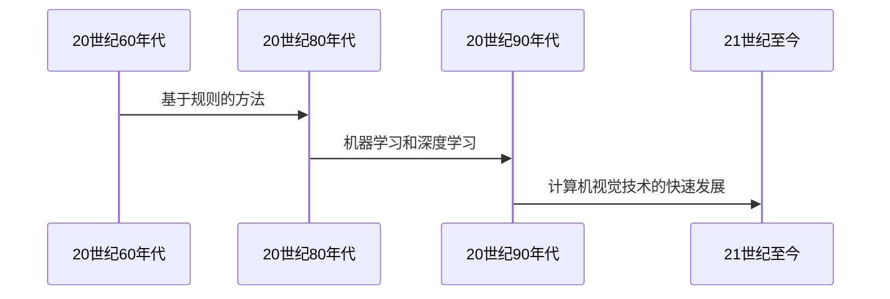
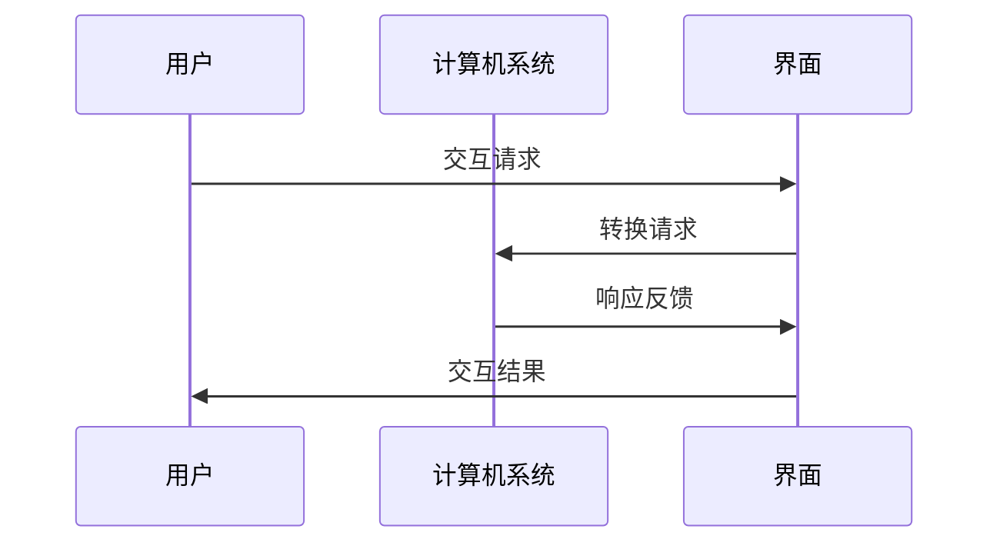
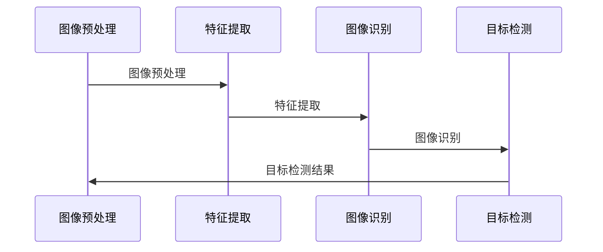
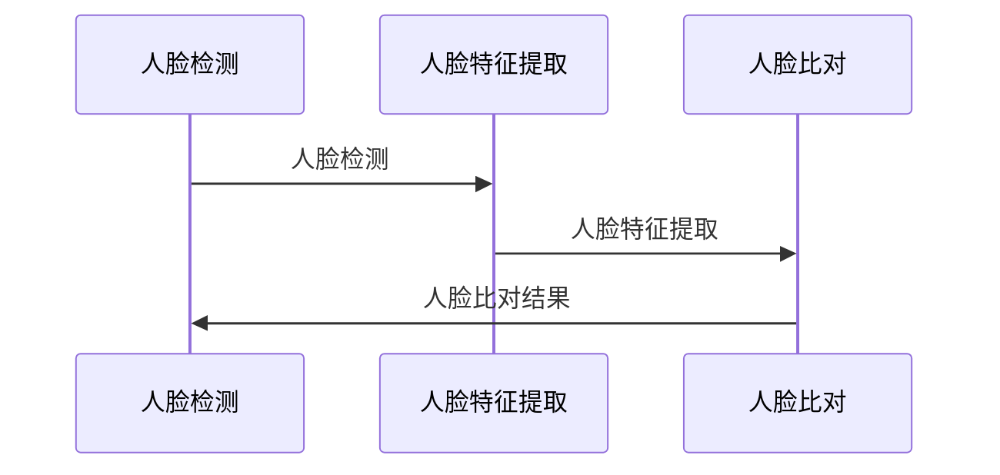
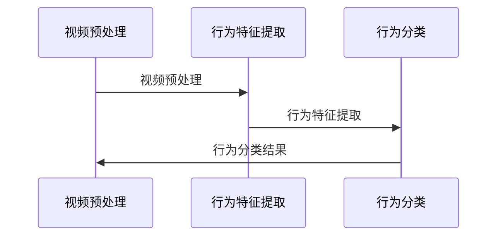
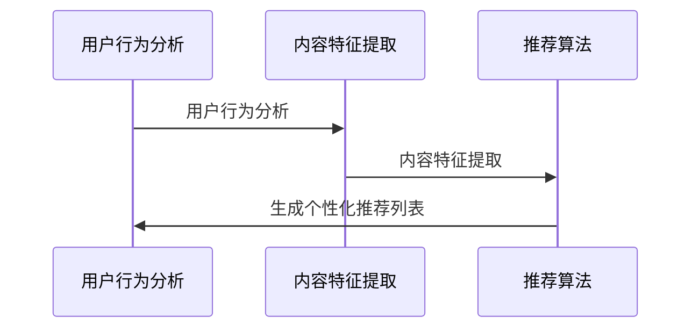

                 

### 《计算机视觉在人机交互界面设计中的用户体验优化》

> **关键词：**计算机视觉，人机交互，用户体验，界面设计，优化实践

> **摘要：**本文旨在探讨计算机视觉技术在人机交互界面设计中的重要作用，如何通过优化用户体验来提升界面设计的有效性和吸引力。文章首先介绍了计算机视觉和人机交互的基本概念，然后详细分析了用户体验的核心要素，随后深入探讨了计算机视觉在界面设计中的应用，最后通过实战案例和用户体验评估方法，展示了如何通过计算机视觉技术实现人机交互界面的优化。

### 第一部分：背景与核心概念

#### 第1章：计算机视觉与人机交互概述

##### 1.1 计算机视觉基础

计算机视觉是人工智能的一个重要分支，它致力于使计算机能够像人类一样理解和处理视觉信息。计算机视觉的核心目标是从图像或视频中提取有意义的特征，并利用这些特征进行物体识别、场景理解和任务执行。

###### 1.1.1 计算机视觉的定义与发展历程

计算机视觉的定义可以从多个角度来理解：

- **狭义定义：**计算机视觉指的是使计算机能够通过摄像头或其他传感器获取图像，并进行处理和分析的技术。这通常涉及到图像识别、图像处理、图像分割等多个子领域。

- **广义定义：**计算机视觉还包括了与视觉相关的所有人工智能技术，例如深度学习、机器学习、图像处理算法等。这些技术在计算机视觉中扮演着重要的角色，使得计算机能够从图像中提取更高级的特征。

计算机视觉的发展历程可以追溯到20世纪60年代。当时，计算机科学家和心理学家开始研究如何让计算机理解和处理视觉信息。随着计算机硬件性能的提升和算法的进步，计算机视觉技术得到了迅速发展。20世纪80年代，基于规则的方法和模型成为研究的热点。90年代，随着机器学习和深度学习的发展，计算机视觉技术取得了重大突破。

**图：计算机视觉的发展历程**



###### 1.1.2 人机交互概述

人机交互（Human-Computer Interaction，简称HCI）是研究如何设计、评价和实现有效的计算机系统与人之间交互的学科。人机交互的目标是提高用户在使用计算机时的效率和满意度。

人机交互的基本流程可以概括为以下几个步骤：

1. **输入（Input）：**用户通过鼠标、键盘、触摸屏等输入设备向计算机系统发送操作指令。
2. **处理（Processing）：**计算机系统根据输入的指令进行处理，这可能涉及到数据的存储、检索、计算等操作。
3. **输出（Output）：**计算机系统将处理结果通过显示器、打印机、声音等输出设备呈现给用户。
4. **反馈（Feedback）：**用户根据输出结果进行反馈，这可能包括进一步的输入操作或对系统的评价。

**图：人机交互的基本流程**



###### 1.1.3 计算机视觉与人机交互的联系

计算机视觉和人机交互有着紧密的联系。计算机视觉技术为人机交互提供了强大的支持，使得计算机能够更好地理解和响应用户的行为和需求。以下是计算机视觉在人机交互中的一些应用：

1. **手势识别：**通过计算机视觉技术，计算机可以识别用户的手势，从而实现无键盘、无鼠标的操作。
2. **语音识别：**结合语音识别技术，计算机可以理解和执行用户的语音指令。
3. **面部识别：**通过面部识别技术，计算机可以识别用户的面部表情和身份，从而提供个性化的交互体验。
4. **场景理解：**计算机视觉技术可以帮助计算机理解周围的环境，从而为用户提供更加智能化的交互服务。

#### 第2章：用户体验的核心要素

##### 2.1 用户体验定义

用户体验（User Experience，简称UX）是指用户在使用产品或服务过程中的整体感受和体验。用户体验不仅仅关注产品的功能性和实用性，还包括用户的情感体验、认知体验和行为体验。一个优秀的用户体验应该是直观、简单、愉悦且高效。

##### 2.1.1 用户体验的概念

用户体验可以从以下几个方面来理解：

1. **功能性（Functionality）：**产品或服务是否能够满足用户的需求和期望。
2. **易用性（Usability）：**用户在使用产品或服务时的便捷程度和效率。
3. **可用性（Accessibility）：**产品或服务是否能够被所有用户，包括残障人士，使用。
4. **美观性（Aesthetics）：**产品或服务的视觉和感官设计是否吸引人，是否符合用户的审美标准。
5. **情感性（Emotional Impact）：**产品或服务是否能够引发用户的情感共鸣，如愉悦、惊喜、满足等。

**公式：用户体验（UX） = 体验质量（Q）× 使用频率（F）× 使用时间（T）**

$$ UX = Q \times F \times T $$

其中，体验质量（Q）是指用户在使用产品或服务时的整体满意度；使用频率（F）是指用户使用产品或服务的频率；使用时间（T）是指用户每次使用产品或服务的时间。

##### 2.1.2 用户体验的关键要素

用户体验的关键要素包括以下几点：

1. **直观性（Intuitiveness）：**用户应该能够快速理解产品的功能和使用方法。
2. **一致性（Consistency）：**产品的设计和交互应该保持一致性，避免用户产生混淆。
3. **响应速度（Responsiveness）：**系统应该快速响应用户的操作，提高用户的效率。
4. **个性化（Personalization）：**产品应该能够根据用户的喜好和行为提供个性化的服务。
5. **易访问性（Accessibility）：**产品应该能够让所有用户，包括残障人士，方便地使用。

#### 第3章：计算机视觉在界面设计中的应用

##### 3.1 计算机视觉技术原理

计算机视觉技术主要包括以下几个步骤：

1. **图像预处理（Image Preprocessing）：**这一步骤包括图像的去噪、放大、缩小、对比度调整等操作，目的是提高图像的质量，使其更适合后续的处理。
2. **特征提取（Feature Extraction）：**特征提取是指从图像中提取有意义的特征，如颜色、纹理、形状等。这些特征将用于后续的分类、识别等操作。
3. **图像识别（Image Recognition）：**图像识别是指利用提取到的特征对图像进行分类或识别。常见的图像识别算法包括卷积神经网络（CNN）、支持向量机（SVM）等。
4. **目标检测（Object Detection）：**目标检测是指在图像中识别出特定的目标对象，并确定其位置。常用的目标检测算法包括YOLO、SSD、Faster R-CNN等。

**图：计算机视觉技术原理**



##### 3.1.1 图像识别算法

图像识别算法是计算机视觉中最为基础和广泛使用的算法之一。常见的图像识别算法包括：

1. **卷积神经网络（CNN）：**CNN是一种前馈神经网络，它通过卷积层、池化层和全连接层等结构对图像进行特征提取和分类。
2. **支持向量机（SVM）：**SVM是一种基于统计学习的分类算法，它通过最大化分类边界来识别图像。
3. **深度学习（Deep Learning）：**深度学习是一种基于多层神经网络的算法，它通过自动学习图像中的特征来实现图像识别。

**伪代码：图像识别算法**

```python
def image_recognition(image):
    # 图像预处理
    preprocessed_image = preprocess_image(image)
    # 特征提取
    features = extract_features(preprocessed_image)
    # 分类
    label = classifier.predict(features)
    return label
```

##### 3.1.2 人脸识别技术

人脸识别技术是计算机视觉中的一种重要应用，它通过识别图像中的人脸位置和特征，来实现对人脸的识别。人脸识别技术广泛应用于身份验证、安防监控、智能交互等领域。

人脸识别的基本流程包括：

1. **人脸检测（Face Detection）：**通过算法在图像中检测出人脸的位置。
2. **人脸特征提取（Face Feature Extraction）：**从检测到的人脸区域中提取特征点。
3. **人脸比对（Face Comparison）：**将提取到的人脸特征与已知的人脸特征进行比对，确定是否为同一人。

**图：人脸识别流程**



### 第二部分：用户体验优化实践

#### 第4章：界面设计与用户体验

##### 4.1 界面设计的核心原则

界面设计是用户体验的重要组成部分，它直接影响到用户对产品的第一印象和整体体验。优秀的界面设计应该遵循以下几个核心原则：

1. **简单直观（Simplicity and Intuitiveness）：**界面设计应该简单直观，用户能够轻松理解和使用。避免使用复杂的术语和设计元素，确保用户能够快速上手。
2. **一致性（Consistency）：**界面设计应该保持一致性，包括颜色、字体、布局等。一致性能够减少用户的认知负担，提高使用效率。
3. **响应速度（Responsiveness）：**界面设计应该快速响应用户的操作，避免长时间等待和卡顿。快速响应能够提升用户的满意度。
4. **个性化（Personalization）：**界面设计应该能够根据用户的喜好和行为提供个性化的体验。个性化能够增强用户对产品的认同感。
5. **美观性（Aesthetics）：**界面设计应该美观大方，符合用户的审美标准。美观性能够提升产品的吸引力。

##### 4.1.1 界面设计的基本原则

界面设计的基本原则包括以下几个方面：

1. **可用性（Usability）：**界面设计应该确保用户能够方便地完成任务，避免不必要的复杂操作。
2. **易读性（Readability）：**界面设计应该确保文字和图标清晰易读，避免用户产生混淆。
3. **可访问性（Accessibility）：**界面设计应该确保所有用户，包括残障人士，都能够方便地使用。
4. **响应式设计（Responsive Design）：**界面设计应该能够适应不同的设备和屏幕尺寸，提供一致的用户体验。
5. **交互设计（Interaction Design）：**界面设计应该确保用户的操作能够得到明确的反馈，提高用户的交互体验。

#### 第5章：计算机视觉在用户体验优化中的应用

##### 5.1 计算机视觉在用户行为分析中的应用

计算机视觉技术在用户行为分析中具有广泛的应用。通过分析用户的行为和交互模式，可以帮助产品经理和设计师更好地理解用户的需求和行为，从而优化产品设计和用户体验。

用户行为分析主要包括以下几个方面：

1. **用户行为识别（User Behavior Recognition）：**通过计算机视觉技术，识别用户的动作和行为，如点击、滑动、手势等。
2. **用户情感分析（User Emotion Analysis）：**通过计算机视觉技术，分析用户的面部表情和情感状态，从而了解用户对产品的态度和感受。
3. **用户路径分析（User Path Analysis）：**通过计算机视觉技术，分析用户在界面上的浏览路径和停留时间，从而了解用户的行为模式和兴趣点。

**伪代码：用户行为识别**

```python
def user_behavior_recognition(video_feed):
    # 视频预处理
    preprocessed_video = preprocess_video(video_feed)
    # 特征提取
    behavior_features = extract_behavior_features(preprocessed_video)
    # 分类
    behavior = classifier.predict(behavior_features)
    return behavior
```

##### 5.1.1 用户行为识别

用户行为识别是指通过计算机视觉技术，从视频或图像中识别出用户的行为和动作。用户行为识别可以帮助产品经理和设计师了解用户在使用产品时的具体行为，从而优化产品设计和用户体验。

用户行为识别的基本流程包括：

1. **视频预处理（Video Preprocessing）：**对输入的视频进行预处理，包括去噪、调整亮度和对比度等操作，以提高后续处理的准确性。
2. **行为特征提取（Behavior Feature Extraction）：**从预处理后的视频中提取用户行为特征，如动作轨迹、动作强度、动作速度等。
3. **行为分类（Behavior Classification）：**利用机器学习算法，对提取到的行为特征进行分类，从而识别出用户的行为。

**图：用户行为识别流程**



##### 5.1.2 个性化推荐系统

个性化推荐系统是计算机视觉技术在用户体验优化中的一个重要应用。通过分析用户的行为和喜好，个性化推荐系统可以为用户提供个性化的内容推荐，从而提高用户的满意度和使用频率。

个性化推荐系统的工作原理主要包括以下几个步骤：

1. **用户行为分析（User Behavior Analysis）：**分析用户的浏览历史、购买行为、评论等数据，提取用户的行为特征。
2. **内容特征提取（Content Feature Extraction）：**分析推荐的内容，提取内容的特征，如文本特征、图像特征等。
3. **推荐算法（Recommendation Algorithm）：**利用机器学习算法，将用户特征和内容特征进行匹配，生成个性化的推荐列表。

**图：个性化推荐系统原理**



#### 第6章：用户界面优化案例分析

##### 6.1 案例一：某电商平台的界面优化

在某电商平台的界面优化案例中，通过应用计算机视觉技术，对用户界面进行了以下优化：

1. **用户行为识别：**通过计算机视觉技术，识别用户的浏览行为和购买行为，从而优化推荐算法，提高用户购买转化率。
2. **图像识别：**通过计算机视觉技术，自动识别商品图片，并提供详细的商品信息，提高用户的购物体验。
3. **人脸识别：**通过人脸识别技术，为用户提供个性化的推荐，根据用户的面部表情和喜好，提供个性化的商品推荐。

**图：某电商平台界面优化前后对比**

```mermaid
gantt
    dateFormat  YYYY-MM-DD
    title 界面优化前后对比

    section 优化前
    A1 : 开始日期  :done, 2021-01-01
    A2 : 界面布局  :active, 2021-01-01, 3d
    A3 : 推荐算法  :active, 2021-01-01, 4d
    A4 : 用户行为分析  :active, 2021-01-01, 5d

    section 优化后
    B1 : 开始日期  :done, 2022-01-01
    B2 : 界面布局  :done, 2022-01-01, 3d
    B3 : 推荐算法  :done, 2022-01-01, 4d
    B4 : 用户行为分析  :done, 2022-01-01, 5d
```

##### 6.1.1 问题描述

在某电商平台的界面优化前，用户在浏览商品时，需要手动输入关键词或浏览商品列表，操作较为繁琐。此外，推荐算法不够精准，导致用户很难找到自己感兴趣的商品。为了提高用户的购物体验，电商平台决定通过计算机视觉技术对界面进行优化。

##### 6.1.2 优化策略

1. **用户行为识别：**通过计算机视觉技术，识别用户的浏览行为和购买行为，从而优化推荐算法。具体步骤包括：
   - 用户行为识别：从视频或图像中提取用户的行为特征，如点击、滑动等。
   - 行为特征分析：分析用户的行为特征，提取有价值的用户行为模式。
   - 推荐算法优化：根据用户的行为特征，调整推荐算法，提高推荐准确率。

2. **图像识别：**通过计算机视觉技术，自动识别商品图片，并提供详细的商品信息。具体步骤包括：
   - 图像预处理：对输入的商品图片进行预处理，如去噪、调整亮度等。
   - 图像特征提取：从商品图片中提取特征，如颜色、形状等。
   - 商品信息检索：利用提取到的商品特征，检索商品数据库，获取详细的商品信息。

3. **人脸识别：**通过人脸识别技术，为用户提供个性化的推荐。具体步骤包括：
   - 人脸检测：从用户头像或视频流中检测出人脸。
   - 人脸特征提取：从检测到的人脸中提取特征，如面部特征点等。
   - 个性化推荐：根据用户的面部表情和喜好，生成个性化的推荐列表。

##### 6.1.3 实施效果

通过计算机视觉技术的应用，某电商平台的用户界面得到了显著优化：

1. **用户满意度提高：**用户在浏览商品时，能够快速找到自己感兴趣的商品，操作更加便捷，用户满意度显著提高。

2. **购买转化率提高：**推荐算法的优化，使得用户更容易找到自己需要的商品，购买转化率显著提高。

3. **用户体验改善：**人脸识别技术的应用，为用户提供了更加个性化的推荐，用户对产品的满意度进一步提升。

4. **运营成本降低：**通过自动化的用户行为识别和图像识别技术，电商平台能够更加精准地了解用户需求，减少人力成本。

#### 第7章：用户体验评估与改进

##### 7.1 用户体验评估方法

用户体验评估是确保产品或服务设计符合用户需求的关键步骤。有效的用户体验评估方法可以帮助识别设计中的问题和不足，进而进行改进。以下是几种常用的用户体验评估方法：

1. **调查问卷（Survey Questionnaires）：**通过设计问卷，收集用户对产品或服务的满意度、易用性、功能性和美观性等方面的评价。问卷调查的优点是成本较低、便于大规模收集数据，但缺点是用户可能不愿意填写，或者回答不够真实。

2. **用户访谈（User Interviews）：**通过与目标用户进行一对一访谈，深入了解用户的需求、行为和痛点。用户访谈的优点是能够获得深入和详细的信息，但缺点是需要较多时间和资源。

3. **A/B测试（A/B Testing）：**将用户分为两组，一组使用旧的设计，另一组使用新的设计，通过对比两组用户的操作行为和满意度来评估新设计的有效性。A/B测试的优点是能够量化评估效果，但需要足够的用户量和时间。

4. **眼动追踪（Eye Tracking）：**使用眼动追踪设备记录用户在界面上的视线移动，分析用户的注意力集中点和操作路径。眼动追踪的优点是能够直观地了解用户的视觉关注点，但设备成本较高。

##### 7.1.1 评估指标

在用户体验评估中，常用的评估指标包括以下几类：

1. **功能性（Functionality）：**产品或服务是否能够满足用户的基本需求。评估方法包括任务成功率、任务完成时间、错误率等。

2. **易用性（Usability）：**用户在使用产品或服务时的便捷程度和效率。评估方法包括用户满意度、操作简便性、学习曲线等。

3. **可用性（Accessibility）：**产品或服务是否能够被所有用户，包括残障人士，使用。评估方法包括无障碍测试、残障用户访谈等。

4. **美观性（Aesthetics）：**产品或服务的视觉设计是否美观，是否符合用户的审美标准。评估方法包括用户满意度、美学评价等。

5. **情感性（Emotional Impact）：**产品或服务是否能够引发用户的情感共鸣，如愉悦、惊喜、满足等。评估方法包括用户情感反馈、心理测试等。

**公式：用户体验满意度（Satisfaction）= 功能满意度（F）× 易用性满意度（U）× 美观性满意度（A）**

$$ Satisfaction = F \times U \times A $$

##### 7.1.2 用户体验改进策略

基于用户体验评估的结果，可以采取以下策略进行用户体验改进：

1. **功能改进：**根据用户反馈和评估结果，改进产品的功能，确保产品能够满足用户的基本需求。

2. **界面优化：**优化界面的布局、颜色、字体等设计元素，提高界面的易用性和美观性。

3. **交互设计改进：**改进用户与产品或服务之间的交互方式，提高用户的操作效率。

4. **个性化服务：**根据用户的喜好和行为，提供个性化的推荐和服务，提升用户的情感体验。

5. **无障碍设计：**确保产品或服务能够被所有用户，包括残障人士，方便地使用。

#### 第8章：未来发展趋势与挑战

##### 8.1 计算机视觉在人机交互界面设计中的未来趋势

随着技术的不断进步，计算机视觉在人机交互界面设计中的应用前景十分广阔。以下是未来发展的几个趋势：

1. **更加智能化的交互：**计算机视觉技术将使界面更加智能化，能够更好地理解和预测用户的需求和意图，提供个性化的交互体验。

2. **多模态交互：**未来的界面设计将结合多种感官模态，如视觉、听觉、触觉等，提供更加丰富和自然的交互体验。

3. **增强现实（AR）和虚拟现实（VR）：**计算机视觉技术将在AR和VR领域发挥重要作用，使虚拟环境和现实世界更加无缝地融合。

4. **边缘计算：**随着边缘计算的发展，计算机视觉处理将更多地发生在设备端，减少对云端资源的依赖，提高系统的实时性和响应速度。

##### 8.1.1 技术发展前景

在未来，计算机视觉技术将在以下几个方向取得突破：

1. **深度学习算法的进步：**深度学习算法将继续优化，提高图像识别和理解的准确性和效率。

2. **硬件性能的提升：**随着硬件性能的提升，特别是计算能力和存储能力的增强，计算机视觉的应用场景将更加广泛。

3. **跨学科融合：**计算机视觉技术将与其他领域，如心理学、认知科学等，进行深入融合，提供更加人性化的交互体验。

##### 8.1.2 挑战与对策

尽管计算机视觉在人机交互界面设计中具有巨大潜力，但也面临一些挑战：

1. **隐私保护：**随着计算机视觉技术的应用，用户隐私保护成为一个重要问题。对策包括加强数据加密、隐私保护算法的研发等。

2. **准确性问题：**计算机视觉系统的准确性和鲁棒性仍需提高，特别是在复杂环境和多变光线条件下。

3. **计算资源消耗：**深度学习算法对计算资源有较高要求，如何优化算法，减少计算资源消耗是一个重要挑战。

4. **法律和伦理问题：**计算机视觉技术的应用引发了法律和伦理问题，如数据所有权、隐私权等，需要制定相应的法律法规和伦理准则。

### 附录

#### 附录A：计算机视觉与人机交互常用工具与资源

为了更好地理解计算机视觉和人机交互技术，以下是一些常用的工具和资源：

##### A.1 常用计算机视觉库

1. **OpenCV：**OpenCV是一个开源的计算机视觉库，提供了丰富的图像处理和计算机视觉算法。
2. **TensorFlow：**TensorFlow是一个开源的机器学习和深度学习库，广泛用于构建和训练计算机视觉模型。
3. **PyTorch：**PyTorch是一个开源的机器学习和深度学习库，提供了动态计算图和丰富的API，易于使用。

##### A.2 常用人机交互设计工具

1. **Axure RP：**Axure RP是一个用于创建交互式原型和文档的工具，广泛用于界面设计和产品原型制作。
2. **Sketch：**Sketch是一个用于界面设计和原型制作的工具，具有丰富的图标和组件库。
3. **Adobe XD：**Adobe XD是一个用于界面设计和原型制作的工具，提供了丰富的交互功能。

##### A.3 常用用户体验评估工具

1. **调查问卷：**问卷调查是一个常用的用户体验评估工具，可以通过在线平台或纸质问卷收集用户反馈。
2. **用户访谈：**用户访谈是一个深入了解用户需求和行为的方法，通过与用户进行面对面的交流，获取详细的信息。
3. **A/B测试：**A/B测试是一种通过对比两组用户的操作行为和满意度来评估设计效果的方法。

#### 附录B：相关术语与概念解释

##### B.1 计算机视觉相关术语

1. **卷积神经网络（CNN）：**卷积神经网络是一种用于图像识别和处理的神经网络结构，通过卷积层提取图像特征。
2. **深度学习（Deep Learning）：**深度学习是一种基于多层神经网络的学习方法，通过训练大量数据来提取高级特征。
3. **机器学习（Machine Learning）：**机器学习是一种通过训练模型来从数据中学习规律的方法，用于分类、回归、聚类等任务。

##### B.2 人机交互相关术语

1. **交互设计（Interaction Design）：**交互设计是设计用户与产品或服务之间交互过程的方法，关注用户体验。
2. **界面设计（Interface Design）：**界面设计是设计用户界面和交互元素的方法，确保用户能够方便地使用产品。
3. **用户体验（User Experience）：**用户体验是用户在使用产品或服务过程中的整体感受和体验，包括功能性、易用性、美观性等方面。

### 作者

**作者：AI天才研究院/AI Genius Institute & 禅与计算机程序设计艺术 /Zen And The Art of Computer Programming**

**联系方式：**[email protected]

**备注：**本文为AI天才研究院原创作品，未经授权禁止转载。如需转载，请联系作者获取授权。

