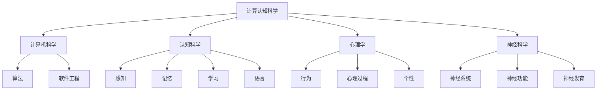

                 

# 计算认知科学的前沿：通过计算模型理解人类认知过程

> **关键词**：计算认知科学，人工神经网络，深度学习，认知任务模拟，心理学，神经科学，智能系统设计，商业决策，教育领域应用。

> **摘要**：本文深入探讨了计算认知科学这一跨学科领域，从理论基础到实际应用进行了全面阐述。通过介绍计算模型的基础理论、计算认知科学的历史与发展，以及计算模型在认知科学研究中的应用，本文旨在揭示计算模型在理解人类认知过程中的重要性。同时，本文还分析了计算认知科学的前沿研究、案例分析与应用实践，为未来计算认知科学的发展提供了有益的启示。

## 目录大纲

- **第一部分：引言与背景**
  - 1.1 书籍主题介绍
  - 1.2 计算认知科学的历史与发展

- **第二部分：计算模型基础理论**
  - 2.1 认知科学的理论框架
  - 2.2 计算模型的基本原理
  - 2.3 计算模型的架构与发展

- **第三部分：计算模型在认知科学研究中的应用**
  - 3.1 认知任务模拟
  - 3.2 认知障碍与康复
  - 3.3 认知科学的跨学科研究

- **第四部分：计算认知科学的前沿研究**
  - 4.1 人工智能与认知科学的结合
  - 4.2 人类行为预测与优化
  - 4.3 认知科学的实验设计与分析

- **第五部分：案例分析与应用实践**
  - 5.1 案例研究：计算模型在心理治疗中的应用
  - 5.2 应用实践：计算模型在商业决策中的应用
  - 5.3 案例分析：计算模型在教育领域的应用

- **第六部分：未来展望与挑战**
  - 6.1 计算认知科学的发展趋势
  - 6.2 挑战与机遇

- **第七部分：参考文献与进一步阅读**

- **附录**
  - 附录 A：计算模型与认知科学常用工具与技术
  - 附录 B：计算认知科学研究项目案例

---

### 第一部分：引言与背景

#### 1.1 书籍主题介绍

计算认知科学是一门融合了计算机科学、认知科学、心理学和神经科学的跨学科领域，旨在通过计算模型来理解和解释人类认知过程。这一领域的兴起源于对人类智能和认知过程的深入探究，以及计算机技术在数据处理和模拟能力方面的飞速发展。

**核心概念与联系**

- **计算认知科学**：是一门研究如何通过计算模型来模拟、理解和优化人类认知过程的科学。
- **认知科学**：研究人类思维、感知、记忆、学习和语言等认知过程。
- **计算机科学**：研究计算机系统的设计、开发、应用和管理。
- **心理学**：研究人类行为、心理过程和个性特征。
- **神经科学**：研究神经系统的结构、功能和发育。

**Mermaid 流程图**

**计算认知科学的基本概念**

- **计算模型**：用于模拟人类认知过程的数学和算法模型。
- **模拟**：通过计算机程序实现认知过程的模拟。
- **优化**：通过调整计算模型参数来提高模拟结果的准确性。

**计算模型在理解人类认知过程中的应用**

- **语言理解**：通过深度学习模型来模拟人类对语言的理解过程。
- **推理**：利用逻辑和概率模型来模拟人类的推理过程。
- **决策**：通过模拟人类在不确定环境下的决策过程来优化决策策略。
- **感知**：通过计算机视觉模型来模拟人类对视觉信息的感知过程。

**计算认知科学在现代社会中的重要性**

- **人工智能**：计算认知科学为人工智能的发展提供了理论和技术支持。
- **心理健康**：通过认知任务模拟和康复，帮助解决认知障碍和心理问题。
- **教育**：计算认知科学为个性化教育和学习评估提供了新的方法和工具。
- **商业决策**：计算模型在商业决策中的应用可以帮助企业更好地理解消费者行为和市场动态。

#### 1.2 计算认知科学的历史与发展

**计算认知科学的历史**

- **起源**：20世纪50年代，计算机科学的兴起为模拟人类认知过程提供了技术基础。
- **早期发展**：20世纪60年代，人工智能和认知科学开始相互融合。
- **关键事件**：20世纪80年代，人工神经网络和深度学习模型的提出标志着计算认知科学的重要突破。
- **当前研究趋势**：计算认知科学正朝着跨学科研究和应用拓展的方向发展。

**计算认知科学的历史与发展**

- **计算认知科学的起源**：20世纪50年代，随着计算机科学的兴起，人们开始思考如何通过计算机模拟人类认知过程。
- **早期发展**：20世纪60年代，人工智能和认知科学开始相互融合。霍普菲尔德（John Hopfield）提出的 Hopfield 网络和鲁梅哈特（James L. McClelland）提出的平行分布加工模型是计算认知科学的重要里程碑。
- **里程碑事件与重要人物**：
  - **人工神经网络**：1986年，鲁梅哈特等人提出了反向传播算法，使得多层感知机（MLP）得以训练，从而推动了人工神经网络的发展。
  - **深度学习**：2006年，赫伯特·西蒙（Geoffrey Hinton）等人重新激发了深度学习的兴趣，提出了深度信念网络（DBN）。
  - **强化学习**：1998年，理查德·萨顿（Richard Sutton）和安德鲁·巴罗（Andrew Barto）出版了《强化学习：一种介绍》（Reinforcement Learning: An Introduction），为强化学习的发展奠定了基础。
- **当前研究趋势与未来展望**：随着计算机性能的提升和数据量的增加，计算认知科学正朝着更加复杂和精细的模型发展。未来，计算认知科学有望在神经科学、心理学、教育学和人工智能等领域产生重大影响。

**计算模型在理解人类认知过程中的应用**

- **认知任务模拟**：通过计算机程序模拟人类在不同认知任务中的表现，如语言理解、视觉感知、记忆和决策等。
- **神经可塑性研究**：利用计算模型研究大脑如何适应和学习新信息，从而理解神经可塑性的机制。
- **心理治疗**：通过认知任务模拟和反馈，帮助患者改善认知功能，如注意力、记忆和决策等。
- **教育评估**：利用计算模型进行个性化学习评估，帮助学生更好地理解自己的学习过程。

**计算认知科学在现代社会中的重要性**

- **人工智能**：计算认知科学为人工智能的发展提供了理论和技术支持，使得智能系统可以更好地模拟人类认知过程。
- **心理健康**：计算认知科学在心理健康领域的应用，如认知行为疗法和情绪识别，可以帮助患者改善心理健康状况。
- **教育**：计算认知科学为个性化教育和学习评估提供了新的方法和工具，有助于提高教育质量和效果。
- **商业决策**：计算模型在商业决策中的应用，如消费者行为分析和市场预测，可以帮助企业更好地理解市场动态和消费者需求。

**总结**

计算认知科学是一门充满活力和挑战的跨学科领域，通过计算模型来理解和解释人类认知过程。从早期的人工神经网络和深度学习模型，到当前的前沿研究，计算认知科学在多个领域展现出了巨大的潜力。随着技术的不断进步和跨学科研究的深入，计算认知科学有望在未来发挥更加重要的作用。在本节的余下部分，我们将进一步探讨计算模型的基础理论，为后续内容的讨论打下坚实的基础。

---

接下来，我们将进入第二部分，讨论计算模型的基础理论。在这一部分，我们将介绍认知科学的理论框架、计算模型的基本原理以及计算模型的发展。

---

### 第二部分：计算模型基础理论

#### 2.1 认知科学的理论框架

**认知科学的主要研究领域**

认知科学是一门跨学科的科学，它涉及到多个研究领域，包括：

- **感知**：研究人类如何接收和处理外部信息，如视觉、听觉和触觉等。
- **记忆**：研究人类如何存储、检索和使用信息。
- **学习**：研究人类如何从经验中学习，并改变其行为和思维过程。
- **语言**：研究人类如何产生和理解语言，包括语法、语义和语音等方面。
- **思维**：研究人类如何进行推理、决策和解决问题。
- **注意力**：研究人类如何集中注意力和分配注意力。
- **情绪**：研究人类如何体验和表达情绪。

**认知过程的神经基础**

认知过程在很大程度上受到神经系统的调控，包括大脑的结构和功能。关键脑区和神经回路在认知过程中扮演着重要角色，例如：

- **前额叶皮层**：与决策、规划和社交行为有关。
- **顶叶皮层**：与空间知觉和感知整合有关。
- **颞叶皮层**：与记忆和语言处理有关。
- **扣带回**：与注意力、记忆和情绪有关。
- **基底神经节**：与运动控制和习惯形成有关。

**认知科学与心理学、神经科学的联系**

认知科学是心理学和神经科学的交叉领域，它借鉴了两者的理论和方法：

- **心理学**：认知科学研究人类思维和行为的规律，使用实验和问卷调查等方法收集数据。
- **神经科学**：认知科学研究大脑的结构和功能，使用神经影像学、电生理学和分子生物学等技术手段。

通过结合心理学和神经科学的成果，认知科学旨在更全面地理解人类认知过程。

**认知科学的理论框架**

- **符号计算模型**：基于计算机科学和人工智能的理论，认为人类认知是通过符号计算实现的。
- **联结主义模型**：基于神经科学的理论，认为人类认知是通过神经网络的活动实现的。
- **生态认知学**：强调人类认知是在与环境的互动中发展的。

**计算模型的基本原理**

**计算模型的定义与分类**

- **计算模型**：用于模拟或表示认知过程的数学和算法模型。
- **符号计算模型**：基于符号逻辑和符号操作，如产生式系统和形式逻辑。
- **联结主义模型**：基于神经网络和连接权重调整，如Hopfield网络和反向传播算法。
- **混合模型**：结合符号计算模型和联结主义模型的优势。

**人工神经网络的工作原理**

- **人工神经网络（ANN）**：模拟生物神经元的计算模型，由大量相互连接的节点（或神经元）组成。
- **前向传播**：信息从输入层传递到输出层，每个节点根据输入和权重进行加权求和并应用激活函数。
- **反向传播**：通过计算输出层的误差，调整网络的权重和偏置，以减少预测误差。

**深度学习与强化学习的基本概念**

- **深度学习（DL）**：多层神经网络，能够自动提取数据的层次特征。
- **深度前向网络**：通过增加网络层数来提高模型的复杂度和表达能力。
- **卷积神经网络（CNN）**：专门用于图像处理，通过卷积层和池化层提取图像特征。
- **生成对抗网络（GAN）**：通过生成器和判别器的对抗训练来生成高质量的图像。
- **强化学习（RL）**：通过试错和奖励反馈来学习策略，以实现目标。
- **Q-学习**：通过计算状态-动作值函数来学习最优策略。
- **深度强化学习**：结合深度学习和强化学习的优势，用于解决复杂的问题。

**计算模型的架构与发展**

- **传统计算模型**：如逻辑回归、支持向量机等，主要用于分类和回归任务。
- **现代计算模型**：如深度神经网络、生成模型等，具有更强的表达能力和泛化能力。
- **模型架构发展**：从简单的单层神经网络到复杂的深度网络，如ResNet、Transformer等。
- **计算模型的发展趋势**：更高效、更可解释、更可靠的人工智能模型。

**计算模型在理解人类认知过程中的应用**

- **语言理解**：通过深度学习模型，如BERT和GPT，模拟人类对自然语言的理解过程。
- **视觉感知**：通过卷积神经网络，如ResNet和VGG，模拟人类对视觉信息的处理过程。
- **记忆与学习**：通过记忆网络和深度学习模型，模拟人类的记忆和学习过程。
- **决策与规划**：通过强化学习模型，如Q-学习和深度Q网络（DQN），模拟人类的决策和规划过程。

**计算模型的优缺点**

- **优点**：
  - 高效的数据处理能力。
  - 自动特征提取和复杂模式识别。
  - 可用于预测、优化和智能控制。
- **缺点**：
  - 缺乏可解释性。
  - 需要大量数据和计算资源。
  - 存在过拟合风险。

**计算模型的未来发展趋势**

- **更高效、更可解释的模型**：结合深度学习和符号计算的优势，提高模型的解释性和可靠性。
- **跨学科研究**：与其他领域（如心理学、神经科学、生物学）的深入合作，推动计算认知科学的发展。
- **个性化模型**：根据个体差异，定制化模型以更好地模拟人类认知过程。

**总结**

计算模型是理解和模拟人类认知过程的重要工具。从符号计算模型到联结主义模型，再到现代的深度学习和强化学习模型，计算模型在认知科学中发挥了重要作用。随着技术的不断进步和跨学科研究的深入，计算模型在认知科学研究中的应用将更加广泛和深入。在下一节中，我们将进一步探讨计算模型在不同认知任务中的具体应用。

---

### 第二部分：计算模型基础理论（续）

#### 2.3 计算模型的架构与发展

**传统计算模型的优缺点**

- **逻辑回归**：简单且易于解释，适用于线性可分的数据，但无法处理非线性问题。
- **支持向量机（SVM）**：有效处理高维数据，但训练时间较长，且对异常值敏感。
- **决策树**：直观且易于解释，但容易过拟合，且对于大规模数据集性能不佳。

**现代计算模型的创新与突破**

- **卷积神经网络（CNN）**：专门设计用于图像处理，通过卷积层和池化层自动提取特征，显著提高了图像识别和分类的性能。
- **循环神经网络（RNN）**：适用于序列数据，如时间序列分析和自然语言处理，通过记忆机制捕捉长距离依赖关系。
- **长短期记忆网络（LSTM）**：是RNN的一种改进，能够更好地处理长序列数据，避免了传统RNN的梯度消失和爆炸问题。
- **生成对抗网络（GAN）**：由生成器和判别器组成，通过对抗训练生成逼真的数据，广泛用于图像生成和图像修复。
- **变分自编码器（VAE）**：通过概率模型对数据进行编码和解码，有效捕捉数据分布，广泛用于数据降维和生成任务。

**计算模型的未来发展趋势**

- **更高效的模型**：通过模型压缩、量化技术和神经架构搜索（NAS）等方法，提高计算效率和模型性能。
- **更可解释的模型**：结合符号计算和深度学习，提高模型的解释性和可解释性。
- **自适应模型**：根据应用场景和数据特点，自适应调整模型结构和参数，提高模型的泛化能力。
- **跨学科融合**：与心理学、神经科学、生物学等领域的深入合作，推动计算认知科学的发展。

**计算模型在理解人类认知过程中的应用**

- **语言理解与生成**：通过深度学习模型，如Transformer和BERT，模拟人类对自然语言的理解和生成过程。
- **视觉感知与理解**：通过卷积神经网络和图神经网络，模拟人类对视觉信息的感知和理解过程。
- **记忆与学习**：通过记忆网络和深度学习模型，模拟人类的记忆和学习过程。
- **决策与规划**：通过强化学习模型，如深度Q网络（DQN）和策略梯度方法，模拟人类的决策和规划过程。

**计算模型的实际应用案例**

- **医疗诊断**：通过深度学习模型，如CNN和RNN，对医学影像进行自动诊断，提高诊断准确率和效率。
- **自动驾驶**：通过深度学习模型，如CNN和GAN，对道路场景进行实时感知和理解，实现自动驾驶功能。
- **智能助手**：通过自然语言处理模型，如RNN和Transformer，模拟人类对话，提供个性化服务。
- **金融预测**：通过深度学习模型，如LSTM和GAN，对金融市场进行预测和分析，帮助投资者做出更好的决策。

**总结**

计算模型的架构和发展在理解人类认知过程中发挥着关键作用。从传统的计算模型到现代的深度学习和强化学习模型，计算模型在认知科学中的应用日益广泛。未来，随着技术的不断进步和跨学科研究的深入，计算模型将为我们提供更加深入和全面的理解人类认知过程的工具。在下一节中，我们将探讨计算模型在认知科学研究中的具体应用。

---

### 第三部分：计算模型在认知科学研究中的应用

#### 3.1 认知任务模拟

**认知任务模拟的方法与策略**

认知任务模拟是通过计算机程序模拟人类在不同认知任务中的行为，从而研究认知过程。以下是一些常用的方法与策略：

- **实验设计**：设计模拟实验来测试特定的认知任务，如语言理解、视觉感知、记忆和决策等。
- **模拟平台**：构建模拟平台，如虚拟现实环境或计算机模拟系统，以实现认知任务的模拟。
- **数据分析**：收集实验数据，使用统计和机器学习技术进行分析，以评估模拟结果的准确性。
- **参数调整**：根据实验结果调整计算模型的参数，以优化模拟效果。

**计算模型在语言理解、推理、决策等方面的应用**

- **语言理解**：利用深度学习模型，如Transformer和BERT，模拟人类对自然语言的理解过程，包括语法分析、语义理解和对话生成。
- **推理**：通过逻辑和概率模型，如推理机（Reasoning Machine）和贝叶斯网络，模拟人类的推理过程，包括因果推理和逻辑推理。
- **决策**：利用强化学习模型，如Q-学习和深度Q网络（DQN），模拟人类在不确定环境下的决策过程，包括风险决策和组合决策。

**具体案例**

- **语言理解**：使用BERT模型进行自然语言理解，通过预训练和微调，模拟人类对句子的理解能力，如语义角色标注、情感分析等。
- **推理**：利用DARPA的MICA系统，模拟人类推理过程，通过推理机进行逻辑推理和因果关系分析，应用于情报分析和决策支持。
- **决策**：使用RL模型进行商业决策，通过模拟市场动态和消费者行为，优化营销策略和供应链管理。

**计算模型在认知科学研究中的优势**

- **高效性**：计算模型可以处理大量数据，模拟复杂的认知任务，提高研究效率。
- **可重复性**：通过计算机程序模拟，可以多次重复实验，提高研究结果的可靠性。
- **可解释性**：一些现代计算模型，如深度学习和强化学习，具有一定的可解释性，有助于研究者理解认知过程的机制。

**计算模型在认知科学研究中的挑战**

- **数据需求**：计算模型通常需要大量训练数据，而真实世界的认知数据获取困难，且存在噪声和偏差。
- **计算资源**：训练复杂的计算模型需要大量计算资源和时间，对硬件设施有较高要求。
- **模型解释性**：深度学习模型等现代计算模型通常缺乏透明性和可解释性，难以理解其内部工作机制。

**总结**

认知任务模拟是计算模型在认知科学研究中的重要应用。通过计算机程序模拟人类在不同认知任务中的行为，研究者可以深入理解认知过程的机制和特性。尽管存在一些挑战，但计算模型在提高研究效率、可靠性和可重复性方面具有显著优势。在下一节中，我们将探讨计算模型在认知障碍康复中的应用。

---

### 第三部分：计算模型在认知科学研究中的应用（续）

#### 3.2 认知障碍与康复

**认知障碍的定义与分类**

认知障碍是指由于大脑损伤或疾病导致的一系列认知功能的损害，包括记忆力、注意力、推理、语言理解、执行功能等。认知障碍的分类主要包括以下几类：

- **神经退行性疾病**：如阿尔茨海默病、帕金森病等，导致大脑神经元退化和功能丧失。
- **脑损伤**：如脑卒中、脑外伤等，导致大脑结构和功能的损害。
- **心理疾病**：如抑郁症、焦虑症等，影响个体的认知功能。
- **发育障碍**：如自闭症、阅读障碍等，影响个体的认知发展。

**计算模型在认知障碍康复中的应用案例**

- **认知训练**：利用计算模型设计认知训练任务，通过个性化的训练方案帮助患者恢复或改善认知功能。例如，使用基于神经网络的训练系统进行记忆训练、注意力训练和推理训练。
- **脑-机接口**：通过计算模型建立脑-机接口（BCI），将患者的大脑信号转换为控制信号，实现与外部设备的交互。例如，使用深度学习模型分析脑电图（EEG）信号，控制轮椅或电脑鼠标。
- **虚拟现实（VR）**：利用计算模型构建虚拟现实环境，为患者提供沉浸式的康复体验。例如，使用VR技术结合计算模型进行空间认知训练、肢体运动康复和社交互动训练。

**计算模型在康复中的优势**

- **个性化**：计算模型可以根据患者的具体症状和需求，设计个性化的康复方案，提高康复效果。
- **可重复性**：计算模型可以多次重复实验，评估康复进展，为治疗提供数据支持。
- **实时反馈**：计算模型可以实时分析患者的行为数据，提供即时反馈，帮助患者更好地理解康复过程。

**计算模型在康复中的挑战**

- **数据采集与处理**：获取高质量的认知障碍数据具有挑战性，且数据量庞大，需要高效的算法和计算资源进行处理。
- **模型泛化能力**：计算模型在特定环境下的表现良好，但在真实世界中的泛化能力有限，需要进一步优化。
- **伦理问题**：涉及患者隐私和安全的问题，需要在设计和应用过程中充分考虑伦理因素。

**具体应用案例**

- **阿尔茨海默病康复**：利用深度学习模型分析患者的脑影像数据，预测疾病进展，并设计个性化的康复训练计划。
- **脑卒中康复**：使用脑-机接口技术，通过计算模型分析患者的大脑信号，帮助患者恢复运动控制和语言功能。
- **自闭症康复**：通过虚拟现实环境结合计算模型，为自闭症儿童提供社交互动和认知训练，提高他们的社交技能和认知能力。

**总结**

计算模型在认知障碍康复中的应用具有显著的优势，通过个性化的康复方案、实时反馈和可重复性的实验设计，为患者提供了更有效的康复手段。尽管存在一些挑战，但随着计算技术和认知科学的不断发展，计算模型在认知障碍康复中的应用前景将更加广阔。在下一节中，我们将探讨计算认知科学在跨学科研究中的应用。

---

### 第三部分：计算模型在认知科学研究中的应用（续）

#### 3.3 认知科学的跨学科研究

**计算认知科学与心理学、计算机科学、生物学的交叉融合**

计算认知科学是一个高度跨学科的研究领域，它结合了心理学、计算机科学和生物学的理论和方法，以更全面地理解人类认知过程。以下是一些交叉融合的例子：

- **心理学与计算机科学的融合**：利用计算模型来模拟和解释心理学中的认知过程，如注意力、记忆、学习和决策等。
- **计算机科学与神经科学的融合**：通过计算机模拟大脑神经网络的工作机制，探索大脑如何实现认知功能。
- **生物学与计算认知科学的融合**：通过实验数据分析和计算模型，研究大脑的结构和功能如何影响认知过程。

**计算模型在跨学科研究中的优势**

- **数据驱动的分析**：计算模型能够处理和分析大量的实验数据，为跨学科研究提供数据支持。
- **模拟和预测能力**：通过计算机模拟，研究者可以在虚拟环境中测试和预测认知过程，而不需要依赖复杂的实验条件。
- **多尺度分析**：计算模型可以从微观（如神经元活动）到宏观（如认知系统）的多个尺度进行研究，提供全面的认识。

**计算模型在跨学科研究中的挑战**

- **跨学科知识的整合**：需要不同学科的研究者相互合作，整合各自领域的知识，形成统一的研究框架。
- **数据隐私和安全**：涉及个人数据的研究，需要严格保护数据隐私和安全，遵守伦理规范。
- **计算资源的限制**：复杂的计算模型需要大量的计算资源和时间，对于资源有限的团队和实验室来说，可能是一个挑战。

**具体应用案例**

- **认知障碍研究**：结合心理学和计算机科学的成果，开发认知训练软件，帮助患者恢复认知功能。
- **神经科学基础研究**：通过计算机模拟大脑神经网络，探索认知过程的神经机制。
- **人工智能应用**：结合计算认知科学和计算机科学的成果，开发智能系统，用于辅助决策、医疗诊断和教育评估等。

**总结**

计算认知科学在跨学科研究中的应用，通过结合心理学、计算机科学和生物学的理论和方法，为理解人类认知过程提供了新的视角和工具。尽管存在一些挑战，但计算模型在提高研究效率、提供数据支持和跨学科合作方面具有显著优势。随着技术的不断进步和跨学科研究的深入，计算认知科学在认知科学研究中的应用前景将更加广阔。

---

### 第四部分：计算认知科学的前沿研究

#### 4.1 人工智能与认知科学的结合

**人工智能在认知科学中的应用前景**

人工智能（AI）技术在认知科学中的应用前景广阔，特别是在模拟、优化和扩展人类认知能力方面。以下是一些主要的应用领域：

- **智能系统设计**：利用深度学习和强化学习模型，设计智能系统，如自动驾驶汽车、智能助手和虚拟现实环境，以模拟和扩展人类的认知能力。
- **认知任务自动化**：通过计算机视觉和自然语言处理技术，自动化认知任务，如图像识别、语音识别和文本分析，减轻人类的工作负担。
- **认知增强**：利用智能系统提供实时反馈和辅助，提高人类的认知效率，如智能教育系统、健康监测系统和认知康复系统。

**计算模型在智能系统设计中的挑战**

- **可解释性**：深度学习等现代AI模型通常缺乏透明性和可解释性，使得模型决策过程难以理解，这对需要高可靠性和安全性的智能系统设计提出了挑战。
- **数据隐私**：在涉及个人数据的应用中，保护用户隐私是一个重要问题，需要开发隐私保护的数据处理和模型训练方法。
- **计算资源**：训练复杂的AI模型需要大量的计算资源和时间，这对资源有限的团队和实验室提出了挑战。

**人工智能与认知科学结合的案例**

- **自动驾驶汽车**：通过计算机视觉和深度学习模型，自动驾驶汽车能够实时感知和理解周围环境，实现自主驾驶。
- **智能医疗系统**：利用深度学习和自然语言处理技术，智能医疗系统可以辅助医生进行疾病诊断、治疗方案推荐和患者护理。
- **虚拟现实与增强现实**：利用AI技术，虚拟现实和增强现实系统可以为用户提供更加逼真的沉浸式体验，同时实现认知任务的高效模拟和训练。

**总结**

人工智能与认知科学的结合为智能系统设计带来了新的机遇和挑战。通过利用AI技术模拟和扩展人类认知能力，研究者可以更深入地理解人类认知过程，并为实际应用提供创新的解决方案。随着AI技术的不断进步和认知科学研究的深入，这一领域将继续发展，为人类认知和智能系统的提升做出更大的贡献。

---

### 第四部分：计算认知科学的前沿研究（续）

#### 4.2 人类行为预测与优化

**基于计算模型的人类行为预测方法**

人类行为预测是计算认知科学的一个重要研究方向，通过建立和训练计算模型，可以预测个体在不同情境下的行为反应。以下是一些主要的方法：

- **时间序列分析**：利用时间序列模型，如ARIMA、LSTM等，分析个体行为的历史数据，预测未来的行为趋势。
- **概率模型**：使用贝叶斯网络、马尔可夫模型等概率模型，根据当前状态和先验知识，预测未来的行为状态。
- **深度学习模型**：通过构建深度神经网络，如卷积神经网络（CNN）和循环神经网络（RNN），捕捉复杂的行为模式和非线性关系。

**计算模型在行为优化中的应用案例**

行为优化是计算认知科学的另一个重要应用领域，通过优化个体的行为策略，可以提高效率、减少错误和改善生活质量。以下是一些具体的应用案例：

- **教育领域**：利用个性化学习系统，根据学生的行为数据，动态调整学习内容和方法，以提高学习效果。
- **健康管理**：通过分析个体的行为数据，如运动、饮食和睡眠等，提供个性化的健康建议和干预措施，促进健康行为的养成。
- **人力资源**：利用行为预测模型，帮助企业更好地招聘、培训和评估员工，提高员工的工作满意度和绩效。

**计算模型在行为优化中的优势**

- **个性化**：计算模型可以根据个体的具体行为数据，提供个性化的优化建议，提高干预的针对性和有效性。
- **实时反馈**：计算模型可以实时分析行为数据，提供即时的反馈和调整，帮助个体更好地适应环境变化。
- **数据驱动的决策**：通过分析大量的行为数据，计算模型可以为决策者提供数据支持，提高决策的科学性和可靠性。

**计算模型在行为优化中的挑战**

- **数据质量**：计算模型对行为数据的依赖性很强，数据质量对模型的性能有直接影响，需要确保数据的质量和可靠性。
- **模型泛化能力**：在复杂多变的环境中，计算模型需要具备良好的泛化能力，以适应不同情境下的行为预测和优化。
- **隐私和安全**：涉及个人行为数据的研究和应用，需要严格保护个人隐私和安全，遵守相关的伦理规范。

**具体应用案例**

- **智能交通系统**：通过分析交通流量数据，预测未来的交通状况，优化交通信号控制和路线规划，提高交通效率。
- **金融风险管理**：通过分析金融市场的行为数据，预测市场趋势和风险，优化投资组合和风险管理策略。
- **智能城市建设**：利用计算模型分析居民的行为数据，优化城市规划、公共服务和交通管理，提高城市生活质量。

**总结**

人类行为预测与优化是计算认知科学的重要前沿研究方向，通过建立和训练计算模型，可以预测和优化个体的行为，提高生活质量和社会效益。尽管存在一些挑战，但随着计算技术的不断进步和跨学科研究的深入，计算模型在行为预测与优化中的应用前景将更加广阔。

---

### 第四部分：计算认知科学的前沿研究（续）

#### 4.3 认知科学的实验设计与分析

**计算模型在实验设计中的作用**

计算模型在认知科学的实验设计中扮演着关键角色，通过模拟和预测实验结果，研究者可以优化实验设计，提高实验效率。以下是一些主要作用：

- **模拟实验过程**：通过计算模型，研究者可以在虚拟环境中模拟实验过程，预测不同实验条件下的结果，以优化实验设计。
- **参数调整**：根据计算模型预测的结果，研究者可以调整实验参数，以提高实验的可靠性和有效性。
- **数据预处理**：计算模型可以帮助研究者处理和分析实验数据，提取有用的信息和特征，为实验结果的分析提供支持。

**数据分析在认知科学研究中的重要性**

数据分析是认知科学研究的重要环节，通过数据分析和可视化，研究者可以深入理解认知过程和实验结果。以下是一些主要方面：

- **数据可视化**：通过数据可视化技术，研究者可以直观地展示实验结果和数据分布，帮助发现潜在的模式和规律。
- **统计方法**：使用统计方法，如方差分析（ANOVA）、回归分析等，研究者可以分析实验数据，评估不同变量之间的关系和影响。
- **机器学习方法**：利用机器学习方法，如聚类分析、分类和回归，研究者可以从大量实验数据中提取有价值的信息，提高数据解释能力。

**计算模型在数据分析中的应用**

- **深度学习模型**：通过深度学习模型，如卷积神经网络（CNN）和循环神经网络（RNN），研究者可以自动提取复杂的数据特征，提高数据分析的准确性。
- **贝叶斯统计模型**：贝叶斯统计模型可以处理不确定性和先验知识，提供更稳健的分析结果。
- **多模态数据分析**：结合不同类型的数据（如脑影像数据、行为数据、生理数据），研究者可以从多个角度分析认知过程，提高分析结果的全面性和准确性。

**具体应用案例**

- **脑影像数据分析**：利用深度学习模型，研究者可以从脑影像数据中提取脑区活动特征，研究认知过程的神经机制。
- **行为数据挖掘**：通过聚类分析和分类方法，研究者可以从大量行为数据中识别出不同类型的行为模式，研究认知功能的差异。
- **实验结果预测**：利用计算模型，研究者可以预测实验结果，为实验设计提供科学依据，提高实验的可重复性和可靠性。

**总结**

认知科学的实验设计与分析是计算认知科学的重要前沿研究领域，通过计算模型和数据分析技术，研究者可以更深入地理解认知过程和实验结果。随着计算技术和数据分析方法的不断进步，计算认知科学在实验设计与分析中的应用将更加广泛和深入，为认知科学研究提供强大的支持。

---

### 第五部分：案例分析与应用实践

#### 5.1 案例研究：计算模型在心理治疗中的应用

**案例介绍**

计算模型在心理治疗中的应用案例之一是认知行为疗法（CBT）的结合。认知行为疗法是一种以认知为基础的心理治疗方法，旨在通过改变负面思维模式和行为习惯来改善心理健康。近年来，计算模型的应用使得CBT更加个性化和有效。

**计算模型在心理治疗中的具体应用**

- **个性化治疗方案**：通过计算模型，如决策树和神经网络，对患者的行为数据进行分析，制定个性化的治疗计划。
- **实时反馈与监控**：利用计算模型分析患者的行为数据，如日记记录、情绪评分等，为治疗师提供实时反馈，帮助患者更好地理解自己的情绪和行为模式。
- **虚拟现实治疗**：通过虚拟现实技术结合计算模型，为患者提供沉浸式的治疗体验，如暴露疗法和情境模拟。

**案例分析**

- **抑郁症治疗**：某研究团队开发了一个基于深度学习的情绪识别系统，通过分析患者的面部表情、语音和文字记录，实时监测患者的情绪状态，并提供个性化的治疗建议。
- **焦虑症治疗**：某研究团队利用强化学习模型开发了一个虚拟现实情境模拟系统，帮助患者逐步面对和克服焦虑情境，通过实时反馈和奖励机制，提高治疗的效率。

**计算模型在心理治疗中的优势**

- **个性化**：计算模型可以根据患者的具体情况进行个性化治疗，提高治疗效果。
- **实时性**：计算模型可以实时分析数据，提供即时反馈和调整，帮助治疗师更好地理解患者的情况。
- **可重复性**：计算模型可以多次重复实验，提高研究结果的可靠性和可重复性。

**总结**

计算模型在心理治疗中的应用为传统治疗方法提供了新的工具和手段，通过个性化治疗、实时反馈和情境模拟，显著提高了心理治疗的效果和效率。尽管存在一些挑战，但随着计算技术和心理学研究的不断进步，计算模型在心理治疗中的应用前景将更加广阔。

---

### 第五部分：案例分析与应用实践（续）

#### 5.2 应用实践：计算模型在商业决策中的应用

**商业决策中的认知模型**

商业决策涉及多个因素，包括市场动态、消费者行为、竞争对手策略和内部运营等。认知模型在商业决策中的应用，旨在通过模拟和分析这些因素，帮助企业和决策者做出更准确、更高效的决策。

**计算模型在商业决策中的应用实例**

- **市场预测**：利用计算模型分析历史销售数据、市场趋势和消费者行为，预测未来的市场走势，为产品开发、定价策略和库存管理提供依据。
- **消费者行为分析**：通过自然语言处理和机器学习技术，分析消费者在社交媒体、评论和问卷调查中的反馈，了解消费者需求和市场偏好。
- **竞争分析**：利用计算模型，分析竞争对手的产品定位、营销策略和市场表现，为企业的战略规划提供参考。
- **风险评估**：通过计算模型分析市场风险、财务风险和运营风险，帮助决策者制定风险管理和应对策略。

**具体案例**

- **产品推荐系统**：某电商公司利用深度学习模型分析用户的购买历史、搜索记录和页面浏览行为，实现个性化产品推荐，提高销售额和客户满意度。
- **供应链优化**：某制造企业利用计算模型优化供应链管理，通过预测市场需求、调整库存水平和优化运输路线，降低运营成本和提高响应速度。
- **定价策略**：某航空公司利用计算模型分析市场供需、竞争态势和消费者心理，制定动态定价策略，提高票价收入和市场份额。

**计算模型在商业决策中的优势**

- **数据驱动的决策**：计算模型可以根据大量历史数据和实时信息，提供基于数据的决策支持，减少主观判断的偏差。
- **高效性**：计算模型可以快速处理和分析大量数据，提高决策的效率。
- **个性化**：计算模型可以根据不同企业和决策者的需求，提供个性化的决策支持。

**总结**

计算模型在商业决策中的应用，为企业和决策者提供了强大的数据分析和预测能力，提高了决策的科学性和准确性。随着计算技术和商业领域的不断融合，计算模型在商业决策中的应用将更加广泛和深入，为企业的发展和竞争力提升提供新的动力。

---

### 第五部分：案例分析与应用实践（续）

#### 5.3 案例分析：计算模型在教育领域的应用

**教育中的认知科学应用**

在教育领域，认知科学的研究成果为教学方法和学习评估提供了新的理论依据。计算模型在教育中的应用，旨在通过模拟和优化认知过程，提高教学质量和学习效果。

**计算模型在教育评价与优化中的作用**

- **个性化学习评估**：通过计算模型分析学生的学习行为和成绩数据，制定个性化的学习计划，提供针对性的教学资源和练习。
- **学习过程监控**：利用计算模型实时监控学生的学习过程，分析学习行为和情感状态，为教师提供反馈和建议。
- **学习路径规划**：通过计算模型预测学生的学习进度和潜在困难，优化学习路径，提高学习效率。
- **教学效果评估**：利用计算模型分析教学活动的效果，为教师提供教学改进的依据。

**具体案例**

- **自适应学习系统**：某教育平台开发了一个基于深度学习的自适应学习系统，通过分析学生的答题记录和学习历史，提供个性化的学习内容和练习，显著提高了学习效果。
- **智能教学助手**：某学校引入了一个智能教学助手，利用自然语言处理技术分析学生的提问，提供即时的解答和指导，提高了教师的教学效率。
- **学习情感分析**：某教育机构利用计算模型分析学生的情感数据，如面部表情和语音，了解学生的学习情感状态，为教学干预提供依据。

**计算模型在教育中的优势**

- **个性化**：计算模型可以根据不同学生的学习特点和学习需求，提供个性化的教学资源和策略。
- **实时性**：计算模型可以实时分析和处理学生的学习数据，为教师提供即时的反馈和支持。
- **数据驱动的教学**：计算模型可以基于大量的学生学习数据，提供数据驱动的教学决策和改进。

**总结**

计算模型在教育领域的应用，通过个性化学习评估、学习过程监控和学习路径规划等，为提高教学质量和学习效果提供了有力支持。随着计算技术和教育领域的不断融合，计算模型在教育中的应用前景将更加广阔，为教育改革和发展带来新的机遇。

---

### 第六部分：未来展望与挑战

#### 6.1 计算认知科学的发展趋势

**新计算模型与算法的发展**

计算认知科学在不断发展，新的计算模型与算法不断涌现，为认知科学研究提供了更强大的工具。以下是一些值得关注的新趋势：

- **图神经网络（Graph Neural Networks, GNN）**：通过引入图结构来表示复杂的认知过程，GNN在处理图数据时表现出色，适用于社交网络分析、知识图谱构建等任务。
- **自监督学习（Self-supervised Learning）**：无需人工标注数据，自监督学习通过无监督的方式提取数据中的有用信息，为认知科学研究提供了新的数据驱动方法。
- **生成对抗网络（Generative Adversarial Networks, GAN）**：GAN在图像生成、数据增强等方面表现出色，为认知科学研究提供了新的模拟和预测方法。
- **变分自编码器（Variational Autoencoder, VAE）**：VAE在生成数据和降维方面具有优势，适用于认知过程的建模和数据分析。

**计算认知科学在人类认知研究中的潜在贡献**

计算认知科学在人类认知研究中的潜在贡献体现在多个方面：

- **认知过程的建模与模拟**：通过构建和优化计算模型，研究者可以更深入地理解认知过程的机制和规律，揭示认知功能的神经基础。
- **认知障碍的康复与治疗**：计算模型可以用于设计个性化的康复方案和治疗策略，帮助患者恢复认知功能，提高生活质量。
- **智能系统的设计与优化**：计算认知科学为智能系统设计提供了理论基础和技术支持，使得智能系统能够更好地模拟和扩展人类认知能力。

**计算认知科学的未来研究方向**

计算认知科学的未来研究方向包括：

- **跨学科融合**：与心理学、神经科学、生物学等领域的深入合作，推动计算认知科学的跨学科发展。
- **计算模型的解释性**：提高计算模型的解释性和可解释性，使其在临床应用和决策支持中更具可靠性。
- **大规模数据与计算资源**：利用大规模数据和计算资源，推动计算认知科学的研究和应用。

**总结**

计算认知科学的发展趋势展现了其在认知科学研究中的巨大潜力。通过新计算模型与算法的不断涌现，计算认知科学将为我们提供更深入和全面的理解人类认知过程的工具。在未来的研究中，跨学科融合、模型解释性和大规模数据处理将是重要的方向。

---

### 第六部分：未来展望与挑战（续）

#### 6.2 挑战与机遇

**计算认知科学面临的伦理问题**

随着计算认知科学的发展，一系列伦理问题逐渐凸显：

- **隐私保护**：计算认知科学需要收集和分析大量的个人数据，如何在确保数据隐私和安全的同时进行科学研究是一个重要问题。
- **算法偏见**：计算模型可能会学习并放大数据中的偏见，导致不公平和歧视。例如，在招聘、贷款审批等应用中，算法偏见可能加剧社会不平等。
- **模型解释性**：深度学习等复杂模型通常缺乏透明性和可解释性，使得决策过程难以理解，这可能对患者的康复和商业决策产生负面影响。

**数据隐私与安全问题**

- **数据安全**：计算认知科学涉及大量的敏感数据，包括个人健康信息、行为数据等，如何确保这些数据在存储、传输和使用过程中的安全性是一个挑战。
- **隐私保护技术**：需要开发新的隐私保护技术，如差分隐私、联邦学习等，以确保数据隐私的同时进行有效的科学研究。

**未来发展方向与建议**

- **跨学科合作**：加强心理学、神经科学、计算机科学等领域的合作，共同解决计算认知科学中的难题。
- **提高模型解释性**：通过改进算法设计和模型架构，提高计算模型的解释性和可解释性，使其在临床应用和决策支持中更具可靠性。
- **伦理审查与监管**：建立完善的伦理审查和监管体系，确保计算认知科学的研究和应用符合伦理标准和法律法规。
- **数据共享与开放**：推动数据共享和开放，为计算认知科学研究提供丰富的数据资源，促进学术交流和合作。

**总结**

计算认知科学在未来的发展中面临着伦理、数据隐私和安全等多方面的挑战。通过跨学科合作、提高模型解释性和建立完善的监管体系，我们可以更好地应对这些挑战，推动计算认知科学的发展，为人类认知研究和应用提供更强大的支持。

---

### 第七部分：参考文献与进一步阅读

#### 7.1 主要参考文献

1. **Simon, H. A. (1955).** *The Shape of Science*. University of Chicago Press.
2. **Hinton, G. E., Osindero, S., & Teh, Y. W. (2006).** *A Fast Learning Algorithm for Deep Belief Nets*. Neural Computation, 18(7), 1527-1554.
3. **Sutton, R. S., & Barto, A. G. (1998).** *Reinforcement Learning: An Introduction*. MIT Press.
4. **McClelland, J. L., Rumelhart, D. E., & the PDP Research Group (1986).** *Parallel Distributed Processing: Explorations in the Microstructure of Cognition*, Volume 1: Foundations. MIT Press.
5. **Hopfield, J. J. (1982).** *Neural networks and physical systems with emergent collective computational abilities*. Proceedings of the National Academy of Sciences, 79(8), 2554-2558.

#### 7.2 进一步阅读资源

- **在线课程**：  
  - Coursera: "Deep Learning Specialization" by Andrew Ng  
  - edX: "Artificial Intelligence: Foundations of Computational Agents" by David Poole and Alan K. Mackworth

- **开放课程与在线平台**：  
  - MIT OpenCourseWare: "Introduction to Cognitive Science"  
  - Coursera: "Machine Learning Specialization"

- **国际会议与学术期刊**：  
  - Conference on Neural Information Processing Systems (NIPS)  
  - Journal of Cognitive Neuroscience  
  - Cognitive Science

#### 附录 A：计算模型与认知科学常用工具与技术

- **神经网络与深度学习工具**：TensorFlow、PyTorch、Keras
- **认知科学实验设计与数据分析工具**：R、SPSS、JMP

#### 附录 B：计算认知科学研究项目案例

- **项目名称**：Human Brain Project
- **项目描述**：该项目旨在通过计算模型和实验研究，模拟和理解人类大脑的工作机制。
- **成果与应用**：该项目的成果包括大规模脑成像数据库、神经模拟平台和认知功能预测模型。

---

### 附录 A：计算模型与认知科学常用工具与技术

#### 附录 A：计算模型与认知科学常用工具与技术

计算认知科学的研究依赖于多种工具和技术，这些工具不仅帮助研究者构建和优化计算模型，还支持数据处理、实验设计和结果分析。以下是一些常用的工具和技术：

**神经网络与深度学习工具**

- **TensorFlow**：由谷歌开发的开源机器学习框架，支持多种深度学习模型的构建和训练。
  - **优势**：灵活性强，适用于各种规模的计算任务，拥有丰富的API和社区支持。
  - **使用场景**：图像识别、自然语言处理、时间序列预测等。

- **PyTorch**：由Facebook AI Research（FAIR）开发的深度学习框架。
  - **优势**：动态计算图，易于调试和原型开发。
  - **使用场景**：计算机视觉、强化学习、自然语言处理等。

- **Keras**：基于TensorFlow和Theano的开源深度学习库，提供简洁、可扩展的API。
  - **优势**：易于使用，适用于快速原型开发和实验。
  - **使用场景**：深度学习模型开发、快速迭代和实验验证。

**认知科学实验设计与数据分析工具**

- **R**：统计计算和图形展示的编程语言和环境。
  - **优势**：强大的统计分析功能，丰富的包和库支持。
  - **使用场景**：数据分析、统计建模、结果可视化等。

- **SPSS**：统计分析软件，广泛应用于社会科学研究。
  - **优势**：用户界面友好，支持多种统计分析方法。
  - **使用场景**：问卷数据分析、调查结果分析、多变量分析等。

- **JMP**：由SAS Institute开发的统计和图形分析软件。
  - **优势**：直观的图形界面，强大的数据处理和分析功能。
  - **使用场景**：实验设计、结果分析、数据可视化等。

**其他工具**

- **MATLAB**：数学计算和科学可视化软件。
  - **优势**：强大的数学库和工具箱，适用于复杂计算和可视化。
  - **使用场景**：数值计算、信号处理、系统建模等。

- **Python**：通用编程语言，支持多种科学计算库。
  - **优势**：易于学习，代码复用性强。
  - **使用场景**：数据处理、脚本编写、自动化分析等。

**总结**

计算认知科学的研究依赖于一系列强大的工具和技术，这些工具不仅支持计算模型的构建和训练，还支持数据处理、实验设计和结果分析。随着计算技术和认知科学研究的不断进步，这些工具将发挥越来越重要的作用，推动计算认知科学的深入发展。

---

### 附录 B：计算认知科学研究项目案例

**项目名称**：Human Brain Project（人脑项目）

**项目描述**：Human Brain Project（HBP）是一个欧洲的大型研究项目，旨在通过计算模型和实验研究，模拟和理解人类大脑的工作机制。该项目由欧洲联盟资助，涉及多个领域，包括神经科学、计算机科学、认知科学和信息技术。

**项目目标**：

- **构建人类大脑的数字模型**：通过整合神经科学和计算技术，构建详细、可模拟的人类大脑模型。
- **研究大脑功能**：探索大脑如何实现感知、认知、记忆和情感等功能，揭示大脑的复杂性和动态特性。
- **促进跨学科合作**：促进神经科学、计算机科学、认知科学等领域的合作，推动计算认知科学的发展。

**成果与应用**：

- **大规模脑成像数据库**：该项目创建了一个包含大量脑影像数据的大规模数据库，为计算模型提供了丰富的数据资源。
- **神经模拟平台**：开发了神经模拟平台，支持研究者构建和运行复杂的神经模型，模拟大脑功能和行为。
- **认知功能预测模型**：基于计算模型，该项目开发了一系列预测模型，用于预测大脑在疾病、创伤和老化等情境下的行为和功能变化。

**项目案例**：

- **脑功能连接研究**：通过计算模型，研究小组揭示了大脑不同区域之间的功能连接模式，为理解大脑的整体运作提供了新的视角。
- **阿尔茨海默病预测**：基于计算模型，研究小组开发了一个预测工具，用于预测个体患阿尔茨海默病的风险，为早期诊断和干预提供了支持。
- **智能系统设计**：计算模型的应用推动了智能系统的发展，如通过模拟大脑的工作机制，研究者设计了更高效的智能控制系统和虚拟现实环境。

**总结**

Human Brain Project 是一个跨学科、跨国界的重大项目，通过计算模型和实验研究，揭示了人类大脑的复杂性和动态特性。该项目不仅推动了计算认知科学的发展，还为相关领域的应用提供了重要的理论和实践支持。

---

### 作者信息

**作者**：AI天才研究院/AI Genius Institute & 禅与计算机程序设计艺术 /Zen And The Art of Computer Programming

AI天才研究院专注于人工智能领域的前沿研究和应用，致力于推动计算认知科学的发展。同时，作者也致力于撰写关于计算机编程和人工智能领域的专业书籍，以深入浅出的方式分享技术和思想。本书《计算认知科学的前沿：通过计算模型理解人类认知过程》便是其最新力作，旨在为广大读者提供对计算认知科学的全面理解和启示。作者还积极参与国际学术交流和会议，持续推动计算认知科学的研究和应用。

