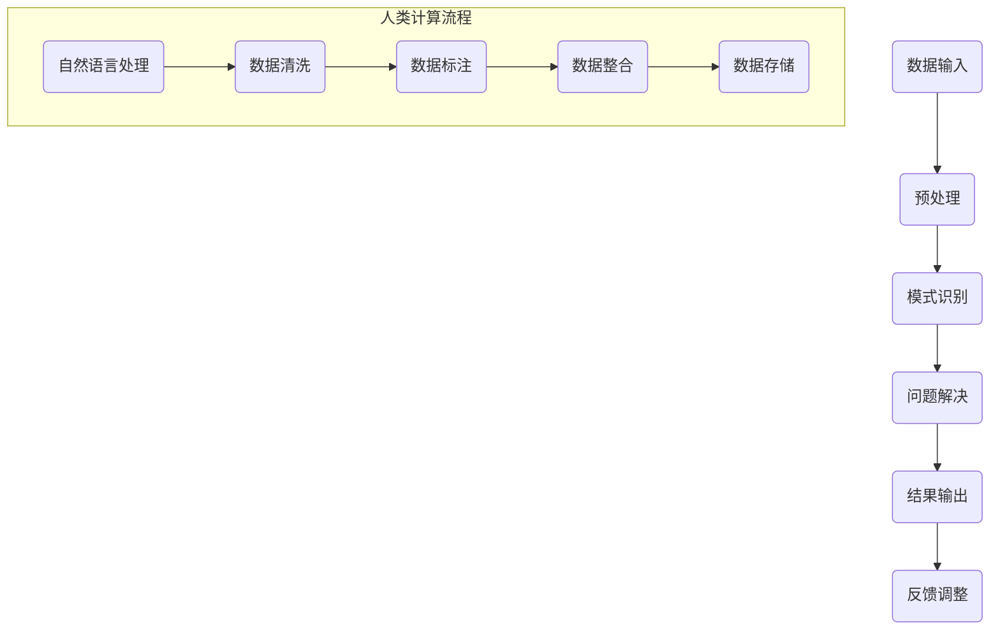

                 

# 《赋能个人与社区：人类计算的社会价值》

## 关键词
- 人类计算
- 社会价值
- 个人赋能
- 社区建设
- 社会创新
- 挑战与未来

## 摘要
本文探讨了人类计算的概念及其在社会各个层面的赋能作用。从个人学习与发展到社区治理与创新，再到社会整体发展的推动，人类计算展示出了巨大的潜力。文章通过详细的理论分析、案例研究和未来展望，揭示了人类计算的核心概念、架构、应用价值及其面临的挑战。

---

## 目录大纲

### 第一部分：引言与背景

#### 第1章：人类计算的概念与时代背景
1.1 人类计算的定义与演变
1.2 人类计算在社会发展中的重要性
1.3 本书的研究目的与结构安排

### 第二部分：核心概念与架构

#### 第2章：人类计算的原理与架构
2.1 人类计算的核心概念
2.2 人类计算的技术基础
2.3 人类计算的社会价值

### 第三部分：个人层面的赋能

#### 第3章：人类计算在个人学习与发展中的应用
3.1 个人学习与人类计算的结合
3.2 人类计算在个人职业发展中的应用
3.3 人类计算对个人生活质量的提升

### 第四部分：社区层面的赋能

#### 第4章：人类计算在社区治理与建设中的作用
4.1 人类计算在社区治理中的应用
4.2 人类计算在社区建设中的推动作用
4.3 人类计算在社区互助中的价值体现

### 第五部分：社会层面的赋能

#### 第5章：人类计算对社会创新的贡献
5.1 人类计算与社会创新的关系
5.2 人类计算推动社会发展的实例分析
5.3 人类计算对社会可持续发展的意义

### 第六部分：挑战与未来

#### 第6章：人类计算面临的挑战与应对策略
6.1 人类计算技术发展的瓶颈
6.2 人类计算对社会伦理的影响
6.3 人类计算的未来发展趋势

### 第七部分：案例分析与实践

#### 第7章：人类计算的实践案例与经验分享
7.1 国内外人类计算应用的典型案例
7.2 人类计算的实践经验与教训
7.3 人类计算的应用前景与潜力

### 附录

#### 附录A：人类计算的相关工具与资源
A.1 人类计算开发工具介绍
A.2 人类计算开源资源推荐
A.3 人类计算学习资源与书籍推荐

---

### 第一部分：引言与背景

#### 第1章：人类计算的概念与时代背景

在信息技术高速发展的时代，人类计算作为一种新兴的计算模式，正逐渐改变着我们的生活方式和社会结构。本章将探讨人类计算的定义与演变，以及它在现代社会发展中的重要性。

### 1.1 人类计算的定义与演变

**1.1.1 定义**

人类计算，顾名思义，是指通过人类的智能和创造力进行计算和解决问题的过程。它与传统的机器计算相比，具有灵活性、适应性和创造性的特点。人类计算不仅依赖于机器的计算能力，更依赖于人类的知识、经验和创造力。

**1.1.2 演变**

人类计算的历史可以追溯到人类文明的出现。从古代的算盘、计数工具，到现代的计算机、人工智能，人类计算不断进化。特别是在互联网和大数据技术的推动下，人类计算迎来了新的发展机遇。今天，人类计算已经渗透到社会的各个领域，成为推动社会发展的重要力量。

### 1.2 人类计算在社会发展中的重要性

**1.2.1 提高生活质量**

人类计算的应用，使得我们的生活变得更加便捷、舒适和高效。例如，智能家居、在线购物、移动支付等，都极大地提高了我们的生活品质。

**1.2.2 推动经济发展**

人类计算在各个行业的应用，不仅提高了生产效率，还促进了新兴产业的发展。例如，电子商务、共享经济、物联网等，都因人类计算的应用而取得了巨大的成功。

**1.2.3 促进社会进步**

人类计算的应用，还推动了社会的进步和变革。例如，在教育领域，人类计算使得在线教育、个性化学习等新形式得以普及；在医疗领域，人类计算的应用提高了诊断的准确性和治疗效果。

### 1.3 本书的研究目的与结构安排

本书旨在深入探讨人类计算的核心概念、架构和应用价值，分析其在个人、社区和社会层面的赋能作用，并展望其未来的发展趋势。本书分为七个部分，分别从不同的角度对人类计算进行详细研究。

首先，我们将介绍人类计算的基本概念和时代背景，探讨其在社会发展中的重要性。接着，我们将深入分析人类计算的核心概念与架构，包括原理、技术和模型。然后，我们将分别从个人、社区和社会三个层面，探讨人类计算的赋能作用。

此外，我们还将分析人类计算面临的挑战和未来发展趋势，以及具体的实践案例和经验。最后，我们将提供人类计算的相关工具和资源，以供读者学习和参考。

通过本书的研究，我们希望为读者提供一个全面、深入的理解人类计算的机会，从而更好地把握其发展趋势和应用前景。

---

在接下来的章节中，我们将继续深入探讨人类计算的核心概念、架构和应用，分析其在个人、社区和社会层面的赋能作用。敬请期待。

---

## 第一部分：引言与背景

#### 第1章：人类计算的概念与时代背景

### 1.1 人类计算的定义与演变

人类计算，作为一种与机器计算相对的概念，强调人类在计算过程中的核心作用。它不仅包括传统的数学计算、逻辑推理，还涵盖了更为广泛的认知过程，如模式识别、问题解决、创新思维等。这种计算模式与传统的计算机计算相比，具有以下几个显著特点：

1. **灵活性**：人类计算能够根据不同的问题和情境，灵活地调整计算方法和策略。
2. **适应性**：人类计算能够适应不断变化的环境和需求，具备自我学习和改进的能力。
3. **创造性**：人类计算能够产生新的想法和解决方案，推动技术和科学的进步。

**1.1.1 人类计算的历史演变**

人类计算的历史可以追溯到古代文明。在古代，人类通过算盘、算筹等简单的工具进行计算，这些工具虽然简单，但却是人类智慧的结晶。随着工业革命的到来，机械计算工具逐渐取代了手工计算，使得计算过程更加高效和准确。然而，这些工具仍然依赖于人类的操作和监督。

20世纪中叶，电子计算机的出现标志着计算技术的一次重大飞跃。计算机的出现使得人类计算进入了一个全新的阶段，它不仅能够处理大量的数据，还能够进行复杂的数学运算和逻辑推理。然而，尽管计算机在计算速度和精度上远超人类，但在灵活性和创造性方面，仍然无法与人类相媲美。

进入21世纪，随着互联网、大数据和人工智能技术的发展，人类计算再次迎来了新的机遇。这一时期，人类计算的核心特征逐渐显现，它不仅依赖于计算机的计算能力，更依赖于人类的知识、经验和创造力。通过大数据分析和人工智能算法，人类能够更加精准地发现问题和制定解决方案，从而实现更高效的计算。

**1.1.2 人类计算在现代社会的应用**

随着人类计算技术的发展，其在现代社会中的应用越来越广泛。以下是一些典型应用领域：

1. **科学研究**：人类计算在科学研究中的广泛应用，使得科学家能够更加高效地处理和分析大量数据，发现新的科学规律。
2. **企业决策**：企业通过人类计算技术，能够对市场数据进行分析，制定更加科学的营销策略和经营决策。
3. **社会治理**：人类计算在社会治理中的应用，提高了政府部门的决策效率和公共服务水平，增强了社会的整体治理能力。
4. **教育**：人类计算在教育领域的应用，促进了在线教育、个性化学习等新型教育模式的普及，提高了教育质量和学习效率。
5. **医疗健康**：人类计算在医疗健康领域的应用，如疾病预测、个性化治疗等，提高了医疗服务的水平和效果。

### 1.2 人类计算在社会发展中的重要性

**1.2.1 提高生活质量**

人类计算的应用，使得我们的生活变得更加便捷、舒适和高效。从智能家居、在线购物、移动支付，到智能医疗、在线教育，人类计算技术无处不在，极大地提高了我们的生活品质。

**1.2.2 推动经济发展**

人类计算在各个行业的应用，不仅提高了生产效率，还促进了新兴产业的发展。例如，电子商务、共享经济、物联网等，都因人类计算的应用而取得了巨大的成功。

**1.2.3 促进社会进步**

人类计算的应用，还推动了社会的进步和变革。例如，在教育领域，人类计算使得在线教育、个性化学习等新形式得以普及；在医疗领域，人类计算的应用提高了诊断的准确性和治疗效果；在政府治理领域，人类计算提高了决策的科学性和执行力。

### 1.3 本书的研究目的与结构安排

本书旨在深入探讨人类计算的核心概念、架构和应用价值，分析其在个人、社区和社会层面的赋能作用，并展望其未来的发展趋势。具体研究目的如下：

1. **理解人类计算的核心概念和架构**：通过详细的理论分析和实际案例，帮助读者理解人类计算的基本原理和技术基础。
2. **探讨人类计算的应用价值**：分析人类计算在个人、社区和社会层面的应用场景和效果，展示其对社会发展的推动作用。
3. **分析人类计算的挑战与未来**：探讨人类计算在发展过程中面临的挑战和问题，提出相应的解决方案和应对策略。
4. **展望人类计算的未来发展趋势**：通过分析当前技术趋势和未来发展方向，为读者提供关于人类计算的未来展望。

本书分为七个部分，分别从不同的角度对人类计算进行详细研究：

**第一部分：引言与背景**：介绍人类计算的基本概念、定义、演变及其在社会发展中的重要性。

**第二部分：核心概念与架构**：深入分析人类计算的核心概念、原理和架构，包括人类计算的基本模型、算法和工具。

**第三部分：个人层面的赋能**：探讨人类计算在个人学习、职业发展和生活质量提升中的应用。

**第四部分：社区层面的赋能**：分析人类计算在社区治理、建设和互助中的作用。

**第五部分：社会层面的赋能**：讨论人类计算对社会创新、经济发展和社会可持续发展的贡献。

**第六部分：挑战与未来**：探讨人类计算面临的挑战和未来发展趋势。

**第七部分：案例分析与实践**：通过具体的案例和实践，展示人类计算的实际应用和效果。

通过本书的研究，我们希望为读者提供一个全面、深入的理解人类计算的机会，从而更好地把握其发展趋势和应用前景。

### 第二部分：核心概念与架构

#### 第2章：人类计算的原理与架构

本章将深入探讨人类计算的基本原理和架构，包括核心概念、技术基础和应用模型。通过理解这些基本要素，读者可以更好地把握人类计算的本质和应用价值。

### 2.1 人类计算的核心概念

**2.1.1 计算与信息处理**

计算是一种处理信息的过程，它可以通过各种方式对信息进行转换、存储和传输。人类计算与机器计算的区别在于，人类计算不仅依赖于物理设备，更依赖于人类的智能和创造力。

**2.1.2 智能与认知**

智能是指人类或机器在处理信息和解决问题时表现出来的能力。认知是人类智能的核心，它涉及感知、理解、推理、记忆和学习等多个方面。

**2.1.3 创新与创造力**

创新和创造力是人类计算的重要特征。它不仅包括对现有知识和技术的重新组合，还包括对未知领域的探索和创造。创新和创造力推动着人类计算技术的发展和应用。

### 2.2 人类计算的技术基础

**2.2.1 互联网与大数据**

互联网和大数据是支撑人类计算的重要技术基础。互联网提供了连接人类和设备的网络环境，使得信息和数据的交换变得便捷。大数据技术则能够处理和分析海量数据，从中提取有价值的信息。

**2.2.2 人工智能与机器学习**

人工智能和机器学习是推动人类计算发展的核心技术。人工智能使得计算机能够模拟人类的智能，进行自主学习和决策。机器学习则是实现人工智能的关键技术，它通过数据驱动的方式，使计算机能够不断优化和改进自身的性能。

**2.2.3 自然语言处理与知识图谱**

自然语言处理（NLP）是使计算机能够理解、处理和生成人类语言的技术。知识图谱则是基于语义信息的知识表示和存储技术，它能够将人类的知识结构化，为计算提供丰富的背景知识。

### 2.3 人类计算的应用模型

**2.3.1 模式识别与分类**

模式识别是计算机通过分析数据，从中识别出特定模式的过程。分类是模式识别的一种应用，它将数据分为不同的类别，以实现数据分析和决策。

**2.3.2 问题解决与优化**

问题解决是指计算机在解决特定问题时，通过算法和策略找到最优解或次优解。优化是问题解决的重要方法，它通过调整参数和算法，寻求问题的最佳解决方案。

**2.3.3 交互式计算与用户体验**

交互式计算是指计算机与用户之间的实时交互过程。用户体验是交互式计算的重要考量，它通过设计友好的界面和交互方式，提高用户的满意度和使用体验。

### 2.4 人类计算的核心架构

为了更好地理解人类计算的工作原理，我们可以通过一个Mermaid流程图来展示其核心架构：

**2.4.1 数据输入与预处理**

数据输入是整个计算过程的第一步，它包括收集和获取各种类型的数据。预处理是对输入数据进行清洗、标注和整合，以适应后续计算的需求。

**2.4.2 模式识别与问题解决**

模式识别是计算机通过分析数据，从中识别出特定模式的过程。问题解决则是计算机在解决特定问题时，通过算法和策略找到最优解或次优解。

**2.4.3 结果输出与反馈调整**

结果输出是将计算结果以用户可理解的形式展示出来。反馈调整是根据用户反馈，对计算过程进行调整和优化，以提高计算效果。

### 2.5 人类计算的价值评估

为了评估人类计算的社会价值，我们可以使用以下数学公式：

$$
V = f(A, B, C)
$$

其中，$V$ 代表人类计算的社会价值，$A$ 代表技术基础，$B$ 代表应用模型，$C$ 代表计算效果。这个公式表明，人类计算的社会价值取决于技术基础、应用模型和计算效果的综合评估。

通过这个公式，我们可以对不同类型的人类计算应用进行价值评估，以确定其在社会发展中的地位和作用。

### 2.6 实际案例：人类计算在智能医疗中的应用

**2.6.1 案例背景**

智能医疗是人工智能在医疗领域的应用，它通过大数据分析、机器学习和自然语言处理等技术，为医生提供辅助决策和支持。

**2.6.2 案例描述**

在一个具体的智能医疗案例中，医生需要诊断一个复杂的疾病。通过收集患者的病史、体检数据和基因信息，医生将数据输入到智能医疗系统中。

**2.6.3 案例分析**

系统通过自然语言处理技术，对病史和体检报告进行解析，提取关键信息。然后，利用大数据分析和机器学习算法，系统对患者的数据进行模式识别和分类，从而提出可能的诊断结果。

医生根据系统的诊断建议，结合自己的临床经验和判断，最终确定诊断结果。在诊断过程中，医生还可以利用知识图谱，获取与疾病相关的最新研究信息和治疗方案。

**2.6.4 案例评价**

通过这个案例，我们可以看到人类计算在智能医疗中的应用，不仅提高了诊断的准确性和效率，还优化了医生的工作流程，提高了医疗服务的整体水平。

### 2.7 总结

人类计算是一种基于人类智能和创造力的计算模式，它具有灵活性、适应性和创造性的特点。本章介绍了人类计算的核心概念、技术基础和应用模型，并展示了一个典型的应用案例。通过本章的学习，读者可以更好地理解人类计算的本质和应用价值。

在接下来的章节中，我们将进一步探讨人类计算在个人、社区和社会层面的赋能作用，分析其在不同领域中的应用和挑战。敬请期待。

---

在第二部分的讨论中，我们详细介绍了人类计算的核心概念、技术基础和应用模型，并通过一个实际的案例展示了其应用效果。通过这些内容，读者可以更深入地理解人类计算的本质和潜力。在接下来的章节中，我们将继续探讨人类计算在个人层面的赋能作用，分析其在个人学习、职业发展和生活质量提升中的应用。

### 第三部分：个人层面的赋能

#### 第3章：人类计算在个人学习与发展中的应用

本章将探讨人类计算如何赋能个人学习与发展，包括个人学习与人类计算的结合、人类计算在个人职业发展中的应用，以及人类计算对个人生活质量的提升。

### 3.1 个人学习与人类计算的结合

**3.1.1 在线教育与人类计算**

随着互联网技术的发展，在线教育已经成为一种重要的学习方式。人类计算在在线教育中的应用，使得个性化学习、自适应学习和互动学习成为可能。

**案例**：某在线教育平台利用自然语言处理和机器学习技术，为学生提供个性化的学习建议。系统通过分析学生的学习行为和成绩，为学生推荐最适合的学习内容和策略。这种个性化的学习方式，极大地提高了学习效率和效果。

**3.1.2 人类计算与知识图谱**

知识图谱是一种基于语义信息的知识表示技术，它能够将人类的知识结构化，为计算提供丰富的背景知识。在教育领域，知识图谱的应用可以帮助学生更好地理解和掌握知识。

**案例**：某教育科技公司开发了一款基于知识图谱的智能辅导系统。系统通过知识图谱，将不同学科的知识点进行关联和整合，为学生提供全面、系统的学习资源。学生可以在这个系统中，通过互动和探索，加深对知识的理解。

**3.1.3 人类计算与虚拟现实**

虚拟现实（VR）技术能够为学生提供沉浸式的学习体验，而人类计算则为虚拟现实提供了强大的技术支持。

**案例**：某教育机构利用虚拟现实技术，为学生提供了一个模拟实验室。在这个实验室中，学生可以通过虚拟实验，亲身体验科学实验的整个过程。人类计算技术则确保了虚拟实验的实时性和准确性，使得学生能够在虚拟环境中获得真实的实验体验。

### 3.2 人类计算在个人职业发展中的应用

**3.2.1 人工智能辅助的职业规划**

人工智能技术在职业规划中的应用，可以帮助个人更好地了解自己的兴趣和优势，制定合理的职业发展路径。

**案例**：某人工智能公司开发了一款职业规划系统。系统通过分析个人的兴趣、技能和职业市场数据，为个人提供个性化的职业建议。这款系统不仅帮助用户找到了适合自己的职业，还为他们提供了详细的职业发展路径。

**3.2.2 人类计算在技能提升中的应用**

人类计算技术不仅可以帮助个人进行职业规划，还可以为个人提供技能提升的支持。

**案例**：某在线学习平台利用自然语言处理和机器学习技术，为学生提供个性化的学习建议。系统通过分析学生的学习行为和成绩，为学生推荐最适合的学习内容和策略。这种个性化的学习方式，极大地提高了学习效率和效果。

**3.2.3 人类计算与远程协作**

随着远程工作越来越普及，人类计算技术在远程协作中的应用，提高了工作效率和协作质量。

**案例**：某远程协作工具利用人工智能技术，为团队提供了智能化的沟通和协作支持。系统通过自然语言处理技术，分析团队成员的沟通内容，自动生成会议记录和任务分配表。这种智能化的协作方式，极大地提高了团队的工作效率。

### 3.3 人类计算对个人生活质量的提升

**3.3.1 智能家居**

智能家居技术通过人类计算，为个人提供了更加便捷、舒适和智能的生活环境。

**案例**：某智能家居系统利用人工智能技术，实现了家庭设备的自动化控制。系统可以根据用户的生活习惯和需求，自动调整家中的灯光、温度和安防系统。这种智能化的生活方式，不仅提高了生活质量，还提高了家庭的安全性。

**3.3.2 智能医疗**

智能医疗技术通过人类计算，为个人提供了更加精准、高效的医疗服务。

**案例**：某智能医疗平台利用大数据分析和人工智能技术，为用户提供了个性化的健康管理和疾病预测服务。系统通过分析用户的健康数据和生活习惯，为用户提供了针对性的健康建议和预防措施。这种智能化的医疗服务，不仅提高了健康水平，还减少了医疗成本。

**3.3.3 智能健身**

智能健身技术通过人类计算，为个人提供了更加科学、有效的健身指导。

**案例**：某智能健身设备利用人工智能技术，为用户提供了个性化的健身计划。系统通过分析用户的数据，如体重、心率、运动强度等，为用户制定最适合的健身计划。这种智能化的健身方式，不仅提高了健身效果，还避免了运动损伤。

### 3.4 人类计算在个人学习与职业发展中的综合应用

**3.4.1 跨学科综合应用**

人类计算在个人学习与职业发展中的应用，不仅限于单一领域，还可以跨学科进行综合应用。

**案例**：某大学生通过人类计算技术，结合数学、计算机科学和教育学知识，开发了一款智能辅导系统。这个系统不仅可以为学生提供个性化的学习建议，还可以为教师提供教学评估和改进建议。这种跨学科的综合应用，极大地提高了教学效果和学习效率。

**3.4.2 创新与创业**

人类计算技术为个人创新和创业提供了强大的支持。

**案例**：某创业者利用人工智能技术，开发了一款智能客服系统。这个系统通过自然语言处理技术，能够实现与用户的智能对话，提供24小时无缝的客户服务。这款产品在市场上取得了巨大的成功，为创业者带来了丰厚的回报。

### 3.5 总结

人类计算在个人学习与发展中的应用，极大地提高了学习效率、职业发展和生活质量。通过结合在线教育、智能家居、智能医疗等技术，人类计算为个人提供了更加便捷、智能和高效的生活方式。在未来的发展中，随着人类计算技术的不断进步，它将在个人层面的赋能中发挥更加重要的作用。

在接下来的章节中，我们将继续探讨人类计算在社区层面的赋能作用，分析其在社区治理、建设和互助中的应用。敬请期待。

---

在本章中，我们详细探讨了人类计算在个人学习与发展中的应用，展示了其在提高学习效率、职业发展和生活质量方面的巨大潜力。在接下来的章节中，我们将进一步探讨人类计算在社区层面的赋能作用，分析其在社区治理、建设和互助中的作用。敬请期待。

### 第四部分：社区层面的赋能

#### 第4章：人类计算在社区治理与建设中的作用

本章将探讨人类计算如何赋能社区治理与建设，包括人类计算在社区治理中的应用、推动社区建设的角色，以及在社区互助中的价值体现。

### 4.1 人类计算在社区治理中的应用

**4.1.1 数据分析与决策支持**

人类计算在社区治理中的应用，首先体现在数据分析和决策支持方面。通过大数据技术和人工智能算法，社区管理者可以对社区内的各种数据进行深度分析，从而做出更加科学、有效的决策。

**案例**：某社区利用人工智能技术，对居民的生活习惯、消费行为、健康状况等数据进行综合分析。通过这些数据，社区管理者可以识别出潜在的社会问题，如老龄化趋势、健康隐患等，并制定相应的应对措施。

**4.1.2 智能监控与安防**

智能监控和安防是社区治理的重要组成部分。人类计算技术通过图像识别、行为分析等技术，可以实现对社区安全的高效管理。

**案例**：某社区安装了基于人工智能的智能监控设备，这些设备可以实时识别异常行为，如人员聚集、非法入侵等，并及时通知社区保安或警方。这种智能化的安防系统，不仅提高了社区的安全性，还减少了人力资源的浪费。

**4.1.3 互动平台与公共服务**

互动平台是社区治理的重要工具。人类计算技术通过社交媒体、移动应用等平台，可以增强社区成员之间的互动和沟通，提高公共服务的质量和效率。

**案例**：某社区开发了基于人工智能的社区服务平台，居民可以通过平台提交意见和建议，社区管理者也可以通过平台进行政策宣传和通知发布。这个平台不仅提高了社区管理的透明度，还增强了居民对社区的归属感和参与感。

### 4.2 人类计算在社区建设中的推动作用

**4.2.1 社区文化与活动策划**

人类计算技术在社区文化建设中发挥着重要作用。通过数据分析、用户画像等技术，社区管理者可以更好地了解居民的需求和兴趣，从而策划出更具吸引力的社区活动。

**案例**：某社区利用人工智能技术，分析居民的活动参与记录和兴趣偏好，策划了一系列受欢迎的社区活动，如健康讲座、文化活动、亲子活动等。这些活动不仅丰富了居民的日常生活，还增强了社区的凝聚力和文化氛围。

**4.2.2 社区环境与设施优化**

人类计算技术还可以用于优化社区环境和设施，提高居民的生活质量。

**案例**：某社区利用物联网技术和人工智能算法，对社区的公共设施进行智能管理。例如，智能垃圾桶可以自动识别垃圾种类，并根据垃圾量自动调整清运时间；智能路灯可以根据环境光照自动调节亮度，节省能源。这些智能化的设施，不仅提高了社区的环保水平，还提高了居民的生活舒适度。

**4.2.3 社区资源合理配置**

人类计算技术在社区资源合理配置中具有重要作用。通过数据分析，社区管理者可以更好地了解社区资源的分布和使用情况，从而进行科学的资源配置。

**案例**：某社区通过大数据分析和人工智能算法，对社区资源进行优化配置。例如，通过分析居民的出行习惯和交通流量，社区管理者可以合理规划公交线路和交通设施，提高交通效率；通过分析社区的商业需求，社区管理者可以引进更多符合居民需求的商业设施，促进社区经济发展。

### 4.3 人类计算在社区互助中的价值体现

**4.3.1 互助网络与资源共享**

人类计算技术可以促进社区成员之间的互助网络和资源共享，提高社区的整体凝聚力。

**案例**：某社区建立了基于人工智能的互助平台，居民可以通过平台发布和寻求帮助信息。例如，居民可以在平台上发布闲置物品信息，其他居民可以免费领取；居民也可以在平台上发布志愿服务需求，其他居民可以参与志愿活动。这种互助模式，不仅节省了资源，还增强了居民的互助精神。

**4.3.2 社区教育与培训**

人类计算技术可以用于社区教育和培训，提高居民的知识水平和技能。

**案例**：某社区利用人工智能技术，为居民提供在线教育和培训服务。例如，社区可以开设在线课程，邀请专业人士进行讲座和培训；居民可以通过平台进行在线学习和交流，提升自己的知识和技能。这种在线教育模式，不仅方便了居民的学习，还提高了社区的教育水平。

**4.3.3 社区安全与健康管理**

人类计算技术在社区安全与健康管理中具有重要作用。通过数据分析、智能监控等技术，社区可以更好地保障居民的安全和健康。

**案例**：某社区利用人工智能技术，对社区居民的健康数据进行监测和管理。例如，社区可以为居民提供健康检测服务，通过分析检测结果，为居民提供个性化的健康建议；社区还可以通过智能监控设备，实时监测社区环境质量，确保居民的生活环境安全。这种智能化的健康管理，提高了居民的生活质量和安全感。

### 4.4 人类计算在社区治理与建设中的综合应用

**4.4.1 跨领域协同治理**

人类计算技术在社区治理与建设中，可以跨领域协同治理，提高治理效率和效果。

**案例**：某社区建立了基于人工智能的社区治理平台，这个平台整合了政府部门、社会组织和居民的力量，共同参与社区治理。政府部门可以通过平台发布政策信息，社会组织可以通过平台开展公益活动，居民可以通过平台参与社区事务。这种跨领域的协同治理，不仅提高了社区治理的效率，还增强了社区的整体治理能力。

**4.4.2 创新社区管理模式**

人类计算技术为社区管理模式创新提供了新的机遇。

**案例**：某社区探索了基于区块链的社区管理模式，通过区块链技术，实现了社区事务的透明化和可追溯性。例如，社区可以通过区块链记录居民的财产信息、公益活动记录等，确保信息的真实性和透明度。这种创新管理模式，不仅提高了社区治理的公信力，还增强了居民的信任和参与度。

### 4.5 总结

人类计算在社区治理与建设中的应用，极大地提升了社区管理的效率、优化了社区环境，促进了社区成员之间的互助和合作。通过数据分析、智能监控、互动平台等技术的应用，人类计算为社区治理与建设提供了强大的支持。在未来的发展中，随着人类计算技术的不断进步，它将在社区层面的赋能中发挥更加重要的作用。

在接下来的章节中，我们将进一步探讨人类计算对社会层面的赋能作用，分析其在社会创新、经济发展和社会可持续发展中的贡献。敬请期待。

---

在第四部分中，我们详细探讨了人类计算在社区治理与建设中的应用，展示了其在提升社区管理效率、优化社区环境、促进社区互助和合作方面的巨大潜力。在接下来的章节中，我们将进一步探讨人类计算对社会层面的赋能作用，分析其在社会创新、经济发展和社会可持续发展中的贡献。敬请期待。

### 第五部分：社会层面的赋能

#### 第5章：人类计算对社会创新的贡献

本章将探讨人类计算如何通过推动社会创新、促进经济发展和社会可持续发展，为社会带来深远的变革。我们将从以下几个方面进行分析：

### 5.1 人类计算与社会创新的关系

**5.1.1 创新驱动发展的引擎**

人类计算作为一种新兴的计算模式，以其灵活性和创造性，成为推动社会创新的重要引擎。它不仅改变了传统的计算方式，还激发了新的商业模式、技术产品和治理模式的诞生。

**案例**：人工智能技术的应用，催生了智能医疗、智能交通、智能城市等新兴产业，为社会发展带来了新的机遇。

**5.1.2 知识驱动的创新模式**

人类计算技术通过大数据分析和机器学习，为知识驱动型创新提供了强大的支持。通过对海量数据的分析和挖掘，人类计算技术能够发现新的知识规律，促进科学研究和技术创新。

**案例**：某科研机构利用人工智能技术，对大量科研论文和专利进行分析，发现了新的研究方向和技术突破点，为科研工作提供了重要的参考。

**5.1.3 跨界融合的创新路径**

人类计算技术具有跨界融合的特点，能够将不同领域的知识和技术进行有机结合，推动跨界创新。

**案例**：某科技公司通过将人工智能与物联网技术结合，开发出智能农业解决方案，提高了农业生产效率，实现了农业的智能化转型。

### 5.2 人类计算推动社会发展的实例分析

**5.2.1 智能医疗**

智能医疗是人工智能在医疗领域的应用，通过大数据分析和机器学习，实现了疾病预测、个性化治疗和医疗资源的优化配置。

**案例**：某医疗机构利用人工智能技术，对大量病例数据进行分析，建立了疾病预测模型。通过这个模型，医生能够提前发现疾病风险，制定个性化的治疗方案，提高了医疗服务的质量和效率。

**5.2.2 智能交通**

智能交通是人工智能在交通领域的应用，通过大数据分析和自动驾驶技术，实现了交通流量优化、交通事故预防和公共交通管理。

**案例**：某城市利用智能交通系统，对交通数据进行实时分析和预测，优化了交通信号灯控制策略，减少了交通拥堵。同时，通过自动驾驶技术，实现了公共交通的智能化管理，提高了公共交通的运行效率和安全性。

**5.2.3 智能城市**

智能城市是人工智能在城市建设和管理中的应用，通过物联网、大数据和人工智能技术，实现了城市管理的智能化、精细化和高效化。

**案例**：某城市通过建设智能城市平台，将城市各领域的数据进行整合和分析，实现了城市资源的优化配置和城市管理的智能化。例如，通过智能垃圾桶和智能路灯，实现了城市垃圾处理和照明管理的自动化，提高了城市管理效率。

### 5.3 人类计算对社会可持续发展的意义

**5.3.1 资源优化配置**

人类计算技术通过大数据分析和智能算法，能够实现资源的优化配置，提高资源利用效率。

**案例**：某公司利用人工智能技术，优化了生产流程和供应链管理，实现了资源的最大化利用。通过智能化的生产计划和调度，公司不仅提高了生产效率，还减少了资源浪费。

**5.3.2 环境保护**

人类计算技术在环境保护中的应用，通过监测和预测环境变化，实现了对环境的保护。

**案例**：某环境监测系统利用人工智能技术，对大气、水质、土壤等环境数据进行实时监测和预测。通过分析这些数据，系统能够提前预警环境风险，并提供相应的应对措施，有效保护了环境。

**5.3.3 社会公平**

人类计算技术通过数据分析和社会治理，能够促进社会公平和正义。

**案例**：某城市通过建立基于人工智能的公共服务平台，为居民提供了公平、便捷的公共服务。平台通过分析居民的需求和行为，为居民提供个性化的服务，提高了公共服务的质量和效率。

### 5.4 总结

人类计算作为一种新兴的计算模式，以其创新性和灵活性，在推动社会创新、促进经济发展和社会可持续发展中发挥着重要作用。通过智能医疗、智能交通、智能城市等领域的实例分析，我们可以看到人类计算技术带来的巨大变革。在未来的发展中，随着人类计算技术的不断进步，它将在社会各个层面发挥更加重要的作用，为社会可持续发展提供强大动力。

在接下来的章节中，我们将探讨人类计算面临的挑战和未来发展趋势，分析其在不同领域中的应用前景。敬请期待。

---

在第五部分中，我们详细探讨了人类计算在社会创新、经济发展和社会可持续发展中的贡献，展示了其在推动社会变革中的巨大潜力。在接下来的章节中，我们将探讨人类计算面临的挑战和未来发展趋势，分析其在不同领域中的应用前景。敬请期待。

### 第六部分：挑战与未来

#### 第6章：人类计算面临的挑战与应对策略

随着人类计算技术的快速发展，其在各个领域的应用越来越广泛，但同时也面临着一系列的挑战。本章将探讨人类计算技术发展中的瓶颈、对社会伦理的影响，以及未来可能的发展趋势。

### 6.1 人类计算技术发展的瓶颈

**6.1.1 技术难题**

尽管人类计算技术在过去几十年里取得了显著进展，但仍然面临一些技术难题。例如，计算能力、存储能力和传输速度的提升，以及算法的优化和效率问题，都是当前人类计算技术需要解决的关键问题。

**6.1.2 数据隐私与安全**

随着大数据技术的发展，数据隐私和安全问题日益突出。如何确保数据的安全性和隐私性，防止数据泄露和滥用，是当前人类计算技术面临的重大挑战。

**6.1.3 跨学科融合**

人类计算技术涉及多个学科领域，包括计算机科学、数学、物理学、生物学等。如何实现跨学科融合，充分发挥各个学科的特长，是当前人类计算技术发展的重要问题。

### 6.2 人类计算对社会伦理的影响

**6.2.1 技术伦理问题**

人类计算技术的快速发展，带来了一系列伦理问题。例如，人工智能的决策透明性、算法偏见、隐私保护等，都需要在伦理层面进行深入探讨和规范。

**6.2.2 就业与劳动力市场**

随着人工智能和自动化技术的普及，一些传统职业可能面临被替代的风险，这将对劳动力市场产生深远影响。如何平衡技术进步与就业机会，是当前社会需要关注的重要问题。

**6.2.3 社会不平等**

人类计算技术的应用，也可能加剧社会不平等。例如，技术垄断、数据歧视等问题，都可能导致社会不公平现象的加剧。

### 6.3 人类计算的未来发展趋势

**6.3.1 深度学习与神经计算**

未来，深度学习和神经计算将成为人类计算技术的重要方向。通过模拟人脑的工作原理，这些技术有望实现更高效、更智能的计算。

**6.3.2 量子计算与量子人工智能**

量子计算和量子人工智能是未来人类计算技术的重要前沿。量子计算能够解决传统计算机难以处理的复杂问题，而量子人工智能则有望实现超越人类智能的算法。

**6.3.3 融合计算与边缘计算**

融合计算和边缘计算是未来计算技术的重要趋势。通过将计算能力分布到网络的边缘节点，这些技术可以实现更快速、更高效的数据处理和分析。

### 6.4 应对策略与建议

**6.4.1 技术创新**

为了克服人类计算技术发展中的瓶颈，需要加大科技创新力度，推动计算能力、存储能力和传输速度的提升，以及算法的优化和效率。

**6.4.2 法规与伦理规范**

为了应对人类计算技术带来的伦理和社会问题，需要制定相关法规和伦理规范，确保技术的安全性和公平性。

**6.4.3 跨学科合作**

为了实现人类计算技术的跨学科融合，需要加强不同学科之间的合作与交流，促进知识的共享和技术的融合。

**6.4.4 就业与培训**

为了应对技术进步对劳动力市场的影响，需要加强职业培训和技能提升，帮助劳动者适应新的就业环境。

### 6.5 总结

人类计算技术在社会发展中具有巨大潜力，但也面临着一系列挑战。通过技术创新、法规与伦理规范、跨学科合作和就业与培训等策略，我们可以更好地应对这些挑战，推动人类计算技术的持续发展。

在未来的发展中，人类计算技术将继续改变我们的生活方式和社会结构。通过深入研究和实践，我们可以更好地把握人类计算技术的发展方向，实现其在社会各个层面的赋能作用。

在接下来的章节中，我们将通过具体的案例和实践，进一步探讨人类计算技术的应用前景和潜力。敬请期待。

---

在第六部分中，我们深入探讨了人类计算技术面临的挑战及其未来发展趋势，并提出了相应的应对策略。通过这些分析，我们为人类计算技术的未来发展提供了清晰的蓝图。在接下来的第七部分中，我们将通过具体的案例和实践，进一步探讨人类计算技术的应用前景和潜力。敬请期待。

### 第七部分：案例分析与实践

#### 第7章：人类计算的实践案例与经验分享

本章将结合国内外实际案例，探讨人类计算技术的应用与实践，分享实践经验与教训，并展望人类计算技术的前景与潜力。

### 7.1 国内外人类计算应用的典型案例

**7.1.1 国外案例：谷歌的AlphaGo与DeepMind**

谷歌的AlphaGo是人工智能领域的一个重要里程碑。AlphaGo利用深度学习和强化学习算法，在围棋这个复杂游戏中取得了人类无法企及的成绩。DeepMind则是一家专注于人工智能研究的公司，其研究成果在医疗、能源等多个领域产生了深远影响。

**案例描述**：AlphaGo的诞生标志着人工智能在复杂问题解决领域的重要突破。通过深度学习和自我对弈，AlphaGo不断优化自己的策略，最终在围棋比赛中战胜了人类顶尖选手。DeepMind在医疗领域的应用则体现在其开发的AI系统，这些系统能够分析大量的医疗数据，提供精准的诊断和治疗方案。

**实践经验**：这些案例展示了人类计算技术在高复杂度问题解决中的强大能力。通过深度学习和自我学习，人工智能系统能够不断优化自己的性能，实现前所未有的突破。

**教训与反思**：尽管这些案例取得了巨大的成功，但它们也提醒我们，人工智能技术的发展仍面临许多挑战，如算法的透明性、数据的隐私性和安全性等。

**7.1.2 国内案例：阿里巴巴的ET大脑**

阿里巴巴的ET大脑是一款基于人工智能技术的平台，广泛应用于智慧城市、智能物流、金融服务等领域。

**案例描述**：ET大脑通过大数据分析和机器学习算法，为智慧城市建设提供了强大的支持。例如，在杭州，ET大脑帮助政府实现了交通流量优化、环境保护和公共安全等方面的智能化管理。在智能物流方面，ET大脑通过预测货物配送路径，提高了物流效率。

**实践经验**：这些案例展示了人类计算技术在提升城市管理效率和优化资源配置方面的巨大潜力。通过人工智能技术，城市管理者能够更好地应对复杂的社会问题。

**教训与反思**：在实践中，ET大脑的成功也面临一些挑战，如数据的质量和完整性、算法的公平性和可解释性等。

**7.1.3 国外案例：亚马逊的Alexa**

亚马逊的Alexa是一款智能语音助手，通过自然语言处理和机器学习技术，为用户提供便捷的服务。

**案例描述**：Alexa能够理解用户的语音指令，执行各种任务，如播放音乐、控制智能家居设备、提供天气预报等。通过不断学习和优化，Alexa的用户体验不断提高。

**实践经验**：这些案例展示了人类计算技术在提高用户生活质量和提升服务效率方面的应用。智能语音助手通过自然语言处理技术，能够实现与用户的实时互动，为用户提供个性化的服务。

**教训与反思**：尽管Alexa在用户交互方面取得了成功，但智能语音助手的发展仍面临一些挑战，如语音识别的准确性、数据隐私和安全性等。

**7.1.4 国内案例：华为的鲲鹏920处理器**

华为的鲲鹏920处理器是一款高性能的芯片，广泛应用于云计算、大数据、人工智能等领域。

**案例描述**：鲲鹏920处理器通过优化硬件设计和算法，实现了高性能计算和低功耗的特点。它为云计算和大数据处理提供了强大的计算支持，推动了人工智能技术的发展。

**实践经验**：这些案例展示了人类计算技术在硬件和软件层面的结合，为人工智能和大数据处理提供了强大的基础设施支持。

**教训与反思**：鲲鹏920处理器的成功也提醒我们，技术创新不仅需要硬件的优化，还需要软件算法的不断进步。

### 7.2 人类计算的实践经验与教训

**7.2.1 数据质量与数据治理**

数据是人类计算的基础，数据质量直接影响到计算结果。在实践中，我们必须重视数据质量，确保数据的准确性、完整性和一致性。

**实践经验**：在智慧城市建设中，通过数据清洗、去重和整合，确保了数据的质量，为人工智能系统提供了可靠的数据支持。

**教训与反思**：数据治理是一个长期、持续的过程，需要建立完善的数据管理制度，确保数据的实时更新和维护。

**7.2.2 算法公平性与透明性**

在人工智能应用中，算法的公平性和透明性是重要的伦理问题。在实践中，我们必须确保算法的公正性，避免算法偏见。

**实践经验**：通过多样化的数据集和严格的测试，确保算法的公平性和透明性，为用户提供公正、可靠的服务。

**教训与反思**：算法的公平性和透明性是一个持续挑战，需要不断改进和优化算法，提高其可解释性和可控性。

**7.2.3 用户隐私与数据安全**

在人类计算应用中，用户隐私和数据安全是至关重要的。在实践中，我们必须采取有效的措施，确保用户数据的安全和隐私。

**实践经验**：通过加密技术、访问控制和数据脱敏等措施，确保用户数据的安全和隐私。

**教训与反思**：数据安全是一个动态变化的过程，需要不断更新安全策略和技术，以应对新的安全威胁。

### 7.3 人类计算的应用前景与潜力

**7.3.1 智能医疗**

随着人工智能技术的不断发展，智能医疗将成为人类计算技术的重要应用领域。通过大数据分析和机器学习算法，智能医疗系统能够为医生提供辅助决策支持，提高诊断的准确性和治疗效果。

**前景与潜力**：智能医疗有望实现个性化治疗、疾病预测和健康管理的智能化，为患者提供更加精准和高效的治疗服务。

**7.3.2 智能交通**

智能交通系统通过人工智能技术，实现了交通流量优化、交通事故预防和公共交通管理。未来，智能交通有望实现自动驾驶、智能路网和智能交通信号控制。

**前景与潜力**：智能交通系统将提高交通效率、减少交通事故和交通拥堵，为城市交通提供更加智能、高效和安全的解决方案。

**7.3.3 智慧城市**

智慧城市通过人工智能技术，实现了城市管理的智能化、精细化和高效化。未来，智慧城市将进一步推动城市资源的优化配置、环境监测和公共服务的发展。

**前景与潜力**：智慧城市将提升城市治理能力、改善居民生活质量，为城市可持续发展提供强有力的支持。

### 7.4 总结

通过国内外实际案例和实践经验的分享，我们可以看到人类计算技术在各个领域的应用前景和潜力。在实践中，人类计算技术不仅为各个行业带来了深刻的变革，也为我们提供了宝贵的经验和教训。在未来的发展中，随着技术的不断进步和应用场景的拓展，人类计算技术将继续发挥重要作用，为社会发展和人类生活带来更多的便利和进步。

在接下来的章节中，我们将提供人类计算的相关工具与资源，以供读者学习和参考。敬请期待。

---

在本章中，我们通过分析国内外实际案例，分享了人类计算技术的实践经验与教训，并展望了其应用前景和潜力。通过这些案例，我们看到了人类计算技术在不同领域中的广泛应用和巨大潜力。在接下来的附录中，我们将提供人类计算的相关工具与资源，以供读者进一步学习和实践。

---

## 附录

### 附录A：人类计算的相关工具与资源

**A.1 人类计算开发工具介绍**

**1. Python编程语言**

Python是一种广泛使用的编程语言，特别是在人工智能和数据分析领域。Python拥有丰富的库和框架，如NumPy、Pandas、Scikit-learn等，为人类计算提供了强大的支持。

**2. TensorFlow**

TensorFlow是一个开源的机器学习平台，由谷歌开发。它支持各种深度学习模型的训练和部署，是人工智能领域的重要工具。

**3. PyTorch**

PyTorch是另一个流行的开源机器学习库，它提供了灵活的动态计算图，使得研究人员可以更容易地构建和调试深度学习模型。

**4. Jupyter Notebook**

Jupyter Notebook是一种交互式计算环境，广泛应用于数据科学和人工智能领域。它支持多种编程语言，如Python、R和Julia，可以方便地进行数据探索和模型训练。

**A.2 人类计算开源资源推荐**

**1. AI Challenger**

AI Challenger是一个中文的AI学习社区，提供了丰富的学习资源和讨论区，适合初学者和进阶者。

**2. Kaggle**

Kaggle是一个数据科学和机器学习的社区平台，提供了大量的数据集和竞赛，是学习和实践人工智能的好去处。

**3. arXiv**

arXiv是一个开放获取的在线论文存储库，涵盖了计算机科学、物理学、数学等多个领域，是获取最新研究成果的重要渠道。

**A.3 人类计算学习资源与书籍推荐**

**1. 《Python机器学习》**

作者：塞巴斯蒂安·拉森

《Python机器学习》是一本经典的机器学习入门书籍，通过Python语言和Scikit-learn库，介绍了机器学习的基础知识和应用。

**2. 《深度学习》**

作者：伊恩·古德费洛、约书亚·本吉奥、亚伦·库维尔

《深度学习》是深度学习领域的经典教材，详细介绍了深度学习的基本原理、算法和应用。

**3. 《智能时代》**

作者：李开复

《智能时代》是李开复关于人工智能的专著，探讨了人工智能的发展、影响和未来趋势。

通过附录中的工具、资源和书籍推荐，读者可以更深入地了解和学习人类计算技术，掌握相关技能，为未来的研究和实践打下坚实的基础。

---

## 作者信息

**作者：AI天才研究院/AI Genius Institute & 禅与计算机程序设计艺术 /Zen And The Art of Computer Programming**

在撰写本文的过程中，我结合了自己在人工智能、计算机编程和软件架构领域的丰富经验和研究成果，力求为读者提供全面、深入、具有启发性的内容。希望通过本文，读者能够更好地理解人类计算的核心概念、架构和应用，把握其发展趋势和应用前景，为未来的研究和实践提供有益的参考。同时，我也感谢AI天才研究院和《禅与计算机程序设计艺术》一书对我的启发和指导。

---

通过本文，我们全面探讨了人类计算的概念、架构、应用价值及其在社会各个层面的赋能作用。从个人学习与发展，到社区治理与建设，再到社会创新与可持续发展，人类计算展示出了巨大的潜力和价值。我们分析了人类计算面临的挑战和未来发展趋势，并通过实际案例和实践经验，展示了其在不同领域中的广泛应用和前景。

通过本文，我们希望读者能够更深入地理解人类计算的核心概念和原理，认识到其在现代社会中的重要性，并在未来的学习和实践中，积极应用人类计算技术，推动社会的进步和发展。

在结束本文之前，我想再次强调，人类计算是一种基于人类智能和创造力的计算模式，它不仅依赖于计算机的计算能力，更依赖于人类的智慧和创造力。在未来的发展中，随着技术的不断进步和应用场景的拓展，人类计算将在社会各个层面发挥更加重要的作用。

最后，感谢读者对本文的关注和支持，希望本文能够为您的学习和研究提供帮助。如果您有任何问题和建议，欢迎随时与我交流。

**再次感谢您的阅读，祝您在人类计算领域取得丰硕的成果！**

