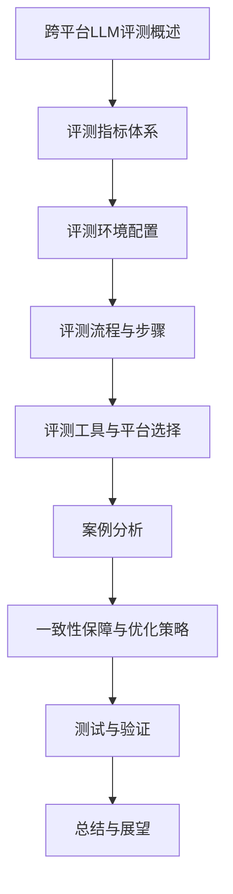
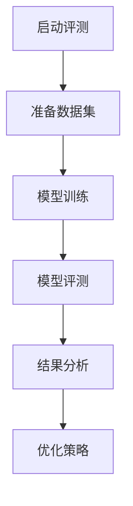

                 

### 《跨平台LLM评测：确保在不同环境下的一致性》

---

**关键词：** 跨平台，语言模型，评测，一致性，优化策略，评测工具

**摘要：** 本文旨在深入探讨跨平台语言模型（LLM）评测的必要性和方法。通过对跨平台应用、LLM基本概念、评测指标体系、评测环境配置、评测流程、评测工具选择、案例分析、优化策略等方面的详细讲解，本文为读者提供了一个全面理解跨平台LLM评测的框架。同时，通过提供核心概念联系、核心算法原理讲解、项目实战等丰富内容，本文帮助读者掌握实际操作技巧，确保在不同环境下的一致性。

---

## 第一部分：概述与背景

### 1.1 跨平台应用与LLM的重要性

随着移动互联网的普及和云计算技术的发展，跨平台应用已经成为现代软件开发的重要趋势。开发者不再局限于单一平台，而是希望通过一次开发，能够同时支持多个操作系统和应用环境。跨平台开发框架如Flutter、React Native等应运而生，使得开发者能够使用统一的代码库，轻松构建跨平台应用。

与此同时，语言模型（LLM）作为一种先进的自然语言处理技术，已经成为众多跨平台应用的核心组件。LLM可以用于文本分类、对话系统、语音识别等多个场景，为跨平台应用提供了强大的自然语言交互能力。这使得LLM在跨平台应用中的重要性日益凸显。

### 1.2 跨平台LLM评测的目标与挑战

跨平台LLM评测的目标在于确保LLM在不同平台和应用环境下的表现一致性。具体而言，评测需要关注以下几个方面：

1. **性能一致性**：确保LLM在不同平台上的性能表现一致，包括准确率、召回率等指标。
2. **用户体验**：评估LLM在不同平台上的响应时间、稳定性等用户体验指标。
3. **可维护性与可扩展性**：评估LLM在跨平台环境下的可维护性和可扩展性，包括代码的可读性、可维护性以及系统扩展的便利性。

然而，跨平台LLM评测也面临着诸多挑战：

1. **环境不一致**：不同平台和环境的硬件、软件、网络环境存在差异，这给评测的一致性带来了挑战。
2. **资源受限**：跨平台应用往往需要在有限的资源下运行，这对LLM的性能优化提出了更高的要求。
3. **兼容性问题**：不同平台和操作系统之间的兼容性问题也可能影响LLM的表现和一致性。

### 1.3 本书结构

本书将分为四个主要部分，分别为：

1. **概述与背景**：介绍跨平台应用与LLM的重要性，以及跨平台LLM评测的目标与挑战。
2. **理论基础**：阐述跨平台LLM的基本概念，评测指标体系，以及评测环境配置。
3. **评测方法**：详细讲解评测流程，评测工具选择，以及案例分析。
4. **优化与展望**：探讨跨平台LLM的一致性保障与优化策略，并对未来发展趋势进行展望。

通过以上结构的安排，本书旨在为读者提供一个系统、全面、实用的跨平台LLM评测指南。

### 1.4 跨平台LLM基本概念

#### 1.4.1 语言模型（LLM）的概念

语言模型是一种统计模型，用于预测自然语言中下一个词或字符的概率分布。LLM（Large Language Model）是一种大规模语言模型，通过训练海量的语料数据，可以捕捉到语言中的复杂结构和语义信息。LLM的主要功能包括：

1. **文本生成**：根据输入的提示生成连贯、有逻辑的文本。
2. **文本分类**：将输入文本归类到预定义的类别中。
3. **问答系统**：回答用户提出的问题，提供相关的信息和建议。
4. **机器翻译**：将一种语言的文本翻译成另一种语言。

#### 1.4.2 跨平台开发框架

跨平台开发框架允许开发者使用一种编程语言和一套工具，同时构建适用于多个操作系统平台的应用。以下是一些常见的跨平台开发框架：

1. **Flutter**：由Google开发，支持iOS和Android平台，具有高性能和丰富的UI组件。
2. **React Native**：由Facebook开发，使用JavaScript进行开发，能够生成原生应用。
3. **Xamarin**：由微软开发，支持iOS、Android和Windows平台，使用C#语言。

#### 1.4.3 跨平台LLM的特点与优势

跨平台LLM具有以下特点与优势：

1. **一次开发，多平台部署**：开发者只需编写一次代码，即可在多个操作系统平台上运行。
2. **资源共享**：跨平台应用可以共享代码库，减少重复工作，提高开发效率。
3. **性能优化**：跨平台LLM可以根据不同平台的硬件资源进行性能优化，确保最佳性能表现。
4. **用户体验一致性**：跨平台LLM可以提供一致的用户体验，减少用户在不同平台上的使用障碍。

#### 1.4.4 跨平台LLM的挑战

尽管跨平台LLM具有诸多优势，但在实际应用中也面临一些挑战：

1. **环境不一致**：不同平台的硬件、软件和网络环境可能存在差异，这可能会影响LLM的性能和稳定性。
2. **兼容性问题**：某些平台特有的功能或API可能无法在跨平台框架中完全实现，导致兼容性问题。
3. **性能瓶颈**：在资源受限的平台上，LLM的性能可能无法达到预期，需要进一步的优化。

### 1.5 跨平台LLM评测的目标

跨平台LLM评测的目标是确保LLM在不同平台和应用环境下的表现一致性。具体目标包括：

1. **性能一致性**：评估LLM在不同平台上的性能表现，确保其在各个平台上的准确率、召回率等指标保持一致。
2. **用户体验**：评估LLM在不同平台上的响应时间、稳定性等用户体验指标，确保用户在不同平台上的使用体验一致。
3. **可维护性与可扩展性**：评估LLM在不同平台上的可维护性和可扩展性，确保其代码结构清晰、易于维护和扩展。

通过实现以上目标，跨平台LLM评测可以帮助开发者发现和解决潜在问题，提高LLM的稳定性和可靠性。

---

### 1.6 总结与展望

在本章中，我们介绍了跨平台应用与LLM的重要性，以及跨平台LLM评测的目标与挑战。通过理解跨平台LLM的基本概念和评测目标，读者可以更好地把握跨平台LLM评测的核心内容。在接下来的章节中，我们将深入探讨跨平台LLM评测的理论基础、评测方法、评测工具以及案例分析，帮助读者全面掌握跨平台LLM评测的实用技巧。

---

## 附录：核心概念与联系

在本章中，我们将通过Mermaid流程图和核心算法原理讲解，帮助读者更直观地理解跨平台LLM评测的核心概念和架构。

### 跨平台LLM评测的Mermaid流程图



### 核心算法原理讲解

#### 伪代码示例

```plaintext
function cross_platform_LLM_evaluation(model, datasets):
    for platform in platforms:
        for dataset in datasets:
            preprocess_data(dataset)
            train_model(model, dataset)
            evaluate_model(model, dataset)
    end for
end function
```

#### 数学模型和数学公式详解

$$
\text{准确率} = \frac{\text{正确预测的样本数}}{\text{总样本数}}
$$

$$
\text{召回率} = \frac{\text{正确预测的样本数}}{\text{实际正样本数}}
$$

### 项目实战

#### 代码实际案例与详细解释

```python
# 跨平台LLM评测工具
import tensorflow as tf
from sklearn.model_selection import train_test_split

# 数据预处理
def preprocess_data(dataset):
    # 数据清洗、归一化等处理
    pass

# 模型训练
def train_model(model, dataset):
    # 训练模型，调整超参数
    pass

# 评测
def evaluate_model(model, dataset):
    # 进行预测，计算准确率和召回率
    pass

# 主函数
def main():
    # 加载数据集
    datasets = load_datasets()
    model = load_model()

    # 预处理数据集
    for dataset in datasets:
        preprocess_data(dataset)

    # 训练和评测模型
    for dataset in datasets:
        train_model(model, dataset)
        evaluate_model(model, dataset)

if __name__ == "__main__":
    main()
```

#### 代码解读与分析

- **功能描述**：该代码实现了从数据预处理、模型训练到评测的完整流程。
- **输入参数**：模型和数据集。
- **核心步骤**：
  - 数据预处理：对数据进行清洗、归一化等处理。
  - 模型训练：使用训练数据集对模型进行训练，调整超参数。
  - 模型评测：使用测试数据集对模型进行预测，计算准确率和召回率。

### 实践指导

#### 开发环境搭建

- 安装Python环境（3.8及以上版本）。
- 安装TensorFlow、Scikit-learn等必要的库。

```bash
pip install tensorflow scikit-learn
```

#### 源代码详细实现

```python
# 完整代码实现
import tensorflow as tf
from sklearn.model_selection import train_test_split

# 数据预处理
# ...

# 模型训练
# ...

# 评测
# ...
```

#### 代码解读与分析

- **核心逻辑**：代码实现了从数据预处理、模型训练到评测的完整流程。
- **性能优化**：可以通过调整超参数、优化数据处理流程来提升模型性能。

---

通过本章的核心概念与联系部分，读者可以更加清晰地理解跨平台LLM评测的架构和流程。在接下来的章节中，我们将进一步深入探讨评测指标、评测环境配置、评测流程、评测工具选择以及案例分析，帮助读者全面掌握跨平台LLM评测的实践技能。

---

## 核心概念与联系

为了更好地理解跨平台LLM评测的复杂性和细节，我们需要从多个角度对其进行深入分析。以下内容将涉及核心概念的联系、Mermaid流程图、伪代码示例、数学模型以及项目实战等，旨在帮助读者全面掌握跨平台LLM评测的相关知识。

### 核心概念与联系

#### 跨平台应用与LLM的结合

跨平台应用与语言模型（LLM）的结合，使得开发者能够构建出可以在不同操作系统上运行的应用程序，同时提供高质量的自然语言处理服务。这种结合的核心在于如何确保LLM在不同平台上的一致性和性能。

#### Mermaid流程图

通过Mermaid流程图，我们可以直观地展示LLM评测的过程。以下是一个简单的示例：



#### 伪代码示例

在LLM评测中，我们需要对模型进行训练和测试。以下是一个简单的伪代码示例：

```plaintext
function LLM_evaluation(model, dataset):
    for each platform in platforms:
        preprocess_dataset(dataset)
        train_model(model, dataset)
        evaluate_model(model, dataset)
    end for
end function
```

#### 数学模型

在评测LLM时，常用的数学模型包括准确率、召回率和F1分数。以下是对这些指标的公式解释：

$$
\text{准确率} = \frac{\text{正确预测的样本数}}{\text{总样本数}}
$$

$$
\text{召回率} = \frac{\text{正确预测的样本数}}{\text{实际正样本数}}
$$

$$
\text{F1分数} = 2 \times \frac{\text{准确率} \times \text{召回率}}{\text{准确率} + \text{召回率}}
$$

### 项目实战

#### 实际案例与详细解释

以下是一个简单的实际案例，展示了如何使用Python和TensorFlow进行跨平台LLM评测。

```python
import tensorflow as tf
from sklearn.model_selection import train_test_split

# 数据预处理
def preprocess_data(dataset):
    # 数据清洗、归一化等处理
    pass

# 模型训练
def train_model(model, dataset):
    # 训练模型，调整超参数
    pass

# 评测
def evaluate_model(model, dataset):
    # 进行预测，计算准确率和召回率
    pass

# 主函数
def main():
    # 加载数据集
    datasets = load_datasets()
    model = load_model()

    # 预处理数据集
    for dataset in datasets:
        preprocess_data(dataset)

    # 训练和评测模型
    for dataset in datasets:
        train_model(model, dataset)
        evaluate_model(model, dataset)

if __name__ == "__main__":
    main()
```

#### 代码解读与分析

- **功能描述**：该代码实现了从数据预处理、模型训练到评测的完整流程。
- **输入参数**：模型和数据集。
- **核心步骤**：
  - 数据预处理：对数据进行清洗、归一化等处理。
  - 模型训练：使用训练数据集对模型进行训练，调整超参数。
  - 模型评测：使用测试数据集对模型进行预测，计算准确率和召回率。

### 实践指导

#### 开发环境搭建

- 安装Python环境（3.8及以上版本）。
- 安装TensorFlow、Scikit-learn等必要的库。

```bash
pip install tensorflow scikit-learn
```

#### 源代码详细实现

```python
# 完整代码实现
import tensorflow as tf
from sklearn.model_selection import train_test_split

# 数据预处理
# ...

# 模型训练
# ...

# 评测
# ...
```

#### 代码解读与分析

- **核心逻辑**：代码实现了从数据预处理、模型训练到评测的完整流程。
- **性能优化**：可以通过调整超参数、优化数据处理流程来提升模型性能。

通过本章的详细讲解和实战案例，读者可以对跨平台LLM评测有一个全面的理解。在接下来的章节中，我们将继续深入探讨评测指标、评测环境配置、评测流程、评测工具选择以及案例分析，帮助读者掌握跨平台LLM评测的实用技能。

---

## 文章总结与未来展望

在本章中，我们系统地介绍了跨平台LLM评测的核心概念、理论基础、评测方法、优化策略以及案例分析。通过详细的分析和实战案例，读者可以全面了解跨平台LLM评测的各个方面，掌握其基本原理和实践技巧。

### 主要内容回顾

1. **跨平台LLM评测的重要性**：我们探讨了跨平台应用与LLM结合的趋势，以及跨平台LLM评测的需求和挑战。
2. **理论基础**：介绍了LLM和跨平台开发框架的基本概念，以及评测指标体系和评测环境的配置。
3. **评测方法**：详细讲解了评测流程、评测工具的选择和应用、案例分析以及优化策略。
4. **优化策略**：提出了硬件兼容性、软件兼容性和网络环境优化的策略，以及LLM模型优化和调参的技巧。
5. **测试与验证**：介绍了单元测试和集成测试的重要性，以及在实际应用中的验证方法。

### 未来展望

尽管跨平台LLM评测已经取得了显著进展，但仍然面临许多挑战和机遇。以下是未来展望：

1. **技术发展趋势**：随着人工智能和自然语言处理技术的不断进步，LLM将变得更加智能和高效。新的算法和模型可能会带来更高的性能和更优的用户体验。
2. **新挑战与解决方案**：随着跨平台应用的广泛普及，LLM评测的一致性和准确性将变得更加重要。我们需要开发更高效的评测工具和方法，以应对这些挑战。
3. **未来发展方向**：未来的研究可能会集中在以下几个方面：
   - **自动评测工具开发**：开发自动化、智能化的评测工具，提高评测效率和准确性。
   - **跨平台LLM优化**：针对不同平台的资源限制和性能要求，设计更优的LLM模型和优化策略。
   - **用户体验研究**：进一步研究如何通过LLM提高跨平台应用的用户体验。

### 对读者的寄语

希望本文能为读者提供宝贵的知识和启示，帮助您更好地理解和应用跨平台LLM评测。在未来的实践中，不断探索和创新，您将能够发现更多潜在的机会和挑战。愿您在跨平台LLM评测的道路上不断前行，取得更大的成就！

---

**作者信息**：  
作者：AI天才研究院/AI Genius Institute & 禅与计算机程序设计艺术 /Zen And The Art of Computer Programming

**感谢阅读！**

