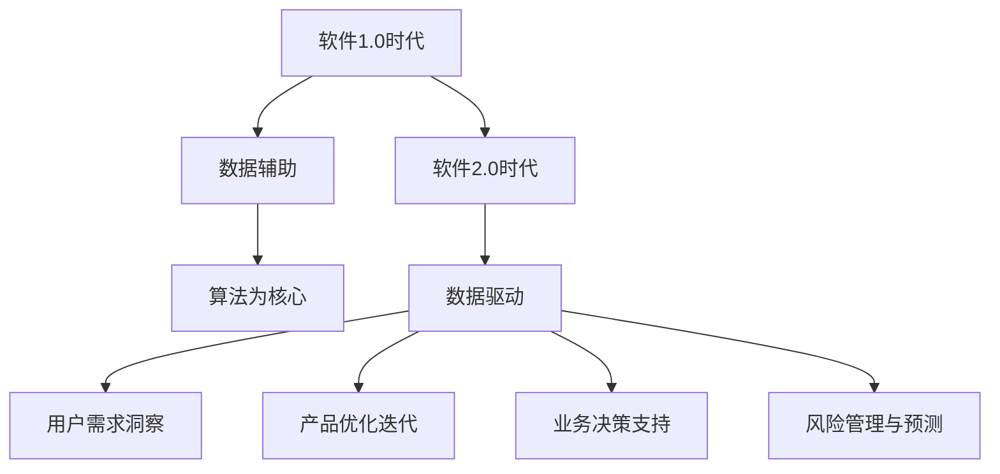

                 

## 软件2.0的时代：数据驱动一切

> **关键词**：软件2.0、数据驱动、AI、机器学习、大数据、开源生态

> **摘要**：本文旨在探讨软件2.0时代的数据驱动理念，分析其定义、历史演变、关键特性，以及数据驱动的技术基础和实践应用。我们将深入探讨数据科学、机器学习、大数据技术等领域的基础知识，探讨如何通过数据驱动产品设计与开发，探索创新模式，并讨论数据隐私与安全问题。最后，我们将展望软件2.0时代的发展趋势和未来教育、人才培养方向。

### 第一部分：软件2.0概述

#### 第1章：软件2.0的定义与历史演变

软件2.0时代是一个以数据为核心驱动的软件发展新时代。在1.0时代，软件主要依赖于代码和算法，而2.0时代则强调数据的价值和影响力。接下来，我们将探讨软件从1.0到2.0的转变过程，以及数据驱动的核心作用。

#### 1.1.1 软件发展历程

软件1.0时代是计算机发展的早期阶段，主要以编写和执行代码为主。在这一时期，软件的核心是算法和编程技术，而数据更多被视为输入和输出的一部分。随着计算机性能的提升和互联网的普及，软件1.0时代逐渐走向成熟，为2.0时代的到来奠定了基础。

软件2.0时代是一个以数据为中心的时代。在这一时期，数据的重要性得到了极大的提升，成为软件创新和发展的核心驱动力。数据驱动的软件开发模式、服务化与API化、开源生态的崛起等特性使得软件2.0时代具有独特的魅力。

#### 1.1.2 软件从1.0到2.0的转变

软件从1.0到2.0的转变主要体现在以下几个方面：

1. **数据价值的提升**：在1.0时代，数据被视为辅助信息，而2.0时代则强调数据本身的价值。通过对海量数据的收集、存储、分析和利用，数据成为软件创新的重要驱动力。

2. **数据驱动开发**：在2.0时代，软件开发不再仅仅依赖于代码和算法，而是通过数据驱动的方式来实现。数据驱动开发强调基于数据的用户需求分析和产品迭代，以提高软件的适应性和用户体验。

3. **服务化与API化**：在2.0时代，软件不再仅限于独立的程序，而是通过服务化和API化的方式实现模块化和互联互通。这使得软件可以更加灵活地集成和使用，为开发者提供了更广阔的创新空间。

4. **开源生态的崛起**：在2.0时代，开源生态成为软件发展的重要支撑。开源项目、开源社区和开源工具的蓬勃发展，为开发者提供了丰富的资源和支持，推动了软件创新和技术的普及。

#### 1.1.3 数据驱动的核心作用

数据驱动的核心作用主要体现在以下几个方面：

1. **用户需求的洞察**：通过收集和分析用户数据，软件开发者可以更好地了解用户需求和行为，从而实现个性化定制和精准营销。

2. **产品优化与迭代**：基于用户数据的反馈和分析，软件开发者可以不断优化和改进产品功能，提高用户满意度和市场竞争力。

3. **业务决策支持**：通过对业务数据的分析，企业可以更好地制定战略决策，优化业务流程，提高运营效率。

4. **风险管理与预测**：通过数据分析和预测模型，企业可以提前识别潜在的风险，采取相应的预防和应对措施。

总之，数据驱动的理念使得软件2.0时代具有了更高的灵活性和创新性，为软件行业的持续发展提供了新的动力和机遇。

---

**核心概念与联系**

软件从1.0到2.0的转变，可以形象地用以下Mermaid流程图来表示：



### 第2章：软件2.0的关键特性

软件2.0时代的关键特性体现在数据驱动开发、服务化与API化、开源生态的崛起以及平台与生态的重要性等方面。下面，我们将逐一探讨这些关键特性。

#### 2.1.1 数据驱动开发

数据驱动开发是软件2.0时代的重要特性之一。在数据驱动开发中，数据不仅是软件产品的输入和输出，更是软件开发的驱动力。通过数据分析和挖掘，开发者可以更好地了解用户需求，优化产品功能和用户体验。

**数据驱动开发的核心步骤如下：**

1. **数据收集**：通过各种方式收集用户数据，如用户行为数据、业务数据等。

2. **数据清洗**：对收集到的数据进行清洗和预处理，去除噪声和异常值，确保数据质量。

3. **数据分析**：使用数据分析方法和工具对清洗后的数据进行分析和挖掘，提取有价值的信息和规律。

4. **数据可视化**：通过数据可视化工具将分析结果呈现给开发者，帮助其更好地理解用户需求和行为模式。

5. **迭代优化**：根据数据分析结果对软件产品进行优化和迭代，提高用户体验和满意度。

**伪代码示例：**

```python
# 数据驱动开发伪代码

# 步骤1：数据收集
data = collect_data()

# 步骤2：数据清洗
clean_data = clean_data(data)

# 步骤3：数据分析
result = analyze_data(clean_data)

# 步骤4：数据可视化
visualize_data(result)

# 步骤5：迭代优化
optimize_product(result)
```

#### 2.1.2 服务化与API化

在软件2.0时代，服务化与API化成为软件开发的重要趋势。服务化将软件功能模块化为独立的服务，通过API进行交互和调用，实现软件的模块化和解耦。API化使得软件可以更加灵活地集成和使用，为开发者提供了更广阔的创新空间。

**服务化与API化的核心概念如下：**

1. **服务化**：将软件功能拆分成独立的服务模块，每个服务模块实现特定的功能，并通过接口进行通信和调用。

2. **API**：应用程序接口（Application Programming Interface），用于实现服务模块之间的通信和调用。

3. **微服务架构**：将软件系统拆分成多个微服务，每个微服务实现特定的功能，并通过API进行通信和协作。

**服务化与API化的优点如下：**

1. **模块化和解耦**：通过服务化和API化，软件系统可以更加模块化和解耦，提高系统的可维护性和扩展性。

2. **灵活性和可重用性**：服务化与API化使得软件功能可以更加灵活地集成和使用，提高了软件的可重用性。

3. **易于协作和集成**：通过API进行通信和调用，不同服务模块可以更加容易地进行协作和集成，提高开发效率。

**伪代码示例：**

```python
# 服务化与API化伪代码

# 步骤1：定义服务接口
def service_a():
    # 实现服务A的功能
    pass

def service_b():
    # 实现服务B的功能
    pass

# 步骤2：通过API调用服务
response_a = call_service('service_a')
response_b = call_service('service_b')
```

#### 2.1.3 开源生态的崛起

在软件2.0时代，开源生态的崛起成为推动软件创新和发展的重要力量。开源项目、开源社区和开源工具的蓬勃发展，为开发者提供了丰富的资源和支持，推动了技术的普及和共享。

**开源生态的核心概念如下：**

1. **开源项目**：由开发者或团队开发和维护的免费软件项目，如Linux、Python、TensorFlow等。

2. **开源社区**：由开源项目的用户、贡献者和爱好者组成的社区，如GitHub、Stack Overflow、Reddit等。

3. **开源工具**：用于软件开发、测试、部署等环节的开源软件工具，如Docker、Kubernetes、Jenkins等。

**开源生态的优点如下：**

1. **资源共享**：开源生态使得开发者可以共享代码、工具和资源，提高开发效率。

2. **技术创新**：开源社区鼓励创新和协作，促进了技术的快速发展和进步。

3. **降低成本**：开源软件和工具可以免费使用，降低了开发者的成本。

4. **质量控制**：开源项目通常由众多开发者共同维护，可以确保代码质量和安全。

**伪代码示例：**

```python
# 开源生态伪代码

# 步骤1：使用开源项目
import open_source_project

# 步骤2：参与开源社区
join_open_source_community()

# 步骤3：使用开源工具
use_open_source_tool()
```

#### 2.1.4 平台与生态的重要性

在软件2.0时代，平台和生态的重要性日益凸显。平台为开发者提供了统一的开发、测试、部署和管理环境，生态则为平台提供了丰富的资源和支持。

**平台与生态的核心概念如下：**

1. **平台**：提供开发、测试、部署和管理环境的基础设施，如云计算平台、开发平台等。

2. **生态**：围绕平台构建的一套完整的产业链和生态系统，包括开源项目、工具、社区、服务提供商等。

**平台与生态的优点如下：**

1. **统一管理**：平台可以实现开发和运营的统一管理，提高运营效率和用户体验。

2. **资源整合**：生态为平台提供了丰富的资源和支持，降低了开发者的门槛。

3. **产业协同**：平台和生态可以实现产业链上下游的协同合作，促进产业创新和发展。

**伪代码示例：**

```python
# 平台与生态伪代码

# 步骤1：使用平台
use_platform()

# 步骤2：整合生态资源
integrate_ecosystem_resources()

# 步骤3：实现产业协同
achieve_industry_collaboration()
```

总之，数据驱动开发、服务化与API化、开源生态的崛起以及平台与生态的重要性等关键特性，共同构建了软件2.0时代的技术基础和创新发展模式。在接下来的章节中，我们将深入探讨数据驱动的技术基础和实践应用，进一步了解软件2.0时代的魅力和潜力。

---

**核心算法原理讲解**

数据驱动开发的核心算法原理主要包括数据分析、机器学习、数据挖掘等方面。下面，我们将通过伪代码和简单示例来详细阐述这些算法原理。

#### 数据分析

数据分析是数据驱动开发的基础，主要通过对数据进行收集、清洗、处理和分析，提取有价值的信息和规律。

**伪代码示例：**

```python
# 数据分析伪代码

# 步骤1：数据收集
data = collect_data()

# 步骤2：数据清洗
clean_data = clean_data(data)

# 步骤3：数据处理
processed_data = process_data(clean_data)

# 步骤4：数据分析
result = analyze_data(processed_data)

# 步骤5：数据可视化
visualize_data(result)
```

**简单示例：**

假设我们收集了一组用户购买行为数据，包括用户ID、购买时间、商品名称和购买金额。我们可以通过数据分析来了解用户的购买习惯和偏好。

```python
# 示例：用户购买数据分析

# 步骤1：数据收集
user_data = [
    {'user_id': 1, 'buy_time': '2021-01-01', 'product_name': 'iPhone', 'amount': 8000},
    {'user_id': 2, 'buy_time': '2021-02-15', 'product_name': 'MacBook', 'amount': 15000},
    # 更多用户购买数据...
]

# 步骤2：数据清洗
clean_user_data = clean_data(user_data)

# 步骤3：数据处理
processed_user_data = process_data(clean_user_data)

# 步骤4：数据分析
result = analyze_data(processed_user_data)

# 步骤5：数据可视化
visualize_data(result)
```

#### 机器学习

机器学习是数据驱动开发的重要组成部分，通过构建和训练模型，实现对数据的自动学习和预测。

**伪代码示例：**

```python
# 机器学习伪代码

# 步骤1：数据收集
data = collect_data()

# 步骤2：数据预处理
processed_data = preprocess_data(data)

# 步骤3：模型构建
model = build_model()

# 步骤4：模型训练
train_model(model, processed_data)

# 步骤5：模型评估
evaluate_model(model, processed_data)

# 步骤6：模型应用
apply_model(model, new_data)
```

**简单示例：**

假设我们想要预测用户的购买行为，可以使用机器学习算法来构建预测模型。

```python
# 示例：用户购买行为预测

# 步骤1：数据收集
user_data = [
    {'user_id': 1, 'buy_time': '2021-01-01', 'product_name': 'iPhone', 'amount': 8000},
    {'user_id': 2, 'buy_time': '2021-02-15', 'product_name': 'MacBook', 'amount': 15000},
    # 更多用户购买数据...
]

# 步骤2：数据预处理
processed_user_data = preprocess_data(user_data)

# 步骤3：模型构建
model = build_model()

# 步骤4：模型训练
train_model(model, processed_user_data)

# 步骤5：模型评估
evaluate_model(model, processed_user_data)

# 步骤6：模型应用
new_user_data = [
    {'user_id': 3, 'buy_time': '2021-03-01', 'product_name': 'iPhone', 'amount': 0},
    # 更多新用户购买数据...
]
predicted_result = apply_model(model, new_user_data)
```

#### 数据挖掘

数据挖掘是一种通过分析大量数据，提取隐藏的模式和知识的方法，常用于市场分析、风险评估和用户行为分析等领域。

**伪代码示例：**

```python
# 数据挖掘伪代码

# 步骤1：数据收集
data = collect_data()

# 步骤2：数据预处理
processed_data = preprocess_data(data)

# 步骤3：数据挖掘
mined_data = mine_data(processed_data)

# 步骤4：知识提取
extract_knowledge(mined_data)

# 步骤5：决策支持
generate_decision_support(extract_knowledge())
```

**简单示例：**

假设我们想要分析一组用户评论数据，从中挖掘出用户的情感倾向。

```python
# 示例：用户情感倾向分析

# 步骤1：数据收集
comment_data = [
    {'user_id': 1, 'comment': '非常满意，推荐购买！'},
    {'user_id': 2, 'comment': '一般般，不算太好。'},
    # 更多用户评论数据...
]

# 步骤2：数据预处理
processed_comment_data = preprocess_data(comment_data)

# 步骤3：数据挖掘
mined_comment_data = mine_data(processed_comment_data)

# 步骤4：知识提取
knowledge = extract_knowledge(mined_comment_data)

# 步骤5：决策支持
decision_support = generate_decision_support(knowledge)
```

通过以上算法原理的讲解和示例，我们可以更好地理解数据驱动开发的核心技术和方法。在接下来的章节中，我们将继续探讨数据驱动的技术基础和实践应用，深入了解软件2.0时代的魅力和潜力。

### 第二部分：数据驱动的技术基础

数据驱动的技术基础是软件2.0时代的核心，它涵盖了数据科学、机器学习、大数据技术等多个领域。本部分将详细探讨这些技术的基础知识，帮助读者建立全面的技术框架。

#### 第3章：数据科学与机器学习基础

数据科学是一门综合性学科，它结合了数学、统计学、计算机科学、领域知识等多个领域，旨在从数据中提取有价值的信息和知识。机器学习是数据科学的核心组成部分，它使计算机能够从数据中学习并做出预测或决策。

##### 3.1.1 数据科学的基本概念

**数据科学的核心概念包括：**

- **数据收集**：通过各种途径收集数据，如传感器、日志、网络等。
- **数据预处理**：对原始数据进行清洗、整合、转换等操作，使其适合分析和建模。
- **数据存储**：将预处理后的数据存储在数据库或数据仓库中，以便后续分析。
- **数据分析**：使用统计方法、机器学习算法等对数据进行分析，提取有价值的信息。
- **数据可视化**：通过图表、图像等方式将分析结果呈现给用户，帮助其理解数据。

**数据科学的基本流程：**

1. **问题定义**：明确分析目标，确定所需解决的问题。
2. **数据收集**：根据问题定义收集相关数据。
3. **数据预处理**：清洗和转换数据，使其适合分析。
4. **数据分析**：选择合适的方法和工具对数据进行分析。
5. **结果解释**：解释分析结果，得出结论。
6. **决策支持**：基于分析结果做出决策或建议。

**数据科学在软件2.0时代的作用：**

- **个性化推荐**：通过分析用户行为数据，为用户推荐个性化的产品或服务。
- **业务优化**：通过分析业务数据，发现业务流程中的问题和瓶颈，优化业务流程。
- **风险控制**：通过分析风险数据，预测潜在风险，采取预防措施。

##### 3.1.2 机器学习的基本原理

机器学习是数据科学的重要组成部分，它使计算机能够从数据中学习并做出预测或决策。机器学习的基本原理包括以下几个步骤：

- **数据收集**：收集大量的数据，用于训练模型。
- **数据预处理**：清洗和整合数据，确保数据质量。
- **特征选择**：从数据中提取有用的特征，用于训练模型。
- **模型选择**：选择合适的机器学习算法，如线性回归、决策树、神经网络等。
- **模型训练**：使用训练数据对模型进行训练，使其学会从数据中提取规律。
- **模型评估**：使用验证数据对模型进行评估，确定模型的性能。
- **模型应用**：将训练好的模型应用到实际问题中，进行预测或决策。

**机器学习算法的分类：**

- **监督学习**：通过标注数据训练模型，如线性回归、决策树、支持向量机等。
- **无监督学习**：无需标注数据，从数据中发现规律，如聚类、降维、异常检测等。
- **半监督学习**：结合标注数据和未标注数据，进行训练。
- **强化学习**：通过与环境交互，不断学习最优策略。

**机器学习在软件2.0时代的作用：**

- **自动化决策**：通过机器学习模型，实现自动化决策和预测，提高业务效率和准确性。
- **智能推荐**：基于用户行为数据，为用户提供个性化的产品推荐。
- **智能监控**：通过监控数据，预测潜在故障和异常，实现智能监控和预警。

##### 3.1.3 常见机器学习算法介绍

以下介绍几种常见的机器学习算法及其原理：

1. **线性回归**：通过建立线性模型，预测连续值输出。线性回归是最简单的监督学习算法，适用于处理简单的关系预测问题。
2. **逻辑回归**：通过建立逻辑模型，预测概率值输出。逻辑回归常用于分类问题，如二分类或多分类问题。
3. **决策树**：通过树形结构，根据特征值进行分割，生成分类或回归结果。决策树易于理解，但可能产生过拟合。
4. **随机森林**：通过集成多个决策树，提高模型的泛化能力和预测性能。随机森林在处理复杂数据和大规模问题时表现优异。
5. **支持向量机（SVM）**：通过最大化分类间隔，寻找最优分类超平面。SVM在处理高维数据时具有较好的性能。
6. **神经网络**：通过多层神经网络，实现复杂函数的拟合。神经网络在处理图像、语音和文本等复杂数据时表现优异。
7. **深度学习**：通过多层神经网络，实现端到端的学习和预测。深度学习是近年来人工智能领域的重要突破，广泛应用于图像识别、语音识别和自然语言处理等领域。

**伪代码示例：**

```python
# 机器学习算法伪代码

# 步骤1：数据收集
data = collect_data()

# 步骤2：数据预处理
processed_data = preprocess_data(data)

# 步骤3：特征选择
selected_features = select_features(processed_data)

# 步骤4：模型选择
model = select_model()

# 步骤5：模型训练
train_model(model, selected_features)

# 步骤6：模型评估
evaluate_model(model, selected_features)

# 步骤7：模型应用
apply_model(model, new_data)
```

#### 第4章：大数据技术与存储

大数据技术是指处理海量数据的技术和方法。随着互联网和信息技术的飞速发展，大数据已成为企业和社会的重要资源。大数据技术包括数据采集、存储、处理、分析和可视化等多个方面。

##### 4.1.1 大数据定义与特点

**大数据的定义：**

大数据（Big Data）是指数据规模、类型和速度远超传统数据处理能力的海量数据。大数据的特点可以概括为“4V”：大量（Volume）、多样（Variety）、快速（Velocity）和真实（Veracity）。

- **大量**：大数据规模巨大，通常以PB（拍字节）或EB（艾字节）为单位。
- **多样**：大数据类型繁多，包括结构化数据、半结构化数据和非结构化数据。
- **快速**：大数据处理速度要求高，需要实时或近实时处理和分析。
- **真实**：大数据来源广泛，包括用户行为、传感器数据、社交媒体等，数据真实性要求高。

**大数据的特点：**

- **数据规模大**：大数据规模远超传统数据库的处理能力，需要分布式存储和处理技术。
- **数据类型多**：大数据类型丰富，包括文本、图像、音频、视频等，需要多种处理方法和工具。
- **数据处理速度快**：大数据处理速度要求高，需要实时或近实时处理和分析。
- **数据价值密度低**：大数据中蕴含的价值相对较低，需要通过高效的挖掘和分析技术提取有价值的信息。

##### 4.1.2 大数据存储技术

大数据存储技术包括分布式文件系统、数据库和数据仓库等。

- **分布式文件系统**：如Hadoop的HDFS，将数据分布存储在多个节点上，提高存储和处理的效率。
- **数据库**：如关系型数据库（MySQL、Oracle）和NoSQL数据库（MongoDB、Cassandra），适用于处理不同类型的数据。
- **数据仓库**：如Hadoop的Hive和Spark的Spark SQL，将结构化数据存储在分布式数据库中，支持复杂的数据分析和查询。

**大数据存储技术的优势：**

- **高可用性**：分布式存储技术提高数据的可用性和可靠性，确保数据的安全性和稳定性。
- **高扩展性**：分布式存储和处理技术支持数据规模的扩展，满足大数据处理的需求。
- **高性能**：分布式存储和处理技术提高数据处理的速度和性能，支持实时或近实时处理。

##### 4.1.3 大数据计算框架

大数据计算框架包括MapReduce、Spark、Flink等，用于处理海量数据的分布式计算。

- **MapReduce**：由Google提出的一种分布式数据处理框架，通过Map和Reduce两个阶段对大数据进行并行处理。
- **Spark**：基于内存的分布式计算框架，提供高效的批处理和流处理能力。
- **Flink**：基于数据流模型的分布式计算框架，支持实时数据处理和流处理。

**大数据计算框架的优势：**

- **高效性**：分布式计算框架通过并行处理和数据本地化技术，提高数据处理效率。
- **灵活性**：支持多种编程语言和数据格式，适用于不同类型的数据处理任务。
- **可扩展性**：分布式计算框架支持数据规模的扩展，满足大数据处理的需求。

**伪代码示例：**

```python
# 大数据计算框架伪代码

# 步骤1：数据读取
data = read_data()

# 步骤2：数据处理
processed_data = process_data(data)

# 步骤3：数据存储
store_data(processed_data)

# 步骤4：数据分析
result = analyze_data(processed_data)

# 步骤5：数据可视化
visualize_data(result)
```

#### 第5章：人工智能的数学基础

人工智能（AI）的发展离不开数学基础的支持。数学基础主要包括线性代数、概率论与数理统计、最优化理论等。这些数学工具和方法为AI模型的构建、训练和优化提供了重要的理论基础。

##### 5.1.1 线性代数基础

线性代数是AI的重要数学工具，涉及矩阵、向量、线性方程组等概念。

- **矩阵**：由数字组成的二维数组，用于表示线性方程组和变换。
- **向量**：由数字组成的数组，用于表示空间中的点或方向。
- **线性方程组**：由多个线性方程组成的方程组，可以通过矩阵运算求解。
- **矩阵乘法**：两个矩阵的乘积，用于计算线性变换。
- **矩阵分解**：将矩阵分解为多个简单矩阵的乘积，如奇异值分解（SVD）。

**线性代数在AI中的应用：**

- **线性模型**：如线性回归、逻辑回归等，用于预测和分类。
- **神经网络**：神经网络中的权重和偏置可以表示为矩阵，通过矩阵运算进行前向传播和反向传播。
- **图像处理**：矩阵运算用于图像的旋转、缩放、裁剪等操作。

**伪代码示例：**

```python
# 线性代数基础伪代码

# 步骤1：定义矩阵和向量
A = [[1, 2], [3, 4]]
b = [1, 2]

# 步骤2：矩阵乘法
result = matrix_multiplication(A, b)

# 步骤3：矩阵分解
U, S, V = singular_value_decomposition(A)
```

##### 5.1.2 概率论与数理统计

概率论与数理统计是AI的重要数学基础，用于描述不确定性和数据分析。

- **概率分布**：描述随机变量的概率分布，如正态分布、伯努利分布等。
- **期望与方差**：描述随机变量的平均值和波动性。
- **条件概率**：在给定某个条件下，另一个事件的概率。
- **贝叶斯定理**：根据已知条件概率和总概率，计算后验概率。

**概率论与数理统计在AI中的应用：**

- **概率模型**：如朴素贝叶斯、最大熵模型等，用于分类和预测。
- **回归模型**：如线性回归、逻辑回归等，用于预测和分析。
- **贝叶斯网络**：用于表示多个变量之间的概率关系，用于推理和决策。

**伪代码示例：**

```python
# 概率论与数理统计伪代码

# 步骤1：定义概率分布
p_x = normal_distribution(mu, sigma)

# 步骤2：计算期望与方差
mu_x = expected_value(p_x)
var_x = variance(p_x)

# 步骤3：条件概率
p_y_given_x = conditional_probability(p_y, p_x)

# 步骤4：贝叶斯定理
p_x_given_y = bayesian_theorem(p_y, p_x)
```

##### 5.1.3 最优化理论与算法

最优化理论是寻找最优解的数学方法，包括线性规划、非线性规划、动态规划等。

- **线性规划**：在给定线性目标函数和约束条件下，寻找最优解。
- **非线性规划**：在给定非线性目标函数和约束条件下，寻找最优解。
- **动态规划**：将复杂问题分解为子问题，通过递归关系求解最优解。

**最优化理论在AI中的应用：**

- **神经网络训练**：通过优化算法（如梯度下降、随机梯度下降等）训练神经网络模型。
- **目标函数优化**：用于优化机器学习模型中的参数，提高模型性能。
- **推荐系统**：通过优化算法寻找用户和商品之间的最佳匹配。

**伪代码示例：**

```python
# 最优化理论与算法伪代码

# 步骤1：定义目标函数
objective_function = lambda x: x**2

# 步骤2：线性规划
solution = linear_programming(objective_function, constraints)

# 步骤3：非线性规划
solution = nonlinear_programming(objective_function, constraints)

# 步骤4：动态规划
solution = dynamic_programming()
```

通过以上对数据科学、机器学习、大数据技术和人工智能数学基础的详细探讨，我们可以更好地理解软件2.0时代的技术基础。这些技术为数据驱动的软件开发提供了强大的支持，推动了软件行业的创新和发展。

### 第三部分：软件2.0的实践与应用

软件2.0时代，数据驱动的理念已经深入到产品设计与开发的方方面面。本部分将详细探讨数据驱动产品设计与开发的方法、流程，以及如何利用用户行为数据提升产品价值。

#### 第6章：数据驱动产品设计与开发

数据驱动产品设计与开发是一种基于数据分析的方法，通过收集和分析用户行为数据，优化产品设计、提升用户体验，最终实现产品价值的最大化。以下是数据驱动产品设计与开发的几个关键步骤：

##### 6.1.1 数据驱动的设计原则

数据驱动的设计原则主要包括以下几个方面：

1. **以用户为中心**：设计过程中始终关注用户需求和行为，确保产品设计符合用户期望。
2. **数据收集与分析**：通过多种途径收集用户行为数据，如用户交互、日志数据等，并进行深入分析，提取有价值的信息。
3. **迭代与优化**：根据数据分析结果，不断优化产品设计，提高用户满意度。
4. **快速反馈与迭代**：通过快速反馈机制，及时了解用户反馈，快速迭代和优化产品。
5. **风险管理**：通过数据分析和预测，提前识别潜在风险，采取措施降低风险。

##### 6.1.2 数据驱动的产品开发流程

数据驱动的产品开发流程可以分为以下几个阶段：

1. **需求分析**：明确产品需求，确定目标用户群体和功能需求。
2. **数据收集**：通过多种途径收集用户行为数据，如用户交互、日志数据、问卷调查等。
3. **数据分析**：对收集到的数据进行分析，提取有价值的信息，了解用户行为模式、需求偏好等。
4. **设计优化**：根据数据分析结果，优化产品设计和功能，提高用户体验。
5. **开发与测试**：基于优化后的设计，进行产品开发和测试，确保产品功能和质量。
6. **上线与反馈**：将产品上线，收集用户反馈，不断优化和迭代产品。

##### 6.1.3 用户行为数据的价值与应用

用户行为数据是数据驱动产品设计与开发的核心，它蕴含着丰富的信息和价值。以下是用户行为数据的一些具体应用：

1. **用户画像**：通过分析用户行为数据，构建用户画像，了解用户的基本属性、行为习惯和偏好，为个性化推荐和精准营销提供依据。
2. **需求分析**：分析用户行为数据，了解用户的需求和痛点，指导产品功能设计和优化。
3. **用户体验优化**：根据用户行为数据，优化产品界面、交互流程和功能，提高用户体验和满意度。
4. **风险预测与控制**：通过分析用户行为数据，预测潜在风险，采取预防措施，降低风险。
5. **市场分析**：分析用户行为数据，了解市场需求和趋势，为产品规划和市场策略提供依据。

**伪代码示例：**

```python
# 数据驱动产品设计与开发伪代码

# 步骤1：需求分析
user_needs = analyze_user_needs()

# 步骤2：数据收集
user_data = collect_user_data()

# 步骤3：数据分析
user_profile = analyze_user_data(user_data)

# 步骤4：设计优化
optimized_design = optimize_design(user_profile)

# 步骤5：开发与测试
develop_product(optimized_design)

# 步骤6：上线与反馈
collect_user_feedback()
```

#### 第7章：软件2.0时代的创新模式

软件2.0时代，创新模式发生了重大变革，数据驱动的理念推动了新的商业模式和业务模式的诞生。以下是软件2.0时代的几种创新模式：

##### 7.1.1 新型软件商业模式

1. **平台化商业模式**：通过构建平台，为开发者、用户和合作伙伴提供一体化的服务，实现资源共享和协同创新。
2. **订阅制商业模式**：通过订阅服务，按需提供软件功能，降低用户使用成本，实现长期稳定的收益。
3. **免费增值商业模式**：提供免费的基础服务，通过增值服务实现盈利，如广告、会员、付费功能等。
4. **生态系统商业模式**：构建开放、共享的生态系统，吸引更多开发者、用户和合作伙伴参与，实现共赢。

##### 7.1.2 数据驱动的创新路径

1. **数据分析驱动**：通过数据分析，发现市场需求和趋势，指导产品规划和业务模式创新。
2. **用户行为驱动**：通过分析用户行为数据，了解用户需求和痛点，实现产品功能和用户体验的优化。
3. **数据共享驱动**：通过开放数据和API，鼓励开发者创新和应用，推动软件生态的繁荣。
4. **数据驱动服务**：基于用户行为数据和业务数据，提供个性化、定制化的服务，提高用户满意度和粘性。

##### 7.1.3 生态系统的构建与运营

1. **平台建设**：构建开放、共享的平台，提供开发工具、资源和服务，为开发者提供便利。
2. **生态合作**：与合作伙伴建立深度合作关系，共同构建软件生态，实现资源整合和优势互补。
3. **社区运营**：构建活跃的社区，鼓励用户、开发者、合作伙伴之间的互动和交流，推动生态的持续发展。
4. **数据治理**：建立健全的数据治理机制，确保数据质量和安全，为数据驱动创新提供保障。

**伪代码示例：**

```python
# 软件2.0时代的创新模式伪代码

# 步骤1：平台建设
build_platform()

# 步骤2：生态合作
establish_ecosystem_partnerships()

# 步骤3：社区运营
run_communities()

# 步骤4：数据治理
manage_data_quality_and_safety()
```

通过以上探讨，我们可以看到，软件2.0时代的创新模式和数据驱动理念对产品设计与开发、商业模式和生态系统构建产生了深远影响。数据驱动的理念不仅提升了产品的价值，也推动了软件行业的创新和发展。

### 第四部分：数据隐私与安全

在软件2.0时代，随着数据量的爆炸性增长和数据驱动理念的应用，数据隐私与安全问题愈发重要。数据隐私保护不仅关乎用户的权益，也关系到企业的声誉和竞争力。本部分将详细探讨数据隐私保护的重要性、数据安全策略与实施以及数据法规与伦理。

#### 第8章：数据隐私保护的重要性

数据隐私保护是指保护个人或组织数据不被未经授权的访问、使用、披露或篡改。在软件2.0时代，数据成为企业的核心资产，数据隐私保护的重要性体现在以下几个方面：

1. **用户权益**：用户的数据是个人信息，对其隐私权进行保护是尊重用户权益的基本要求。
2. **企业声誉**：数据泄露可能导致企业声誉受损，影响用户信任和业务发展。
3. **法律责任**：各国法律法规对数据隐私保护提出了严格要求，企业不遵守相关法规可能面临法律责任。
4. **竞争优势**：数据隐私保护有助于保护企业的核心竞争力，防止竞争对手获取敏感数据。

**数据隐私保护的重要性：**

1. **防止数据泄露**：通过数据加密、访问控制等技术，防止敏感数据被未经授权的访问。
2. **保护用户权益**：尊重用户隐私权，确保用户数据不被滥用。
3. **维护企业声誉**：避免数据泄露事件对企业形象和业务造成负面影响。
4. **符合法律法规**：遵守数据隐私保护法律法规，避免法律风险。
5. **增强用户信任**：通过有效的数据隐私保护措施，增强用户对企业的信任和满意度。

#### 第8章：数据安全策略与实施

数据安全策略是指为保护数据隐私和安全而制定的一系列政策和措施。以下是几种常见的数据安全策略：

1. **数据加密**：使用加密算法对敏感数据进行加密，确保数据在传输和存储过程中不被窃取或篡改。
2. **访问控制**：通过身份验证、权限管理等方式，确保只有授权用户可以访问特定数据。
3. **防火墙与入侵检测**：部署防火墙和入侵检测系统，防止外部攻击和内部数据泄露。
4. **备份与恢复**：定期备份数据，确保在数据丢失或损坏时能够快速恢复。
5. **安全审计**：定期进行安全审计，发现潜在的安全漏洞和风险。
6. **员工培训**：加强员工的数据安全意识，确保员工遵守数据安全政策。

**数据安全策略的实施步骤：**

1. **制定数据安全政策**：明确数据安全目标和政策，确保全体员工知晓并遵守。
2. **风险评估**：评估数据安全风险，确定优先级和应对措施。
3. **技术手段**：部署相应的数据安全技术和工具，如数据加密、防火墙等。
4. **员工培训**：定期开展数据安全培训，提高员工的安全意识和技能。
5. **安全监控与审计**：建立安全监控和审计机制，及时发现和处理安全事件。
6. **持续改进**：根据安全监控和审计结果，不断优化和改进数据安全策略。

#### 第8章：数据法规与伦理

数据法规是指各国制定的关于数据隐私保护、数据管理等方面的法律法规。数据伦理是指企业在处理数据时应当遵循的道德准则和价值观。以下是几个重要的数据法规和伦理原则：

1. **GDPR（通用数据保护条例）**：欧盟制定的关于数据隐私保护的重要法规，对个人数据的收集、处理和传输提出了严格要求。
2. **CCPA（加利福尼亚消费者隐私法）**：美国加利福尼亚州制定的关于数据隐私保护的重要法规，保护消费者的隐私权。
3. **伦理原则**：企业在处理数据时应当遵循的伦理原则，如尊重用户隐私、确保数据安全、公平公正等。

**数据法规与伦理的重要性：**

1. **合规性**：遵守数据法规是企业的法律义务，确保企业不违反相关法律法规。
2. **用户信任**：遵守数据伦理原则，保护用户隐私，增强用户对企业的信任。
3. **企业形象**：遵守数据法规和伦理原则，提升企业形象，树立良好的品牌形象。
4. **社会责任**：企业在处理数据时应当承担社会责任，保护用户的权益和利益。

**伪代码示例：**

```python
# 数据隐私与安全伪代码

# 步骤1：数据加密
encrypted_data = encrypt_data(raw_data)

# 步骤2：访问控制
grant_access(user, data)

# 步骤3：安全审计
perform_security_audit()

# 步骤4：员工培训
train_employees_on_data_privacy()

# 步骤5：合规性检查
check_compliance_with_data_laws()
```

通过以上对数据隐私与安全的探讨，我们可以看到，在软件2.0时代，数据隐私与安全问题至关重要。企业需要建立健全的数据安全策略和法规遵守机制，保护用户隐私和数据安全，确保企业的长期稳定发展。

### 第五部分：未来展望

随着软件2.0时代的到来，数据驱动的理念正在深刻改变软件行业的格局。未来，软件2.0时代的发展趋势、技术应用和创新模式将继续引领行业前进。本部分将探讨软件2.0时代的发展趋势、数据驱动的未来应用场景、行业挑战与机遇，以及未来教育和人才培养的方向。

#### 第9章：软件2.0时代的发展趋势

软件2.0时代的发展趋势表现在以下几个方面：

1. **数据量持续增长**：随着物联网、社交媒体和人工智能的发展，数据量将继续呈指数级增长，对数据处理和分析能力提出了更高要求。
2. **云计算和边缘计算的结合**：云计算和边缘计算将更加紧密地结合，提供更加灵活和高效的数据处理能力，满足实时性和高并发性的需求。
3. **人工智能的深度融合**：人工智能将更加深入地融合到软件中，推动软件的智能化、自动化和个性化发展。
4. **服务化与API化的普及**：服务化和API化将更加普及，软件将更加模块化、解耦化和集成化，为开发者提供更广泛的创新空间。
5. **开源生态的持续繁荣**：开源社区和开源项目将继续繁荣发展，推动技术的普及和共享，促进创新和产业协同。
6. **数据隐私与安全的重视**：随着数据隐私与安全问题的日益突出，企业和政府将更加重视数据隐私与安全，建立健全的数据保护机制。

#### 第9章：数据驱动的未来应用场景

数据驱动的理念将在未来广泛应用到各个领域，带来前所未有的变革和机遇。以下是数据驱动的几个未来应用场景：

1. **智慧城市**：通过收集和分析城市数据，实现城市管理的智能化和精细化，提升城市运行效率和居民生活质量。
2. **智能医疗**：利用大数据和人工智能技术，实现疾病的精准诊断和个性化治疗，提高医疗水平和服务质量。
3. **智能交通**：通过实时数据分析和智能调度，实现交通流量的优化和管理，减少拥堵和事故，提升出行效率。
4. **智能金融**：通过数据分析和风险模型，实现金融产品的个性化推荐和风险控制，提升金融服务质量和用户体验。
5. **智能制造**：通过数据驱动的设计、生产和运维，实现制造过程的智能化和自动化，提高生产效率和产品质量。
6. **智能零售**：通过数据分析和用户行为预测，实现精准营销和库存优化，提升零售企业的竞争力。

#### 第9章：软件2.0时代的挑战与机遇

软件2.0时代的发展带来了巨大的机遇，同时也面临着一系列挑战：

1. **数据处理能力**：随着数据量的增长，如何高效地存储、处理和分析海量数据成为重要挑战。
2. **数据安全与隐私**：数据安全与隐私问题日益突出，如何确保数据的安全和隐私成为关键挑战。
3. **人才短缺**：随着数据驱动的需求增长，专业人才短缺成为制约行业发展的瓶颈。
4. **技术标准化**：缺乏统一的技术标准和规范，可能导致不同系统之间的兼容性和互操作性问题。
5. **数据质量管理**：数据质量对数据驱动应用的效果至关重要，如何确保数据质量成为重要挑战。

然而，挑战与机遇并存。通过技术创新、人才培养、产业协同，软件2.0时代将迎来更加广阔的发展空间。

#### 第10章：软件2.0时代的教育与人才培养

软件2.0时代对人才的需求发生了重大变化，传统的人才培养模式已无法满足行业需求。未来，软件2.0时代的教育与人才培养将呈现出以下几个趋势：

1. **跨学科融合**：软件2.0时代涉及多个学科领域，如数据科学、人工智能、计算机科学等，跨学科融合将成为人才培养的重要方向。
2. **实践导向**：重视实践能力的培养，通过项目实战、实习等方式，提高学生的实际操作能力和解决问题的能力。
3. **持续学习**：软件2.0时代的技术更新速度快，持续学习成为必备能力，教育和培训机构需提供持续的学习支持和资源。
4. **数据素养**：培养数据素养，包括数据收集、处理、分析和应用等方面的能力，使学生能够更好地适应数据驱动的需求。
5. **创新思维**：鼓励创新思维，培养具备创新能力和创业精神的优秀人才，推动软件2.0时代的创新发展。

**伪代码示例：**

```python
# 未来展望伪代码

# 步骤1：跨学科融合
integrate_disciplines()

# 步骤2：实践导向
focus_on_practice()

# 步骤3：持续学习
promote_continuous_learning()

# 步骤4：数据素养
develop_data_awareness()

# 步骤5：创新思维
encourage_innovative_thinking()
```

通过以上对软件2.0时代未来展望的探讨，我们可以看到，数据驱动的理念将继续引领软件行业的发展，为各行业带来深刻的变革和机遇。面对未来，我们需要不断创新、培养人才，以应对行业挑战，实现可持续发展。

### 附录

在软件2.0时代，开源工具和框架成为开发者不可或缺的重要资源。以下是一些常用的开源工具和框架，以及它们在软件2.0时代的应用。

#### 附录A：软件2.0时代的开源工具与框架

##### A.1 数据科学开源工具

1. **Pandas**：Python的数据分析库，提供数据清洗、转换和分析功能。
2. **NumPy**：Python的科学计算库，提供高性能的数值计算和数据处理功能。
3. **Scikit-learn**：Python的机器学习库，提供多种机器学习算法和工具。
4. **TensorFlow**：谷歌开发的深度学习框架，支持构建和训练深度学习模型。
5. **PyTorch**：Facebook开发的深度学习框架，提供灵活的动态计算图。
6. **Dask**：Python的数据并行计算库，支持大规模数据处理和分布式计算。

**应用场景：** 数据科学开源工具在数据清洗、数据分析、机器学习模型构建和训练等环节中发挥重要作用，适用于各种数据驱动的应用，如智能推荐、图像识别、自然语言处理等。

##### A.2 机器学习开源框架

1. **Scikit-learn**：Python的机器学习库，提供多种经典机器学习算法和工具。
2. **TensorFlow**：谷歌开发的深度学习框架，支持构建和训练深度学习模型。
3. **PyTorch**：Facebook开发的深度学习框架，提供灵活的动态计算图。
4. **Keras**：基于TensorFlow的深度学习库，提供简化的模型构建和训练接口。
5. **MLflow**：机器学习平台，支持模型管理、跟踪和部署。

**应用场景：** 机器学习开源框架广泛应用于图像识别、自然语言处理、推荐系统、金融风控等场景，帮助开发者构建高效、可靠的机器学习模型。

##### A.3 大数据存储与计算框架

1. **Hadoop**：Apache软件基金会开发的分布式数据处理框架，支持大规模数据存储和计算。
2. **Spark**：Apache软件基金会开发的分布式计算框架，提供高效的批处理和流处理能力。
3. **Flink**：基于数据流模型的分布式计算框架，支持实时数据处理和流处理。
4. **HBase**：Apache软件基金会开发的分布式列存储数据库，适用于大规模数据存储和快速查询。
5. **HDFS**：Hadoop的分布式文件系统，用于存储大规模数据。

**应用场景：** 大数据存储与计算框架广泛应用于大数据处理、数据仓库、实时分析等领域，为企业和组织提供强大的数据处理能力。

##### A.4 其他开源资源与资料

1. **GitHub**：全球最大的代码托管平台，提供丰富的开源项目、文档和社区资源。
2. **Docker**：容器化技术，用于构建、部署和运行应用程序，提高开发效率。
3. **Kubernetes**：容器编排系统，用于管理和调度容器化应用，实现自动化部署和扩展。
4. **Jenkins**：自动化构建和持续集成工具，支持多种编程语言和平台。
5. **Stack Overflow**：全球最大的开发者社区，提供编程问题解答和技术交流。

**应用场景：** 其他开源资源与资料为开发者提供了丰富的技术支持和交流平台，有助于解决开发过程中的技术难题和提升开发效率。

通过附录中的开源工具和框架，开发者可以更加便捷地开展软件开发和数据驱动应用，加速创新和进步。

---

**作者：** AI天才研究院/AI Genius Institute & 禅与计算机程序设计艺术 /Zen And The Art of Computer Programming

本文旨在探讨软件2.0时代的数据驱动理念，分析其定义、历史演变、关键特性，以及数据驱动的技术基础和实践应用。通过深入探讨数据科学、机器学习、大数据技术等领域的基础知识，以及软件2.0时代的创新模式、数据隐私与安全，本文为读者呈现了一个全面、系统的软件2.0时代的技术全景。同时，对未来发展趋势和未来教育、人才培养方向进行了展望，为软件行业的可持续发展提供了有益的参考。希望本文能对广大开发者和技术爱好者有所启发，共同推动软件2.0时代的创新和发展。

