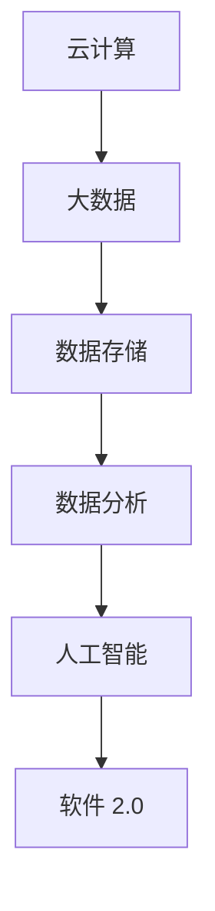
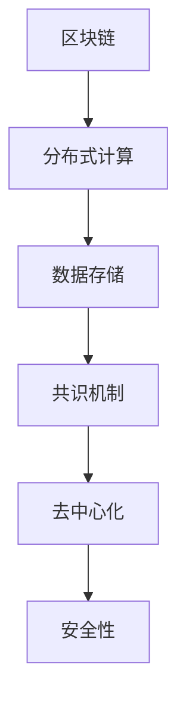

                 

### 《软件 2.0 的未来愿景：创造更美好的世界》

关键词：软件 2.0、未来愿景、人工智能、技术发展、社会变革

摘要：本文深入探讨软件 2.0 的概念及其未来愿景，分析其对社会和技术的深远影响。我们将一步步解析软件 2.0 的核心特征，探讨其背后的技术基础，以及在不同领域的应用场景。同时，我们将面对软件 2.0 面临的挑战，探讨如何抓住机遇，推动软件技术为人类社会创造更美好的未来。

<|endoftext|>

### 第一部分：引言

#### 1.1 软件 2.0 的概念与特点

**1.1.1 软件 2.0 的定义**

软件 2.0 是指继传统软件（Software 1.0）之后的一种新型软件模式，它不仅包含了传统软件的功能，更强调了软件的智能化、自适应性和可持续性。软件 2.0 强调软件与用户、环境之间的互动，通过不断学习和进化，提供更加个性化和高效的解决方案。

**1.1.2 软件 2.0与传统软件的差异**

1. **功能差异**：传统软件 1.0 主要是根据预定的功能进行设计，用户在使用过程中难以改变软件的行为。而软件 2.0 则通过引入人工智能和机器学习技术，能够根据用户行为和需求进行自我调整和优化。

2. **交互方式**：传统软件 1.0 的交互方式主要是命令式操作，用户需要通过一系列命令来控制软件。而软件 2.0 则更多地采用自然语言交互、图形界面交互等方式，提高了用户的体验。

3. **更新与维护**：传统软件 1.0 需要定期更新和维护，以修复漏洞和添加新功能。软件 2.0 则通过持续学习和进化，能够自动更新和优化，减少了维护成本。

**1.1.3 软件 2.0 对人类社会的影响**

1. **生产效率提升**：软件 2.0 的智能化和自动化特性，能够大幅提高生产效率，减少人力成本。

2. **创新驱动**：软件 2.0 强调创新和灵活，能够激发更多的创新思维和应用场景，推动产业升级。

3. **社会变革**：软件 2.0 引入了新的社会互动模式，改变了人们的生活方式，对社会结构产生了深远影响。

#### 1.2 未来世界的愿景

**1.2.1 社会发展的趋势**

1. **全球化**：随着互联网和信息技术的快速发展，全球化进程不断加快，人类社会日益紧密地联系在一起。

2. **智能化**：人工智能和机器学习技术的普及，将使人类社会进入智能化时代，生产生活方式将发生深刻变革。

3. **可持续发展**：面对环境问题和资源短缺，人类社会需要转变发展方式，实现可持续发展。

**1.2.2 软件技术在未来世界的作用**

1. **生产效率提升**：软件技术将大幅提高生产效率，推动经济快速发展。

2. **社会管理优化**：软件技术将帮助政府和企业实现智能化管理，提高公共服务水平。

3. **生活方式变革**：软件技术将改变人们的生活方式，提高生活质量。

**1.2.3 未来愿景的实现路径**

1. **技术创新**：持续推动软件技术发展，实现技术的创新和突破。

2. **人才培养**：加强软件人才培养，提升整体技术水平和创新能力。

3. **国际合作**：加强国际交流与合作，共同应对全球性挑战。

### 第二部分：技术基础

#### 2.1 软件技术发展趋势

**2.1.1 云计算与大数据**

**Mermaid 流程图：**



**核心算法原理讲解：**

- **云计算**：云计算是一种通过互联网提供计算资源的服务模式，用户可以按需获取和使用计算资源，无需购买和维护硬件设备。
  
- **大数据**：大数据是指数据量巨大、类型繁多、价值密度低的数据集合。大数据处理需要高效的数据存储、管理和分析技术。

**2.1.2 人工智能与机器学习**

**伪代码：**

```python
# 输入特征向量 X 和标签 y
# 输出模型参数 w 和 b

def train_model(X, y):
    w = initialize_weights()
    b = initialize_bias()
    for epoch in range(num_epochs):
        for x, y in zip(X, y):
            # 前向传播
            z = sigmoid(w * x + b)
            # 计算损失函数
            loss = -1/m * sum(y * log(z) + (1 - y) * log(1 - z))
            # 反向传播
            dw = 1/m * dZ/dz * x
            db = 1/m * dZ/db
            # 更新参数
            w -= learning_rate * dw
            b -= learning_rate * db
    return w, b
```

**2.1.3 区块链与分布式计算**

**Mermaid 流程图：**



**核心算法原理讲解：**

- **区块链**：区块链是一种分布式数据库技术，通过加密算法和共识机制确保数据的不可篡改和去中心化。

- **分布式计算**：分布式计算是将计算任务分布到多台计算机上进行处理，提高计算效率和性能。

#### 2.2 软件开发新范式

**2.2.1 模块化与组件化**

模块化是将软件系统划分为多个功能模块，每个模块独立开发、测试和部署。组件化是在模块化的基础上，将模块进一步拆分为可复用的组件，实现软件的灵活组装。

**2.2.2 DevOps与持续集成**

DevOps 是一种软件开发和运维的新模式，强调开发（Development）和运维（Operations）的协同工作。持续集成（Continuous Integration）是将代码频繁集成和测试，确保软件的稳定性和质量。

**2.2.3 开源软件生态系统**

开源软件生态系统是指基于开源协议的软件，通过社区合作和共同维护，实现软件的创新和发展。开源软件具有低成本、高效率和高质量的特点。

#### 2.3 软件 2.0 的核心技术

**2.3.1 AI 驱动的软件开发**

AI 驱动的软件开发是指利用人工智能技术，自动生成、优化和测试软件。AI 驱动的软件开发能够提高开发效率，降低开发成本。

**2.3.2 软件智能优化**

软件智能优化是指利用机器学习技术，对软件系统进行自动优化，提高其性能和可靠性。软件智能优化包括代码优化、资源管理和故障预测等方面。

**2.3.3 软件安全保障**

软件安全保障是指利用密码学、人工智能等技术，保护软件系统的安全性。软件安全保障包括数据加密、访问控制和威胁检测等方面。

### 第三部分：应用场景

#### 3.1 智能制造

**3.1.1 软件 2.0 在智能制造中的应用**

软件 2.0 在智能制造中的应用主要包括生产计划优化、设备监控和故障预测等方面。通过引入人工智能和机器学习技术，智能制造系统能够实现更高效、更智能的生产管理。

**3.1.2 智能制造的关键技术**

- **工业物联网（IIoT）**：工业物联网是将传感器、设备和系统连接到互联网，实现设备间的数据交换和协同工作。

- **边缘计算**：边缘计算是将计算任务分布在网络边缘的设备上，提高数据处理速度和响应时间。

- **人工智能与机器学习**：人工智能和机器学习技术能够对海量数据进行挖掘和分析，提供智能决策支持。

**3.1.3 智能制造的案例解析**

- **案例一：智能生产线**：通过软件 2.0 技术，实现生产线的智能化改造，提高生产效率和产品质量。

- **案例二：智能设备监控**：利用软件 2.0 技术，对生产线上的设备进行实时监控和故障预测，降低设备故障率。

#### 3.2 智慧城市

**3.2.1 软件 2.0 在智慧城市建设中的应用**

软件 2.0 在智慧城市建设中的应用主要包括城市治理、公共服务和交通管理等方面。通过引入人工智能和大数据技术，智慧城市能够实现更高效、更智能的城市管理。

**3.2.2 智慧城市的核心技术**

- **大数据分析**：大数据分析技术能够对城市运行数据进行分析，提供决策支持。

- **人工智能**：人工智能技术能够实现智能识别、预测和决策，提高城市管理效率。

- **物联网**：物联网技术能够实现城市基础设施的互联互通，提高城市运行效率。

**3.2.3 智慧城市的案例分析**

- **案例一：智慧交通系统**：通过软件 2.0 技术，实现交通流量的智能监测和调度，缓解交通拥堵。

- **案例二：智能安防系统**：通过软件 2.0 技术，实现城市安防的智能化监控，提高治安水平。

#### 3.3 医疗健康

**3.3.1 软件 2.0 在医疗健康领域的应用**

软件 2.0 在医疗健康领域的应用主要包括电子病历、医疗影像分析和远程医疗等方面。通过引入人工智能和大数据技术，医疗健康系统能够实现更高效、更精准的医疗服务。

**3.3.2 医疗健康的关键技术**

- **电子病历系统**：电子病历系统能够实现病历信息的数字化管理，提高医疗信息的准确性和安全性。

- **医疗影像分析**：医疗影像分析技术能够对医学影像进行自动分析和诊断，提高诊断准确率。

- **远程医疗**：远程医疗技术能够实现医生与患者之间的远程诊疗，提高医疗服务的可及性和便利性。

**3.3.3 医疗健康的案例解析**

- **案例一：智能诊断系统**：通过软件 2.0 技术，实现疾病预测和诊断的智能化，提高诊断效率。

- **案例二：远程手术**：通过软件 2.0 技术，实现远程手术的实时监控和操作，提高手术安全性和成功率。

#### 3.4 教育科技

**3.4.1 软件 2.0 在教育科技中的应用**

软件 2.0 在教育科技中的应用主要包括在线教育、智能教学和虚拟现实等方面。通过引入人工智能和大数据技术，教育科技系统能够实现更个性化、更互动的教育体验。

**3.4.2 教育科技的关键技术**

- **在线教育平台**：在线教育平台能够实现课程资源的共享和远程教育，提高教育资源的利用效率。

- **智能教学系统**：智能教学系统能够根据学生的学习情况，提供个性化的教学方案，提高学习效果。

- **虚拟现实技术**：虚拟现实技术能够提供沉浸式的学习体验，提高学生的学习兴趣和参与度。

**3.4.3 教育科技的案例分析**

- **案例一：智能学习平台**：通过软件 2.0 技术，实现个性化学习路径和智能推荐，提高学习效果。

- **案例二：虚拟实验室**：通过软件 2.0 技术，提供虚拟实验环境，让学生在虚拟世界中实践和探索，提高实验技能。

### 第四部分：挑战与机遇

#### 4.1 软件 2.0 面临的挑战

**4.1.1 技术挑战**

- **算法性能**：随着数据规模的增大，算法的性能和效率成为关键挑战。

- **系统安全**：软件 2.0 系统的安全性要求更高，需要防范各种潜在的安全威胁。

- **数据处理**：大数据和实时数据处理技术需要不断优化，以满足软件 2.0 的高效运行需求。

**4.1.2 法律与伦理问题**

- **数据隐私**：软件 2.0 需要处理大量个人数据，如何保护用户隐私成为重要问题。

- **算法公平性**：算法的决策过程需要确保公平性，避免歧视和不公正。

**4.1.3 人才培养**

- **技能需求**：软件 2.0 对开发者提出了更高的技能要求，需要培养更多具备跨学科能力的人才。

- **教育体系**：现有教育体系需要改革，以适应软件 2.0 发展的需求。

#### 4.2 软件 2.0 带来的机遇

**4.2.1 创新机遇**

- **技术创新**：软件 2.0 拥有广泛的应用场景，为技术创新提供了丰富土壤。

- **商业模式**：软件 2.0 改变了传统商业模式，催生了一系列新型商业模式。

**4.2.2 商业模式变革**

- **共享经济**：软件 2.0 技术为共享经济提供了技术支持，推动了共享经济的发展。

- **个性化服务**：软件 2.0 能够实现个性化服务，满足用户的多元化需求。

**4.2.3 国际合作与竞争**

- **国际合作**：软件 2.0 为国际合作提供了新的平台，促进了全球范围内的技术交流和合作。

- **国际竞争**：软件 2.0 技术成为各国竞争的新焦点，推动各国加强技术创新和人才培养。

### 第五部分：实践与展望

#### 5.1 软件 2.0 实践案例

**5.1.1 成功案例分析**

- **案例一：智能交通系统**：通过软件 2.0 技术，实现了交通流量的智能监测和调度，有效缓解了城市交通拥堵问题。

- **案例二：智能医疗系统**：通过软件 2.0 技术，实现了疾病预测和诊断的智能化，提高了医疗服务的效率和质量。

**5.1.2 失败案例分析**

- **案例一：智能工厂项目**：由于技术不成熟和成本问题，导致项目失败。

- **案例二：智能安防系统**：由于数据隐私和安全问题，导致项目受到质疑。

**5.1.3 案例解析与启示**

- **成功案例解析**：成功案例表明，软件 2.0 技术在应用过程中需要充分考虑技术可行性、成本效益和用户体验。

- **失败案例解析**：失败案例提醒我们，软件 2.0 的应用需要遵循伦理规范，确保数据安全和用户隐私。

#### 5.2 未来愿景的实现

**5.2.1 实现路径与策略**

- **技术创新**：加强技术创新，突破技术瓶颈，提升软件 2.0 的性能和可靠性。

- **人才培养**：加强人才培养，提高软件开发者和使用者的技能水平。

- **政策支持**：制定相关政策，鼓励软件 2.0 的发展和应用。

**5.2.2 可能遇到的障碍**

- **技术障碍**：随着数据规模的增大，现有技术可能无法满足软件 2.0 的高效运行需求。

- **伦理问题**：软件 2.0 的应用可能引发一系列伦理问题，如数据隐私、算法公平性等。

**5.2.3 未来展望**

- **技术发展**：软件 2.0 将成为未来信息技术发展的重要方向，推动人类社会进入智能化时代。

- **社会变革**：软件 2.0 将改变人们的生活方式，推动社会结构和生产方式的变革。

### 第六部分：附录

#### 6.1 软件 2.0 资源推荐

**6.1.1 开源工具与框架**

- **TensorFlow**：用于机器学习和深度学习的开源框架。

- **Kubernetes**：用于容器编排的开源平台。

- **Docker**：用于容器化的开源工具。

**6.1.2 学术资源与论文**

- **AAAI**：美国人工智能协会主办的学术会议。

- **NeurIPS**：神经信息处理系统大会。

- **ICML**：国际机器学习大会。

**6.1.3 行业报告与趋势分析**

- **Gartner**：全球领先的研究和咨询公司，发布有关软件 2.0 的报告。

- **IDC**：国际数据公司，发布有关软件 2.0 的市场分析报告。

#### 6.2 术语解释

**6.2.1 常用术语解释**

- **软件 2.0**：继传统软件（Software 1.0）之后的一种新型软件模式，强调智能化、自适应性和可持续性。

- **人工智能**：模拟、延伸和扩展人的智能的理论、方法、技术及应用。

- **机器学习**：一种基于数据的学习方法，使计算机系统能够从数据中自动学习和改进。

**6.2.2 新兴技术术语**

- **区块链**：一种分布式数据库技术，通过加密算法和共识机制确保数据的不可篡改和去中心化。

- **边缘计算**：将计算任务分布到网络边缘的设备上，提高数据处理速度和响应时间。

### 第七部分：作者信息

作者：AI天才研究院/AI Genius Institute & 禅与计算机程序设计艺术 /Zen And The Art of Computer Programming

---

至此，本文《软件 2.0 的未来愿景：创造更美好的世界》已完成。文章从概念介绍、技术基础、应用场景、挑战与机遇到实践与展望，全面探讨了软件 2.0 的未来愿景。希望通过本文，能够帮助读者更好地理解软件 2.0，并激发对这一领域的兴趣和思考。在未来的发展中，软件 2.0 将为人类社会带来更多的机遇和变革。让我们共同期待这一美好未来的到来。

