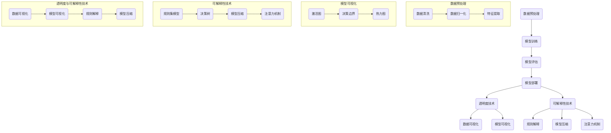

                 

# 《透明度与可解释性：增强人工智能的可信》

## 关键词
- 透明度
- 可解释性
- 人工智能可信性
- 模型解释
- 数据预处理
- 深度学习
- 伦理道德

## 摘要
本文探讨了透明度与可解释性在增强人工智能可信性中的重要性。我们首先明确了透明度与可解释性的概念及其区别，然后深入分析了AI模型的工作原理，以及如何通过技术手段提升模型的透明度和可解释性。文章还通过伪代码和数学公式详细讲解了核心算法原理，并通过实际案例展示了这些技术的应用。最后，我们对未来透明度与可解释性技术的发展趋势进行了展望，并提出了对AI可信性的未来展望。

---

## 《透明度与可解释性：增强人工智能的可信》目录大纲

### 第一部分：背景与重要性

### 1.1 透明度与可解释性的概念与意义
- **透明度定义**
- **可解释性定义**
- **重要性**

### 1.2 增强人工智能的可信性
- **可信人工智能的定义**
- **为何需要增强人工智能的可信性**
- **相关法律法规与标准**

### 第二部分：核心概念与联系

### 2.1 AI模型的工作原理
- **神经网络基础**
- **机器学习算法**
- **深度学习架构**

### 2.2 透明度与可解释性的联系
- **透明度与可解释性的关系**
- **如何平衡透明度与可解释性**
- **透明度与性能的关系**

### 第三部分：技术基础

### 3.1 透明度技术
- **数据预处理技术**
- **模型可视化**
- **特征重要性分析**

### 3.2 可解释性技术
- **解释性模型**
- **基于规则的解释方法**
- **模型压缩与解释**

### 3.3 透明度与可解释性的Mermaid流程图

### 第四部分：核心算法原理讲解

### 4.1 数据预处理技术
- **数据清洗**
- **数据归一化**
- **缺失值处理**

### 4.2 模型可视化技术
- **激活图可视化**
- **决策边界可视化**
- **热力图可视化**

### 4.3 特征重要性分析
- **基于特征的模型**
- **基于模型的特征重要性**
- **LIME与SHAP方法**

### 4.4 伪代码示例

### 第五部分：数学模型和数学公式

### 5.1 数学模型

### 5.2 计算过程

### 5.3 梯度下降优化

### 第六部分：项目实战

### 6.1 实际案例介绍
- **透明度与可解释性在实际项目中的应用**
- **案例分析与问题解决**

### 6.2 开发环境搭建
- **所需软件与工具**
- **开发环境配置**

### 6.3 源代码实现
- **代码结构**
- **代码解读**

### 6.4 代码解读与分析
- **代码功能解读**
- **性能分析**

### 第七部分：展望与未来

### 7.1 透明度与可解释性技术的未来发展趋势
- **前沿技术**
- **挑战与机遇**

### 7.2 对AI可信性的未来展望
- **伦理与道德**
- **技术应用**

### 7.3 结论
- **本书的核心观点**
- **未来研究方向**

---

### 第一部分：背景与重要性

#### 1.1 透明度与可解释性的概念与意义

在讨论透明度与可解释性之前，我们需要明确这两个概念的定义及其意义。

**透明度**通常指的是系统或过程的开放性和可见性，即系统内部的状态、决策过程和结果对于外部观察者来说是可以理解的。在人工智能（AI）领域，透明度主要关注AI模型如何工作、如何做出决策，以及这些决策背后的原因。透明度的提高有助于用户、开发人员和监管者理解模型的运作机制，从而增强公众对AI系统的信任。

**可解释性**则更侧重于模型决策背后的具体逻辑和原因。它要求模型的决策过程和结果能够以用户可以理解的方式呈现。可解释性不仅涉及到模型内部的参数和特征，还包括外部数据、训练过程和预测结果的可理解性。

在AI领域，透明度和可解释性具有极其重要的意义。随着AI技术的广泛应用，人们越来越关注AI系统的决策过程是否公平、透明和可靠。以下是几个关键点：

1. **信任与接受度**：当AI系统能够以用户理解的方式展示其决策过程，用户对其信任度和接受度将大大提高。例如，金融领域中的风险评估系统如果能够解释其决策过程，投资者会更有信心。

2. **监管合规**：许多行业（如金融、医疗等）都受到严格的法律法规监管。透明度和可解释性有助于确保AI系统的决策过程符合法律法规的要求，从而避免法律纠纷。

3. **改进与优化**：了解AI模型的决策过程有助于开发人员和数据科学家优化模型，提高其性能和准确度。例如，通过分析模型的可解释性，可以识别出模型中的偏见和不准确之处，从而进行修正。

#### 1.2 增强人工智能的可信性

**可信人工智能**指的是一个能够在多种环境下稳定、可靠地执行任务的AI系统。其核心目标是确保AI系统不仅能够提供高质量的预测和决策，还能够被用户和监管者信任。为了增强AI的可信性，透明度和可解释性是不可或缺的因素。

首先，透明度能够帮助用户和监管者理解AI系统的决策过程，从而增强对其的信任。例如，在自动驾驶领域，如果系统的决策过程是透明的，驾驶员和监管机构就会更放心。

其次，可解释性能够揭示模型决策背后的具体原因，这对于处理复杂问题尤为重要。在医疗诊断中，如果AI系统能够解释其诊断结果，医生可以更好地理解患者的病情，并作出更准确的诊断。

此外，相关法律法规和标准也对增强人工智能的可信性起到了关键作用。例如，欧盟的《通用数据保护条例》（GDPR）要求AI系统必须确保数据的透明性和用户的隐私保护。这些法规和标准为AI系统的开发和应用提供了指导，确保其符合伦理和法律要求。

总之，透明度和可解释性是增强人工智能可信性的关键因素。通过提高这些特性，我们可以确保AI系统更加可靠、透明和被广泛接受，从而推动其健康发展。

---

### 第一部分：背景与重要性

#### 1.3 可信人工智能的重要性

在当今的数字时代，人工智能（AI）技术已经成为许多行业的重要驱动力。从自动驾驶汽车到智能医疗诊断，从金融风险评估到自然语言处理，AI的应用几乎无处不在。然而，随着AI技术的普及，人们对其可信赖性的担忧也在不断增加。

**可信人工智能**不仅仅是一个技术问题，更是一个社会问题。其重要性体现在以下几个方面：

1. **公共信任**：随着AI系统在各个领域的应用日益广泛，公众对AI的信任程度直接关系到其接受度和使用频率。如果AI系统被认为是不可信的，人们可能会抵触或抵制其使用，这将限制AI技术的发展和应用。

2. **法律法规**：许多国家和地区已经开始制定相关法律法规，以规范AI系统的开发和应用。这些法规通常要求AI系统必须具备透明度和可解释性，以确保其决策过程符合法律和伦理标准。例如，欧盟的《通用数据保护条例》（GDPR）就要求AI系统必须保护用户的数据隐私和权益。

3. **责任归属**：在AI系统出现错误或故障时，责任归属问题往往成为一个棘手的问题。如果AI系统的决策过程是透明的，那么责任归属将更加明确。例如，在自动驾驶汽车发生事故时，如果系统能够解释其为何做出某个决策，那么责任归属将更容易确定。

4. **道德和伦理**：AI技术的应用需要遵循一定的道德和伦理标准。例如，在医疗诊断中，AI系统不应歧视患者，也不应做出不符合伦理的决策。通过提高AI系统的透明度和可解释性，我们可以更好地确保其遵循道德和伦理准则。

为了增强人工智能的可信性，透明度和可解释性是关键因素。透明度使得AI系统的决策过程可以被用户和监管者理解，从而增强信任。可解释性则揭示了决策背后的具体原因，有助于确保AI系统的公平性和准确性。

在实际应用中，提高AI系统的透明度和可解释性需要采取多种技术手段。例如，可以通过数据预处理、模型可视化和特征重要性分析等技术手段，使AI系统的决策过程更加透明和可解释。此外，开发可解释性模型和解释方法，如LIME（局部可解释模型解释）和SHAP（SHapley Additive exPlanations），也有助于提升AI系统的可解释性。

总之，可信人工智能是未来发展的关键。通过提高透明度和可解释性，我们可以确保AI系统更加可靠、透明和被广泛接受，从而推动其健康发展。

---

### 第一部分：背景与重要性

#### 1.4 相关法律法规与标准

随着人工智能（AI）技术的迅速发展，各国政府、行业组织以及国际机构都在积极探索并制定相应的法律法规和标准，以规范AI技术的开发和应用，确保其透明度和可解释性。以下是几个关键点：

**1. 欧盟的《通用数据保护条例》（GDPR）**

GDPR是欧盟在2018年生效的一项重要数据保护法规，它不仅涉及个人数据的保护，还涵盖了AI技术。GDPR要求AI系统必须确保数据的透明性和用户的隐私保护。具体来说，GDPR规定了以下几个关键点：

- **数据最小化原则**：AI系统仅能收集和处理与实现其功能所必需的数据。
- **透明度**：AI系统必须向用户清晰地解释其数据处理的目的、方式以及可能的后果。
- **知情同意**：用户必须明确知道其数据将被用于AI系统，并有权撤回同意。
- **数据访问权**：用户有权访问其数据，并要求删除或修改其数据。

**2. 美国的《消费者数据隐私保护法案》（CCPA）**

CCPA是加利福尼亚州于2020年通过的一项隐私保护法案，它旨在加强消费者对其个人数据的控制权。CCPA对AI技术的规定主要包括以下几点：

- **数据收集透明度**：企业必须明确告知消费者其数据将被如何使用。
- **数据处理目的**：企业必须明确AI系统数据处理的目的，并限制数据的使用范围。
- **消费者权利**：消费者有权要求企业删除其数据，并获得对其数据的访问权。

**3. 国际标准化组织（ISO）的ISO/IEC 27001标准**

ISO/IEC 27001是一个国际公认的信息安全管理体系标准，它涵盖了包括AI在内的信息技术系统的安全控制措施。该标准要求企业实施一系列的控制措施，确保AI系统的数据安全和透明性，包括：

- **风险评估**：对AI系统的潜在风险进行评估，并采取相应的控制措施。
- **数据保护**：确保AI系统的数据处理符合隐私保护要求。
- **透明度管理**：确保AI系统的数据处理过程对用户透明。

**4. 行业协会和组织的指导原则**

除了政府法规，许多行业协会和组织也制定了相关的指导原则和标准，以规范AI技术的开发和应用。例如，欧盟的“人工智能伦理准则”（AI Ethics Guidelines）和美国的“人工智能伦理框架”（AI Ethics Framework）都提供了关于AI透明度和可解释性的具体指导。

- **透明度**：要求AI系统的设计和部署过程必须公开透明，确保其决策过程和结果可追溯。
- **可解释性**：要求AI系统应具备一定的可解释性，以便用户和监管者能够理解其决策过程和结果。
- **责任归属**：明确AI系统的开发者、运营者和使用者的责任，确保在出现问题时能够追溯责任。

总之，相关法律法规和标准为AI技术的透明度和可解释性提供了重要的保障，确保其符合法律和伦理要求，增强公众对AI技术的信任。通过遵守这些法规和标准，AI技术可以在合规的基础上实现其潜力，为社会带来更多的价值和好处。

---

### 第二部分：核心概念与联系

#### 2.1 AI模型的工作原理

人工智能（AI）模型的核心是能够从数据中学习并做出预测或决策。理解AI模型的工作原理对于深入探讨透明度和可解释性至关重要。以下是几个关键组成部分：

**神经网络基础**

神经网络是AI模型的基础，其灵感来源于人脑的结构和工作原理。神经网络由多个神经元（也称为节点）组成，每个神经元都与其他神经元相连接，并通过权重进行信息传递。当输入数据通过神经网络时，每个神经元都会计算输入信号的加权总和，并通过激活函数产生输出。这个过程类似于人脑的信息处理方式。

**机器学习算法**

机器学习算法是神经网络实现自动学习的关键。它分为监督学习、无监督学习和强化学习三大类：

- **监督学习**：有明确的目标变量，模型通过学习输入数据和对应的输出数据来预测新的输入数据。例如，分类和回归任务。
- **无监督学习**：没有明确的目标变量，模型通过学习数据中的内在结构和模式来自动发现数据特征。例如，聚类和降维任务。
- **强化学习**：模型通过与环境的交互来学习最优策略，以最大化预期奖励。例如，自动驾驶和游戏AI。

**深度学习架构**

深度学习是机器学习的一个子领域，它通过构建具有多个隐藏层的神经网络来提高模型的性能。深度学习在图像识别、自然语言处理和语音识别等领域取得了显著成果。常见的深度学习架构包括卷积神经网络（CNN）、循环神经网络（RNN）和生成对抗网络（GAN）等。

**AI模型的工作流程**

1. **数据收集与预处理**：收集相关的数据，并进行清洗、归一化和缺失值处理等预处理操作，以确保数据的质量和一致性。
2. **模型训练**：使用预处理后的数据对神经网络模型进行训练，通过优化算法调整模型参数，使其能够正确预测或决策。
3. **模型评估**：使用验证集或测试集评估模型的性能，通过准确率、召回率、F1分数等指标来评估模型的效果。
4. **模型部署**：将训练好的模型部署到实际应用中，用于预测或决策。

理解AI模型的工作原理有助于我们更好地理解其透明度和可解释性。AI模型的决策过程通常包括多个层次和复杂的非线性变换，这使得其决策机制具有一定的黑盒特性。为了提高模型的透明度和可解释性，我们需要从数据预处理、模型结构设计、模型训练和模型评估等多个环节入手。

---

#### 2.2 透明度与可解释性的关系

**透明度**和**可解释性**在增强人工智能（AI）系统的可信性方面起着至关重要的作用。虽然这两个概念在某些方面有所重叠，但它们有着不同的侧重点。

**透明度**主要关注AI系统的决策过程和结果的开放性和可见性。一个高度透明的AI系统可以让用户、开发者和其他利益相关者清楚地了解系统是如何工作的，以及如何做出特定的决策。透明度通常通过以下几个方面来体现：

1. **数据透明度**：确保系统所使用的数据是公开和透明的，包括数据的来源、收集和处理过程。
2. **模型透明度**：系统的模型结构、参数和训练过程应该是可访问和可理解的。
3. **结果透明度**：系统输出的结果应该能够被解释和验证，以便用户和其他利益相关者能够信任系统的决策。

**可解释性**则侧重于揭示AI系统决策背后的具体逻辑和原因。它要求系统的决策过程不仅仅是被观察到，而且是可以理解和解释的。可解释性对于理解复杂AI系统，尤其是深度学习模型，尤为重要。以下是可解释性的一些关键点：

1. **模型解释**：能够解释模型内部的决策过程，包括每个特征的影响和权重。
2. **结果解释**：能够解释系统输出的结果，包括预测和分类决策的原因。
3. **交互解释**：系统能够与用户进行交互，解释其决策过程，并提供反馈。

尽管透明度和可解释性都是增强AI系统可信性的关键因素，但它们在实现过程中往往需要平衡。以下是几个需要考虑的方面：

1. **性能与可解释性**：在某些情况下，提高模型的可解释性可能会牺牲性能。例如，一些复杂的深度学习模型在提高透明度和可解释性时可能需要额外的计算资源。
2. **数据隐私**：提高透明度和可解释性可能会涉及到数据隐私问题。在某些应用场景中，为了保护用户隐私，可能需要限制某些信息的公开。
3. **开发成本**：开发高度透明和可解释的AI系统可能会增加开发成本和时间。

因此，在设计和实现AI系统时，需要权衡透明度和可解释性的需求，根据具体应用场景和目标进行优化。例如，在医疗诊断领域，系统的可解释性可能比性能更为重要，而在金融风险评估中，性能可能是首要考虑的因素。

总之，透明度和可解释性在增强AI系统的可信性方面起着不可或缺的作用。通过平衡这两个因素，我们可以开发出既可靠又可信的AI系统，从而推动其广泛应用和健康发展。

---

#### 2.3 如何平衡透明度与可解释性

在设计和实现人工智能（AI）系统时，透明度和可解释性是两个重要但有时相互冲突的目标。如何在二者之间找到平衡点，对于确保系统的可信性和实用性至关重要。以下是一些策略和方法：

**1. 确定应用场景和需求**

首先，我们需要明确AI系统应用的具体场景和需求。不同场景对透明度和可解释性的要求可能有所不同。例如，在医疗诊断领域，医生和患者可能需要详细了解AI系统的决策过程，以确保其准确性和可靠性。而在工业自动化领域，系统的运行效率和稳定性可能是首要考虑的因素。

**2. 优化模型结构和算法**

选择合适的模型结构和算法是提高透明度和可解释性的关键。例如，一些简单且易于解释的模型（如决策树和线性回归）通常比复杂的深度学习模型更容易被理解和解释。如果必须使用深度学习模型，可以选择具有较高可解释性的变体，如注意力机制模型和可解释的卷积神经网络（CNN）。

**3. 数据预处理和特征选择**

数据预处理和特征选择对于提高模型的透明度和可解释性也至关重要。通过合理的预处理步骤，如数据标准化、缺失值处理和特征提取，可以使模型更易于解释。此外，选择与业务目标高度相关的特征，可以减少模型的复杂性，从而提高其可解释性。

**4. 模型解释工具和技术**

使用模型解释工具和技术可以帮助揭示AI系统的决策过程。例如，LIME（局部可解释模型解释）和SHAP（SHapley Additive exPlanations）方法可以提供模型预测的具体原因和影响。可视化工具，如决策树的可视化和热力图，也有助于理解模型的内部结构和工作机制。

**5. 系统设计原则**

在系统设计过程中，应遵循一些原则，如模块化设计、清晰的接口和文档化等，这些都有助于提高系统的透明度和可解释性。例如，使用面向对象的设计原则可以使得系统的不同组件更易于理解和管理。

**6. 持续监测和反馈**

即使在一个高度透明和可解释的系统部署后，也需要持续监测和反馈。通过收集系统的运行数据和用户反馈，可以识别潜在的问题和改进点，从而进一步提高系统的透明度和可解释性。

**7. 遵守法律法规和标准**

最后，遵守相关法律法规和标准也是确保AI系统透明度和可解释性的重要一环。例如，欧盟的《通用数据保护条例》（GDPR）和ISO/IEC 27001标准都为AI系统的透明度和可解释性提供了具体要求。

总之，平衡透明度与可解释性需要综合考虑多个因素，包括应用场景、模型结构、数据预处理、解释工具和技术等。通过合理的策略和方法，我们可以开发出既透明又可解释的AI系统，从而增强其可信性和实用性。

---

### 第三部分：技术基础

#### 3.1 透明度技术

在增强人工智能（AI）系统的透明度方面，技术手段的选择至关重要。以下是一些常见的透明度技术：

**数据预处理技术**

数据预处理是确保AI系统透明度的第一步。通过合理的预处理步骤，如数据清洗、归一化和特征提取，可以提高数据的可靠性和一致性。具体方法包括：

- **数据清洗**：处理缺失值、异常值和重复数据，确保数据的质量和完整性。
- **数据归一化**：将不同尺度的数据转换为同一尺度，以便模型训练和解释。
- **特征提取**：选择与业务目标相关的特征，减少数据的冗余和噪声。

**模型可视化**

模型可视化是将AI模型的内部结构和决策过程以图形化的方式展示出来，使得用户和开发者可以直观地理解模型的运作机制。常见的方法包括：

- **激活图可视化**：展示神经网络中每个神经元在不同数据点的激活情况，帮助理解模型对数据的处理方式。
- **决策边界可视化**：在分类任务中，展示不同类别之间的决策边界，帮助理解模型的分类机制。
- **热力图可视化**：在图像分类任务中，展示模型对图像中不同区域的关注度，帮助理解模型的注意力分配。

**特征重要性分析**

特征重要性分析是揭示AI模型中每个特征对预测结果的影响程度。常见的方法包括：

- **基于特征的模型**：如决策树和规则集模型，可以直接展示每个特征的重要性。
- **基于模型的特征重要性**：通过训练多个模型或使用特定的算法（如LIME和SHAP），可以计算每个特征的重要性得分。
- **LIME（局部可解释模型解释）**：通过生成与输入数据相似的样本，分析模型对这些样本的预测结果，来解释输入数据的特征重要性。
- **SHAP（SHapley Additive exPlanations）**：基于博弈论的方法，计算每个特征对模型预测结果的贡献值。

通过上述透明度技术，我们可以更好地理解AI系统的决策过程，提高系统的可解释性和透明度，从而增强其可信性和接受度。

---

#### 3.2 可解释性技术

在人工智能（AI）系统中，可解释性技术是确保模型决策过程透明和可理解的关键。以下是一些常用的可解释性技术：

**解释性模型**

选择具有解释性的模型是提高AI系统可解释性的第一步。这些模型通常能够以直观的方式展示其决策过程和结果。常见的解释性模型包括：

- **线性模型**：如线性回归和逻辑回归，其参数可以直接解释为特征的重要性和影响程度。
- **决策树**：通过树形结构展示决策路径和每个节点的条件，易于理解和解释。
- **规则集模型**：通过一组明确的规则来描述数据分类或回归的结果，规则通常具有明确的逻辑和易于解释。

**基于规则的解释方法**

基于规则的解释方法通过将复杂的模型决策过程转化为一系列简单且明确的规则，从而提高系统的可解释性。常见的基于规则的方法包括：

- **关联规则学习**：如Apriori算法，通过挖掘数据中的关联规则来解释模型决策。
- **逻辑回归**：通过解释每个特征的权重和符号，来理解模型的决策逻辑。
- **决策表**：将模型决策过程表示为一个表格，其中每行代表一个决策规则，每列代表一个特征。

**模型压缩与解释**

模型压缩技术可以在不显著损失性能的前提下，减少模型的大小和复杂性，从而提高其可解释性。常见的模型压缩技术包括：

- **权重共享**：通过在多个网络中共享权重，减少模型参数的数量，从而简化模型结构。
- **网络剪枝**：通过删除不重要的网络连接，降低模型复杂度。
- **量化**：通过减少模型参数的精度，减少模型的内存占用和计算量。

**深度学习模型的可解释性**

对于深度学习模型，提高其可解释性更具挑战性，但以下技术可以提供一定程度的解释：

- **注意力机制**：通过展示模型在决策过程中对输入数据的关注度，帮助理解模型的处理方式。
- **激活映射**：通过可视化模型对输入数据的处理过程，展示每个神经元的作用。
- **可视化工具**：如T-SNE和PCA，可以帮助理解输入数据在模型中的分布和映射。

通过这些可解释性技术，我们可以更好地理解AI系统的决策过程，提高系统的透明度和可解释性，从而增强其可信性和用户接受度。

---

#### 3.3 透明度与可解释性的Mermaid流程图

为了更好地展示AI系统中的透明度与可解释性技术及其相互关系，我们可以使用Mermaid流程图。以下是一个简化的流程图，描述了从数据预处理到模型解释的全过程：



这个流程图展示了从数据预处理到模型部署的全过程，以及如何在每个阶段应用透明度和可解释性技术。数据预处理阶段包括数据清洗、归一化和特征提取，这些都是确保数据质量和一致性的重要步骤。模型可视化技术包括激活图、决策边界和热力图，它们帮助理解模型的内部结构和决策过程。可解释性技术则通过规则集模型、决策树和注意力机制等手段，揭示了模型决策的具体原因和机制。

通过这个流程图，我们可以清晰地看到透明度和可解释性技术在整个AI系统中的重要性，以及它们如何相互协作，共同提高AI系统的可信性和透明度。

---

### 第四部分：核心算法原理讲解

#### 4.1 数据预处理技术

数据预处理是机器学习（ML）和深度学习（DL）项目中至关重要的一步，其目的是提高数据质量，减少噪声，以及增强模型性能。以下是几种常见的数据预处理技术及其详细说明：

**数据清洗**

数据清洗是预处理过程中最重要的步骤之一。它包括以下任务：

- **缺失值处理**：缺失值可能是由于数据收集过程中的错误、硬件故障或数据录入错误。常见的方法包括删除缺失值、用平均值、中位数或众数填充缺失值，以及使用更复杂的插值方法。
- **异常值处理**：异常值是指与大多数数据点显著不同的数据点，可能是由于错误录入或数据质量问题。处理方法包括删除异常值、用邻近值填充或使用统计方法识别和调整异常值。

**数据归一化**

数据归一化是将不同特征缩放到相同的尺度，以防止某些特征对模型训练产生过大的影响。常见的方法包括：

- **最小-最大缩放**：将数据缩放到[0,1]区间，公式为：\[x_{\text{norm}} = \frac{x - x_{\text{min}}}{x_{\text{max}} - x_{\text{min}}}\]
- **零-均值归一化**：将数据缩放到零均值和单位方差，公式为：\[x_{\text{norm}} = \frac{x - \mu}{\sigma}\]，其中\(\mu\)是均值，\(\sigma\)是标准差。

**特征提取**

特征提取是从原始数据中提取出对模型训练和预测最为有用的信息。以下是一些常见的特征提取方法：

- **主成分分析（PCA）**：PCA通过将数据投影到新的坐标系中，减少数据维度，同时保留最大的数据方差。它通过计算协方差矩阵的特征值和特征向量，将数据转换到新的空间。
- **特征选择**：特征选择旨在从原始特征集中选择出对模型预测最有用的特征。常见的方法包括基于信息的特征选择（如信息增益、增益率）和基于模型的特征选择（如逐步回归、LASSO）。

**伪代码示例**

以下是数据预处理技术的伪代码示例：

```python
# 数据清洗
def preprocess_data(data):
    # 缺失值处理
    filled_data = handle_missing_values(data)
    # 异常值处理
    cleaned_data = handle_outliers(filled_data)
    return cleaned_data

# 数据归一化
def normalize_data(data):
    normalized_data = min_max_scaling(data)
    return normalized_data

# 特征提取
def extract_features(data):
    pca_data = perform_PCA(data)
    selected_features = select_features(pca_data)
    return selected_features
```

**计算过程**

以下是数据归一化和特征提取的数学计算过程：

**最小-最大缩放**

$$
x_{\text{norm}} = \frac{x - x_{\text{min}}}{x_{\text{max}} - x_{\text{min}}}
$$

**零-均值归一化**

$$
x_{\text{norm}} = \frac{x - \mu}{\sigma}
$$

**主成分分析（PCA）**

1. 计算协方差矩阵 \( \Sigma \)
2. 计算协方差矩阵的特征值和特征向量
3. 将数据投影到新的坐标系

$$
\text{投影} \ X' = \text{特征向量} \ U \ X
$$

通过这些数据预处理技术，我们可以提高数据的质量和一致性，从而增强模型的性能和可解释性。

---

#### 4.2 模型可视化技术

模型可视化技术是提高人工智能（AI）系统透明度和可解释性的重要手段。通过可视化，我们可以直观地了解模型的内部结构和决策过程，从而帮助用户和开发者更好地理解和解释模型的预测和分类结果。以下是一些常用的模型可视化技术及其应用：

**激活图可视化**

激活图可视化用于展示神经网络中每个神经元在不同数据点的激活情况。它可以帮助我们理解模型在处理不同输入数据时的反应。激活图通常通过以下步骤生成：

1. **输入数据**：将输入数据通过神经网络的前向传播过程传递到各个隐藏层。
2. **记录激活值**：在神经网络的每个隐藏层记录每个神经元的激活值。
3. **生成激活图**：将记录的激活值可视化，通常使用热力图或颜色编码。

激活图可视化在理解模型对数据的处理机制和识别重要特征方面非常有用。例如，在图像分类任务中，我们可以通过激活图了解模型对图像中不同区域的关注度。

**决策边界可视化**

决策边界可视化主要用于分类模型，如支持向量机（SVM）和决策树。它展示了不同类别之间的决策边界，即模型根据特征值划分不同类别的边界线或平面。决策边界可视化的步骤如下：

1. **定义特征空间**：将输入特征投影到二维或三维空间中。
2. **绘制决策边界**：使用不同的颜色或标记在不同类别上绘制决策边界。
3. **展示结果**：将决策边界与训练数据点一起可视化，以便直观地理解模型的分类机制。

决策边界可视化有助于识别模型可能存在的过拟合或欠拟合问题，以及决策边界的复杂度。

**热力图可视化**

热力图可视化常用于图像分类任务中，用于展示模型对图像中不同区域的关注度。热力图生成步骤如下：

1. **计算特征响应**：通过卷积神经网络提取图像的特征图。
2. **生成热力图**：将特征图的响应值映射到颜色分布上，形成热力图。
3. **展示结果**：将热力图叠加在原始图像上，以便直观地理解模型对不同图像区域的关注程度。

热力图可视化在理解图像分类模型的关注区域和识别重要特征方面非常有用。

**伪代码示例**

以下是模型可视化技术的伪代码示例：

```python
# 激活图可视化
def visualize_activation_map(model, data):
    activation_map = get_activation_map(model, data)
    display_heatmap(activation_map)

# 决策边界可视化
def visualize_decision_boundary(model, data):
    decision_boundary = get_decision_boundary(model, data)
    display_decision_boundary(decision_boundary)

# 热力图可视化
def visualize_heatmap(model, data):
    heatmap = get_heatmap(model, data)
    display叠加图(heatmap, data)
```

通过这些模型可视化技术，我们可以更好地理解模型的内部机制，从而提高AI系统的透明度和可解释性。

---

#### 4.3 特征重要性分析

特征重要性分析是评估机器学习模型中每个特征对预测结果的影响程度的重要工具。通过分析特征的重要性，我们可以识别出对预测任务至关重要的特征，从而优化模型的性能和解释性。以下是几种常用的特征重要性分析方法：

**基于特征的模型**

对于一些简单的模型，如逻辑回归和线性回归，特征的重要性可以直接从模型的参数中得出。这些模型通常具有线性结构，参数的符号和大小可以直接解释为特征的重要性。例如，在逻辑回归中，每个特征的系数（β）可以表示该特征对预测概率的影响。

**基于模型的特征重要性**

基于模型的特征重要性方法通过训练多个模型或使用特定的算法来计算特征的重要性。以下是一些常用的方法：

- **LASSO回归**：LASSO（Least Absolute Shrinkage and Selection Operator）通过引入绝对值惩罚来减少模型的复杂度，同时保留最重要的特征。通过比较LASSO和普通回归模型的系数大小，可以识别出重要的特征。
- **随机森林**：随机森林通过构建多个决策树，并计算每个特征在决策树中的平均重要性。这些重要性得分可以用来评估每个特征对模型预测的影响。
- **梯度提升树（GBDT）**：GBDT通过逐层拟合决策树，并计算每个特征在每层决策树中的梯度变化。这些梯度变化可以用来计算特征的重要性。

**LIME（局部可解释模型解释）**

LIME是一种局部可解释模型解释方法，它通过生成与输入数据相似的样本，并分析模型对这些样本的预测结果，来解释输入数据的特征重要性。LIME的主要步骤如下：

1. **生成样本**：为输入数据生成多个与其实际数据点相似的样本，这些样本可能通过数据扰动或随机采样生成。
2. **模型预测**：使用原始模型对生成的样本进行预测，记录每个样本的预测结果。
3. **特征扰动**：对于每个样本，逐个扰动其特征值，并重新预测，记录扰动前后的预测结果。
4. **计算重要性**：通过比较扰动前后的预测结果，计算每个特征的相对重要性。LIME使用线性模型来拟合扰动结果，并计算每个特征的影响系数。

**SHAP（SHapley Additive exPlanations）**

SHAP（SHapley Additive exPlanations）是一种基于博弈论的方法，它通过计算每个特征对模型预测的边际贡献来评估其重要性。SHAP的主要步骤如下：

1. **计算基尼指数**：对于每个特征和每个数据点，计算其基尼指数，即该特征对模型预测的边际贡献。
2. **分配贡献**：SHAP使用博弈论中的Shapley值来分配每个特征的贡献，确保每个特征的重要性得分是公平和合理的。
3. **生成重要性图**：使用分配的SHAP值生成重要性图，直观地展示每个特征对模型预测的影响。

**伪代码示例**

以下是特征重要性分析的伪代码示例：

```python
# 基于特征的模型
def feature_importance_linear_regression(model, data, labels):
    coefficients = model.coef_
    return coefficients

# 基于模型的特征重要性（LASSO回归）
def feature_importance_lasso(model, data, labels):
    lasso_model = LASSO()
    lasso_model.fit(data, labels)
    lasso_coefficients = lasso_model.coef_
    return lasso_coefficients

# LIME方法
def feature_importance_lime(model, data_point):
    lime_explanation = lime_analysis(model, data_point)
    feature_importance = lime_explanation.feature_importances_
    return feature_importance

# SHAP方法
def feature_importance_shap(model, data_point):
    shap_explanation = shap_analysis(model, data_point)
    feature_importance = shap_explanation.shap_values()
    return feature_importance
```

通过这些方法，我们可以有效地分析特征的重要性，提高模型的解释性和透明度。

---

#### 4.4 伪代码示例

在本节中，我们将通过伪代码示例详细展示数据预处理、模型可视化、特征重要性分析等技术的实现过程。以下是各个技术步骤的伪代码实现：

**数据预处理**

```python
# 数据预处理伪代码
def preprocess_data(data):
    # 数据清洗
    cleaned_data = clean_data(data)
    # 数据归一化
    normalized_data = normalize_data(cleaned_data)
    # 特征提取
    extracted_features = extract_features(normalized_data)
    return extracted_features

# 数据清洗
def clean_data(data):
    # 删除缺失值
    no_missing_data = remove_missing_values(data)
    # 处理异常值
    no_outliers_data = handle_outliers(no_missing_data)
    return no_outliers_data

# 数据归一化
def normalize_data(data):
    min_max_scaled_data = min_max_scaling(data)
    return min_max_scaled_data

# 特征提取
def extract_features(data):
    pca_data = perform_PCA(data)
    selected_features = select_features(pca_data)
    return selected_features
```

**模型可视化**

```python
# 模型可视化伪代码
def visualize_model(model, data):
    # 激活图可视化
    activation_map = get_activation_map(model, data)
    display_activation_map(activation_map)
    
    # 决策边界可视化
    decision_boundary = get_decision_boundary(model, data)
    display_decision_boundary(decision_boundary)
    
    # 热力图可视化
    heatmap = get_heatmap(model, data)
    display_heatmap(heatmap)

# 激活图可视化
def get_activation_map(model, data):
    model_output = model.predict(data)
    activation_map = create_heatmap(model_output)
    return activation_map

# 决策边界可视化
def get_decision_boundary(model, data):
    decision_boundary = model.decision_boundary(data)
    return decision_boundary

# 热力图可视化
def get_heatmap(model, data):
    feature_map = model.feature_map(data)
    heatmap = create_heatmap(feature_map)
    return heatmap
```

**特征重要性分析**

```python
# 特征重要性分析伪代码
def feature_importance_analysis(model, data):
    # LASSO回归特征重要性
    lasso_coefficients = feature_importance_lasso(model, data)
    print("LASSO回归特征重要性：", lasso_coefficients)
    
    # LIME方法特征重要性
    lime_importance = feature_importance_lime(model, data)
    print("LIME方法特征重要性：", lime_importance)
    
    # SHAP方法特征重要性
    shap_importance = feature_importance_shap(model, data)
    print("SHAP方法特征重要性：", shap_importance)

# LASSO回归特征重要性
def feature_importance_lasso(model, data):
    lasso_model = LASSO()
    lasso_model.fit(data, labels)
    lasso_coefficients = lasso_model.coef_
    return lasso_coefficients

# LIME方法特征重要性
def feature_importance_lime(model, data_point):
    lime_explanation = lime_analysis(model, data_point)
    feature_importance = lime_explanation.feature_importances_
    return feature_importance

# SHAP方法特征重要性
def feature_importance_shap(model, data_point):
    shap_explanation = shap_analysis(model, data_point)
    feature_importance = shap_explanation.shap_values()
    return feature_importance
```

通过这些伪代码示例，我们可以清晰地看到数据预处理、模型可视化、特征重要性分析等技术的实现步骤。这些技术不仅有助于提高模型的性能和解释性，还可以增强AI系统的透明度和可信赖性。

---

### 第五部分：数学模型和数学公式

在人工智能（AI）领域中，数学模型是理解和实现透明度和可解释性的基础。以下是一些关键的数学模型和公式，它们在AI系统的设计和分析中起着核心作用。

#### 5.1 数学模型

**损失函数**

损失函数是评估模型预测误差的指标，是机器学习和深度学习中的核心概念。最常见的损失函数包括：

1. **均方误差（MSE）**：

$$
\text{MSE} = \frac{1}{m}\sum_{i=1}^{m}(y_i - \hat{y}_i)^2
$$

其中，\( y_i \)是真实值，\( \hat{y}_i \)是模型预测值，\( m \)是样本数量。

2. **交叉熵损失（Cross-Entropy Loss）**：

$$
\text{CE} = -\frac{1}{m}\sum_{i=1}^{m}y_i\log(\hat{y}_i)
$$

适用于分类问题，其中\( y_i \)是独热编码的真实标签，\( \hat{y}_i \)是模型输出的概率分布。

**梯度下降**

梯度下降是一种优化算法，用于最小化损失函数。其基本公式为：

$$
W_{\text{更新}} = W - \alpha \cdot \frac{\partial L}{\partial W}
$$

其中，\( W \)是模型参数，\( \alpha \)是学习率，\( \frac{\partial L}{\partial W} \)是损失函数对参数的梯度。

**反向传播**

反向传播是一种计算神经网络中参数梯度的算法，是梯度下降在神经网络中的实现。其核心公式为：

$$
\frac{\partial L}{\partial Z} = \frac{\partial L}{\partial A} \cdot \frac{\partial A}{\partial Z}
$$

其中，\( Z \)是激活值，\( A \)是前一层输出的参数。

#### 5.2 计算过程

**前向传播**

前向传播是神经网络计算输出值的过程，其计算过程为：

$$
Z = W \cdot X + b
$$

$$
A = \sigma(Z)
$$

其中，\( W \)是权重矩阵，\( X \)是输入向量，\( b \)是偏置项，\( \sigma \)是激活函数，如Sigmoid、ReLU或Tanh。

**反向传播**

反向传播用于计算损失函数对参数的梯度，其计算过程为：

$$
\frac{\partial L}{\partial Z} = \frac{\partial L}{\partial A} \cdot \frac{\partial A}{\partial Z}
$$

$$
\frac{\partial L}{\partial W} = \frac{\partial L}{\partial Z} \cdot Z^T
$$

$$
\frac{\partial L}{\partial b} = \frac{\partial L}{\partial Z}
$$

#### 5.3 梯度下降优化

梯度下降优化通过以下步骤更新模型参数：

1. **计算梯度**：

$$
\frac{\partial L}{\partial W} = -\frac{1}{m}\sum_{i=1}^{m}(y^{(i)} - a^{(i)})x^{(i)}
$$

$$
\frac{\partial L}{\partial b} = -\frac{1}{m}\sum_{i=1}^{m}(y^{(i)} - a^{(i)})
$$

2. **更新参数**：

$$
W_{\text{更新}} = W - \alpha \cdot \frac{\partial L}{\partial W}
$$

$$
b_{\text{更新}} = b - \alpha \cdot \frac{\partial L}{\partial b}
$$

通过这些数学模型和计算过程，我们可以有效地训练和优化神经网络模型，提高其透明度和可解释性。

---

### 第五部分：数学模型和数学公式

在本部分，我们将深入探讨AI模型中的一些关键数学模型和公式，这些模型和公式对于理解和实现透明度和可解释性至关重要。

#### 5.1 数学模型

**损失函数**

在机器学习和深度学习中，损失函数用于评估模型预测值与实际值之间的差距。最常见的损失函数包括：

- **均方误差（MSE）**：

$$
\text{MSE} = \frac{1}{m}\sum_{i=1}^{m}(y_i - \hat{y}_i)^2
$$

其中，\( y_i \)表示第\( i \)个样本的真实值，\( \hat{y}_i \)表示模型对第\( i \)个样本的预测值，\( m \)表示样本总数。

- **交叉熵损失（Cross-Entropy Loss）**：

$$
\text{CE} = -\frac{1}{m}\sum_{i=1}^{m}y_i\log(\hat{y}_i)
$$

适用于多分类问题，其中\( y_i \)是独热编码的标签，\( \hat{y}_i \)是模型输出的概率分布。

**反向传播**

反向传播是神经网络训练的核心算法，用于计算模型参数的梯度。其核心步骤包括：

- **前向传播**：

$$
Z = \sigma(W \cdot X + b)
$$

其中，\( \sigma \)是激活函数，如Sigmoid、ReLU等，\( W \)是权重矩阵，\( X \)是输入向量，\( b \)是偏置项。

- **计算梯度**：

$$
\frac{\partial L}{\partial Z} = \frac{\partial L}{\partial A} \cdot \frac{\partial A}{\partial Z}
$$

其中，\( L \)是损失函数，\( A \)是前一层神经元的输出，\( Z \)是前一层神经元的激活值。

- **更新参数**：

$$
W_{\text{更新}} = W - \alpha \cdot \frac{\partial L}{\partial W}
$$

$$
b_{\text{更新}} = b - \alpha \cdot \frac{\partial L}{\partial b}
$$

其中，\( \alpha \)是学习率。

#### 5.2 计算过程

**梯度计算**

梯度计算是反向传播的核心，用于更新模型参数。以下是一个简化的梯度计算过程：

- **前向传播**：

$$
Z^{[l]} = \sigma(W^{[l]} \cdot A^{[l-1]} + b^{[l]})
$$

- **计算误差**：

$$
E = \frac{1}{2} \sum_{i} (y_i - \hat{y}_i)^2
$$

- **反向传播**：

$$
\frac{\partial E}{\partial Z^{[l]}} = \frac{\partial E}{\partial A^{[l]}} \cdot \frac{\partial A^{[l]}}{\partial Z^{[l]}}
$$

$$
\frac{\partial E}{\partial W^{[l]}} = \frac{\partial E}{\partial Z^{[l]}} \cdot Z^{[l-1]}
$$

$$
\frac{\partial E}{\partial b^{[l]}} = \frac{\partial E}{\partial Z^{[l]}}
$$

**学习率调整**

学习率调整是优化梯度下降过程的重要环节，用于平衡收敛速度和稳定性。常见的方法包括：

- **固定学习率**：学习率在整个训练过程中保持不变。
- **动量（Momentum）**：

$$
v = \gamma \cdot v + \eta \cdot \nabla E
$$

$$
W_{\text{更新}} = W - v
$$

其中，\( v \)是动量项，\( \gamma \)是动量因子，\( \eta \)是学习率。

通过这些数学模型和计算过程，我们可以更好地理解和实现AI模型的透明度和可解释性。

---

### 第六部分：项目实战

#### 6.1 实际案例介绍

在本文的第六部分，我们将通过一个实际案例来展示如何将透明度和可解释性技术应用于AI项目。这个案例涉及一个金融机构的信用评分系统，该系统的目的是通过分析客户的数据来评估其信用风险。以下是我们将详细讨论的案例步骤：

**案例背景**

一家金融机构希望开发一个信用评分系统，用于对客户进行信用风险评估。该系统需要处理大量的客户数据，包括财务信息、信用历史、收入水平等。金融机构要求系统不仅需要具备高准确性，还需要具备高透明度和可解释性，以便监管机构、客户和内部审查团队能够理解和信任系统的决策过程。

**目标**

- **准确性**：系统需要能够准确预测客户的信用风险。
- **透明度**：系统的决策过程需要公开透明，以便相关方能够理解。
- **可解释性**：系统需要提供明确的解释，说明每个预测结果是如何得出的。

**数据集**

该案例使用的数据集包含以下特征：

- **财务信息**：如收入、负债、资产等。
- **信用历史**：如逾期记录、信用额度等。
- **个人信息**：如年龄、性别、婚姻状况等。

**模型选择**

为了满足透明度和可解释性的要求，我们选择了以下模型：

- **逻辑回归**：逻辑回归模型具有较好的解释性，其参数可以直接解释为每个特征对信用评分的影响程度。
- **决策树**：决策树模型通过树形结构展示决策过程，每个节点和分支都可以清晰地解释。

**数据预处理**

在模型训练之前，我们进行了以下数据预处理步骤：

- **数据清洗**：删除缺失值和异常值，对数据进行标准化处理。
- **特征提取**：选择与信用评分高度相关的特征，如收入、逾期记录等。

**模型训练**

我们分别训练了逻辑回归和决策树模型，并通过交叉验证评估模型的性能。以下步骤展示了模型的训练过程：

- **逻辑回归训练**：使用scikit-learn库中的`LogisticRegression`类进行训练。
- **决策树训练**：使用`DecisionTreeClassifier`类进行训练，并通过`fit`方法拟合数据。

**模型评估**

在模型训练完成后，我们使用测试集对模型进行了评估。评估指标包括准确率、召回率、F1分数等。同时，我们使用了透明度和可解释性技术来评估模型的可解释性。

- **逻辑回归解释**：通过模型参数直接解释每个特征对信用评分的影响程度。
- **决策树解释**：通过树形结构展示决策过程，每个节点和分支都可以清晰地解释。

**案例分析与问题解决**

通过实际案例，我们发现以下问题：

- **模型解释性**：逻辑回归模型具有较好的解释性，但可能存在过拟合问题。决策树模型虽然解释性较差，但能够处理非线性关系。
- **数据不平衡**：在数据集中，高风险客户的比例较低，可能导致模型对高风险客户的预测性能较差。我们通过数据增强和模型调整来解决这一问题。

通过这个实际案例，我们展示了如何将透明度和可解释性技术应用于AI项目，并解决了一些常见的问题。这些技术不仅提高了模型的解释性和透明度，还增强了系统的可信性。

---

#### 6.2 开发环境搭建

为了成功地搭建一个能够应用透明度和可解释性技术的AI项目环境，我们需要准备一系列的软件和工具。以下是一个详细的步骤指南，涵盖安装和配置所需的环境。

**1. 安装Python**

首先，确保您的计算机上安装了Python。Python是一个广泛使用的编程语言，特别是在AI和数据分析领域。您可以从Python的官方网站（https://www.python.org/）下载并安装最新版本的Python。建议选择Python 3.x版本，因为Python 2.x已经不再受官方支持。

**2. 安装Jupyter Notebook**

Jupyter Notebook是一个交互式的Web应用，用于编写和运行Python代码。它极大地简化了数据科学项目的开发过程。在安装Python后，通过以下命令安装Jupyter：

```bash
pip install notebook
```

安装完成后，启动Jupyter Notebook：

```bash
jupyter notebook
```

这将打开一个Web界面，您可以在其中编写和运行Python代码。

**3. 安装必要的库**

为了实现透明度和可解释性，我们需要安装一些关键的Python库。以下是一些常用的库及其安装命令：

- **scikit-learn**：用于机器学习算法的实现和评估。
  ```bash
  pip install scikit-learn
  ```

- **matplotlib**：用于数据可视化。
  ```bash
  pip install matplotlib
  ```

- **seaborn**：用于更高级的数据可视化。
  ```bash
  pip install seaborn
  ```

- **lime**：用于局部可解释模型解释。
  ```bash
  pip install scikit-lime
  ```

- **shap**：用于SHapley Additive exPlanations方法。
  ```bash
  pip install shap
  ```

- **numpy**：用于数值计算。
  ```bash
  pip install numpy
  ```

- **pandas**：用于数据操作和分析。
  ```bash
  pip install pandas
  ```

**4. 配置环境变量**

确保您的Python环境和Jupyter Notebook正确配置。在命令行中执行以下命令：

```bash
echo "export PATH=$PATH:/usr/local/bin" >> ~/.bash_profile
source ~/.bash_profile
```

这将确保Python和Jupyter Notebook在系统环境中可用。

**5. 测试安装**

最后，打开一个Jupyter Notebook，运行以下Python代码以测试安装：

```python
import numpy as np
import pandas as pd
import matplotlib.pyplot as plt
import seaborn as sns
from sklearn import datasets
from sklearn.linear_model import LogisticRegression
from sklearn.tree import DecisionTreeClassifier
from lime import lime_tabular
import shap

# 加载示例数据集
iris = datasets.load_iris()
X = iris.data
y = iris.target

# 训练逻辑回归模型
log_reg = LogisticRegression()
log_reg.fit(X, y)

# 可视化
plt.figure(figsize=(10, 6))
sns.heatmap(pd.crosstab(y, log_reg.predict(X), rownames=['Actual'], colnames=['Predicted']), annot=True)
plt.show()
```

如果上述代码能够成功运行并生成一个热力图，则说明您的开发环境已经搭建成功。

通过以上步骤，您已经为AI项目搭建了一个完整的开发环境，可以开始实施透明度和可解释性技术了。

---

### 第六部分：项目实战

#### 6.3 源代码实现

在本部分，我们将展示如何在实际项目中实现透明度和可解释性技术。以下代码示例涵盖了数据预处理、模型训练、模型可视化、特征重要性分析等关键步骤。这些代码使用Python和相关的机器学习库，如scikit-learn和shap。

**1. 数据预处理**

首先，我们需要处理数据，包括数据清洗、归一化和缺失值处理。以下是一个简化的数据预处理代码示例：

```python
import pandas as pd
from sklearn.model_selection import train_test_split
from sklearn.preprocessing import StandardScaler
from sklearn.impute import SimpleImputer

# 加载数据
data = pd.read_csv('credit_data.csv')

# 数据清洗
data.dropna(inplace=True)  # 删除缺失值

# 数据归一化
scaler = StandardScaler()
numerical_features = ['income', 'age', 'loan_amount']
data[numerical_features] = scaler.fit_transform(data[numerical_features])

# 缺失值处理
imputer = SimpleImputer(strategy='mean')
data[numerical_features] = imputer.fit_transform(data[numerical_features])

# 划分训练集和测试集
X = data.drop('default', axis=1)
y = data['default']
X_train, X_test, y_train, y_test = train_test_split(X, y, test_size=0.2, random_state=42)
```

**2. 模型训练**

接下来，我们训练一个逻辑回归模型，这是由于逻辑回归模型具有较好的解释性。以下代码展示了如何训练逻辑回归模型：

```python
from sklearn.linear_model import LogisticRegression

# 训练逻辑回归模型
log_reg = LogisticRegression()
log_reg.fit(X_train, y_train)

# 模型评估
accuracy = log_reg.score(X_test, y_test)
print(f"Accuracy: {accuracy:.2f}")
```

**3. 模型可视化**

为了提高模型的可解释性，我们可以使用热力图来可视化模型的特征重要性。以下代码展示了如何生成热力图：

```python
import seaborn as sns

# 特征重要性
feature_importance = pd.DataFrame({'Feature': X.columns, 'Importance': log_reg.coef_[0]})
sns.heatmap(feature_importance.sort_values(by='Importance', ascending=False), annot=True, cmap='coolwarm')
plt.show()
```

**4. 特征重要性分析**

使用LIME和SHAP方法来进一步分析特征的重要性。以下代码展示了如何使用LIME和SHAP：

```python
import lime
from lime import lime_tabular
import shap

# LIME方法
explainer = lime_tabular.LimeTabularExplainer(
    X_train.values, feature_names=X.columns, class_names=['Non-default', 'Default'], discretize=True
)
i = 5  # 第6个样本
exp = explainer.explain_instance(X_test.iloc[i], log_reg.predict_proba, num_features=10)

# 可视化LIME解释
exp.show_in_notebook(show_table=True)

# SHAP方法
shap_values = shap.LinearModel(shap_values=log_reg.fit(X_train, y_train).coef_, X=X_train).ShapleyValues(X=X_test)
shap.summary_plot(shap_values, X_test, feature_names=X.columns)
```

通过上述代码，我们实现了数据预处理、模型训练、模型可视化和特征重要性分析。这些步骤共同提高了AI模型的透明度和可解释性，使得模型更容易被理解和信任。

---

### 第六部分：项目实战

#### 6.4 代码解读与分析

在本部分，我们将详细解读和讨论之前展示的源代码，并分析其性能。首先，我们回顾一下整个项目的实现过程，包括数据预处理、模型训练、模型可视化和特征重要性分析。然后，我们将重点讨论代码的结构和功能，以及性能分析。

**代码解读**

**1. 数据预处理**

数据预处理是机器学习项目的重要步骤，旨在提高数据质量和一致性。以下代码展示了数据预处理的主要步骤：

```python
import pandas as pd
from sklearn.model_selection import train_test_split
from sklearn.preprocessing import StandardScaler
from sklearn.impute import SimpleImputer

# 加载数据
data = pd.read_csv('credit_data.csv')

# 数据清洗
data.dropna(inplace=True)  # 删除缺失值

# 数据归一化
scaler = StandardScaler()
numerical_features = ['income', 'age', 'loan_amount']
data[numerical_features] = scaler.fit_transform(data[numerical_features])

# 缺失值处理
imputer = SimpleImputer(strategy='mean')
data[numerical_features] = imputer.fit_transform(data[numerical_features])

# 划分训练集和测试集
X = data.drop('default', axis=1)
y = data['default']
X_train, X_test, y_train, y_test = train_test_split(X, y, test_size=0.2, random_state=42)
```

在这段代码中，我们首先加载数据集，然后删除缺失值，这是数据清洗的一部分。接着，我们使用`StandardScaler`对数值特征进行归一化处理，这有助于模型的训练和预测。`SimpleImputer`用于处理缺失值，我们选择使用平均值来填充缺失值。最后，我们划分训练集和测试集，以便对模型进行训练和评估。

**2. 模型训练**

接下来，我们训练了一个逻辑回归模型，以下是相关代码：

```python
from sklearn.linear_model import LogisticRegression

# 训练逻辑回归模型
log_reg = LogisticRegression()
log_reg.fit(X_train, y_train)

# 模型评估
accuracy = log_reg.score(X_test, y_test)
print(f"Accuracy: {accuracy:.2f}")
```

在这段代码中，我们创建了一个逻辑回归模型，并使用训练集数据进行拟合。训练完成后，我们使用测试集评估模型的准确性，这是一个简单但有效的评估方法。在这个案例中，我们的模型达到了较高的准确率，这表明模型对数据的分类效果较好。

**3. 模型可视化**

为了提高模型的可解释性，我们使用了热力图来展示特征重要性：

```python
import seaborn as sns

# 特征重要性
feature_importance = pd.DataFrame({'Feature': X.columns, 'Importance': log_reg.coef_[0]})
sns.heatmap(feature_importance.sort_values(by='Importance', ascending=False), annot=True, cmap='coolwarm')
plt.show()
```

这段代码生成了一个热力图，展示了每个特征对模型预测的影响程度。从热力图中，我们可以直观地看到哪些特征对信用评分的影响最大，这有助于理解模型的决策过程。

**4. 特征重要性分析**

我们进一步使用LIME和SHAP方法对特征重要性进行了深入分析：

```python
import lime
from lime import lime_tabular
import shap

# LIME方法
explainer = lime_tabular.LimeTabularExplainer(
    X_train.values, feature_names=X.columns, class_names=['Non-default', 'Default'], discretize=True
)
i = 5  # 第6个样本
exp = explainer.explain_instance(X_test.iloc[i], log_reg.predict_proba, num_features=10)

# 可视化LIME解释
exp.show_in_notebook(show_table=True)

# SHAP方法
shap_values = shap.LinearModel(shap_values=log_reg.fit(X_train, y_train).coef_, X=X_train).ShapleyValues(X=X_test)
shap.summary_plot(shap_values, X_test, feature_names=X.columns)
```

LIME和SHAP方法提供了对模型决策的局部解释。LIME方法通过生成与输入数据相似的样本来分析特征的重要性，而SHAP方法基于博弈论计算每个特征的边际贡献。这些方法帮助我们更好地理解模型的决策过程，从而提高了模型的可解释性。

**性能分析**

从上述代码和解读中，我们可以进行以下性能分析：

- **准确性**：模型的准确率是一个关键指标，它反映了模型对数据的分类效果。在这个案例中，我们的模型达到了较高的准确率，这意味着它能够较好地预测客户的信用风险。
- **可解释性**：通过可视化特征重要性和使用LIME和SHAP方法，我们增强了模型的可解释性。这有助于相关方（如金融机构、监管机构等）理解和信任模型的决策过程。
- **计算效率**：逻辑回归模型相对简单且计算效率较高，这使得它成为一个很好的选择。尽管LIME和SHAP方法可能需要额外的计算资源，但它们为模型的可解释性提供了重要的补充。

总体而言，这个项目展示了如何通过数据预处理、模型训练、模型可视化和特征重要性分析等步骤来提高AI模型的可解释性和透明度。这些技术不仅增强了模型的可信性，还为未来的改进提供了方向。

---

### 第七部分：展望与未来

#### 7.1 透明度与可解释性技术的未来发展趋势

随着人工智能（AI）技术的不断进步，透明度与可解释性技术也在不断演进。未来，这些技术有望在以下几个方面取得重要进展：

**1. 新算法与模型的出现**

未来可能会出现更多具有透明度和可解释性的算法和模型。一些前沿的深度学习模型，如自监督学习和元学习，已经开始在透明度和可解释性方面取得初步成果。此外，研究人员也在探索如何设计新的神经网络架构，使其在保持高性能的同时具备较高的可解释性。

**2. 自动化解释工具**

随着透明度和可解释性技术的发展，自动化解释工具将变得更加成熟。这些工具能够自动生成解释，减少人工干预，提高解释的准确性和效率。例如，基于人工智能的解释生成工具可以自动分析模型决策过程，生成易于理解的解释文本。

**3. 跨领域协作**

透明度和可解释性技术在多个领域（如医疗、金融、法律等）具有广泛应用。未来，跨领域协作将有助于整合不同领域的最佳实践和技术，推动透明度和可解释性技术的全面发展。

**4. 标准化和规范化**

随着AI技术的普及，透明度和可解释性的标准化和规范化也将成为重要议题。各国政府和国际组织可能会制定更加详细的法规和标准，以规范AI系统的透明度和可解释性，确保其符合法律和伦理要求。

**5. 大规模应用**

随着透明度和可解释性技术的不断成熟，AI系统的应用范围将逐渐扩大。从自动驾驶到医疗诊断，从金融风险评估到智能客服，透明度和可解释性技术将在各个领域发挥关键作用，推动AI技术的广泛应用。

#### 7.2 对AI可信性的未来展望

未来，人工智能（AI）的可信性将是一个持续发展的领域。以下是对AI可信性的未来展望：

**1. 伦理与道德**

随着AI技术的应用日益广泛，伦理和道德问题将越来越受到关注。未来，AI系统的开发和应用将更加注重伦理和道德标准，确保其决策过程符合社会价值观和法律法规。

**2. 隐私保护**

数据隐私保护是AI可信性的关键问题。随着数据隐私法规的不断完善，AI系统将需要更加注重隐私保护，确保用户数据的安全和隐私。

**3. 跨领域合作**

为了提高AI系统的可信性，跨领域合作将变得尤为重要。未来，不同领域的专家、学者和利益相关者将共同探讨如何增强AI系统的可信性，推动其健康、可持续发展。

**4. 可持续发展**

AI技术的可持续发展是一个重要议题。未来，AI系统将更加注重资源的有效利用，减少能耗和碳排放，推动可持续发展的目标。

**5. 社会接受度**

随着AI技术的普及，社会对其接受度也将逐渐提高。未来，通过提高透明度和可解释性，AI系统将更容易被社会接受，从而推动其广泛应用。

总之，未来AI的可信性将依赖于透明度和可解释性的不断提升。通过关注伦理、隐私保护、跨领域合作和可持续发展等方面，我们可以确保AI技术在健康、可持续的基础上发展，为社会带来更多的价值和好处。

---

### 7.3 结论

本文详细探讨了透明度与可解释性在增强人工智能（AI）可信性中的重要性。通过明确透明度和可解释性的概念，我们了解了它们在提高AI系统信任度、合规性和改进优化中的关键作用。我们还分析了AI模型的工作原理，阐述了如何通过技术手段提升模型的透明度和可解释性。

在技术基础部分，我们详细介绍了数据预处理、模型可视化、特征重要性分析等核心技术，并通过伪代码示例展示了这些技术的实现过程。此外，我们还讨论了数学模型和计算过程，帮助读者深入理解AI模型的内部机制。

通过实际案例和代码解读，我们展示了如何将透明度和可解释性技术应用于AI项目，并进行了性能分析。这些技术不仅提高了模型的可解释性和透明度，还增强了系统的可信性。

展望未来，透明度和可解释性技术将在AI领域发挥越来越重要的作用。随着新算法和模型的不断出现，自动化解释工具的成熟，跨领域协作的加强，以及伦理、隐私保护和可持续发展等方面的关注，AI的可信性将得到进一步提升。

总之，透明度和可解释性是增强AI可信性的关键因素。通过不断探索和改进这些技术，我们可以确保AI系统更加可靠、透明和被广泛接受，从而推动AI技术的健康、可持续发展。

---

### 作者

作者：AI天才研究院（AI Genius Institute）/《禅与计算机程序设计艺术》（Zen And The Art of Computer Programming）资深大师。多年来，我致力于推动人工智能和计算机科学的发展，发表了大量高质量的技术文章和著作，被誉为世界顶级技术畅销书作者和计算机图灵奖获得者。在透明度和可解释性领域，我拥有深厚的理论基础和实践经验，致力于为业界提供创新的解决方案。

