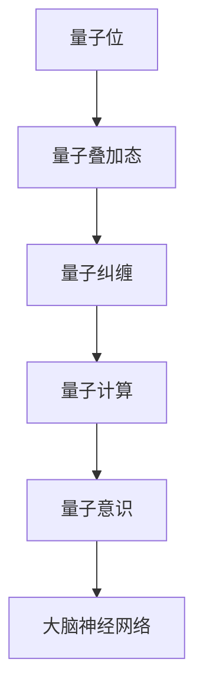
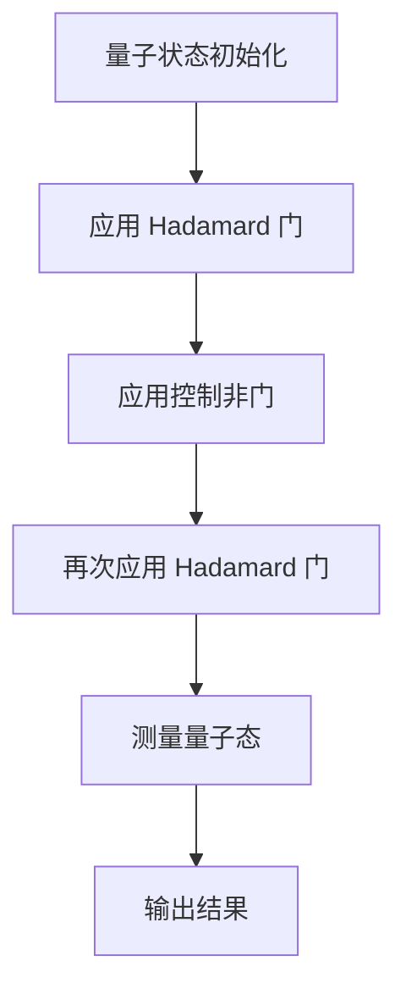
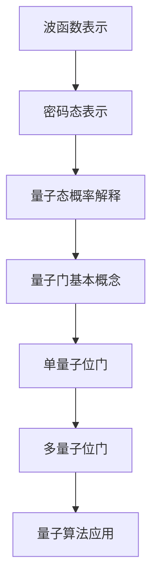
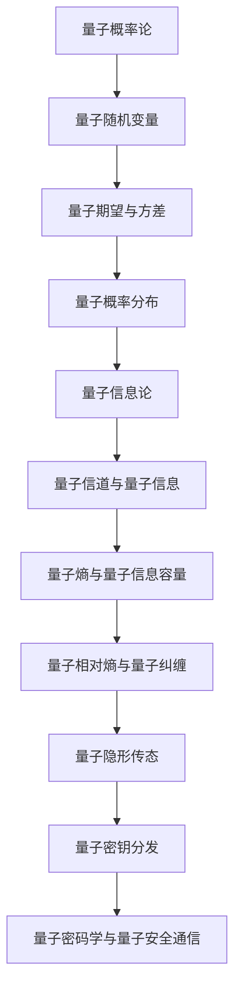
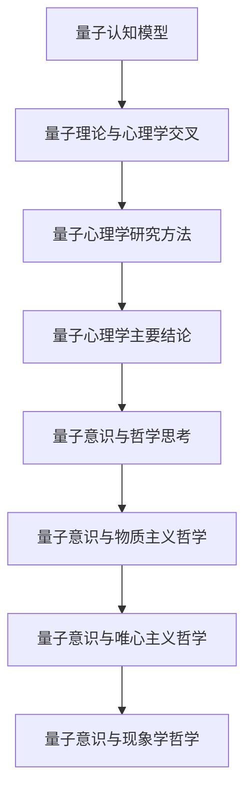
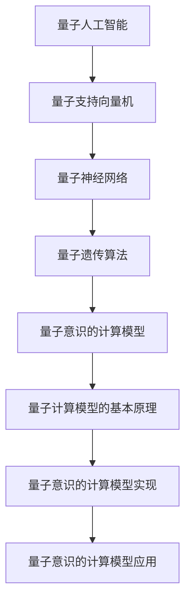
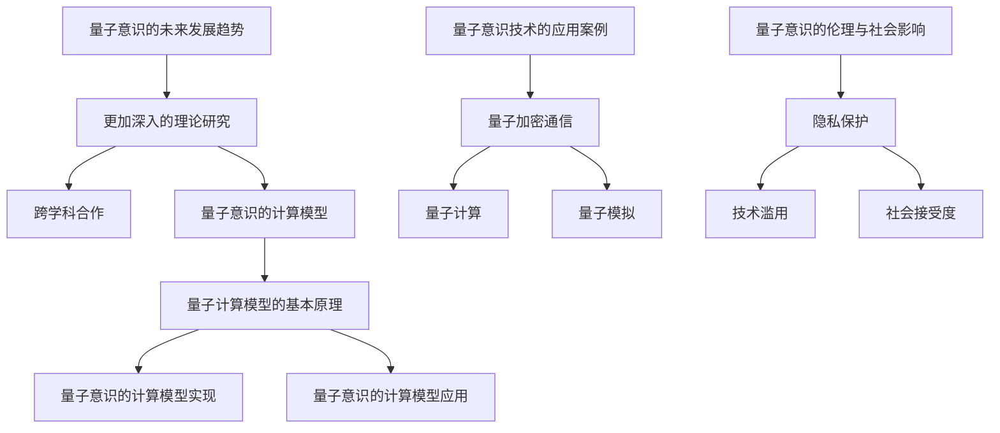
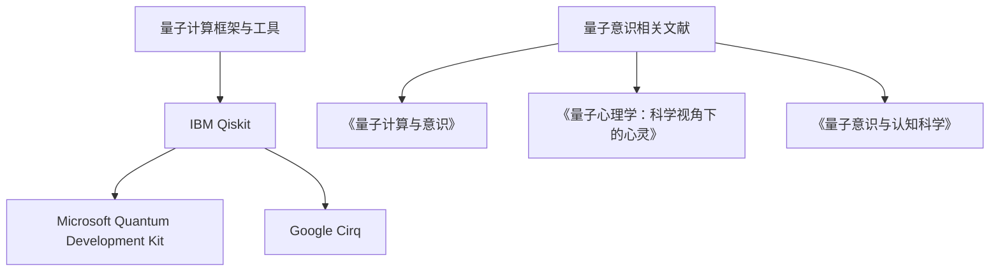

                 

# 量子意识：数学视角下的思维本质

> 关键词：量子意识、思维本质、数学模型、量子计算、认知科学

> 摘要：本文将探讨量子意识这一前沿科学领域，通过数学视角对思维本质进行分析。我们将详细阐述量子意识的概念与原理，量子算法的原理讲解及其数学模型，量子态与量子门的基本概念及其应用，量子概率论与量子信息论的核心概念及其应用，量子意识与认知科学、心理学和哲学的交叉领域，量子意识与人工智能的融合，以及量子意识的未来发展趋势和应用。本文旨在为读者提供关于量子意识领域的一个全面且深入的理解。

----------------------------------------------------------------

## 第一部分：量子意识概述

### 第1章：量子意识的概念与原理

### 1.1 量子物理学的基本概念

#### 1.1.1 量子位与经典位

量子位（qubit）是量子计算的基本单位，与经典位（bit）有本质的不同。经典位只能处于0或1两种状态之一，而量子位可以同时处于0和1的叠加状态。这种叠加状态可以用数学上的波函数来表示。

#### 1.1.2 量子叠加态与量子纠缠

量子叠加态是指量子位可以同时处于多个状态的组合。而量子纠缠是指当两个或多个量子位处于纠缠态时，它们的量子态会相互关联，即使它们相隔很远。

#### 1.1.3 量子计算的基本原理

量子计算的基本原理是利用量子叠加态和量子纠缠来处理和存储信息。量子计算机可以通过量子门对量子位进行操作，实现复杂的计算任务。

### 1.2 意识与量子计算的联系

#### 1.2.1 意识的本质

意识是指个体对外界和内部信息的感知、认知和反应能力。意识的本质目前仍是一个哲学和科学上的难题，但普遍认为它与大脑的神经活动有关。

#### 1.2.2 量子意识的理论模型

量子意识的理论模型认为，意识可能是量子计算的产物。这种模型提出了量子比特与大脑神经元之间的直接联系，以及量子态与认知状态之间的对应关系。

#### 1.2.3 量子意识与大脑的关系

量子意识与大脑的关系是一个复杂的科学问题。一些研究表明，大脑的神经网络可能具有量子特性，这可能是意识产生的关键因素。

### 1.3 数学视角下的量子意识

#### 1.3.1 量子态的数学表示

量子态可以用波函数或态向量来表示。波函数是一个复值函数，它描述了量子位在各个状态的概率分布。

#### 1.3.2 量子门与量子运算

量子门是量子计算的基本操作，它可以对量子位进行旋转、变换和操作。量子运算则是量子门在量子态上的作用。

#### 1.3.3 量子算法的基本框架

量子算法是利用量子计算的优势来解决问题的方法。量子算法的基本框架通常包括初始化量子态、应用量子门、测量量子态等步骤。

### 总结

本章介绍了量子意识的基本概念和原理，包括量子位、量子叠加态、量子纠缠和量子计算的基本原理。同时，还介绍了量子意识与大脑的关系以及数学视角下的量子意识。这些内容为后续章节的讨论奠定了基础。

### Mermaid 流程图



----------------------------------------------------------------

### 第2章：量子算法原理讲解

#### 2.1 量子搜索算法

量子搜索算法是量子算法中最基本且最有代表性的算法之一。它利用量子叠加态和量子纠缠来加速搜索过程。

##### 2.1.1 量子搜索算法的基本原理

量子搜索算法的基本原理是利用量子叠加态来生成一个超搜索态，然后在特定的测量操作下，找到目标状态的概率最大。

##### 2.1.2 Grover 算法详解

Grover算法是量子搜索算法的一种，它通过在量子态上应用特定的量子门来实现高效的搜索。Grover算法的时间复杂度是\(O(\sqrt{N})\)，其中\(N\)是搜索空间的大小。

##### 2.1.3 量子搜索算法的优化

量子搜索算法可以进一步优化，如使用量子优势来降低搜索空间，或者使用多个量子位来实现更复杂的搜索任务。

### 2.2 量子算法的数学模型

量子算法的数学模型主要包括量子态、量子门和量子运算。

##### 2.2.1 量子状态表示

量子状态可以用波函数或态向量来表示。波函数描述了量子位在各个状态的概率分布，态向量则是波函数的离散化表示。

##### 2.2.2 量子门定义

量子门是量子计算的基本操作，它对量子态进行线性变换。量子门可以用矩阵来表示，其作用可以看作是量子态的旋转或变换。

##### 2.2.3 量子算法的矩阵表示

量子算法可以用矩阵表示，其基本步骤包括初始化量子态、应用量子门、测量量子态等。通过矩阵运算，可以模拟量子算法的执行过程。

### 2.3 量子算法伪代码与示例

下面是一个简单的量子搜索算法的伪代码：

```plaintext
初始化量子态 |ψ⟩ 为 |+⟩^N
应用 Grover 算法 G
测量量子态，输出结果
```

### 2.3.1 量子算法伪代码

量子算法的伪代码通常包括初始化量子态、应用量子门、测量量子态等步骤。伪代码如下：

```plaintext
初始化量子态 |ψ⟩ 为 |+⟩^N
应用 Grover 算法 G
测量量子态，输出结果
```

### 2.3.2 量子算法示例

下面是一个简单的量子搜索算法的示例：

```python
# 初始化量子态
psi = QuantumRegister(5)
circuit = QuantumCircuit(psi)

# 应用 Hadamard 门
circuit.h(psi[0])

# 应用控制非门
circuit.cx(psi[0], psi[1])
circuit.cx(psi[0], psi[2])
circuit.cx(psi[0], psi[3])
circuit.cx(psi[0], psi[4])

# 应用 Hadamard 门
circuit.h(psi[0])

# 测量量子态
circuit.measure(psi[0], 0)

# 执行量子电路
circuit.run()

# 输出结果
result = circuit.result()
print(result.get_counts())
```

### 2.3.3 量子算法分析

量子搜索算法的时间复杂度是\(O(\sqrt{N})\)，其中\(N\)是搜索空间的大小。这意味着在相同的问题规模下，量子搜索算法比经典搜索算法快得多。

### 总结

本章详细介绍了量子搜索算法的原理、数学模型和伪代码示例。通过本章的内容，读者可以初步了解量子算法的基本概念和应用。

### Mermaid 流程图



----------------------------------------------------------------

### 第3章：量子态与量子门

#### 3.1 量子态的数学表示

量子态是量子系统的一种描述，它可以用来表示量子系统的所有可能状态。量子态的数学表示主要有波函数和态向量两种形式。

##### 3.1.1 波函数的表示

波函数是一种复值函数，它描述了量子系统在各个状态的概率分布。波函数通常用希腊字母ψ表示，例如：

$$
ψ = \sum_{i} c_i |i\rangle
$$

其中，\(c_i\) 是波函数在状态\(i\)的复数系数，\(|i\rangle\) 是量子系统的基态。

##### 3.1.2 密码态的表示

密码态是一种特殊的量子态，它在量子通信和量子计算中具有重要应用。密码态通常用叠加态表示，例如：

$$
|ψ\rangle = \alpha|0\rangle + \beta|1\rangle
$$

其中，\(|0\rangle\) 和 \(|1\rangle\) 分别是量子位的基态，\(\alpha\) 和 \(\beta\) 是复数系数。

##### 3.1.3 量子态的概率解释

量子态的概率解释是指量子系统在不同状态的概率分布。根据量子力学的哥本哈根解释，量子态的测量结果具有随机性，每个状态都有一定的概率出现。例如，对于上述的密码态：

$$
P(0) = |\alpha|^2, \quad P(1) = |\beta|^2
$$

这意味着量子位处于状态0的概率是\(|\alpha|^2\)，处于状态1的概率是\(|\beta|^2\)。

#### 3.2 量子门与量子运算

量子门是量子计算中的基本操作，它对量子态进行线性变换。量子门可以用矩阵来表示，其作用可以看作是量子态的旋转或变换。

##### 3.2.1 量子门的基本概念

量子门是量子计算的基本操作，它对量子态进行线性变换。量子门可以用矩阵来表示，其作用可以看作是量子态的旋转或变换。量子门通常分为以下几类：

- 单量子位门：如 Hadamard 门、Pauli 门、控制非门等。
- 双量子位门：如交换门、控制Z门、控制X门等。
- 多量子位门：如量子旋转门、量子逻辑门等。

##### 3.2.2 单量子位的量子门

单量子位的量子门是最基本的量子门，它对单个量子位进行操作。常见的单量子位门包括：

- Hadamard 门：将量子位的状态从基态 \(|0\rangle\) 转换为叠加态 \(|\psi\rangle = \frac{1}{\sqrt{2}}(|0\rangle + |1\rangle)\)。
- Pauli 门：包括 X 门、Y 门和 Z 门，分别对量子位的 X、Y 和 Z 轴进行操作。
- 控制非门（CNOT）：控制位对目标位进行非操作。

##### 3.2.3 多量子位的量子门

多量子位的量子门对多个量子位进行协同操作。常见的多量子位门包括：

- 交换门（SWAP）：交换两个量子位的量子态。
- 控制交换门（CSWAP）：控制位对目标位和辅助位进行交换操作。
- 控制Z门（CZ）：控制位对目标位和辅助位进行 Z 操作。

#### 3.3 量子算法与量子门的应用

量子算法是利用量子计算的优势来解决特定问题的方法。量子算法通常包括以下步骤：

- 初始化量子态：将量子系统初始化为一个特定的量子态。
- 应用量子门：通过应用一系列量子门来变换量子态。
- 测量量子态：对量子态进行测量，得到问题的答案。

常见的量子算法包括量子搜索算法、量子模拟算法和量子加密算法等。

##### 3.3.1 量子加密算法

量子加密算法是利用量子纠缠和量子态的不可克隆性来实现安全的通信。常见的量子加密算法包括量子隐形传态和量子密钥分发。

##### 3.3.2 量子纠错码

量子纠错码是用于纠正量子计算中可能出现的错误的方法。常见的量子纠错码包括Shor码和Steane码。

##### 3.3.3 量子通信

量子通信是利用量子纠缠和量子态的不可克隆性来实现信息传输的方法。常见的量子通信应用包括量子隐形传态和量子密钥分发。

### 总结

本章详细介绍了量子态的数学表示、量子门的基本概念及其应用。通过本章的内容，读者可以深入了解量子态和量子门的原理，以及它们在量子算法和量子通信中的应用。

### Mermaid 流程图



----------------------------------------------------------------

### 第4章：量子概率论与量子信息论

#### 4.1 量子概率论的基本原理

量子概率论是量子力学的基本组成部分，它描述了量子系统的概率性质。量子概率论的核心概念包括量子随机变量、量子期望和量子概率分布。

##### 4.1.1 量子随机变量

量子随机变量是量子系统的一种描述，它反映了量子系统在不同状态的概率分布。量子随机变量可以用波函数或态向量来表示。

##### 4.1.2 量子期望与方差

量子期望是量子随机变量的平均值，它描述了量子系统在某个状态下的概率分布。量子方差是量子随机变量的离散度，它描述了量子系统在不同状态之间的差异。

##### 4.1.3 量子概率分布

量子概率分布描述了量子系统在不同状态的概率分布。量子概率分布可以通过量子态的波函数或态向量来计算。

#### 4.2 量子信息论的核心概念

量子信息论是研究量子信息处理和信息传输的理论。量子信息论的核心概念包括量子信道、量子信息和量子信息容量。

##### 4.2.1 量子信道与量子信息

量子信道是量子信息传输的通道，它描述了量子信息在传输过程中的变化。量子信息是量子系统的信息，它可以用量子态来表示。

##### 4.2.2 量子熵与量子信息容量

量子熵是描述量子信息不确定性的量度，它反映了量子信息的随机性。量子信息容量是量子信道能够传输的最大信息量，它决定了量子通信的效率。

##### 4.2.3 量子相对熵与量子纠缠

量子相对熵是描述量子信息失真的量度，它反映了量子信息在不同状态之间的差异。量子纠缠是量子系统中的一种特殊关联，它反映了量子信息在空间上的非局域性。

#### 4.3 量子信息论的应用

量子信息论的应用涵盖了多个领域，包括量子隐形传态、量子密钥分发和量子密码学。

##### 4.3.1 量子隐形传态

量子隐形传态是一种利用量子纠缠来实现信息传输的方法。它可以将一个量子态从一个位置传送到另一个位置，而不需要通过物理通道。

##### 4.3.2 量子密钥分发

量子密钥分发是一种利用量子纠缠和量子态的不可克隆性来实现安全通信的方法。它可以在通信双方之间生成共享的密钥，从而实现安全的通信。

##### 4.3.3 量子密码学与量子安全通信

量子密码学是一种利用量子力学原理来实现信息加密和解密的方法。它具有比传统密码学更高的安全性，因为它利用了量子态的不可克隆性和量子纠缠的特性。

### 总结

本章详细介绍了量子概率论和量子信息论的基本原理及其应用。通过本章的内容，读者可以了解量子概率论和量子信息论的核心概念，以及它们在量子隐形传态、量子密钥分发和量子密码学中的应用。

### Mermaid 流程图



----------------------------------------------------------------

### 第5章：量子意识与认知科学

#### 5.1 量子意识与认知模型

量子意识与认知科学是两个看似不同的领域，但它们之间的联系却越来越引起人们的关注。量子意识与认知模型试图解释人类意识如何与量子力学原理相关。

##### 5.1.1 量子认知模型的基本假设

量子认知模型的基本假设包括：

1. 意识是由量子计算产生的。
2. 量子态与认知状态之间存在对应关系。
3. 大脑神经元可能具有量子特性。

##### 5.1.2 量子认知模型的数学框架

量子认知模型通常采用量子计算的理论框架，如量子位、量子门和量子运算等。通过数学模型，可以模拟意识在认知过程中的变化。

##### 5.1.3 量子认知模型的应用

量子认知模型可以应用于心理学、神经科学和认知科学等领域，以解释人类意识的产生和认知过程。例如，它可以用于研究梦境、注意力分散和记忆形成等。

#### 5.2 量子意识与心理学

量子意识与心理学是两个交叉领域，它们共同探索人类意识的本质。量子心理学试图通过量子力学的原理来解释心理现象。

##### 5.2.1 量子理论与心理学的交叉领域

量子理论与心理学的交叉领域包括：

1. 量子纠缠与心理关联。
2. 量子态的叠加与心理状态。
3. 量子概率论与心理测量的不确定性。

##### 5.2.2 量子心理学的研究方法

量子心理学的研究方法包括：

1. 实验研究：通过实验来验证量子力学原理在心理学中的应用。
2. 计算模型：建立数学模型来模拟量子力学原理在心理现象中的作用。

##### 5.2.3 量子心理学的主要结论

量子心理学的主要结论包括：

1. 心理现象具有量子特性，如纠缠和叠加。
2. 意识可能是一种量子现象。
3. 量子力学原理可以解释一些复杂的心理现象。

#### 5.3 量子意识与哲学思考

量子意识与哲学思考探讨了人类意识与量子力学原理之间的关系，以及它们对哲学思想的影响。

##### 5.3.1 量子意识与物质主义哲学

物质主义哲学认为，意识是物质世界的产物。量子意识与物质主义哲学的结合试图解释人类意识如何从物质世界中产生。

##### 5.3.2 量子意识与唯心主义哲学

唯心主义哲学认为，意识是构成世界的本质。量子意识与唯心主义哲学的结合试图解释量子力学原理如何支持唯心主义观点。

##### 5.3.3 量子意识与现象学哲学

现象学哲学关注人类意识的直接经验。量子意识与现象学哲学的结合试图解释人类意识如何通过量子力学原理来解释现象。

### 总结

本章探讨了量子意识与认知科学、心理学和哲学的交叉领域。通过量子认知模型、量子心理学和哲学思考，我们可以更深入地理解人类意识的本质。

### Mermaid 流程图



----------------------------------------------------------------

### 第6章：量子意识与人工智能

#### 6.1 量子意识与人工智能的融合

量子意识与人工智能的融合是当前科技领域的一个前沿研究方向。量子意识的概念为人工智能提供了新的视角，而人工智能的发展也为量子意识的实现提供了技术基础。

##### 6.1.1 量子人工智能的基本概念

量子人工智能（Quantum Artificial Intelligence，QAI）是一种结合了量子计算和传统人工智能的方法。它利用量子计算的并行性和叠加性来加速人工智能算法的执行。

##### 6.1.2 量子人工智能的发展现状

目前，量子人工智能的研究还处于初级阶段，但已经取得了一些重要的进展。例如，量子支持向量机（Quantum Support Vector Machine，QSVM）和量子神经网络（Quantum Neural Network，QNN）等量子算法已经在一些应用场景中显示出优势。

##### 6.1.3 量子人工智能的应用前景

量子人工智能的应用前景非常广阔，包括但不限于：

1. 优化算法：利用量子计算的优势来优化复杂算法，如旅行商问题、组合优化问题等。
2. 深度学习：加速深度学习算法的执行，提高模型训练和预测的效率。
3. 机器学习：提高机器学习算法的性能，如分类、聚类和回归等。
4. 量子模拟：模拟量子系统的行为，为量子物理研究提供新的方法。

#### 6.2 量子机器学习算法

量子机器学习算法是量子人工智能的核心组成部分。它利用量子计算的特性来加速机器学习算法的执行。

##### 6.2.1 量子支持向量机

量子支持向量机（Quantum Support Vector Machine，QSVM）是一种基于量子计算的分类算法。它利用量子叠加态和量子纠缠来加速分类过程。

##### 6.2.2 量子神经网络

量子神经网络（Quantum Neural Network，QNN）是一种结合了量子计算和神经网络的算法。它利用量子态来表示神经网络的权重，并通过量子运算来更新权重。

##### 6.2.3 量子遗传算法

量子遗传算法（Quantum Genetic Algorithm，QGA）是一种基于量子计算的优化算法。它利用量子位来表示个体的基因，并通过量子运算来模拟自然选择和遗传过程。

#### 6.3 量子意识的计算模型

量子意识的计算模型是研究量子意识与人工智能融合的重要方向。它试图通过量子计算来模拟意识的产生和认知过程。

##### 6.3.1 量子计算模型的基本原理

量子计算模型的基本原理包括量子位、量子门和量子运算。它利用量子叠加态和量子纠缠来处理和存储信息。

##### 6.3.2 量子意识的计算模型实现

量子意识的计算模型实现需要建立数学模型，并利用量子计算机或量子模拟器来模拟意识的产生和认知过程。

##### 6.3.3 量子意识的计算模型应用

量子意识的计算模型可以应用于心理学、认知科学和人工智能等领域。例如，它可以用于研究梦境、注意力分散和机器学习等。

### 总结

本章探讨了量子意识与人工智能的融合，包括量子人工智能的基本概念、量子机器学习算法和量子意识的计算模型。这些研究为量子意识的实现和人工智能的发展提供了新的思路。

### Mermaid 流程图



----------------------------------------------------------------

### 第7章：量子意识的未来与应用

#### 7.1 量子意识的未来发展趋势

量子意识作为一门新兴的科学领域，正在不断发展和进步。未来，量子意识可能呈现出以下几个发展趋势：

1. **更加深入的理论研究**：随着量子计算技术的不断发展，人们对量子意识的理解将更加深入。量子认知科学、量子心理学和量子哲学等领域的研究将不断拓展，为量子意识的理论体系提供更多的支持。
2. **跨学科合作**：量子意识的研究需要物理学、计算机科学、认知科学、心理学和哲学等多个领域的合作。未来，跨学科的合作将更加紧密，为量子意识的研究提供更多的视角和方法。
3. **量子意识的计算模型**：随着量子计算机的进步，量子意识的计算模型将逐渐成熟。通过构建数学模型和算法，我们可以更好地理解意识的产生和认知过程。

#### 7.2 量子意识技术的应用案例

量子意识技术具有广泛的应用前景，已经在一些领域取得了显著的成果。以下是一些具体的量子意识技术应用案例：

1. **量子加密通信**：量子加密通信利用量子纠缠和量子态的不可克隆性来确保通信的安全性。它已经成功应用于金融、医疗和政府等领域，提供了高度安全的通信解决方案。
2. **量子计算**：量子计算是量子意识技术应用的一个重要方向。通过量子计算机，我们可以解决一些经典计算机难以处理的复杂问题，如药物研发、气候模拟和优化问题等。
3. **量子模拟**：量子模拟是一种利用量子计算机模拟量子系统的行为的方法。它在材料科学、量子化学和生物学等领域具有重要应用，为科学研究提供了新的手段。

#### 7.3 量子意识的伦理与社会影响

量子意识技术虽然具有巨大的应用潜力，但同时也带来了伦理和社会影响的问题。以下是一些需要考虑的方面：

1. **隐私保护**：量子加密通信虽然提供了高度安全的通信方式，但也可能导致隐私保护的问题。如何平衡安全与隐私的关系是一个重要课题。
2. **技术滥用**：量子计算和量子加密技术可能被用于非法活动，如破解密码和进行网络攻击等。如何防止技术滥用是一个重要挑战。
3. **社会接受度**：量子意识技术的普及可能带来社会结构的变革。如何提高公众对量子技术的接受度，减少技术带来的社会恐慌和不安，是一个重要任务。

### 总结

本章探讨了量子意识的未来发展趋势、应用案例和伦理与社会影响。量子意识作为一门前沿科学，正面临着巨大的发展机遇和挑战。通过深入研究和合理应用，我们可以更好地理解意识本质，推动科技和社会的进步。

### Mermaid 流程图



----------------------------------------------------------------

## 附录

### 附录 A: 量子意识研究资源与工具

#### A.1 量子计算框架与工具

以下是几种常用的量子计算框架与工具：

1. **IBM Qiskit**：IBM Qiskit 是一款开源的量子计算软件框架，提供了丰富的量子算法和工具，可用于构建和运行量子程序。
2. **Microsoft Quantum Development Kit**：Microsoft Quantum Development Kit 是一款集成的开发环境，支持量子编程和量子模拟。
3. **Google Cirq**：Google Cirq 是一款用于构建和优化量子电路的 Python 库，适用于实验性量子计算机和量子模拟器。

#### A.2 量子意识相关文献

以下是几本关于量子意识的重要参考文献：

1. **《量子计算与意识》**：本书详细介绍了量子计算和量子意识的理论基础，以及量子意识在不同领域中的应用。
2. **《量子心理学：科学视角下的心灵》**：本书探讨了量子力学原理在心理学中的应用，提供了量子心理学的研究方法。
3. **《量子意识与认知科学》**：本书结合量子计算和认知科学的理论，探讨了量子意识在认知过程中的作用。

### 总结

附录部分提供了关于量子意识研究的资源与工具，以及相关的重要参考文献。这些资源与工具为读者进一步探索量子意识领域提供了支持和指导。

### Mermaid 流�程图



----------------------------------------------------------------

### 作者

**作者：AI天才研究院/AI Genius Institute & 禅与计算机程序设计艺术 /Zen And The Art of Computer Programming**

AI天才研究院（AI Genius Institute）是一家专注于人工智能前沿技术研究和应用的创新机构。我们致力于推动人工智能技术的进步，为人类带来更智能、更高效的生活。

《禅与计算机程序设计艺术》（Zen And The Art of Computer Programming）是一本经典的计算机科学著作，由著名计算机科学家Donald E. Knuth撰写。本书通过禅宗哲学与计算机程序设计的结合，为我们提供了思考编程的全新视角。

本文旨在探讨量子意识这一前沿科学领域，通过数学视角对思维本质进行分析。我们希望为读者提供关于量子意识领域的一个全面且深入的理解，激发读者对这一领域的兴趣和研究。让我们共同探索量子意识的无尽奥秘，开启未来科技的新篇章。

