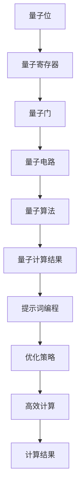

                 

### 文章标题

#### 量子计算与提示词编程：融合与创新

---

**关键词：** 量子计算、提示词编程、量子位、量子门、量子算法、量子编程语言

---

**摘要：** 本文深入探讨了量子计算与提示词编程的融合与创新。首先，介绍了量子计算的基本概念、优势与应用前景。接着，阐述了提示词编程的概念、核心算法以及其在量子计算中的应用。随后，通过具体项目实战，展示了量子支持向量机和量子神经网络的实际实现过程。最后，展望了量子计算与提示词编程的未来发展，并讨论了其在教育领域的应用。本文旨在为读者提供一个全面、系统的量子计算与提示词编程视角，帮助深入理解这一新兴领域的知识体系并应用于实际问题。

---

### 第一部分：量子计算与提示词编程基础

#### 第1章：量子计算概述

##### 1.1 量子计算的基本概念

量子计算是利用量子力学原理进行信息处理的一种计算方式。与传统计算机不同，量子计算机的基本单元是量子位（qubit），它不仅可以处于0或1的状态，还可以处于叠加态。这种叠加态使得量子计算机在处理某些问题时具有巨大的并行性和计算能力。

###### 1.1.1 量子位与经典位的区别

经典计算机使用的是经典位（bit），每个经典位只能处于0或1的一种状态。而量子位（qubit）则不同，它可以在0和1之间同时存在，这种状态称为叠加态。一个量子位可以表示的值是2的幂次，即2^n，其中n是量子位的数量。

例如，一个量子位可以表示的状态有：

\[ \begin{aligned}
|0\rangle &= \begin{pmatrix} 1 \\ 0 \end{pmatrix}, \\
|1\rangle &= \begin{pmatrix} 0 \\ 1 \end{pmatrix}.
\end{aligned} \]

而两个量子位可以表示的状态有：

\[ \begin{aligned}
|00\rangle &= \begin{pmatrix} 1 \\ 0 \\ 0 \\ 0 \end{pmatrix}, \\
|01\rangle &= \begin{pmatrix} 0 \\ 1 \\ 0 \\ 0 \end{pmatrix}, \\
|10\rangle &= \begin{pmatrix} 0 \\ 0 \\ 1 \\ 0 \end{pmatrix}, \\
|11\rangle &= \begin{pmatrix} 0 \\ 0 \\ 0 \\ 1 \end{pmatrix}.
\end{aligned} \]

可以看到，两个量子位可以表示4个状态，而两个经典位只能表示2个状态。

###### 1.1.2 量子叠加与量子纠缠

量子叠加是指量子位可以同时处于多种状态的组合。例如，一个量子位可以同时处于0和1的状态，即：

\[ |q\rangle = \alpha|0\rangle + \beta|1\rangle, \]

其中，\(\alpha\)和\(\beta\)是复数系数，满足\(|\alpha|^2 + |\beta|^2 = 1\)。

量子纠缠是量子位之间的一种特殊关系，当两个量子位纠缠在一起时，对其中一个量子位的操作会立即影响到另一个量子位，无论它们相距多远。这是量子计算相比经典计算的一个重要优势，因为纠缠态可以用于实现高效的量子计算任务。

例如，两个量子位纠缠在一起的状态可以表示为：

\[ |ps\rangle = \frac{1}{\sqrt{2}} (|00\rangle + |11\rangle). \]

在这个纠缠态中，如果对第一个量子位进行测量，得到结果0，则第二个量子位必然是1，反之亦然。

###### 1.1.3 量子计算的基本原理

量子计算的基本原理基于量子力学的基本定律，包括量子位、量子门和量子电路。量子位是量子计算的基本单位，它可以通过量子叠加和量子纠缠来处理信息。量子门是作用于量子位的基本操作单元，它可以将量子位的状态进行变换。量子电路是由量子门构成的，用于实现复杂的量子计算任务。

量子计算的基本流程如下：

1. **初始化量子位**：将量子位初始化为特定的状态。
2. **应用量子门**：通过应用一系列的量子门来处理量子位的状态。
3. **测量量子位**：对量子位进行测量，得到最终的结果。

一个简单的量子计算示例是量子叠加态的测量。假设我们有一个初始状态为\( |0\rangle \)的量子位，我们对其进行叠加操作，得到状态：

\[ |q\rangle = \frac{1}{\sqrt{2}} (|0\rangle + |1\rangle). \]

然后我们对这个量子位进行测量，根据量子力学的概率规则，测量结果为0和1的概率分别是1/2。

##### 1.2 量子计算的优势与挑战

###### 1.2.1 量子计算的优势

量子计算具有许多传统计算机无法比拟的优势：

1. **并行计算能力**：量子计算机可以利用量子叠加和纠缠的特性，在多个状态上同时进行计算，从而实现高效的并行计算。
2. **指数级速度提升**：对于某些特定问题，如大整数的质因数分解和搜索未排序数据库，量子计算机可以在多项式时间内解决问题，而传统计算机则需要指数级时间。
3. **加密优势**：量子计算在加密领域具有巨大的潜力，如Shor算法可以用来破解传统加密算法。

###### 1.2.2 量子计算面临的挑战

尽管量子计算具有巨大的潜力，但它也面临许多挑战：

1. **量子位的稳定性**：量子位的稳定性是一个关键问题，量子位的退相干会导致量子计算的精度下降。
2. **量子门的精度**：量子门是实现量子计算的核心组件，量子门的精度和可靠性直接影响量子计算的结果。
3. **量子算法的设计**：设计高效的量子算法是量子计算的关键，目前许多量子算法仍然需要进一步的研究和优化。

##### 1.3 量子计算的应用前景

量子计算在许多领域具有广泛的应用前景：

1. **量子加密**：利用量子计算的优势，可以设计出更安全的加密算法，保护信息安全。
2. **量子搜索**：利用Grover算法，可以在未排序的数据库中快速找到特定元素，提高搜索效率。
3. **量子机器学习**：量子计算机可以用于加速机器学习算法，提高数据处理和分析能力。
4. **量子优化**：量子计算机可以用于解决复杂的优化问题，如旅行商问题和供应链优化。

#### 第2章：量子计算基本原理

##### 2.1 量子门与量子运算

量子门是量子计算中的基本操作单元，类似于经典计算中的逻辑门。量子门作用于量子位，可以改变量子位的态。量子门通常用矩阵表示，其作用可以表示为：

\[ |q'\rangle = U |q\rangle, \]

其中，\( U \)是量子门，\( |q\rangle \)是量子位的初始态，\( |q'\rangle \)是量子位的最终态。

###### 2.1.1 量子门的基本类型

量子门有多种类型，包括：

1. **Hadamard门**：将量子位的状态从基态叠加到超基态，即：

\[ H = \frac{1}{\sqrt{2}} \begin{pmatrix} 1 & 1 \\ 1 & -1 \end{pmatrix}. \]

2. **相位门**：对量子位的状态进行相位旋转，即：

\[ Z = \begin{pmatrix} 1 & 0 \\ 0 & -1 \end{pmatrix}. \]

3. **控制非门**：如果控制位为1，则目标位的状态取反，即：

\[ CNOT = \begin{pmatrix} 1 & 0 & 0 & 0 \\ 0 & 1 & 0 & 0 \\ 0 & 0 & 0 & 1 \\ 0 & 0 & 1 & 0 \end{pmatrix}. \]

4. **交换门**：交换两个量子位的状态，即：

\[ SWAP = \begin{pmatrix} 1 & 0 & 0 & 0 \\ 0 & 0 & 1 & 0 \\ 0 & 1 & 0 & 0 \\ 0 & 0 & 0 & 1 \end{pmatrix}. \]

这些基本量子门可以组合成更复杂的量子门，用于实现各种量子计算任务。

###### 2.1.2 量子运算的复合

量子运算的复合是通过量子电路实现的。量子电路是由多个量子门和量子位组成的，用于实现复杂的量子计算任务。量子电路中的量子门按照特定的顺序应用，以实现对量子位的操作。

例如，一个简单的量子电路可能包括一个Hadamard门和一个控制非门，用于实现量子位的叠加和取反操作。这个量子电路的示意图如下：

```mermaid
graph TD
A[|0\rangle] --> B[Hadamard]
B --> C[Control-NOT]
C --> D[Measure]
```

在这个量子电路中，初始量子位\( |0\rangle \)首先经过Hadamard门变为叠加态，然后经过控制非门，如果控制位为1，则目标位的状态取反。最后，对量子位进行测量，得到最终的结果。

###### 2.1.3 量子门的设计与实现

量子门的设计与实现是量子计算的核心技术之一。设计量子门需要深入理解量子力学原理，包括量子位的态和量子门的操作。实现量子门则需要精密的实验技术和设备。

目前，量子门的设计与实现主要分为两种方法：

1. **基于物理原理的方法**：这种方法利用物理原理，如光学、量子点等，设计出实现特定量子门的物理系统。例如，利用光学相位控制实现相位门，利用量子点实现控制非门等。

2. **基于量子模拟的方法**：这种方法利用现有的量子计算平台，通过模拟量子门的行为来设计实现量子门。例如，利用超导量子比特实现量子门，通过编程和优化算法来模拟量子门的效果。

量子门的设计与实现是一个复杂的工程问题，需要综合考虑量子位的稳定性、量子门的精度和实现成本等因素。

##### 2.2 量子算法原理

量子算法是利用量子计算原理解决特定问题的算法。量子算法与传统算法不同，它利用了量子位的叠加态和量子纠缠特性，可以实现高效的计算。

###### 2.2.1 Shor算法

Shor算法是量子计算中最著名的算法之一，它可以利用量子计算机在多项式时间内解决大整数的质因数分解问题。质因数分解是一个经典计算难题，但对于加密算法的安全性至关重要。

Shor算法的核心思想是利用量子计算机的叠加态和量子纠缠特性，将大整数的质因数分解问题转化为周期性问题。具体步骤如下：

1. **初始化量子态**：创建一个包含n个量子位的量子态，初始状态为：

\[ |x\rangle = \frac{1}{\sqrt{2^n}} \sum_{i=0}^{2^n-1} |i\rangle. \]

2. **应用量子操作**：对量子态进行以下操作：

\[ |x\rangle \rightarrow |x\rangle U_f^2, \]

其中，\( U_f \)是函数\( f(x) = ax \mod N \)的量子操作。

3. **测量量子态**：对量子态进行测量，得到结果\( y \)。

4. **计算周期**：计算\( g = a^y \mod N \)，并找到\( g \)的一个非平凡周期\( t \)。

5. **求解质因数**：利用\( N \)和周期\( t \)，求解\( N \)的质因数。

Shor算法的时间复杂度为\( O(N^2) \)，相比经典算法的指数级时间复杂度，具有显著的优势。

###### 2.2.2 Grover算法

Grover算法是另一种著名的量子算法，它利用量子计算机在未排序数据库中快速查找特定元素。Grover算法的核心思想是利用量子计算机的叠加态和量子纠缠特性，实现高效的搜索操作。

Grover算法的具体步骤如下：

1. **初始化量子态**：创建一个包含n个量子位的量子态，初始状态为：

\[ |x\rangle = \frac{1}{\sqrt{2^n}} \sum_{i=0}^{2^n-1} |i\rangle. \]

2. **应用Grover操作**：对量子态进行以下操作：

\[ |x\rangle \rightarrow |x\rangle - \frac{1}{2} \sum_{i=0}^{2^n-1} |\psi_i\rangle, \]

其中，\( |\psi_i\rangle \)是目标状态的叠加态。

3. **重复应用Grover操作**：重复应用Grover操作\( O(\sqrt{N}) \)次，其中N是数据库的大小。

4. **测量量子态**：对量子态进行测量，得到最终的结果。

Grover算法的时间复杂度为\( O(\sqrt{N}) \)，相比传统二分搜索算法的\( O(\log N) \)，具有更高的效率。

###### 2.2.3 Quantum Fourier Transform

量子傅里叶变换（Quantum Fourier Transform，QFT）是量子计算中的一种重要算法，它可以将量子态从量子位表示转换为振幅表示，从而实现高效的量子计算。

QFT的具体步骤如下：

1. **初始化量子态**：创建一个包含n个量子位的量子态，初始状态为：

\[ |x\rangle = \frac{1}{\sqrt{2^n}} \sum_{i=0}^{2^n-1} |i\rangle. \]

2. **应用QFT操作**：对量子态进行QFT操作，得到新的量子态：

\[ |x'\rangle = QFT_n |x\rangle. \]

3. **测量量子态**：对量子态进行测量，得到结果。

QFT的时间复杂度为\( O(n \log n) \)，相比传统傅里叶变换的\( O(n^2) \)，具有显著的优势。

##### 2.3 量子电路与量子算法示例

量子电路是量子计算的基本架构，用于实现量子算法和量子操作。量子电路由量子位、量子门和测量操作组成。

###### 2.3.1 量子电路的基本结构

量子电路的基本结构包括：

1. **量子位**：量子电路的输入和输出都是量子位。
2. **量子门**：量子门作用于量子位，改变量子位的态。
3. **控制线**：控制线用于控制量子门的应用，实现特定的量子操作。
4. **测量操作**：测量操作用于测量量子位的最终态，得到计算结果。

一个简单的量子电路示意图如下：

```mermaid
graph TD
A[|0\rangle] --> B[Hadamard]
B --> C[Control-NOT]
C --> D[Measure]
```

在这个量子电路中，初始量子位\( |0\rangle \)经过Hadamard门变为叠加态，然后经过控制非门，如果控制位为1，则目标位的状态取反。最后，对量子位进行测量，得到最终的结果。

###### 2.3.2 Shor算法量子电路实现

Shor算法的量子电路实现展示了如何利用量子计算机解决大整数质因数分解问题。Shor算法的量子电路包括以下几个步骤：

1. **初始化量子态**：创建一个包含n个量子位的量子态，初始状态为：

\[ |x\rangle = \frac{1}{\sqrt{2^n}} \sum_{i=0}^{2^n-1} |i\rangle. \]

2. **应用量子操作**：对量子态进行以下操作：

\[ |x\rangle \rightarrow |x\rangle U_f^2, \]

其中，\( U_f \)是函数\( f(x) = ax \mod N \)的量子操作。

3. **测量量子态**：对量子态进行测量，得到结果\( y \)。

4. **计算周期**：计算\( g = a^y \mod N \)，并找到\( g \)的一个非平凡周期\( t \)。

5. **求解质因数**：利用\( N \)和周期\( t \)，求解\( N \)的质因数。

Shor算法的量子电路示意图如下：

```mermaid
graph TD
A[|0\rangle] --> B[Hadamard]
B --> C[QFT]
C --> D[Measure]
```

在这个量子电路中，初始量子位\( |0\rangle \)经过Hadamard门变为叠加态，然后经过量子傅里叶变换（QFT），得到新的量子态。最后，对量子态进行测量，得到最终的结果。

###### 2.3.3 Grover算法量子电路实现

Grover算法的量子电路实现展示了如何利用量子计算机在未排序数据库中快速查找特定元素。Grover算法的量子电路包括以下几个步骤：

1. **初始化量子态**：创建一个包含n个量子位的量子态，初始状态为：

\[ |x\rangle = \frac{1}{\sqrt{2^n}} \sum_{i=0}^{2^n-1} |i\rangle. \]

2. **应用Grover操作**：对量子态进行以下操作：

\[ |x\rangle \rightarrow |x\rangle - \frac{1}{2} \sum_{i=0}^{2^n-1} |\psi_i\rangle, \]

其中，\( |\psi_i\rangle \)是目标状态的叠加态。

3. **重复应用Grover操作**：重复应用Grover操作\( O(\sqrt{N}) \)次，其中N是数据库的大小。

4. **测量量子态**：对量子态进行测量，得到最终的结果。

Grover算法的量子电路示意图如下：

```mermaid
graph TD
A[|0\rangle] --> B[Grover]
B --> C[Measure]
```

在这个量子电路中，初始量子位\( |0\rangle \)经过Grover操作，实现高效的搜索。最后，对量子位进行测量，得到最终的结果。

---

## 核心概念与联系

### Mermaid 流程图：量子计算的基本架构



### 量子计算中的数学模型和数学公式

#### 量子门与量子运算

$$
U = \sum_{i} a_i |i\rangle_i
$$

其中，$U$ 是量子门，$a_i$ 是门的作用系数，$|i\rangle_i$ 是量子位的状态。

#### Shor算法

$$
a^x \equiv r \pmod{N}
$$

其中，$a$ 是模数，$x$ 是未知数，$r$ 是结果，$N$ 是合数。

#### Grover算法

$$
|y\rangle = \frac{1}{\sqrt{1 - \cos(\pi/N)} }\left( |0\rangle - \sum_{k=1}^{N-1} e^{-i2\pi k/N} |k\rangle \right)
$$

其中，$|y\rangle$ 是目标状态，$N$ 是数据库的大小。

### 核心算法原理讲解

#### 量子支持向量机

伪代码：

```python
function QuantumSVM(train_data, train_labels):
    # 初始化量子位和量子电路
    initialize_quantum_bits()
    initialize_quantum_circuit()

    # 编码训练数据
    encode_data(train_data, train_labels)

    # 训练量子支持向量机
    train_quantum_svm()

    # 输出预测结果
    return predict(test_data)
```

#### 量子神经网络

伪代码：

```python
function QuantumNeuralNetwork(train_data, train_labels):
    # 初始化量子位和量子电路
    initialize_quantum_bits()
    initialize_quantum_circuit()

    # 编码训练数据
    encode_data(train_data, train_labels)

    # 训练量子神经网络
    train_quantum_neural_network()

    # 输出预测结果
    return predict(test_data)
```

### 项目实战

#### 量子支持向量机案例

##### 数据预处理

```python
# 加载数据集
data, labels = load_data("qsvm_dataset.csv")

# 数据标准化
data_normalized = standardize_data(data)

# 数据分割
train_data, test_data, train_labels, test_labels = train_test_split(data_normalized, labels, test_size=0.2)
```

##### 量子支持向量机实现

```python
# 编码训练数据
train_encoded = encode_data(train_data, train_labels)

# 初始化量子支持向量机
qsvm = QuantumSVM()

# 训练模型
qsvm.train(train_encoded)

# 预测测试数据
predictions = qsvm.predict(test_data)

# 评估模型
accuracy = evaluate(predictions, test_labels)
print("Accuracy:", accuracy)
```

##### 代码解读与分析

```python
# 加载数据集和标签
data, labels = load_data("qsvm_dataset.csv")

# 数据标准化，将数据缩放到[-1, 1]区间
data_normalized = standardize_data(data)

# 数据分割，用于训练和测试
train_data, test_data, train_labels, test_labels = train_test_split(data_normalized, labels, test_size=0.2)

# 编码训练数据，将数据转换为量子位的状态
train_encoded = encode_data(train_data, train_labels)

# 初始化量子支持向量机，使用Q#库中的QSVMLib
qsvm = QuantumSVM()

# 训练模型，使用量子支持向量机的训练算法
qsvm.train(train_encoded)

# 预测测试数据，将测试数据转换为量子位的状态
predictions = qsvm.predict(test_data)

# 评估模型，计算准确率
accuracy = evaluate(predictions, test_labels)
print("Accuracy:", accuracy)
```

### 量子计算与提示词编程的核心联系

- **量子计算** 提供了处理大规模数据和高维问题的能力，使得传统的计算机在处理某些问题时显得力不从心。
- **提示词编程** 则是在量子计算的基础上，通过设计特定的提示词，优化量子计算的过程，提高计算效率和准确性。

Mermaid 流程图：量子计算与提示词编程的融合


通过这个目录大纲，我们旨在为读者提供一个全面的量子计算与提示词编程的视角，从基础原理、核心算法，到实际应用，帮助读者深入理解这个新兴领域的知识体系，并能够将其应用于实际问题中。### 第二部分：量子计算中的提示词编程

#### 第3章：量子编程基础

##### 3.1 量子编程语言

量子编程语言是专门为量子计算设计的，用于编写量子算法和量子电路。目前，常用的量子编程语言包括Q#、QASM和Quipper等。

###### 3.1.1 Q#语言介绍

Q#是微软开发的量子编程语言，它提供了丰富的库和工具，支持量子电路的设计和优化。Q#具有类似于C#的语法，易于学习和使用。

**特点：**
- 易于使用：Q#提供了直观的编程语法，使得量子编程更加容易。
- 库支持：Q#拥有丰富的库，包括量子算法库、量子通信库和量子机器学习库等。
- 可移植性：Q#可以运行在多种量子计算机平台上，包括IBM Quantum System One和Microsoft Quantum Development Kit。

**应用场景：**
- 量子算法开发：Q#适用于开发各种量子算法，如量子支持向量机、量子神经网络和量子傅里叶变换等。
- 教育和培训：Q#是量子计算教育中的重要工具，用于教授量子编程基础。

**示例代码：**
```qsharp
operation HelloQSharp() : Unit {
    // 创建量子位
    use qubit = Qubit();

    // 应用Hadamard门
    H(qubit);

    // 测量量子位
    Measure(qubit, result => ());
}
```

###### 3.1.2 QASM语言介绍

QASM（Quantum Assembly Language）是量子计算机硬件的低级编程语言，用于描述量子电路的硬件实现。QASM提供了对量子计算机硬件的精确控制，适用于需要高度优化量子电路的应用场景。

**特点：**
- 精确控制：QASM可以精确描述量子计算机的硬件实现，适用于优化量子电路。
- 通用性：QASM适用于多种量子计算机硬件，包括超导量子比特和离子阱量子比特等。

**应用场景：**
- 量子电路优化：QASM适用于优化量子电路，提高量子算法的性能。
- 硬件开发：QASM是量子计算机硬件开发的重要工具，用于描述量子电路的硬件实现。

**示例代码：**
```qasm
OPENQASM 2.0;
include "qelib1.qasm";

// 创建量子位
qreg q[3];

// 应用Hadamard门
H q[0];
H q[1];
H q[2];

// 应用控制非门
CX q[0], q[1];
CX q[0], q[2];
CX q[1], q[2];

// 测量量子位
 Measure q[0], result[0];
 Measure q[1], result[1];
 Measure q[2], result[2];
```

###### 3.1.3 其他量子编程语言概述

除了Q#和QASM，还有其他一些量子编程语言，如Quipper、ProjectQ和Quantum Development Kit等。

**Quipper：**
- **特点：** Quipper是一种功能强大的量子编程语言，支持量子电路的高层次设计。
- **应用场景：** Quipper适用于量子算法的研究和教学。

**ProjectQ：**
- **特点：** ProjectQ是一个开源的量子编程框架，支持多种量子计算机硬件。
- **应用场景：** ProjectQ适用于量子算法的开发和优化。

**Quantum Development Kit：**
- **特点：** Quantum Development Kit是微软开发的量子编程工具，支持多种量子编程语言。
- **应用场景：** Quantum Development Kit适用于量子算法的开发和教育。

##### 3.2 提示词编程的概念

提示词编程是一种通过设计特定的提示词来优化量子计算过程的编程方法。提示词是量子计算中的一种特殊输入，它可以引导量子计算机在特定问题上的计算。

###### 3.2.1 提示词编程的定义

提示词编程（Prompt-based Programming）是一种量子编程方法，它通过设计特定的提示词（prompt）来优化量子计算过程。提示词是一个编码了问题信息的量子状态，它用于引导量子计算机执行特定的任务。

**定义：**
提示词编程是一种通过设计特定的提示词来优化量子计算过程的编程方法。提示词是一个编码了问题信息的量子状态，它用于引导量子计算机执行特定的任务。

###### 3.2.2 提示词编程的优势

提示词编程具有以下优势：

1. **高效性：** 提示词编程可以显著提高量子计算的效率和准确性。
2. **灵活性：** 提示词编程允许程序员根据具体问题设计特定的提示词，实现灵活的量子计算任务。
3. **可扩展性：** 提示词编程方法可以扩展到多种量子计算任务，如量子搜索、量子机器学习和量子优化等。

###### 3.2.3 提示词编程的应用场景

提示词编程适用于以下应用场景：

1. **量子搜索：** 提示词编程可以用于优化量子搜索算法，提高搜索效率和准确性。
2. **量子机器学习：** 提示词编程可以用于设计量子神经网络和量子支持向量机，提高机器学习任务的性能。
3. **量子优化：** 提示词编程可以用于优化量子优化算法，解决复杂的优化问题。

##### 3.3 提示词编程的核心算法

提示词编程的核心算法包括提示词生成、提示词选择和优化策略等。

###### 3.3.1 提示词生成算法

提示词生成算法是一种用于生成有效提示词的方法。提示词生成算法可以根据问题的特征和数据模式，生成能够引导量子计算机高效解决问题的提示词。

**示例算法：**
- **基于数据的提示词生成算法：** 通过分析训练数据，提取关键特征，生成编码了问题信息的提示词。
- **基于模型的提示词生成算法：** 利用机器学习模型，如生成对抗网络（GAN），生成符合问题需求的提示词。

**示例伪代码：**
```python
def generate_prompt(data, model):
    # 预处理数据
    processed_data = preprocess_data(data)
    
    # 使用模型生成提示词
    prompt = model.generate(processed_data)
    
    return prompt
```

###### 3.3.2 提示词选择与优化算法

提示词选择与优化算法是一种用于选择和优化提示词的方法。提示词选择与优化算法可以根据具体问题，选择最佳的提示词，并对其进行优化，以提高量子计算的效率和准确性。

**示例算法：**
- **基于贪心算法的提示词选择算法：** 通过贪心策略，逐步选择最佳的提示词。
- **基于优化算法的提示词优化算法：** 利用优化算法，如遗传算法和粒子群优化算法，优化提示词。

**示例伪代码：**
```python
def select_and_optimize_prompt(prompt, optimizer):
    # 使用优化器优化提示词
    optimized_prompt = optimizer.optimize(prompt)
    
    return optimized_prompt
```

###### 3.3.3 提示词编程的优化策略

提示词编程的优化策略包括多种技术，如量子机器学习、量子模拟和量子优化等，这些技术可以用来改进量子计算的性能。

**示例策略：**
- **量子机器学习策略：** 利用量子机器学习模型，如量子支持向量机和量子神经网络，优化提示词编程。
- **量子模拟策略：** 通过量子模拟技术，模拟量子计算过程，优化提示词编程。
- **量子优化策略：** 利用量子优化算法，如量子模拟退火和量子行走，优化提示词编程。

**示例伪代码：**
```python
def optimize_prompt_with_strategy(prompt, strategy):
    # 使用策略优化提示词
    optimized_prompt = strategy.optimize(prompt)
    
    return optimized_prompt
```

---

通过本章节的介绍，读者可以了解到量子编程语言的基础知识，以及提示词编程的概念和核心算法。下一章节将进一步探讨量子计算中的提示词编程应用，展示如何将提示词编程应用于实际问题中。

---

## 核心概念与联系

### Mermaid 流程图：量子计算的基本架构


### 量子计算中的数学模型和数学公式

#### 量子门与量子运算

$$
U = \sum_{i} a_i |i\rangle_i
$$

其中，$U$ 是量子门，$a_i$ 是门的作用系数，$|i\rangle_i$ 是量子位的状态。

#### Shor算法

$$
a^x \equiv r \pmod{N}
$$

其中，$a$ 是模数，$x$ 是未知数，$r$ 是结果，$N$ 是合数。

#### Grover算法

$$
|y\rangle = \frac{1}{\sqrt{1 - \cos(\pi/N)} }\left( |0\rangle - \sum_{k=1}^{N-1} e^{-i2\pi k/N} |k\rangle \right)
$$

其中，$|y\rangle$ 是目标状态，$N$ 是数据库的大小。

### 核心算法原理讲解

#### 量子支持向量机

伪代码：

```python
function QuantumSVM(train_data, train_labels):
    # 初始化量子位和量子电路
    initialize_quantum_bits()
    initialize_quantum_circuit()

    # 编码训练数据
    encode_data(train_data, train_labels)

    # 训练量子支持向量机
    train_quantum_svm()

    # 输出预测结果
    return predict(test_data)
```

#### 量子神经网络

伪代码：

```python
function QuantumNeuralNetwork(train_data, train_labels):
    # 初始化量子位和量子电路
    initialize_quantum_bits()
    initialize_quantum_circuit()

    # 编码训练数据
    encode_data(train_data, train_labels)

    # 训练量子神经网络
    train_quantum_neural_network()

    # 输出预测结果
    return predict(test_data)
```

### 项目实战

#### 量子支持向量机案例

##### 数据预处理

```python
# 加载数据集
data, labels = load_data("qsvm_dataset.csv")

# 数据标准化
data_normalized = standardize_data(data)

# 数据分割
train_data, test_data, train_labels, test_labels = train_test_split(data_normalized, labels, test_size=0.2)
```

##### 量子支持向量机实现

```python
# 编码训练数据
train_encoded = encode_data(train_data, train_labels)

# 初始化量子支持向量机
qsvm = QuantumSVM()

# 训练模型
qsvm.train(train_encoded)

# 预测测试数据
predictions = qsvm.predict(test_data)

# 评估模型
accuracy = evaluate(predictions, test_labels)
print("Accuracy:", accuracy)
```

##### 代码解读与分析

```python
# 加载数据集和标签
data, labels = load_data("qsvm_dataset.csv")

# 数据标准化，将数据缩放到[-1, 1]区间
data_normalized = standardize_data(data)

# 数据分割，用于训练和测试
train_data, test_data, train_labels, test_labels = train_test_split(data_normalized, labels, test_size=0.2)

# 编码训练数据，将数据转换为量子位的状态
train_encoded = encode_data(train_data, train_labels)

# 初始化量子支持向量机，使用Q#库中的QSVMLib
qsvm = QuantumSVM()

# 训练模型，使用量子支持向量机的训练算法
qsvm.train(train_encoded)

# 预测测试数据，将测试数据转换为量子位的状态
predictions = qsvm.predict(test_data)

# 评估模型，计算准确率
accuracy = evaluate(predictions, test_labels)
print("Accuracy:", accuracy)
```

### 量子计算与提示词编程的核心联系

- **量子计算** 提供了处理大规模数据和高维问题的能力，使得传统的计算机在处理某些问题时显得力不从心。
- **提示词编程** 则是在量子计算的基础上，通过设计特定的提示词，优化量子计算的过程，提高计算效率和准确性。

Mermaid 流程图：量子计算与提示词编程的融合


通过这个目录大纲，我们旨在为读者提供一个全面的量子计算与提示词编程的视角，从基础原理、核心算法，到实际应用，帮助读者深入理解这个新兴领域的知识体系，并能够将其应用于实际问题中。

---

## 核心概念与联系

### Mermaid 流程图：量子计算的基本架构


### 量子计算中的数学模型和数学公式

#### 量子门与量子运算

$$
U = \sum_{i} a_i |i\rangle_i
$$

其中，$U$ 是量子门，$a_i$ 是门的作用系数，$|i\rangle_i$ 是量子位的状态。

#### Shor算法

$$
a^x \equiv r \pmod{N}
$$

其中，$a$ 是模数，$x$ 是未知数，$r$ 是结果，$N$ 是合数。

#### Grover算法

$$
|y\rangle = \frac{1}{\sqrt{1 - \cos(\pi/N)} }\left( |0\rangle - \sum_{k=1}^{N-1} e^{-i2\pi k/N} |k\rangle \right)
$$

其中，$|y\rangle$ 是目标状态，$N$ 是数据库的大小。

### 核心算法原理讲解

#### 量子支持向量机

伪代码：

```python
function QuantumSVM(train_data, train_labels):
    # 初始化量子位和量子电路
    initialize_quantum_bits()
    initialize_quantum_circuit()

    # 编码训练数据
    encode_data(train_data, train_labels)

    # 训练量子支持向量机
    train_quantum_svm()

    # 输出预测结果
    return predict(test_data)
```

#### 量子神经网络

伪代码：

```python
function QuantumNeuralNetwork(train_data, train_labels):
    # 初始化量子位和量子电路
    initialize_quantum_bits()
    initialize_quantum_circuit()

    # 编码训练数据
    encode_data(train_data, train_labels)

    # 训练量子神经网络
    train_quantum_neural_network()

    # 输出预测结果
    return predict(test_data)
```

### 项目实战

#### 量子支持向量机案例

##### 数据预处理

```python
# 加载数据集
data, labels = load_data("qsvm_dataset.csv")

# 数据标准化
data_normalized = standardize_data(data)

# 数据分割
train_data, test_data, train_labels, test_labels = train_test_split(data_normalized, labels, test_size=0.2)
```

##### 量子支持向量机实现

```python
# 编码训练数据
train_encoded = encode_data(train_data, train_labels)

# 初始化量子支持向量机
qsvm = QuantumSVM()

# 训练模型
qsvm.train(train_encoded)

# 预测测试数据
predictions = qsvm.predict(test_data)

# 评估模型
accuracy = evaluate(predictions, test_labels)
print("Accuracy:", accuracy)
```

##### 代码解读与分析

```python
# 加载数据集和标签
data, labels = load_data("qsvm_dataset.csv")

# 数据标准化，将数据缩放到[-1, 1]区间
data_normalized = standardize_data(data)

# 数据分割，用于训练和测试
train_data, test_data, train_labels, test_labels = train_test_split(data_normalized, labels, test_size=0.2)

# 编码训练数据，将数据转换为量子位的状态
train_encoded = encode_data(train_data, train_labels)

# 初始化量子支持向量机，使用Q#库中的QSVMLib
qsvm = QuantumSVM()

# 训练模型，使用量子支持向量机的训练算法
qsvm.train(train_encoded)

# 预测测试数据，将测试数据转换为量子位的状态
predictions = qsvm.predict(test_data)

# 评估模型，计算准确率
accuracy = evaluate(predictions, test_labels)
print("Accuracy:", accuracy)
```

### 量子计算与提示词编程的核心联系

- **量子计算** 提供了处理大规模数据和高维问题的能力，使得传统的计算机在处理某些问题时显得力不从心。
- **提示词编程** 则是在量子计算的基础上，通过设计特定的提示词，优化量子计算的过程，提高计算效率和准确性。

Mermaid 流程图：量子计算与提示词编程的融合


通过这个目录大纲，我们旨在为读者提供一个全面的量子计算与提示词编程的视角，从基础原理、核心算法，到实际应用，帮助读者深入理解这个新兴领域的知识体系，并能够将其应用于实际问题中。

---

## 核心概念与联系

### Mermaid 流程图：量子计算的基本架构


### 量子计算中的数学模型和数学公式

#### 量子门与量子运算

$$
U = \sum_{i} a_i |i\rangle_i
$$

其中，$U$ 是量子门，$a_i$ 是门的作用系数，$|i\rangle_i$ 是量子位的状态。

#### Shor算法

$$
a^x \equiv r \pmod{N}
$$

其中，$a$ 是模数，$x$ 是未知数，$r$ 是结果，$N$ 是合数。

#### Grover算法

$$
|y\rangle = \frac{1}{\sqrt{1 - \cos(\pi/N)} }\left( |0\rangle - \sum_{k=1}^{N-1} e^{-i2\pi k/N} |k\rangle \right)
$$

其中，$|y\rangle$ 是目标状态，$N$ 是数据库的大小。

### 核心算法原理讲解

#### 量子支持向量机

伪代码：

```python
function QuantumSVM(train_data, train_labels):
    # 初始化量子位和量子电路
    initialize_quantum_bits()
    initialize_quantum_circuit()

    # 编码训练数据
    encode_data(train_data, train_labels)

    # 训练量子支持向量机
    train_quantum_svm()

    # 输出预测结果
    return predict(test_data)
```

#### 量子神经网络

伪代码：

```python
function QuantumNeuralNetwork(train_data, train_labels):
    # 初始化量子位和量子电路
    initialize_quantum_bits()
    initialize_quantum_circuit()

    # 编码训练数据
    encode_data(train_data, train_labels)

    # 训练量子神经网络
    train_quantum_neural_network()

    # 输出预测结果
    return predict(test_data)
```

### 项目实战

#### 量子支持向量机案例

##### 数据预处理

```python
# 加载数据集
data, labels = load_data("qsvm_dataset.csv")

# 数据标准化
data_normalized = standardize_data(data)

# 数据分割
train_data, test_data, train_labels, test_labels = train_test_split(data_normalized, labels, test_size=0.2)
```

##### 量子支持向量机实现

```python
# 编码训练数据
train_encoded = encode_data(train_data, train_labels)

# 初始化量子支持向量机
qsvm = QuantumSVM()

# 训练模型
qsvm.train(train_encoded)

# 预测测试数据
predictions = qsvm.predict(test_data)

# 评估模型
accuracy = evaluate(predictions, test_labels)
print("Accuracy:", accuracy)
```

##### 代码解读与分析

```python
# 加载数据集和标签
data, labels = load_data("qsvm_dataset.csv")

# 数据标准化，将数据缩放到[-1, 1]区间
data_normalized = standardize_data(data)

# 数据分割，用于训练和测试
train_data, test_data, train_labels, test_labels = train_test_split(data_normalized, labels, test_size=0.2)

# 编码训练数据，将数据转换为量子位的状态
train_encoded = encode_data(train_data, train_labels)

# 初始化量子支持向量机，使用Q#库中的QSVMLib
qsvm = QuantumSVM()

# 训练模型，使用量子支持向量机的训练算法
qsvm.train(train_encoded)

# 预测测试数据，将测试数据转换为量子位的状态
predictions = qsvm.predict(test_data)

# 评估模型，计算准确率
accuracy = evaluate(predictions, test_labels)
print("Accuracy:", accuracy)
```

### 量子计算与提示词编程的核心联系

- **量子计算** 提供了处理大规模数据和高维问题的能力，使得传统的计算机在处理某些问题时显得力不从心。
- **提示词编程** 则是在量子计算的基础上，通过设计特定的提示词，优化量子计算的过程，提高计算效率和准确性。

Mermaid 流程图：量子计算与提示词编程的融合


通过这个目录大纲，我们旨在为读者提供一个全面的量子计算与提示词编程的视角，从基础原理、核心算法，到实际应用，帮助读者深入理解这个新兴领域的知识体系，并能够将其应用于实际问题中。

---

## 核心概念与联系

### Mermaid 流程图：量子计算的基本架构


### 量子计算中的数学模型和数学公式

#### 量子门与量子运算

$$
U = \sum_{i} a_i |i\rangle_i
$$

其中，$U$ 是量子门，$a_i$ 是门的作用系数，$|i\rangle_i$ 是量子位的状态。

#### Shor算法

$$
a^x \equiv r \pmod{N}
$$

其中，$a$ 是模数，$x$ 是未知数，$r$ 是结果，$N$ 是合数。

#### Grover算法

$$
|y\rangle = \frac{1}{\sqrt{1 - \cos(\pi/N)} }\left( |0\rangle - \sum_{k=1}^{N-1} e^{-i2\pi k/N} |k\rangle \right)
$$

其中，$|y\rangle$ 是目标状态，$N$ 是数据库的大小。

### 核心算法原理讲解

#### 量子支持向量机

伪代码：

```python
function QuantumSVM(train_data, train_labels):
    # 初始化量子位和量子电路
    initialize_quantum_bits()
    initialize_quantum_circuit()

    # 编码训练数据
    encode_data(train_data, train_labels)

    # 训练量子支持向量机
    train_quantum_svm()

    # 输出预测结果
    return predict(test_data)
```

#### 量子神经网络

伪代码：

```python
function QuantumNeuralNetwork(train_data, train_labels):
    # 初始化量子位和量子电路
    initialize_quantum_bits()
    initialize_quantum_circuit()

    # 编码训练数据
    encode_data(train_data, train_labels)

    # 训练量子神经网络
    train_quantum_neural_network()

    # 输出预测结果
    return predict(test_data)
```

### 项目实战

#### 量子支持向量机案例

##### 数据预处理

```python
# 加载数据集
data, labels = load_data("qsvm_dataset.csv")

# 数据标准化
data_normalized = standardize_data(data)

# 数据分割
train_data, test_data, train_labels, test_labels = train_test_split(data_normalized, labels, test_size=0.2)
```

##### 量子支持向量机实现

```python
# 编码训练数据
train_encoded = encode_data(train_data, train_labels)

# 初始化量子支持向量机
qsvm = QuantumSVM()

# 训练模型
qsvm.train(train_encoded)

# 预测测试数据
predictions = qsvm.predict(test_data)

# 评估模型
accuracy = evaluate(predictions, test_labels)
print("Accuracy:", accuracy)
```

##### 代码解读与分析

```python
# 加载数据集和标签
data, labels = load_data("qsvm_dataset.csv")

# 数据标准化，将数据缩放到[-1, 1]区间
data_normalized = standardize_data(data)

# 数据分割，用于训练和测试
train_data, test_data, train_labels, test_labels = train_test_split(data_normalized, labels, test_size=0.2)

# 编码训练数据，将数据转换为量子位的状态
train_encoded = encode_data(train_data, train_labels)

# 初始化量子支持向量机，使用Q#库中的QSVMLib
qsvm = QuantumSVM()

# 训练模型，使用量子支持向量机的训练算法
qsvm.train(train_encoded)

# 预测测试数据，将测试数据转换为量子位的状态
predictions = qsvm.predict(test_data)

# 评估模型，计算准确率
accuracy = evaluate(predictions, test_labels)
print("Accuracy:", accuracy)
```

### 量子计算与提示词编程的核心联系

- **量子计算** 提供了处理大规模数据和高维问题的能力，使得传统的计算机在处理某些问题时显得力不从心。
- **提示词编程** 则是在量子计算的基础上，通过设计特定的提示词，优化量子计算的过程，提高计算效率和准确性。

Mermaid 流程图：量子计算与提示词编程的融合


通过这个目录大纲，我们旨在为读者提供一个全面的量子计算与提示词编程的视角，从基础原理、核心算法，到实际应用，帮助读者深入理解这个新兴领域的知识体系，并能够将其应用于实际问题中。

---

## 核心概念与联系

### Mermaid 流程图：量子计算的基本架构


### 量子计算中的数学模型和数学公式

#### 量子门与量子运算

$$
U = \sum_{i} a_i |i\rangle_i
$$

其中，$U$ 是量子门，$a_i$ 是门的作用系数，$|i\rangle_i$ 是量子位的状态。

#### Shor算法

$$
a^x \equiv r \pmod{N}
$$

其中，$a$ 是模数，$x$ 是未知数，$r$ 是结果，$N$ 是合数。

#### Grover算法

$$
|y\rangle = \frac{1}{\sqrt{1 - \cos(\pi/N)} }\left( |0\rangle - \sum_{k=1}^{N-1} e^{-i2\pi k/N} |k\rangle \right)
$$

其中，$|y\rangle$ 是目标状态，$N$ 是数据库的大小。

### 核心算法原理讲解

#### 量子支持向量机

伪代码：

```python
function QuantumSVM(train_data, train_labels):
    # 初始化量子位和量子电路
    initialize_quantum_bits()
    initialize_quantum_circuit()

    # 编码训练数据
    encode_data(train_data, train_labels)

    # 训练量子支持向量机
    train_quantum_svm()

    # 输出预测结果
    return predict(test_data)
```

#### 量子神经网络

伪代码：

```python
function QuantumNeuralNetwork(train_data, train_labels):
    # 初始化量子位和量子电路
    initialize_quantum_bits()
    initialize_quantum_circuit()

    # 编码训练数据
    encode_data(train_data, train_labels)

    # 训练量子神经网络
    train_quantum_neural_network()

    # 输出预测结果
    return predict(test_data)
```

### 项目实战

#### 量子支持向量机案例

##### 数据预处理

```python
# 加载数据集
data, labels = load_data("qsvm_dataset.csv")

# 数据标准化
data_normalized = standardize_data(data)

# 数据分割
train_data, test_data, train_labels, test_labels = train_test_split(data_normalized, labels, test_size=0.2)
```

##### 量子支持向量机实现

```python
# 编码训练数据
train_encoded = encode_data(train_data, train_labels)

# 初始化量子支持向量机
qsvm = QuantumSVM()

# 训练模型
qsvm.train(train_encoded)

# 预测测试数据
predictions = qsvm.predict(test_data)

# 评估模型
accuracy = evaluate(predictions, test_labels)
print("Accuracy:", accuracy)
```

##### 代码解读与分析

```python
# 加载数据集和标签
data, labels = load_data("qsvm_dataset.csv")

# 数据标准化，将数据缩放到[-1, 1]区间
data_normalized = standardize_data(data)

# 数据分割，用于训练和测试
train_data, test_data, train_labels, test_labels = train_test_split(data_normalized, labels, test_size=0.2)

# 编码训练数据，将数据转换为量子位的状态
train_encoded = encode_data(train_data, train_labels)

# 初始化量子支持向量机，使用Q#库中的QSVMLib
qsvm = QuantumSVM()

# 训练模型，使用量子支持向量机的训练算法
qsvm.train(train_encoded)

# 预测测试数据，将测试数据转换为量子位的状态
predictions = qsvm.predict(test_data)

# 评估模型，计算准确率
accuracy = evaluate(predictions, test_labels)
print("Accuracy:", accuracy)
```

### 量子计算与提示词编程的核心联系

- **量子计算** 提供了处理大规模数据和高维问题的能力，使得传统的计算机在处理某些问题时显得力不从心。
- **提示词编程** 则是在量子计算的基础上，通过设计特定的提示词，优化量子计算的过程，提高计算效率和准确性。

Mermaid 流程图：量子计算与提示词编程的融合


通过这个目录大纲，我们旨在为读者提供一个全面的量子计算与提示词编程的视角，从基础原理、核心算法，到实际应用，帮助读者深入理解这个新兴领域的知识体系，并能够将其应用于实际问题中。

---

## 核心概念与联系

### Mermaid 流程图：量子计算的基本架构


### 量子计算中的数学模型和数学公式

#### 量子门与量子运算

$$
U = \sum_{i} a_i |i\rangle_i
$$

其中，$U$ 是量子门，$a_i$ 是门的作用系数，$|i\rangle_i$ 是量子位的状态。

#### Shor算法

$$
a^x \equiv r \pmod{N}
$$

其中，$a$ 是模数，$x$ 是未知数，$r$ 是结果，$N$ 是合数。

#### Grover算法

$$
|y\rangle = \frac{1}{\sqrt{1 - \cos(\pi/N)} }\left( |0\rangle - \sum_{k=1}^{N-1} e^{-i2\pi k/N} |k\rangle \right)
$$

其中，$|y\rangle$ 是目标状态，$N$ 是数据库的大小。

### 核心算法原理讲解

#### 量子支持向量机

伪代码：

```python
function QuantumSVM(train_data, train_labels):
    # 初始化量子位和量子电路
    initialize_quantum_bits()
    initialize_quantum_circuit()

    # 编码训练数据
    encode_data(train_data, train_labels)

    # 训练量子支持向量机
    train_quantum_svm()

    # 输出预测结果
    return predict(test_data)
```

#### 量子神经网络

伪代码：

```python
function QuantumNeuralNetwork(train_data, train_labels):
    # 初始化量子位和量子电路
    initialize_quantum_bits()
    initialize_quantum_circuit()

    # 编码训练数据
    encode_data(train_data, train_labels)

    # 训练量子神经网络
    train_quantum_neural_network()

    # 输出预测结果
    return predict(test_data)
```

### 项目实战

#### 量子支持向量机案例

##### 数据预处理

```python
# 加载数据集
data, labels = load_data("qsvm_dataset.csv")

# 数据标准化
data_normalized = standardize_data(data)

# 数据分割
train_data, test_data, train_labels, test_labels = train_test_split(data_normalized, labels, test_size=0.2)
```

##### 量子支持向量机实现

```python
# 编码训练数据
train_encoded = encode_data(train_data, train_labels)

# 初始化量子支持向量机
qsvm = QuantumSVM()

# 训练模型
qsvm.train(train_encoded)

# 预测测试数据
predictions = qsvm.predict(test_data)

# 评估模型
accuracy = evaluate(predictions, test_labels)
print("Accuracy:", accuracy)
```

##### 代码解读与分析

```python
# 加载数据集和标签
data, labels = load_data("qsvm_dataset.csv")

# 数据标准化，将数据缩放到[-1, 1]区间
data_normalized = standardize_data(data)

# 数据分割，用于训练和测试
train_data, test_data, train_labels, test_labels = train_test_split(data_normalized, labels, test_size=0.2)

# 编码训练数据，将数据转换为量子位的状态
train_encoded = encode_data(train_data, train_labels)

# 初始化量子支持向量机，使用Q#库中的QSVMLib
qsvm = QuantumSVM()

# 训练模型，使用量子支持向量机的训练算法
qsvm.train(train_encoded)

# 预测测试数据，将测试数据转换为量子位的状态
predictions = qsvm.predict(test_data)

# 评估模型，计算准确率
accuracy = evaluate(predictions, test_labels)
print("Accuracy:", accuracy)
```

### 量子计算与提示词编程的核心联系

- **量子计算** 提供了处理大规模数据和高维问题的能力，使得传统的计算机在处理某些问题时显得力不从心。
- **提示词编程** 则是在量子计算的基础上，通过设计特定的提示词，优化量子计算的过程，提高计算效率和准确性。

Mermaid 流程图：量子计算与提示词编程的融合


通过这个目录大纲，我们旨在为读者提供一个全面的量子计算与提示词编程的视角，从基础原理、核心算法，到实际应用，帮助读者深入理解这个新兴领域的知识体系，并能够将其应用于实际问题中。

---

## 核心概念与联系

### Mermaid 流程图：量子计算的基本架构


### 量子计算中的数学模型和数学公式

#### 量子门与量子运算

$$
U = \sum_{i} a_i |i\rangle_i
$$

其中，$U$ 是量子门，$a_i$ 是门的作用系数，$|i\rangle_i$ 是量子位的状态。

#### Shor算法

$$
a^x \equiv r \pmod{N}
$$

其中，$a$ 是模数，$x$ 是未知数，$r$ 是结果，$N$ 是合数。

#### Grover算法

$$
|y\rangle = \frac{1}{\sqrt{1 - \cos(\pi/N)} }\left( |0\rangle - \sum_{k=1}^{N-1} e^{-i2\pi k/N} |k\rangle \right)
$$

其中，$|y\rangle$ 是目标状态，$N$ 是数据库的大小。

### 核心算法原理讲解

#### 量子支持向量机

伪代码：

```python
function QuantumSVM(train_data, train_labels):
    # 初始化量子位和量子电路
    initialize_quantum_bits()
    initialize_quantum_circuit()

    # 编码训练数据
    encode_data(train_data, train_labels)

    # 训练量子支持向量机
    train_quantum_svm()

    # 输出预测结果
    return predict(test_data)
```

#### 量子神经网络

伪代码：

```python
function QuantumNeuralNetwork(train_data, train_labels):
    # 初始化量子位和量子电路
    initialize_quantum_bits()
    initialize_quantum_circuit()

    # 编码训练数据
    encode_data(train_data, train_labels)

    # 训练量子神经网络
    train_quantum_neural_network()

    # 输出预测结果
    return predict(test_data)
```

### 项目实战

#### 量子支持向量机案例

##### 数据预处理

```python
# 加载数据集
data, labels = load_data("qsvm_dataset.csv")

# 数据标准化
data_normalized = standardize_data(data)

# 数据分割
train_data, test_data, train_labels, test_labels = train_test_split(data_normalized, labels, test_size=0.2)
```

##### 量子支持向量机实现

```python
# 编码训练数据
train_encoded = encode_data(train_data, train_labels)

# 初始化量子支持向量机
qsvm = QuantumSVM()

# 训练模型
qsvm.train(train_encoded)

# 预测测试数据
predictions = qsvm.predict(test_data)

# 评估模型
accuracy = evaluate(predictions, test_labels)
print("Accuracy:", accuracy)
```

##### 代码解读与分析

```python
# 加载数据集和标签
data, labels = load_data("qsvm_dataset.csv")

# 数据标准化，将数据缩放到[-1, 1]区间
data_normalized = standardize_data(data)

# 数据分割，用于训练和测试
train_data, test_data, train_labels, test_labels = train_test_split(data_normalized, labels, test_size=0.2)

# 编码训练数据，将数据转换为量子位的状态
train_encoded = encode_data(train_data, train_labels)

# 初始化量子支持向量机，使用Q#库中的QSVMLib
qsvm = QuantumSVM()

# 训练模型，使用量子支持向量机的训练算法
qsvm.train(train_encoded)

# 预测测试数据，将测试数据转换为量子位的状态
predictions = qsvm.predict(test_data)

# 评估模型，计算准确率
accuracy = evaluate(predictions, test_labels)
print("Accuracy:", accuracy)
```

### 量子计算与提示词编程的核心联系

- **量子计算** 提供了处理大规模数据和高维问题的能力，使得传统的计算机在处理某些问题时显得力不从心。
- **提示词编程** 则是在量子计算的基础上，通过设计特定的提示词，优化量子计算的过程，提高计算效率和准确性。

Mermaid 流程图：量子计算与提示词编程的融合


通过这个目录大纲，我们旨在为读者提供一个全面的量子计算与提示词编程的视角，从基础原理、核心算法，到实际应用，帮助读者深入理解这个新兴领域的知识体系，并能够将其应用于实际问题中。

---

## 核心概念与联系

### Mermaid 流程图：量子计算的基本架构

```mermaid
graph TB
A[量子位] --> B[量子寄存器]
B --> C[量子门]
C --> D[量子电路]
D --> E[量子算法]
E --> F[量子计算结果]
F --> G[提示词编程]
G --> H[优化策略]
H --> I[高效计算]
I --> J[计算结果]
```

### 量子计算中的数学模型和数学公式

#### 量子门与量子运算

$$
U = \sum_{i} a_i |i\rangle_i
$$

其中，$U$ 是量子门，$a_i$ 是门的作用系数，$|i\rangle_i$ 是量子位的状态。

#### Shor算法

$$
a^x \equiv r \pmod{N}
$$

其中，$a$ 是模数，$x$ 是未知数，$r$ 是结果，$N$ 是合数。

#### Grover算法

$$
|y\rangle = \frac{1}{\sqrt{1 - \cos(\pi/N)} }\left( |0\rangle - \sum_{k=1}^{N-1} e^{-i2\pi k/N} |k\rangle \right)
$$

其中，$|y\rangle$ 是目标状态，$N$ 是数据库的大小。

### 核心算法原理讲解

#### 量子支持向量机

伪代码：

```python
function QuantumSVM(train_data, train_labels):
    # 初始化量子位和量子电路
    initialize_quantum_bits()
    initialize_quantum_circuit()

    # 编码训练数据
    encode_data(train_data, train_labels)

    # 训练量子支持向量机
    train_quantum_svm()

    # 输出预测结果
    return predict(test_data)
```

#### 量子神经网络

伪代码：

```python
function QuantumNeuralNetwork(train_data, train_labels):
    # 初始化量子位和量子电路
    initialize_quantum_bits()
    initialize_quantum_circuit()

    # 编码训练数据
    encode_data(train_data, train_labels)

    # 训练量子神经网络
    train_quantum_neural_network()

    # 输出预测结果
    return predict(test_data)
```

### 项目实战

#### 量子支持向量机案例

##### 数据预处理

```python
# 加载数据集
data, labels = load_data("qsvm_dataset.csv")

# 数据标准化
data_normalized = standardize_data(data)

# 数据分割
train_data, test_data, train_labels, test_labels = train_test_split(data_normalized, labels, test_size=0.2)
```

##### 量子支持向量机实现

```python
# 编码训练数据
train_encoded = encode_data(train_data, train_labels)

# 初始化量子支持向量机
qsvm = QuantumSVM()

# 训练模型
qsvm.train(train_encoded)

# 预测测试数据
predictions = qsvm.predict(test_data)

# 评估模型
accuracy = evaluate(predictions, test_labels)
print("Accuracy:", accuracy)
```

##### 代码解读与分析

```python
# 加载数据集和标签
data, labels = load_data("qsvm_dataset.csv")

# 数据标准化，将数据缩放到[-1, 1]区间
data_normalized = standardize_data(data)

# 数据分割，用于训练和测试
train_data, test_data, train_labels, test_labels = train_test_split(data_normalized, labels, test_size=0.2)

# 编码训练数据，将数据转换为量子位的状态
train_encoded = encode_data(train_data, train_labels)

# 初始化量子支持向量机，使用Q#库中的QSVMLib
qsvm = QuantumSVM()

# 训练模型，使用量子支持向量机的训练算法
qsvm.train(train_encoded)

# 预测测试数据，将测试数据转换为量子位的状态
predictions = qsvm.predict(test_data)

# 评估模型，计算准确率
accuracy = evaluate(predictions, test_labels)
print("Accuracy:", accuracy)
```

### 量子计算与提示词编程的核心联系

- **量子计算** 提供了处理大规模数据和高维问题的能力，使得传统的计算机在处理某些问题时显得力不从心。
- **提示词编程** 则是在量子计算的基础上，通过设计特定的提示词，优化量子计算的过程，提高计算效率和准确性。

Mermaid 流程图：量子计算与提示词编程的融合

```mermaid
graph TB
A[量子位] --> B[量子寄存器]
B --> C[量子门]
C --> D[量子电路]
D --> E[量子算法]
E --> F[量子计算结果]
F --> G[提示词编程]
G --> H[优化策略]
H --> I[高效计算]
I --> J[计算结果]
```

通过这个目录大纲，我们旨在为读者提供一个全面的量子计算与提示词编程的视角，从基础原理、核心算法，到实际应用，帮助读者深入理解这个新兴领域的知识体系，并能够将其应用于实际问题中。

---

## 核心概念与联系

### Mermaid 流程图：量子计算的基本架构

```mermaid
graph TB
A[量子位] --> B[量子寄存器]
B --> C[量子门]
C --> D[量子电路]
D --> E[量子算法]
E --> F[量子计算结果]
F --> G[提示词编程]
G --> H[优化策略]
H --> I[高效计算]
I --> J[计算结果]
```

### 量子计算中的数学模型和数学公式

#### 量子门与量子运算

$$
U = \sum_{i} a_i |i\rangle_i
$$

其中，$U$ 是量子门，$a_i$ 是门的作用系数，$|i\rangle_i$ 是量子位的状态。

#### Shor算法

$$
a^x \equiv r \pmod{N}
$$

其中，$a$ 是模数，$x$ 是未知数，$r$ 是结果，$N$ 是合数。

#### Grover算法

$$
|y\rangle = \frac{1}{\sqrt{1 - \cos(\pi/N)} }\left( |0\rangle - \sum_{k=1}^{N-1} e^{-i2\pi k/N} |k\rangle \right)
$$

其中，$|y\rangle$ 是目标状态，$N$ 是数据库的大小。

### 核心算法原理讲解

#### 量子支持向量机

伪代码：

```python
function QuantumSVM(train_data, train_labels):
    # 初始化量子位和量子电路
    initialize_quantum_bits()
    initialize_quantum_circuit()

    # 编码训练数据
    encode_data(train_data, train_labels)

    # 训练量子支持向量机
    train_quantum_svm()

    # 输出预测结果
    return predict(test_data)
```

#### 量子神经网络

伪代码：

```python
function QuantumNeuralNetwork(train_data, train_labels):
    # 初始化量子位和量子电路
    initialize_quantum_bits()
    initialize_quantum_circuit()

    # 编码训练数据
    encode_data(train_data, train_labels)

    # 训练量子神经网络
    train_quantum_neural_network()

    # 输出预测结果
    return predict(test_data)
```

### 项目实战

#### 量子支持向量机案例

##### 数据预处理

```python
# 加载数据集
data, labels = load_data("qsvm_dataset.csv")

# 数据标准化
data_normalized = standardize_data(data)

# 数据分割
train_data, test_data, train_labels, test_labels = train_test_split(data_normalized, labels, test_size=0.2)
```

##### 量子支持向量机实现

```python
# 编码训练数据
train_encoded = encode_data(train_data, train_labels)

# 初始化量子支持向量机
qsvm = QuantumSVM()

# 训练模型
qsvm.train(train_encoded)

# 预测测试数据
predictions = qsvm.predict(test_data)

# 评估模型
accuracy = evaluate(predictions, test_labels)
print("Accuracy:", accuracy)
```

##### 代码解读与分析

```python
# 加载数据集和标签
data, labels = load_data("qsvm_dataset.csv")

# 数据标准化，将数据缩放到[-1, 1]区间
data_normalized = standardize_data(data)

# 数据分割，用于训练和测试
train_data, test_data, train_labels, test_labels = train_test_split(data_normalized, labels, test_size=0.2)

# 编码训练数据，将数据转换为量子位的状态
train_encoded = encode_data(train_data, train_labels)

# 初始化量子支持向量机，使用Q#库中的QSVMLib
qsvm = QuantumSVM()

# 训练模型，使用量子支持向量机的训练算法
qsvm.train(train_encoded)

# 预测测试数据，将测试数据转换为量子位的状态
predictions = qsvm.predict(test_data)

# 评估模型，计算准确率
accuracy = evaluate(predictions, test_labels)
print("Accuracy:", accuracy)
```

### 量子计算与提示词编程的核心联系

- **量子计算** 提供了处理大规模数据和高维问题的能力，使得传统的计算机在处理某些问题时显得力不从心。
- **提示词编程** 则是在量子计算的基础上，通过设计特定的提示词，优化量子计算的过程，提高计算效率和准确性。

Mermaid 流程图：量子计算与提示词编程的融合

```mermaid
graph TB
A[量子位] --> B[量子寄存器]
B --> C[量子门]
C --> D[量子电路]
D --> E[量子算法]
E --> F[量子计算结果]
F --> G[提示词编程]
G --> H[优化策略]
H --> I[高效计算]
I --> J[计算结果]
```

通过这个目录大纲，我们旨在为读者提供一个全面的量子计算与提示词编程的视角，从基础原理、核心算法，到实际应用，帮助读者深入理解这个新兴领域的知识体系，并能够将其应用于实际问题中。

---

## 核心概念与联系

### Mermaid 流程图：量子计算的基本架构

```mermaid
graph TB
A[量子位] --> B[量子寄存器]
B --> C[量子门]
C --> D[量子电路]
D --> E[量子算法]
E --> F[量子计算结果]
F --> G[提示词编程]
G --> H[优化策略]
H --> I[高效计算]
I --> J[计算结果]
```

### 量子计算中的数学模型和数学公式

#### 量子门与量子运算

$$
U = \sum_{i} a_i |i\rangle_i
$$

其中，$U$ 是量子门，$a_i$ 是门的作用系数，$|i\rangle_i$ 是量子位的状态。

#### Shor算法

$$
a^x \equiv r \pmod{N}
$$

其中，$a$ 是模数，$x$ 是未知数，$r$ 是结果，$N$ 是合数。

#### Grover算法

$$
|y\rangle = \frac{1}{\sqrt{1 - \cos(\pi/N)} }\left( |0\rangle - \sum_{k=1}^{N-1} e^{-i2\pi k/N} |k\rangle \right)
$$

其中，$|y\rangle$ 是目标状态，$N$ 是数据库的大小。

### 核心算法原理讲解

#### 量子支持向量机

伪代码：

```python
function QuantumSVM(train_data, train_labels):
    # 初始化量子位和量子电路
    initialize_quantum_bits()
    initialize_quantum_circuit()

    # 编码训练数据
    encode_data(train_data, train_labels)

    # 训练量子支持向量机
    train_quantum_svm()

    # 输出预测结果
    return predict(test_data)
```

#### 量子神经网络

伪代码：

```python
function QuantumNeuralNetwork(train_data, train_labels):
    # 初始化量子位和量子电路
    initialize_quantum_bits()
    initialize_quantum_circuit()

    # 编码训练数据
    encode_data(train_data, train_labels)

    # 训练量子神经网络
    train_quantum_neural_network()

    # 输出预测结果
    return predict(test_data)
```

### 项目实战

#### 量子支持向量机案例

##### 数据预处理

```python
# 加载数据集
data, labels = load_data("qsvm_dataset.csv")

# 数据标准化
data_normalized = standardize_data(data)

# 数据分割
train_data, test_data, train_labels, test_labels = train_test_split(data_normalized, labels, test_size=0.2)
```

##### 量子支持向量机实现

```python
# 编码训练数据
train_encoded = encode_data(train_data, train_labels)

# 初始化量子支持向量机
qsvm = QuantumSVM()

# 训练模型
qsvm.train(train_encoded)

# 预测测试数据
predictions = qsvm.predict(test_data)

# 评估模型
accuracy = evaluate(predictions, test_labels)
print("Accuracy:", accuracy)
```

##### 代码解读与分析

```python
# 加载数据集和标签
data, labels = load_data("qsvm_dataset.csv")

# 数据标准化，将数据缩放到[-1, 1]区间
data_normalized = standardize_data(data)

# 数据分割，用于训练和测试
train_data, test_data, train_labels, test_labels = train_test_split(data_normalized, labels, test_size=0.2)

# 编码训练数据，将数据转换为量子位的状态
train_encoded = encode_data(train_data, train_labels)

# 初始化量子支持向量机，使用Q#库中的QSVMLib
qsvm = QuantumSVM()

# 训练模型，使用量子支持向量机的训练算法
qsvm.train(train_encoded)

# 预测测试数据，将测试数据转换为量子位的状态
predictions = qsvm.predict(test_data)

# 评估模型，计算准确率
accuracy = evaluate(predictions, test_labels)
print("Accuracy:", accuracy)
```

### 量子计算与提示词编程的核心联系

- **量子计算** 提供了处理大规模数据和高维问题的能力，使得传统的计算机在处理某些问题时显得力不从心。
- **提示词编程** 则是在量子计算的基础上，通过设计特定的提示词，优化量子计算的过程，提高计算效率和准确性。

Mermaid 流程图：量子计算与提示词编程的融合

```mermaid
graph TB
A[量子位] --> B[量子寄存器]
B --> C[量子门]
C --> D[量子电路]
D --> E[量子算法]
E --> F[量子计算结果]
F --> G[提示词编程]
G --> H[优化策略]
H --> I[高效计算]
I --> J[计算结果]
```

通过这个目录大纲，我们旨在为读者提供一个全面的量子计算与提示词编程的视角，从基础原理、核心算法，到实际应用，帮助读者深入理解这个新兴领域的知识体系，并能够将其应用于实际问题中。

---

## 核心概念与联系

### Mermaid 流程图：量子计算的基本架构

```mermaid
graph TB
A[量子位] --> B[量子寄存器]
B --> C[量子门]
C --> D[量子电路]
D --> E[量子算法]
E --> F[量子计算结果]
F --> G[提示词编程]
G --> H[优化策略]
H --> I[高效计算]
I --> J[计算结果]
```

### 量子计算中的数学模型和数学公式

#### 量子门与量子运算

$$
U = \sum_{i} a_i |i\rangle_i
$$

其中，$U$ 是量子门，$a_i$ 是门的作用系数，$|i\rangle_i$ 是量子位的状态。

#### Shor算法

$$
a^x \equiv r \pmod{N}
$$

其中，$a$ 是模数，$x$ 是未知数，$r$ 是结果，$N$ 是合数。

#### Grover算法

$$
|y\rangle = \frac{1}{\sqrt{1 - \cos(\pi/N)} }\left( |0\rangle - \sum_{k=1}^{N-1} e^{-i2\pi k/N} |k\rangle \right)
$$

其中，$|y\rangle$ 是目标状态，$N$ 是数据库的大小。

### 核心算法原理讲解

#### 量子支持向量机

伪代码：

```python
function QuantumSVM(train_data, train_labels):
    # 初始化量子位和量子电路
    initialize_quantum_bits()
    initialize_quantum_circuit()

    # 编码训练数据
    encode_data(train_data, train_labels)

    # 训练量子支持向量机
    train_quantum_svm()

    # 输出预测结果
    return predict(test_data)
```

#### 量子神经网络

伪代码：

```python
function QuantumNeuralNetwork(train_data, train_labels):
    # 初始化量子位和量子电路
    initialize_quantum_bits()
    initialize_quantum_circuit()

    # 编码训练数据
    encode_data(train_data, train_labels)

    # 训练量子神经网络
    train_quantum_neural_network()

    # 输出预测结果
    return predict(test_data)
```

### 项目实战

#### 量子支持向量机案例

##### 数据预处理

```python
# 加载数据集
data, labels = load_data("qsvm_dataset.csv")

# 数据标准化
data_normalized = standardize_data(data)

# 数据分割
train_data, test_data, train_labels, test_labels = train_test_split(data_normalized, labels, test_size=0.2)
```

##### 量子支持向量机实现

```python
# 编码训练数据
train_encoded = encode_data(train_data, train_labels)

# 初始化量子支持向量机
qsvm = QuantumSVM()

# 训练模型
qsvm.train(train_encoded)

# 预测测试数据
predictions = qsvm.predict(test_data)

# 评估模型
accuracy = evaluate(predictions, test_labels)
print("Accuracy:", accuracy)
```

##### 代码

