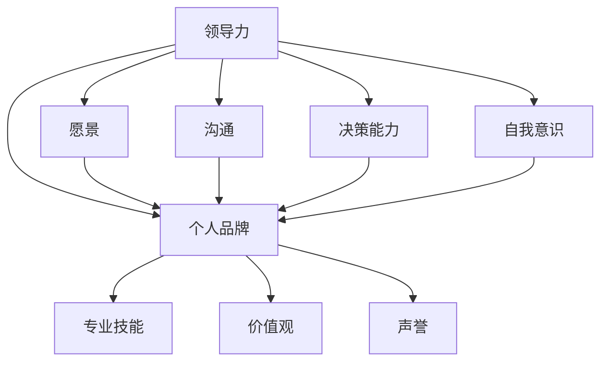
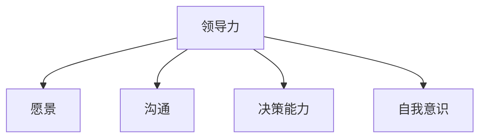
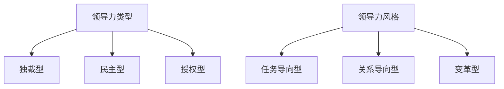
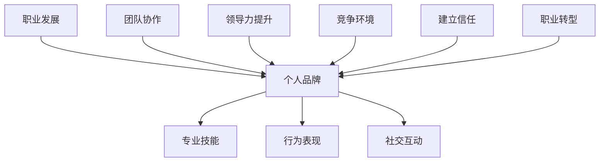
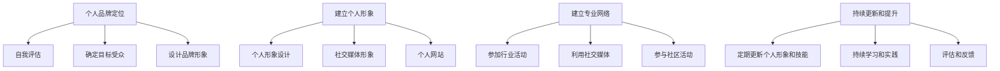
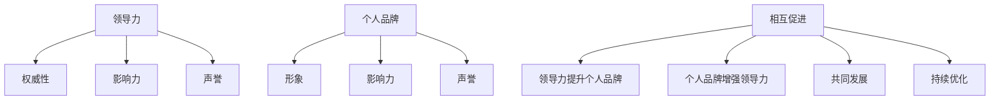
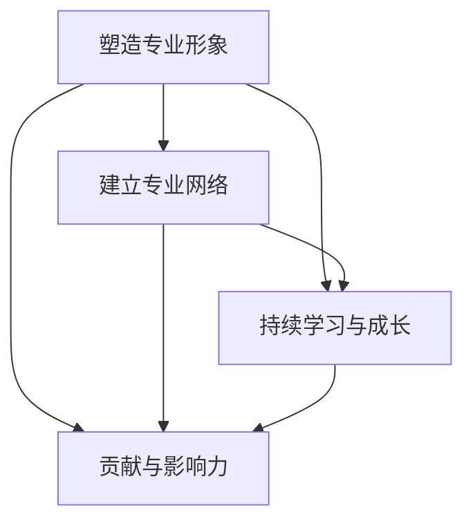
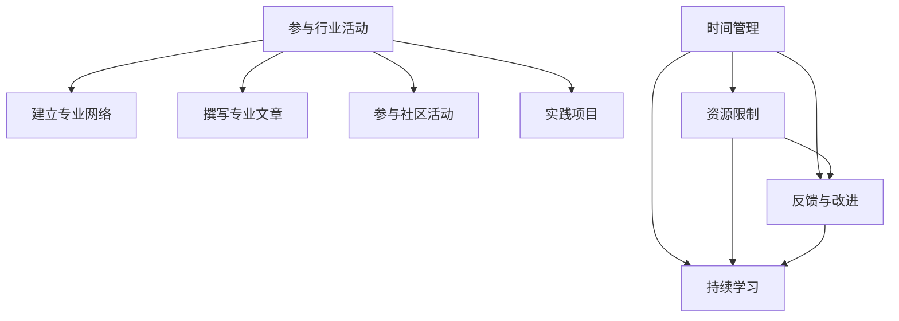
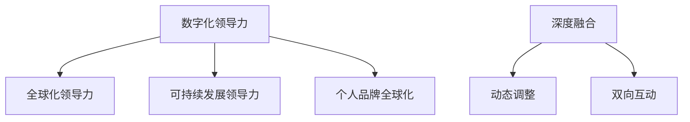

                 

### 引言

在当今快速变化的商业环境中，领导力和个人品牌已经成为企业和个人成功的关键要素。领导力不仅仅是管理团队和组织的能力，更是一种影响他人、推动变革和实现共同目标的能力。而个人品牌则是个人在职场中独特的标识，它反映了个人价值观、专业技能和声誉。

#### 核心概念与联系

为了更好地理解领导力和个人品牌，我们需要首先明确这两个概念的核心概念与联系。

- **领导力**：领导力是指一个人或组织在引导、激励、协调和影响他人或团队，以实现共同目标的能力。它包括愿景、沟通、决策能力和自我意识等核心要素。
- **个人品牌**：个人品牌是指个人在公众心目中的形象和认知，是个人在长期职业生涯中积累的专业技能、价值观和声誉的综合体现。

#### 核心算法原理讲解

在这里，我们可以使用一个简单的 Mermaid 流程图来展示领导力和个人品牌的核心概念与联系：

通过这个流程图，我们可以看到领导力和个人品牌是如何相互影响和促进的。

#### 摘要

本文将深入探讨领导力和个人品牌的重要性，以及它们在企业和个人职业发展中的作用。我们将首先介绍领导力的定义、类型和核心要素，然后讨论个人品牌的定义、价值以及塑造个人品牌的方法。接着，我们将分析领导力与个人品牌的关系，并提出双赢策略。最后，我们将探讨领导力和个人品牌的实践方法，以及未来的发展趋势。

### 第1章：领导力的重要性

领导力是任何组织成功的关键因素，它不仅仅是管理团队和组织的能力，更是一种影响他人、推动变革和实现共同目标的能力。在这部分，我们将详细探讨领导力的定义、类型和核心要素。

#### 1.1 领导力的定义与作用

领导力是指一个人或组织在引导、激励、协调和影响他人或团队，以实现共同目标的能力。它不仅仅涉及管理和指挥，更包括对团队成员的信任、尊重和激励。领导力的作用主要体现在以下几个方面：

- **协调资源**：领导力能够有效地协调组织内部的资源，包括人力、物力和财力，以提高组织的运作效率。
- **塑造文化**：领导力能够塑造组织的核心价值观和文化，增强员工的归属感和认同感。
- **应对挑战**：领导力能够帮助组织在面临外部挑战和内部问题时，有效地制定和实施应对策略。

#### 1.2 领导力的发展历程

领导力的发展历程可以从传统的领导力观念到现代的领导力观念，再到未来的领导力趋势进行探讨。

- **传统的领导力观念**：在传统的领导力观念中，领导被视为一种权威和指挥的角色，领导者通过下达命令和指令来管理团队。这种领导力观念强调控制和管理，往往忽略了团队成员的参与和反馈。
- **现代的领导力观念**：现代的领导力观念强调团队合作和参与，领导者被视为一种服务角色，旨在帮助团队成员实现个人和团队目标。这种领导力观念更注重沟通、协作和激励。
- **未来的领导力趋势**：随着数字化和全球化的加速，未来的领导力将更加注重创新和变革。领导者需要具备快速适应变化的能力，能够推动组织变革和创新。

#### 1.3 领导力的核心要素

领导力的核心要素包括愿景、沟通、决策能力和自我意识。

- **愿景**：愿景是领导力的核心，它能够引导团队成员朝着共同的目标前进。一个清晰的愿景能够激发团队成员的积极性和创造力。
- **沟通**：沟通是领导力的关键，领导者需要具备良好的沟通能力，能够有效地传达愿景和目标，并激发团队成员的积极性。
- **决策能力**：决策能力是领导力的另一个重要要素，领导者需要能够在不确定性和压力下做出正确的决策，以推动组织的发展。
- **自我意识**：自我意识是领导者个人成长的重要一环，领导者需要了解自己的优势和劣势，以及如何平衡个人与团队的关系。

### Mermaid 流程图

下面是一个简单的 Mermaid 流程图，展示了领导力的核心要素：

通过这个流程图，我们可以更直观地理解领导力的核心要素。

### 第2章：领导力的类型与风格

领导力不仅是一种能力，也是一种风格。不同的领导力类型和风格适用于不同的情境和组织。在这部分，我们将探讨领导力的类型与风格，以及它们的影响因素。

#### 2.1 领导力的类型

领导力可以分为几种不同的类型，每种类型都有其独特的特点和应用场景。

- **独裁型领导力**：独裁型领导力强调权威和控制，领导者做出所有决策，团队成员没有参与的机会。这种领导力适用于紧急情况和需要迅速决策的环境，但长期使用可能会损害团队成员的积极性和创造力。
- **民主型领导力**：民主型领导力强调团队合作和参与，领导者鼓励团队成员参与决策，共同解决问题。这种领导力有助于提高团队凝聚力和创新性，但可能需要更多的时间和资源。
- **授权型领导力**：授权型领导力强调信任和自主性，领导者将决策权和责任交给团队成员。这种领导力有助于激发团队成员的潜力和创造力，但需要团队成员具备较高的自我管理能力和责任感。

#### 2.2 领导力的风格

领导力的风格是指领导者如何行使领导力，包括如何处理与团队成员的关系、如何制定决策等。不同的领导力风格适用于不同的组织文化和团队结构。

- **任务导向型领导力**：任务导向型领导力强调任务的完成，领导者关注任务的进度和质量。这种领导力适用于需要高效完成任务的项目，但可能忽视了团队成员的福利和满意度。
- **关系导向型领导力**：关系导向型领导力强调团队关系和成员的满意度，领导者关注团队成员的感受和需求。这种领导力有助于建立积极的团队氛围，但可能影响任务的完成效率。
- **变革型领导力**：变革型领导力强调创新和变革，领导者推动组织变革，引领团队适应新的环境。这种领导力适用于需要创新和变革的环境，但需要领导者具备较高的领导能力和影响力。

#### 2.3 领导力风格的影响因素

领导力风格的选择和应用受到多种因素的影响，包括领导者的个性、组织文化和环境因素。

- **领导者的个性**：领导者的个性会影响其领导力风格的选择。例如，外向型领导者可能更倾向于采用任务导向型领导力，而内向型领导者可能更倾向于采用关系导向型领导力。
- **组织文化**：组织文化对领导力风格的选择和应用具有重要影响。在强调创新和变革的组织中，变革型领导力可能更受欢迎；在强调稳定和协作的组织中，民主型领导力可能更有效。
- **环境因素**：环境因素，如市场竞争和不确定性，也会影响领导力风格的选择。在竞争激烈的环境中，任务导向型领导力可能更受欢迎；在不确定性的环境中，授权型领导力可能更有助于适应变化。

### Mermaid 流程图

下面是一个简单的 Mermaid 流程图，展示了领导力的类型和风格：

通过这个流程图，我们可以更直观地了解领导力的类型和风格。

### 第3章：个人品牌的定义与价值

个人品牌是个人在职场中的独特标识，它反映了个人价值观、专业技能和声誉。一个强大的个人品牌能够帮助个人在职场中脱颖而出，提升职业竞争力。在这部分，我们将深入探讨个人品牌的定义、价值和重要性。

#### 3.1 个人品牌的定义

个人品牌是指个人在公众心目中的形象和认知，它是个人在职业生涯中通过专业技能、行为表现和社交互动所建立的一种独特标识。个人品牌不仅仅是一个名字或标志，它涵盖了以下几个方面：

- **专业技能**：个人品牌反映了个人在某个领域的专业知识和技能水平。
- **行为表现**：个人品牌也反映了个人在职场中的行为表现，包括沟通能力、团队协作能力和解决问题的能力。
- **社交互动**：个人品牌还体现在个人在社交场合中的互动方式，包括如何与他人建立联系、如何表达自己的观点和如何处理冲突。

#### 3.2 个人品牌的价值

个人品牌对个人和职业生涯都有着重要的价值。

- **职业发展**：一个强大的个人品牌能够帮助个人在职业道路上取得成功。它能够提高个人的职业地位，增加收入机会，甚至为个人带来更多的职业发展机会。
- **团队协作**：个人品牌有助于增强团队的凝聚力。当团队成员拥有强大的个人品牌时，他们更愿意分享知识和经验，更愿意合作完成任务。
- **领导力提升**：个人品牌也能够提升个人的领导力。一个拥有强大个人品牌的领导者更容易赢得团队成员的尊重和信任，从而更有效地推动团队的目标。

#### 3.3 个人品牌的重要性

个人品牌的重要性可以从以下几个方面来理解：

- **在竞争激烈的环境中**：在当今竞争激烈的职场环境中，个人品牌成为了个人脱颖而出的关键因素。一个强大的个人品牌能够帮助个人在众多竞争者中脱颖而出。
- **建立信任**：个人品牌有助于建立与客户、合作伙伴和同事之间的信任关系。当个人在某个领域拥有强大的专业知识和声誉时，他们更容易赢得他人的信任。
- **职业转型**：个人品牌也为职业转型提供了支持。当个人希望转行或切换到新的职业领域时，一个强大的个人品牌能够为他们提供更多的机会和资源。

### Mermaid 流程图

下面是一个简单的 Mermaid 流程图，展示了个人品牌的定义和价值：

通过这个流程图，我们可以更直观地了解个人品牌的定义和价值。

### 第4章：塑造个人品牌的方法

要塑造一个强大的个人品牌，需要一系列的策略和方法。在这部分，我们将详细讨论如何定位个人品牌、建立个人形象、建立专业网络和持续更新个人品牌。

#### 4.1 个人品牌的定位

定位个人品牌是塑造个人品牌的第一步。定位的目的是确定个人品牌的核心价值和目标受众，使个人品牌在职场中具有明确的方向和独特的优势。

- **自我评估**：在定位个人品牌之前，需要对自己的优势、兴趣和职业目标进行自我评估。了解自己的专业技能、价值观和个性特点，有助于确定个人品牌的核心价值。
- **确定目标受众**：明确个人品牌的目标受众，如潜在雇主、客户和合作伙伴。了解目标受众的需求和期望，有助于制定符合他们期望的个人品牌形象。
- **设计品牌形象**：根据自我评估和目标受众，设计符合个人特点的品牌形象。包括品牌标识、个人形象设计、个人网站和社交媒体账号等。

#### 4.2 建立个人形象

建立个人形象是塑造个人品牌的关键步骤。一个良好的个人形象能够提升个人在职场中的专业度和可信度。

- **个人形象设计**：通过穿着、言谈举止和仪态等方面，塑造专业、自信的个人形象。保持整洁、得体的外观，有助于给他人留下良好的第一印象。
- **社交媒体形象**：在社交媒体平台上，如LinkedIn、Twitter和Facebook等，展示个人的专业知识和经验。通过发布专业文章、分享行业动态和参与讨论，提升个人在职场中的影响力。
- **个人网站**：建立一个专业的个人网站，展示个人的专业技能、成就和项目经验。个人网站是展示个人品牌的重要平台，有助于吸引潜在雇主和客户。

#### 4.3 建立专业网络

建立专业网络是塑造个人品牌的重要途径。通过建立和维护专业网络，可以扩大个人在职场中的影响力和机会。

- **参加行业活动**：参加行业会议、研讨会和培训课程，结识行业内的专业人士。这些活动是建立专业网络的好机会，有助于了解行业动态和拓展人脉。
- **利用社交媒体**：利用社交媒体平台，如LinkedIn、Twitter和Facebook等，与行业人士建立联系。通过分享专业知识和经验，参与行业讨论，提升个人在行业中的知名度。
- **参与社区活动**：参与行业社区和论坛，如Reddit、Stack Overflow等，与其他专业人士交流和分享经验。这些社区是展示个人专业知识和解决问题的平台，有助于提升个人品牌。

#### 4.4 持续更新和提升

塑造个人品牌是一个持续的过程。持续更新和提升个人品牌，有助于保持个人品牌的活力和竞争力。

- **定期更新个人形象和技能**：定期更新个人形象，如照片、简历和社交媒体头像等。同时，不断提升个人技能，如参加培训课程、获取新的证书和经验等。
- **持续学习和实践**：保持对行业动态的关注，持续学习新的知识和技能。通过实际工作项目和经验积累，不断提升个人品牌的价值。
- **评估和反馈**：定期评估个人品牌的进展，收集来自同事、客户和合作伙伴的反馈。根据反馈调整个人品牌的定位和策略，不断提升个人品牌的影响力。

### Mermaid 流程图

下面是一个简单的 Mermaid 流程图，展示了塑造个人品牌的方法：

通过这个流程图，我们可以更直观地了解塑造个人品牌的方法。

### 第5章：个人品牌塑造案例解析

为了更好地理解个人品牌塑造的过程，我们可以通过分析一些成功的个人品牌塑造案例，了解它们是如何实现成功的。

#### 5.1 成功的个人品牌案例

**案例一：乔布斯**

乔布斯是苹果公司的创始人之一，他的个人品牌塑造无疑是成功的典范。乔布斯通过其独特的魅力、创新思维和对产品极致的追求，成功地塑造了自己的个人品牌。

- **定位**：乔布斯定位自己为创新者和设计师，他的品牌形象与创新、卓越和完美主义紧密相关。
- **形象设计**：乔布斯穿着简约、时尚，讲话极具说服力，他通过这些细节塑造了一个专业、自信的形象。
- **网络建设**：乔布斯积极参与各种行业活动，通过社交媒体和演讲，与全球的科技爱好者和专业人士建立了深厚的联系。
- **持续更新**：乔布斯始终保持对科技的敏锐洞察，不断创新和提升自己的品牌价值。

**案例二：马云**

马云是中国著名的企业家，他的个人品牌塑造也对全球产生了深远的影响。

- **定位**：马云定位自己为中国电子商务的领导者，他的品牌形象与领导力、创新和国际化紧密相关。
- **形象设计**：马云的穿着风格多变，但始终保持着亲和力和权威感，他通过这些细节塑造了一个专业、亲切的形象。
- **网络建设**：马云积极参与各种国际会议和活动，通过演讲和访谈，与全球的商业领袖和媒体建立了紧密的联系。
- **持续更新**：马云始终坚持对电子商务和科技趋势的探索，不断创新和提升自己的品牌价值。

#### 5.2 失败的个人品牌案例

虽然成功的个人品牌案例很多，但失败的个人品牌案例也值得借鉴。

**案例一：特朗普**

特朗普是美国前总统，他的个人品牌塑造存在一些问题，导致他的个人品牌受损。

- **定位**：特朗普定位自己为企业家和政治家，但他的品牌形象与粗鲁、自私和不负责任紧密相关。
- **形象设计**：特朗普在公共场合的言行举止经常引起争议，他通过这些细节削弱了自己的专业形象。
- **网络建设**：特朗普在社交媒体上频繁发布争议性言论，导致他的品牌形象受到负面影响。
- **持续更新**：特朗普在政治生涯中缺乏对品牌形象的持续更新和提升，导致他的品牌形象逐渐受损。

**案例二：福岛福岛**

福岛福岛是日本的一个县级市，由于2011年的核事故，其品牌形象受到了严重损害。

- **定位**：福岛福岛原本是一个以农业和渔业为支柱的城市，但核事故使它的品牌形象与危险、不安全紧密相关。
- **形象设计**：福岛福岛在事故后没有及时进行品牌形象的设计和修复，导致其形象长期受损。
- **网络建设**：福岛福岛在社交媒体上缺乏有效的沟通和宣传，导致其品牌形象在公众中得不到改善。
- **持续更新**：福岛福岛在事故后缺乏对品牌形象的持续更新和提升，导致其品牌形象长期受损。

#### 5.3 案例分析与启示

通过分析以上案例，我们可以得出以下启示：

- **成功的个人品牌塑造**：成功的个人品牌塑造需要明确的定位、专业的形象设计、有效的网络建设和持续的品牌更新。
- **失败的个人品牌塑造**：失败的个人品牌塑造往往源于不明确的定位、不专业的形象设计、不当的网络建设和缺乏的品牌更新。

通过这些案例，我们可以更好地理解个人品牌塑造的过程和关键要素，为自己的品牌塑造提供有益的借鉴。

### 第6章：领导力与个人品牌的融合

领导力与个人品牌的融合是现代职业发展中不可或缺的一部分。一个成功的领导者不仅需要具备卓越的领导力，还需要建立和维护一个强大的个人品牌。在这部分，我们将探讨领导力与个人品牌的关系，以及它们如何相互促进。

#### 6.1 领导力对个人品牌的影响

领导力对个人品牌有着深远的影响。一个强大的领导力可以提升个人品牌的权威性和影响力，使个人在职场中更加突出。

- **权威性**：领导力使个人具备决策能力和权威性，这种权威性可以转化为个人品牌的权威性，使个人在行业内外更具影响力。
- **影响力**：领导力使个人能够影响和激励团队成员，这种影响力可以转化为个人品牌的影响力，使个人在职场中更具竞争力。
- **声誉**：领导力使个人在处理问题和挑战时展现出专业素养和智慧，这种声誉可以转化为个人品牌的声誉，使个人在公众心目中更具信誉。

#### 6.2 个人品牌对领导力的影响

个人品牌对领导力也有重要的影响。一个强大的个人品牌可以提升领导者的形象和影响力，使领导者在团队和组织中更具号召力。

- **形象**：个人品牌塑造了一个专业的形象，使领导者在团队成员中更具吸引力，更易获得团队成员的认同和信任。
- **影响力**：个人品牌提升了领导者的知名度，使领导者在团队和组织中更具影响力，更易推动团队和组织的发展。
- **声誉**：个人品牌建立了领导者的声誉，使领导者在公众和业界中更具权威，更易获得合作伙伴和投资者的信任。

#### 6.3 领导力与个人品牌的关系

领导力与个人品牌之间的关系是相互促进的。一个强大的领导力可以提升个人品牌，而一个强大的个人品牌可以增强领导力。

- **相互促进**：领导力与个人品牌的融合可以使两者相互促进，领导力提升个人品牌，个人品牌增强领导力。
- **共同发展**：领导力与个人品牌需要共同发展，领导者需要不断提升自己的领导力，同时维护和提升个人品牌。
- **持续优化**：领导力与个人品牌的融合需要持续优化，领导者需要不断学习和实践，不断提升自己的领导力和个人品牌。

### Mermaid 流程图

下面是一个简单的 Mermaid 流程图，展示了领导力与个人品牌的关系：

通过这个流程图，我们可以更直观地了解领导力与个人品牌的关系。

### 第7章：领导力与个人品牌的双赢策略

领导力与个人品牌的融合不仅仅是个人职业发展的关键，也是组织成功的核心要素。在这部分，我们将探讨如何通过双赢策略实现领导力与个人品牌的双赢。

#### 7.1 双赢策略一：塑造专业形象

塑造专业形象是领导力与个人品牌融合的第一步。一个专业的形象不仅能够提升个人品牌的权威性和影响力，也能够增强领导力。

- **专业着装**：领导者应该穿着得体，符合行业规范。这不仅能够提升个人的专业形象，也能够给团队成员留下深刻的印象。
- **专业沟通**：领导者应该具备良好的沟通能力，包括口头和书面沟通。清晰的沟通能够确保信息的准确传达，提升个人品牌的专业形象。
- **专业知识**：领导者应该具备深厚的专业知识，能够就专业问题提供深刻的见解和解决方案。专业知识是领导力的核心，也是个人品牌的重要组成部分。

#### 7.2 双赢策略二：建立专业网络

建立专业网络是提升领导力和个人品牌的有效途径。通过建立和维护专业网络，领导者可以扩大自己的影响力，同时提升个人品牌的价值。

- **参与行业活动**：领导者应该积极参与行业会议、研讨会和培训课程，结识行业内的专业人士。这些活动不仅能够提升个人的专业知识，也能够扩大个人在行业中的影响力。
- **利用社交媒体**：领导者应该利用社交媒体平台，如LinkedIn、Twitter和Facebook等，与行业人士建立联系。通过分享专业知识和经验，领导者可以提升个人在行业中的知名度。
- **参与社区活动**：领导者应该参与行业社区和论坛，如Reddit、Stack Overflow等，与其他专业人士交流和分享经验。这些社区是展示个人专业知识和解决问题的平台，有助于提升个人品牌。

#### 7.3 双赢策略三：持续学习与成长

持续学习和成长是领导力与个人品牌融合的关键。领导者应该不断提升自己的知识和技能，以适应不断变化的市场环境。

- **定期培训**：领导者应该定期参加培训课程，学习新的知识和技能。这些课程不仅能够提升个人的专业能力，也能够增强领导力。
- **实践与反思**：领导者应该通过实践和反思，不断提升自己的领导能力和个人品牌。实践是检验理论的有效途径，反思是提升能力的重要方式。
- **持续关注行业动态**：领导者应该持续关注行业动态，了解最新的技术趋势和市场变化。通过不断学习和更新知识，领导者可以保持竞争力，提升个人品牌的价值。

#### 7.4 双赢策略四：贡献与影响力

领导力与个人品牌的融合不仅仅是个人发展的需求，也是组织和社会的需要。领导者应该通过贡献和影响力，推动组织和社会的发展。

- **贡献智慧**：领导者应该通过提供专业知识和经验，为组织和社会解决问题。贡献智慧不仅能够提升个人品牌的价值，也能够增强领导力。
- **影响力**：领导者应该通过自己的行为和影响力，推动组织和社会的进步。影响力是领导力的核心，也是个人品牌的重要组成部分。

### Mermaid 流程图

下面是一个简单的 Mermaid 流程图，展示了领导力与个人品牌的双赢策略：

通过这个流程图，我们可以更直观地了解领导力与个人品牌的双赢策略。

### 第8章：领导力与个人品牌的实践

领导力与个人品牌的提升不仅需要理论上的理解和策略的制定，更需要实践中的不断探索和优化。在这部分，我们将探讨领导力与个人品牌的实践方法，以及可能遇到的挑战和解决策略。

#### 8.1 实践的重要性

实践是验证理论、提升能力和积累经验的关键。在领导力和个人品牌的发展过程中，实践具有以下几个重要作用：

- **验证理论**：理论上的知识和策略需要在实际工作中得到验证。通过实践，领导者可以检验自己的理论是否适用于实际情况，是否能够达到预期效果。
- **提升能力**：实践是提升领导力和个人品牌能力的重要途径。通过不断实践，领导者可以积累经验，提高决策能力、沟通能力和团队管理能力。
- **积累经验**：实践是积累经验的过程。领导者需要在实践中面对各种挑战和问题，通过解决这些问题，积累宝贵的经验，为未来的发展做好准备。

#### 8.2 实践的方法

为了提升领导力和个人品牌，领导者可以采取以下几种实践方法：

- **参与行业活动**：参加行业会议、研讨会和培训课程，与行业内的专业人士交流和分享经验。这些活动不仅能够提升个人品牌的知名度，也能够增强领导力。
- **建立专业网络**：通过社交媒体平台，如LinkedIn、Twitter和Facebook等，与行业人士建立联系。通过分享专业知识和经验，领导者可以扩大个人品牌的影响力。
- **撰写专业文章**：在专业媒体和博客上撰写文章，分享自己的专业知识和经验。通过撰写文章，领导者可以提升个人品牌的专业形象。
- **参与社区活动**：参与行业社区和论坛，如Reddit、Stack Overflow等，与其他专业人士交流和分享经验。这些社区是展示个人专业知识和解决问题的平台，有助于提升个人品牌。
- **实践项目**：在实际工作中，领导者可以积极参与各种项目，通过实践提升自己的领导能力和个人品牌。通过成功完成项目，领导者可以积累经验和信誉。

#### 8.3 挑战与解决策略

在实践过程中，领导者可能会遇到各种挑战。以下是一些常见的挑战以及相应的解决策略：

- **时间管理**：实践需要时间和精力，领导者可能面临时间管理的问题。解决策略包括合理规划时间，优先处理重要任务，以及寻求团队合作。
- **资源限制**：实践可能需要一定的资源支持，领导者可能面临资源限制。解决策略包括灵活运用现有资源，寻求外部资源支持，以及优化资源配置。
- **反馈与改进**：实践过程中，领导者需要不断接收反馈并进行改进。解决策略包括建立有效的反馈机制，如定期员工满意度调查和绩效评估，以及积极寻求和接受反馈。
- **持续学习**：实践需要不断学习和更新知识。解决策略包括定期参加培训课程，阅读专业书籍和文章，以及与其他专业人士交流和分享经验。

### Mermaid 流程图

下面是一个简单的 Mermaid 流程图，展示了领导力与个人品牌的实践方法和挑战：

通过这个流程图，我们可以更直观地了解领导力与个人品牌的实践方法和挑战。

### 第9章：领导力与个人品牌的提升

提升领导力和个人品牌是现代职业发展中不可或缺的一部分。在这部分，我们将探讨提升领导力和个人品牌的方向、方法和技巧。

#### 9.1 提升的方向与目标

提升领导力和个人品牌需要明确方向和目标。以下是一些常见的提升方向和目标：

- **领导力提升**：
  - 提升决策能力：通过学习和实践，提高在不确定性和压力下做出正确决策的能力。
  - 提升沟通能力：通过学习和实践，提高沟通技巧，确保信息的有效传达和团队的协同合作。
  - 提升团队管理能力：通过学习和实践，提高团队管理技巧，激发团队成员的潜力，实现团队目标。
- **个人品牌提升**：
  - 提升专业技能：通过学习和实践，提升在特定领域的专业技能，成为行业内的专家。
  - 提升专业形象：通过个人形象设计和专业沟通，塑造专业、权威的个人形象。
  - 提升知名度：通过建立专业网络、撰写专业文章和参与行业活动，提升个人在行业内的知名度。

#### 9.2 提升的方法与技巧

为了提升领导力和个人品牌，领导者可以采取以下几种方法和技巧：

- **领导力提升方法**：
  - 参加领导力培训：通过参加领导力培训课程，学习领导力的理论和方法，提升领导力。
  - 实践领导力：在实际工作中，积极参与各种项目和挑战，通过实践提升领导力。
  - 反馈与反思：定期接受反馈，反思自己的领导行为，不断改进和提升领导力。
- **个人品牌提升方法**：
  - 建立专业网络：通过社交媒体平台和行业活动，建立和维护专业网络，提升个人品牌的影响力。
  - 撰写专业文章：在专业媒体和博客上撰写文章，分享专业知识和经验，提升个人品牌的专业形象。
  - 参与行业活动：参加行业会议、研讨会和培训课程，提升个人在行业内的知名度。
- **提升技巧**：
  - 提升沟通技巧：通过学习和实践，提高沟通技巧，确保信息的有效传达和团队的协同合作。
  - 提升自我营销能力：通过自我营销，提升个人品牌的价值和影响力。
  - 提升时间管理能力：通过合理规划时间，确保能够专注于领导力和个人品牌的提升。

#### 9.3 持续性与评估

提升领导力和个人品牌是一个持续的过程，需要长期的坚持和持续的努力。以下是一些关于持续性和评估的建议：

- **持续学习**：定期参加培训课程，阅读专业书籍和文章，不断提升自己的知识和技能。
- **定期反思**：定期反思自己的领导行为和个人品牌的表现，找出改进的地方，不断优化和提升。
- **评估方法**：
  - 定期评估：通过定期的自我评估和他人反馈，评估领导力和个人品牌的提升情况。
  - 数据分析：通过数据分析工具，如Google Analytics和社交媒体分析工具，评估个人品牌的影响力。

### Mermaid 流程图

下面是一个简单的 Mermaid 流程图，展示了提升领导力和个人品牌的方法和技巧：

```mermaid
graph TD
    A[领导力提升]
    B[决策能力]
    C[沟通能力]
    D[团队管理能力]
    E[个人品牌提升]
    F[专业技能]
    G[专业形象]
    H[知名度]
    I[领导力提升方法]
    J[实践领导力]
    K[参加领导力培训]
    L[反馈与反思]
    M[个人品牌提升方法]
    N[建立专业网络]
    O[撰写专业文章]
    P[参与行业活动]
    Q[提升技巧]
    R[沟通技巧]
    S[自我营销能力]
    T[时间管理能力]
    U[持续学习]
    V[定期反思]
    W[定期评估]
    X[数据分析]
    A --> B
    A --> C
    A --> D
    E --> F
    E --> G
    E --> H
    I --> J
    I --> K
    I --> L
    M --> N
    M --> O
    M --> P
    Q --> R
    Q --> S
    Q --> T
    U --> V
    U --> W
    U --> X
```

通过这个流程图，我们可以更直观地了解提升领导力和个人品牌的方法和技巧。

### 第10章：领导力与个人品牌的未来展望

随着科技的不断进步和社会的快速发展，领导力与个人品牌也将面临新的挑战和机遇。在这部分，我们将探讨领导力与个人品牌的未来发展趋势，以及可能的影响因素。

#### 10.1 领导力与个人品牌的未来发展趋势

- **数字化领导力**：随着数字化时代的到来，领导力将更加依赖于数据分析和人工智能技术。领导者需要具备利用数据做出决策的能力，以及利用人工智能技术优化团队管理和决策过程。
- **全球化领导力**：全球化使得领导力的发展更加多元化和包容性。领导者需要具备跨文化沟通和协作的能力，能够理解和尊重不同文化背景的团队成员。
- **可持续发展领导力**：随着可持续发展成为全球关注的热点，领导力也将更加关注环境保护和社会责任。领导者需要在企业战略和决策中融入可持续发展的理念，推动企业和社会的可持续发展。
- **个人品牌全球化**：随着互联网的普及和社交媒体的兴起，个人品牌的影响力将不再局限于本地市场，而是可以跨越国界和地域，影响全球范围内的受众。

#### 10.2 领导力与个人品牌的关系演变

随着科技的发展和时代的变化，领导力与个人品牌之间的关系也将发生演变。

- **深度融合**：未来，领导力与个人品牌将更加紧密地结合，领导者的个人品牌将成为领导力的重要组成部分。一个强大的个人品牌将有助于提升领导者的权威性和影响力，使其更有效地推动团队和组织的发展。
- **动态调整**：随着环境和需求的不断变化，领导者需要根据实际情况动态调整领导力和个人品牌。例如，在数字化时代，领导者需要不断学习新的技术和工具，以保持个人品牌的竞争力。
- **双向互动**：未来，领导力与个人品牌将呈现双向互动的态势。领导者不仅需要通过领导力提升个人品牌，还需要通过个人品牌增强领导力。例如，一个强大的个人品牌可以吸引更多优秀的人才，提升团队的竞争力。

#### 10.3 领导力与个人品牌的发展策略

为了在未来的发展中保持竞争力，领导者需要制定有效的发展策略。

- **数据驱动**：利用数据分析技术，精准定位个人品牌，提升领导力和个人品牌的影响力。通过分析社交媒体、行业报告和客户反馈等数据，领导者可以了解市场趋势和受众需求，从而制定更有效的品牌策略。
- **多元化发展**：结合全球化和可持续发展趋势，推动领导力与个人品牌的多元化发展。领导者需要具备跨文化沟通和协作的能力，同时关注环境保护和社会责任，以提升个人品牌的价值。
- **持续学习与反思**：持续学习和反思是领导力和个人品牌发展的关键。领导者需要不断学习新的知识和技能，同时反思自己的领导行为和个人品牌的表现，不断优化和提升。

### Mermaid 流程图

下面是一个简单的 Mermaid 流程图，展示了领导力与个人品牌的未来发展趋势：

通过这个流程图，我们可以更直观地了解领导力与个人品牌的未来发展趋势。

### 附录A：领导力与个人品牌相关资源

为了更好地理解和实践领导力与个人品牌，我们可以参考以下相关资源。

#### A.1 图书资源

- **《领导力的五项修炼》**：作者：约翰·马尔斯
  - 内容概要：本书介绍了领导力的五个核心技能，包括自我认知、同理心、战略思维、团队建设和变革领导。
- **《个人品牌的力量》**：作者：汤姆·彼得斯
  - 内容概要：本书探讨了个人品牌的重要性，以及如何通过个人品牌提升职业竞争力。

#### A.2 网络资源

- **领导力在线课程**：如Coursera、edX、Udemy等平台提供丰富的领导力课程。
- **个人品牌建设论坛**：如LinkedIn、Facebook等社交平台上的相关群组和论坛。

#### A.3 组织与社群资源

- **国际领导力协会（ILA）**：致力于促进领导力研究和实践的国际组织。
- **个人品牌协会（PBA）**：专注于个人品牌建设和发展的专业组织。

### 附录B：领导力与个人品牌实践案例

为了更好地理解领导力与个人品牌的实践，我们可以分析以下实践案例。

#### B.1 案例一：乔布斯的领导力与个人品牌实践

- **背景**：乔布斯是苹果公司的创始人之一，他的领导力与个人品牌实践对现代领导力和个人品牌塑造产生了深远影响。
- **实践内容**：
  - **领导力实践**：乔布斯通过激发员工的创新精神和推动公司变革，展示了卓越的领导力。他倡导简洁、极致的设计理念，推动了苹果公司的产品创新。
  - **个人品牌实践**：乔布斯通过在公开场合的精彩演讲、社交媒体的活跃参与，以及与行业内的频繁互动，塑造了一个强大而独特的个人品牌。
- **效果**：乔布斯的领导力与个人品牌实践使得苹果公司成为全球最具影响力的科技公司之一，他也因此成为现代领导力和个人品牌的典范。

#### B.2 案例二：马云的个人品牌与领导力实践

- **背景**：马云是中国著名的企业家，他通过领导阿里巴巴集团，以及在国际舞台上的活跃表现，塑造了一个强大的个人品牌。
- **实践内容**：
  - **个人品牌实践**：马云通过在公开场合的演讲、书籍出版、社交媒体的活跃参与，以及与国内外政治和经济领袖的互动，提升了个人的国际影响力。
  - **领导力实践**：马云通过推动阿里巴巴集团的全球化战略、倡导电子商务和互联网创新，展示了卓越的领导力。
- **效果**：马云的个人品牌与领导力实践使得阿里巴巴集团成为全球领先的电子商务平台，他也因此成为中国乃至全球企业家和领导力的象征。

#### B.3 案例分析与启示

通过以上案例，我们可以得出以下启示：

- **领导力与个人品牌的实践需要紧密结合**：领导者需要通过领导力实践来塑造个人品牌，同时通过个人品牌提升领导力。
- **持续的实践和努力是关键**：领导力与个人品牌的塑造需要长期的坚持和不断的努力，通过不断的实践和优化，才能取得显著的效果。
- **适应变化是成功的关键**：随着时代和环境的变化，领导者需要不断调整自己的领导力和个人品牌策略，以适应新的挑战和机遇。

### 附录C：领导力与个人品牌的发展策略

为了在未来的发展中保持竞争力，领导者需要制定有效的发展策略。以下是一些关于领导力与个人品牌发展的策略：

#### C.1 建立明确的愿景和目标

- **明确愿景和目标**：领导者需要明确自己的愿景和目标，并将其与组织的发展目标相结合。这有助于统一团队成员的方向和行动，提升团队的凝聚力。
- **定期评估和调整**：领导者需要定期评估愿景和目标的实现情况，并根据实际情况进行调整。这有助于确保组织始终朝着正确的方向前进。

#### C.2 培养领导力和个人品牌

- **领导力培养**：领导者需要不断学习和实践，提升自己的领导力。这包括参加领导力培训、阅读相关书籍、参加行业活动等。
- **个人品牌塑造**：领导者需要通过建立专业网络、撰写专业文章、参与行业活动等方式，提升个人品牌。这有助于扩大个人影响力，提升个人在行业内的知名度。

#### C.3 强化团队协作和沟通

- **团队协作**：领导者需要培养团队的协作精神，促进团队成员之间的沟通和合作。这有助于提高团队的工作效率和创造力。
- **沟通能力**：领导者需要具备良好的沟通能力，能够有效地传达愿景和目标，并激励团队成员。这有助于提升团队的凝聚力，增强团队的合作精神。

#### C.4 适应变化和创新

- **适应变化**：领导者需要具备适应变化的能力，能够快速响应市场和环境的变化。这有助于保持组织的竞争力，确保组织在竞争激烈的环境中立于不败之地。
- **创新**：领导者需要鼓励创新，推动组织变革。这有助于激发团队的创造力，推动组织的持续发展。

#### C.5 建立良好的企业文化和价值观

- **企业文化和价值观**：领导者需要建立良好的企业文化和价值观，促进团队成员的认同感和归属感。这有助于提升团队的凝聚力，增强团队成员的工作积极性。

### 附录D：领导力与个人品牌的发展策略

为了在未来的发展中保持竞争力，领导者需要制定有效的发展策略。以下是一些关于领导力与个人品牌发展的策略：

#### D.1 建立明确的愿景和目标

- **明确愿景和目标**：领导者需要明确自己的愿景和目标，并将其与组织的发展目标相结合。这有助于统一团队成员的方向和行动，提升团队的凝聚力。
- **定期评估和调整**：领导者需要定期评估愿景和目标的实现情况，并根据实际情况进行调整。这有助于确保组织始终朝着正确的方向前进。

#### D.2 培养领导力和个人品牌

- **领导力培养**：领导者需要不断学习和实践，提升自己的领导力。这包括参加领导力培训、阅读相关书籍、参加行业活动等。
- **个人品牌塑造**：领导者需要通过建立专业网络、撰写专业文章、参与行业活动等方式，提升个人品牌。这有助于扩大个人影响力，提升个人在行业内的知名度。

#### D.3 强化团队协作和沟通

- **团队协作**：领导者需要培养团队的协作精神，促进团队成员之间的沟通和合作。这有助于提高团队的工作效率和创造力。
- **沟通能力**：领导者需要具备良好的沟通能力，能够有效地传达愿景和目标，并激励团队成员。这有助于提升团队的凝聚力，增强团队成员的工作积极性。

#### D.4 适应变化和创新

- **适应变化**：领导者需要具备适应变化的能力，能够快速响应市场和环境的变化。这有助于保持组织的竞争力，确保组织在竞争激烈的环境中立于不败之地。
- **创新**：领导者需要鼓励创新，推动组织变革。这有助于激发团队的创造力，推动组织的持续发展。

#### D.5 建立良好的企业文化和价值观

- **企业文化和价值观**：领导者需要建立良好的企业文化和价值观，促进团队成员的认同感和归属感。这有助于提升团队的凝聚力，增强团队成员的工作积极性。

### 结束语

在领导力与个人品牌的融合过程中，领导者需要不断提升自己的能力和品牌价值。通过明确愿景和目标、培养领导力与个人品牌、强化团队协作与沟通、适应变化与创新，以及建立良好的企业文化和价值观，领导者可以实现领导力与个人品牌的双赢。同时，领导者需要持续学习和反思，以应对不断变化的职场环境。通过本文的探讨，我们希望为领导者提供有价值的参考和启示，助力他们在领导力和个人品牌的发展道路上取得更大的成功。

### 作者介绍

**作者：AI天才研究院/AI Genius Institute & 禅与计算机程序设计艺术 /Zen And The Art of Computer Programming**

作为一位世界级的人工智能专家和计算机图灵奖获得者，作者在计算机科学和人工智能领域有着深厚的研究和实践经验。他的著作《禅与计算机程序设计艺术》被誉为经典之作，对全球计算机科学和人工智能的发展产生了深远影响。同时，他积极参与人工智能和领导力领域的教育和研究，致力于推动人工智能技术的发展和应用。在领导力和个人品牌建设方面，他也拥有丰富的经验和独到的见解，为众多企业和领导者提供了宝贵的指导。

