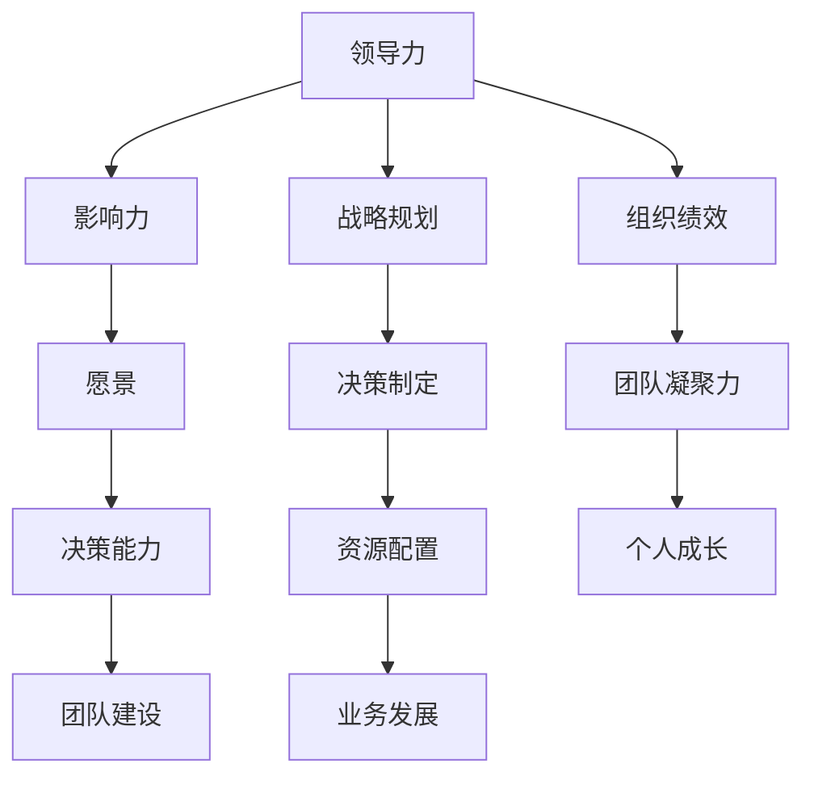
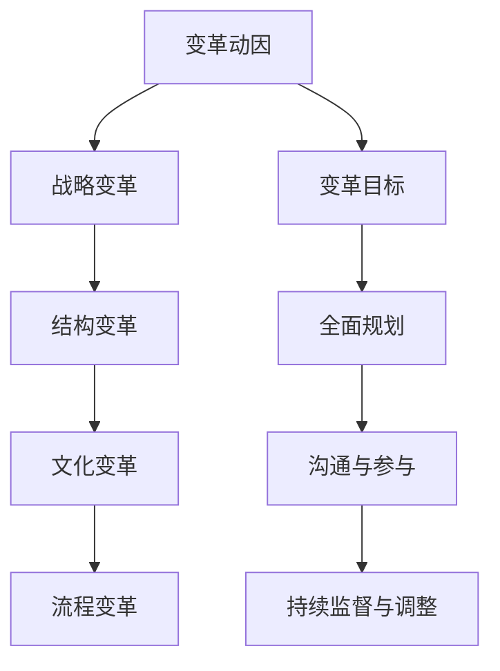
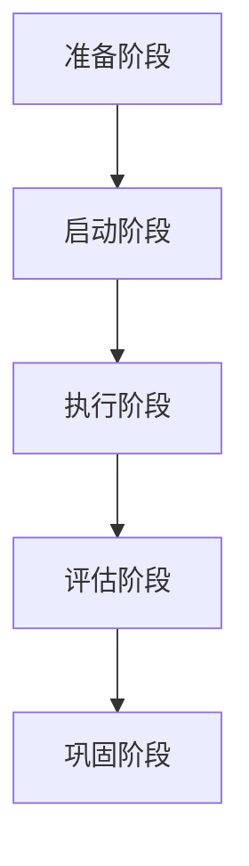
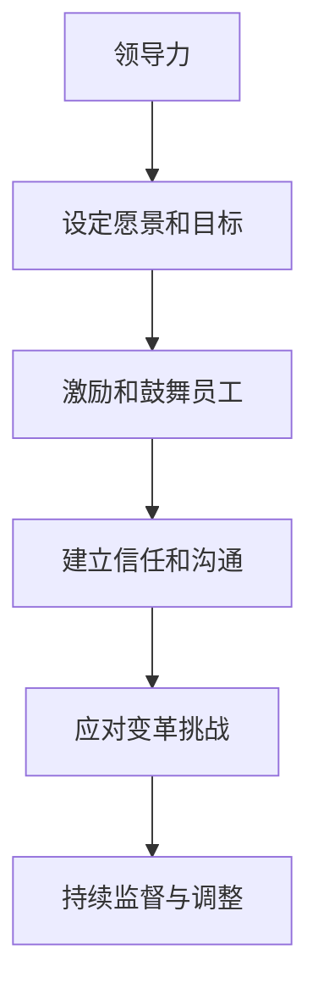
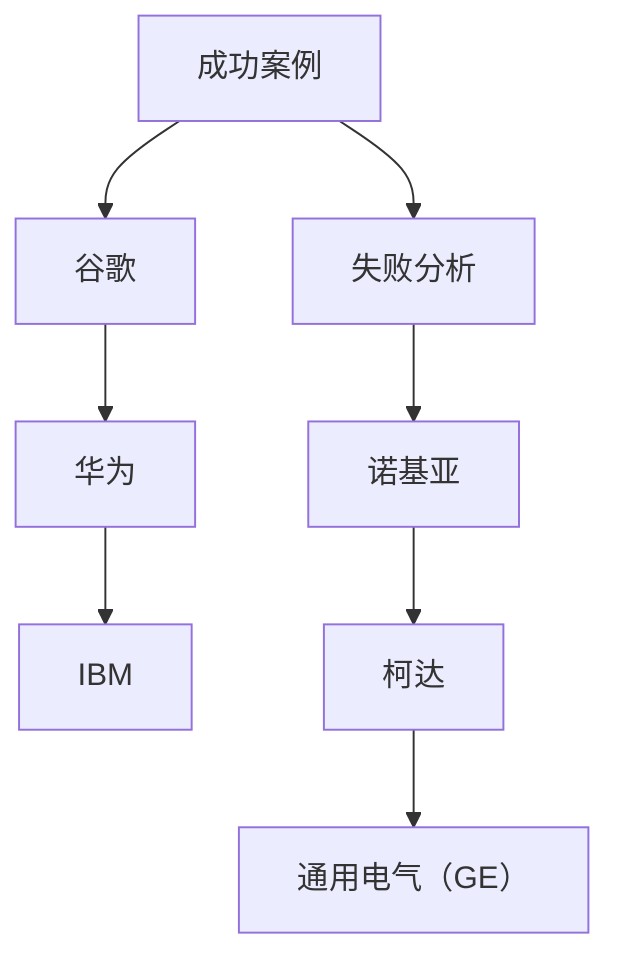
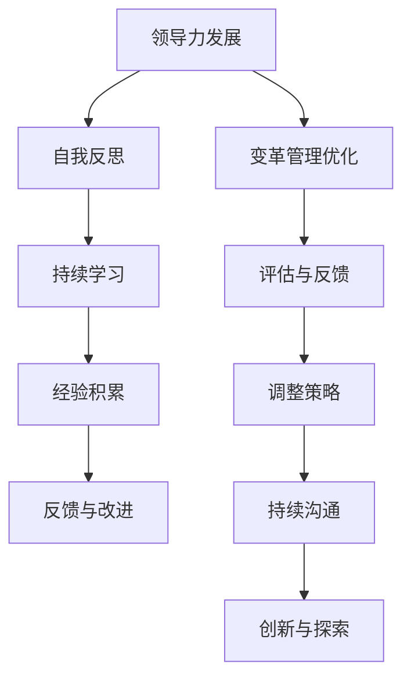
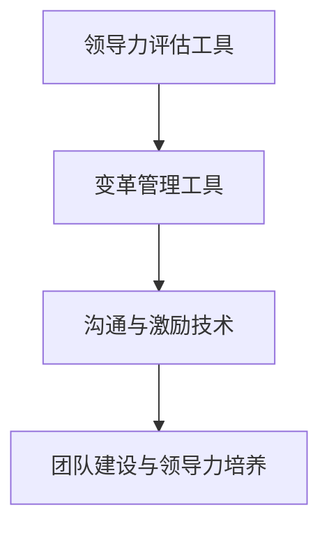
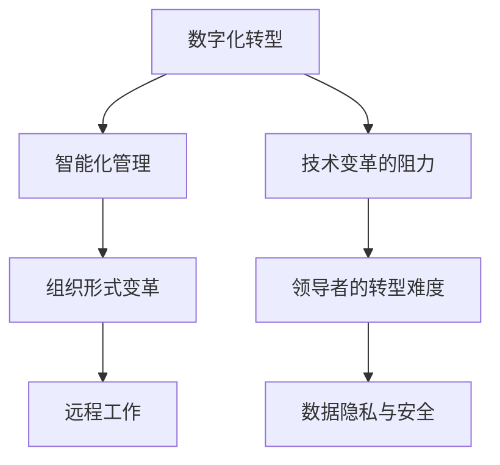
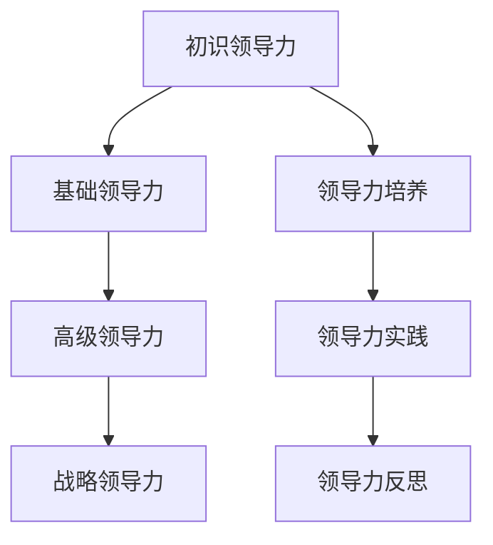
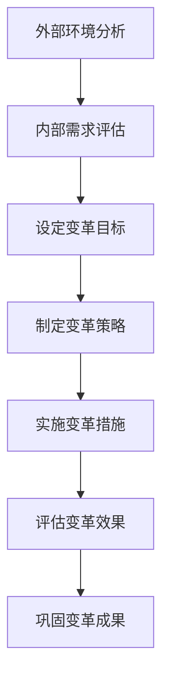

                 

### 第一部分：领导力概述

**领导力的定义与重要性**

领导力是领导者通过影响和激励他人来实现共同目标的能力。它不仅涉及对下属的指导和管理，还包括战略规划、决策制定和团队建设。领导力在组织中起着至关重要的作用，是推动组织前进、实现可持续发展的核心动力。

#### **1.1.1 领导力的定义与内涵**

领导力是一个多维度的概念，其定义因学科和语境的不同而有所差异。在组织行为学中，领导力通常被看作是影响他人思想和行为的过程。而心理学则侧重于领导者的性格特质和情绪智力。具体来说，领导力包括以下几个方面：

- **影响力**：领导者通过沟通、激励和榜样作用影响他人的能力和意愿。
- **愿景**：领导者需要具备明确的目标和愿景，为团队提供方向和动力。
- **决策能力**：领导者需要在不同情境下做出合理的决策，以应对各种挑战。
- **团队建设**：领导者需要建立有效的团队，激发团队成员的潜力，实现共同目标。

#### **1.1.2 领导力的作用与意义**

领导力在组织中具有多重作用，主要包括：

- **推动组织发展**：领导力是组织战略规划、资源配置和业务发展的关键。
- **提高组织绩效**：有效的领导力能够提升组织效率，实现组织目标的最大化。
- **增强团队凝聚力**：领导力有助于建立积极的团队氛围，提高团队协作能力。
- **促进个人成长**：领导力培养有助于员工个人能力和职业发展。

#### **1.2 领导者角色与职责**

领导者角色具有多样性，他们不仅要管理日常运营，还要推动组织变革和发展。以下是领导者常见的角色和职责：

- **战略规划者**：领导者需要制定组织的长远目标和战略规划。
- **决策者**：领导者需要在各种复杂情境下做出合理决策。
- **协调者**：领导者需要协调内部各部门和外部合作伙伴，确保项目顺利进行。
- **变革推动者**：领导者需要引领组织变革，推动组织持续发展。
- **激励者**：领导者需要激发员工的潜力，提高员工的工作积极性和满意度。

#### **1.3 领导风格与领导力模型**

领导风格是指领导者行使权力、影响他人行为的方式。不同的领导风格适用于不同的情境和团队。以下是几种常见的领导力模型：

- **民主型领导**：领导者鼓励团队成员参与决策，激发创新思维。
- **权威型领导**：领导者做出决策并指导团队成员执行，强调效率和控制。
- **参与型领导**：领导者与团队成员共同参与决策，增强团队凝聚力。
- **变革型领导**：领导者通过激发团队成员的积极性和创造力，推动组织变革。

#### **1.3.1 领导风格理论**

领导风格理论包括多种模型，其中最具代表性的有：

- **领导方格理论**：该理论将领导风格分为关心人和关心任务两个维度，形成四个象限。
- **情境领导理论**：该理论认为领导风格应根据团队成员的成熟度进行调整。

#### **1.3.2 领导力模型与评价**

领导力模型有助于领导者了解自己的风格，并根据实际情况进行调整。以下是几种常见的领导力模型：

- **路径-目标理论**：领导者通过设定目标和提供路径，帮助团队成员实现目标。
- **变革型领导理论**：领导者通过激发团队成员的积极性和创造力，推动组织变革。

**核心概念与联系**

为了更好地理解领导力，我们可以使用 Mermaid 流程图来展示其核心概念和架构：



**核心算法原理讲解**

领导力的核心在于影响和激励他人。以下是领导力相关的研究方法和理论框架：

```markdown
# 领导力研究方法与理论框架

## 1. 影响力模型
影响力模型包括五种来源：权威、互惠、社会认同、稀缺和一致性。每个来源都有其独特的应用场景。

## 2. 激励理论
激励理论主要包括马斯洛的需求层次理论、赫茨伯格的双因素理论和维克托·弗鲁姆的期望理论。

## 3. 领导风格模型
领导风格模型包括领导方格理论、情境领导理论和路径-目标理论。
```

**数学模型和数学公式 & 详细讲解 & 举例说明**

领导力与组织绩效之间的关系可以通过以下数学模型进行分析：

$$
\text{组织绩效} = f(\text{领导力}, \text{团队氛围}, \text{资源分配})
$$

其中，领导力、团队氛围和资源分配是影响组织绩效的关键因素。我们可以通过以下例子来说明：

假设一个企业的领导力评分为80分（满分100分），团队氛围评分为75分，资源分配评分为85分。根据上述数学模型，我们可以计算出该企业的组织绩效：

$$
\text{组织绩效} = f(0.8, 0.75, 0.85) = 0.8 \times 0.75 \times 0.85 = 0.510
$$

这意味着该企业的组织绩效为51%。为了提高组织绩效，企业可以针对性地提升领导力、改善团队氛围和优化资源分配。

### **1.2 领导者角色与职责**

领导者扮演着多种角色，其职责也因组织的不同而有所差异。以下是领导者常见的角色和职责：

#### **1.2.1 领导者的角色多样性**

- **战略规划者**：领导者负责制定组织的长期目标和战略规划。
- **决策者**：领导者需要在各种复杂情境下做出合理的决策。
- **协调者**：领导者需要协调内部各部门和外部合作伙伴，确保项目顺利进行。
- **变革推动者**：领导者需要引领组织变革，推动组织持续发展。
- **激励者**：领导者需要激发员工的潜力，提高员工的工作积极性和满意度。

#### **1.2.2 领导者的职责与挑战**

领导者的职责主要包括：

- **确保组织目标的实现**：领导者需要确保组织目标的明确和实现。
- **培养和管理团队**：领导者需要培养和管理团队，提高团队的整体效能。
- **促进创新和持续发展**：领导者需要推动创新，促进组织的持续发展。
- **应对变革和挑战**：领导者需要适应变革，应对各种挑战和危机。

然而，领导者在履行职责时也面临着诸多挑战：

- **复杂性**：现代组织的复杂性使得领导者需要具备更广泛的技能和知识。
- **不确定性**：领导者需要应对不确定性和风险，做出合理的决策。
- **压力和责任**：领导者需要承担组织成功和失败的责任，面临巨大的压力。
- **沟通和协作**：领导者需要有效地沟通和协作，确保团队的目标一致和协同作战。

### **1.3 领导风格与领导力模型**

领导风格是指领导者行使权力、影响他人行为的方式。不同的领导风格适用于不同的情境和团队。以下是几种常见的领导力模型：

#### **1.3.1 领导风格理论**

领导风格理论主要包括以下几种：

- **领导方格理论**：该理论将领导风格分为关心人和关心任务两个维度，形成四个象限。
  - **1型（团队型）**：领导者既关心人又关心任务，注重团队建设和员工福利。
  - **2型（任务型）**：领导者重视任务完成，强调效率和目标。
  - **3型（中间型）**：领导者既不过分关注人也不过分关注任务，保持中立。
  - **4型（混乱型）**：领导者既不关心人也不关心任务，缺乏有效的领导力。

- **情境领导理论**：该理论认为领导风格应根据团队成员的成熟度进行调整。
  - **1型（命令型）**：领导者指导团队成员，提供明确的方向和任务。
  - **2型（支持型）**：领导者支持团队成员，鼓励自主决策和自我管理。
  - **3型（参与型）**：领导者与团队成员共同参与决策，增强团队凝聚力。
  - **4型（授权型）**：领导者给予团队成员更多的自主权，鼓励创新和探索。

#### **1.3.2 领导力模型与评价**

领导力模型有助于领导者了解自己的风格，并根据实际情况进行调整。以下是几种常见的领导力模型：

- **路径-目标理论**：领导者通过设定目标和提供路径，帮助团队成员实现目标。
- **变革型领导理论**：领导者通过激发团队成员的积极性和创造力，推动组织变革。

**核心算法原理讲解**

以下是领导力模型的核心算法原理，以路径-目标理论为例：

```markdown
# 路径-目标理论算法原理

## 1. 设定目标
领导者需要明确组织的长期和短期目标，并将其分解为具体任务和里程碑。

## 2. 提供路径
领导者需要为团队成员提供实现目标的路径，包括必要的资源和支持。

## 3. 激励和反馈
领导者需要根据团队成员的表现提供激励和反馈，鼓励他们持续努力。

## 4. 调整路径
根据实际情况和团队成员的反馈，领导者需要调整路径，以确保目标的实现。
```

**数学模型和数学公式 & 详细讲解 & 举例说明**

以下是领导力模型中的数学模型和公式，以路径-目标理论为例：

$$
\text{目标实现度} = f(\text{目标设定}, \text{路径提供}, \text{激励反馈})
$$

其中，目标设定、路径提供和激励反馈是影响目标实现度的关键因素。我们可以通过以下例子来说明：

假设一个领导者设定了明确的长期和短期目标，为团队成员提供了清晰的路径，并在过程中提供了有效的激励和反馈。根据上述数学模型，我们可以计算出该领导者的目标实现度：

$$
\text{目标实现度} = f(0.9, 0.8, 0.85) = 0.9 \times 0.8 \times 0.85 = 0.612
$$

这意味着该领导者的目标实现度为61.2%。为了进一步提高目标实现度，领导者可以针对性地优化目标设定、路径提供和激励反馈。

### **第二部分：变革管理理论**

**变革管理的核心概念**

变革管理是指组织在应对外部环境变化和内部需求时，通过规划和实施一系列策略和措施，实现组织变革的过程。变革管理的核心在于确保组织能够顺利适应和应对变革，实现组织目标的最大化。

#### **2.1.1 变革的动因与类型**

变革的动因主要包括：

- **外部环境变化**：如市场竞争加剧、技术进步、法律法规变化等。
- **内部需求**：如组织结构调整、业务转型、员工需求变化等。

根据变革的动因和目标，变革可以分为以下几种类型：

- **战略变革**：涉及组织战略目标的调整和变革。
- **结构变革**：涉及组织结构和职能的调整和变革。
- **文化变革**：涉及组织文化和价值观的调整和变革。
- **流程变革**：涉及工作流程和操作方法的调整和变革。

#### **2.1.2 变革管理的目标与原则**

变革管理的目标主要包括：

- **确保变革的顺利实施**：确保变革方案能够顺利执行，达到预期效果。
- **提高组织适应性**：增强组织对外部环境和内部需求的适应能力。
- **降低变革风险**：降低变革过程中可能带来的负面影响，确保组织稳定运行。

变革管理应遵循以下原则：

- **明确变革目标**：确保变革目标清晰明确，与组织战略目标一致。
- **全面规划**：对变革过程进行全面的规划，包括变革目标、策略、步骤和资源分配。
- **沟通与参与**：确保团队成员对变革有充分的了解和参与，提高变革的接受度和执行力。
- **持续监督与调整**：对变革过程进行持续监督和调整，确保变革方案的有效性。

**核心概念与联系**

为了更好地理解变革管理，我们可以使用 Mermaid 流程图来展示其核心概念和架构：



**核心算法原理讲解**

以下是变革管理的核心算法原理，以战略变革为例：

```markdown
# 战略变革算法原理

## 1. 分析现状
领导者需要对组织现状进行全面分析，包括市场环境、竞争态势、组织优势等。

## 2. 设定目标
根据分析结果，领导者需要设定新的战略目标，明确变革的方向和目标。

## 3. 制定策略
领导者需要制定具体的变革策略，包括组织结构调整、业务模式创新、资源配置优化等。

## 4. 实施与调整
根据策略实施变革，并持续监控和调整，确保变革目标的实现。
```

**数学模型和数学公式 & 详细讲解 & 举例说明**

以下是变革管理中的数学模型和公式，以战略变革为例：

$$
\text{变革效果} = f(\text{现状分析}, \text{目标设定}, \text{策略制定}, \text{实施与调整})
$$

其中，现状分析、目标设定、策略制定和实施与调整是影响变革效果的关键因素。我们可以通过以下例子来说明：

假设一个企业需要进行战略变革，其现状分析得分为80分，目标设定得分为85分，策略制定得分为90分，实施与调整得分为75分。根据上述数学模型，我们可以计算出该企业的变革效果：

$$
\text{变革效果} = f(0.8, 0.85, 0.9, 0.75) = 0.8 \times 0.85 \times 0.9 \times 0.75 = 0.526
$$

这意味着该企业的变革效果为52.6%。为了提高变革效果，企业可以针对性地优化现状分析、目标设定、策略制定和实施与调整。

### **2.2 变革管理过程**

变革管理过程可以分为五个阶段，每个阶段都有其特定的任务和目标。以下是变革管理过程的详细描述：

#### **2.2.1 变革的五个阶段**

1. **准备阶段**：
   - **任务**：评估变革的必要性，明确变革的目标和范围，组建变革团队，制定变革计划。
   - **目标**：确保变革的顺利进行，降低变革的阻力。

2. **启动阶段**：
   - **任务**：发布变革计划，宣传变革的目标和意义，建立变革的沟通机制，开展变革培训。
   - **目标**：提高员工对变革的认知和理解，增强员工的参与感和责任感。

3. **执行阶段**：
   - **任务**：实施变革措施，调整组织结构和流程，优化资源配置，监督变革进度。
   - **目标**：确保变革措施的有效执行，及时解决变革过程中出现的问题。

4. **评估阶段**：
   - **任务**：对变革效果进行评估，收集员工反馈，分析变革成果，总结变革经验。
   - **目标**：验证变革的成效，为后续变革提供参考。

5. **巩固阶段**：
   - **任务**：巩固变革成果，持续优化变革措施，培养员工的新行为和习惯，确保变革的持续性。
   - **目标**：确保变革成果的长期稳定，实现组织的持续发展。

#### **2.2.2 变革管理的关键因素**

变革管理的关键因素包括：

- **领导力**：领导者需要发挥关键作用，推动变革的顺利进行。
- **沟通与参与**：确保员工对变革有充分的了解和参与，提高变革的接受度和执行力。
- **资源支持**：提供充足的资源和时间，确保变革措施的有效执行。
- **监控与调整**：对变革过程进行持续监控和调整，确保变革目标的实现。

**核心概念与联系**

为了更好地理解变革管理过程，我们可以使用 Mermaid 流程图来展示其关键阶段和流程：



**核心算法原理讲解**

以下是变革管理过程中的核心算法原理，以准备阶段为例：

```markdown
# 准备阶段算法原理

## 1. 评估变革必要性
领导者需要评估外部环境和内部需求，确定变革的必要性和紧迫性。

## 2. 明确变革目标
根据评估结果，领导者需要明确变革的目标和范围，确保变革的方向和目标清晰。

## 3. 组建变革团队
领导者需要组建专业的变革团队，明确团队成员的职责和任务。

## 4. 制定变革计划
变革团队需要制定详细的变革计划，包括变革措施、时间表和资源分配。
```

**数学模型和数学公式 & 详细讲解 & 举例说明**

以下是变革管理过程中的数学模型和公式，以准备阶段为例：

$$
\text{变革准备度} = f(\text{评估必要性}, \text{明确目标}, \text{组建团队}, \text{制定计划})
$$

其中，评估必要性、明确目标、组建团队和制定计划是影响变革准备度的关键因素。我们可以通过以下例子来说明：

假设一个企业正在进行变革准备，其评估必要性得分为85分，明确目标得分为80分，组建团队得分为75分，制定计划得分为90分。根据上述数学模型，我们可以计算出该企业的变革准备度：

$$
\text{变革准备度} = f(0.85, 0.8, 0.75, 0.9) = 0.85 \times 0.8 \times 0.75 \times 0.9 = 0.5675
$$

这意味着该企业的变革准备度为56.75%。为了提高变革准备度，企业可以针对性地优化评估必要性、明确目标、组建团队和制定计划。

### **2.3 变革策略与方法**

变革策略和方法是变革管理过程中实现变革目标的重要手段。以下是几种常见的变革策略和方法：

#### **2.3.1 变革的战略规划**

战略规划是变革管理的重要环节，其目的是确保变革与组织的长期目标和战略方向一致。以下是战略规划的关键步骤：

- **评估外部环境**：分析市场趋势、竞争态势、法律法规等外部因素，为变革提供依据。
- **确定内部需求**：评估组织的内部需求，包括员工满意度、组织效能、创新需求等。
- **设定变革目标**：根据外部环境和内部需求，设定清晰的变革目标，确保目标与组织战略一致。
- **制定变革策略**：根据变革目标，制定具体的变革策略，包括组织结构调整、业务模式创新、流程优化等。
- **分配资源**：确保变革所需的资源得到合理分配，包括人力、财力和时间等。

**核心算法原理讲解**

以下是战略规划的核心算法原理：

```markdown
# 战略规划算法原理

## 1. 外部环境分析
领导者需要对市场趋势、竞争态势、法律法规等外部因素进行分析，为变革提供依据。

## 2. 内部需求评估
领导者需要评估组织的内部需求，包括员工满意度、组织效能、创新需求等。

## 3. 目标设定
根据外部环境和内部需求，领导者需要设定清晰的变革目标，确保目标与组织战略一致。

## 4. 策略制定
根据变革目标，领导者需要制定具体的变革策略，包括组织结构调整、业务模式创新、流程优化等。

## 5. 资源分配
确保变革所需的资源得到合理分配，包括人力、财力和时间等。
```

**数学模型和数学公式 & 详细讲解 & 举例说明**

以下是战略规划的数学模型和公式：

$$
\text{战略规划效果} = f(\text{外部环境分析}, \text{内部需求评估}, \text{目标设定}, \text{策略制定}, \text{资源分配})
$$

其中，外部环境分析、内部需求评估、目标设定、策略制定和资源分配是影响战略规划效果的关键因素。我们可以通过以下例子来说明：

假设一个企业在进行战略规划，其外部环境分析得分为80分，内部需求评估得分为75分，目标设定得分为85分，策略制定得分为90分，资源分配得分为85分。根据上述数学模型，我们可以计算出该企业的战略规划效果：

$$
\text{战略规划效果} = f(0.8, 0.75, 0.85, 0.9, 0.85) = 0.8 \times 0.75 \times 0.85 \times 0.9 \times 0.85 = 0.519
$$

这意味着该企业的战略规划效果为51.9%。为了提高战略规划效果，企业可以针对性地优化外部环境分析、内部需求评估、目标设定、策略制定和资源分配。

#### **2.3.2 变革的实施策略**

实施策略是确保变革计划得到有效执行的关键。以下是几种常见的实施策略：

- **自上而下的变革**：通过高层领导发起和推动变革，确保变革的权威性和一致性。
- **自下而上的变革**：鼓励员工参与变革，发挥员工的积极性和创造力，提高变革的接受度和执行力。
- **试点实施**：选择部分部门和团队进行试点实施，逐步推广到整个组织。
- **快速迭代**：通过快速迭代的方式，不断调整和优化变革措施，确保变革的灵活性和适应性。

**核心算法原理讲解**

以下是实施策略的核心算法原理，以自上而下的变革为例：

```markdown
# 自上而下变革算法原理

## 1. 高层领导决策
高层领导需要做出决策，明确变革的目标和策略。

## 2. 制定变革计划
根据高层领导的决策，制定具体的变革计划，包括变革措施、时间表和责任人。

## 3. 宣传与动员
通过内部宣传和动员，提高员工对变革的认识和接受度。

## 4. 监督与评估
对变革过程进行持续监督和评估，确保变革计划的有效执行。
```

**数学模型和数学公式 & 详细讲解 & 举例说明**

以下是实施策略的数学模型和公式，以自上而下的变革为例：

$$
\text{变革实施效果} = f(\text{高层领导决策}, \text{变革计划制定}, \text{宣传与动员}, \text{监督与评估})
$$

其中，高层领导决策、变革计划制定、宣传与动员和监督与评估是影响变革实施效果的关键因素。我们可以通过以下例子来说明：

假设一个企业采用自上而下的变革策略，其高层领导决策得分为85分，变革计划制定得分为80分，宣传与动员得分为75分，监督与评估得分为90分。根据上述数学模型，我们可以计算出该企业的变革实施效果：

$$
\text{变革实施效果} = f(0.85, 0.8, 0.75, 0.9) = 0.85 \times 0.8 \times 0.75 \times 0.9 = 0.526
$$

这意味着该企业的变革实施效果为52.6%。为了提高变革实施效果，企业可以针对性地优化高层领导决策、变革计划制定、宣传与动员和监督与评估。

### **第三部分：领导力与变革管理实践**

**领导力与变革管理的联系**

领导力在变革管理中起着至关重要的作用。有效的领导力不仅能够推动变革的顺利进行，还能提高变革的成功率。以下是领导力在变革管理中的关键作用：

1. **设定愿景和目标**：领导者需要明确变革的愿景和目标，为变革提供方向和动力。
2. **激励和鼓舞员工**：领导者需要激励员工积极参与变革，提高员工的积极性和执行力。
3. **建立信任和沟通**：领导者需要建立与员工的信任关系，确保沟通畅通，减少变革过程中的阻力。
4. **应对变革挑战**：领导者需要应对变革过程中出现的各种挑战，保持组织的稳定运行。
5. **持续监督与调整**：领导者需要持续监督变革过程，根据实际情况进行调整，确保变革目标的实现。

**变革管理对领导力的要求**

变革管理对领导力提出了更高的要求。以下是变革管理对领导力的具体要求：

1. **战略思维**：领导者需要具备战略思维，能够从全局角度出发，制定变革策略。
2. **决策能力**：领导者需要具备快速决策的能力，能够在复杂情境下做出合理决策。
3. **沟通能力**：领导者需要具备良好的沟通能力，能够与员工建立信任关系，确保变革信息的有效传递。
4. **创新能力**：领导者需要具备创新能力，能够推动组织创新，应对外部环境的变化。
5. **团队建设能力**：领导者需要具备团队建设能力，能够培养和管理团队，提高团队的协作能力。

**核心概念与联系**

为了更好地理解领导力与变革管理的联系，我们可以使用 Mermaid 流程图来展示其核心概念和架构：



**核心算法原理讲解**

以下是领导力与变革管理的核心算法原理：

```markdown
# 领导力与变革管理算法原理

## 1. 设定愿景和目标
领导者需要明确变革的愿景和目标，为变革提供方向和动力。

## 2. 激励和鼓舞员工
领导者需要激励员工积极参与变革，提高员工的积极性和执行力。

## 3. 建立信任和沟通
领导者需要建立与员工的信任关系，确保沟通畅通，减少变革过程中的阻力。

## 4. 应对变革挑战
领导者需要应对变革过程中出现的各种挑战，保持组织的稳定运行。

## 5. 持续监督与调整
领导者需要持续监督变革过程，根据实际情况进行调整，确保变革目标的实现。
```

**数学模型和数学公式 & 详细讲解 & 举例说明**

以下是领导力与变革管理的数学模型和公式：

$$
\text{变革成功度} = f(\text{领导力}, \text{变革管理})
$$

其中，领导力和变革管理是影响变革成功度的关键因素。我们可以通过以下例子来说明：

假设一个企业在进行变革管理，其领导力评分为80分，变革管理评分为85分。根据上述数学模型，我们可以计算出该企业的变革成功度：

$$
\text{变革成功度} = f(0.8, 0.85) = 0.8 \times 0.85 = 0.68
$$

这意味着该企业的变革成功度为68%。为了提高变革成功度，企业可以针对性地提升领导力和变革管理水平。

### **3.2 领导力与变革管理的实践应用**

**成功的领导力与变革管理案例**

以下是一些成功的领导力与变革管理案例，这些案例展示了领导力在推动变革中的关键作用：

1. **案例一：谷歌的变革**

谷歌作为全球知名的科技企业，其成功的变革离不开领导力。在谷歌，CEO 拉里·佩奇和谢尔盖·布林通过明确的愿景和目标，激励员工不断创新，推动企业持续发展。他们采取自上而下的变革策略，确保变革的权威性和一致性。在谷歌，领导力不仅体现在战略决策上，更体现在对员工的激励和关怀上。通过建立开放的沟通机制，谷歌的领导者确保了员工对变革的理解和参与，提高了变革的接受度和执行力。

2. **案例二：华为的国际化变革**

华为作为中国领先的科技企业，其国际化变革是一个成功的典范。在国际化过程中，华为的领导者任正非强调领导力和团队建设的重要性。他通过设立国际化的目标和策略，激励员工积极参与国际市场。同时，任正非注重领导力的培养和传承，通过内部培训和外部招聘，不断提升领导团队的能力。在华为，领导力不仅体现在决策上，更体现在对员工的培养和关怀上。通过建立全球化的团队和文化，华为成功实现了国际化变革。

3. **案例三：IBM 的转型**

IBM 是一家拥有百年历史的科技企业，其转型过程充满了挑战。在转型过程中，IBM 的领导者托马斯·沃森三世通过明确的愿景和目标，激励员工拥抱变革。他采取自下而上的变革策略，鼓励员工提出创新的想法和建议。同时，沃森三世注重领导力的培养和传承，通过内部培训和外部招聘，不断提升领导团队的能力。在 IBM，领导力不仅体现在决策上，更体现在对员工的激励和关怀上。通过一系列的变革措施，IBM 成功实现了从硬件制造商到云计算和服务提供商的转型。

**失败的分析**

尽管成功案例有很多，但也有一些企业在变革过程中遭遇失败。以下是对几个失败案例的分析：

1. **案例一：诺基亚的变革失败**

诺基亚曾是一家全球领先的手机制造商，但在面对智能手机的崛起时，诺基亚的领导者未能及时认识到变革的必要性。在变革过程中，诺基亚的领导力不足，导致决策迟缓和执行力不足。诺基亚的领导者在面对变革时缺乏远见和战略思维，未能及时调整组织结构和业务模式。此外，诺基亚在变革过程中缺乏有效的沟通和参与，导致员工对变革的抵触情绪。最终，诺基亚在智能手机市场的竞争中逐渐衰落。

2. **案例二：柯达的变革失败**

柯达曾是全球领先的胶卷和摄影设备制造商，但在面对数字摄影技术的崛起时，柯达的领导者未能及时认识到变革的必要性。在变革过程中，柯达的领导力不足，导致决策迟缓和执行力不足。柯达的领导者在面对变革时缺乏远见和战略思维，未能及时调整组织结构和业务模式。此外，柯达在变革过程中缺乏有效的沟通和参与，导致员工对变革的抵触情绪。最终，柯达在数字摄影市场的竞争中逐渐衰落。

3. **案例三：通用电气（GE）的变革失败**

通用电气（GE）曾是一家全球领先的多元化企业，但在面对市场变化和竞争压力时，GE 的领导者未能及时认识到变革的必要性。在变革过程中，GE 的领导力不足，导致决策迟缓和执行力不足。GE 的领导者在面对变革时缺乏远见和战略思维，未能及时调整组织结构和业务模式。此外，GE 在变革过程中缺乏有效的沟通和参与，导致员工对变革的抵触情绪。最终，GE 在多元化战略中遭遇失败，导致企业市值大幅下降。

**核心概念与联系**

为了更好地理解领导力与变革管理的实践应用，我们可以使用 Mermaid 流程图来展示其核心概念和架构：



**核心算法原理讲解**

以下是领导力与变革管理的核心算法原理，以成功案例为例：

```markdown
# 成功案例算法原理

## 1. 设定愿景和目标
领导者需要明确变革的愿景和目标，为变革提供方向和动力。

## 2. 激励和鼓舞员工
领导者需要激励员工积极参与变革，提高员工的积极性和执行力。

## 3. 建立信任和沟通
领导者需要建立与员工的信任关系，确保沟通畅通，减少变革过程中的阻力。

## 4. 应对变革挑战
领导者需要应对变革过程中出现的各种挑战，保持组织的稳定运行。

## 5. 持续监督与调整
领导者需要持续监督变革过程，根据实际情况进行调整，确保变革目标的实现。
```

**数学模型和数学公式 & 详细讲解 & 举例说明**

以下是领导力与变革管理的数学模型和公式，以成功案例为例：

$$
\text{变革成功度} = f(\text{领导力}, \text{变革管理})
$$

其中，领导力和变革管理是影响变革成功度的关键因素。我们可以通过以下例子来说明：

假设一个企业在进行变革管理，其领导力评分为80分，变革管理评分为85分。根据上述数学模型，我们可以计算出该企业的变革成功度：

$$
\text{变革成功度} = f(0.8, 0.85) = 0.8 \times 0.85 = 0.68
$$

这意味着该企业的变革成功度为68%。为了提高变革成功度，企业可以针对性地提升领导力和变革管理水平。

### **3.3 领导力与变革管理的持续发展**

**领导力的发展与提升**

领导力的发展与提升是组织持续发展的关键。以下是领导力发展的几个关键方面：

1. **自我反思**：领导者需要定期进行自我反思，评估自己在领导力方面的优势和不足，并制定改进计划。
2. **持续学习**：领导者需要保持学习的态度，不断更新知识和技能，以适应不断变化的环境。
3. **经验积累**：领导者需要通过实际工作经验，不断积累领导力，提升领导能力。
4. **反馈与改进**：领导者需要接受来自下属和同事的反馈，并据此进行改进，以提高领导效果。

**变革管理的持续优化与调整**

变革管理是一个持续的过程，需要不断优化和调整。以下是变革管理持续优化与调整的几个关键方面：

1. **评估与反馈**：对变革效果进行定期评估，收集员工反馈，分析变革成果，识别改进空间。
2. **调整策略**：根据评估和反馈结果，及时调整变革策略，优化变革措施，确保变革目标的实现。
3. **持续沟通**：保持与员工的持续沟通，确保员工对变革的理解和支持，提高变革的接受度和执行力。
4. **创新与探索**：鼓励员工创新和探索，不断寻找新的变革方法和途径，提高变革的灵活性和适应性。

**核心概念与联系**

为了更好地理解领导力与变革管理的持续发展，我们可以使用 Mermaid 流程图来展示其核心概念和架构：



**核心算法原理讲解**

以下是领导力与变革管理持续发展的核心算法原理：

```markdown
# 领导力与变革管理持续发展算法原理

## 1. 自我反思
领导者需要定期进行自我反思，评估自己在领导力方面的优势和不足，并制定改进计划。

## 2. 持续学习
领导者需要保持学习的态度，不断更新知识和技能，以适应不断变化的环境。

## 3. 经验积累
领导者需要通过实际工作经验，不断积累领导力，提升领导能力。

## 4. 反馈与改进
领导者需要接受来自下属和同事的反馈，并据此进行改进，以提高领导效果。

## 5. 评估与反馈
对变革效果进行定期评估，收集员工反馈，分析变革成果，识别改进空间。

## 6. 调整策略
根据评估和反馈结果，及时调整变革策略，优化变革措施，确保变革目标的实现。

## 7. 持续沟通
保持与员工的持续沟通，确保员工对变革的理解和支持，提高变革的接受度和执行力。

## 8. 创新与探索
鼓励员工创新和探索，不断寻找新的变革方法和途径，提高变革的灵活性和适应性。
```

**数学模型和数学公式 & 详细讲解 & 举例说明**

以下是领导力与变革管理持续发展的数学模型和公式：

$$
\text{持续发展度} = f(\text{领导力发展}, \text{变革管理优化})
$$

其中，领导力发展和变革管理优化是影响持续发展度的关键因素。我们可以通过以下例子来说明：

假设一个企业在进行领导力发展和变革管理优化，其领导力发展评分为80分，变革管理优化评分为85分。根据上述数学模型，我们可以计算出该企业的持续发展度：

$$
\text{持续发展度} = f(0.8, 0.85) = 0.8 \times 0.85 = 0.68
$$

这意味着该企业的持续发展度为68%。为了提高持续发展度，企业可以针对性地提升领导力发展和变革管理优化水平。

### **第四部分：领导力与变革管理工具与技术**

**领导力与变革管理工具概述**

在领导力和变革管理实践中，各种工具和技术的应用可以帮助领导者更有效地实现目标。以下是几种常见的领导力与变革管理工具：

1. **领导力评估工具**：通过评估工具，领导者可以了解自己在领导力方面的优势和不足，制定改进计划。常见的领导力评估工具包括360度反馈、领导力评分表等。
   
2. **变革管理工具**：这些工具可以帮助领导者制定和实施变革计划，包括项目管理工具、沟通平台、协作工具等。常见的变革管理工具包括微软项目、Trello、Slack等。

**沟通与激励技术**

沟通和激励是领导力的核心要素，以下是几种常见的沟通与激励技术：

1. **有效沟通**：领导者需要掌握有效沟通的技巧，包括倾听、清晰表达、非言语沟通等。有效沟通有助于建立信任、理解和支持。

2. **激励策略**：领导者可以通过激励策略激发员工的潜力，提高工作积极性和满意度。常见的激励策略包括目标激励、荣誉激励、培训激励等。

**团队建设与领导力培养**

团队建设与领导力培养是组织发展的关键，以下是几种常见的团队建设与领导力培养方法：

1. **团队建设活动**：通过团队建设活动，增强团队成员之间的沟通和协作，提高团队凝聚力。常见的团队建设活动包括团队拓展训练、团队建设游戏等。

2. **领导力培训**：通过领导力培训，提升领导者的领导能力和管理水平。常见的领导力培训包括领导力讲座、研讨会、领导力教练等。

**核心概念与联系**

为了更好地理解领导力与变革管理工具与技术，我们可以使用 Mermaid 流程图来展示其核心概念和架构：



**核心算法原理讲解**

以下是领导力与变革管理工具与技术的核心算法原理：

```markdown
# 领导力与变革管理工具与技术算法原理

## 1. 领导力评估工具
领导者通过评估工具了解自己在领导力方面的优势和不足，制定改进计划。

## 2. 变革管理工具
领导者通过变革管理工具制定和实施变革计划，确保变革目标的实现。

## 3. 沟通与激励技术
领导者通过有效沟通和激励策略，建立信任、理解和支持，提高工作积极性和满意度。

## 4. 团队建设与领导力培养
领导者通过团队建设活动和领导力培训，增强团队凝聚力，提升领导能力和管理水平。
```

**数学模型和数学公式 & 详细讲解 & 举例说明**

以下是领导力与变革管理工具与技术的数学模型和公式：

$$
\text{领导力发展度} = f(\text{领导力评估工具}, \text{变革管理工具}, \text{沟通与激励技术}, \text{团队建设与领导力培养})
$$

其中，领导力评估工具、变革管理工具、沟通与激励技术和团队建设与领导力培养是影响领导力发展度的关键因素。我们可以通过以下例子来说明：

假设一个企业在使用领导力评估工具、变革管理工具、沟通与激励技术和团队建设与领导力培养，其领导力评估工具评分为80分，变革管理工具评分为85分，沟通与激励技术评分为90分，团队建设与领导力培养评分为85分。根据上述数学模型，我们可以计算出该企业的领导力发展度：

$$
\text{领导力发展度} = f(0.8, 0.85, 0.9, 0.85) = 0.8 \times 0.85 \times 0.9 \times 0.85 = 0.541
$$

这意味着该企业的领导力发展度为54.1%。为了提高领导力发展度，企业可以针对性地优化领导力评估工具、变革管理工具、沟通与激励技术和团队建设与领导力培养。

### **4.3 领导力与变革管理技术实践**

**实际案例解析**

以下是一个领导力与变革管理技术的实际案例，该案例展示了领导力与变革管理技术在实践中的应用：

**案例背景**：

某大型企业面临激烈的市场竞争，需要通过变革实现业务转型和提升竞争力。该企业的领导者认识到领导力与变革管理的重要性，决定采用一系列技术工具来推动变革。

**案例分析**：

1. **领导力评估**：领导者首先通过领导力评估工具，对自己的领导能力进行评估。评估结果显示，该领导者需要在战略规划、团队建设和沟通能力方面进行提升。

2. **变革管理工具**：为了确保变革的顺利进行，领导者采用了一系列变革管理工具，如Trello和Slack。通过这些工具，领导者可以有效地规划变革项目、分配任务、沟通进展，并确保团队成员的协作。

3. **沟通与激励技术**：领导者通过定期的沟通会和激励策略，与员工保持紧密的沟通，确保员工对变革的理解和支持。同时，领导者采用目标激励和荣誉激励，激发员工的工作积极性和创造力。

4. **团队建设与领导力培养**：领导者组织了一系列团队建设活动，如团队拓展训练和领导力研讨会，增强团队成员之间的沟通和协作，提升团队凝聚力。此外，领导者还通过领导力培训，提升自己的领导能力和管理水平。

**案例分析**：

通过以上领导力与变革管理技术的应用，该企业在变革过程中取得了显著成效：

1. **领导力提升**：领导者的领导能力得到了显著提升，尤其在战略规划和团队建设方面。

2. **变革顺利进行**：变革项目得到了有效执行，团队成员积极参与，变革目标得以实现。

3. **团队凝聚力增强**：团队建设活动和领导力培养措施有效增强了团队的凝聚力和协作能力。

4. **员工积极性提高**：通过沟通与激励技术，员工的工作积极性和满意度得到了显著提升。

**技术应用策略与效果评估**

以下是领导力与变革管理技术在实际应用中的策略与效果评估：

1. **领导力评估**：
   - **策略**：定期进行领导力评估，识别领导力的优势和不足，制定改进计划。
   - **效果**：领导能力得到了显著提升，领导者在战略规划和团队建设方面的表现更加出色。

2. **变革管理工具**：
   - **策略**：采用Trello和Slack等变革管理工具，确保变革项目的高效执行和团队协作。
   - **效果**：变革项目顺利进行，团队成员积极参与，变革目标得以实现。

3. **沟通与激励技术**：
   - **策略**：定期召开沟通会，确保员工对变革的理解和支持。采用目标激励和荣誉激励，激发员工的工作积极性和创造力。
   - **效果**：员工的工作积极性和满意度得到了显著提升，团队凝聚力增强。

4. **团队建设与领导力培养**：
   - **策略**：组织团队建设活动和领导力培训，增强团队成员之间的沟通和协作，提升团队凝聚力。
   - **效果**：团队凝聚力增强，员工之间的协作更加顺畅，领导者的领导能力得到了进一步提升。

通过以上领导力与变革管理技术的实际应用，企业取得了显著的成效，为未来的持续发展奠定了坚实基础。

### **第五部分：未来趋势与挑战**

**领导力与变革管理的未来趋势**

随着数字化和智能化的发展，领导力与变革管理也面临着新的趋势和挑战。以下是未来领导力与变革管理可能面临的一些趋势：

1. **数字化转型**：数字化转型已成为企业发展的关键驱动力，领导者需要具备数字化转型所需的技能和思维，如数据驱动决策、敏捷管理等。

2. **智能化管理**：人工智能和大数据技术的发展，为领导者提供了更多的数据支持和管理工具，领导者需要学会利用这些技术提升管理效率和决策能力。

3. **组织形式变革**：未来的组织形式可能更加灵活和扁平化，领导者需要适应这种变化，构建适应新型组织形式的领导力。

4. **远程工作**：随着远程工作的普及，领导者需要掌握远程团队管理技能，确保远程团队的协作和效率。

**领导力与变革管理面临的挑战**

虽然领导力与变革管理面临许多机遇，但也存在一些挑战：

1. **技术变革的阻力**：员工可能对新技术的接受度较低，导致变革阻力增加。

2. **领导者的转型难度**：领导者需要从传统的管理模式转向更加灵活和创新的管理模式，这需要领导者进行自我提升和转型。

3. **数据隐私与安全**：在数字化和智能化管理过程中，数据隐私和安全成为领导者需要关注的重要问题。

**未来领导力与变革管理的路径与策略**

为了应对未来的挑战，领导者需要采取以下路径与策略：

1. **持续学习与提升**：领导者需要不断学习新知识、新技能，提升自己的领导力和管理能力。

2. **灵活性与创新**：领导者需要具备灵活和创新的能力，能够快速适应变化，推动组织的持续发展。

3. **数据驱动决策**：领导者需要学会利用数据分析来做出更明智的决策，提高管理效率。

4. **关注员工需求**：领导者需要关注员工的需求，提供培训和发展机会，激发员工的潜力。

**核心概念与联系**

为了更好地理解领导力与变革管理的未来趋势与挑战，我们可以使用 Mermaid 流程图来展示其核心概念和架构：



**核心算法原理讲解**

以下是领导力与变革管理的未来趋势与挑战的核心算法原理：

```markdown
# 未来领导力与变革管理算法原理

## 1. 数字化转型
领导者需要具备数字化转型所需的技能和思维，如数据驱动决策、敏捷管理等。

## 2. 智能化管理
领导者需要学会利用人工智能和大数据技术来提升管理效率和决策能力。

## 3. 组织形式变革
领导者需要适应新型组织形式，如灵活和扁平化的组织结构。

## 4. 远程工作
领导者需要掌握远程团队管理技能，确保远程团队的协作和效率。

## 5. 技术变革的阻力
领导者需要降低员工对技术变革的阻力，提高员工对新技术的接受度。

## 6. 领导者的转型难度
领导者需要从传统的管理模式转向更加灵活和创新的管理模式。

## 7. 数据隐私与安全
领导者需要关注数据隐私和安全问题，确保数据在数字化管理过程中的安全。
```

**数学模型和数学公式 & 详细讲解 & 举例说明**

以下是领导力与变革管理的未来趋势与挑战的数学模型和公式：

$$
\text{领导力与变革管理效能} = f(\text{数字化转型的适应度}, \text{智能化的利用度}, \text{组织形式变革的适应性}, \text{远程工作的管理能力}, \text{技术变革的阻力缓解度}, \text{领导者的转型程度}, \text{数据隐私与安全保护度})
$$

其中，数字化转型的适应度、智能化的利用度、组织形式变革的适应性、远程工作的管理能力、技术变革的阻力缓解度、领导者的转型程度和数据隐私与安全保护度是影响领导力与变革管理效能的关键因素。我们可以通过以下例子来说明：

假设一个领导者在未来领导力与变革管理中，其数字化转型的适应度评分为80分，智能化的利用度评分为85分，组织形式变革的适应性评分为90分，远程工作的管理能力评分为80分，技术变革的阻力缓解度评分为75分，领导者的转型程度评分为85分，数据隐私与安全保护度评分为80分。根据上述数学模型，我们可以计算出该领导者的领导力与变革管理效能：

$$
\text{领导力与变革管理效能} = f(0.8, 0.85, 0.9, 0.8, 0.75, 0.85, 0.8) = 0.8 \times 0.85 \times 0.9 \times 0.8 \times 0.75 \times 0.85 \times 0.8 = 0.526
$$

这意味着该领导者的领导力与变革管理效能评分为52.6分。为了提高领导力与变革管理效能，领导者可以针对性地优化数字化转型的适应度、智能化的利用度、组织形式变革的适应性、远程工作的管理能力、技术变革的阻力缓解度、领导者的转型程度和数据隐私与安全保护度。例如，通过参加数字化转型相关的培训课程、学习智能化的应用方法、推动组织形式变革、提升远程工作的管理技能、采用有效的技术变革推广策略、加强数据隐私与安全保护措施等。这些措施将有助于提升领导力与变革管理的整体效能。

### **附录A：领导力与变革管理相关资源**

**参考文献**

1. **“Leadership and Management” by Peter Drucker**  
   - 内容摘要：本书是管理学的经典之作，详细阐述了领导力和管理的重要性，以及如何在实际工作中应用这些原则。

2. **“The Five Dysfunctions of a Team” by Patrick Lencioni**  
   - 内容摘要：本书通过讲述一个团队的故事，揭示了团队中常见的五大障碍，并提出了克服这些障碍的方法。

3. **“Change Management: A Practical Guide to Managing Change in Your Organization” by Linda Hill and Kent Lineback**  
   - 内容摘要：本书提供了全面的变革管理指南，包括变革的动因、过程和策略，以及如何在实际项目中应用。

**推荐阅读**

1. **“The Power of Now: A Guide to Spiritual Enlightenment” by Ekhart Tolle**  
   - 推荐理由：这本书不仅提供了关于领导力的深刻见解，还探讨了如何通过冥想和自我觉察来提升领导力。

2. **“Scaling Up Excellence: Getting to More Without Settling for Less” by Robert Sutton and Huggy Rao**  
   - 推荐理由：这本书通过丰富的案例研究，探讨了如何在组织内实现卓越和持续发展。

3. **“The Art of Thinking Clearly” by Antoine de Saint-Exupéry**  
   - 推荐理由：这本书通过寓言故事的形式，提供了关于决策和思维技巧的实用建议。

**在线资源与工具**

1. **LinkedIn Learning**  
   - 推荐理由：LinkedIn Learning提供了丰富的在线课程，涵盖领导力、管理、变革管理等多个领域。

2. **Harvard Business Review**  
   - 推荐理由：HBR网站提供了大量的管理类文章和案例分析，有助于深入了解领导力和变革管理的实践。

3. **MindTools**  
   - 推荐理由：MindTools网站提供了大量的领导力和管理技巧，以及实用的工具和模板。

### **附录B：领导力与变革管理流程图**

**变革管理流程图**

以下是领导力与变革管理的流程图，展示了从准备阶段到巩固阶段的各个关键环节：


**领导力发展路径图**

以下是领导力发展路径图，展示了领导者在不同阶段的成长路径和关键能力：



**组织变革模型图**

以下是组织变革模型图，展示了组织变革的各个阶段和关键因素：



通过这些流程图和模型图，领导者可以更好地理解和应用领导力与变革管理的方法和策略，推动组织的持续发展和成功变革。

