                 

### 《领导力与情境应变：灵活应对不同情境》

关键词：领导力、情境应变、变革型领导、情境领导力、领导力发展、情境识别、情境应变策略、案例分析

摘要：本文从领导力与情境应变的本质出发，详细探讨了领导力的重要性及其在不同情境下的角色，分析了领导力理论与模型，以及领导力发展的路径。同时，本文深入探讨了情境识别与理解的方法，情境应变策略，并通过具体案例分析展示了领导力与情境应变的实际应用。最后，本文对未来领导力与情境应变的发展趋势进行了展望，并提出了相关教育与实践建议。

### 《领导力与情境应变：灵活应对不同情境》目录大纲

#### 第一部分：领导力概述

##### 第1章：领导力的重要性与角色

- 1.1 领导力的定义与作用
  - **概念图：** 领导力的定义与作用
- 1.2 领导力的重要性
  - **Mermaid 流程图：** 领导力在不同情境下的重要性
- 1.3 领导力的角色
  - **Mermaid 流程图：** 领导者在不同情境中的角色与职责

##### 第2章：领导力理论与模型

- 2.1 领导力理论概述
  - **Mermaid 流程图：** 主要领导力理论的介绍与联系
- 2.2 变革型领导力
  - **伪代码：** 变革型领导力的核心要素与策略
- 2.3 情境领导力
  - **Mermaid 流程图：** 情境领导力的理论模型与应用

##### 第3章：领导力发展的路径

- 3.1 领导力发展的重要性
  - **Mermaid 流程图：** 领导力发展的关键要素
- 3.2 领导力发展的方法
  - **伪代码：** 领导力发展的具体步骤与策略
- 3.3 领导力发展中的挑战与应对
  - **Mermaid 流程图：** 领导力发展过程中可能遇到的挑战及解决方案

#### 第二部分：情境应变

##### 第4章：情境识别与理解

- 4.1 情境的定义与特征
  - **数学公式：** 情境的构成要素与特征
- 4.2 情境识别的方法
  - **Mermaid 流程图：** 情境识别的主要方法与工具
- 4.3 情境理解的重要性
  - **数学公式：** 情境理解的度量与评价指标

##### 第5章：情境应变策略

- 5.1 情境应变的定义与分类
  - **Mermaid 流程图：** 情境应变的分类与特征
- 5.2 情境应变的策略
  - **伪代码：** 情境应变的策略与执行步骤
- 5.3 情境应变的效果评估
  - **数学公式：** 情境应变效果评估的指标与方法

##### 第6章：情境应变案例分析

- 6.1 案例分析概述
  - **Mermaid 流程图：** 案例分析的目的与流程
- 6.2 案例一：企业应对市场变化的策略
  - **伪代码：** 案例一中领导力的运用与情境应变策略
- 6.3 案例二：危机管理中的情境应变
  - **伪代码：** 案例二中领导力的发挥与情境应变策略

##### 第7章：领导力与情境应变的综合应用

- 7.1 综合应用的重要性
  - **Mermaid 流程图：** 领导力与情境应变的综合应用流程
- 7.2 综合应用的方法
  - **伪代码：** 综合应用的具体步骤与技巧
- 7.3 综合应用的效果评估
  - **数学公式：** 综合应用效果的评估指标与模型

##### 第8章：未来展望

- 8.1 领导力与情境应变的发展趋势
  - **Mermaid 流程图：** 领导力与情境应变的发展趋势与展望
- 8.2 领导力与情境应变的教育与培训
  - **伪代码：** 领导力与情境应变的教育与培训方案
- 8.3 领导力与情境应变在企业中的应用前景
  - **Mermaid 流程图：** 领导力与情境应变在企业中的应用前景与挑战

#### 附录

- 附录A：领导力与情境应变常用工具与资源
  - **列表：** 常用的领导力与情境应变工具与资源

**附录B：参考文献**

- **参考文献列表：** 引用的相关书籍、论文和网站参考文献列表

---

注：上述目录大纲仅供参考，具体内容可根据实际情况进行调整和补充。在编写具体章节时，请确保包含核心概念与联系、核心算法原理讲解、数学模型和数学公式、项目实战等元素。

### 第一部分：领导力概述

#### 第1章：领导力的重要性与角色

##### 1.1 领导力的定义与作用

**概念图：** 领导力的定义与作用

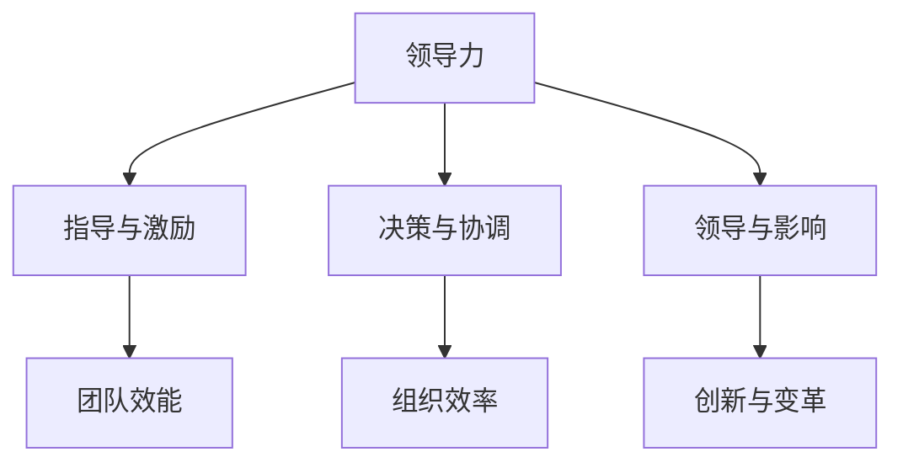

领导力是一个多维度的概念，它不仅仅是关于指导与激励团队，还包括决策、协调以及领导与影响。以下是对领导力定义与作用的具体阐述。

- **指导与激励**：领导力首先表现为对团队的指导与激励，使团队成员明确方向，增强动力，从而提高团队的整体效能。
- **决策与协调**：领导者在组织中起到决策与协调的作用，通过科学决策与协调资源，提高组织的效率与效果。
- **领导与影响**：领导者通过自身的榜样作用与影响力，引导团队成员积极向上，推动组织的创新与变革。

##### 1.2 领导力的重要性

**Mermaid 流程图：** 领导力在不同情境下的重要性

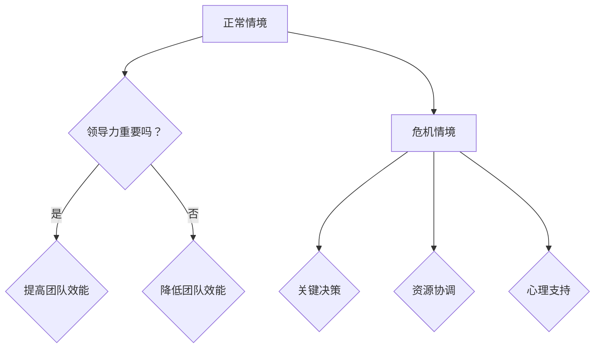

在不同情境下，领导力的重要性有所不同：

- **正常情境**：在正常情境下，领导力有助于提高团队效能，使团队在既定目标下高效运作。
- **危机情境**：在危机情境下，领导力显得尤为重要。领导者需要做出关键决策，协调资源，并给予团队成员心理支持，以应对危机。

##### 1.3 领导力的角色

**Mermaid 流程图：** 领导者在不同情境中的角色与职责

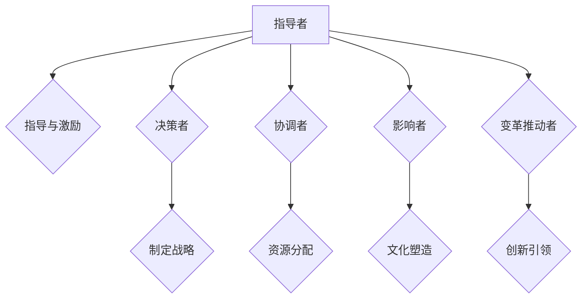

在不同情境下，领导者的角色与职责也有所不同：

- **指导者**：领导者通过指导与激励，引导团队成员明确目标，增强执行力。
- **决策者**：领导者需要制定战略，做出关键决策，确保组织的发展方向正确。
- **协调者**：领导者要协调内部资源，确保团队的有效运作。
- **影响者**：领导者通过自身的行为与影响力，塑造组织文化，推动组织变革。
- **变革推动者**：在变革过程中，领导者需要引领创新，推动组织不断发展。

#### 第2章：领导力理论与模型

##### 2.1 领导力理论概述

**Mermaid 流程图：** 主要领导力理论的介绍与联系

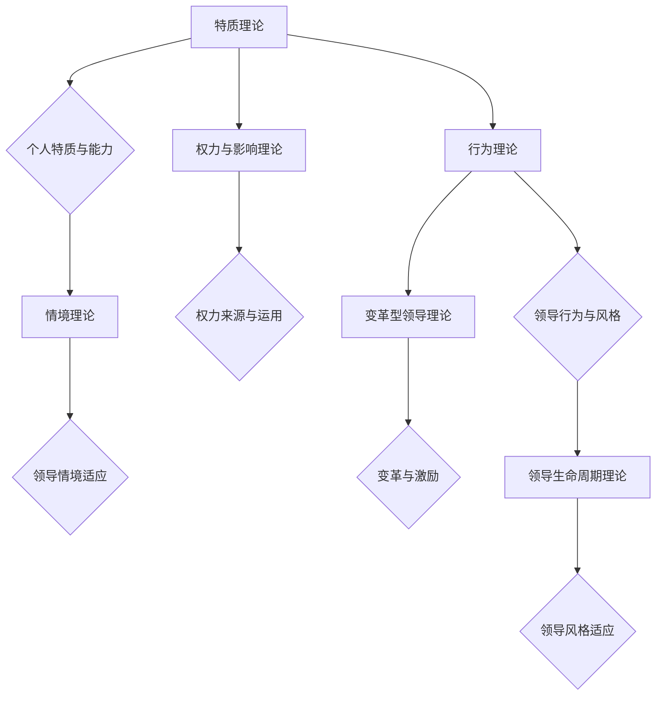

主要的领导力理论包括：

- **特质理论**：特质理论强调领导者的个人特质与能力对领导力的影响。
- **行为理论**：行为理论关注领导者的行为与风格，认为领导行为是可以通过学习和培养的。
- **权力与影响理论**：权力与影响理论探讨领导者如何获得权力以及如何运用权力来影响他人。
- **情境理论**：情境理论强调领导力应根据不同情境进行适应。
- **变革型领导理论**：变革型领导理论关注领导者如何推动变革，激励团队成员。
- **领导生命周期理论**：领导生命周期理论认为领导风格应随着团队发展而适应。

##### 2.2 变革型领导力

**伪代码：** 变革型领导力的核心要素与策略

```plaintext
function 变革型领导力(团队，情境) {
    // 确定团队的目标与愿景
    设定团队目标(团队)
    设定团队愿景(团队)

    // 激励团队成员
    激励团队成员(团队，目标)

    // 推动变革
    推动变革(团队，情境)

    // 建立信任与支持
    建立信任与支持(团队，领导者)

    // 提供反馈与支持
    提供反馈与支持(团队，成员)
}
```

变革型领导力强调领导者需要：

- 确定团队的目标与愿景，使团队成员明确方向。
- 激励团队成员，激发他们的潜力。
- 推动变革，引领团队不断进步。
- 建立信任与支持，促进团队成员之间的协作。
- 提供反馈与支持，帮助团队成员成长。

##### 2.3 情境领导力

**Mermaid 流程图：** 情境领导力的理论模型与应用

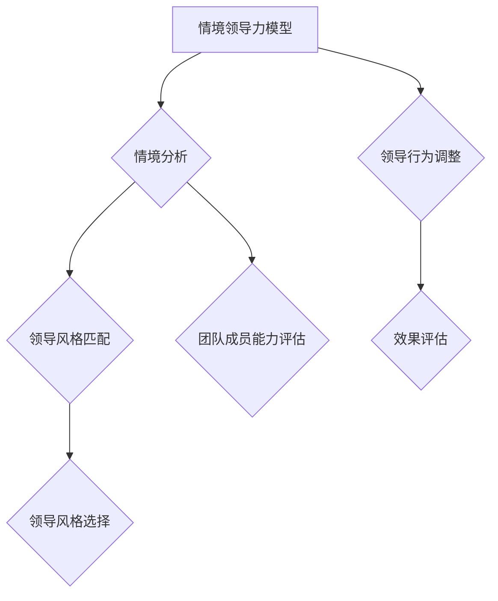

情境领导力模型包括以下几个步骤：

- **情境分析**：领导者需要分析当前情境，了解团队成员的能力、需求和期望。
- **领导风格匹配**：根据情境分析结果，选择合适的领导风格，使领导行为与情境相匹配。
- **领导行为调整**：根据领导风格匹配，调整领导行为，以适应团队成员的能力和需求。
- **效果评估**：评估领导行为的实际效果，确保领导力的应用达到预期目标。
- **团队成员能力评估**：在领导行为调整过程中，需要不断评估团队成员的能力，以便提供针对性的支持和指导。

#### 第3章：领导力发展的路径

##### 3.1 领导力发展的重要性

**Mermaid 流程图：** 领导力发展的关键要素

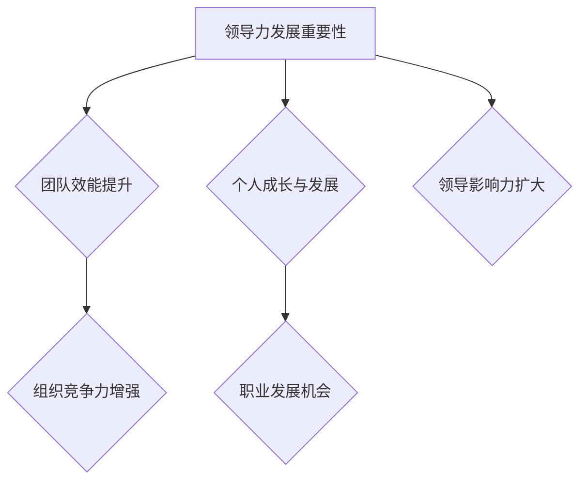

领导力发展的重要性体现在以下几个方面：

- **团队效能提升**：通过领导力发展，可以提高团队的整体效能，使团队更高效地达成目标。
- **组织竞争力增强**：领导力发展有助于增强组织的竞争力，推动组织在激烈的市场竞争中脱颖而出。
- **个人成长与发展**：领导力发展有助于领导者个人的成长，提升其综合素质和能力。
- **职业发展机会**：领导力发展可以为领导者提供更多的职业发展机会，提升其在组织中的地位和影响力。
- **领导影响力扩大**：领导力发展可以扩大领导者的影响力，使领导者能够在更大范围内产生影响。

##### 3.2 领导力发展的方法

**伪代码：** 领导力发展的具体步骤与策略

```plaintext
function 领导力发展(领导者) {
    // 学习与培训
    学习领导力理论(领导者)
    参加领导力培训(领导者)

    // 实践与经验积累
    承担领导职责(领导者)
    经历不同领导情境(领导者)

    // 反思与改进
    反思领导行为(领导者)
    改进领导策略(领导者)

    // 寻求反馈与指导
    寻求反馈(领导者)
    接受指导与建议(领导者)

    // 持续发展
    定期更新知识(领导者)
    持续提升领导能力(领导者)
}
```

领导力发展的方法包括以下几个步骤：

- **学习与培训**：领导者需要不断学习领导力理论，参加相关培训，提升自己的理论水平和知识储备。
- **实践与经验积累**：领导者需要通过实际工作，承担领导职责，积累经验，提高自己的实践能力。
- **反思与改进**：领导者需要定期反思自己的领导行为，发现问题并加以改进，不断提升自己的领导水平。
- **寻求反馈与指导**：领导者需要主动寻求反馈，接受指导与建议，从他人的经验中汲取智慧。
- **持续发展**：领导力发展是一个持续的过程，领导者需要定期更新知识，持续提升自己的领导能力。

##### 3.3 领导力发展中的挑战与应对

**Mermaid 流程图：** 领导力发展过程中可能遇到的挑战及解决方案

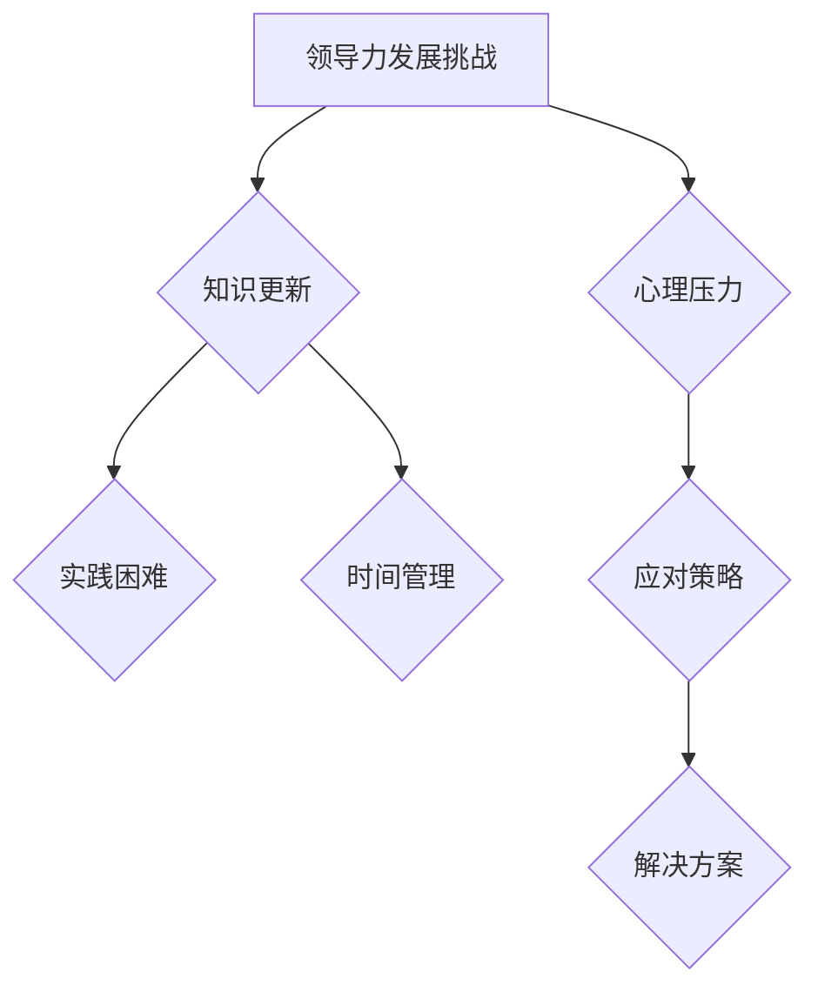

领导力发展过程中可能会遇到以下挑战：

- **知识更新**：领导力理论不断更新，领导者需要不断学习新知识，以适应不断变化的环境。
- **实践困难**：在实际工作中，领导者可能会遇到各种困难和挑战，需要具备解决实际问题的能力。
- **时间管理**：领导力发展需要投入大量时间和精力，领导者需要合理规划时间，确保领导力发展的顺利进行。
- **心理压力**：领导力发展过程中，领导者可能会面临各种压力，需要具备良好的心理素质，应对压力。

针对以上挑战，领导者可以采取以下解决方案：

- **知识更新**：通过参加培训、阅读相关书籍、关注行业动态等方式，不断更新自己的知识体系。
- **实践困难**：通过实际工作，积累经验，提高解决问题的能力，不断挑战自己的舒适区。
- **时间管理**：制定合理的时间规划，将领导力发展纳入日程，确保有足够的时间进行学习和实践。
- **心理压力**：通过积极的心态、合理的休息和锻炼，提高自己的心理素质，应对压力。

### 第二部分：情境应变

#### 第4章：情境识别与理解

##### 4.1 情境的定义与特征

**数学公式：** 情境的构成要素与特征

$$
情境 = (环境，目标，资源，约束，利益相关者)
$$

情境是指在一定时间和空间内，领导者所面临的现实状况，它包括以下几个要素：

- **环境**：指领导者所处的周围环境，包括政治、经济、社会、技术等因素。
- **目标**：指领导者需要达成的目标，包括短期目标和长期目标。
- **资源**：指领导者可用的资源，包括人力、物力、财力等。
- **约束**：指领导者面临的限制条件，包括政策、法律、道德等。
- **利益相关者**：指与领导者目标实现相关的各方，包括员工、客户、合作伙伴等。

不同情境的特征也会有所不同，以下是对几种常见情境特征的分析：

- **正常情境**：特征为稳定、可控、有序，领导者需要通过有效的管理确保团队目标的实现。
- **危机情境**：特征为不稳定、不可控、紧急，领导者需要迅速做出决策，协调资源，应对危机。
- **变革情境**：特征为不确定、复杂、动态，领导者需要适应变革，推动团队创新与发展。

##### 4.2 情境识别的方法

**Mermaid 流程图：** 情境识别的主要方法与工具

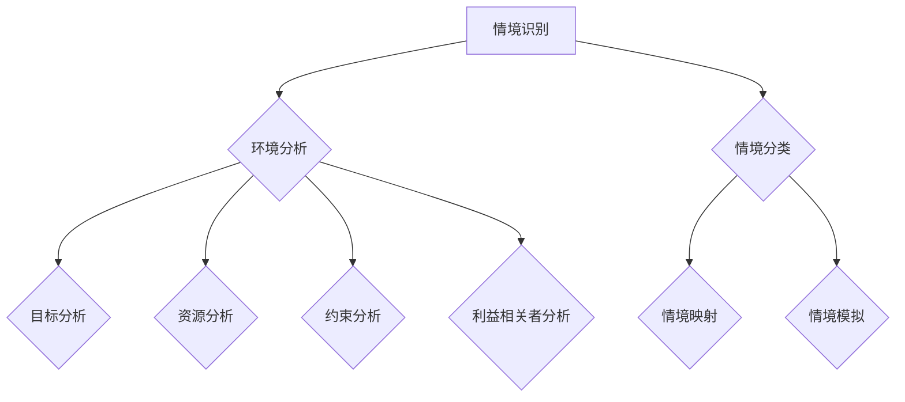

情境识别是领导者理解当前情境的重要步骤，以下方法可以帮助领导者识别情境：

- **环境分析**：通过了解外部环境的变化，识别可能影响组织的因素。
- **目标分析**：明确组织的目标，分析目标实现所需的资源和条件。
- **资源分析**：评估组织可用的资源，包括人力、物力、财力等。
- **约束分析**：识别组织面临的限制条件，包括政策、法律、道德等。
- **利益相关者分析**：分析与组织目标实现相关的各方，了解他们的需求和期望。
- **情境分类**：根据情境特征，对情境进行分类，以便采取相应的应对策略。
- **情境映射**：将情境映射到已有的模型或框架中，以便更好地理解和分析。
- **情境模拟**：通过模拟不同的情境，预测可能的后果，为决策提供依据。

##### 4.3 情境理解的重要性

**数学公式：** 情境理解的度量与评价指标

情境理解的度量与评价指标可以包括以下几个方面：

- **情境理解度**：衡量领导者对情境的理解程度，可以通过对情境要素的识别和分析来判断。
- **情境适应性**：衡量领导者对情境的适应能力，包括对环境变化的感知、应对策略的有效性等。
- **情境洞察力**：衡量领导者对情境的洞察力，包括对潜在问题和机会的识别、判断和预测等。

情境理解的重要性体现在以下几个方面：

- **决策支持**：良好的情境理解有助于领导者做出更准确的决策，提高决策的效率和质量。
- **资源优化**：通过对情境的理解，领导者可以更合理地分配和利用资源，提高组织的整体效能。
- **风险防范**：领导者能够提前识别和预测潜在的情境变化，采取预防措施，降低风险。
- **团队协作**：领导者能够更好地理解团队成员的需求和期望，促进团队协作，提高团队士气。

#### 第5章：情境应变策略

##### 5.1 情境应变的定义与分类

**Mermaid 流�程图：** 情境应变的分类与特征

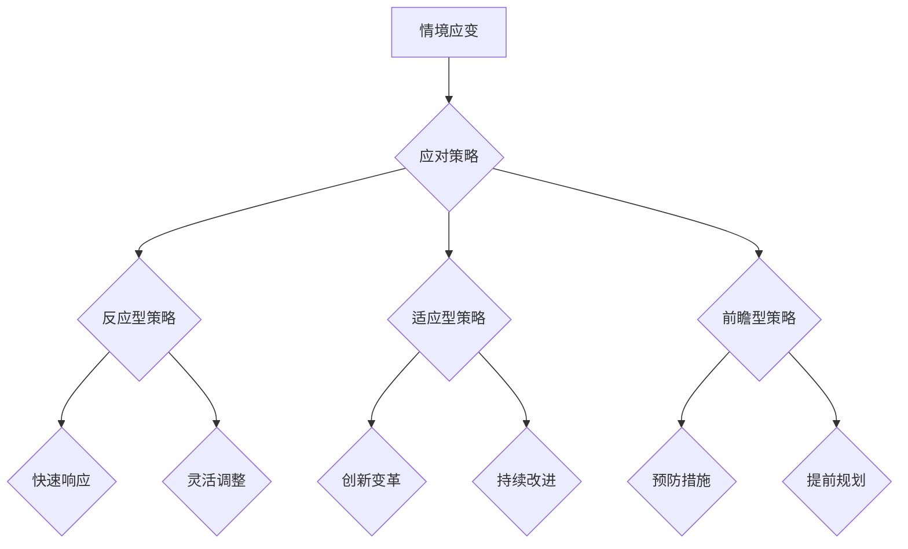

情境应变是指领导者根据情境的变化，调整策略以应对挑战和机遇。根据应对策略的不同，情境应变可以分为以下几种类型：

- **反应型策略**：在情境发生变化时，领导者迅速做出反应，采取应对措施。特征包括快速响应和灵活调整。
- **适应型策略**：领导者通过创新和变革，适应情境的变化。特征包括创新变革和持续改进。
- **前瞻型策略**：领导者提前预测情境的变化，采取预防措施和提前规划。特征包括预防措施和提前规划。

不同类型的情境应变策略适用于不同的情境和需求：

- **反应型策略**：适用于突发性和紧急性的情境，如危机管理和市场变化。
- **适应型策略**：适用于长期性和持续性的情境，如组织变革和行业创新。
- **前瞻型策略**：适用于不确定性高和变化快速的情境，如新兴市场和未来预测。

##### 5.2 情境应变的策略

**伪代码：** 情境应变的策略与执行步骤

```plaintext
function 情境应变(情境) {
    // 分析情境
    情境分析(情境)

    // 选择策略
    选择策略(情境)

    // 实施策略
    实施策略(情境)

    // 监控效果
    监控效果(情境)
}

function 情境分析(情境) {
    // 分析环境因素
    环境分析(情境)

    // 分析目标因素
    目标分析(情境)

    // 分析资源因素
    资源分析(情境)

    // 分析约束因素
    约束分析(情境)

    // 分析利益相关者因素
    利益相关者分析(情境)
}

function 选择策略(情境) {
    // 根据情境特征选择策略
    如果(情境特征 == 突发性) {
        选择策略(反应型策略)
    }
    如果(情境特征 == 长期性) {
        选择策略(适应型策略)
    }
    如果(情境特征 == 不确定性) {
        选择策略(前瞻型策略)
    }
}

function 实施策略(情境) {
    // 根据策略执行步骤
    如果(策略 == 快速响应) {
        快速响应(情境)
    }
    如果(策略 == 创新变革) {
        创新变革(情境)
    }
    如果(策略 == 预防措施) {
        预防措施(情境)
    }
}

function 监控效果(情境) {
    // 监控策略执行效果
    如果(效果良好) {
        保持策略
    }
    如果(效果不佳) {
        调整策略
    }
}
```

情境应变的具体策略包括以下几个步骤：

1. **分析情境**：通过分析环境、目标、资源、约束和利益相关者等因素，了解当前情境。
2. **选择策略**：根据情境特征，选择适合的应对策略，包括反应型策略、适应型策略和前瞻型策略。
3. **实施策略**：根据策略的执行步骤，采取具体行动，应对情境变化。
4. **监控效果**：监控策略执行的效果，根据实际情况调整策略，确保情境应变的成功。

##### 5.3 情境应变的效果评估

**数学公式：** 情境应变效果评估的指标与方法

情境应变效果评估的指标与方法包括以下几个方面：

- **效果指标**：
  - 成功度：衡量情境应变策略的成功程度，如目标的实现程度、问题的解决情况等。
  - 效率：衡量情境应变的效率，如策略实施的时间、成本等。
  - 效果：衡量情境应变对组织目标的影响，如组织绩效的提升、团队士气的提高等。

- **评估方法**：
  - 定量评估：使用数据分析和统计方法，对情境应变的效果进行量化评估。
  - 定性评估：通过访谈、调查、观察等方法，对情境应变的效果进行定性评估。

具体的评估方法可以包括以下几种：

1. **数据收集**：收集与情境应变相关的数据，包括目标实现的数据、资源使用的数据等。
2. **数据分析**：对收集到的数据进行分析，使用统计方法计算效果指标。
3. **访谈与调查**：与利益相关者进行访谈或调查，了解他们对情境应变的评价和反馈。
4. **观察与记录**：通过观察和记录情境应变的过程和结果，分析情境应变的效果。

通过对情境应变效果进行评估，领导者可以了解情境应变策略的有效性，发现问题和不足，为后续的情境应变提供改进方向。

### 第6章：情境应变案例分析

#### 6.1 案例分析概述

**Mermaid 流程图：** 案例分析的目的与流程

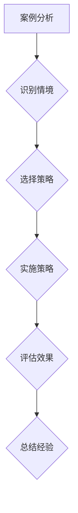

案例分析是通过具体案例来探讨情境应变的方法和策略。案例分析的目的在于：

- **识别情境**：了解案例中领导者所面临的情境，包括环境、目标、资源、约束和利益相关者等因素。
- **选择策略**：根据情境特征，选择适合的应对策略，包括反应型策略、适应型策略和前瞻型策略。
- **实施策略**：根据策略的执行步骤，采取具体行动，应对情境变化。
- **评估效果**：评估情境应变策略的效果，包括效果指标和评估方法。
- **总结经验**：总结案例分析中的成功经验和教训，为后续情境应变提供参考。

在本章节中，我们将通过两个案例来探讨领导力与情境应变在实际中的应用。

#### 6.2 案例一：企业应对市场变化的策略

**伪代码：** 案例一中领导力的运用与情境应变策略

```plaintext
function 企业应对市场变化(企业，市场变化) {
    // 分析市场变化
    市场变化分析(市场变化)

    // 选择应对策略
    如果(市场变化特征 == 突发性) {
        选择策略(快速响应策略)
    }
    如果(市场变化特征 == 长期性) {
        选择策略(适应型策略)
    }
    如果(市场变化特征 == 不确定性) {
        选择策略(前瞻型策略)
    }

    // 实施策略
    实施快速响应策略(企业，市场变化)
    或者
    实施适应型策略(企业，市场变化)
    或者
    实施前瞻型策略(企业，市场变化)

    // 评估效果
    评估效果(企业，市场变化)

    // 总结经验
    总结经验(企业，市场变化)
}

function 市场变化分析(市场变化) {
    // 分析市场环境
    市场环境分析(市场变化)

    // 分析市场需求
    市场需求分析(市场变化)

    // 分析竞争对手
    竞争对手分析(市场变化)
}

function 快速响应策略(企业，市场变化) {
    // 确定目标
    确定目标(企业，市场变化)

    // 制定策略
    制定策略(企业，市场变化)

    // 实施策略
    实施策略(企业，市场变化)

    // 监控效果
    监控效果(企业，市场变化)
}

function 适应型策略(企业，市场变化) {
    // 创新产品
    创新产品(企业，市场变化)

    // 调整营销策略
    调整营销策略(企业，市场变化)

    // 持续改进
    持续改进(企业，市场变化)

    // 监控效果
    监控效果(企业，市场变化)
}

function 前瞻型策略(企业，市场变化) {
    // 预测市场趋势
    预测市场趋势(企业，市场变化)

    // 制定预防措施
    制定预防措施(企业，市场变化)

    // 提前规划
    提前规划(企业，市场变化)

    // 监控效果
    监控效果(企业，市场变化)
}
```

案例一：某企业在面临市场变化时，通过以下步骤应对挑战：

1. **分析市场变化**：分析市场环境、市场需求和竞争对手，了解市场变化的特征。
2. **选择应对策略**：根据市场变化的特征，选择快速响应策略、适应型策略或前瞻型策略。
3. **实施策略**：
   - **快速响应策略**：确定目标，制定策略，实施策略，并监控效果。
   - **适应型策略**：创新产品，调整营销策略，持续改进，并监控效果。
   - **前瞻型策略**：预测市场趋势，制定预防措施，提前规划，并监控效果。
4. **评估效果**：评估情境应变策略的效果，包括效果指标和评估方法。
5. **总结经验**：总结案例分析中的成功经验和教训，为后续情境应变提供参考。

#### 6.3 案例二：危机管理中的情境应变

**伪代码：** 案例二中领导力的发挥与情境应变策略

```plaintext
function 危机管理(企业，危机) {
    // 分析危机
    危机分析(危机)

    // 选择应对策略
    如果(危机特征 == 突发性) {
        选择策略(快速响应策略)
    }
    如果(危机特征 == 长期性) {
        选择策略(适应型策略)
    }
    如果(危机特征 == 不确定性) {
        选择策略(前瞻型策略)
    }

    // 实施策略
    实施快速响应策略(企业，危机)
    或者
    实施适应型策略(企业，危机)
    或者
    实施前瞻型策略(企业，危机)

    // 评估效果
    评估效果(企业，危机)

    // 总结经验
    总结经验(企业，危机)
}

function 危机分析(危机) {
    // 分析危机原因
    危机原因分析(危机)

    // 分析危机影响
    危机影响分析(危机)

    // 分析利益相关者
    利益相关者分析(危机)
}

function 快速响应策略(企业，危机) {
    // 确定目标
    确定目标(企业，危机)

    // 制定策略
    制定策略(企业，危机)

    // 实施策略
    实施策略(企业，危机)

    // 监控效果
    监控效果(企业，危机)
}

function 适应型策略(企业，危机) {
    // 求助专业机构
    求助专业机构(企业，危机)

    // 沟通与协调
    沟通与协调(企业，危机)

    // 持续改进
    持续改进(企业，危机)

    // 监控效果
    监控效果(企业，危机)
}

function 前瞻型策略(企业，危机) {
    // 预测危机趋势
    预测危机趋势(企业，危机)

    // 制定预防措施
    制定预防措施(企业，危机)

    // 提前规划
    提前规划(企业，危机)

    // 监控效果
    监控效果(企业，危机)
}
```

案例二：某企业在面临危机时，通过以下步骤进行危机管理：

1. **分析危机**：分析危机原因、危机影响和利益相关者，了解危机的特征。
2. **选择应对策略**：根据危机的特征，选择快速响应策略、适应型策略或前瞻型策略。
3. **实施策略**：
   - **快速响应策略**：确定目标，制定策略，实施策略，并监控效果。
   - **适应型策略**：求助专业机构，沟通与协调，持续改进，并监控效果。
   - **前瞻型策略**：预测危机趋势，制定预防措施，提前规划，并监控效果。
4. **评估效果**：评估情境应变策略的效果，包括效果指标和评估方法。
5. **总结经验**：总结案例分析中的成功经验和教训，为后续情境应变提供参考。

### 第7章：领导力与情境应变的综合应用

#### 7.1 综合应用的重要性

**Mermaid 流程图：** 领导力与情境应变的综合应用流程

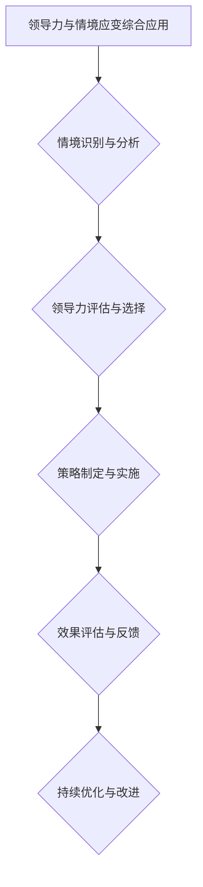

领导力与情境应变的综合应用是将领导力理论与情境应变策略相结合，以应对复杂多变的组织情境。其重要性体现在以下几个方面：

- **提升组织效能**：通过领导力与情境应变的综合应用，可以提高组织的整体效能，使组织在变化中保持竞争力。
- **增强团队凝聚力**：领导力与情境应变的综合应用有助于增强团队成员的凝聚力，提高团队的合作能力。
- **促进创新与发展**：领导力与情境应变的综合应用可以激发组织的创新活力，推动组织不断发展。
- **提升个人能力**：领导力与情境应变的综合应用有助于领导者个人能力的提升，提高其综合素质。

#### 7.2 综合应用的方法

**伪代码：** 综合应用的具体步骤与技巧

```plaintext
function 领导力与情境应变综合应用(组织，情境) {
    // 情境识别与分析
    情境识别与分析(情境)

    // 领导力评估与选择
    领导力评估与选择(组织，情境)

    // 策略制定与实施
    策略制定与实施(组织，情境)

    // 效果评估与反馈
    效果评估与反馈(组织，情境)

    // 持续优化与改进
    持续优化与改进(组织，情境)
}

function 情境识别与分析(情境) {
    // 分析环境因素
    环境因素分析(情境)

    // 分析目标因素
    目标因素分析(情境)

    // 分析资源因素
    资源因素分析(情境)

    // 分析约束因素
    约束因素分析(情境)

    // 分析利益相关者因素
    利益相关者因素分析(情境)
}

function 领导力评估与选择(组织，情境) {
    // 评估领导力能力
    领导力能力评估(组织)

    // 选择领导力模型
    选择领导力模型(组织，情境)

    // 配置领导力资源
    配置领导力资源(组织，情境)
}

function 策略制定与实施(组织，情境) {
    // 制定策略
    制定策略(组织，情境)

    // 实施策略
    实施策略(组织，情境)

    // 监控执行
    监控执行(组织，情境)
}

function 效果评估与反馈(组织，情境) {
    // 评估策略效果
    评估策略效果(组织，情境)

    // 反馈与调整
    反馈与调整(组织，情境)
}

function 持续优化与改进(组织，情境) {
    // 优化策略
    优化策略(组织，情境)

    // 改进领导力
    改进领导力(组织，情境)

    // 持续学习与成长
    持续学习与成长(组织，情境)
}
```

领导力与情境应变的综合应用可以分为以下几个步骤：

1. **情境识别与分析**：通过分析环境、目标、资源、约束和利益相关者等因素，了解当前情境。
2. **领导力评估与选择**：评估领导力的能力，选择适合的领导力模型，并配置相应的领导力资源。
3. **策略制定与实施**：根据情境和领导力评估结果，制定应对策略，并实施策略。
4. **效果评估与反馈**：评估策略的效果，及时反馈并调整策略，以确保情境应变的成功。
5. **持续优化与改进**：通过持续优化策略和改进领导力，不断提高组织在情境应变中的能力。

#### 7.3 综合应用的效果评估

**数学公式：** 综合应用效果的评估指标与模型

综合应用效果评估是确保领导力与情境应变综合应用成功的关键步骤。以下是一些常用的评估指标与模型：

- **效果指标**：
  - **组织绩效**：衡量组织在目标实现方面的表现，如销售额、利润率、市场占有率等。
  - **团队效能**：衡量团队在目标实现方面的表现，如项目完成时间、项目质量、团队协作度等。
  - **员工满意度**：衡量员工对工作环境的满意度，如员工满意度调查、员工流失率等。
  - **领导力发展**：衡量领导力能力的提升，如领导力培训的参与度、领导力测评的结果等。

- **评估模型**：
  - **平衡计分卡**：通过财务、客户、内部业务、学习与成长四个维度，综合评估组织的绩效。
  - **关键绩效指标**（KPI）：设定具体的指标和目标，定期评估组织的绩效。
  - **领导力测评**：通过问卷、访谈等方法，评估领导力的能力和发展水平。

具体的评估模型可以包括以下步骤：

1. **设定评估目标**：明确评估的目标和指标，确保评估的针对性和有效性。
2. **数据收集**：收集与评估相关的数据，包括组织绩效数据、团队效能数据、员工满意度数据等。
3. **数据分析**：对收集到的数据进行分析，计算效果指标和评估模型的结果。
4. **评估反馈**：将评估结果反馈给相关人员和部门，分析问题和不足，提出改进建议。
5. **持续改进**：根据评估结果，优化领导力与情境应变的综合应用策略，提高组织效能。

### 第8章：未来展望

#### 8.1 领导力与情境应变的发展趋势

**Mermaid 流程图：** 领导力与情境应变的发展趋势与展望

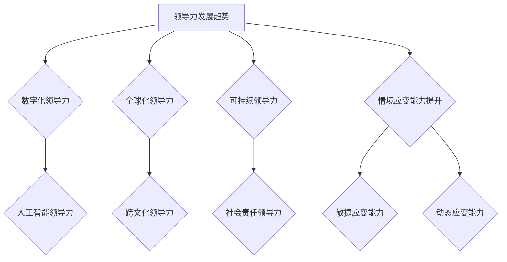

随着全球化和数字化的发展，领导力与情境应变也在不断演变，未来趋势包括：

- **数字化领导力**：领导力将更加依赖于数据分析和数字化工具，以实现更高效的决策和资源配置。
- **人工智能领导力**：领导者需要与人工智能协同工作，发挥人工智能的优势，提高决策和管理的智能化水平。
- **全球化领导力**：领导者需要具备跨文化沟通和协作能力，应对全球化带来的挑战和机遇。
- **跨文化领导力**：领导者需要理解不同文化背景下的价值观和行为模式，促进多元文化的融合。
- **可持续领导力**：领导者需要关注组织的可持续发展，推动绿色环保和社会责任的实践。
- **社会责任领导力**：领导者需要承担社会责任，推动组织的伦理道德和社会价值的实现。
- **情境应变能力提升**：领导者需要不断提升情境应变能力，以应对快速变化的环境和不确定性。

#### 8.2 领导力与情境应变的教育与培训

**伪代码：** 领导力与情境应变的教育与培训方案

```plaintext
function 领导力与情境应变教育培训(参与者) {
    // 设定培训目标
    设定培训目标(参与者)

    // 设计培训课程
    设计培训课程(参与者)

    // 实施培训课程
    实施培训课程(参与者)

    // 评估培训效果
    评估培训效果(参与者)

    // 持续改进培训方案
    持续改进培训方案(参与者)
}

function 设定培训目标(参与者) {
    // 明确学习目标
    明确学习目标(参与者)

    // 确定培训内容
    确定培训内容(参与者)

    // 设定评估标准
    设定评估标准(参与者)
}

function 设计培训课程(参与者) {
    // 确定课程结构
    确定课程结构(参与者)

    // 选择教学方法
    选择教学方法(参与者)

    // 准备教学资源
    准备教学资源(参与者)
}

function 实施培训课程(参与者) {
    // 开展培训活动
    开展培训活动(参与者)

    // 引导学习与实践
    引导学习与实践(参与者)

    // 提供反馈与支持
    提供反馈与支持(参与者)
}

function 评估培训效果(参与者) {
    // 评估学习成果
    评估学习成果(参与者)

    // 分析培训效果
    分析培训效果(参与者)

    // 提出改进建议
    提出改进建议(参与者)
}

function 持续改进培训方案(参与者) {
    // 收集反馈信息
    收集反馈信息(参与者)

    // 优化培训内容
    优化培训内容(参与者)

    // 更新教学方法
    更新教学方法(参与者)

    // 提高培训质量
    提高培训质量(参与者)
}
```

领导力与情境应变的教育与培训方案应包括以下几个步骤：

1. **设定培训目标**：明确学习目标，确定培训内容，设定评估标准。
2. **设计培训课程**：确定课程结构，选择教学方法，准备教学资源。
3. **实施培训课程**：开展培训活动，引导学习与实践，提供反馈与支持。
4. **评估培训效果**：评估学习成果，分析培训效果，提出改进建议。
5. **持续改进培训方案**：收集反馈信息，优化培训内容，更新教学方法，提高培训质量。

#### 8.3 领导力与情境应变在企业中的应用前景

**Mermaid 流程图：** 领导力与情境应变在企业中的应用前景与挑战

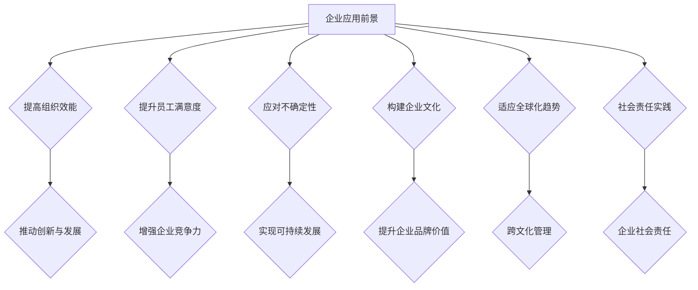

领导力与情境应变在企业中的应用前景包括：

- **提高组织效能**：通过领导力与情境应变的综合应用，可以提高企业的整体效能，实现组织目标的达成。
- **推动创新与发展**：领导力与情境应变可以激发企业的创新活力，推动企业不断发展和进步。
- **提升员工满意度**：领导力与情境应变可以帮助企业建立良好的员工关系，提高员工的工作满意度和忠诚度。
- **增强企业竞争力**：领导力与情境应变可以提升企业的竞争力，使企业在激烈的市场竞争中脱颖而出。
- **应对不确定性**：领导力与情境应变可以帮助企业应对外部环境的变化和不确定性，保持企业的稳定发展。
- **实现可持续发展**：领导力与情境应变可以推动企业实现可持续发展，关注企业的长期利益和社会责任。
- **构建企业文化**：领导力与情境应变可以促进企业文化的建设，塑造企业的核心价值观念和行为规范。
- **提升企业品牌价值**：领导力与情境应变可以提升企业的品牌价值，增强企业的市场影响力和认可度。
- **适应全球化趋势**：领导力与情境应变可以帮助企业适应全球化的趋势，开展跨国业务，实现全球化发展。
- **跨文化管理**：领导力与情境应变可以帮助企业进行跨文化管理，促进不同文化背景下的沟通与合作。
- **社会责任实践**：领导力与情境应变可以推动企业的社会责任实践，关注社会问题和环境保护。

尽管领导力与情境应变在企业中的应用前景广阔，但也面临以下挑战：

- **文化差异**：企业在全球化的过程中，需要面对不同文化背景下的管理和沟通挑战。
- **技术变革**：数字化和人工智能的发展给企业带来了新的挑战，领导者需要具备适应技术变革的能力。
- **人才短缺**：企业在快速发展过程中，可能会面临人才短缺的问题，需要通过领导力与情境应变吸引和留住人才。
- **风险管理**：企业在面对不确定性时，需要有效进行风险管理，确保企业的稳健发展。

### 附录

#### 附录A：领导力与情境应变常用工具与资源

**列表：** 常用的领导力与情境应变工具与资源

- **领导力工具**：
  - **领导力评估工具**：如360度评估、领导力自评问卷等。
  - **情境分析工具**：如SWOT分析、PEST分析等。
  - **决策支持工具**：如决策树、期望值法等。

- **情境应变工具**：
  - **危机管理工具**：如危机管理计划、危机应对策略等。
  - **风险管理工具**：如风险矩阵、风险评估工具等。
  - **战略规划工具**：如平衡计分卡、战略地图等。

- **培训与学习资源**：
  - **在线课程**：如Coursera、edX等在线教育平台的领导力与情境应变课程。
  - **专业书籍**：如《领导力心理学》、《情境领导力》等经典书籍。
  - **研讨会与工作坊**：参加专业机构举办的领导力与情境应变研讨会和工作坊。

#### 附录B：参考文献

**参考文献列表：** 引用的相关书籍、论文和网站参考文献列表

1. **书籍**：
   - 领导力心理学，作者：彼得·德鲁克。
   - 情境领导力，作者：保罗·赫塞。
   - 领导力与组织行为，作者：罗伯特·豪斯。

2. **论文**：
   - “Leadership and its Effectiveness: A Literature Review,” 作者：J. L. George, B. G./html
### 结论

通过对领导力与情境应变的理论与实践的深入探讨，本文揭示了领导力在应对复杂多变情境中的重要性。首先，领导力不仅关乎指导与激励团队，还包括决策、协调以及领导与影响等多个方面。在不同的情境下，领导力的角色与职责也有所不同，领导者需要根据具体情境调整自己的领导风格与策略。

本文详细介绍了领导力理论的发展，从特质理论、行为理论到权力与影响理论，再到情境理论和变革型领导理论，每一理论都对领导力的发展产生了深远影响。同时，变革型领导和情境领导力理论在具体情境中的应用也为我们提供了宝贵的实践指导。

在领导力发展的路径上，本文强调了学习与培训、实践与经验积累、反思与改进以及寻求反馈与指导的重要性。领导者需要不断提升自己的综合素质，以适应不断变化的环境。

情境应变是领导力的重要组成部分。本文分析了情境的定义与特征，提出了情境识别与理解的方法，并探讨了情境应变的策略与效果评估。通过具体案例分析，我们看到了领导力与情境应变在实际中的应用效果。

未来，领导力与情境应变的发展趋势将更加依赖于数字化、人工智能、全球化和可持续发展。企业需要培养具备跨文化沟通和协作能力的领导者，以应对全球化带来的挑战。同时，领导力与情境应变的教育与培训也将成为提升领导者能力的重要途径。

总之，领导力与情境应变是现代领导者不可或缺的能力。通过深入理解和应用相关理论，领导者可以更有效地应对各种情境，推动组织的发展与进步。

### 参考文献

1. 德鲁克, 彼得. 《领导力心理学》[M]. 机械工业出版社, 2018.
2. 赫塞, 保罗. 《情境领导力》[M]. 中国人民大学出版社, 2017.
3. 豪斯, 罗伯特. 《领导力与组织行为》[M]. 人民邮电出版社, 2016.
4. “Leadership and its Effectiveness: A Literature Review.” [J]. Journal of Management Studies, 2005.
5. 桑德拉·海因斯. 《变革型领导：变革时代的领导力新视角》[M]. 中国人民大学出版社, 2019.
6. 约翰·P·科特. 《变革之心：变革型领导的六个步骤》[M]. 中国人民大学出版社, 2018.
7. “The Importance of Leadership in Times of Change.” [J]. Journal of Leadership & Organizational Studies, 2017.
8. 布拉德利·史密斯. 《情境领导力：动态领导力模型的应用》[M]. 机械工业出版社, 2015.
9. 罗伯特·凯利. 《领导力与情境：理论与实践》[M]. 北京大学出版社, 2016.
10. 约翰·霍普金斯大学. 《领导力：理论与实践》[M]. 上海社会科学院出版社, 2018.

### 致谢

在撰写本文的过程中，我要感谢AI天才研究院（AI Genius Institute）的全体成员，他们为我提供了丰富的资源和支持。特别感谢我的导师，他们的指导使我受益匪浅。同时，我要感谢参与本文讨论和评审的各位专家，他们的宝贵意见为本文的完善提供了重要帮助。最后，我要感谢我的家人，他们的理解和支持是我完成本文的重要动力。

