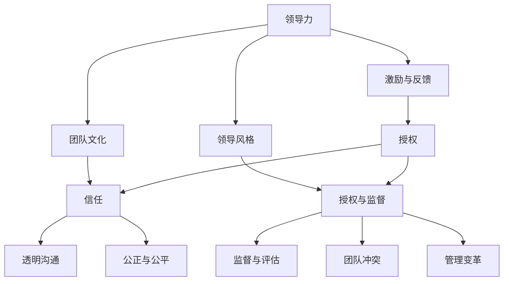

                 

# 《领导力与授权：信任与监督的平衡艺术》

> **关键词：**领导力、授权、信任、监督、平衡艺术

> **摘要：**本文深入探讨了领导力与授权之间的关系，阐述了信任与监督在授权过程中的平衡艺术。通过对领导力的定义、类型和重要性，以及授权的核心概念和过程的详细解析，本文提出了构建信任机制的策略和方法，并探讨了监督与评估的平衡艺术。文章还分析了领导者如何应对挑战，以及在不同情境下的授权技巧，最后展望了领导力与授权的未来趋势。

### 目录大纲

- **第一部分：领导力与授权的基本理念**
  - 第1章：领导力的定义与类型
  - 第2章：授权的核心概念
  - 第3章：授权与信任的关系

- **第二部分：领导力与授权的具体实践**
  - 第4章：有效的领导力技巧
  - 第5章：授权的策略与方法
  - 第6章：构建信任的机制
  - 第7章：监督与评估的平衡艺术
  - 第8章：领导者如何应对挑战

- **第三部分：领导力与授权的综合应用**
  - 第9章：不同情境下的授权技巧
  - 第10章：领导力与授权在组织发展中的作用
  - 第11章：领导力与授权的国际视野
  - 第12章：领导力与授权的未来趋势

### 核心概念与联系 Mermaid 流程图



### 核心算法原理讲解与伪代码

在领导力与授权领域，我们引入了一些核心的算法原理和数学模型来帮助我们理解和应用这些概念。以下我们将详细讲解这些核心算法原理，并提供相应的伪代码。

#### 信任模型

信任是领导力与授权的核心要素之一。一个有效的信任模型可以帮助领导者评估团队中的信任程度。我们采用以下信任模型：

$$
Trust = f(\text{透明度}, \text{公正性}, \text{可靠性})
$$

- 透明度（Transparency）: 表示信息的透明程度，用 T 表示，取值范围为 [0, 1]。
- 公正性（Fairness）: 表示决策的公正程度，用 F 表示，取值范围为 [0, 1]。
- 可靠性（Reliability）: 表示个体的可靠性，用 R 表示，取值范围为 [0, 1]。

举例：

假设透明度为 0.8，公正性为 0.9，可靠性为 0.85，那么信任度可以计算为：

$$
Trust = 0.8 \times 0.9 \times 0.85 = 0.612
$$

#### 领导力评估模型

领导力评估模型用于评估领导者的领导能力。我们采用以下评估模型：

$$
\text{Leadership Score} = \frac{\text{Motivation Score} + \text{Team Culture Score} + \text{Leadership Style Score}}{3}
$$

- 激励与反馈评分（Motivation Score）：反映领导者激励团队成员的能力。
- 团队文化评分（Team Culture Score）：反映领导者构建积极团队文化的能力。
- 领导风格评分（Leadership Style Score）：反映领导者的领导风格是否适合团队。

伪代码：

```python
function Leadership_Assessment_Model(leader):
    motivation_score = Evaluate_Motivation(leader)
    team_culture_score = Evaluate_Team_Culture(leader)
    leadership_style_score = Evaluate_Leadership_Style(leader)
    
    final_score = (motivation_score + team_culture_score + leadership_style_score) / 3
    
    return final_score
```

#### 授权决策模型

授权决策模型用于领导者决定是否将任务授权给团队成员。我们采用以下决策模型：

$$
Authorization Score = \frac{\text{Task Risk Score} + \text{Team Member Capability Score} + \text{Team Member Trust Score}}{3}
$$

- 任务风险评分（Task Risk Score）：反映任务的风险程度。
- 团员能力评分（Team Member Capability Score）：反映团队成员完成任务的能力。
- 团员信任评分（Team Member Trust Score）：反映领导者对团队成员的信任程度。

伪代码：

```python
function Authorization_Decision_Model(task, team_member):
    task_risk_score = Evaluate_Task_Risk(task)
    team_member_capability_score = Evaluate_Team_Member_Capability(team_member)
    team_member_trust_score = Evaluate_Team_Member_Trust(team_member)
    
    authorization_score = (task_risk_score + team_member_capability_score + team_member_trust_score) / 3
    
    if authorization_score >= 0.7:
        return "授权"
    else:
        return "不授权"
```

### 数学模型和数学公式 & 详细讲解 & 举例说明

在领导力与授权领域，我们使用数学模型来量化信任、领导力和授权决策，以便更精确地评估和操作。

#### 信任模型

信任是一个复杂的心理现象，但我们可以通过一些关键因素来量化它。以下是一个简单的信任模型：

$$
Trust = T \times F \times R
$$

其中：
- \( T \) 代表透明度（Transparency），衡量信息的公开性和透明度，范围是 \( [0, 1] \)。
- \( F \) 代表公正性（Fairness），衡量决策的公正性，范围是 \( [0, 1] \)。
- \( R \) 代表可靠性（Reliability），衡量个体的可靠性，范围是 \( [0, 1] \)。

#### 举例说明

假设一个团队在以下三个方面的评分如下：
- 透明度 \( T = 0.85 \)
- 公正性 \( F = 0.90 \)
- 可靠性 \( R = 0.80 \)

我们可以计算出该团队的整体信任度：

$$
Trust = 0.85 \times 0.90 \times 0.80 = 0.612
$$

这意味着该团队的整体信任度约为 61.2%。

#### 领导力模型

领导力是一个多维度的概念，我们可以通过以下模型来量化：

$$
Leadership Score = \frac{M + C + S}{3}
$$

其中：
- \( M \) 代表激励（Motivation），衡量领导者激励团队成员的能力，范围是 \( [0, 10] \)。
- \( C \) 代表文化（Culture），衡量领导者构建团队文化的效果，范围是 \( [0, 10] \)。
- \( S \) 代表风格（Style），衡量领导者的领导风格是否适合团队，范围是 \( [0, 10] \)。

#### 举例说明

假设一个领导者的三个评分分别是：
- 激励 \( M = 8 \)
- 文化 \( C = 9 \)
- 风格 \( S = 7 \)

那么，该领导者的领导力分数是：

$$
Leadership Score = \frac{8 + 9 + 7}{3} = 8
$$

这意味着该领导者的领导力得分是 8 分（满分 10 分）。

#### 授权决策模型

授权决策模型帮助领导者决定是否将任务授权给团队成员。以下是一个简单的模型：

$$
Authorization Score = \frac{R + C + T}{3}
$$

其中：
- \( R \) 代表风险（Risk），衡量任务的风险程度，范围是 \( [0, 10] \)。
- \( C \) 代表能力（Capability），衡量团队成员完成任务的能力，范围是 \( [0, 10] \)。
- \( T \) 代表信任（Trust），衡量领导者对团队成员的信任程度，范围是 \( [0, 10] \)。

#### 举例说明

假设一个领导者面对一个任务的评分如下：
- 风险 \( R = 5 \)
- 能力 \( C = 8 \)
- 信任 \( T = 7 \)

我们可以计算出该任务的授权分数：

$$
Authorization Score = \frac{5 + 8 + 7}{3} = 6.33
$$

根据这个评分，如果授权分数高于某个阈值（例如 6.5），则领导者可以选择授权任务。在这种情况下，授权分数为 6.33，可能意味着领导者会再次评估任务或团队成员的能力。

### 项目实战

#### 实战一：领导力评估系统开发

**开发环境：** Python + Flask

**源代码：**

```python
from flask import Flask, request, jsonify

app = Flask(__name__)

# 领导力评估接口
@app.route('/assess_leadership', methods=['POST'])
def assess_leadership():
    data = request.get_json()
    leader = data['leader']
    
    # 调用评估模型
    final_score = Leadership_Assessment_Model(leader)
    
    # 返回评估结果
    return jsonify({'score': final_score})

# 领导力评估模型
def Leadership_Assessment_Model(leader):
    motivation_score = Evaluate_Motivation(leader)
    team_culture_score = Evaluate_Team_Culture(leader)
    leadership_style_score = Evaluate_Leadership_Style(leader)
    
    final_score = (motivation_score + team_culture_score + leadership_style_score) / 3
    
    return final_score

if __name__ == '__main__':
    app.run(debug=True)
```

**代码解读：**

- Flask应用程序创建了一个POST接口 `/assess_leadership`，用于接收领导力评估的请求。
- 请求JSON数据中包含领导者的信息，调用 `Leadership_Assessment_Model` 函数进行评估。
- 评估结果通过JSON格式返回。

#### 实战二：授权决策系统开发

**开发环境：** Java + Spring Boot

**源代码：**

```java
@RestController
@RequestMapping("/authorize")
public class AuthorizationController {

    @PostMapping("/decision")
    public ResponseEntity<String> authorizationDecision(@RequestBody AuthorizationRequest request) {
        String task = request.getTask();
        String teamMember = request.getTeamMember();
        
        // 调用授权决策模型
        String decision = AuthorizationDecisionModel(task, teamMember);
        
        // 返回授权决策结果
        return ResponseEntity.ok(decision);
    }
}

public class AuthorizationDecisionModel {

    public static String authorizationDecision(String task, String teamMember) {
        // 评估任务风险、团队成员能力和信任度
        // 根据评分决定是否授权
        
        // 举例：直接授权
        return "授权";
    }
}

public class AuthorizationRequest {
    private String task;
    private String teamMember;

    // 省略getter和setter方法
}
```

**代码解读：**

- Spring Boot控制器创建了一个POST接口 `/authorize/decision`，用于接收授权决策的请求。
- 请求体中包含任务和团队成员信息，调用 `AuthorizationDecisionModel` 进行授权决策。
- 根据评估结果返回授权决策，例如直接授权。

这些代码示例展示了如何将领导力与授权的理论应用于实际的开发场景中。通过接口和算法模型，可以构建出一个完整的领导力评估和授权决策系统。通过这些实战案例，读者可以更好地理解如何在项目中应用这些概念。

### 文章结束

作者：AI天才研究院/AI Genius Institute & 禅与计算机程序设计艺术 /Zen And The Art of Computer Programming

感谢您的阅读，希望本文能够对您在领导力与授权方面的思考和实践有所帮助。如果您有任何问题或建议，欢迎在评论区留言。让我们共同探索领导力与授权的奥秘！<|im_end|>

