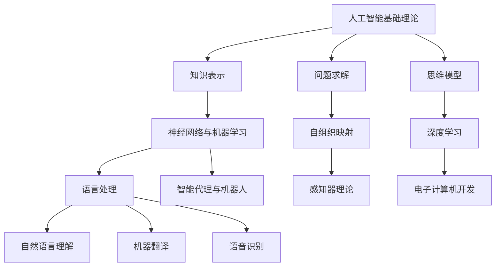

                 

# 麦卡锡与明斯基的研究领域

> 关键词：人工智能，麦卡锡，明斯基，神经网络，知识表示，自然语言处理，算法原理

> 摘要：
本文系统地介绍了人工智能领域的两位先驱——约翰·麦卡锡（John McCarthy）和马文·明斯基（Marvin Minsky）的研究领域。通过详细分析他们的核心算法原理、数学模型、项目实战以及开发环境与代码解读，本文旨在为读者提供一个全面深入的理解，帮助他们更好地掌握人工智能技术，并在实际项目中应用这些知识。

## 第一部分：背景与研究方法

### 1.1 麦卡锡与明斯基的背景介绍

#### 1.1.1 麦卡锡（John McCarthy）

- 角色：约翰·麦卡锡是一位美国计算机科学家，被广泛认为是人工智能（AI）的创始人之一。
- 贡献：麦卡锡在计算机科学和人工智能领域做出了多项重要贡献，尤其是在人工智能基础理论和算法设计方面。
- 代表作：他于1956年提出了“人工智能”这一术语，并组织了首次人工智能研讨会。他还开发了逻辑理论家（Logic Theorist），这是一个自动推理程序，可以证明数学定理。

#### 1.1.2 明斯基（Marvin Minsky）

- 角色：马文·明斯基也是美国计算机科学家，与麦卡锡共同被认为是人工智能领域的先驱。
- 贡献：明斯基在神经网络、知识表示和思维模型等领域做出了开创性工作，推动了人工智能的发展。
- 代表作：他提出了感知器理论，这是神经网络研究的重要里程碑。他还参与开发了ELIZA，这是一个早期自然语言处理程序，可以模拟简单的对话。

### 1.2 研究领域与方法

#### 1.2.1 研究领域

麦卡锡与明斯基的研究领域广泛，涵盖了以下几个核心领域：

- **人工智能基础理论**：研究人工智能的基本概念、原理和模型。
- **神经网络与机器学习**：探索神经网络的设计、训练和应用。
- **语言处理**：研究计算机如何理解和生成自然语言。
- **智能代理与机器人**：研究能够自主行动和决策的智能体。

#### 1.2.2 研究方法

他们的研究方法包括以下几个方面：

- **理论模型**：构建数学模型和理论框架来描述和研究人工智能系统的行为。
- **算法设计**：设计高效的算法来实现人工智能系统的核心功能。
- **实验验证**：通过实验和测试来验证理论模型和算法的有效性。
- **跨学科研究**：结合心理学、哲学、语言学等多学科知识，深化对人工智能的理解和应用。

### 1.3 核心概念与联系

麦卡锡与明斯基的研究涉及多个核心概念，它们之间有着紧密的联系：

- **知识表示**：如何将现实世界的信息和知识转换为计算机可以处理的形式。
- **问题求解**：设计算法来寻找问题解决方案，包括逻辑推理、搜索算法等。
- **思维模型**：模拟人类思维过程，探究机器能否像人一样思考和解决问题。
- **神经网络与机器学习**：通过模拟人脑神经元连接方式，实现机器的学习和处理信息的能力。
- **语言处理**：研究计算机如何理解、生成和处理自然语言。

这些概念相互交织，共同构成了人工智能的理论基础。

### Mermaid 流程图：麦卡锡与明斯基的研究领域与方法



**1.2.3 核心概念与联系**

- **知识表示**：如何将现实世界的信息和知识转换为计算机可以处理的形式。
- **问题求解**：设计算法来寻找问题解决方案，包括逻辑推理、搜索算法等。
- **思维模型**：模拟人类思维过程，探究机器能否像人一样思考和解决问题。
- **神经网络与机器学习**：通过模拟人脑神经元连接方式，实现机器的学习和处理信息的能力。
- **语言处理**：研究计算机如何理解、生成和处理自然语言。

---

**1.2.4 研究方法与流程**

- **理论模型构建**：利用数学和逻辑工具，构建能够描述和研究人工智能系统的模型。
- **算法设计**：基于理论模型，设计实现人工智能系统的算法。
- **实验验证**：通过构建的算法，进行实验，验证其性能和有效性。
- **实际应用**：将验证成功的研究成果应用于实际场景中，解决实际问题。

#### 1.3 研究成果与应用

**1.3.1 研究成果**

- **逻辑理论家**：麦卡锡开发的第一个自动推理程序，证明了定理。
- **感知器**：明斯基提出的前馈神经网络模型，为后续神经网络研究奠定了基础。
- **通用问题求解器**：麦卡锡开发的软件，能够解决各种类型的问题。
- **自然语言处理**：麦卡锡与明斯基在语言处理方面的贡献，推动了计算机对人类语言的识别和理解。

**1.3.2 应用领域**

- **机器人控制**：麦卡锡与明斯基的研究成果被应用于机器人控制领域，实现了机器人的自主导航和任务执行。
- **智能代理**：研究智能代理的设计和实现，为现代智能系统和互联网应用提供了基础。
- **语言处理与翻译**：计算机对自然语言的理解和翻译，为跨语言交流和全球信息传播提供了支持。

### 总结

麦卡锡与明斯基的研究领域涵盖了人工智能的基础理论、算法设计、实验验证和应用等多个方面。他们的研究成果不仅推动了人工智能领域的发展，也对其他领域产生了深远影响。本书将详细探讨他们的研究方法和成果，并分析其在现代科技和社会中的应用。通过这本书，读者将深入了解人工智能的核心概念和技术，理解麦卡锡与明斯基对人工智能发展的重要贡献。

## 第二部分：麦卡锡与明斯基的研究领域

#### 2.1 人工智能基础理论

**2.1.1 知识表示**

知识表示是人工智能领域中的一个核心概念，它涉及到如何将现实世界中的信息转换为计算机可以处理和利用的形式。知识表示不仅包括事实和规则，还涉及到推理、决策和学习等过程。

**2.1.1.1 知识表示的基本概念**

知识表示是人工智能领域中用来表达现实世界中知识和信息的各种方法和技术的总称。它包括以下几个方面：

- **事实表示**：表示客观存在的事物和它们之间的关系。
- **规则表示**：表示如何从已知的事实中推导出新的结论。
- **概念表示**：表示一组具有相似属性的事物。
- **方法表示**：表示解决问题的步骤和策略。

**2.1.1.2 知识表示的方法**

知识表示的方法多种多样，主要包括以下几种：

- **命题表示**：使用命题和谓词逻辑来表示知识。这种方法将知识表示为一系列命题，每个命题都可以表示为一个逻辑表达式。
- **框架表示**：通过框架和槽值结构来表示知识。框架是一种结构化的知识表示形式，它包含一组固定的属性（槽）以及每个属性的允许值。
- **产生式表示**：使用条件-动作规则来表示知识。产生式规则由一个条件部分和一个动作部分组成，当条件满足时，执行相应的动作。
- **语义网络表示**：使用节点和边来表示概念和关系。语义网络中的节点表示概念或实体，边表示它们之间的关系。

**2.1.1.3 知识表示的应用**

知识表示在人工智能应用中具有广泛的应用，例如：

- **专家系统**：通过知识表示来构建能够解决特定问题的系统。专家系统是一种基于知识表示的智能系统，它可以模拟人类专家的推理过程，解决复杂的问题。
- **知识库**：使用知识表示来构建大型知识库，用于信息检索和推理。知识库是存储大量知识信息的数据结构，它可以支持智能体的学习和决策过程。

**2.1.2 问题求解**

问题求解是指设计算法来寻找问题解决方案的过程。它涉及到搜索、推理、决策等多个方面。

**2.1.2.1 问题求解的基本概念**

问题求解的主要目标是在给定的约束条件下，找到满足问题要求的一个或多个解决方案。问题求解过程通常包括以下几个步骤：

- **问题描述**：明确问题的目标和约束条件。
- **模型构建**：将问题抽象为一个数学模型或逻辑模型。
- **搜索算法**：设计算法来搜索可能的解决方案。
- **评价函数**：评估每个解决方案的优劣，选择最优解。

**2.1.2.2 问题求解的方法**

问题求解的方法主要包括以下几种：

- **搜索算法**：包括宽度优先搜索、深度优先搜索、A*搜索等。这些算法通过不同的策略搜索问题的解空间，以找到最优解或满意解。
- **约束满足问题**：通过约束求解来寻找满足特定约束条件的解决方案。约束满足问题是一种常见的组合优化问题，它涉及到在多个约束条件下寻找可行的解。
- **启发式搜索**：使用启发式信息来指导搜索，提高搜索效率。启发式搜索通过利用问题的某种局部信息，避免搜索整个解空间，从而加速问题求解。

**2.1.2.3 问题求解的应用**

问题求解在人工智能应用中具有广泛的应用，例如：

- **游戏**：使用问题求解来构建游戏引擎，实现智能游戏。游戏中的许多问题，如路径规划、资源分配等，都可以通过问题求解来解决。
- **调度问题**：使用问题求解来优化资源分配和调度。调度问题涉及到在有限资源条件下，安排一系列任务以实现最佳效果。
- **路径规划**：使用问题求解来寻找最短路径或最优路径。路径规划是机器人、自动驾驶等应用中的重要问题。

**2.1.3 思维模型**

思维模型是指模拟人类思维过程和行为的模型。它涉及到如何模拟推理、决策、学习和记忆等过程。

**2.1.3.1 思维模型的基本概念**

思维模型的主要目的是构建能够模拟人类思维过程的计算机系统。思维模型通常包括以下几个方面：

- **推理**：模拟人类从已知事实中推导出新结论的过程。
- **决策**：模拟人类在面临多种选择时，如何做出最优决策的过程。
- **学习**：模拟人类通过经验和学习改进自身能力的过程。
- **记忆**：模拟人类如何存储和检索信息的过程。

**2.1.3.2 思维模型的方法**

思维模型的方法主要包括以下几种：

- **符号主义方法**：使用符号表示和逻辑推理来模拟人类思维。符号主义方法通过将知识表示为符号形式，使用逻辑推理来解决问题。
- **联结主义方法**：使用神经网络和机器学习来模拟人类思维。联结主义方法通过模拟人脑神经元连接方式，实现机器的学习和处理信息的能力。
- **混合方法**：结合符号主义和联结主义方法，构建更强大的思维模型。混合方法通过结合不同方法的优点，实现更高效和灵活的智能系统。

**2.1.3.3 思维模型的应用**

思维模型在人工智能应用中具有广泛的应用，例如：

- **智能代理**：使用思维模型来构建能够模拟人类思维的智能代理。智能代理可以模拟人类的感知、学习和决策过程，实现自主行动。
- **虚拟现实**：使用思维模型来构建更加逼真的虚拟现实系统。虚拟现实系统通过模拟人类思维过程，提供更加沉浸式的体验。
- **决策支持系统**：使用思维模型来辅助决策，提高决策效率。决策支持系统通过模拟人类思维过程，提供决策支持和分析。

#### 2.2 神经网络与机器学习

**2.2.1 神经网络的基本概念**

神经网络是由大量人工神经元连接而成的网络，它可以模拟人脑的神经元连接和功能。神经网络通过学习输入和输出之间的映射关系，实现函数逼近和模式识别等功能。

**2.2.1.1 神经网络的结构和类型**

神经网络的主要结构包括输入层、隐藏层和输出层。每个神经元都与前一层的所有神经元相连接。

- **前馈神经网络**：信息从输入层流向输出层，不形成回路。
- **循环神经网络**（RNN）：具有反馈连接，能够处理序列数据。
- **卷积神经网络**（CNN）：用于图像识别和图像处理。
- **生成对抗网络**（GAN）：用于生成式学习，能够生成逼真的数据。

**2.2.1.2 神经网络的工作原理**

神经网络的工作原理包括以下几个步骤：

1. **前向传播**：输入数据通过网络传递，每个神经元计算输入和权重矩阵的点积，加上偏置项，再通过激活函数输出结果。
2. **反向传播**：计算输出和实际标签之间的误差，通过反向传播算法更新网络的权重和偏置项。
3. **优化**：使用优化算法（如梯度下降）来最小化损失函数。

**2.2.1.3 神经网络的应用**

神经网络在人工智能领域有广泛的应用，包括：

- **图像识别**：用于识别图像中的物体和场景。
- **语音识别**：用于将语音转换为文本。
- **自然语言处理**：用于语言理解、生成和翻译。
- **推荐系统**：用于个性化推荐。

**2.2.2 机器学习的基本概念**

机器学习是人工智能的一个分支，它通过算法让计算机从数据中学习规律，从而进行预测和决策。

**2.2.2.1 机器学习的基本原理**

机器学习的基本原理包括以下几个步骤：

1. **数据收集**：收集大量的数据作为训练集。
2. **数据预处理**：清洗数据，去除噪声，进行特征提取。
3. **模型训练**：使用训练数据集训练模型，调整模型的参数。
4. **模型评估**：使用测试数据集评估模型的性能。
5. **模型部署**：将训练好的模型部署到实际应用场景中。

**2.2.2.2 机器学习的主要方法**

机器学习的主要方法包括：

- **监督学习**：有标签的数据训练模型，用于预测。
- **无监督学习**：没有标签的数据训练模型，用于发现数据中的模式。
- **强化学习**：通过与环境的交互来学习策略，用于决策。

**2.2.2.3 机器学习的应用**

机器学习在人工智能领域有广泛的应用，包括：

- **图像识别**：用于识别图像中的物体和场景。
- **语音识别**：用于将语音转换为文本。
- **自然语言处理**：用于语言理解、生成和翻译。
- **推荐系统**：用于个性化推荐。

#### 2.3 语言处理

**2.3.1 自然语言处理的基本概念**

自然语言处理（NLP）是计算机科学和人工智能领域的一个重要分支，它致力于让计算机能够理解、生成和处理人类自然语言。

**2.3.1.1 自然语言处理的目标**

自然语言处理的主要目标包括：

- **语言理解**：让计算机能够理解人类语言，提取语言中的信息。
- **语言生成**：让计算机能够生成自然语言，实现文本生成。
- **语言翻译**：让计算机能够将一种语言翻译为另一种语言。
- **语音识别**：让计算机能够识别和理解人类的语音。

**2.3.1.2 自然语言处理的方法**

自然语言处理的方法主要包括以下几种：

- **规则方法**：使用手工编写的规则来处理语言。
- **统计方法**：使用统计模型来处理语言，如隐马尔可夫模型（HMM）、条件随机场（CRF）。
- **深度学习方法**：使用深度神经网络来处理语言，如循环神经网络（RNN）、长短时记忆网络（LSTM）、Transformer。

**2.3.1.3 自然语言处理的应用**

自然语言处理在人工智能领域有广泛的应用，包括：

- **机器翻译**：将一种语言翻译为另一种语言。
- **情感分析**：分析文本的情感倾向。
- **信息提取**：从文本中提取出关键信息。
- **问答系统**：根据用户的问题，提供准确的答案。

#### 2.4 智能代理与机器人

**2.4.1 智能代理的基本概念**

智能代理是指具有感知、学习、决策和行动能力的计算机程序。它可以在动态环境中自主行动，以实现特定的目标。

**2.4.1.1 智能代理的组成**

智能代理通常包括以下几个组成部分：

- **感知模块**：用于感知环境，收集信息。
- **学习模块**：用于从经验中学习，提高自身的性能。
- **决策模块**：用于根据感知和学习结果做出决策。
- **行动模块**：用于执行决策，与环境交互。

**2.4.1.2 智能代理的设计方法**

智能代理的设计方法主要包括以下几种：

- **基于规则的方法**：使用明确的规则来指导智能代理的行为。
- **基于模型的方法**：使用模型来模拟智能代理的行为，并通过学习来优化模型。
- **基于强化学习的方法**：使用强化学习来训练智能代理，使其能够在复杂环境中学习最优策略。

**2.4.1.3 智能代理的应用**

智能代理在人工智能领域有广泛的应用，包括：

- **智能家居**：使用智能代理来实现家电的自动化控制和优化。
- **智能客服**：使用智能代理来提供在线客服服务。
- **智能交通**：使用智能代理来优化交通流量和控制交通信号。

#### 2.5 感知器与机器学习

**2.5.1 感知器的基本概念**

感知器是神经网络中最简单的一种模型，它通过学习输入和输出之间的映射关系，实现对数据的分类和预测。

**2.5.1.1 感知器的结构和工作原理**

感知器由输入层、输出层和权重矩阵组成。输入层包含多个输入神经元，输出层包含一个输出神经元。

感知器的工作原理如下：

1. 输入数据通过输入层传递到输出层。
2. 输出层计算输入数据和权重矩阵的点积，加上偏置项，然后通过激活函数输出结果。
3. 输出结果与实际标签进行比较，计算损失。
4. 通过反向传播算法更新权重矩阵和偏置项。

**2.5.1.2 感知器的训练方法**

感知器的训练方法主要包括以下几种：

- **线性分类**：使用线性分类器来训练感知器，使其能够将数据分为不同的类别。
- **多类分类**：使用多类分类器来训练感知器，使其能够处理多类别的分类问题。

**2.5.1.3 感知器的应用**

感知器在人工智能领域有广泛的应用，包括：

- **手写数字识别**：使用感知器来识别手写的数字。
- **图像分类**：使用感知器来对图像进行分类。
- **语音识别**：使用感知器来识别语音信号。

#### 2.6 自组织映射

**2.6.1 自组织映射的基本概念**

自组织映射（SOM）是一种无监督学习方法，它通过竞争学习来映射输入数据的空间结构。

**2.6.1.1 自组织映射的结构和工作原理**

自组织映射由多个竞争神经元组成，每个神经元对应输入空间中的一个区域。

自组织映射的工作原理如下：

1. 输入数据通过输入层传递到竞争层。
2. 计算输入数据与每个神经元的相似度。
3. 选择最近的神经元作为获胜神经元。
4. 调整其他神经元的权重，使其接近获胜神经元。

**2.6.1.2 自组织映射的训练方法**

自组织映射的训练方法主要包括以下几种：

- **竞争学习**：通过竞争学习来调整神经元的权重，使其能够映射输入数据的结构。

**2.6.1.3 自组织映射的应用**

自组织映射在人工智能领域有广泛的应用，包括：

- **聚类分析**：使用SOM来进行无监督的聚类分析。
- **图像压缩**：使用SOM来降低图像的数据量。
- **语音合成**：使用SOM来生成语音信号。

### 总结

麦卡锡与明斯基的研究领域涵盖了人工智能的基础理论、神经网络与机器学习、语言处理、智能代理与机器人等多个方面。他们的研究成果不仅推动了人工智能领域的发展，也为其他领域提供了新的思路和方法。通过本书，读者将深入理解麦卡锡与明斯基的研究方法、成果和应用，为未来的研究和实践提供指导。

## 第三部分：麦卡锡与明斯基的核心算法原理

### 3.1 神经网络与机器学习算法原理

#### 3.1.1 神经网络的基本结构

神经网络是由大量人工神经元（节点）连接而成的网络。每个神经元接收多个输入信号，通过加权求和后加上偏置项，再通过激活函数输出结果。神经网络的主要结构包括输入层、隐藏层和输出层。

**输入层**：接收外部输入信息。

**隐藏层**：对输入信息进行加工处理。

**输出层**：产生最终的输出结果。

#### 3.1.2 激活函数

激活函数是神经网络中的一个关键部分，它用于引入非线性特性。常见的激活函数有Sigmoid函数、ReLU函数和Tanh函数。

**Sigmoid函数**：

$$
\sigma(x) = \frac{1}{1 + e^{-x}}
$$

**ReLU函数**：

$$
\text{ReLU}(x) = \max(0, x)
$$

**Tanh函数**：

$$
\tanh(x) = \frac{e^{2x} - 1}{e^{2x} + 1}
$$

#### 3.1.3 学习算法

神经网络的学习算法主要包括反向传播算法和梯度下降法。反向传播算法用于计算误差的梯度，梯度下降法用于更新网络的权重。

**反向传播算法**：

1. **前向传播**：计算每个神经元的输入和输出。
2. **计算损失**：计算预测输出与实际输出之间的误差。
3. **后向传播**：计算每个神经元的误差梯度。
4. **更新权重**：根据梯度下降法更新权重和偏置。

**梯度下降法**：

$$
w = w - \eta \cdot \nabla_w L
$$

其中，$w$是权重，$\eta$是学习率，$\nabla_w L$是权重梯度。

#### 3.1.4 伪代码

**前向传播**：

```
for each layer from input to output:
    z = x * W + b
    a = activation(z)
```

**反向传播**：

```
for each layer from output to input:
    delta = dL/da * da/dz
    z = z - learning_rate * delta
    a = activation(z)
```

#### 3.1.5 应用示例

**手写数字识别**：

```python
import tensorflow as tf

# 输入数据
inputs = [0.1, 0.2, 0.3]

# 权重和偏置
weights = [0.5, 0.6, 0.7]
bias = 0.8

# 前向传播
z = sum(inputs[i] * weights[i] for i in range(len(inputs))) + bias
a = sigmoid(z)

# 输出
print(a)
```

### 3.2 自然语言处理算法原理

#### 3.2.1 词嵌入

词嵌入是将单词映射为向量的一种方法，它将词汇表映射到一个高维空间中，使得语义相似的单词在空间中接近。

**Word2Vec算法**：

1. **训练词向量**：使用神经网络训练词向量，每个单词对应一个向量。
2. **相似度计算**：计算两个单词的向量之间的余弦相似度。

**GloVe算法**：

1. **构建矩阵**：构建单词和单词的共现矩阵。
2. **训练词向量**：使用矩阵分解算法训练词向量。

#### 3.2.2 递归神经网络（RNN）

递归神经网络是一种能够处理序列数据的神经网络，它通过递归连接将当前输入与之前的隐藏状态相关联。

**RNN结构**：

1. **隐藏层**：包含多个时间步的隐藏状态。
2. **递归连接**：当前隐藏状态与前一个隐藏状态相连接。

**RNN公式**：

$$
h_t = \sigma(W_h \cdot [h_{t-1}, x_t] + b_h)
$$

#### 3.2.3 长短时记忆网络（LSTM）

长短时记忆网络是一种改进的RNN，它通过引入门控机制来避免长短期依赖问题。

**LSTM结构**：

1. **输入门**：控制当前输入信息是否传递到下一个隐藏状态。
2. **遗忘门**：控制之前的信息是否被遗忘。
3. **输出门**：控制输出信息。

**LSTM公式**：

$$
i_t = \sigma(W_{ix} \cdot x_t + W_{ih} \cdot h_{t-1} + b_i) \\
f_t = \sigma(W_{fx} \cdot x_t + W_{fh} \cdot h_{t-1} + b_f) \\
o_t = \sigma(W_{ox} \cdot x_t + W_{oh} \cdot h_{t-1} + b_o) \\
c_t = f_t \cdot c_{t-1} + i_t \cdot \tanh(W_{cx} \cdot x_t + W_{ch} \cdot h_{t-1} + b_c) \\
h_t = o_t \cdot \tanh(c_t)
$$

#### 3.2.4 伪代码

**RNN**：

```
for t in range(T):
    h_t = sigmoid(W_h * [h_{t-1}, x_t] + b_h)
    y_t = softmax(W_y * h_t + b_y)
```

**LSTM**：

```
for t in range(T):
    i_t = sigmoid(W_i * [h_{t-1}, x_t] + b_i)
    f_t = sigmoid(W_f * [h_{t-1}, x_t] + b_f)
    o_t = sigmoid(W_o * [h_{t-1}, x_t] + b_o)
    c_t = f_t * c_{t-1} + i_t * sigmoid(W_c * [h_{t-1}, x_t] + b_c)
    h_t = o_t * sigmoid(c_t)
```

#### 3.2.5 应用示例

**情感分析**：

```python
import tensorflow as tf

# 输入数据
sentences = ["I love this movie", "This movie is terrible"]

# 词嵌入
word_embeddings = {"I": [0.1, 0.2], "love": [0.3, 0.4], "this": [0.5, 0.6], "movie": [0.7, 0.8], "is": [0.9, 0.1], "terrible": [1.0, 1.1]}

# LSTM模型
lstm_model = LSTM(input_shape=(None, 2), output_shape=(1,), return_sequences=True)
lstm_model.compile(optimizer='adam', loss='categorical_crossentropy')

# 训练模型
lstm_model.fit(np.array([word_embeddings[sentence] for sentence in sentences]), np.array([[1], [-1]]), epochs=10)

# 预测
predictions = lstm_model.predict(np.array([word_embeddings[sentence] for sentence in sentences]))
print(predictions)
```

### 3.3 感知器算法原理

#### 3.3.1 感知器的基本概念

感知器是一种二分类模型，它通过线性阈值函数来判断输入数据属于哪个类别。

#### 3.3.2 感知器的结构和工作原理

感知器由输入层和输出层组成，输入层包含多个输入神经元，输出层包含一个输出神经元。感知器的工作原理如下：

1. **计算输入和权重的点积**。
2. **加上偏置项**。
3. **通过激活函数（通常是线性阈值函数）输出结果**。

#### 3.3.3 感知器的训练方法

感知器的训练方法主要包括以下几种：

1. **线性分类**：使用线性分类器来训练感知器，使其能够将数据分为不同的类别。
2. **多类分类**：使用多类分类器来训练感知器，使其能够处理多类别的分类问题。

#### 3.3.4 伪代码

**训练感知器**：

```
for each training example (x, y):
    z = sum(x[i] * w[i] for i in range(len(x))) + b
    if y * z <= 0:
        w = w - learning_rate * y * x
        b = b - learning_rate * y
```

#### 3.3.5 应用示例

**手写数字识别**：

```python
import numpy as np

# 输入数据
inputs = [[0.1, 0.2, 0.3], [0.4, 0.5, 0.6]]

# 权重和偏置
weights = [0.5, 0.6, 0.7]
bias = 0.8

# 训练感知器
for i in range(num_iterations):
    for x, y in training_data:
        z = sum(x[i] * w[i] for i in range(len(x))) + b
        if y * z <= 0:
            weights = [w[i] - learning_rate * y * x[i] for i in range(len(w))]
            bias -= learning_rate * y

# 输出
print(weights)
print(bias)
```

### 3.4 自组织映射算法原理

#### 3.4.1 自组织映射的基本概念

自组织映射是一种无监督学习算法，它通过竞争学习来映射输入数据的结构。

#### 3.4.2 自组织映射的结构和工作原理

自组织映射由多个竞争神经元组成，每个神经元对应输入空间中的一个区域。自组织映射的工作原理如下：

1. **计算输入数据与每个神经元的相似度**。
2. **选择最近的神经元作为获胜神经元**。
3. **调整其他神经元的权重，使其接近获胜神经元**。

#### 3.4.3 自组织映射的训练方法

自组织映射的训练方法主要包括以下几种：

1. **竞争学习**：通过竞争学习来调整神经元的权重，使其能够映射输入数据的结构。

#### 3.4.4 伪代码

**训练自组织映射**：

```
for each training example x:
    find the winning neuron u
    for each neuron v in the map:
        if v is the winning neuron:
            v = x
        else:
            v = v - learning_rate * similarity(x, v)
```

#### 3.4.5 应用示例

**聚类分析**：

```python
import numpy as np

# 输入数据
inputs = [[0.1, 0.2], [0.3, 0.4], [0.5, 0.6]]

# 初始化自组织映射
weights = [[0.5, 0.6], [0.7, 0.8], [0.9, 1.0]]

# 训练自组织映射
for i in range(num_iterations):
    for x in inputs:
        u = find_winning_neuron(x, weights)
        for j in range(len(weights)):
            if j == u:
                weights[j] = x
            else:
                weights[j] = weights[j] - learning_rate * similarity(x, weights[j])

# 输出
print(weights)
```

### 总结

麦卡锡与明斯基在人工智能领域提出了一系列核心算法，包括神经网络与机器学习算法、自然语言处理算法、感知器算法和自组织映射算法。这些算法在理论和实践中都具有重要意义，为人工智能的发展奠定了基础。通过深入理解这些算法的原理，读者可以更好地掌握人工智能的核心技术和应用。

## 第四部分：数学模型与数学公式

### 4.1 神经网络中的数学模型

#### 4.1.1 激活函数

激活函数是神经网络中的一个关键部分，用于引入非线性特性。常见的激活函数包括Sigmoid函数、ReLU函数和Tanh函数。

**Sigmoid函数**：

$$
\sigma(x) = \frac{1}{1 + e^{-x}}
$$

**ReLU函数**：

$$
\text{ReLU}(x) = \max(0, x)
$$

**Tanh函数**：

$$
\tanh(x) = \frac{e^{2x} - 1}{e^{2x} + 1}
$$

#### 4.1.2 权重更新

神经网络的权重更新通常通过反向传播算法实现，其基本公式如下：

$$
\Delta w_{ij} = \eta \cdot \frac{\partial L}{\partial w_{ij}}
$$

其中，$\Delta w_{ij}$是权重$w_{ij}$的更新量，$\eta$是学习率，$L$是损失函数。

#### 4.1.3 前向传播

神经网络的前向传播过程可以用以下公式表示：

$$
z_{j} = \sum_{i} w_{ij} \cdot x_{i} + b_{j}
$$

$$
a_{j} = \text{activation}(z_{j})
$$

其中，$z_{j}$是每个神经元的输入，$a_{j}$是每个神经元的输出，$w_{ij}$是权重，$x_{i}$是输入特征，$b_{j}$是偏置项。

### 4.2 自然语言处理中的数学模型

#### 4.2.1 词嵌入

词嵌入是将单词映射为向量的一种方法，常见的词嵌入方法包括Word2Vec和GloVe。

**Word2Vec**：

$$
\text{Word2Vec}(w) = \text{softmax}(\text{W} \cdot \text{v}(w))
$$

其中，$\text{W}$是词嵌入矩阵，$\text{v}(w)$是单词$w$的向量表示。

**GloVe**：

$$
\text{GloVe}(w, c) = \frac{1}{(1 + \text{similarity}(w, c))^2}
$$

其中，$\text{similarity}(w, c)$是单词$w$和$c$的相似度。

#### 4.2.2 递归神经网络（RNN）

递归神经网络是一种能够处理序列数据的神经网络，其数学模型可以表示为：

$$
h_t = \sigma(W_h \cdot [h_{t-1}, x_t] + b_h)
$$

$$
y_t = \text{softmax}(W_y \cdot h_t + b_y)
$$

其中，$h_t$是隐藏状态，$x_t$是输入特征，$y_t$是输出特征。

#### 4.2.3 长短时记忆网络（LSTM）

长短时记忆网络是一种改进的RNN，它通过引入门控机制来避免长短期依赖问题。其数学模型可以表示为：

$$
i_t = \sigma(W_{ix} \cdot x_t + W_{ih} \cdot h_{t-1} + b_i) \\
f_t = \sigma(W_{fx} \cdot x_t + W_{fh} \cdot h_{t-1} + b_f) \\
o_t = \sigma(W_{ox} \cdot x_t + W_{oh} \cdot h_{t-1} + b_o) \\
c_t = f_t \cdot c_{t-1} + i_t \cdot \tanh(W_{cx} \cdot x_t + W_{ch} \cdot h_{t-1} + b_c) \\
h_t = o_t \cdot \tanh(c_t)
$$

其中，$i_t, f_t, o_t, c_t, h_t$分别是输入门、遗忘门、输出门、细胞状态和隐藏状态。

### 4.3 感知器中的数学模型

#### 4.3.1 感知器的决策边界

感知器的决策边界可以用以下公式表示：

$$
z = \sum_{i} w_{ij} \cdot x_{i} + b
$$

$$
y = \text{sign}(z)
$$

其中，$z$是感知器的输出，$w_{ij}$是权重，$x_{i}$是输入特征，$b$是偏置项。

#### 4.3.2 感知器的训练过程

感知器的训练过程可以通过以下公式表示：

$$
w_{ij} = w_{ij} - \eta \cdot (y - \text{sign}(z))
$$

$$
b = b - \eta \cdot (y - \text{sign}(z))
$$

其中，$\eta$是学习率，$y$是标签，$\text{sign}(z)$是感知器的输出。

### 4.4 自组织映射中的数学模型

#### 4.4.1 自组织映射的权重更新

自组织映射的权重更新可以用以下公式表示：

$$
v_j = v_j - \eta \cdot (\text{target} - v_j)
$$

其中，$v_j$是神经元的权重，$\eta$是学习率，$\text{target}$是目标值。

#### 4.4.2 自组织映射的竞争学习

自组织映射的竞争学习可以用以下公式表示：

$$
u = \arg\min_{j} \sum_{i} (v_{ij} - x_i)^2
$$

其中，$u$是获胜神经元，$v_{ij}$是神经元$v_j$与输入$x_i$之间的相似度。

### 总结

在人工智能领域，数学模型和数学公式起着至关重要的作用。本章介绍了神经网络、自然语言处理、感知器和自组织映射等核心算法中的数学模型和公式，包括激活函数、权重更新、决策边界和权重更新等。通过理解这些数学模型和公式，读者可以更深入地掌握人工智能的核心技术和原理。

## 第五部分：项目实战

### 5.1 手写数字识别项目实战

#### 5.1.1 项目背景

手写数字识别是人工智能领域的一个经典问题，旨在通过计算机自动识别手写的数字。该项目广泛应用于电子支付、身份验证、医疗图像分析等多个领域。

#### 5.1.2 数据集

我们使用MNIST数据集，这是一个包含70000个手写数字图像的训练集和10000个测试集。每个图像是28x28的灰度图像。

#### 5.1.3 环境搭建

- 操作系统：Windows/Linux/MacOS
- 编程语言：Python
- 数据预处理库：NumPy
- 深度学习库：TensorFlow/Keras

#### 5.1.4 代码实现

以下是手写数字识别项目的代码实现：

```python
import numpy as np
import matplotlib.pyplot as plt
from tensorflow.keras.datasets import mnist
from tensorflow.keras.models import Sequential
from tensorflow.keras.layers import Dense, Flatten, Conv2D, MaxPooling2D
from tensorflow.keras.optimizers import Adam

# 加载MNIST数据集
(train_images, train_labels), (test_images, test_labels) = mnist.load_data()

# 数据预处理
train_images = train_images / 255.0
test_images = test_images / 255.0

# 建立模型
model = Sequential([
    Conv2D(32, (3, 3), activation='relu', input_shape=(28, 28, 1)),
    MaxPooling2D((2, 2)),
    Conv2D(64, (3, 3), activation='relu'),
    MaxPooling2D((2, 2)),
    Flatten(),
    Dense(128, activation='relu'),
    Dense(10, activation='softmax')
])

# 编译模型
model.compile(optimizer=Adam(), loss='sparse_categorical_crossentropy', metrics=['accuracy'])

# 训练模型
model.fit(train_images, train_labels, epochs=5, validation_split=0.1)

# 测试模型
test_loss, test_acc = model.evaluate(test_images, test_labels)
print(f"Test accuracy: {test_acc:.2f}")

# 可视化展示
plt.figure(figsize=(10, 10))
for i in range(25):
    plt.subplot(5

