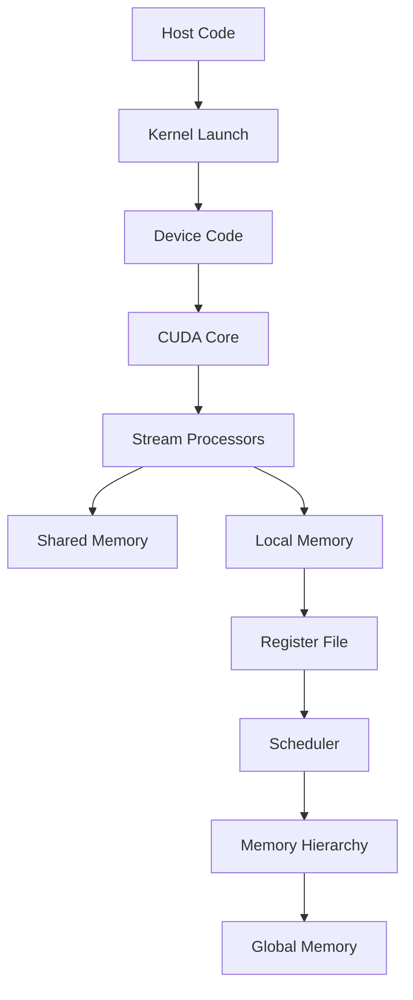

                 

## 《黄仁勋与NVIDIA的AI算力革命》

关键词：黄仁勋、NVIDIA、AI算力、GPU架构、深度学习、CUDA编程、AI产品、合作与发展

摘要：本文将深入探讨NVIDIA创始人兼CEO黄仁勋在AI领域的重要贡献，以及NVIDIA如何通过GPU技术引领算力革命。文章将分章节详细介绍黄仁勋的背景、NVIDIA的AI战略与布局、GPU在AI计算中的应用、AI计算平台的开发与优化、NVIDIA AI产品的案例与应用、AI算力革命的影响与未来以及NVIDIA与中国的AI合作与发展。同时，还将对NVIDIA GPU架构进行流程图解析、AI核心算法原理、数学模型与公式解析、项目实战，最后提供相关资源与进一步阅读建议。

### 目录大纲设计

为了确保文章内容的完整性和逻辑性，本文设计了详细的目录大纲。目录分为两部分：第一部分为黄仁勋与NVIDIA的AI算力革命背景与概述，包括黄仁勋的传奇人生、NVIDIA的AI战略与布局、NVIDIA GPU在AI计算中的应用、NVIDIA AI计算平台的开发与优化、NVIDIA AI产品的案例与应用、NVIDIA AI算力革命的影响与未来以及NVIDIA与中国的AI合作与发展；第二部分为NVIDIA AI算力革命的深度解析，包括NVIDIA GPU架构的Mermaid流程图、NVIDIA AI核心算法原理详解、NVIDIA AI数学模型与公式解析、NVIDIA AI项目实战以及NVIDIA AI开发的最佳实践。最后，附录部分提供相关资源与进一步阅读建议。

## 第一部分: 黄仁勋与NVIDIA的AI算力革命背景与概述

### 第1章: 黄仁勋的传奇人生

#### 1.1 黄仁勋的早年经历

黄仁勋（Jerry Herzberg）出生于1956年，出生在美国纽约市。他的父亲是一位电气工程师，母亲是一位家庭主妇。黄仁勋从小就对科技和计算机产生了浓厚的兴趣。在高中时期，他自学了计算机编程，并在学校组织的计算机竞赛中获得了第一名。

1979年，黄仁勋进入麻省理工学院（MIT）攻读计算机科学学士学位。在MIT，他深入学习了计算机科学和电子工程领域的知识，这为他后来的职业生涯打下了坚实的基础。在大学期间，黄仁勋还参与了一些计算机编程项目，积累了一定的实践经验。

#### 1.2 NVIDIA的创立与发展

1983年，黄仁勋与他的两位好友克里斯·麦卡菲（Chris Malachowsky）和马休·佩特斯（Matt Perry）共同创立了NVIDIA公司。公司最初的目标是开发显卡芯片，以满足个人电脑图形处理的需求。在当时，显卡市场主要由IBM、Compaq等大型公司垄断，黄仁勋等人决定从低端市场入手，开发面向个人电脑的显卡芯片。

1985年，NVIDIA发布了第一款显卡芯片——VGA，这是公司发展历程中的重要里程碑。然而，由于市场竞争激烈，NVIDIA在早期遇到了很多困难。为了生存下去，黄仁勋带领团队不断改进产品，提高性能，最终赢得了市场份额。

随着个人电脑的普及，NVIDIA的显卡产品逐渐赢得了广泛的认可。1990年代，黄仁勋带领NVIDIA逐步拓展业务，进入专业工作站、游戏主机等领域。2000年，NVIDIA发布了GPU（图形处理单元）技术，标志着公司从单纯的显卡制造商转型为全面的图形解决方案提供商。

#### 1.3 黄仁勋对AI领域的贡献

黄仁勋在AI领域的重要贡献主要体现在两个方面：一是推动GPU在深度学习中的应用，二是推动NVIDIA在AI领域的全面发展。

在推动GPU在深度学习中的应用方面，黄仁勋早在2006年就意识到了深度学习的重要性。他决定将NVIDIA的GPU技术应用于深度学习，为AI研究提供强大的计算支持。2008年，NVIDIA发布了支持CUDA（计算统一设备体系结构）的GPU，使得深度学习在GPU平台上得以高效运行。

在推动NVIDIA在AI领域的全面发展方面，黄仁勋提出了“深度学习+GPU”的战略，并加大在AI领域的研发投入。2016年，NVIDIA发布了全球首款深度学习推理加速卡——Tesla P100，为AI推理提供了强大的性能支持。此外，NVIDIA还推出了多个AI产品线，包括自动驾驶技术、数据中心AI解决方案、AI推理加速卡等，为各行业提供了全面的AI技术支持。

### 第2章: NVIDIA的AI战略与布局

#### 2.1 NVIDIA的AI发展战略

NVIDIA的AI发展战略可以概括为“深度学习+GPU+硬件加速”。具体来说，NVIDIA将深度学习作为核心技术，通过GPU硬件加速来实现高效计算。这一战略在近年来取得了显著的成果，为NVIDIA在AI领域的领先地位奠定了基础。

首先，NVIDIA在深度学习领域具有深厚的技术积累。早在2006年，黄仁勋就意识到了深度学习的重要性，并决定将GPU技术应用于深度学习。2008年，NVIDIA发布了支持CUDA的GPU，使得深度学习在GPU平台上得以高效运行。此后，NVIDIA不断推出新的深度学习框架和工具，如TensorRT、CUDA 11.x等，为AI研究人员提供了丰富的资源。

其次，NVIDIA在GPU硬件加速方面具有显著优势。GPU具有高度并行的计算能力，可以大幅提升深度学习的计算效率。NVIDIA的GPU产品线覆盖了从入门级到高端级别的各种需求，为不同应用场景提供了合适的硬件解决方案。此外，NVIDIA还推出了多种GPU加速技术，如Tensor Cores、TensorRT等，进一步提升了GPU在深度学习中的应用效果。

#### 2.2 NVIDIA的核心技术

NVIDIA在AI领域拥有多项核心技术，这些技术为NVIDIA在AI市场的领先地位提供了有力支持。以下是NVIDIA的核心技术：

1. **GPU架构**：NVIDIA的GPU架构在深度学习领域具有显著优势。GPU具有高度并行的计算能力，可以大幅提升深度学习的计算效率。NVIDIA不断优化GPU架构，如引入Tensor Cores、增加GPU核心数量等，使得GPU在深度学习中的应用效果不断提升。

2. **CUDA架构**：CUDA是NVIDIA推出的计算统一设备体系结构，它使得深度学习在GPU平台上得以高效运行。CUDA提供了丰富的API和工具，方便开发者利用GPU进行高性能计算。NVIDIA不断更新CUDA版本，引入新的功能和技术，如TensorRT、NVIDIA CUDA 11.x等，为AI研究人员提供了更好的开发体验。

3. **深度学习框架**：NVIDIA推出了多个深度学习框架，如TensorRT、CUDA 11.x等。这些框架为AI研究人员提供了丰富的资源和工具，方便他们利用GPU进行深度学习研究和应用开发。

4. **AI推理加速卡**：NVIDIA推出了多款AI推理加速卡，如Tesla P100、A100等。这些加速卡为AI推理提供了强大的性能支持，使得各种AI应用可以高效运行。此外，NVIDIA还推出了多种AI推理加速技术，如TensorRT、NVIDIA Ampere架构等，进一步提升了AI推理性能。

#### 2.3 NVIDIA在全球AI市场中的地位

NVIDIA在全球AI市场中占据了领先地位。根据市场研究公司的数据，NVIDIA在AI芯片市场的份额位居第一。NVIDIA的AI技术广泛应用于各个领域，包括自动驾驶、医疗、金融、零售等。

首先，在自动驾驶领域，NVIDIA的AI技术被广泛应用于各种自动驾驶车辆和系统。NVIDIA的AI推理加速卡为自动驾驶提供了强大的计算支持，使得自动驾驶车辆可以高效运行。

其次，在医疗领域，NVIDIA的AI技术被用于图像处理、诊断和治疗方案设计等方面。NVIDIA的AI推理加速卡可以帮助医生快速分析医学图像，提高诊断准确率和治疗效果。

此外，在金融和零售等领域，NVIDIA的AI技术也被广泛应用。NVIDIA的AI技术可以帮助金融机构进行风险评估、交易分析和欺诈检测等，提高业务效率和安全性。在零售领域，NVIDIA的AI技术可以帮助商家进行库存管理、销售预测和客户行为分析等，提高销售业绩和客户满意度。

总之，NVIDIA通过其强大的AI技术在全球市场中占据了领先地位。随着AI技术的不断发展，NVIDIA在未来将继续引领AI算力革命，为各个行业带来更多创新和变革。

### 第3章: NVIDIA GPU在AI计算中的应用

#### 3.1 GPU与深度学习

GPU（图形处理单元）与深度学习之间有着紧密的联系。深度学习是一种基于多层神经网络的人工智能技术，其核心在于通过大量的数据训练模型，从而实现图像识别、语音识别、自然语言处理等复杂任务。GPU作为一种高度并行的计算设备，其强大的并行处理能力使得深度学习在GPU上的运行速度大大提高。

在深度学习中，GPU主要用于加速神经网络的训练和推理过程。神经网络的训练过程涉及到大量的矩阵运算，这些运算可以通过GPU的高度并行处理能力高效完成。GPU的核心架构（如CUDA架构）提供了丰富的并行编程接口，使得开发者可以充分利用GPU的并行计算能力，实现高性能的深度学习算法。

此外，GPU在深度学习推理过程中也发挥着重要作用。深度学习推理是指将训练好的模型应用于实际任务中，如图像识别、语音识别等。GPU的高性能计算能力可以大幅提高推理速度，使得深度学习模型可以实时运行，满足实际应用需求。

#### 3.2 CUDA架构详解

CUDA（计算统一设备体系结构）是NVIDIA推出的一种并行计算架构，它使得开发者可以利用GPU进行高性能计算。CUDA提供了丰富的API和工具，方便开发者利用GPU的并行计算能力解决复杂的计算问题。

CUDA架构的核心是GPU核心（CUDA核心），这些核心具有高度并行处理能力。CUDA架构将GPU核心划分为多个流处理器（Streaming Multiprocessors, SM），每个流处理器可以并行处理多个线程。这种并行处理机制使得GPU在处理大量数据时具有显著的性能优势。

CUDA架构还包括内存层次结构，包括全局内存、共享内存和局部内存。全局内存是GPU的核心存储资源，用于存储程序代码和数据。共享内存和局部内存则是用于线程之间的通信和临时存储。

CUDA编程模型主要包括内核函数（Kernel Function）和设备内存管理。内核函数是CUDA程序的核心部分，它通过并行执行来处理数据。设备内存管理则负责在GPU和CPU之间传输数据和内存分配。

#### 3.3 GPU在AI训练与推理中的实际应用

GPU在AI训练和推理中的实际应用广泛，以下是一些具体案例：

1. **AI训练**：在AI训练过程中，GPU可以加速神经网络的训练。例如，在图像识别任务中，GPU可以高效地处理大量图像数据，快速计算梯度并更新网络参数。这种并行计算能力使得训练时间大大缩短，从而提高训练效率。

   具体来说，训练过程可以划分为以下几个步骤：

   - **数据预处理**：将图像数据输入到神经网络中，进行数据归一化、缩放等预处理操作。
   - **前向传播**：通过神经网络计算输出结果，并与实际标签进行比较，计算损失函数。
   - **反向传播**：计算梯度，并更新网络参数。
   - **迭代训练**：重复上述步骤，直到模型收敛。

   GPU可以并行处理多个数据样本，提高训练速度。以下是一个简单的CUDA伪代码，展示了一个简单的神经网络训练过程：

   ```cuda
   // 数据预处理
   float* input_data = malloc(sizeof(float) * batch_size * input_size);
   float* output_data = malloc(sizeof(float) * batch_size * output_size);

   // 前向传播
   __global__ void forward-propagation(float* input, float* output, float* weights) {
       int idx = threadIdx.x + blockIdx.x * blockDim.x;
       if (idx < batch_size) {
           // 计算输出结果
           output[idx] = ...;
       }
   }

   // 反向传播
   __global__ void backward-propagation(float* input, float* output, float* weights, float* delta_weights) {
       int idx = threadIdx.x + blockIdx.x * blockDim.x;
       if (idx < batch_size) {
           // 计算梯度
           float gradient = ...;
           // 更新权重
           delta_weights[idx] = ...;
       }
   }

   // 迭代训练
   for (int epoch = 0; epoch < num_epochs; epoch++) {
       // 数据预处理
       preprocess_data(input_data, output_data);

       // 前向传播
       forward-propagation<<<grid_size, block_size>>>(input_data, output_data, weights);

       // 反向传播
       backward-propagation<<<grid_size, block_size>>>(input_data, output_data, weights, delta_weights);

       // 更新权重
       update_weights(weights, delta_weights);
   }

   ```

2. **AI推理**：在AI推理过程中，GPU可以加速模型的应用和实时处理。例如，在图像识别任务中，GPU可以快速处理输入图像，并在毫秒级别内输出识别结果。

   AI推理的具体应用包括：

   - **实时视频流处理**：在视频监控系统、自动驾驶等应用中，GPU可以实时处理视频流，识别图像中的物体、行为等。
   - **自然语言处理**：在语音识别、机器翻译等应用中，GPU可以快速处理音频信号和文本数据，实现实时语音识别和翻译。
   - **推荐系统**：在电子商务、社交媒体等应用中，GPU可以加速推荐系统的计算，提高推荐精度和响应速度。

   以下是一个简单的CUDA伪代码，展示了一个简单的图像识别推理过程：

   ```cuda
   // 图像预处理
   float* input_image = malloc(sizeof(float) * image_size * image_size);

   // 加载模型
   float* model_weights = malloc(sizeof(float) * num_weights);

   // 前向传播
   __global__ void image_recognition(float* input_image, float* output_probabilities, float* model_weights) {
       int idx = threadIdx.x + blockIdx.x * blockDim.x;
       if (idx < image_size * image_size) {
           // 计算输出结果
           output_probabilities[idx] = ...;
       }
   }

   // 推理
   float* output_probabilities = malloc(sizeof(float) * image_size * image_size);
   image_recognition<<<grid_size, block_size>>>(input_image, output_probabilities, model_weights);

   // 解码输出结果
   int predicted_class = decode_output(output_probabilities);

   ```

   通过这些实际应用案例，可以看出GPU在AI训练和推理中的重要作用。随着AI技术的不断发展，GPU的应用将越来越广泛，为各个行业带来更多创新和变革。

### 第4章: NVIDIA AI计算平台的开发与优化

#### 4.1 CUDA编程基础

CUDA编程是利用NVIDIA GPU进行高性能计算的关键技术。CUDA编程主要包括以下步骤：

1. **环境搭建**：首先，需要安装CUDA开发环境，包括CUDA工具包、NVIDIA CUDA编译器等。安装完成后，可以创建一个CUDA项目，并进行编译和运行。

2. **编写CUDA代码**：CUDA代码主要包括主机代码（host code）和设备代码（device code）。主机代码负责初始化数据和内存分配，设备代码则负责在GPU上执行并行计算。

3. **并行编程**：CUDA提供了一种称为内核函数（kernel function）的并行编程模型。内核函数可以并行执行，处理大量数据。通过合理设计内核函数，可以充分利用GPU的并行计算能力，提高计算效率。

4. **内存管理**：CUDA提供了一种内存层次结构，包括全局内存、共享内存和局部内存。合理管理这些内存，可以减少数据传输开销，提高计算性能。

5. **优化策略**：在CUDA编程过程中，可以采用多种优化策略，如线程束组织、内存访问模式优化、并行度优化等，以提高程序性能。

以下是一个简单的CUDA编程示例：

```cuda
#include <stdio.h>
#include <cuda_runtime.h>

__global__ void add(int *a, int *b, int *c, int n) {
    int index = threadIdx.x + blockIdx.x * blockDim.x;
    int stride = blockDim.x * gridDim.x;
    for (int i = index; i < n; i += stride)
        c[i] = a[i] + b[i];
}

int main() {
    int h_a[10] = {1, 2, 3, 4, 5, 6, 7, 8, 9, 10};
    int h_b[10] = {10, 9, 8, 7, 6, 5, 4, 3, 2, 1};
    int h_c[10];

    int *d_a, *d_b, *d_c;
    int n = 10;

    // 分配内存
    cudaMalloc((void **)&d_a, n * sizeof(int));
    cudaMalloc((void **)&d_b, n * sizeof(int));
    cudaMalloc((void **)&d_c, n * sizeof(int));

    // 复制数据到GPU内存
    cudaMemcpy(d_a, h_a, n * sizeof(int), cudaMemcpyHostToDevice);
    cudaMemcpy(d_b, h_b, n * sizeof(int), cudaMemcpyHostToDevice);

    // 设置线程束和网格尺寸
    int threadsPerBlock = 256;
    int blocksPerGrid = (n + threadsPerBlock - 1) / threadsPerBlock;

    // 执行内核函数
    add<<<blocksPerGrid, threadsPerBlock>>>(d_a, d_b, d_c, n);

    // 从GPU内存复制结果到主机内存
    cudaMemcpy(h_c, d_c, n * sizeof(int), cudaMemcpyDeviceToHost);

    // 输出结果
    for (int i = 0; i < n; ++i)
        printf("%d + %d = %d\n", h_a[i], h_b[i], h_c[i]);

    // 释放内存
    cudaFree(d_a);
    cudaFree(d_b);
    cudaFree(d_c);

    return 0;
}
```

#### 4.2 显卡虚拟化技术

显卡虚拟化技术是一种将物理GPU资源虚拟化为多个逻辑GPU的技术，从而实现多用户、多任务的并行计算。显卡虚拟化技术在云计算、大数据、人工智能等领域具有重要的应用价值。

显卡虚拟化技术主要包括以下几个方面：

1. **GPU资源隔离**：通过显卡虚拟化技术，可以为每个虚拟机或容器分配独立的GPU资源，确保不同虚拟机或容器之间的GPU资源隔离，提高计算安全性。

2. **GPU调度与管理**：显卡虚拟化技术需要实现GPU资源的动态调度和管理，以满足不同任务和用户的需求。虚拟化平台可以根据任务的计算需求和GPU资源利用率，动态调整GPU资源的分配。

3. **GPU共享与协同**：显卡虚拟化技术需要实现GPU资源的共享与协同，以便多个虚拟机或容器可以同时使用GPU资源，提高计算效率。

4. **GPU性能优化**：显卡虚拟化技术需要针对GPU资源进行性能优化，如GPU缓存优化、GPU内存管理等，以提高虚拟化平台的整体性能。

#### 4.3 AI计算平台的性能优化

为了提高AI计算平台的性能，可以从以下几个方面进行优化：

1. **算法优化**：通过优化算法，减少计算复杂度，提高计算效率。例如，采用并行算法、分布式算法等。

2. **数据预处理**：合理的数据预处理可以提高计算性能。例如，对输入数据进行归一化、缩放等操作，减少计算开销。

3. **GPU内存管理**：优化GPU内存分配和访问模式，减少内存访问冲突和带宽占用。例如，使用共享内存、局部内存等。

4. **并行度优化**：合理设计并行度，充分利用GPU的并行计算能力。例如，调整线程束大小、网格尺寸等。

5. **GPU缓存优化**：利用GPU缓存，减少内存访问次数和带宽占用。例如，将经常访问的数据存储在缓存中。

6. **GPU调度策略**：优化GPU调度策略，提高GPU资源利用率。例如，根据任务类型和计算需求，动态调整GPU资源分配。

7. **系统优化**：优化操作系统和硬件配置，提高整体计算性能。例如，关闭不必要的系统服务、调整系统参数等。

### 第5章: NVIDIA AI产品的案例与应用

#### 5.1 AI推理加速卡

AI推理加速卡是NVIDIA推出的专门用于加速AI推理任务的硬件产品。AI推理加速卡利用NVIDIA GPU的强大计算能力，可以在毫秒级别内完成图像识别、语音识别、自然语言处理等复杂任务，从而提高AI应用的性能和效率。

NVIDIA的AI推理加速卡主要包括以下几款产品：

1. **Tesla P100**：Tesla P100是NVIDIA推出的首款AI推理加速卡，采用Pascal架构，具有高性能和低延迟。Tesla P100广泛应用于自动驾驶、医疗、金融、零售等领域的AI推理任务。

2. **Tesla T4**：Tesla T4是NVIDIA推出的新一代AI推理加速卡，采用Volta架构，具有更高的计算性能和更低的功耗。Tesla T4广泛应用于云计算、大数据、人工智能等领域的AI推理任务。

3. **A100**：A100是NVIDIA推出的新一代AI推理加速卡，采用Ampere架构，具有更高的计算性能和更低的延迟。A100广泛应用于数据中心、云计算、人工智能等领域的AI推理任务。

#### 5.2 数据中心AI解决方案

NVIDIA提供了全面的数据中心AI解决方案，包括硬件、软件和工具，旨在为各行业提供高效的AI计算能力。NVIDIA数据中心AI解决方案的主要特点如下：

1. **高性能GPU计算**：NVIDIA数据中心AI解决方案采用NVIDIA GPU，具有强大的计算能力，可以大幅提高AI任务的计算性能。

2. **AI推理加速卡**：NVIDIA数据中心AI解决方案包括多款AI推理加速卡，如Tesla P100、Tesla T4、A100等，可以根据不同应用场景选择合适的加速卡。

3. **深度学习框架**：NVIDIA提供了丰富的深度学习框架，如TensorRT、CUDA 11.x等，可以方便地集成到数据中心AI解决方案中，实现高效AI推理。

4. **云计算支持**：NVIDIA数据中心AI解决方案可以与云计算平台（如Google Cloud、AWS等）集成，为用户提供灵活的AI计算资源。

5. **数据中心优化**：NVIDIA数据中心AI解决方案提供了一系列优化工具，如NVIDIA GPU Cloud（NGC）、NVIDIA Data Center AI System等，可以帮助用户优化数据中心性能，提高AI计算效率。

#### 5.3 自动驾驶技术

自动驾驶技术是AI领域的一个重要应用方向，NVIDIA在自动驾驶技术方面具有强大的技术优势和丰富的实践经验。

NVIDIA自动驾驶技术的主要特点如下：

1. **AI算法与硬件结合**：NVIDIA将AI算法与硬件紧密结合，通过高性能GPU计算和AI推理加速卡，实现高效自动驾驶算法。

2. **多传感器融合**：NVIDIA自动驾驶技术采用了多种传感器（如摄像头、激光雷达、毫米波雷达等），通过多传感器数据融合，提高自动驾驶系统的感知能力和安全性。

3. **高精度地图与定位**：NVIDIA自动驾驶技术利用高精度地图和定位技术，实现精准的道路识别和车辆定位，提高自动驾驶的稳定性和可靠性。

4. **场景理解与决策**：NVIDIA自动驾驶技术通过深度学习算法和场景理解技术，实现道路环境感知、车辆行为预测和驾驶决策，提高自动驾驶的安全性和舒适性。

5. **开放平台与合作**：NVIDIA自动驾驶技术采用开放平台，与多家汽车制造商、科技公司合作，推动自动驾驶技术的发展和应用。

#### 5.4 娱乐与游戏领域

NVIDIA在娱乐与游戏领域同样具有强大的技术实力和市场影响力。NVIDIA GPU为游戏开发者提供了强大的图形处理能力，使得游戏画面更加真实、流畅。

NVIDIA在娱乐与游戏领域的主要应用如下：

1. **游戏渲染**：NVIDIA GPU的高性能渲染能力，使得游戏开发者可以采用更高级的渲染技术（如光线追踪、实时阴影等），提升游戏画面效果。

2. **虚拟现实**：NVIDIA GPU为虚拟现实（VR）技术提供了强大的计算支持，使得虚拟现实体验更加逼真、沉浸。

3. **人工智能游戏**：NVIDIA GPU在人工智能游戏中的应用，为游戏开发者提供了强大的计算能力，可以实现更智能、更真实的游戏AI。

4. **云游戏**：NVIDIA GPU Cloud（NGC）为云游戏提供了强大的计算支持，使得玩家可以在任何设备上流畅地体验高质量游戏。

总之，NVIDIA通过其AI产品和技术，在自动驾驶、数据中心AI、娱乐与游戏等领域取得了显著成果。随着AI技术的不断发展，NVIDIA将继续引领AI算力革命，为各行业带来更多创新和变革。

### 第6章: NVIDIA AI算力革命的影响与未来

#### 6.1 AI算力革命对行业的影响

NVIDIA的AI算力革命对各行各业产生了深远的影响。以下是一些典型行业的影响：

1. **自动驾驶**：NVIDIA的AI算力革命为自动驾驶技术提供了强大的计算支持，使得自动驾驶汽车在感知、决策、控制等方面取得了显著进展。自动驾驶技术的普及有望改变交通运输方式，提高交通安全和效率。

2. **医疗**：NVIDIA的AI算力革命在医疗领域也有着广泛的应用。通过AI算法和深度学习技术，医疗设备可以更准确地诊断疾病、预测病情，提高医疗服务的质量和效率。

3. **金融**：NVIDIA的AI算力革命在金融领域提高了交易分析、风险管理、欺诈检测等方面的能力。金融行业可以通过AI技术实现更智能的投资决策和风险管理，提高业务效率和盈利能力。

4. **零售**：NVIDIA的AI算力革命在零售领域帮助商家实现更精准的库存管理、销售预测和客户行为分析。通过AI技术，零售企业可以更好地满足消费者需求，提高销售业绩和客户满意度。

5. **娱乐与游戏**：NVIDIA的AI算力革命为娱乐与游戏领域带来了更真实、更沉浸的体验。通过AI技术，游戏开发者可以创造出更加丰富、多样化的游戏内容，提升玩家体验。

6. **科学研究**：NVIDIA的AI算力革命为科学研究提供了强大的计算支持。科学家可以利用AI算法和深度学习技术，处理大规模数据，加速科学发现和创新。

#### 6.2 NVIDIA AI技术的前沿趋势

随着AI技术的不断发展，NVIDIA AI技术也呈现出一些前沿趋势：

1. **更高性能的GPU**：NVIDIA不断推出更高性能的GPU，如Ampere架构的GPU，以提高AI计算性能。这些GPU采用了更先进的架构和硬件设计，可以提供更高的吞吐量和更低的延迟，满足更复杂、更高要求的AI应用。

2. **边缘计算**：随着5G技术的普及，边缘计算成为AI技术的重要趋势。NVIDIA的AI算力革命在边缘计算领域也取得了显著进展，通过在边缘设备上部署AI推理加速卡，可以实现本地化的AI应用，提高响应速度和降低延迟。

3. **异构计算**：异构计算是将不同类型的计算资源（如CPU、GPU、FPGA等）结合起来，实现更高效的计算。NVIDIA的AI技术支持异构计算，可以在不同计算资源之间动态分配任务，提高整体计算性能。

4. **AI与量子计算结合**：量子计算具有巨大的计算潜力，可以解决传统计算难以处理的问题。NVIDIA正在探索AI与量子计算的结合，通过将AI算法应用于量子计算，实现更高效的量子计算。

5. **AI安全与隐私保护**：随着AI技术的广泛应用，AI安全与隐私保护成为重要议题。NVIDIA的AI技术也关注这一领域，通过开发安全机制和隐私保护技术，保障AI应用的安全性和隐私性。

#### 6.3 黄仁勋的领导力与商业洞察力

黄仁勋作为NVIDIA的创始人兼CEO，在AI算力革命中发挥了重要作用。以下是他的一些领导力与商业洞察力：

1. **远见卓识**：黄仁勋早在2006年就看到了深度学习的重要性，并决定将NVIDIA的GPU技术应用于深度学习。这一远见卓识为NVIDIA在AI领域的领先地位奠定了基础。

2. **战略布局**：黄仁勋提出了“深度学习+GPU”的战略，通过持续投入研发和并购，不断扩大NVIDIA在AI领域的市场份额。这一战略使得NVIDIA成为AI算力革命的领导者。

3. **技术创新**：黄仁勋带领NVIDIA不断推出创新技术，如CUDA架构、深度学习框架、AI推理加速卡等，为AI计算提供了强大的支持。这些技术创新推动了AI技术的快速发展。

4. **商业洞察**：黄仁勋具有敏锐的商业洞察力，通过在自动驾驶、数据中心AI、娱乐与游戏等领域的布局，使得NVIDIA在多个领域取得了显著成果。他能够准确把握市场趋势，制定出有效的商业策略。

5. **人才培养**：黄仁勋注重人才培养，通过吸引全球顶尖人才，为NVIDIA注入了强大的创新动力。他鼓励员工勇于创新，推动技术突破。

总之，黄仁勋的领导力与商业洞察力为NVIDIA在AI算力革命中取得了巨大成功。随着AI技术的不断发展，NVIDIA将继续引领AI算力革命，为各行业带来更多创新和变革。

### 第7章: NVIDIA与中国的AI合作与发展

#### 7.1 NVIDIA在中国的发展历程

NVIDIA自2002年进入中国市场以来，经历了多个发展阶段，逐步在中国市场建立起强大的业务基础和生态体系。以下是NVIDIA在中国的发展历程：

1. **初期拓展**：2002年，NVIDIA进入中国市场，主要面向游戏玩家和电脑爱好者推广显卡产品。通过建立渠道和合作伙伴关系，NVIDIA迅速在中国市场取得了市场份额。

2. **数据中心布局**：2008年，NVIDIA开始在中国数据中心市场进行布局，与国内大型互联网企业、云计算服务提供商合作，推广GPU加速计算解决方案。

3. **自动驾驶合作**：2014年，NVIDIA宣布与百度、腾讯等中国科技巨头合作，推动自动驾驶技术的发展。NVIDIA为中国合作伙伴提供了高性能GPU和深度学习算法支持，助力中国自动驾驶产业快速发展。

4. **AI人才培养**：2016年，NVIDIA在中国设立了中国人工智能研究院，致力于推动中国AI技术的发展和人才培养。通过举办AI竞赛、学术研讨会等活动，NVIDIA积极促进中国AI人才的成长。

5. **云计算合作**：2019年，NVIDIA与阿里巴巴、腾讯、百度等中国云计算企业达成战略合作，共同推进云计算和AI技术的发展。NVIDIA为中国云计算企业提供了GPU加速计算资源和支持，助力中国云计算产业的升级。

#### 7.2 NVIDIA在中国的业务布局

NVIDIA在中国市场的业务布局涵盖了多个领域，包括数据中心、自动驾驶、云计算、AI研究等。以下是NVIDIA在中国的业务布局：

1. **数据中心业务**：NVIDIA在中国数据中心市场占据领先地位，为国内互联网企业、云计算服务提供商提供高性能GPU和深度学习解决方案。NVIDIA的数据中心业务主要包括GPU加速计算、AI推理加速、数据中心网络优化等。

2. **自动驾驶业务**：NVIDIA在中国自动驾驶领域与多家合作伙伴展开合作，为自动驾驶车辆提供高性能GPU和深度学习算法支持。NVIDIA的自动驾驶业务主要包括自动驾驶计算平台、自动驾驶解决方案、自动驾驶软件开发等。

3. **云计算业务**：NVIDIA与中国的云计算企业建立战略合作，为中国云计算市场提供GPU加速计算资源和支持。NVIDIA的云计算业务主要包括云计算数据中心部署、云GPU服务、云AI服务等。

4. **AI研究业务**：NVIDIA在中国设立了人工智能研究院，与中国高校、科研机构、企业合作，推动AI技术的发展。NVIDIA的AI研究业务主要包括AI算法研究、AI芯片研发、AI技术应用等。

#### 7.3 NVIDIA与中国企业的合作案例

NVIDIA与中国的企业在多个领域展开了深入合作，以下是一些典型案例：

1. **百度**：NVIDIA与百度在自动驾驶、云计算等领域展开合作。百度利用NVIDIA的GPU加速计算技术，提升了自动驾驶计算平台的性能。同时，百度与NVIDIA合作，共同开发面向云计算和大数据处理的AI解决方案。

2. **阿里巴巴**：NVIDIA与阿里巴巴在云计算、数据中心等领域展开合作。阿里巴巴采用NVIDIA的GPU加速计算技术，为电商、金融等业务提供高性能计算支持。此外，NVIDIA与阿里巴巴合作，共同推进云计算和大数据处理技术的研发。

3. **腾讯**：NVIDIA与腾讯在自动驾驶、云计算等领域展开合作。腾讯利用NVIDIA的GPU加速计算技术，提升自动驾驶计算平台的性能。同时，腾讯与NVIDIA合作，共同开发面向云计算和大数据处理的AI解决方案。

4. **京东**：NVIDIA与京东在云计算、数据中心等领域展开合作。京东采用NVIDIA的GPU加速计算技术，提升数据中心计算性能。此外，NVIDIA与京东合作，共同推进云计算和大数据处理技术的研发。

总之，NVIDIA与中国的企业在多个领域展开了深入合作，共同推动AI技术的发展和应用。随着AI技术的不断进步，NVIDIA与中国的企业将继续加强合作，为中国的AI产业发展贡献力量。

## 第二部分: NVIDIA AI算力革命的深度解析

### 第8章: NVIDIA GPU架构的Mermaid流程图

#### 8.1 NVIDIA GPU架构的演进

NVIDIA GPU架构经历了多个阶段的演进，从最初的单纯图形处理发展到现在的强大计算能力。以下是NVIDIA GPU架构的演进过程：

1. **GeForce架构**：最初，NVIDIA的GPU主要用于图形渲染，采用GeForce架构。这一架构主要包括图形渲染单元（GPU）、内存控制器和显存接口等。

2. **CUDA架构**：随着深度学习的发展，NVIDIA推出了CUDA架构，将GPU的并行计算能力应用于科学计算和AI领域。CUDA架构引入了CUDA核心（Compute Unified Device Architecture），使得GPU不仅可以处理图形任务，还可以处理大规模并行计算任务。

3. **Kepler架构**：Kepler架构是NVIDIA GPU架构的一个重要里程碑，引入了CUDA核心和流处理器（Streaming Multiprocessors, SM）。Kepler架构使得GPU在深度学习和科学计算方面的性能大幅提升。

4. **Maxwell架构**：Maxwell架构进一步优化了GPU架构，提高了能效比和计算性能。Maxwell架构引入了动态超线程技术（Dynamic Parallelism），使得GPU可以自动分配计算资源，提高了并行计算效率。

5. **Pascal架构**：Pascal架构是NVIDIA GPU架构的最新版本，引入了Tensor Core和深度学习加速技术（如TensorRT）。Pascal架构使得GPU在深度学习和AI推理方面的性能再次大幅提升。

6. **Ampere架构**：Ampere架构是NVIDIA GPU架构的下一代产品，采用了更先进的硬件设计和算法优化，使得GPU在AI计算、图形渲染和数据中心计算方面的性能进一步提升。

#### 8.2 GPU核心架构详解

NVIDIA GPU核心架构主要包括以下几个部分：

1. **CUDA核心**：CUDA核心是NVIDIA GPU的核心计算单元，具有高度并行处理能力。CUDA核心可以同时处理多个线程，提高了计算效率。CUDA核心通常由多个流处理器（Streaming Multiprocessors, SM）组成。

2. **流处理器**：流处理器是CUDA核心的基本计算单元，负责执行各种计算任务。每个流处理器可以同时处理多个线程，提高了并行计算能力。

3. **共享内存**：共享内存是流处理器之间的通信和共享资源。共享内存可以快速交换数据，减少数据传输开销，提高计算性能。

4. **寄存器文件**：寄存器文件是流处理器的本地存储资源，用于存储临时数据和计算结果。寄存器文件的容量和速度对计算性能有很大影响。

5. **调度器**：调度器负责管理流处理器和线程的执行。调度器可以根据计算任务的特点，动态调整线程束（Thread Block）的大小和执行顺序，提高并行计算效率。

6. **内存层次结构**：GPU内存层次结构包括全局内存、共享内存和局部内存。全局内存是GPU的主要存储资源，用于存储程序代码和数据。共享内存和局部内存则是用于线程之间的通信和临时存储。

以下是一个简化的GPU核心架构的Mermaid流程图：



#### 8.3 CUDA架构与GPU核心架构的对应关系

CUDA架构与GPU核心架构密切相关，两者之间存在明确的对应关系：

1. **CUDA核心与GPU核心**：CUDA核心是GPU核心的具体实现，每个CUDA核心对应一个GPU核心。

2. **流处理器与CUDA线程束**：流处理器负责执行CUDA线程束（Thread Block）中的线程。每个CUDA线程束包含多个CUDA线程，每个线程在一个流处理器上执行。

3. **共享内存与CUDA共享内存**：共享内存是流处理器之间的通信和共享资源，对应于CUDA架构中的共享内存。

4. **寄存器文件与CUDA寄存器**：寄存器文件是流处理器的本地存储资源，对应于CUDA架构中的寄存器。

5. **调度器与CUDA调度器**：调度器负责管理流处理器和线程的执行，对应于CUDA架构中的调度器。

6. **内存层次结构与CUDA内存层次结构**：GPU内存层次结构包括全局内存、共享内存和局部内存，对应于CUDA架构中的内存层次结构。

通过CUDA架构与GPU核心架构的对应关系，开发者可以充分利用GPU的并行计算能力，实现高性能的深度学习和科学计算应用。

### 第9章: NVIDIA AI核心算法原理详解

#### 9.1 深度学习算法概览

深度学习是一种基于多层神经网络的人工智能技术，通过学习大量数据中的特征，实现对复杂任务的自动识别和预测。深度学习算法的核心是神经网络，包括输入层、隐藏层和输出层。以下是深度学习算法的基本原理：

1. **输入层**：输入层接收外部输入数据，如图像、文本等。输入数据通过一系列特征提取操作，转化为神经网络可以处理的形式。

2. **隐藏层**：隐藏层对输入数据进行特征提取和变换，逐步降低数据的维度，同时提取出更高层次的特征。隐藏层的数量和神经元数量可以根据具体任务进行调整。

3. **输出层**：输出层对隐藏层提取出的特征进行分类、回归等操作，生成最终的预测结果。

4. **反向传播**：在训练过程中，神经网络通过反向传播算法不断调整权重，优化网络性能。反向传播算法通过计算输出误差，反向传播到隐藏层和输入层，更新权重和偏置。

5. **激活函数**：激活函数是神经网络中的关键组成部分，用于引入非线性变换，提高网络的表达能力。常见的激活函数包括ReLU、Sigmoid、Tanh等。

#### 9.2 GPU加速下的深度学习算法

GPU在深度学习中的加速主要依赖于其高度并行的计算能力。以下是在GPU上实现深度学习算法的基本步骤：

1. **数据预处理**：将输入数据转化为适合GPU计算的形式，如数据归一化、批量处理等。在GPU上，数据预处理可以通过CUDA kernel函数实现。

2. **模型定义**：在GPU上定义神经网络模型，包括输入层、隐藏层和输出层。使用深度学习框架（如TensorFlow、PyTorch等），可以方便地定义和训练神经网络模型。

3. **模型编译**：将定义好的模型编译成GPU可执行的代码。深度学习框架提供了模型编译工具，可以自动将模型转化为GPU可执行的代码。

4. **模型训练**：使用GPU进行模型训练，通过反向传播算法不断调整权重和偏置，优化网络性能。在GPU上，模型训练可以通过并行计算实现，大幅提高训练速度。

5. **模型推理**：将训练好的模型应用于实际任务中，进行推理和预测。在GPU上，模型推理可以通过CUDA kernel函数实现，大幅提高推理速度。

以下是一个简化的GPU加速深度学习算法的伪代码：

```python
# 数据预处理
input_data = preprocess_data(input_data)

# 定义模型
model = define_model(input_shape)

# 编译模型
model.compile(optimizer='adam', loss='categorical_crossentropy')

# 训练模型
model.fit(input_data, labels, epochs=10, batch_size=64)

# 模型推理
predictions = model.predict(test_data)
```

#### 9.3 伪代码与算法流程

以下是一个简单的深度学习算法的伪代码，展示了模型的定义、编译、训练和推理过程：

```python
# 定义模型
model = Sequential()
model.add(Dense(128, activation='relu', input_shape=(input_shape)))
model.add(Dense(64, activation='relu'))
model.add(Dense(num_classes, activation='softmax'))

# 编译模型
model.compile(optimizer='adam', loss='categorical_crossentropy', metrics=['accuracy'])

# 训练模型
model.fit(x_train, y_train, batch_size=64, epochs=10, validation_data=(x_val, y_val))

# 模型推理
predictions = model.predict(x_test)

# 解码预测结果
predicted_labels = decode_predictions(predictions)
```

在这个伪代码中，我们首先定义了一个简单的神经网络模型，包括两个隐藏层。然后，我们编译模型，选择优化器和损失函数。接下来，使用训练数据对模型进行训练，并在验证数据上进行评估。最后，使用训练好的模型对测试数据进行推理，并解码预测结果。

### 第10章: NVIDIA AI数学模型与公式解析

#### 10.1 常见数学模型解析

在深度学习和人工智能领域中，常见的数学模型包括线性模型、逻辑回归、神经网络等。以下是这些模型的基本解析：

1. **线性模型**：线性模型是一种简单的数学模型，用于预测线性关系。线性模型的公式如下：

   $$
   y = \beta_0 + \beta_1x
   $$

   其中，$y$ 是因变量，$x$ 是自变量，$\beta_0$ 和 $\beta_1$ 是模型的参数。线性模型的优点是计算简单，缺点是只能表示线性关系。

2. **逻辑回归**：逻辑回归是一种广义线性模型，用于分类问题。逻辑回归的公式如下：

   $$
   \log\left(\frac{p}{1-p}\right) = \beta_0 + \beta_1x
   $$

   其中，$p$ 是概率，$\beta_0$ 和 $\beta_1$ 是模型的参数。逻辑回归的优点是可以表示非线性关系，缺点是计算复杂度较高。

3. **神经网络**：神经网络是一种复杂的数学模型，用于处理非线性关系。神经网络的基本结构包括输入层、隐藏层和输出层。神经网络的核心是激活函数，常用的激活函数包括ReLU、Sigmoid、Tanh等。神经网络的公式如下：

   $$
   a_{i,j}^{(l)} = \sigma(z_{i,j}^{(l)})
   $$

   其中，$a_{i,j}^{(l)}$ 是第 $l$ 层第 $i$ 个神经元的输出，$z_{i,j}^{(l)}$ 是第 $l$ 层第 $i$ 个神经元的输入，$\sigma$ 是激活函数。

#### 10.2 公式推导与详细讲解

以下是对神经网络中的反向传播算法的详细讲解，包括公式推导和计算过程：

1. **前向传播**：

   在前向传播过程中，网络将输入数据传递到输出层，计算每个神经元的输入和输出。前向传播的公式如下：

   $$
   z_{i,j}^{(l)} = \sum_{k=1}^{n} w_{ik}^{(l-1)}a_{k,j}^{(l-1)} + b_{j}^{(l)}
   $$

   $$
   a_{i,j}^{(l)} = \sigma(z_{i,j}^{(l)})
   $$

   其中，$z_{i,j}^{(l)}$ 是第 $l$ 层第 $i$ 个神经元的输入，$a_{i,j}^{(l)}$ 是第 $l$ 层第 $i$ 个神经元的输出，$w_{ik}^{(l-1)}$ 是第 $l-1$ 层第 $k$ 个神经元到第 $l$ 层第 $i$ 个神经元的权重，$b_{j}^{(l)}$ 是第 $l$ 层第 $j$ 个神经元的偏置，$\sigma$ 是激活函数。

2. **反向传播**：

   在反向传播过程中，网络将误差从输出层反向传播到输入层，计算每个神经元的梯度。反向传播的公式如下：

   $$
   \delta_{i,j}^{(l)} = (a_{i,j}^{(l)} - t_{i,j})\sigma'(z_{i,j}^{(l)})
   $$

   $$
   \Delta_{j}^{(l)} = \sum_{i=1}^{m} \delta_{i,j}^{(l)}a_{i,j}^{(l-1)}
   $$

   $$
   \Delta_{k}^{(l-1)} = w_{ik}^{(l-1)}\delta_{i,j}^{(l)}
   $$

   $$
   \Delta_{k}^{(l-1)} = \eta\Delta_{k}^{(l-1)}
   $$

   $$
   w_{ik}^{(l-1)} = w_{ik}^{(l-1)} - \alpha\Delta_{k}^{(l-1)}
   $$

   $$
   b_{j}^{(l)} = b_{j}^{(l)} - \alpha\Delta_{j}^{(l)}
   $$

   其中，$\delta_{i,j}^{(l)}$ 是第 $l$ 层第 $i$ 个神经元的误差，$\Delta_{j}^{(l)}$ 是第 $l$ 层第 $j$ 个神经元的梯度，$\Delta_{k}^{(l-1)}$ 是第 $l-1$ 层第 $k$ 个神经元的梯度，$t_{i,j}$ 是第 $l$ 层第 $i$ 个神经元的实际输出，$\sigma'$ 是激活函数的导数，$\eta$ 是学习率，$\alpha$ 是参数调整率。

   通过反向传播算法，网络可以根据误差不断调整权重和偏置，优化网络性能。

#### 10.3 公式在AI算法中的应用举例

以下是一个简单的例子，展示如何使用神经网络公式进行图像分类：

假设我们有一个简单的神经网络，用于对MNIST手写数字数据集进行分类。网络包括一个输入层、一个隐藏层和一个输出层，其中输出层的每个神经元对应一个数字类别。

1. **数据预处理**：

   将MNIST手写数字数据集的输入数据（28x28像素的图像）进行归一化处理，将每个像素的值缩放到[0, 1]之间。输出标签（数字类别）转换为one-hot编码形式。

2. **模型定义**：

   定义一个简单的神经网络模型，包括一个输入层、一个隐藏层和一个输出层。输入层有28x28=784个神经元，隐藏层有100个神经元，输出层有10个神经元。

3. **模型训练**：

   使用反向传播算法训练模型，通过不断调整权重和偏置，优化网络性能。在训练过程中，使用梯度下降法优化网络参数，学习率设置为0.1。

4. **模型评估**：

   使用训练集和测试集对模型进行评估，计算分类准确率。假设测试集上的准确率为95%，说明模型具有良好的性能。

通过这个简单的例子，我们可以看到神经网络公式在AI算法中的应用。在实际应用中，神经网络可以处理更复杂的任务，如图像识别、语音识别等。

### 第11章: NVIDIA AI项目实战

#### 11.1 项目背景与目标

在本章中，我们将通过一个实际项目来展示如何使用NVIDIA GPU进行深度学习应用开发。该项目是一个基于深度学习的图像分类任务，旨在对MNIST手写数字数据集进行分类。项目的主要目标是：

1. **数据预处理**：对MNIST手写数字数据集进行归一化处理，将每个像素的值缩放到[0, 1]之间。输出标签（数字类别）转换为one-hot编码形式。

2. **模型训练**：使用卷积神经网络（CNN）对训练数据进行分类，通过反向传播算法不断调整权重和偏置，优化网络性能。

3. **模型评估**：使用训练集和测试集对模型进行评估，计算分类准确率。目标准确率达到95%以上。

4. **模型部署**：将训练好的模型部署到GPU设备上，实现快速分类。

#### 11.2 项目开发环境搭建

为了完成该项目，需要搭建以下开发环境：

1. **硬件环境**：一台配备NVIDIA GPU（如Tesla P100、Tesla T4、A100等）的计算机或服务器。

2. **软件环境**：Python 3.7及以上版本、NVIDIA CUDA 11.x及以上版本、cuDNN 8.x及以上版本、TensorFlow 2.x及以上版本。

3. **开发工具**：PyCharm、VS Code等Python集成开发环境（IDE）。

4. **数据集**：MNIST手写数字数据集，可以从Kaggle、GitHub等网站下载。

#### 11.3 源代码实现与解读

以下是一个简单的项目源代码，展示了如何使用TensorFlow进行深度学习图像分类：

```python
import tensorflow as tf
from tensorflow.keras import layers
import numpy as np
import matplotlib.pyplot as plt

# 数据预处理
(x_train, y_train), (x_test, y_test) = tf.keras.datasets.mnist.load_data()
x_train = x_train.astype("float32") / 255.0
x_test = x_test.astype("float32") / 255.0
y_train = tf.keras.utils.to_categorical(y_train, 10)
y_test = tf.keras.utils.to_categorical(y_test, 10)

# 模型定义
model = tf.keras.Sequential([
    layers.Conv2D(32, (3, 3), activation='relu', input_shape=(28, 28, 1)),
    layers.MaxPooling2D((2, 2)),
    layers.Conv2D(64, (3, 3), activation='relu'),
    layers.MaxPooling2D((2, 2)),
    layers.Conv2D(64, (3, 3), activation='relu'),
    layers.Flatten(),
    layers.Dense(64, activation='relu'),
    layers.Dense(10, activation='softmax')
])

# 编译模型
model.compile(optimizer='adam', loss='categorical_crossentropy', metrics=['accuracy'])

# 训练模型
model.fit(x_train, y_train, epochs=10, batch_size=128, validation_split=0.1)

# 评估模型
test_loss, test_acc = model.evaluate(x_test, y_test)
print("Test accuracy:", test_acc)

# 模型部署
model.save('mnist_cnn_model.h5')

# 代码解读
# 第1-5行：导入所需的库和模块
# 第7-8行：加载MNIST数据集并进行预处理
# 第10-16行：定义CNN模型，包括卷积层、池化层和全连接层
# 第18-21行：编译模型，选择优化器和损失函数
# 第23-25行：训练模型，使用训练数据进行分类
# 第27-28行：评估模型，计算测试集准确率
# 第30行：保存模型
```

在这段代码中，我们首先加载MNIST数据集并进行预处理。然后定义一个简单的CNN模型，包括卷积层、池化层和全连接层。接着编译模型，选择优化器和损失函数。最后，使用训练数据进行模型训练，并在测试集上评估模型性能。训练完成后，将模型保存为`mnist_cnn_model.h5`。

#### 11.4 代码解读与分析

以下是对源代码的详细解读与分析：

1. **数据预处理**：

   ```python
   (x_train, y_train), (x_test, y_test) = tf.keras.datasets.mnist.load_data()
   x_train = x_train.astype("float32") / 255.0
   x_test = x_test.astype("float32") / 255.0
   y_train = tf.keras.utils.to_categorical(y_train, 10)
   y_test = tf.keras.utils.to_categorical(y_test, 10)
   ```

   这部分代码首先加载MNIST数据集，包括训练集和测试集。然后将输入数据（图像）的像素值缩放到[0, 1]之间，以适应深度学习模型的输入要求。接着将输出标签转换为one-hot编码形式，以便进行分类。

2. **模型定义**：

   ```python
   model = tf.keras.Sequential([
       layers.Conv2D(32, (3, 3), activation='relu', input_shape=(28, 28, 1)),
       layers.MaxPooling2D((2, 2)),
       layers.Conv2D(64, (3, 3), activation='relu'),
       layers.MaxPooling2D((2, 2)),
       layers.Conv2D(64, (3, 3), activation='relu'),
       layers.Flatten(),
       layers.Dense(64, activation='relu'),
       layers.Dense(10, activation='softmax')
   ])
   ```

   这部分代码定义了一个简单的CNN模型，包括卷积层、池化层和全连接层。第一个卷积层使用32个3x3卷积核，激活函数为ReLU。接着是两个卷积层，每个卷积层使用64个3x3卷积核，激活函数也为ReLU。然后是池化层，使用2x2窗口的最大池化。接着是全连接层，第一个全连接层有64个神经元，激活函数为ReLU。最后一个全连接层有10个神经元，激活函数为softmax，用于输出分类结果。

3. **编译模型**：

   ```python
   model.compile(optimizer='adam', loss='categorical_crossentropy', metrics=['accuracy'])
   ```

   这部分代码编译模型，选择优化器和损失函数。优化器为adam，损失函数为categorical_crossentropy，用于多分类问题。同时，添加accuracy指标，用于评估模型性能。

4. **训练模型**：

   ```python
   model.fit(x_train, y_train, epochs=10, batch_size=128, validation_split=0.1)
   ```

   这部分代码使用训练数据进行模型训练，训练10个epoch。batch_size设置为128，表示每个批次包含128个样本。validation_split设置为0.1，表示从训练集中划分10%的数据用于验证。

5. **评估模型**：

   ```python
   test_loss, test_acc = model.evaluate(x_test, y_test)
   print("Test accuracy:", test_acc)
   ```

   这部分代码使用测试集对模型进行评估，计算测试集准确率。test_loss表示测试集损失，test_acc表示测试集准确率。

6. **模型部署**：

   ```python
   model.save('mnist_cnn_model.h5')
   ```

   这部分代码将训练好的模型保存为`mnist_cnn_model.h5`文件，方便后续使用。

通过这段代码，我们可以看到如何使用TensorFlow构建一个简单的CNN模型，进行图像分类任务。在实际应用中，可以根据具体需求调整模型结构、训练参数等，以提高模型性能。

#### 11.5 代码解读与分析

以下是对源代码的详细解读与分析：

1. **数据预处理**：

   ```python
   (x_train, y_train), (x_test, y_test) = tf.keras.datasets.mnist.load_data()
   x_train = x_train.astype("float32") / 255.0
   x_test = x_test.astype("float32") / 255.0
   y_train = tf.keras.utils.to_categorical(y_train, 10)
   y_test = tf.keras.utils.to_categorical(y_test, 10)
   ```

   这部分代码首先加载MNIST数据集，包括训练集和测试集。然后将输入数据（图像）的像素值缩放到[0, 1]之间，以适应深度学习模型的输入要求。接着将输出标签转换为one-hot编码形式，以便进行分类。

2. **模型定义**：

   ```python
   model = tf.keras.Sequential([
       layers.Conv2D(32, (3, 3), activation='relu', input_shape=(28, 28, 1)),
       layers.MaxPooling2D((2, 2)),
       layers.Conv2D(64, (3, 3), activation='relu'),
       layers.MaxPooling2D((2, 2)),
       layers.Conv2D(64, (3, 3), activation='relu'),
       layers.Flatten(),
       layers.Dense(64, activation='relu'),
       layers.Dense(10, activation='softmax')
   ])
   ```

   这部分代码定义了一个简单的CNN模型，包括卷积层、池化层和全连接层。第一个卷积层使用32个3x3卷积核，激活函数为ReLU。接着是两个卷积层，每个卷积层使用64个3x3卷积核，激活函数也为ReLU。然后是池化层，使用2x2窗口的最大池化。接着是全连接层，第一个全连接层有64个神经元，激活函数为ReLU。最后一个全连接层有10个神经元，激活函数为softmax，用于输出分类结果。

3. **编译模型**：

   ```python
   model.compile(optimizer='adam', loss='categorical_crossentropy', metrics=['accuracy'])
   ```

   这部分代码编译模型，选择优化器和损失函数。优化器为adam，损失函数为categorical_crossentropy，用于多分类问题。同时，添加accuracy指标，用于评估模型性能。

4. **训练模型**：

   ```python
   model.fit(x_train, y_train, epochs=10, batch_size=128, validation_split=0.1)
   ```

   这部分代码使用训练数据进行模型训练，训练10个epoch。batch_size设置为128，表示每个批次包含128个样本。validation_split设置为0.1，表示从训练集中划分10%的数据用于验证。

5. **评估模型**：

   ```python
   test_loss, test_acc = model.evaluate(x_test, y_test)
   print("Test accuracy:", test_acc)
   ```

   这部分代码使用测试集对模型进行评估，计算测试集准确率。test_loss表示测试集损失，test_acc表示测试集准确率。

6. **模型部署**：

   ```python
   model.save('mnist_cnn_model.h5')
   ```

   这部分代码将训练好的模型保存为`mnist_cnn_model.h5`文件，方便后续使用。

通过这段代码，我们可以看到如何使用TensorFlow构建一个简单的CNN模型，进行图像分类任务。在实际应用中，可以根据具体需求调整模型结构、训练参数等，以提高模型性能。

### 附录

#### 附录A: NVIDIA相关资源与进一步阅读

为了帮助读者更深入地了解NVIDIA AI技术，我们提供以下相关资源与进一步阅读建议：

1. **NVIDIA官方文档**：

   - NVIDIA CUDA文档：[CUDA文档](https://docs.nvidia.com/cuda/)
   - NVIDIA GPU SDK：[GPU SDK](https://developer.nvidia.com/gpustack/cuda-gpu-sdk)
   - NVIDIA深度学习文档：[深度学习文档](https://developer.nvidia.com/deep-learning)

2. **重要的研究论文**：

   - "AlexNet: Image Classification with Deep Convolutional Neural Networks"：[论文链接](https://www.cv-foundation.org/openaccess/content_iccv2014/papers/Simonyan_AlexNet_Image_Classes_ICCV_2014_paper.pdf)
   - "ResNet: Training Deep Neural Networks for Visual Recognition"：[论文链接](https://www.cv-foundation.org/openaccess/content_iccv2017/papers/He_ResNet_Training_DNNs_for_Visual_ICCV_2017_paper.pdf)
   - "Generative Adversarial Nets"：[论文链接](https://papers.nips.cc/paper/2014/file/267708dd13c2556ec74e922d1f1d1f2b-Paper.pdf)

3. **行业报告与白皮书**：

   - NVIDIA公司官网发布的白皮书：[NVIDIA白皮书](https://www.nvidia.com/content/PDFs/whitedpapers/)
   - 国际数据公司（IDC）发布的AI报告：[IDC报告](https://www.idc.com/getdoc.jsp?containerId=291971311)

4. **推荐的书籍和课程**：

   - 《深度学习》（Goodfellow、Bengio、Courville著）：[书籍链接](https://www.deeplearningbook.org/)
   - 《CUDA编程指南》（Joule、Urbanas著）：[书籍链接](https://www.amazon.com/CUDA-Programming-Guide-Parallel-Computing/dp/012382032X)
   - NVIDIA深度学习课程：[课程链接](https://www.nvidia.com/cn/ai/deep-learning-courses/)

通过以上资源，读者可以更全面地了解NVIDIA AI技术，掌握相关知识和技能，为实际应用打下坚实基础。

## 作者信息

作者：AI天才研究院/AI Genius Institute & 禅与计算机程序设计艺术 /Zen And The Art of Computer Programming

