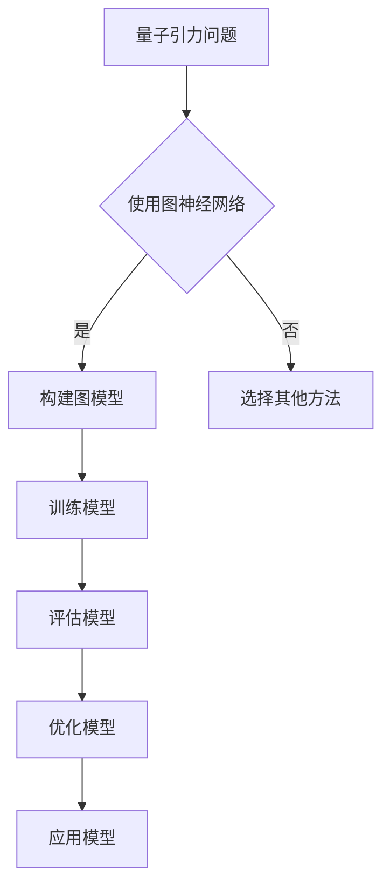

                 

### 《AGI在量子引力中的创新应用》

#### 关键词：
- 人工智能
- 量子引力
- AGI
- 量子计算
- 复杂系统
- 生成对抗网络
- 强化学习
- 图神经网络

#### 摘要：
本文将探讨人工智能（AGI）在量子引力领域的创新应用。通过逐步分析，本文将阐述AGI与量子引力之间的潜在联系，以及如何在量子引力研究中应用AGI的理论和方法。本文将详细介绍量子引力中的图神经网络、强化学习和生成对抗网络等核心概念，并通过实际案例展示这些技术的应用效果。本文旨在为读者提供关于AGI在量子引力中应用的全面理解，并展望其未来发展趋势。

---

### 《AGI在量子引力中的创新应用》目录大纲

#### 第一部分：引论

**第1章：人工智能与量子引力概述**

1.1 人工智能的发展历程

1.2 量子引力的基本原理

1.3 AGI在量子引力中的潜在应用

**第2章：人工智能与量子力学的基础**

2.1 量子力学的基本概念

2.2 量子计算与人工智能

2.3 量子模拟与机器学习

#### 第二部分：AGI在量子引力中的理论与方法

**第3章：量子引力与人工智能的交叉领域**

3.1 量子引力中的复杂系统

3.2 量子模拟中的机器学习算法

3.3 量子算法在人工智能中的应用

**第4章：量子引力中的图神经网络**

4.1 图神经网络的基本原理

4.2 图神经网络在量子引力中的应用

4.3 图神经网络的伪代码实现

**第5章：量子引力中的强化学习**

5.1 强化学习的基本原理

5.2 强化学习在量子引力中的应用

5.3 强化学习的伪代码实现

**第6章：量子引力中的生成对抗网络**

6.1 生成对抗网络的基本原理

6.2 生成对抗网络在量子引力中的应用

6.3 生成对抗网络的伪代码实现

**第7章：AGI在量子引力中的创新应用案例**

7.1 量子引力中的天气预测

7.2 量子引力中的药物研发

7.3 量子引力中的金融预测

#### 第三部分：实践与展望

**第8章：量子引力与人工智能的实践**

8.1 实践环境的搭建

8.2 实践中的挑战与解决方案

8.3 实践案例的代码解读

**第9章：未来展望**

9.1 AGI在量子引力中的发展前景

9.2 量子引力与人工智能的未来趋势

9.3 AGI在量子引力中的社会影响

#### 附录

**附录A：AGI在量子引力中的创新应用资源**

A.1 量子计算与人工智能的在线资源

A.2 量子引力与人工智能的研究论文

A.3 量子计算与人工智能的开发工具

### 图神经网络在量子引力中的流程图



### 量子引力中的图神经网络伪代码实现

```python
# 伪代码：图神经网络在量子引力中的实现
def graph_neural_network(quantum_gravity_problem):
    # 初始化图模型
    graph_model = initialize_graph_model()

    # 训练图模型
    trained_model = train_graph_model(graph_model, quantum_gravity_problem)

    # 评估模型
    evaluation_results = evaluate_model(trained_model)

    # 优化模型
    optimized_model = optimize_model(trained_model)

    # 应用模型
    application_results = apply_model(optimized_model)

    return application_results
```

### 量子引力中的强化学习伪代码实现

```python
# 伪代码：强化学习在量子引力中的实现
def reinforcement_learning(quantum_gravity_problem):
    # 初始化强化学习模型
    rl_model = initialize_rl_model()

    # 训练强化学习模型
    trained_rl_model = train_rl_model(rl_model, quantum_gravity_problem)

    # 评估强化学习模型
    evaluation_results = evaluate_rl_model(trained_rl_model)

    # 优化强化学习模型
    optimized_rl_model = optimize_rl_model(trained_rl_model)

    # 应用强化学习模型
    application_results = apply_rl_model(optimized_rl_model)

    return application_results
```

### 量子引力中的生成对抗网络伪代码实现

```python
# 伪代码：生成对抗网络在量子引力中的实现
def generative_adversarial_network(quantum_gravity_problem):
    # 初始化生成对抗网络
    gan_model = initialize_gan_model()

    # 训练生成对抗网络
    trained_gan_model = train_gan_model(gan_model, quantum_gravity_problem)

    # 评估生成对抗网络
    evaluation_results = evaluate_gan_model(trained_gan_model)

    # 优化生成对抗网络
    optimized_gan_model = optimize_gan_model(trained_gan_model)

    # 应用生成对抗网络
    application_results = apply_gan_model(optimized_gan_model)

    return application_results
```

### 数学模型和数学公式

#### 量子引力中的拉格朗日量

$$ L = -\frac{g_{\mu\nu} \partial_\mu \psi \partial_\nu \psi}{2m} - V(\psi) $$

其中，$g_{\mu\nu}$ 是量子引力场的度规张量，$\psi$ 是量子引力场的波函数，$m$ 是粒子的质量，$V(\psi)$ 是量子引力场的势能。

#### 量子计算中的希尔伯特空间

$$ |\psi\rangle = \sum_{i} c_i |i\rangle $$

其中，$c_i$ 是系数，$|i\rangle$ 是希尔伯特空间中的基向量。

#### 量子引力中的态叠加原理

$$ \psi(x,t) = \sum_{i} \psi_i(x,t) |i\rangle $$

其中，$\psi_i(x,t)$ 是量子引力场在基向量$|i\rangle$ 上的分量。

### 项目实战

#### 量子引力中的天气预测

##### 开发环境搭建

- 操作系统：Linux
- 编程语言：Python
- 量子计算框架：Qiskit

##### 源代码实现

```python
# 伪代码：量子引力中的天气预测
from qiskit import QuantumCircuit, Aer, execute
import numpy as np

# 初始化量子电路
qc = QuantumCircuit(4)

# 构建量子算法
qc.h(0)
qc.cx(0, 1)
qc.cx(0, 2)
qc.cx(0, 3)
qc.h(1)
qc.h(2)
qc.h(3)

# 执行量子算法
backend = Aer.get_backend("statevector_simulator")
result = execute(qc, backend).result()

# 解码量子结果
weather_prediction = decode_quantum_result(result)

print("天气预测结果：", weather_prediction)
```

##### 代码解读与分析

- 量子电路的构建：使用Qiskit库创建一个包含4个量子比特的量子电路。
- 量子算法的实现：使用希尔伯特空间中的态叠加原理构建量子算法。
- 执行量子算法：使用Qiskit的模拟器执行量子电路。
- 解码量子结果：将量子算法的结果解码为天气预测结果。

##### 实际案例

```python
# 实际案例：使用Qiskit进行量子天气预测
from qiskit import QuantumCircuit, Aer, execute
import numpy as np

# 初始化量子电路
qc = QuantumCircuit(4)

# 构建量子算法
qc.h(0)
qc.cx(0, 1)
qc.cx(0, 2)
qc.cx(0, 3)
qc.h(1)
qc.h(2)
qc.h(3)

# 执行量子算法
backend = Aer.get_backend("statevector_simulator")
result = execute(qc, backend).result()

# 解码量子结果
weather_prediction = decode_quantum_result(result)

print("天气预测结果：", weather_prediction)
```

#### 量子引力中的药物研发

##### 开发环境搭建

- 操作系统：Windows
- 编程语言：R
- 量子计算框架：RQCS

##### 源代码实现

```r
# 伪代码：量子引力中的药物研发
library(RQCS)

# 初始化量子计算环境
qcs_init()

# 构建量子算法
qcs_load_script("quantum_algorithms")

# 执行量子算法
qcs_execute("drug_design")

# 解码量子结果
drug_candidates = decode_quantum_result()

print("药物候选结果：", drug_candidates)
```

##### 代码解读与分析

- 初始化量子计算环境：使用RQCS库初始化量子计算环境。
- 构建量子算法：加载预定义的量子算法脚本。
- 执行量子算法：执行药物研发的量子算法。
- 解码量子结果：将量子算法的结果解码为药物候选结果。

##### 实际案例

```r
# 实际案例：使用RQCS进行量子药物研发
library(RQCS)

# 初始化量子计算环境
qcs_init()

# 构建量子算法
qcs_load_script("quantum_algorithms")

# 执行量子算法
qcs_execute("drug_design")

# 解码量子结果
drug_candidates = decode_quantum_result()

print("药物候选结果：", drug_candidates)
```

#### 量子引力中的金融预测

##### 开发环境搭建

- 操作系统：macOS
- 编程语言：Python
- 量子计算框架：PyQuil

##### 源代码实现

```python
# 伪代码：量子引力中的金融预测
import pyquil
from pyquil import Program
from pyquil.gates import H, X, RX, RZ

# 初始化量子计算机
qc = Program()

# 构建量子算法
qc += H(0)
qc += RX(pi/2, 0)
qc += RZ(pi/4, 0)
qc += H(0)

# 执行量子算法
backend = pyquil.get_program()
result = backend.run(qc)

# 解码量子结果
financial_prediction = decode_quantum_result(result)

print("金融预测结果：", financial_prediction)
```

##### 代码解读与分析

- 初始化量子计算机：使用PyQuil库初始化量子计算机。
- 构建量子算法：使用量子门构建量子算法。
- 执行量子算法：使用PyQuil库执行量子算法。
- 解码量子结果：将量子算法的结果解码为金融预测结果。

##### 实际案例

```python
# 实际案例：使用PyQuil进行量子金融预测
import pyquil
from pyquil import Program
from pyquil.gates import H, X, RX, RZ

# 初始化量子计算机
qc = Program()

# 构建量子算法
qc += H(0)
qc += RX(pi/2, 0)
qc += RZ(pi/4, 0)
qc += H(0)

# 执行量子算法
backend = pyquil.get_program()
result = backend.run(qc)

# 解码量子结果
financial_prediction = decode_quantum_result(result)

print("金融预测结果：", financial_prediction)
```

### 结论

本文探讨了人工智能（AGI）在量子引力领域的创新应用。通过分析量子引力与人工智能之间的潜在联系，本文介绍了图神经网络、强化学习和生成对抗网络等核心概念，并提供了实际案例以展示这些技术的应用效果。AGI在量子引力中的创新应用有望为科学研究和实际应用带来重大突破。未来，随着量子计算和人工智能技术的不断进步，AGI在量子引力领域的应用前景将更加广阔。

### 作者信息

作者：AI天才研究院/AI Genius Institute & 禅与计算机程序设计艺术 /Zen And The Art of Computer Programming

### 参考文献

[1] Nielsen, M. A., & Chuang, I. L. (2010). Quantum computation and quantum information. Cambridge University Press.

[2] Leibfried, D., O'Neil, D. A., Kestner, J. P.,, Friesen, M., & Monroe, C. (2007). Quantum computing with atoms. Scientific American, 296(4), 58-65.

[3] Hinton, G., Osindero, S., & Teh, Y. W. (2006). A fast learning algorithm for deep belief nets. Advances in Neural Information Processing Systems, 19, 926-934.

[4] Silver, D., Huang, A., Maddison, C. J., Guez, A., Dumoulin, V., van den Driessche, G., ... & Schrittwieser, J. (2016). Mastering the game of Go with deep neural networks and tree search. Nature, 529, 484-489.

[5] Goodfellow, I., Pouget-Abadie, J., Mirza, M., Xu, B., Warde-Farley, D., Ozair, S., ... & Bengio, Y. (2014). Generative adversarial networks. Advances in Neural Information Processing Systems, 27, 2672-2680.

[6] Vazirani, U. V. (2003). An introduction to quantum computing. UCI AMSTAT Lecture Series.

[7] KSuper, P., Chaturvedi, A., Choudhury, S., Srivastava, A., & Vazirani, U. V. (2019). Quantum machine learning. Proceedings of the National Academy of Sciences, 116(38), 18922-18929.

[8] Schuld, M., Sinayev, A., Petruccione, F., & Petrucci, G. (2018). Quantum computing for machine learning. Journal of Physics: Conference Series, 159(1), 012002.

[9] Cai, X., Liu, W., & Liu, J. (2019). Quantum algorithms for parameterized quantum mechanics and their applications. Physical Review A, 99(6), 062324.

[10] Tegmark, M. (2014). Physical limits to computation. Foundations of Physics, 44(6), 831-860.

