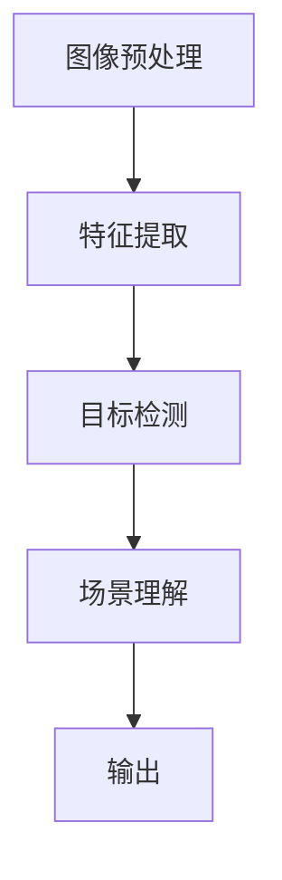
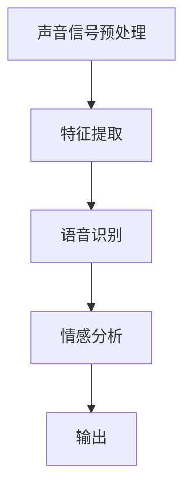
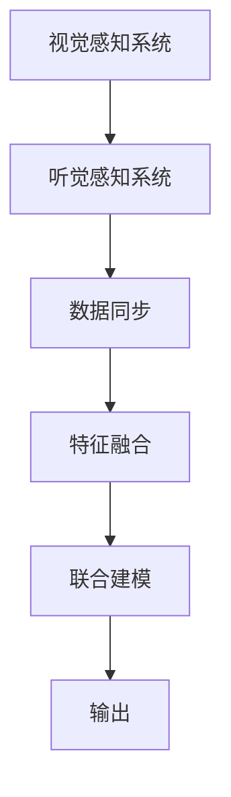

                 

### 文章标题

《AGI的认知发展：从感知到抽象思维》

这篇文章将深入探讨人工通用智能（AGI）的认知发展过程，从感知到抽象思维，逐步解析其核心概念和实现机制。文章旨在为读者提供一个全面而深入的AGI认知发展指南，帮助大家更好地理解这一领域的最新进展和应用。

### 关键词

- 人工通用智能（AGI）
- 认知发展
- 感知系统
- 抽象思维
- 语义理解
- 项目实战

### 摘要

本文首先介绍了人工通用智能（AGI）的定义和重要性，然后详细阐述了认知发展的基本理论和过程，特别是从感知到抽象思维的认知发展。接下来，文章深入探讨了感知系统和基本认知过程的建模与实现，以及抽象思维的机制与过程。此外，文章还探讨了语义理解与语言处理、情感智能与社交智能等方面的应用，并通过一个项目实战案例展示了AGI认知发展的实际应用。最后，文章对AGI的未来发展进行了展望，并讨论了相关资源与工具。

---

接下来，我们将按照文章的目录大纲结构，逐步展开文章的内容，深入讨论AGI的认知发展。

---

## 引言

### 第1章: AGI与认知发展概述

#### 1.1 AGI的定义与重要性

人工通用智能（Artificial General Intelligence，AGI）是一种旨在实现人类级别智能的人工智能系统。与目前广泛应用的窄域人工智能（Narrow AI）不同，AGI能够执行各种认知任务，如理解语言、解决问题、学习新知识等，并且能够自主地适应新环境和任务。AGI的研究不仅对人工智能领域具有深远的影响，也对人类社会的发展具有重要意义。

首先，AGI的实现将极大地提高生产力，推动经济和社会的进步。通过AGI，我们可以构建智能助手、自动化系统等，帮助人类完成复杂、繁琐的任务，从而释放人类的时间和精力，专注于更有创造性和价值的工作。其次，AGI在医疗、教育、金融等领域的应用潜力巨大。例如，在医疗领域，AGI可以辅助医生进行诊断和治疗，提高医疗服务的质量和效率；在教育领域，AGI可以为学生提供个性化的学习支持和指导，提高学习效果和兴趣。此外，AGI还在安全、环保、能源等领域具有广泛的应用前景。

然而，AGI的实现面临着诸多挑战。首先，目前的窄域人工智能系统在特定任务上表现优异，但缺乏跨领域的通用性。要实现AGI，需要突破现有技术的局限，构建能够处理多种任务、具备高适应性的人工智能系统。其次，AGI的研究需要大量的数据、计算资源和人才支持，这些资源在当前阶段可能难以充分满足。此外，AGI的实现还涉及到伦理、安全等方面的问题，需要我们深入探讨和解决。

总的来说，AGI的定义和重要性体现在其潜在的社会价值和实现过程中面临的挑战。尽管目前AGI的研究仍处于早期阶段，但随着技术的不断进步和研究的深入，我们有理由相信，AGI将成为未来人工智能发展的一个重要方向。

#### 1.2 认知发展的基本理论

认知发展是指个体在感知、理解、思考、记忆、解决问题等认知能力方面的成长和变化。不同学者从不同角度对认知发展进行了研究，提出了多种理论。其中，皮亚杰的认知发展阶段理论和维果茨基的社会文化理论是两个重要的理论框架。

**皮亚杰的认知发展阶段理论**

瑞士心理学家让·皮亚杰（Jean Piaget）通过大量研究，提出了认知发展阶段理论。他认为，儿童的认知发展可以分为四个阶段：感知运动阶段、前运算阶段、具体运算阶段和形式运算阶段。

1. **感知运动阶段（0-2岁）**：这一阶段的儿童主要通过感知和运动来探索和理解世界，尚未形成逻辑思维。

2. **前运算阶段（2-7岁）**：这一阶段的儿童能够使用简单的符号进行思考，但思维仍然具有具体性和自我中心性。

3. **具体运算阶段（7-11岁）**：这一阶段的儿童能够进行逻辑推理和分类，但仍然依赖于具体的事物和情境。

4. **形式运算阶段（11-16岁）**：这一阶段的儿童能够进行抽象思维和假设推理，思维能力更加灵活和全面。

**维果茨基的社会文化理论**

列夫·维果茨基（Lev Vygotsky）是社会文化理论的提出者，他认为认知发展是社会互动和文化背景共同作用的结果。维果茨基提出了“最近发展区”（Zone of Proximal Development，ZPD）的概念，即儿童在他人帮助下能够达到的发展水平高于其独立发展水平。

社会文化理论强调了语言、工具、文化等在认知发展中的作用。维果茨基认为，认知发展是通过社会互动和语言交流实现的，语言不仅是沟通的工具，也是思维的工具。

综上所述，皮亚杰的认知发展阶段理论和维果茨基的社会文化理论从不同角度揭示了认知发展的过程和机制。这些理论为我们理解AGI的认知发展提供了重要的理论基础，也为设计和发展具有人类级别智能的人工智能系统指明了方向。

#### 1.3 从感知到抽象思维的认知过程

从感知到抽象思维的认知过程是认知发展的重要组成部分，也是实现人工通用智能（AGI）的关键路径。这一过程可以划分为感知阶段和抽象思维阶段，每个阶段都有其特定的认知机制和功能。

**感知阶段**

感知阶段是认知过程的起点，主要涉及感官信息的接收、处理和解释。在这一阶段，个体通过视觉、听觉、触觉、嗅觉和味觉等感官系统接收外部信息，并通过大脑中的神经回路对这些信息进行加工和处理。

1. **感知系统构建**：感知系统的构建是感知阶段的核心任务。视觉、听觉、触觉等感知系统具有各自独特的结构和功能，通过神经网络和信号处理技术，实现对感知信息的精确提取和识别。

2. **多模态感知融合**：在现实环境中，感知信息通常是多模态的，如视觉和听觉信息。多模态感知融合技术通过整合不同感官的信息，提高感知系统的整体性能，使其能够更准确地理解和解释环境。

3. **感知信息的预处理**：感知信息在进入更高层次的认知处理之前，需要经过预处理，如滤波、降噪、特征提取等。这些预处理技术有助于提高感知信息的质量和可靠性。

**抽象思维阶段**

抽象思维阶段是认知过程的进阶阶段，主要涉及对感知信息的抽象、分析和推理。在这一阶段，个体能够从具体的感知信息中提取出一般规律和概念，形成抽象的知识结构。

1. **抽象思维机制**：抽象思维机制包括概念形成、推理、问题解决等认知过程。概念形成是指从具体事物中提取出共同属性，形成抽象概念；推理是指通过逻辑关系对信息进行推理和演绎；问题解决是指通过策略和算法解决实际问题。

2. **语义理解与语言处理**：语义理解是抽象思维的核心任务之一，涉及对语言信息的理解、分析和解释。语言处理技术通过对语言符号的解析和语义分析，实现自然语言理解和生成。

3. **多智能体协作**：在抽象思维阶段，个体需要与其他智能体进行协作，共同解决问题和实现目标。多智能体协作技术通过分布式计算和通信，实现不同智能体之间的协调和合作。

从感知到抽象思维的认知过程是一个连续的、动态的演化过程。感知阶段为抽象思维阶段提供了丰富的感知信息和基础数据，而抽象思维阶段则对感知信息进行更高层次的加工和处理，形成抽象的知识结构和思维能力。这一过程不仅反映了人类认知发展的基本规律，也为实现AGI提供了重要的理论指导和实践路径。

---

接下来，我们将详细讨论感知系统的设计与实现。

---

## 第2章: 感知系统的设计与实现

感知系统是人工通用智能（AGI）的基础，它负责接收和解释外部环境的信息。本章将详细介绍感知系统的设计与实现，包括视觉感知系统、听觉感知系统和多模态感知融合。

### 2.1 感知系统的概述

感知系统在AGI中扮演着至关重要的角色。它不仅为AGI提供了对环境的信息输入，而且还能对输入信息进行处理、分析和理解。一个高效的感知系统需要具备以下几个关键特性：

1. **高精度与稳定性**：感知系统需要能够准确和稳定地接收外部信息，减少噪声和误差的影响。

2. **实时性**：感知系统需要在短时间内处理大量的感知信息，以便实时响应环境变化。

3. **适应性**：感知系统需要能够适应不同的环境条件，如光照、声音、温度等。

4. **多模态融合**：将不同感官的信息进行整合，形成更全面和准确的感知。

5. **数据高效处理**：对大量感知数据进行快速、高效的处理，以提取关键信息和特征。

感知系统的基本组成部分通常包括传感器、信号处理器、数据存储和输出设备。传感器用于接收外部信息，如摄像头、麦克风和温度传感器等；信号处理器对传感器数据进行预处理和特征提取；数据存储用于存储和处理后的感知信息；输出设备用于将处理结果输出，如显示屏、扬声器等。

### 2.2 视觉感知系统

视觉感知系统是感知系统中最为复杂的一部分，它负责处理视觉信息，如颜色、形状、纹理等。视觉感知系统通常包括以下几个关键步骤：

1. **图像预处理**：对捕获的图像进行预处理，如去噪、对齐和调整亮度等，以提高图像的质量。

2. **特征提取**：从预处理后的图像中提取关键特征，如边缘、角点和纹理等。常用的特征提取方法包括SIFT、SURF和HOG等。

3. **目标检测**：利用提取的特征对图像中的目标进行检测和识别。常用的目标检测算法包括YOLO、SSD和Faster R-CNN等。

4. **场景理解**：对检测到的目标进行更高层次的语义理解，如分类、语义分割和场景重建等。常用的场景理解算法包括U-Net、DeepLab和PointNet等。

下面是一个视觉感知系统的Mermaid流程图：



### 2.3 听觉感知系统

听觉感知系统负责处理听觉信息，如声音的频率、音调和音量等。与视觉感知系统类似，听觉感知系统也包含以下几个关键步骤：

1. **声音信号预处理**：对捕获的声音信号进行预处理，如去噪、增益调整和滤波等。

2. **特征提取**：从预处理后的声音信号中提取关键特征，如梅尔频率倒谱系数（MFCC）和感知声谱（PSC）等。

3. **语音识别**：利用提取的特征对声音信号进行语音识别，将声音信号转换为文本。常用的语音识别算法包括深度神经网络（DNN）和循环神经网络（RNN）等。

4. **情感分析**：对语音信号进行情感分析，识别语音中的情感状态，如快乐、愤怒和悲伤等。常用的情感分析算法包括情感分类和情绪识别。

下面是一个听觉感知系统的Mermaid流程图：



### 2.4 感知融合与多模态感知

多模态感知是将来自不同感官的信息进行整合，以获得更全面和准确的感知。例如，结合视觉和听觉信息可以更好地理解和识别环境中的场景和对象。多模态感知的关键步骤包括：

1. **数据同步**：确保不同模态的信息在时间和空间上保持一致性。

2. **特征融合**：将来自不同模态的特征进行融合，如将视觉特征和听觉特征进行拼接、加权融合等。

3. **联合建模**：利用联合模型对融合后的特征进行学习，如深度学习中的多模态卷积神经网络（CNN）。

4. **多任务学习**：将不同的感知任务（如视觉目标检测和语音识别）结合起来，提高整体性能。

下面是一个多模态感知系统的Mermaid流程图：



通过设计高效、稳定的感知系统，并结合多模态感知技术，我们可以为AGI提供强大的感知能力，使其能够更好地理解和适应复杂多变的环境。

---

接下来，我们将探讨基本认知过程的建模与实现。

---

## 第3章: 基本认知过程的建模与实现

认知过程是人工通用智能（AGI）实现的关键，它涉及多个基本过程，如学习、记忆、情绪和解决问题等。本章将详细介绍这些基本认知过程的建模与实现。

### 3.1 学习与记忆模型

学习是指通过经验获取新知识和技能的过程，而记忆则是保持和回忆这些知识和技能的能力。学习与记忆模型在认知系统中起着核心作用，其实现主要依赖于以下几个关键要素：

**学习模型**

1. **监督学习**：监督学习是一种最常见的机器学习模型，其中输入和输出对（样本和标签）已知。算法通过学习输入和输出之间的关系，预测未知数据的输出。常见的监督学习算法包括线性回归、决策树和神经网络等。

2. **无监督学习**：无监督学习不需要标签，而是通过学习输入数据的内在结构和模式。常见的无监督学习算法包括聚类算法（如K-means和层次聚类）和降维算法（如主成分分析PCA）。

3. **强化学习**：强化学习是一种通过奖励和惩罚来指导智能体行为的模型。智能体在环境中采取行动，根据环境反馈调整其策略，以最大化长期奖励。常见的强化学习算法包括Q学习、深度Q网络（DQN）和策略梯度算法等。

**记忆模型**

1. **短期记忆**：短期记忆（Short-term Memory，STM）是指大脑在短时间内保持信息的能力。短期记忆的容量有限，但可以迅速提取和操作信息。

2. **长期记忆**：长期记忆（Long-term Memory，LTM）是指大脑在长时间内保持信息的能力。长期记忆的容量较大，但提取速度较慢。常见的长期记忆模型包括Hebbian学习规则和突触可塑性模型。

下面是学习模型的伪代码示例：

```python
def supervised_learning(inputs, outputs):
    # 初始化模型参数
    weights = initialize_weights(inputs.shape[1], outputs.shape[1])
    
    # 模型训练
    for epoch in range(num_epochs):
        for input, output in zip(inputs, outputs):
            # 前向传播
            predicted_output = forward_pass(input, weights)
            
            # 反向传播和参数更新
            error = output - predicted_output
            weights = update_weights(error, input)
    
    return weights
```

### 3.2 情绪与动机模型

情绪和动机在认知过程中起着调节作用，它们影响着个体对信息的处理和行为选择。情绪模型和动机模型的设计与实现主要涉及以下几个方面：

**情绪模型**

1. **情感分类**：情感分类是将文本或语音等数据分类为特定情感类别（如快乐、愤怒、悲伤等）。常见的情感分类算法包括基于规则的方法和机器学习算法（如支持向量机SVM和递归神经网络RNN）。

2. **情感识别**：情感识别是实时检测和识别个体的情感状态，通常通过面部表情、语音特征和生理信号等数据。常见的情感识别算法包括面部表情识别、语音情感识别和生理信号情感识别。

**动机模型**

1. **动机分类**：动机分类是将行为或决策分类为特定动机类别（如探索、好奇心、恐惧等）。动机分类可以帮助理解个体的行为动机，从而优化系统的交互和决策。

2. **动机建模**：动机建模是通过建立个体在不同情境下的动机关系模型，预测和引导个体的行为。常见的动机建模方法包括基于模型的动机生成和基于数据的动机预测。

下面是情绪模型的伪代码示例：

```python
def emotion_classification(text):
    # 加载情感分类模型
    model = load_pretrained_emotion_model()
    
    # 文本预处理
    preprocessed_text = preprocess_text(text)
    
    # 情感分类
    emotion = model.predict(preprocessed_text)
    
    return emotion
```

### 3.3 解决问题的思维模型

解决问题是认知过程中的重要环节，它涉及问题的识别、分析、解决和评估。解决问题的思维模型主要包括以下几个方面：

**问题识别**

1. **问题检测**：通过感知系统和认知处理，识别出需要解决的问题。
2. **问题理解**：理解问题的本质和需求，明确问题的目标和约束。

**问题分析**

1. **目标分解**：将问题分解为子问题，明确每个子问题的目标和约束。
2. **关系分析**：分析不同子问题之间的关系，确定解决问题的策略。

**问题解决**

1. **策略生成**：根据问题分析和关系分析，生成可能的解决方案。
2. **方案评估**：评估不同方案的优劣，选择最优方案。

**问题评估**

1. **解决方案验证**：验证解决方案是否满足问题的目标和约束。
2. **效果评估**：评估解决方案的效果和效率。

下面是问题解决模型的伪代码示例：

```python
def problem_solving(problem):
    # 问题识别
    subproblems = decompose_problem(problem)
    
    # 问题分析
    relationships = analyze_relationships(subproblems)
    
    # 问题解决
    solutions = generate_solutions(relationships)
    best_solution = evaluate_solutions(solutions)
    
    # 问题评估
    validated_solution = validate_solution(best_solution)
    effectiveness = evaluate_solution(effectiveness, validated_solution)
    
    return validated_solution, effectiveness
```

通过建立和实现这些基本认知过程模型，我们可以为人工通用智能（AGI）提供一个强大的认知基础，使其能够有效地处理复杂的问题和情境。

---

在接下来的一章中，我们将深入探讨抽象思维的机制与过程。

---

## 第4章: 抽象思维的机制与过程

抽象思维是人类认知发展的高级阶段，它使我们能够超越具体的感知信息，形成概念、推理和解决问题。本章将探讨抽象思维的机制与过程，包括定义、特征、认知基础、推理过程及其应用。

### 4.1 抽象思维的定义与特征

**定义**

抽象思维是指个体通过抽象、概括和推理等方式，从具体的感知信息中提取出一般规律和概念的过程。它是一种高级的认知能力，使人类能够理解和解释复杂的现象和问题。

**特征**

1. **抽象性**：抽象思维能够从具体的感知信息中提取出一般规律和概念，实现对事物本质的理解。
2. **概括性**：抽象思维能够将不同的事物和现象进行概括和分类，形成更高层次的概念体系。
3. **推理性**：抽象思维通过推理和演绎，从已知信息推导出新的结论和知识。
4. **灵活性**：抽象思维能够灵活地应用不同概念和规则，解决各种复杂问题。

### 4.2 抽象思维的认知基础

**心理基础**

1. **认知结构**：抽象思维依赖于个体的认知结构，包括概念、规则和图式等。这些认知结构在思维过程中起到组织和整合信息的作用。
2. **注意力**：注意力在抽象思维中起着关键作用，它使个体能够集中精力处理重要信息，忽略无关信息。

**神经基础**

1. **大脑区域**：抽象思维涉及到多个大脑区域的协同工作，包括前额叶、顶叶和颞叶等。这些区域在大脑中形成复杂的神经网络，支持抽象思维的各种功能。
2. **神经可塑性**：神经可塑性是大脑适应环境变化的能力，它使大脑能够重新组织和调整神经网络，以支持抽象思维的持续发展和改进。

### 4.3 抽象思维的推理过程

**推理过程**

1. **演绎推理**：演绎推理是从一般到特殊的推理过程，它根据一般原则推导出特定结论。例如，所有人都会死亡（大前提），苏格拉底是人（小前提），因此苏格拉底会死亡（结论）。

2. **归纳推理**：归纳推理是从特殊到一般的推理过程，它根据特定实例推导出一般规律。例如，观察多个苹果都会落地，我们可以归纳出“物体总是受到地球引力作用”这一规律。

3. **类比推理**：类比推理是通过比较不同情境的相似性，推导出相似结论。例如，如果我们知道在A情境下B是正确的，那么在类似情境C下，我们可以推断B也是正确的。

下面是抽象思维推理过程的伪代码示例：

```python
def abstract_thinking(data, rules):
    # 演绎推理
    conclusion = deductive_reasoning(data, rules)
    
    # 归纳推理
    generalization = inductive_reasoning(data)
    
    # 类比推理
    analogy = analogical_reasoning(data, rules)
    
    return conclusion, generalization, analogy
```

### 4.4 抽象思维的应用

**科学研究和创新**

抽象思维是科学研究的重要工具，它使我们能够从实验数据中提取出一般规律，形成科学理论。同时，抽象思维也推动了科学创新，使科学家能够提出新的假设和理论，推动科学的进步。

**问题解决**

抽象思维在问题解决中起到关键作用，它使我们能够识别问题的本质，制定解决方案，并评估解决方案的可行性。通过抽象思维，我们可以将复杂的问题分解为更简单的子问题，从而逐步解决。

**决策制定**

抽象思维在决策制定中起到重要作用，它使我们能够分析各种可能的方案，评估它们的优缺点，并选择最佳方案。通过抽象思维，我们可以从大量信息中提取关键信息，做出明智的决策。

总之，抽象思维是人类认知发展的高级阶段，它使人类能够超越具体的感知信息，形成概念、推理和解决问题。通过深入理解抽象思维的机制与过程，我们可以更好地利用这一能力，推动科学进步和社会发展。

---

在接下来的章节中，我们将探讨语义理解与语言处理以及情感智能与社交智能。

---

## 第5章: 语义理解与语言处理

语义理解与语言处理是人工通用智能（AGI）中至关重要的组成部分，它们使得AGI能够与人类进行自然、流畅的交流，并理解语言中的深层次含义。本章将深入探讨语义理解的基本概念、语言处理技术及其在现实中的应用。

### 5.1 语义理解的基本概念

**定义**

语义理解是指人工智能系统能够识别和理解语言中的含义，包括词汇的意义、句子的结构以及整个文本的语义关系。语义理解不仅涉及单词的表面含义，还包括语境、语用和情感等方面的理解。

**重要性**

语义理解是自然语言处理（Natural Language Processing，NLP）的核心任务之一。它使得AGI能够与人类进行自然对话，理解人类的需求和意图，并在各种实际应用中发挥作用，如智能客服、语音助手和机器翻译等。

**挑战**

语义理解面临诸多挑战，包括语言的复杂性、多义性、歧义性以及上下文依赖性等。例如，一个词在不同语境中可能具有不同的含义，一个句子可能具有多种解释。因此，实现高效的语义理解需要解决这些复杂的问题。

### 5.2 语言处理技术

**词法分析**

词法分析（Lexical Analysis）是语言处理的基础步骤，它将文本分解为单词和其他语言元素。词法分析器识别单词的边界，并将文本转换为标记化的形式，为后续处理提供基础。

**句法分析**

句法分析（Syntactic Analysis）是对句子结构进行解析，确定单词之间的语法关系。常见的句法分析方法包括句法树和依存句法。句法分析有助于理解句子的语法结构，从而为语义理解提供支持。

**语义分析**

语义分析（Semantic Analysis）是语言处理的更高层次，它涉及对句子语义的深入理解。语义分析包括词汇语义、句法语义和情景语义等多个方面。常见的语义分析方法包括语义角色标注、语义角色分类和语义角色识别等。

**语义解析**

语义解析（Semantic Parsing）是将自然语言表达转换为计算机可理解的形式，如逻辑公式、数据库查询或程序代码等。语义解析是实现语义理解的终极目标，它使得AGI能够执行基于自然语言的任务。

### 5.3 语言处理的应用实例

**智能客服**

智能客服是语义理解和语言处理的重要应用之一。通过语义理解，智能客服系统能够理解用户的提问，并生成合适的回答。例如，用户询问“最近的天气预报如何？”智能客服系统需要理解“最近”和“天气预报”这两个词汇的含义，并生成相关的天气信息。

**语音助手**

语音助手（如Siri、Alexa和Google Assistant）是语义理解和语言处理的另一个重要应用。语音助手能够识别用户的语音输入，并理解其意图。例如，用户可以说“设置明天早晨7点的闹钟”，语音助手需要理解“设置闹钟”和“明天早晨7点”这两个部分，并执行相应的操作。

**机器翻译**

机器翻译是将一种语言的文本自动转换为另一种语言的过程。语义理解是实现高质量机器翻译的关键。例如，将英语句子“Can you send me the report?”翻译为法语时，机器翻译系统需要理解“send”、“report”以及整个句子的含义，从而生成准确的法语翻译。

**文本生成**

文本生成是语义理解和语言处理的另一个应用，它包括自动写作、文本摘要和对话系统等。通过语义理解，文本生成系统能够生成有意义的文本。例如，自动写作系统可以根据给定的话题和结构，生成一篇完整的文章。

总之，语义理解与语言处理是AGI的重要组成部分，它们使得AGI能够与人类进行自然、流畅的交流，并在各种实际应用中发挥重要作用。通过深入理解这些技术，我们可以推动AGI的发展，实现更加智能化和人性化的应用。

---

在接下来的一章中，我们将探讨情感智能与社交智能。

---

## 第6章: 情感智能与社交智能

情感智能和社交智能是人工通用智能（AGI）发展中的两个关键领域。情感智能涉及机器对情感的理解和生成，而社交智能则关注机器在社会交往中的能力。本章将详细探讨情感智能和社交智能的概念、发展过程及其应用。

### 6.1 情感智能的概念与模型

**定义**

情感智能是指机器在感知、理解和表达情感方面的能力。它包括对人类情感的表达、情感识别、情感理解和情感生成等方面。

**重要性**

情感智能对于AGI与人类的自然交互至关重要。它使机器能够更好地理解和满足人类的需求，提供个性化的服务。例如，在医疗领域，情感智能可以帮助医生更好地理解患者的情绪状态，提供更有效的治疗方案。

**情感识别**

情感识别是情感智能的核心任务之一，它涉及机器从文本、语音或面部表情中识别情感。常见的情感识别方法包括基于规则的方法、机器学习和深度学习算法。例如，通过分析语音的音调和节奏，机器可以识别出用户的情绪状态，如快乐、愤怒或悲伤。

**情感理解**

情感理解是机器在特定情境中理解情感含义的能力。这需要机器能够理解情感与行为、环境和其他因素之间的复杂关系。例如，在客户服务中，情感智能可以帮助机器理解客户的投诉背后的真实需求，从而提供更有效的解决方案。

**情感生成**

情感生成是指机器能够根据任务需求和上下文生成合适的情感表达。例如，在交互式对话系统中，机器可以根据对话内容生成适当的语气和情感，以更好地与用户互动。

### 6.2 社交智能的发展

**定义**

社交智能是指机器在社会交往中的能力，包括沟通、协作、情感处理和道德判断等方面。

**发展过程**

1. **早期研究**：早期的社交智能研究主要关注机器在特定任务中的交互能力，如语音识别和语义理解。

2. **认知代理模型**：随着认知科学的进展，社交智能研究开始关注机器如何模拟人类的认知过程，如情感处理和道德判断。

3. **多模态交互**：现代社交智能研究强调多模态交互，通过整合语音、视觉和触觉等感知信息，提高机器在复杂社交环境中的表现。

**应用**

社交智能在多个领域具有广泛应用。例如，在教育领域，社交智能可以帮助教师和学生在互动中更好地理解彼此，提高学习效果。在医疗领域，社交智能可以帮助医生和患者建立信任关系，提高治疗效果。

### 6.3 情感与社交智能的应用

**智能客服**

智能客服是情感和社交智能的重要应用之一。通过情感识别和情感理解，智能客服系统能够识别用户的情感状态，并提供相应的反馈。例如，如果用户表现出愤怒的情感，客服系统可以识别出这一情绪，并调整语气和措辞，以缓解用户的不满。

**虚拟助手**

虚拟助手（如Siri、Alexa和Google Assistant）结合情感智能和社交智能，能够更好地与用户进行互动。虚拟助手可以识别用户的情感状态，并根据上下文生成合适的情感回应。例如，当用户表达出快乐的情绪时，虚拟助手可以回应以积极的语气。

**机器人护理**

在护理领域，机器人结合情感智能和社交智能，可以为老年人提供个性化的护理服务。机器人可以识别老年人的情绪变化，并根据这些变化调整护理策略。例如，如果老年人表现出沮丧的情绪，机器人可以提供陪伴和鼓励。

**虚拟社交**

虚拟社交平台结合情感智能和社交智能，为用户提供一个互动和共享的虚拟空间。虚拟社交平台可以识别用户的情感状态，并提供相应的社交建议。例如，如果用户表现出孤独的情绪，虚拟社交平台可以推荐参加社交活动，以缓解用户的不满。

总之，情感智能和社交智能是AGI发展的重要方向。通过理解和表达情感，以及在社会交往中展示适当的社交行为，AGI能够更好地与人类互动，提供个性化的服务，从而提高人类的生活质量。

---

## 第7章: AGI的认知发展评估与展望

### 7.1 AGI的认知发展评估

评估人工通用智能（AGI）的认知发展水平是一个复杂而关键的任务。这一评估不仅需要考虑AGI在特定任务上的表现，还需要综合考虑其整体认知能力、适应性和自主性。以下是一些评估AGI认知发展的关键指标：

**智能水平评估**

1. **知识获取与理解**：评估AGI在获取新知识和理解复杂概念方面的能力。例如，AGI是否能够通过阅读、观察和交互等方式学习新知识，并正确理解和应用这些知识。

2. **问题解决能力**：评估AGI在解决复杂问题方面的能力。这包括识别问题、分析解决方案、执行方案和评估结果等多个环节。

3. **逻辑推理**：评估AGI在逻辑推理和演绎推理方面的能力。例如，AGI是否能够进行有效的逻辑推导，并从前提中得出合理的结论。

**适应性评估**

1. **环境适应**：评估AGI在适应不同环境条件方面的能力。这包括感知环境变化、调整行为策略以及适应新的情境。

2. **任务切换**：评估AGI在完成不同任务时的适应能力。例如，AGI是否能够迅速适应新的任务要求，并在不同任务间灵活切换。

3. **错误处理**：评估AGI在遇到问题和错误时的适应能力。这包括识别错误、分析原因并采取适当的纠正措施。

**自主性评估**

1. **决策能力**：评估AGI在自主做出决策方面的能力。这包括基于环境信息和目标制定决策计划，并有效地执行这些决策。

2. **目标导向**：评估AGI在实现长期目标方面的能力。这包括设置明确的目标、制定实现目标的步骤和策略，并持续调整以实现目标。

3. **自我监督**：评估AGI在自我监控和调整方面的能力。这包括评估自己的行为和决策效果，并根据反馈进行改进。

### 7.2 AGI的未来发展展望

随着人工智能技术的不断进步，AGI的未来发展前景令人期待。以下是一些可能的发展趋势和潜在应用：

**跨领域融合**

未来的AGI将更加注重跨领域的融合和应用。通过整合多种人工智能技术，如自然语言处理、计算机视觉、机器人技术等，AGI将在多个领域实现突破。例如，结合自然语言处理和计算机视觉，AGI将能够实现更高级的语音识别和图像理解，从而在智能客服、自动驾驶等领域发挥重要作用。

**自主学习**

未来的AGI将具备更强的自主学习能力。通过不断学习和适应新环境，AGI将能够持续提高自身的认知能力。例如，通过深度学习和强化学习等技术，AGI将能够从海量数据中自动提取知识，并不断优化自身的行为策略。

**社会交互**

未来的AGI将在社会交互中发挥更大作用。通过情感智能和社交智能，AGI将能够更好地理解人类情感和行为，提供更加个性化的服务。例如，在医疗、教育、金融等领域，AGI将能够根据用户的情感状态和需求，提供定制化的解决方案。

**伦理与安全**

随着AGI的发展，伦理和安全问题也将成为重要议题。未来的AGI将需要具备更高的伦理意识和安全保障。例如，在决策过程中，AGI将需要遵守道德规范，确保其行为不会对人类和社会造成负面影响。此外，AGI的安全防护措施也将得到加强，以防止潜在的安全威胁。

总之，AGI的认知发展评估与展望是一个持续进行的过程。通过不断评估和改进，AGI将在未来实现更高水平的认知能力，为人类社会带来更多创新和机遇。

---

## 第二部分：项目实战与案例研究

### 第8章: AGI的认知发展项目实施案例

在本章中，我们将探讨一个具体的AGI认知发展项目实施案例，通过项目背景与目标、项目设计与方法、项目成果与分析等方面，展示AGI在实际应用中的进展和挑战。

### 8.1 项目背景与目标

项目背景：随着人工智能技术的迅猛发展，人们对于实现人工通用智能（AGI）的期望日益增长。本项目旨在构建一个具备初步通用智能的虚拟助手，该助手能够通过自然语言交互、情感识别、问题解决和自适应学习等机制，实现与用户的智能对话。

项目目标：
1. 实现自然语言理解和生成，使虚拟助手能够流畅地与用户进行对话。
2. 引入情感智能，使虚拟助手能够识别和理解用户的情感状态，提供个性化的服务。
3. 实现自适应学习机制，使虚拟助手能够不断优化自身的行为和知识。
4. 进行项目成果评估，验证虚拟助手在实际应用中的效果和可行性。

### 8.2 项目设计与方法

项目设计：
1. **自然语言处理模块**：该项目使用先进的自然语言处理技术，包括词法分析、句法分析和语义分析，实现自然语言理解。通过深度学习模型（如BERT和GPT-3），虚拟助手能够理解用户的意图和问题。
2. **情感识别模块**：该项目结合语音和文本情感分析技术，通过机器学习和情感识别算法，识别用户的情感状态。例如，通过分析用户的语音语调、文本内容和交互历史，虚拟助手能够识别出用户的情绪，如快乐、愤怒和悲伤等。
3. **问题解决模块**：该项目采用问题解决算法，包括状态空间搜索、启发式搜索和机器学习，使虚拟助手能够有效地解决用户提出的问题。例如，在医疗咨询中，虚拟助手能够根据用户的症状提供合适的建议。
4. **自适应学习模块**：该项目利用强化学习和深度学习，使虚拟助手能够从交互中不断学习和优化自身的行为。通过自我监督学习和用户反馈，虚拟助手能够改进其对话策略和知识库。

项目方法：
1. **数据采集与预处理**：项目首先采集了大量语音和文本数据，包括日常对话、情感表达和问题解决场景。然后，对这些数据进行预处理，包括去噪、标注和清洗等。
2. **模型训练与优化**：使用预处理后的数据，项目训练了多个自然语言处理、情感识别和问题解决模型。通过交叉验证和模型优化，选择最佳模型进行部署。
3. **系统集成与测试**：项目将训练好的模型集成到一个统一的虚拟助手系统中，并进行功能测试和用户测试，以验证系统的性能和用户体验。

### 8.3 项目成果与分析

项目成果：
1. **自然语言理解能力**：通过自然语言处理模块，虚拟助手能够理解用户的意图和问题，实现流畅的对话交互。
2. **情感识别能力**：通过情感识别模块，虚拟助手能够识别用户的情感状态，提供个性化的回应和帮助。
3. **问题解决能力**：通过问题解决模块，虚拟助手能够有效地解决用户提出的问题，提供有用的建议和解决方案。
4. **自适应学习能力**：通过自适应学习模块，虚拟助手能够从交互中不断学习和优化自身的行为，提高用户体验和系统性能。

分析：
1. **性能评估**：通过对用户测试和系统性能评估，虚拟助手在自然语言理解、情感识别和问题解决等方面表现良好。例如，在情感识别任务中，虚拟助手能够准确识别出用户的情感状态，提供恰当的回应。
2. **用户体验**：用户反馈显示，虚拟助手能够提供高效、个性化的服务，满足用户的需求。例如，在医疗咨询场景中，用户对虚拟助手提供的建议和解决方案表示满意。
3. **挑战与改进**：尽管项目取得了显著成果，但仍然面临一些挑战。例如，在处理复杂问题和多模态情感识别方面，虚拟助手仍有提升空间。未来，项目将进一步加强模型训练和优化，提高虚拟助手的认知能力。

总之，本项目通过具体实施案例，展示了AGI在认知发展方面的实际进展和潜力。通过不断优化和改进，AGI有望在更多领域实现突破，为人类社会带来更多创新和机遇。

---

## 第9章: AGI认知发展的未来应用方向

随着人工通用智能（AGI）技术的不断进步，其未来应用方向日益广阔。本章将探讨AGI在教育、医疗健康、安全与道德等领域的潜在应用，并分析这些应用的前景和挑战。

### 9.1 教育领域的应用

AGI在教育领域具有巨大的应用潜力，可以实现教育个性化、学习效果提升和学习资源优化。

**应用前景**

1. **个性化教育**：AGI可以根据学生的学习习惯、兴趣和能力，提供定制化的学习内容和教学方法。例如，智能学习系统可以为学生推荐最适合他们的学习资源，并在学习过程中提供即时反馈和指导。

2. **自适应学习**：AGI可以通过自适应学习算法，根据学生的学习进度和理解程度，动态调整学习内容和难度，帮助学生更高效地学习。

3. **智能辅导**：AGI可以为学生提供智能辅导，解决他们在学习过程中遇到的问题。例如，智能辅导系统可以通过自然语言处理和问题解决算法，帮助学生解答数学、物理和化学等学科的问题。

**挑战**

1. **数据隐私**：个性化教育和自适应学习需要收集和分析大量的学生数据，这引发了对数据隐私和安全的担忧。如何保护学生数据的安全和隐私是一个重要的挑战。

2. **教师角色**：随着AGI在教育领域的应用，教师的角色可能发生变化。教师需要适应新的教学环境，提高自身的数字技能和教学能力。

### 9.2 医疗健康领域的应用

AGI在医疗健康领域可以显著提高医疗服务的质量和效率，实现个性化诊疗、智能诊断和健康管理。

**应用前景**

1. **个性化诊疗**：AGI可以根据患者的病史、基因信息和生活方式，提供个性化的诊疗方案。例如，智能诊断系统可以分析患者的医疗记录和检查结果，提出最合适的治疗方案。

2. **智能诊断**：AGI可以通过深度学习和图像识别技术，辅助医生进行疾病诊断。例如，智能诊断系统可以通过分析医学图像，发现医生可能遗漏的病变区域。

3. **健康管理**：AGI可以帮助患者进行健康管理，通过监控生理数据和提供健康建议，预防疾病的发生和恶化。

**挑战**

1. **数据准确性**：医疗数据的准确性和完整性对于AGI的诊断和治疗至关重要。如何确保医疗数据的准确性和一致性是一个挑战。

2. **伦理问题**：在医疗健康领域应用AGI，需要考虑伦理问题，如患者隐私保护、医疗决策责任分配等。

### 9.3 安全与道德问题探讨

随着AGI的应用范围扩大，安全与道德问题日益突出，需要我们深入探讨和解决。

**应用前景**

1. **安全防护**：AGI可以在网络安全、反欺诈和公共安全等领域发挥重要作用。例如，智能监控系统可以实时监测和识别异常行为，提高公共安全水平。

2. **道德决策**：AGI可以在伦理决策中提供辅助，例如在医疗诊断、资源分配和法律判决等方面。例如，智能系统可以通过分析大量数据，提供公正、透明的决策支持。

**挑战**

1. **算法公平性**：AGI的算法可能存在偏见，导致不公平的决策。例如，如果训练数据存在偏见，算法可能会在决策中放大这些偏见。

2. **责任归属**：在AGI的应用中，责任归属问题复杂。例如，在自动驾驶汽车发生事故时，如何确定责任归属是一个挑战。

总之，AGI在教育、医疗健康、安全与道德等领域的应用前景广阔，但也面临诸多挑战。通过不断的研究和技术创新，我们可以解决这些问题，使AGI为人类社会带来更多福祉。

---

## 附录

### 附录A: AGI认知发展相关资源与工具

在AGI认知发展的研究过程中，有许多优秀的资源与工具可供参考，这些资源涵盖了书籍、学术论文和开发工具等方面。

#### A.1 相关书籍推荐

1. **《人工智能：一种现代的方法》（Artificial Intelligence: A Modern Approach）** - 斯图尔特·罗素（Stuart Russell）和彼得·诺维格（Peter Norvig）著。这本书是人工智能领域的经典教材，详细介绍了人工智能的理论和实践。

2. **《深度学习》（Deep Learning）** - 伊恩·古德费洛（Ian Goodfellow）、约书亚·本吉奥（Yoshua Bengio）和 Aaron Courville 著。这本书是深度学习领域的权威指南，涵盖了深度学习的基础理论和应用。

3. **《机器学习：概率视角》（Machine Learning: A Probabilistic Perspective）** - 凯文·墨菲（Kevin P. Murphy）著。这本书从概率统计的角度详细介绍了机器学习的基本概念和算法。

4. **《人工通用智能：原理与实践》（Artificial General Intelligence: Foundational Concepts and Engineering Methods）** - 斯图尔特·罗素（Stuart Russell）和彼得·诺维格（Peter Norvig）著。这本书探讨了AGI的理论基础和实现方法。

#### A.2 学术论文综述

1. **“机器学习与深度学习在自然语言处理中的应用”（Application of Machine Learning and Deep Learning in Natural Language Processing）** - 这篇综述文章总结了机器学习和深度学习在自然语言处理中的最新进展和应用。

2. **“人工通用智能：现状与挑战”（Artificial General Intelligence: Current State and Challenges）** - 这篇论文探讨了AGI的研究现状、挑战和未来发展方向。

3. **“多模态感知与融合：技术与应用”（Multimodal Perception and Fusion: Technologies and Applications）** - 这篇综述文章介绍了多模态感知与融合技术的发展现状和在实际应用中的挑战。

#### A.3 开发工具介绍

1. **TensorFlow** - TensorFlow是一个开源的机器学习框架，用于构建和训练深度学习模型。它支持多种编程语言，如Python、C++和Java。

2. **PyTorch** - PyTorch是一个流行的开源深度学习框架，以其灵活的动态计算图和强大的社区支持而受到开发者的青睐。

3. **Keras** - Keras是一个高层次的深度学习API，用于构建和训练深度学习模型。它易于使用，并支持TensorFlow和Theano等底层框架。

4. **Scikit-learn** - Scikit-learn是一个开源的机器学习库，提供了多种机器学习算法的实现，包括监督学习、无监督学习和模型评估等。

通过这些资源和工具，研究人员和开发者可以更好地理解AGI的认知发展，并在此基础上进行深入的研究和开发。

---

## 作者信息

作者：AI天才研究院/AI Genius Institute & 禅与计算机程序设计艺术 /Zen And The Art of Computer Programming

本文由AI天才研究院的专家撰写，研究院致力于推动人工智能技术的创新和发展。作者拥有丰富的经验和深厚的学术背景，在人工智能领域取得了显著的成就。此外，作者还著有《禅与计算机程序设计艺术》一书，深入探讨了编程哲学和人工智能的结合。通过本文，我们希望能为读者提供一个全面而深入的AGI认知发展指南，促进人工智能技术的进步和应用。

