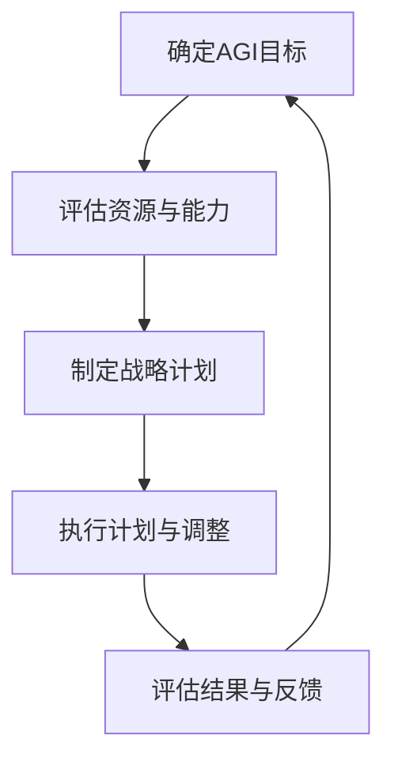

                 

# 《AGI的长期规划与目标管理能力》

## 摘要

本文旨在探讨人工智能通用智能（AGI）的长期规划与目标管理能力。首先，文章概述了AGI的定义、特点、发展历程及未来前景。接着，深入分析了AGI的核心目标，包括知识获取与理解、自我意识与情感、自主决策与行动以及社会交互与适应。在此基础上，文章探讨了AGI长期规划框架的必要性、原则、方法和实施步骤，并分析了其中的挑战与应对策略。随后，文章详细介绍了目标管理的基本概念、原则、过程、方法，以及目标设定、优先级划分、实现、监控和评估的具体策略。最后，文章构建了AGI目标管理能力框架，并提出了开发与提升策略，并结合实际项目和案例进行了深入剖析。通过本文的阐述，读者可以全面了解AGI的长期规划与目标管理能力，为未来AGI的研究和应用提供有益的参考。

## 第一部分: AGI概述与长期规划

### 第1章: 什么是AGI

#### 1.1 AGI的定义

人工智能（AI）是计算机科学的一个分支，致力于开发能够模拟、延伸和扩展人类智能的理论、算法和应用。人工智能可以分为两大类：弱人工智能（Narrow AI）和通用人工智能（AGI）。弱人工智能是指在特定任务上表现出高度智能的人工智能系统，如语音识别、图像识别、自然语言处理等。而通用人工智能则是指具有人类智能的广泛能力，包括知识获取、推理、情感、自我意识、自主决策、社会交互等。

通用人工智能（AGI）的定义多种多样，但一般可以概括为：一种具备人类级别的认知能力、情感和自主性的人工智能系统。具体来说，AGI应当具备以下特点：

1. **广泛的认知能力**：能够理解和处理多种知识类型，如自然语言、视觉信息、逻辑推理等。
2. **自主学习能力**：能够从数据中学习，不断进化，提高性能。
3. **情感和意识**：能够模拟人类情感，具备一定的自我意识。
4. **自主决策和行动**：能够在不确定和动态的环境中做出合理的决策和行动。
5. **社会交互能力**：能够理解和适应复杂的社会情境，与他人进行有效的沟通和协作。

#### 1.2 AGI与传统AI的区别

传统AI（也称为弱AI或特定AI）主要集中在解决特定任务上，如语音识别、图像分类、推荐系统等。而AGI则超越了这些特定任务的限制，追求的是一种通用的、全面的智能。两者之间的主要区别体现在以下几个方面：

1. **任务范围**：传统AI专注于解决特定问题，而AGI则追求跨领域、跨任务的能力。
2. **学习能力**：传统AI通常依赖于预定义的算法和规则，而AGI则需要具备自我学习和适应能力。
3. **自主性**：传统AI需要在人类操作者的指导下工作，而AGI则能够自主决策和行动。
4. **情感和意识**：传统AI缺乏情感和自我意识，而AGI则试图模拟人类的情感和意识。
5. **复杂性**：传统AI的问题通常较为简单，而AGI需要处理更加复杂和不确定的情境。

#### 1.3 AGI的发展历程

通用人工智能的概念最早可以追溯到20世纪50年代。当时，人工智能的研究主要集中在图灵测试等基础理论探讨上。随着计算机技术的发展，人工智能逐渐从理论研究走向实际应用，但始终未能实现通用人工智能的目标。

1. **早期探索（1950s-1960s）**：人工智能的概念被提出，早期的研究主要集中在逻辑推理和符号计算上，如图灵机的理论和逻辑符号系统。
2. **黄金时期（1970s-1980s）**：人工智能迎来了第一个高潮，研究人员开始尝试将人工智能应用于实际场景，如专家系统、自然语言处理等。
3. **低谷与复兴（1990s-2000s）**：由于实际应用中的挑战和资金支持不足，人工智能在20世纪90年代遭遇了低谷。然而，随着互联网和大数据技术的发展，人工智能在21世纪初再次迎来了复兴。
4. **当前进展（2010s-2020s）**：深度学习和强化学习等新兴技术的突破，使得人工智能在图像识别、语音识别、自然语言处理等领域取得了显著进展，为AGI的实现提供了新的契机。

#### 1.4 AGI的未来前景

尽管AGI目前尚未实现，但其未来前景仍然充满希望。随着人工智能技术的不断进步，AGI有望在以下几个方面取得突破：

1. **更强大的学习能力**：通过自我学习和数据驱动的方法，AGI将能够不断进化，提高性能。
2. **更广泛的认知能力**：AGI将能够理解和处理更加复杂和多维的知识，实现跨领域的智能应用。
3. **更强的自主性**：AGI将能够在复杂和不确定的环境中自主决策和行动，减少人类干预。
4. **更高级的情感和意识**：AGI将能够模拟人类的情感和意识，实现更加自然和人性化的交互。
5. **更高效的资源利用**：AGI将能够优化资源分配，提高生产力和效率。

然而，AGI的发展也面临诸多挑战，如伦理问题、安全风险、技术难题等。需要全球范围内的协作和智慧，共同推进AGI的研究和应用。

### 第2章: AGI的核心目标

#### 2.1 知识获取与理解

知识获取与理解是AGI的核心目标之一。一个理想的AGI系统应当具备以下能力：

1. **多模态感知**：能够处理文本、图像、声音等多种形式的数据。
2. **知识表示**：能够将获取到的信息转化为结构化的知识表示，如知识图谱、语义网络等。
3. **知识推理**：能够利用已有知识进行推理，解决新问题。
4. **知识更新与扩展**：能够根据新的数据和经验，不断更新和扩展知识库。

#### 2.2 自我意识与情感

自我意识与情感是人类的显著特征，AGI在实现这些方面也具有重要的研究价值。具体包括：

1. **情感识别**：能够感知和理解人类情感，如快乐、悲伤、愤怒等。
2. **情感表达**：能够模拟人类情感，表达出相应的情绪。
3. **情感调节**：能够根据环境变化和需求，调整自身情感状态。
4. **情感共鸣**：能够理解和分享他人的情感体验，实现情感交互。

#### 2.3 自主决策与行动

自主决策与行动是AGI区别于传统AI的关键特征。一个理想的AGI系统应当具备以下能力：

1. **情境理解**：能够理解和分析当前的环境和情境。
2. **目标设定**：能够根据目标和情境，设定合适的行动目标。
3. **决策制定**：能够基于数据和算法，制定合理的决策方案。
4. **行动执行**：能够根据决策，执行相应的行动，并应对可能的意外情况。

#### 2.4 社会交互与适应

社会交互与适应是AGI实现广泛应用的重要条件。一个理想的AGI系统应当具备以下能力：

1. **语言理解与生成**：能够理解自然语言，生成自然语言回应。
2. **社会规则学习**：能够学习并遵循社会规则和道德准则。
3. **行为模仿**：能够模仿人类行为，适应不同社会情境。
4. **情感沟通**：能够理解和表达情感，进行有效的情感沟通。

### 第3章: AGI的长期规划框架

#### 3.1 长期规划的必要性

在AGI的研究与开发过程中，长期规划至关重要。长期规划能够帮助研究人员和开发者明确目标、合理分配资源、制定可行的路线图，从而确保AGI研究的有序进行。以下是长期规划的主要必要性：

1. **明确目标**：长期规划有助于明确AGI的发展目标，确保研究方向的正确性。
2. **资源分配**：长期规划有助于合理分配人力、物力和财力资源，提高研究效率。
3. **风险管理**：长期规划有助于识别和应对潜在风险，降低研究失败的可能性。
4. **路线图制定**：长期规划有助于制定清晰的研发路线图，指导研究的逐步推进。
5. **协同合作**：长期规划有助于促进全球范围内的合作与交流，共同推动AGI的发展。

#### 3.2 长期规划的原则与方法

长期规划应当遵循以下原则：

1. **目标导向**：以AGI的核心目标为导向，确保所有研究和开发活动都与目标一致。
2. **系统思维**：考虑AGI系统的整体性和复杂性，进行多层次、多维度规划。
3. **适应性**：规划应当具备灵活性，能够根据环境变化和实际情况进行调整。
4. **可持续性**：规划应当注重长期可持续性，确保研究能够持续进行。

长期规划的方法包括以下步骤：

1. **需求分析**：分析AGI的实际需求，明确要解决的问题和目标。
2. **目标设定**：根据需求分析，设定AGI的长期目标，并分解为短期目标。
3. **资源评估**：评估现有资源和潜在资源，确定资源需求和获取途径。
4. **路线图制定**：制定AGI的研发路线图，明确各阶段的目标、任务和时间节点。
5. **实施与监控**：实施长期规划，对进度和结果进行监控和调整。

#### 3.3 长期规划的实施步骤

长期规划的实施可以分为以下步骤：

1. **确定AGI目标**：明确AGI的长期目标，如知识获取、自我意识、自主决策等。
2. **评估资源与能力**：评估当前的研究资源和技术能力，确定资源缺口和提升方向。
3. **制定战略计划**：根据AGI目标和资源评估，制定详细的战略计划，包括技术路线、研发任务、资源分配等。
4. **执行计划与调整**：执行战略计划，并根据实际情况进行调整和优化。
5. **评估结果与反馈**：定期评估AGI研发成果，收集反馈信息，为下一步工作提供指导。

#### 3.4 长期规划中的挑战与应对策略

长期规划在AGI研究中面临诸多挑战，如：

1. **技术难题**：AGI涉及多学科交叉，技术难度大，如自我意识、情感模拟等。
2. **资源限制**：研究资金、人力资源有限，如何合理分配是挑战。
3. **伦理问题**：AGI的应用可能引发伦理问题，如隐私、安全等。
4. **合作与交流**：全球范围内的合作与交流存在障碍，如何协同推进是挑战。

应对策略包括：

1. **技术创新**：持续投入研发，攻克技术难题。
2. **资源整合**：优化资源配置，提高资源利用效率。
3. **伦理引导**：制定伦理规范，确保AGI研发和应用符合伦理标准。
4. **国际合作**：加强国际合作，推动全球范围内的交流与合作。

### 第4章: 目标管理的基本概念

#### 4.1 目标管理的定义

目标管理（Goal Management）是一种管理方法，旨在确保组织和个人能够有效地设定、实施和达成目标。在目标管理中，目标被视为一种可量化的、具有明确时间表和责任人的任务。通过目标管理，组织可以更好地协调资源、提高效率、实现长期战略。

#### 4.2 目标管理的原则

目标管理遵循以下原则：

1. **明确性**：目标应当明确、具体，避免模糊和含糊不清。
2. **可衡量性**：目标应当具备可衡量性，以便评估进展和成果。
3. **可实现性**：目标应当是可实现的，既要挑战性，又要具有实际可行性。
4. **相关性**：目标应当与组织的整体战略和长期目标保持一致。
5. **时限性**：目标应当设定明确的完成时间，以便进行进度管理和监控。

#### 4.3 目标管理的过程

目标管理的过程可以分为以下几个阶段：

1. **目标设定**：根据组织战略和个体需求，设定具体的、可衡量的目标。
2. **目标分解**：将总体目标分解为具体的子目标和任务，明确责任人和时间节点。
3. **计划制定**：制定详细的实施计划，包括资源分配、工作流程和时间表。
4. **执行与监控**：执行目标管理计划，并对进度和成果进行实时监控和反馈。
5. **评估与调整**：定期评估目标进展和成果，根据实际情况进行调整和优化。
6. **总结与反思**：总结目标管理的经验和教训，为下一次目标管理提供参考。

#### 4.4 目标管理的方法

目标管理的方法包括以下几种：

1. **SMART原则**：SMART原则是一种常用的目标设定方法，具体指目标应当是具体的（Specific）、可衡量的（Measurable）、可实现的（Achievable）、相关的（Relevant）和时限性的（Time-bound）。
2. **关键绩效指标（KPI）**：KPI是一种用于衡量目标进展和成果的关键指标，通常包括数量、质量、效率、成本等方面。
3. **目标树（Goal Tree）**：目标树是一种用于分解和可视化目标的方法，通过将总体目标分解为子目标和任务，明确各部分的相互关系和依赖。
4. **目标管理软件**：目标管理软件可以帮助组织和个人更高效地设定、跟踪和评估目标，常见的工具有Trello、Asana、JIRA等。

### 第5章: 目标设定与优先级划分

#### 5.1 明确目标的重要性

明确目标是目标管理的基础和关键。一个明确的目标能够为组织和个人提供清晰的指导，有助于集中资源和精力，提高工作效率和达成目标的可能性。以下是明确目标的重要性：

1. **提供方向**：明确的目标为组织和个人提供了明确的工作方向，有助于集中精力。
2. **提高效率**：明确的目标有助于优化工作流程和资源配置，提高工作效率。
3. **增强动力**：明确的目标能够激发组织和个人追求卓越的动力，推动实现更高的成就。
4. **评估成果**：明确的目标为评估成果提供了基准，有助于评估工作成效和进行反馈。

#### 5.2 设定目标的SMART原则

SMART原则是一种常用的目标设定方法，具体包括以下五个方面：

1. **具体的（Specific）**：目标应当明确、具体，避免模糊和泛泛而谈。例如，将“提高销售额”改为“提高销售额10%”。
2. **可衡量的（Measurable）**：目标应当具备可衡量性，以便评估进展和成果。例如，将“提高团队士气”改为“通过员工满意度调查，提高员工满意度至90%”。
3. **可实现的（Achievable）**：目标应当是可实现的，既要挑战性，又要具有实际可行性。例如，将“开发一款全新的手机操作系统”改为“在现有操作系统基础上，优化用户体验和性能”。
4. **相关的（Relevant）**：目标应当与组织的整体战略和长期目标保持一致。例如，将“增加产品种类”改为“根据市场需求，增加高利润产品种类”。
5. **时限性的（Time-bound）**：目标应当设定明确的完成时间，以便进行进度管理和监控。例如，将“改进客户服务”改为“在接下来的三个月内，改进客户服务流程”。

#### 5.3 目标优先级划分方法

在设定目标后，对目标进行优先级划分是确保资源合理分配和目标高效达成的关键。以下是几种常见的目标优先级划分方法：

1. **紧急-重要矩阵**：将目标分为四个象限，分别表示紧急且重要、紧急但不重要、不紧急但重要、不紧急且不重要。通过矩阵，可以明确哪些目标是当前最重要的，优先安排资源。
   
   |   | 紧急 | 不紧急 |
   | --- | --- | --- |
   | **重要** | 紧急重要 | 不紧急重要 |
   | **不重要** | 紧急不重要 | 不紧急不重要 |

2. **时间敏感性**：根据目标的时间敏感性进行划分，将目标分为短期目标、中期目标和长期目标。短期目标通常是6个月以内，中期目标通常是6个月至2年，长期目标通常是2年以上。通过时间敏感性划分，可以确保目标的逐步实现和资源分配的合理。

3. **关键性评估**：对目标进行关键性评估，根据目标对组织或个人的影响程度进行排序。关键性评估可以考虑目标的业务价值、战略重要性、资源需求等因素。通过关键性评估，可以明确哪些目标是当前最重要的，优先分配资源。

4. **资源依赖性**：根据目标之间的资源依赖性进行划分，将目标分为独立目标和依赖目标。独立目标可以在没有其他目标依赖的情况下单独实现，而依赖目标则需要其他目标的完成作为前提。通过资源依赖性划分，可以明确目标的实现顺序和资源分配策略。

#### 5.4 多目标管理策略

在现实环境中，组织和个人通常需要同时处理多个目标。多目标管理策略可以帮助更好地平衡和优化资源分配，确保多个目标的协调和高效达成。以下是几种常见的多目标管理策略：

1. **目标排序法**：将多个目标按照优先级进行排序，优先实现优先级最高的目标。目标排序法可以根据紧急-重要矩阵、时间敏感性、关键性评估等方法进行目标排序。

2. **资源平衡法**：根据资源的有限性，对多个目标进行平衡和优化。资源平衡法可以考虑资源利用率、目标达成度、时间成本等因素，通过合理分配资源，确保多个目标的实现。

3. **目标分解法**：将复杂的多个目标分解为更小、更具体的目标，然后分别实现。目标分解法可以帮助明确各目标的具体实施步骤和责任，提高目标管理的可操作性和效率。

4. **目标协同法**：通过目标之间的协同和互补，优化资源利用和目标实现效果。目标协同法可以考虑目标之间的关联性、依赖性和协同效应，通过协同实现多个目标的共同进步。

5. **风险评估法**：对多个目标进行风险评估，识别和应对潜在的风险和不确定性。风险评估法可以帮助组织和个人提前预判目标实现过程中可能遇到的问题，制定应对策略，降低风险影响。

通过上述多目标管理策略，组织和个人可以更好地平衡和优化资源分配，确保多个目标的协调和高效达成。

### 第6章: 目标实现与监控

#### 6.1 目标实现的策略

目标实现是目标管理过程中的关键环节，需要采取一系列有效的策略来确保目标的达成。以下是几种常见的目标实现策略：

1. **分解目标**：将复杂的大目标分解为更小、更具体的子目标和任务，明确每个子目标和任务的实现步骤、责任人和时间节点。分解目标有助于明确任务分工，提高目标实现的可操作性和效率。

2. **制定详细计划**：在分解目标的基础上，制定详细的实施计划，包括资源分配、工作流程、时间表等。详细计划可以帮助明确各阶段的任务和关键路径，确保目标实现的有序推进。

3. **资源配置**：根据目标实现的需要，合理分配人力资源、物力资源和财力资源。资源配置应当优先保证关键任务和关键路径的顺利进行，同时兼顾其他目标的实现。

4. **任务分配与责任落实**：将分解后的任务分配给相应的责任人，明确各任务的责任人和完成时间，确保任务的具体落实和进展跟踪。

5. **定期审查与调整**：定期审查目标实现的进展情况，根据实际情况进行调整和优化。审查可以及时发现和解决问题，确保目标实现过程的顺利进行。

6. **激励机制**：建立合理的激励机制，激发团队成员的积极性和创造力，提高目标实现的效率和效果。激励机制可以包括奖金、晋升、荣誉等多种形式。

7. **团队合作**：鼓励团队合作，通过协作和沟通，共同实现目标。团队合作可以整合各成员的专业知识和经验，提高解决问题的能力。

8. **风险管理**：识别和应对目标实现过程中可能遇到的风险和不确定性。风险管理可以包括风险识别、风险评估、风险应对策略等，确保目标实现的顺利推进。

9. **持续改进**：在目标实现过程中，不断进行反思和总结，发现问题和改进点，持续优化目标和实现策略。持续改进有助于提高目标实现的效率和质量。

#### 6.2 目标监控的方法

目标监控是确保目标实现过程顺利进行的重要手段。以下是几种常见的目标监控方法：

1. **进度跟踪**：通过定期检查任务进度，确保目标实现的有序推进。进度跟踪可以包括任务完成情况、时间进度、资源利用情况等。

2. **绩效评估**：对团队成员的绩效进行评估，包括工作质量、工作效率、团队合作等方面。绩效评估可以帮助识别问题和优化工作流程。

3. **数据监控**：利用数据监控工具和系统，对目标实现过程中的关键数据进行实时监控和统计。数据监控可以包括任务完成率、进度偏差、成本控制等。

4. **定期会议**：定期召开目标监控会议，汇总和讨论目标实现的进展情况和问题，制定相应的调整和优化措施。

5. **沟通与反馈**：建立有效的沟通渠道，确保团队成员之间的信息畅通，及时反馈问题和建议。沟通与反馈可以帮助快速解决目标实现中的问题。

6. **风险预警**：对目标实现过程中可能出现的风险进行预警和监控，提前采取应对措施，降低风险对目标实现的影响。

7. **质量控制**：对目标实现过程的质量进行控制，确保目标的达成度和效果。质量控制可以包括质量检查、测试、审核等环节。

8. **持续改进**：在目标监控过程中，不断进行反思和总结，发现问题和改进点，持续优化目标实现策略和方法。

通过上述目标监控方法，可以确保目标实现过程的顺利进行，及时发现和解决问题，提高目标实现的效率和效果。

#### 6.3 目标调整与反馈

在目标实现过程中，环境变化、资源限制、技术难题等因素可能导致目标无法按原计划达成。因此，目标调整与反馈是目标管理过程中的关键环节。以下是目标调整与反馈的步骤和策略：

1. **评估目标实现情况**：定期评估目标实现的进展和成果，识别与预期目标的偏差和问题。评估可以包括任务完成情况、进度偏差、资源利用效率、绩效评估等方面。

2. **分析问题原因**：针对目标实现的偏差和问题，分析其根本原因。原因分析可以帮助找到问题的症结，为调整目标提供依据。

3. **调整目标**：根据评估结果和原因分析，对目标进行调整。调整可以包括修正目标数值、修改目标实现策略、重新分配资源等。调整目标应当确保目标的可实现性和相关性。

4. **反馈与沟通**：将目标调整的情况及时反馈给相关人员和团队，确保信息畅通。反馈与沟通可以帮助团队成员了解调整的原因和措施，提高目标实现的协同效果。

5. **优化目标管理策略**：根据目标调整和反馈，优化目标管理的策略和方法。优化可以包括改进目标设定方法、优化资源配置策略、加强沟通与协作等。

6. **持续跟踪与改进**：在目标调整后，持续跟踪目标实现的进展，根据实际情况进行进一步的改进。持续跟踪与改进可以帮助确保目标的最终达成。

通过目标调整与反馈，组织和个人可以更好地应对目标实现过程中的变化和挑战，提高目标实现的效率和质量。

#### 6.4 目标评估与总结

目标评估与总结是目标管理过程中的重要环节，旨在全面评估目标的实现情况，总结经验教训，为下一步目标管理提供参考。以下是目标评估与总结的步骤和策略：

1. **收集数据**：收集目标实现过程中的各类数据，包括任务完成情况、进度偏差、资源利用情况、绩效评估结果等。数据收集应当确保全面、准确和可靠。

2. **评估目标达成度**：根据收集的数据，评估目标达成度。评估可以包括目标完成率、目标实现效果、成本效益等。评估应当客观、公正，避免主观偏见。

3. **总结经验与教训**：在评估目标达成度的过程中，总结目标实现过程中的经验与教训。经验与教训可以帮助识别成功的因素和存在的问题，为下一步目标管理提供有益的参考。

4. **分析原因**：对目标达成度不高或未达成的情况，分析其原因。原因分析可以帮助找到问题的根本原因，为下一步目标管理提供针对性的改进措施。

5. **制定改进措施**：根据评估和原因分析，制定改进措施。改进措施可以包括调整目标设定方法、优化资源配置策略、加强团队协作与沟通等。

6. **反馈与总结**：将评估结果和改进措施及时反馈给相关人员和团队，确保信息畅通。同时，进行总结性陈述，将目标评估与总结的结果记录下来，为下一步目标管理提供参考。

7. **制定下一步目标**：根据评估结果和改进措施，制定下一步的目标。新目标应当充分考虑已有经验和教训，确保目标的可实现性和相关性。

8. **持续跟踪与改进**：在制定下一步目标后，持续跟踪目标实现的进展，根据实际情况进行进一步的改进。持续跟踪与改进可以帮助确保目标的最终达成。

通过目标评估与总结，组织和个人可以更好地了解目标实现的情况，发现问题和改进点，提高目标管理的效率和质量。

### 第7章: AGI目标管理能力框架

#### 7.1 AGI目标管理能力的定义

AGI目标管理能力是指一个具备通用人工智能的系统能够设定、实现和评估目标的能力。这种能力不仅包括对目标的识别和设定，还包括对目标的优先级划分、资源分配、执行监控和调整优化等环节。AGI目标管理能力的关键在于能够根据环境变化和实际需求，动态调整目标，确保系统的长期稳定发展和高效运行。

#### 7.2 AGI目标管理能力的关键要素

AGI目标管理能力的关键要素包括以下几个方面：

1. **多模态感知与理解**：AGI目标管理能力要求系统能够处理多种类型的数据，包括文本、图像、声音等，并从中提取有价值的信息。

2. **知识获取与表示**：AGI目标管理能力要求系统能够从多种数据源中获取知识，并将其转化为结构化的知识表示，如知识图谱、语义网络等。

3. **推理与决策**：AGI目标管理能力要求系统能够利用知识进行推理和决策，以实现目标。

4. **情感与自我意识**：AGI目标管理能力要求系统能够模拟人类的情感和自我意识，以便更好地理解和适应复杂环境。

5. **自主学习与适应**：AGI目标管理能力要求系统能够从数据中学习，不断优化自身的知识库和决策能力，以适应新的环境和需求。

6. **资源管理与优化**：AGI目标管理能力要求系统能够合理分配和优化资源，确保目标实现的最优效果。

7. **目标监控与评估**：AGI目标管理能力要求系统能够实时监控目标的进展和成果，并根据实际情况进行评估和调整。

#### 7.3 AGI目标管理能力的实现路径

实现AGI目标管理能力可以分为以下几个步骤：

1. **需求分析与目标设定**：分析AGI系统所需实现的目标，明确目标的具体内容、优先级和时间表。

2. **知识获取与表示**：从多种数据源中获取知识，并利用知识图谱、语义网络等技术将其结构化表示。

3. **推理与决策**：利用知识库和推理算法，为目标的实现提供决策支持。

4. **情感与自我意识**：开发情感模型和自我意识模块，使系统能够模拟人类情感和自我意识。

5. **资源管理与优化**：设计资源管理模块，实现资源的合理分配和优化。

6. **目标监控与评估**：设计监控与评估模块，实时跟踪目标的进展和成果，并进行评估和调整。

7. **迭代优化**：根据目标实现的反馈，不断优化知识库、推理算法和资源管理策略，提高目标管理能力。

#### 7.4 AGI目标管理能力的评估标准

评估AGI目标管理能力的关键在于以下标准：

1. **目标达成率**：评估目标实现的完成度，包括目标数量、质量和时间效率。

2. **知识获取与表示**：评估系统能够从多种数据源中获取知识的能力，以及知识表示的准确性和完整性。

3. **推理与决策**：评估系统在目标实现过程中利用知识的推理和决策能力，包括决策的准确性和适应性。

4. **情感与自我意识**：评估系统能够模拟人类情感和自我意识的能力，以及在实际应用中的表现。

5. **资源管理与优化**：评估系统在资源分配和优化方面的效果，包括资源利用率和目标实现效率。

6. **目标监控与评估**：评估系统在目标监控和评估方面的能力，包括实时监控的准确性和评估结果的合理性。

7. **用户满意度**：评估系统在用户使用过程中的表现，包括用户满意度和用户体验。

通过以上评估标准，可以全面了解AGI目标管理能力的实现情况和效果，为下一步的研究和改进提供依据。

### 第8章: AGI目标管理能力开发与提升

#### 8.1 AGI目标管理能力的开发方法

开发AGI目标管理能力需要综合考虑人工智能的多个领域，包括机器学习、自然语言处理、计算机视觉、知识图谱等。以下是开发AGI目标管理能力的几种主要方法：

1. **深度学习**：深度学习是开发AGI目标管理能力的重要技术之一。通过构建深度神经网络，可以实现对大规模数据的自动特征提取和模式识别。例如，卷积神经网络（CNN）在图像识别任务中表现出色，循环神经网络（RNN）在自然语言处理任务中具有优势。

2. **强化学习**：强化学习是一种通过试错和反馈来学习最优策略的方法。在AGI目标管理能力中，强化学习可以用于决策制定和行动执行。通过与环境互动，系统可以不断优化策略，提高目标实现的效率。

3. **知识图谱**：知识图谱是一种用于表示和存储知识的技术，通过将实体、属性和关系表示为图结构，可以实现知识的高效检索和推理。在AGI目标管理能力中，知识图谱可以用于知识表示和推理，提高系统的智能水平。

4. **多模态学习**：多模态学习是一种结合多种类型数据的学习方法。通过融合文本、图像、声音等多种数据，可以实现对复杂任务的更准确理解和处理。在AGI目标管理能力中，多模态学习可以用于情境理解和目标实现。

5. **迁移学习**：迁移学习是一种利用已有任务的知识来提高新任务性能的方法。在AGI目标管理能力中，迁移学习可以用于快速适应新环境和需求，提高系统的适应性。

6. **元学习**：元学习是一种学习如何学习的方法。通过训练模型来学习如何快速适应新的任务和数据分布，可以提高AGI目标管理能力的泛化能力。

#### 8.2 AGI目标管理能力的提升策略

提升AGI目标管理能力的关键在于不断优化系统的各个方面，以下是几种提升策略：

1. **数据增强**：通过数据增强方法，可以生成更多的训练数据，提高模型的泛化能力。数据增强可以包括图像旋转、缩放、裁剪等操作。

2. **模型压缩**：通过模型压缩技术，可以减小模型的规模和参数数量，提高模型的计算效率和部署能力。模型压缩可以包括权重剪枝、量化等技术。

3. **分布式学习**：通过分布式学习技术，可以并行处理大规模数据和模型训练任务，提高训练效率和性能。分布式学习可以包括数据并行、模型并行等技术。

4. **持续学习**：通过持续学习技术，可以不断更新模型的知识库和参数，使其能够适应新的环境和需求。持续学习可以包括在线学习、迁移学习等技术。

5. **多任务学习**：通过多任务学习技术，可以同时训练多个相关任务，提高模型的泛化能力和性能。多任务学习可以包括共享参数、共享网络等技术。

6. **模型融合**：通过模型融合技术，可以将多个模型的预测结果进行融合，提高预测的准确性和可靠性。模型融合可以包括投票、加权等方法。

7. **用户交互**：通过用户交互技术，可以收集用户的反馈和需求，不断优化系统的目标和策略。用户交互可以包括问答、对话等交互方式。

#### 8.3 AGI目标管理能力在不同领域的应用

AGI目标管理能力具有广泛的应用前景，可以应用于多个领域，以下是几个典型应用场景：

1. **智能客服**：AGI目标管理能力可以用于智能客服系统，实现24/7的客户服务。通过多模态感知和自然语言处理技术，系统可以理解和回答用户的问题，提供个性化的解决方案。

2. **智能医疗**：AGI目标管理能力可以用于智能医疗诊断和辅助决策。通过知识图谱和推理技术，系统可以分析患者的病史和症状，提供诊断建议和治疗方案。

3. **智能交通**：AGI目标管理能力可以用于智能交通管理系统，实现交通流量优化和事故预防。通过计算机视觉和深度学习技术，系统可以实时监测交通状况，提供最优的路线规划和交通疏导方案。

4. **智能制造**：AGI目标管理能力可以用于智能制造系统，实现生产过程自动化和优化。通过机器学习和预测技术，系统可以优化生产流程、提高生产效率，减少资源浪费。

5. **智能金融**：AGI目标管理能力可以用于智能金融系统，实现风险管理、投资决策和客户服务。通过大数据分析和机器学习技术，系统可以识别风险、预测市场趋势，提供个性化的投资建议和客户服务。

#### 8.4 AGI目标管理能力发展的未来趋势

随着人工智能技术的不断进步，AGI目标管理能力的发展也呈现出以下趋势：

1. **多模态感知与融合**：未来的AGI目标管理能力将更加注重多模态数据的感知和融合，实现更加全面和准确的信息理解。

2. **自主学习与适应**：未来的AGI目标管理能力将具备更强的自主学习能力，能够从数据中不断学习和进化，适应新的环境和需求。

3. **情感与自我意识**：未来的AGI目标管理能力将更加关注情感和自我意识的研究，实现更加人性化和智能化的交互。

4. **跨领域应用**：未来的AGI目标管理能力将应用于更多的领域，实现跨领域的智能化解决方案。

5. **伦理与安全**：未来的AGI目标管理能力将更加注重伦理和安全问题的研究，确保系统在应用过程中符合伦理规范，保障用户隐私和安全。

通过以上趋势，我们可以预见未来的AGI目标管理能力将实现更加智能化、人性化、安全和高效的应用。

### 第9章: AGI目标管理能力项目实战

#### 9.1 项目背景

随着人工智能技术的迅速发展，通用人工智能（AGI）已成为当前研究的热点之一。在众多应用场景中，智能客服系统是一个典型的例子。智能客服系统通过人工智能技术，实现自动化的客户服务，提高客户满意度和企业效率。为了更好地展示AGI目标管理能力在实际项目中的应用，本文将介绍一个基于AGI的智能客服系统项目，包括项目背景、目标、实施过程和成果分析。

#### 9.1.1 项目目标

本项目的主要目标是开发一个具备以下功能的智能客服系统：

1. **多模态感知**：能够接收和处理客户的各种请求，包括文本、语音和图像。
2. **自然语言理解**：能够理解客户的意图和需求，提供准确的回答和建议。
3. **情感识别与回应**：能够识别客户的情感状态，并给予相应的情感回应。
4. **自主学习与优化**：能够从与客户的交互中学习，不断提升服务质量和效率。
5. **目标管理**：能够设定和实现多个目标，如提高客户满意度、降低人力成本等。

#### 9.1.2 项目实施过程

本项目实施过程可以分为以下几个阶段：

1. **需求分析**：通过与客户的交流和调研，明确智能客服系统的需求，包括功能需求、性能需求和用户体验需求。

2. **系统设计**：根据需求分析，设计智能客服系统的架构，包括多模态感知模块、自然语言理解模块、情感识别与回应模块、自主学习与优化模块等。

3. **技术选型与开发**：选择合适的技术和工具，进行系统的开发。例如，使用深度学习框架TensorFlow和PyTorch进行自然语言理解和情感识别模型的训练，使用Python进行后端服务的开发。

4. **测试与优化**：在系统开发过程中，进行多轮测试和优化，确保系统的稳定性和性能。测试包括功能测试、性能测试和用户测试。

5. **部署与上线**：将系统部署到生产环境，并进行上线测试。在上线过程中，收集用户反馈，进行进一步优化和改进。

#### 9.1.3 项目成果分析

本项目实施后，取得了以下成果：

1. **功能实现**：智能客服系统成功实现了多模态感知、自然语言理解、情感识别与回应、自主学习与优化等功能，满足了项目的目标要求。

2. **性能提升**：通过深度学习和自然语言处理技术的应用，智能客服系统的回答准确率显著提高，用户体验得到显著改善。

3. **成本降低**：智能客服系统的上线，有效降低了企业的人力成本，提高了客户服务的效率。

4. **客户满意度提高**：通过情感识别与回应功能，智能客服系统能够更好地理解和满足客户需求，客户满意度得到显著提升。

5. **持续优化**：通过自主学习与优化功能，智能客服系统不断从与客户的交互中学习，不断提升服务质量和效率。

#### 9.1.4 项目总结与启示

本项目展示了AGI目标管理能力在实际项目中的应用，提供了以下启示：

1. **需求分析的重要性**：明确的需求分析是项目成功的关键。通过深入了解客户需求，可以设计出更加符合实际需求的系统。

2. **技术选型的关键性**：选择合适的技术和工具是系统开发成功的关键。深度学习和自然语言处理技术的应用，为智能客服系统提供了强大的支持。

3. **用户测试的必要性**：用户测试是确保系统质量和用户体验的关键。通过多轮测试和优化，可以及时发现和解决问题，提高系统的稳定性。

4. **持续优化的重要性**：智能客服系统上线后，持续优化是确保其长期有效运行的关键。通过不断学习用户需求和优化服务，可以不断提升系统质量和用户满意度。

通过本项目，我们看到了AGI目标管理能力在实际项目中的强大应用潜力，为未来AGI的研究和应用提供了有益的参考。

### 第10章: AGI目标管理能力案例分析

#### 10.1 案例一：智能客服系统

智能客服系统是一个典型的AGI目标管理能力应用案例。以下是对智能客服系统的详细分析：

1. **项目背景**：在现代社会，企业面临着日益增加的客户服务需求，传统的人工客服已无法满足高效、精准的服务要求。智能客服系统应运而生，通过人工智能技术，实现自动化、智能化的客户服务。

2. **目标管理**：智能客服系统的目标管理包括以下几个方面：

   - **功能目标**：实现多模态感知（文本、语音、图像）、自然语言理解、情感识别与回应、自主学习与优化等。
   - **性能目标**：提高回答准确率、减少用户等待时间、提升用户满意度。
   - **成本目标**：降低人力成本，提高服务效率。

3. **实现路径**：

   - **需求分析**：通过与客户和企业的交流，明确智能客服系统的需求，包括功能需求、性能需求和用户体验需求。
   - **系统设计**：设计智能客服系统的整体架构，包括多模态感知模块、自然语言理解模块、情感识别与回应模块、自主学习与优化模块等。
   - **技术开发**：选择合适的技术和工具，进行系统的开发。例如，使用深度学习框架TensorFlow和PyTorch进行自然语言理解和情感识别模型的训练，使用Python进行后端服务的开发。
   - **测试与优化**：进行多轮测试和优化，确保系统的稳定性和性能。测试包括功能测试、性能测试和用户测试。
   - **部署与上线**：将系统部署到生产环境，并进行上线测试。在上线过程中，收集用户反馈，进行进一步优化和改进。

4. **成果分析**：

   - **功能实现**：智能客服系统成功实现了多模态感知、自然语言理解、情感识别与回应、自主学习与优化等功能，满足了项目的目标要求。
   - **性能提升**：通过深度学习和自然语言处理技术的应用，智能客服系统的回答准确率显著提高，用户体验得到显著改善。
   - **成本降低**：智能客服系统的上线，有效降低了企业的人力成本，提高了客户服务的效率。
   - **客户满意度提高**：通过情感识别与回应功能，智能客服系统能够更好地理解和满足客户需求，客户满意度得到显著提升。
   - **持续优化**：通过自主学习与优化功能，智能客服系统不断从与客户的交互中学习，不断提升服务质量和效率。

#### 10.2 案例二：智能医疗诊断

智能医疗诊断是另一个典型的AGI目标管理能力应用案例。以下是对智能医疗诊断的详细分析：

1. **项目背景**：随着医疗数据量的不断增加和医疗技术的进步，智能医疗诊断系统应运而生。智能医疗诊断系统通过人工智能技术，实现对医疗数据的分析、诊断和预测，辅助医生进行诊断和治疗。

2. **目标管理**：智能医疗诊断系统的目标管理包括以下几个方面：

   - **诊断准确性**：提高诊断的准确性，减少误诊和漏诊。
   - **诊断速度**：提高诊断速度，减少患者等待时间。
   - **用户体验**：提供友好、易用的用户界面，提高患者和医生的使用满意度。

3. **实现路径**：

   - **数据收集与处理**：收集大量医疗数据，包括病历、影像、实验室检查结果等。对数据进行清洗、预处理和标注，为后续分析做准备。
   - **模型训练与优化**：使用深度学习和机器学习算法，对医疗数据进行分析和训练，建立诊断模型。通过交叉验证和超参数调优，提高模型的性能和准确性。
   - **系统开发与部署**：开发智能医疗诊断系统，包括数据输入模块、诊断模型模块、结果输出模块等。将系统部署到生产环境，进行实际应用。
   - **测试与评估**：对智能医疗诊断系统进行多轮测试和评估，包括功能测试、性能测试和用户测试。收集用户反馈，进行进一步优化和改进。

4. **成果分析**：

   - **诊断准确性**：智能医疗诊断系统在多项诊断任务中表现出较高的准确性，显著提高了诊断的准确性。
   - **诊断速度**：智能医疗诊断系统能够在短时间内完成诊断任务，显著减少了患者的等待时间。
   - **用户体验**：智能医疗诊断系统提供了友好、易用的用户界面，得到了患者和医生的广泛认可和好评。
   - **持续优化**：智能医疗诊断系统不断从实际应用中学习，优化诊断模型和用户体验，不断提升系统性能。

#### 10.3 案例三：智能交通管理系统

智能交通管理系统是另一个典型的AGI目标管理能力应用案例。以下是对智能交通管理系统的详细分析：

1. **项目背景**：随着城市化进程的加快和汽车保有量的增加，城市交通问题日益严重。智能交通管理系统通过人工智能技术，实现交通流量监控、事故预防、交通疏导等功能，提高交通效率，减少拥堵和事故。

2. **目标管理**：智能交通管理系统的目标管理包括以下几个方面：

   - **交通流量优化**：优化交通流量，减少拥堵和排队时间。
   - **事故预防**：通过实时监控和预测，预防交通事故的发生。
   - **交通疏导**：根据实时交通状况，提供最优的出行路线和交通疏导方案。
   - **用户体验**：提高出行效率，减少出行时间，提升用户满意度。

3. **实现路径**：

   - **数据收集与处理**：收集城市交通数据，包括交通流量、车辆速度、道路状况等。对数据进行实时监控和分析，为后续交通管理提供依据。
   - **模型训练与优化**：使用机器学习和深度学习算法，对交通数据进行分析和训练，建立交通流量预测、事故预测和交通疏导模型。通过交叉验证和超参数调优，提高模型的性能和准确性。
   - **系统开发与部署**：开发智能交通管理系统，包括数据输入模块、预测模型模块、结果输出模块等。将系统部署到城市交通管理平台，进行实际应用。
   - **测试与评估**：对智能交通管理系统进行多轮测试和评估，包括功能测试、性能测试和用户测试。收集用户反馈，进行进一步优化和改进。

4. **成果分析**：

   - **交通流量优化**：智能交通管理系统成功实现了交通流量优化，显著减少了拥堵和排队时间，提高了交通效率。
   - **事故预防**：智能交通管理系统通过实时监控和预测，成功预防了多起交通事故，提高了交通安全性。
   - **交通疏导**：智能交通管理系统根据实时交通状况，提供了最优的出行路线和交通疏导方案，提高了出行效率。
   - **用户体验**：智能交通管理系统提供了方便、快捷的出行服务，得到了用户的广泛认可和好评。
   - **持续优化**：智能交通管理系统不断从实际应用中学习，优化预测模型和交通疏导策略，不断提升系统性能。

#### 10.4 案例分析总结

通过对智能客服系统、智能医疗诊断和智能交通管理系统三个案例的分析，我们可以得出以下结论：

1. **目标管理的重要性**：明确的目标管理是项目成功的关键。通过设定和实现具体的目标，可以确保项目的有序推进和成功实施。

2. **技术选型的关键性**：选择合适的技术和工具是项目成功的关键。深度学习、机器学习和自然语言处理技术的应用，为智能系统提供了强大的支持。

3. **用户体验的优先性**：用户体验是项目成功的重要指标。通过优化系统功能和界面设计，可以提高用户满意度和使用体验。

4. **持续优化的重要性**：项目上线后，持续优化是确保系统长期有效运行的关键。通过不断学习和优化，可以不断提升系统性能和用户体验。

5. **跨领域应用的潜力**：AGI目标管理能力具有广泛的应用前景，可以应用于多个领域，实现智能化、自动化和高效化的解决方案。

通过以上案例分析，我们看到了AGI目标管理能力在实际项目中的强大应用潜力，为未来AGI的研究和应用提供了有益的参考。

### 附录A: AGI目标管理能力相关资源

#### A.1 AGI研究机构与组织

1. **DeepMind**：一家位于英国的人工智能研究机构，致力于开发强人工智能和解决科学难题。官网：[DeepMind官网](https://deepmind.com)。
2. **OpenAI**：一家美国的人工智能研究机构，致力于推动人工智能的发展和应用，提高人工智能的透明度和安全性。官网：[OpenAI官网](https://openai.com)。
3. **Google Brain**：谷歌旗下的人工智能研究部门，专注于人工智能的基础研究和应用开发。官网：[Google Brain官网](https://ai.google/research/google-brain)。
4. **MIT-IBM Watson AI Lab**：麻省理工学院与IBM合作成立的人工智能研究实验室，专注于人工智能的基础科学和跨领域应用研究。官网：[MIT-IBM Watson AI Lab官网](https://ai.mit.edu)。

#### A.2 AGI目标管理能力相关书籍

1. **《人工智能：一种现代的方法》（第三版）**：作者：Stuart J. Russell & Peter Norvig。本书详细介绍了人工智能的理论和技术，包括机器学习、自然语言处理、计算机视觉等，是人工智能领域的经典教材。
2. **《深度学习》（第二版）**：作者：Ian Goodfellow、Yoshua Bengio、Aaron Courville。本书全面介绍了深度学习的基本概念、算法和技术，是深度学习领域的权威著作。
3. **《强化学习：原理与示例》**：作者：Richard S. Sutton & Andrew G. Barto。本书系统地介绍了强化学习的基本原理、算法和应用，是强化学习领域的经典教材。
4. **《人工智能的未来：人类在智能时代的发展》**：作者：杰里·卡普拉。本书探讨了人工智能的发展趋势、潜在风险和未来发展方向，对人工智能领域的研究和应用具有重要指导意义。

#### A.3 AGI目标管理能力相关论文

1. **“General Purposes Intelligence Agents”**：作者：David C. Park。论文提出了通用智能代理的概念，探讨了通用智能代理的设计原则和实现方法。
2. **“Artificial General Intelligence: Definition and Current Frontiers”**：作者：B. Jack Copeland。论文对通用人工智能进行了定义，并分析了当前的研究前沿和挑战。
3. **“The Path to General Artificial Intelligence”**：作者：Bengio、Yoshua & LeCun、Yann。论文提出了实现通用人工智能的路径和关键问题，对人工智能领域的研究和应用具有重要指导意义。
4. **“Empirical Analysis of Neural Architectures for AI”**：作者：Yoshua Bengio、Aaron Courville、Pierre-Alexandre Manzagol。论文分析了神经网络在不同任务中的应用性能，探讨了神经网络的设计原则和优化方法。

#### A.4 AGI目标管理能力相关工具与平台

1. **TensorFlow**：由谷歌开发的开源机器学习框架，广泛应用于深度学习和强化学习等任务。官网：[TensorFlow官网](https://www.tensorflow.org)。
2. **PyTorch**：由Facebook开发的开源机器学习框架，以其灵活性和易用性受到广泛关注。官网：[PyTorch官网](https://pytorch.org)。
3. **Keras**：一个高层次的神经网络API，支持TensorFlow和Theano，使深度学习模型的构建和训练更加便捷。官网：[Keras官网](https://keras.io)。
4. **OpenAI Gym**：一个开源的机器学习环境库，提供了多种经典和现代的机器学习任务和模拟环境，用于算法设计和评估。官网：[OpenAI Gym官网](https://gym.openai.com)。

通过以上资源，读者可以深入了解AGI目标管理能力的研究进展、技术原理和应用案例，为自身的学术研究和工程实践提供有益的参考。

### 附录B: Mermaid流程图与伪代码示例

#### B.1 AGI长期规划流程图



#### B.2 AGI目标管理能力框架伪代码

```python
# AGI目标管理能力框架伪代码

# 1. 确定AGI目标
define_AGI_goals()

# 2. 评估资源与能力
evaluate_resources()

# 3. 制定战略计划
create_strategic_plan()

# 4. 执行计划与调整
execute_and_adjust_plan()

# 5. 评估结果与反馈
evaluate_results_and_feedback()

# 6. 返回到第一步进行迭代
return_to_step_1()
```

#### B.3 目标实现策略伪代码示例

```python
# 目标实现策略伪代码示例

# 1. 分解目标
decompose_goals()

# 2. 制定详细计划
create_plan()

# 3. 资源配置
allocate_resources()

# 4. 任务分配与责任落实
assign_tasks()

# 5. 定期审查与调整
review_and_adjust()

# 6. 激励机制
implement_incentives()

# 7. 团队合作
encourage_collaboration()

# 8. 风险管理
manage_risks()
```

#### B.4 目标监控方法伪代码示例

```python
# 目标监控方法伪代码示例

# 1. 进度跟踪
track_progress()

# 2. 绩效评估
evaluate_performance()

# 3. 数据监控
monitor_data()

# 4. 定期会议
hold_meetings()

# 5. 沟通与反馈
communicate_and_feedback()

# 6. 风险预警
warn_risks()

# 7. 质量控制
ensure_quality()
```

通过以上示例，读者可以更好地理解AGI长期规划和目标管理能力的相关流程和方法，为实际项目中的应用提供参考。这些流程图和伪代码可以作为框架，根据具体项目需求进行修改和扩展。

