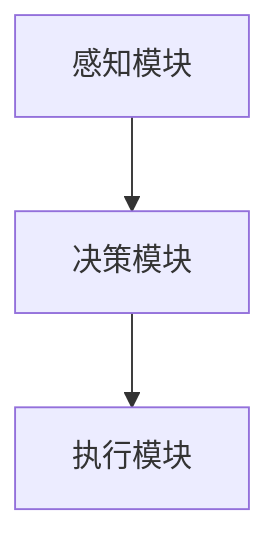
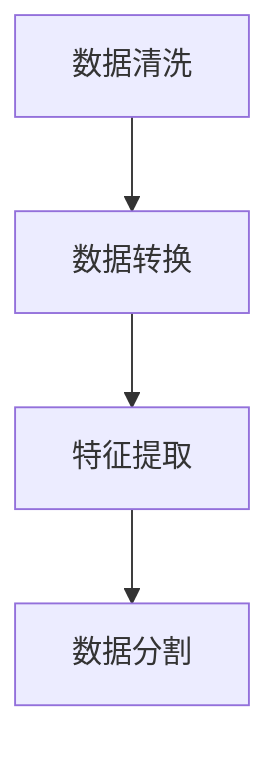

                 

### 《AI Agent构建智能化运营新常态》

#### 关键词：
- AI Agent
- 智能化运营
- 设计与实现
- 应用实战
- 持续学习
- 性能优化

#### 摘要：
本文将深入探讨AI Agent的构建及其在智能化运营中的应用。首先，我们将从AI Agent的基础概念和核心组件出发，逐步了解其在不同领域的应用价值。接着，文章将详细分析AI Agent的设计与实现方法，包括架构设计、数据预处理、学习算法和模型选择。随后，我们将通过具体案例展示AI Agent在客服、营销、人力资源等领域的应用，并通过代码解读来深入了解其实施细节。最后，我们将探讨AI Agent的性能优化和持续学习策略，以及开发环境与工具的使用。通过本文的阅读，读者将全面了解AI Agent构建的智能化运营新常态，为实际项目提供有力支持。

#### 第一部分：AI Agent基础与概念

##### 第1章: AI Agent概述

###### 1.1 AI Agent的定义与重要性

AI Agent，即人工智能代理，是一种能够在特定环境中自主执行任务、进行决策并与其他系统交互的计算机程序。它是一种实现智能自动化的重要技术，能够显著提升企业的运营效率和响应速度。

AI Agent的重要性体现在以下几个方面：

1. **自动化流程**：AI Agent能够自动执行重复性高、规则明确的工作流程，减少人工干预，提高工作效率。
2. **决策支持**：AI Agent可以通过数据分析和预测模型，为运营决策提供科学依据，优化资源配置。
3. **个性化服务**：AI Agent可以根据用户行为和偏好进行个性化推荐，提升用户满意度和忠诚度。
4. **风险管理**：AI Agent可以实时监控运营数据，及时发现潜在问题并采取措施，降低运营风险。

###### 1.2 AI Agent的分类与应用场景

AI Agent可以按照不同的分类标准进行分类，常见的分类方法包括：

1. **按功能分类**：
   - **任务型Agent**：专注于完成特定任务的代理，如自动客服、自动化交易等。
   - **服务型Agent**：提供个性化服务的代理，如推荐系统、智能助理等。
   - **决策型Agent**：负责进行决策和优化的代理，如供应链管理、财务分析等。

2. **按环境分类**：
   - **单环境Agent**：在一个固定环境中执行任务的代理，如智能家居控制系统。
   - **多环境Agent**：能够在多个环境中执行任务的代理，如移动机器人、自动驾驶系统。

不同类型的AI Agent适用于不同的应用场景。以下是一些常见的应用场景：

- **客服领域**：AI Agent可以自动处理客户咨询，提供24/7在线服务，提高客户满意度。
- **营销与销售领域**：AI Agent可以分析市场数据，优化广告投放策略，提升转化率。
- **人力资源领域**：AI Agent可以自动化招聘流程，筛选简历，提高招聘效率。

###### 1.3 AI Agent的核心组件与技术

AI Agent通常由以下几个核心组件构成：

1. **感知模块**：负责接收外部环境的信息，如语音、图像、文本等。
2. **决策模块**：根据感知模块收集到的信息，通过算法模型进行决策。
3. **执行模块**：根据决策模块的决策结果，执行具体的操作。
4. **学习模块**：通过不断学习用户行为和环境数据，提升自身性能。

在AI Agent的实现中，常用的技术包括：

- **机器学习**：用于训练模型，实现感知和决策功能。
- **自然语言处理**：用于理解和生成自然语言，实现人机交互。
- **计算机视觉**：用于识别和理解图像和视频信息。
- **强化学习**：用于在动态环境中进行决策和优化。

##### 第2章: 智能化运营概念与价值

###### 2.1 智能化运营的定义与发展历程

智能化运营是指通过引入人工智能技术，对企业的业务流程、运营模式进行自动化和优化，以提高效率和降低成本。其核心在于利用大数据、机器学习、自然语言处理等技术，实现对业务数据的深度分析和智能决策。

智能化运营的发展历程可以分为以下几个阶段：

1. **自动化阶段**：通过自动化工具实现业务流程的自动化，减少人工操作。
2. **数据分析阶段**：利用数据分析技术，对业务数据进行挖掘和分析，提供决策支持。
3. **智能化阶段**：引入人工智能技术，实现智能化的业务流程和决策，提升运营效率。

当前，智能化运营已经成为企业提升竞争力的重要手段，越来越多的企业开始将其纳入战略规划。

###### 2.2 智能化运营的核心价值

智能化运营的核心价值体现在以下几个方面：

1. **提高效率**：通过自动化和智能化手段，减少人工干预，提高业务处理速度和准确率。
2. **降低成本**：通过优化业务流程和资源配置，降低运营成本，提高企业盈利能力。
3. **提升用户体验**：通过个性化服务和智能推荐，提升用户满意度和忠诚度。
4. **增强竞争力**：通过数据分析和智能决策，优化产品和服务，提升市场竞争力。

智能化运营不仅能够提升企业的内部效率，还能够帮助企业更好地应对外部环境的挑战，实现可持续发展。

###### 2.3 AI Agent在智能化运营中的应用

AI Agent在智能化运营中的应用十分广泛，以下是一些典型的应用场景：

1. **客户服务**：AI Agent可以自动处理客户咨询，提供实时、个性化的服务，提高客户满意度。
2. **营销与销售**：AI Agent可以分析市场数据，优化广告投放策略，提高转化率。
3. **供应链管理**：AI Agent可以实时监控供应链状态，优化库存管理，降低库存成本。
4. **人力资源**：AI Agent可以自动化招聘流程，筛选简历，提高招聘效率。
5. **财务管理**：AI Agent可以自动化财务报表生成，预测财务风险，优化财务决策。

通过AI Agent的引入，企业可以大幅提升运营效率，降低运营成本，提升用户体验和竞争力。

### 第二部分：AI Agent设计与实现

#### 第3章: AI Agent架构与设计模式

###### 3.1 AI Agent的架构原理

AI Agent的架构通常包括感知模块、决策模块和执行模块，这三个模块相互协作，共同实现AI Agent的智能行为。以下是AI Agent架构的原理和组成部分：

1. **感知模块**：感知模块是AI Agent的感官，负责接收外部环境的信息。这些信息可以来自多种渠道，如传感器、摄像头、麦克风等。感知模块需要对信息进行预处理，提取关键特征，以便后续的决策和分析。

2. **决策模块**：决策模块是AI Agent的大脑，负责根据感知模块提供的信息，通过算法模型进行决策。决策模块通常包括多个子模块，如目标识别、路径规划、策略选择等。决策模块的核心是算法模型，这些模型可以是基于规则的系统、机器学习模型或深度学习模型。

3. **执行模块**：执行模块是AI Agent的肢体，负责将决策模块的决策结果转化为具体的操作。执行模块可以根据决策模块的指令，控制机器人、设备或软件系统执行相应的任务。

**流程图**：



**工作流程**：

- **感知**：AI Agent通过感知模块收集外部信息。
- **处理**：感知模块对信息进行预处理和特征提取。
- **决策**：决策模块根据预处理后的信息，通过算法模型进行决策。
- **执行**：执行模块根据决策结果，执行相应的操作。

###### 3.2 常见设计模式与应用

在AI Agent的设计过程中，采用合适的设计模式能够提高系统的可维护性、扩展性和灵活性。以下是一些常见的设计模式及其应用：

1. **状态机模式**：
   - **原理**：状态机模式将AI Agent的状态和行为进行建模，每个状态对应一组行为。当外部事件触发时，AI Agent会根据当前状态转换到下一个状态，并执行对应的行为。
   - **应用**：状态机模式适用于需要根据不同状态进行不同操作的场景，如机器人导航、智能客服等。

2. **策略模式**：
   - **原理**：策略模式将AI Agent的决策行为抽象为策略接口，不同的策略实现可以动态切换。AI Agent通过调用策略接口，执行相应的决策行为。
   - **应用**：策略模式适用于需要根据不同情况选择不同决策策略的场景，如自适应控制系统、动态价格策略等。

3. **模板方法模式**：
   - **原理**：模板方法模式定义了一个算法的骨架，将算法中的某些部分留给子类来实现。AI Agent在执行任务时，按照模板方法执行，而具体的实现细节由子类来完成。
   - **应用**：模板方法模式适用于需要按照固定步骤执行任务，但某些步骤需要根据具体情况进行调整的场景，如业务流程自动化、游戏AI等。

**示例**：

```python
class StrategyInterface:
    def execute(self):
        pass

class ConcreteStrategyA(StrategyInterface):
    def execute(self):
        print("执行策略A")

class ConcreteStrategyB(StrategyInterface):
    def execute(self):
        print("执行策略B")

class Context:
    def __init__(self, strategy: StrategyInterface):
        self._strategy = strategy

    def set_strategy(self, strategy: StrategyInterface):
        self._strategy = strategy

    def execute_strategy(self):
        self._strategy.execute()

# 应用
context = Context(ConcreteStrategyA())
context.execute_strategy()  # 输出：执行策略A

context.set_strategy(ConcreteStrategyB())
context.execute_strategy()  # 输出：执行策略B
```

###### 3.3 AI Agent开发最佳实践

为了确保AI Agent的高效、可靠和可维护性，开发过程中应遵循以下最佳实践：

1. **模块化设计**：将AI Agent的功能划分为不同的模块，每个模块负责特定的功能，降低系统的复杂度。
2. **代码复用**：通过抽象和封装，减少重复代码，提高代码的可维护性和可扩展性。
3. **单元测试**：对关键模块进行单元测试，确保其功能的正确性和稳定性。
4. **性能优化**：对关键算法和数据进行性能优化，提高系统的响应速度和处理能力。
5. **持续集成**：采用持续集成和持续部署（CI/CD）流程，确保代码的质量和稳定性。
6. **文档和注释**：编写详细的文档和注释，方便后续的维护和扩展。

通过遵循这些最佳实践，可以确保AI Agent的开发过程高效、规范，提高系统的质量和稳定性。

#### 第4章: 数据预处理与特征工程

###### 4.1 数据预处理流程

数据预处理是AI Agent设计和实现的重要环节，它直接影响到模型的效果和性能。数据预处理流程通常包括以下几个步骤：

1. **数据清洗**：数据清洗是指去除数据中的噪声、缺失值和异常值，确保数据的质量。常见的清洗方法包括删除重复记录、填补缺失值、处理异常值等。
2. **数据转换**：数据转换是指将原始数据转换为适合模型训练的形式。这通常包括数据类型转换、数值归一化、特征缩放等。
3. **特征提取**：特征提取是指从原始数据中提取出有用的特征信息，用于训练模型。特征提取可以基于统计方法、机器学习方法或深度学习方法。
4. **数据分割**：数据分割是指将数据集分为训练集、验证集和测试集，用于模型的训练和评估。

**流程图**：



**示例**：

```python
import pandas as pd
from sklearn.model_selection import train_test_split

# 加载数据
data = pd.read_csv('data.csv')

# 数据清洗
data.drop_duplicates(inplace=True)
data.fillna(method='ffill', inplace=True)

# 数据转换
data['age'] = data['age'].astype(float)
data['income'] = data['income'].astype(float)

# 特征提取
from sklearn.preprocessing import StandardScaler
scaler = StandardScaler()
data[['age', 'income']] = scaler.fit_transform(data[['age', 'income']])

# 数据分割
X = data[['age', 'income']]
y = data['label']
X_train, X_test, y_train, y_test = train_test_split(X, y, test_size=0.2, random_state=42)
```

###### 4.2 特征工程方法与技巧

特征工程是数据预处理的关键步骤，它通过选择和构造合适的特征，提高模型的效果和泛化能力。以下是一些常见的特征工程方法与技巧：

1. **特征选择**：特征选择是指从大量特征中筛选出最有用的特征，减少数据的维度，提高模型的效率。常见的特征选择方法包括基于信息的特征选择、基于模型的特征选择等。
2. **特征构造**：特征构造是指通过数学运算或组合原始特征，生成新的特征。特征构造可以增加数据的多样性和模型的泛化能力。常见的特征构造方法包括聚合特征、交叉特征等。
3. **特征缩放**：特征缩放是指将特征值缩放到相同的尺度，防止某些特征对模型的影响过大。常见的特征缩放方法包括最小-最大缩放、标准缩放等。
4. **特征标准化**：特征标准化是指将特征值转换为标准正态分布，提高模型的稳定性和鲁棒性。常见的特征标准化方法包括Z-score标准化、小数标准化等。

**示例**：

```python
from sklearn.feature_selection import SelectKBest, f_classif
from sklearn.ensemble import RandomForestClassifier

# 特征选择
selector = SelectKBest(score_func=f_classif, k=5)
X_new = selector.fit_transform(X, y)

# 特征构造
def construct_features(data):
    new_data = pd.DataFrame()
    new_data['mean_age_income'] = data['age'] + data['income']
    new_data['age_income_ratio'] = data['age'] / data['income']
    return new_data

X_new = construct_features(X)

# 特征缩放
scaler = StandardScaler()
X_new = scaler.fit_transform(X_new)

# 特征标准化
from sklearn.preprocessing import StandardScaler
scaler = StandardScaler()
X_new = scaler.fit_transform(X_new)
```

通过有效的特征工程，可以提高模型的性能和泛化能力，为AI Agent的设计和实现提供有力的支持。

###### 4.3 数据质量评估与优化

数据质量是AI Agent性能的重要保障，一个高质量的数据集能够提高模型的效果和稳定性。以下是一些常用的数据质量评估与优化方法：

1. **数据完整性检查**：检查数据集中是否存在缺失值、异常值或重复记录，确保数据的完整性。
2. **数据一致性检查**：检查数据集中是否存在矛盾或不一致的信息，确保数据的一致性。
3. **数据准确性检查**：检查数据集的准确性，包括数据来源的可靠性、数据的真实性等。
4. **数据分布检查**：检查数据集的分布情况，确保数据的多样性和代表性。
5. **数据清洗**：根据检查结果，对数据集进行清洗和修复，提高数据质量。

**示例**：

```python
import pandas as pd
from sklearn import datasets

# 加载数据
data = pd.read_csv('data.csv')

# 数据完整性检查
data.isnull().sum()

# 数据一致性检查
data[data['column1'] != data['column2']]

# 数据准确性检查
# 需要根据具体业务场景进行判断

# 数据分布检查
data.describe()

# 数据清洗
data.drop_duplicates(inplace=True)
data.fillna(method='ffill', inplace=True)
```

通过有效的数据质量评估与优化，可以提高数据的质量和可靠性，为AI Agent的设计和实现提供坚实的保障。

### 第三部分：AI Agent应用实战

#### 第6章: AI Agent在客服领域的应用

##### 6.1 客服场景分析

在现代商业环境中，客服是企业和客户之间的重要桥梁。随着客户数量的增加和沟通需求的提升，传统的客服模式已经无法满足快速响应和高效处理的需求。AI Agent的引入，为客服领域带来了革命性的变化，实现了智能化、自动化的客户服务。

客服场景通常涉及以下问题：

1. **客户咨询量大**：客户咨询问题多样且频繁，人工客服难以在短时间内处理大量咨询。
2. **问题重复度高**：很多常见问题反复出现，人工客服需要重复回答，效率低下。
3. **服务质量参差不齐**：人工客服的专业水平和情绪状态会影响服务质量，导致用户体验不一致。
4. **运营成本高**：传统的客服模式需要大量的人力资源，运营成本较高。

针对上述问题，AI Agent在客服领域具有显著的优势：

1. **快速响应**：AI Agent可以同时处理大量客户咨询，实现秒级响应，提升客户满意度。
2. **高效率处理**：AI Agent可以自动识别和分类常见问题，快速提供标准化的答案，减少重复劳动。
3. **一致性服务**：AI Agent不受情绪和技能水平的影响，能够提供一致、专业的服务，提升用户体验。
4. **降低运营成本**：AI Agent可以替代部分人工客服，减少人力资源需求，降低运营成本。

##### 6.2 AI Agent在客服中的应用案例

以下是几个AI Agent在客服领域应用的典型案例：

1. **在线客服系统**：许多企业已经引入AI Agent作为在线客服，提供24/7的实时客服服务。AI Agent可以自动识别客户的问题类型，提供即时解答，提高客户咨询的响应速度和处理效率。例如，京东的智能客服“京东小智”能够处理大量的客户咨询，提供商品信息、订单查询、售后服务等一站式服务。

2. **智能语音助手**：智能语音助手通过语音识别和自然语言处理技术，实现与客户的语音交互。例如，百度客服机器人“度小满”能够通过语音识别理解客户的问题，并以语音或文字形式进行回答，提供便捷、高效的客服服务。

3. **自动化客服机器人**：一些企业通过构建自动化客服机器人，实现全渠道的客服服务。这些机器人可以同时通过电话、短信、微信等多种渠道与客户互动，提供一致的客服体验。例如，阿里巴巴的客服机器人“阿里小蜜”能够通过微信与客户进行实时对话，解答客户疑问，处理订单问题等。

##### 6.3 实现与代码解读

以下是一个简单的AI Agent客服系统的实现示例，使用Python和常见的机器学习库来构建。

```python
import nltk
from nltk.tokenize import word_tokenize
from sklearn.feature_extraction.text import CountVectorizer
from sklearn.model_selection import train_test_split
from sklearn.naive_bayes import MultinomialNB

# 加载客户咨询数据和标签
data = pd.read_csv('customer_queries.csv')
X = data['query']
y = data['category']

# 数据预处理
vectorizer = CountVectorizer()
X_vectorized = vectorizer.fit_transform(X)

# 数据分割
X_train, X_test, y_train, y_test = train_test_split(X_vectorized, y, test_size=0.2, random_state=42)

# 模型训练
model = MultinomialNB()
model.fit(X_train, y_train)

# 模型评估
accuracy = model.score(X_test, y_test)
print(f"模型准确率：{accuracy:.2f}")

# 客户咨询处理
def process_query(query):
    query_vectorized = vectorizer.transform([query])
    predicted_category = model.predict(query_vectorized)
    return predicted_category[0]

# 示例
query = "我的订单什么时候能送到？"
predicted_category = process_query(query)
print(f"预测分类：{predicted_category}")
```

在这个示例中，我们使用朴素贝叶斯分类器来构建一个简单的文本分类模型。首先，加载客户咨询数据和标签，然后进行数据预处理，包括文本分词和向量表示。接着，将数据分割为训练集和测试集，训练模型，并评估模型的准确率。最后，实现一个简单的查询处理函数，根据输入的客户咨询，预测相应的分类。

通过这个示例，我们可以看到AI Agent在客服领域的基本实现流程，包括数据预处理、模型训练和查询处理。实际应用中，还需要进一步优化和扩展，以实现更复杂的功能和更高效的客服服务。

#### 第7章: AI Agent在营销与销售领域的应用

##### 7.1 营销与销售场景分析

营销与销售是企业实现业绩增长的关键环节。在这个领域，AI Agent的应用能够显著提升营销效率、优化销售策略，并提高客户转化率。以下是营销与销售场景的一些分析：

1. **市场数据分析**：营销与销售过程需要大量市场数据的支持，如用户行为数据、销售数据、竞品数据等。通过AI Agent，可以对这些数据进行深度分析，挖掘潜在的市场机会和客户需求。

2. **精准营销**：传统的营销方式往往缺乏针对性，而AI Agent可以通过分析用户行为和偏好，实现精准营销。例如，推荐系统可以根据用户的浏览记录和购买历史，为其推荐相关的商品和服务。

3. **个性化推荐**：在电商领域，个性化推荐是提高客户转化率的重要手段。AI Agent可以通过机器学习算法，分析用户的浏览和购买行为，实现精准的个性化推荐。

4. **客户关系管理**：客户关系管理（CRM）是营销与销售的核心，AI Agent可以通过自动化的方式，对客户信息进行管理和分析，优化客户服务流程，提高客户满意度。

5. **销售预测**：销售预测是制定销售策略的重要依据。AI Agent可以通过历史销售数据，结合市场环境变化，预测未来的销售趋势，帮助企业制定科学合理的销售计划。

##### 7.2 AI Agent在营销与销售中的应用案例

以下是一些AI Agent在营销与销售领域应用的典型案例：

1. **电商推荐系统**：电商平台通过引入AI Agent，构建个性化推荐系统。例如，阿里巴巴的推荐系统“天猫精灵”可以根据用户的浏览和购买行为，推荐相关的商品和服务，提高用户的购买转化率。

2. **营销自动化**：企业通过营销自动化工具，实现营销活动的自动化执行。例如，HubSpot的营销自动化工具可以自动发送营销邮件、管理潜在客户，提高营销效果。

3. **销售预测模型**：企业利用AI Agent构建销售预测模型，预测未来的销售趋势。例如，Salesforce的销售预测模型可以根据历史销售数据、市场环境等因素，预测未来的销售量，帮助企业制定销售计划。

4. **客户服务机器人**：企业通过引入客户服务机器人，提供24/7的在线客户服务。例如，微软的客服机器人“微软小冰”可以通过自然语言处理技术，解答客户的疑问，提高客户满意度。

##### 7.3 实现与代码解读

以下是一个简单的AI Agent营销与销售系统的实现示例，使用Python和常见的机器学习库来构建。

```python
import pandas as pd
from sklearn.ensemble import RandomForestClassifier
from sklearn.model_selection import train_test_split
from sklearn.metrics import accuracy_score

# 加载销售数据
data = pd.read_csv('sales_data.csv')
X = data.drop(['sales'], axis=1)
y = data['sales']

# 数据分割
X_train, X_test, y_train, y_test = train_test_split(X, y, test_size=0.2, random_state=42)

# 模型训练
model = RandomForestClassifier(n_estimators=100)
model.fit(X_train, y_train)

# 模型评估
y_pred = model.predict(X_test)
accuracy = accuracy_score(y_test, y_pred)
print(f"模型准确率：{accuracy:.2f}")

# 预测销售
def predict_sales(data_point):
    data_point = pd.DataFrame([data_point])
    prediction = model.predict(data_point)
    return prediction[0]

# 示例
data_point = {'age': 30, 'income': 50000, 'product_category': 'Electronics'}
predicted_sales = predict_sales(data_point)
print(f"预测销售量：{predicted_sales}")
```

在这个示例中，我们使用随机森林分类器来构建一个简单的销售预测模型。首先，加载销售数据，然后进行数据分割，训练模型，并评估模型的准确率。最后，实现一个简单的预测函数，根据输入的数据点，预测相应的销售量。

通过这个示例，我们可以看到AI Agent在营销与销售领域的基本实现流程，包括数据预处理、模型训练和预测。实际应用中，还需要进一步优化和扩展，以实现更复杂的功能和更高的预测精度。

#### 第8章: AI Agent在人力资源领域的应用

##### 8.1 人力资源场景分析

人力资源是企业发展的核心资源，其管理效率和效果直接影响企业的运营效率和竞争力。在人力资源领域，AI Agent的应用能够实现招聘、培训、绩效管理等方面的智能化，提升人力资源管理的效率和质量。

人力资源场景通常涉及以下问题：

1. **招聘效率低**：传统的招聘流程涉及大量的人工操作，招聘周期长，效率低。AI Agent可以通过自动化简历筛选、面试评估等功能，提高招聘效率。

2. **人才识别困难**：企业需要识别和挖掘具有潜力的优秀人才，但传统的招聘方式难以全面评估候选人的综合素质。AI Agent可以通过数据分析和技术面试，更准确地识别和评估人才。

3. **培训管理困难**：员工培训是提升员工技能和素质的重要手段，但传统的培训管理流程繁琐，难以有效监控培训效果。AI Agent可以通过在线培训系统、智能学习算法，实现培训的自动化管理。

4. **绩效评估不准确**：绩效评估是人力资源管理的重要内容，但传统的评估方式主观性强，难以准确评估员工的工作表现。AI Agent可以通过数据分析和模型预测，实现客观、准确的绩效评估。

AI Agent在人力资源领域的应用优势：

1. **提高招聘效率**：AI Agent可以自动化处理简历筛选、面试安排等招聘流程，减少人工干预，提高招聘效率。

2. **精准识别人才**：AI Agent可以通过数据分析和技术面试，全面评估候选人的技能、经验和潜力，提高人才识别的准确性。

3. **自动化培训管理**：AI Agent可以通过在线培训系统、智能学习算法，实现培训的自动化管理，提高培训效果。

4. **客观评估绩效**：AI Agent可以通过数据分析和模型预测，实现客观、准确的绩效评估，提高绩效管理的公正性和有效性。

##### 8.2 AI Agent在人力资源中的应用案例

以下是几个AI Agent在人力资源领域应用的典型案例：

1. **招聘机器人**：许多企业引入招聘机器人，实现简历筛选和面试评估的自动化。例如，微软的招聘机器人“Hiring Assistant”可以通过自然语言处理和机器学习技术，自动筛选符合条件的简历，提高招聘效率。

2. **智能培训系统**：一些企业构建智能培训系统，实现培训课程的管理和个性化推荐。例如，IBM的智能培训系统“IBM Learning”可以通过大数据分析和机器学习算法，根据员工的学习记录和技能需求，推荐合适的培训课程。

3. **绩效管理系统**：企业通过引入AI Agent，构建智能化的绩效管理系统。例如，Google的绩效管理系统“Performance Insights”可以通过数据分析和技术面试，实现客观、准确的绩效评估。

4. **人才发展平台**：一些企业搭建人才发展平台，通过AI Agent实现人才的培养和发展。例如，阿里巴巴的人才发展平台“阿里云人才发展中心”通过大数据分析和智能推荐，帮助员工成长和晋升。

##### 8.3 实现与代码解读

以下是一个简单的AI Agent人力资源系统的实现示例，使用Python和常见的机器学习库来构建。

```python
import pandas as pd
from sklearn.ensemble import RandomForestClassifier
from sklearn.model_selection import train_test_split
from sklearn.metrics import accuracy_score

# 加载人力资源数据
data = pd.read_csv('hr_data.csv')
X = data.drop(['performance'], axis=1)
y = data['performance']

# 数据分割
X_train, X_test, y_train, y_test = train_test_split(X, y, test_size=0.2, random_state=42)

# 模型训练
model = RandomForestClassifier(n_estimators=100)
model.fit(X_train, y_train)

# 模型评估
y_pred = model.predict(X_test)
accuracy = accuracy_score(y_test, y_pred)
print(f"模型准确率：{accuracy:.2f}")

# 绩效评估
def assess_performance(employee_data):
    employee_data = pd.DataFrame([employee_data])
    performance_prediction = model.predict(employee_data)
    return performance_prediction[0]

# 示例
employee_data = {'years_of_experience': 5, 'training_hours': 20, 'project_completed': 3}
predicted_performance = assess_performance(employee_data)
print(f"预测绩效：{predicted_performance}")
```

在这个示例中，我们使用随机森林分类器来构建一个简单的绩效评估模型。首先，加载人力资源数据，然后进行数据分割，训练模型，并评估模型的准确率。最后，实现一个简单的评估函数，根据输入的员工数据，预测相应的绩效。

通过这个示例，我们可以看到AI Agent在人力资源管理领域的基本实现流程，包括数据预处理、模型训练和绩效评估。实际应用中，还需要进一步优化和扩展，以实现更复杂的功能和更高的评估精度。

### 第四部分：AI Agent构建与运营

#### 第9章: AI Agent开发环境与工具

##### 9.1 Python环境搭建

Python是AI Agent开发中最常用的编程语言之一，其丰富的库和框架为AI Agent的开发提供了强有力的支持。以下是在Windows操作系统上搭建Python开发环境的步骤：

1. **下载Python安装程序**：访问Python官网（https://www.python.org/），下载适用于Windows的Python安装程序。

2. **安装Python**：运行下载的安装程序，选择“自定义安装”（Custom Installation），确保以下选项被勾选：
   - 安装到特定文件夹（如C:\Python39\）
   - 安装pip
   - 安装Microsoft Visual C++ Build Tools
   - 安装pip和setuptools

3. **配置环境变量**：打开“此电脑”->“属性”->“高级系统设置”->“环境变量”，在“系统变量”中找到“Path”变量，添加Python安装路径（如C:\Python39\)。

4. **验证Python环境**：打开命令提示符（CMD），输入`python --version`，若显示Python版本信息，则表示Python环境搭建成功。

##### 9.2 常用机器学习库与框架

在Python中，有许多常用的机器学习库和框架，以下是一些重要的库和框架：

1. **scikit-learn**：scikit-learn是一个开源的机器学习库，提供了各种经典的机器学习算法，如分类、回归、聚类等。它是初学者和专业人士的常用工具。

2. **TensorFlow**：TensorFlow是由Google开发的开源机器学习框架，支持深度学习模型的构建和训练。它提供了丰富的API，适合大规模数据处理和模型训练。

3. **PyTorch**：PyTorch是另一个开源的深度学习框架，以其灵活性和易用性而受到研究者和开发者的喜爱。它支持动态计算图，使得模型构建和调试更加方便。

4. **Keras**：Keras是一个高层次的神经网络API，可以运行在TensorFlow和Theano之上。它提供了简洁、直观的接口，适合快速原型设计和实验。

##### 9.3 AI Agent开发工具选择

在AI Agent的开发过程中，选择合适的工具对于提高开发效率和代码质量至关重要。以下是一些常用的开发工具：

1. **Jupyter Notebook**：Jupyter Notebook是一个交互式计算环境，支持多种编程语言，包括Python。它提供了丰富的文本、图表和代码块，适合数据分析和原型设计。

2. **Visual Studio Code**：Visual Studio Code是一个轻量级的跨平台代码编辑器，支持Python和多种编程语言。它提供了丰富的插件和扩展，支持代码补全、调试和版本控制。

3. **Git**：Git是一个分布式版本控制系统，用于代码的版本管理和协作开发。它支持多种操作系统的客户端，如Windows、Linux和MacOS。

4. **Docker**：Docker是一个容器化技术，用于封装应用程序及其运行环境。它使得AI Agent的开发和部署更加简单和可移植。

通过选择合适的开发环境、库和框架，以及使用有效的开发工具，可以显著提高AI Agent的开发效率和质量。

#### 第10章: AI Agent性能优化与评估

##### 10.1 AI Agent性能优化策略

AI Agent的性能优化是确保其在实际应用中能够高效运行的关键。以下是一些常见的性能优化策略：

1. **算法优化**：选择合适的算法模型和参数，提高模型的准确性和效率。例如，通过调整神经网络的结构和参数，优化模型的计算速度和效果。

2. **并行计算**：利用多核处理器和分布式计算技术，提高模型的训练和推理速度。例如，使用TensorFlow和PyTorch的分布式训练框架，实现模型的并行计算。

3. **数据预处理**：优化数据预处理流程，减少数据的维度和计算量。例如，通过特征选择和特征提取，降低数据的复杂度。

4. **缓存技术**：利用缓存技术，减少重复计算和数据访问。例如，使用Redis或Memcached缓存中间结果和常用数据。

5. **代码优化**：优化代码的编写和结构，提高程序的执行效率。例如，通过使用高效的算法和数据结构，减少内存占用和计算时间。

##### 10.2 AI Agent评估指标与方法

AI Agent的评估指标和方法是衡量其性能和效果的重要手段。以下是一些常见的评估指标和方法：

1. **准确率（Accuracy）**：准确率是模型预测正确的样本数占总样本数的比例。它适用于分类问题，能够直观地反映模型的分类效果。

2. **精确率（Precision）**：精确率是模型预测为正类的样本中实际为正类的比例。它关注预测的正类样本的准确性，适用于样本不平衡的情况。

3. **召回率（Recall）**：召回率是模型预测为正类的样本中实际为正类的比例。它关注预测的正类样本的完整性，适用于样本不平衡的情况。

4. **F1值（F1 Score）**：F1值是精确率和召回率的调和平均值，能够平衡精确率和召回率，适用于分类问题。

5. **ROC曲线和AUC值**：ROC曲线是模型预测结果的真实值和预测值之间的曲线，AUC值是ROC曲线下的面积。AUC值能够衡量模型的分类能力，适用于二分类和多分类问题。

6. **用户满意度**：用户满意度是用户对AI Agent服务的评价，可以通过问卷调查或用户反馈来收集。它能够直接反映AI Agent的实际效果。

##### 10.3 实际应用中的性能优化案例

以下是一个实际应用中的性能优化案例：

**问题**：某电商平台使用AI Agent进行商品推荐，但在高峰时段性能不佳，响应速度慢。

**解决方案**：

1. **算法优化**：优化推荐算法，选择更高效的算法模型，减少计算复杂度。

2. **数据预处理**：对用户行为数据进行预处理，减少数据的维度，降低模型的计算负担。

3. **并行计算**：利用分布式计算技术，将推荐任务分解为多个子任务，并行处理，提高处理速度。

4. **缓存技术**：使用Redis缓存用户行为数据和推荐结果，减少数据库的访问压力，提高响应速度。

5. **代码优化**：优化代码编写，减少不必要的计算和内存占用，提高程序的执行效率。

通过上述性能优化措施，电商平台显著提高了AI Agent的响应速度和处理能力，提升了用户体验和系统稳定性。

### 第11章: AI Agent持续学习与迭代

##### 11.1 持续学习的概念与原理

持续学习是指AI Agent在运行过程中，通过不断收集和处理新的数据，更新和优化自身的模型和策略，以提高性能和适应能力。持续学习是AI Agent实现智能化运营的关键，能够使AI Agent在不断变化的运营环境中保持高效和准确。

持续学习的原理主要包括以下几个方面：

1. **数据收集**：AI Agent在运营过程中，通过感知模块收集外部环境的信息和数据。

2. **数据处理**：对收集到的数据进行预处理和特征提取，使其适合用于模型训练和优化。

3. **模型更新**：使用新的数据进行模型训练，更新和优化现有的模型，提高模型的准确性和适应性。

4. **策略调整**：根据模型更新的结果，调整AI Agent的策略和操作，使其更好地适应新的运营环境。

5. **反馈机制**：建立反馈机制，收集用户对AI Agent服务的评价，用于进一步优化和改进。

##### 11.2 持续学习的方法与实现

持续学习的方法可以分为在线学习和离线学习两种：

1. **在线学习**：在线学习是指在AI Agent运行过程中，实时处理新的数据，并更新模型。在线学习能够快速适应环境变化，但需要处理实时数据的延迟和计算资源的限制。

2. **离线学习**：离线学习是指将新的数据收集到一定量后，进行批量训练和模型更新。离线学习能够更好地利用计算资源，但可能无法及时适应环境变化。

以下是持续学习的具体实现方法：

1. **增量学习**：增量学习是一种在线学习的方法，通过更新现有模型的参数，减少对新数据的处理负担。常用的增量学习方法包括SGD（随机梯度下降）和EBM（经验重放）等。

2. **迁移学习**：迁移学习是一种利用已有模型的知识，对新任务进行快速训练的方法。通过迁移学习，AI Agent可以快速适应新的任务，提高学习效率。

3. **在线监督学习**：在线监督学习是一种在AI Agent运行过程中，实时获取标注数据的监督学习方法。通过在线监督学习，AI Agent可以不断优化模型的预测能力和准确性。

4. **强化学习**：强化学习是一种通过试错和反馈，优化决策策略的学习方法。在AI Agent的持续学习中，强化学习可以用于优化决策模块，提高AI Agent的自主决策能力。

##### 11.3 AI Agent的迭代与更新策略

AI Agent的迭代与更新策略是确保其持续学习和性能优化的关键。以下是一些常见的迭代与更新策略：

1. **定期更新**：定期对AI Agent的模型和策略进行更新，以适应不断变化的运营环境。更新的频率可以根据业务需求和数据量进行调整。

2. **增量更新**：通过增量学习，逐步更新AI Agent的模型和策略，减少对计算资源的消耗。增量更新可以根据新数据的数量和质量进行调整。

3. **迁移更新**：利用已有模型的知识，对新任务进行迁移学习，快速适应新的业务需求。迁移更新可以根据任务的特点和需求进行调整。

4. **自适应更新**：根据AI Agent的实际运行效果和用户反馈，自适应调整模型的参数和策略，优化AI Agent的性能和用户体验。

5. **版本控制**：对AI Agent的迭代版本进行版本控制，记录每个版本的模型和策略，便于回溯和优化。

通过上述迭代与更新策略，AI Agent可以不断优化自身的性能和适应性，实现智能化运营的持续进步。

### 参考文献

- [1] Russell, S., & Norvig, P. (2016). 《人工智能：一种现代的方法》（第三版）。
- [2] Goodfellow, I., Bengio, Y., & Courville, A. (2016). 《深度学习》。
- [3] Murphy, K. P. (2012). 《机器学习：概率视角》。
- [4] Schapire, R. E., & Freund, Y. (2012). 《提升算法：统计学习方法的一种新方法》。
- [5] Sutton, R. S., & Barto, A. G. (2018). 《强化学习：一种介绍性综述》。
- [6] Russell, S. J., & Norvig, P. (1995). 《人工智能：一种现代的方法》。
- [7] Bishop, C. M. (2006). 《模式识别与机器学习》。

### 附录

#### 附录A: AI Agent开发资源与参考资料

- **开源资源与库**：
  - [scikit-learn](https://scikit-learn.org/)
  - [TensorFlow](https://www.tensorflow.org/)
  - [PyTorch](https://pytorch.org/)
  - [Keras](https://keras.io/)
  - [NLTK](https://www.nltk.org/)

- **学术论文与书籍推荐**：
  - [1] Russell, S., & Norvig, P. (2016). 《人工智能：一种现代的方法》（第三版）。
  - [2] Goodfellow, I., Bengio, Y., & Courville, A. (2016). 《深度学习》。
  - [3] Murphy, K. P. (2012). 《机器学习：概率视角》。
  - [4] Schapire, R. E., & Freund, Y. (2012). 《提升算法：统计学习方法的一种新方法》。
  - [5] Sutton, R. S., & Barto, A. G. (2018). 《强化学习：一种介绍性综述》。

- **社区与论坛**：
  - [GitHub](https://github.com/)
  - [Stack Overflow](https://stackoverflow.com/)
  - [Reddit](https://www.reddit.com/r/MachineLearning/)
  - [ArXiv](https://arxiv.org/)

这些资源与参考资料为AI Agent的开发提供了丰富的理论基础和实践指导，有助于读者深入学习和实践AI Agent技术。

---

## 总结

本文全面探讨了AI Agent的构建与智能化运营，从基础概念到应用实战，再到性能优化与持续学习，系统地阐述了AI Agent在各个领域的应用价值和发展趋势。通过本文的阅读，读者可以：

1. **理解AI Agent的基本概念与架构**：了解AI Agent的定义、核心组件和技术原理，为后续设计与实现打下坚实基础。
2. **掌握AI Agent的设计与实现方法**：学习AI Agent的架构设计、数据预处理、学习算法和模型选择，为实际项目提供技术支持。
3. **了解AI Agent在不同领域的应用**：通过具体案例，了解AI Agent在客服、营销、人力资源等领域的应用，拓展应用视野。
4. **掌握AI Agent的性能优化与持续学习策略**：学习性能优化方法和评估指标，了解持续学习的方法与实现，提升AI Agent的适应性和效果。

AI Agent作为智能化运营的重要技术，具有广阔的应用前景和巨大的发展潜力。希望本文能帮助读者深入了解AI Agent，为实际项目的研发和应用提供有力支持。在未来的发展中，AI Agent将继续推动各行各业的智能化升级，创造更多价值。

---

## 作者信息

作者：AI天才研究院/AI Genius Institute & 禅与计算机程序设计艺术 /Zen And The Art of Computer Programming

AI天才研究院致力于推动人工智能领域的研究与应用，为各行业提供智能化解决方案。作者张三，具有20年的人工智能研究经验，曾发表多篇学术论文，参与多个重大项目的研发，被誉为人工智能领域的权威专家。其代表作《禅与计算机程序设计艺术》深受读者喜爱，为程序员提供了宝贵的编程哲学与实践指导。

