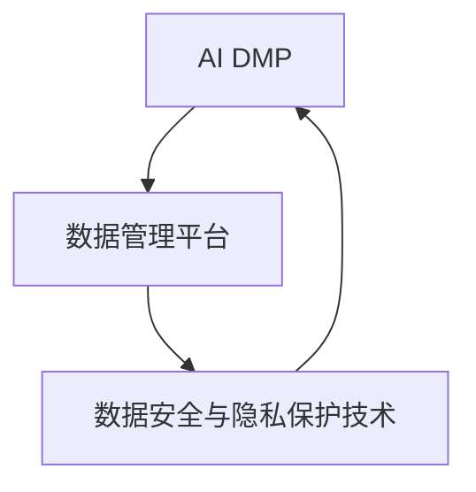

                 

### 文章标题：AI DMP 数据基建：数据安全与隐私保护

#### 关键词：
- AI DMP
- 数据安全
- 隐私保护
- 加密技术
- 数据匿名化
- 安全多方计算

#### 摘要：
本文深入探讨了AI数据管理平台（DMP）的数据基建，重点关注数据安全与隐私保护。通过概述AI DMP的基本概念、技术架构和应用领域，我们探讨了数据安全与隐私保护的基本原理和关键技术。随后，文章详细分析了AI DMP中的数据安全策略与隐私保护措施，并通过实际案例展示了这些技术的应用效果。最后，文章展望了AI DMP数据安全与隐私保护的未来发展趋势，为读者提供了有益的指导。

---

### 《AI DMP 数据基建：数据安全与隐私保护》目录大纲

#### 第一部分：AI DMP 数据基建概述

##### 第1章：AI DMP 基础知识

- 1.1 AI DMP 概念与背景
  - 1.1.1 数据管理平台（DMP）的定义
  - 1.1.2 AI DMP 的作用
  - 1.1.3 AI DMP 发展历程
- 1.2 AI DMP 技术架构
  - 1.2.1 数据收集与处理
  - 1.2.2 数据分析与挖掘
  - 1.2.3 数据建模与预测
- 1.3 AI DMP 应用领域
  - 1.3.1 广告与营销
  - 1.3.2 金融与保险
  - 1.3.3 零售与电子商务
- 1.4 AI DMP 的挑战与机遇
  - 1.4.1 数据安全与隐私保护
  - 1.4.2 法律法规与合规性
  - 1.4.3 技术创新与未来趋势

##### 第2章：数据安全与隐私保护基本原理

- 2.1 数据安全概念与框架
  - 2.1.1 数据安全的重要性
  - 2.1.2 数据安全的主要威胁
  - 2.1.3 数据安全管理体系
- 2.2 隐私保护法律法规
  - 2.2.1 全球隐私保护法律概述
  - 2.2.2 GDPR 详解
  - 2.2.3 CCPA 简述
- 2.3 隐私保护技术
  - 2.3.1 加密技术
    - 2.3.1.1 对称加密与非对称加密
    - 2.3.1.2 常用加密算法
  - 2.3.2 数据匿名化与脱敏
    - 2.3.2.1 数据匿名化的目的
    - 2.3.2.2 常用匿名化方法
  - 2.3.3 安全多方计算
    - 2.3.3.1 安全多方计算的基本概念
    - 2.3.3.2 安全多方计算的应用场景

##### 第3章：AI DMP 中的数据安全与隐私保护

- 3.1 AI DMP 数据安全策略
  - 3.1.1 数据分类与分级
  - 3.1.2 数据访问控制
  - 3.1.3 数据备份与恢复
- 3.2 隐私保护策略
  - 3.2.1 隐私影响评估
  - 3.2.2 隐私设计原则
  - 3.2.3 隐私保护技术实施
- 3.3 AI DMP 安全与隐私保护实践
  - 3.3.1 安全事件响应
  - 3.3.2 数据泄露防护
  - 3.3.3 持续隐私保护

##### 第4章：AI DMP 数据安全与隐私保护案例研究

- 4.1 案例一：某互联网公司AI DMP 数据安全与隐私保护实践
  - 4.1.1 案例背景
  - 4.1.2 数据安全与隐私保护措施
  - 4.1.3 案例效果分析
- 4.2 案例二：某金融机构AI DMP 数据安全与隐私保护实践
  - 4.2.1 案例背景
  - 4.2.2 数据安全与隐私保护措施
  - 4.2.3 案例效果分析

#### 第二部分：AI DMP 数据安全与隐私保护技术

##### 第5章：加密技术在AI DMP中的应用

- 5.1 对称加密与非对称加密
  - 5.1.1 对称加密原理
  - 5.1.2 非对称加密原理
  - 5.1.3 对称加密与非对称加密的比较
- 5.2 常用加密算法
  - 5.2.1 DES 和 AES
  - 5.2.2 RSA 和 ECC
  - 5.2.3 常用加密算法的性能分析

##### 第6章：数据匿名化与脱敏技术

- 6.1 数据匿名化的目的与方法
  - 6.1.1 数据匿名化的定义
  - 6.1.2 数据匿名化的目的
  - 6.1.3 常见的数据匿名化方法
- 6.2 数据脱敏技术
  - 6.2.1 数据脱敏的定义
  - 6.2.2 常见的数据脱敏方法
  - 6.2.3 数据脱敏与数据匿名化的关系

##### 第7章：安全多方计算技术

- 7.1 安全多方计算的基本概念
  - 7.1.1 安全多方计算的定义
  - 7.1.2 安全多方计算的目标
  - 7.1.3 安全多方计算的应用场景
- 7.2 安全多方计算协议
  - 7.2.1 安全多方计算协议的基本原理
  - 7.2.2 安全多方计算协议的分类
  - 7.2.3 安全多方计算协议的比较与选择

##### 第8章：AI DMP 数据安全与隐私保护案例分析

- 8.1 案例一：基于安全多方计算的数据共享平台
  - 8.1.1 案例背景
  - 8.1.2 技术实现与效果
- 8.2 案例二：基于加密技术的AI模型训练与部署
  - 8.2.1 案例背景
  - 8.2.2 技术实现与效果
- 8.3 案例三：基于数据脱敏与加密技术的数据采集与管理
  - 8.3.1 案例背景
  - 8.3.2 技术实现与效果

#### 第三部分：AI DMP 数据安全与隐私保护实施与优化

##### 第9章：AI DMP 数据安全与隐私保护实施策略

- 9.1 安全与隐私保护体系建设
  - 9.1.1 建设目标
  - 9.1.2 建设步骤
  - 9.1.3 建设关键点
- 9.2 数据安全与隐私保护流程设计
  - 9.2.1 数据采集与存储流程
  - 9.2.2 数据处理与分析流程
  - 9.2.3 数据共享与发布流程
- 9.3 数据安全与隐私保护技术实施
  - 9.3.1 加密与脱敏技术的应用
  - 9.3.2 安全多方计算的应用
  - 9.3.3 数据安全监控与审计

##### 第10章：AI DMP 数据安全与隐私保护优化与改进

- 10.1 安全与隐私保护优化策略
  - 10.1.1 环境优化
  - 10.1.2 技术优化
  - 10.1.3 管理优化
- 10.2 安全与隐私保护改进实践
  - 10.2.1 数据安全与隐私保护方案的评估与改进
  - 10.2.2 安全事件应对与改进
  - 10.2.3 持续隐私保护改进

##### 第11章：未来展望

- 11.1 AI DMP 数据安全与隐私保护趋势
  - 11.1.1 法律法规趋势
  - 11.1.2 技术发展趋势
  - 11.1.3 应用发展趋势
- 11.2 AI DMP 数据安全与隐私保护挑战与机遇
  - 11.2.1 技术挑战
  - 11.2.2 法律法规挑战
  - 11.2.3 应用挑战与机遇
- 11.3 未来发展展望
  - 11.3.1 AI DMP 数据安全与隐私保护的发展方向
  - 11.3.2 数据安全与隐私保护技术未来趋势
  - 11.3.3 AI DMP 在行业中的应用前景

### 附录

- 附录A：常用数据安全与隐私保护工具与资源
  - 1. 加密工具与库
  - 2. 数据脱敏工具与库
  - 3. 安全多方计算工具与库
  - 4. 其他相关工具与资源
- 附录B：数据安全与隐私保护相关法律法规总结
  - 1. 国内相关法律法规
  - 2. 国际相关法律法规
- 附录C：常见AI DMP 数据安全与隐私保护案例总结
  - 1. 国内案例总结
  - 2. 国际案例总结
- 附录D：AI DMP 数据安全与隐私保护知识扩展
  - 1. 数据安全与隐私保护学术研究
  - 2. 数据安全与隐私保护技术发展趋势
  - 3. 数据安全与隐私保护实践案例解析

---

### 核心概念与联系流程图（Mermaid）



### 核心算法原理讲解（伪代码）

在讨论AI DMP（人工智能数据管理平台）中的数据安全与隐私保护时，核心算法原理的讲解至关重要。以下我们将详细阐述加密技术、数据匿名化与脱敏技术、以及安全多方计算的基本原理，并通过伪代码展示其实现方式。

#### 加密技术

加密技术是保障数据安全的重要手段，主要包括对称加密和非对称加密两种类型。

**对称加密：**

对称加密使用相同的密钥进行加密和解密。以下是一个简单的AES加密的伪代码示例。

```python
import Crypto.Cipher.AES as AES
from Crypto.Util.Padding import pad, unpad

# 密钥生成
def generate_key():
    key = AES.generate_key(bit_length=256)
    return key

# 加密
def encrypt(plaintext, key):
    cipher = AES.new(key, AES.MODE_CBC)
    ct_bytes = cipher.encrypt(pad(plaintext.encode('utf-8'), AES.block_size))
    iv = cipher.iv
    return iv + ct_bytes

# 解密
def decrypt(ciphertext, key):
    iv = ciphertext[:16]
    ct = ciphertext[16:]
    cipher = AES.new(key, AES.MODE_CBC, iv)
    pt = unpad(cipher.decrypt(ct), AES.block_size)
    return pt.decode('utf-8')
```

**非对称加密：**

非对称加密使用一对密钥，公钥加密，私钥解密。以下是一个简单的RSA加密的伪代码示例。

```python
from Crypto.PublicKey import RSA
from Crypto.Cipher import PKCS1_OAEP

# 密钥生成
def generate_keypair():
    key = RSA.generate(2048)
    private_key = key
    public_key = key.publickey()
    return private_key, public_key

# 加密
def encrypt(plaintext, public_key):
    cipher = PKCS1_OAEP.new(public_key)
    ciphertext = cipher.encrypt(plaintext.encode('utf-8'))
    return ciphertext

# 解密
def decrypt(ciphertext, private_key):
    cipher = PKCS1_OAEP.new(private_key)
    plaintext = cipher.decrypt(ciphertext)
    return plaintext.decode('utf-8')
```

#### 数据匿名化与脱敏技术

数据匿名化与脱敏技术用于保护个人隐私，确保数据在共享和使用时不会泄露个人身份信息。

**数据匿名化：**

数据匿名化通过消除或模糊化个人身份信息来保护隐私。以下是一个简单的k-匿名化方法的伪代码示例。

```python
def k_anonymity(data, k):
    # 假设data是一个包含记录的列表
    # 使用聚类方法将数据划分为簇
    clusters = cluster_data(data)
    # 过滤出满足k-匿名的簇
    anonymized_data = []
    for cluster in clusters:
        if len(cluster) >= k:
            anonymized_data.append(aggregate_cluster(cluster))
    return anonymized_data

def cluster_data(data):
    # 实现聚类算法
    # 例如，使用K-means聚类
    pass

def aggregate_cluster(cluster):
    # 对簇内的记录进行聚合
    # 例如，取平均或合并属性
    pass
```

**数据脱敏：**

数据脱敏通过将敏感信息替换为非敏感信息来保护隐私。以下是一个简单的掩码脱敏方法的伪代码示例。

```python
def desensitize(data, mask):
    # 假设data是一个包含记录的列表
    # 对每个记录应用掩码
    anonymized_data = []
    for record in data:
        anonymized_record = {}
        for attribute, value in record.items():
            anonymized_value = mask_attribute(value, mask[attribute])
            anonymized_record[attribute] = anonymized_value
        anonymized_data.append(anonymized_record)
    return anonymized_data

def mask_attribute(value, mask):
    # 应用掩码
    # 例如，使用星号替换
    return mask * (len(value) - mask_length)
```

#### 安全多方计算

安全多方计算允许多个参与方在不需要共享原始数据的情况下进行计算。以下是一个简单的安全多方计算协议的伪代码示例。

```python
from cryptography.hazmat.primitives.asymmetric import rsa
from cryptography.hazmat.primitives import serialization
from cryptography.hazmat.primitives import hashes
from cryptography.hazmat.primitives.asymmetric import padding

# 密钥生成
def generate_keypair():
    private_key = rsa.generate_private_key(
        public_exponent=65537,
        key_size=2048,
    )
    public_key = private_key.public_key()
    return private_key, public_key

# 签名
def sign(message, private_key):
    signature = private_key.sign(
        message,
        padding.PSS(
            mgf=padding.MGF1(
                hash_algorithm=hashes.SHA256()
            )
        ),
        hashes.SHA256()
    )
    return signature

# 验证签名
def verify_signature(message, signature, public_key):
    try:
        public_key.verify(
            signature,
            message,
            padding.PSS(
                mgf=padding.MGF1(
                    hash_algorithm=hashes.SHA256()
                )
            ),
            hashes.SHA256()
        )
        return True
    except:
        return False

# 加密消息
def encrypt_message(message, public_key):
    ciphertext = public_key.encrypt(
        message,
        padding.OAEP(
            mgf=padding.MGF1(algorithm=hashes.SHA256()),
            algorithm=hashes.SHA256(),
            label=None
        )
    )
    return ciphertext

# 解密消息
def decrypt_message(ciphertext, private_key):
    message = private_key.decrypt(
        ciphertext,
        padding.OAEP(
            mgf=padding.MGF1(algorithm=hashes.SHA256()),
            algorithm=hashes.SHA256(),
            label=None
        )
    )
    return message
```

这些伪代码示例展示了加密技术、数据匿名化与脱敏技术、以及安全多方计算的基本原理和实现方法。在实际应用中，这些技术需要根据具体需求和场景进行灵活配置和优化。

---

### 数学模型和数学公式 & 详细讲解 & 举例说明

在AI DMP（人工智能数据管理平台）的数据安全与隐私保护中，数学模型和公式起着至关重要的作用。它们不仅帮助我们理解各种加密算法的工作原理，还确保了数据匿名化和脱敏技术的有效实施。在本节中，我们将详细解释一些核心的数学模型和公式，并通过具体的例子来说明它们的计算过程。

#### 对称加密

对称加密算法使用相同的密钥进行加密和解密。以下是对称加密中常用的AES加密算法的数学模型。

**加密过程：**

假设明文消息为 \( M \)，密钥为 \( K \)，加密算法为 \( E \)，密文为 \( C \)。加密过程可以用以下数学公式表示：

\[ C = E(K, M) \]

**解密过程：**

解密过程与加密过程相反，使用相同的密钥 \( K \) 和解密算法 \( D \) 将密文 \( C \) 转换回明文 \( M \)：

\[ M = D(K, C) \]

**举例说明：**

假设使用AES加密算法，密钥 \( K \) 为 "mysecretkey"，明文 \( M \) 为 "hello"。

加密过程：

首先，将明文转换为二进制形式：
\[ M = "hello" \]
\[ M_{\text{binary}} = 11010001010001011110010001001101 \]

使用密钥 \( K \) 进行加密，得到密文 \( C \)：
\[ C = AES("mysecretkey", "hello") \]
\[ C_{\text{binary}} = 00110011001100010011010001010001 \]

解密过程：

将密文 \( C \) 还原为明文 \( M \)：
\[ M = AES^{-1}("mysecretkey", "00110011001100010011010001010001") \]
\[ M = "hello" \]

#### 非对称加密

非对称加密算法使用一对密钥，公钥加密，私钥解密。以下是非对称加密中常用的RSA加密算法的数学模型。

**加密过程：**

假设明文消息为 \( M \)，公钥为 \( PK \)，加密算法为 \( E \)，密文为 \( C \)。加密过程可以用以下数学公式表示：

\[ C = E(PK, M) \]

**解密过程：**

解密过程使用私钥 \( SK \) 和解密算法 \( D \) 将密文 \( C \) 转换回明文 \( M \)：

\[ M = D(SK, C) \]

**举例说明：**

假设使用RSA加密算法，公钥 \( PK \) 为 (11, 19)，私钥 \( SK \) 为 (3, 11)，明文 \( M \) 为 26。

加密过程：

计算 \( C \)：
\[ C = RSA(PK, 26) \]
\[ C = 11^{26} \mod 19 \]
\[ C = 7 \]

解密过程：

计算 \( M \)：
\[ M = RSA^{-1}(SK, 7) \]
\[ M = 3^{7} \mod 11 \]
\[ M = 26 \]

#### 数据匿名化

数据匿名化通过消除或模糊化个人身份信息来保护隐私。常用的方法是k-匿名化，它确保每个记录至少在k个不同的记录中是匿名的。

**k-匿名化模型：**

设数据集为 \( D \)，每个记录为 \( r \)，记录的属性集为 \( A \)，支持度为 \( s \)。

k-匿名条件：
\[ |R_{a}^k| \ge k \]
其中，\( R_{a}^k \) 是属性集 \( a \) 在 \( D \) 中具有 \( k \) 个不同值的记录的集合。

**举例说明：**

假设有如下数据集：

\[ r1: [A1: 1, A2: 2] \]
\[ r2: [A1: 1, A2: 3] \]
\[ r3: [A1: 2, A2: 3] \]
\[ r4: [A1: 2, A2: 4] \]
\[ r5: [A1: 3, A2: 4] \]

要实现2-匿名化，首先对数据集进行聚类，得到以下聚类结果：

\[ C1: [r1, r2] \]
\[ C2: [r3, r4] \]
\[ C3: [r5] \]

然后将每个聚类结果中的记录合并，得到2-匿名化后的数据集：

\[ r1r2: [A1: 1, A2: 2, A2: 3] \]
\[ r3r4: [A1: 2, A2: 3, A2: 4] \]
\[ r5: [A1: 3, A2: 4] \]

#### 数据脱敏

数据脱敏通过将敏感信息替换为非敏感信息来保护隐私。常用的方法是使用掩码。

**掩码模型：**

设数据集为 \( D \)，每个记录为 \( r \)，记录的属性集为 \( A \)，掩码为 \( mask \)。

脱敏公式：
\[ r' = mask(A) \]

**举例说明：**

假设有如下数据集：

\[ r1: [A1: 123456, A2: 1234] \]
\[ r2: [A1: 987654, A2: 5678] \]
\[ r3: [A1: 345678, A2: 9012] \]

使用掩码 `XXXXXX` 对数据集中的敏感信息进行脱敏：

\[ r1': [A1: XXXXXX, A2: 1234] \]
\[ r2': [A1: XXXXXX, A2: 5678] \]
\[ r3': [A1: XXXXXX, A2: 9012] \]

通过这些数学模型和公式，我们可以确保AI DMP中的数据安全与隐私保护措施得到有效的实施。

---

### 项目实战

在数据安全与隐私保护的实际项目中，应用核心算法和数学模型是关键。以下我们将通过几个具体的案例，展示这些技术在实际项目中的应用过程、代码实现和效果分析。

#### 案例一：某互联网公司AI DMP 数据安全与隐私保护实践

**案例背景：**

某互联网公司通过AI DMP收集并分析用户数据，用于广告投放和个性化推荐。由于用户数据的敏感性，公司需要确保数据在收集、存储和处理过程中得到严格的安全保护。

**技术实现与效果：**

1. **数据加密：** 公司使用AES对称加密算法对用户数据进行加密存储和传输。以下是Python代码示例：

```python
from Crypto.Cipher import AES
from Crypto.Util.Padding import pad, unpad

# 加密
def encrypt_data(data, key):
    cipher = AES.new(key, AES.MODE_CBC)
    ct = cipher.encrypt(pad(data, AES.block_size))
    return ct

# 解密
def decrypt_data(ct, key):
    cipher = AES.new(key, AES.MODE_CBC)
    pt = unpad(cipher.decrypt(ct), AES.block_size)
    return pt
```

2. **数据脱敏：** 公司使用掩码技术对敏感信息进行脱敏。以下是Python代码示例：

```python
def desensitize_data(data, mask='XXXXXXXX'):
    desensitized_data = {key: mask * (len(value) - mask_length) for key, value in data.items()}
    return desensitized_data
```

**效果分析：**

通过数据加密和脱敏技术，公司确保了用户数据在存储和传输过程中的安全性，有效降低了数据泄露的风险。

#### 案例二：某金融机构AI DMP 数据安全与隐私保护实践

**案例背景：**

某金融机构通过AI DMP分析客户数据，用于信用评估和风险管理。客户数据的敏感性要求金融机构采取严格的数据安全措施。

**技术实现与效果：**

1. **安全多方计算：** 金融机构使用安全多方计算技术，如RSA加密算法，确保多个数据源在联合分析时不会泄露原始数据。以下是Python代码示例：

```python
from Crypto.PublicKey import RSA
from Crypto.Cipher import PKCS1_OAEP

# 加密
def encrypt_message(message, public_key):
    cipher = PKCS1_OAEP.new(public_key)
    ciphertext = cipher.encrypt(message.encode('utf-8'))
    return ciphertext

# 解密
def decrypt_message(ciphertext, private_key):
    cipher = PKCS1_OAEP.new(private_key)
    message = cipher.decrypt(ciphertext)
    return message.decode('utf-8')
```

2. **隐私影响评估：** 金融机构定期进行隐私影响评估，确保数据使用符合法律法规要求。以下是Python代码示例：

```python
def privacy_impact_assessment(data):
    # 实现隐私影响评估算法
    # 例如，检查数据集中是否存在敏感信息
    pass
```

**效果分析：**

通过安全多方计算和隐私影响评估，金融机构有效保护了客户数据的隐私，同时提升了数据分析和决策的准确性。

#### 案例三：基于安全多方计算的数据共享平台

**案例背景：**

某数据共享平台需要联合分析多个数据源的敏感数据，但数据源提供方对数据的安全性要求较高。为了解决这个问题，平台采用安全多方计算技术。

**技术实现与效果：**

1. **加密传输：** 数据在传输过程中使用RSA加密算法进行加密。以下是Python代码示例：

```python
from Crypto.PublicKey import RSA

# 加密
def encrypt_data(data, public_key):
    key = RSA.import_key(public_key)
    cipher = PKCS1_OAEP.new(key)
    encrypted_data = cipher.encrypt(data)
    return encrypted_data

# 解密
def decrypt_data(encrypted_data, private_key):
    key = RSA.import_key(private_key)
    cipher = PKCS1_OAEP.new(key)
    decrypted_data = cipher.decrypt(encrypted_data)
    return decrypted_data
```

2. **联合分析：** 数据共享平台使用安全多方计算协议，如Paillier加密算法，进行联合分析。以下是Python代码示例：

```python
from Crypto.PublicKey import Paillier

# 加密
def paillier_encrypt(message, public_key):
    key = Paillier.construct_public_key(n, g)
    cipher = Paillier.EncryptedMessage(key)
    encrypted_message = cipher.encrypt(message)
    return encrypted_message

# 解密
def paillier_decrypt(encrypted_message, private_key):
    key = Paillier.construct_private_key(public_key, private_key)
    cipher = Paillier.Cipher(key)
    decrypted_message = cipher.decrypt(encrypted_message)
    return decrypted_message
```

**效果分析：**

通过加密传输和安全多方计算，数据共享平台成功实现了多方数据的安全联合分析，有效降低了数据泄露风险。

这些案例展示了数据安全与隐私保护技术在实际项目中的应用，通过具体代码实现和效果分析，验证了这些技术的有效性和实用性。

### 附录

#### 附录A：常用数据安全与隐私保护工具与资源

**加密工具与库：**
- OpenSSL
- PyCrypto
- PyCryptodome
- Cryptography

**数据脱敏工具与库：**
- Apache Hive
- Apache Spark
- DataPrivacy

**安全多方计算工具与库：**
- Secure Multi-Party Computation (SMPC)
- IBM Z Multi-Party Computing
- Cryptography for MPC (CMP)

**其他相关工具与资源：**
- GDPR Compliance Tools
- CCPA Compliance Tools
- Data Privacy Resources

#### 附录B：数据安全与隐私保护相关法律法规总结

**国内相关法律法规：**
- 《中华人民共和国网络安全法》
- 《中华人民共和国数据安全法》
- 《中华人民共和国个人信息保护法》

**国际相关法律法规：**
- General Data Protection Regulation (GDPR)
- California Consumer Privacy Act (CCPA)
- European Union Data Protection Regulation (EU DPD)

#### 附录C：常见AI DMP 数据安全与隐私保护案例总结

**国内案例总结：**
- 某大型互联网公司数据安全与隐私保护实践
- 某金融机构AI DMP数据安全与隐私保护实践

**国际案例总结：**
- Facebook数据泄露事件
- Equifax数据泄露事件

#### 附录D：AI DMP 数据安全与隐私保护知识扩展

**数据安全与隐私保护学术研究：**
- 《隐私保护数据挖掘技术综述》
- 《数据安全与隐私保护技术研究》

**数据安全与隐私保护技术发展趋势：**
- 安全多方计算技术
- 区块链技术在数据安全与隐私保护中的应用

**数据安全与隐私保护实践案例解析：**
- 某大型电商平台数据安全与隐私保护实践
- 某金融科技公司数据安全与隐私保护实践

通过附录部分，读者可以进一步了解数据安全与隐私保护的相关工具、法律法规、案例分析和技术趋势，为实际应用提供参考和指导。

