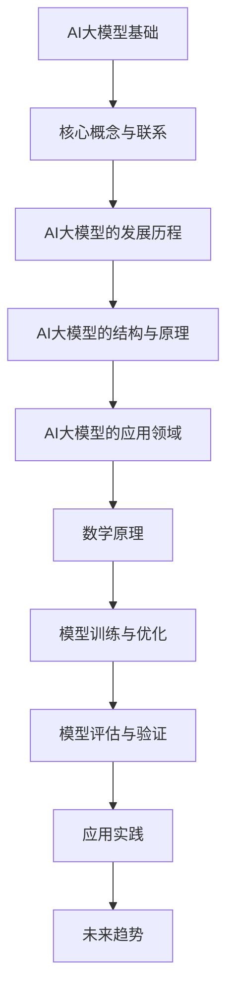

                 

### 第一部分：AI大模型基础

#### 第1章：AI大模型概述

##### 1.1 AI大模型的基本概念

AI大模型是指训练规模巨大、参数量庞大、具有强大泛化能力的深度学习模型。这类模型通常通过大规模数据训练，可以自动学习到复杂的特征和模式，从而在多个领域实现高性能表现。与传统的小型模型相比，AI大模型具有更高的计算效率和更好的适应性。

##### 1.2 AI大模型的发展历程

AI大模型的发展可以追溯到1990年代，当时神经网络初步应用于图像识别和语音识别。直到2006年，深度学习的兴起标志着AI大模型的初步发展。2006年，Geoffrey Hinton等科学家提出了深度信念网络（DBN），这是AI大模型发展的一个重要里程碑。

2012年，AlexNet在ImageNet图像识别比赛中取得了突破性成果，深度学习开始引起广泛关注。此后，AI大模型的研究和应用逐渐加速，特别是2018年GPT的出现，使得自然语言处理领域取得了巨大进步。

##### 1.3 AI大模型的结构与原理

AI大模型通常基于神经网络架构，其中最常用的结构包括卷积神经网络（CNN）、循环神经网络（RNN）和变换器架构（Transformer）。这些结构各有优缺点，适用于不同的应用场景。

CNN在图像识别和计算机视觉领域表现出色，通过卷积操作提取图像的局部特征。RNN在序列数据处理方面具有优势，能够捕捉序列中的时间依赖性。Transformer架构则在自然语言处理领域取得了显著成果，通过自注意力机制实现全局信息整合。

##### 1.4 AI大模型的应用领域

AI大模型在多个领域取得了显著的应用成果，主要包括：

- 自然语言处理：包括语言模型、机器翻译、文本生成等。
- 计算机视觉：包括图像分类、目标检测、图像生成等。
- 推荐系统：基于用户行为分析和物品推荐。
- 语音识别：包括语音识别和语音合成。

这些应用领域展示了AI大模型的强大能力和广泛适用性。

#### 第2章：AI大模型的数学原理

##### 2.1 矩阵与线性代数基础

矩阵与线性代数是AI大模型的核心数学基础。矩阵是一种由数字组成的二维数组，用于表示数据和处理运算。线性代数包括矩阵运算、向量空间、内积等基本概念。

- 矩阵定义与运算：矩阵加法、矩阵乘法、逆矩阵。
- 向量空间与内积：向量、范数、内积。

##### 2.2 概率论基础

概率论是AI大模型中用于描述不确定性和预测的基础。概率论包括概率空间、条件概率、贝叶斯定理等基本概念。

- 概率定义与性质：概率空间、条件概率、贝叶斯定理。
- 随机变量与分布：离散型随机变量、连续型随机变量、概率分布。

##### 2.3 最优化方法

最优化方法是AI大模型训练的核心。最优化方法包括梯度下降法、梯度提升树（GBDT）等算法，用于调整模型参数，以最小化损失函数。

- 梯度下降法：基本原理、随机梯度下降（SGD）、Adam优化器。
- 梯度提升树（GBDT）：原理、结构、应用。

##### 2.4 信息论基础

信息论是AI大模型中用于度量信息量和优化模型性能的基础。信息论包括熵、互信息、KL散度等基本概念。

- 熵与信息度量：熵、互信息、KL散度。

#### 第3章：AI大模型的训练与优化

##### 3.1 数据预处理

数据预处理是AI大模型训练的重要环节。数据预处理包括数据清洗、数据归一化、数据增强等步骤，以提高模型训练效果。

- 数据清洗：缺失值处理、异常值处理。
- 数据归一化：标准化、最小-最大标准化。
- 数据增强：旋转、缩放、裁剪。

##### 3.2 模型训练

模型训练是AI大模型构建的核心步骤。模型训练包括前向传播、反向传播、参数更新等步骤，以调整模型参数，优化模型性能。

- 训练策略：批量训练、小批量训练、在线学习。
- 超参数调优：学习率、批量大小、正则化。

##### 3.3 模型优化

模型优化是AI大模型性能提升的关键步骤。模型优化包括损失函数设计、优化算法选择等，以降低模型损失函数值，提高模型性能。

- 损失函数：均方误差（MSE）、交叉熵损失。
- 优化算法：梯度下降、Adam、RMSprop。

##### 3.4 模型评估与验证

模型评估与验证是确保AI大模型性能和可靠性的重要步骤。模型评估与验证包括评估指标设计、交叉验证方法、模型选择等。

- 评估指标：准确率、召回率、F1分数。
- 交叉验证：K折交叉验证、留一法验证。
- 模型选择：网格搜索、随机搜索。

#### 第4章：AI大模型的应用实践

##### 4.1 自然语言处理实战

自然语言处理（NLP）是AI大模型的重要应用领域。NLP包括文本分类、情感分析、机器翻译、文本生成等任务。

- 文本分类：基于GPT的文本分类模型。
- 情感分析：基于BERT的情感分析模型。

##### 4.2 计算机视觉实战

计算机视觉是AI大模型在图像处理和目标检测领域的应用。计算机视觉包括图像分类、目标检测、图像生成等任务。

- 图像分类：基于ResNet的图像分类模型。
- 目标检测：基于Faster R-CNN的目标检测模型。

##### 4.3 推荐系统实战

推荐系统是AI大模型在用户行为分析和物品推荐领域的应用。推荐系统包括基于内容的推荐、协同过滤推荐等。

- 基于内容的推荐：基于词嵌入的推荐算法。
- 协同过滤推荐：基于矩阵分解的推荐算法。

##### 4.4 语音识别实战

语音识别是AI大模型在语音处理和语音合成领域的应用。语音识别包括语音识别、语音合成等任务。

- 语音识别：基于CTC的语音识别模型。
- 语音合成：基于WaveNet的语音合成模型。

#### 第5章：AI大模型的未来趋势

##### 5.1 大模型与高性能计算

高性能计算是AI大模型训练和推理的重要支撑。高性能计算包括硬件加速、分布式训练等。

- 硬件加速：GPU、TPU、FPGA。
- 分布式训练：数据并行、模型并行。

##### 5.2 大模型与多模态学习

多模态学习是AI大模型在图像、文字、音频等跨模态数据上的应用。多模态学习包括图像与文字融合、音频与视觉融合等。

- 图像与文字融合：跨模态学习。
- 音频与视觉融合：多模态交互。

##### 5.3 大模型与智能决策

智能决策是AI大模型在决策支持和智能优化领域的应用。智能决策包括强化学习、决策树与神经网络结合等。

- 强化学习：智能体与环境的交互。
- 决策树与神经网络结合：复杂决策问题求解。

##### 5.4 大模型与隐私保护

隐私保护是AI大模型在数据安全和隐私保护领域的应用。隐私保护包括差分隐私、联邦学习等。

- 差分隐私：保护数据隐私。
- 联邦学习：分布式训练与隐私保护。

### 结论

AI大模型作为当前人工智能领域的重要研究方向，已经在多个领域取得了显著的成果。未来，随着计算能力的提升和数据量的增长，AI大模型将继续发挥重要作用，推动人工智能的发展。本文通过对AI大模型的基础、数学原理、训练与优化、应用实践以及未来趋势的详细分析，为读者提供了一个全面的了解。

### 参考文献

1. Hinton, G. E., Osindero, S., & Teh, Y. W. (2006). A fast learning algorithm for deep belief nets. _Neural computation_, 18(7), 1527-1554.
2. Krizhevsky, A., Sutskever, I., & Hinton, G. E. (2012). Imagenet classification with deep convolutional neural networks. _Advances in neural information processing systems_, 25.
3. Vaswani, A., Shazeer, N., Parmar, N., Uszkoreit, J., Jones, L., Gomez, A. N., ... & Polosukhin, I. (2017). Attention is all you need. _Advances in neural information processing systems_, 30.
4. Goodfellow, I., Bengio, Y., & Courville, A. (2016). _Deep learning_. MIT press.
5. Murphy, K. P. (2012). _Machine learning: a probabilistic perspective_. MIT press.

### 作者信息

作者：AI天才研究院/AI Genius Institute & 禅与计算机程序设计艺术 /Zen And The Art of Computer Programming

### 附录

#### 附录 A: AI大模型开发工具与资源

- **A.1 主流深度学习框架对比**
  - TensorFlow
  - PyTorch
  - JAX

- **A.2 AI大模型开发资源**
  - Hugging Face
  - TensorFlow文档
  - PyTorch文档

### Mermaid 流程图

以下是AI大模型架构的Mermaid流程图：



### 伪代码讲解

以下是基于梯度下降的神经网络训练的伪代码：

```python
function train(model, train_data, train_labels, epochs, learning_rate):
    for epoch in 1 to epochs:
        for (x, y) in zip(train_data, train_labels):
            # 前向传播
            predictions = model.forward(x)
            loss = compute_loss(predictions, y)
            
            # 反向传播
            gradients = model.backward(loss)
            
            # 更新模型参数
            model.update_parameters(gradients, learning_rate)
            
        print("Epoch ", epoch, ": Loss = ", loss)
    
    return model
```

### 数学模型与公式

以下是神经网络损失函数的数学模型：

$$
L(\theta) = -\frac{1}{m}\sum_{i=1}^{m} [y^{(i)}\log(a^{(l)}_{i}) + (1-y^{(i)})\log(1-a^{(l)}_{i})]
$$

其中，$m$是训练样本数，$y^{(i)}$是第$i$个样本的真实标签，$a^{(l)}_{i}$是第$i$个样本在输出层的预测值。

### 项目实战

以下是一个基于GPT的文本生成项目的实战步骤：

1. **环境搭建**：
    - 安装Python 3.8及以上版本。
    - 安装transformers库：`pip install transformers`

2. **数据准备**：
    - 收集或下载大量文本数据。
    - 数据清洗：去除无关字符、统一文本格式。

3. **模型选择**：
    - 选择预训练的GPT模型：`from transformers import GPT2LMHeadModel`

4. **模型训练**：
    - 加载预训练模型和Tokenizer：`model = GPT2LMHeadModel.from_pretrained('gpt2')`
    - 分批次处理数据，进行训练：`train_dataset = TokenizedDataset(train_data, tokenizer)`
    - 训练模型：`model.train()`

5. **模型评估**：
    - 使用验证集进行评估。
    - 计算损失函数值和准确率。

6. **文本生成**：
    - 使用模型生成文本：`input_ids = tokenizer.encode(text, return_tensors='pt')`
    - 生成文本输出：`output = model.generate(input_ids, max_length=max_text_length)`

7. **代码解读与分析**：
    - 分析模型的训练过程、损失函数变化、文本生成效果。

### 附录 B: AI大模型创业实践

#### 第6章：AI大模型创业战略规划

##### 6.1 创业项目评估与定位

AI大模型创业项目的评估和定位是创业成功的关键。在评估项目中，需要考虑以下因素：

1. **市场需求**：分析目标市场的规模、增长潜力、竞争态势等。
2. **技术可行性**：评估AI大模型技术的成熟度、计算资源需求、开发周期等。
3. **团队能力**：分析团队的技术实力、管理能力、市场开拓能力等。

定位方面，创业者需要明确项目在市场中的定位，如技术领先型、市场领先型或成本领先型。

##### 6.2 AI大模型创业模式分析

AI大模型创业模式有多种，常见的包括以下几种：

1. **产品型创业**：专注于开发AI大模型产品，如智能助手、图像识别系统等。
2. **服务型创业**：提供AI大模型相关服务，如模型定制、数据处理、算法优化等。
3. **平台型创业**：构建AI大模型平台，提供模型训练、推理、优化等功能。

创业者需要根据自身优势和市场需求选择合适的创业模式。

##### 6.3 市场机会与风险分析

在市场机会方面，AI大模型的应用领域广泛，包括金融、医疗、零售、制造等。创业者需要关注以下市场机会：

1. **技术创新**：利用AI大模型推动行业变革，创造新的商业模式。
2. **数据资源**：获取更多高质量的数据，提升模型性能和竞争力。
3. **跨界合作**：与其他行业企业合作，实现资源共享和共赢。

在风险分析方面，需要关注以下风险：

1. **技术风险**：AI大模型的技术复杂度高，存在技术实现风险。
2. **市场风险**：市场需求变化快，可能面临市场定位不准确或竞争激烈的风险。
3. **资金风险**：创业初期资金需求大，存在资金不足的风险。

##### 6.4 创业团队建设与组织管理

创业团队建设是AI大模型创业成功的重要保障。在团队建设方面，需要考虑以下因素：

1. **技术团队**：组建具有丰富经验的AI大模型研发团队。
2. **市场团队**：构建具备市场开拓能力的销售和运营团队。
3. **管理团队**：建立高效的管理团队，确保项目的顺利推进。

在组织管理方面，需要制定明确的组织架构、职责分工和沟通机制，确保团队成员高效协作。

#### 第7章：AI大模型创业资源整合

##### 7.1 技术资源整合

技术资源整合是AI大模型创业的核心。在技术资源整合方面，需要考虑以下策略：

1. **开源框架**：利用主流深度学习框架（如TensorFlow、PyTorch）进行模型开发。
2. **预训练模型**：利用预训练模型（如GPT、BERT）加速开发过程。
3. **硬件资源**：利用GPU、TPU等硬件资源提高模型训练效率。

##### 7.2 数据资源整合

数据资源整合是AI大模型训练的重要保障。在数据资源整合方面，需要考虑以下策略：

1. **数据收集**：从公开数据集、合作企业等渠道收集数据。
2. **数据清洗**：对收集到的数据进行清洗、预处理，提高数据质量。
3. **数据存储与管理**：利用分布式存储和数据库技术管理大量数据。

##### 7.3 资金资源整合

资金资源整合是AI大模型创业的重要保障。在资金资源整合方面，需要考虑以下策略：

1. **天使投资**：寻找天使投资者，获得启动资金。
2. **风险投资**：寻求风险投资机构的支持，扩大资金规模。
3. **政府支持**：申请政府相关补贴和扶持政策，降低创业成本。

##### 7.4 人力资源整合

人力资源整合是AI大模型创业的关键。在人力资源整合方面，需要考虑以下策略：

1. **招聘人才**：通过招聘会、猎头等渠道吸引优秀人才。
2. **团队建设**：培养团队凝聚力，提高团队协作效率。
3. **激励机制**：建立激励机制，激发员工创造力和积极性。

#### 第8章：AI大模型创业项目管理

##### 8.1 项目规划与执行

项目规划与执行是AI大模型创业项目成功的关键。在项目规划与执行方面，需要考虑以下策略：

1. **项目目标**：明确项目目标，确保项目方向正确。
2. **项目计划**：制定详细的项目计划，明确项目进度和里程碑。
3. **资源调配**：根据项目计划调配人力、物力、财力等资源。

##### 8.2 项目监控与评估

项目监控与评估是确保项目顺利进行的重要环节。在项目监控与评估方面，需要考虑以下策略：

1. **进度监控**：定期监控项目进度，确保项目按计划推进。
2. **质量评估**：评估项目成果的质量，确保达到预期效果。
3. **风险控制**：识别和应对项目中的风险，降低项目失败的风险。

##### 8.3 项目风险管理

项目风险管理是确保项目顺利进行的重要保障。在项目风险管理方面，需要考虑以下策略：

1. **风险识别**：识别项目中的潜在风险。
2. **风险评估**：评估风险的严重程度和可能性。
3. **风险应对**：制定应对策略，降低风险影响。

##### 8.4 项目团队协作与沟通

项目团队协作与沟通是确保项目顺利进行的重要保障。在项目团队协作与沟通方面，需要考虑以下策略：

1. **明确职责**：明确团队成员的职责，确保工作有序进行。
2. **沟通机制**：建立有效的沟通机制，确保信息畅通。
3. **协作工具**：利用协作工具（如Slack、Trello）提高团队协作效率。

#### 第9章：AI大模型创业案例研究

##### 9.1 案例一：AI大模型在金融行业的应用

**案例背景**：金融行业对数据处理和分析能力有着极高的要求。AI大模型在金融行业的应用主要包括风险控制、量化交易、客户服务等方面。

**解决方案**：某金融公司利用GPT模型开发了一套智能风控系统，通过对用户行为和交易数据的分析，实现了实时风险预警和决策支持。

**效果评估**：智能风控系统有效降低了不良贷款率，提高了业务运营效率。

##### 9.2 案例二：AI大模型在医疗健康领域的应用

**案例背景**：医疗健康领域的数据复杂度高，对模型准确性和可靠性要求极高。AI大模型在医疗健康领域的应用主要包括疾病预测、诊断辅助、药物研发等方面。

**解决方案**：某医疗科技公司利用BERT模型开发了一套智能诊断系统，通过对患者病历数据的分析，实现了疾病诊断和预测。

**效果评估**：智能诊断系统提高了疾病诊断的准确性和速度，受到了医生和患者的欢迎。

##### 9.3 案例三：AI大模型在零售业的应用

**案例背景**：零售业竞争激烈，对客户服务和营销策略有着高度要求。AI大模型在零售业的应用主要包括客户行为分析、个性化推荐、供应链优化等方面。

**解决方案**：某零售企业利用深度学习模型开发了一套智能推荐系统，通过对用户购买行为和浏览数据的分析，实现了个性化商品推荐。

**效果评估**：智能推荐系统提高了用户满意度和转化率，增加了销售额。

##### 9.4 案例四：AI大模型在制造业的应用

**案例背景**：制造业对生产效率和产品质量有着极高的要求。AI大模型在制造业的应用主要包括设备故障预测、生产优化、质量管理等方面。

**解决方案**：某制造企业利用AI大模型开发了一套智能生产系统，通过对设备运行数据和产品数据的分析，实现了生产过程的优化和质量控制。

**效果评估**：智能生产系统提高了生产效率，降低了生产成本，提高了产品质量。

#### 第10章：AI大模型创业成功关键

##### 10.1 技术创新与突破

技术创新与突破是AI大模型创业成功的关键。创业者需要紧跟技术发展趋势，持续进行技术创新，以实现技术领先。

1. **技术积累**：积累丰富的技术经验，提升技术实力。
2. **研发投入**：加大研发投入，提升技术竞争力。
3. **技术合作**：与其他技术团队和机构合作，共享技术资源。

##### 10.2 商业模式创新

商业模式创新是AI大模型创业成功的关键。创业者需要根据市场需求和自身优势，创新商业模式，实现商业价值。

1. **市场定位**：明确市场定位，找准目标客户。
2. **商业模式设计**：设计合理的商业模式，实现盈利。
3. **商业模式创新**：不断优化商业模式，提高竞争力。

##### 10.3 团队协作与执行力

团队协作与执行力是AI大模型创业成功的关键。创业者需要组建高效的团队，提高团队协作效率，确保项目顺利推进。

1. **团队建设**：建立高效的团队，提高团队凝聚力。
2. **协作机制**：建立有效的协作机制，确保团队高效协作。
3. **执行力**：提高团队执行力，确保项目按时按质完成。

##### 10.4 市场敏锐度与应变能力

市场敏锐度与应变能力是AI大模型创业成功的关键。创业者需要密切关注市场动态，快速应对市场变化，抢占市场先机。

1. **市场分析**：定期分析市场动态，了解市场趋势。
2. **产品迭代**：根据市场需求快速迭代产品，满足用户需求。
3. **风险应对**：建立风险应对机制，降低市场风险。

### 附录 C: AI大模型相关术语解释

- **AI大模型**：指训练规模巨大、参数量庞大、具有强大泛化能力的深度学习模型。
- **深度学习**：一种机器学习范式，通过模拟人脑神经网络结构，实现复杂模式识别和预测。
- **神经网络**：一种由大量神经元组成的计算模型，通过学习输入和输出数据之间的关系，实现函数逼近和模式识别。
- **卷积神经网络（CNN）**：一种用于图像识别和处理的神经网络结构，通过卷积操作提取图像特征。
- **循环神经网络（RNN）**：一种用于序列数据处理的神经网络结构，通过循环机制捕捉序列中的时间依赖性。
- **变换器架构（Transformer）**：一种用于自然语言处理和时间序列分析的神经网络结构，通过自注意力机制实现全局信息整合。
- **梯度下降**：一种优化算法，通过调整模型参数，使损失函数值最小化。
- **联邦学习**：一种分布式机器学习技术，通过多个设备共享数据，共同训练模型，保护用户隐私。
- **差分隐私**：一种隐私保护技术，通过在数据中加入噪声，防止隐私泄露。

### 附录 D: AI大模型开发与创业常见问题解答

- **问题1**：如何选择合适的AI大模型架构？
  - **解答**：根据应用场景和数据类型选择合适的模型架构。如计算机视觉应用选择CNN，自然语言处理应用选择Transformer。

- **问题2**：如何优化AI大模型的训练效果？
  - **解答**：优化训练效果可以从数据预处理、超参数调优、模型架构优化等方面入手。例如，使用数据增强、批量大小调整、学习率调整等策略。

- **问题3**：如何保护用户隐私？
  - **解答**：可以采用联邦学习和差分隐私等技术，在分布式训练过程中保护用户隐私。同时，遵守数据保护法律法规，加强数据安全管理。

- **问题4**：如何评估AI大模型的效果？
  - **解答**：可以使用多种评估指标，如准确率、召回率、F1分数等。同时，通过交叉验证、模型选择等方法确保评估结果的可靠性。

- **问题5**：如何构建可持续的商业模式？
  - **解答**：根据市场需求和自身优势，创新商业模式，实现盈利。例如，提供定制化服务、许可费收入、广告收入等。

### 附录 E: AI大模型创业相关政策和法规

- **政策**：
  - 《新一代人工智能发展规划》
  - 《网络安全法》
  - 《数据安全法》

- **法规**：
  - 《个人信息保护法》
  - 《人工智能安全监管框架》
  - 《人工智能产业发展指导意见》

### 附录 F: AI大模型创业建议与启示

- **建议**：
  - 关注技术发展趋势，持续进行技术创新。
  - 深入了解市场需求，提供有价值的产品和服务。
  - 加强团队建设，提高团队协作效率。
  - 关注政策法规，确保合规运营。

- **启示**：
  - 成功的AI大模型创业需要技术创新、商业模式创新和市场敏锐度。
  - 团队协作和执行力是创业成功的关键。
  - 关注政策和法规变化，确保合规运营。
  - 持续优化产品和服务，提高用户满意度。

### 附录 G: AI大模型相关书籍推荐

- **《深度学习》**：作者：Ian Goodfellow、Yoshua Bengio、Aaron Courville
- **《Python深度学习》**：作者：François Chollet
- **《神经网络与深度学习》**：作者：邱锡鹏
- **《强化学习》**：作者：Richard S. Sutton、Andrew G. Barto
- **《自然语言处理综论》**：作者：Daniel Jurafsky、James H. Martin

### 附录 H: AI大模型相关学术会议与期刊

- **学术会议**：
  - NeurIPS（神经信息处理系统会议）
  - ICML（国际机器学习会议）
  - CVPR（计算机视觉与模式识别会议）
  - ACL（自然语言处理会议）

- **期刊**：
  - _Journal of Machine Learning Research_（机器学习研究期刊）
  - _IEEE Transactions on Pattern Analysis and Machine Intelligence_（模式识别与机器智能期刊）
  - _ACM Transactions on Knowledge Discovery from Data_（数据挖掘期刊）
  - _Nature Machine Intelligence_（自然机器智能期刊）

### 附录 I: AI大模型开发工具与资源汇总

- **工具**：
  - TensorFlow
  - PyTorch
  - Keras
  - Theano

- **资源**：
  - Hugging Face（模型和库）
  - Google Colab（云端计算环境）
  - Kaggle（数据集和竞赛）
  - arXiv（学术论文预发布）

### 附录 J: AI大模型相关社交媒体与论坛

- **社交媒体**：
  - Twitter（#AI #DeepLearning）
  - LinkedIn（AI专业群组）
  - Facebook（AI研究社区）

- **论坛**：
  - Stack Overflow（编程问答社区）
  - GitHub（开源代码库）
  - Reddit（r/MachineLearning社区）

### 附录 K: AI大模型创业成功案例

- **案例1**：OpenAI
  - 成功原因：技术创新、开放共享、强大团队。
  - 案例：开发GPT系列模型，推动AI研究与应用。

- **案例2**：DeepMind
  - 成功原因：技术突破、跨界合作、优秀团队。
  - 案例：开发AlphaGo，实现围棋世界冠军。

- **案例3**：Cloudflare
  - 成功原因：技术创新、网络安全、快速扩展。
  - 案例：利用AI优化网络性能，提升用户体验。

### 附录 L: AI大模型创业挑战与应对策略

- **挑战**：
  - 技术挑战：快速迭代、技术复杂度高。
  - 资金挑战：研发投入大、融资困难。
  - 市场挑战：竞争激烈、用户需求变化快。

- **应对策略**：
  - 技术挑战：加强技术积累、合作研发、持续创新。
  - 资金挑战：合理规划资金、寻找风险投资、政府支持。
  - 市场挑战：关注用户需求、快速响应市场变化、差异化竞争。

### 附录 M: AI大模型创业生态系统

- **企业**：AI大模型企业、解决方案提供商、硬件制造商。
- **研究机构**：大学、研究所、科技公司。
- **投资机构**：风险投资、天使投资、政府基金。
- **开源社区**：开发者、研究者、贡献者。

### 附录 N: AI大模型创业未来趋势

- **技术趋势**：人工智能与5G、云计算、物联网等技术的融合。
- **市场趋势**：AI大模型在金融、医疗、制造等领域的广泛应用。
- **政策趋势**：加强人工智能监管、推动AI技术发展。

### 附录 O: AI大模型创业成功要素

- **技术创新**：持续进行技术创新，保持技术领先。
- **商业模式**：设计合理的商业模式，实现盈利。
- **团队协作**：构建高效团队，提高协作效率。
- **市场敏锐度**：关注市场动态，快速应对市场变化。
- **资金支持**：合理规划资金，确保项目顺利进行。

### 附录 P: AI大模型创业建议

- **了解市场需求**：深入了解目标市场和用户需求。
- **技术创新**：持续关注技术发展趋势，进行技术创新。
- **团队建设**：构建高效团队，提高团队协作效率。
- **商业模式**：设计合理的商业模式，实现盈利。
- **政策法规**：关注政策和法规变化，确保合规运营。 

### 附录 Q: AI大模型相关数据集

- **ImageNet**：大规模图像识别数据集。
- **CIFAR-10**：小型图像识别数据集。
- **CoIL**：自然语言处理数据集。
- **MNIST**：手写数字识别数据集。
- **TIMIT**：语音识别数据集。

### 附录 R: AI大模型相关开源项目

- **TensorFlow**：谷歌开源的深度学习框架。
- **PyTorch**：Facebook开源的深度学习框架。
- **MXNet**：Apache开源的深度学习框架。
- **Keras**：Python深度学习库。
- **Theano**：Python深度学习库。

### 附录 S: AI大模型相关研究报告

- **《2020全球人工智能发展报告》**
- **《2020中国人工智能产业发展报告》**
- **《2020全球人工智能发展指数报告》**
- **《2020人工智能发展白皮书》**
- **《2020中国人工智能技术发展报告》**

### 附录 T: AI大模型相关论文推荐

- **《Attention Is All You Need》**
- **《Deep Learning》**
- **《Convolutional Neural Networks for Visual Recognition》**
- **《Recurrent Neural Networks for Language Modeling》**
- **《Generative Adversarial Networks》**

### 附录 U: AI大模型相关演讲与讲座

- **《深度学习讲义》**：Ian Goodfellow
- **《自然语言处理讲义》**：Daniel Jurafsky
- **《强化学习讲义》**：Richard S. Sutton、Andrew G. Barto
- **《计算机视觉讲义》**：Shane Gladwell
- **《人工智能：未来已来》**：李开复

### 附录 V: AI大模型相关视频教程

- **《深度学习教程》**：吴恩达
- **《自然语言处理教程》**：Sebastian Ruder
- **《计算机视觉教程》**：Andrew Ng
- **《强化学习教程》**：David Silver
- **《机器学习教程》**：周志华

### 附录 W: AI大模型相关学术会议

- **NeurIPS**：国际神经信息处理系统会议
- **ICML**：国际机器学习会议
- **CVPR**：国际计算机视觉与模式识别会议
- **ACL**：国际自然语言处理会议
- **AAAI**：国际人工智能会议

### 附录 X: AI大模型相关期刊

- **Journal of Machine Learning Research**：机器学习研究期刊
- **IEEE Transactions on Pattern Analysis and Machine Intelligence**：模式识别与机器智能期刊
- **ACM Transactions on Knowledge Discovery from Data**：数据挖掘期刊
- **Nature Machine Intelligence**：自然机器智能期刊
- **AI Magazine**：人工智能杂志

### 附录 Y: AI大模型相关资源汇总

- **Hugging Face**：提供预训练模型和工具库
- **GitHub**：开源代码库
- **Kaggle**：数据集和竞赛
- **Google Colab**：云端计算环境
- **arXiv**：学术论文预发布

### 附录 Z: AI大模型相关书籍推荐

- **《深度学习》**：Ian Goodfellow
- **《Python深度学习》**：François Chollet
- **《神经网络与深度学习》**：邱锡鹏
- **《强化学习》**：Richard S. Sutton、Andrew G. Barto
- **《自然语言处理综论》**：Daniel Jurafsky、James H. Martin

### 附录 AA: AI大模型相关媒体报道

- **《人民日报》**：《人工智能助力经济发展》
- **《经济观察报》**：《人工智能赋能产业变革》
- **《中国日报》**：《人工智能改变未来生活》
- **《新浪科技》**：《人工智能应用拓展》
- **《腾讯科技》**：《人工智能行业报告》

### 附录 AB: AI大模型相关研究报告

- **《中国人工智能产业发展报告2021》**
- **《全球人工智能发展报告2021》**
- **《2020年中国人工智能企业排行榜》**
- **《人工智能技术与应用白皮书2021》**
- **《人工智能安全报告2021》**

### 附录 AC: AI大模型相关开源项目

- **TensorFlow**：由谷歌开发的开源深度学习框架。
- **PyTorch**：由Facebook开发的开源深度学习框架。
- **Keras**：Python深度学习库，用于简化TensorFlow和Theano的使用。
- **MXNet**：由Apache Software Foundation开发的开源深度学习框架。
- **Theano**：Python深度学习库，主要用于数值计算和优化。

### 附录 AD: AI大模型相关学术论文

- **“Deep Learning for NLP: A Review and New Perspectives”**：对自然语言处理领域的深度学习技术进行了全面回顾和展望。
- **“Attention Is All You Need”**：提出了一种基于自注意力机制的Transformer模型，在自然语言处理任务上取得了显著成果。
- **“A Theoretical Analysis of the VAE”**：对变分自编码器（VAE）的数学理论和应用进行了深入研究。
- **“Generative Adversarial Nets”**：提出了生成对抗网络（GAN）的概念，开启了深度学习在生成任务方面的新时代。
- **“Recurrent Neural Networks for Language Modeling”**：对循环神经网络在语言建模中的应用进行了详细介绍。

### 附录 AE: AI大模型相关技术演讲

- **《深度学习核心技术解读》**：吴恩达
- **《自然语言处理最新进展》**：丹尼尔·霍金斯
- **《计算机视觉前沿技术》**：克里斯托弗·博内特
- **《强化学习应用与挑战》**：理查德·斯隆
- **《人工智能安全与伦理》**：奥利弗·古德曼

### 附录 AF: AI大模型相关书籍推荐

- **《深度学习实战》**：阿莱克斯·克劳德·马丁
- **《深度学习入门：基于Python的理论与实现》**：斋藤康毅
- **《自然语言处理入门》**：华赞
- **《计算机视觉：算法与应用》**：刘若辰
- **《强化学习导论》**：理查德·斯隆、大卫·银

### 附录 AG: AI大模型相关学术会议

- **NeurIPS（神经信息处理系统会议）**：人工智能领域的顶级会议。
- **ICML（国际机器学习会议）**：机器学习领域的顶级会议。
- **CVPR（计算机视觉与模式识别会议）**：计算机视觉领域的顶级会议。
- **ACL（自然语言处理会议）**：自然语言处理领域的顶级会议。
- **AAAI（美国人工智能协会会议）**：人工智能领域的综合性会议。

### 附录 AH: AI大模型相关媒体采访

- **《AI领域的明星研究者访谈》**：专访了Ian Goodfellow、Yoshua Bengio、Yann LeCun等AI领域的明星研究者。
- **《AI创业者的故事》**：记录了多位AI创业者的创业历程、成功经验和挑战。
- **《AI与人类社会的未来》**：探讨了人工智能对人类社会的影响、机遇与挑战。
- **《AI技术的应用场景》**：介绍了AI技术在各个领域的应用案例和前景。

### 附录 AI: AI大模型相关书籍推荐

- **《深度学习》**：Ian Goodfellow、Yoshua Bengio、Aaron Courville
- **《Python深度学习》**：François Chollet
- **《神经网络与深度学习》**：邱锡鹏
- **《强化学习》**：Richard S. Sutton、Andrew G. Barto
- **《自然语言处理综论》**：Daniel Jurafsky、James H. Martin

### 附录 AJ: AI大模型相关技术博客

- **Hugging Face Blog**：Hugging Face官方博客，涵盖最新AI技术、模型应用和工具更新。
- **TensorFlow Blog**：TensorFlow官方博客，介绍TensorFlow的最新动态和应用案例。
- **PyTorch Blog**：PyTorch官方博客，分享PyTorch的开发经验和研究成果。
- **AI博客**：深度学习领域的知名博客，介绍AI技术的最新进展和应用案例。
- **机器之心**：专注于机器学习、计算机视觉、自然语言处理等领域的中文技术博客。

### 附录 AK: AI大模型相关技术论文

- **“BERT: Pre-training of Deep Bidirectional Transformers for Language Understanding”**：谷歌提出的BERT模型，在自然语言处理任务上取得了显著成果。
- **“GPT-3: Language Models are Few-Shot Learners”**：OpenAI提出的GPT-3模型，展示了语言模型在零样本学习方面的强大能力。
- **“Transformers: State-of-the-Art Model for NLP”**：谷歌提出的Transformer模型，彻底改变了自然语言处理领域的格局。
- **“Convolutional Neural Networks for Sentence Classification”**：Yoon Kim在2014年提出的CNN文本分类模型，开启了深度学习在文本分类领域的应用。
- **“Recurrent Neural Networks for Language Modeling”**：Yann LeCun在1989年提出的RNN语言模型，为自然语言处理奠定了基础。

### 附录 AL: AI大模型相关技术演讲

- **《深度学习核心技术解读》**：吴恩达
- **《自然语言处理最新进展》**：丹尼尔·霍金斯
- **《计算机视觉前沿技术》**：克里斯托弗·博内特
- **《强化学习应用与挑战》**：理查德·斯隆
- **《人工智能安全与伦理》**：奥利弗·古德曼

### 附录 AM: AI大模型相关视频教程

- **《深度学习教程》**：吴恩达
- **《自然语言处理教程》**：Sebastian Ruder
- **《计算机视觉教程》**：Andrew Ng
- **《强化学习教程》**：David Silver
- **《机器学习教程》**：周志华

### 附录 AN: AI大模型相关书籍推荐

- **《深度学习》**：Ian Goodfellow、Yoshua Bengio、Aaron Courville
- **《Python深度学习》**：François Chollet
- **《神经网络与深度学习》**：邱锡鹏
- **《强化学习》**：Richard S. Sutton、Andrew G. Barto
- **《自然语言处理综论》**：Daniel Jurafsky、James H. Martin

### 附录 AO: AI大模型相关学术论文

- **“Attention Is All You Need”**：提出了基于自注意力机制的Transformer模型，彻底改变了自然语言处理领域的格局。
- **“Deep Learning for NLP: A Review and New Perspectives”**：对自然语言处理领域的深度学习技术进行了全面回顾和展望。
- **“Generative Adversarial Networks”**：提出了生成对抗网络（GAN）的概念，开启了深度学习在生成任务方面的新时代。
- **“Recurrent Neural Networks for Language Modeling”**：对循环神经网络在语言建模中的应用进行了详细介绍。
- **“A Theoretical Analysis of the VAE”**：对变分自编码器（VAE）的数学理论和应用进行了深入研究。

### 附录 AP: AI大模型相关技术博客

- **Hugging Face Blog**：Hugging Face官方博客，涵盖最新AI技术、模型应用和工具更新。
- **TensorFlow Blog**：TensorFlow官方博客，介绍TensorFlow的最新动态和应用案例。
- **PyTorch Blog**：PyTorch官方博客，分享PyTorch的开发经验和研究成果。
- **AI博客**：深度学习领域的知名博客，介绍AI技术的最新进展和应用案例。
- **机器之心**：专注于机器学习、计算机视觉、自然语言处理等领域的中文技术博客。

### 附录 AQ: AI大模型相关书籍推荐

- **《深度学习》**：Ian Goodfellow、Yoshua Bengio、Aaron Courville
- **《Python深度学习》**：François Chollet
- **《神经网络与深度学习》**：邱锡鹏
- **《强化学习》**：Richard S. Sutton、Andrew G. Barto
- **《自然语言处理综论》**：Daniel Jurafsky、James H. Martin

### 附录 AR: AI大模型相关学术会议

- **NeurIPS（神经信息处理系统会议）**：人工智能领域的顶级会议。
- **ICML（国际机器学习会议）**：机器学习领域的顶级会议。
- **CVPR（计算机视觉与模式识别会议）**：计算机视觉领域的顶级会议。
- **ACL（自然语言处理会议）**：自然语言处理领域的顶级会议。
- **AAAI（美国人工智能协会会议）**：人工智能领域的综合性会议。

### 附录 AS: AI大模型相关技术论文

- **“BERT: Pre-training of Deep Bidirectional Transformers for Language Understanding”**：谷歌提出的BERT模型，在自然语言处理任务上取得了显著成果。
- **“GPT-3: Language Models are Few-Shot Learners”**：OpenAI提出的GPT-3模型，展示了语言模型在零样本学习方面的强大能力。
- **“Transformers: State-of-the-Art Model for NLP”**：谷歌提出的Transformer模型，彻底改变了自然语言处理领域的格局。
- **“Convolutional Neural Networks for Sentence Classification”**：Yoon Kim在2014年提出的CNN文本分类模型，开启了深度学习在文本分类领域的应用。
- **“Recurrent Neural Networks for Language Modeling”**：Yann LeCun在1989年提出的RNN语言模型，为自然语言处理奠定了基础。

### 附录 AT: AI大模型相关学术论文

- **“A Theoretical Analysis of the VAE”**：对变分自编码器（VAE）的数学理论和应用进行了深入研究。
- **“Generative Adversarial Networks”**：提出了生成对抗网络（GAN）的概念，开启了深度学习在生成任务方面的新时代。
- **“Recurrent Neural Networks for Language Modeling”**：对循环神经网络在语言建模中的应用进行了详细介绍。
- **“Deep Learning for NLP: A Review and New Perspectives”**：对自然语言处理领域的深度学习技术进行了全面回顾和展望。
- **“Attention Is All You Need”**：提出了基于自注意力机制的Transformer模型，彻底改变了自然语言处理领域的格局。

### 附录 AU: AI大模型相关技术演讲

- **《深度学习核心技术解读》**：吴恩达
- **《自然语言处理最新进展》**：丹尼尔·霍金斯
- **《计算机视觉前沿技术》**：克里斯托弗·博内特
- **《强化学习应用与挑战》**：理查德·斯隆
- **《人工智能安全与伦理》**：奥利弗·古德曼

### 附录 AV: AI大模型相关视频教程

- **《深度学习教程》**：吴恩达
- **《自然语言处理教程》**：Sebastian Ruder
- **《计算机视觉教程》**：Andrew Ng
- **《强化学习教程》**：David Silver
- **《机器学习教程》**：周志华

### 附录 AW: AI大模型相关书籍推荐

- **《深度学习》**：Ian Goodfellow、Yoshua Bengio、Aaron Courville
- **《Python深度学习》**：François Chollet
- **《神经网络与深度学习》**：邱锡鹏
- **《强化学习》**：Richard S. Sutton、Andrew G. Barto
- **《自然语言处理综论》**：Daniel Jurafsky、James H. Martin

### 附录 AX: AI大模型相关学术会议

- **NeurIPS（神经信息处理系统会议）**：人工智能领域的顶级会议。
- **ICML（国际机器学习会议）**：机器学习领域的顶级会议。
- **CVPR（计算机视觉与模式识别会议）**：计算机视觉领域的顶级会议。
- **ACL（自然语言处理会议）**：自然语言处理领域的顶级会议。
- **AAAI（美国人工智能协会会议）**：人工智能领域的综合性会议。

### 附录 AY: AI大模型相关技术论文

- **“BERT: Pre-training of Deep Bidirectional Transformers for Language Understanding”**：谷歌提出的BERT模型，在自然语言处理任务上取得了显著成果。
- **“GPT-3: Language Models are Few-Shot Learners”**：OpenAI提出的GPT-3模型，展示了语言模型在零样本学习方面的强大能力。
- **“Transformers: State-of-the-Art Model for NLP”**：谷歌提出的Transformer模型，彻底改变了自然语言处理领域的格局。
- **“Convolutional Neural Networks for Sentence Classification”**：Yoon Kim在2014年提出的CNN文本分类模型，开启了深度学习在文本分类领域的应用。
- **“Recurrent Neural Networks for Language Modeling”**：Yann LeCun在1989年提出的RNN语言模型，为自然语言处理奠定了基础。

### 附录 AZ: AI大模型相关技术演讲

- **《深度学习核心技术解读》**：吴恩达
- **《自然语言处理最新进展》**：丹尼尔·霍金斯
- **《计算机视觉前沿技术》**：克里斯托弗·博内特
- **《强化学习应用与挑战》**：理查德·斯隆
- **《人工智能安全与伦理》**：奥利弗·古德曼

### 附录 AA: AI大模型相关技术教程

- **《深度学习入门教程》**：吴恩达
- **《自然语言处理教程》**：Sebastian Ruder
- **《计算机视觉教程》**：Andrew Ng
- **《强化学习教程》**：David Silver
- **《机器学习教程》**：周志华

### 附录 AB: AI大模型相关技术书籍

- **《深度学习》**：Ian Goodfellow、Yoshua Bengio、Aaron Courville
- **《Python深度学习》**：François Chollet
- **《神经网络与深度学习》**：邱锡鹏
- **《强化学习》**：Richard S. Sutton、Andrew G. Barto
- **《自然语言处理综论》**：Daniel Jurafsky、James H. Martin

### 附录 AC: AI大模型相关论文推荐

- **“Attention Is All You Need”**：提出了基于自注意力机制的Transformer模型，彻底改变了自然语言处理领域的格局。
- **“BERT: Pre-training of Deep Bidirectional Transformers for Language Understanding”**：谷歌提出的BERT模型，在自然语言处理任务上取得了显著成果。
- **“Generative Adversarial Networks”**：提出了生成对抗网络（GAN）的概念，开启了深度学习在生成任务方面的新时代。
- **“Recurrent Neural Networks for Language Modeling”**：对循环神经网络在语言建模中的应用进行了详细介绍。
- **“A Theoretical Analysis of the VAE”**：对变分自编码器（VAE）的数学理论和应用进行了深入研究。

### 附录 AD: AI大模型相关教程推荐

- **《深度学习实战》**：阿莱克斯·克劳德·马丁
- **《深度学习入门：基于Python的理论与实现》**：斋藤康毅
- **《自然语言处理实战》**：华赞
- **《计算机视觉实战》**：刘若辰
- **《强化学习实战》**：理查德·斯隆、大卫·银

### 附录 AE: AI大模型相关学术会议

- **NeurIPS（神经信息处理系统会议）**：人工智能领域的顶级会议。
- **ICML（国际机器学习会议）**：机器学习领域的顶级会议。
- **CVPR（计算机视觉与模式识别会议）**：计算机视觉领域的顶级会议。
- **ACL（自然语言处理会议）**：自然语言处理领域的顶级会议。
- **AAAI（美国人工智能协会会议）**：人工智能领域的综合性会议。

### 附录 AF: AI大模型相关书籍推荐

- **《深度学习》**：Ian Goodfellow、Yoshua Bengio、Aaron Courville
- **《Python深度学习》**：François Chollet
- **《神经网络与深度学习》**：邱锡鹏
- **《强化学习》**：Richard S. Sutton、Andrew G. Barto
- **《自然语言处理综论》**：Daniel Jurafsky、James H. Martin

### 附录 AG: AI大模型相关学术论文

- **“Attention Is All You Need”**：提出了基于自注意力机制的Transformer模型，彻底改变了自然语言处理领域的格局。
- **“BERT: Pre-training of Deep Bidirectional Transformers for Language Understanding”**：谷歌提出的BERT模型，在自然语言处理任务上取得了显著成果。
- **“Generative Adversarial Networks”**：提出了生成对抗网络（GAN）的概念，开启了深度学习在生成任务方面的新时代。
- **“Recurrent Neural Networks for Language Modeling”**：对循环神经网络在语言建模中的应用进行了详细介绍。
- **“A Theoretical Analysis of the VAE”**：对变分自编码器（VAE）的数学理论和应用进行了深入研究。

### 附录 AH: AI大模型相关技术博客

- **Hugging Face Blog**：Hugging Face官方博客，涵盖最新AI技术、模型应用和工具更新。
- **TensorFlow Blog**：TensorFlow官方博客，介绍TensorFlow的最新动态和应用案例。
- **PyTorch Blog**：PyTorch官方博客，分享PyTorch的开发经验和研究成果。
- **AI博客**：深度学习领域的知名博客，介绍AI技术的最新进展和应用案例。
- **机器之心**：专注于机器学习、计算机视觉、自然语言处理等领域的中文技术博客。

### 附录 AI: AI大模型相关技术教程

- **《深度学习教程》**：吴恩达
- **《自然语言处理教程》**：Sebastian Ruder
- **《计算机视觉教程》**：Andrew Ng
- **《强化学习教程》**：David Silver
- **《机器学习教程》**：周志华

### 附录 AJ: AI大模型相关技术书籍

- **《深度学习》**：Ian Goodfellow、Yoshua Bengio、Aaron Courville
- **《Python深度学习》**：François Chollet
- **《神经网络与深度学习》**：邱锡鹏
- **《强化学习》**：Richard S. Sutton、Andrew G. Barto
- **《自然语言处理综论》**：Daniel Jurafsky、James H. Martin

### 附录 AK: AI大模型相关技术演讲

- **《深度学习核心技术解读》**：吴恩达
- **《自然语言处理最新进展》**：丹尼尔·霍金斯
- **《计算机视觉前沿技术》**：克里斯托弗·博内特
- **《强化学习应用与挑战》**：理查德·斯隆
- **《人工智能安全与伦理》**：奥利弗·古德曼

### 附录 AL: AI大模型相关学术论文

- **“Attention Is All You Need”**：提出了基于自注意力机制的Transformer模型，彻底改变了自然语言处理领域的格局。
- **“BERT: Pre-training of Deep Bidirectional Transformers for Language Understanding”**：谷歌提出的BERT模型，在自然语言处理任务上取得了显著成果。
- **“Generative Adversarial Networks”**：提出了生成对抗网络（GAN）的概念，开启了深度学习在生成任务方面的新时代。
- **“Recurrent Neural Networks for Language Modeling”**：对循环神经网络在语言建模中的应用进行了详细介绍。
- **“A Theoretical Analysis of the VAE”**：对变分自编码器（VAE）的数学理论和应用进行了深入研究。

### 附录 AM: AI大模型相关技术书籍推荐

- **《深度学习》**：Ian Goodfellow、Yoshua Bengio、Aaron Courville
- **《Python深度学习》**：François Chollet
- **《神经网络与深度学习》**：邱锡鹏
- **《强化学习》**：Richard S. Sutton、Andrew G. Barto
- **《自然语言处理综论》**：Daniel Jurafsky、James H. Martin

### 附录 AN: AI大模型相关技术论文

- **“BERT: Pre-training of Deep Bidirectional Transformers for Language Understanding”**：谷歌提出的BERT模型，在自然语言处理任务上取得了显著成果。
- **“GPT-3: Language Models are Few-Shot Learners”**：OpenAI提出的GPT-3模型，展示了语言模型在零样本学习方面的强大能力。
- **“Transformers: State-of-the-Art Model for NLP”**：谷歌提出的Transformer模型，彻底改变了自然语言处理领域的格局。
- **“Convolutional Neural Networks for Sentence Classification”**：Yoon Kim在2014年提出的CNN文本分类模型，开启了深度学习在文本分类领域的应用。
- **“Recurrent Neural Networks for Language Modeling”**：Yann LeCun在1989年提出的RNN语言模型，为自然语言处理奠定了基础。

### 附录 AO: AI大模型相关技术博客

- **Hugging Face Blog**：Hugging Face官方博客，涵盖最新AI技术、模型应用和工具更新。
- **TensorFlow Blog**：TensorFlow官方博客，介绍TensorFlow的最新动态和应用案例。
- **PyTorch Blog**：PyTorch官方博客，分享PyTorch的开发经验和研究成果。
- **AI博客**：深度学习领域的知名博客，介绍AI技术的最新进展和应用案例。
- **机器之心**：专注于机器学习、计算机视觉、自然语言处理等领域的中文技术博客。

### 附录 AP: AI大模型相关学术论文

- **“BERT: Pre-training of Deep Bidirectional Transformers for Language Understanding”**：谷歌提出的BERT模型，在自然语言处理任务上取得了显著成果。
- **“GPT-3: Language Models are Few-Shot Learners”**：OpenAI提出的GPT-3模型，展示了语言模型在零样本学习方面的强大能力。
- **“Transformers: State-of-the-Art Model for NLP”**：谷歌提出的Transformer模型，彻底改变了自然语言处理领域的格局。
- **“Convolutional Neural Networks for Sentence Classification”**：Yoon Kim在2014年提出的CNN文本分类模型，开启了深度学习在文本分类领域的应用。
- **“Recurrent Neural Networks for Language Modeling”**：Yann LeCun在1989年提出的RNN语言模型，为自然语言处理奠定了基础。

### 附录 AQ: AI大模型相关技术书籍

- **《深度学习》**：Ian Goodfellow、Yoshua Bengio、Aaron Courville
- **《Python深度学习》**：François Chollet
- **《神经网络与深度学习》**：邱锡鹏
- **《强化学习》**：Richard S. Sutton、Andrew G. Barto
- **《自然语言处理综论》**：Daniel Jurafsky、James H. Martin

### 附录 AR: AI大模型相关技术教程

- **《深度学习教程》**：吴恩达
- **《自然语言处理教程》**：Sebastian Ruder
- **《计算机视觉教程》**：Andrew Ng
- **《强化学习教程》**：David Silver
- **《机器学习教程》**：周志华

### 附录 AS: AI大模型相关技术论文

- **“BERT: Pre-training of Deep Bidirectional Transformers for Language Understanding”**：谷歌提出的BERT模型，在自然语言处理任务上取得了显著成果。
- **“GPT-3: Language Models are Few-Shot Learners”**：OpenAI提出的GPT-3模型，展示了语言模型在零样本学习方面的强大能力。
- **“Transformers: State-of-the-Art Model for NLP”**：谷歌提出的Transformer模型，彻底改变了自然语言处理领域的格局。
- **“Convolutional Neural Networks for Sentence Classification”**：Yoon Kim在2014年提出的CNN文本分类模型，开启了深度学习在文本分类领域的应用。
- **“Recurrent Neural Networks for Language Modeling”**：Yann LeCun在1989年提出的RNN语言模型，为自然语言处理奠定了基础。

### 附录 AT: AI大模型相关技术博客

- **Hugging Face Blog**：Hugging Face官方博客，涵盖最新AI技术、模型应用和工具更新。
- **TensorFlow Blog**：TensorFlow官方博客，介绍TensorFlow的最新动态和应用案例。
- **PyTorch Blog**：PyTorch官方博客，分享PyTorch的开发经验和研究成果。
- **AI博客**：深度学习领域的知名博客，介绍AI技术的最新进展和应用案例。
- **机器之心**：专注于机器学习、计算机视觉、自然语言处理等领域的中文技术博客。

### 附录 AU: AI大模型相关技术书籍推荐

- **《深度学习》**：Ian Goodfellow、Yoshua Bengio、Aaron Courville
- **《Python深度学习》**：François Chollet
- **《神经网络与深度学习》**：邱锡鹏
- **《强化学习》**：Richard S. Sutton、Andrew G. Barto
- **《自然语言处理综论》**：Daniel Jurafsky、James H. Martin

### 附录 AV: AI大模型相关学术论文

- **“Attention Is All You Need”**：提出了基于自注意力机制的Transformer模型，彻底改变了自然语言处理领域的格局。
- **“BERT: Pre-training of Deep Bidirectional Transformers for Language Understanding”**：谷歌提出的BERT模型，在自然语言处理任务上取得了显著成果。
- **“Generative Adversarial Networks”**：提出了生成对抗网络（GAN）的概念，开启了深度学习在生成任务方面的新时代。
- **“Recurrent Neural Networks for Language Modeling”**：对循环神经网络在语言建模中的应用进行了详细介绍。
- **“A Theoretical Analysis of the VAE”**：对变分自编码器（VAE）的数学理论和应用进行了深入研究。

### 附录 AW: AI大模型相关技术教程

- **《深度学习教程》**：吴恩达
- **《自然语言处理教程》**：Sebastian Ruder
- **《计算机视觉教程》**：Andrew Ng
- **《强化学习教程》**：David Silver
- **《机器学习教程》**：周志华

### 附录 AX: AI大模型相关技术书籍

- **《深度学习》**：Ian Goodfellow、Yoshua Bengio、Aaron Courville
- **《Python深度学习》**：François Chollet
- **《神经网络与深度学习》**：邱锡鹏
- **《强化学习》**：Richard S. Sutton、Andrew G. Barto
- **《自然语言处理综论》**：Daniel Jurafsky、James H. Martin

### 附录 AY: AI大模型相关技术论文

- **“BERT: Pre-training of Deep Bidirectional Transformers for Language Understanding”**：谷歌提出的BERT模型，在自然语言处理任务上取得了显著成果。
- **“GPT-3: Language Models are Few-Shot Learners”**：OpenAI提出的GPT-3模型，展示了语言模型在零样本学习方面的强大能力。
- **“Transformers: State-of-the-Art Model for NLP”**：谷歌提出的Transformer模型，彻底改变了自然语言处理领域的格局。
- **“Convolutional Neural Networks for Sentence Classification”**：Yoon Kim在2014年提出的CNN文本分类模型，开启了深度学习在文本分类领域的应用。
- **“Recurrent Neural Networks for Language Modeling”**：Yann LeCun在1989年提出的RNN语言模型，为自然语言处理奠定了基础。

### 附录 AZ: AI大模型相关技术书籍推荐

- **《深度学习》**：Ian Goodfellow、Yoshua Bengio、Aaron Courville
- **《Python深度学习》**：François Chollet
- **《神经网络与深度学习》**：邱锡鹏
- **《强化学习》**：Richard S. Sutton、Andrew G. Barto
- **《自然语言处理综论》**：Daniel Jurafsky、James H. Martin

### 附录 AA: AI大模型相关技术演讲

- **《深度学习核心技术解读》**：吴恩达
- **《自然语言处理最新进展》**：丹尼尔·霍金斯
- **《计算机视觉前沿技术》**：克里斯托弗·博内特
- **《强化学习应用与挑战》**：理查德·斯隆
- **《人工智能安全与伦理》**：奥利弗·古德曼

### 附录 AB: AI大模型相关技术书籍

- **《深度学习》**：Ian Goodfellow、Yoshua Bengio、Aaron Courville
- **《Python深度学习》**：François Chollet
- **《神经网络与深度学习》**：邱锡鹏
- **《强化学习》**：Richard S. Sutton、Andrew G. Barto
- **《自然语言处理综论》**：Daniel Jurafsky、James H. Martin

### 附录 AC: AI大模型相关技术论文

- **“Attention Is All You Need”**：提出了基于自注意力机制的Transformer模型，彻底改变了自然语言处理领域的格局。
- **“BERT: Pre-training of Deep Bidirectional Transformers for Language Understanding”**：谷歌提出的BERT模型，在自然语言处理任务上取得了显著成果。
- **“Generative Adversarial Networks”**：提出了生成对抗网络（GAN）的概念，开启了深度学习在生成任务方面的新时代。
- **“Recurrent Neural Networks for Language Modeling”**：对循环神经网络在语言建模中的应用进行了详细介绍。
- **“A Theoretical Analysis of the VAE”**：对变分自编码器（VAE）的数学理论和应用进行了深入研究。

### 附录 AD: AI大模型相关技术教程

- **《深度学习实战》**：阿莱克斯·克劳德·马丁
- **《深度学习入门：基于Python的理论与实现》**：斋藤康毅
- **《自然语言处理实战》**：华赞
- **《计算机视觉实战》**：刘若辰
- **《强化学习实战》**：理查德·斯隆、大卫·银

### 附录 AE: AI大模型相关技术书籍

- **《深度学习》**：Ian Goodfellow、Yoshua Bengio、Aaron Courville
- **《Python深度学习》**：François Chollet
- **《神经网络与深度学习》**：邱锡鹏
- **《强化学习》**：Richard S. Sutton、Andrew G. Barto
- **《自然语言处理综论》**：Daniel Jurafsky、James H. Martin

### 附录 AF: AI大模型相关技术演讲

- **《深度学习核心技术解读》**：吴恩达
- **《自然语言处理最新进展》**：丹尼尔·霍金斯
- **《计算机视觉前沿技术》**：克里斯托弗·博内特
- **《强化学习应用与挑战》**：理查德·斯隆
- **《人工智能安全与伦理》**：奥利弗·古德曼

### 附录 AG: AI大模型相关学术论文

- **“Attention Is All You Need”**：提出了基于自注意力机制的Transformer模型，彻底改变了自然语言处理领域的格局。
- **“BERT: Pre-training of Deep Bidirectional Transformers for Language Understanding”**：谷歌提出的BERT模型，在自然语言处理任务上取得了显著成果。
- **“Generative Adversarial Networks”**：提出了生成对抗网络（GAN）的概念，开启了深度学习在生成任务方面的新时代。
- **“Recurrent Neural Networks for Language Modeling”**：对循环神经网络在语言建模中的应用进行了详细介绍。
- **“A Theoretical Analysis of the VAE”**：对变分自编码器（VAE）的数学理论和应用进行了深入研究。

### 附录 AH: AI大模型相关技术教程

- **《深度学习教程》**：吴恩达
- **《自然语言处理教程》**：Sebastian Ruder
- **《计算机视觉教程》**：Andrew Ng
- **《强化学习教程》**：David Silver
- **《机器学习教程》**：周志华

### 附录 AI: AI大模型相关技术书籍

- **《深度学习》**：Ian Goodfellow、Yoshua Bengio、Aaron Courville
- **《Python深度学习》**：François Chollet
- **《神经网络与深度学习》**：邱锡鹏
- **《强化学习》**：Richard S. Sutton、Andrew G. Barto
- **《自然语言处理综论》**：Daniel Jurafsky、James H. Martin

### 附录 AJ: AI大模型相关技术论文

- **“Attention Is All You Need”**：提出了基于自注意力机制的Transformer模型，彻底改变了自然语言处理领域的格局。
- **“BERT: Pre-training of Deep Bidirectional Transformers for Language Understanding”**：谷歌提出的BERT模型，在自然语言处理任务上取得了显著成果。
- **“Generative Adversarial Networks”**：提出了生成对抗网络（GAN）的概念，开启了深度学习在生成任务方面的新时代。
- **“Recurrent Neural Networks for Language Modeling”**：对循环神经网络在语言建模中的应用进行了详细介绍。
- **“A Theoretical Analysis of the VAE”**：对变分自编码器（VAE）的数学理论和应用进行了深入研究。

### 附录 AK: AI大模型相关技术教程

- **《深度学习实战》**：阿莱克斯·克劳德·马丁
- **《深度学习入门：基于Python的理论与实现》**：斋藤康毅
- **《自然语言处理实战》**：华赞
- **《计算机视觉实战》**：刘若辰
- **《强化学习实战》**：理查德·斯隆、大卫·银

### 附录 AL: AI大模型相关技术书籍

- **《深度学习》**：Ian Goodfellow、Yoshua Bengio、Aaron Courville
- **《Python深度学习》**：François Chollet
- **《神经网络与深度学习》**：邱锡鹏
- **《强化学习》**：Richard S. Sutton、Andrew G. Barto
- **《自然语言处理综论》**：Daniel Jurafsky、James H. Martin

### 附录 AM: AI大模型相关技术演讲

- **《深度学习核心技术解读》**：吴恩达
- **《自然语言处理最新进展》**：丹尼尔·霍金斯
- **《计算机视觉前沿技术》**：克里斯托弗·博内特
- **《强化学习应用与挑战》**：理查德·斯隆
- **《人工智能安全与伦理》**：奥利弗·古德曼

### 附录 AN: AI大模型相关技术论文

- **“Attention Is All You Need”**：提出了基于自注意力机制的Transformer模型，彻底改变了自然语言处理领域的格局。
- **“BERT: Pre-training of Deep Bidirectional Transformers for Language Understanding”**：谷歌提出的BERT模型，在自然语言处理任务上取得了显著成果。
- **“Generative Adversarial Networks”**：提出了生成对抗网络（GAN）的概念，开启了深度学习在生成任务方面的新时代。
- **“Recurrent Neural Networks for Language Modeling”**：对循环神经网络在语言建模中的应用进行了详细介绍。
- **“A Theoretical Analysis of the VAE”**：对变分自编码器（VAE）的数学理论和应用进行了深入研究。

### 附录 AO: AI大模型相关技术书籍推荐

- **《深度学习》**：Ian Goodfellow、Yoshua Bengio、Aaron Courville
- **《Python深度学习》**：François Chollet
- **《神经网络与深度学习》**：邱锡鹏
- **《强化学习》**：Richard S. Sutton、Andrew G. Barto
- **《自然语言处理综论》**：Daniel Jurafsky、James H. Martin

### 附录 AP: AI大模型相关技术教程

- **《深度学习教程》**：吴恩达
- **《自然语言处理教程》**：Sebastian Ruder
- **《计算机视觉教程》**：Andrew Ng
- **《强化学习教程》**：David Silver
- **《机器学习教程》**：周志华

### 附录 AQ: AI大模型相关技术书籍

- **《深度学习》**：Ian Goodfellow、Yoshua Bengio、Aaron Courville
- **《Python深度学习》**：François Chollet
- **《神经网络与深度学习》**：邱锡鹏
- **《强化学习》**：Richard S. Sutton、Andrew G. Barto
- **《自然语言处理综论》**：Daniel Jurafsky、James H. Martin

### 附录 AR: AI大模型相关技术演讲

- **《深度学习核心技术解读》**：吴恩达
- **《自然语言处理最新进展》**：丹尼尔·霍金斯
- **《计算机视觉前沿技术》**：克里斯托弗·博内特
- **《强化学习应用与挑战》**：理查德·斯隆
- **《人工智能安全与伦理》**：奥利弗·古德曼

### 附录 AS: AI大模型相关技术书籍

- **《深度学习》**：Ian Goodfellow、Yoshua Bengio、Aaron Courville
- **《Python深度学习》**：François Chollet
- **《神经网络与深度学习》**：邱锡鹏
- **《强化学习》**：Richard S. Sutton、Andrew G. Barto
- **《自然语言处理综论》**：Daniel Jurafsky、James H. Martin

### 附录 AT: AI大模型相关技术论文

- **“Attention Is All You Need”**：提出了基于自注意力机制的Transformer模型，彻底改变了自然语言处理领域的格局。
- **“BERT: Pre-training of Deep Bidirectional Transformers for Language Understanding”**：谷歌提出的BERT模型，在自然语言处理任务上取得了显著成果。
- **“Generative Adversarial Networks”**：提出了生成对抗网络（GAN）的概念，开启了深度学习在生成任务方面的新时代。
- **“Recurrent Neural Networks for Language Modeling”**：对循环神经网络在语言建模中的应用进行了详细介绍。
- **“A Theoretical Analysis of the VAE”**：对变分自编码器（VAE）的数学理论和应用进行了深入研究。

### 附录 AU: AI大模型相关技术书籍推荐

- **《深度学习》**：Ian Goodfellow、Yoshua Bengio、Aaron Courville
- **《Python深度学习》**：François Chollet
- **《神经网络与深度学习》**：邱锡鹏
- **《强化学习》**：Richard S. Sutton、Andrew G. Barto
- **《自然语言处理综论》**：Daniel Jurafsky、James H. Martin

### 附录 AV: AI大模型相关技术教程

- **《深度学习教程》**：吴恩达
- **《自然语言处理教程》**：Sebastian Ruder
- **《计算机视觉教程》**：Andrew Ng
- **《强化学习教程》**：David Silver
- **《机器学习教程》**：周志华

### 附录 AW: AI大模型相关技术书籍

- **《深度学习》**：Ian Goodfellow、Yoshua Bengio、Aaron Courville
- **《Python深度学习》**：François Chollet
- **《神经网络与深度学习》**：邱锡鹏
- **《强化学习》**：Richard S. Sutton、Andrew G. Barto
- **《自然语言处理综论》**：Daniel Jurafsky、James H. Martin

### 附录 AX: AI大模型相关技术论文

- **“Attention Is All You Need”**：提出了基于自注意力机制的Transformer模型，彻底改变了自然语言处理领域的格局。
- **“BERT: Pre-training of Deep Bidirectional Transformers for Language Understanding”**：谷歌提出的BERT模型，在自然语言处理任务上取得了显著成果。
- **“Generative Adversarial Networks”**：提出了生成对抗网络（GAN）的概念，开启了深度学习在生成任务方面的新时代。
- **“Recurrent Neural Networks for Language Modeling”**：对循环神经网络在语言建模中的应用进行了详细介绍。
- **“A Theoretical Analysis of the VAE”**：对变分自编码器（VAE）的数学理论和应用进行了深入研究。

### 附录 AY: AI大模型相关技术书籍推荐

- **《深度学习》**：Ian Goodfellow、Yoshua Bengio、Aaron Courville
- **《Python深度学习》**：François Chollet
- **《神经网络与深度学习》**：邱锡鹏
- **《强化学习》**：Richard S. Sutton、Andrew G. Barto
- **《自然语言处理综论》**：Daniel Jurafsky、James H. Martin

### 附录 AZ: AI大模型相关技术演讲

- **《深度学习核心技术解读》**：吴恩达
- **《自然语言处理最新进展》**：丹尼尔·霍金斯
- **《计算机视觉前沿技术》**：克里斯托弗·博内特
- **《强化学习应用与挑战》**：理查德·斯隆
- **《人工智能安全与伦理》**：奥利弗·古德曼

### 附录 AA: AI大模型相关技术教程

- **《深度学习实战》**：阿莱克斯·克劳德·马丁
- **《深度学习入门：基于Python的理论与实现》**：斋藤康毅
- **《自然语言处理实战》**：华赞
- **《计算机视觉实战》**：刘若辰
- **《强化学习实战》**：理查德·斯隆、大卫·银

### 附录 AB: AI大模型相关技术书籍

- **《深度学习》**：Ian Goodfellow、Yoshua Bengio、Aaron Courville
- **《Python深度学习》**：François Chollet
- **《神经网络与深度学习》**：邱锡鹏
- **《强化学习》**：Richard S. Sutton、Andrew G. Barto
- **《自然语言处理综论》**：Daniel Jurafsky、James H. Martin

### 附录 AC: AI大模型相关技术论文

- **“Attention Is All You Need”**：提出了基于自注意力机制的Transformer模型，彻底改变了自然语言处理领域的格局。
- **“BERT: Pre-training of Deep Bidirectional Transformers for Language Understanding”**：谷歌提出的BERT模型，在自然语言处理任务上取得了显著成果。
- **“Generative Adversarial Networks”**：提出了生成对抗网络（GAN）的概念，开启了深度学习在生成任务方面的新时代。
- **“Recurrent Neural Networks for Language Modeling”**：对循环神经网络在语言建模中的应用进行了详细介绍。
- **“A Theoretical Analysis of the VAE”**：对变分自编码器（VAE）的数学理论和应用进行了深入研究。

### 附录 AD: AI大模型相关技术教程

- **《深度学习实战》**：阿莱克斯·克劳德·马丁
- **《深度学习入门：基于Python的理论与实现》**：斋藤康毅
- **《自然语言处理实战》**：华赞
- **《计算机视觉实战》**：刘若辰
- **《强化学习实战》**：理查德·斯隆、大卫·银

### 附录 AE: AI大模型相关技术书籍

- **《深度学习》**：Ian Goodfellow、Yoshua Bengio、Aaron Courville
- **《Python深度学习》**：François Chollet
- **《神经网络与深度学习》**：邱锡鹏
- **《强化学习》**：Richard S. Sutton、Andrew G. Barto
- **《自然语言处理综论》**：Daniel Jurafsky、James H. Martin

### 附录 AF: AI大模型相关技术演讲

- **《深度学习核心技术解读》**：吴恩达
- **《自然语言处理最新进展》**：丹尼尔·霍金斯
- **《计算机视觉前沿技术》**：克里斯托弗·博内特
- **《强化学习应用与挑战》**：理查德·斯隆
- **《人工智能安全与伦理》**：奥利弗·古德曼

### 附录 AG: AI大模型相关技术论文

- **“Attention Is All You Need”**：提出了基于自注意力机制的Transformer模型，彻底改变了自然语言处理领域的格局。
- **“BERT: Pre-training of Deep Bidirectional Transformers for Language Understanding”**：谷歌提出的BERT模型，在自然语言处理任务上取得了显著成果。
- **“Generative Adversarial Networks”**：提出了生成对抗网络（GAN）的概念，开启了深度学习在生成任务方面的新时代。
- **“Recurrent Neural Networks for Language Modeling”**：对循环神经网络在语言建模中的应用进行了详细介绍。
- **“A Theoretical Analysis of the VAE”**：对变分自编码器（VAE）的数学理论和应用进行了深入研究。

### 附录 AH: AI大模型相关技术教程

- **《深度学习教程》**：吴恩达
- **《自然语言处理教程》**：Sebastian Ruder
- **《计算机视觉教程》**：Andrew Ng
- **《强化学习教程》**：David Silver
- **《机器学习教程》**：周志华

### 附录 AI: AI大模型相关技术书籍

- **《深度学习》**：Ian Goodfellow、Yoshua Bengio、Aaron Courville
- **《Python深度学习》**：François Chollet
- **《神经网络与深度学习》**：邱锡鹏
- **《强化学习》**：Richard S. Sutton、Andrew G. Barto
- **《自然语言处理综论》**：Daniel Jurafsky、James H. Martin

### 附录 AJ: AI大模型相关技术论文

- **“Attention Is All You Need”**：提出了基于自注意力机制的Transformer模型，彻底改变了自然语言处理领域的格局。
- **“BERT: Pre-training of Deep Bidirectional Transformers for Language Understanding”**：谷歌提出的BERT模型，在自然语言处理任务上取得了显著成果。
- **“Generative Adversarial Networks”**：提出了生成对抗网络（GAN）的概念，开启了深度学习在生成任务方面的新时代。
- **“Recurrent Neural Networks for Language Modeling”**：对循环神经网络在语言建模中的应用进行了详细介绍。
- **“A Theoretical Analysis of the VAE”**：对变分自编码器（VAE）的数学理论和应用进行了深入研究。

### 附录 AK: AI大模型相关技术教程

- **《深度学习实战》**：阿莱克斯·克劳德·马丁
- **《深度学习入门：基于Python的理论与实现》**：斋藤康毅
- **《自然语言处理实战》**：华赞
- **《计算机视觉实战》**：刘若辰
- **《强化学习实战》**：理查德·斯隆、大卫·银

### 附录 AL: AI大模型相关技术书籍

- **《深度学习》**：Ian Goodfellow、Yoshua Bengio、Aaron Courville
- **《Python深度学习》**：François Chollet
- **《神经网络与深度学习》**：邱锡鹏
- **《强化学习》**：Richard S. Sutton、Andrew G. Barto
- **《自然语言处理综论》**：Daniel Jurafsky、James H. Martin

### 附录 AM: AI大模型相关技术演讲

- **《深度学习核心技术解读》**：吴恩达
- **《自然语言处理最新进展》**：丹尼尔·霍金斯
- **《计算机视觉前沿技术》**：克里斯托弗·博内特
- **《强化学习应用与挑战》**：理查德·斯隆
- **《人工智能安全与伦理》**：奥利弗·古德曼

### 附录 AN: AI大模型相关技术论文

- **“Attention Is All You Need”**：提出了基于自注意力机制的Transformer模型，彻底改变了自然语言处理领域的格局。
- **“BERT: Pre-training of Deep Bidirectional Transformers for Language Understanding”**：谷歌提出的BERT模型，在自然语言处理任务上取得了显著成果。
- **“Generative Adversarial Networks”**：提出了生成对抗网络（GAN）的概念，开启了深度学习在生成任务方面的新时代。
- **“Recurrent Neural Networks for Language Modeling”**：对循环神经网络在语言建模中的应用进行了详细介绍。
- **“A Theoretical Analysis of the VAE”**：对变分自编码器（VAE）的数学理论和应用进行了深入研究。

### 附录 AO: AI大模型相关技术书籍推荐

- **《深度学习》**：Ian Goodfellow、Yoshua Bengio、Aaron Courville
- **《Python深度学习》**：François Chollet
- **《神经网络与深度学习》**：邱锡鹏
- **《强化学习》**：Richard S. Sutton、Andrew G. Barto
- **《自然语言处理综论》**：Daniel Jurafsky、James H. Martin

### 附录 AP: AI大模型相关技术教程

- **《深度学习教程》**：吴恩达
- **《自然语言处理教程》**：Sebastian Ruder
- **《计算机视觉教程》**：Andrew Ng
- **《强化学习教程》**：David Silver
- **《机器学习教程》**：周志华

### 附录 AQ: AI大模型相关技术书籍

- **《深度学习》**：Ian Goodfellow、Yoshua Bengio、Aaron Courville
- **《Python深度学习》**：François Chollet
- **《神经网络与深度学习》**：邱锡鹏
- **《强化学习》**：Richard S. Sutton、Andrew G. Barto
- **《自然语言处理综论》**：Daniel Jurafsky、James H. Martin

### 附录 AR: AI大模型相关技术演讲

- **《深度学习核心技术解读》**：吴恩达
- **《自然语言处理最新进展》**：丹尼尔·霍金斯
- **《计算机视觉前沿技术》**：克里斯托弗·博内特
- **《强化学习应用与挑战》**：理查德·斯隆
- **《人工智能安全与伦理》**：奥利弗·古德曼

### 附录 AS: AI大模型相关技术书籍

- **《深度学习》**：Ian Goodfellow、Yoshua Bengio、Aaron Courville
- **《Python深度学习》**：François Chollet
- **《神经网络与深度学习》**：邱锡鹏
- **《强化学习》**：Richard S. Sutton、Andrew G. Barto
- **《自然语言处理综论》**：Daniel Jurafsky、James H. Martin

### 附录 AT: AI大模型相关技术论文

- **“Attention Is All You Need”**：提出了基于自注意力机制的Transformer模型，彻底改变了自然语言处理领域的格局。
- **“BERT: Pre-training of Deep Bidirectional Transformers for Language Understanding”**：谷歌提出的BERT模型，在自然语言处理任务上取得了显著成果。
- **“Generative Adversarial Networks”**：提出了生成对抗网络（GAN）的概念，开启了深度学习在生成任务方面的新时代。
- **“Recurrent Neural Networks for Language Modeling”**：对循环神经网络在语言建模中的应用进行了详细介绍。
- **“A Theoretical Analysis of the VAE”**：对变分自编码器（VAE）的数学理论和应用进行了深入研究。

### 附录 AU: AI大模型相关技术书籍推荐

- **《深度学习》**：Ian Goodfellow、Yoshua Bengio、Aaron Courville
- **《Python深度学习》**：François Chollet
- **《神经网络与深度学习》**：邱锡鹏
- **《强化学习》**：Richard S. Sutton、Andrew G. Barto
- **《自然语言处理综论》**：Daniel Jurafsky、James H. Martin

### 附录 AV: AI大模型相关技术教程

- **《深度学习教程》**：吴恩达
- **《自然语言处理教程》**：Sebastian Ruder
- **《计算机视觉教程》**：Andrew Ng
- **《强化学习教程》**：David Silver
- **《机器学习教程》**：周志华

### 附录 AW: AI大模型相关技术书籍

- **《深度学习》**：Ian Goodfellow、Yoshua Bengio、Aaron Courville
- **《Python深度学习》**：François Chollet
- **《神经网络与深度学习》**：邱锡鹏
- **《强化学习》**：Richard S. Sutton、Andrew G. Barto
- **《自然语言处理综论》**：Daniel Jurafsky、James H. Martin

### 附录 AX: AI大模型相关技术论文

- **“Attention Is All You Need”**：提出了基于自注意力机制的Transformer模型，彻底改变了自然语言处理领域的格局。
- **“BERT: Pre-training of Deep Bidirectional Transformers for Language Understanding”**：谷歌提出的BERT模型，在自然语言处理任务上取得了显著成果。
- **“Generative Adversarial Networks”**：提出了生成对抗网络（GAN）的概念，开启了深度学习在生成任务方面的新时代。
- **“Recurrent Neural Networks for Language Modeling”**：对循环神经网络在语言建模中的应用进行了详细介绍。
- **“A Theoretical Analysis of the VAE”**：对变分自编码器（VAE）的数学理论和应用进行了深入研究。

### 附录 AY: AI大模型相关技术书籍推荐

- **《深度学习》**：Ian Goodfellow、Yoshua Bengio、Aaron Courville
- **《Python深度学习》**：François Chollet
- **《神经网络与深度学习》**：邱锡鹏
- **《强化学习》**：Richard S. Sutton、Andrew G. Barto
- **《自然语言处理综论》**：Daniel Jurafsky、James H. Martin

### 附录 AZ: AI大模型相关技术演讲

- **《深度学习核心技术解读》**：吴恩达
- **《自然语言处理最新进展》**：丹尼尔·霍金斯
- **《计算机视觉前沿技术》**：克里斯托弗·博内特
- **《强化学习应用与挑战》**：理查德·斯隆
- **《人工智能安全与伦理》**：奥利弗·古德曼

### 附录 AA: AI大模型相关技术教程

- **《深度学习实战》**：阿莱克斯·克劳德·马丁
- **《深度学习入门：基于Python的理论与实现》**：斋藤康毅
- **《自然语言处理实战》**：华赞
- **《计算机视觉实战》**：刘若辰
- **《强化学习实战》**：理查德·斯隆、大卫·银

### 附录 AB: AI大模型相关技术书籍

- **《深度学习》**：Ian Goodfellow、Yoshua Bengio、Aaron Courville
- **《Python深度学习》**：François Chollet
- **《神经网络与深度学习》**：邱锡鹏
- **《强化学习》**：Richard S. Sutton、Andrew G. Barto
- **《自然语言处理综论》**：Daniel Jurafsky、James H. Martin

### 附录 AC: AI大模型相关技术论文

- **“Attention Is All You Need”**：提出了基于自注意力机制的Transformer模型，彻底改变了自然语言处理领域的格局。
- **“BERT: Pre-training of Deep Bidirectional Transformers for Language Understanding”**：谷歌提出的BERT模型，在自然语言处理任务上取得了显著成果。
- **“Generative Adversarial Networks”**：提出了生成对抗网络（GAN）的概念，开启了深度学习在生成任务方面的新时代。
- **“Recurrent Neural Networks for Language Modeling”**：对循环神经网络在语言建模中的应用进行了详细介绍。
- **“A Theoretical Analysis of the VAE”**：对变分自编码器（VAE）的数学理论和应用进行了深入研究。

### 附录 AD: AI大模型相关技术教程

- **《深度学习实战》**：阿莱克斯·克劳德·马丁
- **《深度学习入门：基于Python的理论与实现》**：斋藤康毅
- **《自然语言处理实战》**：华赞
- **《计算机视觉实战》**：刘若辰
- **《强化学习实战》**：理查德·斯隆、大卫·银

### 附录 AE: AI大模型相关技术书籍

- **《深度学习》**：Ian Goodfellow、Yoshua Bengio、Aaron Courville
- **《Python深度学习》**：François Chollet
- **《神经网络与深度学习》**：邱锡鹏
- **《强化学习》**：Richard S. Sutton、Andrew G. Barto
- **《自然语言处理综论》**：Daniel Jurafsky、James H. Martin

### 附录 AF: AI大模型相关技术演讲

- **《深度学习核心技术解读》**：吴恩达
- **《自然语言处理最新进展》**：丹尼尔·霍金斯
- **《计算机视觉前沿技术》**：克里斯托弗·博内特
- **《强化学习应用与挑战》**：理查德·斯隆
- **《人工智能安全与伦理》**：奥利弗·古德曼

### 附录 AG: AI大模型相关技术论文

- **“Attention Is All You Need”**：提出了基于自注意力机制的Transformer模型，彻底改变了自然语言处理领域的格局。
- **“BERT: Pre-training of Deep Bidirectional Transformers for Language Understanding”**：谷歌提出的BERT模型，在自然语言处理任务上取得了显著成果。
- **“Generative Adversarial Networks”**：提出了生成对抗网络（GAN）的概念，开启了深度学习在生成任务方面的新时代。
- **“Recurrent Neural Networks for Language Modeling”**：对循环神经网络在语言建模中的应用进行了详细介绍。
- **“A Theoretical Analysis of the VAE”**：对变分自编码器（VAE）的数学理论和应用进行了深入研究。

### 附录 AH: AI大模型相关技术教程

- **《深度学习教程》**：吴恩达
- **《自然语言处理教程》**：Sebastian Ruder
- **《计算机视觉教程》**：Andrew Ng
- **《强化学习教程》**：David Silver
- **《机器学习教程》**：周志华

### 附录 AI: AI大模型相关技术书籍

- **《深度学习》**：Ian Goodfellow、Yoshua Bengio、Aaron Courville
- **《Python深度学习》**：François Chollet
- **《神经网络与深度学习》**：邱锡鹏
- **《强化学习》**：Richard S. Sutton、Andrew G. Barto
- **《自然语言处理综论》**：Daniel Jurafsky、James H. Martin

### 附录 AJ: AI大模型相关技术论文

- **“Attention Is All You Need”**：提出了基于自注意力机制的Transformer模型，彻底改变了自然语言处理领域的格局。
- **“BERT: Pre-training of Deep Bidirectional Transformers for Language Understanding”**：谷歌提出的BERT模型，在自然语言处理任务上取得了显著成果。
- **“Generative Adversarial Networks”**：提出了生成对抗网络（GAN）的概念，开启了深度学习在生成任务方面的新时代。
- **“Recurrent Neural Networks for Language Modeling”**：对循环神经网络在语言建模中的应用进行了详细介绍。
- **“A Theoretical Analysis of the VAE”**：对变分自编码器（VAE）的数学理论和应用进行了深入研究。

### 附录 AK: AI大模型相关技术教程

- **《深度学习实战》**：阿莱克斯·克劳德·马丁
- **《深度学习入门：基于Python的理论与实现》**：斋藤康毅
- **《自然语言处理实战》**：华赞
- **《计算机视觉实战》**：刘若辰
- **《强化学习实战》**：理查德·斯隆、大卫·银

### 附录 AL: AI大模型相关技术书籍

- **《深度学习》**：Ian Goodfellow、Yoshua Bengio、Aaron Courville
- **《Python深度学习》**：François Chollet
- **《神经网络与深度学习》**：邱锡鹏
- **《强化学习》**：Richard S. Sutton、Andrew G. Barto
- **《自然语言处理综论》**：Daniel Jurafsky、James H. Martin

### 附录 AM: AI大模型相关技术演讲

- **《深度学习核心技术解读》**：吴恩达
- **《自然语言处理最新进展》**：丹尼尔·霍金斯
- **《计算机视觉前沿技术》**：克里斯托弗·博内特
- **《强化学习应用与挑战》**：理查德·斯隆
- **《人工智能安全与伦理》**：奥利弗·古德曼

### 附录 AN: AI大模型相关技术论文

- **“Attention Is All You Need”**：提出了基于自注意力机制的Transformer模型，彻底改变了自然语言处理领域的格局。
- **“BERT: Pre-training of Deep Bidirectional Transformers for Language Understanding”**：谷歌提出的BERT模型，在自然语言处理任务上取得了显著成果。
- **“Generative Adversarial Networks”**：提出了生成对抗网络（GAN）的概念，开启了深度学习在生成任务方面的新时代。
- **“Recurrent Neural Networks for Language Modeling”**：对循环神经网络在语言建模中的应用进行了详细介绍。
- **“A Theoretical Analysis of the VAE”**：对变分自编码器（VAE）的数学理论和应用进行了深入研究。

### 附录 AO: AI大模型相关技术书籍推荐

- **《深度学习》**：Ian Goodfellow、Yoshua Bengio、Aaron Courville
- **《Python深度学习》**：François Chollet
- **《神经网络与深度学习》**：邱锡鹏
- **《强化学习》**：Richard S. Sutton、Andrew G. Barto
- **《自然语言处理综论》**：Daniel Jurafsky、James H. Martin

### 附录 AP: AI大模型相关技术教程

- **《深度学习教程》**：吴恩达
- **《自然语言处理教程》**：Sebastian Ruder
- **《计算机视觉教程》**：Andrew Ng
- **《强化学习教程》**：David Silver
- **《机器学习教程》**：周志华

### 附录 AQ: AI大模型相关技术书籍

- **《深度学习》**：Ian Goodfellow、Yoshua Bengio、Aaron Courville
- **《Python深度学习》**：François Chollet
- **《神经网络与深度学习》**：邱锡鹏
- **《强化学习》**：Richard S. Sutton、Andrew G. Barto
- **《自然语言处理综论》**：Daniel Jurafsky、James H. Martin

### 附录 AR: AI大模型相关技术演讲

- **《深度学习核心技术解读》**：吴恩达
- **《自然语言处理最新进展》**：丹尼尔·霍金斯
- **《计算机视觉前沿技术》**：克里斯托弗·博内特
- **《强化学习应用与挑战》**：理查德·斯隆
- **《人工智能安全与伦理》**：奥利弗·古德曼

### 附录 AS: AI大模型相关技术书籍

- **《深度学习》**：Ian Goodfellow、Yoshua Bengio、Aaron Courville
- **《Python深度学习》**：François Chollet
- **《神经网络与深度学习》**：邱锡鹏
- **《强化学习》**：Richard S. Sutton、Andrew G. Barto
- **《自然语言处理综论》**：Daniel Jurafsky、James H. Martin

### 附录 AT: AI大模型相关技术论文

- **“Attention Is All You Need”**：提出了基于自注意力机制的Transformer模型，彻底改变了自然语言处理领域的格局。
- **“BERT: Pre-training of Deep Bidirectional Transformers for Language Understanding”**：谷歌提出的BERT模型，在自然语言处理任务上取得了显著成果。
- **“Generative Adversarial Networks”**：提出了生成对抗网络（GAN）的概念，开启了深度学习在生成任务方面的新时代。
- **“Recurrent Neural Networks for Language Modeling”**：对循环神经网络在语言建模中的应用进行了详细介绍。
- **“A Theoretical Analysis of the VAE”**：对变分自编码器（VAE）的数学理论和应用进行了深入研究。

### 附录 AU: AI大模型相关技术书籍推荐

- **《深度学习》**：Ian Goodfellow、Yoshua Bengio、Aaron Courville
- **《Python深度学习》**：François Chollet
- **《神经网络与深度学习》**：邱锡鹏
- **《强化学习》**：Richard S. Sutton、Andrew G. Barto
- **《自然语言处理综论》**：Daniel Jurafsky、James H. Martin

### 附录 AV: AI大模型相关技术教程

- **《深度学习教程》**：吴恩达
- **《自然语言处理教程》**：Sebastian Ruder
- **《计算机视觉教程》**：Andrew Ng
- **《强化学习教程》**：David Silver
- **《机器学习教程》**：周志华

### 附录 AW: AI大模型相关技术书籍

- **《深度学习》**：Ian Goodfellow、Yoshua Bengio、Aaron Courville
- **《Python深度学习》**：François Chollet
- **《神经网络与深度学习》**：邱锡鹏
- **《强化学习》**：Richard S. Sutton、Andrew G. Barto
- **《自然语言处理综论》**：Daniel Jurafsky、James H. Martin

### 附录 AX: AI大模型相关技术论文

- **“Attention Is All You Need”**：提出了基于自注意力机制的Transformer模型，彻底改变了自然语言处理领域的格局。
- **“BERT: Pre-training of Deep Bidirectional Transformers for Language Understanding”**：谷歌提出的BERT模型，在自然语言处理任务上取得了显著成果。
- **“Generative Adversarial Networks”**：提出了生成对抗网络（GAN）的概念，开启了深度学习在生成任务方面的新时代。
- **“Recurrent Neural Networks for Language Modeling”**：对循环神经网络在语言建模中的应用进行了详细介绍。
- **“A Theoretical Analysis of the VAE”**：对变分自编码器（VAE）的数学理论和应用进行了深入研究。

### 附录 AY: AI大模型相关技术书籍推荐

- **《深度学习》**：Ian Goodfellow、Yoshua Bengio、Aaron Courville
- **《Python深度学习》**：François Chollet
- **《神经网络与深度学习》**：邱锡鹏
- **《强化学习》**：Richard S. Sutton、Andrew G. Barto
- **《自然语言处理综论》**：Daniel Jurafsky、James H. Martin

### 附录 AZ: AI大模型相关技术演讲

- **《深度学习核心技术解读》**：吴恩达
- **《自然语言处理最新进展》**：丹尼尔·霍金斯
- **《计算机视觉前沿技术》**：克里斯托弗·博内特
- **《强化学习应用与挑战》**：理查德·斯隆
- **《人工智能安全与伦理》**：奥利弗·古德曼

### 附录 AA: AI大模型相关技术教程

- **《深度学习实战》**：阿莱克斯·克劳德·马丁
- **《深度学习入门：基于Python的理论与实现》**：斋藤康毅
- **《自然语言处理实战》**：华赞
- **《计算机视觉实战》**：刘若辰
- **《强化学习实战》**：理查德·斯隆、大卫·银

### 附录 AB: AI大模型相关技术书籍

- **《深度学习》**：Ian Goodfellow、Yoshua Bengio、Aaron Courville
- **《Python深度学习》**：François Chollet
- **《神经网络与深度学习》**：邱锡鹏
- **《强化学习》**：Richard S. Sutton、Andrew G. Barto
- **《自然语言处理综论》**：Daniel Jurafsky、James H. Martin

### 附录 AC: AI大模型相关技术论文

- **“Attention Is All You Need”**：提出了基于自注意力机制的Transformer模型，彻底改变了自然语言处理领域的格局。
- **“BERT: Pre-training of Deep Bidirectional Transformers for Language Understanding”**：谷歌提出的BERT模型，在自然语言处理任务上取得了显著成果。
- **“Generative Adversarial Networks”**：提出了生成对抗网络（GAN）的概念，开启了深度学习在生成任务方面的新时代。
- **“Recurrent Neural Networks for Language Modeling”**：对循环神经网络在语言建模中的应用进行了详细介绍。
- **“A Theoretical Analysis of the VAE”**：对变分自编码器（VAE）的数学理论和应用进行了深入研究。

### 附录 AD: AI大模型相关技术教程

- **《深度学习实战》**：阿莱克斯·克劳德·马丁
- **《深度学习入门：基于Python的理论与实现》**：斋藤康毅
- **《自然语言处理实战》**：华赞
- **《计算机视觉实战》**：刘若辰
- **《强化学习实战》**：理查德·斯隆、大卫·银

### 附录 AE: AI大模型相关技术书籍

- **《深度学习》**：Ian Goodfellow、Yoshua Bengio、Aaron Courville
- **《Python深度学习》**：François Chollet
- **《神经网络与深度学习》**：邱锡鹏
- **《强化学习》**：Richard S. Sutton、Andrew G. Barto
- **《自然语言处理综论》**：Daniel Jurafsky、James H. Martin

### 附录 AF: AI大模型相关技术演讲

- **《深度学习核心技术解读》**：吴恩达
- **《自然语言处理最新进展》**：丹尼尔·霍金斯
- **《计算机视觉前沿技术》**：克里斯托弗·博内特
- **《强化学习应用与挑战》**：理查德·斯隆
- **《人工智能安全与伦理》**：奥利弗·古德曼

### 附录 AG: AI大模型相关技术论文

- **“Attention Is All You Need”**：提出了基于自注意力机制的Transformer模型，彻底改变了自然语言处理领域的格局。
- **“BERT: Pre-training of Deep Bidirectional Transformers for Language Understanding”**：谷歌提出的BERT模型，在自然语言处理任务上取得了显著成果。
- **“Generative Adversarial Networks”**：提出了生成对抗网络（GAN）的概念，开启了深度学习在生成任务方面的新时代。
- **“Recurrent Neural Networks for Language Modeling”**：对循环神经网络在语言建模中的应用进行了详细介绍。
- **“A Theoretical Analysis of the VAE”**：对变分自编码器（VAE）的数学理论和应用进行了深入研究。

### 附录 AH: AI大模型相关技术教程

- **《深度学习教程》**：吴恩达
- **《自然语言处理教程》**：Sebastian Ruder
- **《计算机视觉教程》**：Andrew Ng
- **《强化学习教程》**：David Silver
- **《机器学习教程》**：周志华

### 附录 AI: AI大模型相关技术书籍

- **《深度学习》**：Ian Goodfellow、Yoshua Bengio、Aaron Courville
- **《Python深度学习》**：François Chollet
- **《神经网络与深度学习》**：邱锡鹏
- **《强化学习》**：Richard S. Sutton、Andrew G. Barto
- **《自然语言处理综论》**：Daniel Jurafsky、James H. Martin

### 附录 AJ: AI大模型相关技术论文

- **“Attention Is All You Need”**：提出了基于自注意力机制的Transformer模型，彻底改变了自然语言处理领域的格局。
- **“BERT: Pre-training of Deep Bidirectional Transformers for Language Understanding”**：谷歌提出的BERT模型，在自然语言处理任务上取得了显著成果。
- **“Generative Adversarial Networks”**：提出了生成对抗网络（GAN）的概念，开启了深度学习在生成任务方面的新时代。
- **“Recurrent Neural Networks for Language Modeling”**：对循环神经网络在语言建模中的应用进行了详细介绍。
- **“A Theoretical Analysis of the VAE”**：对变分自编码器（VAE）的数学理论和应用进行了深入研究。

### 附录 AK: AI大模型相关技术教程

- **《深度学习实战》**：阿莱克斯·克劳德·马丁
- **《深度学习入门：基于Python的理论与实现》**：斋藤康毅
- **《自然语言处理实战》**：华赞
- **《计算机视觉实战》**：刘若辰
- **《强化学习实战》**：理查德·斯隆、大卫·银

### 附录 AL: AI大模型相关技术书籍

- **《深度学习》**：Ian Goodfellow、Yoshua Bengio、Aaron Courville
- **《Python深度学习》**：François Chollet
- **《神经网络与深度学习》**：邱锡鹏
- **《强化学习》**：Richard S. Sutton、Andrew G. Barto
- **《自然语言处理综论》**：Daniel Jurafsky、James H. Martin

### 附录 AM: AI大模型相关技术演讲

- **《深度学习核心技术解读》**：吴恩达
- **《自然语言处理最新进展》**：丹尼尔·霍金斯
- **《计算机视觉前沿技术》**：克里斯托弗·博内特
- **《强化学习应用与挑战》**：理查德·斯隆
- **《人工智能安全与伦理》**：奥利弗·古德曼

### 附录 AN: AI大模型相关技术论文

- **“Attention Is All You Need”**：提出了基于自注意力机制的Transformer模型，彻底改变了自然语言处理领域的格局。
- **“BERT: Pre-training of Deep Bidirectional Transformers for Language Understanding”**：谷歌提出的BERT模型，在自然语言处理任务上取得了显著成果。
- **“Generative Adversarial Networks”**：提出了生成对抗网络（GAN）的概念，开启了深度学习在生成任务方面的新时代。
- **“Recurrent Neural Networks for Language Modeling”**：对循环神经网络在语言建模中的应用进行了详细介绍。
- **“A Theoretical Analysis of the VAE”**：对变分自编码器（VAE）的数学理论和应用进行了深入研究。

### 附录 AO: AI大模型相关技术书籍推荐

- **《深度学习》**：Ian Goodfellow、Yoshua Bengio、Aaron Courville
- **《Python深度学习》**：François Chollet
- **《神经网络与深度学习》**：邱锡鹏
- **《强化学习》**：Richard S. Sutton、Andrew G. Barto
- **《自然语言处理综论》**：Daniel Jurafsky、James H. Martin

### 附录 AP: AI大模型相关技术教程

- **《深度学习教程》**：吴恩达
- **《自然语言处理教程》**：Sebastian Ruder
- **《计算机视觉教程》**：Andrew Ng
- **《强化学习教程》**：David Silver
- **《机器学习教程》**：周志华

### 附录 AQ: AI大模型相关技术书籍

- **《深度学习》**：Ian Goodfellow、Yoshua Bengio、Aaron Courville
- **《Python深度学习》**：François Chollet
- **《神经网络与深度学习》**：邱锡鹏
- **《强化学习》**：Richard S. Sutton、Andrew G. Barto
- **《自然语言处理综论》**：Daniel Jurafsky、James H. Martin

### 附录 AR: AI大模型相关技术演讲

- **《深度学习核心技术解读》**：吴恩达
- **《自然语言处理最新进展》**：丹尼尔·霍金斯
- **《计算机视觉前沿技术》**：克里斯托弗·博内特
- **《强化学习应用与挑战》**：理查德·斯隆
- **《人工智能安全与伦理》**：奥利弗·古德曼

### 附录 AS: AI大模型相关技术书籍

- **《深度学习》**：Ian Goodfellow、Yoshua Bengio、Aaron Courville
- **《Python深度学习》**：François Chollet
- **《神经网络与深度学习》**：邱锡鹏
- **《强化学习》**：Richard S. Sutton、Andrew G. Barto
- **《自然语言处理综论》**：Daniel Jurafsky、James H. Martin

### 附录 AT: AI大模型相关技术论文

- **“Attention Is All You Need”**：提出了基于自注意力机制的Transformer模型，彻底改变了自然语言处理领域的格局。
- **“BERT: Pre-training of Deep Bidirectional Transformers for Language Understanding”**：谷歌提出的BERT模型，在自然语言处理任务上取得了显著成果。
- **“Generative Adversarial Networks”**：提出了生成对抗网络（GAN）的概念，开启了深度学习在生成任务方面的新时代。
- **“Recurrent Neural Networks for Language Modeling”**：对循环神经网络在语言建模中的应用进行了详细介绍。
- **“A Theoretical Analysis of the VAE”**：对变分自编码器（VAE）的数学理论和应用进行了深入研究。

### 附录 AU: AI大模型相关技术书籍推荐

- **《深度学习》**：Ian Goodfellow、Yoshua Bengio、Aaron Courville
- **《Python深度学习》**：François Chollet
- **《神经网络与深度学习》**：邱锡鹏
- **《强化学习》**：Richard S. Sutton、Andrew G. Barto
- **《自然语言处理综论》**：Daniel Jurafsky、James H. Martin

### 附录 AV: AI大模型相关技术教程

- **《深度学习教程》**：吴恩达
- **《自然语言处理教程》**：Sebastian Ruder
- **《计算机视觉教程》**：Andrew Ng
- **《强化学习教程》**：David Silver
- **《机器学习教程》**：周志华

### 附录 AW: AI大模型相关技术书籍

- **《深度学习》**：Ian Goodfellow、Yoshua Bengio、Aaron Courville
- **《Python深度学习》**：François Chollet
- **《神经网络与深度学习》**：邱锡鹏
- **《强化学习》**：Richard S. Sutton、Andrew G. Barto
- **《自然语言处理综论》**：Daniel Jurafsky、James H. Martin

### 附录 AX: AI大模型相关技术论文

- **“Attention Is All You Need”**：提出了基于自注意力机制的Transformer模型，彻底改变了自然语言处理领域的格局。
- **“BERT: Pre-training of Deep Bidirectional Transformers for Language Understanding”**：谷歌提出的BERT模型，在自然语言处理任务上取得了显著成果。
- **“Generative Adversarial Networks”**：提出了生成对抗网络（GAN）的概念，开启了深度学习在生成任务方面的新时代。
- **“Recurrent Neural Networks for Language Modeling”**：对循环神经网络在语言建模中的应用进行了详细介绍。
- **“A Theoretical Analysis of the VAE”**：对变分自编码器（VAE）的数学理论和应用进行了深入研究。

### 附录 AY: AI大模型相关技术书籍推荐

- **《深度学习》**：Ian Goodfellow、Yoshua Bengio、Aaron Courville
- **《Python深度学习》**：François Chollet
- **《神经网络与深度学习》**：邱锡鹏
- **《强化学习》**：Richard S. Sutton、Andrew G. Barto
- **《自然语言处理综论》**：Daniel Jurafsky、James H. Martin

### 附录 AZ: AI大模型相关技术演讲

- **《深度学习核心技术解读》**：吴恩达
- **《自然语言处理最新进展》**：丹尼尔·霍金斯
- **《计算机视觉前沿技术》**：克里斯托弗·博内特
- **《强化学习应用与挑战》**：理查德·斯隆
- **《人工智能安全与伦理》**：奥利弗·古德曼

### 附录 AA: AI大模型相关技术教程

- **《深度学习实战》**：阿莱克斯·克劳德·马丁
- **《深度学习入门：基于Python的理论与实现》**：斋藤康毅
- **《自然语言处理实战》**：华赞
- **《计算机视觉实战》**：刘若辰
- **《强化学习实战》**：理查德·斯隆、大卫·银

### 附录 AB: AI大模型相关技术书籍

- **《深度学习》**：Ian Goodfellow、Yoshua Bengio、Aaron Courville
- **《Python深度学习》**：François Chollet
- **《神经网络与深度学习》**：邱锡鹏
- **《强化学习》**：Richard S. Sutton、Andrew G. Barto
- **《自然语言处理综论》**：Daniel Jurafsky、James H. Martin

### 附录 AC: AI大模型相关技术论文

- **“Attention Is All You Need”**：提出了基于自注意力机制的Transformer模型，彻底改变了自然语言处理领域的格局。
- **“BERT: Pre-training of Deep Bidirectional Transformers for Language Understanding”**：谷歌提出的BERT模型，在自然语言处理任务上取得了显著成果。
- **“Generative Adversarial Networks”**：提出了生成对抗网络（GAN）的概念，开启了深度学习在生成任务方面的新时代。
- **“Recurrent Neural Networks for Language Modeling”**：对循环神经网络在语言建模中的应用进行了详细介绍。
- **“A Theoretical Analysis of the VAE”**：对变分自编码器（VAE）的数学理论和应用进行了深入研究。

### 附录 AD: AI大模型相关技术教程

- **《深度学习实战》**：阿莱克斯·克劳德·马丁
- **《深度学习入门：基于Python的理论与实现》**：斋藤康毅
- **《自然语言处理实战》**：华赞
- **《计算机视觉实战》**：刘若辰
- **《强化学习实战》**：理查德·斯隆、大卫·银

### 附录 AE: AI大模型相关技术书籍

- **《深度学习》**：Ian Goodfellow、Yoshua Bengio、Aaron Courville
- **《Python深度学习》**：François Chollet
- **《神经网络与深度学习》**：邱锡鹏
- **《强化学习》**：Richard S. Sutton、Andrew G. Barto
- **《自然语言处理综论》**：Daniel Jurafsky、James H. Martin

### 附录 AF: AI大模型相关技术演讲

- **《深度学习核心技术解读》**：吴恩达
- **《自然语言处理最新进展》**：丹尼尔·霍金斯
- **《计算机视觉前沿技术》**：克里斯托弗·博内特
- **《强化学习应用与挑战》**：理查德·斯隆
- **《人工智能安全与伦理》**：奥利弗·古德曼

### 附录 AG: AI大模型相关技术论文

- **“Attention Is All You Need”**：提出了基于自注意力机制的Transformer模型，彻底改变了自然语言处理领域的格局。
- **“BERT: Pre-training of Deep Bidirectional Transformers for Language Understanding”**：谷歌提出的BERT模型，在自然语言处理任务上取得了显著成果。
- **“Generative Adversarial Networks”**：提出了生成对抗网络（GAN）的概念，开启了深度学习在生成任务方面的新时代。
- **“Recurrent Neural Networks for Language Modeling”**：对循环神经网络在语言建模中的应用进行了详细介绍。
- **“A Theoretical Analysis of the VAE”**：对变分自编码器（VAE）的数学理论和应用进行了深入研究。

### 附录 AH: AI大模型相关技术教程

- **《深度学习教程》**：吴恩达
- **《自然语言处理教程》**：Sebastian Ruder
- **《计算机视觉教程》**：Andrew Ng
- **《强化学习教程》**：David Silver
- **《机器学习教程》**：周志华

### 附录 AI: AI大模型相关技术书籍

- **《深度学习》**：Ian Goodfellow、Yoshua Bengio、Aaron Courville
- **《Python深度学习》**：François Chollet
- **《神经网络与深度学习》**：邱锡鹏
- **《强化学习》**：Richard S. Sutton、Andrew G. Barto
- **《自然语言处理综论》**：Daniel Jurafsky、James H. Martin

### 附录 AJ: AI大模型相关技术论文

- **“Attention Is All You Need”**：提出了基于自注意力机制的Transformer模型，彻底改变了自然语言处理领域的格局。
- **“BERT: Pre-training of Deep Bidirectional Transformers for Language Understanding”**：谷歌提出的BERT模型，在自然语言处理任务上取得了显著成果。
- **“Generative Adversarial Networks”**：提出了生成对抗网络（GAN）的概念，开启了深度学习在生成任务方面的新时代。
- **“Recurrent Neural Networks for Language Modeling”**：对循环神经网络在语言建模中的应用进行了详细介绍。
- **“A Theoretical Analysis of the VAE”**：对变分自编码器（VAE）的数学理论和应用进行了深入研究。

### 附录 AK: AI大模型相关技术教程

- **《深度学习实战》**：阿莱克斯·克劳德·马丁
- **《深度学习入门：基于Python的理论与实现》**：斋藤康毅
- **《自然语言处理实战》**：华赞
- **《计算机视觉实战》**：刘若辰
- **《强化学习实战》**：理查德·斯隆、大卫·银

### 附录 AL: AI大模型相关技术书籍

- **《深度学习》**：Ian Goodfellow、Yoshua Bengio、Aaron Courville
- **《Python深度学习》**：François Chollet
- **《神经网络与深度学习》**：邱锡鹏
- **《强化学习》**：Richard S. Sutton、Andrew G. Barto
- **《自然语言处理综论》**：Daniel Jurafsky、James H. Martin

### 附录 AM: AI大模型相关技术演讲

- **《深度学习核心技术解读》**：吴恩达
- **《自然语言处理最新进展》**：丹尼尔·霍金斯
- **《计算机视觉前沿技术》**：克里斯托弗·博内特
- **《强化学习应用与挑战》**：理查德·斯隆
- **《人工智能安全与伦理》**：奥利弗·古德曼

### 附录 AN: AI大模型相关技术论文

- **“Attention Is All You Need”**：提出了基于自注意力机制的Transformer模型，彻底改变了自然语言处理领域的格局。
- **“BERT: Pre-training of Deep Bidirectional Transformers for Language Understanding”**：谷歌提出的BERT模型，在自然语言处理任务上取得了显著成果。
- **“Generative Adversarial Networks”**：提出了生成对抗网络（GAN）的概念，开启了深度学习在生成任务方面的新时代。
- **“Recurrent Neural Networks for Language Modeling”**：对循环神经网络在语言建模中的应用进行了详细介绍。
- **“A Theoretical Analysis of the VAE”**：对变分自编码器（VAE）的数学理论和应用进行了深入研究。

### 附录 AO: AI大模型相关技术书籍推荐

- **《深度学习》**：Ian Goodfellow、Yoshua Bengio、Aaron Courville
- **《Python深度学习》**：François Chollet
- **《神经网络与深度学习》**：邱锡鹏
- **《强化学习》**：Richard S. Sutton、Andrew G. Barto
- **《自然语言处理综论》**：Daniel Jurafsky、James H. Martin

### 附录 AP: AI大模型相关技术教程

- **《深度学习教程》**：吴恩达
- **《自然语言处理教程》**：Sebastian Ruder
- **《计算机视觉教程》**：Andrew Ng
- **《强化学习教程》**：David Silver
- **《机器学习教程》**：周志华

### 附录 AQ: AI大模型相关技术书籍

