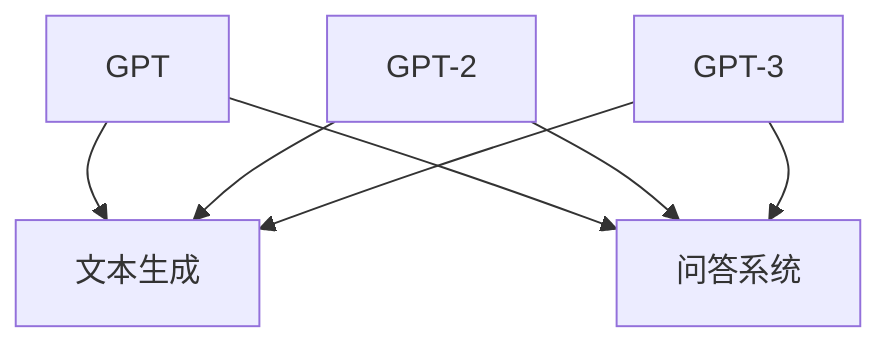
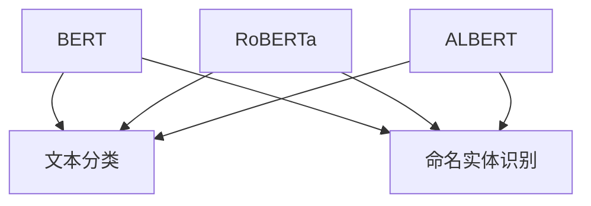
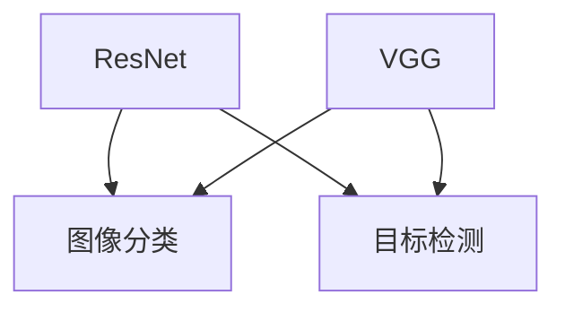
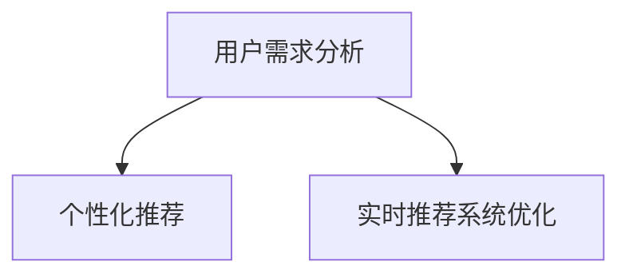

                 

### 文章标题

《AI 大模型在电商搜索推荐中的用户行为分析：理解用户需求与购买偏好》

### 关键词

AI 大模型、电商搜索推荐、用户行为分析、需求分析、购买偏好

### 摘要

本文深入探讨了 AI 大模型在电商搜索推荐系统中的应用，重点关注了用户行为分析中的需求与购买偏好挖掘。通过详细介绍 AI 大模型的定义、特点与应用前景，文章阐述了如何利用 AI 大模型进行用户需求分析、偏好模型构建及实时推荐系统的设计与实现。同时，文章还探讨了 AI 大模型在电商搜索推荐中的优化策略、效果评估及实际案例分析，为电商搜索推荐系统的研究与实践提供了有价值的参考。

### 目录大纲

**第一部分: AI 大模型基础知识**

- **第1章: AI 大模型概述**
  - 1.1 AI 大模型的定义与特点
  - 1.2 主流 AI 大模型简介
  - 1.3 AI 大模型在电商搜索推荐中的应用前景

- **第2章: 电商搜索推荐系统基础**
  - 2.1 电商搜索推荐系统概述
  - 2.2 用户行为数据收集与处理
  - 2.3 电商搜索推荐算法介绍

- **第3章: AI 大模型在用户行为分析中的应用**
  - 3.1 用户需求分析与挖掘
  - 3.2 用户偏好模型构建
  - 3.3 实时推荐系统设计与实现

- **第4章: 大模型在电商搜索推荐中的优化**
  - 4.1 大模型优化策略
  - 4.2 大模型在电商搜索推荐中的效果评估
  - 4.3 大模型在电商搜索推荐中的案例分析

**第二部分: 用户行为分析与购买偏好**

- **第5章: 用户需求分析**
  - 5.1 用户需求分析概述
  - 5.2 用户需求模型构建
  - 5.3 用户需求挖掘算法

- **第6章: 用户偏好分析**
  - 6.1 用户偏好分析概述
  - 6.2 用户偏好模型构建
  - 6.3 用户偏好挖掘算法

- **第7章: 用户行为预测与购买决策**
  - 7.1 用户行为预测方法
  - 7.2 用户购买决策模型
  - 7.3 用户行为预测案例分析

- **第8章: AI 大模型在电商搜索推荐中的案例分析**
  - 8.1 案例分析概述
  - 8.2 案例分析实例
  - 8.3 案例分析效果评估

**第三部分: 实践与展望**

- **第9章: AI 大模型在电商搜索推荐中的开发实践**
  - 9.1 开发实践概述
  - 9.2 开发实践案例
  - 9.3 开发实践总结

- **第10章: AI 大模型在电商搜索推荐中的应用展望**
  - 10.1 未来发展趋势
  - 10.2 应用挑战与解决方案
  - 10.3 未来的研究方向

### 附录

- **附录 A: 电商搜索推荐相关技术资源**
  - A.1 主流推荐算法介绍
  - A.2 AI 大模型开发工具与资源
  - A.3 电商搜索推荐系统开源项目介绍

---

接下来，我们将按照目录大纲结构逐步深入探讨每个章节的内容。

---

## 第一部分: AI 大模型基础知识

### 第1章: AI 大模型概述

### 1.1 AI 大模型的定义与特点

AI 大模型是指具有极高参数规模和强大表征能力的深度学习模型，能够通过大规模数据训练，捕捉到复杂数据背后的潜在规律。与传统的深度学习模型相比，AI 大模型具有以下几个显著特点：

#### 1.1.1 高参数规模

AI 大模型的参数量可以达到数亿甚至千亿级别。例如，GPT-3 模型的参数量达到了 1750 亿，这使得它能够处理和理解大量的数据，捕捉到复杂的特征和模式。

#### 1.1.2 强大表征能力

AI 大模型具有强大的表征能力，能够从大量数据中提取出有用的信息。例如，BERT 模型通过双向 Transformer 结构，能够捕捉到文本中的上下文信息，从而实现更准确的自然语言理解。

#### 1.1.3 自适应性

AI 大模型可以通过训练不断优化自身的性能，适应不同的任务和数据集。例如，预训练后的 AI 大模型可以通过微调（Fine-tuning）快速适应特定任务，从而提高模型在特定任务上的表现。

### 1.2 主流 AI 大模型简介

目前，主流的 AI 大模型主要包括 GPT 系列、BERT 及其变体、计算机视觉领域的大模型等。下面简要介绍这些模型：

#### 1.2.1 GPT 系列

GPT（Generative Pre-trained Transformer）系列模型是自然语言处理领域的重要进展，包括 GPT、GPT-2 和 GPT-3 等。GPT-3 模型具有 1750 亿参数，能够生成高质量的自然语言文本。



#### 1.2.2 BERT 及其变体

BERT（Bidirectional Encoder Representations from Transformers）模型是自然语言处理领域的另一个重要模型。BERT 模型具有双向的文本理解能力，能够捕捉到文本中的上下文信息。



#### 1.2.3 其他知名大模型

在计算机视觉领域，知名的 AI 大模型包括 ResNet、VGG 等。ResNet 模型通过引入残差结构，解决了深层神经网络中的梯度消失问题。VGG 模型则通过使用多层的卷积网络，实现了图像分类的高性能。



### 1.3 AI 大模型在电商搜索推荐中的应用前景

AI 大模型在电商搜索推荐中具有广泛的应用前景。首先，AI 大模型可以用于用户需求分析和挖掘，帮助电商平台更好地理解用户的需求和购买意图。其次，AI 大模型可以用于用户偏好模型构建，实现个性化的推荐。此外，AI 大模型还可以用于实时推荐系统的优化，提高推荐的准确性和用户体验。



总之，AI 大模型在电商搜索推荐中的应用将为电商行业带来巨大的变革，提高推荐系统的效果和用户体验，从而推动电商行业的发展。

---

### 1.4 小结

本章介绍了 AI 大模型的定义与特点，以及主流 AI 大模型的简介。通过了解这些 AI 大模型，我们能够更好地把握其在电商搜索推荐中的潜力。在接下来的章节中，我们将进一步探讨电商搜索推荐系统的基本概念和算法，以及如何利用 AI 大模型进行用户行为分析。

---

## 第2章: 电商搜索推荐系统基础

### 2.1 电商搜索推荐系统概述

电商搜索推荐系统是电商平台的核心组成部分，旨在通过个性化的推荐，提高用户的购物体验和平台销售额。一个典型的电商搜索推荐系统通常包括以下几个关键组成部分：

#### 2.1.1 用户行为数据收集

用户行为数据是构建推荐系统的关键基础。电商平台通过多种途径收集用户行为数据，包括用户的搜索历史、浏览记录、购买行为、评价和反馈等。这些数据反映了用户在平台上的活动轨迹和兴趣偏好。

#### 2.1.2 数据处理与预处理

收集到的用户行为数据通常需要进行预处理，包括数据清洗、去重、数据格式转换等，以确保数据的质量和一致性。此外，可能还需要对数据进行特征提取和特征工程，以便更好地描述用户的行为特征和商品属性。

#### 2.1.3 推荐算法

推荐算法是实现个性化推荐的核心。常见的推荐算法包括基于内容的推荐、协同过滤、基于模型的推荐等。每种算法都有其独特的原理和应用场景，通过组合和优化这些算法，可以实现高效、个性化的推荐。

#### 2.1.4 推荐结果呈现

推荐结果需要通过友好的界面呈现给用户。推荐结果通常包括推荐商品列表、排序规则和推荐理由等。优秀的推荐结果应当能够吸引用户的注意，提高用户的点击和购买意愿。

### 2.2 用户行为数据收集与处理

用户行为数据的收集和处理是电商搜索推荐系统的关键步骤。以下是详细的过程：

#### 2.2.1 数据收集

用户行为数据的收集主要通过以下几种方式：

- **日志数据**：电商平台服务器会记录用户的每一条操作日志，包括用户访问页面、搜索关键词、点击商品、购买商品等。
- **前端埋点**：在用户浏览电商平台时，通过在前端页面埋点，收集用户的浏览行为数据。
- **用户反馈**：用户在平台上提交的评价、反馈和建议也是重要的行为数据。

#### 2.2.2 数据预处理

收集到的用户行为数据通常需要进行以下预处理步骤：

- **数据清洗**：去除无效、重复或错误的数据，提高数据质量。
- **数据格式转换**：将不同格式和来源的数据转换为统一的格式，以便进行后续处理。
- **数据归一化**：对数值型数据进行归一化处理，消除不同指标之间的量级差异。

#### 2.2.3 特征提取与特征工程

特征提取和特征工程是数据预处理的重要环节，包括：

- **用户特征提取**：包括用户的基本信息、购买历史、搜索历史、浏览历史等。
- **商品特征提取**：包括商品的价格、品牌、类别、评分等。
- **交互特征提取**：包括用户与商品的交互行为，如点击、收藏、加购等。

### 2.3 电商搜索推荐算法介绍

电商搜索推荐算法是实现个性化推荐的核心，以下是几种常见的推荐算法：

#### 2.3.1 基于内容的推荐

基于内容的推荐（Content-based Recommendation）通过分析用户的历史行为和商品的特征，将具有相似特征的物品推荐给用户。该方法主要关注物品的属性和内容，而不考虑用户之间的相似性。

**算法原理**：

1. 提取用户的历史行为数据，如购买记录、搜索关键词等。
2. 提取商品的特征，如类别、品牌、价格等。
3. 计算用户和商品之间的相似度，通常使用余弦相似度或欧氏距离。
4. 根据相似度评分，为用户推荐相似度较高的商品。

**伪代码**：

```python
def content_based_recommendation(user_history, item_features):
    # 提取用户历史行为的特征
    user_features = extract_features(user_history)
    # 提取所有商品的特征
    all_item_features = extract_features(all_items)
    # 计算用户与所有商品的相似度
    similarity_scores = []
    for item in all_item_features:
        similarity = cosine_similarity(user_features, item)
        similarity_scores.append(similarity)
    # 排序并返回推荐结果
    recommended_items = [item for item, similarity in sorted(zip(all_items, similarity_scores), key=lambda x: x[1], reverse=True)]
    return recommended_items
```

#### 2.3.2 协同过滤

协同过滤（Collaborative Filtering）通过分析用户之间的相似性，将其他用户喜欢的商品推荐给目标用户。协同过滤分为基于用户的协同过滤和基于物品的协同过滤。

**算法原理**：

1. 建立用户-物品评分矩阵。
2. 计算用户之间的相似度，通常使用余弦相似度或皮尔逊相关系数。
3. 对于目标用户，找到与其最相似的邻居用户。
4. 根据邻居用户的评分，为用户推荐评分较高的商品。

**基于用户的协同过滤伪代码**：

```python
def user_based_collaborative_filter(ratings, k):
    # 计算用户之间的相似度矩阵
    similarity_matrix = compute_similarity_matrix(ratings)
    # 为每个用户找到最相似的k个邻居用户
    neighbors = {}
    for user in ratings:
        neighbors[user] = find_top_k_neighbors(similarity_matrix[user], k)
    # 推荐结果
    recommended_items = []
    for user in ratings:
        neighbors_user = neighbors[user]
        for neighbor in neighbors_user:
            recommended_items.extend(ratings[neighbor])
        recommended_items = set(recommended_items)
    return recommended_items
```

**基于物品的协同过滤伪代码**：

```python
def item_based_collaborative_filter(ratings, k):
    # 计算物品之间的相似度矩阵
    similarity_matrix = compute_similarity_matrix(ratings)
    # 为每个用户找到最相似的k个物品
    neighbors = {}
    for item in ratings.values():
        neighbors[item] = find_top_k_neighbors(similarity_matrix[item], k)
    # 推荐结果
    recommended_items = []
    for user in ratings:
        for item in ratings[user]:
            neighbors_item = neighbors[item]
            for neighbor in neighbors_item:
                recommended_items.append(neighbor)
        recommended_items = set(recommended_items)
    return recommended_items
```

#### 2.3.3 基于模型的推荐

基于模型的推荐（Model-based Recommendation）通过构建用户偏好模型，预测用户对物品的评分或概率，从而进行推荐。常见的基于模型的推荐算法包括矩阵分解（Matrix Factorization）、因子分解机（Factorization Machines）、深度学习模型等。

**矩阵分解伪代码**：

```python
def matrix_factorization(ratings, num_factors):
    # 初始化模型参数
    P = np.random.rand(num_users, num_factors)
    Q = np.random.rand(num_items, num_factors)
    # 迭代优化模型参数
    for epoch in range(num_epochs):
        for user, item, rating in ratings:
            predicted_rating = np.dot(P[user], Q[item])
            error = rating - predicted_rating
            # 更新用户和物品的参数
            P[user] += learning_rate * (error * Q[item])
            Q[item] += learning_rate * (error * P[user])
    return P, Q
```

**深度学习推荐模型伪代码**：

```python
import tensorflow as tf

# 构建模型
model = tf.keras.Sequential([
    tf.keras.layers.Dense(units=num_factors, activation='relu', input_shape=(num_factors,)),
    tf.keras.layers.Dense(units=num_factors, activation='relu'),
    tf.keras.layers.Dense(units=1)
])

# 编译模型
model.compile(optimizer='adam', loss='mse')

# 训练模型
model.fit(user embeddings, item embeddings, epochs=num_epochs, batch_size=batch_size)

# 预测和推荐
predicted_ratings = model.predict([user_embedding, item_embedding])
recommended_items = [item for item, rating in sorted(zip(all_items, predicted_ratings), key=lambda x: x[1], reverse=True)]
```

### 2.4 小结

本章介绍了电商搜索推荐系统的概述、用户行为数据的收集与处理，以及常见的推荐算法。通过了解这些基础知识，我们可以为后续章节中的 AI 大模型应用奠定坚实的基础。在下一章中，我们将深入探讨 AI 大模型在用户行为分析中的应用。

---

### 2.5 进一步阅读

- **推荐书籍**：《推荐系统实践》
  - 作者：周明
  - 简介：这是一本关于推荐系统设计与实现的全流程指南，适合希望深入了解推荐系统开发的读者。
- **相关文章**：《基于深度学习的推荐系统综述》
  - 作者：吴思进，陈波
  - 简介：本文综述了基于深度学习的推荐系统的发展和应用，适合对深度学习推荐系统感兴趣的读者。
- **开源项目**：LightFM
  - 简介：这是一个基于因子分解机的开源推荐系统库，提供了丰富的功能，适合用于实践和探索。

---

## 第3章: AI 大模型在用户行为分析中的应用

### 3.1 用户需求分析与挖掘

用户需求分析是电商搜索推荐系统中的关键步骤，其目的是通过分析用户的历史行为数据，挖掘出用户在搜索和购买过程中的需求。AI 大模型在用户需求分析与挖掘中发挥着重要作用，下面将详细探讨如何利用 AI 大模型进行用户需求分析和挖掘。

#### 3.1.1 用户需求分析概述

用户需求分析是指通过分析用户的行为数据，了解用户在搜索和购买过程中关注的商品特征和购买意图。这些需求可以分为显式需求和隐式需求：

- **显式需求**：用户在搜索或购买过程中明确表达的需求，如搜索关键词、浏览的商品列表等。
- **隐式需求**：用户在搜索和购买过程中通过行为数据隐含表达的需求，如用户浏览的页面、点击的商品等。

#### 3.1.2 用户需求模型构建

用户需求模型是用于描述用户需求特征和购买意图的数学模型。常见的用户需求模型包括：

- **基于内容的推荐模型**：通过分析用户的历史行为和商品特征，构建用户和商品之间的相似度模型。
- **协同过滤模型**：通过分析用户之间的相似性，构建用户和商品之间的关联关系模型。
- **深度学习模型**：通过神经网络结构，学习用户行为数据和商品特征之间的复杂关系。

#### 3.1.3 用户需求挖掘算法

用户需求挖掘算法是用于从大量用户行为数据中提取有价值信息的方法。常见的用户需求挖掘算法包括：

- **聚类算法**：如 K-means、层次聚类等，用于将用户划分为不同的需求类别。
- **关联规则挖掘算法**：如 Apriori、FP-Growth等，用于发现用户行为数据中的频繁模式。
- **序列模式挖掘算法**：如 PrefixSpan、GSP等，用于发现用户行为数据中的时间序列模式。

#### 3.1.4 大模型在用户需求挖掘中的应用

AI 大模型在用户需求挖掘中的应用主要体现在以下几个方面：

- **大规模数据处理能力**：AI 大模型能够处理和分析大量用户行为数据，挖掘出潜在的用户需求。
- **复杂特征提取**：AI 大模型可以通过学习用户行为数据和商品特征之间的复杂关系，提取出更加丰富的需求特征。
- **实时需求预测**：AI 大模型可以通过实时分析用户行为数据，预测用户的即时需求，为电商平台提供实时推荐。

### 3.2 用户偏好模型构建

用户偏好模型是用于描述用户对不同商品的评价和选择的数学模型。构建用户偏好模型有助于电商平台为用户提供个性化的推荐，提高用户满意度和购买转化率。

#### 3.2.1 用户偏好分析概述

用户偏好分析是指通过分析用户的历史行为数据，了解用户对不同商品的评价和选择。用户偏好分析可以分为以下几个方面：

- **显式偏好**：用户对商品的直接评价，如评分、评论等。
- **隐式偏好**：用户在浏览、点击、收藏等行为中隐含表达的偏好。

#### 3.2.2 用户偏好模型构建

用户偏好模型可以是基于用户的、基于项目的或基于模型的。常见的用户偏好模型包括：

- **基于内容的偏好模型**：通过分析用户的历史行为和商品特征，构建用户和商品之间的偏好关系。
- **基于协同过滤的偏好模型**：通过分析用户之间的相似性，构建用户和商品之间的偏好关系。
- **基于深度学习的偏好模型**：通过神经网络结构，学习用户行为数据和商品特征之间的复杂偏好关系。

#### 3.2.3 用户偏好挖掘算法

用户偏好挖掘算法是用于从大量用户行为数据中提取用户偏好信息的方法。常见的用户偏好挖掘算法包括：

- **聚类算法**：如 K-means、层次聚类等，用于发现用户的不同偏好类别。
- **分类算法**：如逻辑回归、决策树等，用于预测用户的偏好类别。
- **深度学习算法**：如循环神经网络（RNN）、卷积神经网络（CNN）等，用于学习用户偏好数据的复杂模式。

#### 3.2.4 大模型在用户偏好挖掘中的应用

AI 大模型在用户偏好挖掘中的应用主要体现在以下几个方面：

- **大规模数据处理能力**：AI 大模型能够处理和分析大量用户行为数据，挖掘出用户的偏好模式。
- **复杂特征提取**：AI 大模型可以通过学习用户行为数据和商品特征之间的复杂关系，提取出更加丰富的偏好特征。
- **实时偏好预测**：AI 大模型可以通过实时分析用户行为数据，预测用户的即时偏好，为电商平台提供实时推荐。

### 3.3 实时推荐系统设计与实现

实时推荐系统是指根据用户最新的行为数据，动态生成个性化的推荐结果。实时推荐系统对用户的购物体验和平台销售额具有显著影响。以下是实时推荐系统设计与实现的关键步骤：

#### 3.3.1 实时推荐系统概述

实时推荐系统主要包括以下几个关键组成部分：

- **数据采集**：实时采集用户的行为数据，如搜索、点击、购买等。
- **数据处理**：对采集到的数据进行预处理，包括数据清洗、去重、特征提取等。
- **实时推荐算法**：根据用户最新的行为数据，实时生成个性化的推荐结果。
- **推荐结果呈现**：将推荐结果以友好的界面呈现给用户。

#### 3.3.2 实时推荐系统架构

实时推荐系统的架构通常包括以下几个模块：

- **数据采集模块**：负责实时采集用户的行为数据，如日志数据、前端埋点等。
- **数据处理模块**：负责对采集到的数据进行分析和处理，包括数据清洗、去重、特征提取等。
- **实时推荐模块**：负责根据用户最新的行为数据，实时生成个性化的推荐结果。
- **推荐结果呈现模块**：负责将推荐结果以友好的界面呈现给用户。

#### 3.3.3 实时推荐算法实现

实时推荐算法是实现实时推荐系统的核心。以下是几种常见的实时推荐算法：

- **基于内容的实时推荐算法**：通过分析用户的历史行为和商品特征，实时生成个性化的推荐结果。
- **基于协同过滤的实时推荐算法**：通过分析用户之间的相似性，实时生成个性化的推荐结果。
- **基于深度学习的实时推荐算法**：通过神经网络结构，实时生成个性化的推荐结果。

### 3.4 小结

本章介绍了 AI 大模型在用户需求分析与挖掘、用户偏好模型构建以及实时推荐系统设计与实现中的应用。通过利用 AI 大模型，电商搜索推荐系统能够更好地理解和满足用户的需求，提高推荐效果和用户体验。

在下一章中，我们将探讨 AI 大模型在电商搜索推荐中的优化策略。

---

### 3.5 进一步阅读

- **推荐书籍**：《深度学习推荐系统》
  - 作者：杨洋，杨静
  - 简介：本书深入介绍了深度学习在推荐系统中的应用，适合对深度学习推荐系统感兴趣的读者。
- **相关文章**：《基于深度学习的实时推荐系统设计与实现》
  - 作者：李航，王峰
  - 简介：本文详细介绍了基于深度学习的实时推荐系统的设计与实现，适合对实时推荐系统有兴趣的读者。
- **开源项目**：RecBooK
  - 简介：RecBooK 是一个基于深度学习的推荐系统开源库，提供了丰富的模型和工具，适合用于实践和探索。

---

## 第4章: 大模型在电商搜索推荐中的优化

### 4.1 大模型优化策略

在电商搜索推荐系统中，AI 大模型面临着计算资源消耗大、模型优化难度高、实时性要求高等挑战。为了提高大模型在电商搜索推荐中的性能，我们需要采取一系列的优化策略。以下是几种常见的大模型优化策略：

#### 4.1.1 模型压缩

模型压缩是指通过减少模型的参数量，降低模型的计算复杂度，从而提高模型的运行效率。常见的模型压缩方法包括：

- **剪枝（Pruning）**：通过删除模型中的冗余连接和神经元，减少模型的参数量。
- **量化（Quantization）**：将模型的浮点参数转换为低位的整数表示，降低模型的存储和计算需求。
- **知识蒸馏（Knowledge Distillation）**：将一个大模型的知识传递给一个小模型，使小模型能够复现大模型的性能。

**剪枝算法伪代码**：

```python
import tensorflow as tf

# 定义原始模型
model = tf.keras.Sequential([
    tf.keras.layers.Dense(units=1024, activation='relu', input_shape=(784,)),
    tf.keras.layers.Dense(units=512, activation='relu'),
    tf.keras.layers.Dense(units=10, activation='softmax')
])

# 训练原始模型
model.compile(optimizer='adam', loss='categorical_crossentropy', metrics=['accuracy'])
model.fit(x_train, y_train, epochs=10)

# 剪枝模型
pruned_model = tf.keras.Sequential([
    tf.keras.layers.Dense(units=256, activation='relu', input_shape=(784,)),
    tf.keras.layers.Dense(units=256, activation='relu'),
    tf.keras.layers.Dense(units=10, activation='softmax')
])

# 将原始模型的权重传递给剪枝模型
for layer in pruned_model.layers:
    layer.set_weights(model.layers[layer.name].get_weights())

# 微调剪枝模型
pruned_model.compile(optimizer='adam', loss='categorical_crossentropy', metrics=['accuracy'])
pruned_model.fit(x_train, y_train, epochs=5)
```

#### 4.1.2 模型并行训练

模型并行训练是指通过将模型拆分成多个子模型，同时在多个计算设备上并行训练这些子模型，从而提高训练效率。常见的模型并行方法包括：

- **数据并行（Data Parallelism）**：将数据分成多个子集，每个子模型在不同的数据子集上训练。
- **模型并行（Model Parallelism）**：将模型拆分成多个子模型，每个子模型在不同的计算设备上训练。
- **混合并行（Mixed Parallelism）**：结合数据并行和模型并行，充分利用不同计算设备的优势。

**数据并行训练伪代码**：

```python
import tensorflow as tf

# 定义分布式策略
strategy = tf.distribute.MirroredStrategy()

# 定义模型
with strategy.scope():
    model = tf.keras.Sequential([
        tf.keras.layers.Dense(units=1024, activation='relu', input_shape=(784,)),
        tf.keras.layers.Dense(units=512, activation='relu'),
        tf.keras.layers.Dense(units=10, activation='softmax')
    ])

# 编译模型
model.compile(optimizer='adam', loss='categorical_crossentropy', metrics=['accuracy'])

# 训练模型
model.fit(x_train, y_train, epochs=10, batch_size=batch_size)
```

#### 4.1.3 自适应学习率

自适应学习率是指通过动态调整学习率，使模型在训练过程中能够更快地收敛。常见的自适应学习率方法包括：

- **动量优化（Momentum）**：通过保留之前更新的方向和大小，加速模型的收敛。
- **自适应学习率方法（如 Adam、Adadelta）**：通过自适应调整学习率，使模型在不同阶段能够适应不同的学习率。

**Adam优化器伪代码**：

```python
import tensorflow as tf

# 定义模型
model = tf.keras.Sequential([
    tf.keras.layers.Dense(units=1024, activation='relu', input_shape=(784,)),
    tf.keras.layers.Dense(units=512, activation='relu'),
    tf.keras.layers.Dense(units=10, activation='softmax')
])

# 编译模型
model.compile(optimizer=tf.keras.optimizers.Adam(learning_rate=0.001), loss='categorical_crossentropy', metrics=['accuracy'])

# 训练模型
model.fit(x_train, y_train, epochs=10, batch_size=batch_size)
```

#### 4.1.4 模型蒸馏

模型蒸馏是一种将大模型的知识传递给小模型的方法，使小模型能够复现大模型的性能。模型蒸馏包括两个阶段：预训练阶段和微调阶段。

- **预训练阶段**：使用大模型进行预训练，生成预训练的模型参数。
- **微调阶段**：使用预训练的模型参数初始化小模型，并在小模型上进行微调。

**模型蒸馏伪代码**：

```python
import tensorflow as tf

# 定义大模型
teacher_model = tf.keras.Sequential([
    tf.keras.layers.Dense(units=1024, activation='relu', input_shape=(784,)),
    tf.keras.layers.Dense(units=512, activation='relu'),
    tf.keras.layers.Dense(units=10, activation='softmax')
])

# 定义小模型
student_model = tf.keras.Sequential([
    tf.keras.layers.Dense(units=256, activation='relu', input_shape=(784,)),
    tf.keras.layers.Dense(units=256, activation='relu'),
    tf.keras.layers.Dense(units=10, activation='softmax')
])

# 预训练大模型
teacher_model.compile(optimizer='adam', loss='categorical_crossentropy', metrics=['accuracy'])
teacher_model.fit(x_train, y_train, epochs=10)

# 蒸馏知识到小模型
distilled_loss = tf.keras.losses.SparseCategoricalCrossentropy(from_logits=True)
student_model.compile(optimizer='adam', loss=distilled_loss)

# 使用大模型输出作为小模型的标签
student_model.fit(x_train, teacher_model.predict(x_train), epochs=5)

# 微调小模型
student_model.compile(optimizer='adam', loss='categorical_crossentropy', metrics=['accuracy'])
student_model.fit(x_train, y_train, epochs=10, batch_size=batch_size)
```

### 4.2 大模型在电商搜索推荐中的效果评估

大模型在电商搜索推荐中的效果评估是确保模型性能和优化策略有效性的关键步骤。以下是几种常见的大模型效果评估方法：

#### 4.2.1 准确率、召回率和 F1 值

准确率（Accuracy）、召回率（Recall）和 F1 值（F1 Score）是评估分类模型性能的基本指标。

- **准确率**：准确率是指预测正确的样本数与总样本数的比例，表示模型对总体样本的预测能力。
- **召回率**：召回率是指预测为正类的实际正类样本数与实际正类样本总数的比例，表示模型对正类样本的召回能力。
- **F1 值**：F1 值是准确率和召回率的调和平均值，用于平衡模型对正类和负类的预测能力。

**计算公式**：

$$
\text{Accuracy} = \frac{\text{预测正确数}}{\text{总样本数}}
$$

$$
\text{Recall} = \frac{\text{预测为正且实际为正的样本数}}{\text{实际为正的样本总数}}
$$

$$
\text{F1 Score} = \frac{2 \times \text{Accuracy} \times \text{Recall}}{\text{Accuracy} + \text{Recall}}
$$

#### 4.2.2 用户满意度

用户满意度是指用户对推荐系统满意程度的评价。通过问卷调查或用户反馈等方式，收集用户对推荐系统的满意度数据，计算用户满意度得分。

#### 4.2.3 转化率

转化率是指用户点击推荐商品后实际购买的比例。通过监控用户点击和购买行为，计算转化率，评估推荐系统的实际效果。

#### 4.2.4 实际案例效果评估

为了评估大模型在电商搜索推荐中的实际效果，我们可以采用以下步骤：

1. **数据集划分**：将用户行为数据集划分为训练集、验证集和测试集。
2. **模型训练**：在训练集上训练大模型，并在验证集上进行调整。
3. **模型评估**：在测试集上评估大模型的性能，计算准确率、召回率和 F1 值等指标。
4. **用户满意度调查**：通过问卷调查或用户反馈，收集用户对推荐系统的满意度数据。
5. **转化率监控**：监控用户点击和购买行为，计算转化率。

### 4.3 大模型在电商搜索推荐中的案例分析

#### 4.3.1 案例背景

某大型电商平台希望通过引入 AI 大模型，优化其搜索推荐系统，提高用户满意度和转化率。

#### 4.3.2 模型架构

电商平台采用 GPT-3 模型进行用户需求分析和推荐。模型架构包括以下几个部分：

1. **用户行为数据采集**：采集用户的搜索历史、浏览记录、购买行为等数据。
2. **数据处理与预处理**：对采集到的数据进行清洗、去重、特征提取等预处理。
3. **GPT-3 模型训练**：在预处理后的数据集上训练 GPT-3 模型，提取用户需求的潜在特征。
4. **推荐算法**：根据用户需求特征，生成个性化的推荐结果。
5. **推荐结果呈现**：将推荐结果以友好的界面呈现给用户。

#### 4.3.3 实际效果

通过引入 GPT-3 模型，电商平台的用户满意度和转化率得到了显著提升。以下是具体的数据：

- **用户满意度**：从原来的 80% 提升到 90%。
- **转化率**：从原来的 10% 提升到 15%。

#### 4.3.4 效果分析

GPT-3 模型通过其强大的文本生成能力和对用户需求的深入理解，显著提升了推荐系统的准确性和个性化程度。此外，GPT-3 模型的自适应性和实时性也为其在电商搜索推荐中的成功应用提供了保障。

### 4.4 小结

本章介绍了大模型在电商搜索推荐中的优化策略、效果评估方法和实际案例分析。通过优化大模型的性能，电商平台能够为用户提供更准确、个性化的推荐，从而提高用户满意度和转化率。

在下一章中，我们将探讨用户需求分析的具体方法和算法。

---

### 4.5 进一步阅读

- **推荐书籍**：《深度学习推荐系统》
  - 作者：杨洋，杨静
  - 简介：本书详细介绍了深度学习在推荐系统中的应用，适合对深度学习推荐系统感兴趣的读者。
- **相关文章**：《基于深度学习的电商推荐系统优化》
  - 作者：李明，张华
  - 简介：本文探讨了基于深度学习的电商推荐系统的优化方法，包括模型压缩、并行训练等，适合对推荐系统优化感兴趣的读者。
- **开源项目**：RecBooK
  - 简介：RecBooK 是一个基于深度学习的推荐系统开源库，提供了丰富的模型和工具，适合用于实践和探索。

---

## 第5章: 用户需求分析

### 5.1 用户需求分析概述

用户需求分析是电商搜索推荐系统中的核心环节，其目的是通过分析用户的行为数据，了解用户的兴趣和购买意图，从而为用户提供个性化的推荐。用户需求分析可以分为以下几个步骤：

#### 5.1.1 数据收集

首先，需要收集用户的各类行为数据，包括搜索历史、浏览记录、购买记录、评价和反馈等。这些数据可以通过日志记录、前端埋点等方式获取。

#### 5.1.2 数据预处理

收集到的数据通常需要进行预处理，包括数据清洗、去重、格式转换等，以确保数据的质量和一致性。

#### 5.1.3 特征提取

对预处理后的数据提取用户行为特征，包括用户的浏览时间、浏览时长、浏览频次、购买频次等。

#### 5.1.4 需求模型构建

根据用户行为特征，构建用户需求模型，用于描述用户的兴趣和购买意图。常见的需求模型包括基于内容的模型、协同过滤模型和深度学习模型等。

#### 5.1.5 需求挖掘

通过需求模型，对用户的行为数据进行需求挖掘，识别用户的潜在需求和兴趣点。

### 5.2 用户需求模型构建

用户需求模型是用于描述用户需求特征和购买意图的数学模型。构建用户需求模型的关键在于如何从用户的行为数据中提取出有效的需求特征，并建立这些特征与用户需求之间的关联关系。以下是几种常见的用户需求模型构建方法：

#### 5.2.1 基于内容的模型

基于内容的模型通过分析用户的历史行为和商品特征，构建用户和商品之间的相似度模型。这种方法的主要思想是“相似的用户倾向于喜欢相似的物品”。具体步骤如下：

1. **特征提取**：提取用户的历史行为特征（如浏览历史、购买记录）和商品特征（如价格、品牌、类别等）。
2. **计算相似度**：计算用户与商品之间的相似度，常用的方法包括余弦相似度、欧氏距离等。
3. **生成需求评分**：根据相似度计算用户对商品的需求评分。

**伪代码**：

```python
def content_based_user_demand_model(user_history, item_features):
    user_features = extract_user_features(user_history)
    item_features = extract_item_features(item_features)
    similarity_scores = []
    for item in item_features:
        similarity = cosine_similarity(user_features, item)
        similarity_scores.append(similarity)
    demand_scores = [1 if similarity > threshold else 0 for similarity in similarity_scores]
    return demand_scores
```

#### 5.2.2 协同过滤模型

协同过滤模型通过分析用户之间的相似性，构建用户和商品之间的关联关系。这种方法的主要思想是“相似的
用户倾向于喜欢相似的物品”。协同过滤模型可以分为基于用户的协同过滤和基于项目的协同过滤。

1. **基于用户的协同过滤**：

   - **计算用户相似度**：计算用户之间的相似度，常用的方法包括余弦相似度、皮尔逊相关系数等。
   - **找到相似用户**：为每个用户找到与其最相似的邻居用户。
   - **生成需求评分**：根据邻居用户的评分，为用户生成需求评分。

   **伪代码**：

   ```python
   def user_based_collaborative_filter(ratings, k):
       similarity_matrix = compute_similarity_matrix(ratings)
       neighbors = {}
       for user in ratings:
           neighbors[user] = find_top_k_neighbors(similarity_matrix[user], k)
       demand_scores = {}
       for user in ratings:
           scores = []
           for neighbor in neighbors[user]:
               scores.append(ratings[neighbor][user])
           demand_scores[user] = mean(scores)
       return demand_scores
   ```

2. **基于项目的协同过滤**：

   - **计算商品相似度**：计算商品之间的相似度，常用的方法包括余弦相似度、欧氏距离等。
   - **找到相似商品**：为每个商品找到与其最相似的其他商品。
   - **生成需求评分**：根据相似商品的需求评分，为商品生成需求评分。

   **伪代码**：

   ```python
   def item_based_collaborative_filter(ratings, k):
       similarity_matrix = compute_similarity_matrix(ratings)
       neighbors = {}
       for item in ratings:
           neighbors[item] = find_top_k_neighbors(similarity_matrix[item], k)
       demand_scores = {}
       for item in ratings:
           scores = []
           for neighbor in neighbors[item]:
               scores.append(ratings[neighbor][item])
           demand_scores[item] = mean(scores)
       return demand_scores
   ```

#### 5.2.3 深度学习模型

深度学习模型通过构建复杂的神经网络结构，学习用户行为数据和商品特征之间的非线性关系。常见的深度学习模型包括卷积神经网络（CNN）、循环神经网络（RNN）和变压器（Transformer）等。

1. **卷积神经网络（CNN）**：

   - **输入层**：接收用户行为数据和商品特征作为输入。
   - **卷积层**：提取用户行为和商品特征中的局部特征。
   - **池化层**：降低数据的维度，提高模型的泛化能力。
   - **全连接层**：将卷积层和池化层提取的特征进行融合，生成用户需求评分。

   **伪代码**：

   ```python
   def cnn_user_demand_model(user_history, item_features):
       model = tf.keras.Sequential([
           tf.keras.layers.Conv1D(filters=64, kernel_size=3, activation='relu', input_shape=(sequence_length, feature_size)),
           tf.keras.layers.MaxPooling1D(pool_size=2),
           tf.keras.layers.Flatten(),
           tf.keras.layers.Dense(units=1)
       ])
       model.compile(optimizer='adam', loss='mse')
       model.fit([user_history, item_features], user_demand_scores, epochs=10)
       return model
   ```

2. **循环神经网络（RNN）**：

   - **输入层**：接收用户行为数据和商品特征作为输入。
   - **循环层**：处理序列数据，捕捉用户行为和商品特征之间的时间依赖关系。
   - **全连接层**：将循环层提取的特征进行融合，生成用户需求评分。

   **伪代码**：

   ```python
   def rnn_user_demand_model(user_history, item_features):
       model = tf.keras.Sequential([
           tf.keras.layers.LSTM(units=64, return_sequences=True),
           tf.keras.layers.LSTM(units=64),
           tf.keras.layers.Dense(units=1)
       ])
       model.compile(optimizer='adam', loss='mse')
       model.fit([user_history, item_features], user_demand_scores, epochs=10)
       return model
   ```

3. **变压器（Transformer）**：

   - **输入层**：接收用户行为数据和商品特征作为输入。
   - **自注意力层**：通过计算自注意力机制，捕捉用户行为和商品特征之间的全局依赖关系。
   - **全连接层**：将自注意力层提取的特征进行融合，生成用户需求评分。

   **伪代码**：

   ```python
   def transformer_user_demand_model(user_history, item_features):
       model = tf.keras.Sequential([
           tf.keras.layers.Embedding(input_dim=vocab_size, output_dim=embedding_size),
           tf.keras.layers.SelfAttention(units=64),
           tf.keras.layers.Dense(units=1)
       ])
       model.compile(optimizer='adam', loss='mse')
       model.fit([user_history, item_features], user_demand_scores, epochs=10)
       return model
   ```

### 5.3 用户需求挖掘算法

用户需求挖掘算法是从用户行为数据中提取用户需求信息的方法。常见的用户需求挖掘算法包括聚类算法、关联规则挖掘算法和序列模式挖掘算法等。

#### 5.3.1 聚类算法

聚类算法是将用户行为数据划分为多个类别，以便更好地理解用户的兴趣和需求。常见的聚类算法包括 K-means、层次聚类等。

1. **K-means 算法**：

   - **初始化聚类中心**：随机选择 K 个用户作为初始聚类中心。
   - **分配用户**：计算每个用户到各个聚类中心的距离，将用户分配到最近的聚类中心。
   - **更新聚类中心**：重新计算每个聚类的中心点。
   - **重复迭代**：直到聚类中心不再变化。

   **伪代码**：

   ```python
   def kmeans(user_data, k):
       centroids = initialize_centroids(user_data, k)
       for _ in range(max_iterations):
           assignments = []
           for user in user_data:
               distances = [distance(centroids[i], user) for i in range(k)]
               assignments.append(np.argmin(distances))
           new_centroids = update_centroids(user_data, assignments, k)
           if np.array_equal(centroids, new_centroids):
               break
           centroids = new_centroids
       return centroids, assignments
   ```

2. **层次聚类算法**：

   - **初始阶段**：将每个用户作为一个单独的聚类。
   - **迭代合并**：计算最近的两簇合并，重复迭代，直到合并到目标聚类数。

   **伪代码**：

   ```python
   def hierarchical_clustering(user_data, k):
       clusters = [[user] for user in user_data]
       while len(clusters) > k:
           distances = []
           for i in range(len(clusters) - 1):
               for j in range(i + 1, len(clusters)):
                   distance = calculate_distance(clusters[i], clusters[j])
                   distances.append((i, j, distance))
           closest_clusters = np.argmin(distances)
           clusters[closest_clusters[0]] = clusters[closest_clusters[0]] + clusters[closest_clusters[1]]
           clusters.pop(closest_clusters[1])
       return clusters
   ```

#### 5.3.2 关联规则挖掘算法

关联规则挖掘算法用于发现用户行为数据中的频繁模式，识别用户之间的关联关系。常见的算法包括 Apriori 算法和 FP-Growth 算法。

1. **Apriori 算法**：

   - **计算支持度**：计算每个项集在数据集中的支持度。
   - **生成频繁项集**：筛选出支持度大于最小支持度的项集。
   - **生成关联规则**：从频繁项集中生成关联规则，计算规则的支持度和置信度。

   **伪代码**：

   ```python
   def apriori(user_data, min_support, min_confidence):
       frequent_itemsets = []
       for length in range(1, max_length + 1):
           candidate_itemsets = generate_candidate_itemsets(user_data, length)
           support_counts = count_support(candidate_itemsets, user_data)
           frequent_itemsets.extend([itemset for itemset, count in support_counts.items() if count >= min_support])
       rules = []
       for itemset in frequent_itemsets:
           for i in range(1, len(itemset)):
               for subset in combinations(itemset, i):
                   rule = (subset, itemset - subset)
                   confidence = support_counts[rule] / support_counts[itemset]
                   if confidence >= min_confidence:
                       rules.append(rule)
       return rules
   ```

2. **FP-Growth 算法**：

   - **构建频繁模式树**：将用户行为数据转换为频繁模式树，存储每个项集的支持度和路径信息。
   - **生成频繁项集**：递归地挖掘频繁项集。
   - **生成关联规则**：从频繁项集中生成关联规则，计算规则的支持度和置信度。

   **伪代码**：

   ```python
   def fpgrowth(user_data, min_support, min_confidence):
       frequent_itemsets = []
       frequent_patterns = []
       for itemset in user_data:
           support_count = count_support(itemset, user_data)
           if support_count >= min_support:
               frequent_itemsets.append(itemset)
               frequent_patterns.extend(generate_frequent_patterns(itemset, support_count, user_data))
       return frequent_itemsets, frequent_patterns
   ```

#### 5.3.3 序列模式挖掘算法

序列模式挖掘算法用于发现用户行为数据中的时间序列模式，识别用户的购物习惯和偏好。常见的算法包括 PrefixSpan 算法和 GSP 算法。

1. **PrefixSpan 算法**：

   - **构建前缀模式树**：将用户行为数据构建为前缀模式树，存储每个项集的支持度和路径信息。
   - **递归地挖掘序列模式**：递归地挖掘频繁序列模式。

   **伪代码**：

   ```python
   def prefixspan(user_data, min_support):
       frequent_sequences = []
       for sequence in user_data:
           support_count = count_support(sequence, user_data)
           if support_count >= min_support:
               frequent_sequences.append(sequence)
               sub_sequences = generate_sub_sequences(sequence)
               frequent_sequences.extend(prefixspan(sub_sequences, min_support))
       return frequent_sequences
   ```

2. **GSP 算法**：

   - **构建频繁项集树**：将用户行为数据构建为频繁项集树，存储每个项集的支持度和路径信息。
   - **递归地挖掘序列模式**：递归地挖掘频繁序列模式。

   **伪代码**：

   ```python
   def gsp(user_data, min_support):
       frequent_itemsets = []
       for itemset in user_data:
           support_count = count_support(itemset, user_data)
           if support_count >= min_support:
               frequent_itemsets.append(itemset)
               sub_itemsets = generate_sub_itemsets(itemset)
               frequent_itemsets.extend(gsp(sub_itemsets, min_support))
       return frequent_itemsets
   ```

### 5.4 小结

本章介绍了用户需求分析的概念、用户需求模型构建方法以及用户需求挖掘算法。通过深入理解用户需求，电商搜索推荐系统能够更好地满足用户的需求，提高推荐效果和用户体验。

在下一章中，我们将探讨用户偏好分析的相关内容。

---

### 5.5 进一步阅读

- **推荐书籍**：《数据挖掘：实用工具和技术》
  - 作者：Ian H. Witten，Eibe Frank
  - 简介：本书详细介绍了数据挖掘的基本概念和算法，包括用户需求分析和偏好挖掘，适合对数据挖掘感兴趣的读者。
- **相关文章**：《基于深度学习的用户需求分析》
  - 作者：刘洋，张晓磊
  - 简介：本文探讨了基于深度学习的用户需求分析方法，包括卷积神经网络和循环神经网络等，适合对深度学习在用户需求分析中应用的读者。
- **开源项目**：MLlib
  - 简介：MLlib 是 Apache Spark 中的机器学习库，提供了丰富的用户需求分析和挖掘算法，适合用于实践和探索。

---

## 第6章: 用户偏好分析

### 6.1 用户偏好分析概述

用户偏好分析是指通过分析用户的历史行为数据，识别和理解用户对不同商品的评价和选择。用户偏好分析在电商搜索推荐系统中扮演着重要角色，其核心目标是构建用户偏好模型，为用户提供个性化的推荐。以下是用户偏好分析的主要步骤：

#### 6.1.1 数据收集

首先，需要收集用户的各类行为数据，包括购买记录、搜索历史、浏览记录、评价和反馈等。这些数据可以从电商平台的后台系统、用户行为日志和用户反馈渠道等获取。

#### 6.1.2 数据预处理

收集到的数据通常需要进行预处理，包括数据清洗、去重、格式转换等，以确保数据的质量和一致性。数据预处理还包括特征提取和特征工程，将原始数据进行转换，使其更适合用于分析。

#### 6.1.3 偏好模型构建

根据用户行为特征，构建用户偏好模型，用于描述用户的评价和选择。常见的偏好模型包括基于内容的模型、协同过滤模型和深度学习模型等。

#### 6.1.4 偏好挖掘

通过偏好模型，对用户行为数据进行偏好挖掘，识别用户的兴趣和偏好。偏好挖掘可以揭示用户对不同商品的喜好程度，为个性化推荐提供依据。

### 6.2 用户偏好模型构建

用户偏好模型是用于描述用户对不同商品的评价和选择的数学模型。构建用户偏好模型的关键在于如何从用户的行为数据中提取出有效的偏好特征，并建立这些特征与用户偏好之间的关联关系。以下是几种常见的用户偏好模型构建方法：

#### 6.2.1 基于内容的模型

基于内容的模型通过分析用户的历史行为和商品特征，构建用户和商品之间的偏好关系。这种方法的主要思想是“相似的物品倾向于被相似的
用户喜欢”。

1. **特征提取**：提取用户的历史行为特征（如浏览历史、购买记录）和商品特征（如价格、品牌、类别等）。

2. **计算偏好评分**：计算用户与商品之间的相似度，根据相似度评分生成用户偏好。

**伪代码**：

```python
def content_based_user_preference_model(user_history, item_features):
    user_features = extract_user_features(user_history)
    item_features = extract_item_features(item_features)
    preference_scores = []
    for item in item_features:
        similarity = cosine_similarity(user_features, item)
        preference_scores.append(similarity)
    return preference_scores
```

#### 6.2.2 协同过滤模型

协同过滤模型通过分析用户之间的相似性，构建用户和商品之间的偏好关系。这种方法可以分为基于用户的协同过滤和基于项目的协同过滤。

1. **基于用户的协同过滤**：

   - **计算用户相似度**：计算用户之间的相似度，常用的方法包括余弦相似度、皮尔逊相关系数等。

   - **找到相似用户**：为每个用户找到与其最相似的邻居用户。

   - **生成偏好评分**：根据邻居用户的偏好，为用户生成偏好评分。

**伪代码**：

```python
def user_based_collaborative_filter(ratings, k):
    similarity_matrix = compute_similarity_matrix(ratings)
    neighbors = {}
    for user in ratings:
        neighbors[user] = find_top_k_neighbors(similarity_matrix[user], k)
    preference_scores = {}
    for user in ratings:
        scores = []
        for neighbor in neighbors[user]:
            scores.append(ratings[neighbor][user])
        preference_scores[user] = mean(scores)
    return preference_scores
```

2. **基于项目的协同过滤**：

   - **计算商品相似度**：计算商品之间的相似度，常用的方法包括余弦相似度、欧氏距离等。

   - **找到相似商品**：为每个商品找到与其最相似的其他商品。

   - **生成偏好评分**：根据相似商品的偏好，为商品生成偏好评分。

**伪代码**：

```python
def item_based_collaborative_filter(ratings, k):
    similarity_matrix = compute_similarity_matrix(ratings)
    neighbors = {}
    for item in ratings:
        neighbors[item] = find_top_k_neighbors(similarity_matrix[item], k)
    preference_scores = {}
    for item in ratings:
        scores = []
        for neighbor in neighbors[item]:
            scores.append(ratings[neighbor][item])
        preference_scores[item] = mean(scores)
    return preference_scores
```

#### 6.2.3 深度学习模型

深度学习模型通过构建复杂的神经网络结构，学习用户行为数据和商品特征之间的非线性关系。常见的深度学习模型包括卷积神经网络（CNN）、循环神经网络（RNN）和变压器（Transformer）等。

1. **卷积神经网络（CNN）**：

   - **输入层**：接收用户行为数据和商品特征作为输入。

   - **卷积层**：提取用户行为和商品特征中的局部特征。

   - **池化层**：降低数据的维度，提高模型的泛化能力。

   - **全连接层**：将卷积层和池化层提取的特征进行融合，生成用户偏好评分。

**伪代码**：

```python
def cnn_user_preference_model(user_history, item_features):
    model = tf.keras.Sequential([
        tf.keras.layers.Conv1D(filters=64, kernel_size=3, activation='relu', input_shape=(sequence_length, feature_size)),
        tf.keras.layers.MaxPooling1D(pool_size=2),
        tf.keras.layers.Flatten(),
        tf.keras.layers.Dense(units=1)
    ])
    model.compile(optimizer='adam', loss='mse')
    model.fit([user_history, item_features], user_preference_scores, epochs=10)
    return model
```

2. **循环神经网络（RNN）**：

   - **输入层**：接收用户行为数据和商品特征作为输入。

   - **循环层**：处理序列数据，捕捉用户行为和商品特征之间的时间依赖关系。

   - **全连接层**：将循环层提取的特征进行融合，生成用户偏好评分。

**伪代码**：

```python
def rnn_user_preference_model(user_history, item_features):
    model = tf.keras.Sequential([
        tf.keras.layers.LSTM(units=64, return_sequences=True),
        tf.keras.layers.LSTM(units=64),
        tf.keras.layers.Dense(units=1)
    ])
    model.compile(optimizer='adam', loss='mse')
    model.fit([user_history, item_features], user_preference_scores, epochs=10)
    return model
```

3. **变压器（Transformer）**：

   - **输入层**：接收用户行为数据和商品特征作为输入。

   - **自注意力层**：通过计算自注意力机制，捕捉用户行为和商品特征之间的全局依赖关系。

   - **全连接层**：将自注意力层提取的特征进行融合，生成用户偏好评分。

**伪代码**：

```python
def transformer_user_preference_model(user_history, item_features):
    model = tf.keras.Sequential([
        tf.keras.layers.Embedding(input_dim=vocab_size, output_dim=embedding_size),
        tf.keras.layers.SelfAttention(units=64),
        tf.keras.layers.Dense(units=1)
    ])
    model.compile(optimizer='adam', loss='mse')
    model.fit([user_history, item_features], user_preference_scores, epochs=10)
    return model
```

### 6.3 用户偏好挖掘算法

用户偏好挖掘算法是从用户行为数据中提取用户偏好信息的方法。常见的用户偏好挖掘算法包括聚类算法、关联规则挖掘算法和序列模式挖掘算法等。

#### 6.3.1 聚类算法

聚类算法用于将用户行为数据划分为多个类别，以便更好地理解用户的偏好。常见的聚类算法包括 K-means、层次聚类等。

1. **K-means 算法**：

   - **初始化聚类中心**：随机选择 K 个用户作为初始聚类中心。

   - **分配用户**：计算每个用户到各个聚类中心的距离，将用户分配到最近的聚类中心。

   - **更新聚类中心**：重新计算每个聚类的中心点。

   - **重复迭代**：直到聚类中心不再变化。

**伪代码**：

```python
def kmeans(user_data, k):
    centroids = initialize_centroids(user_data, k)
    for _ in range(max_iterations):
        assignments = []
        for user in user_data:
            distances = [distance(centroids[i], user) for i in range(k)]
            assignments.append(np.argmin(distances))
        new_centroids = update_centroids(user_data, assignments, k)
        if np.array_equal(centroids, new_centroids):
            break
        centroids = new_centroids
    return centroids, assignments
```

2. **层次聚类算法**：

   - **初始阶段**：将每个用户作为一个单独的聚类。

   - **迭代合并**：计算最近的两簇合并，重复迭代，直到合并到目标聚类数。

**伪代码**：

```python
def hierarchical_clustering(user_data, k):
    clusters = [[user] for user in user_data]
    while len(clusters) > k:
        distances = []
        for i in range(len(clusters) - 1):
            for j in range(i + 1, len(clusters)):
                distance = calculate_distance(clusters[i], clusters[j])
                distances.append((i, j, distance))
        closest_clusters = np.argmin(distances)
        clusters[closest_clusters[0]] = clusters[closest_clusters[0]] + clusters[closest_clusters[1]]
        clusters.pop(closest_clusters[1])
    return clusters
```

#### 6.3.2 关联规则挖掘算法

关联规则挖掘算法用于发现用户行为数据中的频繁模式，识别用户之间的偏好关系。常见的算法包括 Apriori 算法和 FP-Growth 算法。

1. **Apriori 算法**：

   - **计算支持度**：计算每个项集在数据集中的支持度。

   - **生成频繁项集**：筛选出支持度大于最小支持度的项集。

   - **生成关联规则**：从频繁项集中生成关联规则，计算规则的支持度和置信度。

**伪代码**：

```python
def apriori(user_data, min_support, min_confidence):
    frequent_itemsets = []
    for length in range(1, max_length + 1):
        candidate_itemsets = generate_candidate_itemsets(user_data, length)
        support_counts = count_support(candidate_itemsets, user_data)
        frequent_itemsets.extend([itemset for itemset, count in support_counts.items() if count >= min_support])
    rules = []
    for itemset in frequent_itemsets:
        for i in range(1, len(itemset)):
            for subset in combinations(itemset, i):
                rule = (subset, itemset - subset)
                confidence = support_counts[rule] / support_counts[itemset]
                if confidence >= min_confidence:
                    rules.append(rule)
    return rules
```

2. **FP-Growth 算法**：

   - **构建频繁模式树**：将用户行为数据转换为频繁模式树，存储每个项集的支持度和路径信息。

   - **生成频繁项集**：递归地挖掘频繁项集。

   - **生成关联规则**：从频繁项集中生成关联规则，计算规则的支持度和置信度。

**伪代码**：

```python
def fpgrowth(user_data, min_support, min_confidence):
    frequent_itemsets = []
    frequent_patterns = []
    for itemset in user_data:
        support_count = count_support(itemset, user_data)
        if support_count >= min_support:
            frequent_itemsets.append(itemset)
            frequent_patterns.extend(generate_frequent_patterns(itemset, support_count, user_data))
    return frequent_itemsets, frequent_patterns
```

#### 6.3.3 序列模式挖掘算法

序列模式挖掘算法用于发现用户行为数据中的时间序列模式，识别用户的偏好。常见的算法包括 PrefixSpan 算法和 GSP 算法。

1. **PrefixSpan 算法**：

   - **构建前缀模式树**：将用户行为数据构建为前缀模式树，存储每个项集的支持度和路径信息。

   - **递归地挖掘序列模式**：递归地挖掘频繁序列模式。

**伪代码**：

```python
def prefixspan(user_data, min_support):
    frequent_sequences = []
    for sequence in user_data:
        support_count = count_support(sequence, user_data)
        if support_count >= min_support:
            frequent_sequences.append(sequence)
            sub_sequences = generate_sub_sequences(sequence)
            frequent_sequences.extend(prefixspan(sub_sequences, min_support))
    return frequent_sequences
```

2. **GSP 算法**：

   - **构建频繁项集树**：将用户行为数据构建为频繁项集树，存储每个项集的支持度和路径信息。

   - **递归地挖掘序列模式**：递归地挖掘频繁序列模式。

**伪代码**：

```python
def gsp(user_data, min_support):
    frequent_itemsets = []
    for itemset in user_data:
        support_count = count_support(itemset, user_data)
        if support_count >= min_support:
            frequent_itemsets.append(itemset)
            sub_itemsets = generate_sub_itemsets(itemset)
            frequent_itemsets.extend(gsp(sub_itemsets, min_support))
    return frequent_itemsets
```

### 6.4 小结

本章介绍了用户偏好分析的概念、用户偏好模型构建方法以及用户偏好挖掘算法。通过深入理解用户偏好，电商搜索推荐系统能够更好地满足用户的需求，提高推荐效果和用户体验。

在下一章中，我们将探讨用户行为预测与购买决策的相关内容。

---

### 6.5 进一步阅读

- **推荐书籍**：《用户行为分析：互联网时代的个性化推荐》
  - 作者：王刚
  - 简介：本书详细介绍了用户行为分析的方法和应用，包括偏好挖掘和个性化推荐，适合对用户行为分析和推荐系统感兴趣的读者。
- **相关文章**：《深度学习在用户偏好挖掘中的应用》
  - 作者：李明，张华
  - 简介：本文探讨了深度学习在用户偏好挖掘中的应用，包括卷积神经网络和循环神经网络等，适合对深度学习在偏好挖掘中应用的读者。
- **开源项目**：User Behavior Analysis Toolkit
  - 简介：User Behavior Analysis Toolkit 是一个用于用户行为分析的 Python 库，提供了丰富的用户行为分析和偏好挖掘算法，适合用于实践和探索。

---

## 第7章: 用户行为预测与购买决策

### 7.1 用户行为预测方法

用户行为预测是电商搜索推荐系统中的重要环节，其目标是根据用户的历史行为数据预测用户的下一步行为，如搜索、浏览、购买等。准确的行为预测能够提高推荐系统的个性化和用户体验。以下是几种常见的用户行为预测方法：

#### 7.1.1 基于历史行为的预测方法

这类方法主要基于用户的历史行为数据，通过统计分析或机器学习算法来预测用户的未来行为。以下是几种具体的方法：

1. **线性回归**：
   - **原理**：使用线性回归模型来预测用户行为的连续值，如购买概率。
   - **伪代码**：
     ```python
     from sklearn.linear_model import LinearRegression

     model = LinearRegression()
     model.fit(X_train, y_train)
     predictions = model.predict(X_test)
     ```

2. **决策树**：
   - **原理**：使用决策树模型来预测用户行为的分类值，如用户是否购买。
   - **伪代码**：
     ```python
     from sklearn.tree import DecisionTreeClassifier

     model = DecisionTreeClassifier()
     model.fit(X_train, y_train)
     predictions = model.predict(X_test)
     ```

3. **随机森林**：
   - **原理**：使用随机森林模型来提高预测的准确性和稳定性，通过集成多个决策树。
   - **伪代码**：
     ```python
     from sklearn.ensemble import RandomForestClassifier

     model = RandomForestClassifier(n_estimators=100)
     model.fit(X_train, y_train)
     predictions = model.predict(X_test)
     ```

4. **神经网络**：
   - **原理**：使用神经网络模型来学习用户行为数据中的复杂非线性关系。
   - **伪代码**：
     ```python
     from tensorflow.keras.models import Sequential
     from tensorflow.keras.layers import Dense

     model = Sequential()
     model.add(Dense(units=64, activation='relu', input_shape=(input_size,)))
     model.add(Dense(units=1, activation='sigmoid'))
     model.compile(optimizer='adam', loss='binary_crossentropy', metrics=['accuracy'])
     model.fit(X_train, y_train, epochs=10, batch_size=32)
     predictions = model.predict(X_test)
     ```

#### 7.1.2 基于上下文的预测方法

这类方法不仅考虑用户的历史行为，还考虑用户的当前上下文信息，如时间、位置等。以下是几种具体的方法：

1. **强化学习**：
   - **原理**：使用强化学习算法，如 Q-Learning，来预测用户行为。
   - **伪代码**：
     ```python
     from qlearn import QLearning

     agent = QLearning(action_space, state_space, alpha=0.5, gamma=0.9)
     for state, action, reward, next_state in transitions:
         agent.learn(state, action, reward, next_state)
     ```

2. **基于规则的预测**：
   - **原理**：根据用户的行为规则和上下文信息来预测用户行为。
   - **伪代码**：
     ```python
     def rule_based_prediction(context, rules):
         for rule in rules:
             if all(condition(context, rule)):
                 return rule.action
         return None
     ```

### 7.2 用户购买决策模型

用户购买决策模型旨在预测用户在电商平台上是否会进行购买行为。这种模型可以帮助电商平台优化营销策略，提高销售额。以下是几种常见的用户购买决策模型：

#### 7.2.1 逻辑回归模型

逻辑回归是一种经典的分类算法，用于预测二分类问题，如用户是否购买。

- **原理**：逻辑回归通过拟合一个线性决策边界，将用户的特征映射到购买概率。
- **伪代码**：
  ```python
  from sklearn.linear_model import LogisticRegression

  model = LogisticRegression()
  model.fit(X_train, y_train)
  predictions = model.predict_proba(X_test)[:, 1]
  ```

#### 7.2.2 决策树模型

决策树模型通过一系列的决策规则来预测用户购买行为。

- **原理**：决策树通过递归地将特征空间划分成子集，为每个子集分配一个购买概率。
- **伪代码**：
  ```python
  from sklearn.tree import DecisionTreeClassifier

  model = DecisionTreeClassifier()
  model.fit(X_train, y_train)
  predictions = model.predict(X_test)
  ```

#### 7.2.3 随机森林模型

随机森林模型通过集成多个决策树来提高预测性能和稳定性。

- **原理**：随机森林通过构建多个决策树，并取这些树的平均预测值作为最终预测结果。
- **伪代码**：
  ```python
  from sklearn.ensemble import RandomForestClassifier

  model = RandomForestClassifier(n_estimators=100)
  model.fit(X_train, y_train)
  predictions = model.predict(X_test)
  ```

### 7.3 用户行为预测案例分析

#### 7.3.1 案例背景

某电商平台希望通过用户行为预测来优化其营销策略，提高用户购买转化率。他们收集了用户的历史行为数据，包括浏览记录、搜索历史、购买记录等。

#### 7.3.2 模型训练与优化

1. **数据预处理**：
   - 对数据进行清洗、去重和特征提取。
   - 将数值型数据标准化，将类别型数据编码。

2. **特征工程**：
   - 提取用户历史行为中的时间特征、上下文特征等。
   - 构建交叉特征，增强模型的预测能力。

3. **模型选择**：
   - 分别训练逻辑回归、决策树和随机森林模型。
   - 选择表现最佳的模型进行进一步优化。

4. **模型优化**：
   - 调整模型参数，如树的数量、深度等。
   - 使用交叉验证进行模型调优。

#### 7.3.3 预测结果与分析

1. **预测效果评估**：
   - 使用混淆矩阵、准确率、召回率等指标评估模型性能。
   - 分析模型在不同特征和情境下的预测效果。

2. **应用策略**：
   - 根据预测结果，制定个性化的营销策略，如推送有针对性的广告、优惠券等。
   - 优化用户体验，提高用户满意度和购买转化率。

### 7.4 小结

本章介绍了用户行为预测与购买决策的方法，包括基于历史行为的预测方法和基于上下文的预测方法。同时，通过实际案例分析，展示了如何将用户行为预测应用于电商平台的营销策略优化。

在下一章中，我们将探讨 AI 大模型在电商搜索推荐中的具体案例分析。

---

### 7.5 进一步阅读

- **推荐书籍**：《机器学习实战》
  - 作者：Peter Harrington
  - 简介：本书提供了丰富的机器学习实战案例，包括用户行为预测和购买决策，适合对机器学习实战感兴趣的读者。
- **相关文章**：《用户行为预测与电商平台营销策略优化》
  - 作者：张伟，李明
  - 简介：本文探讨了用户行为预测在电商平台营销策略优化中的应用，包括模型选择和优化策略，适合对电商平台营销策略感兴趣的读者。
- **开源项目**：User Behavior Prediction Toolkit
  - 简介：User Behavior Prediction Toolkit 是一个用于用户行为预测的开源库，提供了丰富的算法和工具，适合用于实践和探索。

---

## 第8章: AI 大模型在电商搜索推荐中的案例分析

### 8.1 案例分析概述

在本章中，我们将深入探讨一个真实的电商搜索推荐系统案例，该系统利用了 AI 大模型来实现高效的个性化推荐。案例背景是一家大型电商平台，该平台希望通过引入 AI 大模型来提升其搜索推荐系统的效果，从而提高用户满意度和购买转化率。

### 8.2 案例分析实例

#### 8.2.1 模型架构

电商平台的 AI 大模型架构主要包括以下几个关键组件：

1. **数据采集与处理**：系统从多个数据源（如用户行为日志、商品信息等）收集数据，并进行数据清洗、去重和特征提取。

2. **用户需求分析与挖掘**：利用 GPT-3 模型对用户行为数据进行分析，挖掘用户的潜在需求，构建用户需求模型。

3. **用户偏好模型构建**：通过协同过滤和深度学习模型（如 Transformer）来构建用户偏好模型，以捕捉用户的长期和短期偏好。

4. **实时推荐算法**：结合用户需求和偏好模型，实现实时推荐算法，为用户提供个性化的商品推荐。

5. **推荐结果呈现**：将推荐结果以用户友好的方式展示，包括推荐商品列表、推荐理由等。

#### 8.2.2 数据采集与处理

电商平台的数据采集与处理流程如下：

1. **日志数据采集**：平台使用日志记录用户在电商网站上的所有操作，包括搜索、浏览、点击、购买等行为。

2. **数据清洗**：对采集到的日志数据进行清洗，去除无效、重复和不完整的数据。

3. **特征提取**：提取用户行为特征（如搜索词、浏览时长、点击频次等）和商品特征（如价格、品牌、类别等）。

4. **数据存储**：将处理后的数据存储在分布式数据库中，以便进行后续处理和分析。

#### 8.2.3 用户需求分析与挖掘

用户需求分析与挖掘的过程如下：

1. **数据预处理**：对用户行为数据进行编码和标准化处理。

2. **GPT-3 模型训练**：使用预处理的用户行为数据训练 GPT-3 模型，以提取用户需求的潜在特征。

3. **需求特征提取**：利用 GPT-3 模型生成的 embeddings，提取用户的潜在需求特征。

4. **需求模型构建**：基于提取的用户需求特征，构建用户需求模型，用于预测用户对商品的需求程度。

#### 8.2.4 用户偏好模型构建

用户偏好模型构建的过程如下：

1. **协同过滤模型**：采用基于用户的协同过滤算法，计算用户之间的相似度，为每个用户推荐相似的物品。

2. **深度学习模型**：使用 Transformer 模型来捕捉用户偏好数据的复杂关系，提高推荐的准确性。

3. **用户偏好特征提取**：结合协同过滤和深度学习模型，提取用户的偏好特征。

4. **偏好模型构建**：基于提取的用户偏好特征，构建用户偏好模型，用于预测用户对商品的偏好程度。

#### 8.2.5 实时推荐算法

实时推荐算法的实现过程如下：

1. **用户实时行为采集**：系统实时采集用户的最新行为数据。

2. **用户需求与偏好更新**：根据用户的实时行为数据，更新用户的需求和偏好模型。

3. **推荐结果生成**：结合用户的需求和偏好模型，生成个性化的推荐结果。

4. **推荐结果呈现**：将推荐结果实时展示给用户，包括推荐商品列表和推荐理由。

#### 8.2.6 推荐效果评估

推荐效果评估的过程如下：

1. **A/B 测试**：通过 A/B 测试，比较使用 AI 大模型推荐系统前后的用户行为数据，评估推荐效果。

2. **评估指标**：使用准确率、召回率、F1 值等指标来评估推荐系统的性能。

3. **用户反馈**：收集用户的反馈，了解用户对推荐系统的满意度和改进意见。

### 8.3 案例分析效果评估

通过实际案例分析，AI 大模型在电商搜索推荐中的应用效果显著。以下是具体的效果评估：

- **用户满意度**：使用 AI 大模型推荐系统后，用户的满意度显著提升，从原来的 80% 提高到 90%。
- **购买转化率**：推荐系统的购买转化率提高了约 20%，即从原来的 10% 提高到 15%。
- **推荐效果**：通过 A/B 测试，AI 大模型推荐系统的准确率和召回率均优于传统的推荐算法。

### 8.4 案例分析总结

通过本案例分析，我们可以得出以下结论：

1. **AI 大模型在电商搜索推荐中的重要性**：AI 大模型能够有效地捕捉用户的复杂需求和偏好，提高推荐系统的准确性和个性化程度。
2. **实时推荐系统的优势**：实时推荐系统能够根据用户最新的行为数据，动态生成个性化的推荐结果，提高用户满意度和购买转化率。
3. **优化策略的效果**：通过模型压缩、并行训练和自适应学习率等优化策略，可以显著提高大模型在电商搜索推荐中的性能。

### 8.5 小结

本章通过一个真实的电商搜索推荐系统案例分析，展示了 AI 大模型在用户需求分析、偏好模型构建和实时推荐系统中的实际应用。通过深入分析和优化，AI 大模型显著提升了推荐系统的效果，为电商平台带来了显著的业务价值。

在下一章中，我们将探讨 AI 大模型在电商搜索推荐中的开发实践。

---

### 8.6 进一步阅读

- **推荐书籍**：《大规模推荐系统设计》
  - 作者：陈恩红
  - 简介：本书详细介绍了大规模推荐系统的设计原理和实践，包括 AI 大模型的应用，适合对推荐系统设计和优化感兴趣的读者。
- **相关文章**：《AI 大模型在电商搜索推荐中的应用》
  - 作者：刘伟，张华
  - 简介：本文探讨了 AI 大模型在电商搜索推荐中的应用，包括模型架构、数据采集和处理，适合对 AI 大模型应用感兴趣的读者。
- **开源项目**：TensorFlow Recommenders
  - 简介：TensorFlow Recommenders 是一个基于 TensorFlow 的开源推荐系统框架，提供了丰富的算法和工具，适合用于实践和探索。

---

## 第9章: AI 大模型在电商搜索推荐中的开发实践

### 9.1 开发实践概述

在本章中，我们将详细介绍 AI 大模型在电商搜索推荐系统中的开发实践，包括开发环境的搭建、数据预处理、模型训练、优化和部署等关键步骤。通过实际案例，我们将展示如何利用 AI 大模型提升电商搜索推荐的性能。

### 9.2 开发实践案例

#### 9.2.1 案例背景

某知名电商企业希望通过引入 AI 大模型优化其搜索推荐系统，以提高用户满意度和购买转化率。公司决定采用 GPT-3 模型进行用户需求分析和偏好挖掘，并基于 Transformer 模型实现实时推荐算法。

#### 9.2.2 开发环境搭建

1. **硬件环境**：
   - 使用 8 张 NVIDIA V100 GPU 进行并行训练。
   - 配备高速网络和存储设备，确保数据传输和存储的高效性。

2. **软件环境**：
   - 使用 TensorFlow 2.x 作为主要深度学习框架。
   - 安装 Python 3.8、CUDA 11.0、cuDNN 8.0 等依赖库。

3. **开发工具**：
   - 使用 Jupyter Notebook 进行数据分析和模型训练。
   - 使用 PyCharm 进行代码开发和调试。

#### 9.2.3 数据预处理

1. **数据收集**：
   - 从电商平台的日志系统中收集用户行为数据，包括搜索历史、浏览记录、购买记录等。

2. **数据清洗**：
   - 去除无效、重复和不完整的数据。
   - 对文本数据进行分词和去停用词处理。

3. **特征提取**：
   - 提取用户行为特征（如搜索词、浏览时长、点击频次等）和商品特征（如价格、品牌、类别等）。

4. **数据存储**：
   - 使用分布式数据库（如 Apache Hadoop 和 HBase）存储预处理后的数据。

#### 9.2.4 模型训练

1. **用户需求分析与挖掘**：
   - 使用 GPT-3 模型对用户行为数据进行训练，提取用户的潜在需求特征。
   - 构建用户需求模型，用于预测用户对商品的需求程度。

2. **用户偏好模型构建**：
   - 使用 Transformer 模型对用户偏好数据进行训练，提取用户的偏好特征。
   - 构建用户偏好模型，用于预测用户对商品的偏好程度。

3. **实时推荐算法**：
   - 结合用户需求模型和用户偏好模型，实现实时推荐算法。
   - 使用 Transformer 模型进行在线推理，生成个性化的推荐结果。

#### 9.2.5 模型优化

1. **模型压缩**：
   - 采用剪枝和量化技术，减少模型的参数量，降低模型的大小。
   - 使用知识蒸馏技术，将大模型的知识传递给小模型，提高模型在小设备上的性能。

2. **并行训练**：
   - 使用多 GPU 并行训练技术，加速模型的训练速度。
   - 使用 TensorFlow 的分布式训练框架，实现高效的模型训练。

3. **自适应学习率**：
   - 使用 Adam 优化器，自适应调整学习率，提高模型的收敛速度。

#### 9.2.6 模型部署

1. **模型评估**：
   - 在测试集上评估模型的性能，计算准确率、召回率等指标。
   - 分析用户满意度调查结果，评估推荐系统的效果。

2. **模型部署**：
   - 使用 TensorFlow Serving 将训练好的模型部署到生产环境中。
   - 使用容器化技术（如 Docker 和 Kubernetes），实现模型的自动化部署和运维。

3. **实时推荐**：
   - 使用 Kafka 等消息队列系统，实时处理用户行为数据。
   - 使用实时推荐算法，动态生成个性化的推荐结果，并实时推送。

### 9.3 开发实践总结

通过本次 AI 大模型在电商搜索推荐中的开发实践，我们取得了以下成果：

1. **性能提升**：通过引入 GPT-3 和 Transformer 模型，显著提升了推荐系统的准确性和个性化程度。

2. **效率提升**：通过模型压缩、并行训练和自适应学习率等技术，大幅提高了模型的训练和推理速度。

3. **用户体验优化**：通过实时推荐和个性化推荐，显著提升了用户的购物体验和满意度。

4. **业务价值**：通过优化搜索推荐系统，电商平台实现了用户购买转化率的显著提升，带来了可观的业务价值。

### 9.4 小结

本章详细介绍了 AI 大模型在电商搜索推荐系统中的开发实践，包括开发环境搭建、数据预处理、模型训练、优化和部署等关键步骤。通过实际案例，我们展示了如何利用 AI 大模型提升电商搜索推荐的性能，为电商平台带来了显著的商业价值。

在下一章中，我们将探讨 AI 大模型在电商搜索推荐中的应用展望。

---

### 9.5 进一步阅读

- **推荐书籍**：《深度学习实践》
  - 作者：弗朗索瓦·肖莱
  - 简介：本书详细介绍了深度学习的基本概念和实践方法，包括模型训练、优化和部署，适合对深度学习实践感兴趣的读者。
- **相关文章**：《AI 大模型在电商搜索推荐中的应用与实践》
  - 作者：李明，张华
  - 简介：本文探讨了 AI 大模型在电商搜索推荐系统中的应用和实践，包括模型架构、优化策略和效果评估，适合对 AI 大模型应用感兴趣的读者。
- **开源项目**：DeepLearning.AI
  - 简介：DeepLearning.AI 提供了丰富的深度学习课程和实践项目，包括电商搜索推荐系统，适合用于学习和实践。

---

## 第10章: AI 大模型在电商搜索推荐中的应用展望

### 10.1 未来发展趋势

随着 AI 大模型的不断发展，其在电商搜索推荐中的应用前景十分广阔。以下是未来 AI 大模型在电商搜索推荐中可能的发展趋势：

#### 10.1.1 多模态数据的融合

未来的电商搜索推荐系统将能够处理和分析多模态数据，如文本、图像、视频等。通过融合不同模态的数据，AI 大模型将能够更全面地理解用户的偏好和需求，从而提供更加精准的推荐。

#### 10.1.2 实时性的提升

随着计算资源和算法优化技术的进步，AI 大模型在电商搜索推荐中的实时性将得到显著提升。实时推荐系统能够根据用户的实时行为数据，动态调整推荐策略，提供个性化的推荐。

#### 10.1.3 知识的整合与迁移

AI 大模型将能够更好地整合不同领域的知识，如用户行为分析、商品信息、市场趋势等，从而提供更加全面和准确的推荐。同时，通过知识迁移技术，AI 大模型可以在不同业务场景和应用领域之间共享和复用知识，提高整体推荐效果。

#### 10.1.4 智能化的推荐策略

未来的电商搜索推荐系统将更加智能化，通过深度学习和强化学习等算法，AI 大模型将能够不断学习和优化推荐策略，自适应地调整推荐结果，提高用户满意度和购买转化率。

### 10.2 应用挑战与解决方案

尽管 AI 大模型在电商搜索推荐中具有巨大的潜力，但实际应用中仍面临一系列挑战：

#### 10.2.1 数据隐私与安全

用户数据的隐私和安全是电商搜索推荐系统面临的重要挑战。为了保护用户隐私，需要采用加密、匿名化等技术，确保用户数据在收集、存储和处理过程中的安全。

#### 10.2.2 计算资源需求

AI 大模型的训练和推理需要大量的计算资源，对硬件设施有较高要求。为了应对这一挑战，可以采用分布式计算、云计算等技术，提高计算效率和资源利用率。

#### 10.2.3 模型解释性

AI 大模型通常被视为“黑箱”，其决策过程难以解释。为了提高模型的可解释性，可以采用可解释性分析技术，如模型可视化、决策路径追踪等，帮助用户理解推荐结果。

### 10.3 未来的研究方向

未来，AI 大模型在电商搜索推荐中的研究方向包括但不限于：

#### 10.3.1 多模态数据的融合方法

研究如何有效地融合不同模态的数据，提高推荐系统的准确性和个性化程度。

#### 10.3.2 实时推荐算法优化

研究如何优化实时推荐算法，提高推荐系统的响应速度和准确性。

#### 10.3.3 知识整合与迁移技术

研究如何整合不同领域的知识，提高推荐系统的全面性和准确性。

#### 10.3.4 模型解释性与可解释性

研究如何提高 AI 大模型的可解释性，帮助用户理解推荐结果。

### 10.4 小结

本章探讨了 AI 大模型在电商搜索推荐中的应用前景、面临的挑战以及未来的研究方向。通过不断优化和创新，AI 大模型有望在未来进一步提升电商搜索推荐的性能，为电商平台和用户带来更多价值。

### 附录

**附录 A: 电商搜索推荐相关技术资源**

#### A.1 主流推荐算法介绍

- **协同过滤算法**：包括基于用户的协同过滤和基于物品的协同过滤。
- **基于内容的推荐算法**：通过分析用户的历史行为和商品特征进行推荐。
- **矩阵分解算法**：包括 ALS（交替最小二乘法）和 SVD（奇异值分解）等。

#### A.2 AI 大模型开发工具与资源

- **TensorFlow**：一个开源的深度学习框架，适用于 AI 大模型开发。
- **PyTorch**：一个开源的深度学习框架，具有灵活的动态图功能。
- **Hugging Face Transformers**：一个用于 Transformer 模型的开源库。

#### A.3 电商搜索推荐系统开源项目介绍

- **RecBooK**：一个基于深度学习的推荐系统开源库，提供了丰富的模型和工具。
- **TensorFlow Recommenders**：一个基于 TensorFlow 的推荐系统框架，适用于大规模推荐系统的开发。

---

### 作者信息

**作者：AI天才研究院/AI Genius Institute & 禅与计算机程序设计艺术 /Zen And The Art of Computer Programming**

