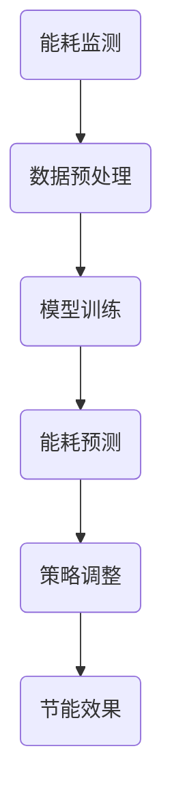
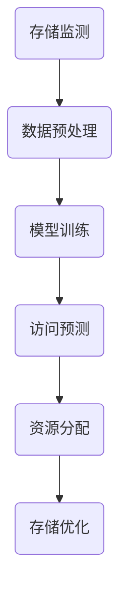
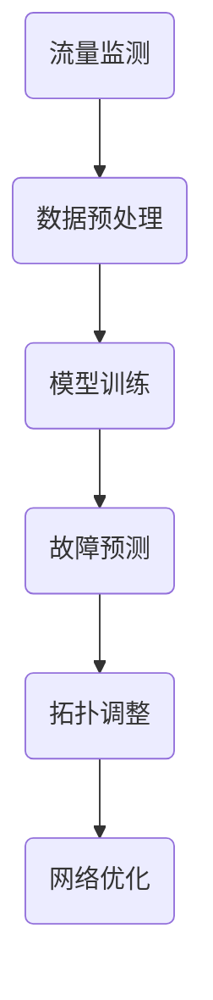

                 

# AI大模型应用数据中心建设：数据中心技术与应用

> **关键词**：AI大模型、数据中心建设、技术基础、应用实践、项目规划、案例分析、未来展望

> **摘要**：本文系统地探讨了AI大模型在数据中心建设中的应用。首先，分析了AI大模型应用的背景与数据中心建设的重要性。然后，深入阐述了数据中心基础设施的技术基础，包括硬件设备、供电系统和网络架构。接着，讨论了AI大模型在数据中心的关键应用场景，并通过实例展示了其具体应用。随后，从技术实现角度详细介绍了AI大模型在数据中心的应用实践，包括数据预处理、模型选择与优化、模型部署与运维。最后，通过实际案例解析了数据中心建设中的项目规划与实施过程，并对未来的发展趋势进行了展望。

## 第一部分: AI大模型应用数据中心建设概述

### 第1章: AI大模型应用数据中心建设的背景与意义

#### 1.1 AI大模型应用的兴起

##### 1.1.1 AI大模型的发展历程

AI大模型的发展历程可以追溯到20世纪80年代，随着计算能力和算法的不断进步，AI大模型逐渐从简单的规则系统演变为复杂的神经网络。从早期的感知机、BP算法，到后来的深度学习、生成对抗网络（GAN），AI大模型经历了多次重大的技术突破。特别是近年来，随着硬件性能的提升和海量数据的积累，AI大模型取得了显著的进展，并在图像识别、自然语言处理、语音识别等领域取得了重大突破。

##### 1.1.2 AI大模型应用的趋势

AI大模型的应用趋势表现为以下几个方向：

1. **智能化升级**：AI大模型将越来越多的应用于各个行业，实现智能化升级。例如，在制造业中，AI大模型可以用于预测设备故障、优化生产流程；在金融领域，AI大模型可以用于风险控制、欺诈检测等。

2. **跨界融合**：AI大模型与其他技术的融合将不断加深，如与云计算、大数据、物联网等技术的结合，实现更加智能化和高效化的应用。

3. **个性化服务**：随着AI大模型对用户数据的深入挖掘，个性化服务将得到进一步发展。例如，在电子商务领域，AI大模型可以根据用户行为和偏好提供个性化的商品推荐。

#### 1.2 数据中心建设的重要性

##### 1.2.1 数据中心的基础概念

数据中心（Data Center）是用于存储、处理和管理数据的设施。它通常包括服务器、存储设备、网络设备、电源和冷却系统等硬件设施，以及相应的软件系统和安全措施。数据中心的设计和建设需要考虑多个方面，包括安全性、可靠性、可扩展性、能耗等。

##### 1.2.2 数据中心在AI大模型应用中的关键作用

数据中心在AI大模型应用中扮演着至关重要的角色，主要体现在以下几个方面：

1. **计算资源提供**：AI大模型训练和推理需要大量的计算资源，数据中心可以提供强大的计算能力，支持AI大模型的运行。

2. **数据存储与管理**：AI大模型训练需要大量的数据支持，数据中心可以提供高效的数据存储和管理能力，确保数据的可靠性和安全性。

3. **环境保障**：数据中心提供了稳定的电源、冷却和网络安全保障，为AI大模型的持续运行提供了保障。

##### 1.2.3 数据中心建设的挑战

数据中心建设面临以下几方面的挑战：

1. **成本与能耗**：数据中心的建设和维护成本较高，同时能耗问题也是一大挑战。如何降低成本和能耗，提高数据中心的绿色环保水平，是当前数据中心建设面临的重要问题。

2. **安全与可靠性**：数据中心需要保证数据的安全性和可靠性，防止数据泄露、丢失和损坏。

3. **可扩展性**：随着AI大模型应用规模的不断扩大，数据中心需要具备良好的可扩展性，以适应未来发展的需求。

#### 1.3 本书结构安排

##### 1.3.1 本书内容概述

本书系统地介绍了AI大模型应用数据中心建设的各个方面，包括数据中心的基础设施、AI大模型的应用场景、技术实现、项目规划与实施等。具体包括以下几个部分：

1. **数据中心基础设施**：介绍数据中心的基础设施，包括硬件设备、供电系统和网络架构。

2. **AI大模型在数据中心的应用**：探讨AI大模型在数据中心的关键应用场景，并通过实例进行分析。

3. **AI大模型技术实现**：介绍AI大模型的技术基础，包括深度学习、自然语言处理和计算机视觉等。

4. **数据中心建设项目规划与实施**：介绍数据中心建设项目的规划与实施过程，包括项目规划、硬件设备采购与安装、软件与工具安装等。

5. **案例分析**：通过实际案例解析数据中心建设中的项目规划与实施过程。

6. **未来展望**：对数据中心AI大模型建设的发展趋势进行展望，包括技术发展趋势、应用场景拓展、面临的挑战与应对策略等。

##### 1.3.2 阅读本书的预期收获

通过阅读本书，读者可以：

1. **了解AI大模型应用数据中心建设的背景与意义**：了解AI大模型的发展历程和应用趋势，以及数据中心在AI大模型应用中的关键作用。

2. **掌握数据中心基础设施的技术基础**：了解数据中心基础设施的硬件设备、供电系统和网络架构，以及各部分的功能和设计原则。

3. **了解AI大模型在数据中心的应用场景**：了解AI大模型在数据中心的关键应用场景，以及各应用场景的具体实现方法和实例分析。

4. **掌握AI大模型技术实现的方法**：了解深度学习、自然语言处理和计算机视觉等AI大模型的技术基础，以及数据预处理、模型选择与优化、模型部署与运维等实践方法。

5. **掌握数据中心建设项目规划与实施的方法**：了解数据中心建设项目的规划与实施过程，包括项目规划、硬件设备采购与安装、软件与工具安装等。

6. **了解数据中心AI大模型建设的未来发展趋势**：了解数据中心AI大模型建设的发展趋势，包括技术发展趋势、应用场景拓展、面临的挑战与应对策略等。

## 第二部分: 数据中心技术基础

### 第2章: 数据中心基础设施

#### 2.1 数据中心硬件设备

数据中心硬件设备是数据中心的核心组成部分，主要包括服务器、存储设备和网络设备。

##### 2.1.1 服务器

服务器是数据中心的核心设备，负责处理和存储数据，并提供各种计算服务。服务器通常由处理器、内存、硬盘、网络接口等组成。

- **处理器**：处理器的性能直接影响服务器的计算能力。常见的处理器架构有x86、ARM等。
- **内存**：内存用于存储正在运行的程序和数据，其大小和速度直接影响服务器的性能。常见的内存类型有DDR4、DDR5等。
- **硬盘**：硬盘用于存储数据，常见的硬盘类型有固态硬盘（SSD）和机械硬盘（HDD）。SSD具有更高的读写速度和可靠性，而HDD具有更高的存储容量。
- **网络接口**：网络接口用于连接服务器和数据中心内部网络，常见的网络接口类型有千兆以太网（1Gbps）和万兆以太网（10Gbps）。

##### 2.1.2 存储设备

存储设备用于存储数据，是数据中心的重要组成部分。常见的存储设备有：

- **磁盘阵列**：通过将多个硬盘组合成磁盘阵列，可以提高数据的读写速度和可靠性。
- **分布式存储系统**：通过将数据分散存储在多个节点上，可以提高存储系统的可用性和扩展性。
- **闪存存储系统**：采用闪存（如NAND闪存）作为存储介质，具有更高的读写速度和较低的能耗。

##### 2.1.3 网络设备

网络设备用于连接服务器、存储设备和其他网络设备，构成数据中心内部网络。常见的网络设备有：

- **交换机**：用于连接服务器和存储设备，实现数据的高速传输。交换机可以分为核心交换机、分布交换机和接入交换机。
- **路由器**：用于连接不同网络，实现数据包的路由和转发。路由器可以分为核心路由器、分布路由器和接入路由器。
- **防火墙**：用于保护数据中心网络的安全，防止恶意攻击和数据泄露。

#### 2.2 数据中心供电系统

数据中心供电系统是数据中心正常运行的关键保障。它包括电源分配与备份、冷却系统等。

##### 2.2.1 电力需求

数据中心的电力需求主要来自服务器、存储设备、网络设备和其他辅助设备的能耗。数据中心通常需要大量的电力来支持其运行，因此电力需求是数据中心建设的关键因素之一。

- **服务器能耗**：服务器的能耗主要由处理器、内存、硬盘和网络设备等部分组成。高性能的服务器通常具有更高的能耗。
- **存储设备能耗**：存储设备的能耗主要来自硬盘的旋转和读写操作，以及控制器的运行。
- **网络设备能耗**：网络设备的能耗主要来自交换机和路由器的运行。

##### 2.2.2 电源分配与备份

数据中心通常采用双路电源分配系统，以提高供电的可靠性和冗余性。电源分配与备份包括以下几个方面：

- **UPS（不间断电源）**：UPS用于提供直流电源，将输入的交流电源转换为直流电源，以支持数据中心的正常运行。
- **电池组**：电池组用于存储UPS输出的直流电源，以支持数据中心的应急供电。
- **电源分配柜**：电源分配柜用于将UPS输出的直流电源分配到各个设备。

##### 2.2.3 冷却系统

数据中心的冷却系统用于维持服务器和存储设备等设备在适当的温度范围内运行。冷却系统可以分为以下几个方面：

- **空气冷却系统**：通过风扇将冷空气吹向设备，实现散热。空气冷却系统可以分为机房级冷却和设备级冷却。
- **水冷却系统**：通过循环水将热量带走，实现散热。水冷却系统具有更高的散热效率，但需要考虑水的腐蚀和水质问题。
- **冷热通道分离**：通过将热空气和冷空气通道分离，提高冷却效率。

#### 2.3 数据中心网络架构

数据中心网络架构是数据中心内部网络的设计和实现，包括服务器网络、存储网络和数据传输协议。

##### 2.3.1 网络设计原则

数据中心网络设计需要遵循以下原则：

- **高可靠性**：确保网络稳定运行，减少故障和中断。
- **高性能**：提供高速、低延迟的网络连接，满足大数据和高并发场景的需求。
- **可扩展性**：支持网络规模的扩展，适应未来业务增长的需求。
- **安全性**：保护网络免受恶意攻击和数据泄露。

##### 2.3.2 服务器网络

服务器网络主要用于连接服务器，实现服务器之间的数据传输和通信。服务器网络通常采用以下架构：

- **双核心交换架构**：通过两个核心交换机连接服务器，提高网络的可靠性和性能。
- **分层架构**：将网络分为接入层、分布层和核心层，实现网络层次化和模块化设计。
- **冗余设计**：通过冗余链路和冗余设备，提高网络的可靠性和容错能力。

##### 2.3.3 存储网络

存储网络主要用于连接服务器和存储设备，实现数据的高速传输和共享。存储网络通常采用以下架构：

- **FC SAN（光纤通道存储区域网络）**：通过光纤通道连接服务器和存储设备，实现高速、稳定的存储数据传输。
- **iSCSI SAN（iSCSI存储区域网络）**：通过以太网连接服务器和存储设备，实现低成本、灵活的存储数据传输。
- **NAS（网络附加存储）**：通过文件系统连接服务器和存储设备，提供文件级别的数据访问和共享。

##### 2.3.4 数据传输协议

数据中心网络中的数据传输协议用于定义数据传输的规则和方式。常见的数据传输协议有：

- **TCP/IP（传输控制协议/互联网协议）**：TCP/IP是互联网通信的基础协议，用于实现可靠的数据传输。
- **HTTP/HTTPS（超文本传输协议/安全超文本传输协议）**：HTTP/HTTPS用于在服务器和客户端之间传输Web页面和数据。
- **FTP（文件传输协议）**：FTP用于在服务器和客户端之间传输文件。
- **SMTP（简单邮件传输协议）**：SMTP用于在邮件服务器之间传输邮件。

## 第三部分: AI大模型在数据中心的应用

### 第3章: AI大模型在数据中心的应用场景

#### 3.1 人工智能与数据中心融合的驱动力

人工智能（AI）和数据中心融合的驱动力主要源于以下几个方面：

1. **计算需求的增长**：随着数据量的爆炸性增长，对数据中心的计算需求也不断上升。AI大模型需要大量的计算资源来处理和训练模型，从而推动数据中心技术的进步。

2. **数据分析的需求**：数据中心积累了大量的数据，如何高效地进行数据处理和挖掘成为关键问题。AI大模型可以提供强大的数据分析能力，帮助企业从数据中提取价值。

3. **服务质量的要求**：数据中心需要提供高质量的服务，包括低延迟、高可靠性和高安全性。AI大模型可以通过智能优化和故障预测提高数据中心的服务质量。

4. **智能化管理的需求**：数据中心管理越来越复杂，需要智能化的手段来提高管理效率。AI大模型可以用于自动化管理，降低人力成本。

#### 3.2 AI大模型在数据中心的关键应用

AI大模型在数据中心的关键应用包括以下几个方面：

1. **资源调度与优化**：AI大模型可以用于数据中心资源的调度和优化，提高资源利用率和服务质量。例如，通过预测服务器负载，自动调整服务器资源分配，避免资源浪费。

2. **节能管理**：AI大模型可以用于数据中心的节能管理，通过分析设备能耗数据，优化设备运行策略，降低能耗。例如，通过预测设备负载，自动调整冷却系统的工作模式，实现节能减排。

3. **数据分析与服务质量监测**：AI大模型可以用于数据分析和服务质量监测，从海量数据中提取有价值的信息，帮助企业做出决策。例如，通过分析网络流量数据，预测网络故障，提前进行维护。

#### 3.3 数据中心AI应用实例分析

以下通过几个实例来分析AI大模型在数据中心的具体应用：

##### 3.3.1 案例一：AI驱动的数据中心节能

某大型数据中心通过引入AI大模型，对设备能耗进行实时监测和预测。AI大模型通过分析历史能耗数据和设备运行状态，预测未来能耗趋势，并自动调整设备运行策略。例如，在预测到未来负载降低时，AI大模型可以自动调整冷却系统的工作模式，降低能耗。通过AI驱动的节能管理，该数据中心实现了显著的节能效果，每年节省了大量电力费用。



##### 3.3.2 案例二：基于AI的存储系统优化

某企业数据中心通过引入AI大模型，对存储系统进行优化。AI大模型通过分析存储设备的使用情况和数据访问模式，预测未来数据访问需求，并自动调整存储资源的分配。例如，在预测到某类数据访问频繁时，AI大模型可以自动将这类数据迁移到更快的存储设备上，提高数据访问速度。通过AI驱动的存储系统优化，该数据中心实现了更高的存储资源利用率和服务质量。



##### 3.3.3 案例三：数据中心网络智能优化

某企业数据中心通过引入AI大模型，对网络进行智能优化。AI大模型通过分析网络流量数据，预测网络故障和拥堵，并自动调整网络拓扑结构和流量分配。例如，在预测到某段网络可能出现拥堵时，AI大模型可以自动调整流量路由，避免网络拥堵。通过AI驱动的网络智能优化，该数据中心实现了更稳定的网络运行和服务质量。



## 第四部分: AI大模型技术基础

### 第4章: AI大模型技术基础

AI大模型技术基础包括深度学习、自然语言处理、计算机视觉等技术。这些技术是构建AI大模型的核心，为AI大模型的应用提供了理论基础和实现方法。

#### 4.1 深度学习与神经网络基础

深度学习是AI大模型的核心技术之一，其基础是神经网络。神经网络是一种模拟人脑神经元连接方式的计算模型，通过多层神经元的非线性变换，实现从输入到输出的映射。

##### 4.1.1 神经网络结构

神经网络通常由输入层、隐藏层和输出层组成。输入层接收外部输入信号，隐藏层通过加权求和处理生成中间特征，输出层生成最终的输出结果。

- **输入层**：输入层接收外部输入数据，每个输入数据对应一个神经元。
- **隐藏层**：隐藏层通过加权求和处理生成中间特征。每个隐藏层的神经元接收来自前一层神经元的加权输入，并加上偏置项，通过激活函数进行非线性变换。
- **输出层**：输出层生成最终的输出结果。输出层的神经元通常使用线性激活函数，以实现从隐藏层到输出的线性映射。

##### 4.1.2 深度学习算法

深度学习算法包括前向传播和反向传播两个过程。

- **前向传播**：输入数据通过神经网络从输入层传递到输出层，每一层神经元根据加权输入和激活函数生成中间特征和输出。
- **反向传播**：根据输出结果和真实值计算损失函数，将损失函数反向传播到神经网络的前一层，更新每一层神经元的权重和偏置项，以减少损失函数。

常用的深度学习算法包括：

- **多层感知机（MLP）**：多层感知机是一种简单的神经网络模型，由输入层、一个或多个隐藏层和输出层组成。
- **卷积神经网络（CNN）**：卷积神经网络是一种专门用于图像处理的神经网络模型，通过卷积层、池化层和全连接层实现图像特征提取和分类。
- **循环神经网络（RNN）**：循环神经网络是一种用于序列数据处理的神经网络模型，通过循环连接实现序列中不同时间步之间的依赖关系。

#### 4.2 自然语言处理与AI大模型

自然语言处理（NLP）是AI大模型的重要应用领域之一，其目标是将自然语言数据转换为计算机可处理的格式，并从中提取有用信息。

##### 4.2.1 语言模型与自然语言理解

语言模型用于预测自然语言中的下一个词或句子，是实现自然语言处理的关键技术。

- **n-gram模型**：n-gram模型是一种基于历史概率的简单语言模型，通过统计前n个单词的联合概率来预测下一个单词。
- **神经网络语言模型**：神经网络语言模型通过神经网络学习单词和句子的概率分布，能够更好地捕捉语言中的复杂结构和依赖关系。

自然语言理解是指计算机理解和解释自然语言的过程，包括词法分析、句法分析、语义分析和语用分析等。

- **词法分析**：词法分析将文本分解成单词和标点符号等基本元素。
- **句法分析**：句法分析将文本分解成句子，并分析句子中的语法结构和成分。
- **语义分析**：语义分析将文本分解成句子，并分析句子中的意义和逻辑关系。
- **语用分析**：语用分析将文本分解成句子，并分析句子中的语境和使用目的。

##### 4.2.2 情感分析与应用

情感分析是自然语言处理的一个重要应用领域，用于判断文本中的情感倾向，如正面、负面或中性。

- **基于规则的方法**：基于规则的方法通过定义一系列规则，判断文本中的情感倾向。
- **基于统计的方法**：基于统计的方法通过统计文本中的词语和短语的出现频率，判断文本中的情感倾向。
- **基于机器学习的方法**：基于机器学习的方法通过训练模型，从大量标注数据中学习情感分类规则。

情感分析在多个领域有广泛应用，如市场调研、社交媒体分析、客户服务等。

#### 4.3 计算机视觉与AI大模型

计算机视觉是AI大模型的另一个重要应用领域，旨在使计算机理解和解释视觉信息。

##### 4.3.1 图像识别与处理

图像识别是计算机视觉的核心任务，旨在从图像中识别出特定的对象、场景或属性。

- **基于传统图像处理的方法**：基于传统图像处理的方法通过特征提取和分类算法实现图像识别，但性能受限于计算资源和算法复杂度。
- **基于深度学习的方法**：基于深度学习的方法通过卷积神经网络（CNN）实现图像识别，具有更高的准确性和鲁棒性。

图像处理是计算机视觉的基础，包括图像增强、图像分割、目标检测等任务。

- **图像增强**：图像增强通过调整图像的亮度和对比度，提高图像的质量和视觉效果。
- **图像分割**：图像分割将图像分解成不同的区域或对象，以实现目标检测和识别。
- **目标检测**：目标检测从图像中检测出特定的对象或目标，并标注其位置和属性。

##### 4.3.2 目标检测与跟踪

目标检测是计算机视觉的一个重要任务，旨在从图像中检测出特定的对象或目标。

- **基于区域建议的方法**：基于区域建议的方法通过生成一系列可能包含目标的区域，再对每个区域进行分类和定位。
- **基于深度学习的方法**：基于深度学习的方法通过卷积神经网络（CNN）实现目标检测，具有更高的准确性和实时性。

目标跟踪是计算机视觉的另一个重要任务，旨在跟踪图像中的目标对象。

- **基于模板匹配的方法**：基于模板匹配的方法通过比较图像中的目标区域与模板的相似度，实现目标的跟踪。
- **基于深度学习的方法**：基于深度学习的方法通过卷积神经网络（CNN）实现目标的跟踪，具有更高的准确性和鲁棒性。

## 第五部分: AI大模型在数据中心的应用实践

### 第5章: AI大模型在数据中心的应用实践

AI大模型在数据中心的应用实践是一个涉及多个层面的过程，包括数据预处理、模型选择与优化、模型部署与运维等。以下将详细阐述这些实践步骤，并提供具体的技术实现方法和案例解析。

#### 5.1 数据预处理

数据预处理是AI大模型应用的第一步，其目的是将原始数据转换为适合模型训练的形式。数据预处理包括以下几个关键步骤：

##### 5.1.1 数据清洗

数据清洗是数据预处理的重要环节，旨在去除数据中的噪声、错误和不一致信息。数据清洗的方法包括：

- **缺失值处理**：对缺失值进行填补或删除。
- **异常值处理**：对异常值进行修正或删除。
- **重复值处理**：删除重复的数据记录。

在实际应用中，可以使用Python的Pandas库进行数据清洗操作，例如：

```python
import pandas as pd

# 读取数据
data = pd.read_csv('data.csv')

# 去除缺失值
data = data.dropna()

# 删除重复值
data = data.drop_duplicates()

# 修正异常值
data['column'] = data['column'].replace([异常值1, 异常值2], [修正值1, 修正值2])
```

##### 5.1.2 数据标准化

数据标准化是将不同特征的数据缩放到相同的尺度，以消除特征间的量纲影响。常用的数据标准化方法包括：

- **最小-最大标准化**：将数据缩放到[0, 1]或[-1, 1]的区间。
- **均值-方差标准化**：将数据缩放到均值为0，标准差为1的区间。

在实际应用中，可以使用Python的Sklearn库进行数据标准化操作，例如：

```python
from sklearn.preprocessing import MinMaxScaler

# 初始化最小-最大标准化器
scaler = MinMaxScaler()

# 标准化数据
data_normalized = scaler.fit_transform(data)
```

##### 5.1.3 特征提取

特征提取是数据预处理的重要步骤，旨在从原始数据中提取出对模型训练有用的特征。特征提取的方法包括：

- **手工特征提取**：根据业务需求和数据特性，手工设计特征。
- **自动特征提取**：使用机器学习算法自动提取特征，如主成分分析（PCA）和特征选择算法。

在实际应用中，可以使用Python的Scikit-learn库进行特征提取操作，例如：

```python
from sklearn.decomposition import PCA

# 初始化PCA
pca = PCA(n_components=10)

# 提取特征
data_features = pca.fit_transform(data_normalized)
```

#### 5.2 模型选择与优化

模型选择与优化是AI大模型应用的关键步骤，旨在选择合适的模型结构和参数，以实现最佳性能。以下将介绍常用的模型选择与优化方法：

##### 5.2.1 模型评估与选择

模型评估与选择是模型选择与优化的第一步，旨在选择性能最佳的模型。常用的模型评估指标包括：

- **准确率**：准确率是分类模型常用的评估指标，表示正确分类的样本数与总样本数的比值。
- **召回率**：召回率是分类模型常用的评估指标，表示正确分类的样本数与实际为正类的样本数的比值。
- **F1分数**：F1分数是准确率和召回率的调和平均值，用于综合评估模型的性能。

在实际应用中，可以使用Python的Sklearn库进行模型评估与选择，例如：

```python
from sklearn.metrics import accuracy_score, recall_score, f1_score

# 预测结果
predictions = model.predict(test_data)

# 计算评估指标
accuracy = accuracy_score(test_labels, predictions)
recall = recall_score(test_labels, predictions, average='macro')
f1 = f1_score(test_labels, predictions, average='macro')

print("Accuracy:", accuracy)
print("Recall:", recall)
print("F1-score:", f1)
```

##### 5.2.2 模型优化与调参

模型优化与调参是提高模型性能的重要手段，通过调整模型参数，实现最佳性能。常用的模型优化与调参方法包括：

- **交叉验证**：交叉验证是一种评估模型性能和进行参数调优的方法，通过将数据划分为训练集和验证集，多次训练和验证，评估模型的泛化能力。
- **网格搜索**：网格搜索是一种参数调优方法，通过遍历预定义的参数组合，选择性能最佳的参数组合。
- **贝叶斯优化**：贝叶斯优化是一种基于贝叶斯推理的参数调优方法，通过不断更新模型参数的概率分布，选择最优参数组合。

在实际应用中，可以使用Python的Sklearn库和Hyperopt库进行模型优化与调参，例如：

```python
from sklearn.model_selection import GridSearchCV
from hyperopt import fmin, tpe, hp

# 定义模型参数空间
space = {
    'param1': hp.uniform('param1', 0, 1),
    'param2': hp.uniform('param2', 0, 10)
}

# 定义目标函数
def objective(params):
    model = MyModel(params)
    return -evaluate_model(model, validation_data)

# 进行网格搜索
grid_search = GridSearchCV(MyModel(), param_grid=param_grid, cv=5)
grid_search.fit(train_data, train_labels)

# 进行贝叶斯优化
best_params = fmin(fn=objective, space=space, algo=tpe.suggest, max_evals=100)
```

#### 5.3 模型部署与运维

模型部署与运维是AI大模型应用的重要环节，旨在将训练好的模型部署到生产环境中，并提供持续的服务。以下将介绍常用的模型部署与运维方法：

##### 5.3.1 模型部署策略

模型部署策略是指将训练好的模型部署到生产环境中的方法和策略。常用的模型部署策略包括：

- **本地部署**：本地部署是将模型部署到本地计算机或服务器上，适用于小型应用场景。
- **云部署**：云部署是将模型部署到云计算平台，如AWS、Azure、Google Cloud等，适用于大规模应用场景。
- **容器化部署**：容器化部署是将模型封装在容器中，如Docker容器，实现模型的快速部署和跨平台部署。

在实际应用中，可以使用Python的Flask或FastAPI框架进行本地或云部署，例如：

```python
from flask import Flask, request, jsonify

app = Flask(__name__)

@app.route('/predict', methods=['POST'])
def predict():
    data = request.get_json()
    prediction = model.predict([data['input']])
    return jsonify({'prediction': prediction.tolist()})

if __name__ == '__main__':
    app.run()
```

##### 5.3.2 运维监控与优化

运维监控与优化是确保模型稳定运行和提高服务质量的重要手段。以下将介绍常用的运维监控与优化方法：

- **日志监控**：通过收集和监控系统的日志，实时了解系统的运行状况，发现潜在问题。
- **性能监控**：通过监控系统的性能指标，如CPU利用率、内存使用率、网络流量等，了解系统的负载情况，优化资源分配。
- **故障恢复**：通过自动故障恢复机制，确保系统在出现故障时能够快速恢复，减少停机时间。

在实际应用中，可以使用Python的Prometheus和Grafana进行日志监控和性能监控，例如：

```python
from prometheus_client import start_http_server, Summary

REQUEST_TIME = Summary('request_processing_time', 'Time spent processing request')

@app.before_request
def before_request():
    REQUEST_TIME.time()

@app.after_request
def after_request(response):
    return response

if __name__ == '__main__':
    start_http_server(8000)
```

## 第六部分: AI大模型数据中心建设实战

### 第6章: 数据中心建设项目规划与实施

数据中心建设项目规划与实施是确保数据中心建设顺利进行并满足预期目标的关键环节。以下将详细阐述数据中心建设项目的规划与实施过程，包括项目规划、硬件设备采购与安装、软件与工具安装等。

#### 6.1 项目规划

项目规划是数据中心建设的第一步，旨在明确项目目标、制定项目计划、分配资源和预算等。以下是一个典型的数据中心建设项目规划流程：

1. **项目需求分析**：明确数据中心的建设目标、业务需求、性能要求等。例如，确定数据中心需要支持多少服务器、存储设备和网络设备，以及需要提供多少带宽和存储空间。

2. **项目进度安排**：制定项目进度计划，明确各阶段的任务和时间节点。例如，项目可以分为需求分析、设计、采购、施工、测试和上线等阶段。

3. **项目成本预算**：根据项目需求和进度计划，制定项目成本预算。包括硬件设备、软件系统、人力成本、施工费用等。

4. **风险评估与应对策略**：识别项目可能面临的风险，如技术风险、市场风险、安全风险等，并制定相应的应对策略。

5. **项目组织架构**：确定项目组织架构，明确各成员的职责和分工。例如，可以设立项目经理、技术总监、采购经理等职位。

#### 6.2 硬件设备采购与安装

硬件设备采购与安装是数据中心建设的关键环节，包括服务器、存储设备、网络设备等。以下是一个典型的硬件设备采购与安装流程：

1. **设备选型**：根据项目需求和预算，选择合适的硬件设备。例如，选择高性能的服务器、大容量的存储设备和高速的网络设备。

2. **采购与招标**：根据设备选型结果，制定采购计划和招标文件，向供应商进行采购。

3. **设备到货与验收**：设备到货后，进行设备验收，确保设备质量符合要求。

4. **设备安装与调试**：按照设备安装指南，进行设备安装和调试，确保设备正常运行。

5. **系统集成与测试**：将各设备进行系统集成，进行功能测试和性能测试，确保系统稳定可靠。

#### 6.3 软件与工具安装

软件与工具安装是数据中心建设的重要组成部分，包括操作系统、数据库系统、网络管理工具等。以下是一个典型的软件与工具安装流程：

1. **操作系统安装**：在服务器上安装操作系统，如Linux或Windows Server。

2. **数据库系统安装**：在服务器上安装数据库系统，如MySQL、Oracle或SQL Server。

3. **网络管理工具安装**：在服务器上安装网络管理工具，如Nagios、Zabbix等。

4. **配置与管理**：根据项目需求和实际情况，对操作系统、数据库系统和网络管理工具进行配置和管理。

5. **测试与优化**：进行系统测试和性能优化，确保系统稳定可靠。

#### 6.4 项目实施过程

以下是一个典型的数据中心建设项目实施过程：

1. **需求分析**：明确数据中心的建设目标、业务需求和性能要求。

2. **设计阶段**：根据需求分析结果，进行数据中心设计方案的设计，包括硬件设备选型、网络架构设计、供电和冷却系统设计等。

3. **采购阶段**：根据设计方案，进行硬件设备和软件系统的采购。

4. **施工阶段**：根据设计方案，进行数据中心建设施工，包括硬件设备安装、网络设备连接、供电和冷却系统安装等。

5. **测试阶段**：进行数据中心系统测试和性能测试，确保系统稳定可靠。

6. **上线阶段**：将数据中心系统上线，提供业务服务。

7. **运维阶段**：对数据中心进行日常运维和管理，确保系统稳定运行。

## 第七部分: AI大模型数据中心建设案例解析

### 第7章: 成功案例解析

#### 7.1 案例一：某大型企业数据中心建设

##### 7.1.1 项目背景

某大型企业为了支持其业务发展，决定建设一个高性能、高可靠性的数据中心。数据中心需要满足以下需求：

- **计算能力**：支持企业内部和外部业务的计算需求，包括数据处理、分析和存储等。
- **存储能力**：提供足够的存储空间，支持大规模数据存储和访问。
- **网络性能**：提供高速、稳定的网络连接，支持企业内部和外部网络的互联互通。
- **安全性**：确保数据的安全性和可靠性，防止数据泄露和损坏。

##### 7.1.2 项目目标

数据中心建设项目的主要目标包括：

- **高可用性**：确保数据中心系统的高可用性，减少故障和停机时间。
- **高性能**：提供高性能的计算和存储服务，满足企业业务的性能需求。
- **高可靠性**：确保数据中心的可靠运行，减少故障和损坏的风险。
- **可扩展性**：支持未来的业务增长和需求变化，具有良好的可扩展性。

##### 7.1.3 项目实施过程

数据中心建设项目的实施过程如下：

1. **需求分析**：明确数据中心的建设目标、业务需求和性能要求。

2. **设计阶段**：

   - **硬件设备选型**：根据需求分析结果，选择合适的服务器、存储设备和网络设备。
   - **网络架构设计**：设计数据中心内部网络架构，包括服务器网络、存储网络和数据中心网络。
   - **供电和冷却系统设计**：设计数据中心的供电和冷却系统，确保设备正常运行。

3. **采购阶段**：根据设计方案，进行硬件设备和软件系统的采购。

4. **施工阶段**：按照设计方案，进行数据中心建设施工，包括硬件设备安装、网络设备连接、供电和冷却系统安装等。

5. **测试阶段**：进行数据中心系统测试和性能测试，确保系统稳定可靠。

6. **上线阶段**：将数据中心系统上线，提供业务服务。

7. **运维阶段**：对数据中心进行日常运维和管理，确保系统稳定运行。

##### 7.1.4 项目成果分析

数据中心建设项目取得了以下成果：

- **高可用性**：通过冗余设计和故障转移机制，确保数据中心系统的高可用性，减少了故障和停机时间。
- **高性能**：通过高性能的服务器和存储设备，以及优化的网络架构，提供了快速、高效的数据处理和存储服务，满足了企业业务的性能需求。
- **高可靠性**：通过完善的备份和恢复机制，确保数据的安全性和可靠性，减少了数据泄露和损坏的风险。
- **可扩展性**：通过模块化设计和灵活的资源配置，支持了未来的业务增长和需求变化，具有良好的可扩展性。

#### 7.2 案例二：AI驱动的数据中心节能管理

##### 7.2.1 节能背景

某大型数据中心在运营过程中发现，其能耗成本占据了运营成本的大部分。为了降低能耗成本，提高数据中心的能源利用率，决定采用AI驱动的节能管理方案。

##### 7.2.2 AI技术应用

AI驱动的节能管理方案主要包括以下技术应用：

- **能耗监测**：通过部署传感器和监控设备，实时监测数据中心的能耗情况，包括电力消耗、冷却系统耗能等。
- **数据预处理**：对采集到的能耗数据进行清洗、标准化和特征提取，为后续模型训练提供高质量的数据。
- **深度学习模型训练**：利用深度学习算法，训练能耗预测模型，预测未来一段时间内的能耗情况。
- **节能策略优化**：根据能耗预测结果，优化冷却系统的工作模式，降低能耗。

##### 7.2.3 项目实施效果

AI驱动的节能管理方案实施后，取得了显著的效果：

- **能耗降低**：通过优化冷却系统的工作模式，降低了数据中心的能耗，节约了能源成本。
- **设备寿命延长**：通过优化设备运行策略，降低了设备的负载，延长了设备的寿命。
- **环境效益**：降低了数据中心的碳排放，提高了能源利用效率，对环境产生了积极的影响。

##### 7.2.4 总结与启示

该案例总结了AI驱动的数据中心节能管理的关键经验和启示：

- **数据质量至关重要**：能耗监测数据的质量直接影响能耗预测模型的准确性，需要确保数据的准确性和完整性。
- **深度学习算法效果显著**：深度学习算法在能耗预测和节能优化方面具有显著的效果，可以提高数据中心的能源利用效率。
- **策略优化需结合实际情况**：节能策略的优化需要结合数据中心的实际情况，综合考虑能耗、设备负载和设备寿命等因素。
- **持续改进与优化**：数据中心节能管理是一个持续改进的过程，需要不断收集数据、优化模型和调整策略，以实现更好的节能效果。

## 第八部分: 未来展望

### 第8章: 数据中心AI大模型建设发展趋势

随着人工智能技术的快速发展，数据中心AI大模型建设已经成为信息化建设的重要方向。未来，数据中心AI大模型建设将呈现出以下发展趋势：

#### 8.1 技术发展趋势

1. **大模型规模将进一步扩大**：随着计算能力和数据资源的增长，AI大模型的规模将进一步扩大。未来的AI大模型将具备更强的计算能力和数据存储能力，能够应对更复杂的业务场景。

2. **算法优化与技术创新**：在深度学习、自然语言处理、计算机视觉等领域，将持续出现新的算法和模型结构，提高模型的性能和效率。例如，自适应学习算法、分布式训练技术、高效推理算法等。

3. **跨学科融合**：数据中心AI大模型建设将与其他技术领域深度融合，如云计算、大数据、物联网、边缘计算等。跨学科融合将推动数据中心AI大模型在更多领域得到应用，实现智能化升级。

#### 8.2 应用场景拓展

1. **新兴领域的应用**：数据中心AI大模型将在新兴领域得到广泛应用，如智能交通、智慧城市、智能制造等。通过AI大模型的应用，这些领域将实现更加智能化和高效化的运行。

2. **智能化数据中心的发展趋势**：随着AI大模型在数据中心的应用，数据中心将逐渐实现智能化升级。未来的数据中心将具备自我优化、自我诊断、自我修复的能力，提高数据中心的运行效率和可靠性。

3. **产业协同与生态系统构建**：数据中心AI大模型建设将推动产业链上下游的协同发展，形成完整的生态系统。数据中心建设、硬件设备制造、软件开发、AI模型开发等环节将紧密合作，共同推动数据中心AI大模型建设的发展。

#### 8.3 面临的挑战与应对策略

1. **技术挑战**：

   - **计算资源需求**：随着AI大模型的规模扩大，对计算资源的需求也将急剧增加。数据中心需要具备强大的计算能力，以满足AI大模型训练和推理的需求。
   - **数据隐私与安全**：在数据中心AI大模型建设中，数据隐私和安全是一个重要挑战。如何确保数据的安全性和隐私性，防止数据泄露和滥用，是数据中心建设的重要问题。
   - **算法优化与性能提升**：随着AI大模型规模的扩大，对算法优化和性能提升的要求也越来越高。需要持续进行算法研究和技术创新，提高AI大模型的性能和效率。

2. **管理与运营挑战**：

   - **人员培训与能力提升**：数据中心AI大模型建设需要具备专业知识和技能的人员。如何培养和引进高素质的人才，是数据中心运营面临的重要挑战。
   - **系统运维与维护**：数据中心AI大模型建设需要建立完善的运维体系，确保系统的稳定运行。系统运维与维护需要投入大量的人力、物力和财力，提高运维效率是关键。
   - **成本控制与效益提升**：数据中心AI大模型建设需要投入大量资金和资源，如何实现成本控制和效益提升，是数据中心运营需要考虑的问题。

3. **应对策略**：

   - **加强技术创新**：持续进行算法研究和技术创新，提高AI大模型的性能和效率。
   - **构建生态系统**：推动产业链上下游的协同发展，形成完整的生态系统，降低成本和提高效益。
   - **加强人才培养与引进**：培养和引进高素质的人才，提高数据中心建设和管理的能力。
   - **优化运维体系**：建立完善的运维体系，提高系统运维与维护的效率，降低运维成本。

## 附录：技术资源与参考资料

### 附录A: 技术资源

A.1 数据中心建设相关资源

- **标准与规范**：
  - **国际数据中心协会（Uptime Institute）**：提供数据中心的设计、建设、运维和认证标准。
  - **TIA-942**：美国电信工业协会（TIA）制定的数据中心基础设施标准。
  - **ISO/IEC 27001**：国际标准化组织（ISO）制定的网络安全管理体系标准。

- **开源项目**：
  - **Open Compute Project (OCP)**：提供开源服务器、存储和网络硬件设计。
  - **Open Infrastructure Foundation (OIF)**：维护和推广开源基础设施项目，包括OpenStack、Ceph等。

- **专业论坛与社区**：
  - **Data Center Knowledge**：提供数据中心行业新闻、趋势和分析。
  - **The Data Center Journal**：提供数据中心技术文章、案例研究和行业洞察。
  - **LinkedIn Groups**：如“Data Center Professionals”和“Data Center Managers”等，提供专业交流平台。

A.2 AI大模型相关资源

- **学术论文与期刊**：
  - **NeurIPS**：神经信息处理系统年会，是深度学习和AI领域的顶级学术会议。
  - **ICML**：国际机器学习会议，是机器学习和数据挖掘领域的顶级学术会议。
  - **JMLR**：机器学习研究期刊，是机器学习领域的顶级学术期刊。

- **开源框架与工具**：
  - **TensorFlow**：谷歌开源的深度学习框架，支持多种深度学习模型的训练和部署。
  - **PyTorch**：Facebook开源的深度学习框架，提供灵活的动态计算图和强大的GPU支持。
  - **Scikit-learn**：Python机器学习库，提供多种机器学习算法的实现和评估工具。

- **在线教程与课程**：
  - **Coursera**：提供多种AI和机器学习在线课程，如“深度学习”、“机器学习”等。
  - **edX**：提供由顶级大学和机构提供的免费在线课程，包括“AI大模型”相关课程。
  - **Udacity**：提供实用的AI和机器学习项目课程，如“深度学习工程师纳米学位”。

### 附录B: 参考文献与扩展阅读

B.1 关键技术文献

- **Ian Goodfellow, Yoshua Bengio, Aaron Courville.** "Deep Learning". MIT Press, 2016.
- **Yoshua Bengio.** "Learning Deep Architectures for AI". MIT Press, 2009.
- **Geoffrey H. Davis.** "The Deep Learning Revolution". NeurIPS 2016 Tutorial.
- **Christopher M. Bishop.** "Pattern Recognition and Machine Learning". Springer, 2006.

B.2 数据中心建设相关文献

- **Uptime Institute.** "The Uptime Tier Standard: A Comprehensive Classification System for Datacenter Infrastructure". 2018.
- **Telecommunications Industry Association (TIA).** "TIA-942: Data Center Standards". 2018.
- **American National Standards Institute (ANSI).** "ANSI/TIA-608-A: Standard for Telecommunications Infrastructure for Data Centers". 2017.
- **European Committee for Electrotechnical Standardization (CENELEC).** "EN 50600: Data centers". 2015.

B.3 相关书籍

- **Tom Kyte.** "Expert Oracle Database Architecture". Apress, 2014.
- **Jeffrey A. Talan.** "Linux Server Performance and Capacity Planning". Springer, 2013.
- **John R. Vacca.** "CCIE Professional Development: Routing TCP/IP, Volume 1". Cisco Press, 2011.
- **Victor in’t Veld.** "Data Center Networking". Cisco Press, 2014.

