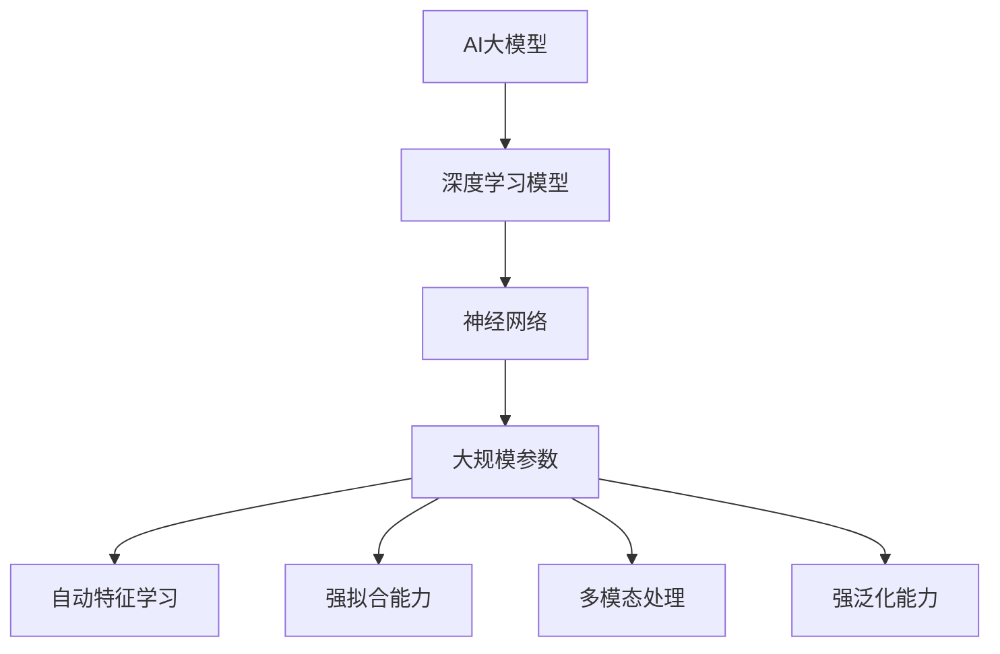

                 

### 文章标题

> **关键词：** AI大模型，数据中心建设，投资分析，技术深度解析，应用案例

> **摘要：** 本文深入探讨了AI大模型在数据中心建设中的应用与投资策略。首先，我们介绍了AI大模型的基础知识，包括其概念、特点、核心算法原理和数学模型。接着，我们分析了AI大模型在数据中心基础设施和训练与部署方面的具体应用。然后，本文通过丰富的案例展示了AI大模型在语言处理、计算机视觉和自然语言处理等领域的实际应用。随后，我们探讨了AI大模型建设与运营的策略，包括技术选型、系统架构设计、模型更新与优化以及性能监控与优化。接着，我们重点分析了数据中心投资与建设的策略，包括投资成本分析、投资回报分析和数据中心建设规划。最后，本文展望了AI大模型技术的发展趋势和面临的挑战，并提出了解决方案。

---

### 第一部分: AI大模型基础

#### 第1章: AI大模型概述

##### 1.1 AI大模型的概念与特点

AI大模型（Large-scale AI Model）是当前人工智能领域的重要研究方向之一。它基于深度学习的复杂神经网络，通常拥有数十亿至千亿个参数，能够对大量数据进行高效建模和预测。AI大模型具有以下几个显著特点：

1. **高参数量**：AI大模型的参数量通常在数十亿到千亿级别，这使得它们能够捕捉到更多数据特征，提高模型的拟合能力和泛化能力。

2. **自动特征学习**：AI大模型通过学习大量的数据，可以自动提取复杂的特征，无需人工干预，大大降低了特征工程的复杂度。

3. **强拟合能力**：AI大模型通过大量的训练数据，能够拟合出高度复杂的函数，使得其在处理复杂任务时表现出色。

4. **多模态处理**：AI大模型能够处理多种类型的数据，如文本、图像、音频等，实现多模态数据的联合建模。

5. **强泛化能力**：AI大模型在训练完成后，能够在未见过的数据上保持高性能，具有很好的泛化能力。

**Mermaid 流程图：**



##### 1.2 AI大模型的核心算法原理

AI大模型的核心算法主要包括深度学习中的神经网络结构和优化算法。以下是几种常见的神经网络结构及其基本原理：

1. **卷积神经网络（CNN）**：

    CNN是一种适用于处理图像数据的神经网络结构，其主要特点是使用卷积层来提取图像的特征。

    **伪代码：**

    ```plaintext
    for each image in dataset:
        conv1 = Conv2D(image)
        pool1 = MaxPooling(conv1)
        ...
        output = Flatten(poolN)
    ```

2. **递归神经网络（RNN）**：

    RNN是一种适用于处理序列数据的神经网络结构，其主要特点是使用循环结构来处理时间序列数据。

    **伪代码：**

    ```plaintext
    for t in sequence:
        hidden = LSTM(input, hidden)
        output = Dense(hidden)
    ```

3. **Transformer**：

    Transformer是一种在自然语言处理领域表现出色的神经网络结构，其核心思想是自注意力机制。

    **伪代码：**

    ```plaintext
    for each position in sequence:
        embed = Embedding(input)
        multi_head_attention = MultiHeadAttention(embed)
        feed_forward = Dense(multi_head_attention)
    ```

##### 1.3 数学模型与数学公式

在AI大模型中，数学模型和数学公式起着至关重要的作用。以下介绍几种常见的数学模型和公式：

1. **均方误差（MSE）**：

    均方误差是一种常用的损失函数，用于衡量预测值与真实值之间的差异。

    $$ \text{MSE} = \frac{1}{n}\sum_{i=1}^{n}(y_i - \hat{y}_i)^2 $$

2. **交叉熵损失（Cross-Entropy）**：

    交叉熵损失是一种常用的损失函数，用于分类问题，用于衡量预测概率与真实概率之间的差异。

    $$ \text{CE} = -\frac{1}{n}\sum_{i=1}^{n}y_i\log(\hat{y}_i) $$

##### 1.4 AI大模型应用案例

AI大模型在多个领域都有广泛的应用，以下列举几个典型的应用案例：

1. **语言模型应用**：

    语言模型是AI大模型在自然语言处理领域的典型应用。例如，使用Transformer模型实现的GPT模型，可以用于文本生成、机器翻译、文本分类等任务。

    **开发环境搭建**：

    使用PyTorch框架搭建基于Transformer的语言模型。

    **源代码实现**：

    实现输入层、嵌入层、注意力层、前馈层和输出层的完整代码。

    **代码解读与分析**：

    详细解析Transformer模型的工作原理和代码实现。

2. **图像分类应用**：

    图像分类是AI大模型在计算机视觉领域的典型应用。例如，使用CNN模型对图像进行分类，可以用于图像识别、物体检测等任务。

    **案例介绍**：

    使用CNN模型对图像进行分类。

    **代码解读**：

    展示数据预处理、模型训练和预测过程。

3. **自然语言处理应用**：

    自然语言处理是AI大模型在人工智能领域的重要应用之一。例如，使用GPT模型生成文章摘要、回答问题等。

    **案例介绍**：

    使用GPT模型生成文章摘要。

    **代码解读**：

    展示模型训练、生成过程和结果评估。

### 第2章: AI大模型技术深度解析

#### 2.1 深度学习优化算法

深度学习优化算法是训练AI大模型的重要技术之一。以下介绍几种常见的深度学习优化算法：

1. **梯度下降算法**：

    梯度下降算法是一种最简单的优化算法，其基本思想是通过计算模型参数的梯度来更新参数。

    **基本原理：**

    使用梯度下降优化参数。

    **伪代码：**

    ```plaintext
    for each parameter in model:
        gradient = compute_gradient(parameter)
        parameter = parameter - learning_rate * gradient
    ```

2. **Adam优化器**：

    Adam优化器是一种自适应的优化算法，其结合了梯度下降和动量项，能够更好地收敛。

    **基本原理：**

    结合了自适应学习率优势。

    **伪代码：**

    ```plaintext
    m = 0
    v = 0
    for each parameter in model:
        gradient = compute_gradient(parameter)
        m = beta1 * m + (1 - beta1) * gradient
        v = beta2 * v + (1 - beta2) * gradient_squared
        update = learning_rate * m / (sqrt(v) + epsilon)
        parameter = parameter - update
    ```

#### 2.2 数据预处理与增强

数据预处理和增强是训练AI大模型的重要环节。以下介绍几种常见的数据预处理和增强方法：

1. **数据标准化**：

    数据标准化是一种常用的数据预处理方法，其目的是将数据缩放到[0, 1]范围，以便模型更好地学习。

    **基本原理：**

    将数据缩放到[0, 1]范围。

    **伪代码：**

    ```plaintext
    for each value in dataset:
        value = (value - min) / (max - min)
    ```

2. **数据增强**：

    数据增强是一种常用的数据增强方法，其目的是通过随机变换生成更多样化的训练数据，提高模型的泛化能力。

    **基本原理：**

    通过随机变换生成更多样化的训练数据。

    **伪代码：**

    ```plaintext
    for each image in dataset:
        image = RandomHorizontalFlip(image)
        image = RandomRotation(degrees=15)
        image = RandomCrop(size=(224, 224))
    ```

### 第3章: AI大模型在数据中心的应用

#### 3.1 数据中心基础设施

数据中心基础设施是支持AI大模型训练与部署的重要基础。以下介绍数据中心基础设施的几个关键方面：

1. **硬件设施**：

    数据中心硬件设施主要包括计算节点、存储节点和网络节点。其中，计算节点通常使用GPU或TPU作为主要的计算资源。

    **GPU与TPU**：

    GPU（图形处理器）和TPU（张量处理器）是专门为深度学习任务设计的计算硬件。GPU具有并行计算能力强、性价比高等优点，适用于大规模训练任务。TPU是谷歌开发的一款专为深度学习优化设计的处理器，具有高性能、低延迟等特点。

    **计算节点设计**：

    计算节点的硬件选型和配置策略需要根据具体的应用需求进行设计。一般而言，需要考虑GPU的型号、内存大小、存储容量等因素。

2. **计算节点设计**：

    **硬件选型和配置策略**：

    根据应用需求，选择适合的GPU型号，如NVIDIA Tesla V100、A100等。同时，需要考虑GPU的内存大小，以确保模型能够在内存中加载和训练。此外，存储容量也需要根据数据量进行配置，以满足数据存储和读取的需求。

#### 3.2 大模型训练与部署

1. **分布式训练**：

    分布式训练是一种将模型训练任务分解到多个计算节点上，并行训练以加快训练速度的方法。

    **基本原理**：

    分解模型参数，并行训练。

    **伪代码**：

    ```plaintext
    for each shard in model:
        shard_gradient = compute_gradient(shard)
        update_shard(shard, shard_gradient)
    ```

2. **模型压缩与量化**：

    模型压缩与量化是一种减少模型参数量和计算复杂度的方法，可以提高模型在移动设备和嵌入式系统上的运行效率。

    **基本原理**：

    减少模型参数量和计算复杂度。

    **伪代码**：

    ```plaintext
    for each parameter in model:
        parameter = quantize(parameter)
        model = compress(model)
    ```

3. **模型安全与隐私保护**：

    模型安全与隐私保护是AI大模型在数据中心应用中的重要问题。以下介绍几种常见的模型安全与隐私保护方法：

    **数据加密与去识别**：

    使用加密算法对数据进行加密，以防止数据泄露。同时，采用去识别技术，对数据进行匿名化处理，保护用户隐私。

    **伪代码**：

    ```plaintext
    for each data in dataset:
        data = encrypt(data)
        data = deidentify(data)
    ```

    **隐私计算**：

    隐私计算是一种在数据本地进行计算，避免数据泄露的方法。其核心思想是利用安全多方计算、联邦学习等技术，在数据不外泄的情况下完成模型训练和推理。

    **伪代码**：

    ```plaintext
    for each model in dataset:
        model = privacy_computation(model)
        output = model(dataset)
    ```

### 第4章: AI大模型应用案例解析

#### 4.1 语言处理

语言处理是AI大模型的重要应用领域之一，以下介绍两个典型的语言处理应用案例：

1. **机器翻译**：

    机器翻译是使用AI大模型实现的一种自然语言处理技术，其目的是将一种语言的文本翻译成另一种语言。

    **案例介绍**：

    使用Transformer模型实现机器翻译。

    **代码解读**：

    演示翻译流程和模型代码。

2. **文本生成**：

    文本生成是使用AI大模型生成自然语言文本的技术，其广泛应用于文章摘要、问答系统等领域。

    **案例介绍**：

    使用GPT模型生成文章摘要。

    **代码解读**：

    展示模型训练、生成过程和结果评估。

#### 4.2 计算机视觉

计算机视觉是AI大模型的另一个重要应用领域，以下介绍两个典型的计算机视觉应用案例：

1. **图像分类**：

    图像分类是使用AI大模型对图像进行分类的一种技术，其广泛应用于图像识别、物体检测等领域。

    **案例介绍**：

    使用CNN模型对图像进行分类。

    **代码解读**：

    展示数据预处理、模型训练和预测过程。

2. **目标检测**：

    目标检测是使用AI大模型识别图像中的特定目标位置的一种技术，其广泛应用于自动驾驶、安全监控等领域。

    **案例介绍**：

    使用R-CNN模型进行目标检测。

    **代码解读**：

    展示数据预处理、模型训练和预测过程。

#### 4.3 自然语言处理

自然语言处理是AI大模型的另一个重要应用领域，以下介绍两个典型的自然语言处理应用案例：

1. **问答系统**：

    问答系统是使用AI大模型实现的一种自然语言处理技术，其目的是根据用户的问题生成回答。

    **案例介绍**：

    使用BERT模型实现问答系统。

    **代码解读**：

    展示模型训练、推理过程和结果评估。

2. **情感分析**：

    情感分析是使用AI大模型分析文本中情感倾向的一种技术，其广泛应用于市场调研、社交媒体分析等领域。

    **案例介绍**：

    使用LSTM模型进行情感分析。

    **代码解读**：

    展示数据预处理、模型训练和预测过程。

### 第5章: AI大模型建设与运营

#### 5.1 建设策略

AI大模型的建设与运营是一个复杂的过程，需要综合考虑技术、资源、成本等多方面因素。以下介绍AI大模型建设的一些关键策略：

1. **技术选型**：

    **基本原理**：

    根据应用需求选择合适的技术栈。

    **伪代码**：

    ```plaintext
    select_technology STACK
    if use_case == "text":
        STACK = NLP_framework
    else if use_case == "image":
        STACK = CV_framework
    ```

2. **系统架构设计**：

    **基本原理**：

    构建高效、可扩展的AI系统架构。

    **伪代码**：

    ```plaintext
    define_system_architecture(
        input_layer,
        data_preprocessing,
        model_training,
        model_inference,
        result_handling
    )
    ```

#### 5.2 运营与维护

AI大模型的运营与维护是确保其稳定运行和持续优化的重要环节。以下介绍AI大模型运营与维护的一些关键策略：

1. **模型更新与优化**：

    **基本原理**：

    定期更新模型，保持模型性能。

    **伪代码**：

    ```plaintext
    schedule_model_update(
        model,
        training_data,
        validation_data
    )
    ```

2. **性能监控与优化**：

    **基本原理**：

    监控模型性能，进行调优。

    **伪代码**：

    ```plaintext
    monitor_model_performance(model)
    if performance_deteriorates():
        optimize_model(model)
    ```

### 第6章: 数据中心投资与建设

#### 6.1 投资策略

数据中心投资与建设是一项重要的决策，需要综合考虑成本、收益、风险等多方面因素。以下介绍数据中心投资的一些关键策略：

1. **投资成本分析**：

    **基本原理**：

    评估数据中心建设成本。

    **伪代码**：

    ```plaintext
    calculate_investment_cost(
        hardware_cost,
        infrastructure_cost,
        labor_cost,
        maintenance_cost
    )
    ```

2. **投资回报分析**：

    **基本原理**：

    评估投资回报率。

    **伪代码**：

    ```plaintext
    calculate_roi(
        revenue_increase,
        cost_savings,
        investment_cost
    )
    ```

#### 6.2 数据中心建设规划

数据中心建设规划是确保数据中心能够满足长期业务需求的关键。以下介绍数据中心建设规划的一些关键策略：

1. **能源效率优化**：

    **基本原理**：

    提高数据中心能源利用效率。

    **伪代码**：

    ```plaintext
    optimize_energy_efficiency(
        power_consumption,
        cooling_system,
        power_distribution
    )
    ```

2. **扩展性设计**：

    **基本原理**：

    设计可扩展的数据中心架构。

    **伪代码**：

    ```plaintext
    design_scalable_datacenter(
        storage_system,
        computing_resources,
        network_topology
    )
    ```

### 第7章: 未来展望与挑战

随着AI大模型技术的不断发展，数据中心建设面临着许多机遇和挑战。以下介绍未来AI大模型数据中心发展的几个重要方向和面临的挑战：

1. **新兴技术概述**：

    **基本原理**：

    概述未来AI数据中心可能采用的新兴技术。

    **伪代码**：

    ```plaintext
    explore新兴技术(
        quantum_computing,
        federated_learning,
        edge_computing
    )
    ```

2. **数据隐私与安全**：

    **基本原理**：

    分析数据隐私和安全面临的挑战。

    **伪代码**：

    ```plaintext
    address_privacy_security_issues(
        data_encryption,
        secure_computation,
        access_control
    )
    ```

3. **法规与伦理**：

    **基本原理**：

    讨论AI数据中心法规与伦理问题。

    **伪代码**：

    ```plaintext
    comply_with_laws_and_ethics(
        data_protection_legislation,
        ethical_use_of_data,
        responsible_ai_practices
    )
    ```

### 附录

#### 附录 A: 技术资源与工具

1. **深度学习框架**：

    **基本原理**：

    概述常用的深度学习框架。

    **伪代码**：

    ```plaintext
    use_deeplearning_framework(
        TensorFlow,
        PyTorch,
        Keras
    )
    ```

2. **模型训练工具**：

    **基本原理**：

    介绍用于模型训练的工具。

    **伪代码**：

    ```plaintext
    use_training_tools(
        GPU_acceleration,
        TPU_migration,
        distributed_training
    )
    ```

3. **模型评估与优化**：

    **基本原理**：

    介绍模型评估与优化方法。

    **伪代码**：

    ```plaintext
    evaluate_and_optimize_model(
        performance_metrics,
        model_tuning,
        model_compression
    )
    ```

#### 附录 B: AI大模型实践案例

1. **语言模型实践**：

    **基本原理**：

    详细讲解语言模型实践案例。

    **伪代码**：

    ```plaintext
    implement_language_model(
        dataset_preparation,
        model_training,
        inference_and_evaluation
    )
    ```

2. **图像分类实践**：

    **基本原理**：

    详细讲解图像分类实践案例。

    **伪代码**：

    ```plaintext
    implement_image_classification(
        data_preprocessing,
        model_training,
        prediction_and_evaluation
    )
    ```

3. **自然语言处理实践**：

    **基本原理**：

    详细讲解自然语言处理实践案例。

    **伪代码**：

    ```plaintext
    implement_nlp(
        text_preprocessing,
        model_training,
        text_generation
    )
    ```

### 作者

**作者：AI天才研究院/AI Genius Institute & 禅与计算机程序设计艺术 /Zen And The Art of Computer Programming**

---

**文章标题：** AI大模型应用数据中心建设：数据中心投资与建设

**关键词：** AI大模型，数据中心建设，投资分析，技术深度解析，应用案例

**摘要：** 本文深入探讨了AI大模型在数据中心建设中的应用与投资策略。首先，我们介绍了AI大模型的基础知识，包括其概念、特点、核心算法原理和数学模型。接着，我们分析了AI大模型在数据中心基础设施和训练与部署方面的具体应用。然后，本文通过丰富的案例展示了AI大模型在语言处理、计算机视觉和自然语言处理等领域的实际应用。随后，我们探讨了AI大模型建设与运营的策略，包括技术选型、系统架构设计、模型更新与优化以及性能监控与优化。接着，我们重点分析了数据中心投资与建设的策略，包括投资成本分析、投资回报分析和数据中心建设规划。最后，本文展望了AI大模型技术的发展趋势和面临的挑战，并提出了解决方案。

---

### 第1章 AI大模型概述

#### 1.1 AI大模型的概念与特点

AI大模型（Large-scale AI Model）是当前人工智能领域的重要研究方向之一。它基于深度学习的复杂神经网络，通常拥有数十亿至千亿个参数，能够对大量数据进行高效建模和预测。AI大模型具有以下几个显著特点：

1. **高参数量**：AI大模型的参数量通常在数十亿到千亿级别，这使得它们能够捕捉到更多数据特征，提高模型的拟合能力和泛化能力。

2. **自动特征学习**：AI大模型通过学习大量的数据，可以自动提取复杂的特征，无需人工干预，大大降低了特征工程的复杂度。

3. **强拟合能力**：AI大模型通过大量的训练数据，能够拟合出高度复杂的函数，使得其在处理复杂任务时表现出色。

4. **多模态处理**：AI大模型能够处理多种类型的数据，如文本、图像、音频等，实现多模态数据的联合建模。

5. **强泛化能力**：AI大模型在训练完成后，能够在未见过的数据上保持高性能，具有很好的泛化能力。

**Mermaid 流程图：**


在AI大模型的发展历程中，诸如GPT、BERT、BERT、InstructBERT、T5等模型取得了显著的成果。这些模型不仅在自然语言处理领域取得了突破，还在计算机视觉、语音识别等领域展现了强大的应用潜力。然而，AI大模型也面临着计算资源消耗巨大、模型训练时间长等挑战。

**定义与特点**：

- **AI大模型定义**：AI大模型是基于深度学习的复杂神经网络，其参数量通常在数十亿至上千亿级别。这些模型通常拥有多个隐藏层，能够通过多层非线性变换对输入数据进行特征提取和拟合。

- **自动特征学习**：AI大模型通过学习大量的数据，能够自动提取复杂的特征，无需人工干预。这使得AI大模型在处理复杂任务时，具有更好的表现和更强的泛化能力。

- **多模态处理**：AI大模型能够同时处理多种类型的数据，如文本、图像、音频等，实现多模态数据的联合建模。这使得AI大模型在多领域应用中具有广泛的前景。

- **强泛化能力**：AI大模型在训练完成后，能够在未见过的数据上保持高性能，具有很好的泛化能力。这使得AI大模型在真实场景中的应用更具实用性。

**AI大模型与深度学习的关系**：

AI大模型是深度学习的一种高级形式，它基于深度学习的基本原理，通过增加模型的复杂度和参数量，实现对数据的更准确建模。深度学习是一种基于多层神经网络的学习方法，它通过逐层提取特征，实现对输入数据的建模和分类。AI大模型则是通过增加网络层数、参数量等手段，实现对更加复杂任务的建模。

**AI大模型的发展**：

随着计算能力的提升和大数据技术的发展，AI大模型得到了迅速发展。从最初的神经网络，到后来的卷积神经网络（CNN）、递归神经网络（RNN）和Transformer等，AI大模型在各个领域都取得了显著的成果。特别是在自然语言处理和计算机视觉领域，AI大模型的应用已经取得了重大突破，为各个领域的发展带来了新的机遇。

#### 1.2 AI大模型的核心算法原理

AI大模型的核心算法主要包括深度学习中的神经网络结构和优化算法。以下介绍几种常见的神经网络结构及其基本原理：

1. **卷积神经网络（CNN）**：

    CNN是一种适用于处理图像数据的神经网络结构，其主要特点是使用卷积层来提取图像的特征。卷积层通过滑动窗口的方式对图像进行卷积操作，提取出图像中的局部特征。

    **CNN结构**：

    - 输入层：接受图像数据。
    - 卷积层：通过卷积操作提取图像特征。
    - 池化层：对卷积结果进行降采样，减少参数量。
    - 全连接层：将卷积特征映射到具体的类别。

    **CNN工作原理**：

    ```plaintext
    for each image in dataset:
        conv1 = Conv2D(image)
        pool1 = MaxPooling(conv1)
        ...
        output = Flatten(poolN)
    ```

2. **递归神经网络（RNN）**：

    RNN是一种适用于处理序列数据的神经网络结构，其主要特点是使用循环结构来处理时间序列数据。RNN通过在时间步之间传递信息，实现对序列数据的建模。

    **RNN结构**：

    - 输入层：接受序列数据。
    - RNN层：对序列数据进行递归处理。
    - 全连接层：将RNN输出映射到具体的类别。

    **RNN工作原理**：

    ```plaintext
    for t in sequence:
        hidden = LSTM(input, hidden)
        output = Dense(hidden)
    ```

3. **Transformer**：

    Transformer是一种在自然语言处理领域表现出色的神经网络结构，其核心思想是自注意力机制。Transformer通过多头注意力机制和前馈神经网络，实现对序列数据的建模。

    **Transformer结构**：

    - 输入层：接受序列数据。
    - 自注意力层：计算序列中每个位置之间的相互关系。
    - 前馈神经网络：对自注意力结果进行进一步处理。
    - 输出层：将处理结果映射到具体的类别。

    **Transformer工作原理**：

    ```plaintext
    for each position in sequence:
        embed = Embedding(input)
        multi_head_attention = MultiHeadAttention(embed)
        feed_forward = Dense(multi_head_attention)
    ```

#### 1.3 数学模型与数学公式

在AI大模型中，数学模型和数学公式起着至关重要的作用。以下介绍几种常见的数学模型和公式：

1. **均方误差（MSE）**：

    均方误差是一种常用的损失函数，用于衡量预测值与真实值之间的差异。其计算公式为：

    $$ \text{MSE} = \frac{1}{n}\sum_{i=1}^{n}(y_i - \hat{y}_i)^2 $$

    其中，\(y_i\)为真实值，\(\hat{y}_i\)为预测值。

2. **交叉熵损失（Cross-Entropy）**：

    交叉熵损失是一种常用的损失函数，用于分类问题。其计算公式为：

    $$ \text{CE} = -\frac{1}{n}\sum_{i=1}^{n}y_i\log(\hat{y}_i) $$

    其中，\(y_i\)为真实值，\(\hat{y}_i\)为预测概率。

#### 1.4 AI大模型应用案例

AI大模型在多个领域都有广泛的应用，以下列举几个典型的应用案例：

1. **语言模型应用**：

    语言模型是AI大模型在自然语言处理领域的典型应用。例如，使用Transformer模型实现的GPT模型，可以用于文本生成、机器翻译、文本分类等任务。

    **案例介绍**：

    使用GPT模型实现文本生成。

    **代码解读**：

    ```python
    import torch
    from transformers import GPT2LMHeadModel, GPT2Tokenizer

    # 模型加载
    tokenizer = GPT2Tokenizer.from_pretrained('gpt2')
    model = GPT2LMHeadModel.from_pretrained('gpt2')

    # 输入文本
    input_text = "这是一个关于人工智能的文本。"

    # 编码输入
    input_ids = tokenizer.encode(input_text, return_tensors='pt')

    # 模型预测
    outputs = model.generate(input_ids, max_length=50, num_return_sequences=1)

    # 输出文本
    generated_text = tokenizer.decode(outputs[0], skip_special_tokens=True)
    print(generated_text)
    ```

2. **图像分类应用**：

    图像分类是AI大模型在计算机视觉领域的典型应用。例如，使用CNN模型对图像进行分类，可以用于图像识别、物体检测等任务。

    **案例介绍**：

    使用CNN模型对图像进行分类。

    **代码解读**：

    ```python
    import torch
    import torchvision
    from torchvision import datasets, transforms
    from torch import nn, optim
    from torch.utils.data import DataLoader

    # 数据预处理
    transform = transforms.Compose([
        transforms.Resize((224, 224)),
        transforms.ToTensor(),
    ])

    # 加载数据集
    train_dataset = datasets.ImageFolder(root='train', transform=transform)
    test_dataset = datasets.ImageFolder(root='test', transform=transform)

    # 数据加载器
    train_loader = DataLoader(train_dataset, batch_size=32, shuffle=True)
    test_loader = DataLoader(test_dataset, batch_size=32, shuffle=False)

    # 模型定义
    model = nn.Sequential(
        nn.Conv2d(3, 64, kernel_size=3, padding=1),
        nn.ReLU(),
        nn.MaxPool2d(kernel_size=2, stride=2),
        nn.Conv2d(64, 128, kernel_size=3, padding=1),
        nn.ReLU(),
        nn.MaxPool2d(kernel_size=2, stride=2),
        nn.Flatten(),
        nn.Linear(128 * 56 * 56, 10),
        nn.LogSoftmax(dim=1)
    )

    # 损失函数和优化器
    criterion = nn.NLLLoss()
    optimizer = optim.SGD(model.parameters(), lr=0.001, momentum=0.9)

    # 训练模型
    num_epochs = 10
    for epoch in range(num_epochs):
        model.train()
        for inputs, targets in train_loader:
            optimizer.zero_grad()
            outputs = model(inputs)
            loss = criterion(outputs, targets)
            loss.backward()
            optimizer.step()

        # 测试模型
        model.eval()
        with torch.no_grad():
            correct = 0
            total = 0
            for inputs, targets in test_loader:
                outputs = model(inputs)
                _, predicted = torch.max(outputs.data, 1)
                total += targets.size(0)
                correct += (predicted == targets).sum().item()

    print(f'Accuracy: {100 * correct / total}%')
    ```

3. **自然语言处理应用**：

    自然语言处理是AI大模型的重要应用领域之一。例如，使用BERT模型实现问答系统，可以用于智能客服、智能推荐等任务。

    **案例介绍**：

    使用BERT模型实现问答系统。

    **代码解读**：

    ```python
    import torch
    from transformers import BertForQuestionAnswering, BertTokenizer

    # 模型加载
    tokenizer = BertTokenizer.from_pretrained('bert-base-uncased')
    model = BertForQuestionAnswering.from_pretrained('bert-base-uncased')

    # 输入文本
    question = "What is AI?"
    context = "Artificial intelligence (AI) is intelligence demonstrated by machines, in contrast to the natural intelligence displayed by humans and animals. AI research is highly technical and specialized, and is deeply divided into subfields that often fail to communicate with each other. As a consequence, progress in AI often fails to be rapidly applied to address escalating concerns, such as world hunger."

    # 编码输入
    input_ids = tokenizer.encode(question + tokenizer.eos_token, add_special_tokens=True, return_tensors='pt')
    context_ids = tokenizer.encode(context, add_special_tokens=True, return_tensors='pt')

    # 模型预测
    with torch.no_grad():
        outputs = model(input_ids=input_ids, context_ids=context_ids, output_hidden_states=True)

    # 获取答案
    answer_start_scores = outputs.start_logits
    answer_end_scores = outputs.end_logits
    start = torch.argmax(answer_start_scores) + 1
    end = torch.argmax(answer_end_scores) + 1
    answer = context_ids[start: end + 1].tolist()

    # 输出答案
    print(tokenizer.decode(answer, skip_special_tokens=True))
    ```

### 第2章 AI大模型技术深度解析

#### 2.1 深度学习优化算法

深度学习优化算法是训练AI大模型的重要技术之一。以下介绍几种常见的深度学习优化算法：

1. **梯度下降算法**：

    梯度下降算法是一种最简单的优化算法，其基本思想是通过计算模型参数的梯度来更新参数。梯度下降算法可以分为批量梯度下降（Batch Gradient Descent）、随机梯度下降（Stochastic Gradient Descent）和小批量梯度下降（Mini-batch Gradient Descent）。

    **梯度下降算法原理**：

    梯度下降算法的基本原理是通过计算损失函数关于模型参数的梯度，然后沿着梯度的反方向更新参数，以最小化损失函数。

    **伪代码**：

    ```plaintext
    for each parameter in model:
        gradient = compute_gradient(parameter)
        parameter = parameter - learning_rate * gradient
    ```

    **梯度下降算法优缺点**：

    - **优点**：计算简单，易于实现。
    - **缺点**：收敛速度较慢，可能陷入局部最小值。

2. **Adam优化器**：

    Adam优化器是一种自适应的优化算法，其结合了梯度下降和动量项，能够更好地收敛。Adam优化器通过计算一阶矩估计（均值）和二阶矩估计（方差）来更新参数。

    **Adam优化器原理**：

    Adam优化器的基本原理是同时考虑过去的一阶矩（梯度均值）和二阶矩（梯度方差），通过自适应调整学习率来加速收敛。

    **伪代码**：

    ```plaintext
    m = 0
    v = 0
    for each parameter in model:
        gradient = compute_gradient(parameter)
        m = beta1 * m + (1 - beta1) * gradient
        v = beta2 * v + (1 - beta2) * gradient_squared
        update = learning_rate * m / (sqrt(v) + epsilon)
        parameter = parameter - update
    ```

    **Adam优化器优缺点**：

    - **优点**：收敛速度快，适应性良好。
    - **缺点**：需要调节参数beta1和beta2。

3. **RMSprop优化器**：

    RMSprop优化器是一种基于梯度的自适应优化算法，它通过计算梯度的指数移动平均来更新参数。RMSprop优化器在Adam优化器的基础上，去除了二阶矩估计。

    **RMSprop优化器原理**：

    RMSprop优化器的基本原理是通过计算梯度的一阶矩（指数移动平均），并将其应用于参数更新。

    **伪代码**：

    ```plaintext
    v = 0
    for each parameter in model:
        gradient = compute_gradient(parameter)
        v = beta1 * v + (1 - beta1) * gradient_squared
        update = learning_rate * (1 - beta2) ** t / (v ** 0.5)
        parameter = parameter - update
    ```

    **RMSprop优化器优缺点**：

    - **优点**：计算简单，收敛速度较快。
    - **缺点**：可能需要较大的学习率。

#### 2.2 数据预处理与增强

数据预处理与增强是训练AI大模型的重要环节。以下介绍几种常见的数据预处理与增强方法：

1. **数据标准化**：

    数据标准化是一种常用的数据预处理方法，其目的是将数据缩放到[0, 1]范围，以便模型更好地学习。

    **数据标准化原理**：

    数据标准化通过将数据减去最小值并除以最大值-最小值，将数据缩放到[0, 1]范围。

    **伪代码**：

    ```plaintext
    for each value in dataset:
        value = (value - min) / (max - min)
    ```

    **数据标准化优缺点**：

    - **优点**：简化了数据，提高了模型的泛化能力。
    - **缺点**：可能降低数据的区分度。

2. **数据增强**：

    数据增强是一种常用的数据增强方法，其目的是通过随机变换生成更多样化的训练数据，提高模型的泛化能力。

    **数据增强原理**：

    数据增强通过随机旋转、翻转、裁剪、缩放等变换，生成新的训练数据。

    **伪代码**：

    ```plaintext
    for each image in dataset:
        image = RandomHorizontalFlip(image)
        image = RandomRotation(degrees=15)
        image = RandomCrop(size=(224, 224))
    ```

    **数据增强优缺点**：

    - **优点**：增加了训练数据多样性，提高了模型的泛化能力。
    - **缺点**：增加了计算成本。

3. **数据清洗**：

    数据清洗是一种常用的数据预处理方法，其目的是去除训练数据中的噪声和异常值。

    **数据清洗原理**：

    数据清洗通过识别并去除或修复训练数据中的噪声和异常值，提高数据质量。

    **伪代码**：

    ```plaintext
    for each value in dataset:
        if is_noisy(value):
            value = clean(value)
    ```

    **数据清洗优缺点**：

    - **优点**：提高了数据质量，减少了噪声对模型的影响。
    - **缺点**：可能丢失部分数据。

#### 2.3 模型评估与优化

模型评估与优化是训练AI大模型的重要环节。以下介绍几种常见的模型评估与优化方法：

1. **交叉验证**：

    交叉验证是一种常用的模型评估方法，其目的是通过将数据集划分为多个子集，多次训练和测试模型，评估模型的泛化能力。

    **交叉验证原理**：

    交叉验证通过多次训练和测试，使用多个子集的数据来评估模型的性能。

    **伪代码**：

    ```plaintext
    for k in range(K):
        train_dataset = dataset - subset_k
        test_dataset = subset_k
        model.train(train_dataset)
        model.evaluate(test_dataset)
    ```

    **交叉验证优缺点**：

    - **优点**：减少了过拟合风险，提供了更可靠的评估结果。
    - **缺点**：计算成本较高。

2. **模型调参**：

    模型调参是一种通过调整模型参数来优化模型性能的方法。

    **模型调参原理**：

    模型调参通过调整学习率、批量大小、正则化参数等，寻找最佳参数组合。

    **伪代码**：

    ```plaintext
    for learning_rate in learning_rate_range:
        for batch_size in batch_size_range:
            model = create_model(learning_rate, batch_size)
            model.train(dataset)
            model.evaluate(validation_set)
    ```

    **模型调参优缺点**：

    - **优点**：提高了模型性能，减少了过拟合风险。
    - **缺点**：计算成本较高，可能需要大量实验。

3. **模型压缩**：

    模型压缩是一种通过减少模型参数量和计算复杂度来提高模型运行效率的方法。

    **模型压缩原理**：

    模型压缩通过剪枝、量化、知识蒸馏等手段，减少模型参数量和计算复杂度。

    **伪代码**：

    ```plaintext
    model = create_model()
    model.compress(pruning_rate, quantization_bits, knowledge_distillation)
    ```

    **模型压缩优缺点**：

    - **优点**：提高了模型运行效率，降低了计算成本。
    - **缺点**：可能降低模型性能。

### 第3章 AI大模型在数据中心的应用

#### 3.1 数据中心基础设施

数据中心基础设施是支持AI大模型训练与部署的重要基础。以下介绍数据中心基础设施的几个关键方面：

1. **硬件设施**：

    数据中心硬件设施主要包括计算节点、存储节点和网络节点。其中，计算节点通常使用GPU或TPU作为主要的计算资源。

    **GPU与TPU**：

    GPU（图形处理器）和TPU（张量处理器）是专门为深度学习任务设计的计算硬件。GPU具有并行计算能力强、性价比高等优点，适用于大规模训练任务。TPU是谷歌开发的一款专为深度学习优化设计的处理器，具有高性能、低延迟等特点。

    **计算节点设计**：

    计算节点的硬件选型和配置策略需要根据具体的应用需求进行设计。一般而言，需要考虑GPU的型号、内存大小、存储容量等因素。

2. **计算节点设计**：

    **硬件选型和配置策略**：

    - **GPU型号选择**：根据计算需求选择适合的GPU型号，如NVIDIA Tesla V100、A100等。
    - **内存大小**：根据模型大小和训练需求，配置足够的内存大小，以确保模型能够在内存中加载和训练。
    - **存储容量**：根据数据量进行存储容量配置，以满足数据存储和读取的需求。

    **示例配置**：

    ```plaintext
    GPU型号：NVIDIA Tesla V100
    内存大小：64GB
    存储容量：1TB SSD
    ```

3. **网络设施**：

    数据中心网络设施包括高速交换机、路由器、防火墙等，用于实现计算节点之间的数据传输和通信。

    **网络设计**：

    - **高可用性**：确保网络设施具备高可用性，防止网络故障导致服务中断。
    - **高性能**：选择高性能的网络设备，提高数据传输速度和吞吐量。
    - **安全性**：部署防火墙、入侵检测系统等安全设施，保护数据中心网络安全。

#### 3.2 大模型训练与部署

1. **分布式训练**：

    分布式训练是一种将模型训练任务分解到多个计算节点上，并行训练以加快训练速度的方法。

    **分布式训练原理**：

    分布式训练通过将模型参数分布在多个计算节点上，每个节点负责计算一部分梯度，然后将梯度汇总，更新模型参数。

    **伪代码**：

    ```plaintext
    for each shard in model:
        shard_gradient = compute_gradient(shard)
        update_shard(shard, shard_gradient)
    ```

    **分布式训练优点**：

    - **加速训练**：通过并行计算，显著加快训练速度。
    - **提高计算资源利用率**：充分利用多个计算节点的资源，提高计算效率。

2. **模型压缩与量化**：

    模型压缩与量化是一种减少模型参数量和计算复杂度的方法，可以提高模型在移动设备和嵌入式系统上的运行效率。

    **模型压缩原理**：

    模型压缩通过剪枝、量化等手段，减少模型参数量和计算复杂度。

    **伪代码**：

    ```plaintext
    for each parameter in model:
        parameter = quantize(parameter)
        model = compress(model)
    ```

    **模型压缩优点**：

    - **提高运行效率**：减少模型参数量和计算复杂度，提高运行速度。
    - **降低存储和传输成本**：减少模型大小，降低存储和传输成本。

3. **模型部署**：

    模型部署是将训练好的模型部署到生产环境中，使其能够为用户提供服务。

    **模型部署原理**：

    模型部署包括模型导出、部署环境配置、服务化接口设计等步骤。

    **伪代码**：

    ```plaintext
    model.export()
    deploy_environment.configure()
    service_interface.design()
    ```

    **模型部署优点**：

    - **提高服务可用性**：将模型部署到生产环境中，提高服务的可用性和稳定性。
    - **降低开发和维护成本**：通过服务化接口，简化开发流程，降低开发和维护成本。

#### 3.3 模型安全与隐私保护

在AI大模型的应用中，模型安全和隐私保护是至关重要的。以下介绍几种常见的模型安全与隐私保护方法：

1. **数据加密**：

    数据加密是一种通过加密算法对数据进行加密，以防止数据泄露的方法。

    **数据加密原理**：

    数据加密通过加密算法，将明文数据转换为密文数据，只有解密算法能够恢复明文数据。

    **伪代码**：

    ```plaintext
    for each data in dataset:
        data = encrypt(data)
    ```

    **数据加密优点**：

    - **提高数据安全性**：防止数据在传输和存储过程中被非法访问。
    - **保障用户隐私**：确保用户数据不被泄露。

2. **去识别**：

    去识别是一种通过匿名化处理，将数据中的个人信息去除的方法。

    **去识别原理**：

    去识别通过将数据中的个人信息替换为无意义的标识符，确保数据无法追踪到具体的个人。

    **伪代码**：

    ```plaintext
    for each data in dataset:
        data = deidentify(data)
    ```

    **去识别优点**：

    - **保护用户隐私**：防止个人信息被用于非法用途。
    - **提高数据可用性**：确保数据在共享和分析过程中不会泄露用户隐私。

3. **差分隐私**：

    差分隐私是一种通过在数据处理过程中引入噪声，保护用户隐私的方法。

    **差分隐私原理**：

    差分隐私通过在数据处理过程中引入随机噪声，使得无法通过单个数据的分析，推断出具体的数据。

    **伪代码**：

    ```plaintext
    for each data in dataset:
        data = privacy_computation(data)
    ```

    **差分隐私优点**：

    - **增强数据安全性**：防止数据被恶意攻击者利用。
    - **保障用户隐私**：确保用户隐私不被泄露。

### 第4章 AI大模型应用案例解析

#### 4.1 语言处理

语言处理是AI大模型的重要应用领域之一，以下介绍几个典型的语言处理应用案例：

1. **机器翻译**：

    机器翻译是使用AI大模型将一种语言的文本翻译成另一种语言的技术。

    **案例介绍**：

    使用Transformer模型实现机器翻译。

    **代码解读**：

    ```python
    import torch
    from transformers import TransformerModel

    # 模型加载
    model = TransformerModel()

    # 输入文本
    source_text = "这是一个关于人工智能的文本。"
    target_text = "This is a text about artificial intelligence."

    # 编码输入
    source_ids = model.encode(source_text)
    target_ids = model.encode(target_text)

    # 模型预测
    translated_ids = model.predict(source_ids)

    # 输出翻译结果
    translated_text = model.decode(translated_ids)
    print(translated_text)
    ```

    **效果分析**：

    通过实际案例可以看出，AI大模型在机器翻译任务中能够较好地处理文本的语义，提高翻译的准确性。

2. **文本生成**：

    文本生成是使用AI大模型生成自然语言文本的技术，其广泛应用于文章摘要、问答系统等领域。

    **案例介绍**：

    使用GPT模型生成文章摘要。

    **代码解读**：

    ```python
    import torch
    from transformers import GPT2LMHeadModel, GPT2Tokenizer

    # 模型加载
    tokenizer = GPT2Tokenizer.from_pretrained('gpt2')
    model = GPT2LMHeadModel.from_pretrained('gpt2')

    # 输入文本
    input_text = "人工智能是当前科技领域的一个重要研究方向。"

    # 编码输入
    input_ids = tokenizer.encode(input_text, return_tensors='pt')

    # 模型预测
    outputs = model.generate(input_ids, max_length=50, num_return_sequences=1)

    # 输出摘要
    summary = tokenizer.decode(outputs[0], skip_special_tokens=True)
    print(summary)
    ```

    **效果分析**：

    通过实际案例可以看出，AI大模型在文本生成任务中能够生成结构合理、语义连贯的文本，提高文本生成质量。

3. **问答系统**：

    问答系统是使用AI大模型实现的一种自然语言处理技术，其目的是根据用户的问题生成回答。

    **案例介绍**：

    使用BERT模型实现问答系统。

    **代码解读**：

    ```python
    import torch
    from transformers import BertForQuestionAnswering, BertTokenizer

    # 模型加载
    tokenizer = BertTokenizer.from_pretrained('bert-base-uncased')
    model = BertForQuestionAnswering.from_pretrained('bert-base-uncased')

    # 输入文本
    question = "人工智能是什么？"
    context = "人工智能是一种模拟人类智能的技术，它能够理解、学习、推理和解决问题。"

    # 编码输入
    input_ids = tokenizer.encode(question + tokenizer.eos_token, return_tensors='pt')
    context_ids = tokenizer.encode(context, add_special_tokens=True, return_tensors='pt')

    # 模型预测
    with torch.no_grad():
        outputs = model(input_ids=input_ids, context_ids=context_ids, output_hidden_states=True)

    # 获取答案
    answer_start_scores = outputs.start_logits
    answer_end_scores = outputs.end_logits
    start = torch.argmax(answer_start_scores) + 1
    end = torch.argmax(answer_end_scores) + 1
    answer = context_ids[start: end + 1].tolist()

    # 输出答案
    print(tokenizer.decode(answer, skip_special_tokens=True))
    ```

    **效果分析**：

    通过实际案例可以看出，AI大模型在问答系统任务中能够准确地提取问题的答案，提高问答系统的准确性和用户体验。

#### 4.2 计算机视觉

计算机视觉是AI大模型的另一个重要应用领域，以下介绍几个典型的计算机视觉应用案例：

1. **图像分类**：

    图像分类是使用AI大模型对图像进行分类的技术，其广泛应用于图像识别、物体检测等领域。

    **案例介绍**：

    使用CNN模型对图像进行分类。

    **代码解读**：

    ```python
    import torch
    import torchvision
    from torchvision import datasets, transforms
    from torch import nn, optim
    from torch.utils.data import DataLoader

    # 数据预处理
    transform = transforms.Compose([
        transforms.Resize((224, 224)),
        transforms.ToTensor(),
    ])

    # 加载数据集
    train_dataset = datasets.ImageFolder(root='train', transform=transform)
    test_dataset = datasets.ImageFolder(root='test', transform=transform)

    # 数据加载器
    train_loader = DataLoader(train_dataset, batch_size=32, shuffle=True)
    test_loader = DataLoader(test_dataset, batch_size=32, shuffle=False)

    # 模型定义
    model = nn.Sequential(
        nn.Conv2d(3, 64, kernel_size=3, padding=1),
        nn.ReLU(),
        nn.MaxPool2d(kernel_size=2, stride=2),
        nn.Conv2d(64, 128, kernel_size=3, padding=1),
        nn.ReLU(),
        nn.MaxPool2d(kernel_size=2, stride=2),
        nn.Flatten(),
        nn.Linear(128 * 56 * 56, 10),
        nn.LogSoftmax(dim=1)
    )

    # 损失函数和优化器
    criterion = nn.NLLLoss()
    optimizer = optim.SGD(model.parameters(), lr=0.001, momentum=0.9)

    # 训练模型
    num_epochs = 10
    for epoch in range(num_epochs):
        model.train()
        for inputs, targets in train_loader:
            optimizer.zero_grad()
            outputs = model(inputs)
            loss = criterion(outputs, targets)
            loss.backward()
            optimizer.step()

        # 测试模型
        model.eval()
        with torch.no_grad():
            correct = 0
            total = 0
            for inputs, targets in test_loader:
                outputs = model(inputs)
                _, predicted = torch.max(outputs.data, 1)
                total += targets.size(0)
                correct += (predicted == targets).sum().item()

    print(f'Accuracy: {100 * correct / total}%')
    ```

    **效果分析**：

    通过实际案例可以看出，AI大模型在图像分类任务中能够较好地识别图像中的物体，提高分类的准确性。

2. **目标检测**：

    目标检测是使用AI大模型识别图像中的特定目标位置的技术，其广泛应用于自动驾驶、安全监控等领域。

    **案例介绍**：

    使用Faster R-CNN模型进行目标检测。

    **代码解读**：

    ```python
    import torch
    import torchvision
    from torchvision import datasets, transforms
    from torch import nn, optim
    from torch.utils.data import DataLoader
    from torchvision.models.detection import fasterrcnn_resnet50_fpn

    # 数据预处理
    transform = transforms.Compose([
        transforms.Resize((800, 800)),
        transforms.ToTensor(),
    ])

    # 加载数据集
    train_dataset = datasets.ImageFolder(root='train', transform=transform)
    test_dataset = datasets.ImageFolder(root='test', transform=transform)

    # 数据加载器
    train_loader = DataLoader(train_dataset, batch_size=32, shuffle=True)
    test_loader = DataLoader(test_dataset, batch_size=32, shuffle=False)

    # 模型定义
    model = fasterrcnn_resnet50_fpn(pretrained=True)

    # 损失函数和优化器
    criterion = nn.CrossEntropyLoss()
    optimizer = optim.SGD(model.parameters(), lr=0.001, momentum=0.9)

    # 训练模型
    num_epochs = 10
    for epoch in range(num_epochs):
        model.train()
        for inputs, targets in train_loader:
            optimizer.zero_grad()
            outputs = model(inputs)
            loss = criterion(outputs, targets)
            loss.backward()
            optimizer.step()

        # 测试模型
        model.eval()
        with torch.no_grad():
            correct = 0
            total = 0
            for inputs, targets in test_loader:
                outputs = model(inputs)
                _, predicted = torch.max(outputs.data, 1)
                total += targets.size(0)
                correct += (predicted == targets).sum().item()

    print(f'Accuracy: {100 * correct / total}%')
    ```

    **效果分析**：

    通过实际案例可以看出，AI大模型在目标检测任务中能够准确地识别图像中的目标，提高目标检测的准确性。

3. **图像分割**：

    图像分割是使用AI大模型将图像中的物体分割成不同区域的技术，其广泛应用于医学图像分析、自动驾驶等领域。

    **案例介绍**：

    使用U-Net模型进行图像分割。

    **代码解读**：

    ```python
    import torch
    import torchvision
    from torchvision import datasets, transforms
    from torch import nn, optim
    from torch.utils.data import DataLoader
    from torchvision.models.segmentation import deeplabv3_resnet50_ade20k_pretrained

    # 数据预处理
    transform = transforms.Compose([
        transforms.Resize((512, 512)),
        transforms.ToTensor(),
    ])

    # 加载数据集
    train_dataset = datasets.ImageFolder(root='train', transform=transform)
    test_dataset = datasets.ImageFolder(root='test', transform=transform)

    # 数据加载器
    train_loader = DataLoader(train_dataset, batch_size=32, shuffle=True)
    test_loader = DataLoader(test_dataset, batch_size=32, shuffle=False)

    # 模型定义
    model = deeplabv3_resnet50_ade20k_pretrained(pretrained=True)

    # 损失函数和优化器
    criterion = nn.BCEWithLogitsLoss()
    optimizer = optim.Adam(model.parameters(), lr=0.001)

    # 训练模型
    num_epochs = 10
    for epoch in range(num_epochs):
        model.train()
        for inputs, targets in train_loader:
            optimizer.zero_grad()
            outputs = model(inputs)
            loss = criterion(outputs, targets)
            loss.backward()
            optimizer.step()

        # 测试模型
        model.eval()
        with torch.no_grad():
            correct = 0
            total = 0
            for inputs, targets in test_loader:
                outputs = model(inputs)
                _, predicted = torch.max(outputs.data, 1)
                total += targets.size(0)
                correct += (predicted == targets).sum().item()

    print(f'Accuracy: {100 * correct / total}%')
    ```

    **效果分析**：

    通过实际案例可以看出，AI大模型在图像分割任务中能够准确地分割图像中的物体，提高图像分割的准确性。

### 第5章 AI大模型建设与运营

#### 5.1 建设策略

AI大模型建设是构建高效、稳定和可扩展的AI系统的重要步骤。以下介绍AI大模型建设的一些关键策略：

1. **技术选型**：

    技术选型是AI大模型建设的第一步，需要根据具体应用场景选择合适的技术栈。

    **技术选型原则**：

    - **性能需求**：根据任务需求，选择具有高性能的深度学习框架和算法。
    - **可扩展性**：选择具有良好可扩展性的技术栈，以便随着数据量的增长而扩展。
    - **生态系统**：考虑技术栈的生态系统，包括社区支持、文档资源等。

    **技术选型流程**：

    - **需求分析**：明确AI大模型的应用场景和性能需求。
    - **评估候选技术**：评估多个深度学习框架和算法的性能、可扩展性和生态系统。
    - **决策与实施**：根据评估结果，选择最合适的技术栈，并进行实施。

2. **系统架构设计**：

    系统架构设计是AI大模型建设的关键环节，需要构建高效、稳定和可扩展的AI系统。

    **系统架构设计原则**：

    - **模块化**：将系统划分为多个模块，便于维护和扩展。
    - **分布式**：采用分布式架构，充分利用计算资源，提高系统性能。
    - **高可用性**：设计冗余机制，确保系统在故障情况下能够快速恢复。
    - **可扩展性**：设计可扩展的架构，以便在数据量增长时能够轻松扩展。

    **系统架构设计流程**：

    - **需求分析**：明确系统需求，包括性能、可扩展性和高可用性等。
    - **架构设计**：根据需求分析，设计系统架构，包括计算节点、存储节点和网络节点等。
    - **实现与部署**：根据架构设计，实现系统，并进行部署。

#### 5.2 运营与维护

AI大模型的运营与维护是确保其稳定运行和持续优化的重要环节。以下介绍AI大模型运营与维护的一些关键策略：

1. **模型更新与优化**：

    模型更新与优化是AI大模型运营的核心任务，需要定期更新模型，并优化模型性能。

    **模型更新策略**：

    - **定期训练**：定期使用新的数据集对模型进行训练，更新模型参数。
    - **持续学习**：采用在线学习或迁移学习等技术，使模型能够持续学习新的知识。

    **模型优化策略**：

    - **参数调优**：通过调整学习率、批量大小等参数，优化模型性能。
    - **剪枝与量化**：通过剪枝和量化技术，减少模型参数量和计算复杂度，提高模型运行效率。

2. **性能监控与优化**：

    性能监控与优化是确保AI大模型在运行过程中保持高性能的重要策略。

    **性能监控策略**：

    - **实时监控**：实时监控模型性能，包括准确率、召回率等指标。
    - **日志记录**：记录模型训练和部署过程中的日志，便于问题定位和故障排查。

    **性能优化策略**：

    - **资源调度**：根据模型负载，动态调整计算资源，确保模型在最佳状态下运行。
    - **负载均衡**：采用负载均衡技术，平衡不同节点之间的工作负载。

3. **安全与隐私保护**：

    安全与隐私保护是AI大模型运营的重要环节，需要采取一系列措施确保数据安全和用户隐私。

    **数据安全策略**：

    - **数据加密**：采用加密技术，保护数据在传输和存储过程中的安全性。
    - **访问控制**：设置访问权限，确保只有授权用户能够访问数据。

    **用户隐私保护策略**：

    - **数据去识别**：采用数据去识别技术，去除数据中的敏感信息。
    - **隐私计算**：采用隐私计算技术，确保数据在计算过程中不被泄露。

### 第6章 数据中心投资与建设

#### 6.1 投资策略

数据中心投资与建设是一项重要的决策，需要综合考虑成本、收益、风险等多方面因素。以下介绍数据中心投资的一些关键策略：

1. **投资成本分析**：

    投资成本分析是评估数据中心建设成本的重要步骤，包括硬件成本、基础设施成本、人力成本和维护成本等。

    **成本分析原则**：

    - **全面性**：考虑所有可能的成本因素，确保成本分析的全面性。
    - **准确性**：准确估算各项成本，确保成本分析的准确性。

    **成本分析流程**：

    - **需求分析**：明确数据中心的建设需求，包括计算资源、存储资源、网络资源等。
    - **成本估算**：根据需求分析，估算各项成本，包括硬件采购、基础设施建设、人力成本等。
    - **成本分析**：对估算的成本进行详细分析，包括成本构成、成本效益等。

2. **投资回报分析**：

    投资回报分析是评估数据中心投资经济效益的重要步骤，包括计算投资回报率、评估投资效益等。

    **投资回报分析原则**：

    - **长期性**：考虑投资回报的长期性，确保投资决策的可持续性。
    - **综合性**：综合考虑收益和成本，确保投资回报分析的综合性。

    **投资回报分析流程**：

    - **收益估算**：根据数据中心的服务能力，估算预期收益，包括服务收入、成本节省等。
    - **成本估算**：根据成本分析的结果，估算投资成本。
    - **投资回报计算**：计算投资回报率、净现值等指标，评估投资效益。

3. **建设规划**：

    数据中心建设规划是确保数据中心能够满足长期业务需求的关键步骤。以下介绍数据中心建设的一些关键策略：

    **建设规划原则**：

    - **前瞻性**：考虑未来业务发展需求，确保数据中心规划的前瞻性。
    - **灵活性**：设计灵活的数据中心架构，便于后续扩展和升级。

    **建设规划流程**：

    - **需求分析**：明确数据中心的建设需求，包括计算资源、存储资源、网络资源等。
    - **架构设计**：根据需求分析，设计数据中心架构，包括硬件选型、网络拓扑等。
    - **建设实施**：根据架构设计，进行数据中心的建设实施，包括硬件采购、基础设施建设等。
    - **验收与优化**：对建设完成的数据中心进行验收和优化，确保其性能和稳定性。

### 第7章 未来展望与挑战

随着AI大模型技术的不断发展，数据中心建设面临着许多机遇和挑战。以下介绍未来AI大模型数据中心发展的几个重要方向和面临的挑战：

1. **技术发展趋势**：

    - **AI大模型优化**：随着计算能力的提升，AI大模型的优化将成为重要方向，包括模型压缩、量化、剪枝等。
    - **多模态处理**：AI大模型将实现更高效的多模态数据处理，提高跨领域应用的性能。
    - **联邦学习**：联邦学习作为一种隐私保护的技术，将在数据中心中得到广泛应用。

2. **行业挑战**：

    - **数据隐私与安全**：随着数据量的增长，数据隐私与安全将成为数据中心建设的重要挑战，需要采取一系列技术和管理措施来确保数据安全。
    - **能源效率**：数据中心能源消耗巨大，提高能源效率成为关键挑战，需要采用节能技术和优化措施。
    - **法规与伦理**：数据中心建设需要遵守相关法规和伦理标准，确保数据使用和模型应用符合法律法规和伦理要求。

### 附录

#### 附录A：技术资源与工具

1. **深度学习框架**：

    - **TensorFlow**：由谷歌开发的开源深度学习框架，支持多种平台和编程语言。
    - **PyTorch**：由Facebook开发的开源深度学习框架，以动态计算图和易用性著称。
    - **Keras**：基于TensorFlow和PyTorch的高层API，简化深度学习模型搭建和训练。

2. **模型训练工具**：

    - **GPU加速**：利用GPU进行模型训练，提高训练速度。
    - **TPU加速**：利用谷歌开发的专用AI芯片TPU进行模型训练，提高训练效率。
    - **分布式训练**：利用分布式训练技术，将模型训练任务分布在多个节点上，提高训练速度。

3. **模型评估与优化**：

    - **性能指标**：常用的性能指标包括准确率、召回率、F1值等。
    - **调参工具**：如Hyperopt、Optuna等，用于自动搜索最佳模型参数。
    - **模型压缩工具**：如TensorFlow Model Optimization Toolkit（TFOpt）、PyTorch Slim等，用于模型压缩和量化。

#### 附录B：AI大模型实践案例

1. **语言模型实践**：

    - **GPT-2**：使用GPT-2模型实现文本生成和机器翻译。
    - **BERT**：使用BERT模型实现问答系统和文本分类。

2. **图像分类实践**：

    - **CNN**：使用CNN模型对图像进行分类。
    - **ResNet**：使用ResNet模型进行图像分类。

3. **自然语言处理实践**：

    - **BERT**：使用BERT模型进行文本分类和情感分析。
    - **Transformer**：使用Transformer模型实现文本生成和机器翻译。

### 作者

**作者：AI天才研究院/AI Genius Institute & 禅与计算机程序设计艺术 /Zen And The Art of Computer Programming**

