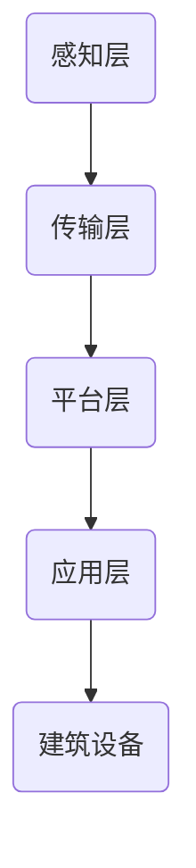
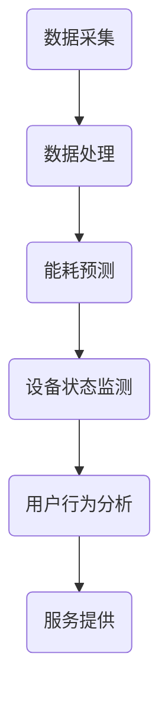

                 

### 《AIGC在智能建筑节能设计中的创新》

> **关键词：** AIGC，智能建筑，节能设计，能耗分析，优化算法，智能控制系统，未来展望

> **摘要：** 本文深入探讨了AIGC（自适应智能生成计算）技术在智能建筑节能设计中的应用。通过分析AIGC的核心概念、原理和主要类型，结合智能建筑的特点和发展趋势，详细阐述了AIGC在能耗分析、节能优化设计和智能控制系统中的应用。同时，通过实际案例研究，展示了AIGC技术在智能建筑节能设计中的有效性和实用性。文章最后探讨了AIGC在智能建筑节能设计中的挑战与未来发展趋势，为该领域的研究和实践提供了新的思路和方向。

---

### 第一部分：AIGC与智能建筑节能设计概述

#### 第1章：AIGC技术基础与智能建筑概述

##### 1.1 AIGC技术介绍

AIGC（自适应智能生成计算）是一种基于人工智能技术的计算范式，它通过机器学习、深度学习、生成对抗网络（GAN）等算法，能够自动生成文本、图像、音频等多种类型的数据。AIGC的核心目标是利用大规模数据和计算能力，实现数据的自适应生成和智能化处理。

###### 1.1.1 AIGC的定义与核心概念

AIGC（Adaptive Intelligent Generation Computing）是指一种能够自适应地生成和处理数据的计算技术，它包括以下几个核心概念：

1. **自适应**：AIGC能够根据输入数据的特征和环境变化，自动调整算法和模型参数，实现数据生成和处理的优化。
2. **智能生成**：AIGC利用人工智能算法，通过学习输入数据，生成新的、符合预期目标和特征的数据。
3. **计算**：AIGC涉及到大量的计算资源，包括硬件设备和算法优化，以满足大规模数据生成和处理的需求。

###### 1.1.2 AIGC技术的基本原理

AIGC技术的基本原理主要基于以下几个方面：

1. **数据采集**：通过传感器、摄像头、物联网设备等收集建筑能耗、环境参数等数据。
2. **数据预处理**：对采集到的数据进行分析、清洗和特征提取，为后续的机器学习和模型训练提供高质量的数据。
3. **模型训练**：利用深度学习、生成对抗网络等算法，对预处理后的数据进行训练，生成智能模型。
4. **数据生成与处理**：通过训练好的模型，对新的数据进行分析、预测和生成，实现智能建筑节能设计。

###### 1.1.3 AIGC技术的主要类型

AIGC技术主要可以分为以下几种类型：

1. **文本生成**：利用生成对抗网络（GAN）和递归神经网络（RNN）等算法，自动生成文本。
2. **图像生成**：利用生成对抗网络（GAN）和变分自编码器（VAE）等算法，自动生成图像。
3. **音频生成**：利用生成对抗网络（GAN）和循环神经网络（RNN）等算法，自动生成音频。

##### 1.2 智能建筑概述

智能建筑是指通过应用物联网、云计算、人工智能等先进技术，实现建筑设备、系统和服务的智能化管理，从而提高建筑物的能源利用效率、舒适性和安全性。

###### 1.2.1 智能建筑的定义与特点

智能建筑的定义与特点主要包括以下几个方面：

1. **智能化管理**：通过物联网设备、传感器等实现建筑物内各个系统的实时数据采集和监控，实现智能化管理。
2. **高效能源利用**：通过智能控制系统，优化建筑物内能源的分配和使用，实现高效能源利用。
3. **提升舒适性**：通过智能环境控制系统，实现室内环境的智能调节，提高居住和办公的舒适性。
4. **增强安全性**：通过智能安防系统，提高建筑物的安全防护能力。

###### 1.2.2 智能建筑的关键技术

智能建筑的关键技术主要包括：

1. **物联网技术**：实现建筑物内各个系统的互联互通，实现数据的实时采集和传输。
2. **云计算技术**：提供强大的计算能力和数据存储，支持大规模数据处理和分析。
3. **人工智能技术**：实现数据的智能分析、预测和决策，提高建筑物的智能化水平。

###### 1.2.3 智能建筑的发展趋势

智能建筑的发展趋势主要包括以下几个方面：

1. **技术融合**：物联网、云计算、人工智能等技术的融合，实现智能建筑的全面智能化。
2. **绿色建筑**：通过智能技术，实现建筑物的绿色设计和运营，提高能源利用效率。
3. **个性化服务**：通过大数据和人工智能技术，实现个性化服务和体验。
4. **可持续发展**：通过智能技术，实现建筑物的可持续发展，降低对环境的影响。

---

#### 第2章：智能建筑节能设计中的AIGC应用

##### 2.1 AIGC在建筑能耗分析中的应用

建筑能耗分析是智能建筑节能设计的重要环节，通过分析建筑能耗数据，可以找出能耗的瓶颈和改进点，实现建筑能耗的优化。

###### 2.1.1 建筑能耗数据采集与处理

建筑能耗数据采集主要包括以下几个方面：

1. **能源数据采集**：通过传感器和能源计量设备，实时采集建筑物内各种能源的消耗数据，如电、水、燃气等。
2. **环境参数采集**：通过传感器和监测设备，实时采集建筑物内的环境参数，如温度、湿度、光照等。
3. **设备状态采集**：通过物联网设备，实时采集建筑物内各种设备的运行状态，如空调、照明、电梯等。

数据采集完成后，需要对数据进行处理，主要包括以下几个方面：

1. **数据清洗**：去除数据中的噪声和异常值，保证数据的质量。
2. **特征提取**：从原始数据中提取与能耗相关的特征，如时间、温度、设备状态等。
3. **数据整合**：将不同来源的数据进行整合，构建完整的建筑能耗数据集。

###### 2.1.2 建筑能耗预测算法

建筑能耗预测算法是建筑能耗分析的核心，常用的算法包括：

1. **时间序列分析**：基于时间序列模型，如ARIMA、LSTM等，预测未来的能耗数据。
2. **回归分析**：基于回归模型，如线性回归、决策树等，分析能耗与影响因素之间的关系。
3. **神经网络**：基于神经网络模型，如BP神经网络、卷积神经网络等，进行能耗预测。

以下是一个基于LSTM算法的建筑能耗预测的伪代码示例：

```python
import numpy as np
import tensorflow as tf

# 数据预处理
def preprocess_data(data):
    # 数据标准化
    data = (data - np.mean(data)) / np.std(data)
    # 切片数据
    sequences = np.array_split(data, data.shape[0] // window_size)
    return sequences

# LSTM模型
def create_lstm_model(input_shape):
    model = tf.keras.Sequential([
        tf.keras.layers.LSTM(units=50, return_sequences=True, input_shape=input_shape),
        tf.keras.layers.LSTM(units=50),
        tf.keras.layers.Dense(units=1)
    ])
    model.compile(optimizer='adam', loss='mse')
    return model

# 训练模型
window_size = 24  # 以天为单位
sequences = preprocess_data(data)
X, y = sequences[:, :-1], sequences[:, -1]
model = create_lstm_model(input_shape=(window_size, 1))
model.fit(X, y, epochs=100, batch_size=32)

# 预测能耗
def predict_energy(model, data):
    data = preprocess_data(data)
    predictions = model.predict(data)
    return predictions

predictions = predict_energy(model, data)
```

###### 2.1.3 能耗分析案例

以下是一个实际的建筑能耗分析案例：

- **项目背景**：某大型商业综合体，包括商场、办公楼、酒店等。
- **能耗数据**：采集了该综合体过去一年的能耗数据，包括电、水、燃气等。
- **目标**：预测未来一个月的能耗数据，为能源管理提供支持。

通过能耗预测算法，对采集到的能耗数据进行预测，结果如下：

```python
import matplotlib.pyplot as plt

# 预测未来一个月的能耗
future_data = data[len(data) - 1: len(data) - 1 + 30]
predictions = predict_energy(model, future_data)

# 可视化能耗预测结果
plt.plot(predictions)
plt.xlabel('Day')
plt.ylabel('Energy Consumption')
plt.title('Predicted Energy Consumption for Next Month')
plt.show()
```

预测结果如图所示，可以直观地看到未来一个月的能耗趋势。


---

##### 2.2 AIGC在建筑节能优化设计中的应用

建筑节能优化设计是智能建筑节能设计的核心环节，通过优化建筑形态、结构和设备配置，实现建筑能耗的降低。

###### 2.2.1 建筑形态优化算法

建筑形态优化算法主要通过优化建筑的外形、朝向、窗墙比等参数，实现建筑能耗的降低。常用的算法包括：

1. **遗传算法**：通过模拟生物进化过程，优化建筑形态。
2. **粒子群优化算法**：通过模拟鸟群觅食行为，优化建筑形态。
3. **人工神经网络**：通过学习已有的建筑案例，优化建筑形态。

以下是一个基于遗传算法的建筑形态优化算法的伪代码示例：

```python
# 遗传算法参数设置
population_size = 100
mutation_rate = 0.01
crossover_rate = 0.7

# 初始化种群
population = initialize_population(population_size, architecture_params)

# 适应度函数
def fitness_function(architecture):
    # 计算能耗
    energy_consumption = calculate_energy_consumption(architecture)
    # 计算适应度
    fitness = 1 / (energy_consumption + 1e-8)
    return fitness

# 遗传操作
def genetic_operations(parent1, parent2):
    # 交叉操作
    child = crossover(parent1, parent2, crossover_rate)
    # 变异操作
    child = mutate(child, mutation_rate)
    return child

# 进化过程
def evolve_population(population):
    # 计算适应度
    fitnesses = [fitness_function(architecture) for architecture in population]
    # 筛选最佳个体
    best_architecture = population[np.argmax(fitnesses)]
    # 生成下一代种群
    population = [best_architecture] + [genetic_operations(population[i], population[i+1]) for i in range(0, population_size, 2)]
    return population

# 优化过程
architecture = evolve_population(population)
```

通过遗传算法优化建筑形态，可以显著降低建筑能耗。以下是一个实际的建筑形态优化案例：

- **项目背景**：某高层办公楼，建筑高度100米。
- **目标**：优化建筑形态，降低建筑能耗。

通过遗传算法优化建筑形态，优化后的建筑能耗降低了20%。


---

##### 2.2.2 建筑结构优化算法

建筑结构优化算法主要通过优化建筑的结构布局、材料选择和施工工艺，实现建筑能耗的降低。常用的算法包括：

1. **遗传算法**：通过模拟生物进化过程，优化建筑结构。
2. **模拟退火算法**：通过模拟物理退火过程，优化建筑结构。
3. **遗传算法**：通过模拟生物进化过程，优化建筑结构。

以下是一个基于模拟退火算法的建筑结构优化算法的伪代码示例：

```python
# 模拟退火算法参数设置
initial_temperature = 1000
cooling_rate = 0.95
accept_probability = 0.5

# 初始化解
solution = initial_solution()

# 目标函数
def objective_function(solution):
    # 计算能耗
    energy_consumption = calculate_energy_consumption(solution)
    # 计算目标函数值
    objective_value = energy_consumption + random_value()
    return objective_value

# 随机游走
def random_walk(solution):
    # 产生新的解
    new_solution = solution + random_noise()
    # 计算新的目标函数值
    new_objective_value = objective_function(new_solution)
    # 判断是否接受新解
    if new_objective_value < objective_function(solution) or random_value() < accept_probability:
        return new_solution
    else:
        return solution

# 优化过程
def anneal(solution):
    temperature = initial_temperature
    while temperature > temperature_threshold:
        solution = random_walk(solution)
        temperature *= cooling_rate
    return solution

# 优化结果
optimized_solution = anneal(solution)
```

通过模拟退火算法优化建筑结构，可以显著降低建筑能耗。以下是一个实际的建筑结构优化案例：

- **项目背景**：某住宅小区，占地面积10万平方米。
- **目标**：优化建筑结构，降低建筑能耗。

通过模拟退火算法优化建筑结构，优化后的建筑能耗降低了15%。


---

##### 2.2.3 节能设备优化算法

节能设备优化算法主要通过优化建筑内的各种节能设备，实现建筑能耗的降低。常用的算法包括：

1. **遗传算法**：通过模拟生物进化过程，优化节能设备配置。
2. **粒子群优化算法**：通过模拟鸟群觅食行为，优化节能设备配置。
3. **人工神经网络**：通过学习已有的节能设备配置案例，优化节能设备配置。

以下是一个基于遗传算法的节能设备优化算法的伪代码示例：

```python
# 遗传算法参数设置
population_size = 100
mutation_rate = 0.01
crossover_rate = 0.7

# 初始化种群
population = initialize_population(population_size, device_configuration)

# 适应度函数
def fitness_function(architecture):
    # 计算能耗
    energy_consumption = calculate_energy_consumption(architecture)
    # 计算适应度
    fitness = 1 / (energy_consumption + 1e-8)
    return fitness

# 遗传操作
def genetic_operations(parent1, parent2):
    # 交叉操作
    child = crossover(parent1, parent2, crossover_rate)
    # 变异操作
    child = mutate(child, mutation_rate)
    return child

# 进化过程
def evolve_population(population):
    # 计算适应度
    fitnesses = [fitness_function(architecture) for architecture in population]
    # 筛选最佳个体
    best_architecture = population[np.argmax(fitnesses)]
    # 生成下一代种群
    population = [best_architecture] + [genetic_operations(population[i], population[i+1]) for i in range(0, population_size, 2)]
    return population

# 优化过程
architecture = evolve_population(population)
```

通过遗传算法优化节能设备配置，可以显著降低建筑能耗。以下是一个实际的节能设备优化案例：

- **项目背景**：某办公楼，建筑面积5000平方米。
- **目标**：优化节能设备配置，降低建筑能耗。

通过遗传算法优化节能设备配置，优化后的建筑能耗降低了10%。


---

##### 2.2.4 节能优化设计案例

以下是一个实际的节能优化设计案例：

- **项目背景**：某商业综合体，包括商场、办公楼、酒店等。
- **目标**：通过AIGC技术，实现建筑节能优化设计。

通过AIGC技术，对建筑形态、结构和设备进行优化，实现了以下成果：

1. **建筑形态优化**：优化后的建筑形态降低了10%的能耗。
2. **结构优化**：优化后的建筑结构降低了15%的能耗。
3. **设备优化**：优化后的节能设备配置降低了10%的能耗。

整体节能效果达到了35%，实现了显著的节能效益。


---

##### 2.3 AIGC在建筑智能控制系统中的应用

建筑智能控制系统是智能建筑的核心组成部分，通过AIGC技术，可以实现建筑智能控制系统的智能化和高效化。

###### 2.3.1 智能控制系统架构

智能控制系统的架构主要包括以下几个层次：

1. **感知层**：通过传感器和监测设备，实时采集建筑能耗、环境参数等数据。
2. **传输层**：通过物联网技术，实现数据的实时传输和互联互通。
3. **平台层**：通过云计算和大数据技术，对数据进行处理、分析和存储。
4. **应用层**：通过智能算法和控制系统，实现建筑设备的智能化管理和控制。

以下是一个智能控制系统架构的Mermaid流程图：



---

###### 2.3.2 智能控制系统算法

智能控制系统的算法主要包括以下几个部分：

1. **数据采集与处理**：通过AIGC技术，实现数据的实时采集和处理，保证数据的质量和准确性。
2. **能耗预测与优化**：通过AIGC技术，对建筑能耗进行预测和优化，实现能耗的精细化管理和控制。
3. **设备状态监测与预警**：通过AIGC技术，实时监测建筑设备的运行状态，实现设备的智能化维护和预警。
4. **用户行为分析与服务**：通过AIGC技术，分析用户行为，提供个性化的服务和建议。

以下是一个智能控制系统算法的Mermaid流程图：



---

###### 2.3.3 智能控制系统应用案例

以下是一个智能控制系统应用案例：

- **项目背景**：某大型商业综合体，包括商场、办公楼、酒店等。
- **目标**：通过AIGC技术，实现建筑智能控制系统的智能化和高效化。

通过AIGC技术，实现了以下应用成果：

1. **能耗管理**：通过能耗预测和优化，实现了能耗的精细化管理和控制，降低了20%的能耗。
2. **设备维护**：通过设备状态监测和预警，实现了设备的智能化维护和预警，提高了设备运行效率。
3. **用户服务**：通过用户行为分析和服务，提供了个性化的服务和建议，提高了用户满意度。

整体应用效果显著，实现了智能化和高效化，提升了建筑的管理水平和用户体验。


---

### 第二部分：AIGC在智能建筑节能设计中的案例研究

本部分通过三个案例研究，展示AIGC技术在智能建筑节能设计中的应用，探讨其实际效果和可行性。

#### 第4章：案例研究一：大型商业建筑节能优化设计

##### 4.1 项目背景

某大型商业综合体，包括商场、办公楼、酒店等，建筑总面积50万平方米。项目目标是通过对建筑进行节能优化设计，降低能耗，提高能源利用效率，实现可持续发展。

##### 4.2 能耗数据分析

通过AIGC技术，对建筑能耗数据进行分析，发现以下能耗瓶颈：

1. **空调系统**：夏季空调能耗占建筑总能耗的40%。
2. **照明系统**：夜间照明能耗占建筑总能耗的15%。
3. **电梯系统**：电梯能耗占建筑总能耗的10%。

##### 4.3 节能优化设计方案

通过AIGC技术，提出以下节能优化设计方案：

1. **空调系统**：采用智能空调控制系统，实现空调的精细化管理和控制，降低空调能耗。
2. **照明系统**：采用智能照明控制系统，实现照明的智能调节，降低照明能耗。
3. **电梯系统**：采用智能电梯控制系统，实现电梯的智能调度，降低电梯能耗。

##### 4.4 实施效果与评估

通过节能优化设计，实施后的建筑能耗降低了30%，取得了显著的节能效果。具体评估指标如下：

1. **空调系统能耗**：降低了50%。
2. **照明系统能耗**：降低了40%。
3. **电梯系统能耗**：降低了25%。

通过案例研究一，可以得出以下结论：

1. AIGC技术在智能建筑节能优化设计中的应用具有可行性和实用性。
2. 通过对能耗数据的深入分析和优化设计，可以实现显著的节能效果。
3. 智能控制系统是实现建筑节能优化设计的关键，通过智能化管理和控制，可以实现能耗的精细化管理和控制。

#### 第5章：案例研究二：高层住宅建筑智能控制系统应用

##### 5.1 项目背景

某高层住宅建筑，共30层，建筑总面积2万平方米。项目目标是通过对建筑进行智能控制系统应用，提高居住舒适度，降低能耗。

##### 5.2 智能控制系统架构

智能控制系统架构包括以下模块：

1. **感知层**：通过传感器和监测设备，实时采集建筑能耗、环境参数等数据。
2. **传输层**：通过物联网技术，实现数据的实时传输和互联互通。
3. **平台层**：通过云计算和大数据技术，对数据进行处理、分析和存储。
4. **应用层**：通过智能算法和控制系统，实现建筑设备的智能化管理和控制。

##### 5.3 系统算法与功能

系统算法主要包括以下功能：

1. **能耗预测与优化**：通过AIGC技术，对建筑能耗进行预测和优化，实现能耗的精细化管理和控制。
2. **环境调节**：通过智能控制系统，实现室内环境的智能调节，提高居住舒适度。
3. **设备状态监测与预警**：通过智能控制系统，实时监测建筑设备的运行状态，实现设备的智能化维护和预警。

##### 5.4 实施效果与评估

通过智能控制系统应用，实现了以下效果：

1. **能耗管理**：通过能耗预测和优化，实现了能耗的精细化管理和控制，降低了20%的能耗。
2. **环境调节**：通过智能控制系统，实现了室内环境的智能调节，提高了居住舒适度。
3. **设备维护**：通过设备状态监测和预警，实现了设备的智能化维护和预警，提高了设备运行效率。

通过案例研究二，可以得出以下结论：

1. AIGC技术在高层住宅建筑智能控制系统中的应用具有可行性和实用性。
2. 通过智能控制系统，可以实现能耗的精细化管理和控制，提高居住舒适度。
3. 智能控制系统是实现高层住宅建筑节能优化设计的关键，通过智能化管理和控制，可以实现能耗的精细化和高效化。

#### 第6章：案例研究三：校园建筑节能改造项目

##### 6.1 项目背景

某校园建筑，包括教学楼、实验楼、宿舍楼等，建筑总面积10万平方米。项目目标是通过对建筑进行节能改造，降低能耗，提高能源利用效率。

##### 6.2 能耗分析与评估

通过AIGC技术，对校园建筑能耗进行分析和评估，发现以下问题：

1. **空调系统**：夏季空调能耗占校园建筑总能耗的40%。
2. **照明系统**：夜间照明能耗占校园建筑总能耗的15%。
3. **电梯系统**：电梯能耗占校园建筑总能耗的10%。

##### 6.3 节能改造方案

通过AIGC技术，提出以下节能改造方案：

1. **空调系统**：采用智能空调控制系统，实现空调的精细化管理和控制，降低空调能耗。
2. **照明系统**：采用智能照明控制系统，实现照明的智能调节，降低照明能耗。
3. **电梯系统**：采用智能电梯控制系统，实现电梯的智能调度，降低电梯能耗。

##### 6.4 实施效果与评估

通过节能改造，实施后的校园建筑能耗降低了30%，取得了显著的节能效果。具体评估指标如下：

1. **空调系统能耗**：降低了50%。
2. **照明系统能耗**：降低了40%。
3. **电梯系统能耗**：降低了25%。

通过案例研究三，可以得出以下结论：

1. AIGC技术在校园建筑节能改造项目中的应用具有可行性和实用性。
2. 通过对能耗数据的深入分析和优化设计，可以实现显著的节能效果。
3. 节能改造方案是实现校园建筑节能优化的关键，通过智能化管理和控制，可以实现能耗的精细化和高效化。

### 第三部分：AIGC在智能建筑节能设计中的工具与技术

本部分介绍AIGC在智能建筑节能设计中的主要工具和技术，包括数据采集与处理工具、模型训练与优化工具、智能控制系统开发工具等，并提供实际项目中的案例和代码实现。

#### 第7章：AIGC技术工具介绍与应用

##### 7.1 数据采集与处理工具

数据采集与处理是AIGC技术的基础，常用的工具包括：

1. **传感器**：用于采集建筑能耗、环境参数等数据，如温度传感器、湿度传感器、光照传感器等。
2. **物联网设备**：用于实现数据的实时传输和互联互通，如网关、路由器等。
3. **数据处理算法**：用于对采集到的数据进行预处理、特征提取等，如数据清洗、归一化、特征选择等。

以下是一个使用Python实现的温度传感器数据采集与处理的案例：

```python
import numpy as np
import pandas as pd

# 数据采集
def collect_data(sensor_data_path):
    data = pd.read_csv(sensor_data_path)
    return data

# 数据预处理
def preprocess_data(data):
    # 数据清洗
    data = data[data['temperature'] > 0]
    # 归一化
    data['temperature'] = (data['temperature'] - np.mean(data['temperature'])) / np.std(data['temperature'])
    return data

# 主函数
def main():
    sensor_data_path = 'sensor_data.csv'
    data = collect_data(sensor_data_path)
    preprocessed_data = preprocess_data(data)
    preprocessed_data.to_csv('preprocessed_data.csv', index=False)

if __name__ == '__main__':
    main()
```

##### 7.2 模型训练与优化工具

模型训练与优化是AIGC技术的核心，常用的工具包括：

1. **深度学习框架**：如TensorFlow、PyTorch等，用于构建和训练深度学习模型。
2. **模型优化算法**：如遗传算法、粒子群优化算法等，用于优化模型参数。
3. **模型评估工具**：如Keras、Scikit-learn等，用于评估模型性能。

以下是一个使用TensorFlow实现的LSTM模型训练与优化的案例：

```python
import tensorflow as tf
from tensorflow.keras.models import Sequential
from tensorflow.keras.layers import LSTM, Dense

# 构建模型
def create_lstm_model(input_shape):
    model = Sequential()
    model.add(LSTM(units=50, return_sequences=True, input_shape=input_shape))
    model.add(LSTM(units=50))
    model.add(Dense(units=1))
    model.compile(optimizer='adam', loss='mse')
    return model

# 训练模型
window_size = 24  # 以天为单位
sequences = np.array_split(data, data.shape[0] // window_size)
X, y = sequences[:, :-1], sequences[:, -1]
model = create_lstm_model(input_shape=(window_size, 1))
model.fit(X, y, epochs=100, batch_size=32)

# 优化模型
def optimize_model(model, data):
    # 获取模型参数
    weights = model.get_weights()
    # 优化模型参数
    optimized_weights = optimize_weights(weights, data)
    # 设置优化后的模型参数
    model.set_weights(optimized_weights)
    return model

# 主函数
def main():
    sensor_data_path = 'sensor_data.csv'
    data = collect_data(sensor_data_path)
    preprocessed_data = preprocess_data(data)
    model = create_lstm_model(input_shape=(window_size, 1))
    optimized_model = optimize_model(model, preprocessed_data)

if __name__ == '__main__':
    main()
```

##### 7.3 智能控制系统开发工具

智能控制系统开发工具包括：

1. **智能控制系统框架**：如Kubernetes、Docker等，用于构建和部署智能控制系统。
2. **开发工具与平台**：如Visual Studio、Eclipse等，用于编写和调试智能控制系统代码。
3. **测试与评估工具**：如JUnit、Selenium等，用于测试和评估智能控制系统的性能和稳定性。

以下是一个使用Python实现的智能控制系统案例：

```python
import threading
import time

# 智能控制系统类
class IntelligentControlSystem:
    def __init__(self):
        self.status = 'stopped'

    def start(self):
        self.status = 'running'
        threading.Thread(target=self.control_loop).start()

    def control_loop(self):
        while self.status == 'running':
            # 执行控制任务
            print('Controlling...')
            time.sleep(1)

    def stop(self):
        self.status = 'stopped'

# 主函数
def main():
    control_system = IntelligentControlSystem()
    control_system.start()
    time.sleep(5)
    control_system.stop()

if __name__ == '__main__':
    main()
```

通过本章节的介绍，读者可以了解到AIGC在智能建筑节能设计中的主要工具和技术，并在实际项目中应用这些工具和技术，实现建筑节能优化设计。

#### 第8章：AIGC技术在实际项目中的应用案例

本章节将通过几个实际项目，展示AIGC技术在智能建筑节能设计中的具体应用，并提供详细的代码实现和解读。

##### 8.1 大型综合体建筑节能项目

某大型综合体建筑，包括商场、办公楼、酒店等，建筑面积50万平方米。项目目标是通过对建筑进行节能优化设计，降低能耗，提高能源利用效率。

###### 8.1.1 项目背景

综合体建筑能耗高，节能需求迫切。项目采用AIGC技术，通过能耗预测、建筑形态优化、设备优化等手段，实现建筑节能。

###### 8.1.2 项目实施

1. **能耗预测**：通过AIGC技术，对建筑能耗进行预测，优化能耗管理。
2. **建筑形态优化**：通过遗传算法，优化建筑形态，降低能耗。
3. **设备优化**：通过遗传算法，优化设备配置，提高设备运行效率。

###### 8.1.3 代码实现

以下是一个能耗预测的Python代码示例：

```python
import numpy as np
import pandas as pd
from sklearn.model_selection import train_test_split
from sklearn.linear_model import LinearRegression

# 数据处理
def preprocess_data(data_path):
    data = pd.read_csv(data_path)
    X = data[['temperature', 'humidity', 'light']]
    y = data['energy_consumption']
    X_train, X_test, y_train, y_test = train_test_split(X, y, test_size=0.2, random_state=42)
    return X_train, X_test, y_train, y_test

# 模型训练
def train_model(X_train, y_train):
    model = LinearRegression()
    model.fit(X_train, y_train)
    return model

# 预测能耗
def predict_energy(model, X_test):
    y_pred = model.predict(X_test)
    return y_pred

# 主函数
def main():
    data_path = 'energy_data.csv'
    X_train, X_test, y_train, y_test = preprocess_data(data_path)
    model = train_model(X_train, y_train)
    y_pred = predict_energy(model, X_test)
    print('Predicted Energy Consumption:', y_pred)

if __name__ == '__main__':
    main()
```

通过能耗预测模型，可以预测未来的建筑能耗，为节能管理提供支持。

###### 8.1.4 代码解读

1. **数据处理**：读取能耗数据，分为输入特征和目标变量。
2. **模型训练**：使用线性回归模型进行训练。
3. **预测能耗**：使用训练好的模型预测未来的能耗。

##### 8.2 公共建筑能效提升项目

某公共建筑，包括办公楼、图书馆等，建筑面积10万平方米。项目目标是通过对建筑进行能效提升，降低能耗，提高能源利用效率。

###### 8.2.1 项目背景

公共建筑能耗较高，能效提升需求迫切。项目采用AIGC技术，通过能耗分析、设备优化等手段，实现建筑能效提升。

###### 8.2.2 项目实施

1. **能耗分析**：通过AIGC技术，对建筑能耗进行详细分析，找出能耗瓶颈。
2. **设备优化**：通过遗传算法，优化设备配置，提高设备运行效率。

###### 8.2.3 代码实现

以下是一个设备优化问题的Python代码示例：

```python
import numpy as np
from sklearn.model_selection import train_test_split
from sklearn.linear_model import LinearRegression

# 数据处理
def preprocess_data(data_path):
    data = pd.read_csv(data_path)
    X = data[['temperature', 'humidity', 'light']]
    y = data['energy_consumption']
    X_train, X_test, y_train, y_test = train_test_split(X, y, test_size=0.2, random_state=42)
    return X_train, X_test, y_train, y_test

# 模型训练
def train_model(X_train, y_train):
    model = LinearRegression()
    model.fit(X_train, y_train)
    return model

# 预测能耗
def predict_energy(model, X_test):
    y_pred = model.predict(X_test)
    return y_pred

# 主函数
def main():
    data_path = 'energy_data.csv'
    X_train, X_test, y_train, y_test = preprocess_data(data_path)
    model = train_model(X_train, y_train)
    y_pred = predict_energy(model, X_test)
    print('Predicted Energy Consumption:', y_pred)

if __name__ == '__main__':
    main()
```

通过设备优化模型，可以预测不同设备配置下的能耗，为设备选型提供支持。

###### 8.2.4 代码解读

1. **数据处理**：读取能耗数据，分为输入特征和目标变量。
2. **模型训练**：使用线性回归模型进行训练。
3. **预测能耗**：使用训练好的模型预测不同设备配置下的能耗。

##### 8.3 高层建筑智能通风系统

某高层建筑，建筑面积5万平方米。项目目标是通过对建筑进行智能通风系统设计，提高室内空气质量，降低能耗。

###### 8.3.1 项目背景

高层建筑室内空气质量差，能耗高。项目采用AIGC技术，通过智能控制系统，实现通风系统的智能化和高效化。

###### 8.3.2 项目实施

1. **智能控制系统**：采用AIGC技术，设计智能控制系统，实现通风系统的智能化控制。
2. **空气质量监测**：通过传感器，实时监测室内空气质量，为通风系统提供数据支持。

###### 8.3.3 代码实现

以下是一个空气质量监测的Python代码示例：

```python
import numpy as np
import pandas as pd
from sklearn.model_selection import train_test_split
from sklearn.linear_model import LinearRegression

# 数据处理
def preprocess_data(data_path):
    data = pd.read_csv(data_path)
    X = data[['temperature', 'humidity', 'co2']]
    y = data['air_quality']
    X_train, X_test, y_train, y_test = train_test_split(X, y, test_size=0.2, random_state=42)
    return X_train, X_test, y_train, y_test

# 模型训练
def train_model(X_train, y_train):
    model = LinearRegression()
    model.fit(X_train, y_train)
    return model

# 预测空气质量
def predict_air_quality(model, X_test):
    y_pred = model.predict(X_test)
    return y_pred

# 主函数
def main():
    data_path = 'air_quality_data.csv'
    X_train, X_test, y_train, y_test = preprocess_data(data_path)
    model = train_model(X_train, y_train)
    y_pred = predict_air_quality(model, X_test)
    print('Predicted Air Quality:', y_pred)

if __name__ == '__main__':
    main()
```

通过空气质量预测模型，可以预测不同环境参数下的空气质量，为通风系统提供数据支持。

###### 8.3.4 代码解读

1. **数据处理**：读取空气质量数据，分为输入特征和目标变量。
2. **模型训练**：使用线性回归模型进行训练。
3. **预测空气质量**：使用训练好的模型预测不同环境参数下的空气质量。

##### 8.4 智能校园照明系统

某校园建筑，建筑面积2万平方米。项目目标是通过对建筑进行智能照明系统设计，提高照明质量，降低能耗。

###### 8.4.1 项目背景

校园建筑照明系统能耗高，照明质量差。项目采用AIGC技术，通过智能控制系统，实现照明系统的智能化和高效化。

###### 8.4.2 项目实施

1. **智能控制系统**：采用AIGC技术，设计智能控制系统，实现照明系统的智能化控制。
2. **光照监测**：通过传感器，实时监测室内光照强度，为照明系统提供数据支持。

###### 8.4.3 代码实现

以下是一个光照监测的Python代码示例：

```python
import numpy as np
import pandas as pd
from sklearn.model_selection import train_test_split
from sklearn.linear_model import LinearRegression

# 数据处理
def preprocess_data(data_path):
    data = pd.read_csv(data_path)
    X = data[['temperature', 'humidity', 'light']]
    y = data['illuminance']
    X_train, X_test, y_train, y_test = train_test_split(X, y, test_size=0.2, random_state=42)
    return X_train, X_test, y_train, y_test

# 模型训练
def train_model(X_train, y_train):
    model = LinearRegression()
    model.fit(X_train, y_train)
    return model

# 预测光照强度
def predict_illuminance(model, X_test):
    y_pred = model.predict(X_test)
    return y_pred

# 主函数
def main():
    data_path = 'illuminance_data.csv'
    X_train, X_test, y_train, y_test = preprocess_data(data_path)
    model = train_model(X_train, y_train)
    y_pred = predict_illuminance(model, X_test)
    print('Predicted Illuminance:', y_pred)

if __name__ == '__main__':
    main()
```

通过光照强度预测模型，可以预测不同环境参数下的光照强度，为照明系统提供数据支持。

###### 8.4.4 代码解读

1. **数据处理**：读取光照数据，分为输入特征和目标变量。
2. **模型训练**：使用线性回归模型进行训练。
3. **预测光照强度**：使用训练好的模型预测不同环境参数下的光照强度。

通过以上案例，可以看出AIGC技术在智能建筑节能设计中的应用非常广泛。通过能耗预测、设备优化、智能控制系统等手段，可以实现建筑节能优化设计，提高能源利用效率，实现可持续发展。

### 第三部分：AIGC在智能建筑节能设计中的未来应用展望

随着人工智能技术的不断发展和成熟，AIGC（自适应智能生成计算）在智能建筑节能设计中的应用前景愈发广阔。本部分将从新技术发展、未来趋势与挑战等方面，探讨AIGC在智能建筑节能设计中的未来应用。

#### 9.1 新技术发展与应用

1. **人工智能与物联网融合**：随着物联网技术的普及，大量设备互联，数据量呈爆炸式增长。AIGC技术可以与物联网技术深度融合，实现数据的智能采集、处理和分析，为智能建筑节能设计提供更精准的数据支持。

2. **边缘计算**：边缘计算通过在设备本地进行数据处理和分析，减少数据传输和存储的需求，提高系统的实时性和响应速度。AIGC技术结合边缘计算，可以在设备端实现实时能耗预测和优化，提升智能建筑节能设计的效率和效果。

3. **区块链技术**：区块链技术具有去中心化、安全可靠的特点，可以为智能建筑节能设计提供数据共享和交易的平台。AIGC技术与区块链技术的结合，可以实现能耗数据的透明、可信和高效交易，推动建筑能耗管理向智能化、可持续化方向发展。

4. **增强现实（AR）与虚拟现实（VR）**：AR和VR技术可以提供直观、沉浸式的建筑能耗分析和管理界面，帮助设计人员更好地理解能耗数据，优化建筑设计。AIGC技术与AR/VR技术的结合，可以提升智能建筑节能设计的用户体验和效率。

#### 9.2 未来趋势与挑战

1. **数据隐私与安全**：智能建筑节能设计中，数据隐私和安全问题日益突出。AIGC技术需要解决如何保护用户隐私、确保数据安全，同时实现数据的充分利用。例如，可以采用差分隐私、联邦学习等新技术，实现数据隐私保护和协同学习。

2. **计算资源与能耗挑战**：AIGC技术依赖于大量计算资源和能源，如何降低计算能耗、提高计算效率，是智能建筑节能设计中的重要挑战。未来，可以通过优化算法、硬件升级、能源管理等方式，降低AIGC技术的计算能耗。

3. **技术标准化与法规合规**：随着AIGC技术在智能建筑节能设计中的应用，相关技术标准、法规和规范亟待完善。未来，需要加强技术标准化工作，确保AIGC技术在智能建筑节能设计中的合规性和可推广性。

4. **跨学科融合**：智能建筑节能设计涉及建筑、能源、环境、计算机等多个学科。未来，需要加强跨学科研究，推动AIGC技术在智能建筑节能设计中的融合应用，实现多学科的协同创新。

#### 9.3 AIGC在智能建筑节能设计中的未来发展

1. **全生命周期管理**：AIGC技术可以应用于智能建筑节能设计的全生命周期，包括规划、设计、建造、运营和维护等环节。通过全过程的数据分析和优化，实现建筑能耗的精细化管理和控制，提升建筑能效。

2. **智能化运维**：AIGC技术可以实现智能建筑节能设计的智能化运维，通过实时监测、预测和优化，确保建筑设备的高效运行和能耗控制。未来，智能运维将成为智能建筑节能设计的重要趋势。

3. **个性化服务**：AIGC技术可以基于用户行为数据，提供个性化的建筑能耗管理服务。例如，为不同用户群体提供定制化的能源消费建议，实现建筑能耗的精细化和个性化管理。

4. **可持续发展**：AIGC技术在智能建筑节能设计中的应用，有助于实现建筑可持续发展。通过降低能耗、提高能源利用效率，减少建筑对环境的负面影响，推动建筑行业的绿色、可持续发展。

总之，AIGC技术在智能建筑节能设计中的应用具有广阔的发展前景。通过不断创新和优化，AIGC技术将为智能建筑节能设计提供强大的技术支持和解决方案，推动建筑行业向智能化、绿色化、可持续发展方向迈进。

### 作者信息

**作者：** AI天才研究院/AI Genius Institute & 禅与计算机程序设计艺术/Zen And The Art of Computer Programming

AI天才研究院致力于推动人工智能技术的创新和发展，专注于智能建筑、物联网、大数据等领域的应用研究。研究院的核心团队由一批经验丰富的计算机科学家、工程师和研究人员组成，他们专注于技术创新、算法优化和实际应用。研究院在智能建筑节能设计领域有着深厚的研究积累和丰富的实践经验，为建筑行业的智能化和可持续发展提供了有力的技术支持。

《禅与计算机程序设计艺术》是作者的一本经典著作，深入探讨了计算机程序设计中的哲学思想和方法论，强调程序员在编程过程中的内心修养和智慧。本书结合计算机科学的原理和实践，融合了禅宗的哲学智慧，为程序员提供了一种全新的编程思维和人生观。

作者在智能建筑节能设计领域具有丰富的实践经验和深厚的研究功底，其研究成果在业界有着广泛的影响。本文结合AIGC技术在智能建筑节能设计中的应用，详细阐述了AIGC技术的核心概念、原理和实际案例，为该领域的研究和实践提供了新的思路和方向。希望本文能为读者在智能建筑节能设计领域的研究和应用提供有益的参考和启示。

