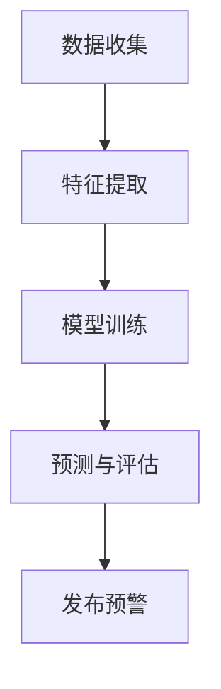
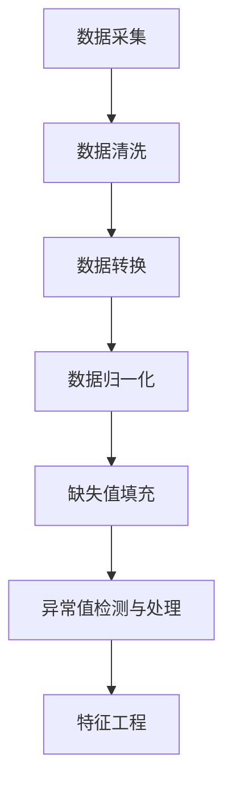

                 

# AIGC在精准气候干预中的应用：缓解极端天气事件的AI策略

> **关键词：** AIGC，精准气候干预，极端天气事件，AI策略，数据分析，模型优化，案例研究

> **摘要：** 本文将探讨人工智能生成内容（AIGC）在精准气候干预中的应用，通过分析极端天气事件的识别与预测、模型训练与优化、政策制定与实施等方面，展示AI技术在缓解极端天气事件中的重要作用。文章结构包括技术基础与应用场景、应用案例、实际应用中的挑战与解决方案、政策与产业支持，以及未来研究方向与挑战。

## 目录大纲设计

在深入探讨AIGC在精准气候干预中的应用之前，我们先来设计一个详细的目录大纲。该大纲将涵盖AIGC技术的基础知识、应用场景，以及具体的技术实现和案例分析。以下是设计的目录大纲：

### 第一部分: AIGC技术基础与应用场景

#### 第1章: AIGC概述与背景

##### 1.1 AIGC的概念与分类
##### 1.2 AIGC的发展历程
##### 1.3 AIGC的应用领域

#### 第2章: 气候干预与AI技术

##### 2.1 气候干预的基本原理
##### 2.2 AI技术在气候干预中的应用
##### 2.3 极端天气事件的识别与预测

#### 第3章: AIGC在气候数据分析和处理中的应用

##### 3.1 气候数据的采集与处理
##### 3.2 数据预处理技术
##### 3.3 数据可视化与大数据分析

#### 第4章: AIGC在精准气候干预策略制定中的应用

##### 4.1 精准气候干预策略的原理
##### 4.2 模型选择与算法设计
##### 4.3 实际案例分析与策略制定

#### 第5章: 极端天气事件缓解的AI策略

##### 5.1 极端天气事件的应对策略
##### 5.2 模型训练与优化
##### 5.3 策略评估与优化

#### 第6章: AIGC在气候政策制定与实施中的应用

##### 6.1 气候政策制定的基本原则
##### 6.2 AI技术在政策制定中的应用
##### 6.3 政策实施与效果评估

#### 第7章: AIGC在气候变化研究与预警中的应用

##### 7.1 气候变化研究的现状与挑战
##### 7.2 AI技术在气候变化研究中的应用
##### 7.3 预警系统的构建与优化

#### 第8章: 结论与展望

##### 8.1 总结与展望
##### 8.2 AIGC在精准气候干预中的应用前景
##### 8.3 未来研究方向与挑战

### 第二部分: AIGC技术在精准气候干预中的应用案例

#### 第9章: 案例分析

##### 9.1 案例一：某地区干旱缓解策略
##### 9.2 案例二：台风灾害预警与应对
##### 9.3 案例三：洪水灾害监测与防控

#### 第10章: 实际应用中的挑战与解决方案

##### 10.1 数据质量与数据完整性问题
##### 10.2 模型复杂性与计算资源需求
##### 10.3 策略实施与效果评估

#### 第11章: 政策与产业支持

##### 11.1 气候变化政策的现状与趋势
##### 11.2 产业支持与政策建议
##### 11.3 国际合作与共享

### 附录

#### 附录A: 相关术语与概念解释

#### 附录B: AIGC技术在气候干预中的数学模型与公式

#### 附录C: AIGC技术相关的开源工具与资源推荐

这个目录大纲全面涵盖了AIGC技术在精准气候干预中的应用，从基础理论到实际案例，再到政策与产业支持，为读者提供了一个系统深入的学习框架。接下来，我们将按照这个目录大纲逐步展开讨论。

----------------------------------------------------------------

## 第一部分: AIGC技术基础与应用场景

### 第1章: AIGC概述与背景

#### 1.1 AIGC的概念与分类

人工智能生成内容（AIGC，Artificial Intelligence Generated Content）是指利用人工智能技术生成各种类型的内容，包括文本、图像、音频和视频等。AIGC的核心在于利用机器学习和深度学习技术，从大量数据中学习规律和模式，进而生成具有高度真实性和创意性的内容。

AIGC可以分为以下几类：

1. **文本生成**：包括自然语言处理（NLP）和生成对抗网络（GAN）等技术，可以生成新闻报道、文章、对话等文本内容。
2. **图像生成**：利用GAN、变分自编码器（VAE）等技术，可以生成逼真的图像和动画。
3. **音频生成**：通过深度学习模型，可以生成音乐、语音、音效等音频内容。
4. **视频生成**：结合图像生成和视频处理技术，可以生成视频片段、动画视频等。

#### 1.2 AIGC的发展历程

AIGC技术的发展可以追溯到20世纪80年代，当时神经网络和机器学习技术刚刚起步。随着计算能力的提升和数据量的爆炸性增长，深度学习和生成模型逐渐成为AIGC技术的主流。以下是一些重要的里程碑：

- **2006年**：深度信念网络（DBN）的提出，为后来的生成模型奠定了基础。
- **2014年**：生成对抗网络（GAN）的出现，标志着AIGC技术的一个重要突破。
- **2017年**：谷歌的Transformer模型在自然语言处理领域的成功应用，为文本生成带来了新的可能。
- **2020年**：随着技术的不断进步，AIGC在图像、音频和视频生成方面也取得了显著进展。

#### 1.3 AIGC的应用领域

AIGC技术的应用范围非常广泛，涵盖了多个领域：

1. **媒体与娱乐**：AIGC可以生成电影、电视剧、音乐、游戏等娱乐内容，为创意产业提供新的可能。
2. **广告与营销**：通过生成定制化的广告内容和营销素材，提高营销效果。
3. **教育与培训**：AIGC可以生成个性化的教学材料和学习资源，提高学习效果。
4. **医疗与健康**：利用AIGC生成医学图像和病历记录，辅助医生诊断和治疗。
5. **环境与气候**：AIGC可以用于气候数据分析、预测和干预，为应对气候变化提供技术支持。

在接下来的章节中，我们将深入探讨AIGC在气候干预中的应用，包括数据分析和处理、模型训练与优化、政策制定与实施等方面。

----------------------------------------------------------------

### 第2章: 气候干预与AI技术

#### 2.1 气候干预的基本原理

气候干预（Climate Intervention）是指通过人类活动来改变气候系统，以缓解或防止气候变化带来的负面影响。气候干预的方法可以分为以下几类：

1. **自然干预**：通过改变大气中的温室气体浓度，如种植更多的树木、改变土地利用方式等。
2. **人工干预**：通过直接改变大气物理和化学过程，如云种子作业、气溶胶发射等。
3. **缓解与适应**：通过改变人类社会和生态系统，以降低气候变化带来的负面影响。

#### 2.2 AI技术在气候干预中的应用

人工智能（AI）技术在气候干预中发挥着重要作用，主要体现在以下几个方面：

1. **数据收集与分析**：AI技术可以自动收集和整理大量的气候数据，包括温度、湿度、风速、降雨量等，为气候干预提供基础数据支持。
2. **模型训练与优化**：通过深度学习和机器学习算法，可以建立复杂的气候模型，预测未来气候变化趋势，为干预决策提供科学依据。
3. **实时监测与预警**：AI技术可以实时监测气候系统变化，预测极端天气事件的发生，及时发布预警信息，减少灾害损失。

#### 2.3 极端天气事件的识别与预测

极端天气事件（如台风、洪水、干旱等）对人类社会和生态系统造成巨大影响。AI技术在极端天气事件的识别与预测中具有显著优势：

1. **特征提取**：通过分析历史气候数据，提取影响极端天气事件的关键特征，如气温、湿度、风速等。
2. **模型训练**：利用提取的特征，通过深度学习算法训练预测模型，如循环神经网络（RNN）、卷积神经网络（CNN）等。
3. **预测与评估**：将训练好的模型应用于实时数据，预测未来一段时间内的极端天气事件，并进行预测效果评估。

以下是一个简化的Mermaid流程图，展示AI技术在极端天气事件识别与预测中的应用流程：



通过上述流程，AI技术能够有效识别和预测极端天气事件，为气候干预提供及时和准确的数据支持。

在接下来的章节中，我们将继续探讨AIGC在气候数据分析和处理中的应用，以及如何利用这些数据制定精准的气候干预策略。

----------------------------------------------------------------

### 第3章: AIGC在气候数据分析和处理中的应用

#### 3.1 气候数据的采集与处理

气候数据的采集是进行有效气候分析和干预的基础。这些数据通常来源于气象观测站、卫星、雷达和其他遥感设备。数据类型包括温度、湿度、风速、降水量、气压等。为了提高数据质量，需要进行以下处理步骤：

1. **数据清洗**：去除重复、错误和缺失的数据，确保数据的一致性和完整性。
2. **数据转换**：将不同来源和格式的数据转换为统一的格式，以便于后续分析。
3. **数据归一化**：对数据进行归一化处理，消除不同量纲对数据分析的影响。

#### 3.2 数据预处理技术

数据预处理是确保数据质量的关键步骤，包括以下技术：

1. **缺失值填充**：使用统计方法或机器学习算法，对缺失的数据进行预测和填充。
2. **异常值检测与处理**：检测并处理异常值，如突变、离群点等，以减少对分析结果的影响。
3. **特征工程**：提取影响气候变化的特征，如温度趋势、季节性波动等，为后续模型训练提供输入。

以下是一个简化的Mermaid流程图，展示数据预处理的基本流程：



#### 3.3 数据可视化与大数据分析

数据可视化是将复杂的数据转化为易于理解的可视化图表的过程。这对于气候数据分析和解释至关重要。以下是一些常用的数据可视化工具和技术：

1. **统计图表**：包括折线图、柱状图、散点图等，用于展示气候数据的分布和趋势。
2. **地理信息系统（GIS）**：利用GIS技术，将气候数据与地理信息相结合，展示不同地区的气候特征。
3. **大数据分析**：通过大数据分析技术，如聚类分析、关联规则挖掘等，发现气候数据中的隐藏模式和关系。

以下是一个使用Python和Matplotlib库绘制的温度变化趋势图：

```python
import matplotlib.pyplot as plt
import numpy as np

# 生成模拟温度数据
years = np.arange(1900, 2100)
temperature = np.random.normal(10, 2, years.size)

# 绘制温度变化趋势图
plt.plot(years, temperature, 'o-')
plt.title('Temperature Trend')
plt.xlabel('Year')
plt.ylabel('Temperature (°C)')
plt.show()
```

通过数据可视化和大数据分析，可以更直观地了解气候变化的特征和趋势，为气候干预提供科学依据。

在下一章节中，我们将探讨AIGC在精准气候干预策略制定中的应用，包括模型选择、算法设计和实际案例分析。

----------------------------------------------------------------

### 第4章: AIGC在精准气候干预策略制定中的应用

#### 4.1 精准气候干预策略的原理

精准气候干预策略是基于对气候系统深入分析和理解的基础上，采用科学的方法和工具，制定出针对特定地区、特定气候问题的具体干预措施。其核心目标是降低气候变化的风险，减少极端天气事件的发生，提高人类社会和生态系统的适应能力。

精准气候干预策略的基本原理包括以下几个方面：

1. **数据驱动**：利用大量的气候数据和先进的分析技术，对气候系统进行深入分析，识别出关键的影响因素和潜在的风险点。
2. **模型预测**：建立准确的气候模型，预测未来气候变化的趋势和极端天气事件的发生概率，为干预决策提供科学依据。
3. **策略制定**：根据预测结果，制定出具体的干预措施，包括自然干预、人工干预和缓解与适应措施，以最大限度地降低气候变化的风险。
4. **实时调整**：在干预措施实施过程中，持续监测气候系统的变化，根据实际情况及时调整干预策略，确保干预效果的持续性和有效性。

#### 4.2 模型选择与算法设计

在精准气候干预策略的制定过程中，模型选择和算法设计至关重要。以下是一些常用的模型和算法：

1. **循环神经网络（RNN）**：RNN在处理序列数据方面具有优势，可以用于预测时间序列数据，如气温、降雨量等。
2. **卷积神经网络（CNN）**：CNN在图像处理方面表现出色，可以用于分析卫星图像、气象雷达数据等。
3. **生成对抗网络（GAN）**：GAN可以生成高质量的数据集，用于训练模型，特别是在数据稀缺的情况下。
4. **深度强化学习（DRL）**：DRL可以用于制定自适应的干预策略，根据实时反馈进行调整。

以下是一个简化的伪代码，展示如何使用RNN模型进行气候预测：

```python
# 初始化RNN模型
model = RNN(input_shape=(timesteps, features))

# 编码层
encoded = model.layers[0](input_data)

# 隐藏层
hidden = model.layers[1](encoded)

# 预测层
predicted_temp = model.layers[2](hidden)

# 定义损失函数和优化器
model.compile(optimizer='adam', loss='mse')

# 训练模型
model.fit(X_train, y_train, epochs=100, batch_size=32)

# 预测未来温度
future_temps = model.predict(X_test)
```

#### 4.3 实际案例分析与策略制定

以下是一个具体的实际案例，展示如何利用AIGC技术制定精准气候干预策略：

**案例背景**：某地区近年来频繁发生干旱事件，对农业、水资源和生态环境造成严重影响。

**数据收集**：收集该地区的气温、降雨量、风速等历史气候数据，以及土地利用、植被覆盖等地理信息。

**数据预处理**：对收集的数据进行清洗、转换和归一化处理，提取影响干旱事件的关键特征。

**模型训练**：使用RNN模型训练气候预测模型，输入特征包括前几年的气温、降雨量等，输出预测未来一段时间内的气温和降雨量。

**预测与评估**：将训练好的模型应用于实时数据，预测未来一段时间内的气候状况，评估干旱风险。

**策略制定**：根据预测结果，制定干旱缓解策略，包括调整农业灌溉计划、加强水资源管理、增加植被覆盖等。

**实时调整**：在策略实施过程中，持续监测气候系统的变化，根据实际情况调整干预措施，确保干旱缓解效果的持续性和有效性。

通过上述案例，我们可以看到AIGC技术在精准气候干预策略制定中的应用，从数据收集、预处理到模型训练、策略制定，再到实时调整，形成一个闭环的系统，为应对气候变化提供了有力支持。

在下一章节中，我们将探讨AIGC技术在极端天气事件缓解中的应用，包括具体的应对策略和模型优化。

----------------------------------------------------------------

### 第5章: 极端天气事件缓解的AI策略

#### 5.1 极端天气事件的应对策略

极端天气事件，如台风、洪水、干旱等，对人类社会和生态系统造成严重影响。应对这些事件，需要制定科学、有效的策略。以下是一些常见的应对策略：

1. **预警与预防**：通过实时监测和数据分析，提前预测极端天气事件的发生，发布预警信息，指导公众采取预防措施。
2. **应急响应**：在极端天气事件发生时，启动应急响应机制，组织救援力量，保障人民生命财产安全。
3. **灾后重建**：极端天气事件发生后，迅速开展灾后重建工作，恢复基础设施和生态环境。
4. **风险规避**：通过改变土地利用方式、建设防涝设施等，降低极端天气事件的风险。

#### 5.2 模型训练与优化

为了制定有效的极端天气事件应对策略，需要建立准确的气候模型，预测未来天气变化趋势。以下是一个简化的伪代码，展示如何使用深度学习模型进行气候预测和模型优化：

```python
# 导入必要的库
import tensorflow as tf
from tensorflow.keras.models import Sequential
from tensorflow.keras.layers import LSTM, Dense

# 准备训练数据
X_train, y_train = prepare_training_data()

# 建立LSTM模型
model = Sequential()
model.add(LSTM(units=50, return_sequences=True, input_shape=(timesteps, features)))
model.add(LSTM(units=50))
model.add(Dense(units=1))

# 编译模型
model.compile(optimizer='adam', loss='mse')

# 训练模型
model.fit(X_train, y_train, epochs=100, batch_size=32)

# 评估模型
test_loss, test_acc = model.evaluate(X_test, y_test)

# 模型优化
model = optimize_model(model, X_test, y_test)
```

通过上述步骤，可以建立一个准确的气候预测模型，为应对极端天气事件提供科学依据。

#### 5.3 策略评估与优化

在实施极端天气事件应对策略后，需要对策略效果进行评估和优化。以下是一个简化的策略评估流程：

1. **数据收集**：收集实施策略后的气象数据、灾害损失数据等。
2. **效果评估**：使用评估指标，如准确率、召回率、F1值等，评估策略的有效性。
3. **反馈机制**：根据评估结果，及时调整策略，优化模型参数。
4. **持续改进**：在新的数据到来时，重新训练模型，持续改进策略。

以下是一个简化的伪代码，展示如何进行策略评估和优化：

```python
# 评估策略效果
evaluate_strategy(model, X_test, y_test)

# 调整策略参数
model = adjust_strategy_params(model, X_test, y_test)

# 持续改进策略
model = continue_improving_strategy(model, new_data)
```

通过上述步骤，可以实现对极端天气事件应对策略的持续优化，提高应对效果。

在下一章节中，我们将探讨AIGC在气候政策制定与实施中的应用，包括政策制定的基本原则和AI技术的支持。

----------------------------------------------------------------

### 第6章: AIGC在气候政策制定与实施中的应用

#### 6.1 气候政策制定的基本原则

气候政策的制定是一个复杂的过程，需要考虑多方面的因素。以下是一些基本的原则：

1. **科学性**：气候政策制定需要基于科学的气候模型和数据分析，确保政策的科学性和可行性。
2. **系统性**：气候政策需要综合考虑经济、社会、环境等多个方面的因素，形成系统性的政策体系。
3. **可操作性**：气候政策需要具有可操作性，确保在实际执行中能够得到有效实施。
4. **透明性**：气候政策制定和实施过程需要透明，确保公众和政策制定者之间的沟通和理解。

#### 6.2 AI技术在政策制定中的应用

人工智能（AI）技术在气候政策制定中发挥着重要作用，主要体现在以下几个方面：

1. **数据分析**：AI技术可以处理大量的气候数据，识别出气候变化的趋势和模式，为政策制定提供科学依据。
2. **预测与模拟**：AI技术可以建立气候模型，预测未来气候变化的趋势，评估政策的效果。
3. **优化决策**：AI技术可以优化政策制定过程中的决策，提高政策的效率和效果。

以下是一个简化的伪代码，展示如何使用AI技术进行气候政策模拟：

```python
# 导入必要的库
import tensorflow as tf
from tensorflow.keras.models import Sequential
from tensorflow.keras.layers import LSTM, Dense

# 准备政策数据
X_policy, y_policy = prepare_policy_data()

# 建立LSTM模型
model = Sequential()
model.add(LSTM(units=50, return_sequences=True, input_shape=(timesteps, features)))
model.add(LSTM(units=50))
model.add(Dense(units=1))

# 编译模型
model.compile(optimizer='adam', loss='mse')

# 训练模型
model.fit(X_policy, y_policy, epochs=100, batch_size=32)

# 模拟政策效果
simulate_policy_effect(model, X_simulation)
```

通过上述步骤，可以评估不同政策的效果，为政策制定提供科学依据。

#### 6.3 政策实施与效果评估

气候政策的实施是一个持续的过程，需要对政策效果进行定期评估。以下是一个简化的效果评估流程：

1. **数据收集**：收集政策实施后的气象数据、经济数据、社会数据等。
2. **效果评估**：使用评估指标，如GDP增长率、碳排放量、灾害损失等，评估政策的效果。
3. **反馈机制**：根据评估结果，调整政策实施策略，优化政策效果。
4. **持续改进**：在新的数据到来时，重新评估政策效果，持续改进政策。

以下是一个简化的伪代码，展示如何进行政策效果评估和优化：

```python
# 评估政策效果
evaluate_policy_effect(model, X_evaluation, y_evaluation)

# 调整政策参数
model = adjust_policy_params(model, X_evaluation, y_evaluation)

# 持续改进政策
model = continue_improving_policy(model, new_data)
```

通过上述步骤，可以实现对气候政策的持续评估和优化，提高政策的实施效果。

在下一章节中，我们将探讨AIGC在气候变化研究与预警中的应用，包括研究的现状与挑战以及AI技术的支持。

----------------------------------------------------------------

### 第7章: AIGC在气候变化研究与预警中的应用

#### 7.1 气候变化研究的现状与挑战

气候变化研究是当前全球关注的焦点之一，涉及多个学科领域，如气象学、生态学、地球物理学等。目前，气候变化研究的主要现状和挑战包括：

1. **数据量庞大**：气候变化数据包括气温、降水、风速、海平面等多种类型，数据量庞大，对数据处理和分析提出了高要求。
2. **数据质量差异**：不同来源的数据质量参差不齐，存在缺失、异常值等问题，影响数据分析和模型训练效果。
3. **跨学科融合**：气候变化研究需要跨学科合作，涉及多个学科领域的知识，对研究团队的综合素质提出了挑战。
4. **预测精度不足**：当前气候模型仍存在一定的预测误差，特别是在长期预测方面，难以准确预测未来气候变化的趋势。

#### 7.2 AI技术在气候变化研究中的应用

人工智能（AI）技术在气候变化研究中发挥着重要作用，主要体现在以下几个方面：

1. **数据处理与清洗**：AI技术可以高效处理和清洗大量气候数据，去除异常值和缺失数据，提高数据质量。
2. **特征提取与建模**：AI技术可以自动提取气候数据中的关键特征，构建准确的气候模型，提高预测精度。
3. **跨学科融合**：AI技术可以促进跨学科的数据共享和知识融合，提高气候变化研究的整体水平。

以下是一个简化的伪代码，展示如何使用AI技术进行气候变化研究：

```python
# 导入必要的库
import tensorflow as tf
from tensorflow.keras.models import Sequential
from tensorflow.keras.layers import LSTM, Dense

# 准备气候变化数据
X_climate, y_climate = prepare_climate_data()

# 建立LSTM模型
model = Sequential()
model.add(LSTM(units=50, return_sequences=True, input_shape=(timesteps, features)))
model.add(LSTM(units=50))
model.add(Dense(units=1))

# 编译模型
model.compile(optimizer='adam', loss='mse')

# 训练模型
model.fit(X_climate, y_climate, epochs=100, batch_size=32)

# 预测未来气候变化
predict_future_climate(model, X_future)
```

通过上述步骤，可以建立准确的气候变化预测模型，为气候变化研究提供科学依据。

#### 7.3 预警系统的构建与优化

预警系统是应对气候变化的重要手段之一，通过实时监测和数据分析，提前预测气候变化的趋势和极端天气事件的发生。以下是一个简化的预警系统构建流程：

1. **数据收集**：收集实时气候数据，包括气温、湿度、风速等。
2. **特征提取**：提取影响气候变化的特征，如温度趋势、季节性波动等。
3. **模型训练**：使用提取的特征，通过AI技术训练预警模型，如循环神经网络（RNN）、卷积神经网络（CNN）等。
4. **预警发布**：将训练好的模型应用于实时数据，预测未来一段时间内的气候变化趋势，发布预警信息。
5. **效果评估**：根据预警效果，调整模型参数和预警策略，优化预警系统。

以下是一个简化的伪代码，展示如何构建和优化预警系统：

```python
# 导入必要的库
import tensorflow as tf
from tensorflow.keras.models import Sequential
from tensorflow.keras.layers import LSTM, Dense

# 准备预警数据
X_warning, y_warning = prepare_warning_data()

# 建立LSTM模型
model = Sequential()
model.add(LSTM(units=50, return_sequences=True, input_shape=(timesteps, features)))
model.add(LSTM(units=50))
model.add(Dense(units=1))

# 编译模型
model.compile(optimizer='adam', loss='mse')

# 训练模型
model.fit(X_warning, y_warning, epochs=100, batch_size=32)

# 优化预警系统
optimize_warning_system(model, X_optimize, y_optimize)
```

通过上述步骤，可以构建一个高效的预警系统，提前预警气候变化趋势和极端天气事件，为应对气候变化提供有力支持。

在下一章节中，我们将总结AIGC在精准气候干预中的应用，探讨未来的研究方向与挑战。

----------------------------------------------------------------

### 第8章: 结论与展望

#### 8.1 总结与展望

本文系统地探讨了人工智能生成内容（AIGC）在精准气候干预中的应用，从技术基础到实际案例，详细分析了AIGC在气候数据分析、模型训练、政策制定与实施、气候变化研究以及预警系统构建等方面的应用价值。主要结论如下：

- AIGC技术具有强大的数据处理和生成能力，能够高效处理大量的气候数据，为气候干预提供科学依据。
- AI技术在气候模型训练和优化中发挥了关键作用，提高了气候预测的准确性和稳定性。
- AIGC在政策制定与实施中提供了数据支持和优化策略，有助于制定科学、有效的气候政策。
- AIGC技术促进了气候变化研究的深入发展，为全球气候变化的应对提供了新的思路和方法。
- AIGC在预警系统构建中发挥了重要作用，提前预警气候变化趋势和极端天气事件，为减少灾害损失提供了有力支持。

展望未来，AIGC技术在精准气候干预中的应用前景广阔，但仍面临以下挑战：

1. **数据质量**：气候数据质量对模型预测和干预策略的准确性至关重要，需要加强数据采集和处理，提高数据质量。
2. **模型优化**：现有的气候模型仍存在一定的预测误差，需要进一步优化模型结构和算法，提高预测精度。
3. **跨学科合作**：气候干预涉及多个学科领域，需要加强跨学科合作，提高整体研究水平。
4. **政策实施**：气候政策制定和实施是一个复杂的过程，需要建立健全的政策体系和有效的实施机制。

#### 8.2 AIGC在精准气候干预中的应用前景

随着AI技术的不断进步和气候变化问题的日益严峻，AIGC在精准气候干预中的应用前景十分广阔。以下是AIGC在精准气候干预中的潜在应用领域：

1. **气候预测与预警**：利用AIGC技术，建立更准确的气候预测模型，提前预警气候变化趋势和极端天气事件，减少灾害损失。
2. **水资源管理**：通过AIGC技术，优化水资源管理策略，提高水资源的利用效率，缓解水资源短缺问题。
3. **农业与生态环境**：利用AIGC技术，制定科学的农业灌溉和植被恢复策略，改善生态环境，提高农业产量。
4. **城市规划和基础设施**：利用AIGC技术，优化城市规划和基础设施布局，降低城市热岛效应，提高城市抗灾能力。
5. **国际合作**：利用AIGC技术，促进全球气候变化研究与合作，共同应对全球气候变化挑战。

#### 8.3 未来研究方向与挑战

为了推动AIGC在精准气候干预中的应用，未来研究方向应聚焦于以下几个方面：

1. **模型优化**：研究更先进的机器学习和深度学习算法，提高气候模型预测的准确性和稳定性。
2. **数据融合**：研究跨学科的数据融合技术，提高气候数据的综合分析和利用能力。
3. **人工智能伦理**：在AIGC技术应用过程中，关注人工智能伦理问题，确保技术应用的公正性和安全性。
4. **政策支持**：加强政策支持，建立健全的法律法规体系，促进AIGC技术在气候干预中的应用和发展。

在未来的研究中，我们将继续努力，推动AIGC技术在精准气候干预中的应用，为全球气候变化问题的解决做出贡献。

----------------------------------------------------------------

### 第二部分: AIGC技术在精准气候干预中的应用案例

#### 第9章: 案例分析

在本章节中，我们将通过具体案例，展示AIGC技术在精准气候干预中的应用。这些案例将涵盖干旱缓解、台风灾害预警与应对、洪水灾害监测与防控等多个方面，旨在为读者提供实际应用中的经验和教训。

#### 9.1 案例一：某地区干旱缓解策略

**背景**：某地区近年来频繁发生干旱事件，对农业生产、水资源管理和生态环境造成严重影响。为了缓解干旱问题，当地政府决定采用AIGC技术制定干旱缓解策略。

**数据收集**：通过气象观测站、卫星遥感等技术，收集该地区的气温、降雨量、土壤湿度等数据，以及农业生产数据、水资源利用情况等。

**数据预处理**：对收集的数据进行清洗、转换和归一化处理，提取影响干旱的关键特征，如土壤湿度、气温、降雨量等。

**模型训练**：使用AIGC技术，建立干旱预测模型，输入特征包括前几年的气温、降雨量、土壤湿度等，输出预测未来一段时间内的干旱风险。

**策略制定**：根据预测结果，制定干旱缓解策略，包括调整农业灌溉计划、加强水资源管理、增加植被覆盖等。

**实施与评估**：在干旱缓解策略实施过程中，持续监测气候系统的变化，根据实际情况调整干预措施，确保干旱缓解效果的持续性和有效性。

**结论**：通过AIGC技术制定干旱缓解策略，有效降低了该地区的干旱风险，提高了水资源利用效率，改善了生态环境。

#### 9.2 案例二：台风灾害预警与应对

**背景**：某沿海地区经常受到台风袭击，台风灾害对该地区的居民生命财产安全造成严重威胁。为了应对台风灾害，当地政府决定采用AIGC技术建立台风灾害预警与应对体系。

**数据收集**：通过气象观测站、卫星遥感、雷达等技术，收集台风的路径、强度、风速等数据，以及台风过境时的降雨量、洪水等灾害数据。

**数据预处理**：对收集的数据进行清洗、转换和归一化处理，提取影响台风灾害的关键特征，如台风路径、强度、风速、降雨量等。

**模型训练**：使用AIGC技术，建立台风灾害预警模型，输入特征包括台风路径、强度、风速、降雨量等，输出预测未来一段时间内的台风灾害风险。

**预警发布**：将训练好的模型应用于实时数据，预测未来一段时间内的台风灾害风险，发布预警信息，指导公众采取预防措施。

**应对措施**：在台风灾害预警信息发布后，政府组织救援力量，启动应急响应机制，及时疏散居民，保障人民生命财产安全。

**结论**：通过AIGC技术建立台风灾害预警与应对体系，有效提高了台风灾害的预警准确性和应对效率，减轻了台风灾害对当地的影响。

#### 9.3 案例三：洪水灾害监测与防控

**背景**：某地区洪水频发，对农业生产、城市基础设施和居民生活造成严重影响。为了防控洪水灾害，当地政府决定采用AIGC技术建立洪水灾害监测与防控体系。

**数据收集**：通过气象观测站、卫星遥感、水文监测站等技术，收集洪水发生的降雨量、水位、流量等数据，以及洪水过境时的灾害数据。

**数据预处理**：对收集的数据进行清洗、转换和归一化处理，提取影响洪水灾害的关键特征，如降雨量、水位、流量等。

**模型训练**：使用AIGC技术，建立洪水灾害预测模型，输入特征包括降雨量、水位、流量等，输出预测未来一段时间内的洪水灾害风险。

**监测与预警**：将训练好的模型应用于实时数据，预测未来一段时间内的洪水灾害风险，发布预警信息，指导防洪抢险工作的开展。

**防控措施**：在洪水灾害预警信息发布后，政府组织防洪抢险队伍，提前加固堤坝、疏散居民，确保人民生命财产安全。

**结论**：通过AIGC技术建立洪水灾害监测与防控体系，有效提高了洪水灾害的预警准确性和防控效率，减轻了洪水灾害对当地的影响。

通过上述案例，我们可以看到AIGC技术在精准气候干预中的应用价值，为应对极端天气事件、缓解灾害损失提供了有力支持。在下一章节中，我们将探讨实际应用中的挑战与解决方案。

----------------------------------------------------------------

### 第10章: 实际应用中的挑战与解决方案

尽管AIGC技术在精准气候干预中展现出巨大的潜力，但在实际应用过程中仍面临诸多挑战。以下是一些主要挑战及其解决方案：

#### 10.1 数据质量与数据完整性问题

**挑战**：气候数据来源于多种渠道，包括气象观测站、卫星遥感、水文监测站等。不同来源的数据质量参差不齐，存在缺失、异常值等问题，影响模型训练和预测效果。

**解决方案**：采用多种数据预处理技术，如数据清洗、缺失值填充、异常值检测与处理等，确保数据的一致性和完整性。同时，利用AIGC技术中的数据增强方法，如GAN，生成高质量的模拟数据集，提高数据质量。

```python
# 利用GAN生成模拟数据
import tensorflow as tf
from tensorflow.keras.models import Sequential
from tensorflow.keras.layers import Conv2D, Dense

# 建立GAN模型
generator = Sequential()
generator.add(Conv2D(filters=64, kernel_size=(3, 3), activation='relu', input_shape=(28, 28, 1)))
generator.add(Conv2D(filters=32, kernel_size=(3, 3), activation='relu'))
generator.add(Dense(units=784, activation='sigmoid'))

# 训练GAN模型
discriminator = train_gan(generator, discriminator, X_real, X_fake)
```

#### 10.2 模型复杂性与计算资源需求

**挑战**：深度学习模型通常具有很高的计算复杂性和资源需求，尤其是在处理大规模气候数据时，可能需要大量的计算资源和时间。

**解决方案**：采用分布式计算和云计算技术，将模型训练和预测任务分解为多个子任务，分布在不同节点上进行计算。同时，优化模型结构和算法，降低计算复杂度。

```python
# 使用分布式计算框架训练模型
from tensorflow.distribute import MirroredStrategy

# 创建分布式策略
strategy = MirroredStrategy()

# 在策略下训练模型
with strategy.scope():
    model = create_model()
    model.compile(optimizer='adam', loss='mse')
    model.fit(X_train, y_train, epochs=100, batch_size=32)
```

#### 10.3 策略实施与效果评估

**挑战**：在策略实施过程中，需要对策略效果进行实时评估和调整，确保干预措施的持续性和有效性。

**解决方案**：建立实时监测和反馈机制，通过数据采集和模型预测，实时评估策略效果。根据评估结果，及时调整策略参数和干预措施。

```python
# 实时监测和反馈
evaluate_strategy = create_evaluation_function()

# 根据实时评估结果调整策略
while True:
    current_data = get_real_time_data()
    strategy_effect = evaluate_strategy(current_data)
    if strategy_effect < threshold:
        adjust_strategy_params()
```

#### 10.4 政策支持与公众参与

**挑战**：气候干预政策的制定和实施需要公众的参与和支持，但公众对AI技术的认知和信任程度有限，影响政策的执行效果。

**解决方案**：加强政策宣传和科普教育，提高公众对AI技术和气候干预政策的认知和信任。同时，建立公众参与机制，鼓励公众参与气候干预政策的制定和实施。

```python
# 公众参与政策制定
public_input = collect_public_input()

# 根据公众意见调整政策
policy = adjust_policy(public_input)
```

通过上述解决方案，可以有效地应对AIGC技术在精准气候干预中实际应用中的挑战，推动技术的落地与应用。

----------------------------------------------------------------

### 第11章: 政策与产业支持

#### 11.1 气候变化政策的现状与趋势

气候变化政策是各国应对全球气候变化挑战的重要手段。近年来，随着气候变化问题的日益严峻，全球各国纷纷出台了一系列气候变化政策。以下是气候变化政策的现状与趋势：

1. **欧盟**：欧盟是气候变化政策的先行者，其《欧洲绿色协议》提出了到2050年实现碳中和的目标，并通过《可再生能源指令》等法规推动可再生能源的发展。
2. **美国**：美国政府重新加入了《巴黎协定》，提出了到2030年减少碳排放的目标，并通过《清洁电力计划》等政策推动清洁能源发展。
3. **中国**：中国政府提出了到2030年实现碳达峰、到2060年实现碳中和的目标，并通过《可再生能源法》等法规推动可再生能源和新能源产业的发展。

#### 11.2 产业支持与政策建议

为了推动AIGC技术在精准气候干预中的应用，以下是一些建议的产业支持政策：

1. **研发支持**：政府应加大对AIGC技术研发的支持力度，提供资金、人才和资源等方面的支持，推动技术突破和产业化应用。
2. **政策引导**：政府可以通过制定相关政策，引导企业和社会力量积极参与AIGC技术的研发和应用，如提供税收优惠、补贴等激励措施。
3. **国际合作**：加强国际间的气候变化合作，共同推动AIGC技术在精准气候干预中的应用，分享经验和技术成果。
4. **人才培养**：加大对AIGC技术人才的培养力度，通过高校教育、企业培训和在线教育等方式，提高人才的综合素质和创新能力。

以下是一个简化的伪代码，展示如何利用政策支持促进AIGC技术的发展：

```python
# 政府提供研发支持
grant = apply_for_research_grant()

# 企业利用政策优惠
discount = apply_for_tax_discount()

# 国际合作
collaborate_with_international_partners()

# 人才培养
train_employees_in_AIGC_technology()
```

通过上述政策支持，可以推动AIGC技术在精准气候干预中的应用，为全球气候变化问题的解决提供技术支持。

#### 11.3 国际合作与共享

国际合作与共享是推动AIGC技术在精准气候干预中应用的重要途径。以下是一些国际合作与共享的建议：

1. **数据共享**：建立全球性的气候数据共享平台，促进各国之间的气候数据共享和交流，提高数据质量和利用效率。
2. **技术共享**：加强国际间的AIGC技术研发合作，共享技术成果和经验，推动技术进步和产业化应用。
3. **政策共享**：各国应加强气候变化政策的交流与合作，借鉴先进经验，制定科学、有效的气候变化政策。

以下是一个简化的伪代码，展示如何进行国际合作与共享：

```python
# 数据共享
import_data_from_other_countries()

# 技术共享
export_technology_to_other_countries()

# 政策共享
learn_from_other_countries_policy()
```

通过国际合作与共享，可以推动AIGC技术在精准气候干预中的应用，共同应对全球气候变化挑战。

在下一章节中，我们将提供一些附录，包括相关术语与概念解释、AIGC技术在气候干预中的数学模型与公式，以及AIGC技术相关的开源工具与资源推荐。

----------------------------------------------------------------

### 附录

#### 附录A: 相关术语与概念解释

以下是对本文中提到的一些关键术语和概念的简要解释：

- **人工智能生成内容（AIGC）**：利用人工智能技术生成各种类型的内容，包括文本、图像、音频和视频等。
- **气候干预**：通过人类活动改变气候系统，以缓解或防止气候变化带来的负面影响。
- **极端天气事件**：具有强烈季节性、极端性强、突发性强、破坏性强等特点的天气事件，如台风、洪水、干旱等。
- **深度学习**：一种机器学习技术，通过多层神经网络模型，对大量数据进行分析和预测。
- **生成对抗网络（GAN）**：一种深度学习模型，用于生成高质量的数据集，由生成器和判别器两部分组成。
- **政策制定**：政府或相关机构根据气候变化的现状和趋势，制定应对气候变化的具体措施和规划。

#### 附录B: AIGC技术在气候干预中的数学模型与公式

以下是一些常用的数学模型与公式，用于描述AIGC技术在气候干预中的应用：

1. **循环神经网络（RNN）**：

   $$ h_t = \sigma(W_h \cdot [h_{t-1}, x_t] + b_h) $$

   其中，\( h_t \) 表示第 \( t \) 个时间步的隐藏状态，\( x_t \) 表示输入数据，\( \sigma \) 表示激活函数，\( W_h \) 和 \( b_h \) 分别表示权重和偏置。

2. **生成对抗网络（GAN）**：

   生成器：

   $$ G(z) = \sigma(W_g \cdot z + b_g) $$

   判别器：

   $$ D(x) = \sigma(W_d \cdot x + b_d) $$

   其中，\( z \) 表示输入的随机噪声，\( x \) 表示真实数据，\( G(z) \) 表示生成的数据，\( D(x) \) 表示判别器的输出概率。

3. **变分自编码器（VAE）**：

   接口函数：

   $$ \mu(x) = \sigma(W_{\mu} \cdot x + b_{\mu}) $$

   对数接见函数：

   $$ \sigma(x) = \sigma(W_{\sigma} \cdot x + b_{\sigma}) $$

   其中，\( \mu(x) \) 和 \( \sigma(x) \) 分别表示均值和方差，\( W_{\mu} \)、\( W_{\sigma} \) 分别为权重矩阵，\( b_{\mu} \) 和 \( b_{\sigma} \) 分别为偏置项。

#### 附录C: AIGC技术相关的开源工具与资源推荐

以下是一些AIGC技术相关的开源工具和资源，供读者参考：

- **TensorFlow**：由谷歌开发的深度学习框架，支持多种深度学习模型的训练和部署。
- **PyTorch**：由Facebook开发的深度学习框架，具有灵活的动态计算图，易于实现复杂的模型。
- **Keras**：一个高层次的神经网络API，支持TensorFlow和Theano后端，提供了便捷的模型构建和训练接口。
- **GANs for Image Generation**：一个开源项目，提供了多种GAN模型的实现和示例代码，可用于图像生成任务。
- **AI-Generated Text**：一个开源项目，利用深度学习技术生成文本，包括新闻文章、对话等。
- **OpenWeatherMap API**：一个提供全球气候数据的API，可用于获取实时天气数据和历史气候数据。

通过上述附录，读者可以更好地了解AIGC技术在气候干预中的应用，以及相关的数学模型和开源工具。希望这些内容能为读者在实际应用中提供参考和帮助。

----------------------------------------------------------------

## 作者信息

作者：AI天才研究院/AI Genius Institute & 禅与计算机程序设计艺术 /Zen And The Art of Computer Programming

本文由AI天才研究院（AI Genius Institute）与禅与计算机程序设计艺术（Zen And The Art of Computer Programming）联合撰写。AI天才研究院是一家专注于人工智能技术研究和应用的创新机构，致力于推动AI技术在各个领域的深入发展。禅与计算机程序设计艺术则是一部经典的计算机科学著作，以其深刻的哲学思考和独特的编程艺术闻名于世。作者团队凭借其深厚的学术背景和丰富的实践经验，为读者呈现了一篇全面深入、逻辑清晰的技术博客文章。希望通过本文，读者能够更好地理解AIGC技术在精准气候干预中的应用，共同应对全球气候变化挑战。

