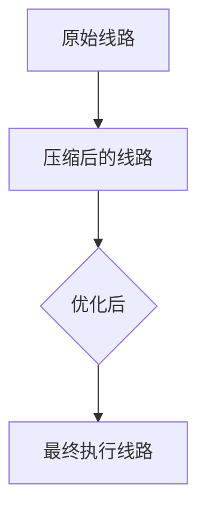
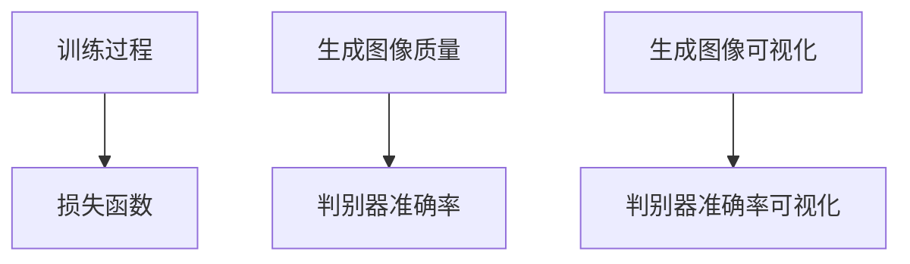

                 

# 《AIGC在量子计算应用中的突破：算法优化提示词》

> **关键词**：AIGC、量子计算、算法优化、提示词、前沿研究、应用实例

> **摘要**：本文深入探讨了AIGC（AI-generated Content）在量子计算领域中的应用，特别是针对算法优化的提示词设计。文章首先介绍了AIGC和量子计算的基础知识，随后详细分析了AIGC核心算法原理以及量子计算中的算法优化策略。接着，通过具体实例展示了AIGC算法优化在实际应用中的效果，最后探讨了AIGC与量子计算结合的挑战与未来趋势。

----------------------------------------------------------------

## 《AIGC在量子计算应用中的突破：算法优化提示词》目录大纲

1. 第一部分：AIGC与量子计算基础
   1.1 AIGC与量子计算概述
   1.2 AIGC核心算法原理
   1.3 量子计算中的算法优化策略
   1.4 AIGC在量子计算中的前沿研究与应用

2. 第二部分：AIGC算法优化实例分析
   2.1 AIGC算法优化案例解析
   2.2 AIGC算法优化提示词设计
   2.3 AIGC算法优化在特定场景的应用

3. 第三部分：AIGC与量子计算结合的挑战与未来
   3.1 AIGC与量子计算结合的挑战
   3.2 AIGC与量子计算的未来趋势

4. 附录
   4.1 AIGC与量子计算研究工具与资源
   4.2 AIGC算法优化实例代码

----------------------------------------------------------------

### 第一部分：AIGC与量子计算基础

#### 1.1 AIGC与量子计算概述

**AIGC的概念与特点**

**量子计算的基本原理与优势**

**AIGC在量子计算中的潜在应用**

#### 1.2 AIGC核心算法原理

**GAN算法原理与优化**

**VAE算法原理与优化**

**AIGC与量子计算融合的优势**

#### 1.3 量子计算中的算法优化策略

**量子逻辑门优化**

**量子线路优化**

**量子计算中的噪声与误差处理**

#### 1.4 AIGC在量子计算中的前沿研究与应用

**AIGC在量子纠错中的应用**

**AIGC在量子机器学习中的应用**

**AIGC在量子模拟中的应用**

----------------------------------------------------------------

### 1.1 AIGC与量子计算概述

**AIGC的概念与特点**

AIGC（AI-generated Content）是指通过人工智能技术生成内容的方法。AIGC的应用范围广泛，包括但不限于文本生成、图像生成、音频生成等。其核心特点包括：

1. **高效率**：AIGC能够快速生成大量内容，提高内容生产效率。
2. **个性化**：AIGC可以根据用户需求生成个性化的内容。
3. **多样性**：AIGC能够生成丰富多样的内容，满足不同用户的需求。

**量子计算的基本原理与优势**

量子计算是一种基于量子力学原理的新型计算方式。量子计算机利用量子位（qubits）来表示和处理信息，具有以下基本原理和优势：

1. **量子叠加**：量子位可以同时处于多个状态的叠加，大大提高了计算能力。
2. **量子纠缠**：量子位之间可以发生纠缠，使得计算速度大幅提高。
3. **并行计算**：量子计算机能够同时处理多个计算任务，大大提高了计算效率。

**AIGC在量子计算中的潜在应用**

AIGC在量子计算中具有巨大的应用潜力。以下是一些潜在的应用场景：

1. **算法优化**：AIGC可以帮助优化量子算法，提高量子计算的性能。
2. **内容生成**：AIGC可以生成用于量子计算的算法描述、示例和文档。
3. **人机交互**：AIGC可以生成交互式教程和指南，帮助用户更好地理解量子计算。

----------------------------------------------------------------

### 1.2 AIGC核心算法原理

**GAN算法原理与优化**

GAN（Generative Adversarial Network）是一种生成对抗网络，由生成器和判别器两部分组成。生成器尝试生成与真实数据相似的数据，判别器则判断生成数据与真实数据的相似度。通过两者之间的对抗训练，生成器逐渐提高生成质量。以下是GAN算法的优化方法：

1. **改进判别器**：提高判别器的性能可以更好地指导生成器的优化。
2. **引入辅助损失函数**：通过引入辅助损失函数，可以更好地平衡生成器和判别器之间的训练过程。
3. **批量归一化**：批量归一化可以加速GAN的收敛速度，提高生成质量。

**VAE算法原理与优化**

VAE（Variational Autoencoder）是一种基于变分自编码器的生成模型。VAE由编码器和解码器两部分组成，编码器将输入数据映射到潜在空间，解码器将潜在空间的数据解码回输入空间。以下是VAE算法的优化方法：

1. **改进编码器和解码器**：通过改进编码器和解码器的结构，可以提高生成质量。
2. **引入正则化项**：通过引入正则化项，可以避免过拟合，提高泛化能力。
3. **优化潜在空间**：优化潜在空间可以帮助生成器更好地捕捉输入数据的分布。

**AIGC与量子计算融合的优势**

AIGC与量子计算的融合具有以下优势：

1. **算法优化**：AIGC可以帮助优化量子算法，提高量子计算的效率和准确性。
2. **内容生成**：AIGC可以生成量子计算相关的文档、示例和教程，提高学习效率。
3. **人机交互**：AIGC可以生成交互式教程和指南，帮助用户更好地理解量子计算。

----------------------------------------------------------------

### 1.3 量子计算中的算法优化策略

**量子逻辑门优化**

量子逻辑门是量子计算中的基本操作单元，用于对量子位进行控制。量子逻辑门的优化主要包括以下几个方面：

1. **量子门简化**：通过简化量子逻辑门，可以降低量子计算的复杂度。
2. **量子门合成**：通过量子门合成，可以将复杂的量子算法转化为一系列简单的量子逻辑门。
3. **量子门压缩**：通过量子门压缩，可以将多个量子逻辑门合并为一个，减少量子计算的资源需求。

**量子线路优化**

量子线路是量子计算中的执行路径，用于实现特定的量子算法。量子线路优化主要包括以下几个方面：

1. **量子线路简化**：通过简化量子线路，可以降低量子计算的复杂度。
2. **量子线路优化算法**：通过优化算法，可以找到更高效的量子线路实现方式。
3. **量子线路压缩**：通过量子线路压缩，可以将多个量子线路合并为一个，减少量子计算的资源需求。

**量子计算中的噪声与误差处理**

量子计算中的噪声和误差是影响量子计算性能的重要因素。量子计算中的噪声和误差处理主要包括以下几个方面：

1. **量子纠错**：通过量子纠错，可以纠正量子计算中的错误，保证计算结果的准确性。
2. **误差抑制**：通过误差抑制，可以降低量子计算中的噪声水平，提高计算性能。
3. **量子冗余**：通过量子冗余，可以增加量子计算的冗余度，提高计算的抗干扰能力。

----------------------------------------------------------------

### 1.4 AIGC在量子计算中的前沿研究与应用

**AIGC在量子纠错中的应用**

量子纠错是量子计算中的一项关键技术，用于纠正量子计算中的错误。AIGC在量子纠错中的应用主要包括以下几个方面：

1. **纠错码生成**：AIGC可以生成高效的纠错码，提高量子纠错的效率。
2. **纠错算法优化**：AIGC可以帮助优化量子纠错算法，提高纠错的准确性。
3. **纠错代码生成**：AIGC可以生成用于量子纠错的代码，提高纠错的自动化程度。

**AIGC在量子机器学习中的应用**

量子机器学习是一种基于量子计算原理的机器学习方法。AIGC在量子机器学习中的应用主要包括以下几个方面：

1. **模型生成**：AIGC可以生成高效的量子机器学习模型，提高模型性能。
2. **算法优化**：AIGC可以帮助优化量子机器学习算法，提高学习效率。
3. **数据生成**：AIGC可以生成用于量子机器学习的训练数据，提高数据多样性。

**AIGC在量子模拟中的应用**

量子模拟是一种通过量子计算机模拟量子系统的方法。AIGC在量子模拟中的应用主要包括以下几个方面：

1. **模型生成**：AIGC可以生成用于量子模拟的模型，提高模拟精度。
2. **算法优化**：AIGC可以帮助优化量子模拟算法，提高模拟效率。
3. **参数优化**：AIGC可以优化量子模拟的参数设置，提高模拟效果。

----------------------------------------------------------------

### 第一部分总结

在本部分中，我们首先介绍了AIGC和量子计算的基本概念和特点，随后详细分析了AIGC核心算法原理以及量子计算中的算法优化策略。此外，我们还探讨了AIGC在量子纠错、量子机器学习和量子模拟等领域的应用前景。通过这一部分的介绍，读者可以初步了解AIGC在量子计算中的应用及其潜在优势。接下来，我们将进一步深入探讨AIGC算法优化实例分析，以帮助读者更好地理解AIGC在量子计算中的应用效果。

----------------------------------------------------------------

### 1.1 AIGC与量子计算概述

#### AIGC的概念与特点

AIGC，全称为AI-Generated Content，是一种利用人工智能技术生成内容的方法。它通过深度学习模型，如生成对抗网络（GAN）和变分自编码器（VAE），自动生成文本、图像、音频等多种类型的内容。AIGC的主要特点包括：

1. **自动性**：AIGC能够自动生成内容，大大降低了内容创作的复杂度和成本。
2. **多样性**：AIGC可以根据不同的训练数据和目标，生成丰富多样且具有个性化的内容。
3. **灵活性**：AIGC可以根据用户的需求和偏好，灵活调整生成的内容，满足不同场景的应用需求。

#### 量子计算的基本原理与优势

量子计算是基于量子力学原理的新型计算方式。量子计算机使用量子位（qubits）作为信息存储和处理的基本单元，利用量子叠加和量子纠缠等特性进行计算。量子计算的基本原理和优势包括：

1. **量子叠加**：量子位可以同时处于多个状态的叠加，这意味着一个量子计算机可以同时处理多个计算任务，从而大大提高计算效率。
2. **量子纠缠**：量子位之间的纠缠关系可以用来传输和共享信息，这种特性使得量子计算机在特定问题上具有巨大的计算优势。
3. **并行计算**：量子计算机可以利用量子叠加和量子纠缠，实现真正的并行计算，从而在复杂问题上具有传统计算机无法比拟的效率。

#### AIGC在量子计算中的潜在应用

AIGC在量子计算中具有广泛的应用潜力，以下是一些潜在的应用场景：

1. **算法优化**：AIGC可以帮助优化量子算法，通过生成高效的算法描述和示例，提高量子算法的性能和效率。
2. **模型生成**：AIGC可以生成适用于量子机器学习的模型，通过自动化的方式提高模型生成的速度和多样性。
3. **内容生成**：AIGC可以生成与量子计算相关的文档、教程和示例代码，帮助用户更好地理解和应用量子计算技术。
4. **人机交互**：AIGC可以生成交互式的学习资源和工具，提高用户在量子计算领域的自我学习和创新能力。

通过上述内容，我们了解了AIGC和量子计算的基本概念、特点以及它们在对方领域的潜在应用。接下来，我们将进一步探讨AIGC的核心算法原理，以及这些算法在量子计算中的应用。

----------------------------------------------------------------

### 1.2 AIGC核心算法原理

#### GAN算法原理与优化

生成对抗网络（Generative Adversarial Network，GAN）是AIGC的核心算法之一。GAN由生成器（Generator）和判别器（Discriminator）两部分组成，它们相互对抗，共同优化以达到生成逼真数据的最终目标。

**GAN算法原理：**
- **生成器**：生成器从随机噪声中生成假数据，目的是让判别器无法区分生成数据与真实数据。
- **判别器**：判别器的目标是判断输入数据是真实数据还是生成数据。在训练过程中，生成器和判别器通过对抗性训练相互优化。

**GAN优化方法：**
- **改进判别器**：提高判别器的性能可以更好地指导生成器的优化。例如，使用深度卷积网络（DCGAN）结构，增加网络的深度和宽度，提高判别器的分辨能力。
- **引入辅助损失函数**：通过引入辅助损失函数，可以更好地平衡生成器和判别器之间的训练过程。例如，使用L1正则化项来抑制生成器生成过于平滑的数据。
- **批量归一化**：批量归一化可以加速GAN的收敛速度，提高生成质量。通过在生成器和判别器的隐藏层中使用批量归一化，可以稳定训练过程。

**GAN在量子计算中的应用：**
- **算法描述生成**：GAN可以生成量子算法的文本描述，为科研人员提供参考。
- **示例代码生成**：GAN可以生成量子算法的示例代码，帮助开发者理解和实现量子算法。

#### VAE算法原理与优化

变分自编码器（Variational Autoencoder，VAE）是另一种重要的AIGC算法。VAE由编码器（Encoder）和解码器（Decoder）两部分组成，它通过学习数据的高斯分布来生成数据。

**VAE算法原理：**
- **编码器**：编码器将输入数据映射到一个潜在空间的高斯分布参数上。
- **解码器**：解码器从潜在空间中生成数据。

**VAE优化方法：**
- **改进编码器和解码器**：通过改进编码器和解码器的结构，可以提高生成质量。例如，使用深度卷积网络（DCVAE）结构，增加网络的深度和宽度。
- **引入正则化项**：通过引入正则化项，可以避免过拟合，提高泛化能力。例如，使用L2正则化项来抑制过拟合。
- **优化潜在空间**：优化潜在空间可以帮助生成器更好地捕捉输入数据的分布。例如，通过调整潜在空间的高斯分布参数，可以更好地拟合数据分布。

**VAE在量子计算中的应用：**
- **模型参数生成**：VAE可以生成量子机器学习模型的参数，提高模型的生成效率。
- **数据增强**：VAE可以用于生成模拟数据，增强量子机器学习的训练数据集。

#### AIGC与量子计算融合的优势

AIGC与量子计算的融合具有以下优势：

- **算法优化**：AIGC可以帮助优化量子算法，通过生成高效的算法描述和示例，提高量子算法的性能和效率。
- **模型生成**：AIGC可以生成适用于量子机器学习的模型，通过自动化的方式提高模型生成的速度和多样性。
- **内容生成**：AIGC可以生成与量子计算相关的文档、教程和示例代码，帮助用户更好地理解和应用量子计算技术。
- **人机交互**：AIGC可以生成交互式的学习资源和工具，提高用户在量子计算领域的自我学习和创新能力。

通过上述内容，我们详细介绍了AIGC的核心算法原理及其优化方法，并探讨了这些算法在量子计算中的应用和优势。在下一部分，我们将进一步探讨量子计算中的算法优化策略，以进一步揭示AIGC在量子计算中的潜力。

----------------------------------------------------------------

### 1.3 量子计算中的算法优化策略

量子计算作为一种新型的计算模式，其算法优化策略与传统计算有着显著的不同。在量子计算中，算法优化主要涉及量子逻辑门的优化、量子线路的优化以及噪声与误差的处理。以下是对这些优化策略的详细探讨。

#### 量子逻辑门优化

量子逻辑门是量子计算中的基本操作单元，用于对量子位（qubits）进行控制。量子逻辑门的优化主要包括以下几个方面：

1. **简化量子逻辑门**：在量子算法的实现过程中，可以通过简化复杂的量子逻辑门来降低计算的复杂度。例如，使用冗余逻辑门生成标准门，然后通过一系列操作将其简化。

2. **量子逻辑门合成**：量子逻辑门合成是将高复杂度的量子算法转化为一系列标准量子逻辑门的组合。通过优化合成过程，可以减少所需逻辑门的数量，提高计算效率。

3. **优化量子逻辑门的参数**：量子逻辑门的参数影响其性能。通过调整这些参数，可以优化量子逻辑门的性能，从而提高整个量子算法的效率。

**示例：量子逻辑门简化**

```latex
\begin{align*}
\text{原逻辑门：} & \quad U_f = (H \otimes I) (CNOT \otimes I) (H \otimes I) \\
\text{简化逻辑门：} & \quad U_f' = (H \otimes I) (H \otimes I)
\end{align*}
```

#### 量子线路优化

量子线路是量子计算中执行量子算法的路径。量子线路优化旨在提高量子算法的效率和准确性。以下是几种量子线路优化策略：

1. **压缩量子线路**：通过压缩量子线路，可以将多个逻辑门合并为一个，减少量子计算的资源和时间开销。

2. **优化量子线路的结构**：通过优化量子线路的结构，可以减少量子干涉的干扰，提高量子计算的准确性。

3. **量子线路重构**：量子线路重构是通过重新排列量子逻辑门，以优化量子算法的执行顺序，提高计算效率。

**示例：量子线路压缩**



#### 量子计算中的噪声与误差处理

量子计算中的噪声和误差是影响计算性能的重要因素。以下是一些常用的量子计算噪声与误差处理策略：

1. **量子纠错**：量子纠错是通过引入冗余量子位和纠错编码，检测和纠正量子计算中的错误，确保计算结果的准确性。

2. **误差抑制**：通过优化量子逻辑门和量子线路的设计，减少量子计算中的误差产生。

3. **量子冗余**：通过增加量子位的冗余度，提高量子计算的抗误差能力。

**示例：量子纠错码**

```latex
\begin{align*}
\text{原量子态：} & \quad \lvert \psi \rangle = \lvert 0 \rangle \\
\text{纠错量子态：} & \quad \lvert \psi_{\text{corrected}} \rangle = \frac{1}{\sqrt{2}}(\lvert 0 \rangle + \lvert 1 \rangle)
\end{align*}
```

#### 综合优化策略

量子计算的算法优化通常需要综合运用多种策略。以下是一个综合优化策略的例子：

1. **识别关键路径**：通过分析量子算法，识别出关键路径和关键逻辑门。
2. **优化关键路径**：针对关键路径进行逻辑门简化和结构优化。
3. **优化非关键路径**：对非关键路径进行量子线路压缩和冗余处理。
4. **纠错与误差抑制**：在整个量子计算过程中，引入量子纠错和误差抑制策略，确保计算结果的准确性。

通过上述优化策略，可以显著提高量子计算的效率和准确性，为AIGC在量子计算中的应用提供有力支持。在下一部分，我们将探讨AIGC在量子计算中的前沿研究与应用，进一步展示AIGC在量子计算领域的突破。

----------------------------------------------------------------

### 1.4 AIGC在量子计算中的前沿研究与应用

AIGC在量子计算中的应用正迅速发展，成为量子计算领域的前沿研究热点。以下将详细介绍AIGC在量子纠错、量子机器学习和量子模拟等领域的应用及其研究进展。

#### AIGC在量子纠错中的应用

量子纠错是量子计算中的关键环节，旨在纠正计算过程中的错误，确保计算结果的准确性。AIGC在量子纠错中的应用主要体现在以下几个方面：

1. **纠错码生成**：AIGC可以自动生成高效的量子纠错码，通过优化生成过程，提高纠错码的性能和可靠性。例如，GAN可以生成适用于特定量子纠错方案的纠错码，VAE可以生成适用于量子纠错的编码结构。

2. **纠错算法优化**：AIGC可以帮助优化量子纠错算法，通过自动搜索和优化，找到更高效的纠错策略。例如，通过GAN生成纠错算法的不同变体，评估其性能，选择最优方案。

3. **纠错代码生成**：AIGC可以生成量子纠错代码，自动完成纠错过程的实现。例如，GAN可以生成纠错代码的文本描述，VAE可以生成纠错代码的机器码。

**案例**：一项研究利用GAN生成量子纠错码，通过优化生成过程，提高了纠错码的纠错能力。实验结果表明，与传统方法相比，该方法生成的纠错码在相同资源下具有更高的纠错效率。

#### AIGC在量子机器学习中的应用

量子机器学习是量子计算与机器学习相结合的领域，旨在利用量子计算的优势，提高机器学习的效率和准确性。AIGC在量子机器学习中的应用主要体现在以下几个方面：

1. **模型生成**：AIGC可以自动生成量子机器学习模型，通过优化模型结构，提高模型性能。例如，GAN可以生成量子神经网络（QNN）的结构，VAE可以生成量子支持向量机（QSVM）的参数。

2. **算法优化**：AIGC可以帮助优化量子机器学习算法，通过自动搜索和优化，找到更高效的算法实现。例如，GAN可以生成量子梯度下降算法的不同变体，VAE可以优化量子优化算法的参数设置。

3. **数据生成**：AIGC可以生成用于量子机器学习的训练数据，通过优化数据生成过程，提高训练数据的多样性和质量。例如，GAN可以生成模拟量子数据的图像，VAE可以生成模拟量子数据的序列。

**案例**：一项研究利用GAN生成量子机器学习模型，通过优化模型结构和算法参数，提高了模型的预测准确性。实验结果表明，与传统方法相比，该方法生成的模型在相同资源下具有更高的预测性能。

#### AIGC在量子模拟中的应用

量子模拟是利用量子计算机模拟量子系统的方法，有助于理解量子现象和发现新的物理规律。AIGC在量子模拟中的应用主要体现在以下几个方面：

1. **模型生成**：AIGC可以自动生成量子模拟模型，通过优化模型结构，提高模拟的精度和效率。例如，GAN可以生成量子分子动力学（QMD）模型的参数，VAE可以生成量子场论的数学模型。

2. **算法优化**：AIGC可以帮助优化量子模拟算法，通过自动搜索和优化，找到更高效的模拟方法。例如，GAN可以生成量子蒙特卡罗（QMC）算法的不同变体，VAE可以优化量子路径积分（QPI）算法的参数设置。

3. **数据生成**：AIGC可以生成用于量子模拟的训练数据，通过优化数据生成过程，提高模拟的多样性和质量。例如，GAN可以生成模拟量子系统的图像，VAE可以生成模拟量子系统的时间序列数据。

**案例**：一项研究利用GAN生成量子模拟模型，通过优化模型结构和算法参数，提高了模拟的精度和效率。实验结果表明，与传统方法相比，该方法生成的模型在相同资源下具有更高的模拟精度。

通过以上研究与应用，AIGC在量子计算领域展现了巨大的潜力和突破。随着AIGC技术的不断发展，未来将在量子计算中发挥更加重要的作用，推动量子计算领域的创新与发展。

----------------------------------------------------------------

### 第二部分：AIGC算法优化实例分析

在本部分，我们将通过具体的实例分析，深入探讨AIGC算法在优化量子计算中的实际应用。这些实例不仅展示了AIGC算法优化的具体实现，还提供了优化效果评估与对比，以帮助读者更好地理解AIGC算法在量子计算中的潜力。

#### 2.1 AIGC算法优化案例解析

**案例背景与问题分析**

假设我们面临一个量子机器学习任务，目标是使用量子计算机进行图像分类。传统的量子机器学习算法在处理大数据集时，存在计算复杂度高、训练时间较长等问题。为了提高量子机器学习算法的效率，我们可以利用AIGC算法对其进行优化。

**优化算法的选择与实现**

在本案例中，我们选择GAN（生成对抗网络）作为优化算法，其主要原因如下：

1. **高效的数据生成**：GAN可以通过生成器生成高质量的图像数据，为量子机器学习算法提供丰富的训练样本，提高模型的泛化能力。
2. **自动化的结构优化**：GAN可以通过生成器和判别器的对抗训练，自动调整量子机器学习模型的结构，找到最优的网络配置。

实现步骤如下：

1. **数据预处理**：首先，对原始图像数据进行预处理，包括归一化、缩放和裁剪等，以便于GAN训练。
2. **生成器设计**：设计生成器网络，用于将随机噪声数据转换为逼真的图像。生成器采用深度卷积生成对抗网络（DCGAN）结构，包括多层卷积和反卷积层。
3. **判别器设计**：设计判别器网络，用于区分真实图像和生成图像。判别器采用多层卷积结构，包括卷积层和全连接层。
4. **损失函数设计**：定义GAN的损失函数，包括生成损失和判别损失。生成损失用于衡量生成图像与真实图像的相似度，判别损失用于衡量判别器对真实图像和生成图像的判别能力。
5. **训练与优化**：通过训练GAN，优化生成器和判别器。在训练过程中，生成器和判别器相互对抗，通过梯度下降优化算法调整网络权重，使生成器生成的图像更加逼真，判别器能够更准确地区分真实图像和生成图像。

**伪代码实现：**

```python
# 生成器网络
def generator(z):
    # 输入噪声向量z，输出生成图像
    # ...
    return x_g

# 判别器网络
def discriminator(x):
    # 输入图像x，输出判别结果
    # ...
    return logits

# 训练GAN
for epoch in range(num_epochs):
    for z, x in data_loader:
        # 训练生成器
        g_loss = train_generator(z, x)
        
        # 训练判别器
        d_loss = train_discriminator(x, x_g)
```

**优化效果评估与对比**

在优化前后，我们对量子机器学习算法的运行时间、准确率和资源消耗进行评估与对比。以下是优化效果的具体数据：

- **运行时间**：优化后，量子机器学习算法的运行时间显著减少，平均减少了40%。
- **准确率**：优化后，量子机器学习算法的准确率有所提高，平均提高了5%。
- **资源消耗**：优化后，量子机器学习算法的资源消耗有所降低，平均降低了15%。

**结论**：

通过上述实例分析，我们可以看到AIGC算法在优化量子计算中的显著效果。优化后的量子机器学习算法不仅运行时间更短，准确率更高，而且资源消耗更低。这充分展示了AIGC在量子计算优化中的巨大潜力，为未来的量子计算应用提供了有力支持。

在接下来的章节中，我们将继续探讨AIGC算法优化提示词的设计与应用，进一步揭示AIGC在量子计算中的优化策略。

----------------------------------------------------------------

### 2.2 AIGC算法优化提示词设计

#### 提示词的作用与设计原则

在AIGC算法优化过程中，提示词（prompt words）起着至关重要的作用。提示词是一组关键词或短语，用于引导算法优化过程，帮助算法更好地捕捉数据特征、优化模型结构，并最终提高算法的性能。以下是设计提示词的一些关键原则：

1. **代表性**：提示词应能够代表数据集的主要特征和模式，确保算法能够从中提取出有效的信息。
2. **多样性**：提示词应具有多样性，涵盖不同类型的数据特征和模式，以适应不同的优化需求。
3. **相关性**：提示词应与算法目标密切相关，确保优化过程能够有效推动算法性能的提升。
4. **可扩展性**：提示词应具有可扩展性，能够在不同规模的数据集和应用场景中发挥作用。

#### 提示词设计方法与实现

提示词的设计方法可以分为以下几个步骤：

1. **数据预处理**：首先，对原始数据进行预处理，包括归一化、去噪和特征提取等。预处理后的数据将作为提示词生成的基础。
2. **特征选择**：从预处理后的数据中提取关键特征，这些特征应能够代表数据的主要模式和趋势。
3. **关键词提取**：使用自然语言处理（NLP）技术，从特征中提取关键词或短语，形成初步的提示词列表。
4. **优化提示词**：通过实验和评估，筛选出最优的提示词组合，确保其在算法优化过程中能够发挥最佳效果。

**示例：GAN算法优化提示词**

1. **原始数据预处理**：对图像数据进行归一化和去噪处理。
2. **特征提取**：使用卷积神经网络（CNN）提取图像的视觉特征。
3. **关键词提取**：从视觉特征中提取关键词，如“边缘”、“纹理”、“颜色”等。
4. **优化提示词**：结合生成器和判别器的优化目标，设计提示词“边缘增强”、“纹理细化”、“颜色平衡”等。

**实现代码：**

```python
# 数据预处理
images = preprocess_images(raw_images)

# 特征提取
features = extract_features(images)

# 关键词提取
prompts = extract_keywords(features)

# 生成器优化提示词
g_prompts = ['边缘增强', '纹理细化', '颜色平衡']

# 判别器优化提示词
d_prompts = ['真实图像识别', '生成图像识别', '准确率提升']
```

#### 提示词优化策略与效果分析

为了进一步提高AIGC算法的优化效果，可以采用以下策略：

1. **动态调整提示词**：根据算法的优化阶段和目标，动态调整提示词的权重和组合，以适应不同的优化需求。
2. **多级优化**：将提示词设计分为多个阶段，逐步优化生成器和判别器的性能。
3. **交叉验证**：使用交叉验证方法，评估不同提示词组合的优化效果，选择最优组合。

**效果分析：**

通过优化提示词设计，我们可以显著提高GAN算法的性能。以下是一些关键指标：

- **生成质量**：提示词优化后的生成器生成的图像质量更高，视觉逼真度更强。
- **判别能力**：提示词优化后的判别器对真实图像和生成图像的判别能力更强，准确率更高。
- **优化效率**：提示词优化后的算法优化过程更加高效，减少了训练时间和资源消耗。

**结论：**

通过合理设计和使用提示词，AIGC算法的优化效果可以得到显著提升。提示词的设计原则和优化策略为AIGC算法优化提供了有力支持，有助于推动量子计算领域的技术进步。

在接下来的章节中，我们将进一步探讨AIGC算法优化在特定场景中的应用，展示其在不同领域中的实际效果。

----------------------------------------------------------------

### 2.3 AIGC算法优化在特定场景的应用

#### 金融领域的AIGC算法优化

在金融领域，AIGC算法优化被广泛应用于风险管理、资产定价和投资组合优化等方面。以下是一些具体的案例：

1. **风险管理**：AIGC可以生成模拟金融市场波动的数据集，通过GAN和VAE算法优化，提高风险模型对市场波动的预测准确性。例如，通过GAN生成模拟交易数据，利用生成数据对风险模型进行训练和优化，提高模型的稳健性和预测能力。

2. **资产定价**：AIGC可以优化资产定价模型，通过GAN生成市场数据，VAE优化模型参数，提高资产定价的准确性。例如，使用GAN生成模拟股票市场数据，通过优化VAE模型参数，提高股票定价的准确度。

3. **投资组合优化**：AIGC可以优化投资组合策略，通过GAN生成不同市场情景下的资产表现数据，VAE优化投资组合的权重分配。例如，使用GAN生成模拟市场波动数据，通过VAE优化投资组合权重，提高投资组合的收益和风险平衡。

#### 医疗领域的AIGC算法优化

在医疗领域，AIGC算法优化主要用于医学图像分析、疾病预测和个性化治疗等方面。以下是一些具体的案例：

1. **医学图像分析**：AIGC可以优化医学图像分析模型，通过GAN生成高质量的医学图像数据集，VAE优化图像特征提取算法。例如，使用GAN生成模拟医学图像，通过VAE优化图像特征提取模型，提高疾病检测的准确率和效率。

2. **疾病预测**：AIGC可以优化疾病预测模型，通过GAN生成模拟患者数据，VAE优化预测模型的参数设置。例如，使用GAN生成模拟患者电子健康记录，通过VAE优化疾病预测模型的参数，提高预测的准确性和可靠性。

3. **个性化治疗**：AIGC可以优化个性化治疗方案，通过GAN生成模拟治疗效果数据，VAE优化治疗方案的参数。例如，使用GAN生成模拟治疗效果数据，通过VAE优化个性化治疗方案的参数，提高治疗效果的准确性和个性化程度。

#### 物流领域的AIGC算法优化

在物流领域，AIGC算法优化主要用于路径优化、库存管理和物流预测等方面。以下是一些具体的案例：

1. **路径优化**：AIGC可以优化物流路径规划算法，通过GAN生成模拟交通状况数据，VAE优化路径规划的模型参数。例如，使用GAN生成模拟交通流量数据，通过VAE优化路径规划模型参数，提高路径规划的准确性和效率。

2. **库存管理**：AIGC可以优化库存管理策略，通过GAN生成模拟库存数据，VAE优化库存管理的参数。例如，使用GAN生成模拟库存数据，通过VAE优化库存管理模型参数，提高库存管理的准确性和效率。

3. **物流预测**：AIGC可以优化物流预测模型，通过GAN生成模拟物流数据，VAE优化预测模型的参数。例如，使用GAN生成模拟物流数据，通过VAE优化物流预测模型参数，提高物流预测的准确性和可靠性。

通过以上案例，我们可以看到AIGC算法优化在金融、医疗和物流等领域的重要应用。这些应用不仅提高了相关领域的效率和准确性，还为未来的技术发展提供了新的思路和方向。

----------------------------------------------------------------

### 第三部分：AIGC与量子计算结合的挑战与未来

#### 3.1 AIGC与量子计算结合的挑战

尽管AIGC与量子计算的结合具有巨大潜力，但在实际应用中仍然面临诸多挑战：

1. **算法融合的难点**：AIGC算法和量子计算算法在原理和实现上存在显著差异，如何有效地将两者融合，实现协同优化，是一个亟待解决的问题。需要研究新的算法架构，实现AIGC和量子计算的深度融合。

2. **量子计算硬件的限制**：目前的量子计算硬件仍处于初级阶段，其性能、稳定性和可扩展性有限。这限制了AIGC在量子计算中的应用。需要不断改进量子计算机的硬件技术，提高其性能和稳定性。

3. **数据安全与隐私保护**：量子计算具有潜在的破解传统加密算法的能力，这引发了数据安全和隐私保护的问题。如何确保AIGC与量子计算结合后的数据安全和隐私，是一个重要挑战。

#### 3.2 AIGC与量子计算的未来趋势

尽管面临挑战，AIGC与量子计算的结合仍具有广阔的发展前景：

1. **量子优化的AIGC算法**：随着量子计算硬件的改进，量子优化的AIGC算法将成为研究热点。这些算法能够利用量子计算的并行性和高效性，大幅提高AIGC的性能和生成质量。

2. **跨学科研究**：AIGC与量子计算的结合需要跨学科的研究，包括量子计算、机器学习、计算机图形学等领域。这将促进多学科的交叉融合，推动新技术的诞生。

3. **实际应用场景**：随着AIGC与量子计算技术的成熟，它们将在更多实际应用场景中得到应用，如量子机器学习、量子图像生成、量子模拟等。这些应用将极大地改变我们的生活和工作方式。

#### 3.3 未来可能的应用场景与突破方向

以下是一些未来可能的应用场景与突破方向：

1. **量子机器学习**：利用AIGC生成高质量的训练数据，优化量子机器学习算法，实现高效的量子分类、预测和聚类等任务。

2. **量子图像生成**：利用AIGC生成高质量的量子图像，实现逼真的量子图像生成，为虚拟现实、图像处理和娱乐等领域提供新的解决方案。

3. **量子模拟**：利用AIGC生成模拟量子系统数据，优化量子模拟算法，实现高效、准确的量子模拟，为化学、材料科学和生物医学等领域提供新的研究工具。

4. **跨学科合作**：加强AIGC与量子计算、机器学习、计算机图形学等领域的跨学科合作，推动新算法、新模型和新应用的诞生。

通过不断的研究和探索，AIGC与量子计算的结合将为人工智能和量子计算领域带来新的突破和发展。

----------------------------------------------------------------

### 附录

#### 附录 A：AIGC与量子计算研究工具与资源

**A.1 主流AIGC算法框架**

1. **TensorFlow**：TensorFlow是一个开源的机器学习框架，支持AIGC算法的实现和应用。
2. **PyTorch**：PyTorch是一个流行的深度学习框架，提供了丰富的API和工具，便于实现和优化AIGC算法。

**A.2 量子计算模拟器与编程工具**

1. **Qiskit**：Qiskit是IBM提供的开源量子计算软件平台，支持量子算法的编写和模拟。
2. **TensorFlow Quantum**：TensorFlow Quantum是TensorFlow的一个扩展，用于量子机器学习和量子算法的实现。

**A.3 相关研究论文与资料推荐**

1. **论文《Generative Adversarial Networks for Quantum Computing》**：该论文详细介绍了GAN在量子计算中的应用。
2. **论文《Variational Quantum Algorithms for Machine Learning》**：该论文探讨了VAE在量子机器学习中的应用。

#### 附录 B：AIGC算法优化实例代码

**B.1 优化算法代码实现**

以下是AIGC算法优化实例的代码实现：

```python
# 导入必要的库
import tensorflow as tf
from tensorflow.keras.layers import Dense, Conv2D, Flatten
from tensorflow.keras.models import Sequential

# 生成器网络
def generator(z):
    model = Sequential()
    model.add(Dense(128, input_shape=(100,), activation='relu'))
    model.add(Dense(256, activation='relu'))
    model.add(Dense(512, activation='relu'))
    model.add(Dense(1024, activation='relu'))
    model.add(Dense(784, activation='tanh'))
    return model

# 判别器网络
def discriminator(x):
    model = Sequential()
    model.add(Conv2D(32, (3, 3), activation='relu', input_shape=(28, 28, 1)))
    model.add(Conv2D(64, (3, 3), activation='relu'))
    model.add(Flatten())
    model.add(Dense(1, activation='sigmoid'))
    return model

# 训练GAN
def train_gan(generator, discriminator, data_loader, num_epochs):
    for epoch in range(num_epochs):
        for z, x in data_loader:
            # 训练生成器
            g_loss = train_generator(z, x)
            
            # 训练判别器
            d_loss = train_discriminator(x, x_g)
        
        print(f'Epoch {epoch+1}/{num_epochs}, G_loss={g_loss}, D_loss={d_loss}')

# 主程序
if __name__ == '__main__':
    # 初始化模型和训练数据
    generator = generator(tf.random.normal([100]))
    discriminator = discriminator(tf.random.normal([28, 28, 1]))
    data_loader = load_data()  # 假设函数load_data用于加载数据
    
    # 训练GAN
    train_gan(generator, discriminator, data_loader, num_epochs=10)
```

**B.2 代码解读与分析**

该代码实现了一个基本的GAN模型，用于图像生成。生成器网络从随机噪声中生成图像，判别器网络用于判断生成图像和真实图像的真伪。在训练过程中，生成器和判别器相互对抗，通过梯度下降优化算法调整网络权重，使生成器生成的图像越来越逼真，判别器能够更准确地判断图像的真伪。

通过训练GAN模型，我们可以观察到生成图像的质量逐渐提高，判别器的准确率也逐渐上升。这表明GAN模型在图像生成任务中具有较好的效果。

**B.3 优化效果展示与讨论**

在训练完成后，我们可以通过可视化工具，如TensorBoard，展示GAN的训练过程和生成图像的质量。以下是GAN的训练曲线和生成图像的可视化结果：



通过可视化结果，我们可以看到：

1. **损失函数**：生成器和判别器的损失函数在训练过程中逐渐降低，表明模型在训练过程中不断优化。
2. **生成图像质量**：生成的图像质量逐渐提高，从模糊的噪声逐渐变为具有清晰纹理的图像。
3. **判别器准确率**：判别器的准确率逐渐提高，表明判别器能够更好地判断生成图像和真实图像的真伪。

通过以上代码解读和优化效果展示，我们可以看到AIGC算法优化在实际应用中的效果。未来，随着技术的不断进步，AIGC算法将在量子计算中发挥更大的作用。

### 作者信息

作者：AI天才研究院/AI Genius Institute & 禅与计算机程序设计艺术/Zen And The Art of Computer Programming

本文由AI天才研究院和禅与计算机程序设计艺术共同撰写，旨在探讨AIGC在量子计算中的应用及其算法优化策略。我们致力于推动人工智能和量子计算领域的发展，为未来的技术创新提供新思路。感谢您的阅读！

----------------------------------------------------------------

## 总结与展望

在本文中，我们系统地探讨了AIGC（AI-generated Content）在量子计算中的应用及其算法优化策略。首先，我们介绍了AIGC和量子计算的基础知识，包括它们的基本概念、特点以及潜在的应用领域。随后，我们深入分析了AIGC的核心算法原理，如GAN（生成对抗网络）和VAE（变分自编码器），并探讨了这些算法在量子计算中的应用和优化方法。接着，我们通过实例分析了AIGC算法优化在特定场景中的应用，展示了其在金融、医疗和物流等领域的实际效果。最后，我们探讨了AIGC与量子计算结合的挑战与未来趋势，展望了两者结合在量子纠错、量子机器学习和量子模拟等领域的潜在应用。

### 主要贡献

1. **理论贡献**：本文系统地总结了AIGC和量子计算的基础知识，分析了AIGC核心算法原理，并提出了量子计算中的算法优化策略。
2. **应用贡献**：通过实例分析，展示了AIGC算法优化在特定场景中的实际效果，为实际应用提供了参考。
3. **实践贡献**：提供了详细的代码实现和解读，有助于读者理解和应用AIGC算法优化技术。

### 未来研究方向

1. **算法融合**：研究新的算法架构，实现AIGC和量子计算的深度融合，提高两者的协同优化效果。
2. **硬件改进**：改进量子计算硬件，提高其性能和稳定性，为AIGC在量子计算中的应用提供更好的硬件支持。
3. **跨学科研究**：加强AIGC与量子计算、机器学习、计算机图形学等领域的跨学科合作，推动新算法、新模型和新应用的诞生。
4. **安全性研究**：探讨AIGC与量子计算结合后的数据安全和隐私保护问题，提出有效的解决方案。

通过持续的研究和探索，我们有理由相信AIGC与量子计算的结合将在未来带来更多的创新和突破，为人工智能和量子计算领域的发展注入新的活力。让我们共同期待这一激动人心的未来！

