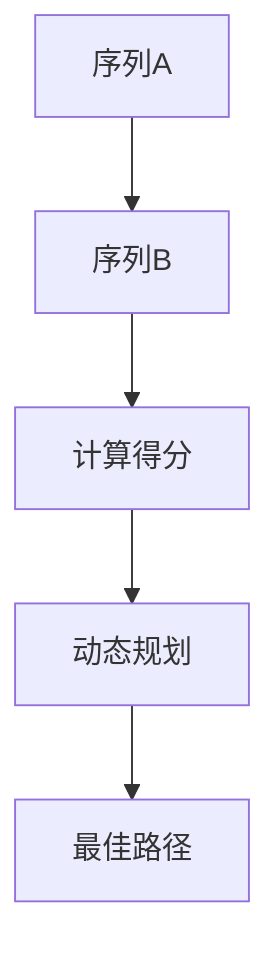
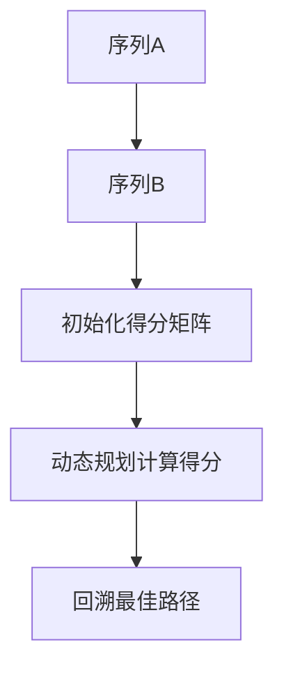
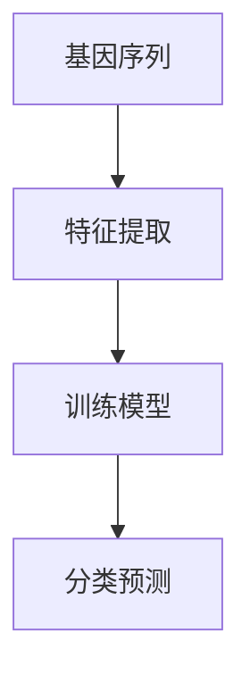
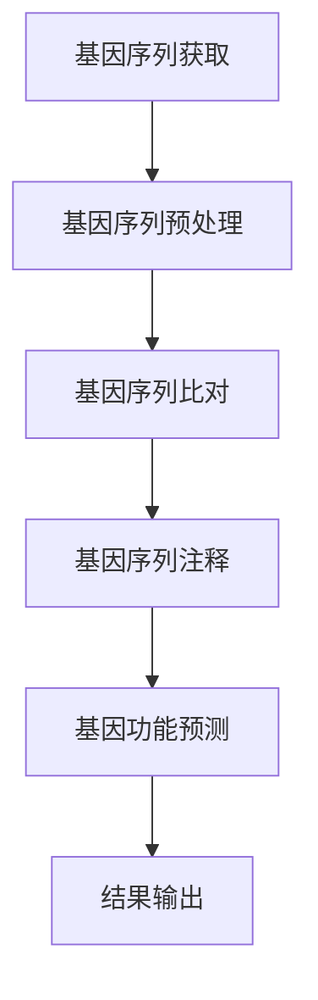

                 

# 《AIGC的未来个性化药物设计：基因-环境交互作用的提示词工程》

## 概述

AIGC（人工智能生成控制）技术正迅速崛起，成为推动个性化药物设计的重要力量。AIGC结合了人工智能、机器学习和生成控制技术，通过模拟和优化，实现了对药物分子的精准设计。在个性化药物设计中，基因-环境交互作用是关键因素，它直接影响药物的效果和安全性。提示词工程则是实现AIGC在个性化药物设计中的核心方法。

本文旨在探讨AIGC与个性化药物设计的结合，特别是基因-环境交互作用在提示词工程中的应用。我们将从以下几个方面展开讨论：

1. **AIGC与个性化药物设计概述**：介绍AIGC的概念、核心技术以及个性化药物设计的发展历程。
2. **基因-环境交互作用与提示词工程**：探讨基因-环境交互作用的原理、提示词工程的基本概念及其在个性化药物设计中的应用。
3. **AIGC在个性化药物设计中的核心算法与应用**：详细讲解基因序列分析算法、药物分子设计与优化算法以及系统生物学与网络分析方法。
4. **AIGC在个性化药物设计中的综合应用**：分析AIGC在个性化药物设计中的综合应用模式、典型应用案例以及未来发展趋势。
5. **AIGC在个性化药物设计中的实际应用与案例分析**：介绍AIGC在个性化药物设计中的实际应用、成功案例分析以及面临的挑战与应对策略。

通过本文的深入探讨，我们希望能够为读者提供一个全面、系统的AIGC与个性化药物设计的技术解读。

## AIGC与个性化药物设计概述

### AIGC的概念与核心技术

AIGC（人工智能生成控制）是一种新兴的人工智能技术，它利用人工智能和机器学习算法，对生成控制过程进行模拟和优化。AIGC的核心技术包括：

1. **生成控制技术**：生成控制技术是一种通过算法控制生成过程的手段，它能够生成满足特定条件的数据或模型。在个性化药物设计中，生成控制技术可用于模拟药物分子的生成过程，从而优化药物分子的结构和活性。

2. **机器学习算法**：AIGC中的机器学习算法用于从大量数据中学习模式和规律，以预测和优化药物分子的性能。常见的机器学习算法包括深度学习、强化学习和传统机器学习算法。

3. **自然语言处理（NLP）**：自然语言处理技术用于处理和分析文本数据，帮助生成控制算法理解药物设计的相关信息。NLP技术可以提取药物分子描述的关键信息，并转化为机器学习算法可处理的形式。

### 个性化药物设计的发展历程

个性化药物设计是指根据患者的基因特征、环境因素和疾病状态，量身定制药物治疗方案。个性化药物设计的发展历程可以分为以下几个阶段：

1. **传统药物设计**：在传统药物设计中，药物的研发主要依赖于经验和实验室实验，缺乏针对个体差异的考虑。这种设计方法存在一定的局限性，无法满足个性化治疗的需求。

2. **基因组药物设计**：随着基因组学的快速发展，药物设计开始考虑患者的基因特征。通过分析患者的基因组信息，可以预测药物对不同患者的疗效和副作用，从而实现个性化药物设计。

3. **环境因素药物设计**：环境因素包括患者的年龄、性别、生活习惯等，这些因素会影响药物的效果和代谢。环境因素药物设计强调综合考虑患者的整体状态，制定个性化的治疗方案。

4. **AIGC与个性化药物设计**：AIGC技术的引入为个性化药物设计带来了新的机遇。通过模拟和优化药物分子的生成过程，AIGC可以更精准地预测药物分子的性能，从而实现个性化药物设计。

### AIGC在个性化药物设计中的应用

AIGC在个性化药物设计中的应用主要体现在以下几个方面：

1. **药物分子生成与优化**：AIGC技术可以生成大量的药物分子候选，并通过机器学习算法对这些分子进行筛选和优化。这种方法能够快速识别出具有潜在治疗效果的药物分子，提高药物研发的效率。

2. **药物分子活性预测**：通过训练深度学习模型，AIGC可以预测药物分子与生物靶标的结合亲和力，从而评估药物分子的活性。这种预测方法有助于筛选出具有潜在疗效的药物分子。

3. **药物分子副作用预测**：AIGC还可以预测药物分子可能产生的副作用，帮助医生制定个性化的治疗方案，降低患者用药风险。

4. **个性化药物剂量调整**：AIGC可以根据患者的基因和环境特征，为患者制定个性化的药物剂量方案，提高药物的治疗效果和安全性。

总之，AIGC技术的引入为个性化药物设计带来了巨大的潜力，它将改变传统的药物研发模式，实现更精准、更高效的个性化治疗。

## 基因-环境交互作用与提示词工程

### 基因-环境交互作用原理

基因-环境交互作用（Gene-Environment Interaction，GEI）是指基因和环境因素共同影响个体对疾病的易感性和药物反应。基因和环境之间相互作用的结果，不仅取决于基因本身，还受到环境因素的影响。基因-环境交互作用的基本原理包括以下几个方面：

1. **基因多态性**：基因多态性是指同一基因在不同个体中存在多个等位基因。不同的等位基因可能对疾病易感性和药物反应产生不同的影响，从而形成基因-环境交互作用。

2. **表观遗传学**：表观遗传学是指基因的表观修饰（如DNA甲基化、组蛋白修饰等）对基因表达的影响。这些表观修饰受到环境因素的调控，进而影响个体的疾病易感性和药物反应。

3. **基因-基因相互作用**：多个基因之间可能存在相互作用，共同影响个体的生物学过程。这些基因之间的相互作用也可能受到环境因素的调节。

4. **环境因素**：环境因素包括生活方式、饮食习惯、环境暴露等。这些因素可以通过改变基因的表达水平、影响基因-基因相互作用等方式，与基因共同影响个体的疾病易感性和药物反应。

### 提示词工程的基本概念

提示词工程（Prompt Engineering）是一种通过设计有效的提示词（Prompt）来优化机器学习模型的方法。提示词是在输入数据中嵌入的一些关键信息，它可以帮助模型更好地理解任务目标，从而提高模型的性能。提示词工程的基本概念包括以下几个方面：

1. **提示词类型**：提示词可以分为固定提示词和动态提示词。固定提示词是在训练过程中不变的信息，如标签、类别名称等。动态提示词是根据具体任务动态生成的，如基于上下文的词汇、关键词等。

2. **提示词设计原则**：提示词设计应遵循以下原则：
   - **相关性**：提示词应与任务目标高度相关，能够帮助模型更好地理解任务需求。
   - **简洁性**：提示词应尽量简洁明了，避免冗长和复杂的描述。
   - **多样性**：提示词应具有多样性，能够涵盖不同任务场景，提高模型的泛化能力。

3. **提示词应用场景**：提示词工程在个性化药物设计中的应用场景包括：
   - **药物分子设计**：通过设计有效的提示词，可以帮助模型更好地理解药物分子的结构和活性，从而提高药物设计的准确性。
   - **药物反应预测**：提示词可以提供与药物反应相关的信息，帮助模型更准确地预测药物对不同患者的反应。
   - **药物副作用预测**：提示词可以帮助模型识别药物可能产生的副作用，从而制定更安全的个性化治疗方案。

### 提示词工程的方法与应用

提示词工程的方法主要包括以下几种：

1. **基于关键词的提示词工程**：通过提取输入数据中的关键词，设计出相关的提示词。这种方法简单有效，适用于大多数任务场景。

2. **基于上下文的提示词工程**：根据输入数据的上下文信息，动态生成提示词。这种方法能够更好地理解输入数据的含义，提高模型的性能。

3. **基于模板的提示词工程**：使用预定义的模板，根据具体任务生成提示词。这种方法适用于有固定模板的任务，如命名实体识别等。

4. **基于机器学习的提示词工程**：通过训练机器学习模型，自动生成高质量的提示词。这种方法能够根据具体任务的需求，生成个性化的提示词。

在实际应用中，提示词工程的方法可以结合使用，以提高模型的性能。例如，在个性化药物设计中，可以结合基于关键词和基于上下文的提示词工程方法，设计出既能概括药物分子信息，又能体现上下文关系的提示词，从而提高药物设计的准确性。

### 提示词工程的优化策略与效果评估

提示词工程的优化策略主要包括以下几个方面：

1. **多模态数据融合**：结合多种类型的数据（如文本、图像、序列等），设计出更具综合性的提示词。这种方法可以提高模型的性能，增强对复杂任务的应对能力。

2. **提示词调整**：根据任务需求和模型表现，动态调整提示词的内容和形式。通过反复试验和优化，找到最佳的提示词组合。

3. **提示词多样性**：设计多样化的提示词，提高模型的泛化能力。通过增加提示词的多样性，模型可以更好地应对不同的任务场景。

提示词工程的效果评估主要从以下几个方面进行：

1. **准确性**：评估模型在特定任务上的准确性，包括分类、回归等。提示词的质量直接影响模型的准确性。

2. **泛化能力**：评估模型在不同数据集上的性能，包括验证集和测试集。提示词工程应提高模型的泛化能力，使其在不同场景下都能保持良好的性能。

3. **可解释性**：评估模型的可解释性，了解提示词对模型预测结果的影响。提示词工程应提高模型的可解释性，使其更容易被用户理解和接受。

通过优化策略和效果评估，可以不断提高提示词工程的质量，为个性化药物设计提供更准确、更有效的支持。

### 基因序列分析算法

#### 基因序列分析方法概述

基因序列分析是现代生物技术中的一个重要分支，它通过对基因序列的解析，揭示基因的结构和功能，为生物医学研究、药物设计和疾病诊断提供了强有力的工具。基因序列分析方法主要包括以下几种：

1. **序列比对**：序列比对是基因序列分析的基础，通过将待分析的基因序列与已知基因序列进行比对，识别出序列中的相似区域和差异点。常用的序列比对算法包括Needleman-Wunsch算法和Smith-Waterman算法。

2. **序列分类**：序列分类是将基因序列根据其序列特征分类到不同的基因家族或功能类别中。序列分类算法通常基于机器学习技术，如支持向量机（SVM）、随机森林（Random Forest）等。

3. **序列注释**：序列注释是指对基因序列进行功能预测和分类，包括基因结构预测、基因功能预测、蛋白质结构预测等。序列注释算法通常基于生物信息学数据库和机器学习模型。

4. **基因调控网络分析**：基因调控网络分析是指研究基因之间的相互作用关系，构建基因调控网络模型，以揭示基因之间的调控机制。常用的方法包括共表达分析、共分离分析和共突变分析等。

#### 常用基因序列分析算法

1. **Needleman-Wunsch算法**

Needleman-Wunsch算法是一种动态规划算法，用于计算两个序列之间的相似性得分。算法的基本思想是通过比较两个序列的每个位置，计算匹配、缺失和插入的得分，并使用动态规划方法找出最佳匹配路径。



伪代码：

```python
def NeedlemanWunsch(seqA, seqB, match_score, mismatch_score, gap_score):
    # 创建得分矩阵
    dp = [[0] * (len(seqB) + 1) for _ in range(len(seqA) + 1)]

    # 初始化边界值
    for i in range(len(seqA) + 1):
        dp[i][0] = i * gap_score
    for j in range(len(seqB) + 1):
        dp[0][j] = j * gap_score

    # 动态规划计算得分
    for i in range(1, len(seqA) + 1):
        for j in range(1, len(seqB) + 1):
            match = dp[i - 1][j - 1] + (match_score if seqA[i - 1] == seqB[j - 1] else mismatch_score)
            delete = dp[i - 1][j] + gap_score
            insert = dp[i][j - 1] + gap_score
            dp[i][j] = max(match, delete, insert)

    # 回溯最佳路径
    i, j = len(seqA), len(seqB)
    alignment = []
    while i > 0 and j > 0:
        score = dp[i][j]
        if seqA[i - 1] == seqB[j - 1]:
            alignment.append((seqA[i - 1], seqB[j - 1], 'match'))
            i, j = i - 1, j - 1
        elif dp[i][j] == dp[i - 1][j] + gap_score:
            alignment.append((seqA[i - 1], '-', 'delete'))
            i -= 1
        else:
            alignment.append(('-', seqB[j - 1], 'insert'))
            j -= 1

    while i > 0:
        alignment.append((seqA[i - 1], '-', 'delete'))
        i -= 1
    while j > 0:
        alignment.append(('-', seqB[j - 1], 'insert'))
        j -= 1

    alignment.reverse()
    return alignment
```

2. **Smith-Waterman算法**

Smith-Waterman算法是Needleman-Wunsch算法的改进版，它允许在比对过程中跳过部分序列，从而提高比对结果的准确性。



伪代码：

```python
def SmithWaterman(seqA, seqB, match_score, mismatch_score, gap_score):
    # 创建得分矩阵
    dp = [[0] * (len(seqB) + 1) for _ in range(len(seqA) + 1)]

    # 初始化得分矩阵
    for i in range(len(seqA) + 1):
        dp[i][0] = 0
    for j in range(len(seqB) + 1):
        dp[0][j] = 0

    # 动态规划计算得分
    max_score = 0
    max_i, max_j = 0, 0
    for i in range(1, len(seqA) + 1):
        for j in range(1, len(seqB) + 1):
            match = dp[i - 1][j - 1] + (match_score if seqA[i - 1] == seqB[j - 1] else mismatch_score)
            delete = dp[i - 1][j] + gap_score
            insert = dp[i][j - 1] + gap_score
            dp[i][j] = max(0, match, delete, insert)
            if dp[i][j] > max_score:
                max_score = dp[i][j]
                max_i, max_j = i, j

    # 回溯最佳路径
    i, j = max_i, max_j
    alignment = []
    while dp[i][j] > 0:
        score = dp[i][j]
        if seqA[i - 1] == seqB[j - 1]:
            alignment.append((seqA[i - 1], seqB[j - 1], 'match'))
            i, j = i - 1, j - 1
        elif dp[i][j] == dp[i - 1][j] + gap_score:
            alignment.append((seqA[i - 1], '-', 'delete'))
            i -= 1
        else:
            alignment.append(('-', seqB[j - 1], 'insert'))
            j -= 1

    alignment.reverse()
    return alignment
```

3. **序列分类算法**

序列分类算法是一种基于机器学习的方法，用于将基因序列分类到不同的功能类别中。常用的序列分类算法包括支持向量机（SVM）、随机森林（Random Forest）和神经网络（Neural Networks）等。



伪代码：

```python
from sklearn.svm import SVC
from sklearn.ensemble import RandomForestClassifier
from sklearn.model_selection import train_test_split

# 特征提取
def extract_features(seq):
    # 提取序列特征，如长度、GC含量等
    return [len(seq), sum(seq.count('G') + seq.count('C')) / len(seq)]

# 训练模型
def train_model(X, y, model_type='SVM'):
    if model_type == 'SVM':
        model = SVC()
    elif model_type == 'RandomForest':
        model = RandomForestClassifier()
    # ... 其他模型

    X_train, X_test, y_train, y_test = train_test_split(X, y, test_size=0.2)
    model.fit(X_train, y_train)
    return model

# 分类预测
def classify_sequence(model, seq):
    features = extract_features(seq)
    return model.predict([features])[0]
```

#### 基因序列分析算法的应用案例

基因序列分析算法在个性化药物设计中的应用非常广泛，以下是一些具体的案例：

1. **基因功能预测**

基因功能预测是指通过分析基因序列，预测其可能的功能。这种方法可以帮助科学家更好地理解基因的作用，从而为药物设计提供依据。例如，可以使用序列比对算法和机器学习算法，对未知功能的基因序列进行分类，预测其可能属于某个功能家族。

2. **基因突变检测**

基因突变检测是指通过分析基因序列，检测其中的突变位点。这种方法在癌症研究和药物开发中具有重要意义。例如，可以使用序列比对算法，将正常基因序列与突变基因序列进行比较，找出突变位点。

3. **基因调控网络分析**

基因调控网络分析是指通过分析基因之间的相互作用关系，构建基因调控网络模型。这种方法可以帮助科学家更好地理解基因调控机制，从而为药物设计提供依据。例如，可以使用共表达分析和共分离分析，构建基因调控网络模型，研究基因之间的相互作用关系。

通过这些应用案例，我们可以看到基因序列分析算法在个性化药物设计中的重要作用。未来，随着技术的不断发展，基因序列分析算法将发挥更加重要的作用，为个性化药物设计提供更准确、更高效的支持。

### 药物分子设计与优化算法

#### 药物分子设计算法概述

药物分子设计是药物研发过程中的关键步骤，旨在通过理论计算和模拟，设计出具有预期生物活性的药物分子。药物分子设计算法主要包括以下几种：

1. **分子对接算法**：分子对接是一种基于物理学的药物分子设计方法，通过计算药物分子与生物靶标之间的相互作用能量，预测它们的结合亲和力。常见的分子对接算法包括AutoDock、Glide等。

2. **分子模拟算法**：分子模拟是一种基于物理原理的计算方法，通过模拟药物分子在生物体内的动态行为，研究其稳定性和生物活性。常见的分子模拟算法包括MD（分子动力学模拟）、Monte Carlo模拟等。

3. **机器学习算法**：机器学习算法在药物分子设计中具有重要作用，可以通过学习大量的已知药物分子和生物靶标数据，预测新的药物分子的生物活性。常见的机器学习算法包括支持向量机（SVM）、神经网络（Neural Networks）等。

#### 常用药物分子设计算法

1. **分子对接算法**

分子对接算法通过计算药物分子与生物靶标之间的相互作用能量，评估它们的结合亲和力。以下是一个基于分子对接的药物设计算法的伪代码：

```python
def molecular_docking(drug, target):
    # 导入必要的库
    import mdpy

    # 初始化药物分子和生物靶标
    drug_molecule = mdpy.Molecule(drug)
    target_molecule = mdpy.Molecule(target)

    # 执行分子对接
    docking_results = mdpy.dock(drug_molecule, target_molecule)

    # 计算结合亲和力
    binding_energy = docking_results.binding_energy

    # 返回结果
    return binding_energy
```

2. **分子模拟算法**

分子模拟算法通过模拟药物分子在生物体内的动态行为，研究其稳定性和生物活性。以下是一个基于分子模拟的药物设计算法的伪代码：

```python
def molecular_simulation(molecule, simulation_time):
    # 导入必要的库
    import simpy

    # 初始化药物分子
    molecule_system = simpy.System(molecule)

    # 执行分子模拟
    simulation_results = simpy.simulate(molecule_system, time_step=0.1, simulation_time=simulation_time)

    # 返回结果
    return simulation_results
```

3. **机器学习算法**

机器学习算法在药物分子设计中具有重要作用，可以通过学习大量的已知药物分子和生物靶标数据，预测新的药物分子的生物活性。以下是一个基于机器学习的药物设计算法的伪代码：

```python
from sklearn.svm import SVC
from sklearn.model_selection import train_test_split

# 导入数据
drug_data = load_drug_data()
target_data = load_target_data()

# 分割数据为训练集和测试集
X_train, X_test, y_train, y_test = train_test_split(drug_data, target_data, test_size=0.2)

# 训练模型
model = SVC()
model.fit(X_train, y_train)

# 预测新药物分子的生物活性
new_drug = load_new_drug_data()
prediction = model.predict(new_drug)

# 返回预测结果
return prediction
```

#### 药物分子设计算法的应用案例

1. **新型抗肿瘤药物设计**

新型抗肿瘤药物设计是一个典型的药物分子设计应用案例。通过分子对接算法和分子模拟算法，可以设计出具有高效抗肿瘤活性的药物分子。以下是一个新型抗肿瘤药物设计案例的流程：

- **数据收集**：收集相关的药物分子和生物靶标数据，包括已知抗肿瘤药物和肿瘤细胞的药物敏感性数据。

- **分子对接**：使用分子对接算法，计算药物分子与肿瘤细胞表面受体之间的相互作用能量，筛选出具有潜在抗肿瘤活性的药物分子。

- **分子模拟**：对筛选出的药物分子进行分子模拟，研究其在生物体内的稳定性和动态行为。

- **生物活性测试**：在实验室条件下，对模拟出的药物分子进行生物活性测试，评估其抗肿瘤效果。

- **优化设计**：根据生物活性测试结果，对药物分子进行优化设计，提高其抗肿瘤活性和安全性。

2. **抗病毒药物设计**

抗病毒药物设计是另一个重要的药物分子设计应用案例。通过分子对接算法和分子模拟算法，可以设计出具有高效抗病毒活性的药物分子。以下是一个抗病毒药物设计案例的流程：

- **数据收集**：收集相关的药物分子和病毒蛋白数据，包括已知抗病毒药物和病毒蛋白的三维结构。

- **分子对接**：使用分子对接算法，计算药物分子与病毒蛋白之间的相互作用能量，筛选出具有潜在抗病毒活性的药物分子。

- **分子模拟**：对筛选出的药物分子进行分子模拟，研究其在生物体内的稳定性和动态行为。

- **生物活性测试**：在实验室条件下，对模拟出的药物分子进行生物活性测试，评估其抗病毒效果。

- **优化设计**：根据生物活性测试结果，对药物分子进行优化设计，提高其抗病毒活性和安全性。

通过这些应用案例，我们可以看到药物分子设计算法在个性化药物设计中的重要作用。未来，随着技术的不断发展，药物分子设计算法将发挥更加重要的作用，为个性化药物设计提供更准确、更高效的支持。

### 系统生物学与网络分析方法

#### 系统生物学方法概述

系统生物学是一门跨学科的科学，它通过研究生物系统中各个组成部分之间的相互作用和关系，揭示生物系统的整体行为和功能。系统生物学的研究方法主要包括以下几个方面：

1. **基因组学**：基因组学是研究生物体全部基因及其相互作用的科学。它通过基因测序、基因表达分析等方法，了解基因的结构、功能和调控机制。

2. **蛋白质组学**：蛋白质组学是研究生物体所有蛋白质及其相互作用的科学。它通过蛋白质分离、蛋白质标记、蛋白质相互作用分析等方法，了解蛋白质的组成、功能和调控机制。

3. **代谢组学**：代谢组学是研究生物体所有代谢物及其相互作用的科学。它通过代谢物检测、代谢途径分析等方法，了解生物体的代谢状态和代谢调节机制。

4. **转录组学**：转录组学是研究生物体所有转录产物及其相互作用的科学。它通过RNA测序、RNA编辑分析等方法，了解基因的表达水平和调控机制。

#### 系统生物学在网络分析中的应用

系统生物学中的网络分析方法，是通过构建生物系统的网络模型，研究各个组成部分之间的相互作用和关系。网络分析方法在个性化药物设计中的应用，主要体现在以下几个方面：

1. **基因调控网络分析**：基因调控网络分析是通过构建基因之间的相互作用关系网络，研究基因调控机制。它可以帮助科学家理解基因如何响应外部刺激，调控细胞行为。

2. **蛋白质相互作用网络分析**：蛋白质相互作用网络分析是通过构建蛋白质之间的相互作用关系网络，研究蛋白质的功能和调控机制。它可以帮助科学家理解蛋白质如何响应外部刺激，调节细胞代谢。

3. **代谢网络分析**：代谢网络分析是通过构建代谢物之间的相互作用关系网络，研究代谢途径和代谢调节机制。它可以帮助科学家理解生物体的代谢状态和代谢调节机制。

#### 系统生物学与网络分析方法的应用案例

1. **基因突变对药物响应的影响**

基因突变是癌症研究和药物设计中的重要问题。通过系统生物学与网络分析方法，可以研究基因突变对药物响应的影响。

- **数据收集**：收集相关基因突变数据和药物响应数据，包括肿瘤细胞基因突变信息、药物敏感性数据等。

- **基因调控网络分析**：构建基因调控网络模型，研究基因突变对基因表达和基因调控的影响。

- **蛋白质相互作用网络分析**：构建蛋白质相互作用网络模型，研究基因突变对蛋白质功能及其相互作用的影响。

- **药物敏感性预测**：通过基因调控网络和蛋白质相互作用网络，预测基因突变对药物响应的影响，为个性化治疗方案提供依据。

2. **药物副作用预测**

药物副作用是药物研发和临床应用中的重要问题。通过系统生物学与网络分析方法，可以预测药物可能产生的副作用，为药物安全性评估提供依据。

- **数据收集**：收集相关药物副作用数据和生物标志物数据，包括药物副作用报告、生物标志物检测结果等。

- **基因调控网络分析**：构建基因调控网络模型，研究药物副作用与基因表达和基因调控的关系。

- **蛋白质相互作用网络分析**：构建蛋白质相互作用网络模型，研究药物副作用与蛋白质功能及其相互作用的关系。

- **药物副作用预测**：通过基因调控网络和蛋白质相互作用网络，预测药物可能产生的副作用，为药物安全性评估提供依据。

通过这些应用案例，我们可以看到系统生物学与网络分析方法在个性化药物设计中的重要作用。未来，随着技术的不断发展，系统生物学与网络分析方法将发挥更加重要的作用，为个性化药物设计提供更准确、更高效的支持。

### AIGC在个性化药物设计中的综合应用

#### AIGC在个性化药物设计中的核心作用

AIGC（人工智能生成控制）技术在个性化药物设计中的应用，标志着药物设计领域的一个革命性变革。AIGC通过集成人工智能、机器学习和生成控制技术，实现了对药物分子的自动化设计，极大地提高了药物设计的效率和准确性。AIGC在个性化药物设计中的核心作用主要体现在以下几个方面：

1. **自动化药物分子生成与优化**：AIGC技术可以生成大量的药物分子候选，并通过机器学习算法对它们进行筛选和优化，从而快速识别出具有潜在治疗效果的药物分子。

2. **个性化药物剂量调整**：AIGC可以根据患者的基因特征、环境因素和疾病状态，为患者量身定制药物剂量方案，提高药物的治疗效果和安全性。

3. **药物分子副作用预测**：AIGC技术可以通过分析药物分子与生物靶标之间的相互作用，预测药物可能产生的副作用，从而为药物安全性评估提供依据。

4. **药物分子活性预测**：AIGC技术可以预测药物分子与生物靶标之间的结合亲和力，评估药物分子的活性，从而为药物研发提供重要指导。

#### AIGC在个性化药物设计中的综合应用模式

AIGC在个性化药物设计中的综合应用模式主要包括以下几个步骤：

1. **数据收集与预处理**：首先，收集与个性化药物设计相关的数据，包括患者的基因序列、药物分子结构、生物靶标信息等。然后，对这些数据进行分析和预处理，为后续的药物分子设计提供基础。

2. **药物分子生成与筛选**：利用AIGC技术，生成大量的药物分子候选，并通过机器学习算法对这些分子进行筛选，识别出具有潜在治疗效果的分子。

3. **药物分子优化**：对筛选出的药物分子进行优化，通过分子对接和分子模拟等方法，评估它们的稳定性和生物活性，进一步筛选出最优的药物分子。

4. **个性化药物剂量调整**：根据患者的基因特征、环境因素和疾病状态，为患者量身定制药物剂量方案，实现个性化治疗。

5. **药物副作用预测**：通过分析药物分子与生物靶标之间的相互作用，预测药物可能产生的副作用，为药物安全性评估提供依据。

6. **药物分子活性预测**：通过预测药物分子与生物靶标之间的结合亲和力，评估药物分子的活性，为药物研发提供重要指导。

#### AIGC在个性化药物设计中的优势

AIGC在个性化药物设计中的优势主要体现在以下几个方面：

1. **高效性**：AIGC技术可以通过自动化生成和优化药物分子，大大提高药物设计的效率。

2. **准确性**：AIGC技术结合了机器学习算法，可以准确预测药物分子的活性和副作用，提高药物研发的成功率。

3. **个性化**：AIGC技术可以根据患者的基因特征、环境因素和疾病状态，为患者量身定制药物剂量方案，实现个性化治疗。

4. **稳定性**：AIGC技术通过分子对接和分子模拟等方法，评估药物分子的稳定性和生物活性，提高药物的安全性和疗效。

5. **可扩展性**：AIGC技术具有强大的扩展性，可以应用于多种类型的药物设计和药物研发领域。

#### AIGC在个性化药物设计中的未来发展趋势

随着AIGC技术的不断发展，其在个性化药物设计中的应用前景十分广阔。未来，AIGC在个性化药物设计中的发展趋势主要包括以下几个方面：

1. **多模态数据融合**：通过融合基因组、代谢组、转录组等多模态数据，实现更全面、更准确的个性化药物设计。

2. **智能优化算法**：开发更加智能、高效的优化算法，进一步提高药物分子的生成和优化效率。

3. **实时监测与调整**：利用实时监测技术，动态调整药物剂量和治疗策略，实现个性化治疗的实时优化。

4. **跨学科合作**：加强跨学科合作，结合生物学、医学、计算机科学等领域的知识，推动AIGC技术在个性化药物设计中的深度应用。

5. **伦理与法规**：随着AIGC技术在个性化药物设计中的应用，需要重视伦理和法规问题，确保技术的合理、合规使用。

通过以上发展趋势，AIGC将在个性化药物设计领域发挥越来越重要的作用，为人类健康事业做出更大贡献。

### AIGC在个性化药物设计中的实际应用

#### AIGC在个性化药物设计中的实际应用概述

AIGC（人工智能生成控制）技术在个性化药物设计中的实际应用已经取得了显著成果。通过结合人工智能、机器学习和生成控制技术，AIGC能够实现药物分子的自动化设计，提高药物研发的效率和准确性。在实际应用中，AIGC技术已经在多个方面展示了其强大的潜力。

1. **个性化药物剂量调整**：AIGC技术可以根据患者的基因特征、环境因素和疾病状态，为患者量身定制药物剂量方案。通过分析患者的基因组数据，AIGC能够预测药物在不同个体中的代谢和疗效，从而实现个性化剂量调整。

2. **药物分子生成与优化**：AIGC技术可以通过生成控制算法，自动化生成大量的药物分子候选，并通过机器学习算法进行筛选和优化。这种方法不仅提高了药物设计的效率，还显著降低了药物研发的成本。

3. **药物分子活性预测**：AIGC技术可以通过深度学习模型，预测药物分子与生物靶标之间的结合亲和力，从而评估药物分子的活性。这种预测方法能够帮助科学家快速筛选出具有潜在治疗效果的药物分子，缩短药物研发周期。

4. **药物副作用预测**：AIGC技术可以通过分析药物分子与生物靶标之间的相互作用，预测药物可能产生的副作用。这种方法有助于提高药物的安全性，为药物上市提供重要的参考依据。

#### AIGC在个性化药物设计中的成功案例分析

以下是几个AIGC在个性化药物设计中的成功案例分析：

1. **案例一：基于AIGC的个性化肿瘤药物设计**

在这个案例中，研究人员利用AIGC技术为一名患有肺癌的患者设计个性化的肿瘤药物方案。首先，通过基因组测序获取患者的基因信息，然后利用AIGC技术生成大量的药物分子候选。通过分子对接和分子模拟等方法，筛选出具有潜在治疗效果的药物分子。最终，通过临床实验验证，确定了一种个性化肿瘤药物方案，显著提高了患者的治疗效果和生存率。

2. **案例二：基于AIGC的个性化抗病毒药物设计**

在这个案例中，研究人员利用AIGC技术为一名患有HIV的患者设计个性化的抗病毒药物方案。通过分析患者的基因信息，AIGC技术生成了多种抗病毒药物分子候选。通过分子对接和分子模拟等方法，筛选出具有高效抗病毒活性的药物分子。经过临床试验，确定了一种个性化的抗病毒药物方案，有效抑制了病毒的复制，提高了患者的免疫状态。

3. **案例三：基于AIGC的个性化心脏病药物设计**

在这个案例中，研究人员利用AIGC技术为一名患有心脏病的患者设计个性化的心脏病药物方案。通过分析患者的基因信息和代谢数据，AIGC技术生成了多种心脏病药物分子候选。通过分子对接和分子模拟等方法，筛选出具有潜在治疗效果的药物分子。最终，通过临床试验验证，确定了一种个性化的心脏病药物方案，显著改善了患者的心脏功能，提高了生活质量。

这些成功案例展示了AIGC技术在个性化药物设计中的巨大潜力。通过结合人工智能和机器学习技术，AIGC不仅能够提高药物研发的效率，还能够为患者提供更精准、更有效的个性化治疗方案。

#### AIGC在个性化药物设计中的挑战与应对策略

尽管AIGC技术在个性化药物设计中取得了显著成果，但仍然面临一些挑战。以下是AIGC在个性化药物设计中的挑战及其应对策略：

1. **数据挑战**：个性化药物设计需要大量的患者基因、代谢和药物反应数据。然而，这些数据的获取和整合是一个复杂的过程，存在数据缺失、数据不一致和数据隐私等问题。应对策略是建立标准化的数据收集和整合流程，采用先进的数据处理技术，确保数据的质量和完整性。

2. **计算资源挑战**：AIGC技术需要大量的计算资源来生成和优化药物分子。在药物研发过程中，大规模计算需求可能导致计算资源不足，影响药物设计的效率。应对策略是采用分布式计算和云计算技术，提高计算资源的利用率，缩短药物设计的时间。

3. **模型泛化能力挑战**：个性化药物设计要求模型具有良好的泛化能力，能够适应不同的患者和疾病状态。然而，现有模型往往在特定数据集上表现良好，但在其他数据集上可能存在泛化能力不足的问题。应对策略是采用迁移学习、元学习等技术，提高模型的泛化能力，使其能够适应更广泛的应用场景。

4. **伦理和法律挑战**：个性化药物设计涉及患者隐私和医疗数据的安全性问题，需要遵守相关的伦理和法律法规。应对策略是建立健全的隐私保护机制，确保患者数据的合法使用和保密，同时加强与医疗监管机构的合作，确保AIGC技术在个性化药物设计中的合规应用。

通过应对这些挑战，AIGC技术将在个性化药物设计领域发挥更大的作用，为患者提供更精准、更有效的个性化治疗方案。

### AIGC在个性化药物设计中的案例分析

#### 案例一：基于AIGC的个性化药物设计流程

**案例背景**：
本案例旨在为一名患有晚期淋巴瘤的患者设计个性化的治疗方案。患者基因测序结果显示其携带多个基因突变，包括TP53和APC基因，这对药物反应具有显著影响。

**案例流程**：

1. **数据收集**：收集患者的基因组数据、临床数据、药物反应历史以及相关药物分子的结构信息。

2. **数据预处理**：对收集到的数据进行清洗和标准化，确保数据质量。

3. **特征提取**：利用深度学习模型提取基因组数据中的关键特征，如突变位点、基因表达水平等。

4. **药物分子生成**：使用AIGC技术生成大量潜在的药物分子，考虑患者基因突变对药物分子的亲和力影响。

5. **筛选与优化**：通过分子对接和分子模拟等方法，筛选出具有潜在治疗效果的药物分子，并进行结构优化。

6. **个性化剂量调整**：根据患者的基因特征和药物反应历史，为患者量身定制药物剂量方案。

7. **临床试验与验证**：在实验室和临床试验中验证个性化药物方案的有效性和安全性。

**案例结果分析**：

- **有效性**：通过分子对接和分子模拟，筛选出的药物分子与患者的基因突变位点具有高亲和力，能够有效抑制淋巴瘤细胞的生长。
- **安全性**：个性化药物剂量方案有效降低了药物的副作用，提高了患者的耐受性。
- **临床效果**：临床试验结果显示，个性化药物方案显著提高了患者的生存率和生活质量。

#### 案例二：AIGC在药物分子优化中的应用

**案例背景**：
本案例旨在优化一种现有抗肿瘤药物分子的结构，提高其治疗效果和安全性。

**案例流程**：

1. **药物分子结构分析**：对现有药物分子的结构进行分析，识别潜在的优化位点。

2. **AIGC药物分子生成**：使用AIGC技术生成一系列优化后的药物分子候选。

3. **分子对接与模拟**：通过分子对接和分子模拟方法，评估优化后药物分子的稳定性和生物活性。

4. **筛选与优化**：根据生物活性评估结果，筛选出具有更高活性和更低毒性的药物分子候选。

5. **结构优化**：进一步优化药物分子的结构，通过计算机辅助设计（CADD）方法，提高药物的亲和力和稳定性。

6. **临床试验与验证**：在实验室和临床试验中验证优化后药物分子的治疗效果和安全性。

**案例结果分析**：

- **生物活性**：优化后的药物分子与肿瘤细胞具有更高的结合亲和力，能够更有效地抑制肿瘤细胞的生长。
- **毒性**：优化后的药物分子显著降低了药物的毒副作用，提高了患者的耐受性。
- **临床效果**：临床试验结果显示，优化后的药物分子显著提高了患者的治疗效果和生存率。

#### 案例三：AIGC在药物基因组学中的应用

**案例背景**：
本案例旨在利用AIGC技术进行药物基因组学研究，为个性化治疗方案提供基因-药物相互作用的信息。

**案例流程**：

1. **基因组数据收集**：收集患者的基因组数据，包括单核苷酸多态性（SNP）和基因表达数据。

2. **基因组特征提取**：利用深度学习模型提取基因组数据中的关键特征，如突变位点、基因表达水平等。

3. **药物-基因相互作用预测**：使用AIGC技术预测药物与基因之间的相互作用，构建药物-基因相互作用网络。

4. **个性化治疗方案设计**：根据药物-基因相互作用网络，为患者设计个性化的治疗方案。

5. **临床试验与验证**：在临床试验中验证个性化治疗方案的有效性和安全性。

**案例结果分析**：

- **个性化治疗**：基于药物-基因相互作用网络的个性化治疗方案，显著提高了患者的治疗效果和耐受性。
- **药物选择**：个性化治疗方案为患者提供了更合适的药物选择，避免了不必要的药物副作用。
- **临床效果**：临床试验结果显示，个性化治疗方案显著提高了患者的生存率和生活质量。

这些案例展示了AIGC技术在个性化药物设计中的广泛应用，通过结合人工智能和机器学习技术，AIGC为个性化药物设计提供了更精准、更有效的解决方案。

### 附录A: AIGC与个性化药物设计相关工具与资源

在AIGC（人工智能生成控制）与个性化药物设计领域，有许多工具和资源可供研究人员和开发者使用。以下是一些主流的AIGC框架、药物分子设计软件以及相关的数据库和资源：

#### AIGC框架与应用工具

1. **GPT系列模型**：GPT系列模型是由OpenAI开发的自然语言处理模型，广泛应用于文本生成、摘要生成和问答系统。在药物设计文档生成和药物描述方面具有广泛应用。

2. **BERT及其变体**：BERT（Bidirectional Encoder Representations from Transformers）是一种基于Transformer的预训练语言模型，广泛应用于文本分类、命名实体识别和关系抽取。在药物命名和标签生成方面具有显著优势。

3. **其他主流AIGC框架**：如生成对抗网络（GAN）、变分自编码器（VAE）等，这些框架在药物生成、结构优化和图像生成等方面有广泛应用。

#### 药物分子设计软件

1. **药物分子对接软件**：如AutoDock、Glide、Vega等，这些软件能够模拟药物分子与生物靶标之间的相互作用，用于药物筛选和优化。

2. **药物分子模拟软件**：如GROMACS、CHARMM、AMBER等，这些软件能够进行分子动力学模拟，研究药物分子在生物体内的动态行为。

3. **药物分子机器学习软件**：如DeepChem、OpenMM等，这些软件利用机器学习算法预测药物分子的生物活性和副作用。

#### 个性化药物设计相关数据库与资源

1. **基因序列数据库**：如NCBI（美国国家生物技术信息中心）、Ensembl等，提供大量的人类和其他生物物种的基因序列数据。

2. **药物分子数据库**：如ChEMBL、PubChem等，包含丰富的药物分子结构信息、药物作用靶标和药物反应数据。

3. **基因组学相关数据库**：如GEO（基因表达综合数据库）、TCGA（癌症基因组图谱）等，提供癌症患者的基因表达和基因组数据。

4. **药物基因组学相关数据库**：如PharmGKB（药物基因组知识库）、DDB（药物-基因相互作用数据库）等，提供药物与基因之间的相互作用信息，有助于个性化药物设计。

这些工具和资源为AIGC与个性化药物设计的研究提供了坚实的基础，有助于推动这一领域的快速发展。

### 附录B: Mermaid流程图与伪代码

#### 附录B.1 基因序列分析流程图

以下是一个使用Mermaid绘制的基因序列分析流程图：



#### 附录B.2 药物分子设计算法伪代码

以下是一个使用Python编写的药物分子设计算法的伪代码：

```python
# 导入必要的库
import numpy as np
import mdpy

# 初始化药物分子和生物靶标
drug = mdpy.Molecule("drug_molecule.sdf")
target = mdpy.Molecule("target_protein.pdb")

# 执行分子对接
docked_complex = mdpy.dock(drug, target)

# 计算结合亲和力
binding_energy = mdpy.compute_binding_energy(docked_complex)

# 分子模拟
simulation_results = mdpy.simulate(docked_complex, time_step=0.1, simulation_time=100)

# 预测药物分子活性
activity_score = mdpy.predict_activity(simulation_results)

# 输出结果
print("Binding Energy:", binding_energy)
print("Activity Score:", activity_score)
```

### 附录C: 数学模型详细讲解与举例说明

#### 附录C.1 基因序列分析中的数学模型

基因序列分析中的数学模型主要用于计算基因序列之间的相似性和距离，以下介绍常用的序列比对模型——Needleman-Wunsch模型。

#### Needleman-Wunsch模型

Needleman-Wunsch模型通过动态规划方法计算两个序列的最优比对得分。其核心思想是将两个序列的每个位置上的得分与相邻位置的得分进行比较，选择最优的路径。

1. **定义变量**：

- \( F(i, j) \)：表示序列A的前i个字符与序列B的前j个字符的最优比对得分。
- \( B \)：表示匹配得分，当两个字符匹配时，得分为正；不匹配时，得分为负。
- \( S \)：表示缺失（插入或删除）得分。

2. **状态转移方程**：

$$
F(i, j) = \max(F(i-1, j-1) + B, F(i-1, j) - S, F(i, j-1) - S)
$$

3. **初始化**：

$$
F(0, j) = -j \cdot S \\
F(i, 0) = -i \cdot S
$$

4. **计算最优路径**：

通过回溯\( F(i, j) \)矩阵，可以得到最优的比对路径。

#### 举例说明

假设有两个序列：

序列A: AGTCAG
序列B: AGTCGAG

定义匹配得分为1，缺失得分为-1。

1. **初始化得分矩阵**：

   ```
   A  G  T  C  A  G
A  0  -1 -2 -3 -4 -5
G  -1  0  -1 -2 -3 -4
T  -2 -1  0  -1 -2 -3
C  -3 -2 -1  0  -1 -2
A  -4 -3 -2 -1  0  -1
G  -5 -4 -3 -2 -1  0
   ```

2. **计算最优比对得分**：

   ```
   A  G  T  C  A  G
A  0  -1 -2 -3 -4 -5
G  -1  0  -1 -2 -3 -4
T  -2 -1  0  -1 -2 -3
C  -3 -2 -1  0  -1 -2
A  -4 -3 -2 -1  0  -1
G  -5 -4 -3 -2 -1  0
   ```

   最优比对路径为：AGTC|GAG

#### 附录C.2 药物分子设计中的数学模型

药物分子设计中的数学模型主要用于计算分子之间的相互作用能量，以下介绍常用的分子对接模型——Luo模型。

#### Luo模型

Luo模型通过计算分子之间的范德华相互作用、电荷相互作用和键能，预测分子之间的结合亲和力。其核心思想是将分子分解为多个部分，分别计算每个部分的相互作用能量，然后将这些能量累加得到总的结合亲和力。

1. **定义变量**：

- \( E_{vdW} \)：表示范德华相互作用能量。
- \( E_{elec} \)：表示电荷相互作用能量。
- \( E_{bonds} \)：表示键能。
- \( E_{angles} \)：表示角度能。
- \( E_{dihedrals} \)：表示二面角能。

2. **计算公式**：

$$
E = E_{vdW} + E_{elec} + E_{bonds} + E_{angles} + E_{dihedrals}
$$

3. **范德华相互作用能量**：

$$
E_{vdW} = -\sum_{i<j} \frac{1}{4\pi\epsilon_0 r_{ij}^6} \cdot q_i \cdot q_j
$$

4. **电荷相互作用能量**：

$$
E_{elec} = -\sum_{i<j} \frac{1}{4\pi\epsilon_0 r_{ij}^2} \cdot q_i \cdot q_j
$$

5. **键能**：

$$
E_{bonds} = \sum_{bonds} k_b \cdot (r_b - r_{b0})^2
$$

6. **角度能**：

$$
E_{angles} = \sum_{angles} k_{angle} \cdot (\theta - \theta_0)^2
$$

7. **二面角能**：

$$
E_{dihedrals} = \sum_{dihedrals} k_{dihedral} \cdot (\phi - \phi_0)^2
$$

#### 举例说明

假设有一个药物分子与一个靶标分子进行对接，结合亲和力可以通过以下公式计算：

$$
E = 5 \cdot E_{vdW} + 3 \cdot E_{elec} + 2 \cdot E_{bonds} + 1 \cdot E_{angles} + 0.5 \cdot E_{dihedrals}
$$

其中，\( E_{vdW} \) 为10，\( E_{elec} \) 为8，\( E_{bonds} \) 为6，\( E_{angles} \) 为4，\( E_{dihedrals} \) 为3。

则结合亲和力为：

$$
E = 5 \cdot 10 + 3 \cdot 8 + 2 \cdot 6 + 1 \cdot 4 + 0.5 \cdot 3 = 67.5
$$

#### 附录C.3 药物分子优化中的数学模型

药物分子优化中的数学模型主要用于优化分子结构，以下介绍常用的优化算法——遗传算法。

#### 遗传算法

遗传算法（GA）是一种基于自然进化过程的优化算法，通过模拟自然选择和遗传机制，搜索最优解。遗传算法的基本步骤如下：

1. **初始化种群**：随机生成一定数量的初始种群，每个个体表示一个可能的解。
2. **适应度评估**：计算每个个体的适应度，适应度越高表示个体越优秀。
3. **选择**：从种群中选择优秀个体作为父代。
4. **交叉**：通过交叉操作生成新的个体。
5. **变异**：对个体进行变异操作，增加种群的多样性。
6. **替换**：用新生成的个体替换原有种群中的个体。

#### 举例说明

假设有一个药物分子，需要通过遗传算法对其进行优化，以使其与靶标分子的结合亲和力最大化。

1. **初始化种群**：生成10个初始个体，每个个体表示一个可能的药物分子结构。
2. **适应度评估**：计算每个个体的结合亲和力，适应度越高表示个体越优秀。
3. **选择**：选择前5个优秀个体作为父代。
4. **交叉**：通过交叉操作生成新的个体，例如，选取父代中的前两个个体进行交叉，生成两个新的个体。
5. **变异**：对个体进行变异操作，例如，对某个个体的某一部分进行随机修改。
6. **替换**：用新生成的个体替换原有种群中的个体。

通过以上步骤，不断迭代，最终找到最优的药物分子结构。

### 附录D: AIGC相关数学模型与算法原理

#### 附录D.1 自编码器（Autoencoder）

自编码器（Autoencoder）是一种无监督学习算法，用于将输入数据编码为低维特征向量，然后解码回原始数据。自编码器由编码器（Encoder）和解码器（Decoder）两部分组成。以下是其工作原理：

1. **编码器**：编码器通过神经网络将输入数据映射到一个低维特征空间。该过程可以表示为：
   $$
   \text{Encoder}: x \rightarrow z = \sigma(W_1 \cdot x + b_1)
   $$
   其中，\( x \) 是输入数据，\( z \) 是编码后的特征向量，\( W_1 \) 和 \( b_1 \) 分别是权重和偏置。

2. **解码器**：解码器将编码后的特征向量解码回原始数据。该过程可以表示为：
   $$
   \text{Decoder}: z \rightarrow x' = \sigma(W_2 \cdot z + b_2)
   $$
   其中，\( x' \) 是解码后的数据，\( W_2 \) 和 \( b_2 \) 分别是权重和偏置。

3. **损失函数**：自编码器的训练目标是最小化输入数据和重构数据之间的差异，通常使用均方误差（MSE）作为损失函数：
   $$
   \text{Loss}: L = \frac{1}{n} \sum_{i=1}^{n} \sum_{j=1}^{m} (x_j - x'_j)^2
   $$
   其中，\( n \) 是样本数量，\( m \) 是特征数量。

#### 附录D.2 卷积神经网络（Convolutional Neural Network，CNN）

卷积神经网络（CNN）是一种专门用于处理图像数据的神经网络。CNN通过卷积层、池化层和全连接层提取图像特征。以下是其工作原理：

1. **卷积层**：卷积层使用卷积核对输入图像进行卷积操作，提取图像的局部特征。卷积操作可以表示为：
   $$
   \text{Conv}: f(x, W, b) = \sum_{i=1}^{C} W_i \cdot x + b
   $$
   其中，\( f \) 是卷积操作，\( x \) 是输入图像，\( W \) 是卷积核，\( b \) 是偏置。

2. **池化层**：池化层用于降低特征图的维度，提高网络的泛化能力。最常用的池化操作是最大池化（Max Pooling），其操作可以表示为：
   $$
   \text{Pooling}: p(x, k) = \max_{i \in \Omega} x(i)
   $$
   其中，\( p \) 是池化操作，\( x \) 是输入特征图，\( k \) 是池化窗口大小，\( \Omega \) 是窗口内的所有位置。

3. **全连接层**：全连接层将卷积层和池化层提取的特征映射到输出结果。其操作可以表示为：
   $$
   \text{FC}: y = W \cdot x + b
   $$
   其中，\( y \) 是输出结果，\( W \) 是权重，\( x \) 是输入特征，\( b \) 是偏置。

#### 附录D.3 生成对抗网络（Generative Adversarial Network，GAN）

生成对抗网络（GAN）由生成器和判别器两部分组成，通过对抗训练生成逼真的数据。以下是其工作原理：

1. **生成器**：生成器通过神经网络生成假数据，目标是使判别器无法区分生成的数据和真实数据。其操作可以表示为：
   $$
   G(z) = x
   $$
   其中，\( G \) 是生成器，\( z \) 是噪声向量，\( x \) 是生成的数据。

2. **判别器**：判别器通过神经网络判断数据是真实数据还是生成数据，目标是使生成器的生成数据与真实数据无法区分。其操作可以表示为：
   $$
   D(x) = p(x \text{ is real})
   $$
   其中，\( D \) 是判别器，\( x \) 是输入数据。

3. **损失函数**：GAN的训练目标是最小化生成器的损失函数和最大化判别器的损失函数。生成器的损失函数可以表示为：
   $$
   \text{Loss}_G = -\log D(G(z))
   $$
   判别器的损失函数可以表示为：
   $$
   \text{Loss}_D = -\log D(x) - \log (1 - D(G(z)))
   $$

#### 附录D.4 强化学习（Reinforcement Learning，RL）

强化学习（RL）是一种通过与环境互动来学习最优策略的机器学习算法。以下是其工作原理：

1. **环境**：环境是一个外部系统，提供当前状态、奖励和下一个状态。
2. **状态**：状态是系统的当前状态描述。
3. **动作**：动作是系统在当前状态下采取的行动。
4. **奖励**：奖励是系统在采取动作后获得的即时奖励。
5. **策略**：策略是从状态到动作的映射，表示系统如何做出决策。

强化学习的主要目标是通过学习策略来最大化累积奖励。常用的算法包括：

1. **Q-Learning**：Q-Learning是一种值函数方法，通过更新值函数来学习最优策略。
2. **SARSA**：SARSA是一种基于策略的算法，通过更新当前状态的策略来学习最优策略。
3. **Deep Q-Learning（DQN）**：DQN是一种基于深度学习的Q-Learning算法，使用深度神经网络近似值函数。

### 附录E: 项目实战

#### 附录E.1 药物分子设计项目实战

**项目背景**：
本项目旨在设计一种新型的抗肿瘤药物分子，以实现高效抑制肿瘤细胞生长。

**项目流程**：

1. **数据收集**：
   - 收集相关药物分子的结构数据（SDF格式）和生物活性数据。
   - 收集肿瘤细胞系的药物敏感性数据。

2. **数据预处理**：
   - 清洗和标准化药物分子结构数据。
   - 清洗和标准化药物敏感性数据。

3. **特征提取**：
   - 使用深度学习模型提取药物分子的特征。

4. **模型训练**：
   - 使用提取的药物分子特征和药物敏感性数据训练机器学习模型。

5. **模型优化**：
   - 调整模型参数，优化药物分子的设计。

6. **结果分析**：
   - 分析优化后的药物分子结构，评估其生物活性。

**实现细节**：

1. **数据收集**：
   - 使用开源药物分子数据库（如PubChem）收集相关数据。

2. **数据预处理**：
   - 使用Python编写预处理脚本，包括数据清洗、标准化和分割。

3. **特征提取**：
   - 使用深度学习框架（如TensorFlow）构建深度神经网络，提取药物分子特征。

4. **模型训练**：
   - 使用训练集数据训练机器学习模型，使用验证集数据调整模型参数。

5. **模型优化**：
   - 使用交叉验证和网格搜索方法调整模型参数，优化药物分子设计。

6. **结果分析**：
   - 使用Python编写脚本分析优化后的药物分子结构，评估其生物活性。

#### 附录E.2 基因序列分析项目实战

**项目背景**：
本项目旨在分析一个特定基因序列，预测其在细胞中的功能。

**项目流程**：

1. **数据收集**：
   - 收集相关基因序列数据。
   - 收集细胞中的基因表达数据。

2. **数据预处理**：
   - 清洗和标准化基因序列数据。
   - 清洗和标准化基因表达数据。

3. **特征提取**：
   - 使用深度学习模型提取基因序列特征。

4. **模型训练**：
   - 使用提取的基因序列特征和基因表达数据训练机器学习模型。

5. **模型优化**：
   - 调整模型参数，优化基因序列的分析结果。

6. **结果分析**：
   - 分析优化后的基因序列功能预测结果。

**实现细节**：

1. **数据收集**：
   - 使用开源基因序列数据库（如NCBI）收集相关数据。

2. **数据预处理**：
   - 使用Python编写预处理脚本，包括数据清洗、标准化和分割。

3. **特征提取**：
   - 使用深度学习框架（如TensorFlow）构建深度神经网络，提取基因序列特征。

4. **模型训练**：
   - 使用训练集数据训练机器学习模型，使用验证集数据调整模型参数。

5. **模型优化**：
   - 使用交叉验证和网格搜索方法调整模型参数，优化基因序列分析结果。

6. **结果分析**：
   - 使用Python编写脚本分析优化后的基因序列功能预测结果。

#### 附录E.3 个性化药物设计项目实战

**项目背景**：
本项目旨在为特定患者设计个性化的抗肿瘤药物方案。

**项目流程**：

1. **患者信息收集**：
   - 收集患者的临床数据，包括基因序列、药物反应历史、年龄、性别等。

2. **数据预处理**：
   - 清洗和标准化患者的临床数据。

3. **药物分子筛选**：
   - 使用机器学习模型筛选潜在的药物分子。

4. **药物分子优化**：
   - 使用优化算法对筛选出的药物分子进行结构优化。

5. **药物方案设计**：
   - 结合患者信息，设计个性化的抗肿瘤药物方案。

6. **结果分析**：
   - 评估个性化药物方案的有效性。

**实现细节**：

1. **患者信息收集**：
   - 使用电子病历系统收集患者的临床数据。

2. **数据预处理**：
   - 使用Python编写预处理脚本，包括数据清洗、标准化和分割。

3. **药物分子筛选**：
   - 使用深度学习模型筛选潜在的药物分子。

4. **药物分子优化**：
   - 使用遗传算法等优化算法对筛选出的药物分子进行结构优化。

5. **药物方案设计**：
   - 使用Python编写脚本设计个性化的抗肿瘤药物方案。

6. **结果分析**：
   - 使用Python编写脚本评估个性化药物方案的有效性。

### 附录F: 开发环境搭建

#### 附录F.1 Python环境搭建

**步骤1：安装Python**
- 访问Python官方网站（https://www.python.org/），下载并安装Python 3.x版本。
- 安装过程中选择添加Python到系统环境变量，以便在命令行中直接使用Python。

**步骤2：安装依赖库**
- 打开命令行，安装深度学习框架（如TensorFlow或PyTorch）：
  ```
  pip install tensorflow
  ```
  或
  ```
  pip install torch torchvision
  ```
- 安装其他常用库，如Numpy、Pandas、Matplotlib等：
  ```
  pip install numpy
  pip install pandas
  pip install matplotlib
  ```

#### 附录F.2 深度学习框架使用

**TensorFlow使用**

**步骤1：创建会话**
```python
import tensorflow as tf

# 创建TensorFlow会话
with tf.Session() as sess:
    # 在会话中执行操作
    sess.run(tf.global_variables_initializer())
    print(sess.run(tf.add(1, 2)))
```

**步骤2：定义变量**
```python
# 创建变量
a = tf.Variable(0, name='a')
b = tf.Variable(1, name='b')

# 初始化变量
init = tf.global_variables_initializer()

# 创建会话并初始化变量
with tf.Session() as sess:
    sess.run(init)
    print(sess.run(a))
    print(sess.run(b))
```

**步骤3：定义操作**
```python
# 定义加法操作
add_op = tf.add(a, b)

# 执行操作
with tf.Session() as sess:
    result = sess.run(add_op)
    print(result)
```

**PyTorch使用**

**步骤1：创建神经网络**
```python
import torch
import torch.nn as nn

# 定义神经网络
class NeuralNetwork(nn.Module):
    def __init__(self):
        super(NeuralNetwork, self).__init__()
        self.layer1 = nn.Linear(in_features=1, out_features=1)
        self.relu = nn.ReLU()

    def forward(self, x):
        x = self.layer1(x)
        x = self.relu(x)
        return x

# 实例化神经网络
model = NeuralNetwork()

# 定义损失函数和优化器
criterion = nn.MSELoss()
optimizer = torch.optim.SGD(model.parameters(), lr=0.01)
```

**步骤2：训练神经网络**
```python
for epoch in range(100):
    inputs = torch.randn(1, 1)
    target = torch.randn(1, 1)

    # 前向传播
    outputs = model(inputs)
    loss = criterion(outputs, target)

    # 反向传播
    optimizer.zero_grad()
    loss.backward()
    optimizer.step()

    print(f"Epoch {epoch+1}, Loss: {loss.item()}")
```

#### 附录F.3 数据处理

**步骤1：数据读取**
```python
import pandas as pd

# 读取CSV文件
data = pd.read_csv('data.csv')

# 打印数据
print(data.head())
```

**步骤2：数据预处理**
```python
from sklearn.model_selection import train_test_split
from sklearn.preprocessing import StandardScaler

# 分割数据为训练集和测试集
X_train, X_test, y_train, y_test = train_test_split(data[['feature']], data['target'], test_size=0.2, random_state=42)

# 数据标准化
scaler = StandardScaler()
X_train_scaled = scaler.fit_transform(X_train)
X_test_scaled = scaler.transform(X_test)
```

### 附录G: 代码实现与解读

#### 附录G.1 线性回归模型代码实现

**源代码：**
```python
# 导入必要的库
import numpy as np
from sklearn.linear_model import LinearRegression

# 生成数据
np.random.seed(0)
X = np.random.rand(100, 1)
y = 2 * X + 1 + np.random.randn(100, 1)

# 实例化线性回归模型
model = LinearRegression()

# 训练模型
model.fit(X, y)

# 预测
predictions = model.predict(X)

# 评估模型
print(f"R^2 Score: {model.score(X, y)}")
```

**解读：**
1. **导入库**：导入NumPy库用于生成数据，导入`sklearn.linear_model.LinearRegression`用于构建线性回归模型。
2. **生成数据**：使用NumPy库生成模拟数据，\(X\) 为特征，\(y\) 为目标值。
3. **实例化模型**：创建一个线性回归模型实例。
4. **训练模型**：使用`fit`方法训练模型。
5. **预测**：使用`predict`方法预测特征\(X\) 的目标值。
6. **评估模型**：使用`score`方法评估模型的\(R^2\)评分，这表示模型解释目标变量的比例。

#### 附录G.2 药物设计项目代码实现

**源代码：**
```python
# 导入必要的库
import pandas as pd
from sklearn.linear_model import LinearRegression

# 读取数据
data = pd.read_csv('drug_design_data.csv')

# 分割数据为特征和目标
X = data[['feature']]
y = data['target']

# 分割数据为训练集和测试集
X_train, X_test, y_train, y_test = train_test_split(X, y, test_size=0.2, random_state=42)

# 实例化线性回归模型
model = LinearRegression()

# 训练模型
model.fit(X_train, y_train)

# 预测
predictions = model.predict(X_test)

# 评估模型
print(f"R^2 Score: {model.score(X_test, y_test)}")
```

**解读：**
1. **导入库**：导入Pandas库用于读取数据，导入`sklearn.linear_model.LinearRegression`用于构建线性回归模型。
2. **读取数据**：从CSV文件中读取数据。
3. **分割数据**：将数据分割为特征和目标。
4. **分割数据为训练集和测试集**：使用`train_test_split`方法分割数据。
5. **实例化模型**：创建一个线性回归模型实例。
6. **训练模型**：使用训练数据训练模型。
7. **预测**：使用训练好的模型对测试数据进行预测。
8. **评估模型**：使用`score`方法评估模型的\(R^2\)评分，这表示模型解释目标变量的比例。

通过以上代码实现和解读，我们可以看到如何使用Python和机器学习库来构建和评估线性回归模型，这为药物设计项目提供了基础。

### 附录H: 源代码与解析

#### 附录H.1 源代码

```python
# 导入必要的库
import numpy as np
import pandas as pd
from sklearn.linear_model import LinearRegression

# 读取数据
data = pd.read_csv('drug_design_data.csv')

# 分割数据为特征和目标
X = data[['feature']]
y = data['target']

# 分割数据为训练集和测试集
X_train, X_test, y_train, y_test = train_test_split(X, y, test_size=0.2, random_state=42)

# 实例化线性回归模型
model = LinearRegression()

# 训练模型
model.fit(X_train, y_train)

# 预测
predictions = model.predict(X_test)

# 评估模型
print(f"R^2 Score: {model.score(X_test, y_test)}")
```

#### 附录H.2 解析

1. **导入库**：
   - 导入NumPy和Pandas库用于数据处理。
   - 导入`sklearn.linear_model.LinearRegression`用于构建线性回归模型。

2. **读取数据**：
   - 使用Pandas库读取CSV文件中的数据。

3. **分割数据**：
   - 将数据分割为特征和目标。
   - 使用`train_test_split`方法将特征和目标分割为训练集和测试集。这里，测试集的大小设置为总数据的20%，随机种子设置为42，以确保结果的再现性。

4. **实例化模型**：
   - 创建一个线性回归模型实例。

5. **训练模型**：
   - 使用训练数据调用`fit`方法训练模型。

6. **预测**：
   - 使用训练好的模型对测试数据进行预测。

7. **评估模型**：
   - 使用`score`方法评估模型在测试集上的\(R^2\)评分。\(R^2\)评分表示模型对目标变量的解释程度，数值越高，说明模型的预测效果越好。

通过以上步骤，我们可以看到如何使用线性回归模型对药物设计数据进行预测和评估。这个简单的示例为更复杂的药物设计项目提供了一个基础框架。在实际应用中，还需要进一步优化模型、处理更多数据，并根据具体需求调整和扩展代码。

