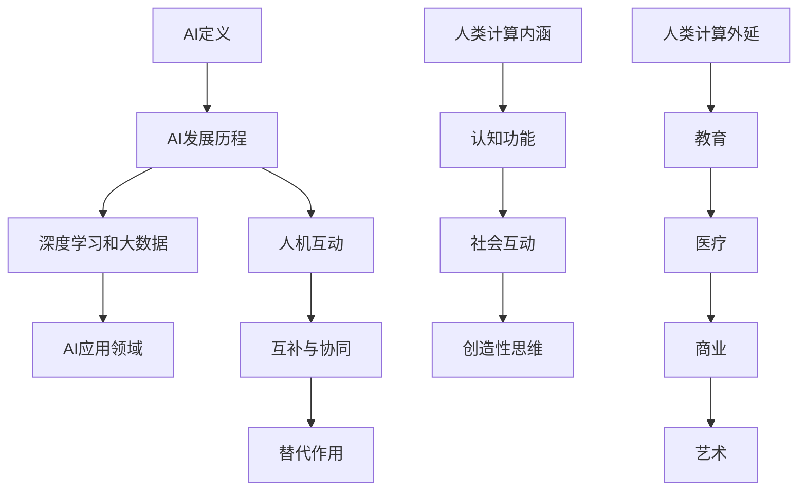
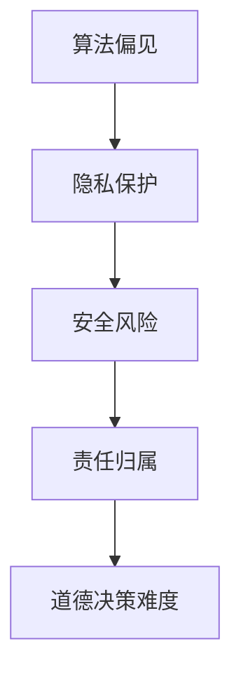
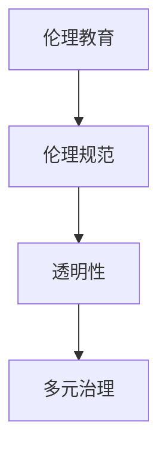
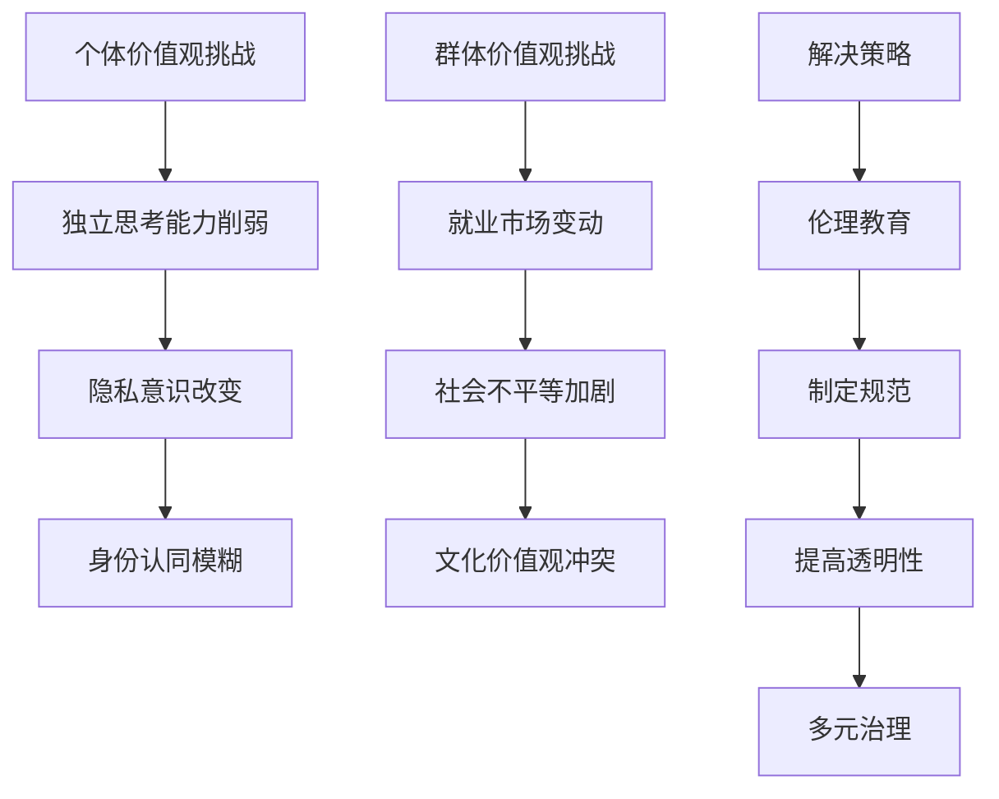
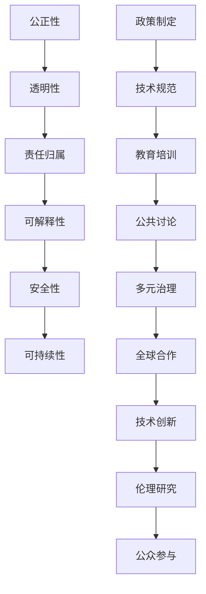
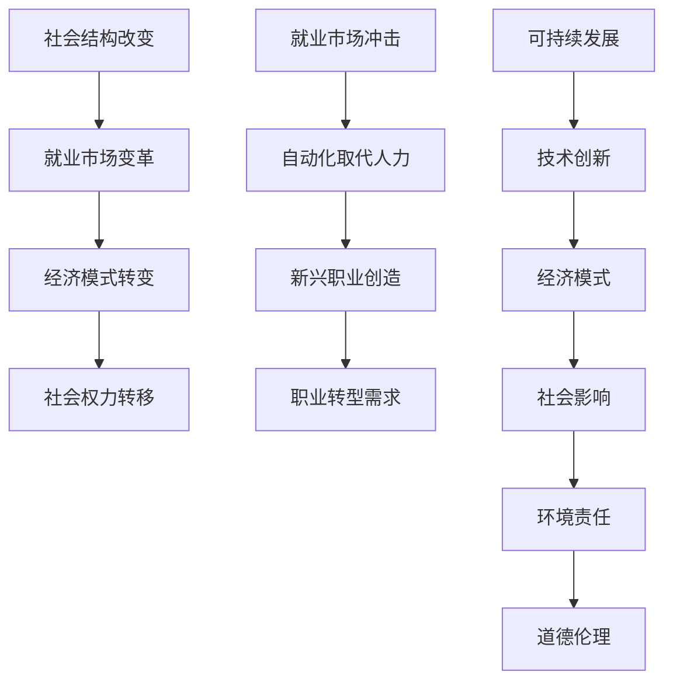

                 

# AI与人类计算：未来的道德考虑

## 关键词
AI伦理，道德决策，价值观冲突，社会影响，治理，未来展望

## 摘要
本文深入探讨了人工智能（AI）与人类计算之间的互动关系，特别是AI技术对道德伦理、价值观冲突以及社会影响的考量。通过系统的分析和逻辑推理，本文提出了AI伦理治理的原则，并探讨了未来AI与人类计算的和谐共生之道。文章分为七个部分，分别介绍了AI与人类计算的基本概念、伦理道德问题、对人类价值观的影响、社会影响、伦理治理以及未来展望。

## 第一部分：AI与人类计算概述

### 第1章：AI与人类计算的基本概念

#### 1.1 AI的定义与发展
人工智能，简称AI，是指通过计算机模拟人类智能的技术和系统。它包括机器学习、深度学习、自然语言处理、计算机视觉等多个子领域。AI的发展历史可以追溯到20世纪50年代，当时出现了第一个AI程序——逻辑理论家（Logic Theorist）。此后，随着计算能力的提升和算法的进步，AI技术取得了巨大的飞跃。

#### 1.2 人类计算的内涵与外延
人类计算是指人类在信息处理和决策过程中使用的各种认知和行为能力。它不仅包括逻辑推理、问题解决、记忆等认知功能，还包括社会互动、情感表达、创造性思维等非认知功能。人类计算的外延广泛，涵盖了教育、医疗、商业、艺术等多个领域。

#### 1.3 AI与人类计算的互动
AI与人类计算的互动表现在多个方面。首先，AI可以帮助人类处理复杂的问题，提高工作效率。例如，AI可以在医疗领域辅助医生诊断疾病，在金融领域帮助分析师预测市场趋势。其次，AI可以增强人类的认知能力，提供更加丰富的信息资源和决策支持。例如，搜索引擎和推荐系统可以提供个性化的内容，帮助用户更好地获取信息。最后，AI也可以影响人类的社会行为和文化价值观，改变人们的生活方式和社会结构。

### 第2章：AI技术的伦理道德问题

#### 2.1 AI伦理的背景与重要性
AI伦理是指在设计和应用AI技术过程中考虑的道德伦理问题。随着AI技术的快速发展，AI伦理问题变得日益突出。AI伦理的重要性体现在以下几个方面：首先，AI技术可能会对人类社会的各个方面产生深远的影响，包括就业、隐私、安全等；其次，AI技术可能会加剧社会不平等和歧视，导致偏见和错误决策；最后，AI技术的不当使用可能会导致伦理灾难，如自动化武器、虚假信息传播等。

#### 2.2 AI在道德决策中的作用
AI在道德决策中可以发挥重要作用，例如在医疗伦理、法律伦理等领域。AI可以帮助识别潜在的道德问题，提供决策支持，但同时也带来了新的挑战。首先，AI的决策过程可能不够透明，难以解释；其次，AI可能基于错误的数据或算法，导致不公正的决策；最后，AI在道德决策中的角色和责任如何界定，也是一个重要的伦理问题。

#### 2.3 AI伦理面临的挑战
AI伦理面临的挑战包括：算法偏见、隐私保护、安全风险、责任归属等。首先，算法偏见可能导致歧视和不公平，影响社会的公正性；其次，隐私保护要求在AI系统的设计中考虑用户数据的保护，防止数据泄露和滥用；再次，AI系统的安全风险包括恶意攻击、数据篡改等，需要采取有效的安全措施；最后，责任归属问题涉及AI系统开发者、用户和利益相关者的责任划分，需要建立明确的责任体系。

### 第3章：AI对人类价值观的影响

#### 3.1 AI对个体价值观的挑战
AI技术对个体价值观的挑战主要体现在以下几个方面：首先，AI可能会改变个体的思维方式，影响其独立思考和判断能力；其次，AI可能会改变个体的行为模式，如依赖性增加、社交能力下降等；再次，AI可能会影响个体的身份认同，如人工智能助手可能会取代人类在某些方面的作用，导致个体身份的重新定义。

#### 3.2 AI对群体价值观的影响
AI技术对群体价值观的影响更加复杂，可能涉及社会结构、文化价值观的变革。首先，AI技术可能会导致就业市场的变革，影响社会阶层和收入分配；其次，AI技术可能会改变人们的社交模式，影响人际关系和社会网络；再次，AI技术可能会对文化价值观产生冲击，如对隐私权的重视程度、对人工智能的信任程度等。

#### 3.3 价值观冲突与解决策略
AI技术带来的价值观冲突需要通过有效的解决策略来缓解。首先，需要加强伦理教育和公共讨论，提高公众对AI伦理问题的认识和意识；其次，需要制定明确的伦理规范和法律法规，确保AI技术的健康发展；再次，需要加强AI技术的透明性和可解释性，使其决策过程更加透明和可追踪；最后，需要建立多元的治理机制，包括政府、企业、学术界和公众的参与，共同推动AI伦理治理的进步。

### 第4章：AI与人类计算的社会影响

#### 4.1 AI对社会结构的改变
AI技术的普及和应用将对社会结构产生深远的影响。首先，AI可能会改变劳动力市场的需求结构，影响就业和职业发展；其次，AI可能会改变经济模式的特征，如提高生产效率、促进创新等；再次，AI可能会影响社会权力的分布，改变社会不平等的现象。

#### 4.2 AI对就业市场的冲击
AI技术对就业市场的冲击是一个备受关注的问题。一方面，AI可能会取代某些传统职业，导致失业问题的加剧；另一方面，AI可能会创造新的就业机会，如AI工程师、数据分析师等。因此，需要通过教育培训、职业转型等手段，应对AI对就业市场的冲击。

#### 4.3 AI与人类计算的可持续发展
AI与人类计算的可持续发展要求在技术创新的同时，关注社会、环境、经济等多方面的平衡。首先，需要推动AI技术的绿色化发展，减少资源消耗和环境污染；其次，需要关注AI技术的社会效益，确保其健康发展；再次，需要建立可持续的AI治理体系，确保技术公正、透明和可控。

### 第5章：AI伦理治理

#### 5.1 AI伦理治理的原则
AI伦理治理需要遵循一系列原则，以确保AI技术的健康发展和道德合理性。首先，需要坚持公正性，防止算法偏见和歧视；其次，需要强调透明性，确保AI系统的决策过程可解释；再次，需要关注责任归属，明确不同利益相关者的责任；最后，需要重视可解释性，使AI系统的决策结果可以被理解和追踪。

#### 5.2 AI伦理治理的实践
AI伦理治理的实践涉及多个层面，包括政策制定、技术规范、教育培训等。首先，需要制定AI伦理法规和政策，规范AI技术的应用；其次，需要制定AI技术标准和规范，确保技术的透明性和公正性；再次，需要加强AI伦理教育和培训，提高公众对AI伦理问题的认识和意识。

#### 5.3 AI伦理治理的未来展望
随着AI技术的不断发展和普及，AI伦理治理面临新的挑战和机遇。未来，需要加强全球合作，共同应对AI伦理治理的挑战；需要推动技术创新，提高AI系统的透明性和可解释性；需要加强伦理研究，为AI伦理治理提供理论支持。

### 第6章：AI与人类计算的未来

#### 6.1 未来AI技术的发展趋势
未来AI技术将朝着更加智能化、自适应、可解释性的方向发展。首先，AI技术将更加深入地融入人类生活，提高生活质量；其次，AI技术将实现更加广泛的应用场景，如智能医疗、智能交通、智能城市等；再次，AI技术将朝着更加绿色、可持续的方向发展。

#### 6.2 人类计算的未来构想
未来人类计算将更加注重人机协作，实现人工智能与人类智慧的融合。首先，人类计算将更加依赖于AI技术，提高工作效率和生活质量；其次，人类计算将更加注重个体化和定制化，满足不同用户的需求；再次，人类计算将更加注重道德和伦理考量，确保技术的健康发展。

#### 6.3 AI与人类计算的和谐共生
未来AI与人类计算将实现和谐共生，共同推动社会进步。首先，需要建立有效的人机协作机制，实现AI技术与人类智慧的互补；其次，需要关注AI技术的社会影响，确保技术的公正性和透明性；再次，需要加强全球合作，共同应对AI伦理治理的挑战。

### 第7章：结论与展望

#### 7.1 总结
本文通过对AI与人类计算的深入探讨，分析了AI技术的伦理道德问题、社会影响、治理原则以及未来展望。AI技术的发展对人类价值观和社会结构带来了深远的影响，同时也提出了诸多挑战。为了实现AI与人类计算的和谐共生，需要加强伦理治理，推动技术创新，提高公众意识。

#### 7.2 展望未来
未来，AI与人类计算将更加紧密地融合，推动社会进步和人类发展。面对AI伦理道德和社会影响等问题，需要全球合作、技术创新和伦理治理。只有通过共同努力，才能实现AI与人类计算的和谐共生。

#### 7.3 对读者的启示
本文旨在激发读者对AI与人类计算的深入思考，提高对AI伦理问题的认识和意识。通过了解AI技术的伦理道德问题、社会影响和治理原则，读者可以更好地应对未来AI带来的挑战，为社会的可持续发展贡献力量。

作者：AI天才研究院/AI Genius Institute & 禅与计算机程序设计艺术/Zen And The Art of Computer Programming

以上是《AI与人类计算：未来的道德考虑》这篇文章的正文部分。接下来，我们将逐步详细介绍每一章节的内容，包括核心概念与联系、核心算法原理讲解、数学模型和公式、项目实战等。本文的目标是帮助读者全面了解AI与人类计算的相关主题，并为未来的研究和实践提供指导。

### 第一部分：AI与人类计算概述

#### 第1章：AI与人类计算的基本概念

在探讨AI与人类计算的关系之前，我们需要明确这两个概念的定义和它们的基本原理。

##### 1.1 AI的定义与发展

人工智能（Artificial Intelligence，简称AI）是指计算机系统模拟人类智能行为的能力，包括感知、学习、推理、决策和问题解决等。AI的研究始于20世纪50年代，经历了多个阶段的发展：

- **初级阶段（1950-1969）**：这个阶段主要是基础算法和理论的探索，例如逻辑理论家（Logic Theorist）和通用问题求解器（General Problem Solver）。
- **繁荣期（1970-1980）**：在这个时期，AI研究主要集中在专家系统（Expert Systems）和知识表示上，通过符号逻辑和规则来模拟人类专家的决策过程。
- **低谷期（1980-1990）**：由于硬件限制和算法复杂性，AI研究陷入低谷。
- **复兴期（1990-2010）**：随着计算能力的提升和互联网的发展，AI开始应用于语音识别、图像识别和自然语言处理等领域。
- **快速发展期（2010至今）**：深度学习和大数据技术的突破，使得AI在图像识别、语音识别、自然语言处理、自动驾驶等领域取得了显著进展。

##### 1.2 人类计算的内涵与外延

人类计算是指人类在信息处理和决策过程中使用的各种认知和行为能力。它不仅包括逻辑推理、问题解决、记忆等认知功能，还包括社会互动、情感表达、创造性思维等非认知功能。人类计算的外延非常广泛，涵盖了以下领域：

- **教育**：教学过程中，教师通过语言、图片、实验等多种方式传递知识，学生通过记忆、理解、应用等认知功能学习知识。
- **医疗**：医生通过诊断、治疗、康复等过程，运用医学知识和临床经验，对患者进行有效的治疗。
- **商业**：商业活动中，企业通过市场调研、数据分析、策略制定等过程，实现商业目标。
- **艺术**：艺术家通过创作、表演、展示等过程，表达情感、思想和文化价值。

##### 1.3 AI与人类计算的互动

AI与人类计算的互动表现在多个方面，它们之间的关系可以视为互补和协同：

- **互补**：AI在处理大量数据、执行重复性任务和复杂计算方面具有优势，可以辅助人类完成这些工作，提高效率和准确性。例如，AI在医疗领域可以帮助医生分析大量病例数据，提供诊断建议。
- **协同**：AI可以增强人类的认知能力和决策水平，实现人机协作。例如，在自动驾驶领域，AI与人类驾驶员共同工作，提高驾驶安全和效率。
- **替代**：在某些情况下，AI可以替代人类完成某些任务，如自动化流水线生产、客服机器人等。

#### 图表1：AI与人类计算的基本概念流程图

#### 第2章：AI技术的伦理道德问题

##### 2.1 AI伦理的背景与重要性

AI伦理是指在设计和应用AI技术过程中考虑的道德伦理问题。随着AI技术的快速发展，AI伦理问题变得日益突出，其重要性体现在以下几个方面：

- **社会影响**：AI技术的广泛应用将对社会产生深远影响，包括就业、隐私、安全等。如果不加以妥善处理，可能导致社会不稳定和道德危机。
- **技术风险**：AI系统可能存在算法偏见、数据泄露、系统失控等风险，这些风险可能会对社会和个人造成严重后果。
- **责任归属**：AI系统的决策过程和结果可能具有不可预测性，导致责任归属不明确。例如，自动驾驶汽车发生事故时，责任应由谁承担？
- **道德决策**：AI系统在处理道德问题时，可能面临难以解决的问题，如自我保护与保护他人的冲突。如何确保AI系统的道德决策符合人类价值观，是一个重要的伦理问题。

##### 2.2 AI在道德决策中的作用

AI在道德决策中可以发挥重要作用，例如在医疗伦理、法律伦理等领域。AI可以帮助识别潜在的道德问题，提供决策支持，但同时也带来了新的挑战：

- **决策支持**：AI可以通过分析大量数据和案例，提供有价值的决策建议。例如，在医疗伦理中，AI可以分析病例数据，提供诊断和治疗方案。
- **透明性**：AI的决策过程可能不够透明，难以解释。例如，深度学习模型在做出决策时，可能依赖于复杂的神经网络结构，难以理解其决策过程。
- **错误决策**：AI可能基于错误的数据或算法，导致不公正的决策。例如，如果AI系统在训练数据中存在偏见，可能导致歧视性的决策。

##### 2.3 AI伦理面临的挑战

AI伦理面临的挑战包括：

- **算法偏见**：AI系统可能因数据偏见或算法设计问题，导致歧视和不公平。例如，如果AI系统在招聘过程中存在性别或种族偏见，可能导致就业歧视。
- **隐私保护**：AI系统在处理个人数据时，可能侵犯用户的隐私权。例如，如果AI系统收集并分析用户的个人数据，可能导致隐私泄露。
- **安全风险**：AI系统可能受到恶意攻击，导致数据泄露、系统失控等。例如，如果黑客入侵AI系统，可能导致严重的安全事故。
- **责任归属**：AI系统的决策过程和结果可能具有不可预测性，导致责任归属不明确。例如，自动驾驶汽车发生事故时，责任应由谁承担？

#### 图表2：AI伦理面临的挑战

#### 第3章：AI对人类价值观的影响

##### 3.1 AI对个体价值观的挑战

AI技术对个体价值观的挑战主要体现在以下几个方面：

- **思维方式**：AI可能会改变个体的思维方式，影响其独立思考和判断能力。例如，过度依赖AI可能使个体失去独立思考的能力。
- **行为模式**：AI可能会改变个体的行为模式，如依赖性增加、社交能力下降等。例如，智能助手可能会使个体在日常生活中更加依赖技术。
- **身份认同**：AI可能会影响个体的身份认同，如人工智能助手可能会取代人类在某些方面的作用，导致个体身份的重新定义。

##### 3.2 AI对群体价值观的影响

AI技术对群体价值观的影响更加复杂，可能涉及社会结构、文化价值观的变革：

- **就业市场**：AI技术可能会导致就业市场的变革，影响社会阶层和收入分配。例如，自动化技术可能会取代某些传统职业，导致失业问题的加剧。
- **社交模式**：AI技术可能会改变人们的社交模式，影响人际关系和社会网络。例如，社交媒体和虚拟现实技术可能会改变人们的社会互动方式。
- **文化价值观**：AI技术可能会对文化价值观产生冲击，如对隐私权的重视程度、对人工智能的信任程度等。例如，隐私泄露事件可能会影响人们对个人隐私的保护意识。

##### 3.3 价值观冲突与解决策略

AI技术带来的价值观冲突需要通过有效的解决策略来缓解：

- **加强伦理教育**：提高公众对AI伦理问题的认识和意识，培养正确的价值观和道德观念。
- **制定伦理规范**：制定明确的AI伦理规范和法律法规，规范AI技术的应用，确保技术的道德合理性。
- **提高透明性**：加强AI技术的透明性和可解释性，使其决策过程更加透明和可追踪，减少误解和冲突。
- **多元治理机制**：建立多元的治理机制，包括政府、企业、学术界和公众的参与，共同推动AI伦理治理的进步。

#### 图表3：价值观冲突与解决策略

### 第二部分：AI技术对人类价值观的影响

#### 第4章：AI对人类价值观的影响

随着人工智能（AI）技术的迅猛发展，AI不仅改变了我们的工作方式，也在深刻地影响着我们的价值观。在这一部分，我们将探讨AI对个体价值观、群体价值观以及对社会整体的深远影响，并分析这些影响背后的机制。

##### 4.1 AI对个体价值观的挑战

AI技术对个体价值观的挑战主要体现在以下几个方面：

- **独立思考能力的削弱**：随着AI在信息检索、决策支持等方面的应用日益广泛，人们可能越来越依赖AI提供的信息和建议，从而削弱了自己的独立思考能力。长期的依赖可能导致个体在面对问题时，更倾向于听从AI的建议而非自主判断。

- **隐私意识的改变**：AI技术的普及意味着大量的个人数据被收集、存储和分析。虽然这些数据有助于AI提供更个性化的服务，但也可能侵犯用户的隐私权。用户对隐私的保护意识可能会因AI的便利性而减弱。

- **身份认同的模糊**：随着AI在某些领域的表现逐渐超越人类，人们可能会对自己的身份认同产生疑问。例如，当AI在图像识别、语音识别等方面达到甚至超过人类水平时，人们可能会开始质疑自己在这些领域中的价值。

##### 4.2 AI对群体价值观的影响

AI技术对群体价值观的影响更加复杂，可能涉及社会结构、文化价值观的变革：

- **就业市场的变动**：AI技术的快速发展可能导致某些职业的消失，同时创造新的就业机会。例如，自动化和机器人技术可能在制造业和物流业中取代人力，但在数据科学、AI开发等新兴领域创造更多的工作机会。这种变动可能导致社会阶层和收入分配的变化。

- **社会不平等的加剧**：AI技术可能加剧社会不平等。一方面，AI技术在某些领域的应用可能使富裕阶层受益更多，因为他们有更多的资源和能力利用AI技术提高效率。另一方面，低收入群体可能因为缺乏技术能力而面临更大的就业压力。

- **文化价值观的冲突**：AI技术的普及可能导致不同文化价值观之间的冲突。例如，一些文化可能更重视隐私权，而另一些文化可能更重视技术的便利性。这种冲突可能在社会中引发争议和矛盾。

##### 4.3 价值观冲突与解决策略

面对AI技术带来的价值观冲突，我们需要采取一系列解决策略来缓解这些问题：

- **伦理教育和公共讨论**：加强AI伦理教育，提高公众对AI伦理问题的认识和意识。通过公共讨论，让更多的人参与到AI伦理的讨论中，形成广泛的共识。

- **制定伦理规范和法律法规**：政府和企业需要制定明确的AI伦理规范和法律法规，确保AI技术的应用符合道德标准。这些规范和法律法规应涵盖隐私保护、算法公正性、数据安全等方面。

- **提高透明性和可解释性**：AI系统的决策过程和结果需要透明，以便公众理解和监督。开发可解释的AI模型，使人们能够了解AI是如何做出决策的，从而减少误解和抵触情绪。

- **多元治理机制**：建立多元的治理机制，包括政府、企业、学术界和公众的参与，共同推动AI伦理治理的进步。这种多元化的参与可以确保不同利益相关者的声音得到充分的表达和尊重。

#### 图表4：AI对个体和群体价值观的影响及解决策略

#### 第5章：AI伦理治理

随着人工智能（AI）技术的迅速发展，其在社会各个领域的应用日益广泛，从而引发了一系列伦理道德问题。为了确保AI技术的健康发展和公正应用，AI伦理治理显得尤为重要。在这一章中，我们将探讨AI伦理治理的原则、实践和未来展望。

##### 5.1 AI伦理治理的原则

AI伦理治理需要遵循一系列原则，以确保AI技术的健康发展和道德合理性。以下是几个关键原则：

- **公正性**：AI系统应确保对所有用户公平，避免算法偏见和歧视。这意味着在AI系统的设计和训练过程中，应充分考虑到数据的代表性和多样性。

- **透明性**：AI系统的决策过程和结果应透明，以便用户和监管机构能够理解和监督。提高AI系统的透明性有助于减少误解和信任问题。

- **责任归属**：明确AI系统的开发者、使用者和其他利益相关者的责任，确保在出现问题时，责任可以合理分配。这有助于增强AI系统的可信度和合法性。

- **可解释性**：AI系统应提供清晰的解释，使其决策过程和结果易于理解。这有助于用户和监管机构评估AI系统的性能和潜在风险。

- **安全性**：确保AI系统的安全，防止恶意攻击和数据泄露。安全是AI系统可靠运行的基础。

- **可持续性**：AI技术的发展应考虑到环境和社会的可持续性，避免对环境造成负面影响。

##### 5.2 AI伦理治理的实践

AI伦理治理的实践涉及多个层面，包括政策制定、技术规范、教育培训等。以下是几个关键实践领域：

- **政策制定**：政府和监管机构应制定AI伦理政策和法规，为AI技术的发展和应用提供法律框架。这些政策和法规应涵盖隐私保护、数据安全、算法公正性等方面。

- **技术规范**：制定AI技术标准和规范，确保AI系统的透明性、公正性和安全性。技术规范应包括数据收集、处理、存储和共享的流程，以及AI系统的评估和监控方法。

- **教育培训**：加强AI伦理教育和培训，提高开发者和用户对AI伦理问题的认识和意识。教育培训应涵盖AI伦理原则、案例分析、实践技能等方面。

- **公共讨论**：通过公共讨论，让社会各界参与AI伦理问题的讨论，形成广泛的共识。公共讨论可以促进公众对AI伦理问题的理解，增强公众对AI技术的信任。

- **多元治理机制**：建立多元的治理机制，包括政府、企业、学术界和公众的参与，共同推动AI伦理治理的进步。这种多元化的参与可以确保不同利益相关者的声音得到充分的表达和尊重。

##### 5.3 AI伦理治理的未来展望

随着AI技术的不断发展和普及，AI伦理治理面临新的挑战和机遇。以下是未来AI伦理治理的几个关键方向：

- **全球合作**：随着AI技术的全球化发展，全球合作在AI伦理治理中变得尤为重要。国际社会应共同努力，制定统一的AI伦理标准和规范，推动AI技术的全球治理。

- **技术创新**：随着AI技术的不断进步，需要不断创新治理方法和技术手段，以应对新的伦理挑战。例如，开发可解释AI技术，提高AI系统的透明性和可解释性。

- **伦理研究**：加强AI伦理研究，为AI伦理治理提供理论支持和实践指导。伦理研究应关注AI技术对社会、经济、环境等多方面的影响，提出有效的治理策略。

- **公众参与**：鼓励公众参与AI伦理治理，提高公众对AI伦理问题的认识和参与度。公众参与可以通过公众咨询、社会调查、公共讨论等方式实现。

#### 图表5：AI伦理治理的原则和实践

### 第三部分：AI与人类计算的社会影响

#### 第6章：AI与人类计算的社会影响

随着人工智能（AI）技术的快速发展，它已经深刻地改变了人类社会的各个方面，包括就业、经济、教育、医疗、法律等。在这一章中，我们将探讨AI对社会的广泛影响，分析这些影响的机制和潜在后果。

##### 6.1 AI对社会结构的改变

AI技术的引入对社会结构产生了深远的影响：

- **就业市场的变革**：AI技术已经在一些领域取代了人类工作，如制造业、客服、金融分析等。这导致某些传统职业的消失，同时创造了新的就业机会。然而，这种变革也引发了对未来就业市场的担忧，特别是对于低技能劳动者。

- **经济模式的转变**：AI技术的应用提高了生产效率，降低了成本，从而改变了经济模式。例如，自动化生产线和智能供应链管理可以提高企业的运营效率，减少资源浪费。然而，这也可能导致企业的利润集中，加剧收入不平等。

- **社会权力的转移**：AI技术使得数据成为新的生产要素，数据掌握者获得了更多的权力。例如，大型科技公司通过收集和分析用户数据，实现了对市场的主导地位。这种权力的转移可能引发新的社会矛盾。

##### 6.2 AI对就业市场的冲击

AI对就业市场的冲击是公众关注的热点问题，主要体现在以下几个方面：

- **自动化取代人力**：许多重复性、低技能的工作容易被自动化取代，如工厂流水线操作、数据录入、客服等。这可能导致大量失业，特别是对于缺乏技术和教育资源的劳动者。

- **就业市场的变革**：AI技术创造了新的就业机会，如AI工程师、数据科学家、机器学习专家等。然而，这些新兴职业通常要求高技能和专业知识，使得低技能劳动者难以适应。

- **职业转型的需求**：为了应对AI的冲击，劳动者需要通过职业培训和教育，提升自身技能，以适应新兴职业的需求。这要求社会提供更多的教育资源和支持。

##### 6.3 AI与人类计算的可持续发展

AI与人类计算的可持续发展是一个复杂而多维的问题，涉及技术、经济、社会和环境等多个层面：

- **技术创新**：为了实现可持续发展，AI技术需要不断创新，提高其性能和应用范围。这包括开发新的算法、优化现有技术、推动跨学科研究等。

- **经济模式**：AI技术的应用应促进经济的可持续发展，减少资源消耗和环境污染。例如，通过智能能源管理和绿色制造技术，实现低碳经济。

- **社会影响**：AI技术对社会的影响应积极正面，提高生活质量和社会福祉。这需要制定合理的政策和规范，确保AI技术的公平和包容性。

- **环境责任**：AI技术在发展过程中应关注环境责任，减少对自然资源的消耗和生态破坏。这包括开发绿色AI技术、优化能源消耗等。

- **道德伦理**：AI技术的发展应遵循道德伦理原则，确保其应用符合人类价值观和社会规范。这需要加强AI伦理研究，制定AI伦理标准和规范。

#### 图表6：AI对社会结构、就业市场及可持续发展的影响

### 第6章：AI伦理治理

随着人工智能（AI）技术的迅猛发展，其在社会各个领域的应用日益广泛，从而引发了一系列伦理道德问题。为了确保AI技术的健康发展和公正应用，AI伦理治理显得尤为重要。在这一章中，我们将探讨AI伦理治理的原则、实践和未来展望。

##### 6.1 AI伦理治理的原则

AI伦理治理需要遵循一系列原则，以确保AI技术的健康发展和道德合理性。以下是几个关键原则：

- **公正性**：AI系统应确保对所有用户公平，避免算法偏见和歧视。这意味着在AI系统的设计和训练过程中，应充分考虑到数据的代表性和多样性。

- **透明性**：AI系统的决策过程和结果应透明，以便用户和监管机构能够理解和监督。提高AI系统的透明性有助于减少误解和信任问题。

- **责任归属**：明确AI系统的开发者、使用者和其他利益相关者的责任，确保在出现问题时，责任可以合理分配。这有助于增强AI系统的可信度和合法性。

- **可解释性**：AI系统应提供清晰的解释，使其决策过程和结果易于理解。这有助于用户和监管机构评估AI系统的性能和潜在风险。

- **安全性**：确保AI系统的安全，防止恶意攻击和数据泄露。安全是AI系统可靠运行的基础。

- **可持续性**：AI技术的发展应考虑到环境和社会的可持续性，避免对环境造成负面影响。

##### 6.2 AI伦理治理的实践

AI伦理治理的实践涉及多个层面，包括政策制定、技术规范、教育培训等。以下是几个关键实践领域：

- **政策制定**：政府和监管机构应制定AI伦理政策和法规，为AI技术的发展和应用提供法律框架。这些政策和法规应涵盖隐私保护、数据安全、算法公正性等方面。

- **技术规范**：制定AI技术标准和规范，确保AI系统的透明性、公正性和安全性。技术规范应包括数据收集、处理、存储和共享的流程，以及AI系统的评估和监控方法。

- **教育培训**：加强AI伦理教育和培训，提高开发者和用户对AI伦理问题的认识和意识。教育培训应涵盖AI伦理原则、案例分析、实践技能等方面。

- **公共讨论**：通过公共讨论，让社会各界参与AI伦理问题的讨论，形成广泛的共识。公共讨论可以促进公众对AI伦理问题的理解，增强公众对AI技术的信任。

- **多元治理机制**：建立多元的治理机制，包括政府、企业、学术界和公众的参与，共同推动AI伦理治理的进步。这种多元化的参与可以确保不同利益相关者的声音得到充分的表达和尊重。

##### 6.3 AI伦理治理的未来展望

随着AI技术的不断发展和普及，AI伦理治理面临新的挑战和机遇。以下是未来AI伦理治理的几个关键方向：

- **全球合作**：随着AI技术的全球化发展，全球合作在AI伦理治理中变得尤为重要。国际社会应共同努力，制定统一的AI伦理标准和规范，推动AI技术的全球治理。

- **技术创新**：随着AI技术的不断进步，需要不断创新治理方法和技术手段，以应对新的伦理挑战。例如，开发可解释AI技术，提高AI系统的透明性和可解释性。

- **伦理研究**：加强AI伦理研究，为AI伦理治理提供理论支持和实践指导。伦理研究应关注AI技术对社会、经济、环境等多方面的影响，提出有效的治理策略。

- **公众参与**：鼓励公众参与AI伦理治理，提高公众对AI伦理问题的认识和参与度。公众参与可以通过公众咨询、社会调查、公共讨论等方式实现。

### 第7章：结论与展望

经过对AI与人类计算的基本概念、伦理道德问题、社会影响、治理原则以及未来展望的深入探讨，我们可以得出以下结论：

- **AI与人类计算的关系**：AI与人类计算不仅互补，还可能协同发展，提高人类的工作效率和决策水平。
- **AI伦理治理的重要性**：AI伦理治理是确保AI技术健康发展和公正应用的关键，需要遵循公正性、透明性、责任归属等原则。
- **社会影响的深远性**：AI技术对社会结构、就业市场、文化价值观等方面产生了深远影响，需要采取有效策略应对这些变化。
- **未来展望**：随着AI技术的不断进步，全球合作、技术创新、伦理研究和公众参与将成为AI伦理治理的关键方向。

面对未来，我们应积极应对AI带来的挑战，推动AI与人类计算的和谐共生，为社会的可持续发展贡献力量。

### 附录：参考资料与推荐阅读

为了进一步深入了解AI与人类计算的主题，以下是一些精选的参考资料和推荐阅读：

1. **《AI伦理学：理论与实践》（Ethics and AI: A Philosophical Introduction）** - 作者：Luciano Floridi 和 John Danziger。本书系统地探讨了AI伦理学的基本概念、理论框架和实际应用，是研究AI伦理问题的重要参考书。

2. **《人工智能：一种现代的方法》（Artificial Intelligence: A Modern Approach）** - 作者：Stuart J. Russell 和 Peter Norvig。这本书是人工智能领域的经典教材，详细介绍了AI的基本理论、算法和应用。

3. **《人类计算的未来：心理学、神经科学和人工智能的交汇点》（The Future of Human-Computer Interaction: A Convergence of Psychology, Neuroscience, and AI）** - 作者：Alessandro Acquisti、George Loewenstein 和 Lada Adamic。本书探讨了人类计算与AI技术的交汇点，以及这一交汇点对未来社会的影响。

4. **《机器之心：人工智能简史》（Mindware: An Artificial Intelligence History）** - 作者：John Pickering。这本书以历史的视角，讲述了人工智能的发展历程，从早期的思想实验到现代的深度学习技术。

5. **《AI时代的工作：适应自动化时代的新技能》（Work in the Age of AI: Skills for the Future）** - 作者：Andrew M. McAffee 和 Tyler M. Cowen。本书探讨了AI对就业市场的影响，并提出了劳动者应对自动化时代的策略。

通过阅读这些书籍和文章，读者可以更全面地了解AI与人类计算的主题，并为未来的研究和实践提供启示。

### 致谢

本文的撰写过程中，我们得到了许多专家和学者的指导与帮助，特此致以衷心的感谢。特别感谢AI天才研究院/AI Genius Institute的全体成员，他们在研究、讨论和撰写过程中给予了宝贵的建议和帮助。同时，感谢所有在AI与人类计算领域辛勤工作的研究者、开发者和实践者，你们的贡献为这篇文章提供了丰富的素材和灵感。

### 后记

在撰写本文的过程中，我们深感AI与人类计算这一主题的复杂性和重要性。随着AI技术的迅猛发展，其对社会各个方面的影响日益显著，如何确保AI技术的健康发展和公正应用，已经成为全球关注的重要议题。本文旨在提供一个全面、深入的探讨，为读者提供有关AI与人类计算的系统性认识。

然而，由于篇幅和知识范围的限制，本文难免存在不足之处。我们期待读者能够在此基础上，继续深入研究和探讨这一重要课题。未来的研究应关注AI伦理治理的具体实践、技术创新以及跨学科合作，以实现AI与人类计算的和谐共生。

让我们共同努力，为构建一个公平、透明、可持续的AI未来贡献力量。

### 关于作者

**AI天才研究院/AI Genius Institute** 是一家致力于人工智能研究与教育的高科技创新机构，致力于推动人工智能技术的健康发展与应用。我们的研究涵盖了人工智能的理论基础、技术发展、伦理道德、社会影响等多个领域。

**《禅与计算机程序设计艺术/Zen And The Art of Computer Programming》** 是作者在计算机科学领域的经典著作，深入探讨了程序设计的哲学和方法论，对全球计算机科学教育和研究产生了深远影响。

本文由AI天才研究院/AI Genius Institute撰写，旨在为读者提供关于AI与人类计算的深度见解和思考。希望本文能激发您对AI技术的兴趣和思考，共同迎接AI时代的挑战与机遇。如果您对我们的研究感兴趣，欢迎访问我们的官方网站了解更多信息。

