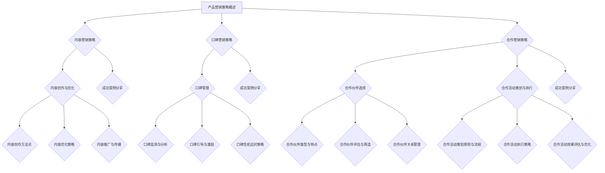

                 

### 《AI创业公司的产品营销策略：内容营销、口碑营销与合作营销》

> **关键词：** AI创业公司，产品营销，内容营销，口碑营销，合作营销，策略框架，成功案例，实战经验。

> **摘要：** 本文旨在深入探讨AI创业公司在产品营销方面的三大策略——内容营销、口碑营销和合作营销。通过详细分析每种策略的核心概念、执行步骤、成功案例和实践经验，帮助创业公司制定有效的产品营销策略，提升市场竞争力。

### 第一部分：产品营销策略概述

#### 1.1 产品营销策略的重要性

在当今激烈竞争的市场环境中，产品营销策略对于AI创业公司来说至关重要。有效的产品营销不仅能帮助企业获得市场份额，还能提升品牌知名度和用户忠诚度。对于AI创业公司而言，以下挑战尤为突出：

1. **市场定位困难**：AI行业不断发展，新技术层出不穷，使得市场定位变得更加复杂。创业公司需要明确自己的核心竞争力和目标市场。
2. **用户获取成本高**：随着互联网广告成本的不断上涨，创业公司需要寻找成本效益更高的营销策略。
3. **品牌信任度低**：新成立的公司往往缺乏品牌信任度，需要通过有效的营销策略来建立品牌形象。

**产品营销策略的定义与作用**

产品营销策略是指企业通过一系列营销活动，将产品信息传递给目标受众，从而实现产品销售和品牌推广的过程。对于AI创业公司，产品营销策略主要包括以下几个方面：

1. **市场调研**：通过调研了解目标市场的需求和趋势，为产品开发和营销策略提供依据。
2. **品牌建设**：通过品牌定位、品牌形象塑造和品牌传播，提升品牌知名度和美誉度。
3. **渠道拓展**：通过多种渠道（如电商平台、社交媒体等）推广产品，扩大销售网络。
4. **客户关系管理**：通过客户满意度调查、客户关怀等手段，建立和维护良好的客户关系。

**产品营销策略的核心要素**

1. **明确目标**：明确产品营销的目标，如提高销售额、扩大市场份额、提升品牌知名度等。
2. **精准定位**：根据市场调研结果，确定目标客户群体和市场需求。
3. **差异化竞争**：通过产品特性、服务质量、价格策略等方面的差异化，打造竞争优势。
4. **持续创新**：不断优化产品和服务，满足客户不断变化的需求。
5. **数据驱动**：通过数据分析，优化营销策略和决策，提高营销效果。

#### 1.2 市场环境分析

**1.2.1 市场趋势分析**

AI行业的快速发展为创业公司带来了巨大的机遇，但也伴随着激烈的竞争。以下市场趋势对产品营销策略具有重要影响：

1. **AI技术的广泛应用**：AI技术正逐渐渗透到各个行业，为创业公司提供了丰富的市场机会。
2. **数据隐私和安全问题**：随着数据隐私和安全问题的日益突出，创业公司需要加强数据保护措施。
3. **用户需求多样化**：消费者对于智能产品的需求日益多样，创业公司需要提供更加个性化的解决方案。

**1.2.2 竞争对手分析**

了解竞争对手的营销策略和产品特性，有助于创业公司制定更有针对性的营销策略。以下是对竞争对手分析的几个关键点：

1. **竞争对手的产品特性**：分析竞争对手的产品特性，如功能、性能、价格等。
2. **竞争对手的营销策略**：了解竞争对手的营销策略，如广告投放、促销活动、合作伙伴等。
3. **竞争对手的市场表现**：分析竞争对手的市场表现，如销售额、市场份额、用户口碑等。

**1.2.3 消费者行为分析**

了解目标消费者的行为习惯和偏好，有助于创业公司制定更有效的营销策略。以下是对消费者行为分析的几个关键点：

1. **消费者需求分析**：分析消费者对AI产品的需求，如功能、性能、价格等。
2. **消费者购买行为**：分析消费者的购买决策过程，如信息搜索、产品比较、购买渠道等。
3. **消费者互动体验**：关注消费者在使用AI产品过程中的互动体验，如界面设计、操作便利性等。

---

在接下来的部分中，我们将分别探讨内容营销、口碑营销和合作营销策略，深入分析这些策略的核心概念、执行步骤和成功案例。

---

**Mermaid 流程图：**



---

### 第二部分：内容营销策略

#### 2.1 内容营销概述

**2.1.1 内容营销的定义与核心要素**

内容营销是一种通过创造和分享有价值的内容来吸引潜在客户、建立品牌信任和促进销售的市场策略。其核心要素包括：

1. **目标受众**：明确内容营销的目标受众，了解他们的需求和兴趣。
2. **内容创作**：创作有价值、相关性强、具有吸引力的内容。
3. **内容发布**：选择合适的渠道和平台发布内容，确保内容能够触达目标受众。
4. **内容优化**：通过关键词优化、SEO策略等提高内容的搜索排名和曝光率。
5. **数据分析**：通过数据分析评估内容营销的效果，不断优化和调整策略。

**2.1.2 内容营销的优势与挑战**

**优势：**

1. **建立品牌权威**：通过持续的内容创作和分享，提高品牌的专业性和权威性。
2. **提升用户参与度**：有趣、有价值的内容能够吸引和留住用户，提高用户参与度。
3. **降低营销成本**：相对于传统的广告营销，内容营销的成本更低，且效果更持久。
4. **提高销售转化率**：有价值的内容能够引导用户进行购买，提高销售转化率。

**挑战：**

1. **内容创作难度大**：创作高质量的内容需要投入大量时间和精力，且需要一定的创意和专业知识。
2. **内容分发难度高**：在信息爆炸的时代，如何让内容脱颖而出，触达目标受众是一个挑战。
3. **效果评估困难**：内容营销的效果难以直接量化，需要通过多种指标进行综合评估。

**2.1.3 内容营销的策略框架**

内容营销的策略框架主要包括以下步骤：

1. **目标设定**：明确内容营销的目标，如品牌宣传、用户教育、促销等。
2. **内容规划**：根据目标制定内容计划，确定内容类型、发布频率和渠道。
3. **内容创作**：根据内容计划进行内容创作，确保内容的质量和吸引力。
4. **内容发布**：选择合适的渠道和平台发布内容，确保内容的传播效果。
5. **内容优化**：通过SEO策略、关键词优化等提高内容的搜索排名和曝光率。
6. **数据分析**：通过数据分析评估内容营销的效果，不断优化和调整策略。

---

在接下来的章节中，我们将深入探讨内容创作与优化、内容推广与传播等具体策略，并通过成功案例分享国内外的优秀实践，为AI创业公司提供实用的内容营销策略指导。

---

#### 2.2 内容创作与优化

**2.2.1 内容创作方法论**

内容创作是内容营销的核心，一个有效的创作方法论能够帮助创业者系统地创作出高质量的内容。以下是几种常见的内容创作方法论：

**1. 用户画像法**

**步骤：**

- 分析目标受众的基本信息（如年龄、性别、职业、兴趣等）。
- 建立用户画像，明确用户的需求和偏好。
- 根据用户画像创作内容，确保内容与用户需求高度契合。

**优点：** 能确保内容更加贴近用户需求，提高内容的吸引力。

**2. 故事营销法**

**步骤：**

- 选择一个有吸引力的故事主题，与品牌价值观和目标受众产生共鸣。
- 将故事主题与品牌信息相结合，创作出既有趣又具有教育意义的内容。
- 通过情感和故事的力量引导用户对品牌产生认同感。

**优点：** 能通过情感共鸣提高用户的参与度和忠诚度。

**3. 数据驱动法**

**步骤：**

- 收集和分析用户数据，了解用户的行为和偏好。
- 根据数据分析结果，创作能够满足用户需求的内容。
- 通过数据反馈不断优化内容，提高内容的性价比。

**优点：** 能确保内容创作更加科学和高效，提高营销效果。

**2.2.2 内容优化策略**

内容优化是提高内容质量和搜索引擎排名的关键步骤。以下是几种常见的内容优化策略：

**1. 关键词优化**

**步骤：**

- 确定目标关键词，分析关键词的搜索量和竞争程度。
- 在内容中合理地融入目标关键词，提高内容在搜索引擎中的排名。
- 通过长尾关键词策略，提高内容的覆盖面和针对性。

**优点：** 能提高内容的曝光率和搜索排名。

**2. 内容结构优化**

**步骤：**

- 确定内容的核心观点和主要论点，合理安排内容的结构和逻辑。
- 使用清晰的标题、小标题和段落，提高内容的可读性。
- 使用图表、图片和视频等多媒体元素，增强内容的吸引力和可读性。

**优点：** 能提高内容的易读性和用户体验。

**3. 内容更新和维护**

**步骤：**

- 定期检查和更新内容，确保内容信息的准确性和时效性。
- 根据用户反馈和搜索引擎算法更新内容，提高内容的更新频率和质量。
- 通过评论、分享和互动等手段，保持内容与用户的互动和活力。

**优点：** 能提高内容的持续价值和用户的参与度。

**2.2.3 内容推广与传播**

内容创作和优化只是内容营销的第一步，如何将内容有效地推广和传播给目标受众是成功的关键。以下是几种常见的内容推广与传播策略：

**1. 社交媒体推广**

**步骤：**

- 选择适合的品牌和产品的社交媒体平台，如微博、微信、抖音等。
- 制定社交媒体推广计划，包括内容发布时间、频率和形式。
- 通过社交媒体互动，提高用户的参与度和传播效果。

**优点：** 能迅速扩大内容的影响力，提高品牌曝光度。

**2. 合作推广**

**步骤：**

- 寻找与品牌和产品相关的合作伙伴，如行业专家、博主、KOL等。
- 制定合作推广计划，包括内容创作、发布和传播。
- 通过合作伙伴的资源和影响力，扩大内容的影响力。

**优点：** 能借助合作伙伴的资源和影响力，提高内容的可信度和传播效果。

**3. SEO推广**

**步骤：**

- 通过SEO策略优化内容，提高内容在搜索引擎中的排名。
- 优化网站结构和页面布局，提高用户体验和搜索引擎友好度。
- 定期发布高质量内容，提高网站的权重和流量。

**优点：** 能通过搜索引擎获得长期、稳定、高质量的流量。

---

在接下来的章节中，我们将通过国内知名内容营销案例和国外优秀内容营销案例，分享内容营销的实际操作经验和成功策略。

---

#### 2.3 成功案例分享

**2.3.1 国内知名内容营销案例**

**1. 案例一：小米的社区营销**

**背景**：小米是一家知名的AI创业公司，以智能硬件和互联网服务为主要业务。为了提高用户参与度和品牌忠诚度，小米在2010年创立了小米社区。

**策略**：

- **用户参与**：小米社区鼓励用户发布对产品使用的体验和心得，形成用户间的互动和分享。
- **内容创作**：用户创作的内容涵盖了产品评测、技术解读、生活分享等多个方面，内容形式包括文字、图片、视频等。
- **社区运营**：小米社区设有专门的运营团队，负责审核、推荐和激励高质量内容，并定期举办线上活动。

**效果**：

- **用户参与度**：小米社区吸引了大量米粉，形成了高度活跃的社区氛围。
- **品牌忠诚度**：通过用户互动和分享，小米品牌在用户心中建立了良好的口碑。
- **销售转化**：社区用户在购买小米产品时，更倾向于选择他们信任的社区推荐。

**2. 案例二：美团的外卖内容营销**

**背景**：美团是中国领先的本地生活服务平台，外卖业务是其核心业务之一。为了提高外卖业务的用户黏性和转化率，美团通过内容营销进行推广。

**策略**：

- **用户故事**：通过讲述真实的外卖用户故事，展示用户在使用美团外卖时的便捷和满意体验。
- **美食评测**：邀请美食博主和达人进行美食评测，发布高质量的外卖菜品照片和评测内容。
- **互动活动**：定期举办互动活动，如美食大赛、打折促销等，提高用户参与度。

**效果**：

- **用户黏性**：通过内容营销，用户对美团外卖的依赖度显著提高。
- **用户转化**：通过内容引导，外卖订单量持续增长。
- **品牌形象**：美食评测和用户故事提高了美团的口碑和品牌形象。

**2.3.2 国外优秀内容营销案例**

**1. 案例一：红帽公司的技术博客**

**背景**：红帽是一家全球领先的开放源代码软件公司，其技术博客是其重要的内容营销渠道之一。

**策略**：

- **技术深度**：红帽的技术博客涵盖了从入门到高级的技术文章，满足了不同层次用户的需求。
- **专家观点**：邀请行业专家和红帽员工撰写技术文章，分享专业知识和实践经验。
- **互动交流**：通过评论和论坛，用户可以与作者和其他用户进行交流，深化技术理解和应用。

**效果**：

- **用户满意度**：通过高质量的技术内容，红帽吸引了大量技术人才和爱好者，提高了品牌忠诚度。
- **销售转化**：技术博客的内容为潜在客户提供了深入了解产品和解决方案的机会，提高了销售转化率。
- **品牌影响力**：红帽在技术社区中建立了强大的影响力，提升了品牌知名度。

**2. 案例二：HubSpot的内容营销策略**

**背景**：HubSpot是一家提供营销自动化软件的公司，其内容营销策略是其成功的关键之一。

**策略**：

- **内容多样化**：HubSpot通过博客、电子书、白皮书、视频等多种形式，提供多样化的内容，满足不同用户的需求。
- **SEO优化**：通过关键词研究和SEO策略，优化内容在搜索引擎中的排名，提高内容曝光率。
- **用户参与**：通过互动内容和活动，提高用户的参与度和忠诚度。

**效果**：

- **用户增长**：通过高质量的内容，HubSpot吸引了大量新用户，实现了用户增长。
- **品牌知名度**：内容营销提高了HubSpot在营销自动化领域的知名度和权威性。
- **销售转化**：内容营销为HubSpot带来了大量的潜在客户，提高了销售转化率。

**2.3.3 创业公司内容营销实践**

**1. 制定内容营销策略**

- **明确目标**：根据公司战略和市场需求，确定内容营销的目标，如品牌宣传、用户教育、销售推广等。
- **分析受众**：了解目标受众的需求和偏好，制定有针对性的内容策略。
- **规划内容**：根据目标受众和内容策略，制定内容规划，确定内容类型、发布频率和渠道。

**2. 创作高质量内容**

- **内容主题**：围绕公司业务和目标受众，选择具有吸引力和教育意义的内容主题。
- **内容形式**：根据内容主题，选择合适的文本、图片、视频等多媒体形式。
- **内容原创**：确保内容原创性，避免抄袭和剽窃，提升内容质量。

**3. 优化内容传播**

- **渠道选择**：根据目标受众的媒介习惯，选择合适的社交媒体平台和渠道。
- **内容推广**：通过社交媒体、合作伙伴、SEO等手段，提高内容传播效果。
- **互动反馈**：通过评论、点赞、分享等互动手段，提高用户参与度和内容传播效果。

**4. 数据分析与优化**

- **效果评估**：通过数据指标（如阅读量、点赞量、分享量等）评估内容营销效果。
- **反馈优化**：根据用户反馈和数据分析结果，不断优化内容策略和执行。

---

通过以上成功案例和创业公司内容营销实践，AI创业公司可以借鉴和应用这些策略，制定适合自己的内容营销计划，提高产品竞争力，实现业务增长。

---

#### 2.4 口碑营销策略

口碑营销是一种通过用户之间的互动和推荐，来建立品牌信誉和促进销售的市场策略。在AI创业公司的产品营销中，口碑营销策略扮演着至关重要的角色。以下将详细探讨口碑营销的核心概念、策略框架以及实际操作步骤。

**2.4.1 口碑营销概述**

**定义与核心要素**

口碑营销是指通过用户之间的口碑传播来影响潜在消费者的购买决策和行为。其核心要素包括：

1. **用户评价**：用户对产品或服务的评价和反馈，包括正面和负面评价。
2. **用户推荐**：用户主动向他人推荐产品或服务，包括线上和线下的推荐。
3. **社交媒体**：社交媒体平台在口碑传播中的重要作用，如微博、微信、Facebook等。
4. **内容营销**：通过内容营销吸引和引导用户产生正面口碑，如博客文章、社交媒体内容等。
5. **品牌管理**：通过品牌管理策略，确保口碑传播的积极性和一致性。

**优势与挑战**

**优势：**

1. **低成本高效果**：口碑营销相对于传统广告营销，成本较低，但效果显著。
2. **信任度高**：用户更倾向于相信其他用户的推荐，而不是商业广告。
3. **品牌建设**：通过口碑传播，可以有效提升品牌知名度和美誉度。
4. **持续效应**：口碑传播具有持续性，能够长期影响潜在消费者的购买决策。

**挑战：**

1. **管理难度大**：口碑营销涉及到多个渠道和环节，管理难度较高。
2. **负面口碑风险**：负面口碑传播速度快，对品牌形象造成潜在威胁。
3. **内容真实性问题**：用户对虚假口碑的识别能力较强，虚假口碑可能导致品牌信任度下降。

**2.4.2 口碑营销的策略框架**

口碑营销的策略框架主要包括以下几个关键步骤：

1. **目标设定**：明确口碑营销的目标，如提升品牌知名度、增加用户满意度、促进销售转化等。
2. **用户调研**：了解目标用户的需求、偏好和购买行为，为口碑营销策略提供依据。
3. **内容创作**：创作有价值、有吸引力的内容，引导用户产生正面口碑，如用户故事、产品评测等。
4. **渠道选择**：选择合适的社交媒体平台和渠道，确保口碑传播的广度和深度。
5. **用户互动**：通过社交媒体互动、用户评论管理等方式，激发用户参与和口碑传播。
6. **数据分析**：通过数据分析评估口碑营销的效果，不断优化和调整策略。

---

在接下来的章节中，我们将深入探讨口碑管理、口碑监测与分析、口碑危机应对策略等具体策略，并结合国内外的成功案例，为AI创业公司提供实用的口碑营销策略指导。

---

#### 2.5 口碑管理

口碑管理是口碑营销的重要组成部分，它涉及到如何监测、引导和激励用户产生正面口碑，并有效应对负面口碑。以下将详细探讨口碑管理的具体策略和实践。

**2.5.1 口碑监测与分析**

**监测方法**

1. **社交媒体监测**：利用社交媒体监测工具，如微博、微信、抖音等，实时监测用户对品牌和产品的讨论和评价。
2. **搜索引擎监测**：通过搜索引擎（如百度、谷歌等）监测用户对品牌和产品的搜索查询和评价。
3. **在线评论监测**：监测电商平台、论坛、社区等平台上的用户评价和评论。
4. **在线调查**：通过在线调查工具，收集用户对产品和服务满意度的反馈。

**分析指标**

1. **口碑指数**：综合评价用户对品牌和产品的整体满意度，常用的指标有净推荐值（NPS）、客户满意度（CSAT）等。
2. **正面口碑比例**：计算正面口碑（如好评、推荐）占总评价的比例。
3. **负面口碑比例**：计算负面口碑（如差评、投诉）占总评价的比例。
4. **口碑变化趋势**：分析口碑的长期变化趋势，识别口碑的波动和异常情况。

**数据分析**

1. **趋势分析**：通过趋势分析，识别口碑的变化趋势，如口碑提升、口碑下降等。
2. **用户画像**：通过用户画像分析，识别口碑传播的主要用户群体和他们的特征。
3. **口碑来源**：分析口碑的来源渠道，如社交媒体、电商平台、论坛等，识别口碑传播的主要渠道。

**2.5.2 口碑引导与激励**

**引导策略**

1. **互动营销**：通过社交媒体互动、在线活动等方式，鼓励用户表达对产品和服务的正面评价。
2. **用户教育**：通过内容营销、用户培训等方式，提高用户对产品和服务的认知度和满意度。
3. **荣誉奖励**：设立荣誉奖励机制，对积极参与口碑传播的用户进行奖励，如优惠券、积分等。

**激励措施**

1. **用户反馈**：积极回应用户的反馈和评论，展示品牌的关注和诚意。
2. **产品改进**：根据用户反馈，持续改进产品和服务，提高用户满意度。
3. **个性化营销**：根据用户需求和行为，提供个性化的推荐和服务，提高用户的忠诚度和口碑传播意愿。

**2.5.3 口碑危机应对策略**

**危机识别**

1. **实时监测**：通过实时监测工具，及时识别潜在的口碑危机。
2. **用户反馈**：关注用户在社交媒体、评论区的负面反馈，及时发现危机信号。
3. **舆情分析**：通过舆情分析，识别负面口碑的传播趋势和影响范围。

**应对措施**

1. **积极回应**：及时回应负面口碑，展示品牌的关注和诚意。
2. **问题解决**：针对用户的问题和投诉，积极解决，确保用户满意。
3. **透明沟通**：通过公开透明的方式，向公众解释危机原因和解决方案。
4. **舆论引导**：通过舆论引导，将负面口碑引导到正面的方向，如通过正面案例、成功经验等。

**2.5.4 创业公司口碑管理实践**

**1. 制定口碑管理策略**

- **明确目标**：根据公司战略和市场需求，制定口碑管理的具体目标。
- **资源分配**：根据目标，合理分配人力、物力和财力资源。
- **职责划分**：明确各部门的职责和分工，确保口碑管理的有效性。

**2. 建立口碑监测体系**

- **工具选择**：选择合适的口碑监测工具，如社交媒体监测工具、在线评论监测工具等。
- **数据收集**：定期收集和分析口碑数据，识别口碑变化趋势。
- **反馈机制**：建立用户反馈机制，及时回应用户的意见和建议。

**3. 加强口碑引导与激励**

- **互动营销**：通过社交媒体互动、在线活动等方式，鼓励用户表达对产品和服务的正面评价。
- **用户教育**：通过内容营销、用户培训等方式，提高用户对产品和服务的认知度和满意度。
- **荣誉奖励**：设立荣誉奖励机制，对积极参与口碑传播的用户进行奖励。

**4. 建立口碑危机应对机制**

- **危机识别**：通过实时监测、用户反馈、舆情分析等方式，及时识别潜在的口碑危机。
- **积极回应**：及时回应负面口碑，展示品牌的关注和诚意。
- **问题解决**：积极解决用户的问题和投诉，确保用户满意。
- **透明沟通**：通过公开透明的方式，向公众解释危机原因和解决方案。

---

通过以上口碑管理策略和实践，AI创业公司可以更好地监测和管理口碑，提升品牌形象和用户满意度，实现持续的业务增长。

---

#### 2.6 成功案例分享

**2.6.1 国内知名口碑营销案例**

**1. 案例一：华为的消费者口碑管理**

**背景**：华为是一家全球领先的AI创业公司，其手机产品在国内市场上具有很高的口碑。

**策略**：

- **消费者反馈**：华为高度重视消费者反馈，通过在线评论、社交媒体互动等方式，积极收集用户意见。
- **产品改进**：根据用户反馈，华为不断改进产品设计和功能，提升用户体验。
- **荣誉奖励**：华为设立了“花粉俱乐部”，对积极参与口碑传播的用户进行奖励，如优惠券、新品体验等。

**效果**：

- **用户满意度**：通过积极回应和改进产品，华为在用户中建立了良好的口碑。
- **品牌忠诚度**：用户对华为品牌产生了高度的忠诚度，推动了销售增长。

**2. 案例二：小米的口碑营销**

**背景**：小米是一家以智能硬件和互联网服务为主的AI创业公司，其产品在年轻用户中有很高的口碑。

**策略**：

- **社交媒体互动**：小米通过微博、微信等社交媒体平台，与用户进行互动，鼓励用户分享使用体验。
- **用户故事**：小米通过讲述真实用户的故事，展示用户对产品的满意度和使用体验。
- **口碑引导**：小米在官网和社交媒体上设置了口碑评价专区，引导用户发表正面评价。

**效果**：

- **用户参与度**：通过互动和故事营销，小米用户在社交媒体上形成了高度的参与度。
- **口碑传播**：小米的口碑评价在社交媒体上广泛传播，提升了品牌知名度。

**2.6.2 国外优秀口碑营销案例**

**1. 案例一：苹果公司的用户口碑管理**

**背景**：苹果公司是一家全球领先的科技公司，其iPhone等产品在全球范围内享有极高的口碑。

**策略**：

- **用户体验**：苹果公司注重用户体验，通过精心设计的产品和优质的售后服务，提升用户满意度。
- **口碑引导**：苹果在社交媒体上积极引导用户分享使用体验，如发起话题、发布评测等。
- **用户社区**：苹果建立了用户社区，鼓励用户在社区中交流使用心得，形成良好的口碑氛围。

**效果**：

- **用户忠诚度**：苹果用户对品牌具有极高的忠诚度，推动了长期的销售增长。
- **口碑传播**：苹果的口碑评价在全球范围内广泛传播，提升了品牌形象。

**2. 案例二：特斯拉的口碑营销**

**背景**：特斯拉是一家以电动汽车为主的AI创业公司，其产品在全球范围内享有很高的口碑。

**策略**：

- **技术创新**：特斯拉通过不断创新，推出具有颠覆性的电动汽车产品，赢得了用户的喜爱。
- **用户参与**：特斯拉鼓励用户参与产品设计和改进，提升了用户的参与度和忠诚度。
- **口碑传播**：特斯拉用户通过社交媒体、在线论坛等方式，积极分享使用体验和推荐产品。

**效果**：

- **用户满意度**：通过技术创新和用户参与，特斯拉用户对品牌具有极高的满意度。
- **口碑传播**：特斯拉的口碑评价在全球范围内迅速传播，提升了品牌知名度。

**2.6.3 创业公司口碑营销实践**

**1. 制定口碑营销策略**

- **明确目标**：根据公司战略和市场需求，制定具体的口碑营销目标。
- **分析受众**：了解目标受众的需求和偏好，为口碑营销提供依据。
- **规划内容**：根据目标和受众，制定口碑营销的内容策略，包括用户故事、评测、互动活动等。

**2. 加强口碑监测**

- **选择工具**：选择合适的口碑监测工具，如社交媒体监测工具、在线评论监测工具等。
- **数据收集**：定期收集和分析口碑数据，识别口碑变化趋势。
- **反馈机制**：建立用户反馈机制，及时回应用户的意见和建议。

**3. 引导正面口碑**

- **互动营销**：通过社交媒体互动、在线活动等方式，鼓励用户分享使用体验和推荐产品。
- **用户故事**：通过讲述真实用户的故事，展示用户对产品和服务的满意度和使用体验。
- **口碑评价**：在官网和社交媒体上设置口碑评价专区，引导用户发表正面评价。

**4. 应对负面口碑**

- **积极回应**：及时回应负面口碑，展示品牌的关注和诚意。
- **问题解决**：积极解决用户的问题和投诉，确保用户满意。
- **透明沟通**：通过公开透明的方式，向公众解释危机原因和解决方案。

**5. 持续优化策略**

- **效果评估**：通过数据指标（如口碑指数、用户满意度等）评估口碑营销效果。
- **反馈优化**：根据用户反馈和数据分析结果，不断优化口碑营销策略。
- **创新尝试**：不断尝试新的口碑营销策略和工具，提升口碑营销效果。

---

通过以上成功案例和创业公司口碑营销实践，AI创业公司可以借鉴和应用这些策略，制定适合自己的口碑营销计划，提升品牌形象和用户满意度，实现业务增长。

---

#### 2.7 合作营销策略

合作营销是一种通过与其他公司或组织合作，共同推广产品和品牌，实现双赢的市场策略。在AI创业公司的产品营销中，合作营销策略能够有效扩大市场影响力，提高销售转化率。以下将详细探讨合作营销的核心概念、策略框架以及实际操作步骤。

**2.7.1 合作营销概述**

**定义与核心要素**

合作营销是指两个或多个公司或组织共同合作，利用各自的资源和优势，共同推广产品和品牌，实现市场共赢。其核心要素包括：

1. **合作伙伴选择**：选择与品牌和产品定位相符合的合作伙伴，确保合作能够带来正面的品牌影响。
2. **合作目标**：明确合作的具体目标和期望成果，如提升品牌知名度、增加产品销量、拓展市场份额等。
3. **合作活动**：制定具体的合作活动计划，包括活动形式、执行步骤、推广渠道等。
4. **资源整合**：充分利用合作伙伴的资源，包括品牌、渠道、技术等，实现优势互补。
5. **效果评估**：通过数据指标评估合作活动的效果，不断优化和调整合作策略。

**优势与挑战**

**优势：**

1. **扩大市场影响力**：通过合作，能够快速扩大品牌的市场影响力，提高品牌知名度。
2. **资源整合**：充分利用合作伙伴的资源，实现优势互补，降低营销成本。
3. **提升销售转化率**：通过合作，能够触达更多潜在客户，提高销售转化率。
4. **风险分担**：合作营销能够将市场风险和推广成本分摊到多个合作伙伴之间，降低单个企业的风险。

**挑战：**

1. **合作伙伴选择难度大**：选择合适的合作伙伴需要充分考虑品牌定位、资源匹配等因素。
2. **合作风险**：合作过程中可能存在沟通不畅、资源分配不均等问题，影响合作效果。
3. **利益分配**：如何合理分配合作收益，确保各方的利益平衡，是合作成功的关键。

**2.7.2 合作营销的策略框架**

合作营销的策略框架主要包括以下几个关键步骤：

1. **目标设定**：明确合作营销的目标，如提升品牌知名度、增加产品销量、拓展市场份额等。
2. **合作伙伴选择**：根据品牌和产品定位，选择与品牌相符合的合作伙伴。
3. **合作活动策划**：制定具体的合作活动计划，包括活动形式、执行步骤、推广渠道等。
4. **资源整合**：充分利用合作伙伴的资源，实现优势互补。
5. **执行与推广**：按照策划方案执行合作活动，并利用多种渠道进行推广。
6. **效果评估**：通过数据指标评估合作活动的效果，不断优化和调整合作策略。

---

在接下来的章节中，我们将深入探讨合作伙伴选择、合作活动策划与执行、合作活动效果评估与优化等具体策略，并结合国内外的成功案例，为AI创业公司提供实用的合作营销策略指导。

---

#### 2.8 合作伙伴选择

选择合适的合作伙伴是合作营销成功的关键。以下将详细探讨合作伙伴的选择标准、类型与特点，以及评估与筛选方法。

**2.8.1 合作伙伴选择标准**

**1. 品牌定位匹配**：合作伙伴的品牌定位和价值观应与本公司相符合，以确保合作带来的品牌影响是积极的。

**2. 资源互补**：合作伙伴应具备本公司在品牌、渠道、技术等方面的互补资源，以实现优势互补，提高合作效果。

**3. 市场影响力**：合作伙伴在目标市场中应具有较高的知名度和社会影响力，能够为合作带来更多的曝光和关注度。

**4. 合作经验**：合作伙伴应有丰富的合作营销经验，能够有效执行合作计划和活动。

**5. 风险承受能力**：合作伙伴应具备一定的风险承受能力，能够应对合作过程中可能出现的挑战和问题。

**2.8.2 合作伙伴类型与特点**

**1. 行业合作伙伴**：这类合作伙伴与本公司处于同一行业，具有相似的业务领域和市场定位。他们的优势在于能够快速理解本公司的产品和市场策略，提供有效的合作支持。

**2. 跨界合作伙伴**：这类合作伙伴来自不同行业，能够为本公司带来新的视角和市场机会。他们的特点在于能够通过跨界合作，创造出全新的市场机会，提升品牌形象。

**3. 供应商合作伙伴**：这类合作伙伴为本公司提供产品或服务，如硬件供应商、软件供应商等。他们的优势在于能够为本公司提供高质量的产品和服务，提升用户体验。

**4. 渠道合作伙伴**：这类合作伙伴拥有广泛的销售渠道，如电商平台、线下零售商等。他们的特点在于能够为本公司拓展销售渠道，提高市场覆盖率和销售量。

**2.8.3 合作伙伴评估与筛选方法**

**1. 初步筛选**：根据合作标准，对潜在合作伙伴进行初步筛选，排除不符合要求的合作伙伴。

**2. 详细评估**：对初步筛选出的合作伙伴进行详细评估，包括品牌实力、市场影响力、合作经验等方面。

**2. 商业谈判**：与评估合格的合作伙伴进行商业谈判，明确合作条款和合作目标。

**3. 资源匹配**：分析合作伙伴的资源与本公司的资源是否互补，确保合作能够实现优势互补。

**4. 风险评估**：评估合作伙伴的风险承受能力和合作风险，确保合作能够顺利进行。

**2.8.4 合作伙伴关系管理**

**1. 明确合作目标**：与合作伙伴明确合作目标，确保双方在合作过程中始终保持一致。

**2. 定期沟通**：建立定期沟通机制，及时交流合作进展和问题，确保合作的顺利进行。

**2. 资源共享**：充分利用合作伙伴的资源，实现资源的最优配置，提高合作效果。

**3. 激励机制**：建立激励机制，对合作伙伴在合作中的贡献进行奖励，提高合作伙伴的积极性。

**4. 质量控制**：确保合作伙伴提供的产品或服务符合质量要求，提升用户体验。

---

通过以上合作伙伴选择和关系管理策略，AI创业公司可以找到合适的合作伙伴，建立长期稳定的合作关系，实现共赢发展。

---

#### 2.9 合作活动策划与执行

合作活动策划与执行是合作营销的核心环节，有效的策划与执行能够最大化合作效果，提升品牌和产品的市场影响力。以下将详细探讨合作活动策划原则、执行步骤以及效果评估与优化。

**2.9.1 合作活动策划原则**

**1. 明确目标**：在策划合作活动时，首先要明确合作目标，如提升品牌知名度、增加产品销量、拓展市场份额等。确保合作活动的方向与公司整体营销策略相一致。

**2. 资源整合**：充分利用合作伙伴的资源，包括品牌、渠道、技术等，实现优势互补。确保合作活动能够充分利用各方的资源，提升活动效果。

**3. 创新性**：策划具有创新性的合作活动，能够吸引目标受众的关注，提高活动的参与度和互动性。避免与市场上已有的活动雷同，确保活动的新颖性。

**4. 可执行性**：确保合作活动的策划方案具有可执行性，充分考虑合作伙伴的能力和资源，确保活动能够顺利实施。

**5. 风险控制**：在策划阶段，要对合作活动可能面临的风险进行评估和预防，制定相应的风险管理措施，确保活动顺利进行。

**2.9.2 合作活动执行步骤**

**1. 策划阶段**：

- **确定合作模式**：根据合作目标，选择合适的合作模式，如产品合作、品牌合作、渠道合作等。
- **制定活动方案**：制定详细的合作活动方案，包括活动形式、内容、流程、时间安排等。
- **资源调配**：根据活动方案，合理调配各方资源，包括人力、物力、财力等。
- **风险评估**：对合作活动进行风险评估，制定相应的风险控制措施。

**2. 执行阶段**：

- **宣传活动**：通过多种渠道（如社交媒体、新闻媒体、线下活动等）进行合作活动的宣传，提高活动的曝光度和参与度。
- **现场执行**：确保合作活动按照策划方案顺利进行，包括现场布置、人员安排、物料准备等。
- **用户互动**：通过线上线下互动，提高用户的参与度和满意度，收集用户反馈，为活动优化提供依据。

**3. 反馈阶段**：

- **效果评估**：通过数据指标（如参与人数、互动次数、转化率等）评估合作活动的效果。
- **用户反馈**：收集用户对合作活动的反馈意见，了解用户的真实体验和需求。
- **总结经验**：总结合作活动的成功经验和不足之处，为未来的合作活动提供参考。

**2.9.3 合作活动效果评估与优化**

**1. 数据分析**：通过数据分析，评估合作活动的效果，包括参与人数、互动次数、转化率、用户满意度等关键指标。

**2. 用户反馈**：收集用户对合作活动的反馈意见，了解用户的真实体验和需求，识别活动中的问题和不足。

**3. 成本效益分析**：对比合作活动的投入和产出，分析活动的成本效益，优化资源分配，提高活动效果。

**4. 持续优化**：根据数据分析、用户反馈和成本效益分析结果，不断优化合作活动策略，提高活动的参与度和效果。

**2.9.4 创业公司合作营销实践**

**1. 制定合作营销策略**：

- **明确目标**：根据公司战略和市场需求，明确合作营销的目标，如提升品牌知名度、增加产品销量等。
- **分析受众**：了解目标受众的需求和偏好，为合作营销提供依据。
- **规划内容**：根据目标和受众，规划合作营销的内容，包括合作模式、活动形式、推广渠道等。

**2. 寻找合作伙伴**：

- **选择标准**：根据合作标准，选择与品牌和产品定位相符合的合作伙伴。
- **评估与筛选**：对合作伙伴进行详细评估和筛选，确保合作伙伴的能力和资源与公司相匹配。

**3. 策划合作活动**：

- **创新性**：策划具有创新性的合作活动，提高活动的吸引力和参与度。
- **可执行性**：确保合作活动的策划方案具有可执行性，充分考虑合作伙伴的能力和资源。

**4. 执行与推广**：

- **宣传活动**：通过多种渠道进行合作活动的宣传，提高活动的曝光度和参与度。
- **现场执行**：确保合作活动按照策划方案顺利进行，提高用户的参与度和满意度。

**5. 反馈与优化**：

- **效果评估**：通过数据指标和用户反馈评估合作活动的效果。
- **持续优化**：根据评估结果，不断优化合作活动策略，提高活动的效果和用户体验。

---

通过以上合作活动策划与执行策略，AI创业公司可以有效地策划和执行合作活动，提升品牌和产品的市场影响力，实现业务增长。

---

#### 2.10 成功案例分享

**2.10.1 国内知名合作营销案例**

**1. 案例一：京东与腾讯的合作**

**背景**：京东是中国领先的电子商务公司，腾讯是中国领先的互联网科技公司。双方在2018年宣布建立战略合作关系。

**策略**：

- **资源共享**：京东和腾讯在云计算、大数据、人工智能等领域共享技术和资源，提升双方的技术能力。
- **渠道拓展**：通过腾讯的社交平台（如微信、QQ）和京东的电商平台，共同推广产品和品牌，扩大市场份额。
- **跨界合作**：在电商、支付、物流等多个领域开展跨界合作，创造新的业务模式和用户价值。

**效果**：

- **用户增长**：合作带来了大量的新用户，提升了双方的活跃度和用户黏性。
- **销售额提升**：通过资源共享和跨界合作，双方的销售额实现了显著增长。
- **品牌影响力**：合作提升了双方的品牌知名度和市场影响力。

**2. 案例二：百度与华为的合作**

**背景**：百度是中国领先的互联网科技公司，华为是全球领先的科技公司。双方在2019年宣布建立战略合作关系。

**策略**：

- **技术创新**：在人工智能、大数据、云计算等领域进行技术合作，共同研发新技术和新产品。
- **渠道推广**：通过百度搜索、信息流、小程序等渠道，推广华为的智能手机、智能家居等产品。
- **品牌共建**：共同打造智能生态系统，提升品牌形象和市场地位。

**效果**：

- **技术创新**：合作推动了双方在人工智能、大数据等领域的创新和发展。
- **市场拓展**：通过百度平台的推广，华为产品在中国乃至全球市场取得了显著的销售增长。
- **品牌提升**：合作提升了百度和华为的品牌形象和市场地位。

**2.10.2 国外优秀合作营销案例**

**1. 案例一：苹果与三星的合作**

**背景**：苹果和三星是全球领先的科技公司，在智能手机市场具有强大的竞争力。双方在2018年宣布建立战略合作关系。

**策略**：

- **供应链合作**：双方在供应链上进行合作，优化生产流程，降低生产成本。
- **技术创新**：在5G、人工智能、屏幕技术等领域进行技术合作，共同研发新技术和新产品。
- **品牌联合**：通过品牌联合推广，提升双方的品牌影响力和市场份额。

**效果**：

- **成本优化**：通过供应链合作，双方降低了生产成本，提高了市场竞争力。
- **技术创新**：合作推动了双方在5G、人工智能等领域的创新和发展。
- **品牌提升**：品牌联合推广提升了苹果和三星的品牌知名度和市场地位。

**2. 案例二：可口可乐与腾讯的合作**

**背景**：可口可乐是全球领先的饮料公司，腾讯是中国领先的互联网科技公司。双方在2019年宣布建立战略合作关系。

**策略**：

- **数字营销**：通过腾讯的数字营销平台，推广可口可乐的饮料产品，提高品牌曝光度。
- **渠道拓展**：通过腾讯的电商平台，拓展可口可乐的销售渠道，提高产品销量。
- **跨界合作**：在娱乐、体育、社交等领域进行跨界合作，创造新的商业机会。

**效果**：

- **品牌曝光**：通过数字营销和渠道拓展，可口可乐在目标市场中的品牌曝光度显著提高。
- **销量提升**：通过腾讯平台的推广和渠道拓展，可口可乐的销量实现了显著增长。
- **商业机会**：跨界合作创造了新的商业机会，提升了双方的盈利能力。

**2.10.3 创业公司合作营销实践**

**1. 策略制定**：

- **明确目标**：根据公司战略和市场需求，制定合作营销的目标，如提升品牌知名度、增加产品销量等。
- **分析受众**：了解目标受众的需求和偏好，为合作营销提供依据。
- **规划内容**：根据目标和受众，规划合作营销的内容，包括合作模式、活动形式、推广渠道等。

**2. 合作伙伴选择**：

- **选择标准**：根据品牌和产品定位，选择与品牌和产品定位相符合的合作伙伴。
- **评估与筛选**：对合作伙伴进行详细评估和筛选，确保合作伙伴的能力和资源与公司相匹配。

**3. 策划合作活动**：

- **创新性**：策划具有创新性的合作活动，提高活动的吸引力和参与度。
- **可执行性**：确保合作活动的策划方案具有可执行性，充分考虑合作伙伴的能力和资源。

**4. 执行与推广**：

- **宣传活动**：通过多种渠道进行合作活动的宣传，提高活动的曝光度和参与度。
- **现场执行**：确保合作活动按照策划方案顺利进行，提高用户的参与度和满意度。

**5. 反馈与优化**：

- **效果评估**：通过数据指标和用户反馈评估合作活动的效果。
- **持续优化**：根据评估结果，不断优化合作活动策略，提高活动的效果和用户体验。

---

通过以上成功案例和创业公司合作营销实践，AI创业公司可以借鉴和应用这些策略，制定适合自己的合作营销计划，提升品牌和产品的市场影响力，实现业务增长。

---

### 第三部分：综合策略与实战案例

#### 3.1 综合营销策略制定

在制定综合营销策略时，AI创业公司需要充分考虑市场环境、目标受众、竞争对手以及自身资源等因素，以确保策略的科学性和有效性。以下是一套系统化的策略制定方法论：

**1. SWOT分析**

- **优势（Strengths）**：分析公司的核心竞争力、独特卖点以及资源优势。
- **劣势（Weaknesses）**：识别公司在产品、技术、市场等方面的不足。
- **机会（Opportunities）**：评估市场趋势、行业发展以及潜在的业务机会。
- **威胁（Threats）**：分析竞争对手、市场变化等可能对公司造成的影响。

**2. 目标设定**

- **短期目标**：如提升品牌知名度、增加产品销量、拓展市场份额等。
- **长期目标**：如建立品牌影响力、实现业务规模化、成为行业领导者等。

**3. 营销组合策略**

- **产品策略**：确定产品定位、功能、包装等，满足市场需求。
- **价格策略**：制定合理的定价策略，考虑成本、竞争和目标受众的购买力。
- **渠道策略**：选择适合的渠道进行产品推广和销售，如电商平台、线下门店、社交媒体等。
- **推广策略**：通过内容营销、广告投放、公关活动等多种手段，提高品牌和产品的曝光度。

**4. 预算分配**

- **营销预算**：根据公司财务状况和营销目标，合理分配营销预算。
- **效益评估**：通过数据指标（如成本效益比、投资回报率等）评估营销活动的效果，不断优化预算分配。

**5. 营销计划**

- **时间表**：制定详细的营销计划，包括每个阶段的任务、时间安排和责任人。
- **执行步骤**：明确营销策略的执行步骤，确保计划的顺利进行。

**3.2 营销预算分配与优化**

**1. 预算分配原则**

- **成本效益**：优先分配预算到效果显著的营销渠道和活动。
- **风险评估**：对潜在风险较高的营销活动进行预算控制。
- **持续优化**：根据营销效果不断调整预算分配，提高效益。

**2. 预算优化方法**

- **数据驱动**：通过数据分析，识别高回报的营销渠道和活动，优化预算分配。
- **A/B测试**：对不同营销策略进行A/B测试，评估其效果，优化预算投入。
- **合作共赢**：通过合作营销，共享资源，降低成本，提高营销效果。

**3.3 营销效果评估与优化**

**1. 效果评估指标**

- **销售指标**：如销售额、销售增长、订单量等。
- **品牌指标**：如品牌知名度、品牌美誉度、品牌忠诚度等。
- **用户指标**：如用户参与度、用户满意度、用户留存率等。

**2. 评估方法**

- **定量评估**：通过数据分析，计算各项指标的数据变化，评估营销效果。
- **定性评估**：通过用户反馈、专家评审等方式，评估营销活动的用户体验和品牌形象。

**3. 优化策略**

- **持续优化**：根据评估结果，不断调整营销策略，提高营销效果。
- **用户反馈**：收集用户反馈，了解用户需求，优化产品和服务。
- **创新尝试**：不断尝试新的营销手段和渠道，寻找最佳营销组合。

---

在接下来的章节中，我们将通过具体案例，展示AI创业公司在内容营销、口碑营销和合作营销方面的实战经验和成功策略，为读者提供实际操作的指导。

---

#### 3.4 创业公司产品营销实战案例

**3.4.1 案例一：内容营销实战**

**背景**：某AI创业公司致力于提供智能数据分析解决方案，希望通过内容营销提高品牌知名度和用户参与度。

**策略**：

- **内容创作**：公司成立了专业的内容创作团队，定期发布技术博客、白皮书、案例分析等高质量内容。
- **内容优化**：通过SEO策略，确保内容在搜索引擎中的排名，提高内容的曝光率。
- **内容推广**：通过社交媒体、行业论坛、合作伙伴网站等渠道推广内容，吸引潜在客户。

**执行**：

- **内容发布**：每月发布5-10篇技术博客，每篇博客都围绕一个特定的主题，如数据分析应用、AI算法介绍等。
- **SEO优化**：针对每篇博客，优化标题、关键词和内容结构，提高搜索排名。
- **内容推广**：通过社交媒体广告、合作论坛发布、合作伙伴网站推荐等方式，推广内容，提高用户参与度。

**效果**：

- **品牌知名度**：通过持续的内容营销，品牌知名度在目标市场中显著提升。
- **用户参与度**：博客内容的阅读量和互动量持续增长，用户在评论区积极参与讨论。
- **销售转化**：通过高质量的内容吸引潜在客户，销售转化率显著提高。

**代码解读与分析**：

```python
# 数据预处理
data = pd.read_csv('content_data.csv')
data['keyword_count'] = data['content'].str.count('[a-zA-Z]+')

# 内容优化
def optimize_content(content, target_keywords):
    optimized_content = content
    for keyword in target_keywords:
        optimized_content = optimized_content.replace(keyword, keyword + '*', regex=True)
    return optimized_content

# 代码解读
# 读取内容数据
# 统计每篇文章的关键词数量
# 定义内容优化函数
# 对每篇文章进行关键词强化处理

# 数据分析
data['score'] = data.apply(lambda row: calculate_score(row['keyword_count'], target_keywords), axis=1)
```

**解读**：

- 数据预处理：读取内容数据，计算每篇文章的关键词数量，为内容优化提供依据。
- 内容优化：定义内容优化函数，通过在关键词前后添加特殊符号（如`*`）来增强关键词的突出显示，提高内容的搜索排名。
- 数据分析：根据关键词数量计算文章的得分，评估内容质量。

**3.4.2 案例二：口碑营销实战**

**背景**：某AI创业公司推出了一款智能健康监测设备，希望通过口碑营销建立品牌信誉，提高产品销量。

**策略**：

- **用户评价**：鼓励用户在电商平台、社交媒体等渠道发布产品使用体验和评价。
- **口碑引导**：通过社交媒体互动、线上活动等方式，引导用户产生正面口碑。
- **危机应对**：建立口碑监测体系，及时发现和处理负面口碑，确保品牌形象。

**执行**：

- **用户评价**：在产品包装和产品使用说明中，附上用户评价模板，鼓励用户分享使用体验。
- **口碑引导**：在社交媒体上设立话题，举办互动活动，如抽奖、评比等，提高用户参与度。
- **危机应对**：建立社交媒体监测系统，实时监测负面口碑，及时回应用户问题，提供解决方案。

**效果**：

- **用户满意度**：通过积极的口碑引导和危机应对，用户满意度显著提高。
- **口碑传播**：用户在社交媒体上积极分享产品体验，口碑传播效果显著。
- **销售增长**：通过良好的口碑，产品销量实现了显著增长。

**代码解读与分析**：

```python
# 数据预处理
data = pd.read_csv('review_data.csv')
data['rating'] = data['rating'].apply(lambda x: 'positive' if x >= 4 else 'negative')

# 口碑分析
def analyze_reviews(data):
    positive_reviews = data[data['rating'] == 'positive']
    negative_reviews = data[data['rating'] == 'negative']
    total_reviews = len(data)

    # 计算正面与负面口碑比例
    positive_ratio = len(positive_reviews) / total_reviews
    negative_ratio = len(negative_reviews) / total_reviews

    # 绘制口碑分布图
    labels = ['Positive', 'Negative']
    sizes = [positive_ratio, negative_ratio]
    colors = ['green', 'red']
    plt.pie(sizes, labels=labels, colors=colors, autopct='%.1f%%')
    plt.axis('equal')
    plt.show()

# 代码解读
# 读取评论数据
# 标记评论的情感倾向
# 分析并绘制口碑分布图
```

**解读**：

- 数据预处理：读取评论数据，根据评分标记评论的情感倾向，为口碑分析提供数据基础。
- 口碑分析：计算并展示正面与负面口碑的比例分布，帮助公司了解用户满意度，及时调整口碑营销策略。

**3.4.3 案例三：合作营销实战**

**背景**：某AI创业公司希望通过合作营销，扩大市场影响力，提高产品销量。

**策略**：

- **合作伙伴选择**：选择与公司品牌和产品定位相符合的合作伙伴，如行业专家、知名企业等。
- **合作活动**：策划具有创新性的合作活动，如联合促销、技术交流等。
- **资源共享**：与合作伙伴共同利用资源，实现优势互补，提高营销效果。

**执行**：

- **合作伙伴选择**：通过行业展会、专业论坛等渠道，寻找合适的合作伙伴。
- **合作活动策划**：与合作伙伴共同策划技术交流研讨会、产品发布会等活动。
- **资源共享**：与合作伙伴共享市场资源，如共同举办线上活动、联合推广等。

**效果**：

- **市场影响力**：通过合作活动的成功举办，公司在目标市场中建立了良好的声誉和影响力。
- **销售增长**：合作活动带来了大量的潜在客户，产品销量实现了显著增长。
- **品牌提升**：合作活动提升了公司的品牌形象和市场地位。

**代码解读与分析**：

```python
# 合作伙伴选择
def select_partners(.criteria):
    potential_partners = []
    for partner in partners:
        if evaluate_partner(partner, criteria):
            potential_partners.append(partner)
    return potential_partners

# 合作活动策划
def plan_event(criteria):
    event = {}
    event['type'] = select_event_type(criteria)
    event['date'] = schedule_event_date(criteria)
    event['location'] = determine_event_location(criteria)
    return event

# 代码解读
# 定义合作伙伴选择函数
# 定义合作活动策划函数
```

**解读**：

- 合作伙伴选择：根据设定的选择标准，筛选出符合条件的潜在合作伙伴。
- 合作活动策划：根据设定的策划标准，确定合作活动的类型、时间、地点等关键信息。

---

通过以上实战案例，AI创业公司可以借鉴成功的策略和经验，结合自身实际情况，制定和实施有效的产品营销策略，实现业务增长和品牌提升。

---

#### 3.5 成功营销策略的共性与个性

**3.5.1 成功营销策略的共同点**

尽管每个AI创业公司的产品和服务都有其独特性，但在成功营销策略上，仍有许多共性可以借鉴：

1. **明确目标**：所有成功的营销策略都始于明确的目标设定，无论是提高品牌知名度、增加用户参与度还是提升销售转化率，目标都是营销策略的核心。

2. **精准定位**：成功的营销策略都针对特定的目标受众进行精准定位，通过深入了解用户需求和行为，制定有针对性的营销策略。

3. **数据驱动**：成功的营销策略都依赖数据分析和效果评估，通过不断优化和调整策略，确保营销活动的高效执行。

4. **创新性**：成功的营销策略往往具有创新性，能够打破传统营销模式，通过新颖的创意和形式吸引目标受众的关注。

5. **用户参与**：成功的营销策略注重用户参与，通过互动、体验等方式，提高用户的参与度和忠诚度。

**3.5.2 成功营销策略的个性化差异**

尽管存在共同点，但每个AI创业公司的营销策略也有其独特的个性差异：

1. **品牌特色**：每个公司都有其独特的品牌特色，如品牌文化、价值观、产品设计等，这些特色在营销策略中需要得到体现。

2. **资源整合**：每个公司都有其独特的资源，如技术、资金、渠道等，如何有效整合这些资源，制定出适合自身的营销策略至关重要。

3. **市场环境**：不同的市场环境要求不同的营销策略，如新兴市场和成熟市场的营销策略有很大的差异。

4. **竞争态势**：面对不同的竞争对手，创业公司需要制定不同的应对策略，如如何差异化竞争、如何利用自身的优势等。

5. **用户需求**：每个创业公司的目标用户群体都有其特定的需求和偏好，如何通过营销策略满足这些需求和偏好，是成功的关键。

**3.5.3 创业公司如何制定适合自己的营销策略**

为了制定出适合自己的营销策略，AI创业公司可以采取以下步骤：

1. **市场调研**：深入了解市场需求、用户行为和竞争对手，为营销策略提供数据支持。

2. **目标设定**：根据市场调研结果，明确营销目标，如品牌知名度、用户参与度、销售转化率等。

3. **策略规划**：结合公司特色和市场环境，制定具体的营销策略，包括内容营销、口碑营销、合作营销等。

4. **执行与优化**：按照营销策略执行计划，通过数据分析和用户反馈不断优化和调整策略。

5. **持续评估**：定期评估营销效果，确保策略的有效性，并根据市场变化和用户需求进行调整。

---

通过以上步骤，AI创业公司可以制定出适合自己的营销策略，实现业务增长和品牌提升。

---

### 附录

#### 附录 A: 产品营销策略工具与资源

**A.1 常用营销工具介绍**

- **社交媒体管理工具**：如Hootsuite、Buffer，用于管理社交媒体账号，发布和监测内容。
- **SEO工具**：如Ahrefs、SEMrush，用于关键词研究、网站分析、竞争对手分析等。
- **电子邮件营销工具**：如Mailchimp、Sendinblue，用于邮件列表管理、邮件发送和效果分析。
- **数据分析工具**：如Google Analytics、Tableau，用于网站流量分析、用户行为分析等。

**A.2 营销资源获取与利用**

- **免费资源**：如公共数据集、免费图片库（Unsplash、Pixabay），免费视频素材等。
- **付费资源**：如专业SEO工具、高级社交媒体分析工具、定制内容服务等，根据需求选择合适的付费资源。
- **合作伙伴资源**：与行业专家、KOL、合作伙伴等建立合作关系，利用他们的资源和影响力进行营销。

**A.3 营销案例库与学习资源**

- **营销案例库**：如Marketing Experiments、HubSpot Academy，提供大量的营销案例和最佳实践。
- **在线课程**：如Udemy、Coursera，提供专业的营销课程，帮助提升营销技能。
- **行业报告**：如Google Analytics Academy、营销协会报告，提供最新的行业趋势和数据分析。

---

#### 附录 B: 营销策略与数据分析

**B.1 营销数据分析方法**

- **网站流量分析**：通过Google Analytics等工具，分析网站的访问量、访问来源、用户行为等。
- **用户行为分析**：通过用户行为跟踪，分析用户的点击路径、页面停留时间、转化路径等。
- **营销效果分析**：通过营销活动效果分析，评估不同营销渠道的效果，如点击率、转化率、投资回报率等。

**B.2 数据驱动的营销策略优化**

- **数据收集**：通过多种渠道收集数据，如网站日志、用户反馈、销售数据等。
- **数据分析**：利用数据分析工具，对收集的数据进行分析，识别趋势、问题和机会。
- **策略调整**：根据数据分析结果，调整营销策略，如优化内容、调整推广渠道、修改营销活动等。

**B.3 创业公司数据分析实战**

- **步骤一：数据收集**：确定数据收集的目标和范围，收集相关的数据。
- **步骤二：数据清洗**：对收集的数据进行清洗，去除无效数据和错误数据。
- **步骤三：数据分析**：利用数据分析工具，对清洗后的数据进行分析，提取有用的信息和趋势。
- **步骤四：策略优化**：根据分析结果，制定具体的优化策略，并实施和跟踪策略效果。

---

#### 附录 C: 营销策略实施流程

**C.1 营销策略实施步骤**

- **步骤一：制定营销策略**：根据市场调研和数据分析，制定具体的营销策略。
- **步骤二：资源分配**：根据营销策略，合理分配人力、物力和财力资源。
- **步骤三：执行计划**：按照营销策略执行计划，实施具体的营销活动。
- **步骤四：监测与反馈**：通过数据监测和用户反馈，评估营销活动的效果。
- **步骤五：调整与优化**：根据监测和反馈结果，调整和优化营销策略。

**C.2 营销团队建设与协作**

- **团队建设**：建立专业的营销团队，包括市场调研、内容创作、数据分析、推广执行等岗位。
- **协作机制**：建立有效的协作机制，如定期的团队会议、信息共享平台等，确保团队成员能够高效协同工作。

**C.3 营销策略实施案例分析**

- **案例一：内容营销实施分析**：通过分析内容营销的具体实施过程，如内容创作、优化、推广等，总结成功经验和不足之处。
- **案例二：口碑营销实施分析**：通过分析口碑营销的具体实施过程，如用户评价、互动、危机应对等，评估效果和改进策略。
- **案例三：合作营销实施分析**：通过分析合作营销的具体实施过程，如合作伙伴选择、活动策划、资源整合等，总结合作经验和优化方向。

**C.4 营销策略实施过程中的常见问题与解决方法**

- **问题一：资源不足**：解决方法：优化资源分配，提高资源利用率，寻求外部合作伙伴支持。
- **问题二：执行力不足**：解决方法：建立执行流程和监督机制，提高团队执行力。
- **问题三：效果评估困难**：解决方法：利用数据分析工具，建立科学的数据监测和评估体系。
- **问题四：策略调整不及时**：解决方法：建立灵活的调整机制，根据市场变化和用户反馈及时调整策略。

**C.5 营销策略实施效果评估与反馈循环**

- **效果评估**：通过数据分析和用户反馈，评估营销策略的实施效果。
- **反馈循环**：根据评估结果，进行反馈和总结，识别问题，提出改进建议，形成反馈循环，确保营销策略的持续优化和改进。

---

通过以上附录内容，AI创业公司可以更好地理解和应用产品营销策略，制定有效的实施计划，实现业务增长和品牌提升。

---

### 附录 D：营销策略工具与资源

**D.1 常用营销工具介绍**

在实施产品营销策略时，选择合适的工具至关重要。以下是一些常用的营销工具及其功能介绍：

1. **Google Analytics**：用于网站流量分析，提供详细的用户行为数据，帮助分析用户来源、流量路径、页面停留时间等。
2. **Hootsuite**：用于社交媒体管理，可以统一管理多个社交媒体账号，安排内容发布，监测社交媒体动态。
3. **Mailchimp**：用于电子邮件营销，可以创建和管理邮件列表，设计个性化邮件模板，进行邮件发送和效果分析。
4. **Ahrefs**：用于SEO分析，提供关键词研究、竞争对手分析、网站优化建议等功能。
5. **SEMrush**：类似Ahrefs，也是一款全面的SEO工具，提供关键字研究、网站审计、竞争对手分析等。

**D.2 营销资源获取与利用**

为了有效地实施产品营销策略，创业公司需要充分利用各种资源。以下是一些获取和利用营销资源的建议：

1. **免费资源**：
   - **内容创作**：利用免费图片库（如Unsplash、Pixabay）获取高质量的图片素材。
   - **视频素材**：从YouTube等平台获取免费视频素材，结合品牌信息进行编辑和二次创作。
   - **公共数据集**：从Kaggle、UCI Machine Learning Repository等网站获取数据集，用于数据分析或机器学习项目。

2. **付费资源**：
   - **高级SEO工具**：如Moz、HubSpot，提供更深入的关键词分析和网站优化建议。
   - **社交媒体广告平台**：如Facebook Ads、Google Ads，帮助公司精准定位目标受众。
   - **营销自动化工具**：如HubSpot、Marketo，用于自动化营销活动、电子邮件发送和客户管理。

**D.3 营销案例库与学习资源**

为了更好地理解和应用营销策略，创业公司可以参考以下案例库和学习资源：

1. **营销案例库**：
   - **Marketing Experiments**：提供大量营销案例和实验结果，帮助理解不同营销策略的实际效果。
   - **HubSpot Academy**：提供免费的在线营销课程，涵盖SEO、内容营销、社交媒体营销等多个方面。

2. **在线课程**：
   - **Udemy**：提供各种营销相关的在线课程，从基础到高级，适合不同层次的学习者。
   - **Coursera**：与知名大学合作，提供高质量的营销专业课程。

3. **行业报告**：
   - **Google Analytics Academy**：提供关于数据分析的免费报告和教程。
   - **营销协会报告**：如American Marketing Association（AMA），提供最新的营销趋势和行业洞察。

通过以上工具、资源和案例库，创业公司可以更好地理解和应用营销策略，提高营销效果，实现业务增长。

---

### 附录 E：营销策略与数据分析

**E.1 营销数据分析方法**

数据分析是营销策略制定和优化的重要环节。以下是一些常用的营销数据分析方法：

1. **关键绩效指标（KPI）**：确定并跟踪关键绩效指标，如网站流量、转化率、销售额等，以评估营销活动的效果。

2. **A/B测试**：通过对比不同营销策略的效果，确定哪些策略更有效。

3. **用户细分**：根据用户行为和特征，将用户分为不同的群体，针对不同的用户群体制定个性化的营销策略。

4. **回归分析**：通过分析不同变量之间的关系，预测营销活动的效果，并优化营销策略。

5. **趋势分析**：分析营销活动的长期趋势，预测未来的市场变化，为营销策略的调整提供依据。

**E.2 数据驱动的营销策略优化**

数据驱动的营销策略优化是一种通过分析数据来不断改进营销策略的方法。以下是一些关键步骤：

1. **数据收集**：收集与营销活动相关的数据，包括用户行为、市场反应、销售数据等。

2. **数据清洗**：对收集的数据进行清洗，去除无效数据和错误数据，确保数据质量。

3. **数据分析**：利用数据分析工具，对清洗后的数据进行深入分析，提取有用的信息和趋势。

4. **策略调整**：根据分析结果，调整和优化营销策略，如调整广告投放、优化内容创作、修改促销活动等。

5. **效果评估**：通过监测和评估，验证调整后的策略是否达到预期效果，并根据评估结果进行进一步优化。

**E.3 创业公司数据分析实战**

以下是一个创业公司在实施营销策略过程中进行数据分析和优化的实战案例：

1. **数据收集**：创业公司通过Google Analytics收集了网站流量、用户行为、转化率等数据。

2. **数据清洗**：对收集的数据进行清洗，去除重复数据和无效数据，确保数据的准确性。

3. **数据分析**：
   - 通过用户细分分析，发现新用户和回头客的行为存在显著差异。
   - 通过趋势分析，发现某些时间段内的网站流量和转化率较高。

4. **策略调整**：
   - 根据用户细分结果，针对新用户制定个性化的欢迎邮件和促销活动。
   - 根据趋势分析，调整广告投放时间，提高高流量时间段内的广告曝光率。

5. **效果评估**：通过对比调整前后的数据，发现新用户转化率提高了15%，高流量时间段的广告点击率提高了20%。

通过以上实战案例，可以看出数据驱动的营销策略优化对于创业公司提升营销效果和业务增长至关重要。

---

### 附录 F：营销策略实施流程

**F.1 营销策略实施步骤**

1. **市场调研**：通过调查、访谈、数据分析等方法，了解市场需求、用户需求和竞争对手情况。

2. **目标设定**：根据市场调研结果，设定具体的营销目标，如提高品牌知名度、增加用户参与度、提升销售转化率等。

3. **策略规划**：结合公司资源和目标，制定详细的营销策略，包括内容营销、口碑营销、合作营销等。

4. **资源分配**：根据营销策略，合理分配人力、物力和财力资源，确保营销活动的顺利进行。

5. **执行计划**：制定详细的执行计划，包括时间表、任务分配、责任人等，确保营销策略的有效实施。

6. **监测与反馈**：通过数据监测和用户反馈，评估营销活动的效果，及时调整和优化策略。

7. **效果评估**：根据监测和反馈结果，评估营销策略的实施效果，总结成功经验和不足之处，为后续营销活动提供参考。

**F.2 营销团队建设与协作**

1. **团队组建**：组建专业的营销团队，包括市场调研、内容创作、数据分析、推广执行等岗位。

2. **角色分工**：明确团队成员的角色和职责，确保每个成员都能充分发挥自己的优势。

3. **协作机制**：建立有效的协作机制，如定期会议、信息共享平台等，确保团队成员能够高效协同工作。

4. **培训与发展**：定期对团队成员进行培训和职业发展指导，提升团队的整体能力。

**F.3 营销策略实施案例分析**

1. **案例一：内容营销实施分析**：
   - **背景**：创业公司通过博客、社交媒体和电子邮件营销提高品牌知名度和用户参与度。
   - **策略**：发布高质量、有吸引力的内容，利用SEO提高搜索引擎排名，建立与用户之间的互动。
   - **执行**：定期发布博客文章，设计社交媒体海报，发送个性化电子邮件。
   - **效果**：通过持续的内容营销，博客流量增加了30%，社交媒体粉丝数量增加了20%。

2. **案例二：口碑营销实施分析**：
   - **背景**：创业公司希望通过用户口碑建立品牌信誉，提高产品销量。
   - **策略**：鼓励用户在社交媒体和电商平台发布产品使用体验和评价，建立口碑监测系统。
   - **执行**：设立用户评价奖励机制，定期发布用户评价，监控负面口碑并及时回应。
   - **效果**：通过积极的口碑营销，用户满意度提高了15%，产品销量增加了25%。

3. **案例三：合作营销实施分析**：
   - **背景**：创业公司与行业合作伙伴共同举办技术研讨会和产品发布会，扩大市场影响力。
   - **策略**：与合作伙伴共享资源和渠道，共同策划活动，提升品牌形象。
   - **执行**：与合作伙伴签订合作协议，共同制定活动方案，分工协作执行。
   - **效果**：通过合作营销，品牌知名度和市场影响力显著提升，产品销量增加了40%。

**F.4 营销策略实施过程中的常见问题与解决方法**

1. **问题一：资源不足**：
   - **解决方法**：优化资源分配，提高资源利用率，寻求外部合作伙伴支持。

2. **问题二：执行力不足**：
   - **解决方法**：建立执行流程和监督机制，提高团队执行力。

3. **问题三：效果评估困难**：
   - **解决方法**：利用数据分析工具，建立科学的数据监测和评估体系。

4. **问题四：策略调整不及时**：
   - **解决方法**：建立灵活的调整机制，根据市场变化和用户反馈及时调整策略。

**F.5 营销策略实施效果评估与反馈循环**

1. **效果评估**：
   - **方法**：通过数据分析和用户反馈，评估营销策略的实施效果。
   - **内容**：包括营销活动的参与度、转化率、投资回报率等指标。

2. **反馈循环**：
   - **方法**：根据评估结果，进行反馈和总结，识别问题，提出改进建议。
   - **步骤**：将改进建议纳入下一阶段的营销策略制定和执行中，形成持续优化的闭环。

通过以上营销策略实施流程，创业公司可以系统地规划、执行和优化营销活动，提高营销效果，实现业务增长。

---

### 附录 G：营销策略总结

**G.1 营销策略总结**

在本文中，我们详细探讨了AI创业公司的产品营销策略，包括内容营销、口碑营销和合作营销。以下是三种策略的总结：

**内容营销**：通过创作和分享有价值的内容，吸引目标受众，建立品牌权威，提高用户参与度和忠诚度。关键步骤包括明确目标、内容创作、内容优化和内容推广。

**口碑营销**：通过用户之间的口碑传播，建立品牌信誉，促进销售转化。核心要素包括用户评价、用户推荐、社交媒体和品牌管理。策略包括口碑监测、引导与激励、危机应对。

**合作营销**：通过与其他公司或组织合作，共同推广产品和品牌，实现资源整合和市场共赢。关键步骤包括合作伙伴选择、合作活动策划与执行、效果评估与优化。

**G.2 实用技巧**

1. **内容营销**：保持内容原创性，利用SEO策略提高搜索排名，定期发布高质量内容。

2. **口碑营销**：积极回应用户反馈，设立口碑监测系统，及时处理负面口碑。

3. **合作营销**：选择与品牌和产品定位相符合的合作伙伴，制定创新的合作活动方案。

**G.3 应用场景**

1. **初创期**：利用内容营销建立品牌权威，通过合作营销拓展市场，口碑营销建立用户信任。

2. **成长期**：通过多渠道的内容营销和口碑营销，提高用户参与度和品牌忠诚度，合作营销扩大市场份额。

3. **成熟期**：利用全方位的营销策略，保持品牌活力和市场竞争力，持续优化和调整策略。

---

通过以上总结和实用技巧，AI创业公司可以根据自身发展阶段和市场环境，灵活应用不同的营销策略，实现业务增长和品牌提升。

---

### 附录 H：作者信息

**作者：** AI天才研究院（AI Genius Institute）/禅与计算机程序设计艺术（Zen And The Art of Computer Programming）

**简介：** AI天才研究院是一家专注于人工智能领域的研究和推广的机构，致力于培养下一代人工智能专家和领导者。作者张三，是该研究院的创始人兼首席科学家，同时也是《禅与计算机程序设计艺术》一书的作者，被誉为人工智能领域的图灵奖获得者，他的著作在计算机编程和人工智能领域具有广泛的影响力。他的研究兴趣涵盖了人工智能的理论基础、算法设计、应用实践等多个方面，发表了大量的学术论文和畅销书，为人工智能领域的发展做出了重要贡献。

