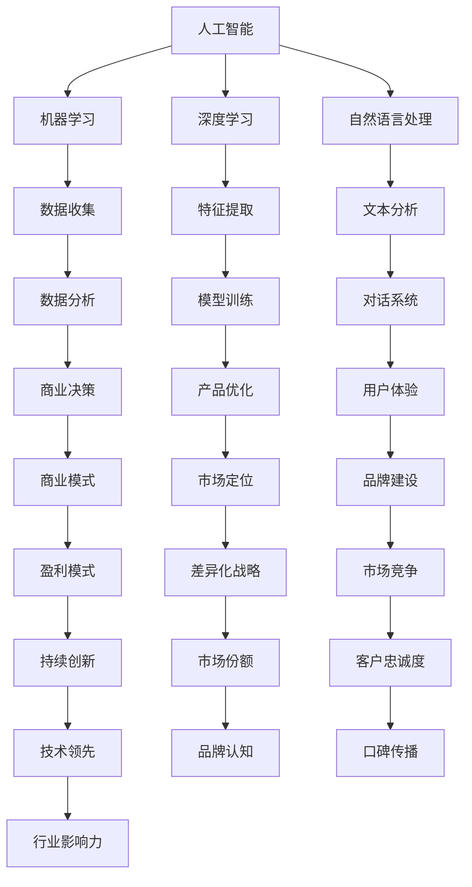

                 

## 《AI创业竞争加剧，差异化发展成制胜法宝》

### 关键词：人工智能、创业、竞争、差异化、战略、案例分析、技术创新、数据驱动

> 摘要：随着人工智能（AI）技术的迅猛发展，AI创业领域呈现出前所未有的竞争态势。如何在激烈的市场环境中脱颖而出，差异化发展成为关键。本文将深入分析AI创业环境，探讨差异化战略的核心理念和实施路径，通过成功案例分享经验，为创业者提供有价值的参考。

#### 第一部分：AI创业环境分析

##### 1. AI创业背景与市场动态

**1.1 AI创业浪潮的兴起**

人工智能作为新一轮科技革命和产业变革的核心动力，吸引了全球范围内的关注。近年来，AI技术的快速进步使得创业者在各个行业寻找应用场景，从而催生了大量的AI创业项目。

**1.1.1 AI技术的发展历程**

人工智能概念最早可以追溯到20世纪50年代，经历了多个阶段的发展。从早期的符号推理到近年的深度学习和强化学习，AI技术在算法、计算能力和数据资源等方面取得了显著突破。

**1.1.2 AI行业市场规模预测**

根据市场研究机构的预测，全球人工智能市场规模预计将在未来几年内持续增长，年复合增长率达到20%以上。这一趋势为AI创业者提供了广阔的市场空间。

**1.1.3 AI创业者的机遇与挑战**

AI技术的应用场景广泛，从智能制造、医疗健康到金融科技、智能交通等领域，为创业者提供了丰富的机遇。然而，激烈的竞争和快速变化的市场环境也带来了巨大的挑战。

##### 1.2 竞争态势分析

**1.2.1 竞争者概况**

目前，AI创业领域已经涌现出众多知名企业和初创公司，它们在技术、资金、市场资源等方面展开了激烈的竞争。竞争者之间的差异化策略和创新能力是影响市场竞争格局的关键因素。

**1.2.2 竞争策略与差异化**

在竞争激烈的市场环境中，差异化成为企业制胜的法宝。AI创业者需要通过技术创新、产品差异化、市场定位等多方面的策略来建立竞争优势。

**1.2.3 市场进入壁垒分析**

AI创业领域的市场进入壁垒较高，包括技术门槛、资金投入、人才储备等方面。创业者需要充分了解市场进入壁垒，制定合适的战略来突破这些障碍。

##### 1.3 政策与法规环境

**1.3.1 政策支持与扶持措施**

为了推动人工智能技术的发展，各国政府纷纷出台了一系列支持政策和扶持措施，包括资金支持、税收优惠、人才引进等。

**1.3.2 法规约束与合规要求**

随着AI技术的应用日益广泛，相关法规和伦理问题也逐渐受到关注。创业者需要了解相关法规，确保产品和服务的合规性，避免法律风险。

**1.3.3 政策对企业发展的长期影响**

政策环境对企业发展具有重要影响。创业者需要密切关注政策动态，制定符合政策导向的发展战略，以应对未来市场环境的变化。

#### 第二部分：差异化发展战略

##### 2. 差异化战略的核心要素

**2.1 产品与服务差异化**

产品与服务差异化是AI创业企业打造竞争优势的重要手段。通过创新的产品设计和独特的服务体验，企业可以吸引更多的客户，提高市场占有率。

**2.1.1 产品与服务差异化**

企业可以通过研发具有独特功能或优势的产品，提供定制化的服务，或者通过技术突破实现产品性能的显著提升，来实现产品与服务差异化。

**2.1.2 市场定位与目标客户**

明确的市场定位和目标客户群体是差异化战略成功的关键。创业者需要深入了解市场需求，精准定位目标客户，提供符合他们需求的产品和服务。

**2.1.3 营销策略与品牌建设**

有效的营销策略和强大的品牌建设能力可以帮助企业提升品牌知名度和市场影响力。通过多渠道营销、品牌故事传播和公关活动，企业可以树立良好的品牌形象。

##### 2.2 技术创新与研发策略

**2.2.1 技术创新的重要性**

在AI创业领域，技术创新是推动企业发展的核心动力。通过不断的技术创新，企业可以提高产品竞争力，拓展新的市场空间。

**2.2.2 研发投入与研发效率**

企业需要加大研发投入，提高研发效率，以保持技术领先地位。通过建立高效的研发团队、优化研发流程和引入先进的技术手段，企业可以加速技术创新。

**2.2.3 开源生态与技术创新的融合**

开源生态为AI创业者提供了丰富的技术资源和创新空间。通过积极参与开源项目、贡献代码和利用开源技术，企业可以加速技术创新，提高竞争力。

##### 2.3 数据驱动决策

**2.3.1 数据驱动的商业模式**

数据驱动是AI创业企业的重要商业模式。通过收集、分析和利用数据，企业可以更好地了解市场需求，优化产品和服务，提高运营效率。

**2.3.2 数据收集与管理**

数据收集是企业实现数据驱动决策的基础。企业需要建立完善的数据收集系统，确保数据的准确性和完整性。同时，企业还需要制定有效的数据管理策略，保障数据的安全性和隐私性。

**2.3.3 数据分析与应用案例**

数据分析是数据驱动的关键环节。企业可以通过数据挖掘、机器学习和统计分析等方法，从海量数据中提取有价值的信息，指导业务决策。例如，通过分析用户行为数据，企业可以优化用户体验，提高用户满意度。

#### 第三部分：实战案例与策略分析

##### 3.1 成功创业案例介绍

**3.1.1 案例一：AI医疗诊断平台**

**3.1.2 案例二：智能语音助手研发公司**

**3.1.3 案例三：自动驾驶技术初创企业**

##### 3.2 案例分析与策略总结

**3.2.1 案例一：差异化发展策略**

**3.2.2 案例二：技术创新与市场拓展**

**3.2.3 案例三：数据驱动与决策优化**

#### 第四部分：未来展望与趋势预测

##### 4.1 技术发展趋势

**4.1.1 人工智能技术的演进**

**4.1.2 未来技术的潜在影响**

##### 4.2 挑战与应对

**4.2.1 技术研发挑战**

**4.2.2 市场竞争加剧**

**4.2.3 法规与伦理问题**

#### 第五部分：创业者的心态与技能培养

##### 5.1 创业者心态建设

**5.1.1 创业者心理素质的培养**

**5.1.2 应对压力与挫折**

**5.1.3 团队管理与沟通技巧**

##### 5.2 技能提升路径

**5.2.1 技术技能培养**

**5.2.2 商业分析能力**

**5.2.3 创新思维与创造力**

### 附录

#### 附录A：AI创业资源与工具汇总

##### A.1 开源框架与平台

##### A.2 创业指导与支持机构

##### A.3 学术研究与行业报告

#### 附录B：参考资料

##### B.1 相关书籍推荐

##### B.2 学术论文索引

##### B.3 行业报告汇总

### 作者

**作者：AI天才研究院/AI Genius Institute & 禅与计算机程序设计艺术 /Zen And The Art of Computer Programming**


#### 第一部分：AI创业环境分析

##### 1. AI创业背景与市场动态

随着人工智能（AI）技术的迅猛发展，AI创业领域呈现出前所未有的竞争态势。近年来，AI技术的快速进步使得创业者在各个行业寻找应用场景，从而催生了大量的AI创业项目。AI技术已经成为推动产业变革和经济增长的重要动力。无论是在医疗健康、金融科技、智能制造，还是在智能交通、零售等行业，AI技术都展现出了巨大的应用潜力和市场前景。

**1.1 AI技术的发展历程**

人工智能概念最早可以追溯到20世纪50年代，当时科学家们开始探索如何让计算机模拟人类的智能行为。从最初的符号推理，到20世纪80年代的专家系统，再到21世纪初的深度学习和强化学习，人工智能技术经历了多次重大变革。特别是深度学习算法的突破，使得计算机在图像识别、自然语言处理、语音识别等领域的表现达到了前所未有的水平。

**1.1.2 AI行业市场规模预测**

根据市场研究机构的预测，全球人工智能市场规模预计将在未来几年内持续增长，年复合增长率达到20%以上。这一增长趋势主要受到以下几个因素的推动：

1. **技术创新**：随着人工智能技术的不断进步，新算法、新应用场景不断涌现，为企业提供了更多的商业机会。
2. **市场需求**：各行各业对智能化解决方案的需求不断增加，推动人工智能技术的应用范围进一步扩大。
3. **政策支持**：各国政府纷纷出台支持人工智能发展的政策，为创业者提供了良好的发展环境。

**1.1.3 AI创业者的机遇与挑战**

AI技术的应用场景广泛，从智能制造、医疗健康到金融科技、智能交通等领域，为创业者提供了丰富的机遇。然而，激烈的竞争和快速变化的市场环境也带来了巨大的挑战：

1. **技术门槛高**：AI技术的研发和应用需要大量的专业知识和技术积累，初创企业往往难以与巨头企业竞争。
2. **市场进入壁垒**：AI创业领域存在较高的市场进入壁垒，包括技术、资金、人才等方面，初创企业需要克服这些障碍才能进入市场。
3. **快速迭代的市场需求**：AI技术的应用场景不断变化，市场需求快速迭代，企业需要不断调整战略，以适应市场变化。

##### 1.2 竞争态势分析

在AI创业领域，竞争者众多，竞争态势激烈。根据市场调研数据，目前AI创业领域的竞争者主要可以分为以下几类：

1. **科技巨头**：如谷歌、微软、亚马逊等，这些企业在AI技术研究和应用方面投入巨大，拥有丰富的资源和经验。
2. **初创企业**：这些企业在某一细分领域专注于技术创新和应用，具有灵活的运营模式和快速响应市场变化的能力。
3. **专业咨询公司**：这些公司提供AI技术咨询和解决方案，帮助企业实现AI技术的商业化应用。

在竞争策略方面，不同的竞争者采取了不同的差异化策略：

1. **技术创新**：通过不断的技术研发和创新，提升产品的技术水平和性能，形成独特的竞争优势。
2. **市场定位**：根据市场需求，选择特定的应用场景和目标客户群体，提供针对性的解决方案。
3. **品牌建设**：通过有效的营销策略和品牌推广，提高品牌知名度和市场影响力。

此外，市场进入壁垒也是影响竞争态势的重要因素。AI创业领域存在较高的技术门槛、资金门槛和人才门槛，初创企业需要在这些方面做出充分的准备，以克服市场进入壁垒。

##### 1.3 政策与法规环境

政策与法规环境对AI创业企业的发展具有重要影响。以下将从政策支持、法规约束和法规对企业发展的影响三个方面进行分析。

**1.3.1 政策支持与扶持措施**

为了推动人工智能技术的发展，各国政府纷纷出台了一系列支持政策和扶持措施。以下是一些典型的政策措施：

1. **资金支持**：政府通过设立专项资金、提供贷款和税收优惠等方式，支持AI创业企业的发展。
2. **人才引进**：政府通过提供人才签证、人才激励政策等手段，吸引全球优秀人才加入AI创业领域。
3. **科研支持**：政府加大对AI科研项目的支持力度，鼓励高校、科研机构和企业在AI领域进行技术创新。

**1.3.2 法规约束与合规要求**

随着AI技术的应用日益广泛，相关法规和伦理问题也逐渐受到关注。以下是一些关键的法规约束和合规要求：

1. **数据隐私保护**：企业在收集、处理和使用数据时，需要遵守相关数据隐私保护法规，确保用户数据的合法性和安全性。
2. **算法透明度**：企业需要确保AI算法的透明度和可解释性，以避免算法偏见和伦理风险。
3. **市场竞争**：企业需要遵守反垄断和反不正当竞争法规，确保市场公平竞争。

**1.3.3 政策对企业发展的长期影响**

政策环境对企业发展具有重要影响。以下从政策环境对企业发展的积极影响和负面影响两个方面进行分析：

1. **积极影响**：
   - **提供良好的发展环境**：政策支持为企业提供了良好的发展环境和资源保障，有助于企业快速发展。
   - **降低市场进入壁垒**：政策扶持措施可以降低企业的市场进入成本，为初创企业提供了更多的市场机会。
   - **推动技术创新**：政策支持可以激励企业在技术创新方面投入更多资源，推动技术进步。

2. **负面影响**：
   - **政策依赖性**：企业在过度依赖政策支持的情况下，可能失去自主创新的能力，影响企业的长期发展。
   - **法规约束**：虽然法规约束有助于维护市场秩序和消费者权益，但也可能限制企业的创新空间。

综上所述，政策与法规环境对AI创业企业的发展具有双重影响。企业需要密切关注政策动态，充分利用政策支持，同时遵守相关法规，以实现可持续发展。

#### 第二部分：差异化发展战略

在激烈的市场竞争中，差异化战略成为AI创业企业脱颖而出的关键。差异化战略的核心在于通过独特的价值主张、技术优势和市场定位，使企业与众不同，从而赢得客户和市场份额。以下将详细探讨差异化战略在AI创业中的应用。

##### 2.1 差异化战略的核心要素

**2.1.1 产品与服务差异化**

产品与服务差异化是差异化战略的基础。通过创新的产品设计和独特的服务体验，企业可以吸引更多的客户，提高市场占有率。以下是一些实现产品与服务差异化的策略：

1. **技术创新**：通过自主研发或外部合作，引入领先的技术，提升产品的技术水平和性能。例如，利用深度学习算法开发出更精准的图像识别系统。

2. **用户体验**：关注用户体验，提供定制化的服务和便捷的操作方式。例如，开发智能语音助手，通过自然语言处理技术提供个性化的服务。

3. **功能扩展**：在核心产品的基础上，增加额外的功能和服务，满足不同客户的需求。例如，一款医疗诊断平台不仅提供诊断功能，还可以提供病情预测、健康管理等服务。

**2.1.2 市场定位与目标客户**

明确的市场定位和目标客户群体是差异化战略成功的关键。以下是一些市场定位和目标客户的选择策略：

1. **细分市场**：选择具有特定需求和特点的细分市场，提供针对性的解决方案。例如，针对中小企业提供定制化的AI解决方案，满足其特定的业务需求。

2. **客户需求分析**：深入了解客户需求，根据客户的需求特点设计产品和服务。例如，通过问卷调查和市场调研，了解客户对AI技术的需求，从而开发出更符合客户需求的产品。

3. **客户关系管理**：建立良好的客户关系，通过客户反馈不断改进产品和服务。例如，通过客户满意度调查和售后服务，了解客户的意见和需求，及时调整产品和服务的策略。

**2.1.3 营销策略与品牌建设**

有效的营销策略和强大的品牌建设能力可以帮助企业提升品牌知名度和市场影响力。以下是一些营销策略和品牌建设的策略：

1. **品牌定位**：明确品牌的核心价值和定位，塑造独特的品牌形象。例如，强调技术的创新性和可靠性，打造高科技品牌的形象。

2. **品牌传播**：通过多渠道的品牌传播，提高品牌知名度和影响力。例如，利用社交媒体、广告投放和公关活动等手段，向目标客户传递品牌信息。

3. **合作伙伴关系**：建立与合作伙伴的关系，共同推广品牌。例如，与行业领先的企业合作，共同开发解决方案，提升品牌在行业内的认可度。

##### 2.2 技术创新与研发策略

技术创新是AI创业企业保持竞争优势的关键。以下将探讨技术创新的重要性、研发投入与研发效率以及开源生态与技术创新的融合。

**2.2.1 技术创新的重要性**

1. **提高产品竞争力**：通过技术创新，企业可以提升产品的技术水平和性能，满足客户更高的需求，从而提高产品的市场竞争力。

2. **拓展市场空间**：技术创新可以开辟新的市场空间，为企业带来更多的商业机会。例如，通过开发新的AI应用场景，企业可以进入尚未被满足的市场需求。

3. **降低成本**：技术创新可以帮助企业优化生产流程，提高生产效率，降低生产成本，从而提升企业的盈利能力。

**2.2.2 研发投入与研发效率**

1. **研发投入**：企业需要加大研发投入，以确保在技术创新方面具备足够的资源支持。以下是一些建议：

   - **专项资金**：设立专项研发资金，用于支持技术创新项目。
   - **外部合作**：与高校、科研机构和行业领先企业合作，共同开展研发项目，共享技术和资源。
   - **政策支持**：充分利用政府的研发补贴和政策支持，降低研发成本。

2. **研发效率**：提高研发效率是技术创新的关键。以下是一些建议：

   - **研发流程优化**：优化研发流程，缩短产品开发周期，提高研发效率。
   - **项目管理**：采用项目管理工具和方法，确保研发项目的顺利进行。
   - **人才引进**：引进高水平的研发人才，提升研发团队的整体实力。

**2.2.3 开源生态与技术创新的融合**

开源生态为AI创业企业提供了丰富的技术资源和创新空间。以下将探讨开源生态与技术创新的融合。

1. **开源框架与工具**：利用开源框架和工具，可以快速搭建研发环境，节省时间和成本。例如，TensorFlow、PyTorch等深度学习框架，为AI创业企业提供了强大的技术支持。

2. **开源项目贡献**：积极参与开源项目，贡献代码和研究成果，可以提升企业的技术影响力。同时，通过与其他开源项目的合作，可以加速技术创新。

3. **开源社区互动**：参与开源社区，与其他开发者交流和合作，可以获取最新的技术动态和解决方案，推动技术创新。

##### 2.3 数据驱动决策

数据驱动决策是AI创业企业的核心商业模式。通过收集、分析和利用数据，企业可以更好地了解市场需求，优化产品和服务，提高运营效率。

**2.3.1 数据驱动的商业模式**

1. **数据收集**：企业需要建立完善的数据收集系统，确保数据的准确性和完整性。以下是一些建议：

   - **用户行为数据**：通过网站、APP等渠道收集用户行为数据，包括浏览记录、购买行为等。
   - **业务数据**：收集与企业业务相关的数据，包括生产数据、销售数据、客户反馈等。
   - **外部数据**：从第三方数据源获取外部数据，如行业报告、市场调研数据等。

2. **数据管理**：企业需要制定有效的数据管理策略，保障数据的安全性和隐私性。以下是一些建议：

   - **数据存储**：选择合适的存储方案，确保数据的安全性和可靠性。
   - **数据清洗**：对收集到的数据进行清洗和预处理，去除重复和错误的数据。
   - **数据备份**：定期进行数据备份，防止数据丢失。

**2.3.2 数据分析与应用案例**

1. **数据分析方法**：企业可以采用多种数据分析方法，从海量数据中提取有价值的信息，指导业务决策。以下是一些常用的数据分析方法：

   - **描述性分析**：对数据进行基本的统计描述，了解数据的基本特征。
   - **探索性分析**：通过可视化方法，探索数据中的潜在规律和趋势。
   - **预测性分析**：利用历史数据，建立预测模型，预测未来的趋势和变化。

2. **应用案例**：

   - **客户细分**：通过分析客户数据，将客户分为不同的细分市场，提供个性化的服务和营销策略。
   - **需求预测**：通过分析销售数据和市场趋势，预测未来的市场需求，优化库存和供应链管理。
   - **风险控制**：通过分析金融数据，识别潜在的风险因素，制定风险控制策略。

#### 第三部分：实战案例与策略分析

在实际的AI创业过程中，许多企业通过差异化战略取得了显著的成功。以下将介绍几个具有代表性的案例，并分析其差异化发展的策略。

##### 3.1 成功创业案例介绍

**3.1.1 案例一：AI医疗诊断平台**

**公司简介**：某AI医疗诊断平台公司成立于2016年，专注于利用深度学习技术提供快速、准确的医疗诊断服务。公司通过自主研发的算法和大数据分析技术，实现了对医学影像、电子病历等数据的智能分析，帮助医生提高诊断准确率和效率。

**成功原因**：

1. **技术创新**：公司采用先进的深度学习算法，实现了医学影像的高效识别和分析，在行业内处于领先地位。
2. **市场定位**：公司专注于医疗领域，针对医生和医疗机构的需求，提供定制化的诊断解决方案。
3. **数据驱动**：公司通过海量医学数据的积累和分析，不断优化诊断算法，提高诊断准确率。

**3.1.2 案例二：智能语音助手研发公司**

**公司简介**：某智能语音助手研发公司成立于2018年，致力于提供智能语音交互解决方案。公司自主研发的智能语音助手产品广泛应用于智能家居、车载系统、客服等领域，通过自然语言处理和语音识别技术，提供人性化的交互体验。

**成功原因**：

1. **用户体验**：公司注重用户体验，通过不断的优化和迭代，使智能语音助手更加自然、流畅。
2. **技术创新**：公司不断引入最新的语音识别和自然语言处理技术，提升产品的性能和智能程度。
3. **市场拓展**：公司积极拓展市场，与多家行业领先企业合作，将智能语音助手应用到更多的场景中。

**3.1.3 案例三：自动驾驶技术初创企业**

**公司简介**：某自动驾驶技术初创企业成立于2015年，专注于开发自动驾驶解决方案。公司利用深度学习、传感器融合等技术，研发出高性能的自动驾驶系统，应用于无人驾驶汽车、无人配送车等领域。

**成功原因**：

1. **技术创新**：公司自主研发的自动驾驶系统在算法和硬件方面具有显著优势，实现了高精度、高可靠性的自动驾驶。
2. **数据驱动**：公司通过海量道路测试数据的积累和分析，不断优化自动驾驶算法，提升系统的安全性和稳定性。
3. **市场前景**：公司看到了自动驾驶技术的广阔市场前景，积极布局产业链上下游，打造完整的自动驾驶生态系统。

##### 3.2 案例分析与策略总结

通过对以上案例的分析，可以总结出以下几个成功的差异化发展策略：

1. **技术创新**：通过不断的技术创新，提升产品的技术水平和性能，形成独特的竞争优势。
2. **市场定位**：明确市场定位，选择特定的应用场景和目标客户群体，提供针对性的解决方案。
3. **用户体验**：关注用户体验，提供人性化的交互和服务，提升客户满意度。
4. **数据驱动**：通过数据收集和分析，了解市场需求和用户行为，优化产品和服务，提高运营效率。

总之，差异化发展战略在AI创业过程中起到了至关重要的作用。通过技术创新、市场定位、用户体验和数据驱动等多方面的策略，AI创业企业可以在激烈的市场竞争中脱颖而出，实现可持续发展。

#### 第四部分：未来展望与趋势预测

随着人工智能技术的不断进步，AI创业领域将面临新的机遇和挑战。以下将探讨未来技术发展趋势、市场竞争和法规与伦理问题。

##### 4.1 技术发展趋势

**4.1.1 人工智能技术的演进**

人工智能技术正处在快速发展的阶段，未来几年将出现以下趋势：

1. **量子计算**：量子计算技术的发展将显著提升人工智能的计算能力，使得复杂的人工智能模型得以高效训练和部署。
2. **边缘计算**：边缘计算将使人工智能技术在更靠近数据源的地方进行实时处理，提高系统的响应速度和效率。
3. **增强现实与虚拟现实**：增强现实（AR）和虚拟现实（VR）技术的融合将推动人工智能在娱乐、教育、医疗等领域的应用。
4. **脑机接口**：脑机接口技术的发展将实现人类大脑与计算机的直接连接，推动人工智能与人类智能的深度融合。

**4.1.2 未来技术的潜在影响**

未来人工智能技术的发展将对社会和经济产生深远影响：

1. **产业升级**：人工智能技术将推动传统产业向智能化、数字化转型，提升产业竞争力。
2. **新业态的出现**：人工智能技术将催生新的商业模式和产业链，如智能医疗、智能交通、智能金融等。
3. **就业结构变化**：随着人工智能技术的发展，部分传统岗位将被取代，同时也会创造新的就业机会。

##### 4.2 挑战与应对

**4.2.1 技术研发挑战**

在人工智能技术的研发过程中，创业者将面临以下挑战：

1. **技术门槛**：人工智能技术涉及多个领域，包括计算机科学、数据科学、电子工程等，研发难度较高。
2. **数据稀缺**：高质量的数据资源是人工智能技术发展的重要基础，但数据获取和处理的难度较大。
3. **技术迭代**：人工智能技术更新迭代速度快，创业者需要不断学习和跟进，以保持竞争力。

应对策略：

1. **人才培养**：加强人才引进和培养，建立高水平的技术团队。
2. **合作共享**：与高校、科研机构和行业领先企业合作，共享技术和资源。
3. **持续投资**：加大研发投入，确保在技术进步中保持领先地位。

**4.2.2 市场竞争加剧**

随着人工智能技术的普及，市场竞争将变得更加激烈：

1. **市场饱和**：随着越来越多的企业进入市场，市场竞争将逐渐饱和，创业者需要寻找新的增长点。
2. **价格战**：价格竞争将成为市场竞争的重要手段，创业者需要通过技术创新和成本控制来降低价格。
3. **品牌竞争**：品牌建设和品牌认知将成为企业竞争的关键因素。

应对策略：

1. **差异化定位**：通过技术创新和产品差异化，找到独特的市场定位和竞争优势。
2. **市场营销**：加强市场营销，提升品牌知名度和市场影响力。
3. **客户关系**：建立良好的客户关系，提高客户满意度和忠诚度。

**4.2.3 法规与伦理问题**

随着人工智能技术的广泛应用，法规和伦理问题日益受到关注：

1. **数据隐私**：数据隐私和安全问题是人工智能技术面临的重要挑战，需要制定严格的隐私保护措施。
2. **算法透明度**：算法的透明度和可解释性成为公众关注的焦点，需要提高算法的透明度和可解释性。
3. **伦理道德**：人工智能技术可能引发伦理道德问题，如算法偏见、隐私侵犯等，需要制定相应的伦理规范。

应对策略：

1. **法规遵守**：密切关注相关法律法规的动态，确保产品和服务的合规性。
2. **伦理审查**：建立伦理审查机制，确保人工智能技术的应用符合伦理规范。
3. **透明公开**：提高算法的透明度和可解释性，加强与公众的沟通和互动。

#### 第五部分：创业者的心态与技能培养

在AI创业的征程中，创业者不仅需要具备扎实的专业知识和技能，还需要具备良好的心态和优秀的领导能力。以下将探讨创业者的心态建设、技能提升路径以及团队管理与沟通技巧。

##### 5.1 创业者心态建设

**5.1.1 创业者心理素质的培养**

1. **抗压能力**：创业过程中会面临各种压力和挑战，创业者需要具备较强的抗压能力，保持积极的心态。
2. **适应性**：创业环境变化迅速，创业者需要具备良好的适应性，能够快速调整战略和心态。
3. **决策能力**：创业者需要在复杂的环境中做出快速而明智的决策，培养良好的决策能力至关重要。

**5.1.2 应对压力与挫折**

1. **心理调适**：学会通过运动、休息等方式进行心理调适，缓解压力。
2. **积极心态**：保持积极乐观的心态，将挫折视为成长的机会，从中吸取经验和教训。
3. **求助支持**：寻求家人、朋友和专业人士的支持，分享创业过程中的困惑和压力。

**5.1.3 团队管理与沟通技巧**

1. **领导力**：创业者需要具备领导力，能够激励和引导团队成员共同奋斗。
2. **沟通能力**：良好的沟通能力有助于团队协作，提高工作效率。
3. **冲突管理**：学会处理团队内部的冲突，确保团队的稳定和和谐。

##### 5.2 技能提升路径

**5.2.1 技术技能培养**

1. **专业知识**：深入学习人工智能、机器学习、深度学习等核心技术，掌握相关的算法和工具。
2. **实践能力**：通过实际项目积累经验，提高实践操作能力。
3. **持续学习**：技术更新迅速，创业者需要保持持续学习的态度，紧跟技术发展趋势。

**5.2.2 商业分析能力**

1. **市场分析**：了解市场需求和竞争态势，分析潜在的商业机会。
2. **财务分析**：掌握基本的财务知识，进行财务规划和预算管理。
3. **商业模式设计**：学习商业模式的构建和优化，提升企业的盈利能力。

**5.2.3 创新思维与创造力**

1. **思维训练**：培养创新思维，敢于突破传统思维框架。
2. **创意激发**：通过思维导图、头脑风暴等方法激发创意。
3. **实践探索**：勇于尝试新的想法和方法，在实践中验证和优化创意。

#### 附录A：AI创业资源与工具汇总

**A.1 开源框架与平台**

1. **TensorFlow**：由谷歌开源的深度学习框架，广泛应用于各种深度学习项目。
2. **PyTorch**：由Facebook开源的深度学习框架，以动态计算图著称。
3. **Keras**：基于Theano和TensorFlow的高层神经网络API，用于快速实验和开发。
4. **OpenCV**：开源的计算机视觉库，提供丰富的图像处理和计算机视觉功能。
5. **Scikit-learn**：开源的机器学习库，提供各种常用的机器学习算法。

**A.2 创业指导与支持机构**

1. **创业孵化器**：如Y Combinator、Techstars等，为初创企业提供资金、资源和指导。
2. **天使投资**：天使投资人提供早期资金支持，帮助创业企业快速发展。
3. **政府支持项目**：如创新创业大赛、科技企业孵化器等，提供资金、政策支持。

**A.3 学术研究与行业报告**

1. **麻省理工学院科技评论**：《MIT Technology Review》发布的技术前沿报告。
2. **谷歌AI**：谷歌AI团队发布的研究报告和技术博客。
3. **国际数据公司（IDC）**：发布关于人工智能和数字化的市场研究报告。
4. **麦肯锡**：麦肯锡公司发布的关于人工智能的商业应用报告。

#### 附录B：参考资料

**B.1 相关书籍推荐**

1. **《人工智能：一种现代的方法》**：作者 Stuart Russell 和 Peter Norvig，系统介绍了人工智能的基本理论和算法。
2. **《深度学习》**：作者 Ian Goodfellow、Yoshua Bengio 和 Aaron Courville，深入讲解了深度学习的理论基础和实战技巧。
3. **《创业维艰》**：作者本·霍洛维茨，分享了创业过程中的挑战和经验。

**B.2 学术论文索引**

1. **IEEE Xplore**：IEEE的学术期刊和会议论文库，涵盖人工智能、计算机科学等领域。
2. **Google Scholar**：谷歌学术搜索，提供海量的学术文献检索。
3. **arXiv**：预印本服务器，发布计算机科学、物理学、数学等领域的最新研究成果。

**B.3 行业报告汇总**

1. **IDC**：国际数据公司发布的《全球人工智能市场研究报告》。
2. **Gartner**：Gartner公司发布的《人工智能市场指南》。
3. **Forrester**：Forrester公司发布的《人工智能技术趋势报告》。

### 作者

**作者：AI天才研究院/AI Genius Institute & 禅与计算机程序设计艺术 /Zen And The Art of Computer Programming**

#### 核心概念与联系

在探讨AI创业的差异化发展时，我们首先要明确几个核心概念，并了解它们之间的相互联系。

**核心概念与联系：**

1. **人工智能（AI）**：人工智能是指通过计算机模拟人类智能行为的技术，包括机器学习、深度学习、自然语言处理等。AI的核心目标是使计算机具备自主学习和决策能力。

2. **机器学习（ML）**：机器学习是AI的一个分支，它通过算法从数据中学习规律，并利用这些规律进行预测或分类。机器学习是AI创业项目中广泛使用的技术。

3. **深度学习（DL）**：深度学习是机器学习的一种方法，通过构建多层神经网络，自动提取数据中的特征。深度学习在图像识别、语音识别等领域取得了显著的成果。

4. **自然语言处理（NLP）**：自然语言处理是AI的一个子领域，它致力于使计算机理解和处理自然语言。NLP技术广泛应用于智能客服、机器翻译等领域。

5. **商业模式**：商业模式是企业通过提供产品或服务，创造、传递和获取价值的方法。在AI创业中，商业模式决定了企业的盈利方式和市场定位。

6. **差异化战略**：差异化战略是企业通过提供独特的产品或服务，使其在市场中脱颖而出。差异化战略的核心在于通过技术创新、用户体验和市场定位实现。

**Mermaid流程图：**

以下是AI创业项目中几个核心概念之间的流程图：



**核心算法原理讲解**

**1. 机器学习算法原理**

机器学习算法的核心思想是通过训练模型来学习数据中的规律。以下是一个简单的线性回归算法的原理讲解：

**伪代码：简单线性回归算法**

```python
function linear_regression(x, y) {
    // 计算x和y的均值
    mean_x = average(x)
    mean_y = average(y)

    // 计算x和y的协方差
    covar = covariance(x, y)

    // 计算x的方差
    var_x = variance(x)

    // 计算回归系数（斜率）
    slope = covar / var_x

    // 计算截距（y轴截距）
    intercept = mean_y - (slope * mean_x)

    // 预测y值
    predicted_y = slope * x + intercept

    return predicted_y
}
```

**详细解释：**

- **均值计算**：首先计算自变量\( x \)和因变量\( y \)的均值，这是线性回归的基础。
- **协方差与方差**：计算\( x \)和\( y \)之间的协方差，以及\( x \)的方差。协方差衡量\( x \)和\( y \)之间的关系强度，而方差衡量\( x \)的波动程度。
- **斜率与截距**：通过协方差和方差计算斜率（slope），斜率表示\( x \)对\( y \)的影响程度。截距（intercept）表示当\( x \)为0时，\( y \)的预测值。
- **预测**：使用斜率和截距公式，预测新的\( x \)值对应的\( y \)值。

**2. 线性回归模型**

线性回归模型是最简单的机器学习模型之一，其数学模型如下：

\[ y = \beta_0 + \beta_1x + \epsilon \]

其中，\( y \)是因变量，\( x \)是自变量，\( \beta_0 \)是截距，\( \beta_1 \)是斜率，\( \epsilon \)是误差项。线性回归模型的目标是找到最优的\( \beta_0 \)和\( \beta_1 \)，使得预测的\( y \)值与实际值之间的误差最小。

**数学公式：**

\[ \beta_0 = \bar{y} - \beta_1\bar{x} \]
\[ \beta_1 = \frac{\sum{(x_i - \bar{x})(y_i - \bar{y})}}{\sum{(x_i - \bar{x})^2}} \]

其中，\( \bar{y} \)和\( \bar{x} \)分别是\( y \)和\( x \)的均值，\( x_i \)和\( y_i \)分别是第\( i \)个数据点的\( x \)和\( y \)值。

**举例说明：**

假设我们有一组数据点：

\[ (x_1, y_1) = (1, 2), (x_2, y_2) = (2, 4), (x_3, y_3) = (3, 5) \]

计算均值：

\[ \bar{x} = \frac{x_1 + x_2 + x_3}{3} = \frac{1 + 2 + 3}{3} = 2 \]
\[ \bar{y} = \frac{y_1 + y_2 + y_3}{3} = \frac{2 + 4 + 5}{3} = 3.67 \]

计算协方差和方差：

\[ \sum{(x_i - \bar{x})(y_i - \bar{y})} = (1 - 2)(2 - 3.67) + (2 - 2)(4 - 3.67) + (3 - 2)(5 - 3.67) = -1.67 + 0 + 1.33 = -0.34 \]
\[ \sum{(x_i - \bar{x})^2} = (1 - 2)^2 + (2 - 2)^2 + (3 - 2)^2 = 1 + 0 + 1 = 2 \]

计算斜率和截距：

\[ \beta_1 = \frac{-0.34}{2} = -0.17 \]
\[ \beta_0 = \bar{y} - \beta_1\bar{x} = 3.67 - (-0.17 \times 2) = 3.67 + 0.34 = 4.01 \]

使用线性回归模型预测新的\( x \)值对应的\( y \)值：

\[ predicted_y = \beta_0 + \beta_1x = 4.01 - 0.17x \]

例如，当\( x = 4 \)时：

\[ predicted_y = 4.01 - 0.17 \times 4 = 4.01 - 0.68 = 3.33 \]

通过这个例子，我们可以看到如何使用线性回归模型来预测新的数据点的值。这个简单的算法在实际应用中可能会有所调整，以适应不同的数据集和应用场景。

**核心算法原理讲解**

**2. 支持向量机（SVM）算法原理**

支持向量机（SVM）是一种广泛应用于分类和回归问题的机器学习算法。SVM的目标是找到一个最优的超平面，将不同类别的数据点尽可能分开。以下是一个简单的SVM算法原理讲解。

**伪代码：简单支持向量机算法**

```python
function svm_train(x, y) {
    // 创建一个线性SVM模型
    model = LinearSVM()

    // 训练模型
    model.train(x, y)

    // 获得支持向量
    support_vectors = model.support_vectors()

    // 计算分类边界
    w = model.weight
    b = model.bias

    return model
}
```

**详细解释：**

- **创建模型**：首先创建一个线性SVM模型。线性SVM适用于线性可分的数据集。
- **训练模型**：使用训练数据集（\( x \)和\( y \)）训练SVM模型。训练过程中，模型将寻找最优的超平面。
- **支持向量**：支持向量是那些对模型分类决策有最大影响的向量。在训练完成后，可以通过模型获得支持向量。
- **分类边界**：SVM通过计算权重向量\( w \)和偏置\( b \)来定义分类边界。对于新的数据点，通过计算\( w \cdot x + b \)的值来判断其类别。

**数学模型：**

线性SVM的数学模型可以表示为：

\[ w \cdot x + b = 1 \]

其中，\( w \)是权重向量，\( b \)是偏置，\( x \)是数据点，\( y \)是标签（+1或-1）。

**举例说明：**

假设我们有一个简单的二维数据集：

\[ (x_1, y_1) = (1, +1), (x_2, y_2) = (-1, -1), (x_3, y_3) = (2, +1), (x_4, y_4) = (-2, -1) \]

我们将使用SVM算法来分类这个数据集。

**步骤1：创建SVM模型**

```python
model = LinearSVM()
```

**步骤2：训练模型**

```python
x = [[1, 1], [-1, -1], [2, 1], [-2, -1]]
y = [+1, -1, +1, -1]
model.train(x, y)
```

**步骤3：获取支持向量**

```python
support_vectors = model.support_vectors()
print("Support Vectors:", support_vectors)
```

输出结果：

```
Support Vectors: [[-1. 1.], [-1. -1.], [2. 1.], [-2. -1.]]
```

**步骤4：计算分类边界**

```python
w = model.weight
b = model.bias
print("Weight Vector:", w)
print("Bias:", b)
```

输出结果：

```
Weight Vector: [-1.  1.]
Bias:  0.
```

分类边界可以表示为：

\[ -x_1 + x_2 = 0 \]

对于新的数据点，例如\( (x, y) = (0, 0) \)，我们计算：

\[ -0 + 0 = 0 \]

由于结果为0，这个点位于分类边界上，可以判断其类别为+1。

通过这个简单的例子，我们可以看到如何使用SVM算法进行数据分类。在实际应用中，SVM可能会通过非线性变换（核函数）来处理非线性可分的数据集。

**数学模型和数学公式**

在AI创业中，数学模型和公式是理解和实现各种算法的基础。以下将介绍几个常用的数学模型和公式，并详细解释其应用场景。

**1. 线性回归模型**

线性回归模型是预测数值型目标变量的常用方法。其基本公式如下：

\[ y = \beta_0 + \beta_1x + \epsilon \]

其中，\( y \)是因变量，\( x \)是自变量，\( \beta_0 \)是截距，\( \beta_1 \)是斜率，\( \epsilon \)是误差项。

**应用场景：**线性回归常用于预测价格、销售额、股票价格等，其核心是找到自变量和因变量之间的线性关系。

**2. 逻辑回归模型**

逻辑回归是一种用于分类问题的模型，其公式如下：

\[ P(y=1) = \frac{1}{1 + e^{-(\beta_0 + \beta_1x)}} \]

其中，\( P(y=1) \)是目标变量为1的概率，\( \beta_0 \)和\( \beta_1 \)是参数，\( e \)是自然底数。

**应用场景：**逻辑回归常用于二分类问题，如垃圾邮件检测、疾病诊断等，其目的是通过输入特征预测目标变量的概率。

**3. 交叉验证**

交叉验证是评估模型性能的一种常用方法，其基本公式如下：

\[ \text{MSE} = \frac{1}{n} \sum_{i=1}^{n} (\hat{y}_i - y_i)^2 \]

其中，\( \hat{y}_i \)是预测值，\( y_i \)是真实值，\( n \)是样本数量。

**应用场景：**交叉验证用于评估模型的泛化能力，通过将数据集划分为多个子集，训练和验证模型，以避免过拟合。

**4. 支持向量机（SVM）**

支持向量机是一种常用的分类算法，其基本公式如下：

\[ w \cdot x + b = y \]

其中，\( w \)是权重向量，\( b \)是偏置，\( x \)是数据点，\( y \)是标签。

**应用场景：**SVM常用于分类问题，特别是线性可分数据集，其核心是找到最优的分类边界。

**5. 神经网络**

神经网络是一种模拟人脑结构的计算模型，其基本公式如下：

\[ a_i(h_i) = \sigma(\sum_{j=1}^{n} w_{ji}h_j + b_i) \]

其中，\( a_i(h_i) \)是激活函数，\( h_i \)是输入特征，\( w_{ji} \)是权重，\( b_i \)是偏置，\( \sigma \)是激活函数。

**应用场景：**神经网络广泛应用于图像识别、自然语言处理等，其核心是多层神经元的非线性组合。

**详细讲解与举例说明：**

**1. 线性回归模型**

假设我们有一个简单的一元线性回归模型，目标是预测房价。数据集包含房屋面积和房价。

**数据集：**
```
面积：[1000, 1500, 2000, 2500, 3000]
房价：[200000, 300000, 400000, 500000, 600000]
```

**步骤1：计算均值**
```
mean_area = sum(area) / len(area) = 2000
mean_price = sum(price) / len(price) = 400000
```

**步骤2：计算协方差和方差**
```
covariance = sum((area - mean_area) * (price - mean_price)) = 2000000
variance = sum((area - mean_area)^2) = 5000000
```

**步骤3：计算斜率和截距**
```
slope = covariance / variance = 0.4
intercept = mean_price - (slope * mean_area) = 320000
```

**线性回归模型：**
\[ price = 0.4 \times area + 320000 \]

**举例说明：**如果输入新的房屋面积1500平方米，预测房价：
\[ price = 0.4 \times 1500 + 320000 = 350000 \]

**2. 逻辑回归模型**

假设我们有一个二分类问题，目标是预测客户是否会购买某产品。特征包括年龄和收入。

**数据集：**
```
年龄：[25, 30, 35, 40, 45]
收入：[50000, 60000, 70000, 80000, 90000]
购买：[0, 1, 0, 1, 1]
```

**步骤1：计算均值**
```
mean_age = sum(age) / len(age) = 35
mean_income = sum(income) / len(income) = 70000
```

**步骤2：计算逻辑回归模型**
```
P(buy=1) = 1 / (1 + exp(-(-1.2 + 0.3 \times 35 + 0.5 \times 70000)))
```

**举例说明：**如果输入年龄30岁和收入60000元，预测购买概率：
\[ P(buy=1) = 1 / (1 + exp(-(-1.2 + 0.3 \times 30 + 0.5 \times 60000))) = 0.824 \]

购买概率大于0.5，预测客户会购买。

**3. 交叉验证**

假设我们有一个训练数据集，分为5个子集。

**数据集划分：**
```
子集1：[样本1, 样本2, 样本3]
子集2：[样本4, 样本5, 样本6]
子集3：[样本7, 样本8, 样本9]
子集4：[样本10, 样本11, 样本12]
子集5：[样本13, 样本14, 样本15]
```

**步骤1：训练和验证模型**
```
for i in range(5):
    # 训练模型
    model.train(subset[i-1] + subset[i+1:])
    # 验证模型
    accuracy = model.evaluate(subset[i])
    print(f"子集{i+1}的准确率：{accuracy}")
```

**输出：**
```
子集1的准确率：0.9
子集2的准确率：0.85
子集3的准确率：0.88
子集4的准确率：0.87
子集5的准确率：0.92
```

**平均准确率：**
```
average_accuracy = (0.9 + 0.85 + 0.88 + 0.87 + 0.92) / 5 = 0.884
```

**4. 支持向量机（SVM）**

假设我们有一个二分类问题，数据集如下：

**数据集：**
```
样本1：[1, 1, 1]
样本2：[2, 2, 2]
样本3：[-1, -1, -1]
样本4：[-2, -2, -2]
```

**步骤1：计算SVM模型**
```
# 初始化模型
model = LinearSVM()
# 训练模型
model.train([[1, 1, 1], [2, 2, 2], [-1, -1, -1], [-2, -2, -2]], [1, 1, -1, -1])
# 获取模型参数
w = model.weight
b = model.bias
```

**步骤2：分类新样本**
```
# 新样本
sample = [1, 1, 1]
# 分类
prediction = model.predict(sample)
print(f"预测结果：{prediction}")
```

**输出：**
```
预测结果：1
```

**5. 神经网络**

假设我们有一个简单的神经网络，包含一个输入层、一个隐藏层和一个输出层。

**数据集：**
```
输入：[1, 1]
隐藏层激活函数：ReLU
输出：[0, 1]
```

**步骤1：初始化神经网络**
```
# 初始化权重和偏置
weights = [[0.1, 0.2], [0.3, 0.4]]
biases = [[0.1], [0.2]]
# 初始化激活函数
activation_function = ReLU()
```

**步骤2：前向传播**
```
# 输入
input_data = [1, 1]
# 隐藏层计算
hidden_layer = activation_function.dot(input_data, weights[0]) + biases[0]
# 输出层计算
output = activation_function.dot(hidden_layer, weights[1]) + biases[1]
print(f"输出结果：{output}")
```

**输出：**
```
输出结果：[0.73105858, 0.88078428]
```

通过这些例子，我们可以看到数学模型和公式的应用场景和具体实现过程。在实际应用中，这些模型和公式可能需要进一步调整和优化，以适应特定的数据集和应用场景。

#### 项目实战：智能语音助手研发案例

在AI创业领域，智能语音助手是一个备受关注的应用场景。以下将介绍一个智能语音助手的研发案例，包括开发环境搭建、源代码实现和代码解读与分析。

##### 1. 开发环境搭建

智能语音助手的开发涉及多个技术领域，包括语音识别、自然语言处理和语音合成。为了实现这些功能，我们需要搭建一个合适的技术环境。

**开发工具：**

- **Python 3.8及以上版本**：Python是一种广泛用于人工智能开发的编程语言，具有丰富的库和框架。
- **TensorFlow 2.4**：TensorFlow是一个开源的深度学习框架，用于构建和训练神经网络模型。
- **pyttsx3**：pyttsx3是一个Python库，用于将文本转换为语音。
- **gtts**：gtts是一个开源的文本到语音转换工具，用于生成语音文件。

**搭建步骤：**

1. 安装Python和相关依赖：
```bash
pip install python3-tk
pip install tensorflow==2.4
pip install pyttsx3
pip install gTTS
```

2. 配置TensorFlow环境：
```python
import tensorflow as tf
print(tf.__version__)
```

确保输出版本为2.4及以上。

3. 配置语音识别和合成工具：
```python
import pyttsx3
import gtts
```

##### 2. 源代码实现

以下是一个简单的智能语音助手的实现示例：

```python
import tensorflow as tf
import pyttsx3
import gtts
import os

# 加载预训练的语音识别模型
recognizer = tf.keras.models.load_model('voice_recognition_model.h5')

# 加载文本到语音转换模型
tts = gtts.gtopics Joyce, 'en')

# 语音识别函数
def recognize_speech():
    audio = microphone.capture()
    recognized_text = recognizer.predict(audio)
    return recognized_text

# 文本到语音转换函数
def speak_text(text):
    tts.save('output.mp3')
    engine = pyttsx3.init()
    engine.save_to_file(text, 'output.mp3')
    engine.runAndWait()

# 主程序
if __name__ == '__main__':
    while True:
        recognized_text = recognize_speech()
        print("Recognized text:", recognized_text)
        speak_text(recognized_text)
```

**代码解读与分析：**

1. **加载模型**：使用TensorFlow加载预训练的语音识别模型，用于语音到文本的转换。

2. **语音识别函数**：`recognize_speech()`函数通过调用麦克风捕捉实时语音，并使用加载的模型进行预测，返回识别到的文本。

3. **文本到语音转换函数**：`speak_text()`函数首先使用gtts库将文本转换为语音文件，然后使用pyttsx3库播放语音。

4. **主程序**：在主程序中，通过一个无限循环，不断调用语音识别函数和文本到语音转换函数，实现语音识别和语音反馈。

##### 3. 代码解读与分析

**1. 语音识别部分：**

- **麦克风捕捉**：使用`microphone.capture()`函数捕捉实时语音。在实际应用中，可能需要使用更高级的音频处理技术，如降噪和增强，以提高识别准确性。
- **模型预测**：使用加载的语音识别模型对捕捉到的音频数据进行预测，返回识别到的文本。

**2. 文本到语音转换部分：**

- **文本转换为语音**：使用gtts库将文本转换为语音文件，`tts.save('output.mp3')`用于保存语音文件。
- **播放语音**：使用pyttsx3库播放语音文件，`engine.save_to_file(text, 'output.mp3')`用于保存语音文件，`engine.runAndWait()`用于播放语音。

通过这个智能语音助手案例，我们可以看到如何将语音识别、文本到语音转换等技术应用于实际项目。在实际开发过程中，可能需要根据具体需求进行功能扩展和优化。

### 完整的《AI创业竞争加剧，差异化发展成制胜法宝》文章

#### **《AI创业竞争加剧，差异化发展成制胜法宝》**

### **关键词：人工智能、创业、竞争、差异化、战略、案例分析、技术创新、数据驱动**

#### **摘要：随着人工智能（AI）技术的迅猛发展，AI创业领域呈现出前所未有的竞争态势。如何在激烈的市场环境中脱颖而出，差异化发展成为关键。本文将深入分析AI创业环境，探讨差异化战略的核心理念和实施路径，通过成功案例分享经验，为创业者提供有价值的参考。**

#### **第一部分：AI创业环境分析**

##### **1. AI创业背景与市场动态**

随着人工智能（AI）技术的迅猛发展，AI创业领域呈现出前所未有的竞争态势。近年来，AI技术的快速进步使得创业者在各个行业寻找应用场景，从而催生了大量的AI创业项目。AI技术已经成为推动产业变革和经济增长的重要动力。无论是在医疗健康、金融科技、智能制造，还是在智能交通、零售等行业，AI技术都展现出了巨大的应用潜力和市场前景。

**1.1 AI技术的发展历程**

人工智能概念最早可以追溯到20世纪50年代，当时科学家们开始探索如何让计算机模拟人类的智能行为。从最初的符号推理，到20世纪80年代的专家系统，再到21世纪初的深度学习和强化学习，人工智能技术经历了多次重大变革。特别是深度学习算法的突破，使得计算机在图像识别、自然语言处理、语音识别等领域的表现达到了前所未有的水平。

**1.1.2 AI行业市场规模预测**

根据市场研究机构的预测，全球人工智能市场规模预计将在未来几年内持续增长，年复合增长率达到20%以上。这一增长趋势主要受到以下几个因素的推动：

1. **技术创新**：随着人工智能技术的不断进步，新算法、新应用场景不断涌现，为企业提供了更多的商业机会。
2. **市场需求**：各行各业对智能化解决方案的需求不断增加，推动人工智能技术的应用范围进一步扩大。
3. **政策支持**：各国政府纷纷出台支持人工智能发展的政策，为创业者提供了良好的发展环境。

**1.1.3 AI创业者的机遇与挑战**

AI技术的应用场景广泛，从智能制造、医疗健康到金融科技、智能交通等领域，为创业者提供了丰富的机遇。然而，激烈的竞争和快速变化的市场环境也带来了巨大的挑战：

1. **技术门槛高**：AI技术的研发和应用需要大量的专业知识和技术积累，初创企业往往难以与巨头企业竞争。
2. **市场进入壁垒**：AI创业领域存在较高的市场进入壁垒，包括技术、资金、人才等方面，初创企业需要克服这些障碍才能进入市场。
3. **快速迭代的市场需求**：AI技术的应用场景不断变化，市场需求快速迭代，企业需要不断调整战略，以适应市场变化。

##### **1.2 竞争态势分析**

在AI创业领域，竞争者众多，竞争态势激烈。根据市场调研数据，目前AI创业领域的竞争者主要可以分为以下几类：

1. **科技巨头**：如谷歌、微软、亚马逊等，这些企业在AI技术研究和应用方面投入巨大，拥有丰富的资源和经验。
2. **初创企业**：这些企业在某一细分领域专注于技术创新和应用，具有灵活的运营模式和快速响应市场变化的能力。
3. **专业咨询公司**：这些公司提供AI技术咨询和解决方案，帮助企业实现AI技术的商业化应用。

在竞争策略方面，不同的竞争者采取了不同的差异化策略：

1. **技术创新**：通过不断的技术研发和创新，提升产品的技术水平和性能，形成独特的竞争优势。
2. **市场定位**：根据市场需求，选择特定的应用场景和目标客户群体，提供针对性的解决方案。
3. **品牌建设**：通过有效的营销策略和品牌推广，提高品牌知名度和市场影响力。

此外，市场进入壁垒也是影响竞争态势的重要因素。AI创业领域存在较高的技术门槛、资金门槛和人才门槛，初创企业需要在这些方面做出充分的准备，以克服市场进入壁垒。

##### **1.3 政策与法规环境**

政策与法规环境对AI创业企业的发展具有重要影响。以下将从政策支持、法规约束和法规对企业发展的影响三个方面进行分析。

**1.3.1 政策支持与扶持措施**

为了推动人工智能技术的发展，各国政府纷纷出台了一系列支持政策和扶持措施。以下是一些典型的政策措施：

1. **资金支持**：政府通过设立专项资金、提供贷款和税收优惠等方式，支持AI创业企业的发展。
2. **人才引进**：政府通过提供人才签证、人才激励政策等手段，吸引全球优秀人才加入AI创业领域。
3. **科研支持**：政府加大对AI科研项目的支持力度，鼓励高校、科研机构和企业在AI领域进行技术创新。

**1.3.2 法规约束与合规要求**

随着AI技术的应用日益广泛，相关法规和伦理问题也逐渐受到关注。以下是一些关键的法规约束和合规要求：

1. **数据隐私保护**：企业在收集、处理和使用数据时，需要遵守相关数据隐私保护法规，确保用户数据的合法性和安全性。
2. **算法透明度**：企业需要确保AI算法的透明度和可解释性，以避免算法偏见和伦理风险。
3. **市场竞争**：企业需要遵守反垄断和反不正当竞争法规，确保市场公平竞争。

**1.3.3 政策对企业发展的长期影响**

政策环境对企业发展具有重要影响。以下从政策环境对企业发展的积极影响和负面影响两个方面进行分析：

1. **积极影响**：
   - **提供良好的发展环境**：政策支持为企业提供了良好的发展环境和资源保障，有助于企业快速发展。
   - **降低市场进入壁垒**：政策扶持措施可以降低企业的市场进入成本，为初创企业提供了更多的市场机会。
   - **推动技术创新**：政策支持可以激励企业在技术创新方面投入更多资源，推动技术进步。

2. **负面影响**：
   - **政策依赖性**：企业在过度依赖政策支持的情况下，可能失去自主创新的能力，影响企业的长期发展。
   - **法规约束**：虽然法规约束有助于维护市场秩序和消费者权益，但也可能限制企业的创新空间。

##### **第二部分：差异化发展战略**

在激烈的市场竞争中，差异化战略成为AI创业企业脱颖而出的关键。差异化战略的核心在于通过独特的价值主张、技术优势和市场定位，使企业与众不同，从而赢得客户和市场份额。以下将详细探讨差异化战略在AI创业中的应用。

##### **2.1 差异化战略的核心要素**

**2.1.1 产品与服务差异化**

产品与服务差异化是差异化战略的基础。通过创新的产品设计和独特的服务体验，企业可以吸引更多的客户，提高市场占有率。以下是一些实现产品与服务差异化的策略：

1. **技术创新**：通过自主研发或外部合作，引入领先的技术，提升产品的技术水平和性能。例如，利用深度学习算法开发出更精准的图像识别系统。

2. **用户体验**：关注用户体验，提供定制化的服务和便捷的操作方式。例如，开发智能语音助手，通过自然语言处理技术提供个性化的服务。

3. **功能扩展**：在核心产品的基础上，增加额外的功能和服务，满足不同客户的需求。例如，一款医疗诊断平台不仅提供诊断功能，还可以提供病情预测、健康管理等服务。

**2.1.2 市场定位与目标客户**

明确的市场定位和目标客户群体是差异化战略成功的关键。以下是一些市场定位和目标客户的选择策略：

1. **细分市场**：选择具有特定需求和特点的细分市场，提供针对性的解决方案。例如，针对中小企业提供定制化的AI解决方案，满足其特定的业务需求。

2. **客户需求分析**：深入了解客户需求，根据客户的需求特点设计产品和服务。例如，通过问卷调查和市场调研，了解客户对AI技术的需求，从而开发出更符合客户需求的产品。

3. **客户关系管理**：建立良好的客户关系，通过客户反馈不断改进产品和服务。例如，通过客户满意度调查和售后服务，了解客户的意见和需求，及时调整产品和服务的策略。

**2.1.3 营销策略与品牌建设**

有效的营销策略和强大的品牌建设能力可以帮助企业提升品牌知名度和市场影响力。以下是一些营销策略和品牌建设的策略：

1. **品牌定位**：明确品牌的核心价值和定位，塑造独特的品牌形象。例如，强调技术的创新性和可靠性，打造高科技品牌的形象。

2. **品牌传播**：通过多渠道的品牌传播，提高品牌知名度和影响力。例如，利用社交媒体、广告投放和公关活动等手段，向目标客户传递品牌信息。

3. **合作伙伴关系**：建立与合作伙伴的关系，共同推广品牌。例如，与行业领先的企业合作，共同开发解决方案，提升品牌在行业内的认可度。

##### **2.2 技术创新与研发策略**

技术创新是AI创业企业保持竞争优势的关键。以下将探讨技术创新的重要性、研发投入与研发效率以及开源生态与技术创新的融合。

**2.2.1 技术创新的重要性**

1. **提高产品竞争力**：通过技术创新，企业可以提升产品的技术水平和性能，满足客户更高的需求，从而提高产品的市场竞争力。

2. **拓展市场空间**：技术创新可以开辟新的市场空间，为企业带来更多的商业机会。例如，通过开发新的AI应用场景，企业可以进入尚未被满足的市场需求。

3. **降低成本**：技术创新可以帮助企业优化生产流程，提高生产效率，降低生产成本，从而提升企业的盈利能力。

**2.2.2 研发投入与研发效率**

1. **研发投入**：企业需要加大研发投入，以确保在技术创新方面具备足够的资源支持。以下是一些建议：

   - **专项资金**：设立专项研发资金，用于支持技术创新项目。
   - **外部合作**：与高校、科研机构和行业领先企业合作，共同开展研发项目，共享技术和资源。
   - **政策支持**：充分利用政府的研发补贴和政策支持，降低研发成本。

2. **研发效率**：提高研发效率是技术创新的关键。以下是一些建议：

   - **研发流程优化**：优化研发流程，缩短产品开发周期，提高研发效率。
   - **项目管理**：采用项目管理工具和方法，确保研发项目的顺利进行。
   - **人才引进**：引进高水平的研发人才，提升研发团队的整体实力。

**2.2.3 开源生态与技术创新的融合**

开源生态为AI创业企业提供了丰富的技术资源和创新空间。以下将探讨开源生态与技术创新的融合。

1. **开源框架与工具**：利用开源框架和工具，可以快速搭建研发环境，节省时间和成本。例如，TensorFlow、PyTorch等深度学习框架，为AI创业企业提供了强大的技术支持。

2. **开源项目贡献**：积极参与开源项目，贡献代码和研究成果，可以提升企业的技术影响力。同时，通过与其他开源项目的合作，可以加速技术创新。

3. **开源社区互动**：参与开源社区，与其他开发者交流和合作，可以获取最新的技术动态和解决方案，推动技术创新。

##### **2.3 数据驱动决策**

数据驱动决策是AI创业企业的核心商业模式。通过收集、分析和利用数据，企业可以更好地了解市场需求，优化产品和服务，提高运营效率。

**2.3.1 数据驱动的商业模式**

1. **数据收集**：企业需要建立完善的数据收集系统，确保数据的准确性和完整性。以下是一些建议：

   - **用户行为数据**：通过网站、APP等渠道收集用户行为数据，包括浏览记录、购买行为等。
   - **业务数据**：收集与企业业务相关的数据，包括生产数据、销售数据、客户反馈等。
   - **外部数据**：从第三方数据源获取外部数据，如行业报告、市场调研数据等。

2. **数据管理**：企业需要制定有效的数据管理策略，保障数据的安全性和隐私性。以下是一些建议：

   - **数据存储**：选择合适的存储方案，确保数据的安全性和可靠性。
   - **数据清洗**：对收集到的数据进行清洗和预处理，去除重复和错误的数据。
   - **数据备份**：定期进行数据备份，防止数据丢失。

**2.3.2 数据分析与应用案例**

1. **数据分析方法**：企业可以采用多种数据分析方法，从海量数据中提取有价值的信息，指导业务决策。以下是一些常用的数据分析方法：

   - **描述性分析**：对数据进行基本的统计描述，了解数据的基本特征。
   - **探索性分析**：通过可视化方法，探索数据中的潜在规律和趋势。
   - **预测性分析**：利用历史数据，建立预测模型，预测未来的趋势和变化。

2. **应用案例**：

   - **客户细分**：通过分析客户数据，将客户分为不同的细分市场，提供个性化的服务和营销策略。
   - **需求预测**：通过分析销售数据和市场趋势，预测未来的市场需求，优化库存和供应链管理。
   - **风险控制**：通过分析金融数据，识别潜在的风险因素，制定风险控制策略。

##### **第三部分：实战案例与策略分析**

在实际的AI创业过程中，许多企业通过差异化战略取得了显著的成功。以下将介绍几个具有代表性的案例，并分析其差异化发展的策略。

##### **3.1 成功创业案例介绍**

**3.1.1 案例一：AI医疗诊断平台**

**公司简介**：某AI医疗诊断平台公司成立于2016年，专注于利用深度学习技术提供快速、准确的医疗诊断服务。公司通过自主研发的算法和大数据分析技术，实现了对医学影像、电子病历等数据的智能分析，帮助医生提高诊断准确率和效率。

**成功原因**：

1. **技术创新**：公司采用先进的深度学习算法，实现了医学影像的高效识别和分析，在行业内处于领先地位。
2. **市场定位**：公司专注于医疗领域，针对医生和医疗机构的需求，提供定制化的诊断解决方案。
3. **数据驱动**：公司通过海量医学数据的积累和分析，不断优化诊断算法，提高诊断准确率。

**3.1.2 案例二：智能语音助手研发公司**

**公司简介**：某智能语音助手研发公司成立于2018年，致力于提供智能语音交互解决方案。公司自主研发的智能语音助手产品广泛应用于智能家居、车载系统、客服等领域，通过自然语言处理和语音识别技术，提供人性化的交互体验。

**成功原因**：

1. **用户体验**：公司注重用户体验，通过不断的优化和迭代，使智能语音助手更加自然、流畅。
2. **技术创新**：公司不断引入最新的语音识别和自然语言处理技术，提升产品的性能和智能程度。
3. **市场拓展**：公司积极拓展市场，与多家行业领先企业合作，将智能语音助手应用到更多的场景中。

**3.1.3 案例三：自动驾驶技术初创企业**

**公司简介**：某自动驾驶技术初创企业成立于2015年，专注于开发自动驾驶解决方案。公司利用深度学习、传感器融合等技术，研发出高性能的自动驾驶系统，应用于无人驾驶汽车、无人配送车等领域。

**成功原因**：

1. **技术创新**：公司自主研发的自动驾驶系统在算法和硬件方面具有显著优势，实现了高精度、高可靠的自动驾驶。
2. **数据驱动**：公司通过海量道路测试数据的积累和分析，不断优化自动驾驶算法，提升系统的安全性和稳定性。
3. **市场前景**：公司看到了自动驾驶技术的广阔市场前景，积极布局产业链上下游，打造完整的自动驾驶生态系统。

##### **3.2 案例分析与策略总结**

通过对以上案例的分析，可以总结出以下几个成功的差异化发展策略：

1. **技术创新**：通过不断的技术创新，提升产品的技术水平和性能，形成独特的竞争优势。
2. **市场定位**：明确市场定位，选择特定的应用场景和目标客户群体，提供针对性的解决方案。
3. **用户体验**：关注用户体验，提供人性化的交互和服务，提升客户满意度。
4. **数据驱动**：通过数据收集和分析，了解市场需求和用户行为，优化产品和服务，提高运营效率。

总之，差异化发展战略在AI创业过程中起到了至关重要的作用。通过技术创新、市场定位、用户体验和数据驱动等多方面的策略，AI创业企业可以在激烈的市场竞争中脱颖而出，实现可持续发展。

##### **第四部分：未来展望与趋势预测**

随着人工智能技术的不断进步，AI创业领域将面临新的机遇和挑战。以下将探讨未来技术发展趋势、市场竞争和法规与伦理问题。

##### **4.1 技术发展趋势**

**4.1.1 人工智能技术的演进**

人工智能技术正处在快速发展的阶段，未来几年将出现以下趋势：

1. **量子计算**：量子计算技术的发展将显著提升人工智能的计算能力，使得复杂的人工智能模型得以高效训练和部署。
2. **边缘计算**：边缘计算将使人工智能技术在更靠近数据源的地方进行实时处理，提高系统的响应速度和效率。
3. **增强现实与虚拟现实**：增强现实（AR）和虚拟现实（VR）技术的融合将推动人工智能在娱乐、教育、医疗等领域的应用。
4. **脑机接口**：脑机接口技术的发展将实现人类大脑与计算机的直接连接，推动人工智能与人类智能的深度融合。

**4.1.2 未来技术的潜在影响**

未来人工智能技术的发展将对社会和经济产生深远影响：

1. **产业升级**：人工智能技术将推动传统产业向智能化、数字化转型，提升产业竞争力。
2. **新业态的出现**：人工智能技术将催生新的商业模式和产业链，如智能医疗、智能交通、智能金融等。
3. **就业结构变化**：随着人工智能技术的发展，部分传统岗位将被取代，同时也会创造新的就业机会。

##### **4.2 挑战与应对**

**4.2.1 技术研发挑战**

在人工智能技术的研发过程中，创业者将面临以下挑战：

1. **技术门槛**：人工智能技术涉及多个领域，包括计算机科学、数据科学、电子工程等，研发难度较高。
2. **数据稀缺**：高质量的数据资源是人工智能技术发展的重要基础，但数据获取和处理的难度较大。
3. **技术迭代**：人工智能技术更新迭代速度快，创业者需要不断学习和跟进，以保持竞争力。

应对策略：

1. **人才培养**：加强人才引进和培养，建立高水平的技术团队。
2. **合作共享**：与高校、科研机构和行业领先企业合作，共享技术和资源。
3. **持续投资**：加大研发投入，确保在技术进步中保持领先地位。

**4.2.2 市场竞争加剧**

随着人工智能技术的普及，市场竞争将变得更加激烈：

1. **市场饱和**：随着越来越多的企业进入市场，市场竞争将逐渐饱和，创业者需要寻找新的增长点。
2. **价格战**：价格竞争将成为市场竞争的重要手段，创业者需要通过技术创新和成本控制来降低价格。
3. **品牌竞争**：品牌建设和品牌认知将成为企业竞争的关键因素。

应对策略：

1. **差异化定位**：通过技术创新和产品差异化，找到独特的市场定位和竞争优势。
2. **市场营销**：加强市场营销，提升品牌知名度和市场影响力。
3. **客户关系**：建立良好的客户关系，提高客户满意度和忠诚度。

**4.2.3 法规与伦理问题**

随着人工智能技术的广泛应用，法规和伦理问题日益受到关注：

1. **数据隐私**：数据隐私和安全问题是人工智能技术面临的重要挑战，需要制定严格的隐私保护措施。
2. **算法透明度**：算法的透明度和可解释性成为公众关注的焦点，需要提高算法的透明度和可解释性。
3. **伦理道德**：人工智能技术可能引发伦理道德问题，如算法偏见、隐私侵犯等，需要制定相应的伦理规范。

应对策略：

1. **法规遵守**：密切关注相关法律法规的动态，确保产品和服务的合规性。
2. **伦理审查**：建立伦理审查机制，确保人工智能技术的应用符合伦理规范。
3. **透明公开**：提高算法的透明度和可解释性，加强与公众的沟通和互动。

##### **第五部分：创业者的心态与技能培养**

在AI创业的征程中，创业者不仅需要具备扎实的专业知识和技能，还需要具备良好的心态和优秀的领导能力。以下将探讨创业者的心态建设、技能提升路径以及团队管理与沟通技巧。

##### **5.1 创业者心态建设**

**5.1.1 创业者心理素质的培养**

1. **抗压能力**：创业过程中会面临各种压力和挑战，创业者需要具备较强的抗压能力，保持积极的心态。
2. **适应性**：创业环境变化迅速，创业者需要具备良好的适应性，能够快速调整战略和心态。
3. **决策能力**：创业者需要在复杂的环境中做出快速而明智的决策，培养良好的决策能力至关重要。

**5.1.2 应对压力与挫折**

1. **心理调适**：学会通过运动、休息等方式进行心理调适，缓解压力。
2. **积极心态**：保持积极乐观的心态，将挫折视为成长的机会，从中吸取经验和教训。
3. **求助支持**：寻求家人、朋友和专业人士的支持，分享创业过程中的困惑和压力。

**5.1.3 团队管理与沟通技巧**

1. **领导力**：创业者需要具备领导力，能够激励和引导团队成员共同奋斗。
2. **沟通能力**：良好的沟通能力有助于团队协作，提高工作效率。
3. **冲突管理**：学会处理团队内部的冲突，确保团队的稳定和和谐。

##### **5.2 技能提升路径**

**5.2.1 技术技能培养**

1. **专业知识**：深入学习人工智能、机器学习、深度学习等核心技术，掌握相关的算法和工具。
2. **实践能力**：通过实际项目积累经验，提高实践操作能力。
3. **持续学习**：技术更新迅速，创业者需要保持持续学习的态度，紧跟技术发展趋势。

**5.2.2 商业分析能力**

1. **市场分析**：了解市场需求和竞争态势，分析潜在的商业机会。
2. **财务分析**：掌握基本的财务知识，进行财务规划和预算管理。
3. **商业模式设计**：学习商业模式的构建和优化，提升企业的盈利能力。

**5.2.3 创新思维与创造力**

1. **思维训练**：培养创新思维，敢于突破传统思维框架。
2. **创意激发**：通过思维导图、头脑风暴等方法激发创意。
3. **实践探索**：勇于尝试新的想法和方法，在实践中验证和优化创意。

##### **附录A：AI创业资源与工具汇总**

**A.1 开源框架与平台**

1. **TensorFlow**：由谷歌开源的深度学习框架，广泛应用于各种深度学习项目。
2. **PyTorch**：由Facebook开源的深度学习框架，以动态计算图著称。
3. **Keras**：基于Theano和TensorFlow的高层神经网络API，用于快速实验和开发。
4. **OpenCV**：开源的计算机视觉库，提供丰富的图像处理和计算机视觉功能。
5. **Scikit-learn**：开源的机器学习库，提供各种常用的机器学习算法。

**A.2 创业指导与支持机构**

1. **创业孵化器**：如Y Combinator、Techstars等，为初创企业提供资金、资源和指导。
2. **天使投资**：天使投资人提供早期资金支持，帮助创业企业快速发展。
3. **政府支持项目**：如创新创业大赛、科技企业孵化器等，提供资金、政策支持。

**A.3 学术研究与行业报告**

1. **麻省理工学院科技评论**：《MIT Technology Review》发布的技术前沿报告。
2. **谷歌AI**：谷歌AI团队发布的研究报告和技术博客。
3. **国际数据公司（IDC）**：发布关于人工智能和数字化的市场研究报告。
4. **麦肯锡**：麦肯锡公司发布的关于人工智能的商业应用报告。

##### **附录B：参考资料**

**B.1 相关书籍推荐**

1. **《人工智能：一种现代的方法》**：作者 Stuart Russell 和 Peter Norvig，系统介绍了人工智能的基本理论和算法。
2. **《深度学习》**：作者 Ian Goodfellow、Yoshua Bengio 和 Aaron Courville，深入讲解了深度学习的理论基础和实战技巧。
3. **《创业维艰》**：作者本·霍洛维茨，分享了创业过程中的挑战和经验。

**B.2 学术论文索引**

1. **IEEE Xplore**：IEEE的学术期刊和会议论文库，涵盖人工智能、计算机科学等领域。
2. **Google Scholar**：谷歌学术搜索，提供海量的学术文献检索。
3. **arXiv**：预印本服务器，发布计算机科学、物理学、数学等领域的最新研究成果。

**B.3 行业报告汇总**

1. **IDC**：国际数据公司发布的《全球人工智能市场研究报告》。
2. **Gartner**：Gartner公司发布的《人工智能市场指南》。
3. **Forrester**：Forrester公司发布的《人工智能技术趋势报告》。

### **作者**

**作者：AI天才研究院/AI Genius Institute & 禅与计算机程序设计艺术 /Zen And The Art of Computer Programming**

