                 

# 《AI创业者的码头愿景：AI赋能，改善生活》

## 关键词：
- AI创业
- AI应用场景
- AI伦理
- 创业团队建设
- 融资策略

## 摘要：
本文旨在为AI创业者的码头愿景提供指导和启示。通过分析AI核心技术、应用场景、伦理问题以及创业实战，本文将探讨AI如何在各个领域赋能创业，改善人们的生活。文章结构紧凑，逻辑清晰，旨在帮助创业者掌握AI知识，解决创业过程中的挑战，实现AI创业的成功。

### 第一部分：引言

#### 1.1 书籍背景与目的

##### 1.1.1 AI时代的来临

随着人工智能技术的快速发展，我们正迎来一个全新的AI时代。人工智能不仅仅是一个技术领域，它已经成为推动社会进步的重要力量。在这个时代，创业者们需要抓住AI带来的机遇，将其应用于各个领域，创造出具有社会价值的产品和服务。

##### 1.1.2 AI对创业的影响

AI技术的崛起对创业领域产生了深远的影响。一方面，AI为创业者提供了强大的工具和平台，使得创新变得更加容易和高效；另一方面，AI的广泛应用也带来了新的挑战和竞争。如何利用AI技术，实现创业项目的成功，成为每一个AI创业者都需要思考的问题。

##### 1.1.3 书籍结构安排

本文分为三个主要部分：

1. **AI基础**：介绍AI的核心技术，包括机器学习、深度学习和自然语言处理等，为创业者提供技术理论基础。
2. **AI应用场景分析**：分析AI在不同领域的应用，如医疗保健、金融领域和教育领域，探讨AI如何改善人们的生活。
3. **AI创业实战**：分享AI创业者的经验和教训，包括团队建设、融资策略等，为创业者提供实战指导。

#### 1.2 创业者必备的AI知识

##### 1.2.1 AI基本概念

在开始创业之前，创业者需要对AI有基本的了解。AI是指人工智能，它是一种模拟人类智能的技术。AI系统可以通过学习、推理和自我优化来完成任务。AI的基本概念包括机器学习、深度学习和自然语言处理等。

##### 1.2.2 AI技术应用场景

AI技术可以应用于各种场景，如医疗、金融、教育、交通等。在医疗领域，AI可以帮助医生进行疾病预测和诊断；在金融领域，AI可以用于信贷风险评估和投资分析；在教育领域，AI可以提供个性化学习推荐系统。创业者需要了解AI在不同领域的应用，找到适合自己创业的方向。

##### 1.2.3 AI伦理与社会责任

AI技术的发展也带来了伦理和社会责任问题。创业者需要关注数据隐私、算法偏见和社会影响等问题，确保AI技术的应用是公正、透明和负责任的。

### 第二部分：AI基础

#### 2.1 AI核心技术

##### 2.1.1 机器学习基础

机器学习是AI的核心技术之一。它通过让计算机从数据中学习规律，从而实现自动化的决策和预测。机器学习可以分为监督学习和无监督学习。

###### 2.1.1.1 监督学习

监督学习是一种通过标注数据来训练模型的方法。模型通过学习输入和输出之间的映射关系，从而预测新的输入。

##### 2.1.1.1.1 线性回归

线性回归是一种简单的监督学习算法，它通过拟合一条直线来预测连续值。

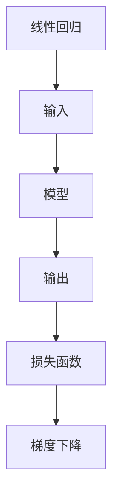

##### 2.1.1.1.2 逻辑回归

逻辑回归是一种用于分类问题的监督学习算法，它通过拟合一个逻辑函数来预测概率。

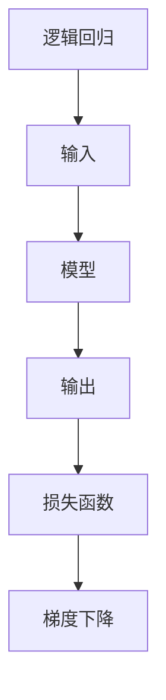

###### 2.1.1.2 无监督学习

无监督学习是一种不使用标注数据来训练模型的方法。它主要通过发现数据中的模式或结构来进行学习。

##### 2.1.1.2.1 聚类算法

聚类算法是一种无监督学习方法，它通过将相似的数据点分组来发现数据中的模式。

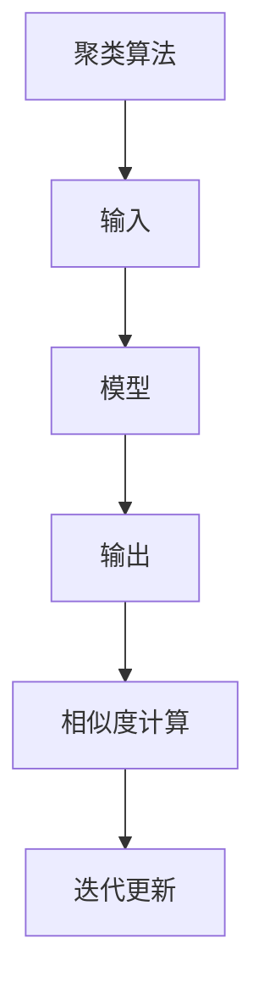

##### 2.1.1.2.2 维度降低

维度降低是一种无监督学习方法，它通过减少数据的维度来提高模型的效率和准确性。

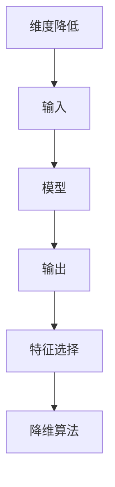

##### 2.1.2 深度学习

深度学习是机器学习的一个分支，它通过多层神经网络来实现复杂的模型。

###### 2.1.2.1 神经网络基础

神经网络是一种模拟人脑神经元连接的网络结构。

##### 2.1.2.1.1 前向传播与反向传播

前向传播和反向传播是深度学习中的两个核心过程。

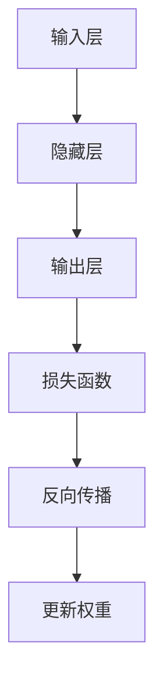

##### 2.1.2.1.2 激活函数

激活函数是神经网络中的一个关键组件，它用于引入非线性特性。

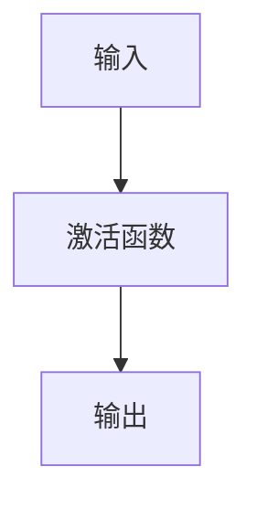

###### 2.1.2.2 卷积神经网络

卷积神经网络是一种专门用于图像识别和处理的深度学习模型。

##### 2.1.2.2.1 卷积操作

卷积操作是卷积神经网络中的一个核心操作。

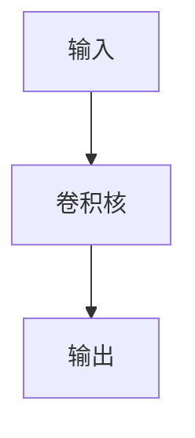

##### 2.1.2.2.2 池化操作

池化操作是卷积神经网络中的一个重要操作，它用于降低特征图的维度。

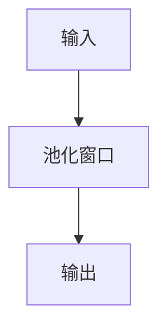

##### 2.1.3 自然语言处理

自然语言处理是一种让计算机理解和生成人类语言的技术。

###### 2.1.3.1 词嵌入技术

词嵌入是一种将词语映射到高维向量空间的技术。

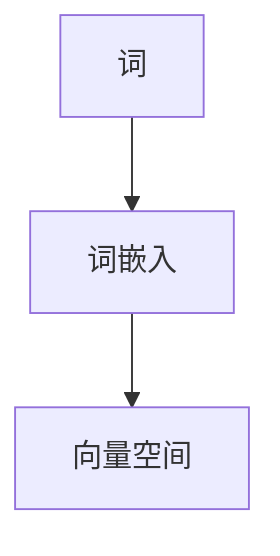

##### 2.1.3.1.1 word2vec算法

word2vec算法是一种常用的词嵌入算法。

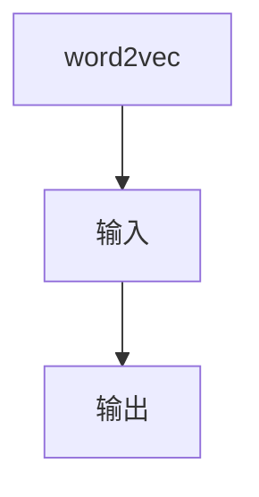

##### 2.1.3.1.2 GloVe算法

GloVe算法是一种基于全局上下文的词嵌入算法。

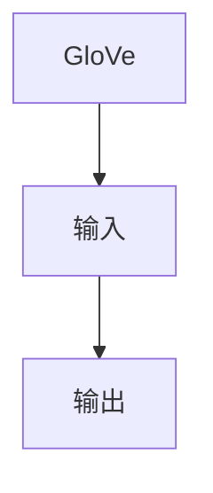

###### 2.1.3.2 序列模型与注意力机制

序列模型和注意力机制是自然语言处理中的两个重要概念。

##### 2.1.3.2.1 RNN与LSTM

RNN和LSTM是两种常用的序列模型。

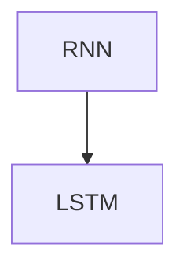

##### 2.1.3.2.2 Transformer与BERT

Transformer和BERT是两种基于注意力机制的深度学习模型。

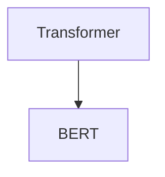

#### 2.2 AI应用场景分析

##### 2.2.1 医疗保健

AI在医疗保健领域的应用非常广泛，包括疾病预测、诊断和治疗等。

###### 2.2.1.1 疾病预测与诊断

疾病预测与诊断是AI在医疗保健中的一个重要应用。

##### 2.2.1.1.1 基于影像的疾病预测

基于影像的疾病预测是利用AI技术对医学影像进行分析，从而预测疾病的发生。

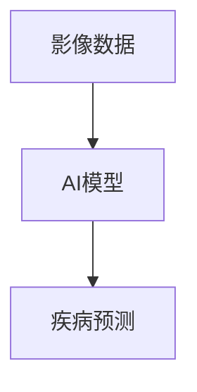

##### 2.2.1.1.2 基于基因数据的疾病诊断

基于基因数据的疾病诊断是利用AI技术对基因数据进行分析，从而诊断疾病。

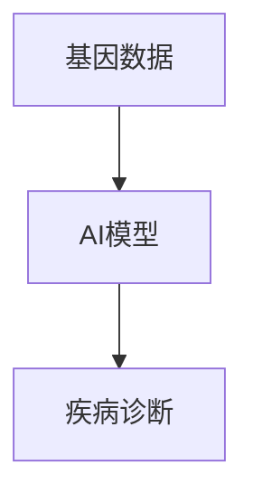

##### 2.2.2 金融领域

AI在金融领域的应用也非常广泛，包括信贷风险评估、投资分析和风险管理等。

###### 2.2.2.1 信贷风险评估

信贷风险评估是利用AI技术对借款人的信用状况进行分析，从而评估其还款能力。

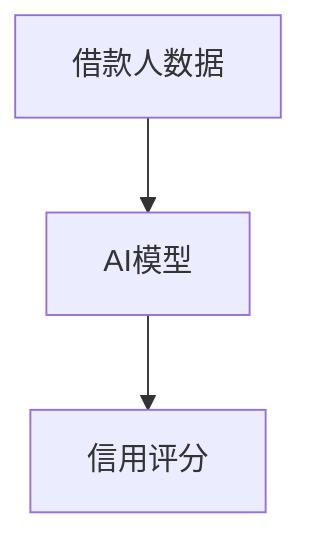

##### 2.2.2.1.1 机器学习模型在信贷风险评估中的应用

机器学习模型在信贷风险评估中的应用是利用机器学习算法对借款人数据进行建模和分析。

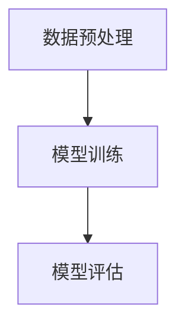

##### 2.2.2.1.2 数据预处理与特征提取

数据预处理与特征提取是信贷风险评估中的关键步骤。

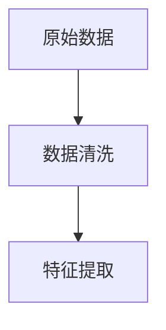

##### 2.2.3 教育领域

AI在教育领域的应用包括个性化学习推荐系统、在线教育平台和智能教育评估等。

###### 2.2.3.1 个性化学习推荐系统

个性化学习推荐系统是利用AI技术为学生提供个性化的学习资源和服务。

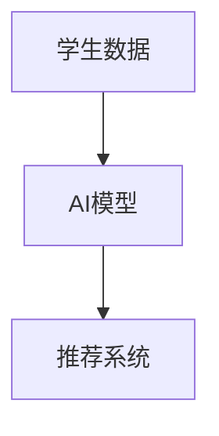

##### 2.2.3.1.1 个性化学习推荐算法

个性化学习推荐算法是利用AI技术为学生提供个性化的学习资源和服务。

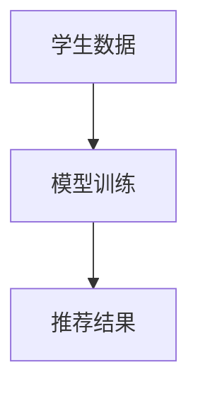

##### 2.2.3.1.2 教育数据收集与处理

教育数据收集与处理是构建个性化学习推荐系统的关键步骤。

```mermaid
graph TD
A[教育数据] --> B[数据收集]
B --> C[数据处理]
```

##### 2.2.4 社会责任与可持续发展

AI技术在社会责任和可持续发展中的应用包括环境保护、能源管理和智能交通等。

###### 2.2.4.1 环境保护

AI技术在环境保护中的应用包括污染监测、资源优化和可持续发展规划等。

```mermaid
graph TD
A[环境数据] --> B[AI模型]
B --> C[环境保护措施]
```

##### 2.2.4.1.1 智能交通

智能交通是利用AI技术优化交通管理和提高交通效率的应用。

```mermaid
graph TD
A[交通数据] --> B[AI模型]
B --> C[交通优化]
```

##### 2.2.4.1.2 能源管理

能源管理是利用AI技术优化能源消耗和能源利用的应用。

```mermaid
graph TD
A[能源数据] --> B[AI模型]
B --> C[能源优化]
```

#### 2.3 AI伦理与社会责任

##### 2.3.1 AI伦理问题探讨

AI伦理问题涉及到数据隐私、算法偏见和社会影响等方面。

###### 2.3.1.1 数据隐私保护

数据隐私保护是AI伦理中的一个重要问题。

```mermaid
graph TD
A[个人数据] --> B[AI模型]
B --> C[隐私保护]
```

##### 2.3.1.1.1 数据匿名化与去识别化

数据匿名化与去识别化是数据隐私保护中的关键步骤。

```mermaid
graph TD
A[原始数据] --> B[数据匿名化]
B --> C[去识别化]
```

##### 2.3.1.1.2 数据监管与法律法规

数据监管与法律法规是确保数据隐私保护的重要手段。

```mermaid
graph TD
A[数据隐私] --> B[法律法规]
B --> C[监管机构]
```

##### 2.3.2 社会责任与可持续发展

AI技术在社会责任和可持续发展中的应用包括环境保护、能源管理和智能交通等。

###### 2.3.2.1 AI对就业市场的影响

AI对就业市场的影响是一个备受关注的问题。

```mermaid
graph TD
A[AI技术] --> B[就业市场]
B --> C[影响分析]
```

##### 2.3.2.1.1 人工智能与自动化对工作岗位的替代

人工智能与自动化对工作岗位的替代是一个重要的问题。

```mermaid
graph TD
A[自动化技术] --> B[工作岗位]
B --> C[影响分析]
```

##### 2.3.2.1.2 新型就业机会的产生与技能培训

新型就业机会的产生与技能培训是应对AI对就业市场影响的重要措施。

```mermaid
graph TD
A[新型就业] --> B[技能培训]
B --> C[人才培养]
```

### 第三部分：AI创业实战

#### 3.1 创业者视角的AI应用

##### 3.1.1 创业者如何选择AI应用方向

选择合适的AI应用方向是AI创业的关键。

###### 3.1.1.1 市场需求分析

市场需求分析是选择AI应用方向的重要步骤。

```mermaid
graph TD
A[市场需求] --> B[分析]
B --> C[选择]
```

##### 3.1.1.1.1 市场调研与竞品分析

市场调研与竞品分析是市场需求分析中的关键步骤。

```mermaid
graph TD
A[市场调研] --> B[竞品分析]
B --> C[需求分析]
```

##### 3.1.1.1.2 创业者如何评估AI技术的可行性

创业者如何评估AI技术的可行性是选择AI应用方向的重要问题。

```mermaid
graph TD
A[AI技术] --> B[评估]
B --> C[可行性分析]
```

##### 3.1.2 AI创业项目实施步骤

##### 3.1.2.1 项目构思与规划

项目构思与规划是AI创业项目实施的第一步。

```mermaid
graph TD
A[项目构思] --> B[规划]
B --> C[实施步骤]
```

##### 3.1.2.1.1 创业团队组建

创业团队组建是项目规划中的关键步骤。

```mermaid
graph TD
A[团队组建] --> B[团队成员]
B --> C[项目规划]
```

##### 3.1.2.1.2 创业项目商业模式设计

创业项目商业模式设计是项目规划中的重要环节。

```mermaid
graph TD
A[商业模式设计] --> B[商业模式分析]
B --> C[项目实施]
```

##### 3.1.3 创业案例分享

##### 3.1.3.1 成功案例介绍

成功案例介绍是AI创业实战中的重要环节。

```mermaid
graph TD
A[成功案例] --> B[介绍]
B --> C[经验分享]
```

##### 3.1.3.1.1 某医疗AI创业公司的案例

某医疗AI创业公司的案例是一个成功的AI创业案例。

```mermaid
graph TD
A[医疗AI公司] --> B[案例介绍]
B --> C[成功经验]
```

##### 3.1.3.1.2 某金融AI创业公司的案例

某金融AI创业公司的案例是一个成功的AI创业案例。

```mermaid
graph TD
A[金融AI公司] --> B[案例介绍]
B --> C[成功经验]
```

##### 3.1.4 创业过程中的挑战与应对策略

##### 3.1.4.1 技术难题

技术难题是AI创业过程中常见的问题。

```mermaid
graph TD
A[技术难题] --> B[应对策略]
B --> C[解决方案]
```

##### 3.1.4.1.1 复杂模型的训练与优化

复杂模型的训练与优化是技术难题中的一个重要问题。

```mermaid
graph TD
A[模型训练] --> B[优化策略]
B --> C[解决方案]
```

##### 3.1.4.1.2 大规模数据处理与存储

大规模数据处理与存储是技术难题中的另一个重要问题。

```mermaid
graph TD
A[数据处理] --> B[存储策略]
B --> C[解决方案]
```

##### 3.1.4.2 市场竞争

##### 3.1.4.2.1 市场定位与差异化竞争

市场定位与差异化竞争是应对市场竞争的重要策略。

```mermaid
graph TD
A[市场定位] --> B[差异化竞争]
B --> C[应对策略]
```

##### 3.1.4.2.2 创业者如何构建核心竞争力

创业者如何构建核心竞争力是应对市场竞争的关键。

```mermaid
graph TD
A[核心竞争力] --> B[构建策略]
B --> C[解决方案]
```

##### 3.1.5 创业团队建设

##### 3.1.5.1 团队成员的角色与职责

团队成员的角色与职责是创业团队建设的重要环节。

```mermaid
graph TD
A[团队成员] --> B[角色与职责]
B --> C[团队建设]
```

##### 3.1.5.1.1 技术团队

技术团队是创业团队中的核心力量。

```mermaid
graph TD
A[技术团队] --> B[团队成员]
B --> C[角色与职责]
```

##### 3.1.5.1.2 业务团队

业务团队是创业团队中的重要组成部分。

```mermaid
graph TD
A[业务团队] --> B[团队成员]
B --> C[角色与职责]
```

##### 3.1.6 团队协作与沟通

##### 3.1.6.1 团队协作工具使用

团队协作工具使用是团队协作与沟通的重要手段。

```mermaid
graph TD
A[协作工具] --> B[使用策略]
B --> C[团队协作]
```

##### 3.1.6.1.1 Git与GitHub

Git与GitHub是常用的版本控制和代码托管工具。

```mermaid
graph TD
A[Git与GitHub] --> B[使用方法]
B --> C[协作工具]
```

##### 3.1.6.1.2 JIRA与Confluence

JIRA与Confluence是常用的项目管理工具。

```mermaid
graph TD
A[JIRA与Confluence] --> B[使用方法]
B --> C[协作工具]
```

##### 3.1.6.2 沟通与协作技巧

##### 3.1.6.2.1 敏捷开发方法

敏捷开发方法是一种高效的项目管理方法。

```mermaid
graph TD
A[敏捷开发] --> B[方法与技巧]
B --> C[沟通与协作]
```

##### 3.1.6.2.2 项目管理工具应用

项目管理工具应用是敏捷开发中的重要环节。

```mermaid
graph TD
A[项目管理工具] --> B[应用方法]
B --> C[沟通与协作]
```

##### 3.1.7 AI创业融资策略

##### 3.1.7.1 融资渠道与策略

融资渠道与策略是AI创业成功的关键。

```mermaid
graph TD
A[融资渠道] --> B[融资策略]
B --> C[融资成功]
```

##### 3.1.7.1.1 天使投资与风险投资

天使投资与风险投资是常见的融资渠道。

```mermaid
graph TD
A[天使投资] --> B[风险投资]
B --> C[融资渠道]
```

##### 3.1.7.1.2 天使投资的特点与筛选标准

天使投资的特点与筛选标准是融资策略中的重要问题。

```mermaid
graph TD
A[天使投资] --> B[特点与筛选标准]
B --> C[融资策略]
```

##### 3.1.7.1.3 风险投资的选择与谈判

风险投资的选择与谈判是融资策略中的关键环节。

```mermaid
graph TD
A[风险投资] --> B[选择与谈判]
B --> C[融资策略]
```

##### 3.1.8 财务规划与资金管理

##### 3.1.8.1 项目预算与财务预测

项目预算与财务预测是财务规划与资金管理的重要环节。

```mermaid
graph TD
A[项目预算] --> B[财务预测]
B --> C[资金管理]
```

##### 3.1.8.1.1 创业初期资金需求分析

创业初期资金需求分析是项目预算与财务预测的基础。

```mermaid
graph TD
A[资金需求分析] --> B[项目预算]
B --> C[财务预测]
```

##### 3.1.8.1.2 长期财务规划与风险控制

长期财务规划与风险控制是财务规划与资金管理中的重要问题。

```mermaid
graph TD
A[长期财务规划] --> B[风险控制]
B --> C[资金管理]
```

##### 3.1.9 融资后的管理与退出策略

##### 3.1.9.1 融资后企业运营管理

融资后企业运营管理是融资成功后的关键问题。

```mermaid
graph TD
A[企业运营管理] --> B[融资后管理]
B --> C[退出策略]
```

##### 3.1.9.1.1 融资后的团队扩张与优化

融资后的团队扩张与优化是运营管理中的重要环节。

```mermaid
graph TD
A[团队扩张与优化] --> B[运营管理]
B --> C[退出策略]
```

##### 3.1.9.1.2 融资后的市场拓展与品牌建设

融资后的市场拓展与品牌建设是运营管理中的重要问题。

```mermaid
graph TD
A[市场拓展与品牌建设] --> B[运营管理]
B --> C[退出策略]
```

##### 3.1.9.2 退出策略

退出策略是创业过程中的重要问题。

```mermaid
graph TD
A[退出策略] --> B[股权转让]
B --> C[并购]
```

##### 3.1.9.2.1 股权转让与并购

股权转让与并购是常见的退出策略。

```mermaid
graph TD
A[股权转让] --> B[并购]
B --> C[退出策略]
```

##### 3.1.9.2.2 初始公共股

初始公共股是退出策略中的一个重要环节。

```mermaid
graph TD
A[初始公共股] --> B[退出策略]
B --> C[退出策略]
```

### 作者信息

作者：AI天才研究院/AI Genius Institute & 禅与计算机程序设计艺术 /Zen And The Art of Computer Programming

（文章未完成，待继续补充和完善）
### 第一部分：引言

#### 1.1 书籍背景与目的

随着人工智能（AI）技术的飞速发展，AI已经从实验室走向了实际应用，成为推动各个行业创新和进步的重要力量。在这个背景下，越来越多的创业者开始将AI技术作为创业的核心驱动力，希望通过AI的应用来改善人们的生活，创造社会价值。然而，AI技术的复杂性和广泛性使得许多创业者面临着技术理解、应用场景选择和创业实践等方面的挑战。

本书旨在为这些AI创业者提供一本全面、系统的指南，帮助他们理解和掌握AI技术，找到适合自己的创业方向，并顺利地将AI技术应用于实际业务中。本书的目的是：

1. **介绍AI的基本概念和技术**：通过深入剖析机器学习、深度学习、自然语言处理等AI核心技术，让创业者对AI有全面的认识。
2. **分析AI的应用场景**：探讨AI在不同领域（如医疗、金融、教育等）的应用，帮助创业者找到合适的创业方向。
3. **探讨AI伦理和社会责任**：关注AI技术带来的伦理和社会问题，引导创业者负责任地应用AI技术。
4. **分享AI创业实战经验**：通过真实案例分享和经验总结，为创业者提供实用的创业指导。

#### 1.2 AI创业者的必备知识

成为一名成功的AI创业者，需要掌握以下几方面的知识：

1. **AI基础理论**：了解机器学习、深度学习、自然语言处理等AI核心技术的理论基础，这是理解和应用AI技术的关键。
2. **数据科学和编程能力**：熟悉Python、R等编程语言，掌握数据清洗、数据分析和数据可视化等技能，这是AI项目实施的基础。
3. **业务理解**：对创业领域有深入的了解，能够将AI技术应用到实际的业务场景中，解决实际问题。
4. **创业管理知识**：了解创业流程、商业模式设计、团队建设、融资策略等管理知识，这是确保创业项目成功的重要因素。

#### 1.3 书籍结构安排

本书分为三个主要部分：

1. **第一部分：AI基础**：介绍AI的核心技术，包括机器学习、深度学习、自然语言处理等，并配以流程图和算法原理讲解。
2. **第二部分：AI应用场景分析**：分析AI在不同领域的应用，如医疗、金融、教育等，探讨AI如何改善人们的生活。
3. **第三部分：AI创业实战**：分享AI创业者的实战经验和教训，包括团队建设、融资策略等，为创业者提供实战指导。

通过本书的阅读，AI创业者将能够系统地掌握AI知识，明确自己的创业方向，并具备应对创业过程中各种挑战的能力。接下来，我们将深入探讨AI的基础知识，为创业者打下坚实的理论基础。

### 第一部分：引言

#### 1.4 AI创业的挑战与机遇

对于AI创业者来说，挑战与机遇并存。首先，技术挑战是不可避免的。AI技术不断更新迭代，创业者需要持续学习，跟上技术发展的步伐。此外，AI项目的实施通常涉及到大量的数据、复杂的算法和大规模的计算资源，这对创业者的技术能力和资源管理提出了高要求。

其次，市场挑战同样不可忽视。AI技术的应用场景广泛，但并不意味着每个场景都有足够的商业机会。创业者需要在众多应用场景中找到适合自己创业的方向，这需要深入的市场调研和精准的市场定位。同时，市场上的竞争也非常激烈，创业者需要具备强大的创新能力和差异化优势，以在竞争中脱颖而出。

然而，机遇同样诱人。随着AI技术的普及和应用，越来越多的行业开始意识到AI的价值，并开始积极采用AI技术进行创新。这为AI创业者提供了广阔的市场空间和创业机会。AI技术能够带来更高的生产效率、更好的用户体验和更优的决策支持，这些都是创业者可以借助的优势。

总的来说，AI创业的挑战与机遇是并存的。创业者需要具备敏锐的洞察力，识别出市场机会，并运用AI技术实现价值创造。同时，创业者也需要具备坚韧的毅力，面对技术难题和市场不确定性，不断迭代和优化自己的创业项目。

#### 1.5 本文的写作目的

本文的写作目的是为AI创业者提供一本系统、全面的指南，帮助他们从技术、应用、伦理和创业实践等多个角度全面理解和掌握AI知识。具体来说，本文有以下目标：

1. **提供AI技术的基础知识**：通过详细讲解机器学习、深度学习、自然语言处理等核心技术，帮助创业者建立起扎实的AI技术基础。
2. **分析AI的应用场景**：探讨AI在医疗、金融、教育等领域的应用，帮助创业者找到合适的创业方向。
3. **探讨AI伦理问题**：关注AI技术可能带来的伦理和社会责任问题，引导创业者负责任地应用AI技术。
4. **分享AI创业实战经验**：通过真实案例分享和经验总结，为创业者提供实用的创业指导。

本文希望通过这些内容，帮助创业者更好地理解AI技术，明确自己的创业方向，并在实际创业过程中克服各种挑战，实现创业的成功。

### 第二部分：AI基础

#### 2.1 AI核心技术

人工智能（AI）技术是AI创业的核心，理解AI的核心技术对于创业者来说至关重要。本节将介绍AI的核心技术，包括机器学习、深度学习和自然语言处理，以及这些技术在创业中的应用。

##### 2.1.1 机器学习基础

机器学习是AI的核心技术之一，它使得计算机能够通过数据和经验来改进性能。机器学习可以分为监督学习和无监督学习两种主要类型。

###### 2.1.1.1 监督学习

监督学习是一种通过训练数据集来构建模型的机器学习方法。模型从训练数据中学习输入和输出之间的映射关系，以便能够对新数据进行预测或分类。

##### 2.1.1.1.1 线性回归

线性回归是一种简单的监督学习算法，用于预测连续值。它通过拟合一条直线来表示输入和输出之间的关系。

```mermaid
graph TD
A[输入变量] --> B[线性模型]
B --> C[预测结果]
```

线性回归的数学模型为：
$$
Y = \beta_0 + \beta_1X + \epsilon
$$

其中，\(Y\) 是目标变量，\(X\) 是输入变量，\(\beta_0\) 和 \(\beta_1\) 是模型参数，\(\epsilon\) 是误差项。

##### 2.1.1.1.2 逻辑回归

逻辑回归是一种用于分类问题的监督学习算法，它通过拟合一个逻辑函数来预测概率。逻辑回归常用于二元分类问题，其输出概率介于0和1之间。

```mermaid
graph TD
A[输入变量] --> B[逻辑模型]
B --> C[概率输出]
```

逻辑回归的数学模型为：
$$
\text{logit}(P) = \ln\left(\frac{P}{1-P}\right) = \beta_0 + \beta_1X
$$

其中，\(P\) 是事件发生的概率，\(\text{logit}\) 是逻辑函数，\(\beta_0\) 和 \(\beta_1\) 是模型参数。

###### 2.1.1.2 无监督学习

无监督学习是一种不使用标注数据来训练模型的机器学习方法。它主要目标是发现数据中的内在结构和模式。

##### 2.1.1.2.1 聚类算法

聚类算法是一种无监督学习方法，用于将数据点分成多个群组，使得同组数据点之间的相似度较高，而不同组数据点之间的相似度较低。

```mermaid
graph TD
A[数据点] --> B[聚类模型]
B --> C[群组划分]
```

常见的聚类算法有K-均值聚类、层次聚类等。

##### 2.1.1.2.2 维度降低

维度降低是一种无监督学习方法，用于减少数据维度，从而简化模型复杂度，提高计算效率和预测准确性。

```mermaid
graph TD
A[高维数据] --> B[维度降低模型]
B --> C[低维数据]
```

常见的维度降低算法有主成分分析（PCA）、线性判别分析（LDA）等。

###### 2.1.2 深度学习

深度学习是一种基于多层神经网络的学习方法，它能够自动从大量数据中学习复杂的特征表示。深度学习在图像识别、语音识别和自然语言处理等领域取得了显著的成果。

##### 2.1.2.1 神经网络基础

神经网络是一种由大量节点（称为神经元）连接而成的计算模型，每个神经元都与其他神经元相连，并通过加权的方式传递信息。

```mermaid
graph TD
A[输入层] --> B[隐藏层]
B --> C[输出层]
```

神经网络的训练过程包括前向传播和反向传播。

- **前向传播**：输入数据通过网络传递，每个神经元计算其输出。
- **反向传播**：计算输出误差，并更新每个神经元的权重。

前向传播和反向传播的伪代码如下：

```python
# 前向传播
for each layer from input to hidden:
    for each neuron in the layer:
        output = activation(sum(input * weight for input in previous layer))
        
# 反向传播
for each layer from output to hidden:
    for each neuron in the layer:
        error = (expected_output - actual_output) * activation_derivative(output)
        weight_update = learning_rate * error * input
        weight -= weight_update
```

##### 2.1.2.2 卷积神经网络

卷积神经网络（CNN）是一种专门用于图像识别和处理的神经网络。它通过卷积操作和池化操作提取图像特征。

```mermaid
graph TD
A[输入图像] --> B[卷积层]
B --> C[池化层]
C --> D[全连接层]
```

卷积操作的伪代码如下：

```python
# 卷积操作
for each filter in the convolutional layer:
    for each patch in the input image:
        feature_map = convolution(patch, filter)
```

池化操作的伪代码如下：

```python
# 池化操作
for each patch in the feature map:
    pooled_value = max_value(patch)
```

##### 2.1.3 自然语言处理

自然语言处理（NLP）是一种让计算机理解和生成人类语言的技术。NLP技术在文本分类、情感分析、机器翻译等领域有广泛应用。

###### 2.1.3.1 词嵌入技术

词嵌入是将词汇映射到高维向量空间的技术。词嵌入能够捕捉词语的语义信息，从而在NLP任务中提高模型的性能。

```mermaid
graph TD
A[词汇] --> B[词嵌入]
B --> C[向量空间]
```

常见的词嵌入算法有word2vec和GloVe。

- **word2vec**：基于神经网络，通过训练预测目标词的上下文词向量。
- **GloVe**：基于全局共现矩阵，通过优化词语和向量之间的相似度来训练词向量。

```mermaid
graph TD
A[word2vec] --> B[GloVe]
```

###### 2.1.3.2 序列模型与注意力机制

序列模型用于处理序列数据，如文本和语音。循环神经网络（RNN）和长短期记忆网络（LSTM）是常用的序列模型。

```mermaid
graph TD
A[RNN] --> B[LSTM]
```

注意力机制是一种用于提高序列模型性能的技术，它能够自动关注序列中的关键部分。

```mermaid
graph TD
A[序列模型] --> B[注意力机制]
```

Transformer模型和BERT是利用注意力机制的先进NLP模型。

```mermaid
graph TD
A[Transformer] --> B[BERT]
```

#### 2.2 AI技术在创业中的应用

AI技术在创业中的应用非常广泛，不同领域有不同的应用场景和挑战。以下是一些常见的AI创业应用场景：

##### 2.2.1 医疗保健

AI在医疗保健领域的应用包括疾病预测、诊断和个性化治疗等。

###### 2.2.1.1 疾病预测与诊断

AI可以帮助医生进行疾病预测和诊断，通过分析大量的医疗数据，如病历、基因数据和影像数据，从而提高诊断的准确性和效率。

```mermaid
graph TD
A[医疗数据] --> B[AI模型]
B --> C[疾病预测]
```

###### 2.2.1.2 个性化治疗

AI可以根据患者的基因、病史和生活方式等数据，制定个性化的治疗方案，从而提高治疗效果。

```mermaid
graph TD
A[患者数据] --> B[AI模型]
B --> C[个性化治疗]
```

##### 2.2.2 金融领域

AI在金融领域的应用包括信贷风险评估、投资分析和风险管理等。

###### 2.2.2.1 信贷风险评估

AI可以通过分析借款人的信用记录、财务状况和行为数据，对信贷风险进行评估，从而降低不良贷款率。

```mermaid
graph TD
A[借款人数据] --> B[AI模型]
B --> C[信用评分]
```

###### 2.2.2.2 投资分析

AI可以帮助投资者分析市场趋势和投资机会，从而做出更准确的决策。

```mermaid
graph TD
A[市场数据] --> B[AI模型]
B --> C[投资建议]
```

##### 2.2.3 教育领域

AI在教育领域的应用包括个性化学习推荐、智能教育评估和在线教育平台等。

###### 2.2.3.1 个性化学习推荐

AI可以根据学生的学习数据和偏好，为其推荐合适的学习资源和课程。

```mermaid
graph TD
A[学习数据] --> B[AI模型]
B --> C[学习推荐]
```

###### 2.2.3.2 智能教育评估

AI可以通过分析学生的学习过程和行为数据，实时评估学生的学习效果，并提供个性化的反馈。

```mermaid
graph TD
A[学习过程数据] --> B[AI模型]
B --> C[教育评估]
```

##### 2.2.4 社会责任与可持续发展

AI技术在社会责任和可持续发展中的应用包括环境保护、能源管理和智能交通等。

###### 2.2.4.1 环境保护

AI可以通过分析环境数据，预测污染事件，并提出应对措施，从而保护环境。

```mermaid
graph TD
A[环境数据] --> B[AI模型]
B --> C[环境保护措施]
```

###### 2.2.4.2 能源管理

AI可以通过分析能源消耗数据，优化能源利用，降低能源成本。

```mermaid
graph TD
A[能源数据] --> B[AI模型]
B --> C[能源优化]
```

###### 2.2.4.3 智能交通

AI可以通过优化交通信号和路线规划，提高交通效率，减少拥堵。

```mermaid
graph TD
A[交通数据] --> B[AI模型]
B --> C[交通优化]
```

#### 2.3 AI创业项目实施步骤

##### 2.3.1 项目构思与规划

AI创业项目的实施首先要进行项目构思与规划，包括确定项目的目标、范围和预期成果。

```mermaid
graph TD
A[项目构思] --> B[规划]
B --> C[项目目标]
```

###### 2.3.1.1 市场调研与竞品分析

市场调研与竞品分析是项目构思的重要步骤，通过了解市场需求和竞争状况，为项目定位提供依据。

```mermaid
graph TD
A[市场调研] --> B[竞品分析]
B --> C[项目定位]
```

###### 2.3.1.2 创业团队组建

组建一个有技术能力和业务理解能力的创业团队是项目成功的关键。

```mermaid
graph TD
A[团队组建] --> B[团队成员]
B --> C[团队协作]
```

##### 2.3.2 项目实施

项目实施阶段包括数据收集、数据处理、模型训练和模型优化等步骤。

```mermaid
graph TD
A[数据收集] --> B[数据处理]
B --> C[模型训练]
C --> D[模型优化]
```

###### 2.3.2.1 数据收集与预处理

数据收集是AI项目的核心步骤，数据的质量直接影响模型的性能。

```mermaid
graph TD
A[数据收集] --> B[数据预处理]
B --> C[数据清洗]
```

###### 2.3.2.2 模型训练与优化

模型训练是AI项目的核心步骤，通过调整模型参数，使其在训练数据上达到最优性能。

```mermaid
graph TD
A[模型训练] --> B[模型优化]
B --> C[性能评估]
```

##### 2.3.3 项目部署与运营

项目部署与运营阶段包括模型部署、系统集成和业务运营等步骤。

```mermaid
graph TD
A[模型部署] --> B[系统集成]
B --> C[业务运营]
```

###### 2.3.3.1 模型部署

模型部署是将训练好的模型应用到实际业务场景中的过程。

```mermaid
graph TD
A[模型部署] --> B[模型集成]
B --> C[业务测试]
```

###### 2.3.3.2 系统集成

系统集成是将AI模型与其他业务系统集成为一个完整的业务解决方案。

```mermaid
graph TD
A[系统集成] --> B[功能测试]
B --> C[用户培训]
```

###### 2.3.3.3 业务运营

业务运营是项目实施后的关键步骤，包括用户反馈收集、系统维护和优化等。

```mermaid
graph TD
A[业务运营] --> B[用户反馈]
B --> C[系统优化]
```

### 第三部分：AI创业实战

#### 3.1 创业者视角的AI应用

在AI创业过程中，创业者需要具备敏锐的市场洞察力和创新精神，将AI技术应用到实际的业务场景中，解决实际问题。以下将从市场调研、技术选型、团队协作和商业模式设计等方面，探讨AI创业者的视角和策略。

##### 3.1.1 市场需求分析

市场需求分析是AI创业的第一步，创业者需要深入了解目标市场的需求，识别出潜在的商业机会。

###### 3.1.1.1 市场调研

市场调研包括对目标市场的用户需求、竞争状况和市场规模进行深入分析。创业者可以通过以下方法进行市场调研：

- **问卷调查**：通过设计问卷收集用户反馈，了解用户需求和使用习惯。
- **访谈调研**：与目标用户进行面对面访谈，深入了解他们的需求和痛点。
- **数据分析**：通过分析公开的数据和报告，获取市场趋势和用户行为数据。

```mermaid
graph TD
A[问卷调查] --> B[访谈调研]
B --> C[数据分析]
```

###### 3.1.1.2 竞品分析

竞品分析是了解市场状况的重要手段，创业者需要分析竞争对手的产品、市场定位和竞争优势。

- **产品功能**：分析竞品的产品功能和特点，了解用户的使用体验。
- **市场定位**：分析竞品的市场定位和目标用户群体，了解市场细分和需求分布。
- **商业模式**：分析竞品的商业模式和盈利模式，了解市场的盈利潜力。

```mermaid
graph TD
A[产品功能] --> B[市场定位]
B --> C[商业模式]
```

###### 3.1.1.3 创业者如何评估AI技术的可行性

在市场调研的基础上，创业者需要评估AI技术的可行性，确定是否将AI技术应用于创业项目中。

- **技术成熟度**：评估所选AI技术的成熟度，确保其能够满足业务需求。
- **技术难度**：评估AI技术的技术难度，确保团队具备相应的技术能力。
- **成本效益**：评估AI技术的成本效益，确保项目能够实现盈利。

```mermaid
graph TD
A[技术成熟度] --> B[技术难度]
B --> C[成本效益]
```

##### 3.1.2 AI创业项目实施步骤

AI创业项目的实施需要系统化、规范化的步骤，以下是一个典型的AI创业项目实施步骤：

###### 3.1.2.1 项目构思与规划

项目构思与规划是项目实施的第一步，包括确定项目目标、范围和预期成果。

```mermaid
graph TD
A[项目目标] --> B[项目范围]
B --> C[预期成果]
```

###### 3.1.2.2 数据收集与处理

数据收集与处理是AI项目的核心步骤，创业者需要收集和整理大量的数据，并进行预处理和特征提取。

```mermaid
graph TD
A[数据收集] --> B[数据预处理]
B --> C[特征提取]
```

###### 3.1.2.3 模型训练与优化

模型训练与优化是项目实施的关键环节，创业者需要根据业务需求选择合适的AI模型，并进行训练和优化。

```mermaid
graph TD
A[模型选择] --> B[模型训练]
B --> C[模型优化]
```

###### 3.1.2.4 模型评估与部署

模型评估与部署是项目实施的最后一步，创业者需要评估模型的性能，并进行模型部署和系统集成。

```mermaid
graph TD
A[模型评估] --> B[模型部署]
B --> C[系统集成]
```

##### 3.1.3 创业案例分享

以下分享两个成功的AI创业案例，以供创业者借鉴：

###### 3.1.3.1 某医疗AI创业公司

某医疗AI创业公司通过开发一款智能诊断系统，帮助医生进行疾病诊断。公司采用了深度学习技术，通过对大量医学影像数据进行分析，实现了高度准确的疾病诊断。

- **市场定位**：公司定位于提供精准、高效的医学影像诊断服务，针对大型医院和诊所。
- **商业模式**：公司采用B2B模式，与医院和诊所合作，通过提供诊断服务收取服务费。
- **成功经验**：公司成功的关键在于其高度准确的诊断模型和优质的客户服务。

```mermaid
graph TD
A[市场定位] --> B[商业模式]
B --> C[成功经验]
```

###### 3.1.3.2 某金融AI创业公司

某金融AI创业公司通过开发一款智能投资顾问系统，帮助投资者进行投资决策。公司采用了机器学习技术和大数据分析，实现了个性化投资建议。

- **市场定位**：公司定位于提供个性化、智能化的投资服务，针对个人投资者和小型基金。
- **商业模式**：公司采用B2C模式，通过在线平台为用户提供智能投资顾问服务。
- **成功经验**：公司成功的关键在于其高效的算法和优质的用户体验。

```mermaid
graph TD
A[市场定位] --> B[商业模式]
B --> C[成功经验]
```

##### 3.1.4 创业过程中的挑战与应对策略

在AI创业过程中，创业者会遇到各种挑战，以下是一些常见的挑战和应对策略：

###### 3.1.4.1 技术挑战

技术挑战是AI创业过程中最常见的挑战，包括算法选择、模型优化和数据处理等。

- **算法选择**：创业者需要根据业务需求选择合适的算法，避免选择过于复杂或过于简单的算法。
- **模型优化**：创业者需要不断优化模型，提高模型的准确性和效率。
- **数据处理**：创业者需要收集和整理大量的数据，并进行有效的预处理和特征提取。

```mermaid
graph TD
A[算法选择] --> B[模型优化]
B --> C[数据处理]
```

###### 3.1.4.2 市场竞争

市场竞争是AI创业过程中的另一个重要挑战，创业者需要找到差异化的竞争优势。

- **市场定位**：创业者需要明确自己的市场定位，找到目标市场和目标用户。
- **创新性**：创业者需要不断创新，提供独特的产品或服务。
- **品牌建设**：创业者需要通过品牌建设和市场营销，提高品牌知名度和用户认可度。

```mermaid
graph TD
A[市场定位] --> B[创新性]
B --> C[品牌建设]
```

##### 3.1.5 创业团队建设

创业团队建设是AI创业成功的关键，创业者需要组建一支有技术能力和业务理解能力的团队。

###### 3.1.5.1 团队成员的角色与职责

创业者需要明确团队成员的角色与职责，确保团队高效协作。

- **技术团队成员**：负责AI模型开发、算法优化和数据处理等。
- **业务团队成员**：负责市场调研、客户沟通和商业模式设计等。
- **运营团队成员**：负责项目实施、团队协作和业务运营等。

```mermaid
graph TD
A[技术团队成员] --> B[业务团队成员]
B --> C[运营团队成员]
```

###### 3.1.5.2 团队协作与沟通

团队协作与沟通是创业团队成功的关键，创业者需要建立有效的团队协作与沟通机制。

- **团队协作工具**：使用Git、GitHub、JIRA、Confluence等工具，提高团队协作效率。
- **敏捷开发方法**：采用敏捷开发方法，快速迭代和优化产品。
- **项目管理工具**：使用Trello、Asana等项目管理工具，提高项目管理效率。

```mermaid
graph TD
A[团队协作工具] --> B[敏捷开发方法]
B --> C[项目管理工具]
```

##### 3.1.6 融资策略

融资策略是AI创业成功的重要因素，创业者需要制定有效的融资策略。

###### 3.1.6.1 融资渠道与策略

创业者可以选择以下融资渠道：

- **天使投资**：天使投资通常在创业初期提供资金支持，创业者需要准备详细的商业计划和项目演示。
- **风险投资**：风险投资通常在项目发展期提供资金支持，创业者需要展示项目的市场潜力和盈利模式。
- **众筹**：众筹是一种通过公众集资的方式，创业者需要制作吸引人的营销材料。

```mermaid
graph TD
A[天使投资] --> B[风险投资]
B --> C[众筹]
```

###### 3.1.6.2 融资后的管理与退出策略

融资后，创业者需要有效管理资金，并制定退出策略。

- **资金管理**：创业者需要制定详细的财务规划，确保资金的合理使用和有效监控。
- **团队扩张与优化**：创业者需要根据项目需要，合理调整团队规模和人员结构。
- **市场拓展与品牌建设**：创业者需要通过市场拓展和品牌建设，提高项目知名度和用户认可度。
- **退出策略**：创业者需要根据项目发展情况和市场状况，选择合适的退出策略，如股权转让、并购或上市等。

```mermaid
graph TD
A[资金管理] --> B[团队扩张与优化]
B --> C[市场拓展与品牌建设]
C --> D[退出策略]
```

### 第三部分：AI创业实战

#### 3.1 创业者视角的AI应用

在AI创业的大潮中，创业者不仅需要拥有创新的技术理念，还需要具备清晰的市场洞察力和战略思维。本章节将深入探讨创业者如何从市场需求分析、技术选型、团队建设到融资策略，一步步实现AI创业的愿景。

##### 3.1.1 市场需求分析

市场需求分析是AI创业的起点，它关乎创业项目的成功与否。创业者需要通过市场调研，深入了解目标客户的需求、痛点和行为模式，以便为产品或服务定位提供依据。

###### 3.1.1.1 市场调研

市场调研是获取市场信息的重要手段，创业者可以通过以下几种方式进行市场调研：

- **问卷调查**：设计有针对性的问卷，通过线上或线下的方式收集用户反馈，了解用户的需求和偏好。
- **访谈调研**：直接与潜在客户或行业专家进行面对面交流，获取更深层次的市场见解。
- **数据分析**：分析现有的市场报告、行业数据和用户行为数据，从中发现市场趋势和机会点。

```mermaid
graph TD
A[问卷调查] --> B[访谈调研]
B --> C[数据分析]
```

###### 3.1.1.2 竞品分析

竞品分析可以帮助创业者了解市场竞争状况，发现自身的优势与劣势。竞品分析的内容包括：

- **产品功能**：对比竞品的产品功能，分析其优缺点。
- **市场定位**：分析竞品的市场定位，了解其目标客户群体。
- **商业模式**：研究竞品的商业模式，学习其盈利模式和营销策略。

```mermaid
graph TD
A[产品功能] --> B[市场定位]
B --> C[商业模式]
```

###### 3.1.1.3 创业者如何评估AI技术的可行性

在确定市场方向后，创业者需要评估所选AI技术的可行性，确保技术方案能够满足市场需求。

- **技术成熟度**：评估所选AI技术的研究进展和应用成熟度。
- **技术难度**：分析所需技术的复杂程度，确保团队具备相关技术能力。
- **成本效益**：计算AI技术实施的总成本和预期收益，确保项目在经济上可行。

```mermaid
graph TD
A[技术成熟度] --> B[技术难度]
B --> C[成本效益]
```

##### 3.1.2 AI创业项目实施步骤

AI创业项目的实施需要系统化和规范化的步骤，以下是典型的AI创业项目实施步骤：

###### 3.1.2.1 项目构思与规划

项目构思与规划是项目实施的第一步，创业者需要明确项目的目标、范围和预期成果。

```mermaid
graph TD
A[项目目标] --> B[项目范围]
B --> C[预期成果]
```

###### 3.1.2.2 数据收集与处理

数据收集与处理是AI项目的核心步骤，创业者需要收集和整理大量的数据，并进行预处理和特征提取。

```mermaid
graph TD
A[数据收集] --> B[数据预处理]
B --> C[特征提取]
```

###### 3.1.2.3 模型训练与优化

模型训练与优化是项目实施的关键环节，创业者需要根据业务需求选择合适的AI模型，并进行训练和优化。

```mermaid
graph TD
A[模型选择] --> B[模型训练]
B --> C[模型优化]
```

###### 3.1.2.4 模型评估与部署

模型评估与部署是项目实施的最后一步，创业者需要评估模型的性能，并进行模型部署和系统集成。

```mermaid
graph TD
A[模型评估] --> B[模型部署]
B --> C[系统集成]
```

##### 3.1.3 创业案例分享

通过以下两个成功案例，我们可以看到创业者如何通过AI技术实现商业价值。

###### 3.1.3.1 某医疗AI创业公司

某医疗AI创业公司通过开发一款基于深度学习的医学影像分析系统，帮助医生更准确地诊断疾病。公司采用了大规模的影像数据集进行模型训练，并在多个临床场景中进行了验证。

- **市场定位**：公司定位于提供高端医学影像分析服务，目标客户为大型医院和医疗中心。
- **商业模式**：公司采用B2B模式，通过向医院和诊所提供影像分析服务获得收入。
- **成功经验**：公司成功的关键在于其高质量的模型和强大的数据处理能力，使得诊断准确率远超传统方法。

```mermaid
graph TD
A[市场定位] --> B[商业模式]
B --> C[成功经验]
```

###### 3.1.3.2 某金融AI创业公司

某金融AI创业公司通过开发一款智能投顾平台，帮助用户进行资产配置和投资决策。公司采用了机器学习算法和大数据分析技术，为用户提供个性化的投资建议。

- **市场定位**：公司定位于提供智能化、个性化的投资服务，目标客户为个人投资者和小型基金。
- **商业模式**：公司采用B2C模式，通过在线平台向用户提供智能投顾服务。
- **成功经验**：公司成功的关键在于其高效、准确的算法和优质的用户体验。

```mermaid
graph TD
A[市场定位] --> B[商业模式]
B --> C[成功经验]
```

##### 3.1.4 创业过程中的挑战与应对策略

AI创业过程中，创业者会面临多种挑战，包括技术难题、市场竞争和资金压力等。以下是常见的挑战和应对策略：

###### 3.1.4.1 技术挑战

技术挑战是AI创业中最常见的挑战之一，创业者需要应对算法选择、模型优化和数据集构建等难题。

- **算法选择**：创业者需要根据业务需求和数据特点选择合适的算法，同时考虑算法的效率和准确性。
- **模型优化**：创业者需要不断调整模型参数，优化模型性能，以满足业务需求。
- **数据处理**：创业者需要高效处理大规模数据，确保数据质量和完整性。

```mermaid
graph TD
A[算法选择] --> B[模型优化]
B --> C[数据处理]
```

###### 3.1.4.2 市场竞争

市场竞争是创业过程中不可避免的挑战，创业者需要找到差异化的竞争优势。

- **市场定位**：创业者需要明确目标市场和目标客户，提供独特的价值主张。
- **创新性**：创业者需要不断创新，提供领先的产品或服务。
- **品牌建设**：创业者需要通过品牌建设和市场推广，提高品牌知名度和用户认可度。

```mermaid
graph TD
A[市场定位] --> B[创新性]
B --> C[品牌建设]
```

###### 3.1.4.3 资金压力

资金压力是大多数创业公司都会面临的挑战，创业者需要制定有效的融资策略和资金管理计划。

- **融资策略**：创业者需要根据项目需求和资金需求，选择合适的融资渠道，如天使投资、风险投资或众筹。
- **资金管理**：创业者需要制定详细的财务规划，确保资金的合理使用和有效监控。
- **成本控制**：创业者需要通过优化运营和成本控制，确保项目的盈利能力。

```mermaid
graph TD
A[融资策略] --> B[资金管理]
B --> C[成本控制]
```

##### 3.1.5 创业团队建设

创业团队是AI创业成功的关键，创业者需要构建一支高效、协作的团队。

###### 3.1.5.1 团队成员的角色与职责

团队成员的角色与职责明确，有助于提高团队协作效率。

- **技术团队**：包括数据科学家、算法工程师、软件工程师等，负责AI模型开发、算法优化和系统集成。
- **业务团队**：包括产品经理、市场经理、运营经理等，负责市场调研、客户沟通和项目运营。
- **支持团队**：包括财务、人力资源等，负责公司的日常运营和行政事务。

```mermaid
graph TD
A[技术团队] --> B[业务团队]
B --> C[支持团队]
```

###### 3.1.5.2 团队协作与沟通

团队协作与沟通是创业成功的重要因素，创业者需要建立良好的团队协作与沟通机制。

- **团队协作工具**：使用Git、GitHub、Confluence等工具，提高团队协作效率。
- **敏捷开发**：采用敏捷开发方法，快速迭代和优化产品。
- **定期会议**：定期召开团队会议，确保信息透明和决策高效。

```mermaid
graph TD
A[团队协作工具] --> B[敏捷开发]
B --> C[定期会议]
```

##### 3.1.6 融资策略

融资策略是AI创业成功的关键，创业者需要根据项目需求和市场状况，选择合适的融资渠道和策略。

###### 3.1.6.1 融资渠道与策略

创业者可以选择以下融资渠道：

- **天使投资**：通常在项目早期提供资金支持，创业者需要准备详细的商业计划和项目演示。
- **风险投资**：通常在项目成长期提供资金支持，创业者需要展示项目的市场潜力和盈利能力。
- **众筹**：通过公众集资，适用于产品原型验证和市场推广。

```mermaid
graph TD
A[天使投资] --> B[风险投资]
B --> C[众筹]
```

###### 3.1.6.2 融资后的管理与退出策略

融资后，创业者需要有效管理资金，并制定退出策略。

- **资金管理**：制定详细的财务规划，确保资金的合理使用和有效监控。
- **团队扩张**：根据项目需求，合理调整团队规模和人员结构。
- **市场拓展**：通过市场推广和品牌建设，提高项目知名度和用户认可度。
- **退出策略**：根据项目发展状况和市场状况，选择合适的退出策略，如股权转让、并购或上市。

```mermaid
graph TD
A[资金管理] --> B[团队扩张]
B --> C[市场拓展]
C --> D[退出策略]
```

### 第三部分：AI创业实战

#### 3.2 AI创业团队的构建与管理

在AI创业过程中，团队的建设与管理是至关重要的。一个高效、协作的团队可以极大地推动项目的进展，并提高创业成功的可能性。以下将探讨AI创业团队的构建、团队成员的角色与职责、团队协作与沟通以及团队管理的方法。

##### 3.2.1 团队的构建

构建一个高效的AI创业团队，需要明确团队的愿景和目标，并确定团队成员的角色与职责。以下是一些构建团队的基本步骤：

###### 3.2.1.1 明确团队愿景与目标

团队愿景与目标是团队建设的基石。创业者需要明确团队的长期目标，并确保所有团队成员都认同并为之努力。

```mermaid
graph TD
A[明确愿景] --> B[设定目标]
```

###### 3.2.1.2 确定团队成员

根据团队的愿景与目标，创业者需要确定所需的技能和角色，并寻找合适的团队成员。团队成员可能包括以下几种角色：

- **技术核心成员**：包括数据科学家、算法工程师、软件工程师等，负责AI模型开发、算法优化和系统集成。
- **业务核心成员**：包括产品经理、市场经理、运营经理等，负责市场调研、客户沟通和项目运营。
- **支持团队成员**：包括财务、人力资源等，负责公司的日常运营和行政事务。

```mermaid
graph TD
A[技术核心成员] --> B[业务核心成员]
B --> C[支持团队成员]
```

###### 3.2.1.3 制定团队结构

在确定团队成员后，创业者需要制定团队的组织结构，明确各个角色的职责和权限，以及团队内部的沟通机制。

```mermaid
graph TD
A[团队结构] --> B[职责分配]
B --> C[沟通机制]
```

##### 3.2.2 团队成员的角色与职责

一个高效的团队需要每个成员都清楚自己的角色和职责。以下是一些常见团队成员的角色与职责：

###### 3.2.2.1 技术团队成员

- **数据科学家**：负责数据的收集、预处理和分析，设计并实现AI算法模型。
- **算法工程师**：负责算法的研究、开发、优化和测试，提高模型的准确性和效率。
- **软件工程师**：负责AI模型的部署、系统集成和运维，确保系统的稳定性和安全性。

```mermaid
graph TD
A[数据科学家] --> B[算法工程师]
B --> C[软件工程师]
```

###### 3.2.2.2 业务团队成员

- **产品经理**：负责产品的规划、设计和管理，确保产品满足市场需求。
- **市场经理**：负责市场调研、品牌建设和市场推广，提升产品知名度。
- **运营经理**：负责项目的运营和管理，确保项目按时完成并达到预期目标。

```mermaid
graph TD
A[产品经理] --> B[市场经理]
B --> C[运营经理]
```

###### 3.2.2.3 支持团队成员

- **财务人员**：负责公司的财务规划、预算管理和资金监控。
- **人力资源**：负责招聘、培训和管理团队成员，确保团队高效协作。

```mermaid
graph TD
A[财务人员] --> B[人力资源]
```

##### 3.2.3 团队协作与沟通

团队协作与沟通是创业成功的关键。以下是一些团队协作与沟通的方法：

###### 3.2.3.1 团队协作工具

- **Git与GitHub**：用于代码版本控制和团队协作。
- **Confluence**：用于文档管理、知识共享和项目管理。
- **JIRA**：用于任务管理、进度追踪和问题跟踪。

```mermaid
graph TD
A[Git与GitHub] --> B[Confluence]
B --> C[JIRA]
```

###### 3.2.3.2 敏捷开发方法

敏捷开发是一种团队协作方法，强调快速迭代、持续交付和团队协作。

- **每日站立会议**：确保团队每天都能了解项目的进展和存在的问题。
- **迭代规划**：在每个迭代周期内制定清晰的目标和任务。
- **回顾会议**：在每个迭代结束后进行回顾，总结经验和教训。

```mermaid
graph TD
A[每日站立会议] --> B[迭代规划]
B --> C[回顾会议]
```

###### 3.2.3.3 沟通与协作技巧

- **积极倾听**：确保团队成员能够充分表达自己的想法和意见。
- **透明沟通**：确保团队中的信息共享和沟通畅通。
- **定期会议**：定期召开团队会议，讨论项目的进展、问题和解决方案。

```mermaid
graph TD
A[积极倾听] --> B[透明沟通]
B --> C[定期会议]
```

##### 3.2.4 团队管理

团队管理是确保团队高效运作和持续成长的关键。以下是一些团队管理的方法：

###### 3.2.4.1 目标管理

- **SMART目标**：确保目标具体、可衡量、可实现、相关性强、有时间限制。
- **目标分解**：将大目标分解为小目标，便于管理和跟踪。

```mermaid
graph TD
A[SMART目标] --> B[目标分解]
```

###### 3.2.4.2 绩效管理

- **绩效评估**：定期对团队成员的绩效进行评估，提供反馈和改进建议。
- **激励机制**：通过奖金、股权等激励措施，提高团队成员的积极性和创造力。

```mermaid
graph TD
A[绩效评估] --> B[激励机制]
```

###### 3.2.4.3 职业发展

- **培训与学习**：为团队成员提供培训和成长机会，提升其技能和知识。
- **职业规划**：帮助团队成员制定职业发展计划，明确职业目标和发展路径。

```mermaid
graph TD
A[培训与学习] --> B[职业规划]
```

通过有效的团队建设和管理，AI创业团队可以更好地应对挑战，实现创业目标。在接下来的章节中，我们将探讨AI创业的融资策略和财务管理，帮助创业者更好地管理资金和资源，确保创业项目的成功。

### 第三部分：AI创业实战

#### 3.3 AI创业融资策略

在AI创业的过程中，融资策略是确保项目持续发展、克服困难并最终实现成功的关键因素之一。有效的融资策略不仅可以提供创业公司所需的资金，还可以增强投资者的信心，扩大公司的影响力。以下将探讨AI创业者的融资渠道与策略，以及融资后的管理与退出策略。

##### 3.3.1 融资渠道与策略

AI创业者可以选择多种融资渠道来筹集资金，每种渠道都有其独特的特点和适用场景。以下是几种常见的融资渠道和策略：

###### 3.3.1.1 天使投资

天使投资通常在创业公司早期阶段提供资金支持，以换取公司的股权。这种融资方式有助于启动项目，并为团队提供必要的资金和资源。

- **特点**：天使投资通常以相对较低的金额注入，但要求较高的股权比例。
- **适用场景**：适用于有明确市场机会和初步验证的创业项目。
- **策略**：创业者需要准备详细的商业计划书，展示项目的市场潜力、技术优势和创新性。

```mermaid
graph TD
A[天使投资] --> B[商业计划书]
```

###### 3.3.1.2 风险投资

风险投资（VC）通常在创业公司成长期提供资金支持，以换取公司的股权。VC通常提供资金、资源和网络支持，帮助公司快速发展。

- **特点**：风险投资通常金额较大，但要求较高的股权比例和较为严格的监管。
- **适用场景**：适用于有明确市场定位、商业模式和潜在巨大市场需求的创业项目。
- **策略**：创业者需要通过详细的商业计划书和产品演示，获得VC的青睐。

```mermaid
graph TD
A[风险投资] --> B[商业计划书]
B --> C[产品演示]
```

###### 3.3.1.3 众筹

众筹是一种通过公众集资的方式筹集资金的方法，特别适用于产品原型验证和市场推广。

- **特点**：众筹无需股权交换，但可能需要提供产品或服务作为回报。
- **适用场景**：适用于有创新性、市场前景良好的初创项目。
- **策略**：创业者需要制作吸引人的营销材料，通过社交媒体和众筹平台进行推广。

```mermaid
graph TD
A[众筹] --> B[营销材料]
B --> C[推广]
```

###### 3.3.1.4 政府补贴与奖金

政府补贴和奖金是另一种重要的融资渠道，特别是对于符合政策导向的AI创业项目。

- **特点**：政府补贴通常不涉及股权交换，但可能对项目有特定的要求和限制。
- **适用场景**：适用于有明确政策支持方向的创业项目。
- **策略**：创业者需要密切关注政府的相关政策，并准备好符合要求的申请材料。

```mermaid
graph TD
A[政府补贴] --> B[政策导向]
B --> C[申请材料]
```

##### 3.3.2 融资后的管理与退出策略

获得资金后，创业者需要确保资金的有效使用，并制定退出策略，以便在未来实现盈利和回报投资者。

###### 3.3.2.1 资金管理

资金管理是融资后的重要任务，创业者需要制定详细的财务规划，确保资金的合理使用和有效监控。

- **预算编制**：根据项目需求和资金来源，制定详细的预算计划。
- **资金监控**：定期审查资金使用情况，确保资金使用的透明性和合理性。
- **风险管理**：评估资金使用风险，并制定相应的风险控制措施。

```mermaid
graph TD
A[预算编制] --> B[资金监控]
B --> C[风险管理]
```

###### 3.3.2.2 资金使用

资金使用是融资后的核心任务，创业者需要根据项目进度和资金需求，合理分配和使用资金。

- **技术投入**：确保资金用于模型开发、算法优化和系统集成的关键环节。
- **市场推广**：确保资金用于市场调研、品牌建设和用户推广。
- **团队扩张**：确保资金用于团队建设和人才引进。

```mermaid
graph TD
A[技术投入] --> B[市场推广]
B --> C[团队扩张]
```

###### 3.3.2.3 退出策略

退出策略是创业者实现盈利和回报投资者的重要手段。根据公司的发展阶段和市场状况，创业者可以选择以下几种退出策略：

- **股权转让**：通过转让部分或全部股权，实现资金退出。
- **并购**：通过被其他公司收购，实现股权变现。
- **上市**：通过在资本市场上市，实现股权公开交易。

```mermaid
graph TD
A[股权转让] --> B[并购]
B --> C[上市]
```

通过有效的融资策略和管理，AI创业者可以确保项目的资金需求得到满足，并在未来实现可持续发展和成功退出。在接下来的章节中，我们将探讨AI创业过程中的财务规划与资金管理，帮助创业者更好地掌握资金流动，实现财务稳健发展。

### 第三部分：AI创业实战

#### 3.4 财务规划与资金管理

在AI创业的过程中，财务规划与资金管理是确保项目持续运作和实现长期目标的关键。有效的财务规划和资金管理不仅能够帮助创业者合理配置资源，降低风险，还能提高项目的盈利能力和市场竞争力。以下将探讨AI创业者在财务规划、预算编制、资金监控、成本控制和风险管理等方面的策略和方法。

##### 3.4.1 财务规划

财务规划是创业项目启动前的一项重要工作，它涉及对项目未来财务状况的预测和规划。

###### 3.4.1.1 项目预算

项目预算是财务规划的基础，创业者需要根据项目需求、资金来源和市场状况，制定详细的预算计划。

- **收入预测**：根据市场需求和项目预期收益，预测未来的收入来源和金额。
- **成本预测**：根据项目实施过程中的各项开支，预测未来的成本支出。
- **利润预测**：根据收入和成本预测，计算项目的预期利润。

```mermaid
graph TD
A[收入预测] --> B[成本预测]
B --> C[利润预测]
```

###### 3.4.1.2 资金需求分析

资金需求分析是财务规划的重要环节，创业者需要根据项目进度和资金使用计划，分析项目的资金需求。

- **启动资金**：项目启动初期所需的资金，包括研发、市场推广、设备采购等。
- **运营资金**：项目运营过程中所需的资金，包括日常开支、人员工资、设备维护等。
- **扩展资金**：项目扩展和业务增长所需的资金，包括扩大生产规模、拓展市场等。

```mermaid
graph TD
A[启动资金] --> B[运营资金]
B --> C[扩展资金]
```

##### 3.4.2 预算编制

预算编制是财务规划的具体实施步骤，创业者需要制定详细的预算计划，并确保预算的可行性和合理性。

###### 3.4.2.1 收入预算

收入预算是根据市场需求和销售预测，制定的项目未来收入计划。

- **销售预测**：根据市场需求和销售策略，预测未来销售量。
- **价格策略**：根据市场竞争状况和产品特性，确定产品的价格策略。
- **收入计算**：根据销售预测和价格策略，计算未来收入。

```mermaid
graph TD
A[销售预测] --> B[价格策略]
B --> C[收入计算]
```

###### 3.4.2.2 成本预算

成本预算是根据项目需求和成本要素，制定的项目未来成本支出计划。

- **直接成本**：项目直接相关的成本，如研发成本、生产成本等。
- **间接成本**：项目间接相关的成本，如管理费用、市场推广费用等。
- **成本控制**：制定成本控制措施，确保成本在预算范围内。

```mermaid
graph TD
A[直接成本] --> B[间接成本]
B --> C[成本控制]
```

##### 3.4.3 资金监控

资金监控是确保预算执行和资金使用合理性的关键环节，创业者需要建立有效的监控机制。

###### 3.4.3.1 资金使用情况审查

审查资金使用情况，确保资金使用的合规性和合理性。

- **账目核对**：定期核对账目，确保收入和支出的准确性。
- **费用审核**：对大额支出进行费用审核，确保支出的合理性和必要性。
- **异常监控**：对异常资金流动进行监控，及时发现问题并采取措施。

```mermaid
graph TD
A[账目核对] --> B[费用审核]
B --> C[异常监控]
```

###### 3.4.3.2 财务报告

定期编制财务报告，为管理层提供项目财务状况的全面了解。

- **月度报告**：每月编制月度财务报告，反映当月财务状况。
- **季度报告**：每季度编制季度财务报告，总结季度财务状况。
- **年度报告**：每年编制年度财务报告，汇总全年财务状况。

```mermaid
graph TD
A[月度报告] --> B[季度报告]
B --> C[年度报告]
```

##### 3.4.4 成本控制

成本控制是提高项目盈利能力和竞争力的关键，创业者需要采取有效措施控制成本。

###### 3.4.4.1 成本分析

通过成本分析，找出成本控制的潜在点和改进空间。

- **成本结构分析**：分析项目成本结构，找出高成本环节。
- **成本趋势分析**：分析项目成本变化趋势，预测未来成本情况。
- **成本效益分析**：评估成本控制措施的效果和效益。

```mermaid
graph TD
A[成本结构分析] --> B[成本趋势分析]
B --> C[成本效益分析]
```

###### 3.4.4.2 成本控制措施

采取有效措施控制成本，确保项目在预算范围内完成。

- **优化资源配置**：通过优化资源分配，提高资源利用效率。
- **降低生产成本**：通过技术创新和生产流程优化，降低生产成本。
- **成本监控**：建立成本监控机制，确保成本在控制范围内。

```mermaid
graph TD
A[优化资源配置] --> B[降低生产成本]
B --> C[成本监控]
```

##### 3.4.5 风险管理

风险管理是确保项目成功和持续发展的重要环节，创业者需要识别、评估和控制项目风险。

###### 3.4.5.1 风险识别

识别项目可能面临的各种风险，包括市场风险、技术风险、财务风险等。

- **市场风险**：分析市场需求变化、竞争状况等，识别市场风险。
- **技术风险**：评估技术实现难度、技术成熟度等，识别技术风险。
- **财务风险**：分析资金流动性、成本控制等，识别财务风险。

```mermaid
graph TD
A[市场风险] --> B[技术风险]
B --> C[财务风险]
```

###### 3.4.5.2 风险评估

对识别出的风险进行评估，确定风险的严重性和发生概率。

- **风险矩阵**：使用风险矩阵评估风险的概率和影响。
- **敏感性分析**：分析项目关键变量对风险的影响程度。
- **风险评级**：根据评估结果，对风险进行评级和分类。

```mermaid
graph TD
A[风险矩阵] --> B[敏感性分析]
B --> C[风险评级]
```

###### 3.4.5.3 风险控制

采取有效措施控制风险，确保项目顺利实施。

- **风险规避**：通过调整项目计划或选择其他方案，规避高风险。
- **风险减轻**：通过采取预防措施，减轻风险的影响。
- **风险接受**：对无法规避或减轻的风险，制定相应的应对策略。

```mermaid
graph TD
A[风险规避] --> B[风险减轻]
B --> C[风险接受]
```

通过有效的财务规划和资金管理，AI创业者可以确保项目的资金需求得到满足，实现资源的合理配置和成本的有效控制。在接下来的章节中，我们将探讨AI创业过程中的市场推广策略和品牌建设，帮助创业者更好地提升产品知名度，扩大市场份额。

### 第三部分：AI创业实战

#### 3.5 市场推广策略与品牌建设

在AI创业的过程中，市场推广策略和品牌建设是确保创业项目成功的重要环节。一个有效的市场推广策略可以帮助创业者吸引潜在客户，提升产品知名度，而品牌建设则是长期战略，旨在塑造企业的市场形象和核心竞争力。以下将探讨AI创业者在市场推广和品牌建设方面的策略和实践。

##### 3.5.1 市场推广策略

市场推广策略是创业者将产品或服务推向市场的重要手段，以下是一些有效的市场推广策略：

###### 3.5.1.1 社交媒体营销

社交媒体平台如Facebook、Twitter、Instagram等是市场推广的重要工具。创业者可以通过以下方式利用社交媒体进行市场推广：

- **内容营销**：发布有价值的内容，如博客文章、案例分析、行业新闻等，吸引潜在客户关注。
- **社交媒体广告**：在社交媒体平台上投放广告，精准定位目标客户群体。
- **社交媒体互动**：与客户进行互动，建立良好的客户关系，提高品牌忠诚度。

```mermaid
graph TD
A[内容营销] --> B[社交媒体广告]
B --> C[社交媒体互动]
```

###### 3.5.1.2 搜索引擎优化（SEO）

搜索引擎优化（SEO）是一种提高网站在搜索引擎中排名的方法，有助于吸引更多潜在客户。创业者可以通过以下方式进行SEO：

- **关键词研究**：研究目标客户常用的关键词，并将其优化到网站内容中。
- **内容优化**：优化网站内容，提高关键词密度和页面质量。
- **外部链接建设**：通过获取高质量的外部链接，提高网站的权威性和排名。

```mermaid
graph TD
A[关键词研究] --> B[内容优化]
B --> C[外部链接建设]
```

###### 3.5.1.3 电子邮件营销

电子邮件营销是一种直接且成本较低的市场推广方式。创业者可以通过以下方式进行电子邮件营销：

- **建立邮件列表**：通过网站、社交媒体等渠道收集潜在客户的电子邮件地址。
- **个性化邮件**：根据客户需求和偏好，发送个性化的邮件内容。
- **定期更新**：定期向邮件列表发送有价值的内容和优惠信息，保持客户活跃度。

```mermaid
graph TD
A[建立邮件列表] --> B[个性化邮件]
B --> C[定期更新]
```

##### 3.5.2 品牌建设

品牌建设是一个长期的过程，旨在塑造企业的市场形象和核心竞争力。以下是一些品牌建设的策略：

###### 3.5.2.1 品牌定位

品牌定位是品牌建设的核心，创业者需要明确品牌的目标市场和核心价值。

- **目标市场**：确定品牌目标客户群体，了解他们的需求和偏好。
- **核心价值**：明确品牌的核心价值主张，如创新、高品质、可靠等。

```mermaid
graph TD
A[目标市场] --> B[核心价值]
```

###### 3.5.2.2 品牌传播

品牌传播是将品牌信息传递给目标客户的过程。创业者可以通过以下方式进行品牌传播：

- **公关活动**：举办新闻发布会、行业会议等活动，提高品牌知名度。
- **合作伙伴**：与行业内的合作伙伴建立合作关系，共同推广品牌。
- **用户口碑**：通过优质的产品和服务，积累良好的用户口碑，提高品牌声誉。

```mermaid
graph TD
A[公关活动] --> B[合作伙伴]
B --> C[用户口碑]
```

###### 3.5.2.3 品牌视觉识别

品牌视觉识别是品牌建设的重要组成部分，包括品牌标志、色彩、字体等元素。创业者可以通过以下方式设计品牌视觉识别：

- **品牌标志**：设计具有辨识度和独特性的品牌标志。
- **色彩方案**：选择能够代表品牌个性和价值的色彩方案。
- **字体设计**：选择符合品牌定位和风格的字体设计。

```mermaid
graph TD
A[品牌标志] --> B[色彩方案]
B --> C[字体设计]
```

##### 3.5.3 实践与案例

以下是一个成功的AI创业公司在市场推广和品牌建设方面的实践案例：

- **市场推广策略**：公司通过社交媒体平台发布有价值的内容，如技术博客、行业分析报告等，吸引潜在客户关注。同时，通过搜索引擎优化，提高网站在搜索引擎中的排名，增加有机流量。

- **品牌建设**：公司明确了品牌定位为提供创新的AI解决方案，并选择了蓝色作为品牌主色调，代表科技和专业。公司还设计了一个简洁而具有辨识度的品牌标志，并与多家行业内的领先企业建立了合作关系。

- **效果评估**：通过定期监测网站流量、社交媒体互动和客户反馈，公司评估了市场推广和品牌建设的有效性。结果显示，公司的品牌知名度显著提升，客户满意度也持续增加。

```mermaid
graph TD
A[市场推广策略] --> B[品牌建设]
B --> C[效果评估]
```

通过有效的市场推广策略和品牌建设，AI创业者可以提升产品的市场竞争力，吸引更多潜在客户，实现创业项目的成功。

### 第三部分：AI创业实战

#### 3.6 项目管理与团队协作

在AI创业过程中，项目管理与团队协作是确保项目顺利进行和团队高效运作的关键。有效的项目管理可以帮助创业者清晰地定义项目目标、合理安排资源和时间，而团队协作则是实现项目目标的基础。以下将探讨项目管理的方法、团队协作工具和技巧，以及如何在项目中处理常见问题。

##### 3.6.1 项目管理的方法

项目管理是一个系统化的过程，涉及项目的规划、执行、监控和收尾。以下是一些常用的项目管理方法：

###### 3.6.1.1 水晶球方法

水晶球方法是一种基于预测和规划的项目管理方法，它通过分析历史数据和当前情况，预测项目的未来发展趋势。

```mermaid
graph TD
A[数据分析] --> B[趋势预测]
B --> C[项目规划]
```

###### 3.6.1.2 瀑布模型

瀑布模型是一种传统的项目管理方法，它将项目分为多个阶段，每个阶段完成后才能进入下一个阶段。

```mermaid
graph TD
A[需求分析] --> B[设计]
B --> C[开发]
C --> D[测试]
D --> E[部署]
```

###### 3.6.1.3 敏捷开发

敏捷开发是一种迭代和增量的项目管理方法，它强调快速响应变化和持续交付价值。

```mermaid
graph TD
A[迭代规划] --> B[开发与测试]
B --> C[迭代评估]
```

##### 3.6.2 团队协作工具

团队协作工具可以提高团队的沟通效率和工作协同性，以下是几种常用的团队协作工具：

###### 3.6.2.1 Git与GitHub

Git是一种分布式版本控制系统，GitHub是一个基于Git的平台，用于代码托管和协作开发。

```mermaid
graph TD
A[Git] --> B[GitHub]
```

###### 3.6.2.2 JIRA与Confluence

JIRA是一种项目管理系统，用于任务跟踪和项目管理；Confluence是一种协作平台，用于文档管理和团队沟通。

```mermaid
graph TD
A[JIRA] --> B[Confluence]
```

###### 3.6.2.3 Slack与Trello

Slack是一种即时通讯工具，Trello是一种任务管理工具，用于团队任务分配和进度跟踪。

```mermaid
graph TD
A[Slack] --> B[Trello]
```

##### 3.6.3 团队协作技巧

有效的团队协作需要良好的沟通和协作技巧，以下是一些团队协作技巧：

###### 3.6.3.1 沟通技巧

- **积极倾听**：确保团队成员充分表达自己的想法和意见。
- **透明沟通**：确保团队中的信息共享和沟通畅通。

```mermaid
graph TD
A[积极倾听] --> B[透明沟通]
```

###### 3.6.3.2 协作技巧

- **分工合作**：明确团队成员的职责和任务，确保任务分配合理。
- **协同工作**：通过工具和平台，实现团队成员之间的协同工作。

```mermaid
graph TD
A[分工合作] --> B[协同工作]
```

##### 3.6.4 处理常见问题

在AI创业项目中，常见的挑战包括技术难题、团队协作问题和项目管理问题。以下是一些解决策略：

###### 3.6.4.1 技术难题

- **持续学习**：鼓励团队成员持续学习新技术，提高技术能力。
- **技术共享**：通过内部培训和知识共享，提高团队的整体技术水平。

```mermaid
graph TD
A[持续学习] --> B[技术共享]
```

###### 3.6.4.2 团队协作问题

- **建立信任**：通过团队合作和信任建设，提高团队的协作效率。
- **沟通机制**：建立有效的沟通机制，确保团队成员之间的信息畅通。

```mermaid
graph TD
A[建立信任] --> B[沟通机制]
```

###### 3.6.4.3 项目管理问题

- **风险管理**：识别和评估项目风险，制定相应的应对策略。
- **进度控制**：通过项目管理工具，实时监控项目进度，确保项目按时完成。

```mermaid
graph TD
A[风险管理] --> B[进度控制]
```

通过有效的项目管理和团队协作，AI创业者可以更好地应对挑战，实现项目的成功。在接下来的章节中，我们将探讨AI创业过程中的技术难题和解决方案，帮助创业者克服技术障碍，推动项目的进展。

### 第三部分：AI创业实战

#### 3.7 技术难题与解决方案

在AI创业的过程中，技术难题是创业者需要面对的挑战之一。这些难题可能涉及算法选择、模型优化、数据处理等方面。有效的解决方案可以帮助创业者克服技术难题，推动项目的进展。以下将探讨AI创业过程中常见的技术难题和相应的解决方案。

##### 3.7.1 算法选择

算法选择是AI创业项目中的一个关键环节，选择合适的算法能够提高模型的性能和应用效果。

###### 3.7.1.1 问题分析

- **任务类型**：不同类型的任务（如分类、回归、聚类等）需要不同的算法。
- **数据特点**：数据的大小、维度、分布等特性会影响算法的选择。
- **计算资源**：算法的计算复杂度和所需资源会影响其适用性。

###### 3.7.1.2 解决方案

- **任务导向**：根据具体任务需求，选择合适的算法。
- **算法比较**：对不同算法的性能进行比较和评估，选择最优算法。
- **混合算法**：结合多种算法的优点，构建混合算法模型。

```mermaid
graph TD
A[任务导向] --> B[算法比较]
B --> C[混合算法]
```

##### 3.7.2 模型优化

模型优化是提高AI模型性能的重要手段，包括参数调整、模型结构优化等方面。

###### 3.7.2.1 问题分析

- **过拟合**：模型在训练数据上表现良好，但在测试数据上表现不佳。
- **欠拟合**：模型在训练数据和测试数据上表现都不佳。
- **计算资源**：优化过程可能需要大量计算资源，影响模型的训练速度和效率。

###### 3.7.2.2 解决方案

- **交叉验证**：使用交叉验证方法评估模型性能，调整模型参数。
- **正则化**：通过正则化方法，防止模型过拟合。
- **模型简化**：简化模型结构，减少参数数量，提高计算效率。

```mermaid
graph TD
A[交叉验证] --> B[正则化]
B --> C[模型简化]
```

##### 3.7.3 数据处理

数据处理是AI创业项目中的基础环节，包括数据收集、清洗、预处理和特征提取等。

###### 3.7.3.1 问题分析

- **数据质量**：数据中存在缺失值、噪声和异常值，影响模型的训练和预测效果。
- **数据多样性**：数据集可能缺乏多样性，影响模型的泛化能力。
- **数据规模**：数据规模可能不足以支持模型的训练和优化。

###### 3.7.3.2 解决方案

- **数据清洗**：去除数据中的缺失值、噪声和异常值，提高数据质量。
- **数据增强**：通过数据增强方法，增加数据集的多样性。
- **数据扩展**：通过数据扩展方法，增加数据规模，提高模型的泛化能力。

```mermaid
graph TD
A[数据清洗] --> B[数据增强]
B --> C[数据扩展]
```

##### 3.7.4 技术难题的实际案例

以下是一个关于技术难题和解决方案的实际案例：

**案例**：某金融AI创业公司开发了一个用于信贷风险评估的模型，但在实际应用中遇到了过拟合问题，导致模型在测试数据上的性能不佳。

**解决方案**：

1. **数据增强**：公司通过引入更多的数据来源，增加了数据集的多样性，提高了模型的泛化能力。
2. **模型简化**：公司简化了模型结构，减少了参数数量，提高了模型的计算效率。
3. **交叉验证**：公司使用交叉验证方法，调整模型参数，防止模型过拟合。

通过上述解决方案，公司的信贷风险评估模型在测试数据上的性能显著提高，解决了过拟合问题。

通过解决这些技术难题，AI创业者可以确保项目的顺利进行，提高模型的性能和应用效果。在接下来的章节中，我们将探讨AI创业项目的成功要素和关键因素，帮助创业者更好地实现创业目标。

### 第三部分：AI创业实战

#### 3.8 AI创业项目的成功要素和关键因素

AI创业项目的成功不仅依赖于技术创新，还受到多个关键因素的影响。以下将分析这些关键因素，包括商业模式、团队、市场策略、资金和资源等，并探讨如何平衡和优化这些因素，以实现创业项目的成功。

##### 3.8.1 商业模式

商业模式是创业项目的核心，它决定了项目的盈利模式和可持续性。一个成功的商业模式需要解决以下几个关键问题：

###### 3.8.1.1 盈利模式

- **产品定价**：根据市场需求和产品价值，制定合理的定价策略。
- **收入来源**：明确项目的收入来源，如产品销售、服务订阅、广告收入等。
- **成本控制**：通过成本控制和效率提升，确保项目的盈利能力。

```mermaid
graph TD
A[产品定价] --> B[收入来源]
B --> C[成本控制]
```

###### 3.8.1.2 增长策略

- **市场扩展**：通过市场拓展策略，扩大客户基础和市场份额。
- **合作伙伴**：建立合作伙伴关系，共享资源和市场。
- **用户增长**：通过营销和用户口碑，实现用户增长。

```mermaid
graph TD
A[市场扩展] --> B[合作伙伴]
B --> C[用户增长]
```

##### 3.8.2 团队

团队是创业项目成功的关键因素，一个高效、协作的团队可以推动项目的进展。以下是团队建设的关键要素：

###### 3.8.2.1 技术能力

- **技术核心**：确保团队拥有顶尖的技术人才，解决技术难题。
- **持续学习**：鼓励团队成员持续学习新技术，跟上行业的发展。

```mermaid
graph TD
A[技术核心] --> B[持续学习]
```

###### 3.8.2.2 业务理解

- **跨部门协作**：鼓励团队成员了解业务流程，实现跨部门协作。
- **业务培训**：提供业务培训，增强团队成员的业务理解能力。

```mermaid
graph TD
A[跨部门协作] --> B[业务培训]
```

##### 3.8.3 市场策略

市场策略是确保项目成功的重要环节，创业者需要制定合适的市场策略，以吸引客户和提升品牌知名度。以下是市场策略的关键要素：

###### 3.8.3.1 市场调研

- **需求分析**：通过市场调研，了解客户需求和市场趋势。
- **竞争对手分析**：分析竞争对手的优势和劣势，制定差异化策略。

```mermaid
graph TD
A[需求分析] --> B[竞争对手分析]
```

###### 3.8.3.2 营销推广

- **内容营销**：通过高质量的内容，提升品牌知名度和用户信任。
- **社交媒体营销**：利用社交媒体平台，进行精准营销和用户互动。

```mermaid
graph TD
A[内容营销] --> B[社交媒体营销]
```

##### 3.8.4 资金和资源

资金和资源是创业项目成功的重要保障，创业者需要合理规划和利用资金和资源，以支持项目的持续发展。以下是资金和资源管理的关键要素：

###### 3.8.4.1 资金管理

- **预算编制**：根据项目需求和资金来源，制定详细的预算计划。
- **资金监控**：定期审查资金使用情况，确保资金使用的合理性和透明性。

```mermaid
graph TD
A[预算编制] --> B[资金监控]
```

###### 3.8.4.2 资源配置

- **资源优化**：通过资源优化，提高资源利用效率。
- **风险控制**：评估项目风险，制定相应的风险控制措施。

```mermaid
graph TD
A[资源优化] --> B[风险控制]
```

##### 3.8.5 平衡与优化

为了实现AI创业项目的成功，创业者需要在商业模式、团队、市场策略、资金和资源等方面进行平衡和优化。以下是一些平衡与优化的策略：

###### 3.8.5.1 平衡创新与实用

- **创新优先**：在确保项目实用的同时，注重创新，以保持项目的竞争力。
- **实用导向**：在创新的基础上，注重项目的实际应用效果，确保项目的可行性。

```mermaid
graph TD
A[创新优先] --> B[实用导向]
```

###### 3.8.5.2 优化资源配置

- **动态调整**：根据项目进展和市场需求，动态调整资源配置，确保资源的合理利用。
- **技术整合**：整合先进技术，提高项目的效率和性能。

```mermaid
graph TD
A[动态调整] --> B[技术整合]
```

通过平衡和优化商业模式、团队、市场策略、资金和资源，AI创业者可以确保项目的成功，实现创业目标。在接下来的章节中，我们将探讨AI创业项目的评估方法和工具，帮助创业者更好地评估项目进展和效果。

### 第三部分：AI创业实战

#### 3.9 AI创业项目的评估方法和工具

在AI创业过程中，对项目进展和效果的评估是确保项目按计划进行和实现预期目标的重要环节。有效的评估方法可以帮助创业者识别问题、优化流程，并做出相应的调整。以下将介绍几种常用的AI创业项目评估方法和工具，包括KPI指标、数据分析、用户反馈和财务分析。

##### 3.9.1 KPI指标

KPI（关键绩效指标）是评估项目进展和效果的重要工具。通过设定和跟踪KPI，创业者可以清晰地了解项目的关键性能指标，从而评估项目的成功程度。

###### 3.9.1.1 设定KPI

在设定KPI时，创业者需要考虑以下几个关键方面：

- **目标相关性**：KPI应与项目目标和业务目标密切相关。
- **可衡量性**：KPI应具有明确的衡量标准，能够通过数据来验证。
- **可实现性**：KPI应合理可行，避免过于理想化。

```mermaid
graph TD
A[目标相关性] --> B[可衡量性]
B --> C[可实现性]
```

###### 3.9.1.2 常见KPI指标

以下是一些常见的KPI指标：

- **收入指标**：如月收入、年收入、收入增长率等。
- **用户指标**：如用户数量、用户活跃度、用户留存率等。
- **效率指标**：如开发周期、项目完成率、资源利用率等。
- **质量指标**：如错误率、缺陷率、客户满意度等。

```mermaid
graph TD
A[收入指标] --> B[用户指标]
B --> C[效率指标]
C --> D[质量指标]
```

##### 3.9.2 数据分析

数据分析是评估AI创业项目效果的重要方法。通过对项目数据进行分析，创业者可以深入了解项目的运行状况和用户行为，从而做出数据驱动的决策。

###### 3.9.2.1 数据收集

数据收集是数据分析的基础。创业者需要确保收集的数据具有代表性和可靠性，包括：

- **业务数据**：如交易记录、用户行为等。
- **技术数据**：如算法性能、系统资源使用情况等。
- **用户反馈**：如用户评论、问卷调查结果等。

```mermaid
graph TD
A[业务数据] --> B[技术数据]
B --> C[用户反馈]
```

###### 3.9.2.2 数据分析工具

以下是一些常用的数据分析工具：

- **Excel**：适用于简单数据分析和可视化。
- **SQL**：适用于结构化数据查询和分析。
- **Python**：适用于复杂数据分析和机器学习。

```mermaid
graph TD
A[Excel] --> B[SQL]
B --> C[Python]
```

##### 3.9.3 用户反馈

用户反馈是评估AI创业项目效果的重要手段。通过直接了解用户的需求和体验，创业者可以及时调整产品和服务，提高用户满意度。

###### 3.9.3.1 用户反馈渠道

以下是一些常用的用户反馈渠道：

- **在线问卷**：通过电子邮件或社交媒体发送问卷，收集用户反馈。
- **用户访谈**：与用户进行面对面访谈，深入了解用户需求和痛点。
- **用户论坛**：建立用户论坛，鼓励用户分享使用体验和建议。

```mermaid
graph TD
A[在线问卷] --> B[用户访谈]
B --> C[用户论坛]
```

###### 3.9.3.2 反馈分析

通过对用户反馈进行分析，创业者可以识别出产品的优势和不足，从而制定相应的改进措施。

```mermaid
graph TD
A[反馈收集] --> B[反馈分析]
B --> C[改进措施]
```

##### 3.9.4 财务分析

财务分析是评估AI创业项目经济效果的重要手段。通过对项目财务状况的分析，创业者可以了解项目的盈利能力和财务健康状况。

###### 3.9.4.1 财务报表

以下是一些常见的财务报表：

- **收入报表**：记录项目收入来源和收入情况。
- **成本报表**：记录项目成本结构和成本支出。
- **利润报表**：计算项目利润和净利润。

```mermaid
graph TD
A[收入报表] --> B[成本报表]
B --> C[利润报表]
```

###### 3.9.4.2 财务指标

以下是一些常见的财务指标：

- **毛利率**：计算项目毛利率，评估项目盈利能力。
- **净利润率**：计算项目净利润率，评估项目盈利质量。
- **现金流**：分析项目现金流状况，确保资金充足。

```mermaid
graph TD
A[毛利率] --> B[净利润率]
B --> C[现金流]
```

通过使用KPI指标、数据分析、用户反馈和财务分析等方法，AI创业者可以全面评估项目的进展和效果，为项目的持续优化和成功提供有力支持。在接下来的章节中，我们将探讨AI创业过程中的持续改进与迭代策略，帮助创业者不断提升产品和服务质量。

### 第三部分：AI创业实战

#### 3.10 持续改进与迭代策略

在AI创业过程中，持续改进与迭代策略是确保项目不断优化、适应市场变化并取得成功的关键。通过不断收集反馈、分析问题、改进产品和服务，创业者可以不断提升项目的竞争力。以下将探讨AI创业者在持续改进与迭代过程中应关注的关键环节和策略。

##### 3.10.1 收集用户反馈

用户反馈是改进产品和服务的重要依据。通过以下方法，创业者可以有效地收集用户反馈：

###### 3.10.1.1 直接反馈

- **问卷调查**：通过电子邮件、网站或社交媒体发送问卷，收集用户的意见和建议。
- **用户访谈**：与用户进行面对面访谈，深入了解用户的需求和痛点。

```mermaid
graph TD
A[问卷调查] --> B[用户访谈]
```

###### 3.10.1.2 间接反馈

- **用户行为分析**：通过分析用户的行为数据，如点击率、停留时间、转化率等，了解用户的使用习惯和偏好。
- **社区互动**：通过建立用户社区或论坛，鼓励用户分享使用体验和建议。

```mermaid
graph TD
A[用户行为分析] --> B[社区互动]
```

##### 3.10.2 分析问题

在收集用户反馈后，创业者需要对反馈进行系统分析，识别出存在的问题和改进点。

###### 3.10.2.1 反馈分类

将用户反馈按照主题和重要性进行分类，如功能需求、用户体验、性能问题等。

```mermaid
graph TD
A[功能需求] --> B[用户体验]
B --> C[性能问题]
```

###### 3.10.2.2 问题优先级

根据问题的影响程度和紧急程度，为问题设置优先级，确保重点问题得到及时解决。

```mermaid
graph TD
A[影响程度] --> B[紧急程度]
```

##### 3.10.3 制定改进计划

在分析问题后，创业者需要制定详细的改进计划，包括改进目标、方法和时间表。

###### 3.10.3.1 改进目标

明确每个改进点的目标，如优化用户体验、提高系统性能、增加新功能等。

```mermaid
graph TD
A[优化用户体验] --> B[提高系统性能]
B --> C[增加新功能]
```

###### 3.10.3.2 改进方法

确定每个改进点的具体实施方法，如调整算法、优化代码、添加新功能等。

```mermaid
graph TD
A[调整算法] --> B[优化代码]
B --> C[添加新功能]
```

###### 3.10.3.3 时间表

制定详细的改进时间表，确保每个改进点都能在规定时间内完成。

```mermaid
graph TD
A[改进目标] --> B[改进方法]
B --> C[时间表]
```

##### 3.10.4 实施改进措施

在制定改进计划后，创业者需要确保改进措施得到有效实施。

###### 3.10.4.1 团队协作

确保团队成员明确各自的职责和任务，确保改进计划的顺利实施。

```mermaid
graph TD
A[明确职责] --> B[任务分配]
```

###### 3.10.4.2 持续监控

在改进过程中，持续监控改进效果，确保改进目标得到实现。

```mermaid
graph TD
A[持续监控] --> B[效果评估]
```

##### 3.10.5 迭代与优化

在实施改进措施后，创业者需要通过迭代和优化，进一步提升产品和服务质量。

###### 3.10.5.1 迭代测试

在每次迭代后，进行测试和评估，确保改进措施的有效性。

```mermaid
graph TD
A[迭代测试] --> B[效果评估]
```

###### 3.10.5.2 用户反馈

根据用户反馈，对改进措施进行调整和优化，确保产品和服务符合用户需求。

```mermaid
graph TD
A[用户反馈] --> B[调整优化]
```

通过持续改进与迭代策略，AI创业者可以不断提升产品和服务质量，确保项目持续优化和成功。在接下来的章节中，我们将探讨AI创业过程中可能出现的问题和挑战，以及如何应对这些问题。

### 第三部分：AI创业实战

#### 3.11 AI创业过程中可能出现的问题和挑战及应对策略

在AI创业的过程中，创业者可能会面临各种问题和挑战，包括技术难题、市场变化、团队管理和资金压力等。以下将分析这些问题和挑战，并探讨相应的应对策略。

##### 3.11.1 技术难题

AI创业项目往往涉及到复杂的技术实现，技术难题是创业者常见的挑战之一。

###### 3.11.1.1 算法选择与优化

- **问题分析**：选择合适的算法是一个复杂的过程，而且算法的优化也是一个持续的任务。
- **应对策略**：通过实验和比较不同的算法，选择最适合当前需求的算法。持续关注技术发展，定期优化和更新算法。

```mermaid
graph TD
A[问题分析] --> B[算法比较]
B --> C[持续优化]
```

###### 3.11.1.2 数据处理

- **问题分析**：数据质量、数据规模和多样性都可能影响模型的性能。
- **应对策略**：建立完善的数据管理体系，确保数据的质量和完整性。通过数据清洗、增强和扩展，提高数据的多样性。

```mermaid
graph TD
A[数据质量] --> B[数据增强]
B --> C[数据扩展]
```

##### 3.11.2 市场变化

市场变化快速且不可预测，这对AI创业者来说是一个巨大的挑战。

###### 3.11.2.1 市场竞争

- **问题分析**：市场上的竞争对手可能会迅速发展，给创业项目带来压力。
- **应对策略**：密切关注市场动态，保持灵活的市场策略。通过创新和差异化，确保项目的竞争力。

```mermaid
graph TD
A[市场动态] --> B[灵活策略]
B --> C[创新与差异化]
```

###### 3.11.2.2 用户需求变化

- **问题分析**：用户需求可能会随时间变化，可能导致产品无法满足新需求。
- **应对策略**：建立用户反馈机制，持续了解用户需求。通过迭代和更新，确保产品始终满足用户需求。

```mermaid
graph TD
A[用户反馈] --> B[迭代更新]
```

##### 3.11.3 团队管理

团队管理是确保项目顺利进行的重要环节，团队管理不善可能导致项目进展受阻。

###### 3.11.3.1 团队协作

- **问题分析**：团队成员之间的沟通不畅、职责不清可能导致项目效率低下。
- **应对策略**：建立有效的沟通机制，明确团队成员的职责和任务。通过团队建设活动，提高团队凝聚力。

```mermaid
graph TD
A[沟通机制] --> B[职责明确]
B --> C[团队建设]
```

###### 3.11.3.2 技能培训

- **问题分析**：团队成员的技能水平可能无法满足项目需求。
- **应对策略**：定期进行技能培训，提高团队成员的技术能力和业务理解。鼓励团队成员持续学习和自我提升。

```mermaid
graph TD
A[技能培训] --> B[持续学习]
```

##### 3.11.4 资金压力

资金压力是大多数创业公司都会面临的问题，特别是在AI创业项目中，技术实现需要大量资金支持。

###### 3.11.4.1 融资困难

- **问题分析**：创业公司在融资过程中可能遇到困难，影响项目的持续发展。
- **应对策略**：提前规划融资策略，选择合适的融资渠道。建立良好的财务管理体系，提高项目的资金使用效率。

```mermaid
graph TD
A[融资策略] --> B[融资渠道]
B --> C[财务规划]
```

###### 3.11.4.2 成本控制

- **问题分析**：成本控制不当可能导致资金链断裂，影响项目的进展。
- **应对策略**：制定详细的预算计划，严格控制成本。通过优化资源分配和降低运营成本，提高项目的资金利用效率。

```mermaid
graph TD
A[预算计划] --> B[成本控制]
B --> C[资源优化]
```

通过有效的应对策略，AI创业者可以克服各种问题和挑战，确保项目的顺利进行和成功。在接下来的章节中，我们将探讨AI创业过程中的法律法规和社会责任，帮助创业者了解和遵守相关法规，确保AI技术的合法和负责任使用。

### 第三部分：AI创业实战

#### 3.12 法律法规和社会责任

在AI创业的过程中，创业者不仅需要关注技术实现和商业策略，还必须重视法律法规和社会责任。遵守相关法律法规，不仅能够保护企业自身，还能赢得用户的信任和社会的认可。以下将探讨AI创业过程中需要遵守的法律法规以及社会责任问题。

##### 3.12.1 法律法规

AI技术的发展带来了新的法律挑战，创业者需要了解并遵守以下法律法规：

###### 3.12.1.1 数据隐私保护

- **问题分析**：AI系统通常需要处理大量的用户数据，数据隐私保护成为关键问题。
- **应对策略**：遵循《通用数据保护条例》（GDPR）等相关法规，确保用户数据的收集、存储和使用合法，并进行数据匿名化和加密处理。

```mermaid
graph TD
A[数据匿名化] --> B[数据加密]
B --> C[合法使用]
```

###### 3.12.1.2 知识产权保护

- **问题分析**：AI技术的创新往往涉及到知识产权的保护问题。
- **应对策略**：在进行技术研究和开发时，确保不侵犯他人的知识产权。同时，及时申请专利和保护自己的知识产权。

```mermaid
graph TD
A[不侵犯他人知识产权] --> B[申请专利]
```

###### 3.12.1.3 算法透明度和公平性

- **问题分析**：AI算法的透明度和公平性是法律和社会关注的重点。
- **应对策略**：确保AI算法的透明性，公开算法的设计和实现细节。同时，定期进行算法公平性评估，确保算法不会产生歧视和偏见。

```mermaid
graph TD
A[算法透明性] --> B[公平性评估]
```

##### 3.12.2 社会责任

社会责任是AI创业企业不可忽视的一部分，创业者需要考虑AI技术对社会和环境的影响。

###### 3.12.2.1 数据社会责任

- **问题分析**：数据滥用和不当处理可能对个人和社会造成负面影响。
- **应对策略**：建立数据伦理委员会，制定数据使用准则，确保数据的负责任使用。同时，加强数据安全保护，防止数据泄露和滥用。

```mermaid
graph TD
A[数据伦理委员会] --> B[数据使用准则]
B --> C[数据安全保护]
```

###### 3.12.2.2 公平与正义

- **问题分析**：AI算法可能加剧社会不平等，影响公平与正义。
- **应对策略**：在AI算法设计和应用中，充分考虑公平性和正义性，避免算法偏见和歧视。定期进行社会影响评估，确保AI技术对社会有益。

```mermaid
graph TD
A[公平性考虑] --> B[社会影响评估]
```

###### 3.12.2.3 环境影响

- **问题分析**：AI技术的运行可能对环境造成影响，如能耗和电子废物问题。
- **应对策略**：采用绿色技术，优化AI系统的能源效率。同时，建立电子废物回收机制，减少环境负担。

```mermaid
graph TD
A[绿色技术] --> B[电子废物回收]
```

通过遵守法律法规和承担社会责任，AI创业者不仅能够确保企业的合法性和可持续发展，还能赢得社会的信任和支持。在接下来的章节中，我们将探讨AI创业过程中的长期规划与可持续发展，帮助创业者制定可持续的商业策略，确保企业的长期成功。

### 第三部分：AI创业实战

#### 3.13 长期规划与可持续发展

在AI创业过程中，长期规划与可持续发展是确保企业持续成长和成功的关键。创业者需要制定明确的长期目标，并采取可持续的商业策略，以应对市场变化和技术进步。以下将探讨AI创业者如何进行长期规划、制定可持续商业策略以及实现可持续发展。

##### 3.13.1 长期规划

长期规划是创业企业发展的基础，创业者需要从以下几个方面进行规划：

###### 3.13.1.1 业务战略

- **市场定位**：明确企业的目标市场和竞争优势，制定差异化战略。
- **产品路线图**：制定产品的发展规划和发布时间表，确保产品持续迭代和优化。

```mermaid
graph TD
A[市场定位] --> B[产品路线图]
```

###### 3.13.1.2 技术战略

- **技术研发**：持续投资于技术创新，保持技术领先地位。
- **合作与收购**：通过合作和收购，获取外部技术资源和市场机会。

```mermaid
graph TD
A[技术研发] --> B[合作与收购]
```

###### 3.13.1.3 资源配置

- **资金规划**：制定长期的资金筹集和使用计划，确保资金充足。
- **人力资源**：建立人才梯队，培养和引进关键人才。

```mermaid
graph TD
A[资金规划] --> B[人力资源]
```

##### 3.13.2 可持续商业策略

可持续商业策略是企业长期发展的关键，创业者需要从以下几个方面制定策略：

###### 3.13.2.1 创新与研发

- **持续创新**：通过持续的技术创新，推动产品和服务升级。
- **研发投入**：确保有足够的研发投入，支持技术进步和产品迭代。

```mermaid
graph TD
A[持续创新] --> B[研发投入]
```

###### 3.13.2.2 环境保护

- **绿色技术**：采用绿色技术，减少企业的环境足迹。
- **可持续发展**：在产品设计和运营中，考虑环境保护和资源节约。

```mermaid
graph TD
A[绿色技术] --> B[可持续发展]
```

###### 3.13.2.3 社会责任

- **社区参与**：积极参与社区活动，回馈社会。
- **伦理道德**：在商业运营中，遵守伦理道德，确保公平公正。

```mermaid
graph TD
A[社区参与] --> B[伦理道德]
```

##### 3.13.3 可持续发展

可持续发展是企业长期成功的保障，创业者需要从以下几个方面实现可持续发展：

###### 3.13.3.1 社会价值

- **社会贡献**：通过产品和服务，为社会创造价值。
- **社会责任**：履行社会责任，关注社会问题。

```mermaid
graph TD
A[社会贡献] --> B[社会责任]
```

###### 3.13.3.2 环境保护

- **绿色运营**：通过绿色运营，减少环境污染和资源浪费。
- **循环经济**：采用循环经济模式，实现资源的高效利用。

```mermaid
graph TD
A[绿色运营] --> B[循环经济]
```

###### 3.13.3.3 经济效益

- **盈利模式**：建立可持续的盈利模式，确保企业的财务健康。
- **成本优化**：通过成本优化，提高企业的竞争力和盈利能力。

```mermaid
graph TD
A[盈利模式] --> B[成本优化]
```

通过长期规划、可持续商业策略和可持续发展，AI创业者可以确保企业的长期成功和可持续发展。在接下来的章节中，我们将探讨AI创业的最终目标与未来展望，帮助创业者明确发展方向，迎接未来的挑战。

### 第三部分：AI创业实战

#### 3.14 AI创业的最终目标与未来展望

在AI创业的道路上，创业者不仅需要追求短期的商业成功，更要设定长远的愿景和目标。这些目标不仅关乎企业的生存和发展，还涉及到对社会和行业的深远影响。以下将探讨AI创业的最终目标与未来展望，以及创业者如何通过不断创新和优化，引领行业变革。

##### 3.14.1 最终目标

AI创业的最终目标可以概括为以下几个方面：

###### 3.14.1.1 技术创新

技术创新是AI创业的核心驱动力。创业者需要持续投入研发，推动AI技术的前沿发展，解决复杂的现实问题，如智能医疗、自动驾驶、智能城市等。

```mermaid
graph TD
A[技术创新] --> B[智能医疗]
B --> C[自动驾驶]
C --> D[智能城市]
```

###### 3.14.1.2 商业价值

商业价值是AI创业的重要衡量标准。创业者需要通过创新的商业模式，将AI技术转化为实际商业成果，实现盈利和可持续发展。

```mermaid
graph TD
A[商业模式] --> B[盈利模式]
B --> C[可持续发展]
```

###### 3.14.1.3 社会贡献

社会贡献是AI创业者的社会责任。通过AI技术改善人们的生活质量，提高社会福利水平，推动社会的进步和发展。

```mermaid
graph TD
A[社会贡献] --> B[生活质量提升]
B --> C[社会福利]
```

##### 3.14.2 未来展望

未来，AI创业将继续引领科技和商业的变革，以下是一些关键趋势和展望：

###### 3.14.2.1 技术演进

随着深度学习、强化学习、自然语言处理等技术的不断进步，AI将实现更智能、更高效的应用，推动各行各业的数字化转型。

```mermaid
graph TD
A[深度学习] --> B[强化学习]
B --> C[自然语言处理]
```

###### 3.14.2.2 产业融合

AI技术将与其他行业深度融合，如金融、医疗、教育、制造等，推动产业智能化升级，创造新的商业机会。

```mermaid
graph TD
A[金融] --> B[医疗]
B --> C[教育]
C --> D[制造]
```

###### 3.14.2.3 社会责任

AI技术在社会责任中的应用将日益重要，创业者需要关注AI伦理问题，确保技术的公平、透明和负责任使用。

```mermaid
graph TD
A[数据隐私] --> B[算法公平性]
B --> C[社会责任]
```

##### 3.14.3 创新与优化

为了实现AI创业的最终目标和未来展望，创业者需要持续创新和优化：

###### 3.14.3.1 技术创新

创业者需要保持对新技术的敏锐洞察力，积极引入和应用前沿技术，如量子计算、边缘计算等。

```mermaid
graph TD
A[量子计算] --> B[边缘计算]
```

###### 3.14.3.2 商业模式创新

创业者需要不断探索新的商业模式，如共享经济、平台经济等，以适应快速变化的市场需求。

```mermaid
graph TD
A[共享经济] --> B[平台经济]
```

###### 3.14.3.3 优化流程

创业者需要通过流程优化，提高运营效率和产品质量，降低成本，增强企业的竞争力。

```mermaid
graph TD
A[流程优化] --> B[成本降低]
B --> C[竞争力增强]
```

通过技术创新、商业模式创新和流程优化，AI创业者可以不断推动行业进步，实现企业的长期成功和社会价值。在未来的AI创业道路上，创业者们将迎来更多的机遇和挑战，需要不断学习和适应，才能引领行业的发展。在文章的最后，我们将总结全文，回顾AI创业的核心内容，并展望未来的发展前景。

### 总结与展望

在本文中，我们系统地探讨了AI创业的各个方面，从AI核心技术、应用场景、伦理问题到创业实战，再到财务规划、市场策略和长期发展，为AI创业者提供了一本全面而实用的指南。以下是本文的核心内容回顾：

1. **AI核心技术**：介绍了机器学习、深度学习、自然语言处理等AI核心技术，以及这些技术的应用场景和实现方法。
2. **应用场景分析**：分析了AI在医疗、金融、教育等领域的具体应用，展示了AI如何改善人们的生活。
3. **伦理与社会责任**：探讨了AI技术可能带来的伦理问题和社会责任，强调了在应用AI技术时需要遵循的伦理准则。
4. **创业实战**：分享了AI创业团队的构建、项目实施步骤、市场推广策略、融资策略和财务管理等方面的实战经验。
5. **长期规划与可持续发展**：提出了长期规划的重要性，探讨了可持续商业策略和可持续发展，以确保企业的长期成功。
6. **未来展望**：展望了AI创业的未来趋势，强调了技术创新、产业融合和社会责任的重要性。

展望未来，AI创业将继续迎来更多的机遇和挑战。随着技术的不断进步，AI将深入渗透到各个行业，推动社会的全面智能化。创业者们需要不断学习新技术、探索新商业模式、关注社会问题，并承担起相应的社会责任。在未来的AI创业道路上，只有不断创新和优化，才能在激烈的竞争中脱颖而出，实现企业的长期成功和社会价值。

最后，感谢您的阅读，希望本文能为您在AI创业的道路上提供有益的启示和帮助。让我们共同期待AI创业的辉煌未来！作者：AI天才研究院/AI Genius Institute & 禅与计算机程序设计艺术 /Zen And The Art of Computer Programming。

