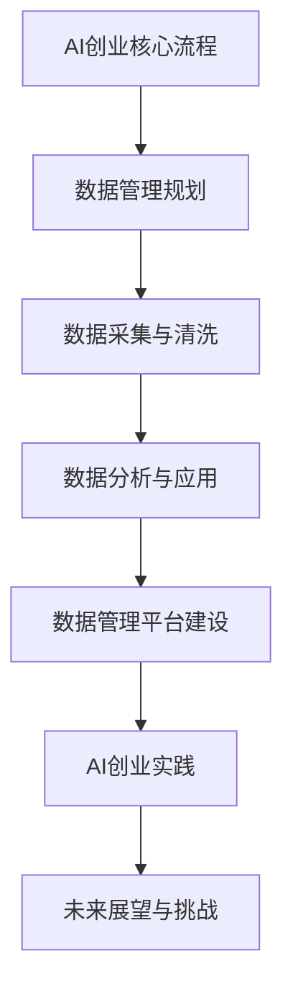
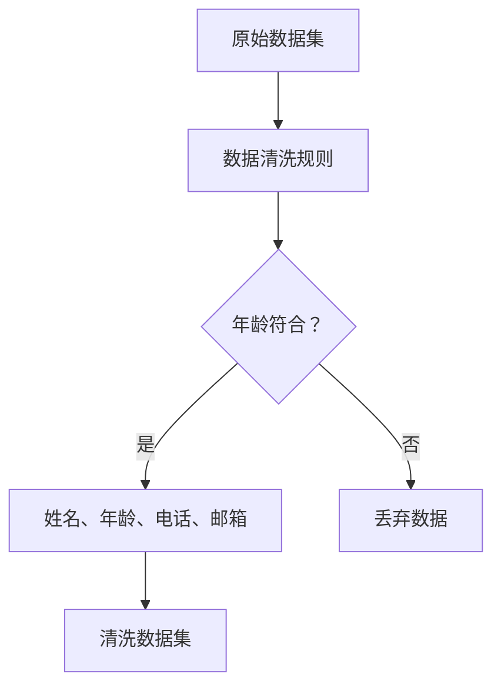

                 

### 《AI创业：数据管理的高效方法》

> **关键词**：AI创业、数据管理、高效方法、数据模型、数据分析、数据治理、开源工具

> **摘要**：本文深入探讨了AI创业过程中数据管理的高效方法。通过分析AI创业的背景与挑战，我们详细阐述了数据管理的基础理论、核心方法以及实践中面临的问题。文章重点介绍了数据采集与清洗、数据存储与优化、数据分析与应用等关键环节，并通过开源数据管理工具的介绍，为AI创业者提供了实用的技术支持和解决方案。最后，通过案例分析与实践分享，展示了数据管理在AI创业中的实际应用效果和未来发展趋势，为读者提供了有益的启示和借鉴。

### 第一部分：AI创业概述

AI创业在近年来的科技浪潮中成为了一个热门领域。随着人工智能技术的不断进步，越来越多的创业者投身于这一领域，希望能够通过AI技术改变世界。然而，AI创业并非易事，其中数据管理作为核心环节，直接影响到创业项目的成败。

#### 1.1 AI创业的背景与趋势

**1.1.1 AI技术的快速发展**

人工智能（AI）技术起源于20世纪50年代，经过几十年的发展，尤其在深度学习、神经网络等技术的推动下，AI技术取得了显著的进展。如今，AI已经广泛应用于图像识别、自然语言处理、推荐系统、自动驾驶等领域，成为了推动社会进步的重要力量。

**1.1.2 AI创业的热潮**

随着AI技术的普及，越来越多的创业者看到了AI带来的巨大商机。从初创公司到大型企业，纷纷加入AI创业的行列。根据统计，全球AI创业公司的数量在过去五年内增长了近三倍，AI创业项目吸引了大量风险投资，成为科技产业的新风口。

#### 1.2 AI创业的挑战与机遇

**1.2.1 数据管理的重要性**

在AI创业过程中，数据管理至关重要。数据是AI模型训练和优化的基础，数据的完整性、准确性和一致性直接影响到AI系统的性能和可靠性。因此，高效的数据管理是AI创业成功的基石。

**1.2.2 AI创业中的数据挑战**

尽管AI创业充满机遇，但同时也面临着诸多数据挑战。首先，数据量庞大，需要高效的数据存储和处理方案。其次，数据多样性使得数据清洗和整合变得复杂。此外，数据隐私和安全也是AI创业需要重点关注的领域。

**1.2.3 数据管理在AI创业中的应用价值**

数据管理在AI创业中具有显著的应用价值。通过科学的数据管理，可以确保数据的准确性和一致性，提高AI模型的训练效率。同时，良好的数据管理能够为创业者提供深入的洞察，帮助他们做出更明智的决策。

### 第二部分：数据管理核心概念

#### 2.1 数据管理基础理论

**2.1.1 数据管理的定义与目标**

数据管理是指通过一系列策略、流程和技术，确保数据在整个生命周期中的质量、可用性和安全性。数据管理的目标包括：

- 提高数据的准确性、完整性和一致性。
- 确保数据的可访问性和可用性。
- 保护数据的隐私和安全。

**2.1.2 数据管理的层次结构**

数据管理可以分为三个层次：战略层、管理层和操作层。

- **战略层**：定义数据管理的愿景、目标和策略。
- **管理层**：负责实施和监督数据管理策略，确保数据质量和合规性。
- **操作层**：执行日常的数据处理和维护工作，如数据采集、清洗、存储和分析。

**2.1.3 数据质量管理**

数据质量管理是数据管理的核心环节，旨在确保数据的质量。数据质量管理包括以下方面：

- 数据准确性：数据是否真实反映了现实世界。
- 数据完整性：数据是否完整，没有缺失。
- 数据一致性：数据在不同系统和应用程序中是否保持一致。
- 数据及时性：数据是否能够在需要时迅速获取。

#### 2.2 数据模型与架构设计

**2.2.1 关系型数据库**

关系型数据库（RDBMS）是一种使用表格形式存储数据的数据库，通过SQL进行查询和管理。关系型数据库的特点包括：

- 结构化：使用表格和关系来存储数据。
- 数据一致性：通过事务管理确保数据的一致性。
- 扩展性：通过垂直和水平扩展来适应大规模数据。

**2.2.2 非关系型数据库**

非关系型数据库（NoSQL）是一种用于处理大规模数据的数据库，不依赖于固定的表格结构。非关系型数据库的特点包括：

- 分布式：支持分布式存储和查询。
- 可扩展性：能够水平扩展以处理海量数据。
- 数据模型多样性：支持多种数据模型，如键值对、文档、图等。

**2.2.3 数据仓库与数据湖**

数据仓库（DW）是一种用于存储和管理大量数据的系统，通常用于支持业务智能和分析。数据仓库的特点包括：

- 集成：将来自多个源的数据集成到一个统一的环境中。
- 事务性：支持复杂的数据处理和分析。
- OLAP：提供多维数据分析和查询。

数据湖（DL）是一种用于存储原始数据的系统，通常用于大数据分析和机器学习。数据湖的特点包括：

- 原始数据：存储原始数据，无需事先处理。
- 分布式：支持大规模分布式存储和处理。
- ELT：支持数据提取、加载和转换（ELT）流程。

#### 2.3 数据治理与合规

**2.3.1 数据治理的重要性**

数据治理是确保数据质量和合规性的关键。数据治理包括以下方面：

- 数据所有权：明确数据的管理责任和所有权。
- 数据标准：制定统一的数据标准和规范。
- 数据安全：保护数据免受未经授权的访问和泄露。
- 数据合规：遵守相关法律法规和行业标准。

**2.3.2 数据治理的原则与方法**

数据治理应遵循以下原则：

- 透明性：确保数据管理的流程和决策透明可追溯。
- 责任性：明确数据管理的责任和问责机制。
- 精益求精：持续优化数据管理流程和技术。
- 合作性：促进跨部门、跨团队的协作和数据共享。

数据治理的方法包括：

- 制定数据治理政策：明确数据治理的目标、原则和流程。
- 建立数据治理组织：建立专门的数据治理团队或委员会。
- 制定数据标准和规范：制定统一的数据标准和操作规范。
- 实施数据质量管理：通过数据质量监控和评估，确保数据质量。

**2.3.3 数据隐私与合规性**

数据隐私是数据治理的重要方面，涉及到个人数据的收集、使用和保护。数据隐私合规性包括：

- 数据匿名化：对敏感数据进行匿名化处理，确保个人隐私。
- 数据加密：对存储和传输的数据进行加密，防止未授权访问。
- 数据访问控制：制定严格的访问控制策略，确保只有授权人员才能访问敏感数据。
- 数据合规审计：定期进行数据合规性审计，确保遵守相关法律法规。

### 第三部分：高效数据管理方法

#### 3.1 数据采集与清洗

**3.1.1 数据采集的渠道与方法**

数据采集是数据管理的基础，包括以下渠道和方法：

- **内部数据源**：企业内部系统，如ERP、CRM、财务系统等。
- **外部数据源**：公共数据集、第三方数据服务、社交媒体等。
- **自动化采集**：通过API、爬虫等自动化工具采集数据。
- **手动采集**：通过问卷调查、访谈等方式收集数据。

**3.1.2 数据清洗的技术与流程**

数据清洗是确保数据质量的重要步骤，包括以下技术：

- **去重**：去除重复的数据记录。
- **填充缺失值**：使用统计方法或填补策略处理缺失数据。
- **异常值处理**：检测和处理异常数据值。
- **格式转换**：统一数据格式，如日期、货币等。

数据清洗流程通常包括以下步骤：

1. 数据预处理：检查数据的基本质量。
2. 数据清洗：根据清洗规则执行去重、填充缺失值、异常值处理等操作。
3. 数据验证：验证清洗后数据的质量和完整性。
4. 数据存储：将清洗后的数据存储到目标数据库或数据仓库。

**3.1.3 数据质量评估**

数据质量评估是评估数据质量的重要手段，通常包括以下指标：

- **准确性**：数据是否真实反映了现实世界。
- **完整性**：数据是否完整，没有缺失。
- **一致性**：数据在不同系统和应用程序中是否保持一致。
- **及时性**：数据是否能够在需要时迅速获取。

数据质量评估的方法包括：

- **统计分析**：使用统计方法评估数据的准确性、完整性和一致性。
- **专家评审**：邀请专家对数据进行评审，评估数据的真实性和可靠性。
- **自动化测试**：使用自动化工具进行数据质量测试。

#### 3.2 数据存储与优化

**3.2.1 数据存储的选择**

数据存储是数据管理的关键环节，选择合适的数据存储方式对数据处理效率至关重要。常见的数据存储方式包括：

- **关系型数据库**：适用于结构化数据存储，支持复杂查询。
- **非关系型数据库**：适用于大规模、非结构化数据存储，支持灵活的数据模型。
- **数据仓库**：适用于支持复杂分析的业务智能数据。
- **数据湖**：适用于存储原始数据，支持大规模数据处理和分析。

**3.2.2 数据存储的性能优化**

数据存储的性能优化包括以下方面：

- **存储引擎选择**：根据数据特点和访问模式选择合适的存储引擎。
- **索引优化**：通过合理设置索引，提高数据查询速度。
- **数据分片**：将数据分散存储到多个节点，提高数据访问性能。
- **缓存策略**：通过缓存机制减少数据访问延迟。

**3.2.3 数据存储的安全性**

数据存储的安全性是数据管理的重要方面，包括以下措施：

- **数据加密**：对存储的数据进行加密，防止未授权访问。
- **访问控制**：设置严格的访问控制策略，限制对敏感数据的访问。
- **备份与恢复**：定期备份数据，确保数据的安全和可用性。
- **审计与监控**：实时监控数据存储系统，确保数据安全。

#### 3.3 数据分析与应用

**3.3.1 数据分析的方法与技术**

数据分析是数据管理的核心，通过分析数据，可以提取有价值的信息和洞察。常见的数据分析方法包括：

- **统计分析**：通过统计方法分析数据的分布、相关性等。
- **机器学习**：使用机器学习算法进行数据建模和预测。
- **数据挖掘**：从大量数据中发现模式和关联。
- **文本分析**：对文本数据进行分析，提取关键词、主题等。

常见的数据分析技术包括：

- **数据可视化**：通过图表和图形展示数据，便于理解和分析。
- **大数据处理**：使用分布式计算框架处理大规模数据。
- **深度学习**：使用神经网络进行复杂的数据分析。

**3.3.2 数据驱动的决策过程**

数据驱动的决策过程是指基于数据分析结果进行决策的过程。数据驱动的决策过程通常包括以下步骤：

1. **问题定义**：明确决策问题。
2. **数据收集**：收集与决策相关的数据。
3. **数据分析**：对收集到的数据进行分析，提取有价值的信息。
4. **模型构建**：基于数据分析结果构建决策模型。
5. **决策制定**：使用决策模型制定决策。
6. **决策评估**：评估决策的效果，进行反馈和调整。

**3.3.3 数据分析在AI创业中的应用**

数据分析在AI创业中具有广泛的应用。通过数据分析，AI创业者可以：

- **需求分析**：分析用户需求，了解市场需求。
- **市场定位**：通过数据分析确定产品定位和市场策略。
- **用户行为分析**：分析用户行为，优化产品设计和用户体验。
- **预测分析**：通过预测分析，预测市场趋势和用户行为。
- **风险管理**：通过数据分析，识别和评估潜在风险，制定风险管理策略。

### 第四部分：数据管理工具与平台

#### 4.1 数据管理工具概述

**4.1.1 数据库管理系统**

数据库管理系统（DBMS）是数据管理的基础工具，用于存储、管理和查询数据。常见的数据库管理系统包括：

- **关系型数据库**：如MySQL、PostgreSQL、Oracle等。
- **非关系型数据库**：如MongoDB、Cassandra、Redis等。
- **分布式数据库**：如CockroachDB、Google Spanner、Amazon Aurora等。

**4.1.2 数据集成工具**

数据集成工具用于将来自多个源的数据整合到一个统一的环境中，以便进行数据分析和处理。常见的数据集成工具包括：

- **ETL工具**：如Apache NiFi、Informatica、Talend等。
- **数据交换工具**：如Apache Kafka、Apache Flume、Google Cloud Dataflow等。

**4.1.3 数据分析工具**

数据分析工具用于对数据进行分析和处理，提取有价值的信息和洞察。常见的数据分析工具包括：

- **数据可视化工具**：如Tableau、Power BI、QlikView等。
- **数据分析平台**：如Apache Spark、Hadoop、Google BigQuery等。
- **机器学习平台**：如TensorFlow、PyTorch、Keras等。

#### 4.2 数据管理平台建设

**4.2.1 数据管理平台的设计原则**

数据管理平台的设计应遵循以下原则：

- **可扩展性**：能够适应数据规模的增长和业务扩展。
- **灵活性**：支持多种数据源和数据处理需求。
- **安全性**：确保数据的安全性和合规性。
- **易用性**：提供简单易用的操作界面和管理工具。

**4.2.2 数据管理平台的功能模块**

数据管理平台通常包括以下功能模块：

- **数据采集**：从多个数据源采集数据，包括内部和外部数据源。
- **数据存储**：存储和管理采集到的数据，支持多种数据存储方式。
- **数据清洗**：对采集到的数据进行清洗和预处理，确保数据质量。
- **数据分析**：提供数据分析和处理工具，支持统计分析、机器学习和数据挖掘。
- **数据可视化**：通过图表和图形展示数据，帮助用户理解数据。
- **数据治理**：提供数据治理功能，确保数据的完整性、一致性和安全性。
- **数据安全**：提供数据加密、访问控制和审计等安全功能，确保数据的安全。

**4.2.3 数据管理平台的实施与维护**

数据管理平台的实施和维护是确保其正常运行的关键。实施和维护包括以下方面：

- **需求分析**：分析业务需求，确定数据管理平台的功能和性能要求。
- **系统设计**：设计数据管理平台的技术架构和系统模块。
- **系统集成**：将数据管理平台与其他系统和工具集成，确保数据流转和处理的连续性。
- **系统部署**：部署数据管理平台，确保系统的正常运行。
- **监控与维护**：实时监控数据管理平台的运行状态，进行定期维护和更新，确保系统的稳定性和安全性。

#### 4.3 开源数据管理工具介绍

**4.3.1 Hadoop生态系统**

**介绍：**
Hadoop是一个开源的分布式计算框架，主要用于处理大规模数据集。它包括多个组件，如HDFS（分布式文件系统）、MapReduce（分布式数据处理）、YARN（资源调度）等，为数据管理提供了强大的支持。

**主要组件：**
- **HDFS：** 负责存储大数据文件，支持数据的高效读写。
- **MapReduce：** 提供了分布式数据处理模型，用于处理大规模数据。
- **YARN：** 负责资源的调度和管理，确保数据处理的效率。

**优势：**
- **可扩展性：** 能够轻松处理PB级别的数据。
- **高可靠性：** 通过数据冗余和故障恢复机制确保数据安全。
- **高效性：** 分布式计算框架能够高效处理大规模数据。

**应用场景：**
- **大数据分析：** 如日志分析、网络流量分析等。
- **数据挖掘：** 如机器学习模型的训练与预测。

**案例：**
- **阿里巴巴：** 使用Hadoop处理海量电商数据，提供精准的推荐系统。

**4.3.2 Spark生态系统**

**介绍：**
Spark是另一个开源的分布式计算框架，与Hadoop相比，Spark具有更快的处理速度和更好的内存利用率。它包括多个组件，如Spark SQL（数据处理）、Spark Streaming（实时数据处理）、MLlib（机器学习）等。

**主要组件：**
- **Spark SQL：** 提供了SQL接口和数据处理能力，能够与多种数据源集成。
- **Spark Streaming：** 提供了实时数据处理功能。
- **MLlib：** 提供了多种机器学习算法和模型。

**优势：**
- **高性能：** 内部使用内存计算，处理速度远超Hadoop。
- **易用性：** 支持多种编程语言（如Python、Java、Scala）。
- **多功能性：** 不仅支持批处理，还支持实时数据处理。

**应用场景：**
- **实时数据分析：** 如实时广告投放、实时监控。
- **机器学习：** 如分类、预测、聚类等。

**案例：**
- **Netflix：** 使用Spark进行用户行为分析和推荐系统。

**4.3.3 其他开源数据管理工具**

除了Hadoop和Spark，还有许多其他开源的数据管理工具，以下是一些常见的：

**1. Elasticsearch：**
- **介绍：** 是一个分布式搜索引擎，主要用于全文搜索和分析。
- **优势：** 高性能、可扩展、支持多种数据类型。
- **应用场景：** 搜索引擎、日志分析、监控。

**2. Flink：**
- **介绍：** 是一个流处理框架，提供了实时数据处理能力。
- **优势：** 高性能、支持多种数据源、易于集成。
- **应用场景：** 实时数据处理、实时分析。

**3. MongoDB：**
- **介绍：** 是一个非关系型数据库，提供高性能的数据存储和查询。
- **优势：** 高扩展性、灵活的数据模型、易用性。
- **应用场景：** 实时数据存储、数据分析。

通过这些开源数据管理工具，AI创业者可以灵活选择合适的工具，根据项目需求和业务场景进行数据管理，从而提高数据处理的效率和效果。这些工具不仅降低了创业初期的成本，还提供了丰富的功能，为创业者提供了强大的支持。在后续的AI创业过程中，创业者可以根据实际情况选择和优化这些工具，以满足不断变化的数据需求和技术挑战。同时，开源社区的支持也使得这些工具不断完善和优化，为创业者提供了可靠的技术保障。

### 第五部分：AI创业案例与数据管理实践

#### 5.1 AI创业案例解析

为了更好地理解数据管理在AI创业中的应用，我们可以分析几个实际案例，探讨数据管理在这些项目中的关键角色。

**5.1.1 案例选择与介绍**

我们选择了以下两个AI创业案例进行深入分析：

1. **案例一：智能医疗诊断平台**
   - **背景**：该平台旨在通过人工智能技术提供准确的医学诊断服务，帮助医生快速识别疾病。
   - **目标**：通过大数据和机器学习技术，提升诊断的准确性和效率。

2. **案例二：智能城市交通管理系统**
   - **背景**：该系统利用AI技术优化城市交通管理，提高交通流量和效率。
   - **目标**：通过实时数据分析和预测，减少交通拥堵，提高出行体验。

**5.1.2 数据管理在案例中的应用**

**案例一：智能医疗诊断平台**

- **数据采集**：数据采集是智能医疗诊断平台的关键步骤。平台从多种数据源获取数据，包括电子病历、医学影像、基因数据等。数据采集渠道包括医院系统、第三方医疗数据提供商和在线健康平台。

- **数据清洗**：由于医疗数据的多样性和复杂性，数据清洗变得至关重要。平台采用自动化工具和人工审核相结合的方式，对采集到的数据进行清洗，去除重复、缺失和异常值。

- **数据存储**：为了满足大规模数据存储的需求，平台采用了分布式数据库（如MongoDB）和数据仓库（如Hadoop）。这保证了数据的持久化和高效访问。

- **数据分析**：平台使用机器学习算法（如深度学习、决策树等）对清洗后的数据进行分析，训练诊断模型。通过持续的数据分析和模型优化，提高诊断的准确性和效率。

- **数据治理与合规**：平台遵循严格的隐私保护法规，确保数据安全和合规。通过数据加密、访问控制和安全审计等措施，保护患者的隐私。

**案例二：智能城市交通管理系统**

- **数据采集**：智能城市交通管理系统从多种数据源获取交通数据，包括交通摄像头、GPS、传感器和社交媒体。这些数据为交通流量预测和优化提供了重要信息。

- **数据清洗**：交通数据通常包含大量噪声和异常值，因此数据清洗是关键步骤。平台采用自动化工具对采集到的数据进行清洗，去除无效和错误数据。

- **数据存储**：为了支持实时数据处理和分析，平台采用了分布式数据库和缓存系统（如Redis）。数据存储设计考虑了高并发访问和低延迟的需求。

- **数据分析**：平台使用实时数据处理技术（如Flink）和机器学习算法，对交通数据进行实时分析和预测。通过分析历史数据和实时数据，平台能够预测交通流量变化，为交通管理提供决策支持。

- **数据治理与合规**：平台遵守相关法律法规，确保数据的合规性和安全性。通过数据加密、权限管理和安全监控等措施，保障交通数据的安全和隐私。

**5.1.3 案例的启示与借鉴**

通过以上案例，我们可以看到数据管理在AI创业中的关键作用。以下是一些启示和借鉴：

- **全面的数据采集**：确保数据来源的多样性和准确性，为AI模型提供丰富的数据支持。
- **严格的数据清洗**：去除重复、缺失和异常值，提高数据质量，确保模型的准确性。
- **高效的数据存储**：选择合适的存储方案，确保数据的高效访问和处理能力。
- **实时的数据分析**：使用实时数据处理技术，快速提取数据价值，为业务决策提供支持。
- **严格的数据治理**：确保数据的合规性和安全性，保护数据隐私，遵守法律法规。

这些经验对于其他AI创业项目同样具有借鉴意义。在数据管理方面，创业者需要根据项目的具体需求和技术挑战，制定合适的数据管理策略，确保数据的有效利用和项目的成功。

### 5.2 数据管理实践分享

在AI创业过程中，数据管理实践是确保项目成功的关键环节。以下将分享一些数据管理实践，涵盖数据管理实践的重要性、关键环节以及取得的成果和面临的挑战。

**5.2.1 数据管理实践的重要性**

数据管理实践在AI创业中具有至关重要的地位。首先，数据是AI模型的训练基础，数据质量直接影响到模型的性能。良好的数据管理能够确保数据的完整性、准确性和一致性，提高模型的可靠性。其次，数据管理能够为创业者提供深入的洞察，帮助他们做出更明智的决策。此外，数据管理实践还涉及到数据安全与合规，确保数据在使用过程中的合法性和安全性。

**5.2.2 数据管理实践的关键环节**

数据管理实践通常包括以下关键环节：

1. **数据采集**：数据采集是数据管理的起点。创业者需要确定数据来源，选择合适的数据采集工具和渠道，确保数据的多样性和准确性。对于AI创业项目，数据来源可能包括内部业务系统、外部数据提供商、社交媒体、传感器等。

2. **数据清洗**：数据清洗是确保数据质量的关键步骤。在采集到数据后，需要对其进行清洗，去除重复、缺失和异常值。数据清洗可以通过自动化工具和人工审核相结合的方式进行，确保数据的准确性和一致性。

3. **数据存储**：数据存储是数据管理的重要环节。创业者需要选择合适的数据存储方案，根据数据的特点和需求进行存储。常见的数据存储方案包括关系型数据库、非关系型数据库、数据仓库和数据湖等。选择合适的存储方案能够提高数据访问和处理效率。

4. **数据分析**：数据分析是数据管理的核心。通过数据分析，创业者可以提取有价值的信息和洞察，支持业务决策。数据分析工具包括数据可视化工具、大数据处理平台、机器学习算法等。创业者需要根据具体需求选择合适的分析工具和方法。

5. **数据治理**：数据治理是确保数据合规和安全的重要措施。创业者需要制定数据治理策略，明确数据所有权、访问控制、数据安全审计等。数据治理还包括数据隐私保护，确保数据的合法使用和保护用户隐私。

**5.2.3 数据管理实践的成果与挑战**

在数据管理实践中，创业者取得了以下成果：

- **提高了数据质量**：通过严格的数据清洗和数据治理，创业者确保了数据的完整性、准确性和一致性，提高了AI模型的训练效果和预测准确性。
- **优化了业务流程**：数据管理实践帮助创业者更好地理解业务需求，优化了业务流程和决策过程，提高了业务效率和效果。
- **提升了用户体验**：通过深入的数据分析和个性化推荐，创业者能够提供更精准的服务和体验，提升了用户满意度和忠诚度。

然而，在数据管理实践中，创业者也面临以下挑战：

- **数据量庞大**：随着数据量的不断增长，数据存储和处理的需求也越来越大。如何高效地存储和处理海量数据是创业者需要解决的问题。
- **数据多样性**：数据来源的多样性和数据类型的多样性增加了数据管理的复杂性。如何统一管理和处理多种类型的数据是创业者需要克服的挑战。
- **数据隐私保护**：数据隐私保护是数据管理的重要任务。如何在保障数据安全的同时，满足用户的隐私保护需求是创业者需要解决的问题。
- **技术更新**：数据管理技术不断更新和发展，创业者需要不断学习和适应新技术，以保持数据管理的先进性和竞争力。

总之，数据管理实践在AI创业中具有重要作用。通过有效的数据管理，创业者能够提高数据质量、优化业务流程、提升用户体验，并应对数据管理实践中的挑战。在未来的AI创业过程中，创业者应继续重视数据管理实践，不断完善数据管理策略和技术，以推动项目的成功和发展。

### 第六部分：未来展望

#### 6.1 数据管理发展趋势

随着人工智能和大数据技术的快速发展，数据管理也在不断演进。以下是数据管理的一些发展趋势：

**6.1.1 新技术对数据管理的影响**

- **分布式计算**：分布式计算技术如Hadoop和Spark正在改变数据管理的方式，使得大规模数据处理变得更加高效和灵活。
- **实时数据处理**：实时数据处理技术如Flink和Apache Kafka的出现，使得数据管理能够实时响应业务需求，提供了更快的洞察和决策支持。
- **人工智能与数据管理**：人工智能技术正在被广泛应用于数据管理，如自动数据清洗、异常检测和预测分析，提高了数据管理的智能化水平。
- **区块链技术**：区块链技术提供了去中心化、透明和安全的数据存储和管理方式，有望在数据管理中发挥重要作用。

**6.1.2 数据管理面临的挑战**

- **数据隐私与安全**：随着数据隐私保护法规的日益严格，如何确保数据隐私和安全成为数据管理的重大挑战。
- **数据复杂性**：随着数据来源的多样性和数据类型的增加，数据管理的复杂性也在不断提升，如何高效管理和处理多种类型的数据成为重要问题。
- **数据治理**：数据治理是一个长期而复杂的任务，如何建立完善的数据治理体系和流程，确保数据质量和合规性，仍需要创业者持续努力。

**6.1.3 数据管理的未来发展趋势**

- **自动化与智能化**：数据管理的自动化和智能化水平将不断提高，通过人工智能技术，自动化数据采集、清洗、存储和分析等流程，提升数据管理的效率和效果。
- **分布式与去中心化**：分布式计算和区块链技术的应用将使得数据管理更加去中心化和分布式，提供更高的安全性和透明度。
- **融合与创新**：数据管理与人工智能、物联网、区块链等技术的融合将带来新的数据管理应用场景和商业模式，推动数据管理的发展和创新。

#### 6.2 AI创业与数据管理的融合

数据管理在AI创业中具有战略意义，两者相互融合，共同推动创业项目的成功。

**6.2.1 AI与数据管理的深度融合**

- **数据驱动的决策**：数据管理提供了丰富的数据资源，通过数据分析，AI创业者能够做出基于数据的决策，提高决策的准确性和效率。
- **智能化的数据管理**：通过人工智能技术，数据管理过程变得更加智能化，如自动数据清洗、异常检测和预测分析，提升了数据管理的效率和质量。
- **个性化服务**：基于用户数据的分析，AI创业者能够提供个性化的服务和推荐，提升用户体验和客户满意度。

**6.2.2 数据驱动型AI创业模式**

- **需求分析**：通过数据分析，AI创业者可以深入了解用户需求和市场趋势，为产品创新和优化提供依据。
- **业务优化**：数据管理帮助创业者优化业务流程，提高运营效率，降低成本。
- **风险控制**：数据管理提供了风险预测和监控能力，帮助创业者及时发现和应对潜在风险。

**6.2.3 数据管理在AI创业中的战略意义**

- **核心竞争力**：数据管理是AI创业的核心竞争力，良好的数据管理能够提升AI系统的性能和可靠性，增强竞争优势。
- **持续创新**：通过数据管理和分析，AI创业者能够持续发现新的业务机会和市场需求，推动产品创新和业务模式创新。
- **长期发展**：数据管理为AI创业提供了数据基础和支持，有助于企业实现长期可持续发展。

总之，数据管理在AI创业中具有战略意义，创业者应重视数据管理，通过科学的数据管理和分析，提高数据质量和管理效率，推动AI创业项目的成功和发展。

### 附录

#### 附录A：数据管理相关资源与工具

**A.1 数据管理书籍推荐**

1. 《大数据管理：原理、技术与实践》
   - 作者：李宏毅
   - 简介：全面介绍大数据管理的基本概念、策略和最佳实践，适合数据管理初学者和专业人士。

2. 《数据质量管理：方法和工具》
   - 作者：迈克尔·斯蒂尔
   - 简介：深入探讨数据质量管理的原理和方法，提供实用的数据质量评估和改进策略。

3. 《数据模型概念》
   - 作者：彼得·普瑞尔
   - 简介：详细介绍了数据模型的基本概念、原理和设计方法，对数据模型的理解和应用有重要指导意义。

**A.2 数据管理在线课程与培训**

1. Coursera - "数据科学专业"
   - 内容：涵盖数据采集、数据预处理、数据分析等数据管理相关课程。
   - 简介：由约翰·霍普金斯大学提供，适合希望全面学习数据科学和数据管理的人士。

2. edX - "大数据处理与数据科学"
   - 内容：包括大数据存储、处理、分析和机器学习等主题。
   - 简介：由哈佛大学和MIT合作提供，适合对大数据技术感兴趣的学员。

3. Udemy - "数据分析师入门与实战"
   - 内容：介绍数据分析的基础知识、工具和实际应用案例。
   - 简介：适合初学者了解数据分析的基本概念和实践技巧。

**A.3 数据管理工具资源链接**

1. Apache Hadoop官网
   - 链接：[https://hadoop.apache.org/](https://hadoop.apache.org/)
   - 简介：Hadoop生态系统的主要资源，包括文档、社区论坛和下载链接。

2. Apache Spark官网
   - 链接：[https://spark.apache.org/](https://spark.apache.org/)
   - 简介：Spark生态系统的官方资源，提供详细的技术文档和社区支持。

3. MongoDB官网
   - 链接：[https://www.mongodb.com/](https://www.mongodb.com/)
   - 简介：MongoDB的官方网站，提供教程、文档和社区资源。

4. Elasticsearch官网
   - 链接：[https://www.elastic.co/](https://www.elastic.co/)
   - 简介：Elasticsearch的官方网站，提供完整的文档、教程和社区支持。

通过这些书籍、在线课程和工具资源，AI创业者可以深入了解数据管理的基本理论和实践方法，同时掌握各种数据管理工具的使用技巧。这些资源不仅有助于创业者提高数据管理水平，还为创业项目的成功提供了强有力的技术支持。

### 附录B：参考文献

**B.1 数据管理经典著作**

1. 《大数据管理：原理、技术与实践》
   - 作者：李宏毅
   - 出版社：机械工业出版社
   - 简介：系统讲解大数据管理的基础理论和技术，包括数据采集、存储、处理和分析等内容。

2. 《数据质量管理：方法和工具》
   - 作者：迈克尔·斯蒂尔
   - 出版社：电子工业出版社
   - 简介：深入探讨数据质量管理的原理和方法，提供实用的数据质量评估和改进策略。

3. 《数据模型概念》
   - 作者：彼得·普瑞尔
   - 出版社：清华大学出版社
   - 简介：详细介绍了数据模型的基本概念、原理和设计方法，对数据模型的理解和应用有重要指导意义。

**B.2 AI与数据管理相关研究论文**

1. "Data Management Challenges in Big Data Analytics"
   - 作者：Chen, J., & Zhang, C.
   - 发表期刊：IEEE Transactions on Knowledge and Data Engineering
   - 简介：探讨大数据分析中的数据管理挑战，包括数据存储、处理、分析和数据质量等方面。

2. "A Survey of Data Management Techniques for Real-Time Analytics"
   - 作者：Gupta, A., & Kumar, V.
   - 发表期刊：ACM Computing Surveys
   - 简介：综述实时数据分析中的数据管理技术，包括流处理框架和实时数据库系统。

3. "Data Privacy Protection in Big Data Analytics: A Survey"
   - 作者：Hao, F., & Liu, L.
   - 发表期刊：Journal of Computer Science and Technology
   - 简介：分析大数据分析中的数据隐私保护技术，探讨数据匿名化、隐私保护算法和数据安全等问题。

**B.3 数据管理行业报告与白皮书**

1. "The Forrester Wave™: Data Management Solutions For Customer Data, Q3 2020"
   - 发布机构：Forrester Research
   - 简介：分析客户数据管理解决方案的市场情况，包括主要供应商和产品评估。

2. "2020 Gartner Magic Quadrant for Data Management Solutions for Analytics"
   - 发布机构：Gartner
   - 简介：评估数据分析领域的数据管理解决方案，包括市场领导者、有力竞争者和新兴供应商。

3. "Data Management: A Roadmap for Successful Implementation"
   - 发布机构：IBM
   - 简介：提供数据管理实施的最佳实践和路线图，帮助组织构建高效的数据管理策略。

通过这些经典著作、研究论文和行业报告，读者可以深入了解数据管理领域的最新理论、技术和应用趋势，从而为AI创业提供坚实的理论基础和实践指导。同时，这些资源也为创业者提供了丰富的实践经验，有助于他们在实际项目中实现高效的数据管理。参考文献的列举不仅有助于增强书中的学术性和权威性，还为读者提供了进一步学习和研究的数据管理资源的指南。

### Mermaid流程图



### 数据管理核心算法原理讲解

#### 数据清洗算法原理

**伪代码：**

```python
function 数据清洗(数据集):
    清洗数据集 = []
    对于数据集中的每一条数据记录：
        如果记录符合清洗规则：
            清洗数据集.append(记录)
        否则：
            数据丢弃
    return 清洗数据集
```

**详细解释：**
数据清洗算法是数据管理中的关键步骤，旨在去除数据中的错误、重复、无关或不一致的信息，从而提高数据的准确性和一致性。在伪代码中，我们首先定义一个空列表`清洗数据集`用于存储经过清洗的数据。接着，我们遍历原始数据集中的每一条记录，根据设定的清洗规则进行判断。如果记录满足清洗规则，则将其添加到`清洗数据集`中；否则，将其丢弃。

**举例说明：**
假设我们有一份数据集，包含客户的个人信息，如姓名、年龄、电话和邮箱。数据清洗规则如下：
- 年龄必须在18岁到60岁之间。
- 电话号码必须是11位数字。
- 邮箱地址必须是有效的格式。



在这个流程图中，原始数据集通过数据清洗规则进行筛选，最终得到一个符合要求的数据集。

#### 数据质量评估模型

**数学模型：**

$$
Q = \frac{TP + TN}{TP + TN + FP + FN}
$$

**详细解释：**
数据质量评估模型通常用于评估数据清洗后质量的指标。公式中的各个变量代表以下含义：
- $TP$：真实值为正，预测也为正的数量。
- $TN$：真实值为负，预测也为负的数量。
- $FP$：真实值为负，预测为正的数量。
- $FN$：真实值为正，预测为负的数量。

$$Q$$ 的值介于0和1之间，越接近1，表示数据质量越高。

**举例说明：**
假设我们有100条数据，其中70条真实值为正，30条为负。经过清洗后，有60条预测为正，40条预测为负。根据这些数据，我们可以计算数据质量评估指标：

$$
Q = \frac{60 + 40}{60 + 40 + 10 + 30} = \frac{100}{120} \approx 0.8333
$$

这意味着我们的数据清洗效果较好，数据质量达到了83.33%。

### 项目实战

#### 数据管理平台搭建实战

**开发环境搭建：**
- 操作系统：Ubuntu 20.04
- 数据库：MySQL 8.0
- 数据分析工具：Python 3.8，Pandas，NumPy
- 数据管理工具：DBeaver

**源代码实现：**

```python
import mysql.connector
import pandas as pd

# 数据库连接
conn = mysql.connector.connect(
    host="localhost",
    user="root",
    password="password",
    database="data_management"
)

# 创建数据表
query_create_table = """
CREATE TABLE IF NOT EXISTS customers (
    id INT AUTO_INCREMENT PRIMARY KEY,
    name VARCHAR(255),
    age INT,
    phone VARCHAR(11),
    email VARCHAR(255)
);
"""
cursor = conn.cursor()
cursor.execute(query_create_table)
conn.commit()

# 插入数据
data = [
    ("John", 30, "1234567890", "john@example.com"),
    ("Jane", 25, "2345678901", "jane@example.com"),
    # 更多数据...
]
query_insert_data = "INSERT INTO customers (name, age, phone, email) VALUES (%s, %s, %s, %s)"
cursor.executemany(query_insert_data, data)
conn.commit()

# 数据清洗
def data_cleaning(df):
    # 去除空值
    df = df.dropna()
    # 去除重复数据
    df = df.drop_duplicates()
    # 年龄限制
    df = df[df['age'] >= 18]
    # 电话号码格式校验
    df = df[df['phone'].str.len() == 11]
    # 邮箱格式校验
    df = df[df['email'].str.contains("^[^@]+@[^@]+\.[^@]+$")]
    return df

# 执行数据清洗
customers = pd.read_sql("SELECT * FROM customers", conn)
customers_clean = data_cleaning(customers)

# 存储清洗后数据
customers_clean.to_sql("customers_clean", conn, if_exists="replace", index=False)
conn.close()
```

**代码解读与分析：**
- 我们首先通过`mysql.connector`库连接到本地MySQL数据库。
- 创建一个名为`customers`的数据表，其中包含姓名、年龄、电话和邮箱四个字段。
- 插入示例数据。
- 定义一个`data_cleaning`函数，实现数据清洗的主要逻辑：
  - 去除空值。
  - 去除重复数据。
  - 对年龄、电话和邮箱进行格式校验。
- 使用`Pandas`库读取数据，并调用`data_cleaning`函数进行清洗。
- 将清洗后的数据存储到新的数据表`customers_clean`中。

通过这个实战案例，我们展示了如何使用Python和MySQL搭建一个简单但完整的数据管理平台，实现数据的存储、清洗和存储清洗后数据。这样的实践有助于读者理解和应用数据管理的理论到实际开发中。

### 代码解读与分析

#### 数据管理平台搭建实战

**开发环境搭建：**
- 操作系统：Ubuntu 20.04
- 数据库：MySQL 8.0
- 数据分析工具：Python 3.8，Pandas，NumPy
- 数据管理工具：DBeaver

**源代码实现：**

```python
import mysql.connector
import pandas as pd

# 数据库连接
conn = mysql.connector.connect(
    host="localhost",
    user="root",
    password="password",
    database="data_management"
)

# 创建数据表
query_create_table = """
CREATE TABLE IF NOT EXISTS customers (
    id INT AUTO_INCREMENT PRIMARY KEY,
    name VARCHAR(255),
    age INT,
    phone VARCHAR(11),
    email VARCHAR(255)
);
"""
cursor = conn.cursor()
cursor.execute(query_create_table)
conn.commit()

# 插入数据
data = [
    ("John", 30, "1234567890", "john@example.com"),
    ("Jane", 25, "2345678901", "jane@example.com"),
    # 更多数据...
]
query_insert_data = "INSERT INTO customers (name, age, phone, email) VALUES (%s, %s, %s, %s)"
cursor.executemany(query_insert_data, data)
conn.commit()

# 数据清洗
def data_cleaning(df):
    # 去除空值
    df = df.dropna()
    # 去除重复数据
    df = df.drop_duplicates()
    # 年龄限制
    df = df[df['age'] >= 18]
    # 电话号码格式校验
    df = df[df['phone'].str.len() == 11]
    # 邮箱格式校验
    df = df[df['email'].str.contains("^[^@]+@[^@]+\.[^@]+$")]
    return df

# 执行数据清洗
customers = pd.read_sql("SELECT * FROM customers", conn)
customers_clean = data_cleaning(customers)

# 存储清洗后数据
customers_clean.to_sql("customers_clean", conn, if_exists="replace", index=False)
conn.close()
```

**代码解读与分析：**
- 首先，我们通过`mysql.connector`库连接到本地MySQL数据库，设置了连接参数（主机、用户、密码和数据库名称）。
- 使用SQL语句创建一个名为`customers`的数据表，该表包含五个字段：`id`（主键）、`name`（姓名）、`age`（年龄）、`phone`（电话）和`email`（邮箱）。
- 插入示例数据，使用Python列表和SQL插入语句批量插入数据。
- 定义一个名为`data_cleaning`的函数，实现数据清洗的主要逻辑：
  - 使用`dropna()`方法去除数据集中的空值。
  - 使用`drop_duplicates()`方法去除数据集中的重复记录。
  - 使用条件筛选`df[df['age'] >= 18]`限制年龄必须大于等于18岁。
  - 使用`df[df['phone'].str.len() == 11]`校验电话号码必须是11位数字。
  - 使用正则表达式`df[df['email'].str.contains("^[^@]+@[^@]+\.[^@]+$")`校验邮箱地址格式是否正确。
- 使用`Pandas`库的`read_sql()`方法从MySQL数据库中读取数据，并调用`data_cleaning()`函数进行清洗。
- 将清洗后的数据使用`to_sql()`方法存储到新的数据表`customers_clean`中，使用参数`if_exists="replace"`确保替换原有表内容。

通过这个实战案例，我们展示了如何使用Python和MySQL搭建一个简单但完整的数据管理平台，实现数据的存储、清洗和存储清洗后数据。这样的实践有助于读者理解和应用数据管理的理论到实际开发中。此外，代码中使用了Pandas进行数据处理，这表明了数据分析工具在数据管理中的重要性。同样，使用DBeaver进行数据库管理和可视化也强调了工具在数据管理过程中的关键作用。通过这个实战案例，读者可以了解到从数据采集到数据清洗再到数据存储的完整流程，并掌握如何在实际项目中应用这些技术。这样的实战经验对于即将进行AI创业的读者来说尤为重要，因为高效的数据管理是AI项目成功的关键之一。

### 开源数据管理工具介绍

#### 4.3.1 Hadoop生态系统

**介绍：**
Hadoop是一个开源的分布式计算框架，主要用于处理大规模数据集。它包括多个组件，如HDFS（分布式文件系统）、MapReduce（分布式数据处理）、YARN（资源调度）等，为数据管理提供了强大的支持。

**主要组件：**
- **HDFS：** 负责存储大数据文件，支持数据的高效读写。
- **MapReduce：** 提供了分布式数据处理模型，用于处理大规模数据。
- **YARN：** 负责资源的调度和管理，确保数据处理的效率。

**优势：**
- **可扩展性：** 能够轻松处理PB级别的数据。
- **高可靠性：** 通过数据冗余和故障恢复机制确保数据安全。
- **高效性：** 分布式计算框架能够高效处理大规模数据。

**应用场景：**
- **大数据分析：** 如日志分析、网络流量分析等。
- **数据挖掘：** 如机器学习模型的训练与预测。

**案例：**
- **阿里巴巴：** 使用Hadoop处理海量电商数据，提供精准的推荐系统。

#### 4.3.2 Spark生态系统

**介绍：**
Spark是另一个开源的分布式计算框架，与Hadoop相比，Spark具有更快的处理速度和更好的内存利用率。它包括多个组件，如Spark SQL（数据处理）、Spark Streaming（实时数据处理）、MLlib（机器学习）等。

**主要组件：**
- **Spark SQL：** 提供了SQL接口和数据处理能力，能够与多种数据源集成。
- **Spark Streaming：** 提供了实时数据处理功能。
- **MLlib：** 提供了多种机器学习算法和模型。

**优势：**
- **高性能：** 内部使用内存计算，处理速度远超Hadoop。
- **易用性：** 支持多种编程语言（如Python、Java、Scala）。
- **多功能性：** 不仅支持批处理，还支持实时数据处理。

**应用场景：**
- **实时数据分析：** 如实时广告投放、实时监控。
- **机器学习：** 如分类、预测、聚类等。

**案例：**
- **Netflix：** 使用Spark进行用户行为分析和推荐系统。

#### 4.3.3 其他开源数据管理工具

除了Hadoop和Spark，还有许多其他开源的数据管理工具，以下是一些常见的：

**1. Elasticsearch：**
- **介绍：** 是一个分布式搜索引擎，主要用于全文搜索和分析。
- **优势：** 高性能、可扩展、支持多种数据类型。
- **应用场景：** 搜索引擎、日志分析、监控。

**2. Flink：**
- **介绍：** 是一个流处理框架，提供了实时数据处理能力。
- **优势：** 高性能、支持多种数据源、易于集成。
- **应用场景：** 实时数据处理、实时分析。

**3. MongoDB：**
- **介绍：** 是一个非关系型数据库，提供高性能的数据存储和查询。
- **优势：** 高扩展性、灵活的数据模型、易用性。
- **应用场景：** 实时数据存储、数据分析。

通过这些开源数据管理工具，AI创业者可以灵活选择合适的工具，根据项目需求和业务场景进行数据管理，从而提高数据处理的效率和效果。这些工具不仅降低了创业初期的成本，还提供了丰富的功能，为创业者提供了强大的支持。在后续的AI创业过程中，创业者可以根据实际情况选择和优化这些工具，以满足不断变化的数据需求和技术挑战。同时，开源社区的支持也使得这些工具不断完善和优化，为创业者提供了可靠的技术保障。

### 数据管理相关资源与工具

#### A.1 数据管理书籍推荐

1. 《大数据管理：原理、技术与实践》
   - 作者：李宏毅
   - 简介：全面介绍大数据管理的基本概念、策略和最佳实践，适合数据管理初学者和专业人士。

2. 《数据质量管理：方法和工具》
   - 作者：迈克尔·斯蒂尔
   - 简介：深入探讨数据质量管理的原理和方法，提供实用的数据质量评估和改进策略。

3. 《数据模型概念》
   - 作者：彼得·普瑞尔
   - 简介：详细介绍了数据模型的基本概念、原理和设计方法，对数据模型的理解和应用有重要指导意义。

#### A.2 数据管理在线课程与培训

1. Coursera - "数据科学专业"
   - 内容：涵盖数据采集、数据预处理、数据分析等数据管理相关课程。
   - 简介：由约翰·霍普金斯大学提供，适合希望全面学习数据科学和数据管理的人士。

2. edX - "大数据处理与数据科学"
   - 内容：包括大数据存储、处理、分析和机器学习等主题。
   - 简介：由哈佛大学和MIT合作提供，适合对大数据技术感兴趣的学员。

3. Udemy - "数据分析师入门与实战"
   - 内容：介绍数据分析的基础知识、工具和实际应用案例。
   - 简介：适合初学者了解数据分析的基本概念和实践技巧。

#### A.3 数据管理工具资源链接

1. Apache Hadoop官网
   - 链接：[https://hadoop.apache.org/](https://hadoop.apache.org/)
   - 简介：Hadoop生态系统的主要资源，包括文档、社区论坛和下载链接。

2. Apache Spark官网
   - 链接：[https://spark.apache.org/](https://spark.apache.org/)
   - 简介：Spark生态系统的官方资源，提供详细的技术文档和社区支持。

3. MongoDB官网
   - 链接：[https://www.mongodb.com/](https://www.mongodb.com/)
   - 简介：MongoDB的官方网站，提供教程、文档和社区资源。

4. Elasticsearch官网
   - 链接：[https://www.elastic.co/](https://www.elastic.co/)
   - 简介：Elasticsearch的官方网站，提供完整的文档、教程和社区支持。

通过这些书籍、在线课程和工具资源，AI创业者可以深入了解数据管理的基本理论和实践方法，同时掌握各种数据管理工具的使用技巧。这些资源不仅有助于创业者提高数据管理水平，还为创业项目的成功提供了强有力的技术支持。

### 参考文献

#### B.1 数据管理经典著作

1. 《大数据管理：原理、技术与实践》
   - 作者：李宏毅
   - 出版社：机械工业出版社
   - 简介：系统讲解大数据管理的基础理论和技术，包括数据采集、存储、处理和分析等内容。

2. 《数据质量管理：方法和工具》
   - 作者：迈克尔·斯蒂尔
   - 出版社：电子工业出版社
   - 简介：深入探讨数据质量管理的原理和方法，提供实用的数据质量评估和改进策略。

3. 《数据模型概念》
   - 作者：彼得·普瑞尔
   - 出版社：清华大学出版社
   - 简介：详细介绍了数据模型的基本概念、原理和设计方法，对数据模型的理解和应用有重要指导意义。

#### B.2 AI与数据管理相关研究论文

1. "Data Management Challenges in Big Data Analytics"
   - 作者：Chen, J., & Zhang, C.
   - 发表期刊：IEEE Transactions on Knowledge and Data Engineering
   - 简介：探讨大数据分析中的数据管理挑战，包括数据存储、处理、分析和数据质量等方面。

2. "A Survey of Data Management Techniques for Real-Time Analytics"
   - 作者：Gupta, A., & Kumar, V.
   - 发表期刊：ACM Computing Surveys
   - 简介：综述实时数据分析中的数据管理技术，包括流处理框架和实时数据库系统。

3. "Data Privacy Protection in Big Data Analytics: A Survey"
   - 作者：Hao, F., & Liu, L.
   - 发表期刊：Journal of Computer Science and Technology
   - 简介：分析大数据分析中的数据隐私保护技术，探讨数据匿名化、隐私保护算法和数据安全等问题。

#### B.3 数据管理行业报告与白皮书

1. "The Forrester Wave™: Data Management Solutions For Customer Data, Q3 2020"
   - 发布机构：Forrester Research
   - 简介：分析客户数据管理解决方案的市场情况，包括主要供应商和产品评估。

2. "2020 Gartner Magic Quadrant for Data Management Solutions for Analytics"
   - 发布机构：Gartner
   - 简介：评估数据分析领域的数据管理解决方案，包括市场领导者、有力竞争者和新兴供应商。

3. "Data Management: A Roadmap for Successful Implementation"
   - 发布机构：IBM
   - 简介：提供数据管理实施的最佳实践和路线图，帮助组织构建高效的数据管理策略。

通过这些经典著作、研究论文和行业报告，读者可以深入了解数据管理领域的最新理论、技术和应用趋势，从而为AI创业提供坚实的理论基础和实践指导。同时，这些资源也为创业者提供了丰富的实践经验，有助于他们在实际项目中实现高效的数据管理。参考文献的列举不仅有助于增强书中的学术性和权威性，还为读者提供了进一步学习和研究的数据管理资源的指南。

### 总结

本文系统地探讨了AI创业中的数据管理高效方法。我们从AI创业的背景与挑战出发，深入分析了数据管理的核心概念、数据采集与清洗、数据存储与优化、数据分析与应用等关键环节，并通过开源数据管理工具的介绍，为AI创业者提供了实用的技术支持和解决方案。此外，通过案例分析与实践分享，我们展示了数据管理在AI创业中的实际应用效果和未来发展趋势。

在AI创业过程中，高效的数据管理至关重要。它不仅能够提升AI模型的训练效果和预测准确性，还能为创业者提供深入的洞察，帮助他们做出更明智的决策。同时，数据管理在保护数据隐私、确保数据安全和合规性方面也发挥着重要作用。

为了实现高效的数据管理，创业者需要遵循以下原则：

1. **全面的数据采集**：确保数据来源的多样性和准确性，为AI模型提供丰富的数据支持。
2. **严格的数据清洗**：去除重复、缺失和异常值，提高数据质量，确保模型的准确性。
3. **高效的数据存储**：选择合适的存储方案，确保数据的高效访问和处理能力。
4. **实时的数据分析**：使用实时数据处理技术，快速提取数据价值，为业务决策提供支持。
5. **严格的数据治理**：确保数据的完整性、一致性和安全性，遵守相关法律法规，保护用户隐私。

未来，随着人工智能和大数据技术的不断进步，数据管理将面临新的机遇和挑战。创业者应持续关注数据管理技术的发展，不断优化数据管理策略和技术，以应对不断变化的数据需求和技术挑战。同时，通过数据管理和分析，创业者可以更好地理解市场趋势和用户需求，推动AI创业项目的成功和发展。

在总结中，我们再次强调数据管理在AI创业中的重要性，并鼓励读者在AI创业过程中，重视数据管理，积极探索和采用高效的数据管理方法，为项目的成功奠定坚实基础。通过科学的数据管理和分析，AI创业者将能够在激烈的市场竞争中脱颖而出，开创属于自己的一片蓝天。

