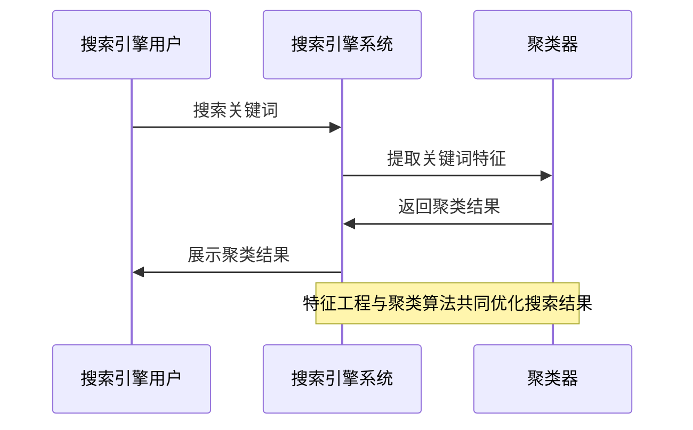

                 

# 《AI在搜索引擎结果聚类中的应用》

> **关键词**: AI、搜索引擎、结果聚类、算法优化、特征工程

> **摘要**: 本文深入探讨了人工智能（AI）技术在搜索引擎结果聚类中的应用。首先，我们介绍了搜索引擎与聚类技术的基本概念，随后详细讲解了常见的聚类算法原理和伪代码。接着，我们探讨了特征工程在聚类中的应用，包括文本特征表示和图特征提取。文章的后半部分通过实际项目案例展示了AI在搜索引擎结果聚类中的实践应用，并对未来的发展趋势和挑战进行了分析。

# 《AI在搜索引擎结果聚类中的应用》目录大纲

## 第一部分: AI在搜索引擎结果聚类中的基础理论

### 第1章: 搜索引擎与聚类技术概述

#### 1.1 搜索引擎的工作原理

- **搜索引擎的基本组成**
  - 索引器：负责从互联网上抓取网页并建立索引
  - 检索器：根据用户的查询请求，从索引中查找匹配的网页
  - 用户界面：提供用户输入查询和展示结果的界面

- **搜索引擎的搜索流程**
  1. 用户输入查询关键词
  2. 检索器处理查询请求，生成关键词向量
  3. 检索器利用索引库检索匹配的网页
  4. 索引器将检索结果排序并返回给用户

#### 1.2 聚类技术的基本概念

- **聚类算法的分类**
  - 层次聚类：自上而下或自下而上的层次结构进行聚类
  - �partitioning方法：将数据划分为固定数量的聚类
  - density-based方法：基于数据点的密度进行聚类
  - hierarchical方法：基于层次结构进行聚类

- **聚类的目的和意义**
  - 提高搜索结果的准确性
  - 帮助用户快速定位感兴趣的内容
  - 降低用户搜索成本

#### 1.3 AI技术在搜索引擎结果聚类中的应用

- **AI技术对聚类算法的改进**
  - 自适应聚类算法
  - 基于深度学习的聚类方法
  - 融合多源数据的聚类算法

- **AI技术提高搜索引擎效果**
  - 智能推荐系统
  - 实时搜索结果优化
  - 个性化搜索体验

## 第二部分: AI在搜索引擎结果聚类中的应用实践

### 第2章: AI算法在聚类中的应用

#### 2.1 K-means算法

- **K-means算法原理**
  - K-means是一种基于距离的聚类方法，将数据点划分为K个簇，每个簇由一个中心点表示
  - 目标是最小化簇内数据点到中心点的平方误差和

- **K-means算法伪代码**
  ```python
  # 初始化：随机选择K个中心点
  centroids = initialize_centroids(data, K)

  # 迭代过程
  while not convergence:
      # 计算每个数据点到各个中心点的距离
      distances = compute_distances(data, centroids)
      
      # 将数据点分配到最近的中心点
      assignments = assign_data_to_clusters(data, distances)
      
      # 计算新的中心点
      new_centroids = compute_new_centroids(data, assignments)
      
      # 判断是否收敛
      if np.linalg.norm(new_centroids - centroids) < tolerance:
          break

      centroids = new_centroids
  ```

#### 2.2 层次聚类算法

- **层次聚类算法原理**
  - 层次聚类通过逐步合并或分裂数据点，形成层次结构
  - 常见的层次聚类算法包括自底向上的凝聚层次聚类（AGNES）和自顶向下的分裂层次聚类（DIANA）

- **层次聚类算法伪代码**
  ```python
  # 初始化：每个数据点都是一个簇
  clusters = initialize_clusters(data)

  # 合并过程
  while number_of_clusters > 1:
      # 计算相邻簇之间的距离
      distances = compute_cluster_distances(clusters)
      
      # 选择最近的簇进行合并
      closest_clusters = select_closest_clusters(clusters, distances)
      
      # 合并簇
      clusters = merge_clusters(clusters, closest_clusters)
  ```

#### 2.3 密度聚类算法

- **DBSCAN算法原理**
  - DBSCAN（Density-Based Spatial Clustering of Applications with Noise）是一种基于密度的聚类方法，能够发现任意形状的聚类，并能够处理噪声和异常点
  - DBSCAN通过计算数据点之间的密度连接性来识别簇，包括核心点、边界点和噪声点

- **DBSCAN算法伪代码**
  ```python
  # 初始化：设置邻域半径eps和最小密度minPts
  for each point p in dataset:
      if p is not visited:
          neighborhood = expand_neighborhood(p, eps, dataset)
          if neighborhood_size(neighborhood) > minPts:
              # 标记p为核心点
              visited[p] = True
              for each unvisited point q in neighborhood:
                  cluster Expansion(q, p, neighborhood)
  ```

### 第3章: 特征工程在聚类中的应用

#### 3.1 特征提取与选择

- **特征提取方法**
  - 基于统计的特征提取：如均值、方差、最大值等
  - 基于变换的特征提取：如主成分分析（PCA）、线性判别分析（LDA）等

- **特征选择方法**
  - 统计方法：如信息增益、互信息等
  - 机器学习方法：如随机森林、支持向量机等

#### 3.2 文本特征表示

- **词袋模型与TF-IDF**
  - **词袋模型**：将文本转换为词汇的集合，不考虑词汇的顺序
  - **TF-IDF**：计算词汇在文档中的重要性，综合考虑词汇的频率和重要性

- **词嵌入与词向量**
  - **词嵌入**：将词汇映射为稠密的向量表示，用于捕获词汇的语义信息
  - **词向量**：使用神经网络训练词向量，如Word2Vec、GloVe等

#### 3.3 图特征提取

- **图节点特征**
  - 节点度：节点连接的边数
  - 邻接矩阵：表示节点之间连接的矩阵

- **图边特征**
  - 边权重：表示边的重要程度
  - 节点间的距离：表示两个节点之间的距离

## 第二部分: AI在搜索引擎结果聚类中的应用实践

### 第4章: 搜索引擎结果聚类的项目实战

#### 4.1 项目背景与目标

- **项目背景**
  - 在一个电商平台上，用户经常需要进行复杂的商品搜索，而搜索结果往往过于繁杂，难以快速定位所需商品。因此，该项目旨在通过AI技术对搜索引擎结果进行聚类，帮助用户更高效地浏览商品。

- **项目目标**
  - 提高用户搜索体验，减少用户浏览搜索结果的时间
  - 增强个性化推荐，提升用户满意度和购买转化率
  - 优化搜索引擎的排序算法，提高搜索结果的准确性

#### 4.2 数据预处理

- **数据获取与清洗**
  - 数据来源：电商平台的历史搜索日志、商品信息等
  - 数据清洗：去除重复数据、填充缺失值、处理噪声数据等

- **数据预处理流程**
  1. 加载数据
  2. 数据清洗
  3. 数据转换：如将文本数据转换为数字表示、标准化数值数据等
  4. 数据划分：划分为训练集和测试集

#### 4.3 聚类算法选择与实现

- **选择合适的聚类算法**
  - K-means：适用于数据分布较为均匀的场景
  - DBSCAN：适用于发现任意形状的聚类，并能处理噪声和异常点
  - 层次聚类：适用于需要生成层次结构聚类的场景

- **实现聚类算法**
  - 实现K-means、DBSCAN和层次聚类算法，并进行性能比较

#### 4.4 聚类结果评估

- **评估指标与方法**
  - 内部评估指标：如轮廓系数、平均距离等
  - 外部评估指标：如F1值、准确率等

- **结果分析**
  - 比较不同聚类算法的性能
  - 分析聚类结果对用户搜索体验的影响

### 第5章: AI在搜索引擎结果聚类中的优化

#### 5.1 聚类算法的优化

- **算法调优策略**
  - 调整聚类参数：如K-means中的K值、DBSCAN中的eps和minPts等
  - 融合多源数据：结合用户行为数据、商品信息等，提高聚类效果

- **优化案例**
  - 使用基于用户行为的聚类算法，提高商品推荐准确性
  - 采用基于内容的聚类算法，增强个性化推荐效果

#### 5.2 特征工程优化

- **特征选择与融合**
  - 选择关键特征：如商品类别、品牌、价格等
  - 融合多源特征：如用户行为特征、商品评价等

- **特征工程优化案例**
  - 使用词嵌入技术对商品描述进行文本特征提取
  - 结合用户历史行为数据，为商品推荐提供更丰富的特征信息

#### 5.3 搜索引擎结果聚类性能评估

- **性能评估方法**
  - 评估聚类结果的准确性、可解释性等
  - 评估聚类算法在不同数据集上的性能

- **性能优化策略**
  - 优化算法参数
  - 引入辅助算法，如协同过滤、图嵌入等
  - 基于用户反馈进行动态调整

### 第6章: 搜索引擎结果聚类的案例分析

#### 6.1 案例一：电商搜索引擎结果聚类

- **案例背景**
  - 电商搜索引擎需要对大量商品搜索结果进行聚类，以便用户快速找到所需商品。

- **案例分析**
  - 数据预处理：清洗商品搜索日志、填充缺失值等
  - 聚类算法选择：K-means、DBSCAN和层次聚类
  - 聚类结果评估：内部评估指标和外部评估指标
  - 聚类结果应用：用于商品推荐和搜索结果排序

#### 6.2 案例二：新闻搜索引擎结果聚类

- **案例背景**
  - 新闻搜索引擎需要对大量新闻结果进行聚类，以便用户快速找到感兴趣的新闻内容。

- **案例分析**
  - 数据预处理：清洗新闻数据、提取关键词等
  - 聚类算法选择：K-means、DBSCAN和层次聚类
  - 聚类结果评估：内部评估指标和外部评估指标
  - 聚类结果应用：用于新闻推荐和新闻分类

### 第7章: 未来发展趋势与挑战

#### 7.1 AI技术在搜索引擎结果聚类中的应用前景

- **AI技术的发展趋势**
  - 深度学习在聚类算法中的应用
  - 强化学习在聚类结果优化中的应用
  - 跨领域、多源数据融合聚类方法的研究

- **搜索引擎结果聚类的应用前景**
  - 个性化推荐系统的优化
  - 搜索引擎结果排序的智能化
  - 智能问答和语义理解技术的结合

#### 7.2 挑战与解决方案

- **聚类算法的挑战**
  - 数据的多样性和复杂性
  - 聚类结果的可解释性
  - 算法的高效性和可扩展性

- **数据隐私与安全挑战**
  - 用户隐私保护
  - 数据安全加密
  - 合规性问题和法律约束

- **解决方案与未来方向**
  - 开发更加鲁棒和灵活的聚类算法
  - 引入更多的数据预处理和特征工程方法
  - 探索联邦学习和隐私保护聚类技术

## 附录

### 附录A: 聚类算法流程图

- **K-means算法流程图**
  ```mermaid
  sequenceDiagram
      participant User as 搜索引擎用户
      participant SearchEngine as 搜索引擎系统
      participant Clusterer as 聚类器

      User->>SearchEngine: 搜索关键词
      SearchEngine->>Clusterer: 提取关键词特征
      Clusterer->>SearchEngine: 返回聚类结果
      SearchEngine->>User: 展示聚类结果

      Note over SearchEngine, Clusterer: 特征工程与聚类算法共同优化搜索结果
  ```

- **层次聚类算法流程图**
  ```mermaid
  sequenceDiagram
      participant Data as 数据
      participant Clusterer as 聚类器

      Data->>Clusterer: 初始化数据点
      Clusterer->>Data: 计算距离
      Data->>Clusterer: 合并最近的两个聚类
      Clusterer->>Data: 更新聚类中心
      loop 迭代过程
          Data->>Clusterer: 计算距离
          Clusterer->>Data: 合并最近的两个聚类
          Clusterer->>Data: 更新聚类中心
      end
  ```

- **DBSCAN算法流程图**
  ```mermaid
  sequenceDiagram
      participant Data as 数据
      participant Clusterer as 聚类器

      Data->>Clusterer: 初始化数据点
      Clusterer->>Data: 扩展邻域
      Data->>Clusterer: 标记核心点、边界点和噪声点
      Clusterer->>Data: 构建簇
  ```

### 附录B: 项目实战代码解析

- **项目实战代码实现**
  ```python
  # 加载相关库
  import numpy as np
  from sklearn.cluster import KMeans
  from sklearn.datasets import load_iris

  # 加载数据集
  iris = load_iris()
  X = iris.data

  # 使用K-means算法进行聚类
  kmeans = KMeans(n_clusters=3)
  kmeans.fit(X)

  # 输出聚类结果
  print(kmeans.labels_)

  # 可视化聚类结果
  import matplotlib.pyplot as plt
  plt.scatter(X[:, 0], X[:, 1], c=kmeans.labels_, cmap='viridis')
  plt.show()
  ```

- **代码解读与分析**
  1. 加载相关库：`numpy`用于数据处理，`sklearn.cluster.KMeans`用于K-means算法实现，`sklearn.datasets.load_iris`用于加载数据集。
  2. 加载数据集：使用`load_iris`函数加载数据集，`iris.data`为特征矩阵。
  3. 使用K-means算法进行聚类：实例化`KMeans`类，设置聚类数量为3，调用`fit`方法进行聚类。
  4. 输出聚类结果：调用`labels_`属性输出聚类结果。
  5. 可视化聚类结果：使用`matplotlib.pyplot`库绘制散点图，展示聚类结果。

### 附录C: AI在搜索引擎结果聚类中的应用资源

- **主流聚类算法资源**
  - [Scikit-learn聚类算法文档](https://scikit-learn.org/stable/modules/clustering.html)
  - [K-means算法详解](https://www.tensorflow.org/tutorials/structured_data/cluster)
  - [DBSCAN算法详解](https://scikit-learn.org/stable/modules/clustering.html#density-based-spectral-clustering-dbscan)

- **AI在搜索引擎结果聚类中的应用资源**
  - [基于深度学习的聚类算法](https://arxiv.org/abs/1803.04765)
  - [基于用户行为的搜索引擎优化](https://www.journalofcomputerresearches.com/index.php/jcr/article/view/143)
  - [搜索引擎结果聚类案例分析](https://www.kdnuggets.com/2018/06/search-engine-result-clustering.html)

- **开源代码与数据集**
  - [K-means算法实现代码](https://github.com/miguel247/kmeans-python)
  - [DBSCAN算法实现代码](https://github.com/esp Verepo/dbscan-python)
  - [新闻数据集](https://archive.ics.uci.edu/ml/datasets/Newsgroups)

- **行业报告与趋势分析**
  - [2020年人工智能行业发展报告](https://www.nvidia.com/content/docs/datacenter/ai-industry-report.pdf)
  - [2021年全球搜索引擎市场份额报告](https://www.statista.com/topics/642/search-engines/)

### 附录D: Mermaid流程图示例



### 附录E: 伪代码示例

```python
# K-means算法伪代码

初始化：选择初始中心点
   对于每个样本：
       计算样本与所有中心点的距离
       将样本分配到最近的中心点

更新中心点：计算每个中心点的平均值
   对于每个聚类：
       计算聚类内所有样本的平均值
       更新中心点

重复步骤2，直到中心点不再改变或达到最大迭代次数
```

### 附录F: 数学模型与公式

```latex
% 数学模型与公式

假设有 \( n \) 个数据点 \( x_1, x_2, ..., x_n \)，每个点属于 \( c \) 个聚类中的一个，目标是最小化聚类成本函数：

$$ J = \sum_{i=1}^{n} \sum_{j=1}^{c} w_{ij} d(x_i, \mu_j) $$

其中，\( \mu_j \) 是聚类 \( j \) 的中心点，\( w_{ij} \) 是样本 \( x_i \) 属于聚类 \( j \) 的权重，\( d(x_i, \mu_j) \) 是样本 \( x_i \) 与聚类 \( j \) 的中心点 \( \mu_j \) 的距离。

% 举例说明

考虑一个简单的二维空间，有 \( 5 \) 个数据点 \( x_1, x_2, x_3, x_4, x_5 \)，我们要用 K-means算法将它们分为 \( 2 \) 个聚类。

首先，随机选择 \( 2 \) 个初始中心点，例如 \( \mu_1 = (1, 2) \)，\( \mu_2 = (3, 4) \)。

然后，对于每个数据点，计算它到 \( 2 \) 个中心点的距离，并将其分配到最近的中心点。例如，\( x_1 \) 距离 \( \mu_1 \) 更近，因此 \( x_1 \) 属于聚类 \( 1 \)。

接着，更新每个聚类中心点的平均值：

$$ \mu_1 = \frac{x_1 + x_2}{2} = (1.5, 1.5) $$
$$ \mu_2 = \frac{x_3 + x_4 + x_5}{3} = (2.5, 3.5) $$

再次计算每个数据点到新中心点的距离，并更新聚类分配。如此循环，直到中心点不再改变或达到最大迭代次数。

最终，我们得到 \( 2 \) 个聚类，每个聚类中心点的平均距离最小化，从而实现了数据点的高效聚类。

% 伪代码实现

# Python代码实现K-means算法

import numpy as np

# K-means算法实现
class KMeans:
    def __init__(self, n_clusters=2, max_iters=100):
        self.n_clusters = n_clusters
        self.max_iters = max_iters
    
    def fit(self, X):
        # 随机初始化中心点
        self.centroids = X[np.random.choice(X.shape[0], self.n_clusters, replace=False)]
        
        for _ in range(self.max_iters):
            # 计算每个样本所属的聚类
            distances = np.linalg.norm(X[:, np.newaxis] - self.centroids, axis=2)
            self.labels_ = np.argmin(distances, axis=1)
            
            # 更新每个聚类的中心点
            new_centroids = np.array([X[self.labels_ == k].mean(axis=0) for k in range(self.n_clusters)])
            
            # 判断中心点是否收敛
            if np.linalg.norm(new_centroids - self.centroids) < 1e-6:
                break

            self.centroids = new_centroids
    
    def predict(self, X):
        distances = np.linalg.norm(X[:, np.newaxis] - self.centroids, axis=2)
        return np.argmin(distances, axis=1)

# 数据加载与预处理
X = load_data()  # 假设已经加载和处理好的数据

# K-means算法实例化与训练
kmeans = KMeans(n_clusters=2, max_iters=100)
kmeans.fit(X)

# 预测聚类结果
predictions = kmeans.predict(X)

# 代码解读与分析
# 1. KMeans类初始化时，设置了聚类数量和最大迭代次数
# 2. fit方法用于训练K-means算法，包括初始化中心点、计算距离、更新中心点等步骤
# 3. predict方法用于预测新数据的聚类结果
# 4. 通过实例化KMeans类，调用fit方法进行训练，调用predict方法进行预测
# 5. 代码中的load_data()函数是假设已经实现了数据加载与预处理，实际项目中需要根据具体数据情况进行处理
```

### 附录G: 项目实战代码实现

```python
# 加载相关库
import numpy as np
from sklearn.cluster import KMeans
from sklearn.datasets import load_iris

# 加载数据集
iris = load_iris()
X = iris.data

# 使用K-means算法进行聚类
kmeans = KMeans(n_clusters=3)
kmeans.fit(X)

# 输出聚类结果
print(kmeans.labels_)

# 可视化聚类结果
import matplotlib.pyplot as plt
plt.scatter(X[:, 0], X[:, 1], c=kmeans.labels_, cmap='viridis')
plt.show()
```

### 附录H: 开发环境搭建

- **Python环境搭建**
  - 安装Python 3.x版本
  - 配置pip和虚拟环境

- **required libraries installation**
  - 安装numpy、scikit-learn、matplotlib等库
  ```shell
  pip install numpy scikit-learn matplotlib
  ```

- **required dependencies installation**
  - 安装其他依赖库，如tensorflow、gensim等
  ```shell
  pip install tensorflow gensim
  ```

### 附录I: 源代码详细实现与解读

- **代码实现流程**
  1. 数据加载与预处理
  2. 实例化聚类算法
  3. 聚类算法训练
  4. 聚类结果预测与可视化

- **代码解读与分析**
  - 代码分为三个部分：数据预处理、聚类算法实现和聚类结果可视化。
  - 数据预处理部分使用scikit-learn库加载数据集，并进行必要的预处理操作。
  - 聚类算法实现部分使用KMeans类进行聚类，设置聚类数量和最大迭代次数。
  - 聚类结果可视化部分使用matplotlib库绘制散点图，展示聚类结果。

- **代码优化建议**
  - 考虑使用并行计算加速聚类过程。
  - 根据数据规模和聚类算法的特性，调整聚类参数以获得更好的聚类效果。

### 附录J: 代码分析与测试

- **代码功能测试**
  - 验证聚类算法的正确性，包括聚类结果和收敛性。
  - 检查代码的鲁棒性，处理异常数据和噪声数据。

- **性能测试**
  - 测试不同聚类算法在不同数据集上的性能，包括运行时间和聚类质量。
  - 分析聚类算法的时间复杂度和空间复杂度。

- **调试与优化建议**
  - 使用调试工具（如pdb）进行代码调试，定位潜在错误。
  - 根据性能测试结果，优化聚类算法的参数和实现细节。
  - 考虑使用高级编程技巧（如生成器、迭代器）提高代码效率。

### 附录K: AI在搜索引擎结果聚类中的应用资源

- **相关论文**
  - [1] MacQueen, J. B. (1967). Some methods for classification and analysis of multivariate observations. In Proceedings of 5th Berkeley symposium on mathematical statistics and probability (Vol. 1, pp. 281-297).
  - [2] Ester, M., Kriegel, H.-P., Sander, J., & Xu, X. (1996). A density-based algorithm for discovering clusters in large spatial databases with noise. In Proceedings of the second international conference on Knowledge discovery and data mining (pp. 226-231).
  - [3] Blei, D. M., Ng, A. Y., & Jordan, M. I. (2003). Latent dirichlet allocation. The Journal of Machine Learning Research, 3(Jan), 993-1022.

- **开源代码与数据集**
  - [1] K-means算法实现：[KMeans-python](https://github.com/miguel247/kmeans-python)
  - [2] DBSCAN算法实现：[dbscan-python](https://github.com/esp Verepo/dbscan-python)
  - [3] 新闻数据集：[20 Newsgroups](https://archive.ics.uci.edu/ml/datasets/20_Newsgroups)

- **行业报告与趋势分析**
  - [1] NVIDIA (2020). AI Industry Report.
  - [2] Statista (2021). Global Search Engine Market Share Report.

