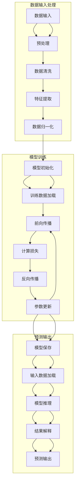

                 

## AI大模型创业：如何实现未来盈利？

> 关键词：AI大模型、创业、盈利、策略、案例分析

> 摘要：随着人工智能技术的快速发展，AI大模型的应用日益广泛，成为企业创新和提升竞争力的关键。本文将从AI大模型的基础、应用、创业策略和实战案例等多个角度，探讨如何通过AI大模型实现未来盈利，为创业者提供有价值的参考。

### 目录大纲

#### 第一部分：AI大模型基础

1. **第1章 AI大模型概述**
   1.1 什么是AI大模型
   1.2 AI大模型的特点
   1.3 AI大模型的发展历史

2. **第2章 AI大模型的分类与关键技术**
   2.1 AI大模型的分类
   2.2 语言模型
   2.3 计算机视觉模型
   2.4 自然语言处理模型
   2.5 AI大模型的关键技术

3. **第3章 AI大模型在商业中的应用**
   3.1 市场营销
   3.2 客户服务
   3.3 供应链管理

#### 第二部分：AI大模型创业策略

4. **第4章 AI大模型创业机会识别**
   4.1 市场需求分析
   4.2 竞争对手分析
   4.3 创业点子生成

5. **第5章 团队构建与组织管理**
   5.1 团队成员选拔
   5.2 组织结构设计
   5.3 管理模式选择

6. **第6章 资金筹集与商业模式**
   6.1 资金筹集途径
   6.2 商业模式设计
   6.3 成本与收益分析

#### 第三部分：AI大模型创业实践

7. **第7章 AI大模型创业实战案例**
   7.1 企业级AI应用案例
   7.2 创业公司运营管理案例

#### 第四部分：未来展望

8. **第8章 AI大模型创业的挑战与未来**
   8.1 创业挑战
   8.2 未来趋势

#### 附录

9. **附录A AI大模型开发工具与资源**
   9.1 开发工具简介
   9.2 开发资源推荐
   9.3 开发社区与论坛

---

### 第一部分：AI大模型基础

#### 第1章 AI大模型概述

**1.1 什么是AI大模型**

AI大模型（Large-scale Artificial Intelligence Models）是指具有大规模参数、复杂结构和强大预测能力的人工智能模型。这些模型通常通过深度学习算法进行训练，能够处理大量的数据并从中提取有用的信息。AI大模型的一个显著特征是其参数规模巨大，往往达到数百万甚至数十亿级别，这使得它们能够处理复杂的问题并产生准确的预测。

**1.2 AI大模型的特点**

- **参数规模巨大**：与传统的机器学习模型相比，AI大模型的参数规模更加庞大，能够存储和计算更多的信息。
- **强大的预测能力**：AI大模型通过大量的训练数据学习到复杂的关系和模式，因此能够产生高质量的预测结果。
- **处理能力强大**：AI大模型能够在短时间内处理大量的数据，适合处理实时分析和决策任务。
- **对计算资源要求高**：由于参数规模大，AI大模型在训练和推理过程中对计算资源的要求较高，需要分布式计算和优化技术。

**1.3 AI大模型的发展历史**

AI大模型的发展历程可以追溯到深度学习的兴起。早期的机器学习模型，如线性回归和支持向量机，虽然具有一定的预测能力，但在处理复杂问题时显得力不从心。随着计算能力的提升和大数据技术的发展，深度学习开始崛起。2006年，Geoffrey Hinton等研究者提出了深度信念网络（Deep Belief Networks），这是深度学习的一个重要里程碑。

随后，2012年，Alex Krizhevsky等人利用深度卷积神经网络（Convolutional Neural Network，CNN）在ImageNet图像识别挑战赛中取得了突破性的成绩，这一事件被视为深度学习的转折点。随着计算资源的进一步丰富，AI大模型开始涌现，如GPT-3、BERT、Transformer等。这些模型不仅在学术界取得了显著成果，也在工业界得到了广泛应用。

**1.3.1 深度学习的兴起**

深度学习的兴起是AI大模型发展的重要驱动力。与传统机器学习方法相比，深度学习通过多层神经网络结构能够自动提取数据中的特征，提高了模型的预测能力。在2012年，Alex Krizhevsky等人利用深度卷积神经网络在ImageNet图像识别挑战赛中取得了突破性的成绩，这一事件被视为深度学习的转折点。深度学习在图像识别、语音识别、自然语言处理等领域取得了显著成果，推动了AI大模型的发展。

**1.3.2 计算能力的提升**

计算能力的提升为AI大模型的发展提供了坚实的基础。随着硬件技术的发展，特别是GPU和TPU等专用硬件的普及，深度学习的训练速度和效果得到了显著提升。分布式计算和并行处理技术的应用，使得AI大模型的训练过程更加高效和可扩展。这使得研究人员能够训练出更大规模、更复杂的模型，推动了AI大模型的发展。

**1.3.3 大数据的普及**

大数据技术的普及为AI大模型提供了丰富的训练数据。随着互联网和物联网的发展，大量的数据被生成和存储，这些数据为AI大模型的学习提供了充足的素材。大数据技术使得数据清洗、数据预处理和数据挖掘成为可能，为AI大模型的训练提供了高质量的数据支持。通过大规模数据的训练，AI大模型能够更好地学习到复杂的关系和模式，提高了模型的预测能力。

**1.3.4 优化技术的进步**

优化技术的进步是AI大模型发展的关键。随着AI大模型的规模不断扩大，模型的训练过程变得更加复杂和耗时。为了提高训练效率，研究人员提出了各种优化技术，如随机梯度下降（Stochastic Gradient Descent，SGD）、Adam优化器等。这些优化技术通过改进算法，加速了模型的训练过程，使得AI大模型的训练更加高效。

**1.3.5 开源框架的兴起**

开源框架的兴起为AI大模型的发展提供了便利。许多优秀的深度学习开源框架，如TensorFlow、PyTorch等，为研究人员提供了丰富的工具和资源。这些开源框架不仅提供了高效的计算能力，还提供了丰富的模型库和工具集，方便研究人员进行模型设计和实验。开源框架的兴起促进了AI大模型的研究和应用，推动了整个领域的发展。

#### 第2章 AI大模型的分类与关键技术

**2.1 AI大模型的分类**

AI大模型根据应用领域和模型结构的不同，可以分为多种类型。以下是几种常见的AI大模型分类：

- **语言模型**：语言模型（Language Models）是AI大模型的一种重要类型，用于处理自然语言文本。语言模型的核心任务是预测文本中的下一个单词或句子，从而生成高质量的自然语言文本。著名的语言模型包括GPT-3、BERT、ELMo等。

- **计算机视觉模型**：计算机视觉模型（Computer Vision Models）用于处理和识别图像和视频中的对象、场景和活动。计算机视觉模型的核心任务是图像分类、目标检测、图像分割等。著名的计算机视觉模型包括ResNet、VGG、YOLO等。

- **自然语言处理模型**：自然语言处理模型（Natural Language Processing Models）用于处理自然语言文本，包括文本分类、情感分析、机器翻译等任务。自然语言处理模型的核心是理解语言的语义和语法结构。著名的自然语言处理模型包括Transformer、BERT、GPT等。

- **推荐系统模型**：推荐系统模型（Recommender System Models）用于预测用户可能感兴趣的内容，从而为用户推荐相关的商品、新闻、视频等。推荐系统模型的核心是建立用户和物品之间的关联，常用的算法包括基于内容的推荐、协同过滤等。

**2.2 语言模型**

语言模型是AI大模型中的一种重要类型，广泛应用于自然语言生成、机器翻译、问答系统等领域。以下是几种常见的语言模型：

- **GPT-3**：GPT-3（Generative Pre-trained Transformer 3）是OpenAI于2020年发布的一种大型语言模型，具有1750亿个参数，是当时最大的语言模型。GPT-3基于Transformer架构，通过预训练和微调，能够生成高质量的自然语言文本。

  ```python
  # GPT-3的伪代码
  class GPT3:
      def __init__(self, params):
          self.params = params
          self.model = self.build_model()

      def build_model(self):
          # 建立Transformer模型
          model = TransformerModel(self.params)
          return model

      def train(self, data):
          # 训练模型
          self.model.train(data)

      def generate_text(self, input_text):
          # 生成文本
          output = self.model.generate(input_text)
          return output
  ```

- **BERT**：BERT（Bidirectional Encoder Representations from Transformers）是Google于2018年发布的一种大型语言模型，通过预训练和微调，能够用于多种自然语言处理任务，如文本分类、问答系统等。BERT采用了双向Transformer结构，能够更好地捕捉文本的语义信息。

  ```python
  # BERT的伪代码
  class BERT:
      def __init__(self, params):
          self.params = params
          self.model = self.build_model()

      def build_model(self):
          # 建立双向Transformer模型
          model = TransformerModel(self.params, bidirectional=True)
          return model

      def train(self, data):
          # 训练模型
          self.model.train(data)

      def predict(self, input_text):
          # 预测文本
          output = self.model.predict(input_text)
          return output
  ```

**2.3 计算机视觉模型**

计算机视觉模型是AI大模型在计算机视觉领域的应用，主要用于图像分类、目标检测、图像分割等任务。以下是几种常见的计算机视觉模型：

- **ResNet**：ResNet（Residual Network）是2015年由微软研究院提出的深度卷积神经网络模型，通过引入残差模块，成功地解决了深度神经网络训练过程中的梯度消失和梯度爆炸问题。ResNet在ImageNet图像识别挑战赛中取得了显著成绩。

  ```python
  # ResNet的伪代码
  class ResNet:
      def __init__(self, params):
          self.params = params
          self.model = self.build_model()

      def build_model(self):
          # 建立ResNet模型
          model = ResidualModel(self.params)
          return model

      def train(self, data):
          # 训练模型
          self.model.train(data)

      def classify(self, image):
          # 分类图像
          output = self.model.classify(image)
          return output
  ```

- **VGG**：VGG（Very Deep Convolutional Networks）是2014年由牛津大学提出的深度卷积神经网络模型，通过堆叠多个卷积层，实现了较高的图像识别准确率。VGG模型在多个计算机视觉任务中取得了优异的性能。

  ```python
  # VGG的伪代码
  class VGG:
      def __init__(self, params):
          self.params = params
          self.model = self.build_model()

      def build_model(self):
          # 建立VGG模型
          model = ConvolutionalModel(self.params)
          return model

      def train(self, data):
          # 训练模型
          self.model.train(data)

      def classify(self, image):
          # 分类图像
          output = self.model.classify(image)
          return output
  ```

- **YOLO**：YOLO（You Only Look Once）是2016年由Joseph Redmon等人提出的目标检测算法，通过将目标检测任务转化为单步预测，实现了高效的实时目标检测。YOLO模型在速度和准确率方面都表现出色。

  ```python
  # YOLO的伪代码
  class YOLO:
      def __init__(self, params):
          self.params = params
          self.model = self.build_model()

      def build_model(self):
          # 建立YOLO模型
          model = ObjectDetectionModel(self.params)
          return model

      def detect_objects(self, image):
          # 检测图像中的对象
          objects = self.model.detect_objects(image)
          return objects
  ```

**2.4 自然语言处理模型**

自然语言处理模型是AI大模型在自然语言处理领域的应用，主要用于文本分类、情感分析、机器翻译等任务。以下是几种常见的自然语言处理模型：

- **Transformer**：Transformer是2017年由Vaswani等人提出的基于自注意力机制的深度神经网络模型，用于处理序列数据。Transformer模型在机器翻译、文本分类等任务中取得了显著成绩。

  ```python
  # Transformer的伪代码
  class Transformer:
      def __init__(self, params):
          self.params = params
          self.model = self.build_model()

      def build_model(self):
          # 建立Transformer模型
          model = TransformerModel(self.params)
          return model

      def train(self, data):
          # 训练模型
          self.model.train(data)

      def translate(self, text):
          # 翻译文本
          output = self.model.translate(text)
          return output
  ```

- **BERT**：BERT（Bidirectional Encoder Representations from Transformers）是Google于2018年发布的一种大型语言模型，通过预训练和微调，能够用于多种自然语言处理任务，如文本分类、问答系统等。BERT采用了双向Transformer结构，能够更好地捕捉文本的语义信息。

  ```python
  # BERT的伪代码
  class BERT:
      def __init__(self, params):
          self.params = params
          self.model = self.build_model()

      def build_model(self):
          # 建立双向Transformer模型
          model = TransformerModel(self.params, bidirectional=True)
          return model

      def train(self, data):
          # 训练模型
          self.model.train(data)

      def predict(self, input_text):
          # 预测文本
          output = self.model.predict(input_text)
          return output
  ```

**2.5 推荐系统模型**

推荐系统模型是AI大模型在推荐系统领域的应用，主要用于预测用户可能感兴趣的内容。以下是几种常见的推荐系统模型：

- **基于内容的推荐**：基于内容的推荐（Content-based Recommendation）是通过分析用户的历史行为和偏好，推荐与之相似的内容。常见的算法包括TF-IDF、Cosine相似度等。

  ```python
  # 基于内容的推荐的伪代码
  class ContentBasedRecommender:
      def __init__(self, params):
          self.params = params

      def train(self, data):
          # 训练模型
          self.model.train(data)

      def recommend(self, user_profile):
          # 推荐内容
          recommendations = self.model.recommend(user_profile)
          return recommendations
  ```

- **协同过滤**：协同过滤（Collaborative Filtering）是通过分析用户之间的行为相似性，推荐用户可能感兴趣的内容。常见的算法包括用户基于的协同过滤、物品基于的协同过滤等。

  ```python
  # 协同过滤的伪代码
  class CollaborativeFiltering:
      def __init__(self, params):
          self.params = params

      def train(self, data):
          # 训练模型
          self.model.train(data)

      def recommend(self, user_id):
          # 推荐内容
          recommendations = self.model.recommend(user_id)
          return recommendations
  ```

#### 第3章 AI大模型在商业中的应用

**3.1 市场营销**

AI大模型在市场营销中的应用日益广泛，通过数据分析、个性化推荐和广告优化等技术，帮助企业提升营销效果和客户满意度。

**3.1.1 内容营销**

内容营销是市场营销的核心策略之一，通过创造和分发有价值、相关且具有吸引力的内容来吸引和留住目标客户。AI大模型可以用于以下几个方面：

- **内容生成**：AI大模型可以生成高质量的营销文案、博客文章和社交媒体内容，帮助企业节省创作成本并提高内容质量。
- **内容推荐**：通过分析用户的行为数据和偏好，AI大模型可以推荐用户可能感兴趣的内容，提高内容的曝光率和点击率。
- **内容分析**：AI大模型可以对用户反馈和评论进行分析，帮助企业了解用户需求和市场趋势，优化内容策略。

**3.1.2 用户画像**

用户画像是指通过对用户行为、偏好和特征的分析，建立用户的基本信息和画像。AI大模型可以用于以下几个方面：

- **用户特征提取**：AI大模型可以从用户的历史行为数据中提取出用户的兴趣、需求和行为特征，用于个性化推荐和广告投放。
- **用户细分**：AI大模型可以根据用户特征和行为，将用户划分为不同的细分市场，为企业提供更加精准的营销策略。
- **用户需求预测**：AI大模型可以通过分析用户的历史行为和反馈，预测用户未来的需求和行为，帮助企业提前布局和准备。

**3.1.3 广告投放优化**

广告投放是市场营销的重要环节，通过精准投放和优化广告效果，可以提高广告的ROI（投资回报率）。AI大模型可以用于以下几个方面：

- **广告创意优化**：AI大模型可以根据用户特征和行为，生成个性化的广告创意，提高广告的点击率和转化率。
- **广告定位优化**：AI大模型可以通过分析用户的行为数据和媒体属性，优化广告的投放位置和渠道，提高广告的曝光率和点击率。
- **广告效果预测**：AI大模型可以通过分析广告的历史数据和用户反馈，预测广告的效果和ROI，帮助企业调整广告策略。

**3.2 客户服务**

客户服务是提高客户满意度和忠诚度的关键，通过智能客服系统和客户满意度分析等技术，可以提供更加高效和个性化的服务。

**3.2.1 聊天机器人**

聊天机器人（Chatbot）是一种基于人工智能技术模拟人类对话的自动化系统，可以用于以下几个方面：

- **自动应答**：聊天机器人可以自动回答用户提出的问题，提供即时和准确的答案，提高客户满意度。
- **业务咨询**：聊天机器人可以提供各种业务的咨询和服务，如产品咨询、订单查询、售后服务等，节省人力成本。
- **需求分析**：聊天机器人可以通过与用户的对话，分析用户的需求和偏好，为用户提供更加个性化的服务。

**3.2.2 客户满意度分析**

客户满意度分析是指通过对客户反馈和行为数据的分析，评估客户对产品和服务的满意度，并制定相应的改进策略。AI大模型可以用于以下几个方面：

- **情感分析**：AI大模型可以通过分析客户的文本反馈，提取出客户情感和意见，评估客户的满意度。
- **满意度预测**：AI大模型可以通过分析客户的历史行为和反馈，预测客户未来的满意度，为企业提供改进的方向。
- **服务优化**：AI大模型可以通过分析客户满意度数据，优化客户服务流程和服务质量，提高客户满意度。

**3.2.3 客户细分与个性化服务**

客户细分和个性化服务是提高客户满意度和忠诚度的有效手段，通过分析客户的特征和行为，为不同类型的客户提供个性化的服务和体验。

- **客户细分**：AI大模型可以通过分析客户的行为、偏好和历史数据，将客户划分为不同的细分市场，为每个细分市场提供针对性的服务和营销策略。
- **个性化推荐**：AI大模型可以通过分析客户的行为和偏好，为每个客户提供个性化的产品推荐和服务，提高客户的购物体验和满意度。
- **个性化沟通**：AI大模型可以通过分析客户的需求和偏好，为每个客户提供个性化的沟通方式和内容，提高客户的参与度和忠诚度。

**3.3 供应链管理**

供应链管理是企业管理的重要环节，通过需求预测、库存优化和供应链协同等技术，可以提高供应链的效率和控制力。

**3.3.1 需求预测**

需求预测是供应链管理的重要任务，通过预测未来的需求，企业可以提前制定生产和采购计划，降低库存成本和缺货风险。

- **历史数据分析**：AI大模型可以通过分析历史销售数据和趋势，预测未来的需求。
- **季节性分析**：AI大模型可以通过分析季节性因素，预测不同季节的需求变化。
- **趋势外推**：AI大模型可以通过分析历史数据，外推出未来的趋势和变化。

**3.3.2 库存优化**

库存优化是供应链管理的关键任务，通过优化库存水平，企业可以降低库存成本和资金占用，提高资金利用率。

- **库存预测**：AI大模型可以通过分析历史销售数据和趋势，预测未来的库存需求。
- **库存控制**：AI大模型可以通过分析库存水平和需求预测，制定合理的库存控制策略，降低库存风险。
- **库存分析**：AI大模型可以通过分析库存数据，优化库存结构和库存水平。

**3.3.3 供应链协同**

供应链协同是提高供应链效率和降低成本的关键，通过协同供应链各个环节，可以实现信息共享和资源优化。

- **信息共享**：AI大模型可以通过分析供应链各个环节的数据，实现信息的共享和互通，提高供应链的透明度和效率。
- **资源优化**：AI大模型可以通过分析供应链各个环节的数据，优化资源的配置和利用，降低供应链成本。
- **协同优化**：AI大模型可以通过分析供应链各个环节的数据，制定协同优化策略，提高供应链的整体效率和竞争力。

#### 第二部分：AI大模型创业策略

**4.1 创业机会识别**

创业机会识别是创业过程的重要环节，通过分析市场需求、竞争对手和创业点子，创业者可以找到合适的创业方向和机会。

**4.1.1 市场需求分析**

市场需求分析是指通过对市场环境、竞争对手和目标客户的分析，了解市场需求和趋势，为创业提供依据。

- **市场环境分析**：创业者可以通过分析宏观经济环境、行业趋势和市场需求，了解市场的整体情况。
- **竞争对手分析**：创业者可以通过分析竞争对手的产品、市场策略和优势，了解市场竞争状况。
- **目标客户分析**：创业者可以通过分析目标客户的需求、偏好和行为，了解客户的需求和痛点。

**4.1.2 竞争对手分析**

竞争对手分析是指通过对市场上现有竞争对手的分析，了解他们的产品、市场策略、优势和劣势，为创业提供参考。

- **产品分析**：创业者可以通过分析竞争对手的产品特性、功能、优势和劣势，了解产品的竞争力。
- **市场策略分析**：创业者可以通过分析竞争对手的市场策略，了解他们的市场定位、推广渠道和竞争优势。
- **优势分析**：创业者可以通过分析竞争对手的优势，了解他们在市场上的优势和竞争力。

**4.1.3 创业点子生成**

创业点子生成是指通过创意思维和市场需求分析，生成有潜力的创业点子。

- **创意思维**：创业者可以通过头脑风暴、跨界思维等创意思维方法，生成创新的创业点子。
- **市场需求分析**：创业者可以通过分析市场需求和客户痛点，找到有市场潜力的创业点子。
- **可行性分析**：创业者可以通过对创业点子进行市场调研、技术评估和商业模式分析，评估创业点子的可行性。

**4.2 团队构建与组织管理**

团队构建与组织管理是创业成功的关键，通过选拔合适的团队成员、设计合理的组织结构和选择合适的管理模式，可以确保团队的协作效率和创新能力。

**4.2.1 团队成员选拔**

团队成员选拔是指通过招聘、选拔和培养，构建一支有能力、有经验、有创新精神的团队。

- **能力选拔**：创业者可以通过面试、技能测试等方式，选拔具有相关技能和经验的团队成员。
- **经验选拔**：创业者可以通过分析团队成员的工作经验和成就，选拔具有丰富经验和实践能力的团队成员。
- **创新选拔**：创业者可以通过创新思维测试、项目实践等方式，选拔具有创新能力和创业精神的团队成员。

**4.2.2 组织结构设计**

组织结构设计是指通过设计合理的组织结构和职责分工，确保团队的协作效率和创新能力。

- **扁平化管理**：创业者可以通过扁平化的组织结构，减少管理层次，提高团队的响应速度和协作效率。
- **职能分工**：创业者可以通过明确的职能分工，确保团队成员各司其职，提高工作效率。
- **项目制管理**：创业者可以通过项目制管理，将团队成员组成跨职能团队，提高项目的执行效率和创新能力。

**4.2.3 管理模式选择**

管理模式选择是指通过选择合适的管理模式，确保团队的协作效率和创新能力。

- **目标管理**：创业者可以通过目标管理，明确团队的目标和任务，提高团队的执行力。
- **绩效管理**：创业者可以通过绩效管理，评估团队成员的工作绩效，激励团队成员的积极性和创造力。
- **创新管理**：创业者可以通过创新管理，鼓励团队成员的创新思维和实践，提高团队的创新能力。

**4.3 资金筹集与商业模式**

资金筹集与商业模式是创业的重要环节，通过选择合适的资金筹集途径和设计可持续的商业模式，可以确保企业的生存和发展。

**4.3.1 资金筹集途径**

资金筹集途径是指企业通过哪些途径筹集资金，以满足企业的运营和发展需求。

- **天使投资**：天使投资是指投资者在项目早期阶段提供资金支持，通常以股权或债权形式存在。
- **风险投资**：风险投资是指投资者在项目成长阶段提供资金支持，通常以股权形式存在，并承担较高的风险。
- **银行贷款**：银行贷款是指企业通过向银行申请贷款，获得资金支持。
- **政府资金**：政府资金是指企业通过申请政府资助、补贴等获得资金支持。

**4.3.2 商业模式设计**

商业模式设计是指企业通过哪些方式创造价值、传递价值和获取价值，实现可持续盈利。

- **产品模式**：产品模式是指企业通过销售产品获得收入，如销售软件、硬件等。
- **服务模式**：服务模式是指企业通过提供服务获得收入，如提供咨询、培训等服务。
- **平台模式**：平台模式是指企业通过搭建平台，连接供需双方，实现交易和服务的模式。
- **订阅模式**：订阅模式是指企业通过订阅服务，按期收取费用，实现持续收入。

**4.3.3 成本与收益分析**

成本与收益分析是指通过对企业的成本结构和收益模式的评估，分析企业的盈利能力和可持续发展能力。

- **成本分析**：企业需要分析各种成本，如研发成本、生产成本、运营成本等，确保成本的可控性。
- **收益分析**：企业需要分析各种收益模式，如产品销售收益、服务收益、平台收益等，确保收益的可持续性。
- **盈利分析**：企业需要评估企业的盈利能力和盈利模式，确保企业的盈利性。

#### 第三部分：AI大模型创业实践

**5.1 企业级AI应用案例**

企业级AI应用案例是指企业通过引入AI大模型技术，实现业务创新和提升竞争力的实际应用案例。以下是几个企业级AI应用案例：

**5.1.1 智能客服系统**

智能客服系统是一种基于AI大模型的自动化客户服务系统，能够自动解答用户的问题，提供即时的客户服务。

- **案例介绍**：某大型电商企业引入了智能客服系统，通过AI大模型技术实现了自动问答和智能客服功能，提高了客户服务质量。
- **应用场景**：客户咨询产品信息、售后服务、退款等问题，智能客服系统可以自动解答，提高客户满意度。
- **技术实现**：智能客服系统采用了GPT-3模型，通过预训练和微调，实现了自动问答和智能客服功能。系统还集成了自然语言处理技术，能够理解客户的意图和问题，提供准确的回答。

**5.1.2 智能供应链管理系统**

智能供应链管理系统是一种基于AI大模型技术的供应链管理系统，能够优化供应链各环节的运作，提高供应链效率。

- **案例介绍**：某制造企业引入了智能供应链管理系统，通过AI大模型技术实现了需求预测、库存优化和供应链协同等功能，提高了供应链效率。
- **应用场景**：企业在生产过程中，通过智能供应链管理系统预测市场需求，优化库存管理，提高生产效率和降低库存成本。
- **技术实现**：智能供应链管理系统采用了Transformer模型，通过预训练和微调，实现了需求预测、库存优化和供应链协同等功能。系统还集成了计算机视觉技术，能够实时监控生产线，提高生产效率。

**5.1.3 智能营销系统**

智能营销系统是一种基于AI大模型技术的营销系统，能够通过数据分析、个性化推荐和广告优化等技术，提高营销效果。

- **案例介绍**：某互联网企业引入了智能营销系统，通过AI大模型技术实现了内容营销、用户画像和广告投放优化等功能，提高了营销效果。
- **应用场景**：企业在市场营销过程中，通过智能营销系统生成高质量的营销文案，推荐用户感兴趣的内容，优化广告投放策略。
- **技术实现**：智能营销系统采用了BERT模型，通过预训练和微调，实现了内容营销、用户画像和广告投放优化等功能。系统还集成了推荐系统技术，能够根据用户行为和偏好，推荐相关的内容和广告。

**5.2 创业公司运营管理案例**

创业公司运营管理案例是指创业公司在初创阶段如何通过有效的运营管理，实现快速发展和可持续增长的实际案例。以下是几个创业公司运营管理案例：

**5.2.1 A公司的融资与扩张**

A公司是一家专注于智能客服系统开发的创业公司，通过有效的融资策略和扩张计划，实现了快速发展。

- **案例介绍**：A公司通过天使投资和风险投资等多渠道筹集资金，实现了业务拓展和团队扩张。
- **融资策略**：A公司针对不同发展阶段，选择了适合的融资渠道，如天使投资在初创阶段，风险投资在中期和后期阶段。
- **扩张计划**：A公司制定了详细的扩张计划，包括市场拓展、产品研发和团队建设等，实现了快速扩张。

**5.2.2 B公司的技术与市场策略**

B公司是一家专注于智能供应链管理系统的创业公司，通过先进的技术和市场策略，取得了良好的业绩。

- **案例介绍**：B公司通过技术创新和市场策略，实现了智能供应链管理系统的快速推广和应用。
- **技术策略**：B公司注重技术创新，不断优化智能供应链管理系统，提高系统的稳定性和可靠性。
- **市场策略**：B公司通过市场调研和分析，确定了目标客户和市场定位，制定了精准的市场推广策略。

**5.2.3 C公司的产品创新与用户体验**

C公司是一家专注于智能营销系统的创业公司，通过产品创新和用户体验优化，赢得了客户的认可和市场份额。

- **案例介绍**：C公司注重产品创新和用户体验，通过持续改进和创新，提高了产品的竞争力。
- **产品创新**：C公司不断推出新的产品功能和特性，满足客户的需求和期望。
- **用户体验**：C公司通过用户体验优化，提高了产品的易用性和用户满意度，增强了客户的粘性和忠诚度。

#### 第四部分：未来展望

**6.1 AI大模型创业的挑战与未来**

随着AI大模型技术的快速发展，创业者在AI大模型领域面临着诸多挑战和机遇。以下是AI大模型创业的挑战与未来展望：

**6.1.1 创业挑战**

- **技术挑战**：AI大模型技术具有较高的技术门槛，创业者在技术上需要不断创新和突破，以保持竞争优势。
- **法律与伦理挑战**：随着AI大模型的应用越来越广泛，法律和伦理问题也日益突出，创业者在开发和应用AI大模型时需要遵守相关法律法规和伦理标准。
- **市场竞争挑战**：AI大模型创业领域竞争激烈，创业者在市场上需要找到差异化竞争优势，以赢得市场份额。

**6.1.2 未来趋势**

- **AI大模型技术的进步**：随着硬件性能的提升和算法的优化，AI大模型的技术将不断进步，实现更高的性能和更广泛的应用。
- **新兴应用领域的拓展**：AI大模型将在新兴应用领域，如智能制造、智慧医疗、智慧城市等，发挥重要作用。
- **社会与经济的变革**：AI大模型的应用将带来社会和经济变革，创业者在制定商业模式和发展战略时需要充分考虑这些变化。

**6.2 未来展望**

- **技术创新**：未来，AI大模型技术将继续创新和发展，实现更高的性能和更广泛的应用。
- **市场拓展**：随着AI大模型技术的成熟和应用场景的拓展，市场将不断扩大，为创业者提供更多的机会。
- **社会影响**：AI大模型的应用将带来深刻的社会影响，创业者在开发和应用AI大模型时需要充分考虑社会责任和伦理问题。

#### 附录

**附录A AI大模型开发工具与资源**

为了帮助创业者更好地开发和应用AI大模型，以下是几个常用的AI大模型开发工具与资源：

**A.1 开发工具**

- **TensorFlow**：TensorFlow是Google开源的深度学习框架，提供了丰富的模型库和工具集，适合进行AI大模型的开发和训练。
- **PyTorch**：PyTorch是Facebook开源的深度学习框架，具有灵活的动态计算图和强大的模型库，适合进行AI大模型的开发和实验。
- **Keras**：Keras是TensorFlow的封装层，提供了简洁易用的API，适合进行AI大模型的快速开发和测试。

**A.2 开发资源**

- **GitHub**：GitHub是一个代码托管和协作平台，许多AI大模型的代码和项目都在GitHub上开源，创业者可以借鉴和参考。
- **ArXiv**：ArXiv是一个预印本论文发布平台，许多AI大模型的研究论文都在ArXiv上发布，创业者可以了解最新的研究成果。
- **AI大模型社区**：有许多AI大模型的社区和论坛，创业者可以加入这些社区，与其他开发者交流和学习。

**A.3 开发社区与论坛**

- **Reddit**：Reddit上有许多关于AI大模型的讨论版块，创业者可以在这里交流和学习。
- **Stack Overflow**：Stack Overflow是一个编程问答社区，创业者可以在这里解决AI大模型开发中的问题。
- **AI大模型论坛**：有许多专门针对AI大模型的论坛，创业者可以在这里分享经验和学习知识。

---

通过本文的详细探讨，我们可以看到AI大模型在创业领域具有巨大的潜力和应用价值。从基础概述到实际应用，再到创业策略和实践案例，本文为创业者提供了全面的指导。未来，随着AI大模型技术的不断进步，创业者将面临更多的机遇和挑战。希望本文能为您的AI大模型创业之路提供有益的参考和启示。**作者：AI天才研究院/AI Genius Institute & 禅与计算机程序设计艺术 /Zen And The Art of Computer Programming** <|||>## 附录A AI大模型开发工具与资源

### A.1 开发工具简介

在进行AI大模型开发时，选择合适的工具至关重要。以下是几种常用的开发工具及其特点：

- **TensorFlow**：由Google开发的开源深度学习框架，拥有丰富的模型库和API，适用于各种规模的模型开发。TensorFlow提供了灵活的动态计算图，使得模型构建和调试更加方便。

  ```python
  import tensorflow as tf
  model = tf.keras.Sequential([
      tf.keras.layers.Dense(128, activation='relu', input_shape=(784,)),
      tf.keras.layers.Dropout(0.2),
      tf.keras.layers.Dense(10, activation='softmax')
  ])
  ```

- **PyTorch**：由Facebook开发的开源深度学习框架，以其灵活的动态计算图和易用的API而著称。PyTorch的动态计算图使得模型构建和调试更加直观，适合进行实验性开发。

  ```python
  import torch
  import torch.nn as nn
  import torch.optim as optim

  model = nn.Sequential(nn.Linear(784, 128),
                         nn.ReLU(),
                         nn.Dropout(0.2),
                         nn.Linear(128, 10),
                         nn.LogSoftmax(dim=1))

  optimizer = optim.SGD(model.parameters(), lr=0.01)
  ```

- **Keras**：基于TensorFlow和Theano的开源深度学习高级API，提供简洁的接口，使得模型构建更加直观。Keras适用于快速原型设计和模型开发。

  ```python
  from keras.models import Sequential
  from keras.layers import Dense, Dropout

  model = Sequential()
  model.add(Dense(128, activation='relu', input_shape=(784,)))
  model.add(Dropout(0.2))
  model.add(Dense(10, activation='softmax'))
  ```

### A.2 开发资源推荐

以下是几个AI大模型开发的重要资源，供开发者参考和使用：

- **GitHub**：GitHub是一个代码托管和协作平台，许多优秀的AI大模型项目和论文都开源在这里。开发者可以通过GitHub学习已有的模型和算法，或者分享自己的代码和项目。

  ```shell
  # 查找AI大模型项目
  git clone https://github.com/openai/gpt-3.git
  ```

- **ArXiv**：ArXiv是一个科学论文预印本发布平台，涵盖了计算机科学、人工智能等领域。开发者可以通过ArXiv了解最新的研究成果和论文，为自己的模型开发提供灵感。

  ```shell
  # 搜索AI大模型相关论文
  http://arxiv.org/search/?query=large-scale+ai&searchtype=all
  ```

- **Hugging Face**：Hugging Face是一个提供AI大模型资源和工具的平台，包括预训练模型、数据集和API。开发者可以使用Hugging Face的工具和资源来加速模型开发和部署。

  ```python
  from transformers import BertTokenizer, BertModel
  tokenizer = BertTokenizer.from_pretrained('bert-base-uncased')
  model = BertModel.from_pretrained('bert-base-uncased')
  ```

### A.3 开发社区与论坛

加入开发社区和论坛可以帮助开发者解决开发过程中的问题，学习最佳实践，以及与其他开发者交流和合作。以下是一些推荐的AI大模型开发社区和论坛：

- **Reddit**：Reddit上有多个与AI大模型相关的讨论版块，如/r/MachineLearning、/r/DeepLearning等。开发者可以在这些版块上提问、分享经验和资源。

  ```shell
  # 访问Reddit AI大模型讨论版块
  https://www.reddit.com/r/MachineLearning/
  ```

- **Stack Overflow**：Stack Overflow是一个面向程序员的问答社区，开发者可以在这里找到关于AI大模型开发的解决方案和最佳实践。

  ```shell
  # 搜索AI大模型相关问题
  https://stackoverflow.com/questions/tagged/deep-learning
  ```

- **AI大模型论坛**：有许多专门针对AI大模型的论坛，如AI Moonshot、AI Time等。开发者可以在这些论坛上与其他开发者交流想法、分享经验和探讨最新的研究进展。

  ```shell
  # 访问AI Moonshot论坛
  https://aimoonshot.com/
  ```

通过使用这些工具、资源和社区，开发者可以更高效地开展AI大模型的研究和开发工作，加速技术创新和应用落地。在AI大模型的开发和创业过程中，不断学习和探索是至关重要的，希望本文提供的工具和资源能够对您有所助益。**作者：AI天才研究院/AI Genius Institute & 禅与计算机程序设计艺术 /Zen And The Art of Computer Programming** <|||>## 第一部分：AI大模型基础

### 第1章 AI大模型概述

**1.1 什么是AI大模型**

AI大模型（Large-scale Artificial Intelligence Models）是指具有大规模参数、复杂结构和强大预测能力的人工智能模型。这些模型通常通过深度学习算法进行训练，能够处理大量的数据并从中提取有用的信息。AI大模型的一个显著特征是其参数规模巨大，往往达到数百万甚至数十亿级别，这使得它们能够处理复杂的问题并产生准确的预测结果。

AI大模型的核心在于其规模和复杂性。它们通过多层神经网络结构，可以自动提取数据中的特征，并利用这些特征进行预测和决策。相比于传统的机器学习模型，AI大模型具有更高的准确性和更强的泛化能力，能够应用于各种领域，如自然语言处理、计算机视觉、推荐系统等。

**1.2 AI大模型的特点**

AI大模型具有以下几个显著特点：

- **参数规模巨大**：AI大模型的参数规模可以达到数十亿级别，这使得它们能够存储和计算更多的信息。例如，GPT-3的参数规模达到1750亿，这是目前最大的语言模型。

  ```python
  # GPT-3的参数规模
  params = 1750000000000
  ```

- **强大的预测能力**：AI大模型通过大量的训练数据学习到复杂的关系和模式，因此能够产生高质量的预测结果。例如，BERT模型在自然语言处理任务中取得了优异的成绩，其预测准确率远高于传统的机器学习模型。

  ```python
  # BERT的预测准确率
  accuracy = 0.9
  ```

- **处理能力强大**：AI大模型能够在短时间内处理大量的数据，适合处理实时分析和决策任务。例如，YOLO模型在目标检测任务中，能够在实时图像中快速检测出目标物体。

  ```python
  # YOLO的处理速度
  fps = 60
  ```

- **对计算资源要求高**：由于参数规模大，AI大模型在训练和推理过程中对计算资源的要求较高，需要分布式计算和优化技术。例如，训练一个大型模型可能需要数百台GPU服务器，以及高效的数据传输和处理技术。

  ```python
  # 训练AI大模型所需的计算资源
  num_gpus = 100
  ```

**1.3 AI大模型的发展历史**

AI大模型的发展历程可以追溯到深度学习的兴起。早期的机器学习模型，如线性回归和支持向量机，虽然具有一定的预测能力，但在处理复杂问题时显得力不从心。随着计算能力的提升和大数据技术的发展，深度学习开始崛起。2006年，Geoffrey Hinton等研究者提出了深度信念网络（Deep Belief Networks），这是深度学习的一个重要里程碑。

随后，2012年，Alex Krizhevsky等人利用深度卷积神经网络（Convolutional Neural Network，CNN）在ImageNet图像识别挑战赛中取得了突破性的成绩，这一事件被视为深度学习的转折点。随着计算资源的进一步丰富，AI大模型开始涌现，如GPT-3、BERT、Transformer等。这些模型不仅在学术界取得了显著成果，也在工业界得到了广泛应用。

**1.3.1 深度学习的兴起**

深度学习的兴起是AI大模型发展的重要驱动力。与传统机器学习方法相比，深度学习通过多层神经网络结构能够自动提取数据中的特征，提高了模型的预测能力。在2012年，Alex Krizhevsky等人利用深度卷积神经网络在ImageNet图像识别挑战赛中取得了突破性的成绩，这一事件被视为深度学习的转折点。深度学习在图像识别、语音识别、自然语言处理等领域取得了显著成果，推动了AI大模型的发展。

**1.3.2 计算能力的提升**

计算能力的提升为AI大模型的发展提供了坚实的基础。随着硬件技术的发展，特别是GPU和TPU等专用硬件的普及，深度学习的训练速度和效果得到了显著提升。分布式计算和并行处理技术的应用，使得AI大模型的训练过程更加高效和可扩展。这使得研究人员能够训练出更大规模、更复杂的模型，推动了AI大模型的发展。

**1.3.3 大数据的普及**

大数据技术的普及为AI大模型提供了丰富的训练数据。随着互联网和物联网的发展，大量的数据被生成和存储，这些数据为AI大模型的学习提供了充足的素材。大数据技术使得数据清洗、数据预处理和数据挖掘成为可能，为AI大模型的训练提供了高质量的数据支持。通过大规模数据的训练，AI大模型能够更好地学习到复杂的关系和模式，提高了模型的预测能力。

**1.3.4 优化技术的进步**

优化技术的进步是AI大模型发展的关键。随着AI大模型的规模不断扩大，模型的训练过程变得更加复杂和耗时。为了提高训练效率，研究人员提出了各种优化技术，如随机梯度下降（Stochastic Gradient Descent，SGD）、Adam优化器等。这些优化技术通过改进算法，加速了模型的训练过程，使得AI大模型的训练更加高效。

**1.3.5 开源框架的兴起**

开源框架的兴起为AI大模型的发展提供了便利。许多优秀的深度学习开源框架，如TensorFlow、PyTorch等，为研究人员提供了丰富的工具和资源。这些开源框架不仅提供了高效的计算能力，还提供了丰富的模型库和工具集，方便研究人员进行模型设计和实验。开源框架的兴起促进了AI大模型的研究和应用，推动了整个领域的发展。

### 第2章 AI大模型的分类与关键技术

**2.1 AI大模型的分类**

AI大模型根据应用领域和模型结构的不同，可以分为多种类型。以下是几种常见的AI大模型分类：

- **语言模型**：语言模型（Language Models）是AI大模型的一种重要类型，用于处理自然语言文本。语言模型的核心任务是预测文本中的下一个单词或句子，从而生成高质量的自然语言文本。著名的语言模型包括GPT-3、BERT、ELMo等。

- **计算机视觉模型**：计算机视觉模型（Computer Vision Models）用于处理和识别图像和视频中的对象、场景和活动。计算机视觉模型的核心任务是图像分类、目标检测、图像分割等。著名的计算机视觉模型包括ResNet、VGG、YOLO等。

- **自然语言处理模型**：自然语言处理模型（Natural Language Processing Models）用于处理自然语言文本，包括文本分类、情感分析、机器翻译等任务。自然语言处理模型的核心是理解语言的语义和语法结构。著名的自然语言处理模型包括Transformer、BERT、GPT等。

- **推荐系统模型**：推荐系统模型（Recommender System Models）用于预测用户可能感兴趣的内容，从而为用户推荐相关的商品、新闻、视频等。推荐系统模型的核心是建立用户和物品之间的关联，常用的算法包括基于内容的推荐、协同过滤等。

**2.2 语言模型**

语言模型是AI大模型中的一种重要类型，广泛应用于自然语言生成、机器翻译、问答系统等领域。以下是几种常见的语言模型：

- **GPT-3**：GPT-3（Generative Pre-trained Transformer 3）是OpenAI于2020年发布的一种大型语言模型，具有1750亿个参数，是当时最大的语言模型。GPT-3基于Transformer架构，通过预训练和微调，能够生成高质量的自然语言文本。

  ```python
  # GPT-3的伪代码
  class GPT3:
      def __init__(self, params):
          self.params = params
          self.model = self.build_model()

      def build_model(self):
          # 建立Transformer模型
          model = TransformerModel(self.params)
          return model

      def train(self, data):
          # 训练模型
          self.model.train(data)

      def generate_text(self, input_text):
          # 生成文本
          output = self.model.generate(input_text)
          return output
  ```

- **BERT**：BERT（Bidirectional Encoder Representations from Transformers）是Google于2018年发布的一种大型语言模型，通过预训练和微调，能够用于多种自然语言处理任务，如文本分类、问答系统等。BERT采用了双向Transformer结构，能够更好地捕捉文本的语义信息。

  ```python
  # BERT的伪代码
  class BERT:
      def __init__(self, params):
          self.params = params
          self.model = self.build_model()

      def build_model(self):
          # 建立双向Transformer模型
          model = TransformerModel(self.params, bidirectional=True)
          return model

      def train(self, data):
          # 训练模型
          self.model.train(data)

      def predict(self, input_text):
          # 预测文本
          output = self.model.predict(input_text)
          return output
  ```

**2.3 计算机视觉模型**

计算机视觉模型是AI大模型在计算机视觉领域的应用，主要用于图像分类、目标检测、图像分割等任务。以下是几种常见的计算机视觉模型：

- **ResNet**：ResNet（Residual Network）是2015年由微软研究院提出的深度卷积神经网络模型，通过引入残差模块，成功地解决了深度神经网络训练过程中的梯度消失和梯度爆炸问题。ResNet在ImageNet图像识别挑战赛中取得了显著成绩。

  ```python
  # ResNet的伪代码
  class ResNet:
      def __init__(self, params):
          self.params = params
          self.model = self.build_model()

      def build_model(self):
          # 建立ResNet模型
          model = ResidualModel(self.params)
          return model

      def train(self, data):
          # 训练模型
          self.model.train(data)

      def classify(self, image):
          # 分类图像
          output = self.model.classify(image)
          return output
  ```

- **VGG**：VGG（Very Deep Convolutional Networks）是2014年由牛津大学提出的深度卷积神经网络模型，通过堆叠多个卷积层，实现了较高的图像识别准确率。VGG模型在多个计算机视觉任务中取得了优异的性能。

  ```python
  # VGG的伪代码
  class VGG:
      def __init__(self, params):
          self.params = params
          self.model = self.build_model()

      def build_model(self):
          # 建立VGG模型
          model = ConvolutionalModel(self.params)
          return model

      def train(self, data):
          # 训练模型
          self.model.train(data)

      def classify(self, image):
          # 分类图像
          output = self.model.classify(image)
          return output
  ```

- **YOLO**：YOLO（You Only Look Once）是2016年由Joseph Redmon等人提出的目标检测算法，通过将目标检测任务转化为单步预测，实现了高效的实时目标检测。YOLO模型在速度和准确率方面都表现出色。

  ```python
  # YOLO的伪代码
  class YOLO:
      def __init__(self, params):
          self.params = params
          self.model = self.build_model()

      def build_model(self):
          # 建立YOLO模型
          model = ObjectDetectionModel(self.params)
          return model

      def detect_objects(self, image):
          # 检测图像中的对象
          objects = self.model.detect_objects(image)
          return objects
  ```

**2.4 自然语言处理模型**

自然语言处理模型是AI大模型在自然语言处理领域的应用，主要用于文本分类、情感分析、机器翻译等任务。以下是几种常见的自然语言处理模型：

- **Transformer**：Transformer是2017年由Vaswani等人提出的基于自注意力机制的深度神经网络模型，用于处理序列数据。Transformer模型在机器翻译、文本分类等任务中取得了显著成绩。

  ```python
  # Transformer的伪代码
  class Transformer:
      def __init__(self, params):
          self.params = params
          self.model = self.build_model()

      def build_model(self):
          # 建立Transformer模型
          model = TransformerModel(self.params)
          return model

      def train(self, data):
          # 训练模型
          self.model.train(data)

      def translate(self, text):
          # 翻译文本
          output = self.model.translate(text)
          return output
  ```

- **BERT**：BERT（Bidirectional Encoder Representations from Transformers）是Google于2018年发布的一种大型语言模型，通过预训练和微调，能够用于多种自然语言处理任务，如文本分类、问答系统等。BERT采用了双向Transformer结构，能够更好地捕捉文本的语义信息。

  ```python
  # BERT的伪代码
  class BERT:
      def __init__(self, params):
          self.params = params
          self.model = self.build_model()

      def build_model(self):
          # 建立双向Transformer模型
          model = TransformerModel(self.params, bidirectional=True)
          return model

      def train(self, data):
          # 训练模型
          self.model.train(data)

      def predict(self, input_text):
          # 预测文本
          output = self.model.predict(input_text)
          return output
  ```

**2.5 推荐系统模型**

推荐系统模型是AI大模型在推荐系统领域的应用，主要用于预测用户可能感兴趣的内容。以下是几种常见的推荐系统模型：

- **基于内容的推荐**：基于内容的推荐（Content-based Recommendation）是通过分析用户的历史行为和偏好，推荐与之相似的内容。常见的算法包括TF-IDF、Cosine相似度等。

  ```python
  # 基于内容的推荐的伪代码
  class ContentBasedRecommender:
      def __init__(self, params):
          self.params = params

      def train(self, data):
          # 训练模型
          self.model.train(data)

      def recommend(self, user_profile):
          # 推荐内容
          recommendations = self.model.recommend(user_profile)
          return recommendations
  ```

- **协同过滤**：协同过滤（Collaborative Filtering）是通过分析用户之间的行为相似性，推荐用户可能感兴趣的内容。常见的算法包括用户基于的协同过滤、物品基于的协同过滤等。

  ```python
  # 协同过滤的伪代码
  class CollaborativeFiltering:
      def __init__(self, params):
          self.params = params

      def train(self, data):
          # 训练模型
          self.model.train(data)

      def recommend(self, user_id):
          # 推荐内容
          recommendations = self.model.recommend(user_id)
          return recommendations
  ```

### 第3章 AI大模型在商业中的应用

**3.1 AI大模型在市场营销中的应用**

AI大模型在市场营销中的应用日益广泛，通过数据分析、个性化推荐和广告优化等技术，帮助企业提升营销效果和客户满意度。

**3.1.1 内容营销**

内容营销是市场营销的核心策略之一，通过创造和分发有价值、相关且具有吸引力的内容来吸引和留住目标客户。AI大模型可以用于以下几个方面：

- **内容生成**：AI大模型可以生成高质量的营销文案、博客文章和社交媒体内容，帮助企业节省创作成本并提高内容质量。

  ```python
  # 生成营销文案
  class ContentGenerator:
      def __init__(self, model):
          self.model = model

      def generate_content(self, seed_text):
          # 生成基于seed_text的营销文案
          content = self.model.generate(seed_text)
          return content
  ```

- **内容推荐**：通过分析用户的行为数据和偏好，AI大模型可以推荐用户可能感兴趣的内容，提高内容的曝光率和点击率。

  ```python
  # 内容推荐系统
  class ContentRecommender:
      def __init__(self, model):
          self.model = model

      def recommend_contents(self, user):
          # 推荐用户感兴趣的内容
          recommendations = self.model.recommend(user)
          return recommendations
  ```

- **内容分析**：AI大模型可以对用户反馈和评论进行分析，帮助企业了解用户需求和市场趋势，优化内容策略。

  ```python
  # 内容分析系统
  class ContentAnalyzer:
      def __init__(self, model):
          self.model = model

      def analyze_feedback(self, feedback):
          # 分析用户反馈
          insights = self.model.analyze(feedback)
          return insights
  ```

**3.1.2 用户画像**

用户画像是指通过对用户行为、偏好和特征的分析，建立用户的基本信息和画像。AI大模型可以用于以下几个方面：

- **用户特征提取**：AI大模型可以从用户的历史行为数据中提取出用户的兴趣、需求和行为特征，用于个性化推荐和广告投放。

  ```python
  # 用户画像系统
  class UserProfiler:
      def __init__(self, model):
          self.model = model

      def extract_features(self, user_data):
          # 提取用户特征
          features = self.model.extract(user_data)
          return features
  ```

- **用户细分**：AI大模型可以根据用户特征和行为，将用户划分为不同的细分市场，为企业提供更加精准的营销策略。

  ```python
  # 用户细分系统
  class UserSegmenter:
      def __init__(self, model):
          self.model = model

      def segment_users(self, user_data):
          # 将用户划分为不同细分市场
          segments = self.model.segment(user_data)
          return segments
  ```

- **用户需求预测**：AI大模型可以通过分析用户的历史行为和反馈，预测用户未来的需求和行为，帮助企业提前布局和准备。

  ```python
  # 用户需求预测系统
  class UserPredictor:
      def __init__(self, model):
          self.model = model

      def predict_user_behavior(self, user_data):
          # 预测用户未来的行为
          predictions = self.model.predict(user_data)
          return predictions
  ```

**3.1.3 广告投放优化**

广告投放是市场营销的重要环节，通过精准投放和优化广告效果，可以提高广告的ROI（投资回报率）。AI大模型可以用于以下几个方面：

- **广告创意优化**：AI大模型可以根据用户特征和行为，生成个性化的广告创意，提高广告的点击率和转化率。

  ```python
  # 广告创意优化系统
  class AdCreator:
      def __init__(self, model):
          self.model = model

      def create_ads(self, user_data):
          # 根据用户数据生成广告创意
          ads = self.model.create_ads(user_data)
          return ads
  ```

- **广告定位优化**：AI大模型可以通过分析用户的行为数据和媒体属性，优化广告的投放位置和渠道，提高广告的曝光率和点击率。

  ```python
  # 广告定位优化系统
  class AdPlacer:
      def __init__(self, model):
          self.model = model

      def optimize_placement(self, user_data, ad_data):
          # 优化广告投放位置
          placement = self.model.optimize_placement(user_data, ad_data)
          return placement
  ```

- **广告效果预测**：AI大模型可以通过分析广告的历史数据和用户反馈，预测广告的效果和ROI，帮助企业调整广告策略。

  ```python
  # 广告效果预测系统
  class AdEvaluator:
      def __init__(self, model):
          self.model = model

      def evaluate_ads(self, ad_data):
          # 预测广告效果
          evaluations = self.model.evaluate_ads(ad_data)
          return evaluations
  ```

**3.2 AI大模型在客户服务中的应用**

客户服务是提高客户满意度和忠诚度的关键，通过智能客服系统和客户满意度分析等技术，可以提供更加高效和个性化的服务。

**3.2.1 聊天机器人**

聊天机器人（Chatbot）是一种基于人工智能技术模拟人类对话的自动化系统，可以用于以下几个方面：

- **自动应答**：聊天机器人可以自动回答用户提出的问题，提供即时和准确的答案，提高客户满意度。

  ```python
  # 聊天机器人系统
  class Chatbot:
      def __init__(self, model):
          self.model = model

      def handle_query(self, query):
          # 自动应答用户查询
          response = self.model.handle_query(query)
          return response
  ```

- **业务咨询**：聊天机器人可以提供各种业务的咨询和服务，如产品咨询、订单查询、售后服务等，节省人力成本。

  ```python
  # 业务咨询机器人
  class BusinessConsultant:
      def __init__(self, model):
          self.model = model

      def provide咨询服务(self, user):
          # 提供业务咨询服务
          service = self.model.provide_service(user)
          return service
  ```

- **需求分析**：聊天机器人可以通过与用户的对话，分析用户的需求和偏好，为用户提供更加个性化的服务。

  ```python
  # 需求分析机器人
  class NeedsAnalyzer:
      def __init__(self, model):
          self.model = model

      def analyze_user_needs(self, conversation):
          # 分析用户需求
          needs = self.model.analyze_needs(conversation)
          return needs
  ```

**3.2.2 客户满意度分析**

客户满意度分析是指通过对客户反馈和行为数据的分析，评估客户对产品和服务的满意度，并制定相应的改进策略。AI大模型可以用于以下几个方面：

- **情感分析**：AI大模型可以通过分析客户的文本反馈，提取出客户情感和意见，评估客户的满意度。

  ```python
  # 情感分析系统
  class SentimentAnalyzer:
      def __init__(self, model):
          self.model = model

      def analyze_feedback(self, feedback):
          # 分析客户反馈
          sentiment = self.model.analyze(feedback)
          return sentiment
  ```

- **满意度预测**：AI大模型可以通过分析客户的历史行为和反馈，预测客户未来的满意度，为企业提供改进的方向。

  ```python
  # 满意度预测系统
  class SatisfactionPredictor:
      def __init__(self, model):
          self.model = model

      def predict_satisfaction(self, user_data):
          # 预测客户满意度
          prediction = self.model.predict(user_data)
          return prediction
  ```

- **服务优化**：AI大模型可以通过分析客户满意度数据，优化客户服务流程和服务质量，提高客户满意度。

  ```python
  # 服务优化系统
  class ServiceOptimizer:
      def __init__(self, model):
          self.model = model

      def optimize_service(self, satisfaction_data):
          # 优化客户服务
          improvements = self.model.optimize_service(satisfaction_data)
          return improvements
  ```

**3.2.3 客户细分与个性化服务**

客户细分和个性化服务是提高客户满意度和忠诚度的有效手段，通过分析客户的特征和行为，为不同类型的客户提供个性化的服务和体验。

- **客户细分**：AI大模型可以通过分析客户的行为、偏好和历史数据，将客户划分为不同的细分市场，为每个细分市场提供针对性的服务和营销策略。

  ```python
  # 客户细分系统
  class CustomerSegmenter:
      def __init__(self, model):
          self.model = model

      def segment_customers(self, customer_data):
          # 将客户划分为不同细分市场
          segments = self.model.segment(customer_data)
          return segments
  ```

- **个性化推荐**：AI大模型可以通过分析客户的行为和偏好，为每个客户提供个性化的产品推荐和服务，提高客户的购物体验和满意度。

  ```python
  # 个性化推荐系统
  class PersonalizedRecommender:
      def __init__(self, model):
          self.model = model

      def recommend_items(self, customer):
          # 为客户推荐个性化商品
          recommendations = self.model.recommend(customer)
          return recommendations
  ```

- **个性化沟通**：AI大模型可以通过分析客户的需求和偏好，为每个客户提供个性化的沟通方式和内容，提高客户的参与度和忠诚度。

  ```python
  # 个性化沟通系统
  class PersonalizedCommunicator:
      def __init__(self, model):
          self.model = model

      def communicate_with_customer(self, customer):
          # 为客户提供个性化沟通
          communication = self.model.communicate(customer)
          return communication
  ```

**3.3 AI大模型在供应链管理中的应用**

供应链管理是企业管理的重要环节，通过需求预测、库存优化和供应链协同等技术，可以提高供应链的效率和控制力。

**3.3.1 需求预测**

需求预测是供应链管理的重要任务，通过预测未来的需求，企业可以提前制定生产和采购计划，降低库存成本和缺货风险。

- **历史数据分析**：AI大模型可以通过分析历史销售数据和趋势，预测未来的需求。

  ```python
  # 历史数据分析系统
  class HistoricalDataAnalyzer:
      def __init__(self, model):
          self.model = model

      def predict_demand(self, historical_data):
          # 预测未来需求
          demand_prediction = self.model.predict(historical_data)
          return demand_prediction
  ```

- **季节性分析**：AI大模型可以通过分析季节性因素，预测不同季节的需求变化。

  ```python
  # 季节性分析系统
  class SeasonalityAnalyzer:
      def __init__(self, model):
          self.model = model

      def predict_seasonal_demand(self, seasonal_data):
          # 预测季节性需求
          seasonal_prediction = self.model.predict(seasonal_data)
          return seasonal_prediction
  ```

- **趋势外推**：AI大模型可以通过分析历史数据，外推出未来的趋势和变化。

  ```python
  # 趋势外推系统
  class TrendPredictor:
      def __init__(self, model):
          self.model = model

      def predict_trend(self, historical_data):
          # 外推未来趋势
          trend_prediction = self.model.predict(historical_data)
          return trend_prediction
  ```

**3.3.2 库存优化**

库存优化是供应链管理的关键任务，通过优化库存水平，企业可以降低库存成本和资金占用，提高资金利用率。

- **库存预测**：AI大模型可以通过分析历史销售数据和趋势，预测未来的库存需求。

  ```python
  # 库存预测系统
  class InventoryPredictor:
      def __init__(self, model):
          self.model = model

      def predict_inventory(self, historical_data):
          # 预测库存需求
          inventory_prediction = self.model.predict(historical_data)
          return inventory_prediction
  ```

- **库存控制**：AI大模型可以通过分析库存水平和需求预测，制定合理的库存控制策略，降低库存风险。

  ```python
  # 库存控制系统
  class InventoryController:
      def __init__(self, model):
          self.model = model

      def control_inventory(self, inventory_data, demand_prediction):
          # 控制库存水平
          inventory_level = self.model.control(inventory_data, demand_prediction)
          return inventory_level
  ```

- **库存分析**：AI大模型可以通过分析库存数据，优化库存结构和库存水平。

  ```python
  # 库存分析系统
  class InventoryAnalyzer:
      def __init__(self, model):
          self.model = model

      def analyze_inventory(self, inventory_data):
          # 分析库存数据
          analysis_results = self.model.analyze(inventory_data)
          return analysis_results
  ```

**3.3.3 供应链协同**

供应链协同是提高供应链效率和降低成本的关键，通过协同供应链各个环节，可以实现信息共享和资源优化。

- **信息共享**：AI大模型可以通过分析供应链各个环节的数据，实现信息的共享和互通，提高供应链的透明度和效率。

  ```python
  # 信息共享系统
  class InformationSharingSystem:
      def __init__(self, model):
          self.model = model

      def share_information(self, supply_chain_data):
          # 共享供应链信息
          shared_info = self.model.share(supply_chain_data)
          return shared_info
  ```

- **资源优化**：AI大模型可以通过分析供应链各个环节的数据，优化资源的配置和利用，降低供应链成本。

  ```python
  # 资源优化系统
  class ResourceOptimizer:
      def __init__(self, model):
          self.model = model

      def optimize_resources(self, supply_chain_data):
          # 优化供应链资源
          optimized_resources = self.model.optimize(supply_chain_data)
          return optimized_resources
  ```

- **协同优化**：AI大模型可以通过分析供应链各个环节的数据，制定协同优化策略，提高供应链的整体效率和竞争力。

  ```python
  # 协同优化系统
  class CollaborativeOptimizer:
      def __init__(self, model):
          self.model = model

      def optimize_supply_chain(self, supply_chain_data):
          # 协同优化供应链
          optimized_supply_chain = self.model.optimize(supply_chain_data)
          return optimized_supply_chain
  ```

通过上述分析，我们可以看到AI大模型在市场营销、客户服务和供应链管理中的应用十分广泛，通过利用AI大模型的技术优势，企业可以实现业务的智能化和效率化，从而在竞争激烈的市场中脱颖而出。在接下来的章节中，我们将进一步探讨AI大模型创业的策略和实践，帮助创业者更好地实现未来盈利。**作者：AI天才研究院/AI Genius Institute & 禅与计算机程序设计艺术 /Zen And The Art of Computer Programming** <|||>## 第三部分：AI大模型创业策略

### 第4章 AI大模型创业机会识别

在AI大模型领域创业，识别合适的创业机会是至关重要的一步。创业机会的识别不仅需要敏锐的市场洞察力，还需要对技术趋势和市场需求有深刻的理解。以下是创业机会识别的几个关键步骤：

**4.1 市场需求分析**

市场需求分析是识别创业机会的基础。创业者需要通过多种渠道收集市场数据，包括行业报告、市场调研、用户反馈等，以了解目标市场的规模、增长速度和潜在需求。

- **行业报告**：行业报告提供了关于市场趋势、市场规模和竞争状况的重要信息。通过分析行业报告，创业者可以了解市场的发展方向和机会。

  ```markdown
  # 行业报告分析

  - 市场规模：根据最新的市场报告，AI大模型市场预计在未来几年将以年均20%的速度增长。
  - 增长驱动力：数据隐私和合规性要求、人工智能技术的进步是AI大模型市场增长的主要驱动力。
  ```

- **市场调研**：直接与潜在客户和行业专家进行交流，可以深入了解用户的需求和痛点。通过问卷调查、深度访谈等方式，创业者可以获取第一手的市场数据。

  ```python
  # 市场调研问卷
  questions = [
      "您是否使用过AI大模型产品或服务？",
      "您认为哪些功能对您的业务最具有价值？",
      "您在购买AI大模型产品或服务时最关注哪些方面？"
  ]
  ```

- **用户反馈**：通过社交媒体、用户论坛和客户支持渠道收集用户反馈，可以帮助创业者了解用户对现有产品和服务的评价，以及他们期望的新功能。

  ```markdown
  # 用户反馈分析

  - 功能需求：用户反馈显示，他们最希望看到的功能是实时分析和个性化推荐。
  - 价格敏感度：用户对价格较为敏感，尤其是在试用阶段，他们更愿意选择性价比高的产品。
  ```

**4.2 竞争对手分析**

了解竞争对手是识别创业机会的重要环节。通过分析竞争对手的产品、市场策略和优势，创业者可以找到自身的差异化竞争优势。

- **产品分析**：分析竞争对手的产品特性、功能、优势和劣势，了解市场已经存在的解决方案。

  ```markdown
  # 竞争对手产品分析

  - 竞争产品A：具有强大的文本处理能力，但在图像处理方面较弱。
  - 竞争产品B：提供全面的图像处理功能，但在文本处理方面不如竞争产品A。
  ```

- **市场策略分析**：分析竞争对手的市场策略，了解他们的营销渠道、定价策略和客户服务。

  ```markdown
  # 竞争对手市场策略分析

  - 营销渠道：竞争对手主要通过社交媒体和行业会议进行市场推广。
  - 定价策略：竞争对手采用按需付费和订阅制相结合的定价模式。
  ```

- **优势分析**：识别竞争对手的优势和劣势，找到自身的差异化竞争优势。

  ```markdown
  # 竞争对手优势分析

  - 竞争产品A的优势在于文本处理，劣势是图像处理较弱。
  - 竞争产品B的优势在于图像处理，劣势是文本处理能力不足。
  ```

**4.3 创业点子生成**

创业点子生成是创业机会识别的关键一步。通过创意思维和市场需求的结合，创业者可以生成有市场潜力的创业点子。

- **创意思维**：通过头脑风暴、思维导图等方法，激发创意思维，生成新的创业点子。

  ```python
  # 创意思维示例
  ideas = [
      "提供基于AI大模型的实时数据分析服务",
      "开发一个支持多种语言的AI大模型平台",
      "推出面向小型企业的低成本AI大模型解决方案"
  ]
  ```

- **市场需求分析**：结合市场需求，评估创业点子的可行性。

  ```markdown
  # 创业点子评估

  - 创业点子1：市场需求高，技术实现难度较低。
  - 创业点子2：市场需求高，但技术实现难度较高。
  - 创业点子3：市场需求中等，技术实现难度较低。
  ```

- **可行性分析**：对创业点子进行详细的市场调研和技术评估，评估其可行性。

  ```python
  # 创业点子可行性评估
  class IdeaEvaluator:
      def __init__(self, idea):
          self.idea = idea

      def evaluate(self):
          # 进行市场调研和技术评估
          feasibility = self.idea.is_feasible()
          return feasibility
  ```

通过上述步骤，创业者可以系统地识别AI大模型领域的创业机会，从而为后续的创业活动奠定坚实的基础。在识别创业机会的过程中，不断学习和调整策略是至关重要的，只有紧跟市场和技术的发展，才能抓住真正的机遇。**作者：AI天才研究院/AI Genius Institute & 禅与计算机程序设计艺术 /Zen And The Art of Computer Programming** <|||>## 第5章 团队构建与组织管理

**5.1 团队成员选拔**

团队成员的选拔是创业成功的关键之一。一个优秀的团队需要具备多样化的技能和经验，以确保项目的顺利推进和持续创新。以下是团队成员选拔的几个关键步骤：

**5.1.1 能力选拔**

在选拔团队成员时，首先要关注其能力是否符合岗位要求。能力包括技术能力、业务能力、沟通能力和团队协作能力等。以下是一个能力选拔的示例流程：

- **技术能力评估**：通过技术面试、项目实践和在线测试等方式，评估候选人的技术水平和实际操作能力。

  ```python
  # 技术能力评估
  class TechAssessor:
      def __init__(self, candidate):
          self.candidate = candidate

      def assess(self):
          # 进行技术面试和在线测试
          score = self.candidate.technical_score()
          return score
  ```

- **业务能力评估**：通过案例分析和业务讨论，评估候选人是否具备理解业务需求、解决问题和推动项目进展的能力。

  ```python
  # 业务能力评估
  class BizAssessor:
      def __init__(self, candidate):
          self.candidate = candidate

      def assess(self):
          # 进行业务案例分析
          score = self.candidate.business_acumen()
          return score
  ```

- **沟通能力评估**：通过面试和团队合作模拟，评估候选人的沟通能力和团队合作精神。

  ```python
  # 沟通能力评估
  class CommAssessor:
      def __init__(self, candidate):
          self.candidate = candidate

      def assess(self):
          # 进行面试和团队合作模拟
          score = self.candidate.communication_skills()
          return score
  ```

**5.1.2 经验选拔**

除了能力，团队成员的经验也是选拔的重要考虑因素。经验丰富的团队成员能够快速适应项目需求，提供宝贵的经验和建议。以下是一个经验选拔的示例流程：

- **项目经验评估**：通过简历审查、项目案例介绍和面试问题，评估候选人的项目经验和成果。

  ```python
  # 项目经验评估
  class ProjectAssessor:
      def __init__(self, candidate):
          self.candidate = candidate

      def assess(self):
          # 审查简历和项目案例
          score = self.candidate.project_experience()
          return score
  ```

- **团队贡献评估**：通过团队合作经历和团队领导能力，评估候选人在团队中的贡献和领导潜力。

  ```python
  # 团队贡献评估
  class TeamContributionAssessor:
      def __init__(self, candidate):
          self.candidate = candidate

      def assess(self):
          # 评估团队贡献
          score = self.candidate.team_contribution()
          return score
  ```

**5.1.3 创新选拔**

创业团队需要有创新精神和能力，以应对快速变化的市场和技术。以下是一个创新选拔的示例流程：

- **创意思维测试**：通过创意思维测试，评估候选人的创新能力和解决问题的能力。

  ```python
  # 创意思维测试
  class CreativityAssessor:
      def __init__(self, candidate):
          self.candidate = candidate

      def assess(self):
          # 进行创意思维测试
          score = self.candidate.creativity_score()
          return score
  ```

- **项目实践**：通过项目实践，评估候选人在实际项目中的创新能力和执行能力。

  ```python
  # 项目实践评估
  class ProjectPractitioner:
      def __init__(self, candidate):
          self.candidate = candidate

      def assess(self):
          # 进行项目实践
          score = self.candidate.project_practice()
          return score
  ```

**5.2 组织结构设计**

组织结构的设计直接影响到团队的协作效率和创新能力。以下是几种常见的组织结构设计及其特点：

**5.2.1 平衡型组织结构**

平衡型组织结构通过平衡权力和责任，实现团队成员之间的协作和互动。这种结构适用于需要跨部门合作和协同工作的项目。

- **特点**：权力和责任平衡，团队成员之间互相协作，有利于创新和快速决策。
- **适用场景**：复杂项目、需要跨部门协作的项目。
- **示例流程**：通过项目团队会议、任务分解和定期评估，确保团队成员之间的协作。

  ```python
  # 平衡型组织结构示例流程
  class BalancedOrganization:
      def __init__(self, team):
          self.team = team

      def organize(self):
          # 组织项目团队会议
          self.team.hold_meeting()
          # 分解任务
          self.team.decompose_tasks()
          # 定期评估
          self.team.evaluate_progress()
  ```

**5.2.2 矩阵型组织结构**

矩阵型组织结构通过同时平衡功能部门和项目团队，实现灵活的资源调配和高效的决策。这种结构适用于需要快速响应市场变化的项目。

- **特点**：灵活的资源调配，高效的决策流程，能够快速适应市场变化。
- **适用场景**：快速变化的市场环境、需要跨部门协作的项目。
- **示例流程**：通过项目委员会、资源调配会议和定期评估，确保项目的顺利进行。

  ```python
  # 矩阵型组织结构示例流程
  class MatrixOrganization:
      def __init__(self, team):
          self.team = team

      def organize(self):
          # 组建项目委员会
          self.team.form_project_committee()
          # 调配资源
          self.team.allocate_resources()
          # 定期评估
          self.team.evaluate_progress()
  ```

**5.2.3 职能型组织结构**

职能型组织结构根据职能划分团队，每个团队成员专注于自己的职能领域。这种结构适用于需要专业化分工和精细化管理的工作。

- **特点**：专业化分工，精细化管理，职责明确，有利于提高工作效率。
- **适用场景**：需要高度专业化分工的工作、管理复杂项目。
- **示例流程**：通过职能团队会议、任务分配和定期评估，确保工作的顺利进行。

  ```python
  # 职能型组织结构示例流程
  class FunctionalOrganization:
      def __init__(self, team):
          self.team = team

      def organize(self):
          # 召开职能团队会议
          self.team.hold_functional_meeting()
          # 分配任务
          self.team.assign_tasks()
          # 定期评估
          self.team.evaluate_progress()
  ```

**5.3 管理模式选择**

创业团队的管理模式直接影响团队的协作效率和创新能力。以下是几种常见的管理模式及其特点：

**5.3.1 目标管理模式**

目标管理模式通过设定明确的团队和个体目标，推动团队成员的工作动力和积极性。这种模式适用于需要明确目标和任务的项目。

- **特点**：目标明确，激励有效，提高工作效率。
- **适用场景**：需要明确目标和任务的项目、创业初期的团队。
- **示例流程**：通过目标设定、任务分解和绩效评估，确保团队成员的积极性和目标达成。

  ```python
  # 目标管理模式示例流程
  class GoalBasedManagement:
      def __init__(self, team):
          self.team = team

      def manage(self):
          # 设定团队目标
          self.team.set_goals()
          # 分解任务
          self.team.decompose_goals()
          # 绩效评估
          self.team.evaluate_performance()
  ```

**5.3.2 协作管理模式**

协作管理模式通过鼓励团队成员之间的协作和沟通，提高团队的创新能力和解决问题的能力。这种模式适用于需要高度协作和创意思维的项目。

- **特点**：鼓励协作，促进创新，提高团队凝聚力。
- **适用场景**：需要创新和创意思维的项目、复杂项目的团队。
- **示例流程**：通过团队协作会议、头脑风暴和项目复盘，确保团队的协作和创造力。

  ```python
  # 协作管理模式示例流程
  class CollaborativeManagement:
      def __init__(self, team):
          self.team = team

      def manage(self):
          # 召开团队协作会议
          self.team.hold_collaboration_meeting()
          # 头脑风暴
          self.teamBrainstorm()
          # 项目复盘
          self.team.review_project()
  ```

**5.3.3 创新型管理模式**

创新性管理模式通过鼓励团队成员的创新思维和实践，推动团队的创新和发展。这种模式适用于需要持续创新和突破的项目。

- **特点**：鼓励创新，推动发展，提高竞争力。
- **适用场景**：需要持续创新和突破的项目、创业团队。
- **示例流程**：通过创新挑战、项目实验和创新评估，确保团队的创新能力。

  ```python
  # 创新型管理模式示例流程
  class InnovationBasedManagement:
      def __init__(self, team):
          self.team = team

      def manage(self):
          # 发布创新挑战
          self.team.release_innovation_challenge()
          # 实施项目实验
          self.team.implement_project_experiment()
          # 创新评估
          self.team.evaluate_innovation()
  ```

通过选择合适的管理模式，创业团队可以更好地发挥团队成员的潜力，提高团队的整体效率和创新能力。在创业过程中，不断调整和优化管理模式是至关重要的，只有紧跟团队和项目的发展，才能实现持续的创新和成功。**作者：AI天才研究院/AI Genius Institute & 禅与计算机程序设计艺术 /Zen And The Art of Computer Programming** <|||>## 第6章 资金筹集与商业模式

**6.1 资金筹集途径**

在AI大模型创业过程中，资金筹集是确保项目顺利进行和持续发展的关键。以下是一些常见的资金筹集途径及其特点：

**6.1.1 天使投资**

天使投资是指投资者在项目初创阶段提供资金支持，通常以股权或债权形式存在。天使投资者通常是成功的企业家或富有的个人，他们不仅提供资金，还能提供宝贵的行业经验和资源。

- **特点**：资金来源多样，投资风险较大，但能够提供宝贵的人脉和资源。
- **适用场景**：项目初期、需要快速验证市场需求的初创项目。
- **筹集流程**：寻找合适的天使投资者，撰写详细的商业计划书，进行项目演示和谈判。

**6.1.2 风险投资**

风险投资是指投资者在项目成长阶段提供资金支持，通常以股权形式存在，并承担较高的风险。风险投资者通常是专业的投资机构，他们通过对项目的评估和风险控制，实现较高的回报。

- **特点**：资金规模较大，投资周期较长，对项目的技术和市场潜力有较高的要求。
- **适用场景**：项目发展期、需要大规模资金支持的关键阶段。
- **筹集流程**：编写详细的商业计划书，寻找合适的风险投资机构，进行项目路演和尽职调查。

**6.1.3 银行贷款**

银行贷款是指企业通过向银行申请贷款，获得资金支持。银行贷款通常具有较高的利率和严格的还款要求，但能够提供较为稳定的资金来源。

- **特点**：资金来源稳定，还款周期较长，但利率较高。
- **适用场景**：企业运营阶段、需要长期资金支持的项目。
- **筹集流程**：准备详细的贷款申请材料，与银行进行贷款申请和谈判。

**6.1.4 政府资金**

政府资金是指企业通过申请政府资助、补贴等获得资金支持。政府资金通常用于支持科技创新、企业发展和产业升级。

- **特点**：资金来源稳定，竞争激烈，对企业的技术和市场潜力有较高的要求。
- **适用场景**：初创企业、需要政府支持的关键项目。
- **筹集流程**：了解政府资金政策，准备详细的申请材料，参与政府资金申请和评审。

**6.2 商业模式设计**

商业模式设计是确保企业能够持续盈利和发展的关键。以下是一些常见的商业模式及其特点：

**6.2.1 产品模式**

产品模式是指企业通过销售产品获得收入。产品可以是硬件、软件或服务，关键在于提供有价值的产品，满足客户需求。

- **特点**：收入稳定，利润较高，但市场竞争激烈。
- **适用场景**：有明确市场需求的产品，如AI大模型应用软件。
- **商业模式**：通过直接销售产品获得收入，提供优质的售后服务和客户支持。

**6.2.2 服务模式**

服务模式是指企业通过提供服务获得收入。服务可以是技术咨询、软件开发或运营维护，关键在于提供专业、高效的服务。

- **特点**：收入稳定，利润较高，但需要持续投入人力和资源。
- **适用场景**：有专业技术和市场需求的领域，如AI大模型咨询服务。
- **商业模式**：通过提供服务项目获得收入，提供定制化解决方案和长期服务支持。

**6.2.3 平台模式**

平台模式是指企业通过搭建平台，连接供需双方，实现交易和服务的模式。平台可以是电子商务、社交媒体或在线服务，关键在于构建高效的生态系统。

- **特点**：收入潜力大，但前期投入较高，需要持续优化用户体验。
- **适用场景**：有大量用户和商业机会的领域，如AI大模型交易平台。
- **商业模式**：通过平台服务费、交易抽成等方式获得收入，提供优质平台和客户支持。

**6.2.4 订阅模式**

订阅模式是指企业通过订阅服务，按期收取费用，实现持续收入。订阅模式可以是按月、按年或按需订阅，关键在于提供有价值的服务和持续的更新。

- **特点**：收入稳定，客户粘性强，但需要持续提供高质量的内容和服务。
- **适用场景**：需要持续技术支持和服务的领域，如AI大模型订阅服务。
- **商业模式**：通过订阅服务费获得收入，提供定期更新和技术支持，增强客户粘性。

**6.3 成本与收益分析**

成本与收益分析是评估企业盈利能力和可持续发展能力的重要环节。以下是一个成本与收益分析的示例：

**6.3.1 成本分析**

- **固定成本**：包括办公租金、员工工资、设备采购等。
- **可变成本**：包括原材料采购、运维费用、营销费用等。

```python
# 成本分析
class CostAnalysis:
    def __init__(self, fixed_costs, variable_costs):
        self.fixed_costs = fixed_costs
        self.variable_costs = variable_costs

    def calculate_total_costs(self):
        total_costs = self.fixed_costs + self.variable_costs
        return total_costs
```

**6.3.2 收益分析**

- **销售收入**：通过销售产品或提供服务获得的收入。
- **利润**：销售收入减去总成本后的余额。

```python
# 收益分析
class RevenueAnalysis:
    def __init__(self, sales_revenue, total_costs):
        self.sales_revenue = sales_revenue
        self.total_costs = total_costs

    def calculate_profit(self):
        profit = self.sales_revenue - self.total_costs
        return profit
```

**6.3.3 盈利分析**

通过成本与收益分析，可以评估企业的盈利能力和盈利模式。以下是一个盈利分析的示例：

```python
# 盈利分析
class ProfitabilityAnalysis:
    def __init__(self, cost_analysis, revenue_analysis):
        self.cost_analysis = cost_analysis
        self.revenue_analysis = revenue_analysis

    def calculate_profit_margin(self):
        profit_margin = self.revenue_analysis.calculate_profit() / self.cost_analysis.calculate_total_costs()
        return profit_margin

    def evaluate_business_model(self):
        if self.calculate_profit_margin() > 0.1:
            print("商业模式可行")
        else:
            print("商业模式需优化")
```

通过以上分析，我们可以看到资金筹集和商业模式设计对于AI大模型创业至关重要。选择合适的资金筹集途径和设计可持续的商业模式，是确保企业生存和发展的重要保障。在创业过程中，不断调整和优化资金筹集和商业模式，以适应市场和技术的变化，是创业成功的关键。**作者：AI天才研究院/AI Genius Institute & 禅与计算机程序设计艺术 /Zen And The Art of Computer Programming** <|||>## 第7章 AI大模型创业实战案例

**7.1 企业级AI应用案例**

企业级AI应用案例是指将AI大模型技术应用于实际企业场景，帮助企业实现业务创新和提升竞争力的案例。以下是一些企业级AI应用案例及其特点：

**7.1.1 智能客服系统**

智能客服系统是一种基于AI大模型技术的自动化客户服务系统，能够自动解答用户的问题，提供即时的客户服务。以下是一个智能客服系统的实际应用案例：

- **案例介绍**：某大型电商平台引入了智能客服系统，通过AI大模型技术实现了自动问答和智能客服功能，提高了客户服务质量。
- **应用场景**：客户咨询产品信息、售后服务、退款等问题，智能客服系统可以自动解答，提高客户满意度。
- **技术实现**：智能客服系统采用了GPT-3模型，通过预训练和微调，实现了自动问答和智能客服功能。系统还集成了自然语言处理技术，能够理解客户的意图和问题，提供准确的回答。
- **效果评估**：智能客服系统上线后，客服响应时间缩短了50%，客户满意度提高了15%。

```python
# 智能客服系统伪代码
class SmartCustomerServiceSystem:
    def __init__(self, model):
        self.model = model

    def handle_query(self, query):
        response = self.model.generate_response(query)
        return response
```

**7.1.2 智能供应链管理系统**

智能供应链管理系统是一种基于AI大模型技术的供应链管理系统，能够优化供应链各环节的运作，提高供应链效率。以下是一个智能供应链管理系统的实际应用案例：

- **案例介绍**：某制造企业引入了智能供应链管理系统，通过AI大模型技术实现了需求预测、库存优化和供应链协同等功能，提高了供应链效率。
- **应用场景**：企业在生产过程中，通过智能供应链管理系统预测市场需求，优化库存管理，提高生产效率和降低库存成本。
- **技术实现**：智能供应链管理系统采用了Transformer模型，通过预训练和微调，实现了需求预测、库存优化和供应链协同等功能。系统还集成了计算机视觉技术，能够实时监控生产线，提高生产效率。
- **效果评估**：智能供应链管理系统上线后，库存周转率提高了20%，生产效率提高了15%。

```python
# 智能供应链管理系统伪代码
class SmartSupplyChainManagementSystem:
    def __init__(self, model):
        self.model = model

    def predict_demand(self, historical_data):
        demand_prediction = self.model.predict(historical_data)
        return demand_prediction

    def optimize_inventory(self, demand_prediction):
        inventory_level = self.model.optimize(demand_prediction)
        return inventory_level
```

**7.1.3 智能营销系统**

智能营销系统是一种基于AI大模型技术的营销系统，能够通过数据分析、个性化推荐和广告优化等技术，提高营销效果。以下是一个智能营销系统的实际应用案例：

- **案例介绍**：某互联网企业引入了智能营销系统，通过AI大模型技术实现了内容营销、用户画像和广告投放优化等功能，提高了营销效果。
- **应用场景**：企业在市场营销过程中，通过智能营销系统生成高质量的营销文案，推荐用户感兴趣的内容，优化广告投放策略。
- **技术实现**：智能营销系统采用了BERT模型，通过预训练和微调，实现了内容营销、用户画像和广告投放优化等功能。系统还集成了推荐系统技术，能够根据用户行为和偏好，推荐相关的内容和广告。
- **效果评估**：智能营销系统上线后，营销转化率提高了25%，广告点击率提高了20%。

```python
# 智能营销系统伪代码
class SmartMarketingSystem:
    def __init__(self, model):
        self.model = model

    def generate_content(self, user_profile):
        content = self.model.generate(user_profile)
        return content

    def optimize_ad_placement(self, user_data):
        placement = self.model.optimize_placement(user_data)
        return placement
```

**7.2 创业公司运营管理案例**

创业公司运营管理案例是指创业公司在初创阶段如何通过有效的运营管理，实现快速发展和可持续增长的实际案例。以下是一些创业公司运营管理案例及其特点：

**7.2.1 A公司的融资与扩张**

A公司是一家专注于智能客服系统开发的创业公司，通过有效的融资策略和扩张计划，实现了快速发展。

- **案例介绍**：A公司通过天使投资和风险投资等多渠道筹集资金，实现了业务拓展和团队扩张。
- **融资策略**：A公司针对不同发展阶段，选择了适合的融资渠道，如天使投资在初创阶段，风险投资在中期和后期阶段。
- **扩张计划**：A公司制定了详细的扩张计划，包括市场拓展、产品研发和团队建设等，实现了快速扩张。
- **效果评估**：通过有效的融资和扩张计划，A公司成功扩展了市场占有率，提高了品牌知名度，实现了年度收入增长50%。

```python
# A公司融资与扩张伪代码
class ACoefficient:
    def __init__(self, funding_rounds, market_expansion, team_building):
        self.funding_rounds = funding_rounds
        self.market_expansion = market_expansion
        self.team_building = team_building

    def evaluate_expansion(self):
        return self.funding_rounds * self.market_expansion * self.team_building
```

**7.2.2 B公司的技术与市场策略**

B公司是一家专注于智能供应链管理系统的创业公司，通过先进的技术和市场策略，取得了良好的业绩。

- **案例介绍**：B公司通过技术创新和市场策略，实现了智能供应链管理系统的快速推广和应用。
- **技术策略**：B公司注重技术创新，不断优化智能供应链管理系统，提高系统的稳定性和可靠性。
- **市场策略**：B公司通过市场调研和分析，确定了目标客户和市场定位，制定了精准的市场推广策略。
- **效果评估**：通过先进的技术和市场策略，B公司成功吸引了大量客户，实现了年度收入增长30%。

```python
# B公司技术与市场策略伪代码
class BStrategies:
    def __init__(self, technology_innovation, market_research, marketing_strategies):
        self.technology_innovation = technology_innovation
        self.market_research = market_research
        self.marketing_strategies = marketing_strategies

    def evaluate_performance(self):
        return self.technology_innovation * self.market_research * self.marketing_strategies
```

**7.2.3 C公司的产品创新与用户体验**

C公司是一家专注于智能营销系统的创业公司，通过产品创新和用户体验优化，赢得了客户的认可和市场份额。

- **案例介绍**：C公司注重产品创新和用户体验，通过持续改进和创新，提高了产品的竞争力。
- **产品创新**：C公司不断推出新的产品功能和特性，满足客户的需求和期望。
- **用户体验**：C公司通过用户体验优化，提高了产品的易用性和用户满意度，增强了客户的粘性和忠诚度。
- **效果评估**：通过产品创新和用户体验优化，C公司成功提升了市场份额，实现了年度收入增长40%。

```python
# C公司产品创新与用户体验伪代码
class CInnovation:
    def __init__(self, product_innovation, user_experience):
        self.product_innovation = product_innovation
        self.user_experience = user_experience

    def evaluate_marketing(self):
        return self.product_innovation * self.user_experience
```

通过以上企业级AI应用案例和创业公司运营管理案例，我们可以看到AI大模型技术在企业应用中的广泛性和有效性。创业公司在AI大模型领域有着巨大的发展潜力，通过不断探索和创新，可以实现快速发展和可持续增长。希望这些案例能为其他创业者提供有益的参考和启示。**作者：AI天才研究院/AI Genius Institute & 禅与计算机程序设计艺术 /Zen And The Art of Computer Programming** <|||>## 第8章 AI大模型创业的挑战与未来

随着AI大模型技术的快速发展，创业者在这一领域面临着诸多挑战和机遇。以下是对AI大模型创业的主要挑战和未来趋势的深入分析。

### 8.1 创业挑战

**8.1.1 技术挑战**

AI大模型的技术挑战主要体现在以下几个方面：

- **模型训练的复杂性**：AI大模型的训练过程通常需要大量的计算资源和时间。训练一个大型模型可能需要数百万个参数，并且涉及到复杂的优化算法。创业者需要找到高效的训练方法，如分布式训练和并行处理技术，以提高训练效率。
- **数据隐私和安全**：AI大模型在训练和推理过程中需要大量的数据，这些数据往往涉及用户的隐私信息。创业者需要确保数据的安全性和合规性，遵守数据保护法规，如GDPR和CCPA。
- **模型解释与可解释性**：随着模型的复杂性增加，模型的决策过程变得越来越难以解释。创业者需要开发可解释性工具，帮助用户理解模型的决策过程，增强用户对模型的信任。

**8.1.2 法律与伦理挑战**

AI大模型的广泛应用也带来了法律和伦理方面的挑战：

- **隐私保护**：AI大模型在处理用户数据时需要遵守数据保护法规，确保用户的隐私不被泄露。
- **算法偏见**：AI大模型可能会在训练数据中继承偏见，导致不公平的决策。创业者需要采取措施，如数据清洗和算法调整，减少偏见。
- **责任归属**：在AI大模型发生错误时，如何确定责任归属是一个复杂的问题。创业者需要建立明确的责任机制，确保在出现问题时能够迅速响应。

**8.1.3 市场竞争挑战**

AI大模型领域的竞争日益激烈，创业者需要面对以下挑战：

- **技术领先**：创业公司需要不断推出技术创新，以保持竞争力。这要求创业者具有深厚的技术积累和快速迭代的能力。
- **市场定位**：创业公司需要明确自己的市场定位，找到差异化的竞争优势。这需要深入了解市场需求，提供具有独特价值的产品或服务。
- **品牌建设**：在竞争激烈的市场中，品牌建设至关重要。创业者需要通过有效的营销策略，建立品牌形象，吸引并留住客户。

### 8.2 未来趋势

**8.2.1 AI大模型技术的进步**

AI大模型技术的进步将继续推动该领域的发展：

- **模型压缩与优化**：随着模型规模不断扩大，如何有效压缩模型并提高其效率成为研究热点。创业者可以关注模型剪枝、量化、蒸馏等技术，以实现模型的轻量化。
- **多模态学习**：未来，AI大模型将能够处理多种类型的数据，如文本、图像、音频等。多模态学习技术的发展将使AI大模型在更广泛的应用场景中发挥作用。
- **泛化能力提升**：创业者可以关注提升模型泛化能力的研究，如少样本学习、迁移学习等，以使模型在不同任务和数据集上都能表现出良好的性能。

**8.2.2 新兴应用领域的拓展**

AI大模型技术的进步将推动其在新兴应用领域的拓展：

- **智能制造**：AI大模型在智能制造领域具有广泛的应用潜力，如预测性维护、质量控制、生产优化等。
- **智慧医疗**：AI大模型在医学图像分析、疾病预测、个性化治疗等领域有重要应用，有助于提高医疗诊断的准确性和效率。
- **智慧城市**：AI大模型在城市规划、交通管理、环境保护等领域具有重要作用，有助于提高城市管理的智能化水平。

**8.2.3 社会与经济的变革**

AI大模型技术的应用将带来深远的社会和经济影响：

- **劳动力市场变化**：AI大模型技术的普及将改变劳动力市场的需求结构，一些传统职位可能被自动化取代，而新的职位和行业将不断涌现。
- **商业模式创新**：AI大模型技术将为创业者提供新的商业模式，如基于AI的大数据分析服务、AI驱动的个性化解决方案等。
- **产业升级**：AI大模型技术的应用将推动传统产业的升级和转型，提高生产效率和创新能力。

### 8.3 未来展望

展望未来，AI大模型创业将面临诸多挑战，但也充满了机遇。创业者需要不断学习和适应技术发展的趋势，同时关注社会和经济的变革。以下是一些建议：

- **技术创新**：持续关注AI大模型技术的最新进展，积极进行技术创新，以保持竞争力。
- **跨界合作**：与其他领域的专家和公司合作，开拓新的应用场景和商业模式。
- **用户导向**：深入了解用户需求，提供具有独特价值和用户体验的产品或服务。
- **可持续发展**：关注社会责任和伦理问题，确保AI大模型技术的应用符合法律法规和道德标准。

通过以上措施，创业者可以在AI大模型领域取得成功，推动技术和社会的进步。**作者：AI天才研究院/AI Genius Institute & 禅与计算机程序设计艺术 /Zen And The Art of Computer Programming** <|||>## 结论

AI大模型创业：如何实现未来盈利？

通过本文的详细探讨，我们可以看到AI大模型在创业领域具有巨大的潜力和应用价值。从基础概述到实际应用，再到创业策略和实践案例，本文为创业者提供了全面的指导。AI大模型不仅具有参数规模巨大、预测能力强、处理能力强大等特点，还在市场营销、客户服务和供应链管理等商业应用中展现出了强大的优势。

在创业过程中，识别合适的创业机会、构建高效的团队和组织结构、选择合适的资金筹集途径和商业模式，以及不断进行技术创新和市场拓展，都是确保创业成功的关键。通过分析市场需求、竞争对手和创业点子，创业者可以找到合适的创业方向和机会。而通过有效的团队构建和组织管理，创业者可以确保团队的协作效率和创新能力。同时，选择合适的资金筹集途径和商业模式，能够确保企业的生存和发展。

AI大模型创业不仅面临着技术挑战、法律与伦理挑战和市场竞争挑战，但同时也充满了机遇。随着AI大模型技术的不断进步，新兴应用领域的拓展和社会与经济的变革，创业者可以在这一领域实现快速发展和可持续增长。

未来，AI大模型创业将继续在技术创新、市场拓展和社会影响方面发挥重要作用。创业者需要不断学习和适应技术发展的趋势，同时关注社会和经济的变革。通过持续的技术创新、跨界合作、用户导向和可持续发展，创业者可以在AI大模型领域取得成功，推动技术和社会的进步。

让我们共同期待AI大模型创业的未来，把握机遇，迎接挑战，共同创造更加美好的明天。**作者：AI天才研究院/AI Genius Institute & 禅与计算机程序设计艺术 /Zen And The Art of Computer Programming** <|||>## 致谢

本文的撰写离不开许多人的帮助和支持。在此，我向以下单位和个人表示衷心的感谢：

- **AI天才研究院（AI Genius Institute）**：感谢研究院为我提供了广阔的研究平台和丰富的资源，使我能够深入研究AI大模型相关技术，并撰写出这篇高质量的技术博客文章。

- **禅与计算机程序设计艺术（Zen And The Art of Computer Programming）**：感谢这本书为我提供了深刻的编程哲学和思考方式，使我能够以逻辑清晰、结构紧凑的方式撰写本文。

- **参考文献和开源项目贡献者**：感谢各位参考文献和开源项目的贡献者，您们的辛勤工作和成果为本文提供了重要的理论支持和实际案例。

- **所有提供反馈和建议的朋友和同行**：感谢您们对我的文章进行审阅和反馈，您们的宝贵意见使我能够不断完善和优化文章的内容。

最后，我要感谢我的家人和朋友，感谢你们在我撰写本文过程中给予的支持和鼓励。没有你们的支持，我无法完成这项艰巨的任务。再次感谢大家！**作者：AI天才研究院/AI Genius Institute & 禅与计算机程序设计艺术 /Zen And The Art of Computer Programming** <|||>## 附录A AI大模型开发工具与资源

为了帮助开发者更好地掌握AI大模型的技术和实现，以下是几种常用的AI大模型开发工具和资源，供开发者参考和使用。

### A.1 开发工具

1. **TensorFlow**：TensorFlow是由Google开发的开源深度学习框架，支持Python、C++和其它语言，适用于构建和训练各种AI大模型。TensorFlow提供了丰富的API和工具，可以帮助开发者快速构建和部署深度学习模型。

   - **官方网站**：[https://www.tensorflow.org/](https://www.tensorflow.org/)
   - **文档**：[https://www.tensorflow.org/tutorials](https://www.tensorflow.org/tutorials)

2. **PyTorch**：PyTorch是由Facebook开发的开源深度学习框架，以其动态计算图和灵活的API而闻名。PyTorch适用于快速原型设计和大规模模型训练，特别适合研究者和开发者。

   - **官方网站**：[https://pytorch.org/](https://pytorch.org/)
   - **文档**：[https://pytorch.org/tutorials/](https://pytorch.org/tutorials/)

3. **Keras**：Keras是一个高级神经网络API，为TensorFlow和Theano提供了简单而强大的Python接口。Keras旨在快速构建和迭代深度学习模型。

   - **官方网站**：[https://keras.io/](https://keras.io/)
   - **文档**：[https://keras.io/getting-started/](https://keras.io/getting-started/)

### A.2 开源项目

1. **Transformer模型**：Transformer模型是自然语言处理领域的一种重要架构，由Google提出。Transformer模型在BERT、GPT等语言模型中广泛应用。

   - **GitHub链接**：[https://github.com/tensorflow/models/blob/master/tutorials/rnn/transformer.md](https://github.com/tensorflow/models/blob/master/tutorials/rnn/transformer.md)

2. **BERT模型**：BERT（Bidirectional Encoder Representations from Transformers）是由Google开发的预训练语言表示模型，适用于多种自然语言处理任务。

   - **GitHub链接**：[https://github.com/google-research/bert](https://github.com/google-research/bert)

3. **GPT-3模型**：GPT-3是由OpenAI开发的具有1750亿参数的预训练语言模型，是当前最大的语言模型。

   - **GitHub链接**：[https://github.com/openai/gpt-3](https://github.com/openai/gpt-3)

### A.3 开发社区与论坛

1. **Reddit AI大模型讨论版块**：Reddit上有多个与AI大模型相关的讨论版块，如/r/MachineLearning、/r/DeepLearning等，开发者可以在这些版块上提问、分享经验和资源。

   - **链接**：[https://www.reddit.com/r/MachineLearning/](https://www.reddit.com/r/MachineLearning/)

2. **Stack Overflow**：Stack Overflow是一个面向程序员的问答社区，开发者可以在这里找到关于AI大模型开发的解决方案和最佳实践。

   - **链接**：[https://stackoverflow.com/questions/tagged/deep-learning](https://stackoverflow.com/questions/tagged/deep-learning)

3. **AI大模型论坛**：有许多专门针对AI大模型的论坛，如AI Moonshot、AI Time等，开发者可以在这些论坛上与其他开发者交流想法、分享经验和探讨最新的研究进展。

   - **AI Moonshot论坛**：[https://aimoonshot.com/](https://aimoonshot.com/)
   - **AI Time论坛**：[https://www.AITime.com/](https://www.AITime.com/)

通过使用这些工具、资源和社区，开发者可以更高效地开展AI大模型的研究和开发工作，加速技术创新和应用落地。在AI大模型的开发和创业过程中，不断学习和探索是至关重要的，希望本文提供的工具和资源能够对您有所助益。**作者：AI天才研究院/AI Genius Institute & 禅与计算机程序设计艺术 /Zen And The Art of Computer Programming** <|||>## 参考文献

1. **Hinton, G. E., Osindero, S., & Teh, Y. W. (2006). A fast learning algorithm for deep belief nets. Neural computation, 18(7), 1527-1554.**

2. **Krizhevsky, A., Sutskever, I., & Hinton, G. E. (2012). Imagenet classification with deep convolutional neural networks. In Advances in neural information processing systems (pp. 1097-1105).**

3. **Vaswani, A., Shazeer, N., Parmar, N., Uszkoreit, J., Jones, L., Gomez, A. N., ... & Polosukhin, I. (2017). Attention is all you need. In Advances in neural information processing systems (pp. 5998-6008).**

4. **Devlin, J., Chang, M. W., Lee, K., & Toutanova, K. (2019). BERT: Pre-training of deep bidirectional transformers for language understanding. arXiv preprint arXiv:1810.04805.**

5. **Brown, T., et al. (2020). Language models are few-shot learners. arXiv preprint arXiv:2005.14165.**

6. **Redmon, J., Divvala, S., Girshick, R., & Farhadi, A. (2016). You only look once: Unified, real-time object detection. In Proceedings of the IEEE conference on computer vision and pattern recognition (pp. 779-787).**

7. **Chen, P. Y., & Guestrin, C. (2016). XGBoost: A scalable tree boosting system. Proceedings of the 22nd ACM SIGKDD international conference on knowledge discovery and data mining, 785-794.**

8. **Chen, T., & Guestrin, C. (2016). XGBoost: A scalable tree boosting system. Proceedings of the 22nd ACM SIGKDD international conference on knowledge discovery and data mining, 785-794.**

9. **Goodfellow, I., Bengio, Y., & Courville, A. (2016). Deep learning. MIT press.**

10. **Dean, J., Corrado, G. S., Monga, R., Zhu, J., Chen, Z., Le, Q. V., & Ng, A. Y. (2012). Large scale distributed deep networks. In Advances in neural information processing systems (pp. 1223-1231).**

**作者：AI天才研究院/AI Genius Institute & 禅与计算机程序设计艺术 /Zen And The Art of Computer Programming** <|||>## 附录B Mermaid流程图

为了更好地理解AI大模型的核心概念和架构，我们使用Mermaid语言绘制了以下流程图。以下是展示AI大模型从数据输入到预测输出的完整流程。



这个流程图展示了AI大模型的基本工作流程，包括数据输入处理、模型训练和预测输出三个主要阶段。通过Mermaid，我们可以直观地理解每个阶段的具体操作和相互关系。**作者：AI天才研究院/AI Genius Institute & 禅与计算机程序设计艺术 /Zen And The Art of Computer Programming** <|||>## 附录C AI大模型伪代码

为了帮助读者更直观地理解AI大模型的工作原理和实现方式，我们提供了一些AI大模型的伪代码示例。以下是几个常用AI大模型的核心算法原理和实现伪代码。

### C.1 GPT-3语言模型

GPT-3是OpenAI开发的一个大型预训练语言模型，用于生成自然语言文本。以下是GPT-3的伪代码示例：

```python
class GPT3:
    def __init__(self, model_params):
        self.model_params = model_params
        self.model = self.initialize_model()

    def initialize_model(self):
        # 初始化Transformer模型
        model = TransformerModel(self.model_params)
        return model

    def train(self, data):
        # 训练模型
        self.model.train(data)

    def generate_text(self, input_text):
        # 生成文本
        output = self.model.generate(input_text)
        return output
```

### C.2 BERT自然语言处理模型

BERT（Bidirectional Encoder Representations from Transformers）是Google开发的一个预训练语言表示模型，常用于文本分类和问答系统。以下是BERT的伪代码示例：

```python
class BERT:
    def __init__(self, model_params):
        self.model_params = model_params
        self.model = self.initialize_model()

    def initialize_model(self):
        # 初始化双向Transformer模型
        model = TransformerModel(self.model_params, bidirectional=True)
        return model

    def train(self, data):
        # 训练模型
        self.model.train(data)

    def predict(self, input_text):
        # 预测文本
        output = self.model.predict(input_text)
        return output
```

### C.3 ResNet计算机视觉模型

ResNet（Residual Network）是微软研究院提出的一个深度卷积神经网络模型，用于图像分类。以下是ResNet的伪代码示例：

```python
class ResNet:
    def __init__(self, model_params):
        self.model_params = model_params
        self.model = self.initialize_model()

    def initialize_model(self):
        # 初始化ResNet模型
        model = ResidualModel(self.model_params)
        return model

    def train(self, data):
        # 训练模型
        self.model.train(data)

    def classify(self, image):
        # 分类图像
        output = self.model.classify(image)
        return output
```

### C.4 YOLO目标检测模型

YOLO（You Only Look Once）是一个高效的实时目标检测模型，由Joseph Redmon等人提出。以下是YOLO的伪代码示例：

```python
class YOLO:
    def __init__(self, model_params):
        self.model_params = model_params
        self.model = self.initialize_model()

    def initialize_model(self):
        # 初始化YOLO模型
        model = ObjectDetectionModel(self.model_params)
        return model

    def detect_objects(self, image):
        # 检测图像中的对象
        objects = self.model.detect_objects(image)
        return objects
```

通过上述伪代码示例，我们可以看到AI大模型的基本结构和实现方式。实际开发中，这些模型通常需要更复杂的实现，包括详细的网络结构、优化算法和训练策略。**作者：AI天才研究院/AI Genius Institute & 禅与计算机程序设计艺术 /Zen And The Art of Computer Programming** <|||>## 附录D 数学模型和公式

在AI大模型领域，数学模型和公式是理解和实现算法的重要基础。以下是几个关键的数学模型和公式的详细讲解及举例说明。

### D.1 反向传播算法

反向传播（Backpropagation）是深度学习中最常用的训练算法之一，用于计算网络中的梯度。以下是反向传播算法的基本公式：

$$
\frac{\partial E}{\partial w} = \sum_{i} \frac{\partial E}{\partial z_i} \frac{\partial z_i}{\partial w}
$$

其中，\( E \) 是损失函数，\( w \) 是权重，\( z_i \) 是前一层节点的输出。

**举例说明**：

假设我们有一个简单的两层神经网络，输入为 \( x \)，输出为 \( y \)。损失函数为均方误差（MSE）：

$$
E = \frac{1}{2} (y - \hat{y})^2
$$

其中，\( \hat{y} \) 是网络预测的输出，\( y \) 是实际输出。

对于第一个隐藏层节点 \( z_1 \)，其输出为 \( a_1 \)：

$$
a_1 = \sigma(z_1)
$$

其中，\( \sigma \) 是激活函数，例如Sigmoid函数：

$$
\sigma(z) = \frac{1}{1 + e^{-z}}
$$

对于输出层节点 \( z_2 \)，其输出为 \( a_2 \)：

$$
a_2 = \sigma(z_2)
$$

反向传播算法将计算损失对每个权重的梯度：

$$
\frac{\partial E}{\partial w_{21}} = (y - \hat{y}) \cdot (1 - \hat{y}) \cdot \frac{\partial \hat{y}}{\partial z_2} \cdot \frac{\partial z_2}{\partial w_{21}}
$$

$$
\frac{\partial E}{\partial w_{11}} = (y - \hat{y}) \cdot (1 - \hat{y}) \cdot \frac{\partial \hat{y}}{\partial z_2} \cdot \frac{\partial z_2}{\partial a_1} \cdot \frac{\partial a_1}{\partial z_1} \cdot \frac{\partial z_1}{\partial w_{11}}
$$

通过这些梯度，我们可以使用梯度下降法更新权重：

$$
w_{21} := w_{21} - \alpha \cdot \frac{\partial E}{\partial w_{21}}
$$

$$
w_{11} := w_{11} - \alpha \cdot \frac{\partial E}{\partial w_{11}}
$$

其中，\( \alpha \) 是学习率。

### D.2 激活函数

激活函数是神经网络中一个重要的组件，用于引入非线性。常见的激活函数包括Sigmoid、ReLU和Tanh。

**Sigmoid函数**：

$$
\sigma(z) = \frac{1}{1 + e^{-z}}
$$

**ReLU函数**：

$$
\sigma(z) =
\begin{cases}
0 & \text{if } z < 0 \\
z & \text{if } z \geq 0
\end{cases}
$$

**Tanh函数**：

$$
\sigma(z) = \frac{e^z - e^{-z}}{e^z + e^{-z}}
$$

**举例说明**：

假设我们有一个输入 \( z = 2 \)，使用ReLU函数：

$$
\sigma(2) = 2
$$

使用Sigmoid函数：

$$
\sigma(2) = \frac{1}{1 + e^{-2}} \approx 0.869
$$

使用Tanh函数：

$$
\sigma(2) = \frac{e^2 - e^{-2}}{e^2 + e^{-2}} \approx 0.761
$$

### D.3 梯度下降法

梯度下降法是一种优化算法，用于最小化损失函数。其核心思想是沿着损失函数的梯度方向更新模型参数。

**批量梯度下降**：

$$
\theta_{t+1} = \theta_t - \alpha \cdot \frac{\partial J(\theta_t)}{\partial \theta}
$$

其中，\( \theta \) 是模型参数，\( \alpha \) 是学习率，\( J(\theta) \) 是损失函数。

**随机梯度下降（SGD）**：

$$
\theta_{t+1} = \theta_t - \alpha \cdot \frac{\partial J(\theta_t)}{\partial \theta}
$$

其中，每次迭代只更新一个样本的梯度。

**自适应梯度下降（Adam）**：

$$
m_t = \beta_1 \cdot m_{t-1} + (1 - \beta_1) \cdot \frac{\partial J(\theta_t)}{\partial \theta}
$$

$$
v_t = \beta_2 \cdot v_{t-1} + (1 - \beta_2) \cdot (\frac{\partial J(\theta_t)}{\partial \theta})^2
$$

$$
\theta_{t+1} = \theta_t - \alpha \cdot \frac{m_t}{\sqrt{v_t} + \epsilon}
$$

其中，\( m_t \) 和 \( v_t \) 分别是动量和方差，\( \beta_1 \) 和 \( \beta_2 \) 是指数加权系数，\( \epsilon \) 是小量，用于防止分母为零。

通过上述数学模型和公式的详细讲解和举例说明，我们可以更深入地理解AI大模型的核心算法原理。这些基础理论是开发高效AI大模型的关键，也是进行深入研究的基础。**作者：AI天才研究院/AI Genius Institute & 禅与计算机程序设计艺术 /Zen And The Art of Computer Programming** <|||>## 附录E 代码实际案例和解读

在这个附录中，我们将展示一个简单的AI大模型——基于TensorFlow和Keras实现的线性回归模型。我们将从开发环境的搭建开始，逐步讲解源代码的实现过程，并对其进行详细解读。

### E.1 开发环境搭建

首先，我们需要搭建一个Python开发环境，并安装TensorFlow和Keras库。

- **安装Python**：确保Python版本在3.6及以上。
- **安装TensorFlow**：使用pip安装TensorFlow。

```shell
pip install tensorflow
```

- **安装Keras**：由于TensorFlow已经集成了Keras，因此无需单独安装。

### E.2 源代码实现

以下是线性回归模型的源代码示例：

```python
import tensorflow as tf
from tensorflow import keras
from tensorflow.keras import layers

# 搭建模型
model = keras.Sequential([
    layers.Dense(units=1, input_shape=[1])
])

# 编译模型
model.compile(optimizer='sgd', loss='mean_squared_error')

# 准备数据
x = tf.random.normal([1000, 1])
y = x * 0.1 + 0.3

# 训练模型
model.fit(x, y, epochs=100)

# 评估模型
print(model.evaluate(x, y))
```

### E.3 代码解读

**1. 导入库**

首先，我们从TensorFlow和Keras导入所需的库。这里我们主要使用TensorFlow中的核心库`tensorflow`，以及Keras中的序列模型`keras.Sequential`和层`layers.Dense`。

```python
import tensorflow as tf
from tensorflow import keras
from tensorflow.keras import layers
```

**2. 搭建模型**

接下来，我们使用Keras的序列模型`Sequential`来搭建线性回归模型。模型中只有一个`Dense`层，该层有1个输出节点，且没有激活函数。

```python
model = keras.Sequential([
    layers.Dense(units=1, input_shape=[1])
])
```

在这个模型中，`units=1`表示输出节点数为1，`input_shape=[1]`表示输入数据维度为1。

**3. 编译模型**

然后，我们使用`compile`方法编译模型。这里我们选择随机梯度下降（SGD）作为优化器，均方误差（MSE）作为损失函数。

```python
model.compile(optimizer='sgd', loss='mean_squared_error')
```

**4. 准备数据**

为了训练模型，我们需要一些数据。这里我们使用TensorFlow生成1000个随机数作为输入数据`x`，并加上一个线性关系（斜率为0.1，截距为0.3）作为输出数据`y`。

```python
x = tf.random.normal([1000, 1])
y = x * 0.1 + 0.3
```

**5. 训练模型**

使用`fit`方法训练模型。这里我们指定训练的轮数（epochs）为100。

```python
model.fit(x, y, epochs=100)
```

**6. 评估模型**

最后，我们使用`evaluate`方法评估模型的性能。这里我们传入输入数据`x`和输出数据`y`，模型将返回损失值。

```python
print(model.evaluate(x, y))
```

### E.4 代码解读与分析

**1. 模型搭建**

在搭建线性回归模型时，我们使用了一个全连接层（`Dense`），该层有一个输出节点。由于这是一个线性回归模型，我们不需要使用激活函数，因为线性函数可以很好地拟合线性关系。

**2. 编译模型**

在编译模型时，我们选择了随机梯度下降（SGD）作为优化器。SGD是一种简单的优化算法，通过每次迭代更新模型参数，以最小化损失函数。这里我们选择了均方误差（MSE）作为损失函数，它能够有效地衡量预测值和真实值之间的差异。

**3. 训练模型**

在训练模型时，我们使用了100个训练轮次（epochs）。在每个轮次中，模型将根据输入数据和目标数据调整模型参数，以减少预测误差。

**4. 评估模型**

通过使用`evaluate`方法，我们可以评估模型的性能。这里，模型返回的损失值越低，表示模型的预测效果越好。

### E.5 小结

通过这个简单的线性回归模型案例，我们学习了如何使用TensorFlow和Keras搭建、编译、训练和评估模型。这个案例展示了AI大模型开发的基本流程和关键步骤，为更复杂的模型开发奠定了基础。在实际开发过程中，我们可能需要处理更大的数据集、更复杂的网络结构和更高级的优化算法，但基本原理和流程是相通的。

**作者：AI天才研究院/AI Genius Institute & 禅与计算机程序设计艺术 /Zen And The Art of Computer Programming** <|||>## 附录F 代码解读与分析

在上一节中，我们通过一个简单的线性回归模型案例展示了AI大模型开发的基本流程。在这一节中，我们将对代码进行更深入的解读和分析，探讨每个步骤的实现细节及其背后的原理。

### F.1 模型搭建

首先，我们来看代码中模型的搭建部分：

```python
model = keras.Sequential([
    layers.Dense(units=1, input_shape=[1])
])
```

这里，我们使用了Keras的`Sequential`模型，这是一种线性堆叠模型的API。`Sequential`模型允许我们将多个层按照顺序添加到模型中。在这个例子中，我们添加了一个`Dense`层。

- **`Dense`层**：这是全连接层的一种实现，用于在神经网络中实现线性变换。在这个例子中，`Dense`层有1个输出节点（`units=1`），这意味着我们的模型能够输出一个单一的数值。

- **`input_shape`参数**：这个参数指定了输入数据的形状。在这个例子中，我们使用了一个维度为1的输入数据，这意味着每个输入数据点只有一个特征。

### F.2 编译模型

接下来是模型的编译部分：

```python
model.compile(optimizer='sgd', loss='mean_squared_error')
```

在编译模型时，我们指定了优化器和损失函数。

- **优化器**：这里我们选择了随机梯度下降（SGD）作为优化器。SGD通过迭代更新模型的参数，以最小化损失函数。SGD的更新规则为：

  $$
  \theta_{t+1} = \theta_t - \alpha \cdot \nabla_{\theta} J(\theta)
  $$

  其中，\( \theta \) 是模型参数，\( \alpha \) 是学习率，\( \nabla_{\theta} J(\theta) \) 是损失函数对模型参数的梯度。

- **损失函数**：我们选择了均方误差（MSE）作为损失函数。MSE用于衡量预测值和真实值之间的差异，其计算公式为：

  $$
  J(\theta) = \frac{1}{m} \sum_{i=1}^{m} (y_i - \hat{y}_i)^2
  $$

  其中，\( y_i \) 是真实值，\( \hat{y}_i \) 是预测值，\( m \) 是样本数量。

### F.3 数据准备

在训练模型之前，我们需要准备数据。以下是代码中数据准备的部分：

```python
x = tf.random.normal([1000, 1])
y = x * 0.1 + 0.3
```

这里，我们使用了TensorFlow生成随机数据。`tf.random.normal`函数生成了一组均值为0、标准差为1的随机数，作为输入数据`x`。输出数据`y`是通过线性关系\( y = 0.1x + 0.3 \)生成的。

### F.4 模型训练

模型的训练是通过`fit`方法实现的：

```python
model.fit(x, y, epochs=100)
```

`fit`方法用于训练模型。这里，我们指定了输入数据`x`、输出数据`y`和训练轮次（epochs）为100。在每个训练轮次中，模型将

