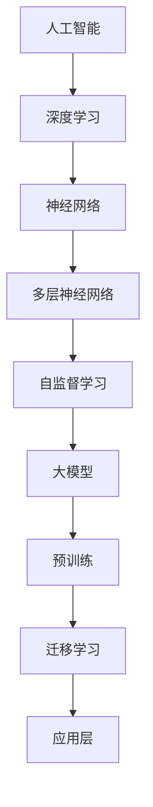

                 

### 文章标题

"AI大模型创业：如何抓住未来机遇？"

### 文章关键词

- 人工智能
- 大模型
- 创业
- 技术创新
- 风险管理
- 商业模式

### 文章摘要

本文将深入探讨AI大模型创业的各个方面，从基础概念到技术原理，从创业策略到风险管理，全面解析如何抓住AI大模型带来的未来机遇。通过分析AI大模型在产业中的应用现状与挑战，我们了解到其在各个行业中的巨大潜力。本文还将详细介绍深度学习与神经网络的基础知识，以及自然语言处理和大规模预训练模型的相关技术。在创业实践部分，我们将探讨创业者应具备的能力与素质，商业模式分析，创业路径选择和案例分析。同时，文章还将关注创业过程中的风险识别与应对策略，以及技术创新与团队建设的重要性。通过本文的阅读，读者将对AI大模型创业有一个全面而深入的理解，并能够为自己的创业项目制定出切实可行的策略。

### 《AI大模型创业：如何抓住未来机遇？》目录大纲

1. **第一部分：AI大模型概述与行业趋势**
   - 第1章：AI大模型的基础概念与产业应用
   - 第2章：深度学习与神经网络基础
   - 第3章：大规模预训练模型原理与实践

2. **第二部分：AI大模型技术原理与架构**
   - 第4章：深度学习与神经网络基础
   - 第5章：自然语言处理技术
   - 第6章：大规模预训练模型原理与实践

3. **第三部分：AI大模型创业策略与路径**
   - 第7章：AI大模型创业策略与路径
   - 第8章：AI大模型创业案例分析
   - 第9章：AI大模型创业成功的关键因素

4. **第四部分：AI大模型创业风险与应对策略**
   - 第10章：AI大模型创业风险识别
   - 第11章：创业过程中的风险管理实践
   - 第12章：创业风险应对策略与案例分析

5. **第五部分：AI大模型创业成功的关键因素**
   - 第13章：技术创新与团队建设
   - 第14章：市场拓展与商业运营
   - 第15章：AI大模型创业的未来展望

6. **附录**
   - 附录A：AI大模型开发工具与资源推荐
   - 附录B：AI大模型创业参考书目与论文

### 第一部分：AI大模型概述与行业趋势

#### 第1章：AI大模型的基础概念与产业应用

##### 1.1 AI大模型的基本原理

AI大模型是指参数规模达到百万甚至亿级别的神经网络模型。这些模型通过大量的数据和计算资源进行训练，能够捕捉数据中的细微特征，并在各种复杂任务中表现出色。

- **人工智能与深度学习的联系**：人工智能是一种模拟人类智能行为的计算技术，而深度学习是人工智能的一种重要分支，它依赖于多层神经网络结构，通过大量数据训练模型，以实现复杂的模式识别和预测任务。

- **AI大模型的定义与特点**：AI大模型的特点包括大规模参数、深度神经网络结构和自监督学习。这些特点使得大模型在处理大规模数据和复杂任务时具有显著优势。

- **AI大模型的技术发展趋势**：随着硬件技术的发展，如GPU、TPU等专用硬件的普及，大模型的训练和推理速度得到了显著提升。同时，多模态学习和知识增强技术也为AI大模型的发展带来了新的机遇。

##### 1.2 AI大模型在产业中的应用现状与挑战

AI大模型在多个行业领域展现出了巨大的应用潜力，但同时也面临着一些挑战。

- **自然语言处理（NLP）**：在自然语言处理领域，AI大模型在机器翻译、文本生成、问答系统等方面表现出色。然而，大模型在可解释性和模型偏差方面仍存在一些问题。

- **计算机视觉（CV）**：在计算机视觉领域，AI大模型在图像分类、目标检测、人脸识别等方面取得了显著突破。然而，大模型的计算资源需求较高，且存在数据隐私和安全性问题。

- **推荐系统**：在推荐系统领域，AI大模型通过分析用户行为和偏好，实现了精准的商品和内容推荐。然而，如何处理大量用户数据和确保推荐系统的公平性仍是一个挑战。

- **语音识别与合成**：在语音识别与合成领域，AI大模型通过深度学习技术，实现了高质量的语音识别和合成。然而，大模型的训练需要大量的数据和高性能计算资源。

- **强化学习**：在强化学习领域，AI大模型通过模拟环境和反馈，实现了智能体的自主学习和决策。然而，强化学习模型的训练通常需要大量的时间和计算资源，且存在不确定性。

##### 1.3 AI大模型的发展前景与机遇

AI大模型在各个行业中的应用前景广阔，同时也面临着一些挑战。

- **技术突破**：随着硬件技术的发展和算法的优化，AI大模型的训练和推理速度将进一步提升。同时，多模态学习和知识增强技术也将推动AI大模型的发展。

- **行业应用拓展**：AI大模型在医疗、金融、教育等领域的应用潜力巨大。通过结合行业知识和技术，AI大模型可以提供更准确、高效的解决方案。

- **跨学科融合**：AI大模型与生物信息学、心理学等领域的融合将带来新的研究方向和应用场景。通过跨学科的协同研究，可以进一步推动AI大模型的发展。

- **创业机会**：随着AI大模型技术的普及，将涌现出大量的创业机会，特别是在应用层和服务层。创业者可以利用AI大模型技术，开发出创新性的产品和服务，满足市场需求。

### 1.4 AI大模型的关键概念与联系

为了更好地理解AI大模型，我们使用Mermaid流程图来展示其关键概念与联系。



### 1.5 AI大模型的技术发展趋势

随着AI技术的不断进步，AI大模型在以下几个方面呈现出显著的发展趋势：

- **硬件加速**：随着硬件技术的发展，如GPU、TPU等专用硬件的普及，大模型的训练和推理速度得到了显著提升。例如，谷歌的TPU能够大幅加速TensorFlow的运算速度，使得大模型的训练更加高效。

  ```mermaid
  graph TD
      A[传统CPU] --> B[GPU]
      B --> C[TPU]
      C --> D[大模型训练速度提升]
  ```

- **多模态学习**：大模型正逐渐能够处理多种数据类型，如图像、文本和音频，实现跨模态的学习和交互。例如，OpenAI的GPT-3模型不仅能够处理文本，还能处理代码、图像等多种数据。

  ```mermaid
  graph TD
      A[文本] --> B[图像]
      B --> C[音频]
      C --> D[多模态大模型]
  ```

- **知识增强**：通过知识图谱和知识蒸馏等技术，大模型正逐渐增强其知识表示和推理能力。例如，BERT模型通过预先训练和知识蒸馏，能够更好地理解和生成高质量文本。

  ```mermaid
  graph TD
      A[知识图谱] --> B[BERT模型]
      B --> C[知识蒸馏]
      C --> D[知识增强]
  ```

### 1.6 AI大模型在产业中的应用前景

AI大模型在多个行业领域展现出了广阔的应用前景：

- **自然语言处理（NLP）**：大模型在机器翻译、文本生成、问答系统等领域表现出色。例如，谷歌的Translatotron使用大模型实现了一种全新的端到端的机器翻译方法，显著提升了翻译质量。

  ```mermaid
  graph TD
      A[机器翻译] --> B[Translatotron]
      B --> C[大模型应用]
  ```

- **计算机视觉（CV）**：大模型在图像分类、目标检测、人脸识别等领域也取得了重要突破。例如，谷歌的NetCTM通过大模型实现了实时人脸识别，极大地提高了系统效率。

  ```mermaid
  graph TD
      A[人脸识别] --> B[NetCTM]
      B --> C[大模型应用]
  ```

- **推荐系统**：大模型在商品推荐、内容推荐等领域具有显著优势。例如，亚马逊使用大模型优化其推荐系统，为用户提供了更加个性化的购物体验。

  ```mermaid
  graph TD
      A[推荐系统] --> B[亚马逊]
      B --> C[大模型应用]
  ```

- **语音识别与合成**：大模型在语音识别、语音合成等领域展现出了强大的能力。例如，谷歌的WaveNet语音合成模型通过大模型实现了高质量的语音合成，为语音助手等应用提供了基础。

  ```mermaid
  graph TD
      A[语音合成] --> B[WaveNet]
      B --> C[大模型应用]
  ```

- **强化学习**：大模型在游戏AI、自动驾驶等领域也展现出了潜力。例如，OpenAI的Dota 2 AI通过大模型在Dota 2游戏中击败了人类顶级玩家，展示了AI在策略游戏中的强大能力。

  ```mermaid
  graph TD
      A[游戏AI] --> B[OpenAI]
      B --> C[大模型应用]
  ```

### 1.7 AI大模型在医疗行业中的应用

AI大模型在医疗行业中的应用日益广泛，为疾病诊断、治疗和患者管理提供了新的工具：

- **疾病诊断**：大模型能够通过分析医学影像，如X光片、CT扫描和MRI，提高疾病诊断的准确性。例如，谷歌的DeepMind开发了一个大模型，能够在肺结节检测中达到比医生更高的准确率。

  ```mermaid
  graph TD
      A[医学影像] --> B[大模型诊断]
      B --> C[疾病检测]
  ```

- **药物研发**：大模型在药物分子设计、新药发现和药效预测方面具有巨大潜力。例如，IBM的Watson for Drug Discovery通过大模型加速了新药的发现过程。

  ```mermaid
  graph TD
      A[药物研发] --> B[Watson for Drug Discovery]
      B --> C[大模型应用]
  ```

- **个性化治疗**：大模型可以根据患者的基因信息、病史和生活习惯，提供个性化的治疗方案。例如，一些医疗机构正在使用大模型来优化癌症患者的治疗计划。

  ```mermaid
  graph TD
      A[患者数据] --> B[大模型分析]
      B --> C[个性化治疗]
  ```

- **患者管理**：大模型可以帮助医疗机构进行患者健康管理，如疾病风险评估、康复建议等。例如，一些智能健康设备使用大模型来监测患者的健康状况，并提供及时的预警和干预建议。

  ```mermaid
  graph TD
      A[健康监测] --> B[大模型分析]
      B --> C[患者管理]
  ```

### 1.8 AI大模型在教育行业中的应用

AI大模型在教育行业中的应用逐渐受到关注，为个性化教学和学习评估提供了新的手段：

- **个性化教学**：大模型可以根据学生的学习历史、兴趣和能力，提供个性化的学习内容和教学策略。例如，一些在线教育平台使用大模型来为学生推荐合适的学习材料。

  ```mermaid
  graph TD
      A[学生学习数据] --> B[大模型分析]
      B --> C[个性化教学]
  ```

- **学习评估**：大模型可以通过分析学生的作业、测试和在线互动，评估其学习效果，并提供反馈。例如，一些教育机构使用大模型来自动批改作业，为学生提供即时的反馈。

  ```mermaid
  graph TD
      A[学生作业] --> B[大模型评估]
      B --> C[学习评估]
  ```

- **辅助教学**：大模型可以充当智能辅导老师，解答学生的疑问，提供学习指导。例如，一些在线问答系统使用大模型来为学生提供即时解答和辅导。

  ```mermaid
  graph TD
      A[学生提问] --> B[大模型解答]
      B --> C[辅助教学]
  ```

- **课程设计**：大模型可以根据学生的学习数据和教学目标，帮助教师设计和调整课程内容。例如，一些教育机构使用大模型来优化课程结构，提高教学效果。

  ```mermaid
  graph TD
      A[教学目标] --> B[大模型分析]
      B --> C[课程设计]
  ```

### 1.9 AI大模型在金融行业中的应用

AI大模型在金融行业中的应用日益广泛，为风险管理、投资策略和客户服务提供了有力支持：

- **风险管理**：大模型可以分析大量的金融数据，如交易记录、市场趋势和宏观经济指标，预测市场风险和潜在的投资机会。例如，一些金融机构使用大模型来管理风险，优化投资组合。

  ```mermaid
  graph TD
      A[金融数据] --> B[大模型分析]
      B --> C[风险管理]
  ```

- **投资策略**：大模型可以根据历史数据和算法模型，预测市场走势，为投资者提供投资建议。例如，一些量化交易平台使用大模型来制定交易策略，提高投资回报。

  ```mermaid
  graph TD
      A[市场数据] --> B[大模型预测]
      B --> C[投资策略]
  ```

- **客户服务**：大模型可以用于自动化客户服务，如智能客服、虚拟银行顾问等，提高服务效率和客户满意度。例如，一些银行使用大模型来提供24/7的智能客服服务。

  ```mermaid
  graph TD
      A[客户问题] --> B[大模型解答]
      B --> C[客户服务]
  ```

### 1.10 AI大模型在零售行业中的应用

AI大模型在零售行业中的应用不断拓展，为库存管理、销售预测和客户体验提供了优化方案：

- **库存管理**：大模型可以分析销售数据、季节因素和市场需求，预测产品需求量，优化库存管理。例如，一些零售商使用大模型来预测畅销产品的库存需求，减少库存过剩和短缺。

  ```mermaid
  graph TD
      A[销售数据] --> B[大模型预测]
      B --> C[库存管理]
  ```

- **销售预测**：大模型可以根据历史销售数据、促销活动和市场趋势，预测未来的销售量，帮助零售商制定销售策略。例如，一些零售商使用大模型来预测圣诞节期间的销售高峰，提前安排库存和人力。

  ```mermaid
  graph TD
      A[历史销售数据] --> B[大模型预测]
      B --> C[销售预测]
  ```

- **客户体验**：大模型可以用于个性化推荐、客户行为分析和体验优化，提高客户满意度。例如，一些电商平台使用大模型来推荐产品，根据客户浏览和购买记录提供个性化的购物体验。

  ```mermaid
  graph TD
      A[客户行为数据] --> B[大模型分析]
      B --> C[客户体验优化]
  ```

### 第二部分：AI大模型技术原理与架构

#### 第2章：深度学习与神经网络基础

##### 2.1 神经网络的基本概念

神经网络是由大量相互连接的节点（称为神经元）组成的计算模型，这些节点模拟人脑中的神经元。神经网络通常包括以下几个层次：

- **输入层**：接收外部输入信号。
- **隐藏层**：对输入信号进行加工和计算，形成新的特征。
- **输出层**：输出最终的计算结果。

一个简单的神经网络结构如下所示：

```
[输入层] --(神经元1)--> [隐藏层1] --(神经元2)--> ... --(神经元n)--> [隐藏层m] --(神经元m+1)--> [输出层]
```

##### 2.2 深度学习的原理

深度学习是神经网络的一种特殊形式，它利用多层神经网络来学习数据的复杂结构。深度学习的基本原理包括：

- **非线性变换**：通过激活函数（如ReLU、Sigmoid、Tanh）引入非线性特性，使神经网络能够拟合更复杂的函数。
- **反向传播**：通过反向传播算法，将输出层的误差反向传播到输入层，不断调整网络的权重，优化模型的预测能力。
- **梯度下降**：利用梯度下降算法，沿着损失函数的梯度方向逐步调整网络权重，以达到最小化损失函数的目的。

##### 2.3 深度学习优化算法

深度学习优化算法是调整网络权重的重要方法，以下是一些常见的优化算法：

- **随机梯度下降（SGD）**：在每次迭代中使用一组样本的梯度来更新权重，能够加快收敛速度。
- **Adam优化器**：结合了Adagrad和RMSProp的优点，自适应地调整学习率，适用于大规模数据集。
- **AdamW优化器**：在Adam优化器的基础上增加了权重衰减的调整，适用于大型神经网络。

##### 2.4 自然语言处理技术

自然语言处理（NLP）是深度学习的一个重要应用领域，它涉及文本数据的理解、生成和交互。以下是一些NLP的关键技术：

- **词嵌入**：将文本中的词语转换为向量表示，以捕捉词语的语义关系。
- **序列模型**：如循环神经网络（RNN）和长短时记忆网络（LSTM），用于处理序列数据。
- **注意力机制**：通过注意力机制，模型可以关注序列中的特定部分，提高模型的性能。
- **转换器架构**：如Transformer模型，通过多头注意力机制和自注意力机制，实现高效的序列建模。

##### 2.5 注意力机制与转换器架构

注意力机制是一种通过权重分配来关注序列中特定部分的方法，它能够提高序列模型的性能。注意力机制的基本思想是将序列中的每个元素赋予不同的权重，使模型能够关注重要的信息。

转换器（Transformer）架构是一种基于注意力机制的序列模型，它在机器翻译、文本生成等任务中取得了显著成果。转换器架构的核心组件包括：

- **编码器（Encoder）**：将输入序列转换为上下文向量。
- **解码器（Decoder）**：根据上下文向量生成输出序列。

转换器架构的优点包括：

- **并行计算**：通过自注意力机制，编码器和解码器可以并行计算，提高了计算效率。
- **长距离依赖**：通过多头注意力机制，转换器能够捕捉长距离的依赖关系。

##### 2.6 语言模型与文本生成技术

语言模型是用于预测下一个单词或字符的概率分布的模型，它是自然语言处理的基础。常见的语言模型包括：

- **N-gram模型**：基于前N个单词的统计信息，预测下一个单词的概率。
- **循环神经网络语言模型（RNN-LM）**：使用循环神经网络来学习单词的序列依赖关系。
- **转换器语言模型（Transformer-LM）**：使用转换器架构来捕捉长距离依赖关系，生成高质量文本。

文本生成技术是基于语言模型的，它可以将一个种子文本扩展为完整的句子或段落。常见的文本生成技术包括：

- **贪心搜索**：根据当前已生成的文本，选择概率最高的下一个单词。
- **beam search（束搜索）**：同时考虑多个候选词，选择概率最高的路径进行生成。
- **生成对抗网络（GAN）**：通过生成器和判别器的对抗训练，生成接近真实文本的数据。

### 第3章：大规模预训练模型原理与实践

#### 3.1 预训练的概念与意义

##### 3.1.1 预训练模型的基本原理

预训练是一种在特定任务之前对模型进行训练的方法，其基本原理如下：

- **大规模数据集**：使用大规模、无标签的数据集对模型进行训练，使其能够学习到语言的基本结构和语义信息。
- **任务无关性**：预训练模型的目标不是解决特定任务，而是为后续的任务提供通用的基础。

预训练模型的关键步骤包括：

1. **数据预处理**：对大规模文本数据进行清洗、去噪和预处理，使其适合模型训练。
2. **嵌入层训练**：将文本数据转换为词向量表示，并通过多层神经网络进行训练，使其能够捕捉词语的语义关系。
3. **任务特定微调**：在预训练模型的基础上，针对具体任务进行微调，优化模型的性能。

##### 3.1.2 自监督学习方法

自监督学习是一种利用未标记数据训练模型的方法，其基本原理如下：

- **预测任务**：在自监督学习中，模型需要预测一些未标记的输入特征，如单词、字符或标签。
- **数据利用**：通过自监督学习，模型可以充分利用未标记的数据，提高其泛化能力。

常见的自监督学习任务包括：

- **掩码语言模型（MLM）**：在文本序列中随机掩码一定比例的单词，模型需要预测这些掩码单词。
- **预测下一个句子（Next Sentence Prediction，NSP）**：给定两个句子，模型需要预测第二个句子是否是第一个句子的后续句子。
- **掩码句子分类（Masked Sentence Classification，MSC）**：在句子中随机掩码部分单词，模型需要根据未掩码的部分预测句子的类别。

##### 3.1.3 迁移学习与微调技术

迁移学习是一种利用已有模型的知识来训练新模型的方法，其基本原理如下：

- **模型共享**：通过迁移学习，新模型可以共享已有模型的部分权重，从而加快训练过程。
- **知识转移**：迁移学习将已有模型的知识转移到新模型上，提高新模型的性能。

常见的迁移学习技术包括：

- **微调**：在迁移学习过程中，通常需要对已有模型进行微调，以适应新任务的需求。
- **特征提取**：提取已有模型中与任务相关的特征，用于训练新模型。
- **混合模型**：将已有模型和新模型进行结合，形成新的混合模型，以提高性能。

##### 3.2 主流大规模预训练模型分析

###### 3.2.1 GPT系列模型

GPT系列模型是由OpenAI开发的一组基于转换器架构的预训练模型，包括GPT、GPT-2和GPT-3等版本。GPT系列模型在自然语言处理任务中表现出色，具有以下特点：

- **大规模参数**：GPT-3拥有1750亿个参数，是当前最大的预训练模型之一。
- **多任务能力**：GPT-3能够处理多种自然语言任务，如文本生成、问答、翻译等。
- **自适应能力**：GPT-3具有自适应文本风格、语言风格和领域知识的能力。

主要版本及性能如下：

- **GPT（2018）**：拥有1.17亿个参数，在GLUE基准测试中取得了当时最高的平均准确率。
- **GPT-2（2019）**：拥有15亿个参数，进一步提高了自然语言处理任务的性能。
- **GPT-3（2020）**：拥有1750亿个参数，在多个自然语言处理任务上取得了突破性成果。

###### 3.2.2 BERT及其变体

BERT（Bidirectional Encoder Representations from Transformers）是由Google开发的预训练模型，它基于转换器架构，通过双向编码器学习文本的上下文信息。BERT及其变体在自然语言处理任务中取得了显著成果，具有以下特点：

- **双向编码器**：BERT使用双向编码器，能够同时考虑单词的前后文信息，提高了语义理解能力。
- **大规模数据**：BERT在大规模语料库上进行预训练，使其能够捕捉丰富的语言特征。
- **多语言支持**：BERT支持多种语言，适用于跨语言的自然语言处理任务。

BERT的主要变体包括：

- **BERT-Base**：原始的BERT模型，包含12亿个参数。
- **BERT-Large**：具有24亿个参数，进一步提高了模型的性能。
- **RoBERTa**：基于BERT的变体，通过改进预训练过程和模型结构，取得了更好的性能。
- **ALBERT**：通过共享嵌入层和层间注意力机制，提高了模型的效率和性能。

BERT及其变体在多个自然语言处理任务上取得了领先成绩，如问答系统、文本分类、命名实体识别等。

###### 3.2.3 其他知名预训练模型

除了GPT和BERT之外，还有许多其他知名的预训练模型，它们在自然语言处理任务中也取得了显著的成果。以下是其中一些模型：

- **T5（Text-To-Text Transfer Transformer）**：由Google开发，T5

