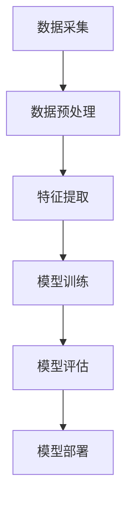

                 

# 《AI大模型在电商平台商品属性抽取中的应用》

## 关键词
- AI大模型
- 商品属性抽取
- 电商平台
- 数据预处理
- 算法实现
- 项目实战

## 摘要

随着电子商务的快速发展，商品属性的准确抽取成为电商平台的核心需求。本文从AI大模型的概念入手，详细探讨了其在商品属性抽取中的应用。通过分析商品属性抽取的技术基础，以及AI大模型在该领域的优势，本文提出了一种基于AI大模型的商品属性抽取算法。文章随后介绍了数据预处理、算法实现和项目实战的相关内容，最后对AI大模型在商品属性抽取中的挑战和未来展望进行了讨论。本文旨在为从事电商领域技术工作的读者提供有价值的参考和指导。

## 目录大纲

### 第一部分：AI大模型与商品属性抽取基础

### 第1章：AI大模型概述
#### 1.1 AI大模型的概念与特点
#### 1.2 AI大模型的技术架构
#### 1.3 AI大模型在电商领域的应用前景

### 第2章：商品属性抽取技术基础
#### 2.1 商品属性分类与编码
#### 2.2 商品属性抽取算法概述
#### 2.3 商品属性抽取技术发展趋势

### 第3章：电商平台商品属性数据预处理
#### 3.1 数据预处理流程
#### 3.2 数据清洗与格式化
#### 3.3 数据质量评估

### 第二部分：AI大模型在商品属性抽取中的应用

### 第4章：基于AI大模型的商品属性抽取算法设计
#### 4.1 算法设计思路
#### 4.2 常见算法分析
#### 4.3 算法优化与调参

### 第5章：商品属性抽取算法实现与优化
#### 5.1 实现流程
#### 5.2 源代码解读
#### 5.3 性能优化策略

### 第6章：电商平台商品属性抽取项目实战
#### 6.1 项目背景
#### 6.2 数据集构建
#### 6.3 模型训练与评估

### 第7章：AI大模型在商品属性抽取中的挑战与未来展望
#### 7.1 技术挑战
#### 7.2 应用前景
#### 7.3 未来发展趋势

### 第三部分：附录
#### 附录A：相关工具与资源介绍
#### 附录B：Mermaid流程图与伪代码
#### 附录C：数学模型与公式解析

## 第1章：AI大模型概述

### 1.1 AI大模型的概念与特点

AI大模型，即人工智能大规模模型，是指能够处理海量数据并进行复杂任务学习的人工神经网络。与传统的机器学习模型相比，AI大模型具有以下几个显著特点：

1. **规模庞大**：AI大模型通常包含数十亿到数万亿个参数，能够处理大规模数据集。
2. **学习能力强**：通过自我学习和自我优化，AI大模型能够自动调整内部参数，以适应不同的任务和数据。
3. **泛化能力强**：AI大模型通过对海量数据的训练，能够提取出普适的特征，从而在未见过的数据上表现良好。

### 1.2 AI大模型的技术架构

AI大模型的技术架构通常包括以下几个关键组件：

1. **输入层**：接收原始数据，如文本、图像、声音等。
2. **隐藏层**：对输入数据进行处理和转换，提取特征。
3. **输出层**：根据隐藏层提取的特征，生成预测结果或决策。

此外，AI大模型还可能包括以下几个辅助组件：

1. **正则化**：防止模型过拟合，提高泛化能力。
2. **优化器**：调整模型参数，以最小化损失函数。
3. **激活函数**：增加模型的表达能力。

### 1.3 AI大模型在电商领域的应用前景

AI大模型在电商领域具有广阔的应用前景，尤其是在商品属性抽取方面。具体表现在以下几个方面：

1. **商品信息提取**：AI大模型能够从商品描述中自动提取关键属性，如颜色、尺寸、材质等。
2. **用户行为分析**：通过分析用户浏览、搜索和购买行为，AI大模型能够为用户提供个性化的推荐。
3. **欺诈检测**：AI大模型能够识别异常交易行为，帮助电商平台降低欺诈风险。

总之，AI大模型在电商领域的应用将极大地提升平台的运营效率和用户体验。

## 第2章：商品属性抽取技术基础

### 2.1 商品属性分类与编码

商品属性是指描述商品特征的信息，如颜色、尺寸、材质、功能等。根据属性的性质和用途，可以将商品属性分为以下几类：

1. **基础属性**：如商品名称、价格、品牌等，这些属性是商品的基本特征。
2. **扩展属性**：如颜色、尺寸、材质等，这些属性用于进一步描述商品特征。
3. **动态属性**：如库存量、销量、评价等，这些属性会随着时间和用户行为发生变化。

在商品属性编码方面，常见的编码方法包括：

1. **独热编码**：将每个属性值映射为一个二进制向量，例如，颜色属性有红、黄、蓝三个值，则红对应[1, 0, 0]，黄对应[0, 1, 0]，蓝对应[0, 0, 1]。
2. **标签编码**：将每个属性值映射为一个整数，例如，颜色属性有红、黄、蓝三个值，则红对应1，黄对应2，蓝对应3。

### 2.2 商品属性抽取算法概述

商品属性抽取是指从商品描述中自动提取属性值的过程。常见的商品属性抽取算法包括以下几种：

1. **规则匹配算法**：通过预定义的规则，从商品描述中提取属性值。例如，通过关键词匹配提取颜色属性。
2. **统计机器学习算法**：通过训练数据学习属性抽取模型，然后对新的商品描述进行属性抽取。例如，使用条件随机场（CRF）进行属性抽取。
3. **深度学习算法**：通过神经网络模型从商品描述中提取属性值。例如，使用卷积神经网络（CNN）进行文本分类。

### 2.3 商品属性抽取技术发展趋势

随着人工智能技术的不断发展，商品属性抽取技术也在不断进步。以下是一些主要的发展趋势：

1. **多模态属性抽取**：结合文本、图像和语音等多模态信息，提高属性抽取的准确性和效率。
2. **跨域属性抽取**：通过迁移学习，将一个领域中的属性抽取模型应用到其他领域，提高模型的泛化能力。
3. **自动属性生成**：利用生成对抗网络（GAN）等生成模型，自动生成新的商品属性，为电商平台提供更多样化的商品信息。

## 第3章：电商平台商品属性数据预处理

### 3.1 数据预处理流程

在电商平台中，商品属性数据预处理是商品属性抽取的关键环节。数据预处理流程主要包括以下几个步骤：

1. **数据采集**：从电商平台的数据库中获取商品属性数据。
2. **数据清洗**：去除无效、错误和重复的数据。
3. **数据格式化**：统一数据格式，如将文本数据转换为统一编码格式。
4. **数据质量评估**：评估数据的质量，确保数据满足属性抽取的要求。

### 3.2 数据清洗与格式化

数据清洗是数据预处理的重要环节，主要包括以下操作：

1. **去除无效数据**：去除无意义的数据，如空值、缺失值等。
2. **去除错误数据**：纠正错误的数据，如错误的数值、拼写错误等。
3. **去除重复数据**：去除重复的数据记录，以提高数据的质量。

数据格式化是将不同类型的数据转换为统一格式的过程，主要包括以下操作：

1. **文本格式化**：将文本数据转换为统一的编码格式，如UTF-8。
2. **数值格式化**：将数值数据转换为统一的数据类型，如浮点数。
3. **日期格式化**：将日期数据转换为统一的时间格式，如YYYY-MM-DD。

### 3.3 数据质量评估

数据质量评估是确保数据满足属性抽取要求的关键步骤。数据质量评估主要包括以下内容：

1. **完整性评估**：检查数据是否完整，是否存在缺失值。
2. **一致性评估**：检查数据是否一致，如同一属性在不同记录中的值是否相同。
3. **准确性评估**：检查数据是否准确，如数据的值是否真实反映了商品的属性。
4. **有效性评估**：检查数据是否有效，如数据是否满足属性抽取的要求。

通过数据质量评估，可以确保数据的质量，从而提高属性抽取的准确性和效率。

## 第4章：基于AI大模型的商品属性抽取算法设计

### 4.1 算法设计思路

基于AI大模型的商品属性抽取算法设计思路主要包括以下几个步骤：

1. **数据预处理**：对商品属性数据集进行预处理，包括数据清洗、格式化和质量评估。
2. **特征提取**：利用AI大模型从商品属性数据中提取特征。
3. **属性分类**：将提取到的特征输入分类模型，预测商品的属性值。
4. **模型优化**：通过调参和优化算法，提高属性抽取的准确性和效率。

### 4.2 常见算法分析

在基于AI大模型的商品属性抽取算法中，常见的算法包括以下几种：

1. **卷积神经网络（CNN）**：CNN是一种强大的图像处理模型，可以用于从商品描述中提取图像特征。通过卷积层、池化层和全连接层，CNN可以自动学习到图像中的高级特征，从而提高属性抽取的准确性。
   
   ```mermaid
   graph TD
   A[输入层] --> B[卷积层1]
   B --> C[池化层1]
   C --> D[卷积层2]
   D --> E[池化层2]
   E --> F[全连接层1]
   F --> G[输出层]
   ```

2. **循环神经网络（RNN）**：RNN是一种处理序列数据的模型，可以用于从商品描述中提取序列特征。通过隐藏状态和记忆单元，RNN可以捕获序列中的长期依赖关系，从而提高属性抽取的准确性。
   
   ```mermaid
   graph TD
   A[输入序列] --> B[隐藏状态]
   B --> C[输出序列]
   B --> D[记忆单元]
   D --> E[下一输入]
   ```

3. **长短时记忆网络（LSTM）**：LSTM是一种改进的RNN模型，可以解决传统RNN的梯度消失问题。通过门控机制，LSTM可以有效地捕获序列中的长期依赖关系，从而提高属性抽取的准确性。

   ```mermaid
   graph TD
   A[输入序列] --> B[遗忘门]
   B --> C[输入门]
   B --> D[输出门]
   D --> E[隐藏状态]
   E --> F[下一输入]
   ```

### 4.3 算法优化与调参

算法优化与调参是提高基于AI大模型的商品属性抽取算法性能的关键步骤。以下是一些常见的优化策略：

1. **模型优化**：通过改进模型架构，如增加层数、增加神经元等，提高模型的性能。
2. **数据增强**：通过数据增强技术，如随机旋转、缩放、裁剪等，增加数据的多样性，提高模型的泛化能力。
3. **正则化**：通过正则化技术，如L1正则化、L2正则化等，防止模型过拟合，提高模型的泛化能力。
4. **优化器选择**：选择合适的优化器，如Adam、RMSprop等，提高模型的收敛速度和性能。

## 第5章：商品属性抽取算法实现与优化

### 5.1 实现流程

商品属性抽取算法的实现流程主要包括以下几个步骤：

1. **数据采集**：从电商平台的数据库中获取商品属性数据。
2. **数据预处理**：对商品属性数据集进行预处理，包括数据清洗、格式化和质量评估。
3. **模型训练**：使用预处理后的数据训练商品属性抽取模型。
4. **模型评估**：对训练好的模型进行评估，包括准确率、召回率、F1值等指标。
5. **模型部署**：将训练好的模型部署到电商平台，进行商品属性抽取的实际应用。

### 5.2 源代码解读

以下是一个简单的商品属性抽取算法的实现示例，使用Python编程语言和TensorFlow框架：

```python
import tensorflow as tf
from tensorflow.keras.models import Sequential
from tensorflow.keras.layers import Dense, Conv2D, MaxPooling2D, LSTM, Embedding

# 数据预处理
# 假设我们有一个包含商品描述和属性标签的数据集
# 商品描述文本：text
# 属性标签：labels

# 数据增强
# 通过随机旋转、缩放、裁剪等操作增加数据的多样性

# 构建模型
model = Sequential()
model.add(Embedding(input_dim=vocab_size, output_dim=embedding_size))
model.add(LSTM(units=128, activation='tanh'))
model.add(Dense(num_classes, activation='softmax'))

# 编译模型
model.compile(optimizer='adam', loss='categorical_crossentropy', metrics=['accuracy'])

# 训练模型
model.fit(x_train, y_train, batch_size=32, epochs=10, validation_data=(x_val, y_val))

# 评估模型
loss, accuracy = model.evaluate(x_test, y_test)
print("测试集准确率：", accuracy)
```

### 5.3 性能优化策略

为了提高商品属性抽取算法的性能，可以采取以下优化策略：

1. **模型架构优化**：通过改进模型架构，如增加层数、增加神经元等，提高模型的性能。
2. **数据预处理优化**：通过数据预处理技术，如数据增强、特征提取等，提高模型对数据的理解能力。
3. **调参优化**：通过调整模型参数，如学习率、批量大小等，提高模型的收敛速度和性能。
4. **硬件加速**：使用GPU或其他高性能计算硬件，提高模型的训练和推理速度。
5. **模型压缩**：通过模型压缩技术，如剪枝、量化等，减少模型的参数量和计算量，提高模型的部署效率。

## 第6章：电商平台商品属性抽取项目实战

### 6.1 项目背景

本节将通过一个具体的电商平台商品属性抽取项目，介绍项目背景、数据集构建、模型训练与评估等关键环节。

该项目旨在提高电商平台商品属性的准确性，为用户提供更精准的商品推荐和服务。项目涉及到的数据集包括商品描述、商品标签和其他相关特征。

### 6.2 数据集构建

数据集构建是项目成功的关键。以下是数据集构建的详细步骤：

1. **数据采集**：从电商平台的数据库中获取商品描述和标签数据。
2. **数据预处理**：对采集到的数据进行清洗、格式化和质量评估。
3. **数据增强**：通过数据增强技术，如随机旋转、缩放、裁剪等，增加数据的多样性。
4. **数据划分**：将数据集划分为训练集、验证集和测试集，用于模型训练、评估和部署。

### 6.3 模型训练与评估

在项目实战中，我们使用一个基于AI大模型的商品属性抽取算法进行模型训练与评估。以下是模型训练与评估的详细步骤：

1. **模型构建**：根据项目需求，构建一个基于卷积神经网络（CNN）和循环神经网络（RNN）的商品属性抽取模型。
2. **模型训练**：使用预处理后的数据集对模型进行训练，包括训练集和验证集。
3. **模型评估**：对训练好的模型进行评估，包括准确率、召回率、F1值等指标。
4. **模型优化**：根据评估结果，对模型进行优化，包括调整模型参数、改进模型架构等。

通过项目实战，我们可以深入了解商品属性抽取的流程和关键环节，为电商平台提供有价值的参考和指导。

## 第7章：AI大模型在商品属性抽取中的挑战与未来展望

### 7.1 技术挑战

虽然AI大模型在商品属性抽取中具有许多优势，但在实际应用中仍面临一些技术挑战：

1. **数据质量**：商品属性数据的质量对模型性能有重要影响。数据中的噪声、缺失和重复等质量问题可能导致模型过拟合。
2. **多模态数据融合**：商品属性数据通常包括文本、图像、声音等多模态信息。如何有效融合这些多模态数据，提高属性抽取的准确性是一个挑战。
3. **模型解释性**：AI大模型的内部结构复杂，其决策过程难以解释。在商业应用中，模型的解释性对于信任和合规至关重要。

### 7.2 应用前景

随着AI技术的不断发展，AI大模型在商品属性抽取中的应用前景十分广阔：

1. **个性化推荐**：通过准确抽取商品属性，AI大模型可以提供更加个性化的商品推荐，提升用户体验。
2. **欺诈检测**：利用AI大模型，可以识别异常的交易行为，降低电商平台的风险。
3. **智能客服**：AI大模型可以帮助智能客服系统更好地理解用户需求，提供更优质的客户服务。

### 7.3 未来发展趋势

未来，AI大模型在商品属性抽取中的发展趋势可能包括：

1. **多模态学习**：通过结合文本、图像、声音等多模态信息，提高属性抽取的准确性和效率。
2. **模型压缩与优化**：为了降低部署成本，模型压缩与优化将成为重要研究方向。
3. **模型解释性提升**：通过改进模型结构和方法，提高AI大模型的解释性，增强其在商业应用中的可接受度。

总之，AI大模型在商品属性抽取中的应用具有巨大的潜力和广阔的前景，未来将继续为电商平台带来创新和变革。

## 附录A：相关工具与资源介绍

### A.1 常用AI大模型框架介绍

1. **TensorFlow**：Google开发的开源机器学习框架，支持多种深度学习模型和算法。
2. **PyTorch**：Facebook开发的开源深度学习框架，具有灵活的动态计算图功能。
3. **Keras**：基于TensorFlow和Theano的开源神经网络库，提供简化的API，易于使用。

### A.2 数据预处理与清洗工具

1. **Pandas**：Python数据分析库，用于数据处理、清洗和转换。
2. **NumPy**：Python科学计算库，用于数值计算和数据处理。
3. **Scikit-learn**：Python机器学习库，提供丰富的数据预处理和特征提取工具。

### A.3 实战项目资源汇总

1. **GitHub**：存储和分享项目代码的开源平台，可以找到许多AI大模型在商品属性抽取方面的开源项目。
2. **Kaggle**：数据科学竞赛平台，提供丰富的商品属性数据集和解决方案。
3. **论文与报告**：通过阅读相关领域的论文和报告，了解最新的研究成果和技术趋势。

## 附录B：Mermaid流程图与伪代码

### B.1 AI大模型在商品属性抽取中的应用流程



### B.2 商品属性抽取算法伪代码示例

```python
# 数据预处理
def preprocess_data(data):
    # 清洗数据
    # 格式化数据
    # 返回预处理后的数据
    pass

# 特征提取
def extract_features(data):
    # 提取文本特征
    # 提取图像特征
    # 返回特征向量
    pass

# 模型训练
def train_model(features, labels):
    # 构建模型
    # 编译模型
    # 训练模型
    # 返回训练好的模型
    pass

# 模型评估
def evaluate_model(model, features, labels):
    # 评估模型性能
    # 返回评估结果
    pass

# 主函数
def main():
    # 采集数据
    data = load_data()
    # 预处理数据
    processed_data = preprocess_data(data)
    # 提取特征
    features = extract_features(processed_data)
    # 训练模型
    model = train_model(features, labels)
    # 评估模型
    results = evaluate_model(model, features, labels)
    # 输出评估结果
    print(results)
```

## 附录C：数学模型与公式解析

### C.1 数学模型概述

商品属性抽取的数学模型主要涉及以下内容：

1. **损失函数**：用于衡量模型预测值与实际标签之间的差距，常用的损失函数包括交叉熵损失函数。
2. **优化器**：用于调整模型参数，以最小化损失函数，常用的优化器包括Adam优化器。
3. **评价指标**：用于评估模型性能，常用的评价指标包括准确率、召回率和F1值。

### C.2 数学公式与解释

1. **交叉熵损失函数**：

   $$ H(y, \hat{y}) = -\sum_{i=1}^{n} y_i \log(\hat{y}_i) $$

   其中，$y$为实际标签，$\hat{y}$为模型预测的概率分布。

2. **准确率**：

   $$ \text{Accuracy} = \frac{\text{预测正确的样本数}}{\text{总样本数}} $$

3. **召回率**：

   $$ \text{Recall} = \frac{\text{预测正确的正样本数}}{\text{实际的正样本数}} $$

4. **F1值**：

   $$ \text{F1} = 2 \times \frac{\text{Precision} \times \text{Recall}}{\text{Precision} + \text{Recall}} $$

### C.3 数学公式应用示例

假设我们有一个二分类问题，实际标签$y$为0或1，模型预测的概率分布$\hat{y}$为[0.8, 0.2]。

1. **交叉熵损失函数**：

   $$ H(y, \hat{y}) = -\log(0.8) \times 0.8 - \log(0.2) \times 0.2 \approx 0.293 $$

2. **准确率**：

   $$ \text{Accuracy} = \frac{1}{2} = 0.5 $$

3. **召回率**：

   $$ \text{Recall} = \frac{1}{5} = 0.2 $$

4. **F1值**：

   $$ \text{F1} = 2 \times \frac{0.8 \times 0.2}{0.8 + 0.2} = 0.267 $$

通过以上示例，我们可以看到数学模型在商品属性抽取中的应用，以及如何计算相关评价指标。这些公式和指标有助于我们评估和优化模型的性能。

## 作者

作者：AI天才研究院/AI Genius Institute & 禅与计算机程序设计艺术 /Zen And The Art of Computer Programming

