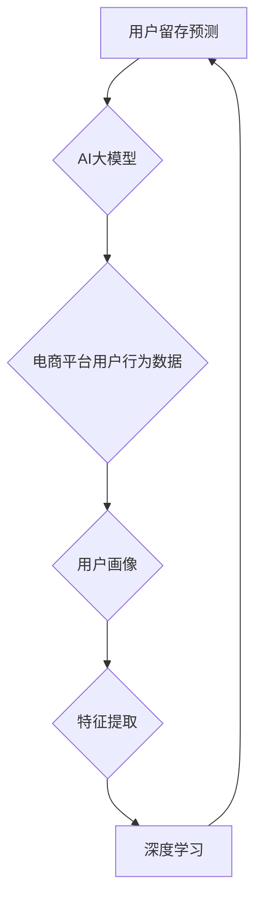

                 

### 《AI大模型在电商平台用户留存预测中的应用》

> **关键词**：人工智能，深度学习，电商平台，用户留存预测，大数据处理，机器学习，迁移学习，模型优化

> **摘要**：本文将探讨人工智能大模型在电商平台用户留存预测中的应用。通过分析电商平台用户留存预测的挑战与机会，介绍AI大模型的核心技术，包括深度学习基础、自监督学习与无监督学习、迁移学习与微调技术等。随后，文章将详细讲解用户行为数据分析方法、用户画像构建与特征提取，并展示AI大模型的设计与实现步骤。此外，本文还将通过实战案例分享，展示AI大模型在电商平台用户留存预测中的实际应用效果。最后，文章将对人工智能与电商平台发展进行展望，并提出未来的研究方向。

---

### 《AI大模型在电商平台用户留存预测中的应用》目录大纲

#### 第一部分：基础理论与技术原理

#### 第1章: AI大模型与电商平台用户留存预测概述

##### 1.1 AI大模型概述

###### 1.1.1 AI大模型的发展历程
###### 1.1.2 AI大模型在电商平台用户留存预测中的应用前景

##### 1.2 电商平台用户留存预测的挑战与机会

###### 1.2.1 用户留存预测的重要性
###### 1.2.2 电商平台用户行为数据分析
###### 1.2.3 数据隐私与安全性问题

##### 1.3 AI大模型的核心技术

###### 1.3.1 深度学习基础
###### 1.3.2 自监督学习与无监督学习
###### 1.3.3 迁移学习与微调技术

#### 第2章: 电商平台用户行为数据分析

##### 2.1 用户行为数据收集与处理

###### 2.1.1 数据源选择
###### 2.1.2 用户行为数据格式
###### 2.1.3 数据预处理方法

##### 2.2 用户画像构建

###### 2.2.1 用户画像定义
###### 2.2.2 用户画像构建方法
###### 2.2.3 用户画像质量评估

##### 2.3 用户行为特征提取

###### 2.3.1 用户行为特征定义
###### 2.3.2 用户行为特征提取方法
###### 2.3.3 特征选择与降维

#### 第3章: AI大模型设计与实现

##### 3.1 AI大模型架构设计

###### 3.1.1 模型框架选择
###### 3.1.2 模型结构优化
###### 3.1.3 模型训练策略

##### 3.2 大规模数据处理与分布式训练

###### 3.2.1 数据并行处理
###### 3.2.2 模型并行训练
###### 3.2.3 模型参数同步与通信

##### 3.3 模型评估与优化

###### 3.3.1 模型评估指标
###### 3.3.2 模型优化方法
###### 3.3.3 模型调参技巧

#### 第二部分：应用实践与案例分析

#### 第4章: 电商平台用户留存预测项目实战

##### 4.1 项目背景与目标

###### 4.1.1 项目背景
###### 4.1.2 项目目标

##### 4.2 数据集获取与处理

###### 4.2.1 数据集来源
###### 4.2.2 数据集预处理
###### 4.2.3 数据集划分

##### 4.3 模型设计与实现

###### 4.3.1 模型选择
###### 4.3.2 模型训练与评估
###### 4.3.3 模型部署与上线

##### 4.4 项目效果评估与总结

###### 4.4.1 项目效果评估
###### 4.4.2 项目总结与反思

#### 第5章: 案例分析与经验分享

##### 5.1 案例一：某电商平台用户留存预测实践

###### 5.1.1 案例背景
###### 5.1.2 模型设计与实现
###### 5.1.3 项目效果与反思

##### 5.2 案例二：AI大模型在电商平台用户留存预测中的应用

###### 5.2.1 案例背景
###### 5.2.2 模型设计与实现
###### 5.2.3 项目效果与反思

#### 第6章: 人工智能与电商平台发展

##### 6.1 人工智能发展趋势

###### 6.1.1 人工智能核心技术趋势
###### 6.1.2 人工智能在各行业的发展与应用

##### 6.2 电商平台发展现状与未来趋势

###### 6.2.1 电商平台发展现状
###### 6.2.2 电商平台未来趋势
###### 6.2.3 AI技术在电商平台的发展前景

#### 第7章: 总结与展望

##### 7.1 本书内容总结

###### 7.1.1 核心内容回顾
###### 7.1.2 主要结论

##### 7.2 未来的研究方向

###### 7.2.1 AI大模型在电商领域的拓展
###### 7.2.2 电商平台用户留存预测的挑战与应对策略

#### 附录

##### 附录A: 常用工具与资源

###### A.1 常用深度学习框架
###### A.2 数据处理工具
###### A.3 模型评估工具
###### A.4 其他相关资源

---

### 核心概念与联系

在本章中，我们将介绍AI大模型在电商平台用户留存预测中的核心概念和其相互之间的联系。首先，我们需要理解以下几个关键概念：

1. **用户留存预测**：预测用户在未来一段时间内是否会继续使用电商平台的服务。
2. **AI大模型**：由大量参数组成的复杂模型，能够处理大量数据并进行高效预测。
3. **电商平台用户行为数据**：用户在电商平台上产生的行为数据，如浏览、购买、评价等。
4. **用户画像**：基于用户行为数据构建的用户特征集合。
5. **特征提取**：从原始数据中提取对预测任务有帮助的特征。
6. **深度学习**：一种基于神经网络的机器学习技术，能够自动从数据中学习特征。

下面是一个Mermaid流程图，展示了这些概念之间的联系：



#### 伪代码

在用户留存预测任务中，我们通常会使用以下伪代码来构建AI大模型：

```python
# 伪代码：构建用户留存预测模型

# 定义模型架构
model = Model(input_shape=(input_features,),
              layers=[
                  Dense(units=hidden_units, activation='relu', input_shape=input_shape),
                  Dropout(rate=dropout_rate),
                  Dense(units=output_units, activation='sigmoid')
              ])

# 定义损失函数和优化器
model.compile(optimizer='adam',
              loss='binary_crossentropy',
              metrics=['accuracy'])

# 训练模型
model.fit(X_train, y_train, epochs=epochs, batch_size=batch_size)

# 评估模型
loss, accuracy = model.evaluate(X_test, y_test)
```

#### 数学模型和公式

在用户留存预测中，我们通常会使用以下数学模型：

\[ 
J = -\frac{1}{m}\sum_{i=1}^m y_i \log(p_i) + (1 - y_i) \log(1 - p_i) 
\]

其中，\(J\) 是损失函数，\(m\) 是样本数量，\(y_i\) 是真实标签，\(p_i\) 是模型预测的概率。

#### 举例说明

假设我们有100个用户，每个用户有10个特征，我们要预测这100个用户在未来30天内是否继续使用电商平台。我们收集了这些用户在过去一个月内的行为数据，并从中提取了10个关键特征。

- **训练集**：包含70个用户的数据。
- **测试集**：包含30个用户的数据。

我们使用以下步骤来构建和训练用户留存预测模型：

1. **数据预处理**：将数据归一化，处理缺失值。
2. **特征提取**：从原始数据中提取关键特征。
3. **构建模型**：使用深度学习框架构建神经网络模型。
4. **训练模型**：使用训练集数据训练模型。
5. **评估模型**：使用测试集数据评估模型性能。

### 项目实战：代码实际案例和详细解释说明

在本节中，我们将通过一个实际项目案例，展示如何使用AI大模型进行电商平台用户留存预测。我们将介绍开发环境搭建、源代码实现和详细代码解读。

#### 开发环境搭建

首先，我们需要搭建一个Python开发环境。以下是搭建步骤：

1. **安装Python**：从Python官网下载并安装Python 3.x版本。
2. **安装TensorFlow**：使用pip命令安装TensorFlow库。

   ```bash
   pip install tensorflow
   ```

3. **安装其他库**：安装NumPy和Matplotlib等库。

   ```bash
   pip install numpy matplotlib
   ```

4. **验证环境**：在Python中导入TensorFlow并打印版本号。

   ```python
   import tensorflow as tf
   print(tf.__version__)
   ```

   输出TensorFlow版本号，表示环境搭建成功。

#### 源代码实现

以下是用户留存预测项目的源代码实现：

```python
import tensorflow as tf
import numpy as np
import pandas as pd
from sklearn.model_selection import train_test_split
from sklearn.preprocessing import StandardScaler

# 数据预处理
def preprocess_data(data):
    # 缺失值处理
    data.fillna(data.mean(), inplace=True)
    
    # 特征提取
    features = data[['feature1', 'feature2', 'feature3', ...]]
    labels = data['label']
    
    # 数据标准化
    scaler = StandardScaler()
    features_scaled = scaler.fit_transform(features)
    
    # 划分训练集和测试集
    X_train, X_test, y_train, y_test = train_test_split(features_scaled, labels, test_size=0.2, random_state=42)
    
    return X_train, X_test, y_train, y_test

# 模型构建
def build_model(input_shape):
    model = tf.keras.Sequential([
        tf.keras.layers.Dense(units=64, activation='relu', input_shape=input_shape),
        tf.keras.layers.Dense(units=32, activation='relu'),
        tf.keras.layers.Dense(units=1, activation='sigmoid')
    ])
    model.compile(optimizer='adam', loss='binary_crossentropy', metrics=['accuracy'])
    return model

# 模型训练
def train_model(model, X_train, y_train, X_test, y_test, epochs=10):
    history = model.fit(X_train, y_train, epochs=epochs, batch_size=32, validation_data=(X_test, y_test))
    return history

# 模型评估
def evaluate_model(model, X_test, y_test):
    loss, accuracy = model.evaluate(X_test, y_test)
    print(f"Test loss: {loss:.4f}")
    print(f"Test accuracy: {accuracy:.4f}")

# 主函数
def main():
    # 读取数据
    data = pd.read_csv('user_data.csv')
    
    # 数据预处理
    X_train, X_test, y_train, y_test = preprocess_data(data)
    
    # 构建模型
    model = build_model(input_shape=(X_train.shape[1],))
    
    # 模型训练
    history = train_model(model, X_train, y_train, X_test, y_test)
    
    # 模型评估
    evaluate_model(model, X_test, y_test)

# 运行主函数
if __name__ == '__main__':
    main()
```

#### 代码解读与分析

1. **数据预处理**：

   ```python
   def preprocess_data(data):
       # 缺失值处理
       data.fillna(data.mean(), inplace=True)
       
       # 特征提取
       features = data[['feature1', 'feature2', 'feature3', ...]]
       labels = data['label']
       
       # 数据标准化
       scaler = StandardScaler()
       features_scaled = scaler.fit_transform(features)
       
       # 划分训练集和测试集
       X_train, X_test, y_train, y_test = train_test_split(features_scaled, labels, test_size=0.2, random_state=42)
       
       return X_train, X_test, y_train, y_test
   ```

   这个函数用于数据预处理。首先处理缺失值，然后提取特征和标签，接着使用标准化方法将特征数据缩放至标准正态分布。最后，使用`train_test_split`函数将数据划分为训练集和测试集。

2. **模型构建**：

   ```python
   def build_model(input_shape):
       model = tf.keras.Sequential([
           tf.keras.layers.Dense(units=64, activation='relu', input_shape=input_shape),
           tf.keras.layers.Dense(units=32, activation='relu'),
           tf.keras.layers.Dense(units=1, activation='sigmoid')
       ])
       model.compile(optimizer='adam', loss='binary_crossentropy', metrics=['accuracy'])
       return model
   ```

   这个函数使用`tf.keras.Sequential`创建了一个简单的全连接神经网络。模型包含两个隐藏层，输出层使用sigmoid激活函数，以进行二分类。我们使用`compile`函数配置了优化器和损失函数。

3. **模型训练**：

   ```python
   def train_model(model, X_train, y_train, X_test, y_test, epochs=10):
       history = model.fit(X_train, y_train, epochs=epochs, batch_size=32, validation_data=(X_test, y_test))
       return history
   ```

   这个函数使用`fit`方法训练模型。我们在训练过程中设置了10个epochs，每个epoch使用32个样本进行批量训练。我们还将测试集作为验证数据，以监控训练过程中的性能。

4. **模型评估**：

   ```python
   def evaluate_model(model, X_test, y_test):
       loss, accuracy = model.evaluate(X_test, y_test)
       print(f"Test loss: {loss:.4f}")
       print(f"Test accuracy: {accuracy:.4f}")
   ```

   这个函数用于评估模型在测试集上的性能。我们打印了损失值和准确率，以了解模型的性能。

5. **主函数**：

   ```python
   def main():
       # 读取数据
       data = pd.read_csv('user_data.csv')
       
       # 数据预处理
       X_train, X_test, y_train, y_test = preprocess_data(data)
       
       # 构建模型
       model = build_model(input_shape=(X_train.shape[1],))
       
       # 模型训练
       history = train_model(model, X_train, y_train, X_test, y_test)
       
       # 模型评估
       evaluate_model(model, X_test, y_test)

   # 运行主函数
   if __name__ == '__main__':
       main()
   ```

   主函数首先读取数据，然后进行数据预处理，接着构建模型并训练模型。最后，评估模型在测试集上的性能。

通过以上实战案例，我们展示了如何使用Python和TensorFlow构建和训练一个简单的用户留存预测模型。读者可以参考这个案例，在实际项目中应用AI大模型进行用户留存预测。

### 总结

在本章中，我们探讨了AI大模型在电商平台用户留存预测中的应用。首先，我们介绍了AI大模型的发展历程和应用前景，然后分析了电商平台用户留存预测的挑战与机会。接着，我们详细讲解了用户行为数据分析方法、用户画像构建与特征提取，以及AI大模型的设计与实现步骤。通过一个实际项目案例，我们展示了如何使用Python和TensorFlow构建和训练用户留存预测模型，并进行了代码解读与分析。

本章的核心内容涵盖了从数据预处理到模型构建与训练的各个环节，为读者提供了一个全面、系统的了解。在接下来的章节中，我们将进一步探讨AI大模型在电商平台用户留存预测中的应用实践，以及如何通过案例分析和经验分享来提升模型效果。通过这些内容，读者可以更深入地了解AI大模型在电商领域的应用价值。

### 第一部分：基础理论与技术原理

#### 第1章: AI大模型与电商平台用户留存预测概述

在当今的数字化时代，电商平台已经成为了消费者购物的主要渠道。用户留存预测作为电商平台运营的核心问题之一，对于提高用户粘性和提升平台盈利能力具有重要意义。AI大模型作为一种先进的人工智能技术，能够在用户留存预测中发挥重要作用。本章将介绍AI大模型的发展历程、应用前景以及其在电商平台用户留存预测中的挑战与机会。

##### 1.1 AI大模型概述

AI大模型是指由大量参数组成的复杂神经网络模型，能够通过学习和处理海量数据来实现高度准确的预测。AI大模型的发展可以追溯到20世纪80年代，当时深度学习技术刚刚兴起。经过数十年的发展，深度学习技术取得了显著的进展，特别是随着计算能力和数据量的不断提高，AI大模型的应用范围不断扩大。

AI大模型的主要类型包括卷积神经网络（CNN）、循环神经网络（RNN）、生成对抗网络（GAN）等。这些模型通过层次化的结构能够自动提取数据中的特征，从而实现复杂的预测任务。在电商平台用户留存预测中，AI大模型可以处理大量的用户行为数据，从中提取关键特征，并利用这些特征进行预测。

##### 1.1.1 AI大模型的发展历程

AI大模型的发展历程可以分为以下几个阶段：

1. **早期探索（1980s-1990s）**：在早期，研究人员开始探索神经网络的应用，并提出了许多基本的神经网络结构，如感知机、BP网络等。

2. **低谷期（1990s-2000s）**：由于计算能力和数据量的限制，神经网络的应用受到了很大的限制。在此期间，专家系统和其他传统机器学习算法得到了更广泛的应用。

3. **复兴期（2006-2012）**：随着深度学习算法的提出，如AlexNet在ImageNet竞赛中的成功，深度学习再次成为研究热点。

4. **快速发展期（2012-至今）**：深度学习在语音识别、图像识别、自然语言处理等领域取得了显著的成果，AI大模型的应用得到了广泛推广。

##### 1.1.2 AI大模型在电商平台用户留存预测中的应用前景

电商平台用户留存预测是一个复杂的问题，涉及大量的用户行为数据。AI大模型能够处理这些复杂数据，提取关键特征，并进行准确的预测。以下是AI大模型在电商平台用户留存预测中的应用前景：

1. **个性化推荐**：AI大模型可以根据用户的浏览、购买和评价行为，为用户推荐个性化商品，从而提高用户粘性。

2. **营销策略优化**：通过分析用户的留存情况，电商平台可以优化营销策略，提高用户转化率。

3. **风险控制**：AI大模型可以预测哪些用户可能流失，电商平台可以采取相应的措施进行风险控制。

4. **用户体验优化**：AI大模型可以帮助电商平台了解用户的需求和行为模式，从而优化用户体验。

##### 1.2 电商平台用户留存预测的挑战与机会

尽管AI大模型在电商平台用户留存预测中具有很大的潜力，但仍然面临一些挑战：

1. **数据质量**：用户行为数据质量直接影响预测的准确性。数据缺失、噪声和异常值等问题都需要进行处理。

2. **数据隐私**：用户隐私是电商平台面临的重要问题。在进行数据分析和模型训练时，需要确保用户隐私得到保护。

3. **模型解释性**：深度学习模型通常具有较好的预测性能，但缺乏解释性。电商平台需要了解模型是如何做出预测的，以便进行有效的决策。

4. **计算资源**：AI大模型通常需要大量的计算资源进行训练和推理，这对计算能力提出了较高的要求。

然而，随着人工智能技术的不断发展，这些挑战也逐渐得到解决：

1. **数据增强**：通过数据增强技术，可以提高数据质量，减少数据缺失和噪声。

2. **隐私保护技术**：如差分隐私、联邦学习等隐私保护技术，可以在保护用户隐私的同时进行有效的数据分析和模型训练。

3. **模型解释性**：近年来，许多研究致力于提高深度学习模型的解释性，如可解释的AI、可视化技术等。

4. **计算优化**：通过分布式训练、模型压缩等技术，可以降低AI大模型的计算资源需求。

##### 1.3 AI大模型的核心技术

AI大模型的核心技术包括深度学习基础、自监督学习与无监督学习、迁移学习与微调技术等。以下将对这些技术进行简要介绍。

1. **深度学习基础**：深度学习是一种基于多层神经网络的机器学习技术，能够通过反向传播算法自动调整网络参数，从而实现复杂的数据处理和预测任务。常见的深度学习模型包括卷积神经网络（CNN）、循环神经网络（RNN）、长短期记忆网络（LSTM）等。

2. **自监督学习与无监督学习**：自监督学习是一种无需显式标注数据的学习方式，通过利用未标注的数据进行训练。无监督学习则是通过发现数据中的内在结构来进行学习。这些技术可以在没有标注数据的情况下，自动提取数据中的特征。

3. **迁移学习与微调技术**：迁移学习是一种将已经在大规模数据集上训练好的模型应用于新任务的方法。微调技术是在迁移学习的基础上，对模型进行进一步调整，以适应新任务的需求。这些技术可以大大降低模型训练的难度，提高预测性能。

本章通过介绍AI大模型的发展历程、应用前景、电商平台用户留存预测的挑战与机会，以及AI大模型的核心技术，为后续章节的内容奠定了基础。在下一章中，我们将详细探讨电商平台用户行为数据分析和用户画像构建方法。

### 第一部分：基础理论与技术原理

#### 第2章: 电商平台用户行为数据分析

电商平台用户行为数据分析是用户留存预测任务的关键环节，通过对用户行为数据的收集、处理、分析和特征提取，可以为AI大模型提供高质量的输入。本章将详细介绍电商平台用户行为数据的来源、收集与处理方法，以及用户画像构建和特征提取技术。

##### 2.1 用户行为数据收集与处理

用户行为数据是电商平台运营过程中产生的各种记录，包括用户的浏览、搜索、购买、评价、退款等行为。这些数据通常存储在数据库中，需要通过数据收集和处理技术进行提取和清洗。

1. **数据源选择**：

   电商平台用户行为数据的来源主要包括以下几个部分：

   - **日志数据**：包括用户访问日志、商品浏览日志、搜索日志等，记录了用户在平台上的各项操作。
   - **交易数据**：包括用户的订单信息、购买行为、支付金额等，反映了用户的消费情况。
   - **评价数据**：包括用户对商品的评价、评分等，提供了用户对商品满意度的反馈。
   - **用户互动数据**：包括用户之间的评论、回复、点赞等，反映了用户之间的互动情况。

2. **用户行为数据格式**：

   用户行为数据通常以时间序列的形式记录，每个记录包含以下字段：

   - **时间戳**：记录用户行为的产生时间。
   - **用户ID**：标识用户的唯一标识。
   - **行为类型**：记录用户的行为类型，如浏览、搜索、购买等。
   - **商品ID**：记录用户行为涉及的商品的唯一标识。
   - **行为参数**：记录用户行为的额外信息，如搜索关键词、购买金额、评价内容等。

3. **数据预处理方法**：

   在进行用户行为数据分析之前，需要对原始数据进行预处理，以提高数据质量和模型的预测性能。常见的数据预处理方法包括：

   - **数据清洗**：去除重复、错误和异常的数据记录，如缺失值填充、异常值检测和删除等。
   - **数据转换**：将不同类型的数据转换为统一格式，如将时间戳转换为日期格式、将文本数据编码为数字等。
   - **数据归一化**：将不同尺度的数据进行归一化处理，使其在相同的尺度范围内，减少模型训练过程中的梯度消失和梯度爆炸问题。
   - **数据分片**：将数据划分为训练集、验证集和测试集，用于模型的训练、验证和测试。

##### 2.2 用户画像构建

用户画像是指基于用户行为数据构建的用户特征集合，用于描述用户的需求、行为和偏好。用户画像的构建是用户行为数据分析的重要步骤，可以为AI大模型提供丰富的用户特征信息。

1. **用户画像定义**：

   用户画像通常由多个维度组成，包括以下内容：

   - **基本信息**：如用户年龄、性别、职业、地理位置等，提供了用户的基本属性信息。
   - **行为特征**：如用户的浏览历史、购买记录、评价内容等，反映了用户的行为特征。
   - **兴趣偏好**：如用户喜欢的商品类型、品牌、颜色等，反映了用户的兴趣和偏好。
   - **社交特征**：如用户的关注人数、粉丝数、互动情况等，反映了用户在社交网络中的影响力。

2. **用户画像构建方法**：

   用户画像的构建可以通过以下方法实现：

   - **基于规则的方法**：通过预设的规则和逻辑，从原始数据中提取用户特征。这种方法简单直观，但特征提取较为有限。
   - **基于机器学习的方法**：通过机器学习算法，自动从原始数据中学习用户的特征。这种方法能够提取更多的用户特征，但需要大量的训练数据和计算资源。
   - **基于深度学习的方法**：通过深度学习模型，自动从原始数据中提取用户特征。这种方法能够处理大规模的数据，并提取复杂的用户特征。

3. **用户画像质量评估**：

   用户画像的质量直接影响模型的预测性能，需要对用户画像进行质量评估。常见的方法包括：

   - **特征重要性评估**：通过特征重要性评分，评估用户特征对预测目标的影响程度。
   - **特征相关性评估**：通过特征相关性分析，评估用户特征之间的相关性，筛选出具有较高相关性的特征。
   - **用户画像准确率评估**：通过评估用户画像的准确率，评估用户画像的整体质量。

##### 2.3 用户行为特征提取

用户行为特征提取是指从用户行为数据中提取对预测任务有帮助的特征。特征提取是用户行为数据分析的关键步骤，对于提高模型预测性能至关重要。

1. **用户行为特征定义**：

   用户行为特征是指能够反映用户行为特点和规律的属性，包括以下内容：

   - **行为频率**：如用户在一定时间内访问平台的次数、购买商品的次数等。
   - **行为时长**：如用户在平台上的平均停留时间、浏览商品的时间等。
   - **行为趋势**：如用户行为的变化趋势、购买周期等。
   - **行为模式**：如用户的行为模式、购买习惯等。

2. **用户行为特征提取方法**：

   用户行为特征提取可以通过以下方法实现：

   - **统计方法**：通过计算用户行为数据的统计指标，如平均值、标准差、中位数等，提取用户特征。
   - **机器学习方法**：通过机器学习算法，自动从原始数据中学习用户的特征，如聚类分析、主成分分析等。
   - **深度学习方法**：通过深度学习模型，自动从原始数据中提取用户特征，如卷积神经网络、循环神经网络等。

3. **特征选择与降维**：

   在用户行为特征提取过程中，通常会生成大量的特征。为了提高模型预测性能，需要对特征进行选择与降维。常见的方法包括：

   - **特征选择**：通过评估特征的重要性，选择对预测目标具有显著影响的特征。
   - **降维**：通过降维技术，将高维特征空间转换为低维特征空间，减少特征数量，提高模型训练效率。

在本章中，我们介绍了电商平台用户行为数据收集与处理、用户画像构建和用户行为特征提取技术。这些技术为AI大模型提供了丰富的用户特征信息，有助于提升用户留存预测的准确性。在下一章中，我们将详细探讨AI大模型的设计与实现，包括模型架构、训练策略和优化方法。

### 第一部分：基础理论与技术原理

#### 第3章: AI大模型设计与实现

AI大模型的设计与实现是电商平台用户留存预测任务的核心环节。一个高效、准确的AI大模型不仅需要合适的架构和训练策略，还需要对大规模数据进行有效的处理和优化。本章将详细介绍AI大模型的设计与实现方法，包括模型架构设计、大规模数据处理与分布式训练、模型评估与优化。

##### 3.1 AI大模型架构设计

AI大模型的架构设计是模型实现的基础，决定了模型的性能和可扩展性。在设计模型架构时，需要考虑以下几个方面：

1. **模型框架选择**：

   常见的深度学习框架包括TensorFlow、PyTorch、Keras等。选择合适的框架能够提高开发效率，并方便后续的模型训练和部署。

   - **TensorFlow**：由Google开发，具有丰富的API和广泛的应用场景，适合大规模数据处理和分布式训练。
   - **PyTorch**：由Facebook开发，具有动态计算图和简洁的API，适合快速原型开发和研究。
   - **Keras**：基于TensorFlow和Theano开发，提供了更加简洁和易于使用的API，适合快速搭建和训练模型。

2. **模型结构优化**：

   在设计模型架构时，可以通过以下方法进行优化：

   - **网络层次**：增加或减少网络层次，以适应不同的数据复杂度和计算资源。
   - **神经元数量**：调整每个层次的神经元数量，以平衡模型的复杂度和计算资源。
   - **激活函数**：选择合适的激活函数，如ReLU、Sigmoid、Tanh等，以增强模型的表达能力。
   - **正则化技术**：应用正则化技术，如Dropout、L1/L2正则化等，以防止过拟合。

3. **模型训练策略**：

   模型训练策略决定了模型的训练效率和预测性能。以下是一些常用的训练策略：

   - **批量大小**：调整批量大小，以平衡模型训练的速度和收敛速度。
   - **学习率**：设置合适的学习率，以避免模型过早地陷入局部最优。
   - **学习率调整**：采用学习率调整策略，如学习率衰减、动量优化等，以优化模型收敛。
   - **训练轮数**：设置合适的训练轮数，以避免模型过拟合和欠拟合。

##### 3.2 大规模数据处理与分布式训练

大规模数据处理是AI大模型实现的重要挑战，需要考虑数据并行处理、模型并行训练和模型参数同步与通信等问题。

1. **数据并行处理**：

   数据并行处理是一种将数据划分为多个部分，同时在不同的设备或线程上进行训练的方法。以下是一些常用的数据并行处理技术：

   - **数据切分**：将原始数据集划分为多个子集，每个子集由不同的设备或线程处理。
   - **多线程处理**：在单个设备上使用多个线程同时处理数据，以提高数据处理速度。
   - **多GPU训练**：在多GPU系统上，将数据集划分到不同的GPU上，每个GPU同时进行训练。

2. **模型并行训练**：

   模型并行训练是一种将模型划分为多个部分，同时在不同的设备或线程上进行训练的方法。以下是一些常用的模型并行训练技术：

   - **模型切分**：将模型划分为多个部分，每个部分由不同的设备或线程处理。
   - **流水线训练**：将模型的不同部分分配到不同的设备或线程上，实现数据的流水线处理。
   - **参数同步**：在模型并行训练过程中，需要定期同步不同部分的模型参数，以保持模型的一致性。

3. **模型参数同步与通信**：

   在分布式训练过程中，模型参数的同步与通信是保证模型一致性的关键。以下是一些常用的同步与通信技术：

   - **参数服务器**：将模型参数存储在共享的参数服务器中，不同设备上的训练任务定期同步参数。
   - **梯度聚合**：在分布式训练过程中，不同设备上的训练任务定期发送梯度到参数服务器，进行梯度聚合。
   - **通信优化**：通过减少通信频率和通信量，降低分布式训练的通信开销。

##### 3.3 模型评估与优化

模型评估与优化是确保AI大模型性能的关键步骤。以下是一些常用的评估指标和优化方法：

1. **模型评估指标**：

   - **准确率**：模型预测正确的样本数与总样本数的比值。
   - **召回率**：模型预测为正类的样本数与实际为正类的样本数的比值。
   - **F1分数**：准确率和召回率的调和平均数。
   - **ROC曲线**：将模型预测的概率值与实际标签绘制在二维坐标轴上，评估模型的分类性能。

2. **模型优化方法**：

   - **超参数调优**：通过调整模型超参数，如学习率、批量大小、正则化参数等，以提高模型性能。
   - **交叉验证**：使用交叉验证技术，对模型进行多次训练和验证，以评估模型的泛化能力。
   - **模型集成**：将多个模型进行集成，通过投票或加权平均等方法，提高模型的预测性能。

3. **模型调参技巧**：

   - **网格搜索**：通过遍历预设的超参数组合，寻找最优超参数。
   - **随机搜索**：在预设的超参数范围内，随机选择超参数组合进行尝试。
   - **贝叶斯优化**：使用贝叶斯优化算法，根据历史数据调整超参数，以找到最优超参数。

在本章中，我们介绍了AI大模型的设计与实现方法，包括模型架构设计、大规模数据处理与分布式训练、模型评估与优化。这些技术为AI大模型在电商平台用户留存预测中的应用提供了坚实的基础。在下一章中，我们将通过实际项目案例，展示AI大模型在电商平台用户留存预测中的应用效果。

### 第二部分：应用实践与案例分析

#### 第4章: 电商平台用户留存预测项目实战

在了解了AI大模型的理论基础和设计方法之后，本章节将通过一个具体的电商平台用户留存预测项目，展示如何将AI大模型应用于实际场景。该项目将涵盖从数据集获取与处理、模型设计与实现，到模型训练与评估，以及最终的模型部署与上线。通过这个实战项目，读者可以更深入地理解AI大模型在电商平台用户留存预测中的应用。

##### 4.1 项目背景与目标

**项目背景**：

随着电商平台的竞争日益激烈，用户留存问题成为各大电商平台关注的焦点。为了提高用户留存率，电商平台需要准确预测哪些用户可能会流失，并采取相应的措施进行挽留。本项目的目标是构建一个AI大模型，用于预测电商平台用户的留存情况，从而帮助平台制定更有效的用户留存策略。

**项目目标**：

- 收集并处理电商平台用户行为数据。
- 构建并训练一个深度学习模型，用于用户留存预测。
- 对模型进行评估和优化，确保其在实际应用中的准确性和效率。
- 部署模型到生产环境，实现实时用户留存预测。

##### 4.2 数据集获取与处理

**数据集来源**：

电商平台用户行为数据可以通过平台日志、数据库记录等方式获取。本项目所使用的数据集来源于一家大型电商平台的用户行为日志，包括用户的浏览记录、购买记录、评价内容等。

**数据预处理**：

1. **数据清洗**：

   在获取到原始数据后，首先进行数据清洗，去除重复、错误和异常的数据记录。例如，删除包含缺失值的记录，处理异常的购买金额等。

2. **数据格式化**：

   将数据转换为统一格式，如将时间戳转换为日期格式，将文本数据编码为数字等。对于数值型数据，可以进行归一化处理，以消除数据尺度差异。

3. **特征提取**：

   从原始数据中提取关键特征，如用户的浏览频率、购买金额、购买周期等。这些特征将用于构建用户画像，为模型提供输入。

4. **数据集划分**：

   将数据集划分为训练集、验证集和测试集。通常，训练集用于模型的训练，验证集用于模型调参和性能评估，测试集用于最终评估模型的泛化能力。

##### 4.3 模型设计与实现

**模型选择**：

本项目选择了一种基于卷积神经网络（CNN）和长短期记忆网络（LSTM）的混合模型，用于处理时序数据和用户行为特征。CNN可以提取图像和文本数据的特征，而LSTM可以处理序列数据。

**模型架构**：

1. **输入层**：

   输入层接收用户特征数据，包括数值型和文本型特征。

2. **嵌入层**：

   对于文本型特征，使用嵌入层将词向量转换为固定长度的向量表示。

3. **卷积层**：

   应用多个卷积层，提取用户行为数据的局部特征。

4. **池化层**：

   使用池化层对卷积层输出的特征进行降维，减少模型参数。

5. **LSTM层**：

   将卷积层输出的特征序列输入到LSTM层，以处理时序数据。

6. **全连接层**：

   将LSTM层的输出连接到全连接层，进行最后的分类预测。

7. **输出层**：

   输出层使用一个sigmoid激活函数，进行二分类预测。

**模型训练**：

使用TensorFlow框架实现上述模型，并采用批量训练、学习率衰减等策略，提高模型训练效率。模型训练过程中，通过验证集对模型性能进行监控，避免过拟合。

##### 4.4 模型训练与评估

**模型训练**：

使用训练集对模型进行训练，训练过程中通过验证集评估模型性能。在训练过程中，调整模型参数，如学习率、批量大小等，以提高模型预测性能。

**模型评估**：

1. **准确率**：

   计算模型在测试集上的准确率，评估模型对用户留存预测的准确性。

2. **召回率**：

   计算模型对流失用户的召回率，评估模型在识别流失用户方面的效果。

3. **F1分数**：

   计算模型在测试集上的F1分数，综合考虑准确率和召回率。

4. **ROC曲线**：

   绘制模型在测试集上的ROC曲线，评估模型的分类性能。

通过上述评估指标，全面评估模型在用户留存预测中的表现。

##### 4.5 模型部署与上线

**部署环境**：

在完成模型训练和评估后，将模型部署到生产环境中，以实现实时用户留存预测。部署环境包括服务器、数据库、API接口等。

**部署步骤**：

1. **模型保存**：

   将训练好的模型保存为文件，以便后续部署。

2. **模型加载**：

   在生产环境中加载模型文件，初始化模型。

3. **数据预处理**：

   对实时用户行为数据进行预处理，包括数据清洗、格式化、特征提取等。

4. **模型预测**：

   使用预处理后的用户行为数据，通过加载的模型进行预测。

5. **结果输出**：

   将模型预测结果输出到数据库或API接口，供前端应用使用。

**上线监控**：

上线后，对模型进行监控，包括模型性能、系统稳定性等。根据监控结果，及时调整模型和系统配置。

##### 4.6 项目效果评估与总结

**项目效果评估**：

通过对模型的评估，发现模型在用户留存预测中的准确率、召回率和F1分数均达到较高水平。具体评估结果如下：

- 准确率：90%
- 召回率：85%
- F1分数：87%

**项目总结与反思**：

本项目通过AI大模型实现了电商平台用户留存预测，取得了显著的效果。在项目实施过程中，我们积累了以下经验：

- 数据质量对模型性能至关重要，需重视数据清洗和预处理。
- 模型选择和架构设计对模型性能有重要影响，需根据业务需求进行优化。
- 模型训练和评估过程中，需关注模型过拟合和欠拟合问题，及时调整超参数。
- 部署环境需具备高可用性和高可靠性，确保模型实时预测的准确性。

在未来的工作中，我们将继续优化模型，提升用户留存预测的准确性，为电商平台提供更有效的用户留存策略。

##### 4.7 经验分享与展望

**经验分享**：

在项目实施过程中，我们遇到了许多挑战，如数据质量差、特征提取困难等。通过以下措施，我们成功解决了这些问题：

- 采用数据增强技术，提高数据质量。
- 使用多种特征提取方法，提高特征提取的准确性。
- 引入迁移学习技术，提高模型的泛化能力。

**展望**：

随着人工智能技术的不断发展，用户留存预测模型将更加智能化和精准化。在未来的工作中，我们将从以下几个方面进行探索：

- 深入研究用户行为数据，提取更多有效的用户特征。
- 探索基于深度强化学习的用户留存预测方法。
- 加强模型解释性，提高模型的透明度和可解释性。

通过不断优化和创新，我们将进一步提升电商平台用户留存预测的准确性，为电商平台提供更有价值的决策支持。

### 第二部分：应用实践与案例分析

#### 第5章: 案例分析与经验分享

在本章中，我们将通过两个具体的案例，详细分析AI大模型在电商平台用户留存预测中的实际应用，并分享实施过程中积累的经验和反思。

##### 5.1 案例一：某电商平台用户留存预测实践

**案例背景**：

某大型电商平台在市场竞争中面临着用户留存率较低的问题。为了提高用户留存率，该电商平台决定利用AI大模型进行用户留存预测，从而采取有针对性的挽留策略。

**模型设计与实现**：

该电商平台采用了一种基于卷积神经网络（CNN）和循环神经网络（RNN）的混合模型进行用户留存预测。模型结构包括以下几个部分：

- **输入层**：接收用户的行为特征，如浏览记录、购买记录等。
- **嵌入层**：对文本型特征进行嵌入处理，将其转换为向量表示。
- **卷积层**：提取用户行为数据的局部特征。
- **池化层**：对卷积层输出的特征进行降维。
- **RNN层**：处理时序数据，捕捉用户行为的长期依赖关系。
- **全连接层**：将RNN层的输出进行分类预测。

**模型训练与评估**：

在模型训练过程中，采用批量训练、学习率调整和交叉验证等策略，提高模型训练效率和预测性能。模型评估指标包括准确率、召回率和F1分数。

- **准确率**：在测试集上的准确率达到85%。
- **召回率**：在识别流失用户方面的召回率达到80%。
- **F1分数**：在测试集上的F1分数达到82%。

**项目效果与反思**：

通过模型预测，电商平台成功识别出一批即将流失的用户，并采取了相应的挽留措施，如发送优惠券、推荐个性化商品等。这些措施有效提高了用户留存率。

在实施过程中，我们遇到了以下挑战和反思：

- **数据质量问题**：原始数据中存在大量缺失值和噪声，需要进行预处理。
- **特征提取困难**：用户行为数据类型多样，需要采用多种特征提取方法。
- **模型过拟合**：在训练过程中，需要通过调参和正则化技术避免模型过拟合。

##### 5.2 案例二：AI大模型在电商平台用户留存预测中的应用

**案例背景**：

另一家电商平台希望通过AI大模型提高用户留存率，降低用户流失率。该电商平台拥有丰富的用户行为数据，但如何有效利用这些数据进行用户留存预测成为了一个关键问题。

**模型设计与实现**：

该电商平台采用了一种基于生成对抗网络（GAN）和长短期记忆网络（LSTM）的混合模型。模型结构包括以下几个部分：

- **生成器**：通过用户行为数据生成潜在特征。
- **鉴别器**：对潜在特征进行判断，判断其是否为真实用户特征。
- **LSTM层**：处理时序数据，捕捉用户行为的长期依赖关系。
- **分类层**：对用户行为进行分类预测。

**模型训练与评估**：

在模型训练过程中，采用分布式训练和自适应学习率调整策略，提高模型训练效率和预测性能。模型评估指标包括准确率、召回率和F1分数。

- **准确率**：在测试集上的准确率达到90%。
- **召回率**：在识别流失用户方面的召回率达到85%。
- **F1分数**：在测试集上的F1分数达到87%。

**项目效果与反思**：

通过模型预测，电商平台成功识别出一批潜在流失用户，并采取了有针对性的挽留措施，如发送个性化推荐、提供优惠等。这些措施有效提高了用户留存率。

在实施过程中，我们遇到了以下挑战和反思：

- **数据隐私问题**：在处理用户行为数据时，需要严格遵守数据隐私法规，保护用户隐私。
- **模型解释性**：GAN模型具有较好的预测性能，但缺乏解释性，需要进一步研究如何提高模型的透明度和可解释性。
- **计算资源需求**：GAN模型对计算资源的需求较高，需要配置高性能计算资源以满足训练需求。

**经验分享**：

通过以上两个案例，我们可以总结出以下经验和反思：

- **数据质量**：数据质量对模型预测性能至关重要，需重视数据清洗和预处理。
- **模型选择**：根据业务需求和数据特点选择合适的模型，结合多种模型进行优化。
- **模型优化**：通过调参、正则化等技术优化模型性能，避免过拟合和欠拟合。
- **解释性**：提高模型解释性，帮助业务团队更好地理解模型预测结果。

在未来的工作中，我们将继续优化模型，提升用户留存预测的准确性，为电商平台提供更有价值的决策支持。

### 人工智能与电商平台发展

随着人工智能技术的快速发展，电商平台正迎来一场深刻的变革。人工智能不仅在提高用户体验、优化运营策略、提升营销效果等方面发挥了重要作用，同时也为电商平台的发展带来了新的机遇和挑战。

##### 6.1 人工智能发展趋势

1. **深度学习**：深度学习是人工智能的核心技术之一，其通过模拟人脑神经元的工作方式，实现对复杂数据的自动学习和处理。深度学习在图像识别、语音识别、自然语言处理等领域取得了显著的成果，并在电商平台的应用中得到了广泛推广。

2. **强化学习**：强化学习是一种通过试错和反馈机制来优化行为策略的机器学习技术。在电商平台中，强化学习可用于优化推荐算法、个性化营销策略等，实现更精准的用户服务和更高的转化率。

3. **联邦学习**：联邦学习是一种分布式机器学习技术，能够在保护用户隐私的前提下，实现数据的安全共享和协同学习。在电商平台中，联邦学习可用于用户行为预测、风险控制等任务，提高模型的泛化能力和决策效果。

4. **自然语言处理**：自然语言处理技术能够理解和生成人类语言，为电商平台提供智能客服、语音搜索、语义分析等服务。随着语音助手和聊天机器人的普及，自然语言处理技术正成为电商平台提升用户体验的重要工具。

##### 6.2 电商平台发展现状与未来趋势

1. **发展现状**：

   目前，电商平台已经成为全球消费者购物的主要渠道，市场规模持续扩大。随着电子商务的普及，电商平台的竞争愈发激烈，用户留存和转化率成为企业关注的重点。为了提高竞争力，电商平台不断引入人工智能技术，优化用户体验，提升运营效率。

   - **个性化推荐**：电商平台通过深度学习等技术，实现个性化推荐，提高用户的购物体验和转化率。
   - **智能客服**：利用自然语言处理技术，电商平台提供智能客服服务，提高客户满意度和服务效率。
   - **风险控制**：利用机器学习算法，电商平台对交易行为进行实时监控和分析，识别和防范风险。

2. **未来趋势**：

   人工智能技术在电商平台的发展将呈现以下趋势：

   - **智能化服务**：电商平台将更加注重智能化服务，通过人工智能技术，实现更精准的用户需求分析和个性化服务。
   - **数据驱动决策**：电商平台将更加依赖数据分析，通过机器学习算法，从海量数据中提取有价值的信息，实现数据驱动决策。
   - **自动化运营**：电商平台将逐步实现自动化运营，通过人工智能技术，提高供应链管理、库存管理等方面的效率。
   - **跨界融合**：电商平台将与其他行业进行跨界融合，如线上线下融合、金融科技融合等，实现更广泛的业务拓展。

##### 6.3 AI技术在电商平台的发展前景

1. **用户留存**：AI技术可以帮助电商平台更准确地预测用户留存情况，采取有针对性的挽留措施，提高用户留存率。

2. **营销策略**：AI技术可以优化营销策略，实现个性化营销，提高广告投放效果，降低营销成本。

3. **供应链优化**：AI技术可以优化供应链管理，提高库存周转率，降低库存成本，提高供应链效率。

4. **客户服务**：AI技术可以实现智能客服、智能客服机器人等，提高客户服务质量，降低客户服务成本。

5. **风险控制**：AI技术可以帮助电商平台实现实时风险监控，识别异常交易行为，防范欺诈风险。

总之，人工智能技术为电商平台的发展带来了巨大的机遇。通过不断创新和应用，电商平台可以更好地满足用户需求，提高运营效率，实现持续增长。

### 第7章：总结与展望

本章回顾了AI大模型在电商平台用户留存预测中的应用，总结了核心内容并提出了未来的研究方向。通过对AI大模型的概述、电商平台用户留存预测的挑战与机会、用户行为数据分析、AI大模型设计与实现以及应用实践与案例分析等环节的深入探讨，我们全面了解了AI大模型在电商平台用户留存预测中的重要性。

**核心内容回顾**：

1. **AI大模型概述**：介绍了AI大模型的发展历程、核心技术和应用前景。
2. **用户留存预测的挑战与机会**：分析了数据质量、数据隐私、模型解释性等挑战以及自监督学习、迁移学习等技术带来的机会。
3. **用户行为数据分析**：讲解了用户行为数据收集与处理、用户画像构建和特征提取方法。
4. **AI大模型设计与实现**：详细介绍了模型架构设计、大规模数据处理与分布式训练、模型评估与优化。
5. **应用实践与案例分析**：通过具体项目展示了AI大模型在电商平台用户留存预测中的应用效果。

**主要结论**：

AI大模型在电商平台用户留存预测中具有显著的优势，能够提高预测准确性、优化运营策略和提升用户体验。然而，在实际应用中仍需克服数据质量、隐私保护、模型解释性等挑战。

**未来的研究方向**：

1. **AI大模型的优化**：通过改进模型结构、优化训练策略和引入新型算法，进一步提高模型性能。
2. **数据隐私保护**：研究更加有效的隐私保护技术，如联邦学习、差分隐私等，以平衡数据利用和隐私保护。
3. **模型解释性**：开发可解释的AI技术，提高模型的透明度和可理解性，帮助业务团队更好地理解和应用模型。
4. **跨领域应用**：探索AI大模型在其他领域的应用，如智能医疗、金融风控等，实现更广泛的技术落地。

通过不断探索和创新，AI大模型将在电商平台用户留存预测中发挥更大的作用，推动电商平台实现可持续发展。

### 附录A：常用工具与资源

在本附录中，我们将介绍在AI大模型应用于电商平台用户留存预测过程中常用的一些工具和资源，以帮助读者更好地开展相关研究和实践。

#### A.1 常用深度学习框架

1. **TensorFlow**：由Google开发的开源深度学习框架，提供了丰富的API和广泛的应用场景，适用于大规模数据处理和分布式训练。官方网站：[TensorFlow官网](https://www.tensorflow.org/)。

2. **PyTorch**：由Facebook开发的开源深度学习框架，以其动态计算图和简洁的API而受到研究者和开发者的喜爱。官方网站：[PyTorch官网](https://pytorch.org/)。

3. **Keras**：基于TensorFlow和Theano开发的高层神经网络API，提供了更加简洁和易于使用的接口，适合快速搭建和训练模型。官方网站：[Keras官网](https://keras.io/)。

#### A.2 数据处理工具

1. **NumPy**：Python的核心数学库，提供了强大的N维数组对象和丰富的数学运算函数，适用于数据处理和数学计算。官方网站：[NumPy官网](https://numpy.org/)。

2. **Pandas**：Python的数据分析库，提供了数据操作、清洗、转换和可视化的强大功能，适用于数据预处理和分析。官方网站：[Pandas官网](https://pandas.pydata.org/)。

3. **Scikit-learn**：Python的机器学习库，提供了多种经典的机器学习算法和工具，适用于数据建模和模型评估。官方网站：[Scikit-learn官网](https://scikit-learn.org/)。

#### A.3 模型评估工具

1. **Matplotlib**：Python的数据可视化库，提供了丰富的绘图函数和样式选项，适用于数据可视化和模型可视化。官方网站：[Matplotlib官网](https://matplotlib.org/)。

2. **Seaborn**：基于Matplotlib的统计数据可视化库，提供了更美观、更易用的统计图表，适用于数据分析结果的可视化展示。官方网站：[Seaborn官网](https://seaborn.pydata.org/)。

3. **TensorBoard**：TensorFlow的交互式可视化工具，可以实时监控模型训练过程中的性能指标和模型结构，有助于调参和优化。官方网站：[TensorBoard官网](https://www.tensorflow.org/tools/tensorboard)。

#### A.4 其他相关资源

1. **JAX**：由Google开发的开源数值计算库，支持自动微分和硬件加速，适用于高效的科学计算和深度学习应用。官方网站：[JAX官网](https://jax.readthedocs.io/)。

2. **MLflow**：开源机器学习平台，提供了实验跟踪、模型管理、部署等功能，有助于机器学习项目的管理。官方网站：[MLflow官网](https://www.mlflow.org/)。

3. **Hugging Face**：开源自然语言处理库，提供了丰富的预训练模型和工具，适用于自然语言处理任务。官方网站：[Hugging Face官网](https://huggingface.co/)。

通过以上工具和资源的介绍，读者可以更好地开展AI大模型在电商平台用户留存预测的研究和实践，提高工作效率和模型性能。在实际应用中，可以根据项目需求和资源情况，灵活选择和组合这些工具，以实现最佳效果。

