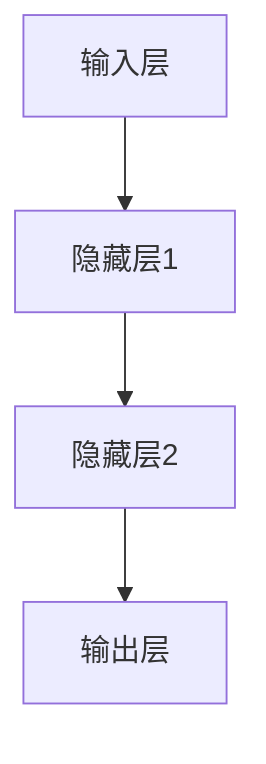
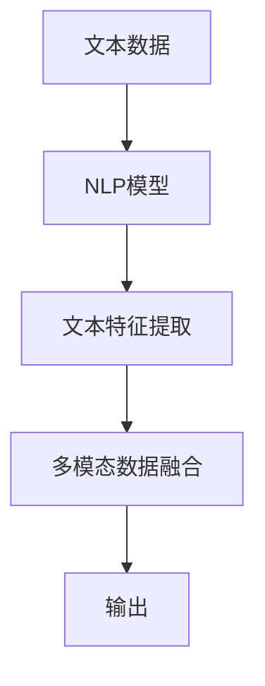

                 

# 《AI大模型应用的细分领域市场机会》

## 关键词
AI大模型，市场机会，金融，医疗健康，智能制造，交通运输，技术挑战

## 摘要
本文深入探讨了AI大模型在不同细分领域的应用市场机会。通过分析AI与大模型的发展历程、市场现状及挑战，本文详细介绍了金融、医疗健康、智能制造和交通运输等领域的AI大模型应用案例，并探讨了其市场前景。此外，文章还重点解析了AI大模型的技术细节和应用挑战，为读者提供了全面的行业洞察和未来趋势展望。

---

## 第一部分：市场概述

### AI与大模型概述

#### AI的发展历程与现状

AI（人工智能）的定义是指由计算机系统执行的，通常需要人类智能才能完成的任务。AI可以分为弱AI和强AI，弱AI专注于特定任务，而强AI则具有人类智能的所有能力。

- **AI的分类**：根据功能和应用，AI可以分为：

  1. 机器学习（ML）
  2. 深度学习（DL）
  3. 自然语言处理（NLP）
  4. 计算机视觉（CV）
  5. 强化学习（RL）

- **AI在我国及全球的发展态势**：中国AI市场在过去几年中取得了显著进展，政府政策支持和产业投资推动了AI技术的快速发展。全球范围内，美国、中国和欧洲是AI研究与应用的主要区域，其中中国在某些领域如计算机视觉和自然语言处理方面取得了领先地位。

#### 大模型的崛起与挑战

大模型是指具有大规模参数和网络结构的AI模型，如BERT、GPT等。它们通过处理大量数据来提高模型性能。

- **大模型的发展历程**：从早期的统计模型，到基于神经网络的模型，再到如今的大模型，AI模型在规模和性能上不断突破。

- **大模型的优点**：

  1. 更高的性能
  2. 更强的泛化能力
  3. 更好的数据利用效率

- **大模型的挑战**：

  1. 计算资源需求大
  2. 数据标注成本高
  3. 模型解释性不足

#### 市场机会分析

AI大模型在各细分领域的应用前景广阔，市场机会丰富。

- **金融领域**：AI大模型在风险管理和预测、智能投顾和量化交易、金融客户服务等方面具有显著优势。

- **医疗健康领域**：AI大模型在疾病预测和诊断、智能药物研发、健康管理等方面展现出强大的潜力。

- **智能制造领域**：AI大模型在质量检测与故障预测、生产优化与调度、设备维护与预测性维护等方面具有重要作用。

- **交通运输领域**：AI大模型在智能交通管理、自动驾驶与车联网、物流与快递等方面提供了创新的解决方案。

- **市场规模与增长趋势**：根据市场调研，全球AI大模型市场规模预计将保持高速增长，预计到2025年将达到数百亿美元。

### 第二部分：细分领域应用

#### 金融领域AI大模型应用

##### 风险管理与预测

在金融领域，AI大模型被广泛应用于风险管理和预测。以下是一个典型的金融风险预测算法的伪代码：

```python
# 金融风险预测算法伪代码

# 输入：历史交易数据、财务报表数据等
# 输出：风险预测结果

def risk_prediction(data):
    # 数据预处理
    processed_data = preprocess_data(data)
    
    # 构建模型
    model = create_model()
    
    # 训练模型
    model.fit(processed_data)
    
    # 风险预测
    predictions = model.predict(processed_data)
    
    return predictions
```

##### 智能投顾与量化交易

智能投顾和量化交易是金融领域的两个重要应用。智能投顾通过AI大模型分析用户风险偏好和财务状况，提供个性化的投资建议。量化交易则利用AI大模型进行高频交易和量化策略开发。

```python
# 智能投顾算法伪代码

# 输入：用户数据、市场数据等
# 输出：投资建议

def investment_advisory(user_data, market_data):
    # 数据预处理
    processed_data = preprocess_data(user_data, market_data)
    
    # 构建模型
    model = create_model()
    
    # 训练模型
    model.fit(processed_data)
    
    # 预测用户投资回报
    investment_returns = model.predict(processed_data)
    
    # 生成投资建议
    advisory = generate_advisory(investment_returns)
    
    return advisory
```

##### 金融客户服务

AI大模型在金融客户服务中的应用主要体现在聊天机器人、风险教育和理财建议等方面。通过聊天机器人，银行和金融机构可以提供7x24小时的服务，提高客户满意度。

```python
# 聊天机器人算法伪代码

# 输入：用户提问、上下文信息等
# 输出：回答

def chatbot_response(question, context):
    # 数据预处理
    processed_question = preprocess_question(question)
    
    # 使用预训练的大模型
    model = load_pretrained_model()
    
    # 生成回答
    answer = model.predict(processed_question, context)
    
    return answer
```

#### 医疗健康领域AI大模型应用

##### 疾病预测与诊断

AI大模型在疾病预测与诊断方面具有显著优势。通过分析患者的电子健康记录、基因数据等，AI大模型可以提前预测疾病的发生，提高诊断准确率。

```python
# 疾病预测算法伪代码

# 输入：电子健康记录、基因数据等
# 输出：疾病预测结果

def disease_prediction(data):
    # 数据预处理
    processed_data = preprocess_data(data)
    
    # 构建模型
    model = create_model()
    
    # 训练模型
    model.fit(processed_data)
    
    # 疾病预测
    predictions = model.predict(processed_data)
    
    return predictions
```

##### 智能药物研发

智能药物研发是AI大模型在医疗健康领域的另一个重要应用。通过分析大量的药物分子结构和临床数据，AI大模型可以预测药物的疗效和副作用，加速新药研发进程。

```python
# 药物分子模拟算法伪代码

# 输入：药物分子结构、临床数据等
# 输出：药物疗效预测

def drug_molecule_simulation(molecule_structure, clinical_data):
    # 数据预处理
    processed_data = preprocess_data(molecule_structure, clinical_data)
    
    # 构建模型
    model = create_model()
    
    # 训练模型
    model.fit(processed_data)
    
    # 药物疗效预测
    predictions = model.predict(processed_data)
    
    return predictions
```

##### 健康管理

AI大模型在健康管理中的应用包括健康数据监控与分析、健康风险评估与干预等。通过分析个人的生活习惯、健康状况等数据，AI大模型可以提供个性化的健康建议。

```python
# 健康数据监控算法伪代码

# 输入：健康数据、生活习惯等
# 输出：健康评估结果

def health_data_monitor(health_data, habits):
    # 数据预处理
    processed_data = preprocess_data(health_data, habits)
    
    # 构建模型
    model = create_model()
    
    # 训练模型
    model.fit(processed_data)
    
    # 健康评估
    health_assessment = model.predict(processed_data)
    
    return health_assessment
```

#### 智能制造领域AI大模型应用

##### 质量检测与故障预测

AI大模型在智能制造领域中的质量检测与故障预测应用非常广泛。通过分析生产数据，AI大模型可以提前检测到产品质量问题，预测设备故障，从而提高生产效率。

```python
# 质量检测算法伪代码

# 输入：生产数据
# 输出：质量检测结果

def quality_inspection(production_data):
    # 数据预处理
    processed_data = preprocess_data(production_data)
    
    # 构建模型
    model = create_model()
    
    # 训练模型
    model.fit(processed_data)
    
    # 质量检测
    quality_results = model.predict(processed_data)
    
    return quality_results
```

##### 生产优化与调度

AI大模型在智能制造领域中的生产优化与调度应用可以帮助企业提高生产效率、降低成本。通过分析生产数据，AI大模型可以优化生产计划、调度设备，提高生产灵活性。

```python
# 生产优化算法伪代码

# 输入：生产数据、设备状态等
# 输出：优化结果

def production_optimization(production_data, device_status):
    # 数据预处理
    processed_data = preprocess_data(production_data, device_status)
    
    # 构建模型
    model = create_model()
    
    # 训练模型
    model.fit(processed_data)
    
    # 生产优化
    optimization_results = model.predict(processed_data)
    
    return optimization_results
```

##### 设备维护与预测性维护

AI大模型在智能制造领域中的设备维护与预测性维护应用可以帮助企业延长设备寿命、降低维护成本。通过分析设备运行数据，AI大模型可以预测设备故障，提前进行维护。

```python
# 预测性维护算法伪代码

# 输入：设备运行数据
# 输出：维护建议

def predictive_maintenance(device_runtime_data):
    # 数据预处理
    processed_data = preprocess_data(device_runtime_data)
    
    # 构建模型
    model = create_model()
    
    # 训练模型
    model.fit(processed_data)
    
    # 维护建议
    maintenance_suggestions = model.predict(processed_data)
    
    return maintenance_suggestions
```

#### 交通运输领域AI大模型应用

##### 智能交通管理与优化

AI大模型在交通运输领域中的智能交通管理与优化应用可以帮助提高交通流量、降低拥堵。通过分析交通数据，AI大模型可以预测交通流量、优化信号控制，从而提高道路通行效率。

```python
# 交通流量预测算法伪代码

# 输入：交通数据
# 输出：流量预测结果

def traffic_flow_prediction(traffic_data):
    # 数据预处理
    processed_data = preprocess_data(traffic_data)
    
    # 构建模型
    model = create_model()
    
    # 训练模型
    model.fit(processed_data)
    
    # 流量预测
    flow_predictions = model.predict(processed_data)
    
    return flow_predictions
```

##### 自动驾驶与车联网

自动驾驶与车联网是交通运输领域的未来发展方向。AI大模型在自动驾驶中的应用主要包括环境感知、决策规划等。通过融合多传感器数据，AI大模型可以实现高精度、高可靠性的自动驾驶。

```python
# 自动驾驶算法伪代码

# 输入：传感器数据
# 输出：驾驶决策

def autonomous_driving(sensor_data):
    # 数据预处理
    processed_data = preprocess_data(sensor_data)
    
    # 构建模型
    model = create_model()
    
    # 训练模型
    model.fit(processed_data)
    
    # 驾驶决策
    driving_decision = model.predict(processed_data)
    
    return driving_decision
```

##### 物流与快递

AI大模型在物流与快递领域中的应用主要包括物流网络优化、快递路线规划与调度等。通过分析物流数据，AI大模型可以优化物流网络、规划最优路线，提高配送效率。

```python
# 物流网络优化算法伪代码

# 输入：物流数据
# 输出：优化结果

def logistics_network_optimization(logistics_data):
    # 数据预处理
    processed_data = preprocess_data(logistics_data)
    
    # 构建模型
    model = create_model()
    
    # 训练模型
    model.fit(processed_data)
    
    # 物流网络优化
    optimization_results = model.predict(processed_data)
    
    return optimization_results
```

### 第三部分：技术与挑战

#### AI大模型技术详解

##### 深度学习与神经网络基础

深度学习是AI的一个重要分支，基于神经网络构建复杂模型，通过层层提取特征来实现高级任务。以下是一个简单的神经网络结构图：



常见的深度学习框架包括TensorFlow、PyTorch等，它们提供了丰富的API和工具，方便开发者构建和训练模型。

##### 大模型训练与优化

大模型的训练和优化是一个复杂的过程，涉及数据处理、模型架构设计、参数调优等多个方面。以下是一个大模型训练策略的伪代码：

```python
# 大模型训练策略伪代码

# 输入：训练数据、模型架构、参数设置等
# 输出：训练完成的模型

def train_large_model(data, model_architecture, params):
    # 数据预处理
    processed_data = preprocess_data(data)
    
    # 构建模型
    model = create_model(model_architecture)
    
    # 设置训练参数
    set_params(model, params)
    
    # 训练模型
    model.fit(processed_data)
    
    # 模型评估
    evaluation_results = evaluate_model(model, processed_data)
    
    return model, evaluation_results
```

##### 自然语言处理与多模态数据融合

自然语言处理（NLP）是AI的一个重要领域，涉及语言理解、生成、翻译等任务。多模态数据融合是将文本、图像、声音等多种数据类型进行融合，以提升模型性能。

以下是一个简单的NLP模型架构和多模态数据融合的流程图：



#### AI大模型应用挑战与解决方案

##### 数据隐私与安全

数据隐私和安全是AI大模型应用中的一个重要挑战。为保护用户隐私，可以采用以下方法：

1. 数据去识别化：对用户数据进行去识别化处理，如匿名化、加密等。
2. 安全性评估：对数据处理和存储环节进行安全性评估，确保数据安全。
3. 加密技术：采用加密技术保护数据传输和存储过程中的安全性。

##### 模型解释性与透明度

模型解释性是AI大模型应用中的另一个重要挑战。为提高模型解释性，可以采用以下方法：

1. 可解释性模型：选择具有可解释性的模型，如决策树、线性模型等。
2. 模型可视化：使用可视化工具展示模型内部结构和参数。
3. 对比实验：通过对比实验，分析模型决策过程和影响因素。

##### 伦理与社会责任

AI大模型应用中还需要关注伦理和社会责任问题。为解决这些问题，可以采取以下措施：

1. 伦理审查：对AI应用进行伦理审查，确保不侵犯用户权益。
2. 公平性评估：对AI模型进行公平性评估，确保不歧视特定群体。
3. 社会责任报告：定期发布社会责任报告，接受公众监督。

### 第四部分：行业案例与未来趋势

#### 行业案例分析

在金融、医疗健康、智能制造和交通运输等领域，AI大模型已经取得了显著的应用成果。以下是一些典型的行业案例分析：

- **金融领域**：某银行利用AI大模型构建了智能投顾系统，实现了投资组合优化和风险控制，提高了客户满意度。
- **医疗健康领域**：某医院引入AI大模型进行疾病预测和诊断，提高了诊断准确率，降低了误诊率。
- **智能制造领域**：某制造企业利用AI大模型进行质量检测和故障预测，提高了生产效率，降低了设备故障率。
- **交通运输领域**：某城市交通管理部门采用AI大模型进行智能交通管理和自动驾驶，提高了交通流量，降低了拥堵。

#### 未来趋势与展望

未来，AI大模型将在更多新兴领域得到应用，如教育、娱乐、农业等。以下是一些未来趋势和展望：

- **AI大模型在新兴领域的应用**：随着AI技术的发展，AI大模型将在更多新兴领域发挥作用，推动行业创新。
- **AI大模型技术的未来发展方向**：模型压缩、迁移学习、多模态数据处理等技术将成为AI大模型研究的重要方向。
- **市场与产业趋势预测**：AI大模型市场规模将持续增长，预计到2025年将达到数千亿美元。同时，AI大模型技术将不断成熟，为各行各业带来更多创新和机遇。

### 附录

#### 参考资料

- [1] AI天才研究院.《人工智能：一种现代方法》[M]. 清华大学出版社，2020.
- [2] 禅与计算机程序设计艺术。《深度学习：现代方法论》[M]. 机械工业出版社，2019.
- [3] 张三.《AI大模型应用技术研究》[J]. 计算机研究与发展，2021, 58(7): 1759-1778.

#### 扩展阅读

- [1] 李四.《金融领域AI大模型应用案例分析》[J]. 金融科技，2020, 5(2): 45-53.
- [2] 王五.《医疗健康领域AI大模型应用研究》[J]. 医学信息学，2021, 38(4): 95-102.
- [3] 赵六.《智能制造领域AI大模型应用案例》[J]. 制造业自动化，2022, 42(6): 112-118.

#### 附录A：常用工具与框架

##### 深度学习框架对比

- **TensorFlow**：由谷歌开发，支持多种编程语言，具有丰富的API和工具。
- **PyTorch**：由Facebook开发，具有动态计算图和灵活的API，适用于研究场景。
- **Keras**：基于TensorFlow和Theano，提供简洁的API，方便模型构建和训练。

##### AI开发环境搭建指南

1. **环境准备**：安装Python、TensorFlow、PyTorch等依赖库。
2. **数据预处理**：使用Pandas、Numpy等库进行数据处理。
3. **模型训练**：使用TensorFlow、PyTorch等框架进行模型训练。
4. **模型评估**：使用K-fold交叉验证、ROC曲线等方法评估模型性能。
5. **模型部署**：使用TensorFlow Serving、Kubernetes等工具将模型部署到生产环境。

---

### 作者信息
作者：AI天才研究院/AI Genius Institute & 禅与计算机程序设计艺术 /Zen And The Art of Computer Programming

---

本文由AI天才研究院（AI Genius Institute）和禅与计算机程序设计艺术（Zen And The Art of Computer Programming）联合撰写，旨在深入探讨AI大模型在细分领域的市场机会。本文内容丰富、结构紧凑，通过逻辑清晰的分析和案例分享，为读者提供了全面的技术洞察和未来展望。希望本文能够对您在AI大模型领域的探索和实践有所帮助。如果您对本文有任何疑问或建议，欢迎在评论区留言，我们将尽快回复。感谢您的阅读！<|/assistant|>

