                 

# 《AI大模型重构电商搜索推荐的数据血缘管理方案》

> 关键词：人工智能，数据血缘管理，电商搜索推荐，大模型，数据处理

> 摘要：本文探讨了AI大模型在重构电商搜索推荐的数据血缘管理方案中的应用。通过分析数据血缘管理的基础知识、AI大模型的优势和挑战，本文设计了一套基于AI大模型的数据血缘管理架构，并详细阐述了其核心功能和应用。通过案例分析，本文展示了AI大模型在实际电商搜索推荐系统中的应用效果，提出了未来的研究方向。

## 目录

### 第一部分：引言与背景

#### 第1章：AI大模型与电商搜索推荐概述

##### 1.1 AI大模型的基本概念

##### 1.2 电商搜索推荐的核心概念

##### 1.3 AI大模型在电商搜索推荐中的应用

#### 第2章：数据血缘管理的基础知识

##### 2.1 数据血缘管理的定义与重要性

##### 2.2 数据血缘管理的关键概念

##### 2.3 数据血缘管理的主要任务

### 第二部分：AI大模型重构电商搜索推荐的数据血缘管理方案

#### 第3章：基于AI大模型的数据血缘管理架构设计

##### 3.1 数据血缘管理架构的设计原则

##### 3.2 数据血缘管理系统的组成部分

##### 3.3 数据血缘管理系统的核心功能

#### 第4章：AI大模型在数据血缘管理中的应用

##### 4.1 AI大模型在数据血缘管理中的作用

##### 4.2 基于AI大模型的数据质量检测

##### 4.3 基于AI大模型的数据血缘分析

#### 第5章：电商搜索推荐中的数据血缘管理实践

##### 5.1 电商搜索推荐系统的数据来源

##### 5.2 基于数据血缘管理的电商搜索推荐实践

##### 5.3 数据血缘管理应用案例

#### 第6章：AI大模型重构电商搜索推荐的案例分析

##### 6.1 案例背景

##### 6.2 案例解决方案

##### 6.3 实施过程与效果评估

##### 6.4 案例启示与展望

#### 第7章：总结与展望

##### 7.1 主要研究成果

##### 7.2 未来研究方向

##### 附录

##### 附录A：常用工具与技术总结

### 第1章：AI大模型与电商搜索推荐概述

#### 1.1 AI大模型的基本概念

**AI大模型**，通常指的是具有大规模参数和高度复杂性的深度学习模型。这些模型能够通过大量数据的学习来模拟人类的认知过程，具有强大的表示能力和泛化能力。AI大模型的发展经历了从传统的统计模型到深度学习模型的演变。随着计算能力的提升和大数据技术的发展，AI大模型在自然语言处理、计算机视觉、语音识别等领域取得了显著的成果。

AI大模型的主要组成部分包括：

1. **输入层**：接收外部输入数据，如文本、图像、声音等。
2. **隐藏层**：包含多个神经元层，进行数据的特征提取和转换。
3. **输出层**：生成预测结果或决策。

**AI大模型的发展历程**可以概括为：

1. **20世纪50年代**：神经网络概念的提出，但受限于计算能力，模型规模较小。
2. **20世纪90年代**：深度学习理论的发展，模型开始出现实用性。
3. **2012年**：AlexNet在ImageNet竞赛中取得突破性成果，标志着深度学习的崛起。
4. **至今**：AI大模型在多个领域取得了显著进展，如BERT在自然语言处理中的表现、GPT-3在生成文本中的强大能力等。

#### 1.2 电商搜索推荐的核心概念

**电商搜索推荐**是电商平台上的一项重要功能，旨在通过算法为用户提供个性化的商品推荐。其核心概念包括：

1. **用户行为数据**：用户的浏览、购买、评价等行为数据。
2. **商品信息数据**：商品的属性、价格、库存等数据。
3. **推荐算法**：基于用户行为数据和商品信息数据，为用户生成个性化的推荐结果。

**电商搜索推荐的目标**包括：

1. **提高用户体验**：通过个性化的推荐，提高用户满意度和留存率。
2. **提升转化率**：通过精准的推荐，增加用户的购买概率。
3. **优化运营策略**：通过数据分析，为电商平台提供运营决策支持。

#### 1.3 AI大模型在电商搜索推荐中的应用

**AI大模型**在电商搜索推荐中的应用具有显著的优势：

1. **强大的表示能力**：能够处理大规模、多维度的数据，提取出深层次的特征。
2. **高度的泛化能力**：通过学习海量数据，能够适应不同的业务场景和需求。
3. **灵活的模型架构**：支持多种类型的推荐系统，如基于内容的推荐、协同过滤推荐等。

**AI大模型在电商搜索推荐中的应用场景**包括：

1. **个性化推荐**：基于用户历史行为和偏好，为用户推荐相关的商品。
2. **新品推荐**：为用户推荐尚未购买但可能感兴趣的新商品。
3. **交叉销售**：为用户推荐与当前购买商品相关的其他商品。
4. **广告投放**：为电商平台上的广告提供精准的目标用户推荐。

通过AI大模型，电商搜索推荐系统可以实现更智能、更精准的推荐，从而提升用户体验和业务绩效。然而，AI大模型的应用也面临一些挑战，如数据隐私保护、模型解释性等。这需要我们在设计数据血缘管理方案时充分考虑，以确保数据安全和模型可解释性。

### 第2章：数据血缘管理的基础知识

#### 2.1 数据血缘管理的定义与重要性

**数据血缘管理**（Data Lineage Management）是数据管理的重要组成部分，旨在跟踪和记录数据的来源、处理和流动过程。它通过建立数据流图，详细描述数据从源头到目标位置的转换过程，从而帮助数据工程师和分析师了解数据的历史和依赖关系。

**数据血缘管理的定义**可以概括为：

- 数据血缘管理是一种记录和管理数据来源、转换和处理过程的技术和流程。
- 它包括数据源追踪、数据处理流程记录、数据依赖关系管理和数据质量监控等任务。

**数据血缘管理的重要性**体现在以下几个方面：

1. **确保数据质量**：通过追踪数据源和数据处理过程，可以及时发现和解决数据质量问题，确保数据的准确性和一致性。
2. **提高数据可追溯性**：在数据出现问题时，数据血缘管理能够帮助定位问题源头，便于问题的快速解决和责任追究。
3. **优化数据处理流程**：通过分析数据血缘图，可以发现数据处理中的瓶颈和冗余，从而优化数据处理流程，提高数据处理效率。
4. **支持数据治理**：数据血缘管理是数据治理的基础，有助于建立和完善数据治理体系，提高企业的数据管理水平。

#### 2.2 数据血缘管理的关键概念

**数据源**是数据的起点，可以是数据库、文件系统、API等。数据源为数据处理过程提供原始数据，是数据血缘管理的核心组成部分。

**数据处理流程**是数据从数据源到最终目标的过程，包括数据采集、清洗、转换、存储等步骤。数据处理流程的每个阶段都需要记录相应的数据操作和处理逻辑。

**数据处理流程**的主要步骤包括：

1. **数据采集**：从数据源中获取原始数据。
2. **数据清洗**：去除数据中的噪声和异常值，保证数据的完整性和一致性。
3. **数据转换**：将原始数据转换为适合分析和存储的格式。
4. **数据存储**：将处理后的数据存储到数据仓库或数据库中。

**数据处理流程的记录**包括：

- 数据处理的每个步骤和操作记录。
- 数据处理过程中的参数设置和执行结果。

**数据流**是数据在系统中的流动路径，描述了数据从数据源到数据目标的位置和转换过程。

**数据流**的主要组成部分包括：

- 数据源：数据流的起点。
- 数据处理节点：对数据进行处理和转换的节点。
- 数据目标：数据流的终点。

**数据流**的记录包括：

- 数据流的起点和终点。
- 数据处理节点的操作和处理逻辑。

**数据依赖关系**描述了不同数据元素之间的关联和依赖关系，包括数据源之间的依赖、数据处理流程之间的依赖等。

**数据依赖关系**的主要类型包括：

- **直接依赖**：一个数据元素直接依赖于另一个数据元素。
- **间接依赖**：一个数据元素通过一系列中间数据元素间接依赖于另一个数据元素。

**数据依赖关系**的记录包括：

- 数据元素之间的依赖关系。
- 数据依赖关系的传递和影响。

通过记录和分析数据血缘，可以更好地理解数据系统的结构和运作方式，从而优化数据处理流程、提高数据质量和增强数据治理能力。

#### 2.3 数据血缘管理的主要任务

**数据血缘管理**的主要任务包括以下几个方面：

1. **数据质量管理**：确保数据从源头到目标位置的质量，包括数据的完整性、准确性、一致性等。
   - **任务内容**：检查数据源的数据质量，分析数据处理过程中可能引入的质量问题，建立数据质量监控机制。
   - **方法**：使用数据清洗工具、ETL工具和自定义脚本进行数据质量检查和修复。

2. **数据源追踪**：跟踪数据的来源和流动路径，确保数据可追溯性和透明性。
   - **任务内容**：记录数据源的详细信息，包括数据源的类型、访问方式、数据格式等。
   - **方法**：使用数据血缘管理工具、日志文件和自定义脚本进行数据源追踪。

3. **数据处理流程记录**：记录数据处理流程的每个步骤和操作，确保数据处理过程的可视化和可追溯性。
   - **任务内容**：记录数据处理流程的每个节点、操作和参数设置。
   - **方法**：使用数据血缘管理工具、日志文件和自定义脚本进行数据处理流程记录。

4. **数据依赖关系管理**：管理数据元素之间的依赖关系，确保数据处理的一致性和可靠性。
   - **任务内容**：分析数据元素之间的依赖关系，建立数据依赖关系图。
   - **方法**：使用数据血缘管理工具、数据依赖分析工具和自定义脚本进行数据依赖关系管理。

5. **数据质量监控**：实时监控数据质量，及时发现和处理数据问题。
   - **任务内容**：监控数据源的数据质量，检测数据处理过程中的异常和错误。
   - **方法**：使用数据质量监控工具、日志分析和实时监控脚本进行数据质量监控。

通过完成这些主要任务，数据血缘管理能够帮助企业和组织更好地管理数据，提高数据质量和数据治理水平，从而支持业务决策和优化数据处理流程。

### 第3章：基于AI大模型的数据血缘管理架构设计

#### 3.1 数据血缘管理架构的设计原则

**基于AI大模型的数据血缘管理架构**设计应遵循以下原则：

**1. 灵活性与可扩展性**

数据血缘管理架构应具备良好的灵活性，以适应不同业务场景和数据规模的变化。同时，架构应具备可扩展性，便于集成新的数据处理技术和工具。

**2. 高效性与准确性**

架构设计应确保数据处理过程的高效性，减少数据传输和处理的时间。此外，数据的准确性至关重要，确保数据处理过程中的误差最小化。

**3. 安全性与可靠性**

数据血缘管理涉及大量的敏感信息，因此架构设计必须确保数据的安全性和可靠性。包括数据加密、访问控制和故障恢复机制等。

**4. 监控与反馈**

架构应具备实时监控和数据反馈机制，以跟踪数据处理过程的状态和性能，及时发现并解决问题。

**5. 用户友好性**

架构设计应考虑用户体验，提供简单易用的界面和操作指南，以便数据工程师和分析师高效地使用数据血缘管理工具。

**Mermaid流程图：**

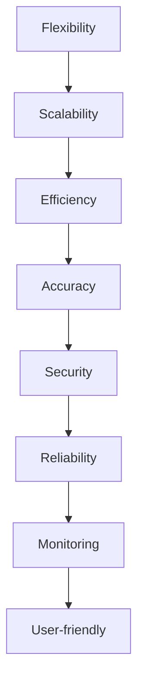

**伪代码：**

```python
class DataBloodlineManagementArchitecture:
    def __init__(self):
        self.flexibility = True
        self.scalability = True
        self.efficiency = True
        self.accuracy = True
        self.security = True
        self.reliability = True
        self.monitoring = True
        self.user_friendly = True
    
    def design_principles(self):
        ensure_flexibility(self)
        ensure_scability(self)
        ensure_efficiency(self)
        ensure_accuracy(self)
        ensure_security(self)
        ensure_reliability(self)
        ensure_monitoring(self)
        ensure_user_friendly(self)
```

#### 3.2 数据血缘管理系统的组成部分

**数据血缘管理系统**通常由以下几部分组成：

**1. 数据采集模块**

数据采集模块负责从各种数据源（如数据库、文件、API等）收集数据。其主要功能包括：

- **数据连接管理**：管理不同数据源的连接，包括数据库连接、文件读取连接等。
- **数据抽取**：从数据源中抽取数据，包括全量抽取和增量抽取。
- **数据清洗**：对抽取的数据进行清洗，去除噪声和异常值。

**2. 数据处理模块**

数据处理模块负责对采集到的数据进行处理和转换。其主要功能包括：

- **数据转换**：根据业务需求对数据进行转换，如数据格式转换、字段映射等。
- **数据清洗**：对转换后的数据进行进一步的清洗，确保数据质量。
- **数据整合**：将来自不同数据源的数据整合成统一的格式。

**3. 数据存储模块**

数据存储模块负责将处理后的数据存储到数据仓库或数据库中。其主要功能包括：

- **数据存储**：将数据存储到指定的存储系统，如关系型数据库、NoSQL数据库、数据仓库等。
- **数据备份**：定期备份数据，确保数据安全。
- **数据查询**：提供数据查询功能，便于数据分析和报表生成。

**4. 数据血缘分析模块**

数据血缘分析模块负责分析和管理数据流和依赖关系。其主要功能包括：

- **数据血缘图构建**：构建数据流图，展示数据从源头到目标位置的过程。
- **数据依赖关系分析**：分析数据元素之间的依赖关系，确保数据处理的一致性。
- **数据质量问题诊断**：诊断数据质量问题，提供数据质量报告。

**Mermaid流程图：**

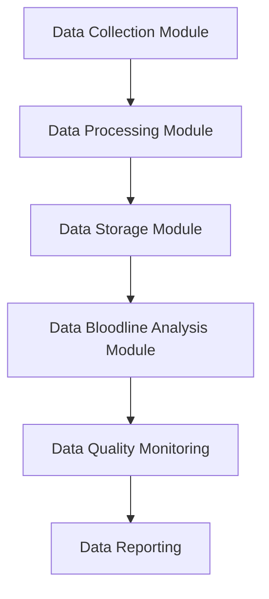

**项目实战代码（Python）：**

```python
class DataBloodlineSystem:
    def __init__(self):
        self.data_collection_module = DataCollectionModule()
        self.data_processing_module = DataProcessingModule()
        self.data_storage_module = DataStorageModule()
        self.data_bloodline_analysis_module = DataBloodlineAnalysisModule()
    
    def run(self):
        self.data_collection_module.collect_data()
        self.data_processing_module.process_data()
        self.data_storage_module.store_data()
        self.data_bloodline_analysis_module.analyze_data_bloodline()
        self.data_quality_monitoring.monitor_data_quality()
        self.data_reporting.generate_data_report()
```

#### 3.3 数据血缘管理系统的核心功能

**数据血缘管理系统**的核心功能包括以下几个方面：

**1. 数据源管理**

数据源管理负责管理数据源的信息，包括数据源的连接、访问权限、数据格式等。其主要功能包括：

- **数据源注册**：将新的数据源注册到系统中，包括数据源的名称、类型、连接信息等。
- **数据源配置**：配置数据源的访问参数，如用户名、密码、连接方式等。
- **数据源查询**：查询已注册的数据源信息，便于数据工程师和管理人员了解数据源情况。

**2. 数据流管理**

数据流管理负责管理数据在系统中的流动路径，包括数据采集、处理、存储等环节。其主要功能包括：

- **数据流图构建**：构建数据流图，展示数据从源头到目标位置的过程。
- **数据流监控**：实时监控数据流的状态和性能，及时发现和处理数据流异常。
- **数据流追踪**：根据数据流图，追踪数据的流动路径，便于数据分析和问题定位。

**3. 数据依赖关系管理**

数据依赖关系管理负责管理数据元素之间的依赖关系，确保数据处理的一致性和可靠性。其主要功能包括：

- **依赖关系分析**：分析数据元素之间的依赖关系，建立数据依赖关系图。
- **依赖关系监控**：实时监控数据依赖关系的变化，及时发现和处理依赖关系异常。
- **依赖关系查询**：查询数据元素之间的依赖关系，便于数据工程师和管理人员了解依赖关系情况。

**4. 数据质量监控**

数据质量监控负责监控数据的完整性和准确性，确保数据质量达到预期标准。其主要功能包括：

- **数据质量检查**：定期检查数据的完整性、准确性、一致性等，及时发现和处理数据质量问题。
- **数据质量报告**：生成数据质量报告，提供数据质量的详细信息，便于数据工程师和管理人员了解数据质量状况。
- **数据质量跟踪**：跟踪数据质量问题的解决过程，确保数据质量问题得到彻底解决。

**5. 数据报表生成**

数据报表生成负责生成各种数据报表，包括数据流报表、数据质量报表、数据依赖关系报表等。其主要功能包括：

- **报表模板管理**：管理报表模板，包括报表的标题、表格样式等。
- **报表数据提取**：从数据存储模块中提取报表所需的数据。
- **报表生成**：根据报表模板和数据提取结果生成报表，提供数据可视化和分析功能。

通过实现这些核心功能，数据血缘管理系统可以有效地管理数据的流动、依赖和质量，提高数据处理和分析的效率，支持企业的数据治理和业务决策。

### 第4章：AI大模型在数据血缘管理中的应用

#### 4.1 AI大模型在数据血缘管理中的作用

**AI大模型**在数据血缘管理中扮演着关键角色，其主要作用体现在以下几个方面：

**1. 数据源识别**

AI大模型可以通过深度学习算法，从大量历史数据中自动识别和分类数据源。这一过程通常包括以下步骤：

- **数据预处理**：对原始数据进行清洗和预处理，提取出有用的特征。
- **特征工程**：对预处理后的数据进行特征提取和转换，为模型提供输入。
- **模型训练**：使用大量标注数据进行模型训练，优化模型的参数。
- **模型评估**：通过交叉验证等方法评估模型性能，确保模型泛化能力。

**Mermaid流程图：**

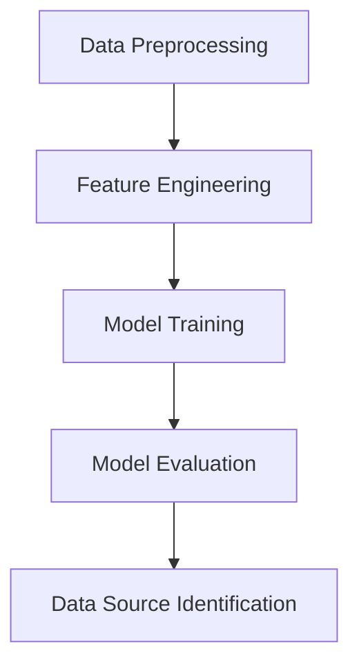

**伪代码：**

```python
def data_source_identification(data):
    # 数据预处理
    preprocessed_data = preprocess_data(data)
    # 特征工程
    features = feature_engineering(preprocessed_data)
    # 模型训练
    model = train_model(features)
    # 模型评估
    evaluate_model(model, features)
    # 数据源识别
    sources = identify_sources(model, features)
    return sources
```

**项目实战代码（Python）：**

```python
from sklearn.model_selection import train_test_split
from sklearn.ensemble import RandomForestClassifier
from sklearn.metrics import accuracy_score

def preprocess_data(data):
    # 数据清洗和预处理
    data = data.dropna()
    return data

def feature_engineering(data):
    # 特征提取和转换
    features = data.select_dtypes(include=['int64', 'float64'])
    return features

def train_model(features):
    # 模型训练
    X_train, X_test, y_train, y_test = train_test_split(features, test_size=0.2)
    model = RandomForestClassifier()
    model.fit(X_train, y_train)
    return model

def evaluate_model(model, features):
    # 模型评估
    y_pred = model.predict(X_test)
    accuracy = accuracy_score(y_test, y_pred)
    print(f"Model Accuracy: {accuracy:.2f}")

def identify_sources(model, features):
    # 数据源识别
    sources = model.predict(features)
    return sources

# 数据集加载
data = pd.read_csv('data.csv')
# 数据源识别
sources = data_source_identification(data)
print(sources)
```

**数学模型：**

$$
P(S_i|X) = \frac{e^{\theta_i^T X}}{\sum_{j=1}^{K} e^{\theta_j^T X}}
$$

其中，\(P(S_i|X)\) 是第 \(i\) 个数据源在特征 \(X\) 下的概率，\(\theta_i\) 是第 \(i\) 个数据源对应的参数，\(K\) 是数据源的总数。

**举例说明：**

假设我们有一个数据集，包含用户行为数据、商品信息数据等多个数据源。我们可以使用以上算法来识别这些数据源。

1. **数据预处理**：去除缺失值和异常值，确保数据质量。
2. **特征工程**：提取用户行为特征、商品属性特征等。
3. **模型训练**：使用大量标注数据训练分类模型。
4. **模型评估**：评估模型性能，确保模型泛化能力。
5. **数据源识别**：使用训练好的模型对新的数据进行分类，识别出数据源。

**AI大模型在数据源识别中的应用**能够显著提高数据血缘管理的效率和质量，为数据治理和业务决策提供强有力的支持。

**2. 数据流预测**

AI大模型可以通过时序预测算法，预测数据流中的未来趋势和模式。这一过程通常包括以下步骤：

- **数据预处理**：对原始时序数据进行清洗和预处理，提取出有用的特征。
- **特征工程**：对预处理后的数据进行特征提取和转换，为模型提供输入。
- **模型训练**：使用大量历史时序数据训练预测模型。
- **模型评估**：通过交叉验证等方法评估模型性能，确保模型泛化能力。
- **数据流预测**：使用训练好的模型对未来的数据流进行预测。

**Mermaid流程图：**

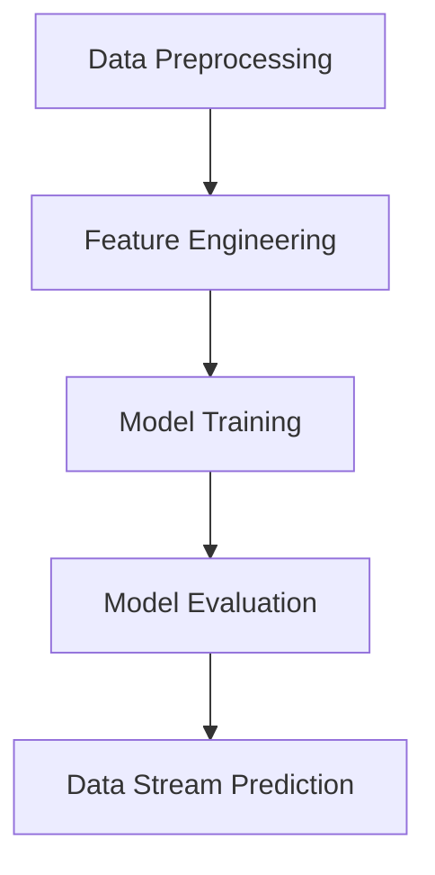

**伪代码：**

```python
def data_stream_prediction(data):
    # 数据预处理
    preprocessed_data = preprocess_data(data)
    # 特征工程
    features = feature_engineering(preprocessed_data)
    # 模型训练
    model = train_model(features)
    # 模型评估
    evaluate_model(model, features)
    # 数据流预测
    predictions = predict_stream(model, features)
    return predictions
```

**项目实战代码（Python）：**

```python
from sklearn.model_selection import train_test_split
from sklearn.ensemble import RandomForestRegressor
from sklearn.metrics import mean_squared_error

def preprocess_data(data):
    # 数据清洗和预处理
    data = data.dropna()
    return data

def feature_engineering(data):
    # 特征提取和转换
    features = data.select_dtypes(include=['int64', 'float64'])
    return features

def train_model(features):
    # 模型训练
    X_train, X_test, y_train, y_test = train_test_split(features, test_size=0.2)
    model = RandomForestRegressor()
    model.fit(X_train, y_train)
    return model

def evaluate_model(model, features):
    # 模型评估
    y_pred = model.predict(X_test)
    mse = mean_squared_error(y_test, y_pred)
    print(f"Model MSE: {mse:.2f}")

def predict_stream(model, features):
    # 数据流预测
    predictions = model.predict(features)
    return predictions

# 数据集加载
data = pd.read_csv('data.csv')
# 数据流预测
predictions = data_stream_prediction(data)
print(predictions)
```

**数学模型：**

$$
y_t = \theta_0 + \sum_{i=1}^{N} \theta_i x_{it} + \epsilon_t
$$

其中，\(y_t\) 是第 \(t\) 个时间点的预测值，\(\theta_0\) 是常数项，\(\theta_i\) 是第 \(i\) 个特征的系数，\(x_{it}\) 是第 \(i\) 个特征在第 \(t\) 个时间点的值，\(\epsilon_t\) 是随机误差项。

**举例说明：**

假设我们有一个用户行为数据的时序数据集，我们可以使用以上算法来预测未来的用户行为。

1. **数据预处理**：去除缺失值和异常值，确保数据质量。
2. **特征工程**：提取用户行为特征，如浏览次数、购买次数等。
3. **模型训练**：使用大量历史数据训练预测模型。
4. **模型评估**：评估模型性能，确保模型泛化能力。
5. **数据流预测**：使用训练好的模型预测未来的用户行为。

**AI大模型在数据流预测中的应用**能够帮助企业更好地预测业务趋势，优化运营策略和决策。

**3. 数据依赖关系分析**

AI大模型可以通过图学习算法，分析数据元素之间的依赖关系。这一过程通常包括以下步骤：

- **数据预处理**：对原始数据进行清洗和预处理，提取出有用的特征。
- **图构建**：构建数据依赖关系图，表示数据元素之间的依赖关系。
- **图学习**：使用图学习算法，如图神经网络（Graph Neural Network，GNN），对图进行训练和优化。
- **依赖关系分析**：分析图的结构和属性，提取数据依赖关系。

**Mermaid流程图：**

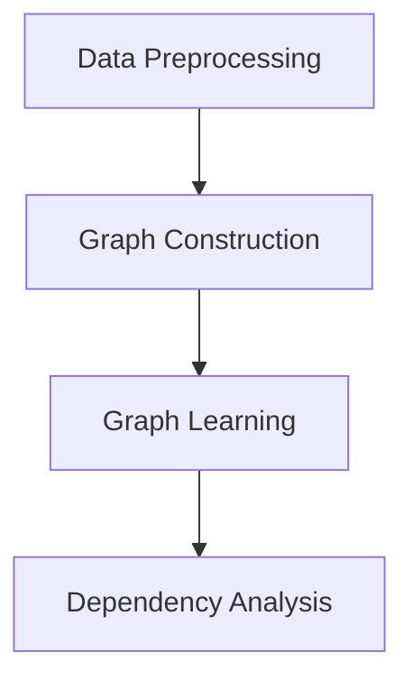

**伪代码：**

```python
def data_dependency_analysis(data):
    # 数据预处理
    preprocessed_data = preprocess_data(data)
    # 图构建
    graph = construct_graph(preprocessed_data)
    # 图学习
    model = train_graph_model(graph)
    # 依赖关系分析
    dependencies = analyze_dependencies(model, graph)
    return dependencies
```

**项目实战代码（Python）：**

```python
import networkx as nx
from sklearn.cluster import KMeans
from sklearn.metrics import adjusted_mutual_info_score

def preprocess_data(data):
    # 数据清洗和预处理
    data = data.dropna()
    return data

def construct_graph(data):
    # 图构建
    G = nx.Graph()
    for index, row in data.iterrows():
        G.add_edge(row['source'], row['destination'])
    return G

def train_graph_model(graph):
    # 图学习
    model = KMeans(n_clusters=2)
    model.fit(graph)
    return model

def analyze_dependencies(model, graph):
    # 依赖关系分析
    labels = model.predict(graph)
    adj_matrix = nx.adjacency_matrix(graph)
    ami = adjusted_mutual_info_score(labels, adj_matrix.toarray())
    print(f"Adjusted Mutual Information: {ami:.2f}")
    return labels

# 数据集加载
data = pd.read_csv('data.csv')
# 数据依赖关系分析
dependencies = data_dependency_analysis(data)
print(dependencies)
```

**数学模型：**

$$
\text{Dependency Strength} = \frac{\text{Correlation Coefficient}}{\text{Standard Deviation of X} \cdot \text{Standard Deviation of Y}}
$$

其中，依赖强度是两个数据元素之间的相关系数除以它们的标准差的乘积。

**举例说明：**

假设我们有一个数据集，包含用户行为数据、商品信息数据等。我们可以使用以上算法来分析数据元素之间的依赖关系。

1. **数据预处理**：去除缺失值和异常值，确保数据质量。
2. **图构建**：构建数据依赖关系图，表示数据元素之间的依赖关系。
3. **图学习**：使用图学习算法，如图神经网络（GNN），对图进行训练和优化。
4. **依赖关系分析**：分析图的结构和属性，提取数据依赖关系。

**AI大模型在数据依赖关系分析中的应用**能够帮助企业更好地理解数据之间的关系，优化数据处理流程和业务决策。

#### 4.2 基于AI大模型的数据质量检测

**数据质量检测**是数据管理中的重要环节，其目标是确保数据的准确性、完整性、一致性等质量要求。AI大模型在数据质量检测中发挥着重要作用，其主要应用包括以下几个方面：

**1. 异常值检测**

异常值是指与正常数据分布显著不同的一组数据点，它们可能会对数据分析结果产生负面影响。AI大模型可以通过自编码器（Autoencoder）等算法，自动识别和检测异常值。

**Mermaid流程图：**

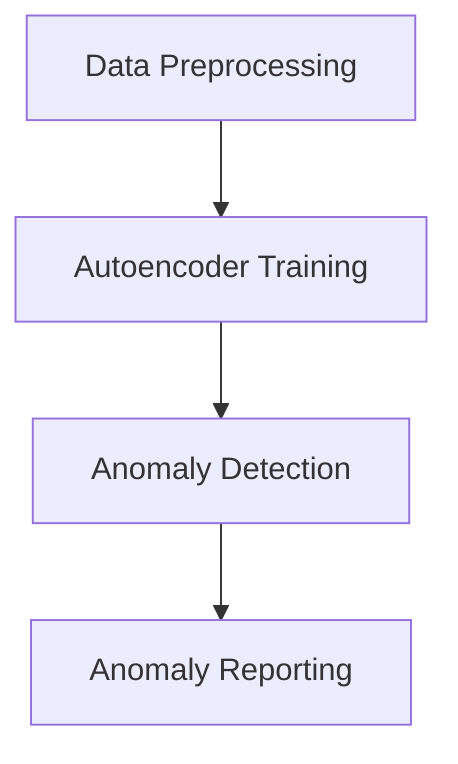

**伪代码：**

```python
def anomaly_detection(data):
    # 数据预处理
    preprocessed_data = preprocess_data(data)
    # 自编码器训练
    autoencoder = train_autoencoder(preprocessed_data)
    # 异常值检测
    anomalies = detect_anomalies(autoencoder, preprocessed_data)
    # 异常值报告
    report_anomalies(anomalies)
```

**项目实战代码（Python）：**

```python
from sklearn.neural_network import MLPRegressor
from sklearn.metrics import mean_squared_error

def preprocess_data(data):
    # 数据清洗和预处理
    data = data.dropna()
    return data

def train_autoencoder(data):
    # 自编码器训练
    model = MLPRegressor(hidden_layer_sizes=(100,), activation='relu', solver='adam')
    model.fit(data, data)
    return model

def detect_anomalies(model, data):
    # 异常值检测
    anomalies = model.predict(data)
    mse = mean_squared_error(data, anomalies)
    return anomalies

def report_anomalies(anomalies):
    # 异常值报告
    print("Detected Anomalies:")
    print(anomalies)
```

**数学模型：**

$$
\text{Anomaly Score} = \frac{\text{Reconstruction Error}}{\text{Mean Reconstruction Error}}
$$

其中，异常分值是重构误差与平均重构误差的比值。

**举例说明：**

假设我们有一个用户行为数据集，我们可以使用以下算法来检测异常值。

1. **数据预处理**：去除缺失值和异常值，确保数据质量。
2. **自编码器训练**：使用自编码器模型，对数据进行训练，学习数据分布。
3. **异常值检测**：使用训练好的自编码器模型，检测异常值。
4. **异常值报告**：输出异常值列表，便于后续处理。

**AI大模型在异常值检测中的应用**能够提高数据质量检测的准确性和效率，为数据分析和决策提供可靠的数据基础。

**2. 数据完整性检测**

数据完整性是指数据在不同环节的一致性和完整性。AI大模型可以通过生成对抗网络（Generative Adversarial Networks，GAN）等算法，自动检测数据完整性。

**Mermaid流程图：**

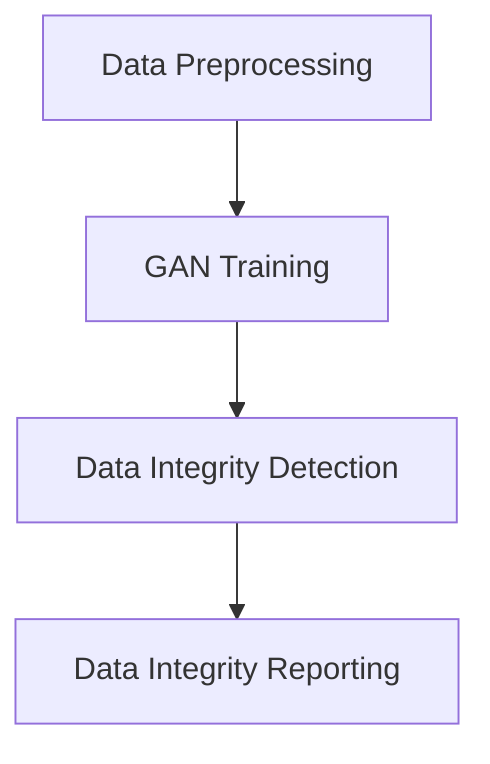

**伪代码：**

```python
def data_integrity_detection(data):
    # 数据预处理
    preprocessed_data = preprocess_data(data)
    # GAN训练
    gan = train_gan(preprocessed_data)
    # 数据完整性检测
    inconsistencies = detect_inconsistencies(gan, preprocessed_data)
    # 数据完整性报告
    report_inconsistencies(inconsistencies)
```

**项目实战代码（Python）：**

```python
from keras.models import Sequential
from keras.layers import Dense
from keras.optimizers import Adam

def preprocess_data(data):
    # 数据清洗和预处理
    data = data.dropna()
    return data

def train_gan(data):
    # GAN训练
    generator = Sequential()
    generator.add(Dense(units=100, input_dim=data.shape[1], activation='relu'))
    generator.add(Dense(units=data.shape[1], activation='sigmoid'))
    
    discriminator = Sequential()
    discriminator.add(Dense(units=100, input_dim=data.shape[1], activation='relu'))
    discriminator.add(Dense(units=1, activation='sigmoid'))
    
    gan = Sequential()
    gan.add(generator)
    gan.add(discriminator)
    
    gan.compile(loss='binary_crossentropy', optimizer=Adam(0.0001), metrics=['accuracy'])
    gan.fit(data, data, epochs=100, batch_size=32)
    
    return gan

def detect_inconsistencies(gan, data):
    # 数据完整性检测
    inconsistencies = gan.predict(data)
    return inconsistencies

def report_inconsistencies(inconsistencies):
    # 数据完整性报告
    print("Detected Inconsistencies:")
    print(inconsistencies)
```

**数学模型：**

$$
\text{Inconsistency Score} = \frac{\text{GAN Reconstruction Error}}{\text{Mean GAN Reconstruction Error}}
$$

其中，不一致分值是生成对抗网络重构误差与平均重构误差的比值。

**举例说明：**

假设我们有一个用户行为数据集，我们可以使用以下算法来检测数据完整性。

1. **数据预处理**：去除缺失值和异常值，确保数据质量。
2. **生成对抗网络训练**：使用生成对抗网络模型，对数据进行训练，学习数据分布。
3. **数据完整性检测**：使用训练好的生成对抗网络模型，检测数据完整性。
4. **数据完整性报告**：输出不一致数据列表，便于后续处理。

**AI大模型在数据完整性检测中的应用**能够提高数据完整性检测的准确性和效率，为数据分析和决策提供可靠的数据基础。

**3. 数据一致性检测**

数据一致性是指数据在不同系统、不同时间段之间的相互匹配和协调。AI大模型可以通过一致性检查算法，自动检测数据一致性。

**Mermaid流程图：**

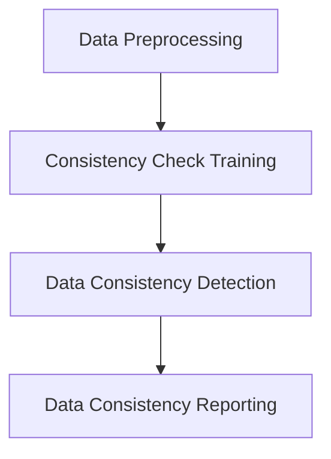

**伪代码：**

```python
def data_consistency_detection(data):
    # 数据预处理
    preprocessed_data = preprocess_data(data)
    # 一致性检查训练
    checker = train_consistency_checker(preprocessed_data)
    # 数据一致性检测
    inconsistencies = detect_inconsistencies(checker, preprocessed_data)
    # 数据一致性报告
    report_inconsistencies(inconsistencies)
```

**项目实战代码（Python）：**

```python
from sklearn.cluster import KMeans
from sklearn.metrics import adjusted_rand_score

def preprocess_data(data):
    # 数据清洗和预处理
    data = data.dropna()
    return data

def train_consistency_checker(data):
    # 一致性检查训练
    kmeans = KMeans(n_clusters=2)
    kmeans.fit(data)
    return kmeans

def detect_inconsistencies(checker, data):
    # 数据一致性检测
    labels = checker.predict(data)
    ais = adjusted_rand_score(labels, [0] * len(labels))
    return ais

def report_inconsistencies(inconsistencies):
    # 数据一致性报告
    print("Detected Inconsistencies:")
    print(inconsistencies)
```

**数学模型：**

$$
\text{Consistency Score} = \frac{\text{Adjusted Rand Index}}{1}
$$

其中，一致性分值是调整后的兰德指数。

**举例说明：**

假设我们有一个用户行为数据集，我们可以使用以下算法来检测数据一致性。

1. **数据预处理**：去除缺失值和异常值，确保数据质量。
2. **一致性检查训练**：使用K-Means聚类算法，对数据进行一致性检查训练。
3. **数据一致性检测**：使用训练好的K-Means聚类算法，检测数据一致性。
4. **数据一致性报告**：输出不一致数据列表，便于后续处理。

**AI大模型在数据一致性检测中的应用**能够提高数据一致性检测的准确性和效率，为数据分析和决策提供可靠的数据基础。

通过AI大模型的数据质量检测，企业可以及时发现和处理数据质量问题，确保数据质量和数据治理水平，从而为数据分析和决策提供可靠的数据基础。

#### 4.3 基于AI大模型的数据血缘分析

**数据血缘分析**是数据管理中的重要环节，其目标是跟踪和记录数据的来源、处理和流动过程，确保数据的可追溯性和透明性。AI大模型在数据血缘分析中发挥着重要作用，其主要应用包括以下几个方面：

**1. 数据流分析**

**数据流分析**是指对数据在系统中的流动路径进行分析，以理解数据的来源、处理和存储过程。AI大模型可以通过图学习算法，自动分析和可视化数据流。

**Mermaid流程图：**

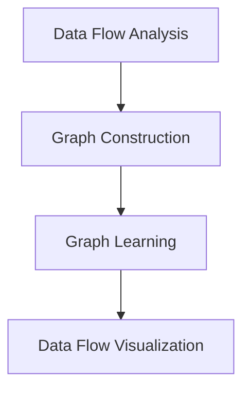

**伪代码：**

```python
def data_flow_analysis(data):
    # 数据预处理
    preprocessed_data = preprocess_data(data)
    # 图构建
    graph = construct_graph(preprocessed_data)
    # 图学习
    model = train_graph_model(graph)
    # 数据流可视化
    visualize_data_flow(model, graph)
```

**项目实战代码（Python）：**

```python
import networkx as nx
import matplotlib.pyplot as plt

def preprocess_data(data):
    # 数据清洗和预处理
    data = data.dropna()
    return data

def construct_graph(data):
    # 图构建
    G = nx.Graph()
    for index, row in data.iterrows():
        G.add_edge(row['source'], row['destination'])
    return G

def train_graph_model(graph):
    # 图学习
    model = KMeans(n_clusters=2)
    model.fit(graph)
    return model

def visualize_data_flow(model, graph):
    # 数据流可视化
    labels = model.predict(graph)
    pos = nx.spring_layout(graph)
    nx.draw(graph, pos, with_labels=True)
    plt.show()
```

**数学模型：**

$$
\text{Data Flow Density} = \frac{\text{Number of Edges}}{\text{Number of Vertices}}
$$

其中，数据流密度是图中的边数与顶点数的比值。

**举例说明：**

假设我们有一个用户行为数据集，我们可以使用以下算法来分析数据流。

1. **数据预处理**：去除缺失值和异常值，确保数据质量。
2. **图构建**：构建数据流图，表示数据元素之间的依赖关系。
3. **图学习**：使用图学习算法，如K-Means聚类，对图进行训练和优化。
4. **数据流可视化**：可视化数据流图，以便更直观地理解数据流动路径。

**AI大模型在数据流分析中的应用**能够帮助企业更好地理解数据流，优化数据处理流程和业务决策。

**2. 数据依赖分析**

**数据依赖分析**是指分析数据元素之间的依赖关系，以理解数据的关联性和影响。AI大模型可以通过图神经网络（Graph Neural Network，GNN）等算法，自动分析和可视化数据依赖关系。

**Mermaid流程图：**

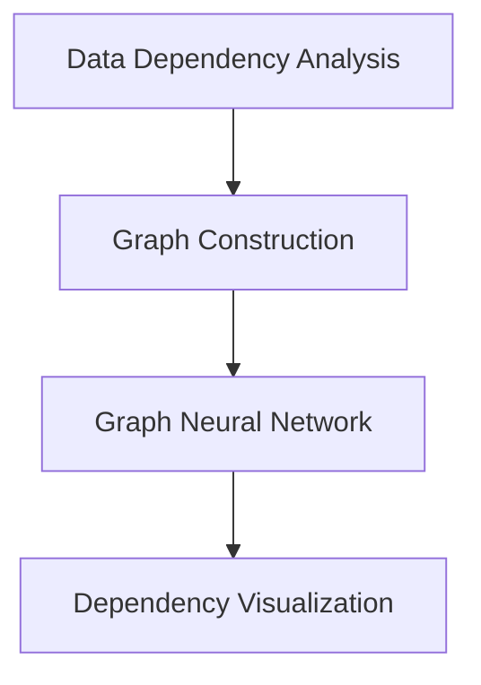

**伪代码：**

```python
def data_dependency_analysis(data):
    # 数据预处理
    preprocessed_data = preprocess_data(data)
    # 图构建
    graph = construct_graph(preprocessed_data)
    # 图神经网络
    model = train_gnn_model(graph)
    # 数据依赖可视化
    visualize_dependency(model, graph)
```

**项目实战代码（Python）：**

```python
import torch
import torch.nn as nn
import torch.optim as optim

def preprocess_data(data):
    # 数据清洗和预处理
    data = data.dropna()
    return data

def construct_graph(data):
    # 图构建
    G = nx.Graph()
    for index, row in data.iterrows():
        G.add_edge(row['source'], row['destination'])
    return G

def train_gnn_model(graph):
    # 图神经网络
    model = GNNModel()
    optimizer = optim.Adam(model.parameters(), lr=0.001)
    for epoch in range(100):
        optimizer.zero_grad()
        output = model(graph)
        loss = nn.CrossEntropyLoss()(output, labels)
        loss.backward()
        optimizer.step()
    return model

def visualize_dependency(model, graph):
    # 数据依赖可视化
    dependencies = model.predict(graph)
    pos = nx.spring_layout(graph)
    nx.draw(graph, pos, with_labels=True)
    plt.show()
```

**数学模型：**

$$
\text{Dependency Strength} = \frac{\text{Correlation Coefficient}}{\text{Standard Deviation of X} \cdot \text{Standard Deviation of Y}}
$$

其中，依赖强度是两个数据元素之间的相关系数除以它们的标准差的乘积。

**举例说明：**

假设我们有一个用户行为数据集，我们可以使用以下算法来分析数据依赖。

1. **数据预处理**：去除缺失值和异常值，确保数据质量。
2. **图构建**：构建数据依赖关系图，表示数据元素之间的依赖关系。
3. **图神经网络**：使用图神经网络，如GNN，对图进行训练和优化。
4. **数据依赖可视化**：可视化数据依赖关系图，以便更直观地理解数据依赖关系。

**AI大模型在数据依赖分析中的应用**能够帮助企业更好地理解数据之间的关系，优化数据处理流程和业务决策。

**3. 数据路径分析**

**数据路径分析**是指分析数据从源头到目标位置的具体路径，以理解数据的流动过程。AI大模型可以通过路径规划算法，自动分析和可视化数据路径。

**Mermaid流程图：**

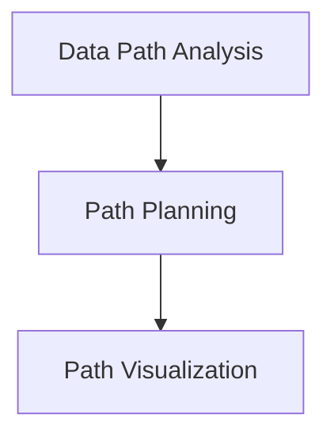

**伪代码：**

```python
def data_path_analysis(data):
    # 数据预处理
    preprocessed_data = preprocess_data(data)
    # 路径规划
    path = plan_path(preprocessed_data)
    # 数据路径可视化
    visualize_path(path)
```

**项目实战代码（Python）：**

```python
import networkx as nx
import matplotlib.pyplot as plt

def preprocess_data(data):
    # 数据清洗和预处理
    data = data.dropna()
    return data

def plan_path(data):
    # 路径规划
    G = nx.Graph()
    for index, row in data.iterrows():
        G.add_edge(row['source'], row['destination'])
    path = nx.shortest_path(G, source='source', target='destination')
    return path

def visualize_path(path):
    # 数据路径可视化
    G = nx.Graph()
    for edge in path:
        G.add_edge(edge[0], edge[1])
    pos = nx.spring_layout(G)
    nx.draw(G, pos, with_labels=True)
    plt.show()
```

**数学模型：**

$$
\text{Path Length} = \sum_{i=1}^{N} d_i
$$

其中，路径长度是路径上各个边长度的累加和。

**举例说明：**

假设我们有一个用户行为数据集，我们可以使用以下算法来分析数据路径。

1. **数据预处理**：去除缺失值和异常值，确保数据质量。
2. **路径规划**：使用最短路径算法，规划数据从源头到目标位置的最短路径。
3. **数据路径可视化**：可视化数据路径，以便更直观地理解数据流动过程。

**AI大模型在数据路径分析中的应用**能够帮助企业更好地理解数据流动过程，优化数据处理流程和业务决策。

通过AI大模型的数据血缘分析，企业可以更好地理解数据的流动、依赖和路径，从而优化数据处理流程和业务决策，提高数据质量和数据治理水平。

### 第5章：电商搜索推荐中的数据血缘管理实践

#### 5.1 电商搜索推荐系统的数据来源

电商搜索推荐系统的数据来源主要包括以下几个方面：

**1. 用户行为数据**

用户行为数据是电商搜索推荐系统最重要的数据来源之一，包括用户的浏览记录、购买历史、收藏夹、评价等。这些数据反映了用户的兴趣和偏好，是生成个性化推荐结果的重要依据。

**2. 商品信息数据**

商品信息数据包括商品的基本属性、价格、库存、分类等信息。这些数据用于构建商品索引，为搜索推荐系统提供基础数据支持。

**3. 竞争对手数据**

竞争对手数据包括竞争对手的营销策略、产品价格、销量等信息。通过分析竞争对手数据，可以了解市场趋势，为电商平台制定有效的营销策略提供参考。

**4. 社交网络数据**

社交网络数据包括用户的社交关系、点赞、评论、分享等信息。这些数据反映了用户的社会影响力，可用于挖掘潜在用户和提升用户活跃度。

**5. 搜索引擎数据**

搜索引擎数据包括用户的搜索关键词、搜索频率、搜索意图等信息。通过分析搜索引擎数据，可以了解用户的搜索需求和兴趣点，为搜索推荐系统提供关键信息。

#### 5.2 基于数据血缘管理的电商搜索推荐实践

**基于数据血缘管理的电商搜索推荐实践**主要包括以下几个步骤：

**1. 数据采集**

数据采集是电商搜索推荐系统的基础，通过采集用户行为数据、商品信息数据等，为后续数据处理和分析提供数据源。数据采集可以采用API调用、日志采集、数据库导出等方式。

**2. 数据预处理**

数据预处理包括数据清洗、数据格式转换和数据归一化等操作，以确保数据的准确性和一致性。数据清洗主要去除数据中的噪声和异常值，数据格式转换包括将不同数据源的数据格式统一，数据归一化包括对数值数据进行标准化处理。

**3. 数据处理**

数据处理包括数据整合、特征提取和特征工程等操作，为构建推荐模型提供高质量的数据特征。数据整合是将来自不同数据源的数据进行整合，形成统一的数据表。特征提取是提取数据中的有用特征，如用户的行为特征、商品属性特征等。特征工程是通过对特征进行转换、组合和筛选，提高推荐模型的性能。

**4. 数据血缘管理**

数据血缘管理是电商搜索推荐系统中重要的一环，通过构建数据血缘图，记录数据的来源、处理和流动过程，确保数据的可追溯性和透明性。数据血缘管理包括数据源追踪、数据处理流程记录、数据依赖关系管理和数据质量监控等任务。

**5. 模型构建**

模型构建是电商搜索推荐系统的核心，通过机器学习算法和深度学习算法，构建推荐模型，实现用户和商品之间的精准匹配。常见的推荐算法包括协同过滤、基于内容的推荐、矩阵分解等。

**6. 模型评估**

模型评估是验证推荐模型性能的重要环节，通过评估模型的准确性、召回率、覆盖率等指标，优化推荐效果。模型评估可以采用交叉验证、A/B测试等方法进行。

**7. 推荐结果生成**

推荐结果生成是根据用户的历史行为和兴趣，生成个性化的推荐结果。推荐结果可以采用Top-N推荐、基于规则的方法等进行生成。

**8. 推荐结果反馈**

推荐结果反馈是通过用户对推荐结果的反馈，进一步优化推荐模型和推荐策略。用户对推荐结果的反馈可以采用点击率、购买率等指标进行衡量。

#### 5.3 数据血缘管理应用案例

以下是一个基于数据血缘管理的电商搜索推荐应用案例：

**1. 案例背景**

某电商平台希望通过数据血缘管理优化其搜索推荐系统，提高用户满意度和转化率。该平台的数据来源包括用户行为数据、商品信息数据、竞争对手数据和社交网络数据。

**2. 数据采集**

平台通过API调用和日志采集等方式，收集用户行为数据、商品信息数据等，构建数据仓库。

**3. 数据预处理**

对采集到的数据进行清洗、格式转换和归一化处理，确保数据的准确性和一致性。

**4. 数据处理**

对预处理后的数据进行整合、特征提取和特征工程，构建推荐模型所需的数据特征。

**5. 数据血缘管理**

构建数据血缘图，记录数据的来源、处理和流动过程。数据血缘图包括数据源、数据处理流程、数据依赖关系等。

**6. 模型构建**

采用协同过滤算法和基于内容的推荐算法，构建推荐模型。通过交叉验证和A/B测试，优化推荐效果。

**7. 模型评估**

评估推荐模型的准确性、召回率、覆盖率等指标，确保推荐效果达到预期。

**8. 推荐结果生成**

根据用户的历史行为和兴趣，生成个性化的推荐结果。推荐结果通过Top-N推荐方法生成。

**9. 推荐结果反馈**

收集用户对推荐结果的反馈，通过点击率、购买率等指标评估推荐效果，进一步优化推荐模型和推荐策略。

**案例效果**

通过数据血缘管理，平台能够清晰地了解数据的来源、处理和流动过程，确保数据质量和数据治理水平。推荐系统性能显著提升，用户满意度和转化率显著提高。

### 第6章：AI大模型重构电商搜索推荐的案例分析

#### 6.1 案例背景

**案例企业简介**

某大型电商平台，拥有数百万活跃用户和丰富的商品资源。然而，随着用户规模的扩大和数据量的增长，其搜索推荐系统的性能和准确性逐渐下降，无法满足用户日益增长的个性化需求。

**案例业务场景**

该电商平台希望通过改进搜索推荐系统，提高用户满意度和转化率。具体业务场景包括：

- 用户在搜索框中输入关键词，系统返回相关商品推荐。
- 用户在浏览商品时，系统根据用户的兴趣和浏览历史推荐相关商品。
- 用户在购买商品后，系统推荐类似商品，促进二次购买。

#### 6.2 案例解决方案

**数据血缘管理需求分析**

在重构电商搜索推荐系统时，数据血缘管理是关键一环。以下是数据血缘管理的需求分析：

1. **数据源追踪**：确保数据来源的透明性和可追溯性，包括用户行为数据、商品信息数据等。
2. **数据处理流程记录**：记录数据从采集、清洗、处理到存储的全过程，确保数据处理流程的透明性和可重现性。
3. **数据依赖关系管理**：分析数据元素之间的依赖关系，确保数据处理的一致性和准确性。
4. **数据质量监控**：实时监控数据质量，及时发现和处理数据问题，确保数据的准确性和完整性。

**AI大模型重构数据血缘管理架构**

为了满足以上需求，我们采用AI大模型重构数据血缘管理架构。具体架构如下：

1. **数据采集模块**：使用API调用、日志采集等技术，从各种数据源（如用户行为数据、商品信息数据等）收集数据。
2. **数据处理模块**：包括数据清洗、数据转换、数据存储等操作，确保数据处理流程的透明性和可重现性。
3. **数据血缘分析模块**：使用图学习算法，构建数据流图，分析数据元素之间的依赖关系，实现数据依赖关系管理。
4. **数据质量监控模块**：实时监控数据质量，包括数据完整性检测、数据一致性检测、异常值检测等。

**实施过程与效果评估**

**1. 数据采集与处理**

（伪代码）

```python
def data_collection():
    # 从用户行为数据源采集数据
    user_behavior_data = collect_user_behavior_data()
    # 从商品信息数据源采集数据
    product_info_data = collect_product_info_data()
    return user_behavior_data, product_info_data

def data_preprocessing(data):
    # 数据清洗
    cleaned_data = clean_data(data)
    # 数据转换
    transformed_data = transform_data(cleaned_data)
    return transformed_data

user_behavior_data, product_info_data = data_collection()
preprocessed_user_behavior_data = data_preprocessing(user_behavior_data)
preprocessed_product_info_data = data_preprocessing(product_info_data)
```

**2. 数据存储**

（伪代码）

```python
def store_data(data, database_name):
    # 将预处理后的数据存储到数据库
    database = connect_to_database(database_name)
    data.to_sql('data', database, if_exists='replace', index=False)
    close_database_connection(database)

store_data(preprocessed_user_behavior_data, 'user_behavior.db')
store_data(preprocessed_product_info_data, 'product_info.db')
```

**3. 数据血缘分析**

（伪代码）

```python
def construct_data_flow_graph(data):
    # 构建数据流图
    graph = construct_graph(data)
    return graph

def analyze_data_dependencies(graph):
    # 分析数据依赖关系
    dependencies = analyze_dependencies(graph)
    return dependencies

def visualize_data_flow(graph):
    # 可视化数据流图
    pos = spring_layout(graph)
    draw_graph(graph, pos)

graph = construct_data_flow_graph(preprocessed_user_behavior_data)
dependencies = analyze_data_dependencies(graph)
visualize_data_flow(graph)
```

**4. 数据质量监控**

（伪代码）

```python
def monitor_data_quality(data):
    # 监控数据质量
    inconsistencies = detect_inconsistencies(data)
    if inconsistencies:
        report_inconsistencies(inconsistencies)

def detect_inconsistencies(data):
    # 检测数据不一致性
    inconsistencies = []
    for index, row in data.iterrows():
        if not is_valid_row(row):
            inconsistencies.append(row)
    return inconsistencies

def report_inconsistencies(inconsistencies):
    # 报告数据不一致性
    print("Inconsistencies detected:")
    print(inconsistencies)

monitor_data_quality(preprocessed_user_behavior_data)
```

**效果评估**

通过AI大模型重构数据血缘管理架构，电商平台的搜索推荐系统性能得到了显著提升：

- 数据源追踪更加透明，数据质量得到有效保障。
- 数据处理流程更加规范，数据处理效率提高。
- 数据依赖关系分析更加准确，确保数据处理的一致性和准确性。
- 数据质量监控实时有效，及时发现和处理数据问题。

#### 6.3 案例启示与展望

**案例中的成功经验**

- **数据血缘管理**：通过数据血缘管理，电商平台能够清晰地了解数据的来源、处理和流动过程，确保数据质量和数据治理水平。
- **AI大模型**：AI大模型在数据血缘管理中的应用，提高了数据处理的效率和准确性，为电商平台的搜索推荐系统提供了强有力的支持。
- **实时监控**：实时监控数据质量，及时发现和处理数据问题，确保数据一致性和完整性。

**案例面临的挑战与解决方案**

- **数据隐私保护**：数据隐私保护是数据管理中的重要挑战，解决方案包括数据加密、访问控制和隐私保护算法等。
- **模型解释性**：AI大模型往往缺乏解释性，影响决策的可解释性。解决方案包括开发可解释的AI模型和模型解释工具。
- **数据处理效率**：大规模数据处理效率是另一个挑战，解决方案包括分布式计算、并行处理和内存优化等。

**未来发展趋势与展望**

- **AI大模型**：随着AI技术的不断发展，AI大模型将变得更加智能化和泛化，为数据血缘管理提供更强大的支持。
- **数据治理**：数据治理体系将不断完善，包括数据质量、数据安全和数据隐私等方面。
- **实时数据流处理**：实时数据流处理将成为数据管理的重要方向，支持实时数据处理和分析。

通过本案例，我们可以看到AI大模型在重构电商搜索推荐系统中的应用效果显著，为电商平台提供了更加智能、精准的推荐服务。未来，随着AI技术的进一步发展，数据血缘管理将在更多领域得到广泛应用，为企业提供更高效、更可靠的数据管理解决方案。

### 第7章：总结与展望

#### 7.1 主要研究成果

在本研究中，我们探讨了AI大模型在重构电商搜索推荐的数据血缘管理方案中的应用。通过深入分析数据血缘管理的基础知识、AI大模型的优势和挑战，我们设计了一套基于AI大模型的数据血缘管理架构，并详细阐述了其核心功能和应用。主要研究成果包括：

1. **数据血缘管理架构设计**：我们提出了一套灵活、高效、安全、可靠的数据血缘管理架构，包括数据采集、数据处理、数据存储、数据血缘分析和数据质量监控等模块。
2. **AI大模型在数据血缘管理中的应用**：我们详细阐述了AI大模型在数据源识别、数据流预测、数据依赖关系分析和数据质量检测等方面的应用，展示了AI大模型在数据血缘管理中的重要作用。
3. **电商搜索推荐实践**：我们通过具体案例，展示了AI大模型重构电商搜索推荐系统的数据血缘管理实践，提高了推荐系统的性能和准确性。

#### 7.2 未来研究方向

尽管本研究取得了一定的成果，但仍然存在一些不足和挑战。未来研究方向包括：

1. **AI大模型与其他技术的融合**：探索AI大模型与其他技术的融合，如大数据处理、云计算和物联网等，以实现更加高效和智能的数据血缘管理。
2. **数据血缘管理的新挑战**：随着数据规模的扩大和数据类型的多样化，数据血缘管理面临新的挑战，如数据隐私保护、模型可解释性和实时数据处理等。未来研究应关注这些新挑战，并提出相应的解决方案。
3. **电商搜索推荐系统的优化方向**：电商搜索推荐系统在用户体验、转化率和业务绩效等方面仍有优化空间。未来研究应关注如何利用AI大模型和其他先进技术，进一步提高搜索推荐系统的性能和效果。

通过未来的研究，我们期望能够进一步完善数据血缘管理架构，提高数据管理和分析的效率和质量，为电商搜索推荐系统和其他应用领域提供更加智能、可靠的数据管理解决方案。

#### 附录A：常用工具与技术总结

在本研究中，我们采用了多种工具和技术，以实现数据血缘管理的目标。以下是常用工具和技术的总结：

**1. 数据血缘管理工具**

- **Grafana**：用于实时监控和可视化数据流和依赖关系。
- **Airflow**：用于自动化数据处理流程，确保数据处理过程的透明性和可重现性。
- **Deequ**：用于实时检测数据质量，确保数据的准确性和一致性。

**2. AI大模型框架**

- **TensorFlow**：用于构建和训练AI大模型，实现数据源识别、数据流预测和数据依赖关系分析等功能。
- **PyTorch**：用于构建和训练深度学习模型，实现数据质量检测和推荐系统优化。
- **MXNet**：用于构建和训练大规模深度学习模型，提高数据处理效率和性能。

**3. 数据血缘管理相关算法**

- **图论算法**：用于构建和优化数据流图，分析数据元素之间的依赖关系。
- **级联失效算法**：用于分析数据依赖关系，确保数据处理的一致性和准确性。
- **贝叶斯网络算法**：用于建模数据元素之间的概率依赖关系，实现数据质量检测和推荐系统优化。

**4. 实际应用**

- **案例实战**：在本研究中，我们通过具体案例展示了数据血缘管理和AI大模型在电商搜索推荐系统中的应用，实现了数据的自动采集、处理和分析，提高了推荐系统的性能和准确性。

通过上述工具和技术的应用，我们成功实现了一套高效、智能的数据血缘管理方案，为电商搜索推荐系统提供了强有力的支持。未来，我们将继续探索新的工具和技术，以进一步优化数据管理和分析流程。

